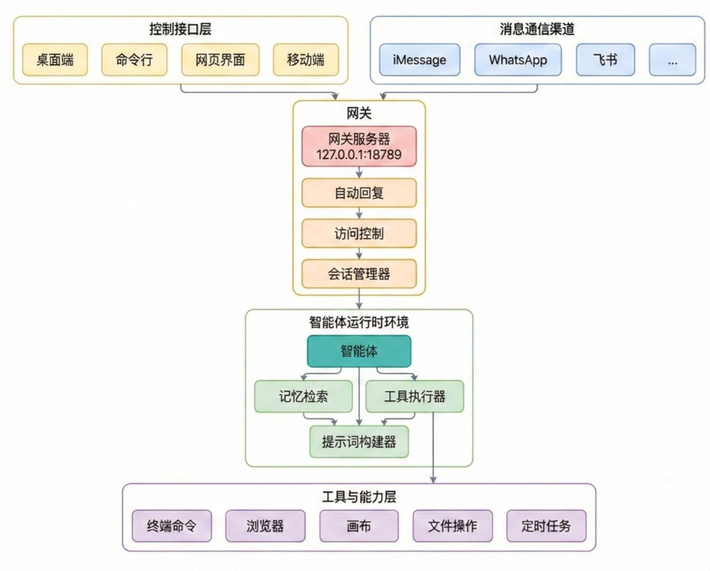

<h1 id="目录">目录</h1>

- [1.OpenClaw](#1.OpenClaw)
   - [1.OpenClaw的整体系统架构介绍](#1.OpenClaw的整体系统架构介绍)
   - [2.OpenClaw的核心组件有哪些？](#2.OpenClaw的核心组件有哪些？)

<h2 id='1.OpenClaw'>1.OpenClaw</h2>

<h3 id='1.OpenClaw的整体系统架构介绍'>1.OpenClaw的整体系统架构介绍</h3>

OpenClaw 采用**网关中心化的调度中心架构**，核心为**网关（Gateway）+智能体（Agent）** 两大模块，实现**消息通信、接口层与 AI 执行逻辑彻底解耦**，所有数据与调度逻辑均留存于用户本地设备，整体为**四层分层架构+插件化扩展体系**。
### 完整分层结构
1. **控制接口层**：桌面端、命令行、网页、移动端等操控入口；WhatsApp、Telegram、飞书、钉钉等消息通信渠道
2. **网关控制平台**：系统中枢，负责消息路由、访问控制、会话管理
3. **智能体运行时环境**：AI 执行核心，处理上下文组装、模型调用、工具执行、状态保存
4. **工具与能力层**：终端命令、浏览器、文件操作、定时任务等基础能力
5. **插件扩展层**：通过四类插件横向扩展功能，不修改核心代码

<h3 id='2.OpenClaw的核心组件有哪些？'>2.OpenClaw的核心组件有哪些？</h3>

1. **渠道适配器（Channel Adapter）**
对接各聊天平台，完成**身份验证、消息解析、访问控制、消息格式化**，抹平不同平台协议差异，输出统一消息格式。
2. **控制界面（Control Interface）**
提供四种操控方式：**网页 UI（127.0.0.1:18789）、命令行 CLI、macOS 菜单栏原生应用、iOS/Android 移动端**，实现多端统一管控。
3. **网关控制平台（Gateway）**
基于 Node.js 22+ 的 WebSocket 服务器，系统**核心调度中枢**；负责消息接收、路由、访问控制、会话管理，默认仅绑定本机地址，保障网络安全。
4. **智能体运行时（Agent Runtime）**
AI 执行核心引擎，每轮对话执行**四步流程**：确定会话→组装上下文→调用模型并执行工具→保存状态，是对话处理、工具调用、状态持久化的核心。
5. **插件系统**
四类插件实现开放扩展：**渠道插件、记忆插件、工具插件、模型提供商插件**，插件存放于 `extensions/` 目录，系统自动扫描加载。
6. **Canvas + A2UI**
独立可视化工作区服务（默认端口 18793），AI 可生成带交互的 HTML 界面，故障不影响主网关，支持多端渲染。
7. **记忆与存储组件**
包含**会话存储、记忆检索（SQLite+向量嵌入混合搜索）、配置文件、凭据管理**，全本地化存储与管理。
8. **安全组件**
包含**网络安全、身份验证与设备配对、渠道访问控制、Docker 工具沙箱、提示词注入防御**，多层保障系统安全。
