# 目录

## 第一章 Stable Diffusion 系列核心高频考点

[1.介绍一下Stable Diffusion的原理](#q-028)
  - [面试问题：Stable Diffusion 相比经典 Diffusion model 的核心优化是什么？](#q-029)
  - [面试问题：介绍一下 Stable Diffusion 的训练 / 推理过程（正向扩散过程和反向去噪过程）](#q-030)
  - [面试问题：介绍 Stable Diffusion 核心网络结构](#q-039)
  - [面试问题：Stable Diffusion 的优化策略有哪些？](#q-031)
  - [面试问题：介绍一下针对 Stable Diffusion 的模型融合技术](#q-033)
  - [面试问题：为什么相同 seed + 相同 prompt 在不同采样器 / 精度 / 框架下结果会有差异？工程上如何保证生成结果可复现？](#q-036a)
  - [面试问题：Stable Diffusion 中的 img2img（图生图）原理是什么？denoising strength 起到什么作用？](#q-040a)
  - [面试问题：Stable Diffusion 中的 Inpaint 和 Outpaint 分别是什么？](#q-040)

[2.介绍一下 Stable Diffusion 中 VAE 的架构、原理和作用](#q-041)
  - [面试问题：Stable Diffusion 模型中的 VAE 和单纯的 VAE 生成模型的区别是什么？](#q-044)
  - [面试问题：从 SD 1.x → SDXL → SD 3 → FLUX.1，VAE 在通道数、下采样率、训练目标上的演进路线是怎样的？](#q-044a)
  - [面试问题：VAE 编码后为什么要乘以 scale_factor？SD 各版本的 scale_factor 是如何确定的？](#q-044b)
  - [面试问题：VAE / Tokenizer / Latent 空间为什么会影响图像生成质量和训练效率？](#q-044e)
  - [面试问题：SDXL VAE 在 fp16 下出现"白图 / NaN"问题的原因是什么？工业上常见的修复方案有哪些？](#q-044c)
  - [面试问题：大分辨率推理时如何降低 VAE 解码显存？VAE Tiling 与 TAESD 各自的取舍是什么？](#q-044d)

[3.介绍一下 Stable Diffusion 中 Backbone 的架构、原理和作用](#q-045)
  - [面试问题：介绍一下 Stable Diffusion 中的自注意力机制和交叉注意力机制](#q-047)
  - [面试问题：为什么使用 U-Net 作为 Stable Diffusion 模型的核心架构？介绍一下 U-Net 架构](#q-049)
  - [面试问题：U-Net 与 DiT / MM-DiT 在 Backbone 设计哲学上的本质差异是什么？SD 系列从 U-Net 演进到 DiT 的根本原因是什么？](#q-049b)
  - [面试问题：SD Backbone 中 GroupNorm + SiLU + 残差连接的设计为何对训练稳定性很关键？换成 LayerNorm / BatchNorm 会有什么问题？](#q-049d)

[4.介绍一下 Stable Diffusion 中 Text Encoder 的架构、原理和作用](#q-050)
  - [面试问题：Text Encoder 和 VLM 条件编码器在图像生成模型中起什么作用？举例介绍一下 Stable Diffusion 模型进行文本编码的全过程](#q-051)
  - [面试问题：Negative Prompt 实现的原理是什么？](#q-053)
  - [面试问题：CLIP Text Encoder 的 77 tokens 长度限制对长 Prompt 的实际影响是什么？工程上如何突破（chunking、weighted prompt、T5 等长上下文编码器）？](#q-053a)
  - [面试问题：Prompt 中的权重语法（(word:1.2)、[word]）的实现原理是什么？A1111 / ComfyUI / Compel 三种 Prompt 解析方式有何差异？](#q-053b)
  - [面试问题：为什么 SD 1.x 选用 CLIP ViT-L 而 SD 2.x 切换为 OpenCLIP ViT-H？这一切换给生成效果带来了哪些可观察的差异？](#q-053d)
  - [面试问题：如何处理 Prompt 和生成的图像不对齐的问题？](#q-054)
  - [面试问题：扩散模型通常是如何引入各种控制条件的？](#q-055)

[5.Stable Diffusion XL 有哪些创新点？](#q-056)
  - [面试问题：Stable Diffusion XL 的 VAE 部分有哪些创新？详细分析改进意图](#q-058)
  - [面试问题：Stable Diffusion XL 的 Backbone 部分有哪些创新？详细分析改进意图](#q-059)
  - [面试问题：Stable Diffusion XL 的 Text Encoder 部分有哪些创新？详细分析改进意图](#q-060)
  - [面试问题：Stable Diffusion XL 中使用的训练方法有哪些创新点？](#q-061)
  - [面试问题：介绍一下 Stable Diffusion XL Turbo 的原理](#q-063)
  - [面试问题：什么是 SDXL Refiner？](#q-065)

[6.介绍一下 Stable Diffusion 3的原理和创新点](#q-066)
  - [面试问题：SD 3 的 VAE 部分有哪些创新？详细分析改进意图](#q-067)
  - [面试问题：SD 3 的 Backbone 部分有哪些创新？详细分析改进意图](#q-067a)
  - [面试问题：SD 3 的 Text Encoder 部分有哪些创新？详细分析改进意图](#q-067c)
  - [面试问题：训练 Stable Diffusion 过程中官方使用了哪些训练技巧？](#q-069)
  - [面试问题：Stable Diffusion 3.5 有哪些改进点？](#q-075)


## 第二章 FLUX系列核心高频考点

[1.介绍一下FLUX.1的原理，与Stable Diffusion 3相比有哪些创新点？](#q-flux-001)
  - [面试问题：FLUX.1 的 VAE 部分有哪些创新？详细分析改进意图](#q-flux-014)
  - [面试问题：FLUX.1 的 Backbone 部分有哪些创新？详细分析改进意图](#q-flux-015)
  - [面试问题：FLUX.1 的 Text Encoder 部分有哪些创新？详细分析改进意图](#q-flux-016)
  - [面试问题：FLUX.1在训练过程中使用了哪些优化技巧？](#q-flux-002)

[2.FLUX.1有哪些主流的变体与分支模型？介绍一下它们的核心原理](#q-flux-017)
  - [面试问题：介绍一下FLUX.1 Lite与FLUX.1的异同](#q-flux-005)
  - [面试问题：介绍一下FLUX.1 Kontext的原理，有哪些创新点？](#q-flux-006)
  - [面试问题：介绍一下FLUX.1 Krea的原理，有哪些创新点？](#q-flux-008)

[3.与FLUX.1相比，FLUX.2有哪些创新点？](#q-flux-013)
  - [面试问题：FLUX.2 相比 FLUX.1 的整体能力边界发生了哪些变化？](#q-flux-018)
  - [面试问题：FLUX.2 的 Text Encoder 为什么从 CLIP + T5-XXL 切换到 24B VLM？](#q-flux-019)
  - [面试问题：FLUX.2 的 DiT Backbone 有哪些结构与 Scaling 创新？](#q-flux-020)
  - [面试问题：FLUX.2 如何用四轴 RoPE 与注意力机制统一文生图和多参考图编辑？](#q-flux-021)
  - [面试问题：FLUX.2 的 VAE 如何权衡可学习性、重建质量与压缩率？](#q-flux-022)
  - [面试问题：FLUX.2 在训练、蒸馏和工程部署上有哪些变化？](#q-flux-023)


---

<h1 id="ch-02">第一章 Stable Diffusion 系列核心高频考点</h1>

<h1 id="q-028">1.介绍一下Stable Diffusion的原理</h1>

<h2 id="q-029">面试问题：Stable Diffusion 相比经典 Diffusion model 的核心优化是什么？</h2>

**难度评分：⭐⭐⭐ (3/5)  |  考察频率：⭐⭐⭐⭐⭐ (5/5)**

Rocky认为我们可以将Latent Diffusion Models（LDM）当作是一个开创性的通用算法模型框架，而Stable Diffusion是在此框架基础上，通过一系列工程技术优化后形成的、在开源社区大规模落地应用的成熟算法技术即产品的模型产品。

Stable Diffusion对原始LDM框架的具体改进主要体现在以下几个方面：

**工程化与稳定性优化**

1. 训练稳定性：通过改进噪声调度、梯度裁剪等训练技巧，减少了训练过程中出现模式崩溃或不稳定的风险，使模型更容易在大规模数据集上收敛。
2. 推理速度：在继承潜在空间高效性的基础上，持续优化去噪采样器的效率，并出现了像DeepCache、ToMe-SD、Xformer等专为SD设计的加速技术，进一步提升生成速度。

**模型架构与能力的增强**

1. 条件控制：虽然LDM框架能够支持文本条件作为输入，但编码文本信息的部分是一个随机初始化的Transformer模型；而Stable Diffusion通过一个预训练好的CLIP Text Encoder来编码文本信息，预训练过的模型往往要优于从零开始训练的模型，这个优化极大地提升了文本到图像的生成能力和语义遵循度。后续更衍生出LoRA、ControlNet等辅助模型，实现了对生成内容（如构图、姿态）的精细控制。
2. 生成质量与分辨率：通过在更大规模高质量数据上训练（Latent Diffusion Model是采用laion-400M数据训练的，而Stable Diffusion是在laion-2B-en数据集上训练的），同时Stable Diffusion的训练分辨率也更大（Latent Diffusion Model只是在256x256分辨率上训练，而Stable Diffusion先在256x256分辨率上预训练，然后再在512x512分辨率上进行微调训练），以及架构的持续迭代（如SDXL、SD3、FLUX.1、FLUX.2等），在图像细节、光影和分辨率上不断突破。

**开源生态与易用性**

这是Stable Diffusion产生巨大影响的关键。其开源策略催生了如ComfyUI、AUTOMATIC1111 WebUI等图形化界面工具，让普通用户也能轻松使用。庞大的开源社区贡献了海量的定制化模型、风格LoRA和实用AI绘画插件，使其从一个模型演变成一个功能极其丰富的AIGC图像创作生态系统。

简单来说，两者的关系可以概括为：Latent Diffusion Models (LDM) 是奠定核心思想的“论文”与“蓝图”；而Stable Diffusion (SD) 则是基于这张蓝图建造出的、不断升级的“摩天大楼”及围绕它形成的“繁荣城市”。


<h2 id="q-030">面试问题：介绍一下 Stable Diffusion 的训练 / 推理过程（正向扩散过程和反向去噪过程）</h2>

**难度评分：⭐⭐⭐⭐ (4/5)  |  考察频率：⭐⭐⭐⭐⭐ (5/5)**

Stable Diffusion 的训练与推理都围绕同一个核心目标展开：**在低维 Latent 隐空间中学习如何加噪和去噪，并用文本条件控制去噪方向**。训练阶段让 U-Net 学会预测不同噪声强度下的噪声残差；推理阶段再把这个能力反过来使用，从随机高斯噪声或加噪后的参考图出发，逐步还原图像 Latent Feature。

### 1. Stable Diffusion 的训练过程

Stable Diffusion 的完整训练逻辑可以概括为：

1. 从数据集中随机选择一组图像—文本样本；
2. 使用 VAE Encoder 将图像压缩为低维 Latent Feature；
3. 从噪声时间步中随机采样一个 timestep $t$，并向 Latent Feature 加入该强度的高斯噪声；
4. 使用 CLIP Text Encoder 将文本标签编码为 Text Embeddings；
5. 把 noisy latent、timestep 对应的 Time Embedding 和 Text Embeddings 输入 U-Net；
6. U-Net 通过 Cross-Attention 持续注入文本语义，并预测本次实际加入的噪声；
7. 计算预测噰声和真实噪声之间的回归损失，反向传播并更新 U-Net 参数。

<div align="center">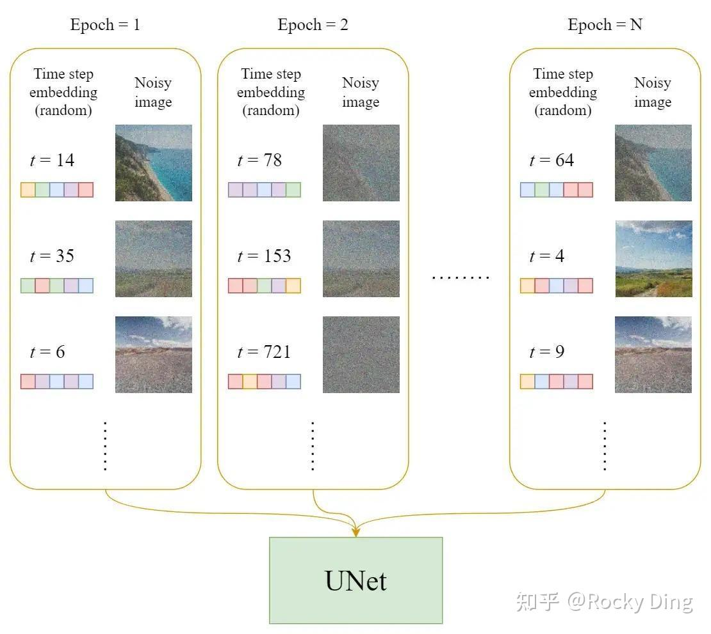</div>

每个样本只随机训练一个 timestep，并不意味着模型只学习某一个去噪阶段。随着 Epoch 不断迭代，同一图像会对应不同的噪声强度；在整个数据集和训练周期上，模型最终覆盖从接近原图到接近纯噪声的完整噪声分布。Time Embedding 则让同一个 U-Net 知道当前位于哪一个去噪阶段，从而根据噪声强度调整预测策略。

### 2. Stable Diffusion 的推理过程

文生图与图生图的主要区别只在于初始 Latent Feature 的来源：

- **文生图（txt2img）**：从随机高斯噪声 Latent 开始；
- **图生图（img2img）**：先用 VAE Encoder 把输入图像压缩成 Latent，再根据 denoising strength 加入一定量的噪声。

随后二者都会进入相同的反向去噪链路：CLIP Text Encoder 将 Prompt 编码为 Text Embeddings；U-Net 在每个 timestep 预测噪声残差，Scheduler 根据当前采样算法和时间步更新 Latent；经过多次迭代后，纯噪声逐渐减少，图像语义信息和文本语义信息逐渐增加；最后由 VAE Decoder 将去噪后的 Latent Feature 重建为像素级图像。

<div align="center">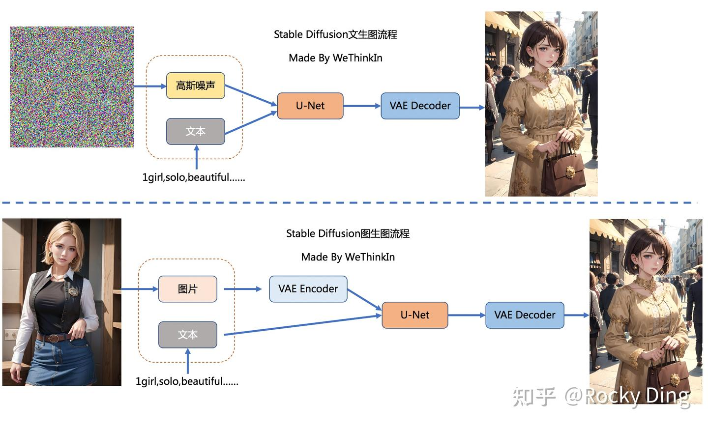</div>

面试中可以把完整链路收束为：**Prompt → CLIP Text Encoder → Text Embeddings；图像或高斯噪声 → Latent Feature；U-Net + Scheduler 在 Cross-Attention 条件下反复去噪；VAE Decoder 将最终 Latent 重建为图像。**

<h2 id="q-039">面试问题：介绍 Stable Diffusion 核心网络结构</h2>

**难度评分：⭐⭐⭐⭐ (4/5)  |  考察频率：⭐⭐⭐⭐⭐ (5/5)**

Stable Diffusion 整体上是一个端到端的 Latent Diffusion 系统，主要由 **VAE、U-Net、CLIP Text Encoder 和 Scheduler** 组成。其中 VAE 负责连接像素空间与 Latent 隐空间，CLIP Text Encoder 负责把自然语言转换成语义条件，U-Net 负责预测噪声残差，Scheduler 负责按照既定采样轨迹更新 Latent。

<div align="center">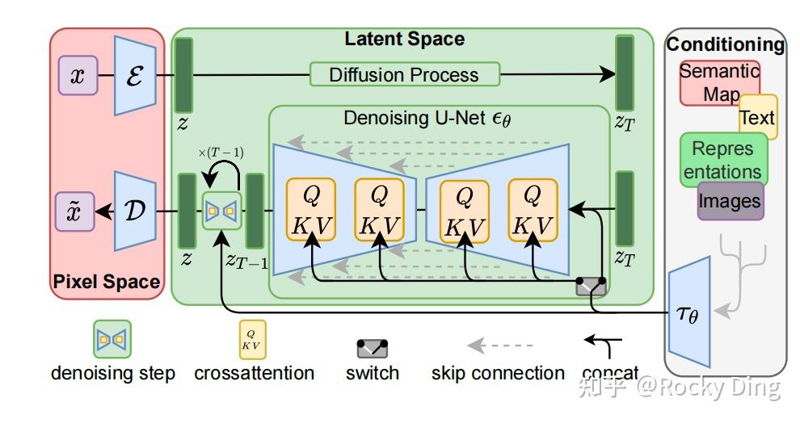</div>

1.CLIP：CLIP模型是一个基于对比学习的多模态模型，主要包含Text Encoder和Image Encoder两个模型。在Stable Diffusion中主要使用了Text Encoder部分。CLIP Text Encoder模型将输入的文本Prompt进行编码，转换成Text Embeddings（文本的语义信息），通过U-Net网络的CrossAttention模块嵌入Stable Diffusion中作为Condition条件，对生成图像的内容进行一定程度上的控制与引导。

2.VAE：基于Encoder-Decoder架构的生成模型。VAE的Encoder（编码器）结构能将输入图像转换为低维Latent特征，并作为U-Net的输入。VAE的Decoder（解码器）结构能将低维Latent特征重建还原成像素级图像。在Latent空间进行diffusion过程可以大大减少模型的计算量。对于 $512\times512$ 的图像，SD 1.x 通常把它压缩为 $4\times64\times64$ 的 Latent，使后续去噪过程避开高成本的像素空间计算。

3.U-Net：进行Stable Diffusion模型训练时，VAE部分和CLIP部分通常都是冻结的，主要训练U-Net的模型参数。U-Net结构能够预测噪声残差，并结合Sampling method对输入的特征进行重构，逐步将其从随机高斯噪声转化成图像的Latent Feature。训练损失函数与DDPM一致：

<div align="center">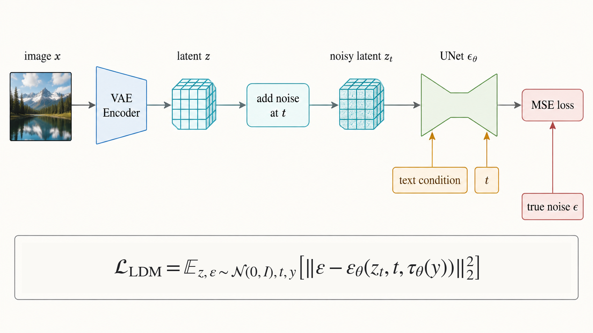</div>

4.Scheduler：Scheduler 本身通常没有需要学习的神经网络参数，但它决定每一步如何根据 U-Net 的输出更新 Latent。训练阶段常使用 DDPM 噪声调度，推理阶段则可以选择 DDIM、Euler、DPM++、UniPC 等采样方法，以不同的速度、随机性和数值轨迹完成反向去噪。

四个模块之间的职责边界非常清晰：**CLIP 决定“听懂什么”，U-Net 决定“如何去噪”，Scheduler 决定“沿什么轨迹去噪”，VAE 决定“以什么压缩表示学习并最终还原出什么细节”。**


<h2 id="q-031">面试问题：Stable Diffusion 的优化策略有哪些？</h2>

**难度评分：⭐⭐⭐⭐ (4/5)  |  考察频率：⭐⭐⭐⭐⭐ (5/5)**

### 1. 面试问题：Stable Diffusion 训练时为什么要为每个样本随机采样一个时间步？该采样策略对模型质量有什么影响？

Stable Diffusion 在每个训练 step 中，对一个 batch 内的每个样本**独立、均匀地**从 $\{1, 2, \dots, T\}$（通常 $T=1000$）中采样一个时间步 $t$，再用 $`x_t = \sqrt{\bar\alpha_t} x_0 + \sqrt{1-\bar\alpha_t}\epsilon`$ 一步加噪、预测噪声。这是 **Monte Carlo 估计变分下界（ELBO）** 的工程实现。

**1. 为什么要随机采样而不是顺序遍历**

- **理论上**：DDPM 的训练损失是对所有时间步 $t$ 求期望 $`\mathbb{E}_{t, x_0, \epsilon}[\|\epsilon - \epsilon_\theta(x_t, t)\|^2]`$，逐 step 随机采样是这个期望的无偏估计。
- **工程上**：若顺序遍历 $t$，模型在某段连续 step 内只学某个噪声水平，梯度方向被局部时间步主导，**优化方向震荡、收敛慢**；随机采样使 batch 内同时覆盖低、中、高噪声段，梯度方向更稳定。
- **数据高效**：同一张图在不同 epoch 中会被随机匹配到不同的 $t$，等价于做了**隐式的数据增强**。

**2. 采样策略对模型质量的影响**

- **均匀采样（DDPM 默认）**：实现最简单，但中等噪声段对最终视觉质量贡献最大，均匀采样导致中等 $t$ 的样本利用率不够极致。
- **重要性采样 / Loss-aware sampling**（Improved DDPM、SD3）：根据每个 $t$ 的 loss 大小动态调整采样概率，把更多算力分配给「难学」的时间步，加速收敛。
- **Logit-Normal / lognorm shift**（SD3、FLUX 中的 Rectified Flow 训练）：把 $t$ 偏向中间区域采样，对 RF 训练目标更友好，能提升采样步数较少时的生成质量。
- **大分辨率训练时的 schedule shift**（SD3、SDXL 高分辨率训练）：高分辨率图像的「信息破坏速度」与 $t$ 不再线性，需要把 schedule 偏移到更高 $t$，否则会出现「加噪不足，残留低频结构」问题。

**面试金句**：随机采样是无偏估计 ELBO 的需要；而**采样分布的形状**（均匀 / 重要性 / lognorm / shift）则直接决定了模型在不同噪声段的学习预算，是 SD3、FLUX 这类新一代模型重点优化的工程细节。


### 2. 面试问题：Stable Diffusion 中的 ε-prediction、x0-prediction、v-prediction 三种参数化方式有何差异？SD 各版本分别采用了哪种？为什么？

扩散模型在数学上等价的三种「网络要预测什么」的选择，但在**数值稳定性、信噪比覆盖、与采样器/CFG 的兼容性**上差异巨大，是 SD 系列代际演进的关键技术点。

**1. 三种参数化的数学定义**

记加噪公式 $`x_t = \sqrt{\bar\alpha_t}x_0 + \sqrt{1-\bar\alpha_t}\epsilon`$，定义信噪比 $`\text{SNR}(t) = \bar\alpha_t / (1-\bar\alpha_t)`$。三种预测目标的关系为：

```math
v_t = \sqrt{\bar\alpha_t}\,\epsilon - \sqrt{1-\bar\alpha_t}\,x_0
```

```math
\epsilon = \sqrt{\bar\alpha_t}\,v_t + \sqrt{1-\bar\alpha_t}\,x_t,\quad
x_0 = \sqrt{\bar\alpha_t}\,x_t - \sqrt{1-\bar\alpha_t}\,v_t
```

**2. 三者对比**

<div align="center">

| 预测目标 | 损失主导区间 | 高 $t$（接近纯噪声） | 低 $t$（接近原图） | 适用场景 |
| --- | --- | --- | --- | --- |
| **ε-pred** | 中、高噪声段 | 良好（噪声有信号） | 数值不稳定（信号占比小，loss 趋零） | 标准 DDPM、SD 1.x、SD 2.0、SDXL base |
| **x0-pred** | 低、中噪声段 | 数值不稳定（基本是噪声） | 良好 | 教师蒸馏、Inpainting 微调 |
| **v-pred** | 全噪声段均衡 | 良好 | 良好 | SD 2.1-v、SDXL 部分 fine-tune、Imagen、Rectified Flow |

</div>

**3. SD 各版本的选择**

- **SD 1.x、SD 2.0**：ε-prediction，沿用 DDPM 原始范式。
- **SD 2.1-v（768 模型）**：v-prediction。Stability 官方在 768 高分辨率模型上切换到 v-pred，原因是高分辨率训练中**低 $t$ 区域 ε 数值非常小，loss 几乎为零**，模型学不到细节修复能力；v-pred 在所有 $t$ 上 loss 量级均衡，训练更稳定，CFG 也更不容易过曝。
- **SDXL base**：仍用 ε-pred（向下兼容生态），但 SDXL 的部分官方 / 社区微调版本（如 `sdxl-vpred`、`zsnr` 配方）使用 v-pred + Zero-SNR 终端噪声。
- **SD 3 / FLUX**：Rectified Flow 在数学上等价于 **v-prediction 的连续时间形态**——网络预测「从噪声到数据的速度场」，本质上把 v-pred 的全局均衡性发挥到极致，再叠加直线化路径以加速采样。

**面试金句**：三种参数化在数学上等价但在数值上不等价；**ε-pred 偏好高 $t$，x0-pred 偏好低 $t$，v-pred 在全 $t$ 均衡**。SD 系列从 1.x 的 ε-pred → 2.1-v 的 v-pred → SD 3 / FLUX 的 Rectified Flow，本质上是「让网络在所有噪声水平上都得到均衡的梯度信号」这条路线的不断深化。


### 3. 面试问题：Stable Diffusion 中的 latent scale factor（如 0.18215）有什么作用？为什么不同 SD 版本的 scale factor 不同？

`scale_factor` 是把 VAE Encoder 输出的 latent 喂给扩散模型之前，要乘以的一个标量常数；推理时 VAE Decoder 之前再除回去。它的核心作用是：**让 latent 的统计分布近似单位方差的标准正态**，从而与扩散模型的噪声 schedule 相匹配。

**1. scale factor 的作用**

- **统计对齐**：扩散模型默认假设输入分布近似 $\mathcal{N}(0, I)$（前向加噪、反向去噪都基于这个假设）。VAE Encoder 训练时只优化重建质量，并未约束输出 latent 的方差恰好为 1；如果不缩放，latent 的方差可能远大于或远小于 1，导致：
  - 加噪过程把信号「淹没」过快或过慢；
  - 同一 noise schedule 下信噪比错位，CFG / 采样器表现劣化。
- **数值稳定**：把 latent 拉回 $\mathcal{O}(1)$ 量级有利于 fp16 / bf16 的数值范围。
- **与已发布权重耦合**：scale factor 和扩散网络是**一体训练**的，所以推理时必须用与训练完全一致的常数，否则结果会整体偏色或塌缩。

**2. 为什么不同版本 scale factor 不同**

`scale_factor` 不是手工调出的「魔法数字」，而是按 **「在训练数据集上让 latent 的标准差近似 1」** 这个原则**统计估计**出来的：把 VAE 跑在大批训练图上，估出 latent 的 std，取倒数即为 scale factor。

<div align="center">

| 版本 | VAE 通道数 | scale_factor | 备注 |
| --- | --- | --- | --- |
| SD 1.x / 2.x | 4 | **0.18215** | 在 LAION 子集上估计的 latent std≈5.49 的倒数 |
| SDXL | 4 | **0.13025** | SDXL 重新训练了 VAE，latent 分布发生变化 |
| SD 3 / FLUX | 16 | 由 `scaling_factor` + `shift_factor` 联合定义 | 16 通道 VAE 同时引入 mean shift，latent 先减 shift 再乘 scale |

</div>

**3. 工程注意事项**

- **跨版本切换 VAE 必须同步 scale_factor**：把 SD 1.5 的 VAE 直接用到 SDXL 上、不改 scale factor，会导致明显偏色或细节崩溃。
- **SD 3 / FLUX 的 latent 是「先减 shift 后乘 scale」**：忽略 shift 项是迁移代码时的高频踩坑点。
- **diffusers / ComfyUI 中**这个常数通常已经写在 `vae.config.scaling_factor` 中，自定义 pipeline 时必须读取而不是硬编码。

**面试金句**：scale factor 的本质是把「重建友好的 VAE 隐空间」对齐到「扩散友好的单位方差正态空间」；它和扩散网络是绑定训练的一对常数，跨版本/跨 VAE 必须同步切换。

### 4. 面试问题：Stable Diffusion 训练 / 推理为什么需要 EMA（指数滑动平均）权重？常见 EMA decay 的取值与权衡是什么？

EMA（Exponential Moving Average）是在训练过程中**用滑动平均的方式维护一份「平滑版」权重**：

```math
\theta_{\text{ema}}^{(t)} = \mu \cdot \theta_{\text{ema}}^{(t-1)} + (1 - \mu) \cdot \theta^{(t)}
```

最终发布与推理时使用的是 $`\theta_{\text{ema}}`$，而不是优化器最后一步的 $\theta$。

**1. 为什么扩散模型几乎必上 EMA**

- **去除高频抖动**：扩散模型损失非常平坦但带高频噪声（不同 $t$ 的 loss 量级差异大），原始权重在小批量、大学习率下波动剧烈；EMA 等价于在权重空间做低通滤波，得到更接近损失「平坦谷底」的权重。
- **提升 FID / 生成质量**：在 DDPM、ADM、SDXL、SD3 论文中均有明确报告——EMA 权重相比原始权重，FID 显著下降、视觉一致性更好。
- **采样稳定性**：去噪过程对权重微小扰动敏感，EMA 减小了「同一 prompt 不同 ckpt 出图差异巨大」的问题。
- **配合 mixed precision / 大 batch**：在 fp16 / bf16 训练中，EMA 用 fp32 维护副本可以缓解低精度累积误差。

**2. EMA decay 的取值与权衡**

<div align="center">

| decay $\mu$ | 等效平均窗口 | 适用场景 |
| --- | --- | --- |
| 0.999 | ≈1000 step | 小数据集 / 快速实验，更新快 |
| 0.9999 | ≈10000 step | 标准扩散模型训练（DDPM、ADM 默认） |
| 0.99995 ~ 0.99999 | ≈数万 ~ 十万 step | SDXL / SD3 这类大模型大数据集 |
| 自适应（Karras EMA、Power-Law EMA） | 训练初期 decay 小、后期 decay 大 | EDM2 / Karras 系列；解决「早期 EMA 滞后、后期 EMA 不够平滑」 |

</div>

**3. 工程注意事项**

- **存储成本翻倍**：需要额外一份 fp32 EMA 权重副本；SDXL / SD3 的 EMA 单独占用约等于 base 模型大小的显存或磁盘。
- **训练初期偏置**：刚启动时 EMA 滞后，常做 **bias correction** 或在 warmup 后才开始累积 EMA。
- **EMA 与 finetune**：在已有 EMA 权重上做 LoRA / Dreambooth fine-tune 时，通常**只对 base 权重做 fine-tune，不再维护 EMA**，避免拉慢学习速度。
- **EMA vs SWA**：SWA（Stochastic Weight Averaging）是周期性等权平均；EMA 是连续指数平均。生成模型领域 EMA 更常用。

**面试金句**：EMA 不是「锦上添花」而是扩散模型的**事实标准**——它把损失景观中高频抖动滤掉，逼近平坦最优点，对 FID 与采样稳定性都有显著收益；decay 的选择与训练 step 数挂钩，大模型大数据集需要更大的 decay 与更长的等效平均窗口。

### 5. Stable Diffusion 官方训练与推理中的工程优化

Stable Diffusion 1.x 的官方训练采用了典型的多阶段策略：先在 $256\times256$ 分辨率上预训练，再在筛选后的高分辨率、美学质量更高的数据子集上以 $512\times512$ 分辨率继续训练。SD 1.3、1.4 和 1.5 还在训练时以一定概率丢弃文本条件，使同一个 U-Net 同时学会有条件与无条件噪声预测，为推理阶段的 Classifier-Free Guidance（CFG）提供基础。

在优化器与训练资源层面，官方使用 AdamW、学习率 warmup、梯度累积和大规模数据并行。这里真正值得迁移到工程实践中的不是某一组固定超参数，而是三条原则：**先低分辨率建立分布能力，再高分辨率强化细节；用条件丢弃训练统一有条件/无条件分支；用梯度累积与混合精度扩大有效 batch。**

推理和部署阶段还可以从四个层面继续优化：

1. **数值精度**：使用 FP16 或 BF16 降低显存和计算成本；支持 Tensor Core 的硬件可评估 TF32。低精度是否可用要分别验证 U-Net、Text Encoder 与 VAE，不能只看 Pipeline 是否能够启动。
2. **分块与切片**：Attention Slicing 逐头计算注意力，VAE Slicing 按样本串行编码/解码，VAE Tiling 按空间块解码；本质都是用更多时延换取更低峰值显存。
3. **权重卸载与内存布局**：Model CPU Offload 以模块为单位在 CPU/GPU 间切换，Sequential CPU Offload 进一步细化到子模块，显存更低但传输开销更大；Channels Last 是否加速则取决于硬件、算子和编译后端。
4. **算子与图编译优化**：xFormers、SDPA、FlashAttention 减少 Attention 的显存读写；`torch.compile`、TensorRT 等通过算子融合和计算图编译降低推理开销；Token Merging（ToMe）通过合并相似 token 进一步加速，但属于可能影响细节的有损优化。

这些优化没有统一的“最快配置”。生产环境应同时记录 **生成质量、峰值显存、冷启动时间、单图时延和吞吐量**，再根据交互式生成、批量生产或低显存部署选择组合。


<h2 id="q-033">面试问题：介绍一下针对 Stable Diffusion 的模型融合技术</h2>

**难度评分：⭐⭐⭐⭐ (4/5)  |  考察频率：⭐⭐⭐⭐ (4/5)**

Stable Diffusion的模型融合主要通过 **Merge Block Weight（块权重融合）** 这种精细化的模型参数整合技术实现，通过分层处理U-Net/Transformer内部不同功能模块层的权重，实现多个Stable Diffusion模型特点优势的定向组合。

### 一、核心原理：分层权重插值

模型融合的目标是合并多个训练好的Stable Diffusion模型（如风格模型+主体模型），生成兼具各方优势的新模型。Merge Block Weight的核心创新在于**分块处理U-Net/Transformer结构**，而非整体融合：

**1. U-Net结构解构**

Stable Diffusion的U-Net包含多个功能模块：

- **ResBlock**：负责基础特征提取与残差连接
- **Spatial Transformer（Cross-Attention）**：融合文本与图像语义
- **DownSample/UpSample**：控制特征图分辨率变换

**2. 分块独立融合**

对每个模块的权重独立计算插值，公式为：

```math
W_{\text{merged}}^{(i)} = \alpha \cdot W_A^{(i)} + (1 - \alpha) \cdot W_B^{(i)}
```

其中 $`W_A^{(i)}`$ 和 $`W_B^{(i)}`$ 是待融合模型在模块 $i$ 的权重， $\alpha$ 为该模块的融合系数（0~1）。

### 二、技术实现流程

**1. 权重归一化（关键预处理）**

- 目的：解决不同模型参数分布差异导致的融合冲突
- 方法：对每个模型的权重进行LayerNorm或Min-Max缩放，使其处于相近数值范围

**2. 插值算法选择**

<div align="center">

| **算法** | 适用场景 | 优势 | 缺点 |
|----------|----------|------|------|
| **线性插值（LERP）** | 简单融合、硬件资源有限 | 计算效率高 | 可能丢失非线性特征 |
| **球面线性插值（SLERP）** | 高质量风格融合（如艺术风格） | 保持权重向量方向一致性，避免特征坍缩 | 计算复杂度高 |

</div>

**3. 分层系数配置**

不同模块需设置差异化融合系数，例如：

- **ResBlock**： $\alpha=0.5$ （平衡底层特征）
- **Spatial Transformer**： $\alpha=0.8$ （侧重模型A的文本控制力）
- **UpSample层**： $\alpha=0.3$ （侧重模型B的细节生成能力）

### 总结

Merge Block Weight通过解构U-Net并分层融合权重，实现了模型能力的精准嫁接，成为解决单一模型局限性问题的关键技术。随着Stable Diffusion 3等新架构对多模态权重的分离设计（如MMDiT），模型融合将进一步向**模态感知融合**（Modality-Aware Merging）演进，在艺术创作、工业设计等领域释放更大潜力。

### 1. 面试问题：Stable Diffusion进行模型融合的技巧有哪些？

我们在进行几个Stable Diffusion的融合时，可以调整U-Net架构中每一层模型的融合权重，从而能够进行模型融合的进阶整合：

在MBW插件中，将U-Net分层了25个可调层，开源社区将其分为:
IN区：有12层
M区：有1层
OUT区：有12层

IN区影响下采样过程对特征的提取，层数从00到11，感受野越来越大，影响的程度越来越大。IN区块负责平面构成的相关工作（构图元素以及生成图像背景），特别是6-11层，总的来说层数越高影响效果越明显，更改层数越多影响效果越明显。比如：各个物体的大小、位置以及基本轮廓。其中在画面中占比越小的物体受到越浅层的参数控制，占比大的物体受到更深层的参数控制。浅层权重越高，小物体的表现效果就越向该模型靠拢；深层权重越高，较大物体的表现效果就越向该模型靠拢。

OUT区影响上采样过程对特征进行还原，层数从00到11，感受野越来越小，影响的程度越来越小。OUT区块负责色彩构成和画风的相关工作，主要是0-4层起核心作用，同时如果是人物图像，2-7层可以控制脸部的微调。

在IN区中编号越高，对平面构成的影响就越偏向大体。在OUT区中，编号越高，对细化过程的影响就越局域化，对上色过程的影响就越大体化。比如：基本色调，色彩丰富或单一，皮肤质感，光影，线条。深层参数负责大区域的色彩，比如基本色调、色彩丰富度与光影；浅层参数负责细节的色彩，比如线条是否清晰，通过浅层可以调整手指；深层与浅层之间的中层则负责区域的色彩，区域内色彩的不同变化程度可以体现出不同的皮肤质感和区域光影效果。

同时如果IN层和OUT层只改变其中的某一层，几乎不会产生影响效果。

M区：影响最大的一层，甚至比IN11层的影响更大，起到了类似IN层的作用，可以看作IN12层，但也只能起到一层的作用，不如IN层中多层叠加后的影响大。该层越大，构图越向该模型靠拢。


<h2 id="q-036a">面试问题：为什么相同 seed + 相同 prompt 在不同采样器 / 精度 / 框架下结果会有差异？工程上如何保证生成结果可复现？</h2>

**难度评分：⭐⭐⭐⭐ (4/5)  |  考察频率：⭐⭐⭐⭐ (4/5)**

「同 seed + 同 prompt 但出图不同」是 SD 工程化中最常被反复追问的问题。Seed **只决定初始噪声**；从初始噪声到最终图像的链路上还有大量额外的「随机源」与「数值不一致源」。

### 1. seed 真正决定了什么

- 初始 latent $`z_T \sim \mathcal{N}(0, I)`$ 的具体采样值；
- 训练 / 推理过程中所有调用 `torch.randn`、`torch.rand` 的随机数序列；
- 如果 sampler 是随机型（如 ancestral / SDE 系），每一步注入的噪声序列。

**seed 不决定**：模型权重、采样器算法、时间步离散化方式、CFG scale、CFG 形式（cond/uncond batch 顺序）、attention 实现、数值精度、GPU/CPU 后端、cudnn benchmark。

### 2. 出现差异的常见原因

<div align="center">

| 差异源 | 说明 | 是否影响最终图 |
| --- | --- | --- |
| **采样器算法** | DDIM / DPM-Solver / Euler-A / UniPC 的更新公式不同 | 显著 |
| **采样步数** | 同采样器不同步数下的离散化误差不同 | 显著 |
| **scheduler 配置** | linear / scaled-linear / karras / lognorm shift；betas、prediction_type | 显著 |
| **精度** | fp32 / fp16 / bf16 的舍入误差累积 | 中等～显著 |
| **attention 后端** | 原生 / xFormers / SDPA / FlashAttention 的算子顺序、reduction 路径 | 轻微～中等 |
| **GPU / 驱动** | A100 / H100 / 4090 的 cuBLAS / cuDNN tile 选择不同 | 轻微 |
| **CPU 与 GPU 的 randn** | 两者实现不同，PyTorch 文档明确不保证一致 | 显著 |
| **cudnn.benchmark = True** | 会根据输入形状选最快算子，引入非确定性 | 中等 |
| **batch 内顺序与 padding** | 多 prompt 拼 batch 时不同顺序也可能改变结果 | 轻微 |

</div>

### 3. 可复现性的工程做法

1. **冻结环境**：固定 PyTorch、CUDA、xFormers / SDPA、diffusers、模型权重哈希，最好打成镜像。
2. **统一 seed 设定**：`torch.manual_seed(seed)`、`torch.cuda.manual_seed_all(seed)`、`numpy.random.seed(seed)`、`random.seed(seed)`。
3. **关闭非确定性算子**：`torch.use_deterministic_algorithms(True)`、`torch.backends.cudnn.benchmark = False`、`torch.backends.cudnn.deterministic = True`，并按 PyTorch 文档设置 `CUBLAS_WORKSPACE_CONFIG`。
4. **统一精度**：尽量在 fp32 或同一型号 GPU 的 bf16 / fp16 下复现；跨硬件复现往往只能做到「视觉一致」，难做到 bit-exact。
5. **统一采样链路**：固定采样器、步数、scheduler 配置、CFG scale、CFG 实现（cond / uncond 是否同 batch）。
6. **A1111 / ComfyUI 复现注意点**：A1111 的「随机种子」作用于 CPU 的 `randn`，ComfyUI 默认 GPU `randn`，二者直接互换 seed 无法对齐——需要切换 `randn_source`。

**面试金句**：seed 只锁住「初始噪声」，可复现性还需要锁住「采样链路 + 数值后端 + 硬件环境」整条链。在生产环境中，复现的常见做法是：**镜像化环境 + 显式确定性配置 + 同一型号 GPU + 锁定采样器/步数/精度**，否则只能保证「视觉相似」而非「逐像素一致」。


<h2 id="q-040a">面试问题：Stable Diffusion 中的 img2img（图生图）原理是什么？denoising strength 起到什么作用？</h2>

**难度评分：⭐⭐⭐ (3/5)  |  考察频率：⭐⭐⭐⭐⭐ (5/5)**

img2img 是 SD 最常用的二次创作能力，本质是 **在前向扩散链上选一个中间时刻 $t^*$ 作为起点，从这个加噪后的 latent 开始反向去噪**，而不是从纯噪声 $\mathcal{N}(0, I)$ 开始。

<div align="center">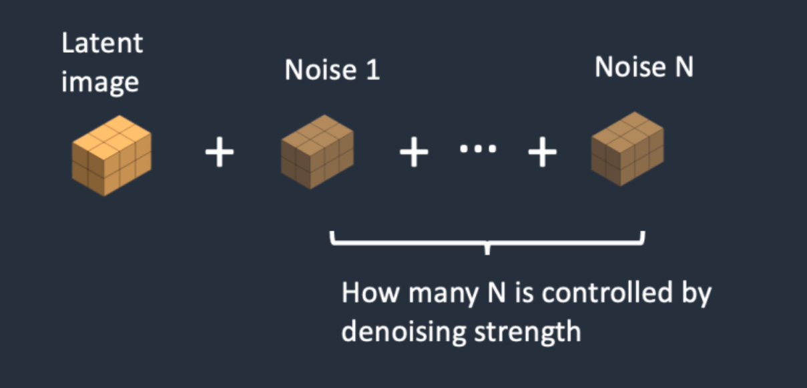</div>

### 1. 完整流程

1. **VAE 编码**：把输入参考图编码为 latent $`z_0`$。
2. **加噪到中间步**：根据 denoising strength $s \in [0, 1]$ 计算起始时间步 $`t^* = \lfloor s \cdot T \rfloor`$，然后对 $`z_0`$ 一步加噪。

```math
z_{t^*} = \sqrt{\bar\alpha_{t^*}}\,z_0 + \sqrt{1 - \bar\alpha_{t^*}}\,\epsilon,\quad \epsilon\sim\mathcal{N}(0,I)
```

3. **从 $t^*$ 反向去噪**：以 $`z_{t^*}`$ 为起点、文本条件为引导，跑剩余的 $`\lceil s \cdot \text{steps} \rceil`$ 个采样步。
4. **VAE 解码**：把最终 latent 解码回像素。

### 2. denoising strength 的作用与直觉

- $s = 0$：不加噪，模型基本「拷贝」原图。
- $s$ 较小（0.2 ~ 0.4）：保留原图大结构与构图，仅做「细节修饰、风格轻调」。常用于细节增强、轻微风格转绘、局部替换的边界融合。
- $s$ 中等（0.5 ~ 0.7）：原图作为「构图与色调骨架」，模型在此基础上做较强重绘。常用于风格迁移、人物动作迁移、参考构图二创。
- $s$ 较大（0.8 ~ 0.95）：仅保留原图的极低频信息（大体明暗、轮廓），生成结果与原图差异显著。
- $s = 1$：等价于 txt2img（从纯噪声开始）。

### 3. 工程要点

- denoising strength 同时控制「起始 $t^*$」和「实际跑的步数」，因此 strength 越小推理越快。
- img2img 与 **Inpaint、ControlNet、IP-Adapter** 是正交能力，可以叠加使用：strength 控制原图保留度，ControlNet 控制结构，IP-Adapter 控制风格 / ID。
- 在 SDXL / SD3 上做 img2img 时，micro-conditioning（original/target size）必须传入与原图一致的尺寸，否则会出现尺寸偏差导致的细节崩溃。
- **SDEdit 论文**是 img2img 的理论起源：「在合适的中间噪声水平上加噪再去噪，可以同时保留高层语义与改变低层细节」。

**面试金句**：img2img 不是把原图「画进 prompt 里」，而是把原图当作扩散链上的一个「中间状态」，让模型从这一步继续向 $t=0$ 去噪；denoising strength 决定了「保留多少原图信息 / 模型有多少自由度」。

<h2 id="q-040">面试问题：Stable Diffusion 中的 Inpaint 和 Outpaint 分别是什么？</h2>

**难度评分：⭐⭐⭐ (3/5)  |  考察频率：⭐⭐⭐⭐ (4/5)**

- **Inpaint（局部修复）** 指对图像中指定区域进行内容修复或替换的技术。用户可通过遮罩（Mask）标记需修改的区域，并输入文本提示（如“草地”或“删除物体”），模型将根据上下文生成与周围环境协调的新内容。典型应用包括移除水印、修复破损图像或替换特定对象。
- **Outpaint（边界扩展）** 则用于扩展图像边界，生成超出原图范围的合理内容。例如，将一幅风景画的左右两侧延伸，生成连贯的山脉或天空。其核心挑战在于保持扩展区域与原始图像在风格、光照和语义上的一致性。

两者均基于 Stable Diffusion 的潜在扩散模型，但目标不同：Inpaint 聚焦于“内部修正”，而 Outpaint 致力于“外部延展”，共同拓展了生成式 AI 在图像编辑中的灵活性。

### Inpaint 的完整处理链路

Inpaint 整体上仍然是 img2img，但增加了 Mask 作为空间约束。输入图像先经 VAE Encoder 得到 Latent Feature，Mask 同步缩放到 Latent 分辨率；在每一个去噪步骤中，只更新 Mask 指定的区域，Mask 之外则持续回填对应时间步的原图 Latent，使未编辑区域尽量保持不变。

<div align="center">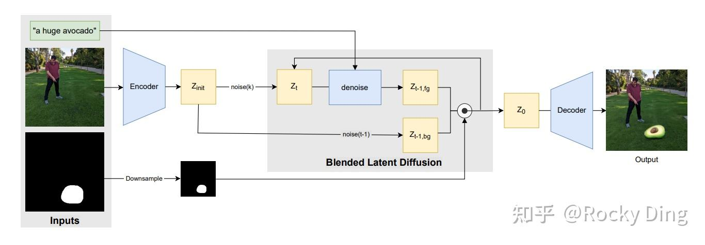</div>

普通 SD Pipeline 可以在采样过程中用 Mask 做混合；专门训练的 Inpainting 模型则会把 noisy latent、masked image latent 和 mask 在通道维拼接后送入 U-Net。以 SD 1.x 为例，三者通常分别为 4、4、1 个通道，合计 9 个输入通道，因此它比仅在采样器外部混合 Mask 更能理解缺失区域与周围上下文。

Outpaint 可以看作 Mask 位于原图边界之外的 Inpaint：先扩展画布，把新增区域标为需要生成的 Mask，再通过相同的条件去噪补全内容。它的关键不是单独的生成公式，而是让扩展区域在透视、光照、纹理和语义上延续原图。


<h1 id="q-041">2.介绍一下 Stable Diffusion 中 VAE 的架构、原理和作用</h1>

<h2 id="q-044">面试问题：Stable Diffusion 模型中的 VAE 和单纯的 VAE 生成模型的区别是什么？</h2>

**难度评分：⭐⭐⭐⭐ (4/5)  |  考察频率：⭐⭐⭐⭐⭐ (5/5)**

Stable Diffusion 中的 VAE 是连接像素空间与 Latent 隐空间的桥梁，核心职责是**图像压缩与图像重建**：Encoder 把图像压缩成低维空间特征供扩散模型学习，Decoder 再把去噪后的 Latent Feature 还原为像素级图像。

<div align="center">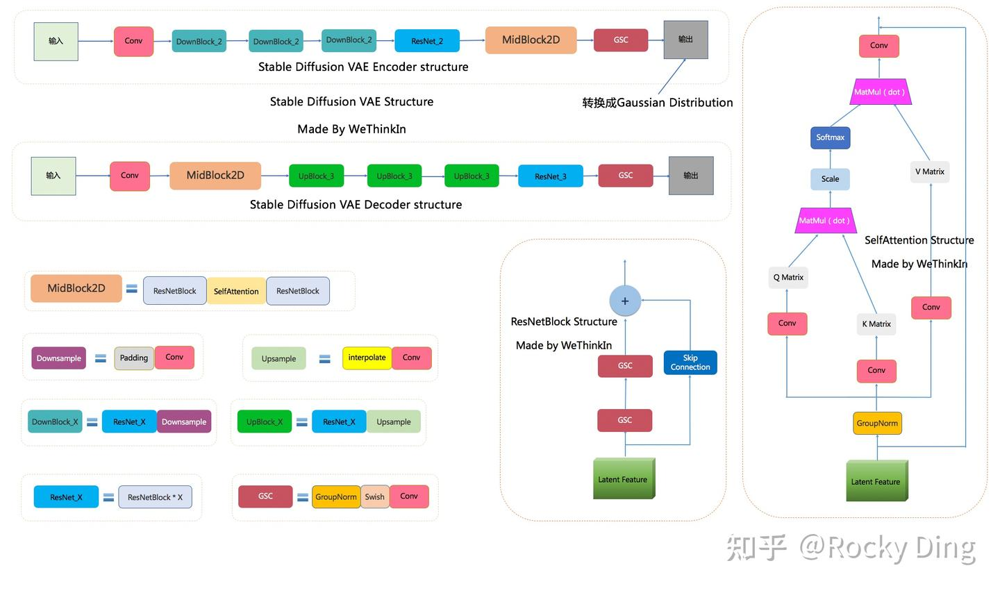</div>

### 1. 面试问题：VAE 为什么会导致图像变模糊？

VAE 出现模糊，根因不是“变分”三个字本身，而是**有损压缩与重建目标之间的取舍**。图像先被压缩到低维 latent，细小纹理、高频边缘和文字笔画如果在编码阶段丢失，Decoder 只能依据 latent 中保留下来的统计信息进行重建；当 L1/MSE 等像素损失面对多个合理细节时，模型倾向输出平均解，于是边缘变软、纹理变平。

在 Stable Diffusion 中，VAE 的下采样率、latent 通道数、感知损失（Perceptual loss）和对抗损失共同决定重建上限。VAE 不是负责凭空恢复已经丢失的信息，而是尽量在压缩率与重建质量之间取得平衡；后续 Diffusion 主要在 latent 空间建模，也不能稳定补回 VAE 完全没有编码进去的细节。

### 2. 面试问题：为什么 VAE 单独做生成效果不好，但是 VAE + Diffusion 的图像生成效果就很好？

**这个问题最本质的回答是：传统深度学习时代的VAE是单独作为生成模型；而在AIGC时代，VAE只是作为特征编码器，提供特征给Diffusion用于图像的生成。其实两者的本质作用已经发生改变。**

同时传统深度学习时代的VAE的重构损失只使用了平方误差，而Stable Diffusion中的VAE使用了平方误差 + Perceptual损失 + 对抗损失。在正则项方面，传统深度学习时代的VAE使用了完整的KL散度项，而Stable Diffusion中的VAE使用了弱化的KL散度项。同时传统深度学习时代的VAE将图像压缩成单个向量，而Stable Diffusion中的VAE则将图像压缩成一个 $N \times M$ 的特征矩阵。

上述的差别都导致了传统深度学习时代的VAE生成效果不佳。

### 3. Stable Diffusion 模型中的 VAE 和单纯的 VAE 生成模型有何区别？

**传统 VAE 生成模型**

- **完整的生成系统**：从噪声直接生成数据
- **核心机制**：变分推断 + 重参数化技巧
- **目标**：学习数据分布，实现无条件生成
- **挑战**：生成质量与多样性的平衡

**Stable Diffusiuon模型中的 VAE**

- **功能组件**：数据压缩器和重建器
- **核心作用**：将图像压缩到潜在空间，降低计算成本
- **目标**：高保真度重建，为扩散过程提供高效空间
- **优势**：专注重建质量，与扩散模型协同工作

### 4. Stable Diffusion VAE 的结构与训练目标

SD 1.x 的 VAE Encoder 由卷积、DownBlock、ResNetBlock、MidBlock 和 Self-Attention 等模块组成，将输入图像转换为 Gaussian Latent Distribution；Decoder 使用对称的 UpBlock、ResNetBlock 与 MidBlock 将 Latent 重建为像素图。下采样率 $f=8$、Latent 通道数 $c=4$ 是压缩效率与重建质量之间的折中： $f$ 太小会让扩散主干承担过高计算成本， $f$ 太大又会丢失过多细节。

训练时并不只使用像素误差，而是组合多种目标：

- **L1/重建损失**约束像素级整体一致性；
- **感知损失（LPIPS）** 比较预训练视觉网络不同层的特征，使重建图在高层语义上接近原图；
- **PatchGAN 对抗损失**关注局部 Patch 的真实性，用于增强纹理和清晰度；
- **弱 KL 正则**约束 Latent 不要偏离正态分布过远，但使用较小权重以避免牺牲重建质量。

这也解释了为什么 Stable Diffusion VAE 与传统“单独承担生成任务”的 VAE 不同：它不需要独自学习从标准正态分布生成所有图像内容，而是为 Diffusion 提供一个信息密度高、空间结构仍然完整、又足够低维的工作空间。

原始 SD VAE 在压缩和重建时仍然存在信息损失，尤其容易影响小尺寸人脸、文字、细线条和高频纹理。工程上切换微调后的 VAE，通常会改变生成图像的颜色、对比度和局部细节，但不会像切换 U-Net 那样大幅改变主体构图；这说明 VAE 决定的是成像与重建上限，而 U-Net 决定主要生成分布。

<div align="center">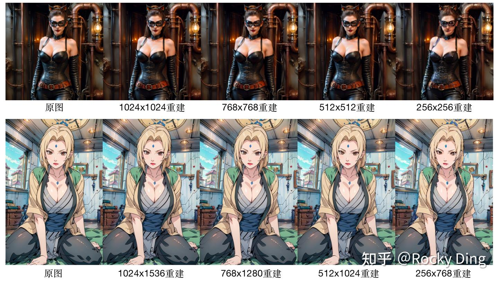</div>


<h2 id="q-044a">面试问题：从 SD 1.x → SDXL → SD 3 → FLUX.1，VAE 在通道数、下采样率、训练目标上的演进路线是怎样的？</h2>

**难度评分：⭐⭐⭐⭐ (4/5)  |  考察频率：⭐⭐⭐⭐ (4/5)**

VAE 是连接「像素世界」与「扩散世界」的桥梁，是 SD 系列代际跃迁中持续被升级的核心组件。整体演进可以概括为三条主线：**通道数从 4 → 16、下采样率稳定在 8x、训练目标从「像素重建」走向「感知 + 对抗 + 多尺度」**。

### 1. 主流 SD 系列 VAE 演进对比

<div align="center">

| 版本 | 输入分辨率 | 下采样率 | 通道数 $d$ | 主要损失 | 关键改进 |
| --- | --- | --- | --- | --- | --- |
| **SD 1.x VAE** | 任意 | 8x | 4 | L1 + LPIPS + KL + PatchGAN | 基线 KL-f8 VAE |
| **SD 2.x VAE** | 任意 | 8x | 4 | 同上 | 重训权重，与 SD 1.x 不通用 |
| **SDXL VAE** | 任意 | 8x | 4 | L1 + LPIPS + KL + PatchGAN，重训数据更多 | 重建细节明显提升；fp16 数值不稳，需 fp16-fix |
| **SD 3 VAE** | 任意 | 8x | **16** | L1 + LPIPS + KL + Adversarial（更新版判别器） | **通道数翻 4 倍**，显著提升小物体（人脸、文字）重建质量 |
| **FLUX.1 VAE** | 任意 | 8x | 16 | 同 SD 3 思路，配合 mean shift / scaling | 与 SD 3 类似的高通道路线；与 MM-DiT 联合优化 |

</div>

### 2. 演进背后的三条主线

1. **通道数升级（4 → 16）**：4 通道 latent 在 64×64（对应 512×512 像素）上信息密度有限，对人眼、文字、手指、纹理等细粒度区域容易出现「重建塌缩」。SD 3 论文通过消融实验明确证明 16 通道 VAE 的 PSNR / SSIM / LPIPS 都显著优于 4 通道，这是 SD3、FLUX 高质量生成的底层支撑。
2. **下采样率稳定在 8x**：保留这个压缩率是为了在「计算量降低 64 倍」与「重建上限不至于过低」之间取平衡；继续提高（16x、32x）会让重建质量崩塌。
3. **训练目标的丰富化**：从单纯像素 L1，演化到「L1 + LPIPS + KL + 对抗」这一**多目标组合**——L1 提供像素一致性、LPIPS 提供感知质量、KL 约束 latent 分布近高斯（便于扩散）、对抗损失抑制模糊和棋盘效应。

### 3. 为什么 SD 3 选择「通道数翻倍」而不是「下采样率减半」

- 下采样率减半（8x → 4x）会让 latent token 数量 4 倍化，所有扩散计算成本随之 4 倍化（attention 是 16 倍化），代价过大；
- 通道数翻倍只增加每个 token 的 channel 维度，扩散网络的整体计算量增长可控，且能直接提升重建上限。

**面试金句**：SD 系列 VAE 的代际演进是「**8x 下采样不动、通道数从 4 翻到 16、损失从 L1 走向感知 + 对抗**」。理解这条路线就理解了 SD 3 / FLUX 在小物体细节、文字渲染、人脸保真上跨越式提升的底层原因。


<h2 id="q-044b">面试问题：VAE 编码后为什么要乘以 scale_factor？SD 各版本的 scale_factor 是如何确定的？</h2>

**难度评分：⭐⭐⭐ (3/5)  |  考察频率：⭐⭐⭐⭐ (4/5)**

> 该问题与 [面试问题：Stable Diffusion 的优化策略有哪些？](#q-031) 中的 latent scale factor 子问题形成「VAE 视角 vs 扩散视角」互补，本节侧重 VAE 侧的统计估计与跨版本切换实操。

### 1. 从 VAE 输出到扩散输入的「分布对齐」

VAE Encoder 训练时只优化 $`\text{Recon} + \text{KL} + \text{LPIPS} + \text{Adv}`$，**并没有显式约束输出 latent 的方差恰好为 1**。当扩散模型以这个 latent 作为输入做 $`x_t = \sqrt{\bar\alpha_t}x_0 + \sqrt{1-\bar\alpha_t}\epsilon`$ 加噪时，`scale_factor` 的作用是把 latent 的标准差缩放到接近 1，让噪声调度公式背后的「数据分布近似 $\mathcal{N}(0, I)$」假设近似成立。

### 2. 各版本 scale_factor 的统计估计方式

```python
with torch.no_grad():
    latents = vae.encode(big_batch_of_images).latent_dist.sample()
    # 估计单标量 std
    sigma = latents.std()
scale_factor = 1.0 / sigma
# SD 3 / FLUX 的 16 通道 VAE 还需估计 mean 做 shift
shift_factor = latents.mean()
```

<div align="center">

| 版本 | scale_factor | shift_factor | 是否需要 mean shift |
| --- | --- | --- | --- |
| SD 1.x / 2.x | 0.18215 | 0 | 否 |
| SDXL | 0.13025 | 0 | 否 |
| SD 3 | 由 `vae.config.scaling_factor` 给出 | 由 `vae.config.shift_factor` 给出 | **是** |
| FLUX.1 | 由 `vae.config.scaling_factor` 给出 | 由 `vae.config.shift_factor` 给出 | **是** |

</div>

### 3. 跨版本切换时的注意事项

- 切换 VAE 必须**同步切换 scale_factor**；不切会出现整体偏色 / 饱和度异常，严重时直接塌缩。
- SD 3 / FLUX 的 latent 公式为 `z = (raw_latent - shift_factor) * scaling_factor`，再喂给扩散网络；解码时反操作。漏掉 shift 是迁移代码时的高频踩坑点。
- 自定义 pipeline 时优先读取 `vae.config.scaling_factor` 与 `vae.config.shift_factor`，避免硬编码导致后续模型升级时 bug。
- LoRA / Dreambooth 训练时如果替换了 VAE，**训练数据预处理 / 训练 loop / 推理 pipeline 三处的 scale 都要保持一致**，否则训练目标与推理 pipeline 不匹配。

**面试金句**：scale_factor 是「VAE 实际输出方差」的倒数，目的是让 latent 分布近似 $\mathcal{N}(0, I)$，与扩散模型的噪声调度匹配；它和扩散网络是绑定的一对常量，跨版本切换 VAE 必须同步更新；SD 3 / FLUX 还引入了 shift_factor，是 16 通道 VAE 的额外 mean 校正。

<h2 id="q-044e">面试问题：VAE / Tokenizer / Latent 空间为什么会影响图像生成质量和训练效率？</h2>

**难度评分：⭐⭐⭐⭐⭐ (5/5)  |  考察频率：⭐⭐⭐⭐ (4/5)**

VAE、Tokenizer 和 Latent 空间决定了图像从像素空间进入生成模型训练空间的方式。它们不是 Stable Diffusion pipeline 里的辅助模块，而是现代高分辨率图像生成模型的底层信息瓶颈。

Stable Diffusion、SDXL、SD 3、FLUX、Qwen-Image、Z-Image 这类模型通常不直接在像素空间训练，而是先用 VAE 或图像 Tokenizer 把图像压缩到 latent 空间，再由 U-Net / DiT / Flow 模型学习 latent 分布，最后再解码回像素图。这样做能显著降低计算成本，但也带来一个关键代价：**被 VAE 压缩丢掉的信息，后面的扩散主干很难稳定恢复。**

它对模型质量和效率的影响主要体现在四个方面：

1. **训练效率。**
   压缩率越高，latent token 越少，U-Net / DiT 的计算量越低。对于 DiT 来说，token 数会直接影响 Attention 成本，所以 Z-Image 的紧凑 VAE、高压缩 latent 路线，本质上是在降低训练和推理成本。

2. **细节上限。**
   如果 VAE 不能重建小字、笔画、边缘、纹理和细线结构，生成主干即使理解了 prompt，最终解码也会糊。Qwen-Image-VAE-2.0 这类面向富文本场景优化的 VAE，核心就是解决“语义知道了，但细节还原不出来”的问题。

3. **编辑保真。**
   图像编辑要求保留原图身份、结构、背景和未编辑区域。VAE 重建质量不足时，即使编辑指令很简单，也可能出现人脸漂移、商品变形、背景纹理改变等问题。

4. **高分辨率支持。**
   分辨率越高，latent token 越多。VAE 的压缩率、通道数、latent 尺度、scale_factor、shift_factor 和 tiling 策略，会共同决定模型能否稳定支持 2K、4K 甚至更大尺寸输出。

面试中可以这样总结：**VAE 决定“模型看见什么”和“最终能还原什么”。扩散/Flow 主干决定生成能力，VAE / Tokenizer 决定信息瓶颈；文字渲染、细节保真、编辑稳定性和推理成本，都绕不开 latent 空间设计。**

<h2 id="q-044c">面试问题：SDXL VAE 在 fp16 下出现"白图 / NaN"问题的原因是什么？工业上常见的修复方案有哪些？</h2>

**难度评分：⭐⭐⭐⭐ (4/5)  |  考察频率：⭐⭐⭐⭐ (4/5)**

SDXL 官方 VAE 在 fp16 推理下经常出现整张白图、整张黑图或 NaN，是 SDXL 工业部署最知名的踩坑点之一。

### 1. 根因分析

- **fp16 数值范围只有约 $\pm 6.5\times 10^4$**。SDXL VAE 在解码过程中，某些中间激活值（尤其在带有 GroupNorm + 大尺寸卷积的层）会出现峰值绝对值非常大的 outlier，**超出 fp16 上限触发 inf**；inf 经过 GroupNorm / LayerNorm / sigmoid 这类算子后产生 NaN，再扩散到全图。
- 这一现象在 SD 1.x / 2.x VAE 上很少见，但 SDXL VAE 的训练数据更广、参数更新后激活分布更长尾，导致问题集中爆发。
- bf16 的范围与 fp32 同级，所以同一份 VAE 在 bf16 下几乎不会出现这个问题。

### 2. 工业上常见的修复方案

<div align="center">

| 方案 | 思路 | 代价 |
| --- | --- | --- |
| **VAE 单独跑 fp32 / bf16** | U-Net 用 fp16，VAE 切回 fp32 / bf16 | 显存略增，速度略降；最稳妥 |
| **使用 sdxl-vae-fp16-fix** | madebyollin 重训了一份在 fp16 下数值稳定的 VAE 权重，主流社区 / diffusers 已经默认推荐 | 与官方权重等价的视觉效果，无显存代价 |
| **Force upcast** | diffusers 提供 `vae.enable_upcast()` 或 `force_upcast=True`，自动在解码时把激活上转 fp32 | 实现简单；速度略降 |
| **bf16 全链路** | H100 / 4090 / 30 系等支持 bf16 的硬件直接走 bf16 | 推荐做法，新代码默认 |
| **VAE Tiling + fp32**（极端低显存） | tiling 减少瞬时显存，VAE 仍走 fp32 | 速度损失大，仅低显存场景 |

</div>

### 3. 工程经验

- 生产部署中**默认搭配 sdxl-vae-fp16-fix 或 bf16**，避免单点故障导致整张白图。
- 若使用 ComfyUI / A1111，绝大多数发行版都已自动选择 fp16-fix VAE 或在 VAE 层面做 upcast，不需要额外配置。
- 训练 SDXL LoRA / Dreambooth 时，VAE 推荐 fp32 或 bf16，不建议训练阶段冒险用 fp16，否则可能在数据预处理阶段就出现 NaN 样本。
- 自定义 pipeline 中要做兜底：`if torch.isnan(latents).any(): fallback_to_fp32()`。

**面试金句**：SDXL VAE 的 fp16 NaN 问题源于「fp16 数值范围太窄 + SDXL VAE 激活的长尾 outlier」；工业上的标准解法是 **bf16 全链路** 或者 **fp16 + sdxl-vae-fp16-fix**，并在 pipeline 层面加 NaN 兜底。


<h2 id="q-044d">面试问题：大分辨率推理时如何降低 VAE 解码显存？VAE Tiling 与 TAESD 各自的取舍是什么？</h2>

**难度评分：⭐⭐⭐⭐ (4/5)  |  考察频率：⭐⭐⭐ (3/5)**

VAE Decoder 的显存随分辨率呈 $\mathcal{O}(H \cdot W)$ 增长，是 SDXL / SD 3 / FLUX 在 1024×1024 及以上分辨率下的「显存最后一公里」。两种主流压缩方案有各自适用场景。

### 1. VAE Tiling（分块解码）

- **思路**：把 latent 切成多个空间小块，每块独立通过 Decoder 解码，再用**重叠 + 加权融合**策略拼接成完整像素图。
- **优势**：完全无损（与一次性解码视觉一致，仅有亚像素级别的拼接差异）；不改变 VAE 权重，所有 SD 系列通用。
- **代价**：解码时间延长（每块都要单独跑一次 conv stack）；拼接边界需要羽化 / overlap，否则可能出现接缝。
- **diffusers 用法**：`pipe.vae.enable_tiling()`、可配 `tile_sample_min_size` 等参数。
- **适用场景**：1536 / 2048 / 4K 等大尺寸生成、Outpaint、超分辨率图像 latent 解码。

### 2. TAESD / TAESDXL（Tiny AutoEncoder for SD）

- **思路**：训练一个**比官方 VAE 小一个数量级的微型 Encoder/Decoder**（通常只有几百万参数），用蒸馏方式逼近官方 VAE 的 latent 分布与重建。
- **优势**：解码极快（数倍于官方 VAE）；显存占用极小；非常适合 **Live Preview**（边采样边解码预览）和 ComfyUI 的实时小图反馈。
- **代价**：重建质量比官方 VAE 略低，**不能用于最终输出**——细节、文字、人脸的清晰度低于官方 VAE。
- **适用场景**：交互式预览、采样过程中的中间帧可视化、低端硬件的非最终输出。

### 3. 选型建议

<div align="center">

| 场景 | 推荐 |
| --- | --- |
| 1024×1024 最终输出 | 官方 VAE + bf16 / fp16-fix |
| 2K / 4K 最终输出 | 官方 VAE + **VAE Tiling** |
| 采样过程实时预览 | **TAESD / TAESDXL** |
| 极低显存设备 | TAESD（预览） + 最终用云端官方 VAE |
| 视频生成的逐帧解码 | 官方 VAE + Tiling，并配合 fp8 / int8 量化 |

</div>

**面试金句**：VAE Tiling 用「时间换空间」做无损降显存，是大分辨率最终输出的标准方案；TAESD 用「画质换速度」做轻量解码，是实时预览与端侧的首选；二者本质是「精度优先 vs 时延优先」的不同取舍，可以叠加使用。


<h1 id="q-045">3.介绍一下 Stable Diffusion 中 Backbone 的架构、原理和作用</h1>

<h2 id="q-047">面试问题：介绍一下 Stable Diffusion 中的自注意力机制和交叉注意力机制</h2>

**难度评分：⭐⭐⭐⭐ (4/5)  |  考察频率：⭐⭐⭐⭐⭐ (5/5)**

### 1. 自注意力机制与交叉注意力机制的核心区别

属于Transformer常见Attention机制，用于合并两个不同的sequence embedding。两个sequence是：Query、Key/Value。

<div align="center">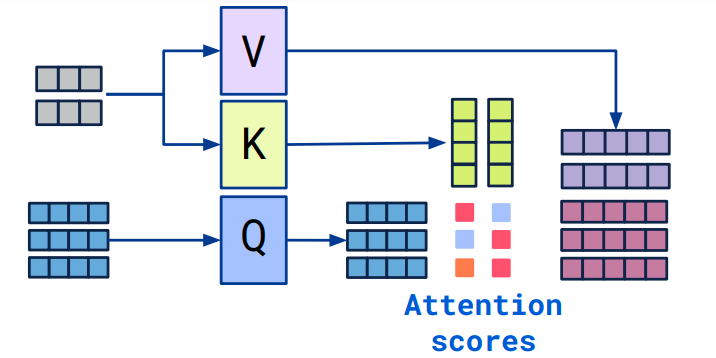</div>

Cross-Attention和Self-Attention的计算过程一致，区别在于输入的差别，通过上图可以看出，两个embedding的sequence length 和embedding_dim都不一样，故具备更好的扩展性，能够融合两个不同的维度向量，进行信息的计算交互。而Self-Attention的输入仅为一个。

在 Stable Diffusion U-Net 中，Self-Attention 和 Cross-Attention 并不是孤立模块，而是被组织进 Spatial Transformer：图像特征先经 GroupNorm 与投影变成图像 token，随后依次执行 Self-Attention、Cross-Attention 和 FeedForward，并通过残差连接写回卷积特征。Self-Attention 负责建立不同图像位置之间的全局联系，Cross-Attention 则负责把 Prompt 对应的文本语义写入这些图像位置。

### 2. Stable Diffusion 是如何在 U-Net 内部把文本与图像两种模态的语义对齐的？

Cross-Attention可以用于将图像与文本之间的关联建立，在stable-diffusion中的Unet部分使用Cross-Attention将文本prompt和图像信息融合交互，控制U-Net把噪声矩阵的某一块与文本里的特定信息相对应。

在每一个交叉注意力层中，空间位置对应的图像 latent token 会根据当前图像特征查询文本 token：描述主体、属性、风格和空间关系的文本特征被写回相应图像位置。这个过程会在多次 U-Net 去噪步骤和多个尺度上重复，因此文本不是只在输入端控制一次，而是持续参与从噪声到图像 latent 的逐步重建。

<div align="center">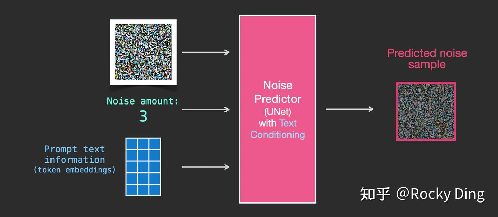</div>

### 3. Stable Diffusion 中 Cross-Attention 的 Q / K / V 分别是什么？为什么图像隐变量作为 Q，文本 Prompt 作为 K / V？

在 Stable Diffusion 的 Cross-Attention 中：

- **Q（Query）来自图像 latent feature**：U-Net 当前层的二维特征先展平为空间 token，再经过线性投影得到 Q；
- **K（Key）和 V（Value）来自文本 Prompt 的 embedding**：CLIP Text Encoder 输出的文本 token 分别投影为 K 和 V；
- 注意力权重由 $QK^\top$ 计算，表示每一个图像位置应该关注哪些文本 token；再用该权重对 V 加权求和，把相关文本语义写回图像特征。

图像隐变量作为 Q，是因为 Stable Diffusion 的直接优化对象是图像 latent：模型需要针对“当前图像位置缺少什么语义信息”向文本进行查询。文本作为 K/V，则相当于一个稳定的条件记忆库，用于提供主体、属性、关系和风格信息。如果反过来让文本作为 Q，得到的输出会以文本 token 为主，不能直接与 U-Net 的空间特征逐位置融合。

### 4. 为什么 SD U-Net 中 Self-Attention 与 Cross-Attention 主要放在中、低分辨率层？高分辨率层为何以卷积为主？

SD U-Net 是「卷积 + 注意力」的混合架构，注意力的放置位置不是随便选的，而是**在显存 / 计算成本与语义建模能力之间的精妙折中**。

**1. 注意力的计算复杂度是分辨率的二次方**

对于空间形状为 $H \times W$ 的特征图，自注意力的复杂度是：

```math
\mathcal{O}\bigl((HW)^2 \cdot d\bigr)
```

在 SD 1.5（latent 64×64，VAE 8x 下采样）中，U-Net 的各下采样层分辨率依次为 $64 \to 32 \to 16 \to 8$。如果在 64×64 层就放 Self-Attention，序列长度是 4096，attention 矩阵需要 $4096^2 \approx 1.6\text{M}$ 个元素；而 16×16 层的序列长度只有 256，attention 矩阵只需 $\sim 65\text{K}$ 个元素，**计算量差 256 倍**。

**2. 中、低分辨率更适合做语义对齐**

- **高分辨率层（64×64、32×32）感受野小、语义弱**，主要承担「纹理、边缘」这类局部信息，用卷积已经足够；
- **中、低分辨率层（16×16、8×8）感受野大、语义强**，每个 token 已经聚合了较大的图像区域，正适合与文本 token 做 cross-attention 进行「语义对齐」；
- 高 / 低分辨率的注意力放置规律也符合人类视觉的「先局部纹理后整体语义」直觉。

**3. SD 1.x / 2.x / SDXL / SD 3 在 attention 放置上的差异**

- **SD 1.x / 2.x**：U-Net 的 32×32、16×16、8×8 三个分辨率层都有 Self-Attention + Cross-Attention block，64×64 层只有卷积。
- **SDXL**：把更多的 Transformer Block 集中到中分辨率（U-Net 中部更深的 attention stack），16×16 / 8×8 层 attention 数量从 SD 1.5 的 1 个增加到多个，主要为了提升大模型容量与高分辨率细节质量。
- **SD 3 / FLUX（MM-DiT）**：彻底放弃多尺度 U-Net，改为单尺度 patchify + 全局 attention；本质上把整张图压成一个 token 序列做 Transformer，分辨率与 attention 解耦，但需要更大算力。

**面试金句**：U-Net 把 Cross-Attention 集中在中、低分辨率，是因为「语义对齐 + 二次方复杂度」两个事实必须妥协；卷积负责高分辨率局部细节，注意力负责低分辨率全局语义，这是 SD 1 / SD 2 / SDXL 共享的设计哲学。SD 3 / FLUX 通过 MM-DiT 把这条妥协推翻，但代价是显著的算力上涨。

<h2 id="q-049">面试问题：为什么使用 U-Net 作为 Stable Diffusion 模型的核心架构？介绍一下 U-Net 架构</h2>

**难度评分：⭐⭐⭐ (3/5)  |  考察频率：⭐⭐⭐⭐⭐ (5/5)**

### 1. U-Net的结构具有以下特点

- **整体结构**：U-Net由多个大层组成。在每个大层中，特征首先通过下采样变为更小尺寸的特征，然后通过上采样恢复到原来的尺寸，形成一个U形的结构。
- **特征通道变化**：在下采样过程中，特征图的尺寸减半，但通道数翻倍；上采样过程则相反。
- **信息保留机制**：为了防止在下采样过程中丢失信息，UNet的每个大层在下采样前的输出会被拼接到相应的大层上采样时的输入上，这类似于ResNet中的"shortcut"。

<div align="center">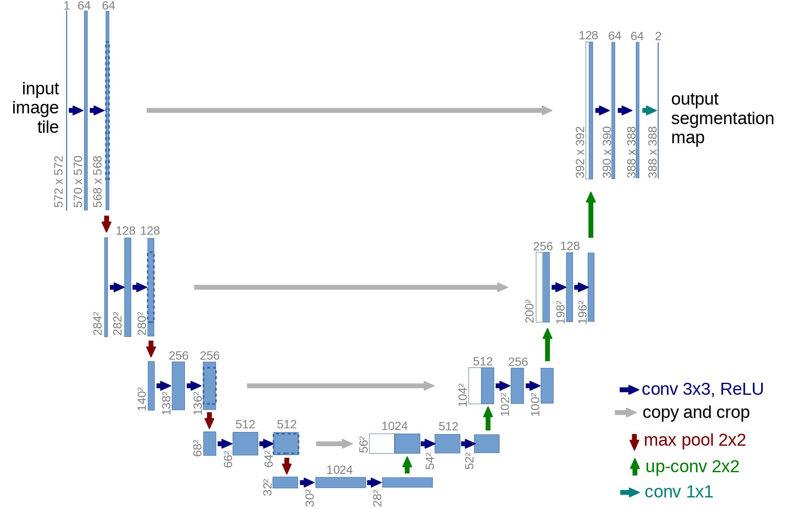</div>

U-Net 具有编码器部分和解码器部分，均由 ResNet 块组成。编码器将图像表示压缩为较低分辨率图像表示，并且解码器将较低分辨率图像表示解码回据称噪声较小的原始较高分辨率图像表示。更具体地说，U-Net 输出预测噪声残差，该噪声残差可用于计算预测的去噪图像表示。为了防止U-Net在下采样时丢失重要信息，通常在编码器的下采样ResNet和解码器的上采样ResNet之间添加快捷连接。

Stable Diffusion的U-Net 能够通过交叉注意力层在文本嵌入上调节其输出。交叉注意力层被添加到 U-Net 的编码器和解码器部分，通常位于 ResNet 块之间。

<div align="center">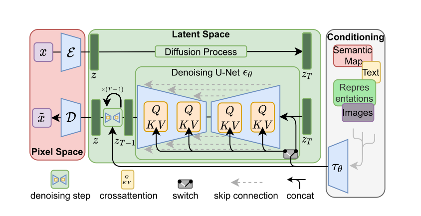</div>

### 2. Stable Diffusion U-Net 相比经典 U-Net 增加了什么？

Stable Diffusion 沿用了经典 U-Net 的 Encoder、Decoder、多尺度特征和 Skip Connection，但为扩散生成增加了三类关键组件：

1. **ResNetBlock + Time Embedding**：每个去噪阶段的噪声强度不同，Time Embedding 会告诉共享 U-Net 当前处于哪个 timestep，使网络能在早期优先恢复轮廓和低频结构，在后期补充纹理与高频细节。
2. **Spatial Transformer**：由 Self-Attention、Cross-Attention 和 FeedForward 组成。Self-Attention 建模图像内部的长程关系，Cross-Attention 将 Text Embeddings 作为条件注入图像特征。
3. **CrossAttnDownBlock / CrossAttnUpBlock / CrossAttnMidBlock**：把卷积 ResNetBlock 与 Spatial Transformer 组合在不同分辨率层中，使多尺度视觉建模与文本条件控制能够同时进行。

<div align="center">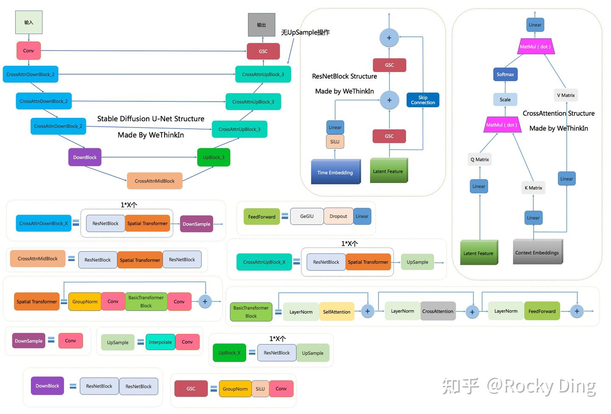</div>

U-Net 适合 Stable Diffusion 的根本原因，是它同时满足了扩散去噪的三类需求：**多尺度结构用于先轮廓后细节，Skip Connection 保留高频空间信息，Time Embedding 与 Cross-Attention 分别注入噪声阶段和文本条件。**


<h2 id="q-049b">面试问题：U-Net 与 DiT / MM-DiT 在 Backbone 设计哲学上的本质差异是什么？SD 系列从 U-Net 演进到 DiT 的根本原因是什么？</h2>

**难度评分：⭐⭐⭐⭐⭐ (5/5)  |  考察频率：⭐⭐⭐⭐⭐ (5/5)**

从 SDXL 到 SD 3 / FLUX 的最大跃迁就是 Backbone 从 U-Net 切换到 MM-DiT。这不只是「换模型」，而是**整个生成范式的演进**：从「卷积归纳偏置 + 局部 attention」走向「无归纳偏置 + 全局 token Transformer」。

### 1. 设计哲学对比

<div align="center">

| 维度 | U-Net | DiT / MM-DiT |
| --- | --- | --- |
| **基本算子** | 卷积为主 + 局部 attention | 纯 Transformer，全局 attention |
| **多尺度建模** | 显式多尺度（下采样 + skip-connection） | 单一尺度（patchify 后所有 token 一起处理） |
| **归纳偏置** | 强（卷积平移等变 + 局部性） | 弱（仅有位置编码） |
| **Scaling 能力** | 有限，加深加宽收益递减 | 强，深度 / 宽度 / 数据规模都能持续提升 |
| **多模态融合** | Cross-Attention 注入文本 | Token 拼接，文本与图像在统一序列里联合 self-attention |
| **算力成本** | 中分辨率有 attention，高分辨率纯卷积，整体节省 | 全局 attention，对长序列敏感 |
| **训练数据需求** | 中等 | 大（弱归纳偏置需要更多数据） |
| **实现成熟度** | 极高（diffusers / xFormers / TensorRT 全支持） | 上升期（FlashAttention、SDPA 已成熟） |

</div>

### 2. SD 系列从 U-Net 演进到 DiT 的根本原因

1. **Scaling Law 驱动**：Transformer 在 NLP、ViT、视频生成上反复证明「越大越好」；U-Net 在 SDXL 这一规模（≈2.6B）已经接近边际收益拐点，继续加宽 / 加深收益不显著。DiT 论文（W. Peebles, S. Xie）首次系统性地证明 Transformer 在扩散模型上同样有清晰的 Scaling Law。
2. **多模态联合建模**：MM-DiT 让文本与图像 token 在同一序列里做 self-attention，对**长 prompt、强语义、文字渲染**都更友好；U-Net 的 Cross-Attention 只能让图像 query 文本，缺乏「文本反向 query 图像」的双向信息流。
3. **统一架构、便于跨任务复用**：DiT 与视频生成（DiT for Video / Sora-类）、3D / 多模态生成（W.A.L.T、MMDiT）共用一套 Transformer 范式，更容易被复用与扩展。
4. **去除卷积的硬约束**：卷积假设平移等变性，但生成模型未必需要严格平移等变（不同分辨率、不同长宽比都要支持）；纯 Transformer + 位置编码反而更灵活。

### 3. 代价与权衡

- DiT / MM-DiT 推理算力随分辨率快速上升，需要 FlashAttention、SDPA、序列并行等系统优化；
- 弱归纳偏置带来更高的数据需求，SD 3 / FLUX 都使用了远比 SDXL 更大的训练数据；
- 工程生态（蒸馏、ControlNet、LoRA 适配器）需要为新架构重新搭建。

**面试金句**：U-Net 强归纳偏置 + 多尺度、DiT 弱归纳偏置 + 单尺度全局 attention；演进的根本动力是**扩散模型也开始遵循 Transformer 的 Scaling Law**，加上多模态联合建模的需求，这两点共同推动 SD 系列从 SDXL 的 U-Net 走向 SD 3 / FLUX 的 MM-DiT。


<h2 id="q-049d">面试问题：SD Backbone 中 GroupNorm + SiLU + 残差连接的设计为何对训练稳定性很关键？换成 LayerNorm / BatchNorm 会有什么问题？</h2>

**难度评分：⭐⭐⭐⭐ (4/5)  |  考察频率：⭐⭐⭐ (3/5)**

SD U-Net 中的每一个 ResBlock 都是「GroupNorm → SiLU → Conv → GroupNorm → SiLU → Conv → 残差加法 + timestep / 文本调制」。这套组合不是任意选择，而是扩散模型训练稳定性的「最小刚需配方」。

### 1. 为什么是 GroupNorm 而不是 BatchNorm

- **BatchNorm 依赖 batch 内统计**，扩散模型训练时同一 batch 内不同样本对应**不同的时间步 $t$**，统计分布差异巨大；BN 会把高噪样本与低噪样本混在一起做归一化，引入严重的统计偏置。
- BN 在小 batch / 推理 batch=1 时表现差；扩散模型推理常常 batch=1（CFG 时 batch=2），BN 不友好。
- **GroupNorm 只在通道维做分组归一化，与 batch 无关**，对任意 batch size 表现一致；与 timestep / 噪声水平也解耦。
- 工业中也有人使用 **AdaGN / AdaLN-Zero**（让 timestep 调制 GroupNorm 的 scale / bias），是 ADM、DiT、SD 3 的常见做法。

### 2. 为什么是 SiLU 而不是 ReLU

- ReLU 在负区间梯度恒为 0，深层网络训练易出现「dead ReLU」；
- **SiLU（Swish）= $x \cdot \sigma(x)$**：在负区间有非零梯度，平滑可导，与扩散模型「连续噪声水平」的特性更匹配；
- DDPM 原论文消融显示 SiLU 比 ReLU、GELU 都更稳定；ADM / SD 系列沿用至今。

### 3. 残差连接的双重价值

- **梯度传播**：扩散网络往往很深（SDXL U-Net 有数十个 ResBlock），残差连接保证梯度能直通到深层；
- **保留高频信号**：去噪过程要求网络能处理「输入 ≈ 输出」的极端情况（高 SNR 时几乎是恒等映射），残差连接提供了这种「恒等近似」的捷径。

### 4. 为什么不是 LayerNorm

- LayerNorm 对每个空间位置独立做归一化，破坏空间相关性，对卷积视觉任务不友好；
- 但在 **DiT / MM-DiT** 中由于 Backbone 已经是 Transformer 范式（每个位置就是一个 token），LayerNorm（含 AdaLN-Zero）反而是默认选择；这进一步说明「归一化层 ↔ Backbone 范式」存在强绑定关系。

**面试金句**：扩散模型的训练稳定性高度依赖「**与 batch 解耦的归一化（GN）+ 平滑激活（SiLU）+ 残差通路**」三件套；BatchNorm 与 timestep 多噪声共存矛盾，LayerNorm 适合 Transformer 范式但不适合卷积 U-Net；这套配方是从 DDPM 一路传承到 SDXL 的事实标准。


<h1 id="q-050">4.介绍一下 Stable Diffusion 中 Text Encoder 的架构、原理和作用</h1>

<h2 id="q-051">面试问题：Text Encoder 和 VLM 条件编码器在图像生成模型中起什么作用？举例介绍一下 Stable Diffusion 模型进行文本编码的全过程</h2>

**难度评分：⭐⭐⭐⭐ (4/5)  |  考察频率：⭐⭐⭐⭐⭐ (5/5)**

### 1. Text Encoder 和 VLM 条件编码器在图像生成模型中的作用

Text Encoder 或 VLM 条件编码器决定模型如何理解用户输入。早期 Stable Diffusion 主要依赖 CLIP 文本编码器，把 prompt 编码成可供 U-Net cross-attention 使用的文本特征；Imagen、DALL-E 3、SD 3、FLUX 则说明，更强的 T5 / LLM 级文本编码器会显著提升复杂 prompt following；Qwen-Image、Qwen-Image-Edit 进一步把 VLM 作为语义入口，用于理解图像、文字、布局和编辑意图。

它们的作用可以拆成五层：

1. **把 prompt 转成语义条件。**
   文本编码器负责把自然语言 prompt 映射成条件向量或 token 序列，再通过 cross-attention、AdaLN、joint attention、MMDiT 等机制注入生成主干。没有稳定的文本条件，扩散模型只能学无条件图像分布。

2. **理解长 prompt 和复杂关系。**
   CLIP 擅长短文本图文对齐，但对长描述、多对象关系、空间逻辑、段落级排版和复杂否定约束较弱。T5、LLM 和 VLM 可以补足这部分能力，这也是 SD 3、FLUX、Qwen-Image 这类模型强化文本/多模态编码器的重要原因。

3. **支持图像编辑和多模态输入。**
   图像编辑不仅要理解“把什么改成什么”，还要理解源图里已有的主体、身份、结构和布局。Qwen-Image-Edit 这类路线通常会同时利用 VAE Encoder 保留外观结构、利用 VLM 条件编码器理解图像语义，从而让模型既知道“要改什么”，也知道“原图长什么样”。

4. **支持文字渲染、排版和知识图像。**
   海报、菜单、PPT、流程图、信息图、地图和公式图不只是“画出类似图案”，还要求文字内容、布局层级和逻辑关系正确。强文本编码器/VLM 能把文字、OCR、版式和对象关系以更高密度送入生成主干，是富文本图像生成能力提升的关键。

5. **影响生态兼容和模型代际差异。**
   SD 1.x、SD 2.x、SDXL、SD 3、FLUX 在 prompt 行为上的差异，很大一部分来自 Text Encoder 的差异。换编码器不是简单换模块，而是换掉模型对自然语言的理解空间，也会影响 LoRA、prompt 模板、clip_skip、长 prompt 处理和社区工作流兼容性。

一句话总结：**现代图像生成模型越来越像“语言/多模态理解模型 + 视觉生成模型”的组合。Text Encoder / VLM 决定模型听不听得懂，U-Net / DiT / Flow 主干决定模型画不画得出来。**

### 2. Stable Diffusion 模型进行文本编码的全过程

Stable Diffusion 1.x 使用 CLIP ViT-L/14 的 Text Encoder。完整编码过程可以拆成以下步骤：

1. **Tokenization**：Tokenizer 先把 Prompt 切分为 token 序列，并加入起止标记；不足固定长度时 padding，超过长度时截断或由上层框架进行分块。
2. **Token Embedding + Position Embedding**：每个 token 被映射为向量，并加入位置信息，使相同词语位于不同位置时仍能被区分。
3. **Transformer 编码**：特征依次经过多层 CLIP Encoder Layer，每层包含 Self-Attention、MLP、LayerNorm 和残差连接，在文本序列内部建立上下文关系。
4. **输出 Text Embeddings**：以 SD 1.x 为例，最终得到 $77\times768$ 的序列特征，作为 U-Net Cross-Attention 的 Context Embeddings。CLIP 在基础 SD 训练中通常冻结，主要更新 U-Net 参数。

<div align="center">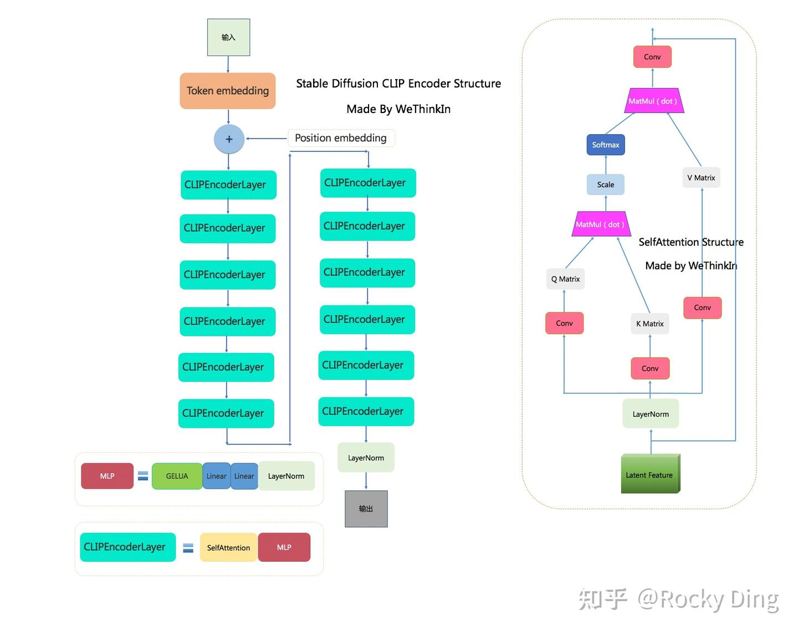</div>

CLIP Text Encoder模型将输入的文本Prompt进行编码，转换成Text Embeddings（文本的语义信息），由于预训练后CLIP模型输入配对的图片和标签文本，Text Encoder和Image Encoder可以输出相似的embedding向量，所以这里的Text Embeddings可以近似表示所要生成图像的image embedding。

2.CrossAttention模块：在U-net的corssAttention模块中Text Embeddings用来生成K和V，Latent Feature用来生成Q。因为需要文本信息注入到图像信息中里，所以用图片token对文本信息做 Attention实现逐步的文本特征提取和耦合。

<h2 id="q-053">面试问题：Negative Prompt 实现的原理是什么？</h2>

**难度评分：⭐⭐⭐ (3/5)  |  考察频率：⭐⭐⭐⭐ (4/5)**

Negative Prompt 并不是训练一个额外的“负向模型”，而是复用 Classifier-Free Guidance（CFG）的无条件分支。标准 CFG 会同时计算有条件噪声预测和无条件噪声预测，再放大两者的差异：

```math
\epsilon_{\mathrm{cfg}}
=\epsilon_{\mathrm{uncond}}
+w\left(\epsilon_{\mathrm{cond}}-\epsilon_{\mathrm{uncond}}\right)
```

训练和普通推理中，unconditional branch 通常输入空字符串；使用 Negative Prompt 时，只需把这个空字符串替换成反向提示词。于是模型不再单纯远离“无条件分布”，而是沿着“负向提示词预测”到“正向提示词预测”的差分方向更新：

```math
\epsilon_{\mathrm{cfg}}
=\epsilon_{\mathrm{negative}}
+w\left(\epsilon_{\mathrm{positive}}-\epsilon_{\mathrm{negative}}\right)
```

这正是 Negative Prompt 能够削弱不希望出现的主体、风格、缺陷和属性，同时仍然只需要两次 U-Net 噪声预测的原因。

**1. 假想方案**

容易想到的一个方案是 unet 输出 3 个噪声，分别对应无prompt，positive prompt 和 negative prompt 三种情况，那么最终的噪声就是

<div align="center">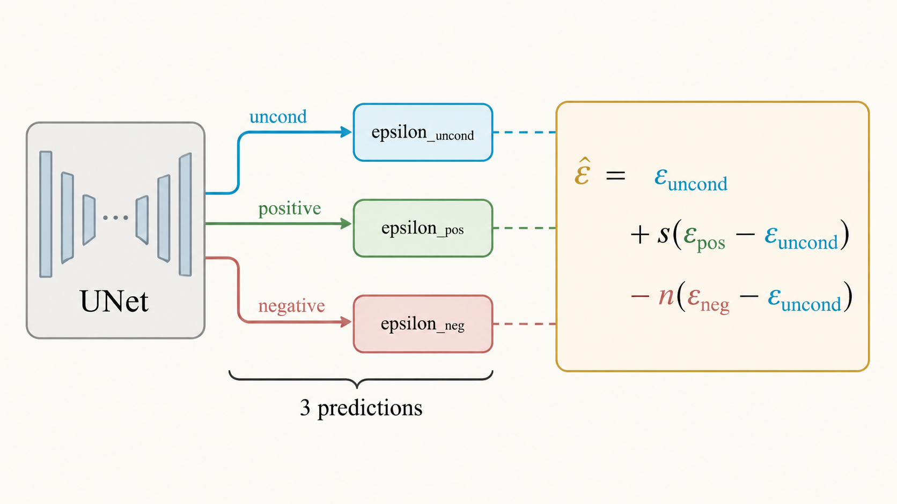</div>

理由也很直接，因为 negative prompt 要反方向起作用，所以加个负的系数。

**2. 真正实现方法**

stable diffusion webui 文档中看到了 negative prompt 真正的[实现方法](https://github.com/AUTOMATIC1111/stable-diffusion-webui/wiki/Negative-prompt)。一句话概况：将无 prompt 的情形替换为 negative prompt，公式则是

<div align="center">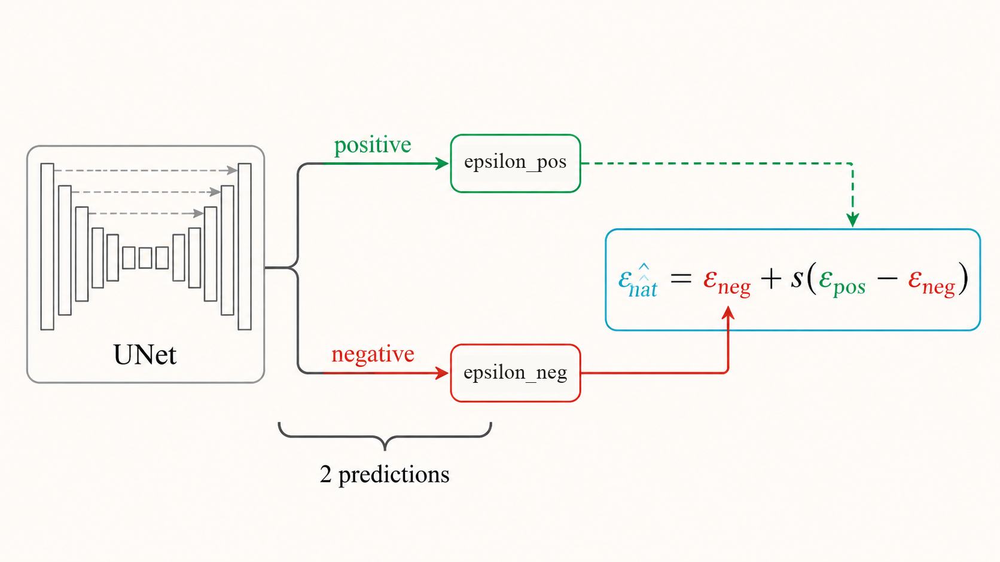</div>

就是这么简单，其实也很说得通，虽说设计上预期是无 prompt 的，但是没有人拦着你加上 prompt（反向的），公式上可以看出在正向强化positive prompt的同时也反方向强化——也就是弱化了 negative prompt。同时这个方法相对于我想的那个方法还有一个优势就是只需预测 2 个而不是 3 个噪声。可以减少时间复杂度。

需要注意的是，Negative Prompt 只能调整模型已经学到的语义方向，不能保证彻底删除某个概念。权重过强或 CFG 过高还可能带来过饱和、细节僵硬和构图异常，因此仍需结合底模能力、正向 Prompt、采样器与 CFG Scale 一起调节。


<h2 id="q-053a">面试问题：CLIP Text Encoder 的 77 tokens 长度限制对长 Prompt 的实际影响是什么？工程上如何突破（chunking、weighted prompt、T5 等长上下文编码器）？</h2>

**难度评分：⭐⭐⭐⭐ (4/5)  |  考察频率：⭐⭐⭐⭐⭐ (5/5)**

CLIP Text Encoder 的位置编码上限是 77 tokens（包含起止符 `<|startoftext|>`、`<|endoftext|>`），这是 SD 1.x / 2.x / SDXL 的硬约束，也是「用户写了一段长 prompt 但模型只听了前面几句」的根因。

### 1. 77 tokens 限制的实际影响

- **直接截断**：超过 77 token 的 prompt 默认被截断，后半段完全丢失，模型生成的图像与用户预期不符；
- **CLIP token ≠ 单词数**：CLIP 的 BPE 分词使一个英文单词常占 1-2 token，中文单字常占 2-3 token，**77 token 实际只够 30-50 个英文单词或 25-30 个中文字**；
- **写复杂场景受限**：多角色、多物体、多风格描述无法在 77 token 内充分表达；
- **对 SD 3 / FLUX 仍然部分受影响**：SD 3 同时使用了 CLIP-L、CLIP-G（77 token）+ T5-XXL（最大 512 token），但 CLIP 部分仍受 77 token 限制，T5 才是长上下文的承载者。

### 2. 三类主流的工程突破方案

**(1) Prompt Chunking（A1111 / ComfyUI 通用）**

- 把长 prompt 按 75 个有效 token 分块（每块再加起止符变 77）；
- 每块独立过 CLIP Text Encoder 得到 77×768 / 77×1280 的 embedding；
- 在 token 维上拼接（concat）成 $(77 \cdot N) \times d$；
- U-Net 的 cross-attention 直接接受任意长度的文本序列（attention 对序列长度本来就没限制）。
- 优势：实现简单、无需训练；劣势：跨块语义关联较弱，且 CLIP 没在长序列上训练过，超过几块后效果会衰退。

**(2) Prompt Weighting（权重语法）**

- 通过 `(word:1.3)` / `[word]` 等语法对特定 token 的 embedding 做缩放或插值；
- 不增加 token 数，而是在有限长度下「加重重要部分」。
- 见 [面试问题：Prompt 中的权重语法](#q-053b) 详细解析。

**(3) 切换到 T5 / 长上下文 LLM 编码器**

- **T5-XXL**：DALL-E 3、Imagen、SD 3、FLUX.1 都引入了 T5-XXL 作为辅助 Text Encoder，最长支持 512 token，能容纳长 prompt 的细节；
- **PixArt-α / PixArt-Σ**：直接只用 T5-XXL，单一编码器处理长 prompt；
- **未来趋势**：FLUX.2、Stable Diffusion 3.5 Large 等已实验性引入更长上下文 LLM 作为编码器。

### 3. 工程经验

- A1111 / ComfyUI 默认开启 chunking，普通用户感受不到 77 限制；
- 对极长 prompt，SDXL 的实际「有效信息上限」其实在 100~150 token 左右；超过部分的细节被稀释；
- 当语义关联非常重要（多角色、多场景）时，更好的做法是**先用 LLM 改写 prompt**，把语义最关键的内容压缩到前 75 token，而不是无限堆 token；
- SD 3 / FLUX 上的 prompt 长度优势主要来自 T5-XXL，不要把长 prompt 同样拿去 SDXL 跑。

**面试金句**：77 token 是 CLIP 的位置编码硬限制，SD 1 / 2 / XL 通过 chunking + 权重语法做到「能跑长 prompt」但**信息密度严重稀释**；SD 3 / FLUX 通过引入 T5-XXL 才真正打破了「短 prompt」时代。理解这一点能在面试中清晰回答「为什么 SD 3 文本一致性比 SDXL 强」。


<h2 id="q-053b">面试问题：Prompt 中的权重语法（(word:1.2)、[word]）的实现原理是什么？A1111 / ComfyUI / Compel 三种 Prompt 解析方式有何差异？</h2>

**难度评分：⭐⭐⭐⭐ (4/5)  |  考察频率：⭐⭐⭐⭐ (4/5)**

「权重语法」是社区在 SD 1.x 时代发明的事实标准，用于在不增加 token 数的前提下放大某段文本的影响力。它的实现并不在模型权重里，而在 **「prompt → embedding」这一步的 embedding 加工层**。

### 1. 主流权重语法

<div align="center">

| 语法 | 含义 | 默认权重 |
| --- | --- | --- |
| `(word)` | 提升权重 | ×1.1 |
| `((word))` | 嵌套提升 | ×1.21 |
| `[word]` | 降低权重 | ×0.91 |
| `(word:1.5)` | 显式权重 | ×1.5 |
| `[word:1.5]` | 显式降低 | ÷1.5 |
| `(prompt_a:0.6 AND prompt_b:0.4)` | 多 prompt 加权混合（A1111 AND） | 自定义 |

</div>

### 2. 实现原理：在 token embedding 上做缩放或插值

A1111 / ComfyUI 的核心做法都遵循以下三步：

1. **解析权重**：把 `(word:1.5)` 解析为 `(token_ids, weight)` 元组列表；
2. **取出该段 token 的 embedding**：用 CLIP 的 token embedding 表得到原始 embedding；
3. **加权处理**：常用方法有两种：
   - **均值偏移法（A1111 默认）**：`emb = mean + weight * (emb - mean)`，保持整个 prompt 的全局均值不变，避免单段权重过大导致全局偏色；
   - **直接缩放法（早期实现）**：`emb = emb * weight`，简单但容易让某段过强而压制其它部分。

### 3. 三种实现的差异

<div align="center">

| 实现 | 解析风格 | 权重处理 | 多 prompt 混合 | 典型坑点 |
| --- | --- | --- | --- | --- |
| **A1111 / WebUI** | 字符级解析、`( ) [ ] : AND` 全支持 | 均值偏移法 | `AND` 关键字（compositional） | `(:0)` 等极端权重可能 NaN |
| **ComfyUI（原生）** | 节点式 + 文本权重；`(word:weight)` | 直接缩放法（更接近 Compel） | 通过 `ConditioningCombine` 等节点显式做 | 与 A1111 的同 prompt 出图存在差异 |
| **Compel（diffusers 生态）** | 解析更严格、支持 emphasis tree、prompt blending | 多种权重模式可配 | `prompt1.and(prompt2, weights=[...])` | 与 A1111 行为不完全等价 |

</div>

### 4. 工程经验

- **A1111 与 ComfyUI 的 prompt 不能直接互换**：同一段 `(masterpiece:1.3)` 在两边的视觉效果会有差异，迁移工作流时需要重新调权重；
- **极端权重危险**：`(word:0)` 可能让该 token embedding 远离 mean，干扰其它 token 的归一化；建议权重区间 `[0.5, 1.5]`；
- **Negative prompt 的权重也用同一套语法**，规则一致；
- **SD 3 / FLUX 上，权重语法仍然在 CLIP 编码部分有效，但 T5 部分通常不响应**——T5 没有内置 emphasis 概念，依靠语言本身（如「very bright」）表达强度更稳定。

**面试金句**：权重语法是「在 prompt → embedding 阶段对 token embedding 做缩放或与均值插值」的工程技巧；A1111 / ComfyUI / Compel 在解析与缩放策略上的差异，导致同 prompt 跨实现不可逐像素复现，但思路一致。


<h2 id="q-053d">面试问题：为什么 SD 1.x 选用 CLIP ViT-L 而 SD 2.x 切换为 OpenCLIP ViT-H？这一切换给生成效果带来了哪些可观察的差异？</h2>

**难度评分：⭐⭐⭐ (3/5)  |  考察频率：⭐⭐⭐ (3/5)**

SD 1.x 与 SD 2.x 在生成效果上「人物画风差异巨大」，背后最直接的原因不是 U-Net 改了多少，而是 **Text Encoder 从 CLIP ViT-L/14 切换到了 OpenCLIP ViT-H/14**。这一切换是 SD 系列历史上最有争议、也最有教育意义的一次代际选择。

### 1. 两者的核心差异

<div align="center">

| 维度 | CLIP ViT-L/14（OpenAI） | OpenCLIP ViT-H/14（LAION） |
| --- | --- | --- |
| 训练数据 | OpenAI WIT（4 亿对，闭源） | LAION-2B（20 亿对，开源） |
| 文本嵌入维度 | 768 | 1024 |
| 数据质量 | 经过严格过滤、风格分布偏精修 | 大规模网络抓取、风格分布更广但更杂 |
| 内容覆盖 | NSFW / 名人 / 艺术家被刻意过滤 | 也做了过滤，但相对宽松 |
| 文本理解 | 中等 | 略强 |

</div>

### 2. SD 2.x 切换 OpenCLIP 的根本原因

- **可商用 / 开源合规**：OpenAI 的 CLIP 权重虽公开，但许可与训练数据不完全开放；OpenCLIP 在 LAION 上完全可重训、可商用；
- **可重训 / 可复现**：Stability 希望整个 pipeline 都是「可由社区独立训练」的，OpenCLIP 与 LAION 数据天然兼容；
- **更大模型容量**：ViT-H/14 比 ViT-L/14 更深更宽，理论上文本理解更强；
- **更好的多语言潜力**：OpenCLIP 的多语言版本（XLM-CLIP）也是 Stability 后续布局的一部分。

### 3. 切换后的可观察差异

- **画风偏差大**：很多 SD 1.5 时代沉淀的 prompt 在 SD 2.x 上效果完全不同，甚至「画不出某些 artist 风格」（数据过滤所致）；
- **NSFW / 人物 / 名人能力下降**：训练数据过滤更严，SD 2.x 在人物面部、名人脸的生成能力相比 1.5 有所下降，是社区诟病的主因；
- **构图与色调改变**：因为 cross-attention 接收到的语义信号分布改变了，模型对同一 prompt 的语义响应也变了；
- **生态断层**：SD 1.5 上的 LoRA / 模型与 SD 2.x 不通用，导致 SD 2.x 时代社区生态远不如 SD 1.5 繁荣，**这一现象直接影响了 SDXL 的设计——SDXL 没有放弃 CLIP-L，而是 CLIP-L + OpenCLIP bigG「双 Text Encoder」并存以兼容旧 prompt**。

### 4. 经验教训

- **Text Encoder 是 SD 系列的「DNA 层」**：换 Text Encoder 不只是换模型，而是换掉了模型对自然语言的理解空间；
- **数据过滤策略**比模型容量对生成内容覆盖范围影响更大；
- SDXL 的「双 CLIP」、SD 3 的「三编码器」都是这一教训的延续——通过组合不同 Text Encoder，**既保留旧生态、又获得新能力**。

**面试金句**：SD 1 → SD 2 切换 OpenCLIP 是出于**开源合规 + 可重训 + 更大容量**的考虑，但带来了「画风断层 + 生态断层」的副作用；SDXL 的双 Text Encoder、SD 3 的三 Text Encoder 都是这一历史经验的工程化反思。


<h2 id="q-054">面试问题：如何处理 Prompt 和生成的图像不对齐的问题？</h2>

**难度评分：⭐⭐⭐⭐ (4/5)  |  考察频率：⭐⭐⭐⭐⭐ (5/5)**

Prompt 与生成图像不对齐，不能只靠“继续堆 Prompt”解决。应先判断问题发生在 **文本编码、训练数据、条件注入、采样引导还是模型能力边界**，再选择对应手段。

### 1. 先判断不对齐发生在哪一层

1. **文本编码层**：Prompt 超过 CLIP 的有效长度而被截断，关键词被 BPE 拆分，或 SD 1.x/2.x 使用不同 Text Encoder 导致同一词语落在不同语义空间。
2. **数据与模型层**：训练集中缺少某个概念、人物关系或构图组合，或者 Caption 本身噪声很大，模型就没有形成稳定的“词语—视觉模式”映射。
3. **Cross-Attention 层**：多个主体、属性和空间关系同时出现时，Text Embeddings 可能在不同图像区域发生语义串扰，出现属性绑定错误或 concept bleeding。
4. **CFG 与采样层**：guidance scale 太低时文本约束不足，太高时又可能过饱和、构图僵化并偏离数据流形；采样步数过少也可能尚未完成语义与细节收敛。

### 2. 对应的工程处理方法

- **压缩并前置关键信息**：把主体、动作、空间关系和关键属性放在 Prompt 前部，删除重复风格词；长 Prompt 可使用 chunking，但跨块语义关系通常不如短而密的 Prompt 稳定。
- **调整关键词权重与顺序**：使用 `(word:weight)` 强化关键 token，但避免极端权重；复杂场景可以拆成多次生成、区域提示或分层编辑，而不是让一个 Prompt 同时承担所有约束。
- **合理设置 CFG 和采样步数**：SD 1.x 常从 CFG 7～8.5、20～50 步作为起点，再根据模型和采样器调整；更高 CFG 不等于更高质量。
- **增加结构条件**：当 Prompt 无法稳定描述姿态、边缘、深度、布局或身份时，使用 ControlNet、IP-Adapter、区域控制、参考图或 Inpainting，把纯语义约束转成空间或视觉条件。
- **选择匹配的底模与 Text Encoder**：写实、二次元、文字渲染、长文本和多角色关系对应不同模型能力边界；换模型往往比继续修 Prompt 更有效。
- **训练侧提升对齐**：使用更准确、更密集的 Caption，清理水印和错配数据；训练时通过条件丢弃学习 CFG，并用 CLIP score、人工偏好与组合关系测试同时评估，不只观察 FID。

面试中可以这样总结：**Prompt 对齐是“数据—Text Encoder—Cross-Attention—Guidance—生成 Backbone”的系统问题。Prompt 工程只能修正表达，不能补齐模型从未学过的概念和关系；当语义控制达到上限时，应增加结构条件或更换模型。**

<h2 id="q-055">面试问题：扩散模型通常是如何引入各种控制条件的？</h2>

**难度评分：⭐⭐⭐⭐ (4/5)  |  考察频率：⭐⭐⭐⭐⭐ (5/5)**

在现代扩散模型中，引入控制条件的方式主要分为两大类：**采样阶段的引导（Guidance）与网络结构级的条件融合（Architectural Conditioning）**。前者通过调整去噪过程中的梯度方向，在不改动模型参数的前提下实现条件控制；后者则在模型内部直接注入额外信息，包括跨注意力（Cross‐Attention）和时间嵌入（Time Embedding）的多路拼接。下面我们将从这两大类出发，详细介绍包括交叉注意力注入、时间步嵌入拼接、类别嵌入拼接以及 ControlNet 等多种常见的条件引入技术。

### 一、采样阶段的引导方法

**1.1 分类器引导（Classifier Guidance）**

- **原理**：额外训练一个图像分类器，对去噪过程中的中间图像计算类别概率梯度 $\nabla\log p(y\mid x)$ ，并将其与扩散模型的去噪梯度相加，以朝着目标类别 $y$ 的方向更强地去噪。
- **特点**：无需改变原扩散模型结构，可后期直接应用；但需额外训练分类器，且计算开销较大。

**1.2 无分类器引导（Classifier-Free Guidance）**

- **原理**：在同一模型中联合训练"有条件"（带 $y$ 输入）与"无条件"（不带 $y$ ）的分支，采样时按比例 $s$ 调整两者的去噪预测：

```math
\hat{\epsilon}=(1+s)\epsilon_{\mathrm{cond}}-s\,\epsilon_{\mathrm{uncond}}
```

通过增大 $s$ ，可在样本质量与多样性间权衡。

- **优势**：无需单独训练分类器，已成为文本到图像任务的主流引导策略。

### 二、网络结构级的条件融合

**2.1 跨注意力（Cross-Attention）注入**

- **文本到图像**：在每个 U-Net 模块的中间，使用跨注意力层将文本嵌入（如 CLIP 编码）作为键/值，图像特征作为查询，实现与自然语言条件的交互。
- **多模态扩展**：可将其它概念 token（如布局、分割图等）也作为条件序列，通过相同机制注入，支持更灵活的条件输入。

**2.2 时间步嵌入（Time Embedding）拼接**

- **位置编码**：采用类似 Transformer 的正余弦编码映射时间步 $t$ 到向量 $\text{pos}(t)$ ，然后通过线性层得到时间嵌入。
- **融合方式**：除常见的**加法融合**外，也可将时间嵌入与其它条件（如类别 embedding 或空间特征）在通道维度上**拼接**，再一起输入至卷积层或注意力模块中。

**2.3 类别嵌入（Class Embedding）拼接**

- **方法**：将类别 embedding（CEN）在每层噪声估计器（noise estimator）中与特征张量**串联**（concatenate），使得扩散的重建过程同时感知图像内容与类别信息。
- **效果**：在多类别生成任务中，可显著提升类别一致性，同时保持图像质量。

**2.4 ControlNet：条件分支并行注入**

- **原理**：在预训练 U-Net 的每个编码器层复制一份"可训练"分支，并通过零初始化卷积（ZeroConv）接收额外条件（如边缘图、深度图），其输出再**加回**主干层，确保不破坏原模型能力。
- **应用**：广泛用于 Stable Diffusion，为图像生成提供细粒度空间控制，如姿态、分割或布局指令。

### 三、其他控制技术

- **Cross-Attention Score 调整**：在生成时对跨注意力分数进行训练无关的修改，以强化局部概念在图像中的表现，同时避免语义混合（concept bleeding）。
- **CFG++等高级引导**：在无分类器引导基础上优化 off-manifold 轨迹，提升高引导尺度下的可逆性与样本质量。


<h1 id="q-056">5.Stable Diffusion XL 有哪些创新点？</h1>

<h2 id="q-058">面试问题：Stable Diffusion XL 的 VAE 部分有哪些创新？详细分析改进意图</h2>

**难度评分：⭐⭐⭐⭐ (4/5)  |  考察频率：⭐⭐⭐⭐ (4/5)**

SDXL 仍然是 Latent Diffusion Model，VAE 负责把输入图像压缩为 latent，以及把去噪后的 latent 解码回像素图；文生图时不需要 Encoder，只使用 Decoder 完成重建。VAE 同时决定了高频细节、小物体特征和整体色彩的上限，因此不能把它当作扩散主干之外的“普通编解码器”。

<div align="center">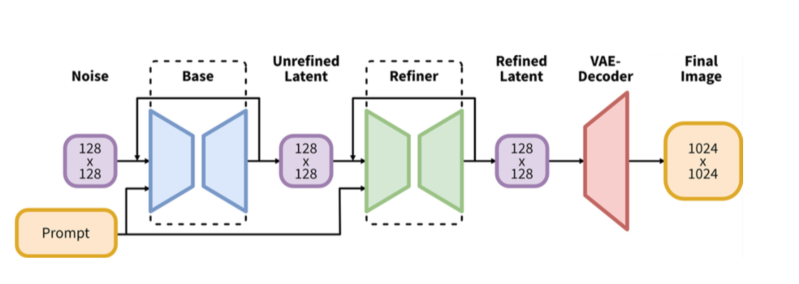</div>

### 1. 结构沿用 KL-f8，但训练配方升级

SDXL 使用与早期 Stable Diffusion 相同的 KL-f8 VAE 结构：Encoder 将图像映射到 Gaussian latent 分布，Decoder 将 latent 重建为像素图；Encoder 与 Decoder 内部由 GSC（GroupNorm + SiLU + Conv）、Downsample（Padding + Conv）、Upsample（Interpolate + Conv）、ResNetBlock 和 Self-Attention 等组件组成。Encoder 包含三个 DownBlock、一个 ResNetBlock 和一个 MidBlock，Decoder 对称地包含三个 UpBlock、一个 ResNetBlock 和一个 MidBlock。

真正的改进重点在训练而不是换掉 VAE 拓扑：SDXL 从头训练 VAE，使用更大的 batch size（256，相比早期配方的 9）并引入 EMA（Exponential Moving Average）权重平均，以提高重建质量和鲁棒性；损失仍以感知损失（perceptual loss）与 L1 回归损失为主，兼顾视觉相似度与像素级稳定性。

<div align="center"></div>

### 2. 重新训练改变 latent 分布，缩放系数同步调整

SD 2.x 主要是在 SD 1.x VAE 基础上微调 Decoder、保持 Encoder 权重不变，因此两者的 latent 分布兼容；SDXL VAE 则重新训练，latent 分布发生变化。为了让送入 U-Net 的 latent 标准差接近 1，缩放系数从 SD 1.x/2.x 的 `0.18215` 调整为 SDXL 的 `0.13025`。这意味着 SDXL VAE 与旧版 VAE 不能直接互换：如果忽略缩放系数或跨版本替换 VAE，常见结果是偏色、噪声或细节崩溃。

### 3. 工程落地与精度注意事项

- 切换不同的 SDXL VAE 微调版本，通常只改变细节与颜色表现，不会大幅改变构图，可把它理解为对成像风格的后处理调节。
- 原生 SDXL VAE 在 fp16 解码时可能出现溢出与 NaN，最终表现为黑图或白图；生产推理应使用 fp32/bf16，或使用 `sdxl-vae-fp16-fix` 这类修复权重。
- 训练 SDXL LoRA/DreamBooth 时，VAE 的版本、缩放系数和精度应与底模保持一致，避免数据预处理阶段就产生 NaN。

**面试金句**：SDXL VAE 的核心不是改变 KL-f8 的基本拓扑，而是“从头重训 + 大 batch + EMA”带来的重建质量提升；重训改变了 latent 分布，所以缩放系数必须从 `0.18215` 同步改为 `0.13025`，并在 fp16 部署时处理 NaN 风险。

<h2 id="q-059">面试问题：Stable Diffusion XL 的 Backbone 部分有哪些创新？详细分析改进意图</h2>

**难度评分：⭐⭐⭐⭐⭐ (5/5)  |  考察频率：⭐⭐⭐⭐⭐ (5/5)**

SDXL Base 的 Backbone 仍是 U-Net，但参数量扩展到约 2.6B，约为 SD 1.x/2.x 的三倍，目标是稳定支持 1024×1024 及以上分辨率。它的关键不是简单“加深加宽”，而是重新分配 Spatial Transformer 与下采样层的位置，把高成本的全局建模集中到更小的 feature map 上。

<div align="center">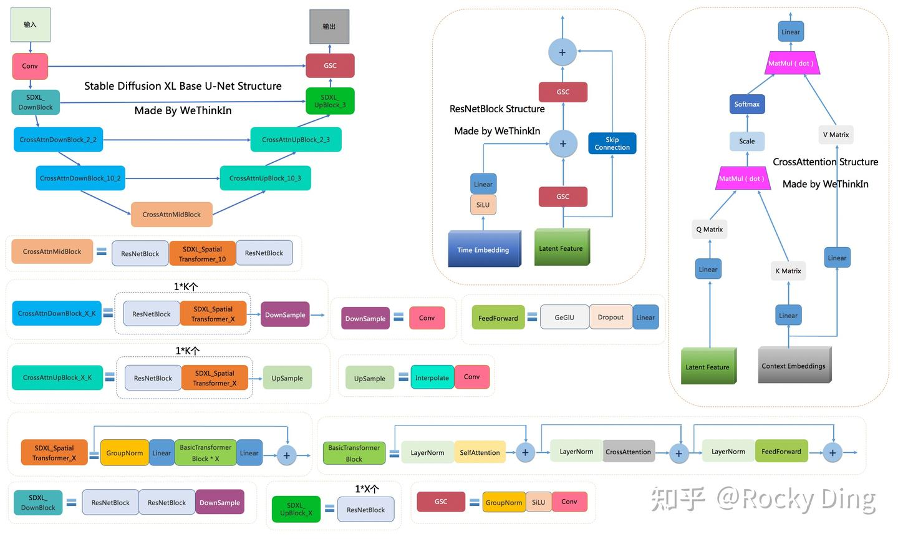</div>

### 1. 从四 stage 调整为三 stage，减少一次下采样/上采样

SD 1.x/2.x 的 U-Net 通常采用四 stage（可概括为 `[1,1,1,1]`），并进行三次下采样与上采样；SDXL 调整为三 stage（`[0,2,10]`），只做两次下采样与上采样。Encoder 由两个 `CrossAttnDownBlock` 和一个 `SDXL_DownBlock` 组成，Decoder 由两个 `CrossAttnUpBlock` 和一个 `SDXL_UpBlock` 组成，中间通过 Skip Connection 传递和融合多尺度信息。

第一个 stage 不再放置 Spatial Transformer，可以显著减少高分辨率 feature map 上的显存和二次复杂度；第二、第三 stage 的空间尺寸更小，却堆叠更多 Spatial Transformer（分别为 2 个和 10 个），从而在可控成本下提升全局语义建模能力。这种“高分辨率层少做 attention、低分辨率层集中堆 attention”的设计，使 SDXL 在扩大容量后推理耗时只比旧版增加约 20%～30%。

### 2. BasicTransformer Block 成为 U-Net 的容量核心

SDXL 新增的 `SDXL_Spatial Transformer_X` 由 `GroupNorm + Linear + X 个 BasicTransformer Block + Linear` 构成，并保留残差连接。每个 BasicTransformer Block 由 `LayerNorm + Self-Attention + Cross-Attention + FeedForward` 组成，FeedForward 采用 GEGLU + Dropout + Linear。Self-Attention 建模 latent 内部的全局关系，Cross-Attention 将文本条件注入图像特征，循环残差结构保证网络可以加深并保持梯度稳定。

Cross-Attention 中，latent feature 作为 Q，两个 Text Encoder 的序列特征作为 K/V。由于 latent 是 `[B,C,H,W]` 四维张量，执行 attention 前先变换为 `[B,H×W,C]`，完成后再变回 `[B,C,H,W]`；Linear 投影负责对齐不同 feature 的通道维度。

**面试金句**：SDXL U-Net 的创新可概括为“减少一次尺度变换、把 attention 从最大 feature map 移到中低分辨率层、用更深的 Spatial Transformer 扩容”。它同时提高了全局语义与高分辨率细节能力，并控制了 attention 的计算成本。

<h2 id="q-060">面试问题：Stable Diffusion XL 的 Text Encoder 部分有哪些创新？详细分析改进意图</h2>

**难度评分：⭐⭐⭐⭐ (4/5)  |  考察频率：⭐⭐⭐⭐ (4/5)**

SDXL 把 SD 1.x 的「单一 CLIP-L」升级为「**CLIP-L + OpenCLIP-bigG 双编码器 + Pooled Embedding 全局注入**」，这套设计在 SD 3、FLUX 中也得到延续，是新一代生成模型文本注入的重要范式。理解 SDXL 的 Text Encoder，关键是区分细粒度 token 条件和全局 pooled 条件两条路径。

<div align="center">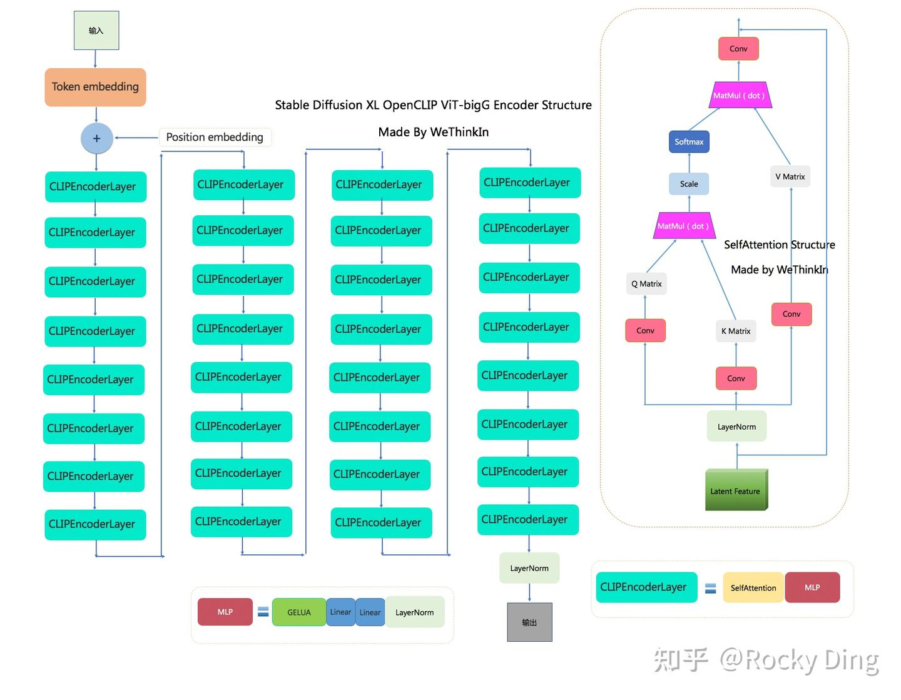</div>

OpenCLIP ViT-bigG 由 32 个 CLIP Encoder 组成，特征维度更大、网络更深；OpenAI CLIP ViT-L/14 由 12 个 CLIP Encoder 组成，保留了 SD 1.x 生态熟悉的文本表征空间。两者的基本 Encoder 单元相同，但容量和训练语料不同，组合后可以同时覆盖生态兼容性与更强的语义表达。

<div align="center">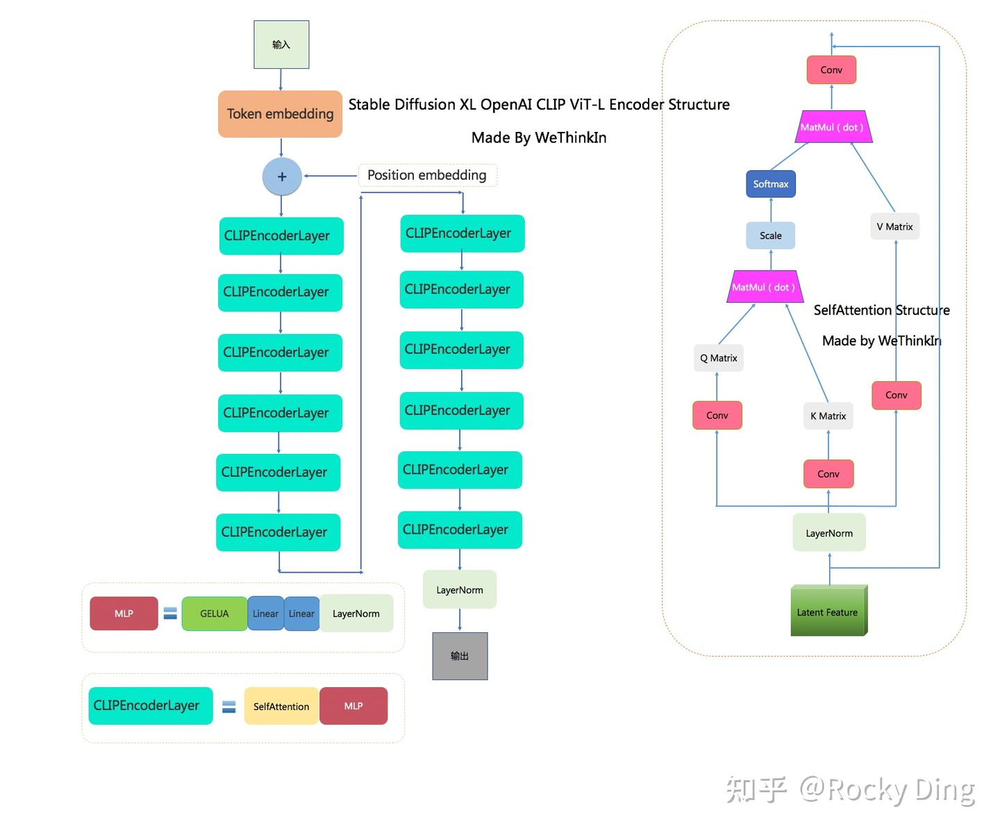</div>

### 1. 双 Text Encoder 的特征提取与注入链路

```text
输入 Prompt
   │
   ├──► CLIP-L Text Encoder ─► 倒数第二层 hidden state，shape = (77, 768)
   │
   └──► OpenCLIP-bigG Text Encoder ─► 倒数第二层 hidden state，shape = (77, 1280)
                                      └─► Pooled Embedding，shape = (1280,)

细粒度路径：
   concat([CLIP-L 序列, OpenCLIP-bigG 序列], dim=-1) → shape = (77, 2048)
   → 作为 U-Net Cross-Attention 的 K / V

全局路径：
   OpenCLIP-bigG Pooled → shape = (1280,)
   concat([Pooled Embedding, micro-conditioning time IDs], dim=-1)
   → 经 add embedding MLP → 与 timestep embedding 融合 → 作为全局调制信号
```

### 2. 双编码器的设计意图

- **CLIP-L 兼容旧生态**：保留 SD 1.x 时代用户熟悉的 Prompt 行为；
- **OpenCLIP-bigG 提供更强语义**：参数量 695M，远大于 ViT-L 的 124M，对长 Prompt、复杂语义、多概念组合的理解更强；
- **OpenCLIP-bigG 的 Pooled Embedding 提供全局风格**：Cross-Attention 偏向局部对齐，Pooled Embedding 提供整体风格与主题约束，二者互补；
- **细粒度 + 全局双通路**：为后续 SD 3、FLUX 的多模态条件注入提供了可复用的设计基础。

### 3. 工程实现中的常见踩坑

1. **取倒数第二层而非最后一层**：SDXL 训练时使用两个编码器的倒数第二层 hidden state；手写 pipeline 误用最后一层可能造成画质下降。diffusers 中需要开启 `output_hidden_states=True`；
2. **全局 Pooled Embedding 只取第二个编码器**：SDXL 使用 OpenCLIP-bigG 的 pooled output 作为全局文本条件，并不是把两个编码器的 pooled output 拼接；它对应 [EOT]（End of Text）token 位置的聚合表示，而不是 [CLS]；
3. **两个编码器的 padding 策略要一致**：都需要 padding 到 77 tokens，并保持 attention mask 一致；
4. **micro-conditioning 的融合顺序不能错**：`original_size`、`crop_top_left`、`target_size` 六个标量先分别做 sinusoidal embedding，再与 OpenCLIP-bigG 的 pooled embedding 拼接，经 add embedding MLP 后与 timestep embedding 融合；
5. **两个编码器接收同一份 Prompt**：不是分别输入“主体 Prompt”和“风格 Prompt”；
6. **CFG 的 unconditional 分支要分别准备**：两个编码器都要对空 Prompt 编码，拼接两路 uncond 序列特征，同时保留 OpenCLIP-bigG 对应的 uncond pooled embedding；
7. **LoRA / Dreambooth 微调需明确编码器策略**：工程上通常冻结两个 Text Encoder，仅微调 U-Net 或其 LoRA 参数。

**面试金句**：SDXL 的文本注入是「**两个 CLIP 的倒数第二层序列特征沿通道 concat，作为细粒度 Cross-Attention 条件；OpenCLIP-bigG 的 Pooled Embedding 再与 micro-conditioning 一起形成全局调制条件**」；取层、取 pooled 来源、padding 和 CFG uncond 准备，是手写 pipeline 时最容易出错的四个细节。

<h2 id="q-061">面试问题：Stable Diffusion XL 中使用的训练方法有哪些创新点？</h2>

**难度评分：⭐⭐⭐⭐ (4/5)  |  考察频率：⭐⭐⭐⭐⭐ (5/5)**

SDXL 的训练优化不是单个技巧，而是把数据预处理事实、噪声分布和条件注入共同纳入训练目标。下面先介绍 micro-conditioning，再说明 offset Noise 如何补足高分辨率扩散中的低频噪声覆盖。

### 1. SDXL 的 micro-conditioning（original_size / crop_top_left / target_size）是什么？为什么是 SDXL 工程化层面最关键的创新之一？

micro-conditioning 是 SDXL 论文中最有工程价值的「不起眼小创新」，它把图像在数据预处理阶段被「裁剪、缩放、填充」过的事实**显式告诉模型**，从而修复了 SD 1.5 时代普遍存在的「人物头部缺失、构图不全、低分辨率训练数据被错误利用」等问题。

**三个条件的具体含义**

<div align="center">

| 条件 | 含义 | 训练时的取值 | 推理时建议 |
| --- | --- | --- | --- |
| `original_size` | 图像在 resize 到训练分辨率前的**原始分辨率** | 数据集真实原始尺寸 | 想让模型按高分辨率风格生成时设大值（如 1024×1024 或更大） |
| `crop_top_left` | 训练时为对齐分辨率所做的中心裁剪偏移量 $`(c_y, c_x)`$ | 真实裁剪偏移 | 通常设 (0, 0) 表示「无裁剪、构图完整」 |
| `target_size` | 模型最终要生成的目标分辨率 | 训练分辨率 | 与 `original_size` 一致或按需求设定 |

</div>

注入方式：将 `original_size`、`crop_top_left`、`target_size` 拆成六个标量，分别经过 sinusoidal embedding 后拼接，再与 OpenCLIP-bigG 的 Pooled Embedding 一起经过 add embedding MLP，最终和 timestep embedding 融合作为 U-Net 的全局调制信号。

**为什么是 SDXL 工程化层面最关键的创新**

1. **修复「数据浪费」问题**：SD 1.x 训练时小于训练分辨率的样本会被丢弃，损失约 39% 的训练数据；SDXL 把 `original_size` 作为条件，让模型「知道这是低分辨率原图」，所有数据都能用，扩大了训练集规模与多样性；
2. **修复「裁剪导致内容缺失」问题**：SD 1.x 中心裁剪会让人物头部 / 物体边缘被切掉，模型学到「人物没有头是合理的」；SDXL 通过 `crop_top_left` 显式标注裁剪偏移，模型在推理时设 (0, 0) 就能生成完整构图；
3. **解锁「分辨率风格控制」**：推理时把 `original_size` 设为高值（如 4096×4096）能让模型按「高清原图风格」生成；设低值则生成颗粒感更强的「低分辨率风格」；
4. **零额外训练成本**：仅在 conditioning 部分加几个 MLP，参数量增量可忽略，但收益巨大。

**工程经验**

- 推理时**忘记设 `crop_top_left=(0,0)`** 是常见踩坑：会使生成图带有训练时随机裁剪的「构图偏移」；
- diffusers 默认 pipeline 已经做好这些参数管理，但自定义 pipeline / 训练脚本时务必显式传入；
- LoRA / Dreambooth 在 SDXL 上微调时，micro-conditioning 必须保持与训练时一致；
- SDXL Refiner 也复用了 micro-conditioning，但额外加了 `aesthetic_score` 条件。

**面试金句**：micro-conditioning 是 SDXL 把「数据预处理事实」从隐性变成显性，让模型「知道训练样本被怎么处理过」；这一步既扩大了可用训练数据 39%，又解决了人物头部缺失等典型构图问题，是 SDXL 工程化最高 ROI 的小改进。

### 2. 训练 Stable Diffusion XL 时为什么要使用 offset Noise？

SDXL 在高分辨率图像上训练时，普通的逐像素独立高斯噪声主要覆盖局部高频变化，无法充分改变整张图像的亮度、色调等低频统计。模型因此容易学习到“中等亮度、低对比度”的生成分布，在纯色背景、极亮或极暗场景中表现受限。

offset Noise 的做法是在标准噪声之外，为每个样本和每个 latent 通道额外采样一个空间上共享的偏移噪声，并广播到整个 $`H\times W`$ 特征图：

<div align="center">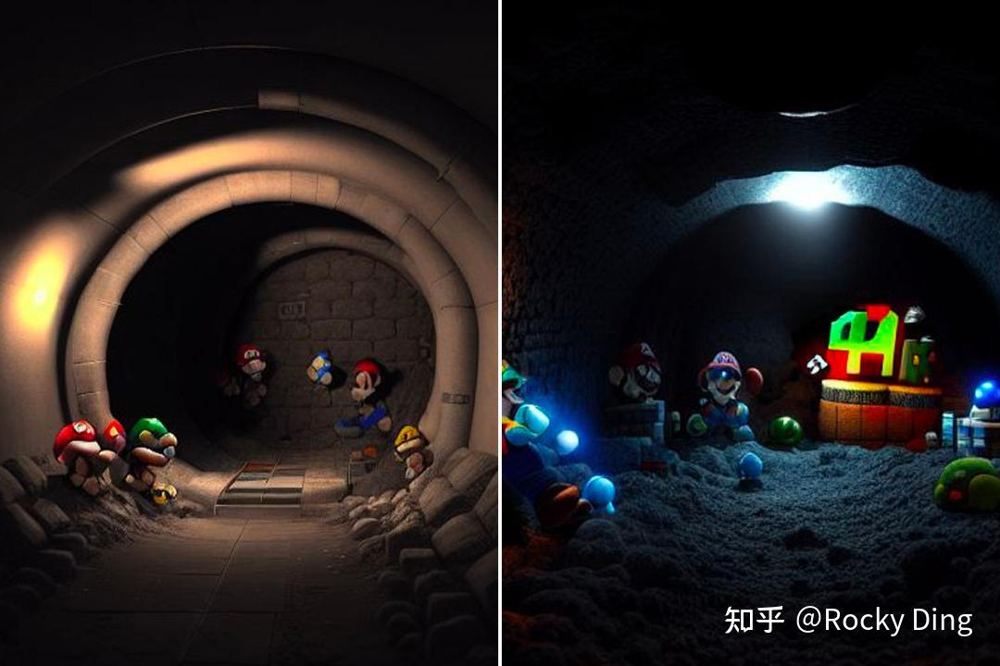</div>

```math
\epsilon' = \epsilon + \lambda\,\epsilon_{\mathrm{offset}},\qquad
\epsilon\sim\mathcal{N}(0,I),\quad
\epsilon_{\mathrm{offset}}\sim\mathcal{N}(0,I_{B\times C\times1\times1})
```

其中 $`\lambda`$ 是 offset Noise 的强度，`epsilon_offset` 在空间维度上保持一致，因此会整体推动某个通道的亮度或色彩，而不是只改变局部纹理。训练时使用 $`\epsilon'`$ 构造带噪 latent，推理时仍使用普通噪声；模型由此学会覆盖更宽的低频范围，生成纯黑、纯白、低照度和高对比度画面时更稳定。

工程上需要注意三点：第一，offset Noise 是训练分布的改变，微调 SDXL 时应与基础模型的噪声配置保持一致，不能只在推理端临时添加；第二，$`\lambda`$ 过大可能造成颜色漂移、细节不稳定，通常从较小值开始调参；第三，它解决的是低频动态范围问题，不能替代 micro-conditioning，前者改变噪声覆盖，后者告诉模型图像尺寸和裁剪事实。

**面试金句**：普通高斯噪声擅长破坏局部纹理，却不容易改变整幅图像的低频亮度和色调；offset Noise 通过空间共享的通道级噪声扩大低频覆盖，使 SDXL 能生成更明亮、更暗以及更高对比度的图像，但必须和训练阶段的噪声配置保持一致。

### 3. SDXL 的多尺度训练与 Ratio Bucketing 如何协同？

仅把训练分辨率固定为 1024×1024，会让不同长宽比的样本被强行裁剪；只依赖随机裁剪，又会损失主体边缘信息。SDXL 在尺寸/裁剪条件化的基础上引入多尺度微调，并采用 Ratio Bucketing：先按纵横比将样本分桶，使每个 bucket 的像素数尽量接近 1024×1024，相邻 bucket 的高度或宽度通常相差约 64 像素；每个 step 从同一个 bucket 采样一个 batch，再在 step 之间切换 bucket。

<div align="center">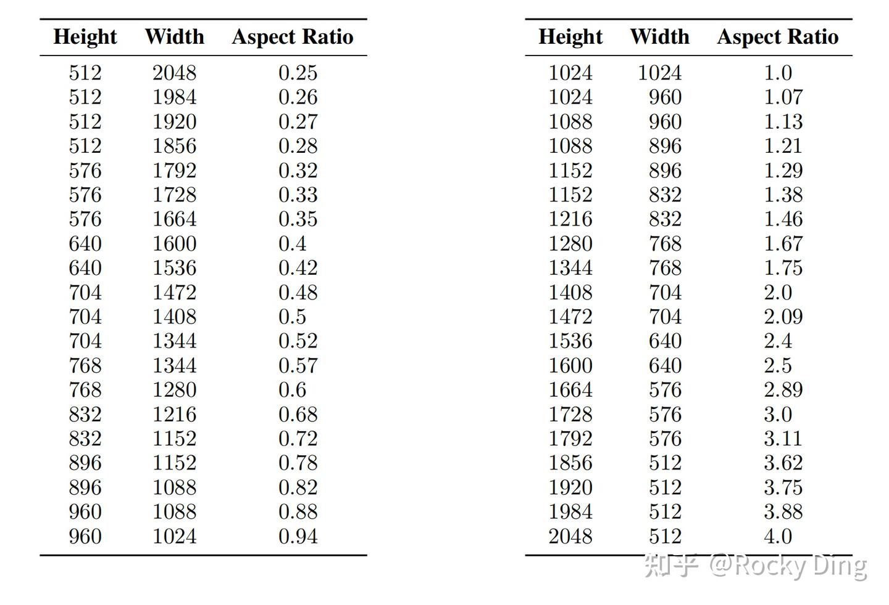</div>

这样做有三层意图：第一，减少不必要的裁剪，保留主体完整性；第二，让模型在训练阶段看到多种宽高比，避免只会生成正方形；第三，通过 bucket 内像素数近似恒定控制显存与吞吐。Aspect Ratio 也可以作为额外条件注入 U-Net，使网络区分不同尺度下的构图先验。官方推荐的默认生成尺寸仍是 1024×1024，但同一模型可以自然覆盖多种宽高比。

### 4. 尺寸、裁剪、宽高比与 pooled text embedding 如何注入 U-Net？

SDXL 的条件化并不只是一组 `time_ids`：`original_size`、`crop_top_left`、`target_size` 三组图像条件（共六个标量）以及 Aspect Ratio 都先经过与 timestep 相同的傅里叶/sinusoidal 编码；OpenCLIP-bigG 的 pooled text embedding 则提供全局语义。它们拼接后形成条件向量，再经过两个 Linear 层映射到与 time embedding 相同的维度，最后与 time embedding 相加，作为 U-Net 各层的全局调制信号。

<div align="center">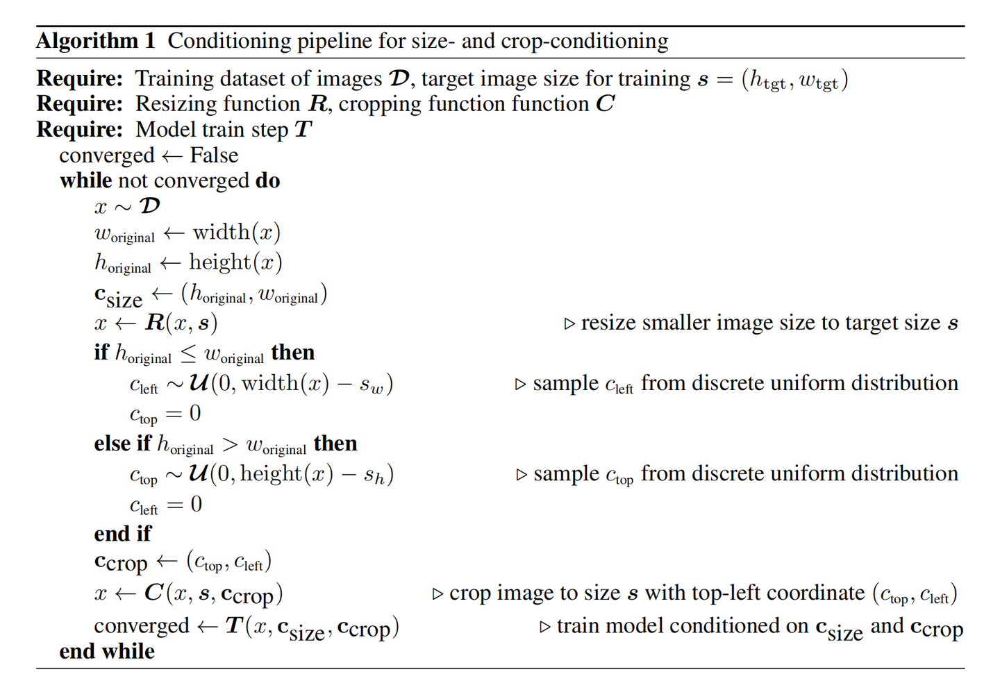</div>

这种设计把数据预处理事实、生成尺寸先验和文本整体语义放进同一条条件通路：训练时记录真实的原始长宽与裁剪左上角坐标，推理时通常设置 `crop_top_left=(0,0)` 以请求完整构图，再通过 `original_size/target_size` 控制目标尺寸风格。自定义训练脚本必须保证这些字段的顺序、单位和 CFG 的 unconditional 分支一致，否则会出现构图偏移或条件错位。

### 5. SDXL 的训练目标与整体配方

在上述条件注入之外，SDXL 仍采用 1000 步 DDPM noise scheduler 与 ε-prediction 目标。公开文章对训练配方的整理显示，模型先在 256×256 和 512×512 阶段分别进行约 600,000 步与 200,000 步预训练（batch size=2048），再在 1024×1024 为中心的多尺度桶上微调；这一安排先扩大数据覆盖，再让模型适应目标分辨率。带噪 latent 可写为

```math
\mathbf{x}_t=\sqrt{\bar{\alpha}_t}\mathbf{x}_0+\sqrt{1-\bar{\alpha}_t}\boldsymbol{\epsilon},\qquad
\mathcal{L}_{\mathrm{SDXL}}=\mathbb{E}\left[\left\|\boldsymbol{\epsilon}-\boldsymbol{\epsilon}_\theta(\mathbf{x}_t,t,\mathbf{c})\right\|_2^2\right]
```

其中 `c` 同时包含 token-level text conditioning 与 pooled/micro-conditioning。完整训练路线可以概括为：先在 256×256、512×512 阶段用尺寸和裁剪条件化扩大数据利用率，再在 1024×1024 像素规模附近进行多尺度分桶微调，最后通过 offset Noise 拓展亮度与色彩动态范围。几项技巧分别解决数据覆盖、构图完整性、宽高比泛化和低频色彩受限问题，组合起来才构成 SDXL 的工程化优势。


<h2 id="q-063">面试问题：介绍一下 Stable Diffusion XL Turbo 的原理</h2>

**难度评分：⭐⭐⭐⭐⭐ (5/5)  |  考察频率：⭐⭐⭐⭐ (4/5)**

SDXL-Turbo 的核心不是重新训练一个轻量 U-Net，而是把原本需要几十步的 SDXL 采样过程蒸馏为 1～4 步。理解它的原理，需要先看 ADD 的教师—学生—判别器结构，再比较后续少步蒸馏方法对质量、步数和可控性的改进。

### 1. SDXL-Turbo 使用的蒸馏方法：ADD

论文链接：[adversarial_diffusion_distillation.pdf](https://static1.squarespace.com/static/6213c340453c3f502425776e/t/65663480a92fba51d0e1023f/1701197769659/adversarial_diffusion_distillation.pdf)

**方法结构**

ADD 模型的结构包括三个核心组件：

1. **ADD 学生模型 (Student Model)**：这是一个预训练的扩散模型，负责生成图像样本。
2. **判别器 (Discriminator)**：用来区分生成的样本和真实图像，通过对抗性训练来提升生成图像的真实感。
3. **DM 教师模型 (Teacher Model)**：这是一个冻结权重的扩散模型，作为知识的教师，为学生模型提供目标图像来实现知识蒸馏。

<div align="center">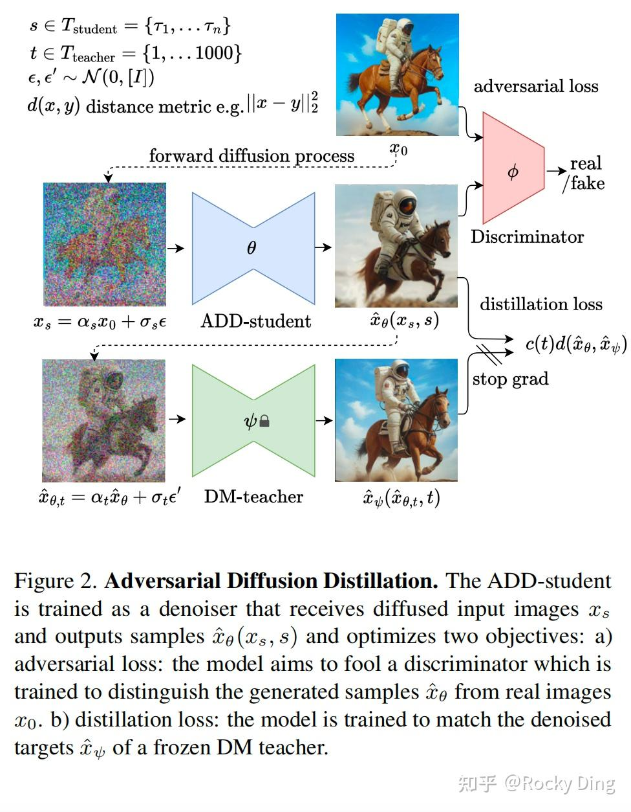</div>

**核心原理**

ADD 的核心原理是通过两个损失函数的结合实现蒸馏过程：

1. **对抗性损失 (Adversarial Loss)**：学生模型生成的样本被输入判别器，判别器尝试将生成的样本与真实图像区分开。学生模型则优化生成图像，使其更难被判别器检测到为假，从而提升图像的细节和逼真度。官方配方借鉴 GAN 的 Hinge loss，使学生在一到两步的极短轨迹上仍保持纹理保真度，减少少步蒸馏常见的模糊与失真。
2. **蒸馏损失 (Distillation Loss)**：ADD 使用另一个冻结的强扩散模型作为教师，并通过蒸馏损失指导学生模型生成与教师模型相似的图像。教师模型对学生生成的噪声数据进行去噪，从而提供高质量的生成目标；该项通常用 L2 距离约束学生与教师的输出，使学生继承教师的语义一致性。

训练时将两项损失加权求和，官方示例中的权重为 `λ=2.5`。SDXL-Turbo 本质上仍是 SDXL Base 的 U-Net、VAE 和双 Text Encoder，不包含 Refiner；蒸馏改变的是采样轨迹与步数，而不是把 Backbone 换成轻量 GAN。官方报告在 A100 上给出约 207 ms 的 512×512 单步端到端耗时（含 prompt encoding、一次去噪和解码），因此它适合实时交互，但默认不使用 CFG 和 `negative_prompt`。

ADD 模型具有以下优势：

- **高速生成**：仅需 1-4 步采样即可生成高质量图像，显著减少了生成时间，适用于实时应用。
- **高质量图像**：通过结合对抗性损失和蒸馏损失，生成的图像在细节和逼真度上优于现有的快速生成模型，如单步 GAN 和一些少步扩散模型。
- **灵活性**：支持进一步的多步采样，从而在单步生成的基础上通过迭代增强图像细节。

### 2. 相比 SDXL-Turbo，新一代少步蒸馏方法有哪些进步？

SDXL-Turbo（ADD）开启了 SDXL 的少步生成时代，但也存在「单步质量上限有限、CFG 不可用、画风偏写实」等问题。**SDXL Lightning、DMD / DMD2、Hyper-SD** 等新一代蒸馏方法在「质量、可控性、训练稳定性」上做了系统性升级，是当前少步生成的主流。

**主流少步蒸馏方法对比**

<div align="center">

| 方法 | 提出方 | 核心思想 | 步数 | 是否支持 CFG | 训练稳定性 |
| --- | --- | --- | --- | --- | --- |
| **SDXL-Turbo (ADD)** | Stability AI | 对抗 + 蒸馏，像素空间判别器 | 1 ~ 4 | 不支持（已固化） | 中 |
| **SDXL Lightning** | ByteDance | **渐进式蒸馏 + 对抗 + 多步组合**，支持 1/2/4/8 步多档 | 1 ~ 8 | 受限 | 高，多档统一 |
| **DMD（Distribution Matching Distillation）** | MIT / Adobe | **分布匹配蒸馏**，让学生模型的输出分布逼近教师 | 1 ~ 4 | 不支持 | 中 |
| **DMD2** | MIT / Adobe | DMD 升级版：双判别器 + GAN loss 稳定化 | 1 ~ 4 | 不支持 | 高，画质显著提升 |
| **Hyper-SD** | ByteDance | **轨迹分段一致性蒸馏 + 人类反馈对齐 + LoRA 形式发布** | 1 ~ 8 | 部分支持 | 高，可作为 LoRA 适配器 |
| **PCM（Phased Consistency Model）** | 上海 AI Lab | **分相位的一致性蒸馏**，缓解一致性模型在 SDXL 上的画质塌缩 | 1 ~ 8 | 受限 | 高 |

</div>

**相比 SDXL-Turbo 的关键进步**

1. **多步档位统一**：SDXL Lightning、Hyper-SD 用一份权重支持 1 / 2 / 4 / 8 步推理，而 Turbo 通常一档一个权重，部署成本大幅下降；
2. **质量显著提升**：DMD2、Hyper-SD 在 4 步推理上的 FID / 视觉质量已经接近教师 SDXL 25 步的水平，远超 SDXL-Turbo；
3. **画风更通用**：Turbo 偏写实、对动漫 / 二次元支持差；Lightning / Hyper-SD 等保留了原始 SDXL 的画风分布；
4. **LoRA 形式发布**：Hyper-SD、Lightning 都提供 LoRA 权重，可以叠加在自定义 SDXL 模型上，而不破坏用户已有的 LoRA 生态；
5. **训练稳定性提升**：DMD2 的双判别器、Hyper-SD 的轨迹分段一致性、PCM 的分相位一致性都解决了「对抗训练塌缩」的工程难题；
6. **部分支持 CFG**：Hyper-SD 支持有限 CFG（小尺度），缓解了 Turbo「CFG 失效」的可控性问题；
7. **配套 reward model 与人类反馈**：Hyper-SD 显式引入了人类偏好对齐，是 SDXL 蒸馏方法中第一个引入 RLHF 思路的。

**工程选择建议**

- **要求最快、可接受质量妥协**：SDXL-Turbo / DMD（1 步）；
- **追求质量与速度均衡**：SDXL Lightning 4 步 / Hyper-SD 4-8 步；
- **要叠在已有 SDXL fine-tune / LoRA 上**：Hyper-SD（LoRA 形式）；
- **追求新一代最佳画质**：DMD2（4 步）。

**跨周期价值**

少步蒸馏方法是「**扩散模型从研究走向实时应用**」的关键技术路线；**ADD → DMD → Lightning → Hyper-SD → DMD2** 这条主线后续被 FLUX、SD 3 全部继承，理解 SDXL 上的演进有助于看懂 FLUX-schnell、SD3-Turbo、SD 3.5-Turbo 等新一代 Turbo 模型。

**面试金句**：SDXL-Turbo 解决了「能不能 4 步出图」，新一代 Lightning / DMD2 / Hyper-SD 解决的是「**能不能在 4 步出图同时保留画风、支持 CFG、用 LoRA 发布、训练稳定**」；这是「**研究 demo → 工业可用**」的工程化跃迁。


<h2 id="q-065">面试问题：什么是 SDXL Refiner？</h2>

**难度评分：⭐⭐⭐⭐ (4/5)  |  考察频率：⭐⭐⭐⭐ (4/5)**

SDXL Refiner是Stability AI推出的图像精细化模型，作为SDXL生态系统的第二阶段，专门负责提升图像细节质量。它采用了"专家集成"的设计理念：Base模型生成基础结构，Refiner模型优化细节表现。

<div align="center">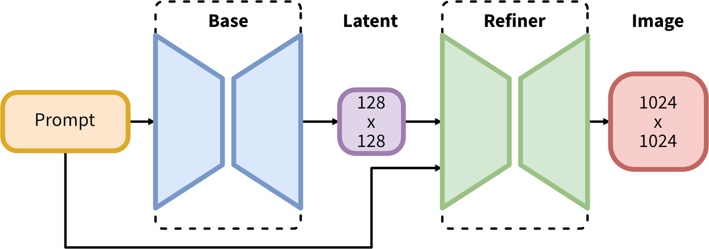</div>

SDXL 是二阶段级联 Latent Diffusion Model：Base 负责文生图、图生图和 inpainting，先生成结构稳定的 latent；Refiner 接收 Base latent，在较低噪声区间继续去噪，重点补足纹理、背景和人脸等高频细节。这个过程本质上是 latent 空间的 img2img，而不是重新从文本开始生成。

<div align="center">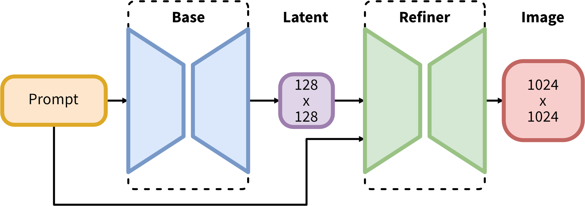</div>

### 核心工作原理

<div align="center">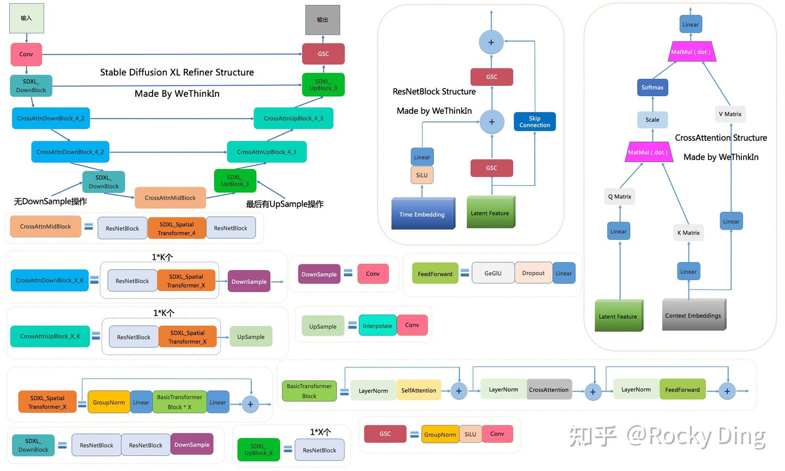</div>

**两种使用方式**

1. **标准流程**：Base模型完成80%去噪 → Refiner完成剩余20%精细化
2. **SDEdit流程**：Base生成完整图像 → Refiner使用img2img技术优化

标准工作流通常让 Base 完成前约 80% 的去噪，再把剩余约 20% 的低噪声步骤交给 Refiner；也可以先由 Base 完整出图，再通过 img2img 给 latent 添加少量噪声后交给 Refiner。Refiner 只在前 200 个 timesteps（低噪声水平）上训练，因此不适合从纯噪声独立采样。

### 技术特点

- **双文本编码器**：OpenCLIP-ViT/G + CLIP-ViT/L，提供更好的语义理解
- **专门优化**：针对低噪声水平的去噪过程进行特殊训练
- **参数规模**：6.06B参数，专注于细节增强

在结构上，Refiner 与 Base 共用同一个 VAE，但只使用 OpenCLIP ViT-bigG Text Encoder，并同样提取倒数第二层序列特征和 pooled text embedding；其 U-Net 的通道数与 attention 堆叠深度针对低噪声精修做了调整，参数规模略小于 Base。

### 性能提升

根据官方评测，SDXL Base + Refiner的组合相比之前版本：

- 用户偏好度达到91%（远超SD 1.5/2.1）

- 细节清晰度提升约20-30%

- 整体图像质量显著改善

<div align="center">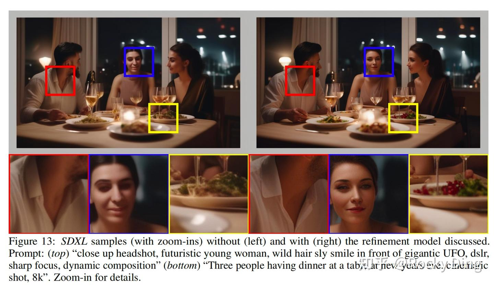</div>

- SDXL Refiner通过专门的精细化设计，成功解决了AI图像生成中的细节问题。它与Base模型的配合使用，让SDXL成为目前最优秀的开源图像生成方案之一。对于追求高质量图像输出的用户，Refiner是不可或缺的工具。

由于 Refiner 主要学习低噪声细节迁移，它也可以作为 Stable Diffusion、Midjourney、DALL·E、GAN 或其他 VAE/扩散模型的级联后处理组件；工程上可按延迟预算选择“Base-only”或“Base + Refiner”，并不要求所有场景都启用第二阶段。


<h1 id="q-066">6.介绍一下 Stable Diffusion 3的原理和创新点</h1>

<h2 id="q-067">面试问题：SD 3 的 VAE 部分有哪些创新？详细分析改进意图</h2>

**难度评分：⭐⭐⭐⭐ (4/5)  |  考察频率：⭐⭐⭐⭐⭐ (5/5)**

### Stable Diffusion 3 整体架构初识

Stable Diffusion 3 是 Stability AI 发布的文生图大模型。相比此前的 Stable Diffusion 系列，它在多主题提示词的控制一致性（multi-subject prompts）、文字渲染能力（spelling abilities）以及整体图像质量（image quality）三个维度都有明显提升。

SD 3 依旧是一个 End-to-End 模型，最大的架构亮点是扩散 Backbone 使用全新的 MM-DiT（Multimodal Diffusion Transformer）；训练目标则采用优化后的 Flow Matching，使训练过程更加高效稳定，并支持更快的采样生成。为了适配不同应用场景和硬件环境，SD 3 的扩散 Backbone 覆盖约 800M 到 8B 参数的多个版本，也进一步体现了 Transformer 架构的 Scaling 能力。

以开源的 Stable Diffusion 3 Medium 为例，FP16 权重约 15.8GB，其中 MM-DiT 约 4.17GB、参数量约 2B；VAE 约 168MB、参数量约 80M；CLIP ViT-L 约 246MB、参数量约 124M；OpenCLIP ViT-bigG 约 1.39GB、参数量约 695M；T5-XXL 在 FP16 下约 9.79GB、参数量约 4.7B，在 FP8 下约 4.89GB。这个参数构成也解释了为什么 Text Encoder 缓存、T5-XXL 量化和模块卸载会成为 SD 3 工程部署中的核心问题。

从技术演进的角度看，Stable Diffusion 3 的价值类似于传统深度学习时代的 YOLOv4：它把多模态表示、生成骨干和训练工程放在同一个系统中协同优化，因而具有较强的学习与借鉴价值。相较于此前系列，核心改进可以概括为：

1. 使用多模态DiT作为扩散模型核心：多模态DiT（MM-DiT）将图像的Latent tokens和文本的tokens拼接在一起，并采用两套独立的权重处理，但是在进行Attention机制时统一处理。
2. 改进VAE：通过增加VAE通道数来提升图像的重建质量。
3. 3个文本编码器：SD 3中使用了三个文本编码器，分别是CLIP ViT-L（参数量约124M）、OpenCLIP ViT-bigG（参数量约695M）和T5-XXL encoder（参数量约4.7B）。
4. 采用优化的Rectified Flow：采用Rectified Flow来作为SD 3的采样方法，并在此基础上通过对中间时间步加权能进一步提升效果。
5. 采用QK-Normalization：当模型变大，而且在高分辨率图像上训练时，attention层的attention-logit（Q和K的矩阵乘）会变得不稳定，导致训练出现NAN，为了提升混合精度训练的稳定性，MM-DiT的self-attention层采用了QK-Normalization。
6. 多尺寸位置编码：SD 3会先在256x256尺寸下预训练，再以1024x1024为中心的多尺度上进行微调，这就需要MM-DiT的位置编码需要支持多尺度。
7. timestep schedule进行shift：对高分辨率的图像，如果采用和低分辨率图像的一样的noise schedule，会出现对图像的破坏不够的情况，所以SD 3中对noise schedule进行了偏移。
8. 强大的模型Scaling能力：SD 3中因为核心使用了transformer架构，所以有很强的scaling能力，当模型变大后，性能稳步提升。
9. 训练细节：数据预处理（去除离群点数据、去除低质量数据、去除NSFW数据）、图像Caption精细化、预计算图像和文本特征、Classifier-Free Guidance技术、DPO（Direct Preference Optimization）技术

下面先聚焦分析 SD 3 的 VAE 部分；Backbone 与 Text Encoder 的设计分别在后续子问题中展开，训练目标和数据工程则统一放在训练技巧子问题中说明。

### Stable Diffusion 3的VAE部分的创新

**VAE（变分自编码器，Variational Auto-Encoder）在 Stable Diffusion 3（SD 3）中依旧是不可或缺的组成部分**。从更长周期看，它仍会在 AIGC 工作流中持续承担压缩与重建职责。

到目前为止，在AI绘画领域中关于VAE模型我们可以明确的得出以下经验：

1. VAE作为Stable Diffusion 3的组成部分在AI绘画领域持续繁荣，是VAE模型在AIGC时代中最合适的位置。
2. VAE在AI绘画领域的主要作用，不再是生成能力，而是辅助SD 3等AI绘画大模型的**压缩和重建能力**。
3. **VAE的编码和解码功能，在以SD 3为核心的AI绘画工作流中有很强的兼容性、灵活性与扩展性**，也为Stable Diffusion系列模型增添了几分优雅。

和之前的系列一样，在SD 3中，VAE模型依旧是将像素级图像编码成Latent特征，不过由于SD 3的扩散模型部分全部由Transformer架构组成，所以还需要将Latent特征转换成Patches特征，再送入扩散模型部分进行处理。

之前SD系列中使用的VAE模型是将一个 $H \times W \times 3$ 的图像编码为 $\frac{H}{8} \times \frac{W}{8} \times d$ 的Latent特征，在8倍下采样的同时设置 $d=4$ （通道数），这种情况存在一定的压缩损失，产生的直接影响是对Latent特征重建时容易产生小物体畸变（比如人眼崩溃、文字畸变等）。

所以SD 3模型通过提升 $d$ 来增强VAE的重建能力，提高重建后的图像质量。下图是SD 3技术报告中对不同 $d$ 的对比实验：

<div align="center">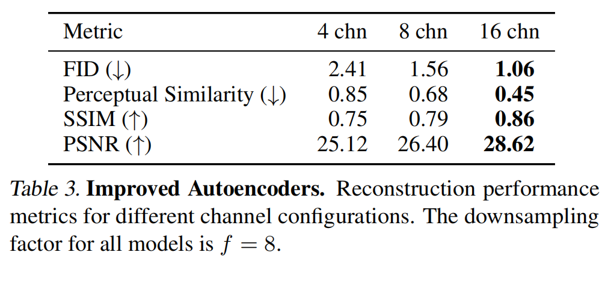</div>

我们可以看到，当设置 $d=16$ 时，VAE模型的整体性能（FID指标降低、Perceptual Similarity指标降低、SSIM指标提升、PSNR指标提升）比 $d=4$ 时有较大的提升，所以SD 3确定使用了 $d=16$ （16通道）的VAE模型。

与此同时，随着VAE的通道数增加到16，扩散模型部分（U-Net或者DiT）的通道数也需要跟着修改（修改扩散模型与VAE Encoder衔接的第一层和与VAE Decoder衔接的最后一层的通道数），虽然不会对整体参数量带来大的影响，但是会增加任务整体的训练难度。**因为当通道数从4增加到16，SD 3要学习拟合的内容也增加了4倍**，我们需要增加整体参数量级来提升**模型容量（model capacity）**。下图是SD 3论文中模型通道数与模型容量的对比实验结果：

<div align="center">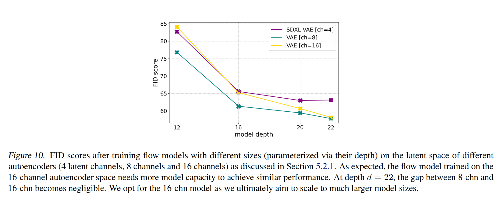</div>

当模型参数量小时，16通道VAE的重建效果并没有比4通道VAE的要更好，当模型参数量逐步增加后，16通道VAE的重建性能优势开始展现出来，**当模型的深度（depth）增加到22时，16通道的VAE的性能明显优于4通道的VAE**。

不过上图中展示了 8 通道 VAE 在 FID 指标上与 16 通道 VAE 接近。生成模型不能只用单一指标评价整体效果，FID 也只是图像质量的间接指标，无法充分反映细节差异。从重建效果看，16 通道 VAE 仍然具有更强的细节保真能力；当模型参数量级增大后，这一优势也转化为更高的整体性能上限和更大的优化空间。

下面给出 Stable Diffusion 3 VAE 的完整结构图，用于直观理解编码、扩散前的 latent 表示与解码重建之间的关系：

<div align="center">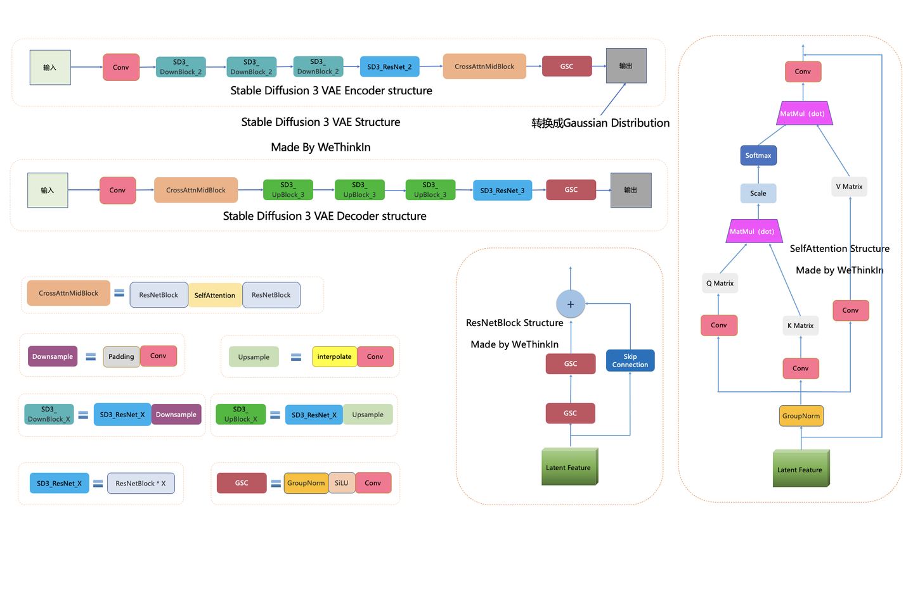</div>

### VAE 结构组成与高分辨率重建表现

从完整结构看，SD 3 VAE 模型包含三个基础组件：

1. **GSC 组件**：GroupNorm + SiLU + Conv。
2. **Downsample 组件**：Padding + Conv。
3. **Upsample 组件**：Interpolate + Conv。

同时，SD 3 VAE 还包含两个核心组件：ResNetBlock 模块和 Self-Attention 模块。VAE Encoder 部分包含三个 DownBlock 模块、一个 ResNetBlock 模块以及一个 MidBlock 模块，将输入图像压缩到 Latent 空间并转换为 Gaussian Distribution；VAE Decoder 部分则执行相反的过程，输入 Latent 特征并重建为像素级图像，包含三个 UpBlock 模块、一个 ResNetBlock 模块以及一个 MidBlock 模块。

在高分辨率场景下，SD 3 VAE 的重建优势更加明显。以 1024×1024 和 2048×2048 分辨率图像为例，SDXL VAE 在 2048×2048 图像上会出现较明显的内容和文字信息损失，而 SD 3 VAE 能够更好地完成高分辨率图像的压缩与重建。

<div align="center">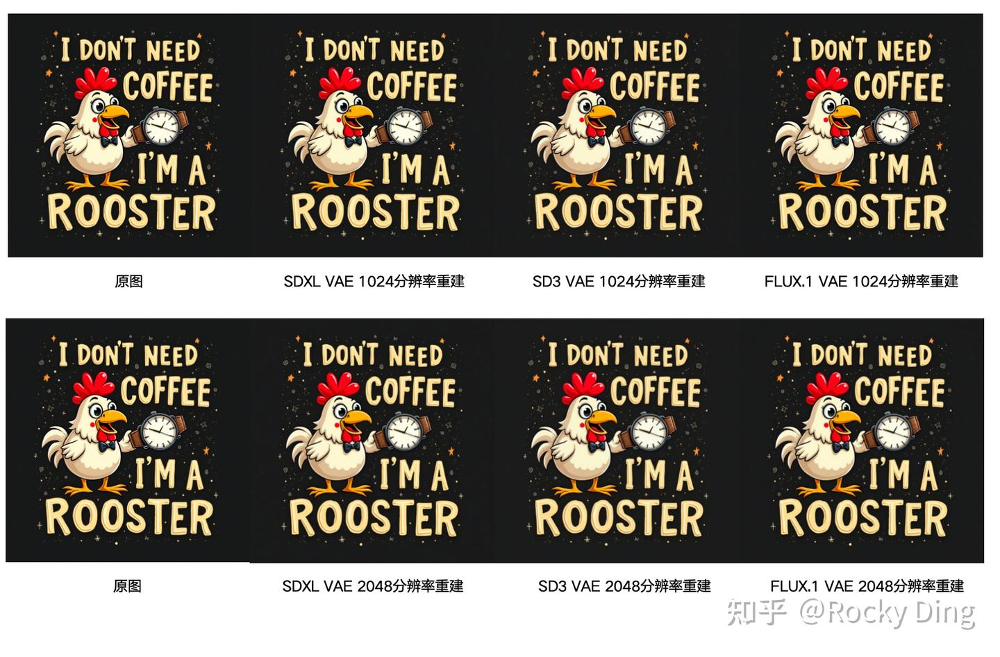</div>

<h2 id="q-067a">面试问题：SD 3 的 Backbone 部分有哪些创新？详细分析改进意图</h2>

**难度评分：⭐⭐⭐⭐⭐ (5/5)  |  考察频率：⭐⭐⭐⭐⭐ (5/5)**

DiT（Diffusion Transformer）是把扩散模型的 Backbone 从 U-Net 换成 Transformer 的奠基工作；MM-DiT（Multimodal DiT）则是 DiT 在「文本-图像联合建模」上的关键升级，是 SD 3、FLUX.1 共同的 Backbone 设计模板。

### 1. 原始 DiT 的核心结构

- 输入只有图像 Latent Token；
- 文本条件通过 **AdaLN-Zero**（Adaptive LayerNorm 调制 scale / shift）注入到 Transformer 的每一个 block；
- 文本条件被压缩成一个 pooled embedding 后经 MLP 给出 scale / shift；
- 文本与图像之间**不存在 token 级 attention 交互**，文本只能通过「全局调制」影响图像。

这种范式在「类别条件生成」上效果好（如 ImageNet class-conditional），但**对长 prompt、复杂语义、文字渲染不够友好**——文本的细粒度信息在 pooling 中被丢失。

### 2. MM-DiT 的核心改进

<div align="center">

| 维度 | 原始 DiT | MM-DiT |
| --- | --- | --- |
| **输入序列** | 仅图像 token | **图像 token + 文本 token 拼接成统一序列** |
| **文本注入方式** | AdaLN-Zero 全局调制 | **Self-Attention 内文本与图像 token 双向交互** |
| **权重共享** | 单套 Transformer 权重 | **图像与文本各自一套独立 Linear / FFN 权重**，但共享 Attention |
| **跨模态交互粒度** | 全局 | **Token 级、双向** |
| **文字渲染能力** | 弱 | **强**（双向 attention 让模型知道每个文字 token 应该出现在哪个图像 token） |
| **长 prompt 利用** | 有限 | 显著增强 |

</div>

### 3. 关键技术细节

- **双权重单注意力（Dual-Stream → Single Attention）**：图像和文本 token 各自先经过自己的 Linear / FFN（参数不共享），再在 Self-Attention 中拼接序列做联合注意力，输出后再分回各自分支；这种「两路独立、共用 attention」是 MM-DiT 的标志性设计；
- **QK-Norm**：对 Q、K 做 L2 norm，缓解高分辨率训练时 attention logits 爆炸 / NaN 的问题；
- **AdaLN-Zero 仍然保留**：用于注入 timestep + Pooled Text Embedding 作为全局调制；
- **Token 拼接顺序**：通常 `[text_tokens, image_tokens]`，attention mask 全开；
- **位置编码**：图像走 2D RoPE / 2D positional embedding；文本走 1D positional embedding；统一序列内坐标各自独立。

### 4. 为什么 SD 3 选择 MM-DiT 而非 DiT

1. **文字渲染需求**：DALL-E 3、Imagen 已经证明强文本对齐与文字渲染需要文本与图像 token 级交互；DiT 的全局调制做不到；
2. **多文本编码器组合**：SD 3 用了 CLIP-L、OpenCLIP-bigG、T5-XXL 三个编码器，文本 token 数量远大于一个 pooled vector，必须有 token 级注入通道；
3. **多模态扩展性**：未来扩展到「文本 + 参考图 + 深度 + 姿态」多条件生成，MM-DiT 的拼接式注入可以无缝扩展为更多模态序列；
4. **保留 DiT 的 Scaling Law**：MM-DiT 仍然是纯 Transformer，沿用 DiT 的良好 scaling 性质。

**面试金句**：DiT 把扩散 Backbone 从 U-Net 升级为 Transformer，但仍把文本当作「全局调制」；**MM-DiT 把文本和图像放进同一个 token 序列做双向 self-attention，配合「双权重 + 单注意力」的设计**，让 SD 3 / FLUX 在长 prompt、文字渲染、多模态扩展上获得了 DiT 无法达到的能力。

### MM-DiT Block 组成、位置编码与 Scaling 能力

从实现结构看，SD 3 的 MM-DiT 主要包含以下核心模块：

1. **MM-DiT Block**：SD 3 medium 使用 24 个 MM-DiT Block 构成 Backbone 主体。每个 Block 包含两个 AdaLayerNormZero 层、一个 MM-DiT Attention 层、两个 LayerNorm 层和两个 FeedForward 层。
2. **MM-DiT Attention**：用于让图像特征和文本特征在同等级别上进行 Attention 交互。
3. **FeedForward**：由 GELU、Dropout 和 Linear 组成。

和原生 DiT 一样，MM-DiT 会先在 Latent 空间中将图像 Latent 特征转换成 Patches 特征，Patch Size 为 $2\times2$，再将 Patch Embedding 与 Positional Embedding 相加后输入 Transformer 主架构。SD 3 使用固定的二维 Sine-Cosine Positional Embedding，本质上通过正弦和余弦函数根据 Patch 的二维位置（行和列）生成固定位置编码，使 Transformer 能够感知图像的空间布局。

与此同时，MM-DiT 会将文本特征中的 CLIP Pooled Embedding（全局语义信息）直接与 Timestep Embedding 相加，并通过 AdaLayerNormZero 将融合后的 Conditioning 特征注入每一个 Transformer Block。这样既保留了全局条件控制，又通过文本 Token 与图像 Token 的联合 Attention 建立细粒度对齐。

SD 3 论文还将 MM-DiT 与引入 Cross-Attention 的 CrossDiT、U-Net 和 Transformer 混合的 UViT 进行对比。实验表明，MM-DiT 的性能明显优于其他架构。其参数规模主要由模型深度决定：论文中的中间特征维度设置为 $64\cdot d$，深度为 24 时参数量约为 2B，深度为 38 时参数量约为 8B。按照论文中的规模设定，深度从 24 增加到 38 时，参数量近似按立方关系增长，即 $2\mathrm{B}\times(38/24)^3\approx8\mathrm{B}$，这也解释了不同 SD 3 版本之间的容量跨度。

这说明基于 Transformer 的 SD 3 具备较好的 Scaling 能力。当模型参数量持续增加时，验证损失呈现平滑下降趋势，并且与 T2I-CompBench、GenEval 和人类视觉偏好等指标具有较强相关性。不过，参数规模扩大后，学习率等超参数也需要更细致地调整，否则大模型训练可能出现发散。整体而言，SD 3 的实验仍未观察到明显的性能饱和，Scaling Law 仍然是其持续提升的重要工程基础。

<h2 id="q-067c">面试问题：SD 3 的 Text Encoder 部分有哪些创新？详细分析改进意图</h2>

**难度评分：⭐⭐⭐⭐ (4/5)  |  考察频率：⭐⭐⭐⭐⭐ (5/5)**

### Stable Diffusion 3的Text Encoder部分的创新

Stable Diffusion 3 的 Text Encoder 设计，是其文字渲染和 Prompt Following 能力提升的关键。理解这一部分时，可以沿着“编码器分工—特征融合—条件注入—工程取舍”四个环节展开。

Stable Diffusion 3的文字渲染能力很强，同时遵循文本Prompts的图像生成一致性也非常好，**这些能力主要得益于SD 3采用了三个Text Encoder模型**，它们分别是：

1. CLIP ViT-L（参数量约124M）
2. OpenCLIP ViT-bigG（参数量约695M）
3. T5-XXL Encoder（参数量约4.76B）

在SD系列模型的版本迭代中，Text Encoder部分一直在优化增强。一开始SD 1.x系列的Text Encoder部分使用了CLIP ViT-L，在SD 2.x系列中换成了OpenCLIP ViT-H，到了SDXL则使用CLIP ViT-L + OpenCLIP ViT-bigG的组合作为Text Encoder。有了之前的优化经验，SD 3更进一步增加Text Encoder的数量，加入了一个参数量更大的T5-XXL Encoder模型。

与SD模型的结合其实不是T5-XXL与AI绘画领域第一次结缘，早在2022年谷歌发布Imagen时，就使用了T5-XXL Encoder作为Imagen模型的Text Encoder，**并证明了预训练好的纯文本大模型能够给AI绘画大模型提供更优良的文本特征**。接着OpenAI发布的DALL-E 3也采用了T5-XXL Encoder来提取文本（Prompts）的特征信息，足以说明T5-XXL Encoder模型在AI绘画领域已经久经考验。

**SD 3 加入 T5-XXL Encoder，是其文本理解能力和文字渲染能力提升的关键设计**。它说明预训练语言模型中的长程语义建模能力，可以迁移到图像生成的条件建模环节。

总的来说，**SD 3一共需要提取输入文本的全局语义和文本细粒度两个层面的信息特征**。

首先需要**提取CLIP ViT-L和OpenCLIP ViT-bigG的Pooled Text Embeddings，它们代表了输入文本的全局语义特征**，维度大小分别是768和1280，两个embeddings拼接（concat操作）得到2048的embeddings，然后经过一个MLP网络并和Timestep Embeddings相加（add操作）。

接着我们需要**提取输入文本的细粒度特征**。这里首先分别提取CLIP ViT-L和OpenCLIP ViT-bigG的倒数第二层的特征，拼接在一起得到77x2048维度的CLIP Text Embeddings；再从T5-XXL Encoder中提取最后一层的T5 Text Embeddings特征，维度大小是77x4096（这里也限制token长度为77）。紧接着对CLIP Text Embeddings使用zero-padding得到和T5 Text Embeddings相同维度的编码特征。最后，将padding后的CLIP Text Embeddings和T5 Text Embeddings在token维度上拼接在一起，得到154x4096维度的混合Text Embeddings。这个混合Text Embeddings将通过一个linear层映射到与图像Latent的Patch Embeddings特征相同的维度大小，最终和Patch Embeddings拼接在一起送入MM-DiT中。具体流程如下图所示：

<div align="center">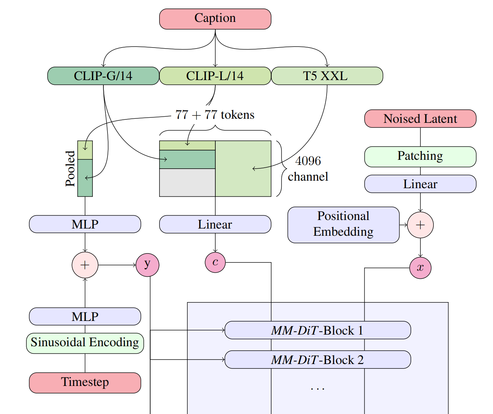</div>

虽然 CLIP ViT-L、OpenCLIP ViT-bigG 与 T5-XXL Encoder 的组合带来了文字渲染和文本一致性增益，但也存在上下文长度上的约束：CLIP ViT-L 和 OpenCLIP ViT-bigG 默认只能编码 77 tokens，这使原本能够处理 512 tokens 的 T5-XXL 在 SD 3 中也受限于 77 tokens。作为对比，DALL-E 3 只使用 T5-XXL 作为 Text Encoder，可以输入 512 tokens，从而更充分地发挥其长上下文能力。


### 为什么 Stable Diffusion 3 使用三个文本编码器？

上文已经介绍了三个 Text Encoder 如何分别提供全局语义与细粒度文本特征，下面进一步从训练与推理的角度说明这一设计。

Stable Diffusion 3作为一款先进的文本到图像模型,采用了三重文本编码器的方法。这一设计选择显著提升了模型的性能和灵活性。

<div align="center">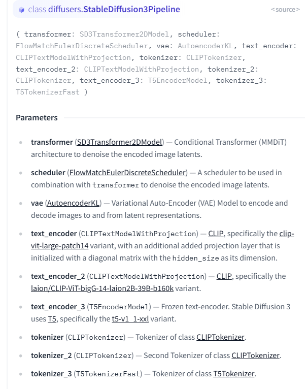</div>

**（1）三个文本编码器**

Stable Diffusion 3使用以下三个文本编码器:

1. CLIP-L/14
2. CLIP-G/14
3. T5 XXL

**（2）使用多个文本编码器的原因**

**（2.1）提升性能**

使用多个文本编码器的主要动机是提高整体模型性能。通过组合不同的编码器,模型能够捕捉更广泛的文本细微差别和语义信息,从而实现更准确和多样化的图像生成。

**（2.2）推理时的灵活性**

多个文本编码器的使用在推理阶段提供了更大的灵活性。模型可以使用三个编码器的任意子集,从而在性能和计算效率之间进行权衡。

**（2.3）通过dropout增强鲁棒性**

在训练过程中,每个编码器都有46.3%的独立dropout率。这种高dropout率鼓励模型从不同的编码器组合中学习,使其更加鲁棒和适应性强。

**（3）各个编码器的影响**

**（3.1）CLIP编码器(CLIP-L/14和OpenCLIP-G/14)**

- 这些编码器对大多数文本到图像任务至关重要。
- 它们在广泛的提示范围内提供强大的性能。

**（3.2）T5 XXL编码器**

- 虽然对复杂提示很重要,但其移除的影响较小:
  - 对美学质量评分没有影响(人类偏好评估中50%的胜率)

  - 对提示遵循性有轻微影响(46%的胜率)

  - 对生成书面文本的能力有显著贡献(38%的胜率)

    （胜率是完整版对比其他模型的效果，下图是对比其他模型以及不使用T5的sd3的胜率图）

    <div align="center">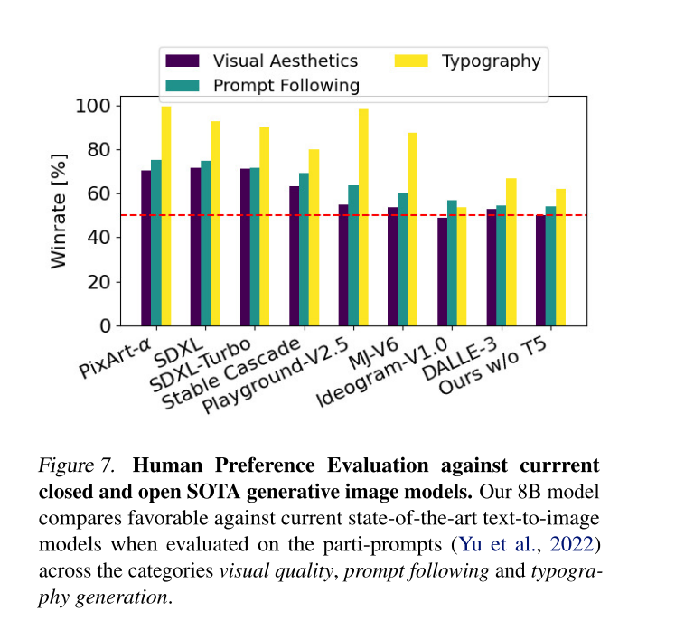</div>

**（3.3）实际应用**

1. **内存效率**: 用户可以在大多数提示中选择排除T5 XXL编码器(拥有47亿参数),而不会造成显著的性能损失,从而节省大量显存。

2. **任务特定优化**: 对于涉及复杂描述或大量书面文本的任务,包含T5 XXL编码器可以提供明显的改进。

3. **可扩展性**: 多编码器方法允许在模型的未来迭代中轻松集成新的或改进的文本编码器。


### 三个 Text Encoder 的结构与工程取舍

从模型结构看，SD 3 的三个 Text Encoder 都是已经预训练好的语言模型。CLIP ViT-L 只包含 Transformer 结构，由 12 个 CLIPEncoderLayer 模块组成；每个 CLIPEncoderLayer 包含一个 Self-Attention 层和一个 MLP 层。OpenCLIP ViT-bigG 同样只包含 Transformer 结构，由 32 个 CLIPEncoderLayer 模块组成，每个模块也包含 Self-Attention 层和 MLP 层。T5-XXL 则由 24 个 T5-XXL Block 模块组成，每个 Block 包含 T5LayerFF 层和 T5Self-Attention 层，与 CLIP 系列的网络结构存在明显差异。

由于三个 Text Encoder 的参数在 SD 3 训练过程中被冻结，训练时可以对它们的特征分别进行独立 Dropout，再送入 MM-DiT 辅助训练。这样既能实现 Classifier-Free Guidance，也使 SD 3 在推理时可以灵活组合三个 Text Encoder。按照当前章节中的训练设置，三个编码器分别以 46.3% 的概率独立 Dropout；当三个编码器都被置空时，模型同时学习无条件分支。

T5-XXL 的参数量最大，因此在 2080Ti 等显存有限的 GPU 上部署 SD 3 时，可以只加载 CLIP ViT-L 与 OpenCLIP ViT-bigG，并将 T5-XXL 特征设置为 zero。这样整体图像质量通常不会明显下降，但文本理解和文字渲染能力会下降，尤其是文字渲染效果更依赖 T5-XXL。若希望进一步降低显存占用，可以使用 FP8 精度的 T5-XXL 替代 FP16，通常能够节省约 6GB 显存，同时只损失少量生成精度；这仍然优于完全移除 T5-XXL 的方案。

<h2 id="q-069">面试问题：训练 Stable Diffusion 过程中官方使用了哪些训练技巧？</h2>

**难度评分：⭐⭐⭐⭐⭐ (5/5)  |  考察频率：⭐⭐⭐⭐ (4/5)**

Stable Diffusion 3 的官方训练技巧并不是某一个孤立技巧，而是围绕**训练目标、噪声调度、数据工程、蒸馏加速与资源优化**形成的一套完整方法。下面按训练目标、噪声调度、标签与数据配方、蒸馏、缓存和稳定性优化等方面展开。

### 1. SD 3 的 Rectified Flow 训练目标相比 ε-prediction 的本质差别是什么？给少步采样带来了哪些工程优势？

SD 3 不再使用 DDPM 作为扩散模型，而是改用优化后的 Rectified Flow。图像生成任务本质上是让模型学习一个图像数据集所表达的数据分布，之后再从这个数据分布中进行随机采样。由于复杂的数据分布很难直接表达，扩散模型通常先选择标准正态分布作为容易采样的简单分布，再学习从噪声分布到真实数据分布的映射。

基于 DDPM 的扩散模型通过人工定义图像数据到噪声的变换路线，再让模型学习对应的逆路线。知道数据在路线中每一位置的对应速度后，就可以以每一位置的反向速度为基准学习速度场，这种学习过程被称为流匹配（Flow Matching）。SD 3 使用的 Rectified Flow 的关键不在于更换一个模型名称，而在于重新定义图像到噪声的路线：用一条直线连接数据分布和噪声分布，从而简化训练和推理过程并提升生成效率。

Rectified Flow（RF）是 SD 3、FLUX.1 共同采用的训练目标，是相对 DDPM 的 ε-prediction 在「数学路径 + 采样效率」上的双重升级。

**（1）两者的训练目标对比**

**ε-prediction（DDPM）**：

- 数据 → 噪声的过程是带噪声的随机扩散：$`x_t = \sqrt{\bar\alpha_t}x_0 + \sqrt{1-\bar\alpha_t}\epsilon`$
- 网络预测加入的噪声 $\epsilon$；
- 反向过程是马尔可夫链，沿弯曲路径回到数据。

**Rectified Flow**：

- 数据 → 噪声的路径直接定义为**线性插值**：

```math
x_t = (1 - t)\, x_0 + t\, \epsilon,\quad t \in [0, 1]
```

- 网络预测**速度场** $`v_t = \epsilon - x_0`$（与 v-prediction 形式一致，但是连续时间）；
- 训练目标：

```math
\mathcal{L}_{\text{RF}} = \mathbb{E}_{t, x_0, \epsilon}\bigl\|v_\theta(x_t, t) - (\epsilon - x_0)\bigr\|^2
```

- 反向过程是常微分方程（ODE）：

```math
\frac{dx}{dt} = v_\theta(x_t, t)
```

**非均匀时间步采样**：Rectified Flow 默认可以令 $t\sim\mathcal{U}(0,1)$，也就是等概率采样所有时间步。但 SD 3 的实验发现，不同时间步的学习难度并不相同：靠近数据端和噪声端的路径相对容易学习，中间区域更难。因此，SD 3 使用非均匀采样提高中间时间步的权重，重点比较了带重尾的 Mode Sampling 和 Logit-Normal Sampling。两种方法都会增加中间区域的采样概率；Logit-Normal 的代价是 $t=0$ 和 $t=1$ 附近几乎采样不到，需要在训练分布设计时权衡。

**（2）本质差别**

<div align="center">

| 维度 | ε-prediction | Rectified Flow |
| --- | --- | --- |
| 路径类型 | 弯曲（DDPM 噪声调度决定） | **直线**（数据 ↔ 噪声线性插值） |
| 训练目标 | 噪声 $`\epsilon`$ | **速度场** $`v = \epsilon - x_0`$ |
| 反向过程 | 随机马尔可夫链 / DDIM ODE | 纯 ODE |
| Loss 量级随 $t$ 分布 | 高 $t$ 易学、低 $t$ 数值不稳 | **全 $t$ 均衡** |
| 少步采样难度 | 高（弯曲路径需要多步） | **低**（直线路径少步即可逼近） |
| 是否便于二次蒸馏 | 一般 | **极好**（直线路径天然适合 reflow / 一致性蒸馏） |

</div>

**（3）给少步采样带来的工程优势**

1. **直线路径 → 少步精度高**：数据到噪声的最优 transport 路径在理想情况下是直线；RF 直接用线性插值定义路径，让网络学会「沿直线方向走」，因此少步 Euler 采样误差小；
2. **天然适配 v-prediction 范式**：v 在所有 $t$ 上 loss 量级均衡，模型在低噪、高噪段都能学习；
3. **Reflow 二次蒸馏**：RF 论文最有价值的训练技巧——把已经训练好的 RF 模型生成的 noise-data 配对再训练一遍，可以**进一步把弯曲路径拉直**，从而 1~4 步采样质量大幅提升（FLUX.1-schnell 的 4 步推理就是这条路线）；
4. **采样器简化**：RF 的反向过程是纯 ODE，可以直接用 Euler、Midpoint、RK4 等通用 ODE 求解器，无需 DDIM / DPM-Solver / UniPC 等扩散专用采样器；
5. **timestep schedule 更直观**：RF 的 $t \in [0, 1]$ 直接表示「数据到噪声的进度」，比 DDPM 的离散 $t \in \{1,\dots,T\}$ 更易于做 lognorm shift 等噪声调度优化；
6. **训练效率更高**：SD 3 论文报告，相同算力下 RF 的 FID 收敛速度优于 ε-prediction。

**（4）工程实践中的注意点**

- **timestep schedule shift**：高分辨率训练时仍需对 $t$ 做 lognorm 偏移，具体见下文“高分辨率训练中的 timestep schedule shift”；
- **Sampler 默认走 Euler**：FLUX、SD 3 在 diffusers 里默认是 `FlowMatchEulerDiscreteScheduler`；
- **CFG 仍然有效**：RF 与 CFG 完全兼容，CFG 公式形式不变；
- **不能直接复用 DDPM 的预训练权重**：训练目标不同，权重不通用，需要从头训或用 RF 重训。

**面试金句**：RF 把数据-噪声路径**显式定义为直线**，把网络从「预测噪声」升级为「预测速度场」，让**少步采样精度**与**二次蒸馏（reflow）** 两项工程能力都成为天然属性；这是 SD 3 / FLUX 在 4 步出图质量上跨越式提升的根本原因。


### 2. SD 3 / SD 3.5 在高分辨率训练中对 timestep schedule 做的 shift 具体是怎么做的？为什么对大尺寸训练至关重要？

SD 3 论文中明确提出，在做大分辨率训练（如 1024×1024 及以上）时，必须对 Rectified Flow 的 timestep schedule 做 **shift（偏移）**，否则模型在高分辨率下会出现「破坏不够」「低频结构残留」的现象。这是 SD 3、SD 3.5、FLUX.1 共享的关键训练技巧。

**（1）为什么高分辨率训练需要 shift schedule**

- **加噪过程的「破坏强度」与分辨率耦合**：在固定 noise schedule 下，高分辨率图像在同一 $t$ 上的「相对破坏程度」更弱——因为高分辨率图像有更多低频信号，相同方差的高斯噪声只能盖住高频，低频结构仍清晰可辨；
- 这使得在高 $t$ 区间（接近纯噪声端）模型仍能看到原图的低频骨架，**学不到「从纯噪声开始生成」的能力**；
- 表现为：高分辨率推理时初始几步生成出的图像「结构空泛 / 色调单一」，后期采样很难纠正。

**（2）SD 3 的 timestep shift 公式**

SD 3 论文给出的 logit-normal + shift 公式（针对 RF 的 $t \in [0, 1]$）：

```math
t' = \frac{m \cdot t}{1 + (m - 1) \cdot t}
```

其中 $m$ 是 shift 系数，$m > 1$ 把 $t$ 整体推向更接近 1（更接近纯噪声）的区间；分辨率越高，建议的 $m$ 越大。

SD 3 论文实验得到的经验值（base 训练分辨率 1024×1024）：

<div align="center">

| 训练分辨率 | 推荐 shift $m$ |
| --- | --- |
| 256×256 | 1.0（无 shift） |
| 512×512 | ≈ 1.5 |
| 1024×1024 | ≈ 3.0 |
| 2048×2048 | ≈ 6.0 |

</div>

**（3）对训练 / 推理两端的影响**

- **训练端**：采样 $t$ 时按 shift 后的分布采样，更多样本落在高 $t$ 区，使模型在「接近纯噪声 → 数据」的最关键阶段获得足够的训练信号；
- **推理端**：采样器使用同样 shift 后的离散 timestep 序列；diffusers 中 `FlowMatchEulerDiscreteScheduler` 提供 `shift` 参数；
- **少步采样兼容性**：少步推理（FLUX.1-schnell 的 4 步、SD 3-Turbo）尤其依赖正确的 shift——shift 错了少步出图直接塌缩；
- **训练 / 推理 shift 必须一致**：训练 m=3、推理 m=1 会出现严重的画质降级。

**分辨率耦合的推导**：假设当前图像分辨率为 $n=H\times W$，且是一张每个像素值都相等的常量图像，像素值记为 $c$。在 SD 3 的 RF 采样过程中，加入噪声后的观测可以写成：

```math
z_t=(1-t)c\mathbf{1}+t\epsilon
```

其中 $\mathbf{1}\in\mathbb{R}^{n}$ 是全 1 向量， $\epsilon\in\mathbb{R}^{n}$ 的各分量是独立标准正态随机变量。将每个像素写成 $Y=(1-t)c+t\eta$，其中 $\eta$ 服从标准正态分布，则 $Y$ 的均值为 $\mathbb{E}(Y)=(1-t)c$，标准差为 $\sigma(Y)=t$。根据观测值可以用所有像素的均值估计原始常量：

```math
\hat{c}=\frac{1}{1-t}\mathbb{E}(Y)=\frac{1}{1-t}\frac{1}{n}\sum_{i=1}^{n}z_{t,i}
```

因此估计误差的标准差为：

```math
\sigma(t,n)=\frac{t}{1-t}\sqrt{\frac{1}{n}}
```

这个结果说明，随着像素数量 $`n`$ 增加，噪声对图像常量的影响会减小；当宽度和高度同时增大时，固定 noise schedule 对低频结构的破坏会变得不充分。为了保证不同分辨率下的破坏效果一致，需要让分辨率为 $`n`$ 的 $`t_n`$ 与分辨率为 $`m`$ 的 $`t_m`$ 满足相同的误差标准差：

```math
t_m=\frac{\sqrt{\frac{m}{n}}t_n}{1+\left(\sqrt{\frac{m}{n}}-1\right)t_n}
```

相应的信噪比满足：

```math
\lambda_m=2\log\left(\frac{1-t_m}{t_m}\right)=\lambda_n-\log\frac{m}{n}
```

所以，分辨率从 $n$ 变化到 $m$ 时，SNR 需要偏移 $\log(m/n)$。在实际训练中，选择 $\alpha=\sqrt{m/n}$ 作为比例系数可以得到较好的噪声调度；SD 3 论文的实验表明，当分辨率调整到 1024×1024 时，最优 shift 值约为 3.0。

**（4）跨周期价值**

timestep schedule shift 不只对 SD 3 / FLUX 有效；它揭示了一个**普适规律**：随着扩散模型分辨率提升，需要重新设计 noise schedule，让加噪过程在视觉上「真正破坏图像」。这一思路在 EDM2、Karras 系列、Cosmos、视频生成模型中都有相似的体现。

**面试金句**：高分辨率图像低频信号更强，固定 noise schedule 在高 $t$ 处「破坏不够」，模型学不到从纯噪声起步的能力；SD 3 用 shift 公式把 timestep 偏向高噪声端，让训练 / 推理 / 少步采样都获得正确的噪声水平分布。这是 SD 3、SD 3.5、FLUX.1 在 1024+ 分辨率下能稳定训练并少步出图的关键工程细节。


### 3. Stable Diffusion 3 中数据标签工程的具体流程是什么样的？

除了训练目标与噪声调度，训练数据的 Caption 质量也直接决定模型的文本理解和 Prompt Following 能力。

**目前AI绘画大模型存在一个很大的问题是模型的文本理解能力不强**，主要是指AI绘画大模型生成的图像和输入文本Prompt的一致性不高。举个例子，如果说输入的文本Prompt非常精细复杂，那么生成的图像内容可能会缺失这些精细的信息，导致图像与文本的内容不一致。这也是AI绘画大模型Prompt Following能力的体现。

产生这个问题归根结底还是由训练数据集本身所造成的，**更本质说就是图像Caption标注太过粗糙**。

SD 3借鉴了DALL-E 3的数据标注方法，使用**多模态大模型CogVLM**来对训练数据集中的图像生成高质量的Caption标签。

**目前来说，DALL-E 3的数据标注方法已经成为AI绘画领域的主流标注方法，很多先进的AI绘画大模型都使用了这套标签精细化的方法**。

这套数据标签精细化方法的主要流程如下：

1. 首先整理数据集和对应的原始标签。
2. 接着使用CogVLM多模态大模型对原始标签进行优化扩写，获得长Caption标签。
3. 在SD 3的训练中使用50%的长Caption标签+50%的原始标签混合训练的方式，提升SD 3模型的整体性能，同时标签的混合使用也是对模型进行正则的一种方式。

这套方法的本质，是先用图像 Captioner 将粗糙的网页 Alt Text 或数据集自带标签扩写为能够描述主体、背景、位置、数量和文字细节的 Caption，再把精细标签用于训练。DALL-E 3 先训练基于 CoCa 架构的 Image Captioner；CoCa 在 CLIP 对比损失之外增加 Multimodal Text Encoder，并同时使用 Captioning 交叉熵损失，因此可以生成更细致的图像描述。

在 Captioner 预训练完成后，DALL-E 3 又分别使用短 Caption 数据和长 Caption 数据进行微调，得到生成短 Caption（Short Synthetic Captions，SSC）和长 Caption（Descriptive Synthetic Captions，DSC）的模型。实验表明，合成长 Caption 对 Prompt Following 能力提升更明显；同时在合成 Caption 中混入原始 Caption，可以避免模型过拟合到某一种固定措辞范式，是一种有效的正则化手段。

SD 3 沿用了 DALL-E 3 的数据标注思路，只是将 Image Captioner 从 CoCa 替换为 CogVLM，并采用 50% 原始 Caption + 50% 合成长 Caption 的配方。这个比例在提升文本一致性的同时，保留了原始数据分布，避免模型只适应过度规整的长描述。

具体效果如下所示：

<div align="center">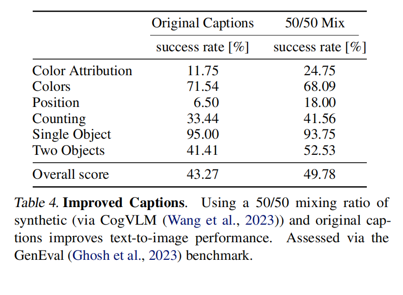</div>


### 4. SD 3-Turbo 用的蒸馏方法是什么？

在完成基础模型训练后，SD3-Turbo 进一步通过蒸馏压缩推理步数。

论文链接:[2403.12015](https://arxiv.org/pdf/2403.12015)

**方法结构**

论文提出了一种新的蒸馏方法——**潜在对抗扩散蒸馏（Latent Adversarial Diffusion Distillation, LADD）**，用于将大规模的扩散模型高效地蒸馏成快速生成高分辨率图像的模型。该方法主要用于基于**Stable Diffusion 3**的优化，目标是生成多比例、高分辨率的图像。与传统的对抗扩散蒸馏（ADD）方法不同，LADD直接在潜在空间（latent space）中进行训练，从而减少了内存需求，并避免了从潜在空间解码到像素空间的昂贵操作。其整体架构包括以下几个关键组件：

1. **生成器（Teacher Model）**：用于生成潜在空间的表示，以进行合成数据的生成。
2. **学生模型（Student Model）**：学习生成器在潜在空间中的分布，以实现快速生成。
3. **判别器（Discriminator）**：用于区分学生模型生成的图像和真实图像的潜在表示，通过对抗训练优化学生模型。

<div align="center">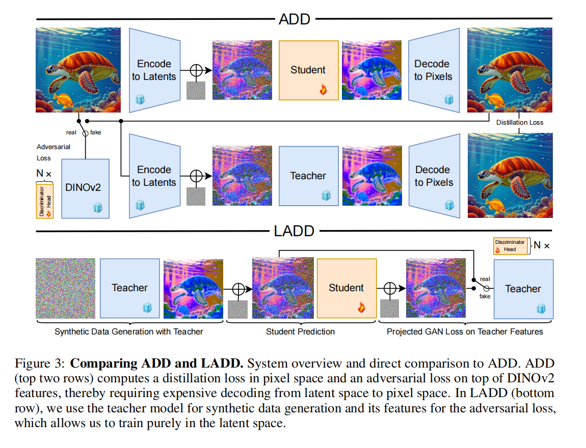</div>

LADD（潜在对抗扩散蒸馏）与ADD（对抗扩散蒸馏）有几个关键区别，主要体现在训练方式、判别器的使用以及生成流程的简化上：

1. **潜在空间训练**：LADD直接在潜在空间（latent space）进行蒸馏，而ADD则需要将图像解码到像素空间，以便判别器进行判别。这种在潜在空间中训练的方式，使得LADD的计算需求更少，因为它避免了从潜在空间到像素空间的解码过程，大幅降低了内存和计算成本。
2. **生成器特征作为判别特征**：ADD使用预训练的DINOv2网络来提取判别特征，但这种方式限制了分辨率（最高518×518像素），且不能灵活调整判别器的反馈层次。LADD则直接利用生成器的潜在特征作为判别器的输入，通过控制生成特征中的噪声水平，可以在高噪声时侧重全局结构，在低噪声时侧重细节，达到了更灵活的判别效果。
3. **判别器和生成器的统一**：在LADD中，生成器和判别器是通过生成特征集成的，避免了额外的判别网络。这种方式不仅降低了系统的复杂度，还可以通过调整噪声分布，直接控制图像生成的全局和局部特征。
4. **多长宽比支持**：LADD能够直接支持多长宽比的训练，而ADD由于解码和判别过程的限制，不易实现这一点。因此，LADD生成的图像在各种长宽比下具有较好的适应性。


### 5. Stable Diffusion 3 的图像特征和文本特征在训练前缓存策略有哪些优缺点？

在训练资源优化层面，官方还分析了冻结模块的特征预计算与缓存策略。

SD 3与之前的版本相比，整体的参数量级大幅增加，这无疑也增加了训练成本，所以官方的技术报告中也**对SD 3训练时冻结（frozen）部分进行了分析**，主要评估了VAE、CLIP-L、CLIP-G以及T5-XXL的显存占用（Mem）、推理耗时（FP）、存储成本（Storage）、训练成本（Delta），如下图所示，T5-XXL的整体成本是最大的：

<div align="center">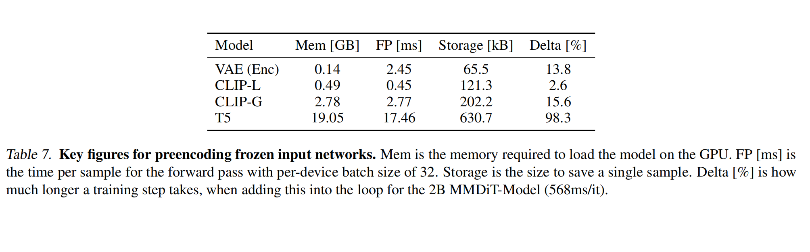</div>

**为了减少训练过程中SD 3所需显存和特征处理耗时，SD 3设计了图像特征和文本特征的预计算策略**：由于VAE、CLIP-L、CLIP-G、T5-XXL都是预训练好且在SD 3微调过程中权重被冻结的结构，所以**在训练前可以将整个数据集预计算一次图像的Latent特征和文本的Text Embeddings，并将这些特征缓存下来**，这样在整个SD 3的训练过程中就无需再次计算。同时上述冻结的模型参数也无需加载到显卡中，可以节省约20GB的显存占用。

但是根据机器学习领域经典的“没有免费的午餐”定理，**预计算策略虽然为我们大幅减少了SD 3的训练成本，但是也存在其他方面的代价**。第一点是训练数据不能在训练过程中做数据增强了，所有的数据增强操作都要在训练前预处理好。第二点是预处理好的图像特征和文本特征需要一定的存储空间。第三点是训练时加载这些预处理好的特征需要一定的时间。

整体上看，**其实SD 3的预计算策略是一个空间换时间的技术**。

### 6. SD 3 训练数据预处理与数据配方

SD 3 技术报告没有公布预训练数据集的完整来源分布，但其中的数据预处理方法仍然值得借鉴。官方训练数据工程主要包括以下环节：

1. **NSFW 风险内容过滤**：使用 NSFW 检测模型过滤风险数据。
2. **筛除美学分数较低的数据**：使用美学评分系统预测图像美学分数并移除低分样本。
3. **数据去重**：使用基于聚类的去重方法移除重复图像，降低模型对重复样本中特征的过拟合风险。

SD 3 的去重流程使用 SSCD 作为 Backbone 生成数据集的高质量 Embedding，再结合 autoFAISS 的大规模聚类能力高效移除重复样本。这种方法在保留训练数据多样性的同时，能够减少潜在的记忆化样本，为扩散模型的安全性和数据隐私提供保障。

完成数据预处理后，官方筛选出 1B+ 数据进行训练：先在约 1B 数据上进行预训练，再使用约 30M 专注于特定视觉内容和风格的高质量美学数据微调，最后使用约 3M 偏好数据进行精细化训练。这个“海量通用数据预训练—高质量数据微调—偏好数据精调”的数据配方，与后续的 DPO 和 Caption 工程共同构成了 SD 3 的训练闭环。

### 7. Classifier-Free Guidance 如何参与 SD 3 训练

Classifier-Free Guidance（CFG）从 SD 1.x 到 SD 3、FLUX.1 都是文本条件生成的重要训练技术。它通过在训练时以一定概率将条件标签置空，让同一个模型同时学习条件分支与无条件分支，从而避免额外训练一个显式分类器。

SD 3 的三个 Text Encoder 分别以 46.3% 的概率独立 Dropout。三个编码器同时被置空的概率约为 $(46.3\%)^3\approx9.9\%$，模型因此可以在同一套参数中学习有条件和无条件的生成路径。独立 Dropout 还让推理阶段可以灵活组合三个 Text Encoder：显存有限时可以不加载 T5-XXL，只使用两个 CLIP；但如果需要高质量文字渲染，仍然应该保留 T5-XXL，因为去掉它对文字生成能力的影响最明显。

从机制上看，训练时被置空的文本条件相当于无条件分支，保留文本条件的样本则对应有条件分支；推理时再用两次前向结果做线性外推：

```math
v_{\mathrm{cfg}}=v_{\mathrm{uncond}}+s\left(v_{\mathrm{cond}}-v_{\mathrm{uncond}}\right)
```

其中 $s$ 是 guidance scale。这样不需要额外训练一个显式分类器，就能在采样阶段调节文本条件的引导强度；三个编码器独立 Dropout 则进一步让模型学会不同编码器子集的组合，而不是只能依赖完整的三编码器输入。

### 8. DPO 偏好微调

DPO（Direct Preference Optimization）最初应用于 NLP 领域，后来也用于 AI 绘画模型的偏好微调。与 SDXL 使用的 RLHF 相比，DPO 不需要单独训练 Reward Model，而是直接基于成对的人类偏好数据设计损失函数，使模型倾向于生成更符合偏好的图像。它省去了强化学习中的试错过程，训练过程更稳定，也更适合拥有大量图像偏好数据的场景。

SD 3 的官方实验没有直接微调整个网络，而是在 2B 和 8B 模型上引入 Rank=128 的 LoRA 权重，分别进行约 4000 次和 2000 次迭代的偏好微调。微调后图像生成质量有所提升，尤其是文字渲染能力更强。换句话说，DPO 在这里不仅是一种优化算法，也是一种利用偏好数据校正生成分布的训练思想。

### 9. QK-Normalization 稳定高分辨率训练

随着 SD 3 参数量增大，官方发现在高分辨率混合精度训练时，Attention 层的 attention-logit（Q 和 K 的矩阵乘）可能变得不稳定，导致梯度出现 NaN。为提升训练稳定性，SD 3 在 MM-DiT 的 Self-Attention 层使用 RMSNorm 对 Q-Embeddings 和 K-Embeddings 进行归一化，这就是技术报告中的 QK-Normalization。

RMSNorm 不再计算均值和方差，而是基于参数激活值的均方根进行归一化。对输入向量 $x$，其核心计算可以写成：

```math
\mathrm{RMS}(x)=\sqrt{\frac{1}{d}\sum_{i=1}^{d}x_i^2},\qquad \hat{x}=\frac{x}{\mathrm{RMS}(x)},\qquad y=\gamma\hat{x}+\beta
```

它的优势在于计算量相对较小、不依赖 Batch Size，并能在小批量或单样本训练中缓解梯度爆炸和梯度消失问题。

### 10. 多尺度位置编码

SD 3 先在 256×256 分辨率数据上预训练，再围绕 1024×1024 进行多尺寸微调，因此 MM-DiT 的位置编码必须支持多尺度，否则在 256×256 上学习到的位置编码无法直接适配其他分辨率。SD 3 借鉴 ViT 的二维 Frequency Embeddings，将两个一维 Frequency Embeddings 拼接，并在此基础上进行插值与扩展。

假设目标分辨率的像素量为 $S^2$，SD 3 还使用 bucketed sampling，使数据集中各尺寸图像满足 $H\times W\approx S^2$，例如 2048×2048、1024×4096 和 4096×1024。由于 VAE 进行 8 倍下采样、Patch Size=2 又带来 2 倍下采样，输入 MM-DiT 的 Patch 网格相当于进行了 16 倍下采样，因此位置编码需要同时适配不同的 $h\times w$ 网格。工程上可以先将 256×256 的位置编码插值到目标正方形网格，再扩展到最大宽高，最后对具体尺寸进行 Center Crop。

### 11. 基于 DiT 的 Scaling 能力

相比 U-Net，Transformer Backbone 的重要优势是具备稳定的 Scaling 能力：增加模型参数量、训练数据量和计算资源，通常可以持续提升生成能力与泛化性能。SD 3 论文设置了深度为 15、18、21、30、38 的多种 MM-DiT 规模，其中深度 38 对应约 8B 参数模型。

实验显示，MM-DiT 参数量持续增加时，模型性能稳步提升，验证损失平滑下降，并与 T2I-CompBench、GenEval 和人类视觉偏好等指标保持较强相关性。不过，大模型训练也需要更细致的超参数管理：例如深度为 38 的模型训练到约 $3\times10^5$ 步时需要调整学习率以避免发散。当前参数规模下尚未出现明显的性能饱和，说明 Scaling Law 仍是 SD 3 及后续 DiT 图像模型的重要增长路径。


<h2 id="q-075">面试问题：Stable Diffusion 3.5 有哪些改进点？</h2>

**难度评分：⭐⭐⭐⭐ (4/5)  |  考察频率：⭐⭐⭐⭐⭐ (5/5)**

Stable Diffusion 3.5 是 Stable Diffusion 3 的升级系列，包含 Stable Diffusion 3.5 Large、Stable Diffusion 3.5 Large Turbo 和 Stable Diffusion 3.5 Medium 三个主要版本：

1. **Stable Diffusion 3.5 Large**：参数量约 8B，重点提升图像生成质量和提示词遵循能力，能够生成约百万像素级的高质量图像。
2. **Stable Diffusion 3.5 Large Turbo**：Large 的蒸馏版本，只需约 4 步即可生成高质量图像，适合需要快速批量生成的场景。
3. **Stable Diffusion 3.5 Medium**：参数量约 2.5B，使用新的 MM-DiT-X 架构与训练方法，在消费级硬件上的可用性、生成质量和定制成本之间取得平衡，可覆盖约 0.25M 到 2M 像素范围的多种分辨率。

### SD 3.5 的架构改进

1、**引入 Query-Key 归一化（QK normalization）**：在训练大型 Transformer 模型时，QK 归一化已成为标准实践。SD3.5 也采用了这一技术，以增强模型训练的稳定性并简化后续的微调和开发。

**2、双注意力层设计**：在 MMDiT 结构中，文本和图像两个模态通常共享同一个注意力层。然而，SD3.5 采用了两个独立的注意力层，以更好地处理多模态信息（MMDiT-X）。

<div align="center">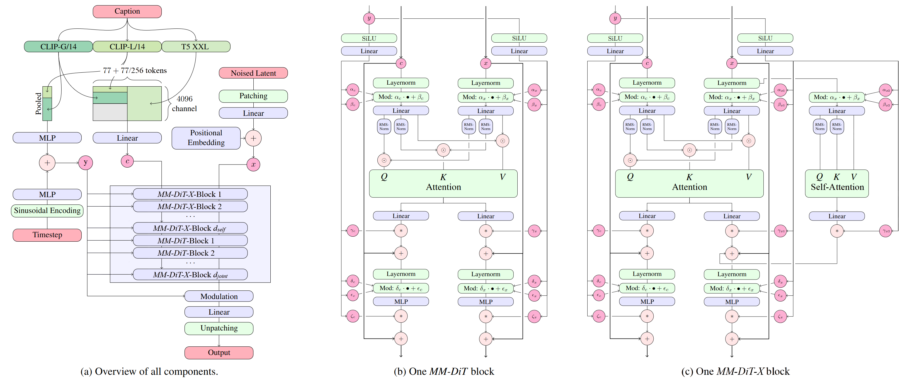</div>


---

<h1 id="ch-flux-01">第二章 FLUX系列核心高频考点</h1>

<h1 id="q-flux-001">1.介绍一下FLUX.1的原理，与Stable Diffusion 3相比有哪些创新点？</h1>

<h2 id="q-flux-014">面试问题：FLUX.1 的 VAE 部分有哪些创新？详细分析改进意图</h2>

**难度评分：⭐⭐⭐⭐ (4/5)  |  考察频率：⭐⭐⭐⭐⭐ (5/5)**

FLUX.1 VAE架构依然继承了SD 3 VAE的8倍下采样和输入通道数（16）。在FLUX.1 VAE输出Latent特征，并在Latent特征输入扩散模型前，还进行了Pack_Latents操作，一下子将Latent特征通道数提高到64（16 -> 64）。换句话说，FLUX.1系列的扩散模型部分输入通道数为64，是SD 3的四倍。这也代表FLUX.1要学习拟合的内容比起SD 3增加了4倍，所以官方大幅增加FLUX.1模型的参数量级来提升模型容量（model capacity）。

Pack_Latents操作的代码如下：

```python
@staticmethod
def _pack_latents(latents, batch_size, num_channels_latents, height, width):
    latents = latents.view(batch_size, num_channels_latents, height // 2, 2, width // 2, 2)
    latents = latents.permute(0, 2, 4, 1, 3, 5)
    latents = latents.reshape(batch_size, (height // 2) * (width // 2), num_channels_latents * 4)

    return latents
```

可以看到，FLUX.1模型的Latent特征Patch化方法是将 $2\times2$ 像素块直接在通道维度上堆叠。这种做法保留了每个像素块的原始分辨率，只是将它们从空间维度移动到了通道维度。与之相对应的，SD 3使用下采样卷积来实现Latent特征Patch化，但这种方式会通过卷积减少空间分辨率，从而损失一定的特征信息。

Rocky再举一个形象的例子来解释SD 3和FLUX.1的Patch化方法的不同：

1. SD 3（下采样卷积）：想象我们有一个大蛋糕，SD 3的方法就像用一个方形模具，从蛋糕上切出一个 $2\times2$ 的小方块。在这个过程中，我们提取了蛋糕的部分信息，但是由于进行了压缩，Patch块的大小变小了，信息会有所丢失。
2. FLUX.1（通道堆叠）：FLUX.1 的方法更像是直接把蛋糕的 $2\times2$ 块堆叠起来，不进行任何压缩或者切割。我们仍然保留了蛋糕的所有部分，但是它们不再分布在平面上，而是被一层层堆叠起来，像是三明治的层次。这样一来，蛋糕块的大小没有改变，只是它们的空间位置被重新组织了。

总的来说，**相比SD 3，FLUX.1将 $2\times2$ 特征Patch化操作应用于扩散模型之前**。这也表明FLUX.1系列模型认可了SD 3做出的贡献，并在其基础上进行了继承与优化。

目前发布的FLUX.1-dev和FLUX.1-schnell两个版本的VAE结构完全一致。**与SD 3相比，FLUX.1 VAE并不是直接沿用SD 3的VAE，而是基于相同结构进行了重新训练，两者的参数权重并不相同**。并且SD 3和FLUX.1的VAE会对编码后的Latent特征做平移和缩放，而之前的SD系列中VAE仅做缩放：

```python
def encode(self, x: Tensor) -> Tensor:
    z = self.reg(self.encoder(x))
    z = self.scale_factor * (z - self.shift_factor)
    return z
```

平移和缩放操作能将Latent特征分布的均值和方差归一化到0和1，和扩散过程加的高斯噪声在同一范围内，更加严谨和合理。

FLUX.1-dev/schnell系列模型的VAE完整结构如下：

<div align="center">

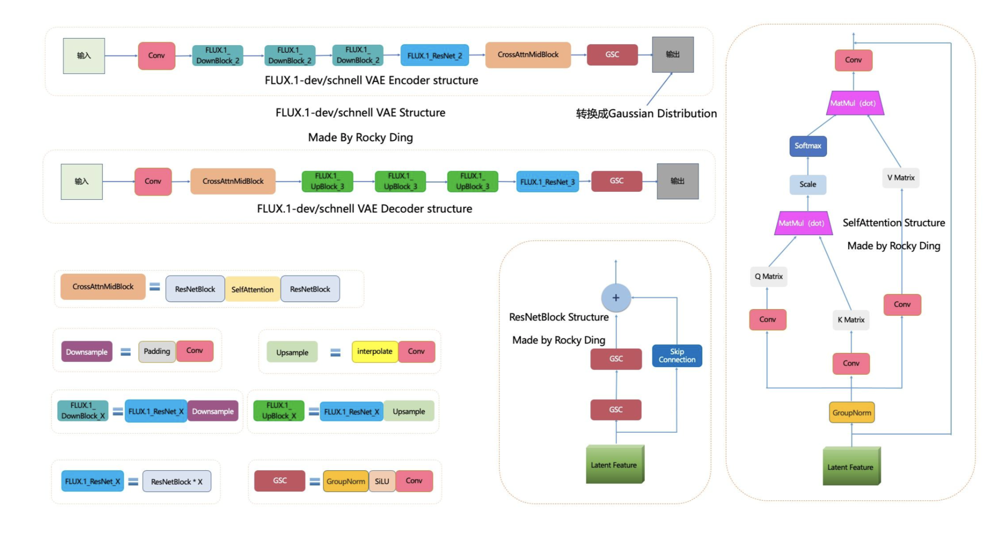

*图：FLUX.1-dev/schnell VAE完整结构图*

</div>

分别使用SDXL、SD 3、FLUX.1系列模型进行1024x1024分辨率和2048x2048分辨率图像的压缩和重建，效果如下：

<div align="center">


*图：SDXL VAE、SD 3 VAE、FLUX.1 VAE压缩和重建效果对比*

</div>

可以看到，SDXL VAE在压缩和重建过程中出现了图像内容和文本的畸变，而SD 3 VAE和FLUX.1 VAE基本看不到明显的重建畸变。

**Rocky认为Stable Diffusion系列和FLUX.1系列中VAE模型的改进历程，为工业界、学术界、竞赛界以及应用界都带来了很多灵感，有很好的借鉴价值。AI绘画中针对VAE的优化，也会是学术研究中一个非常重要的方向。**

<h2 id="q-flux-015">面试问题：FLUX.1 的 Backbone 部分有哪些创新？详细分析改进意图</h2>

**难度评分：⭐⭐⭐⭐⭐ (5/5)  |  考察频率：⭐⭐⭐⭐⭐ (5/5)**

FLUX.1的Transformer模型部分在SD 3的基础上进一步优化，除了和SD 3一样有MM-DiT模块（双流DiT）外，同时还设计了Single-DiT模块（单流DiT）。在Single-DiT Block模块中，文本信息和图像信息拼接融合在一起，再送入Attention机制中处理；同时在额外条件部分会输入完整的Text Embeddings和池化过的Pooled Text Embeddings。

直观地理解，FLUX.1先使用MM-DiT Block实现两个模态的信息融合，然后再接Single-DiT Block加深模型深度，在增强模型整体学习能力的同时，还可以节省一部分参数。FLUX.1系列中MM-Single-DiT架构包含19层MM-DiT Block和38层Single-DiT Block，扩散模型部分的参数量进一步扩展到约12B。

<div align="center">

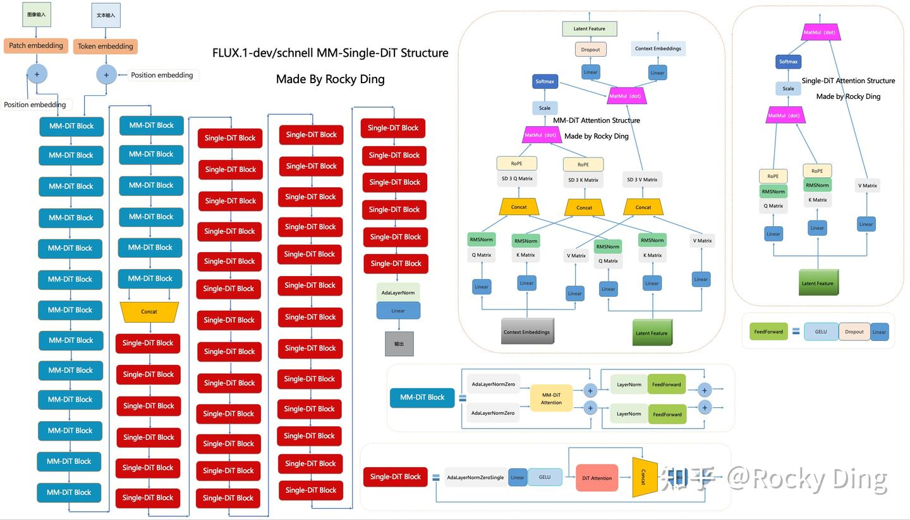

*图：FLUX.1-dev/schnell MM-Single-DiT完整结构图*

</div>

MM-Single-DiT架构的核心组件包括：

1. **MM-DiT Block**：由两个AdaLayerNormZero层、一个MM-DiT Attention Structure模块、两个LayerNorm层和两个FeedForward层组成。
2. **Single-DiT Block**：由一个AdaLayerNormZero层、一个Single-DiT Attention Structure（DiT Attention）模块、两个Linear层和一个GELU激活函数组成。
3. **MM-DiT Attention Structure**：FLUX.1的MM-DiT Block中的核心组件，和SD 3一样，将文本信息和图像信息以同等重要的级别进行Attention计算。
4. **Single-DiT Attention Structure**：FLUX.1的Single-DiT Block中的核心组件，将文本信息和图像信息的特征融合后，进行经典的DiT Attention计算。
5. **FeedForward**：由GELU激活函数、Dropout层和Linear层组成。

和SD 3一样，FLUX.1系列模型将得到的Patch Embedding与Positional Embedding相加后，一起输入Transformer主架构。同时，通过AdaLN-Zero层将文本特征CLIP Pooled Embedding（全局语义信息）和Timestep Embedding相加得到的融合特征作为额外条件，注入Transformer Block中。

### 并行注意力机制

FLUX.1的Transformer架构还引入了并行注意力机制（Parallel Attention-MLP Blocks），主要应用于Single-DiT部分。

<div align="center">

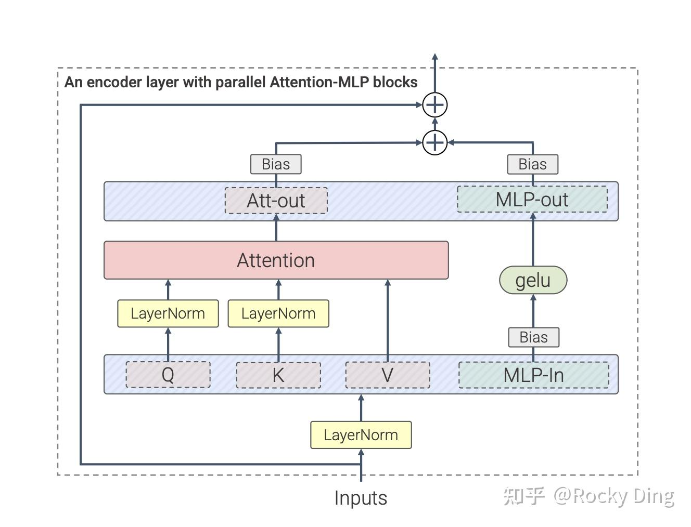

*图：并行注意力机制（Parallel Attention-MLP Blocks）示意图*

</div>

并行注意力机制把注意力和线性层之间的串联结构转变成并联结构。常规注意力机制需要在计算注意力的前后各经过一次线性层的特征提取，转换成并联结构后，注意力在计算完成后与MLP进行Add操作并完成特征融合。这样一来，整体计算并行度更高，AI绘画模型的运行效率也随之提升。

### 三维RoPE位置编码

除了整体模型结构的优化，FLUX.1在位置编码上也有自己的改进。SD 3采用2D Frequency Embeddings，这是一种经典的绝对位置编码方式；FLUX.1则采用了大模型领域中常用的旋转式位置编码（Rotary Positional Embedding，RoPE），RoPE是直接作用在Attention机制上的相对位置编码方式。

Transformer架构中只包含注意力和全连接两种经典计算方式，这两种计算本身都和位置信息无关。为了让Transformer知道图像像素间的空间对应关系，就需要给Transformer中的Token注入额外的位置信息。

经典的正弦编码方式虽然能表示一定的相对位置信息，但经过注意力机制后，其中的相对位置信息几乎会丢失。旋转位置编码使用二维向量来表示每个Token的二维位置编码，经过注意力机制计算后，结果里恰好会出现相对位置关系，从而让注意力计算过程也能感知Token间的相对位置。

总的来说，RoPE使用旋转变换，使每个位置的Token保留了相邻位置的相对关系。相比传统的绝对位置编码，RoPE更注重局部关系建模。这种增强的局部敏感性有助于AI绘画大模型捕获图像局部区域之间的细节关联，从而提升模型的生成质量和泛化性能。

在FLUX.1中，具体操作是将文本的位置编号设为$(0,0,0)$，图像的位置编号设为$(0,i,j)$，之后用标准旋转式位置编码对三个维度的编号编码，再把三组编码拼接起来。

假设位于$(i,j)$的图像像素位置编号是$(0,i,j)$，经过特征编码，位置编号会转换成$[16,56,56]$维度的矩阵，表示第一个维度使用长度16的位置编码，后两维使用长度56的位置编码。再经RoPE函数计算得到旋转式位置编码后，三组结果拼接到一起，最终形成128维的位置编码。编码前16个通道是第一维位置编号的位置编码，中间56个通道知道垂直位置信息，最后56个通道知道水平位置信息。

Rocky认为，第一个维度是为视频生成的Time维度预留的，也就是说Black Forest Labs在架构上已经为后续视频生成能力留下了扩展空间。AI绘画大模型的持续发展正在带动AI视频大模型更新迭代，未来AI绘画与AI视频两个产业会进一步相互融合。

<h2 id="q-flux-016">面试问题：FLUX.1 的 Text Encoder 部分有哪些创新？详细分析改进意图</h2>

**难度评分：⭐⭐⭐⭐ (4/5)  |  考察频率：⭐⭐⭐⭐ (4/5)**

Stable Diffusion 3的Text Encoder部分一共使用了CLIP ViT-L、OpenCLIP ViT-bigG、T5-XXL Encoder三个Text Encoder模型。其中，两个CLIP Encoder提取的Pooled Text Embeddings特征拼接在一起后与Time Embedding相加；两个CLIP Encoder的Text Embedding特征也会进行拼接，再在Token维度与T5-XXL的Text Embedding拼接后送入MM-DiT架构中。

FLUX.1在SD 3的基础上对Text Encoder部分进行了精简优化，只使用CLIP ViT-L和T5-XXL Encoder两个Text Encoder模型，并没有使用OpenCLIP ViT-bigG模型。FLUX.1将CLIP ViT-L的Pooled Text Embeddings特征与Time Embedding相加，同时将T5-XXL提取的Text Embedding特征直接送入MM-DiT架构中。

总的来说，**FLUX.1比SD 3更依赖T5-XXL提取的文本特征信息**。SD 3中CLIP Encoder的特征仍有较大的作用，比如SD 3可以去掉T5-XXL，只使用CLIP Encoder提取文本特征信息来生成图像。FLUX.1-dev和FLUX.1-schnell两个版本的Text Encoder部分结构完全一致。

<div align="center">

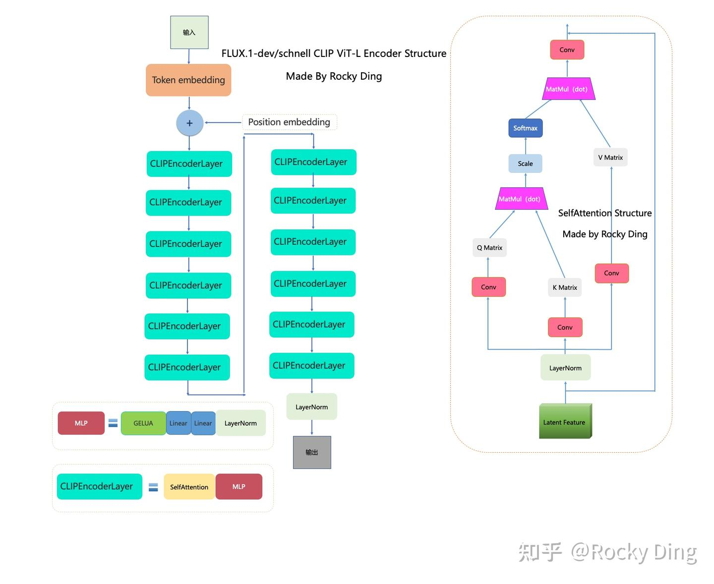

*图：FLUX.1-dev/schnell CLIP ViT-L Text Encoder完整结构图*

</div>

<div align="center">

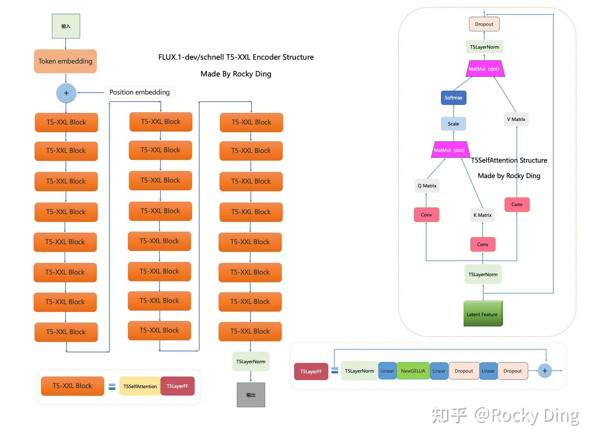

*图：FLUX.1-dev/schnell T5-XXL Text Encoder完整结构图*

</div>

<h2 id="q-flux-002">面试问题：FLUX.1在训练过程中使用了哪些优化技巧？</h2>

**难度评分：⭐⭐⭐⭐ (4/5)  |  考察频率：⭐⭐⭐⭐ (4/5)**

FLUX.1系列模型和SD 3模型一样，都是根据Rectified Flow采样进行推导的扩散模型。在此基础上，FLUX.1主要通过蒸馏、动态Time Shift和多尺度训练三类策略优化训练与推理效率。

### 指引蒸馏与时间步蒸馏

FLUX.1-dev是在FLUX.1-pro基础上进行指引蒸馏（Guidance Distillation）得到的模型，图像生成质量与文本一致性和FLUX.1-pro非常接近，同时推理效率更高。FLUX.1-schnell则是在指引蒸馏基础上进一步进行时间步蒸馏（Timestep Distillation）得到的模型，仅需1至4步就能完成图像生成过程，代价是无法像常规模型一样自由设置图像生成过程的Classifier-Free Guidance强度。

指引蒸馏的目标是让AI绘画模型直接学习Classifier-Free Guidance（CFG）的生成结果，使模型一次前向就能输出此前通常需要两次前向计算才能得到的指引生成结果，从而节约接近一半的推理耗时。时间步蒸馏则通过加速蒸馏，让模型能够在极少的采样步数内完成图像生成。

### 使用Time Shift平移Timestep

FLUX.1设置了一个Time Shift值来平移Timestep。在Rectified Flow采样中，图像沿着某条高维路线从纯高斯噪声运动到训练集分布，同时标准差用于控制不同时刻图像的不确定性。

时刻为0时，图像为纯噪声，此时标准差为1；时刻为1时，图像趋近训练集中的图像分布，此时标准差要尽可能趋于0。原本对于中间时刻，标准差默认按照时刻线性变化。FLUX.1设置的Time Shift是一个约$0.5\sim1.16$之间的数，用来控制中间时刻的噪声均值。

<div align="center">

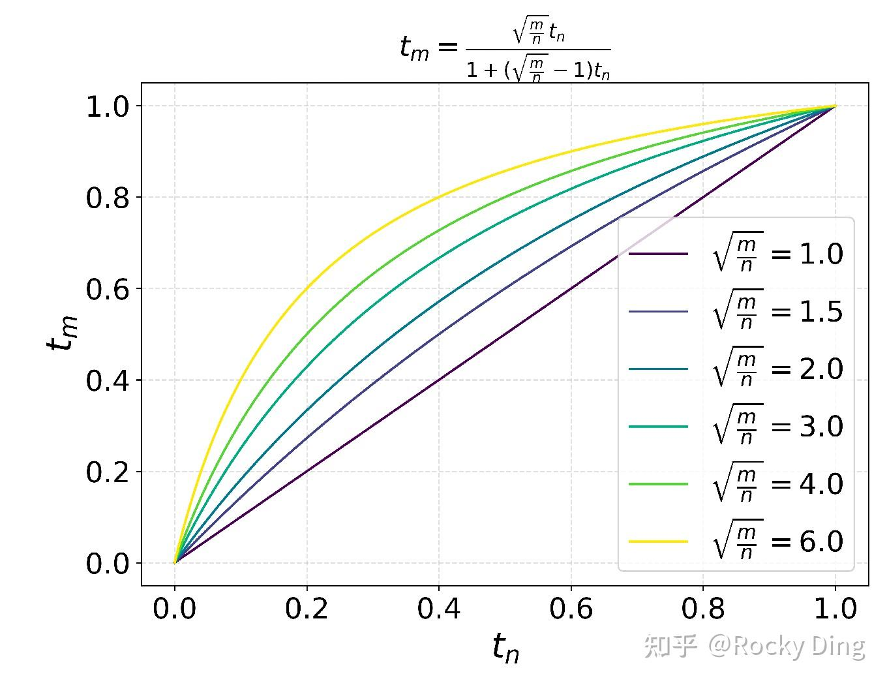

*图：FLUX.1不同Time Shift取值对应的曲线*

</div>

当Time Shift值越大时，运动线路逐渐上凸。当输入图像分辨率越大、对应的Token越多时，Time Shift越大，这时要加入的噪声就越多。这与SD 3中的Shift策略一致：对于分辨率越高的图像，需要加入更多噪声来摧毁原图像的分布特征。FLUX.1不仅在训练时使用这种设计，采样时也会根据序列长度调整噪声时间表。

### 多分辨率与多长宽比训练

FLUX.1系列模型能够灵活生成多种图像分辨率和长宽比，适应 $0.1\sim2.0\text{MP}$ （Megapixels，百万像素）的图像生成任务。总的来说，图像像素数量越多、分辨率越高，细节表现越丰富。

<div align="center">

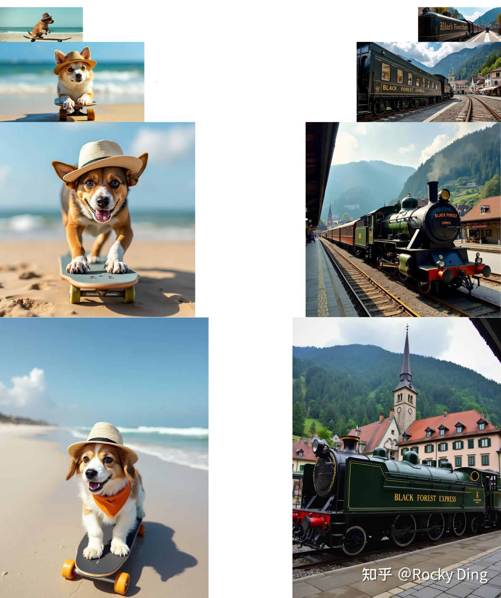

*图：FLUX.1系列模型生成多种分辨率和长宽比的图像*

</div>

FLUX.1能够适配各种分辨率的图像生成，主要得益于**多尺度训练 + RoPE位置编码 + 动态Time Shift**的组合策略。三者分别解决训练数据尺度覆盖、Token空间关系建模和不同序列长度下噪声调度的问题，共同提升了模型对不同分辨率与长宽比的泛化能力。

<h1 id="q-flux-017">2.FLUX.1有哪些主流的变体与分支模型？介绍一下它们的核心原理</h1>

<h2 id="q-flux-005">面试问题：介绍一下FLUX.1 Lite与FLUX.1的异同</h2>

**难度评分：⭐⭐⭐ (3/5)  |  考察频率：⭐⭐⭐ (3/5)**

FLUX.1作为开源AI绘画大模型，其DiT部分参数量达到12B，与之对应的是推理成本也大幅增加。因此，Freepik在FLUX.1-dev的基础上开源了一个更小的蒸馏模型FLUX.1 Lite-8B-alpha：DiT部分的参数量从12B减少到8B，推理所需显存减少约7GB，同时生成图像的速度提升约23%。

<div align="center">


*图：FLUX.1 Lite模型结构与参数规模*

</div>

虽然参数量从12B降低到8B，但整体图像生成质量并未明显降低。使用同样的提示词，FLUX.1 Lite可以得到和FLUX.1-dev质量接近的生成图像。

<div align="center">

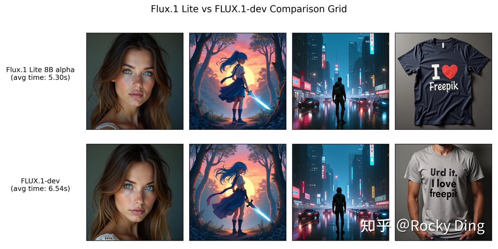

*图：FLUX.1 Lite与FLUX.1-dev图像生成效果对比*

</div>

### FLUX.1 Lite的轻量化原理

FLUX.1 Lite的核心做法是减少FLUX.1-dev中MM-DiT Blocks的数量。FLUX.1-dev一共包含19个MM-DiT Blocks，而FLUX.1 Lite只保留8个，去掉第4至15层共11个MM-DiT Blocks。这本质上是使用模型轻量化领域中的经典技术——模型剪枝——压缩网络，再使用FLUX.1-dev作为教师模型进行蒸馏训练。

Freepik通过固定提示词，分析不同MM-DiT Blocks和Single-DiT Blocks对整个生图结果的贡献。具体方法是计算每个Block输入和输出之间的MSE（Mean Squared Error）：如果MSE很小，说明Latent特征经过该Block后并没有发生太多变化，这一层对最终图像的边际贡献相对有限。

<div align="center">

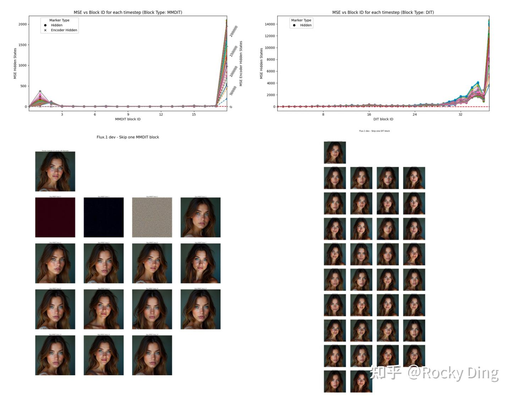

*图：FLUX.1的MM-DiT Blocks和Single-DiT Blocks贡献分析*

</div>

实验结果表明，FLUX.1前部和后部MM-DiT Block的输入输出变化较大，中间部分MM-DiT Block的变化较小；后部Single-DiT Block的变化较大，而前面大部分Single-DiT Block的变化较小。这说明去掉一部分中间Block，并不会给最终生成质量带来明显改变。

Freepik最终选择去掉第4至15层MM-DiT Blocks，一个重要原因是MM-DiT Blocks的参数规模比Single-DiT Blocks更大，对MM-DiT部分进行剪枝可以获得更高的显存与速度收益。**因此，FLUX.1 Lite不是重新设计一套架构，而是在FLUX.1-dev能力分布分析的基础上，通过结构化剪枝与知识蒸馏完成轻量化。**

<h2 id="q-flux-006">面试问题：介绍一下FLUX.1 Kontext的原理，有哪些创新点？</h2>

**难度评分：⭐⭐⭐⭐⭐ (5/5)  |  考察频率：⭐⭐⭐⭐⭐ (5/5)**

FLUX.1 Kontext一共有三个版本：FLUX.1 Kontext [max]、FLUX.1 Kontext [pro]和FLUX.1 Kontext [dev]。其中FLUX.1 Kontext [max]是性能最强的版本；FLUX.1 Kontext [pro]使用潜在对抗性扩散蒸馏（Latent Adversarial Diffusion Distillation，LADD）训练，能够在提升图像生成质量的同时显著减少采样步数，从而提高生成速度，更适合实时应用。上述两个模型同时支持文生图和图像编辑，但没有开源，可以通过官方API使用。

FLUX.1 Kontext [dev]是开源版本，只支持纯图像编辑，不支持文生图。它可以与FLUX.1 [dev]配合使用，实现文生图和图像编辑的完整流程；其开源协议和FLUX.1 [dev]一样，不支持商用。

<div align="center">

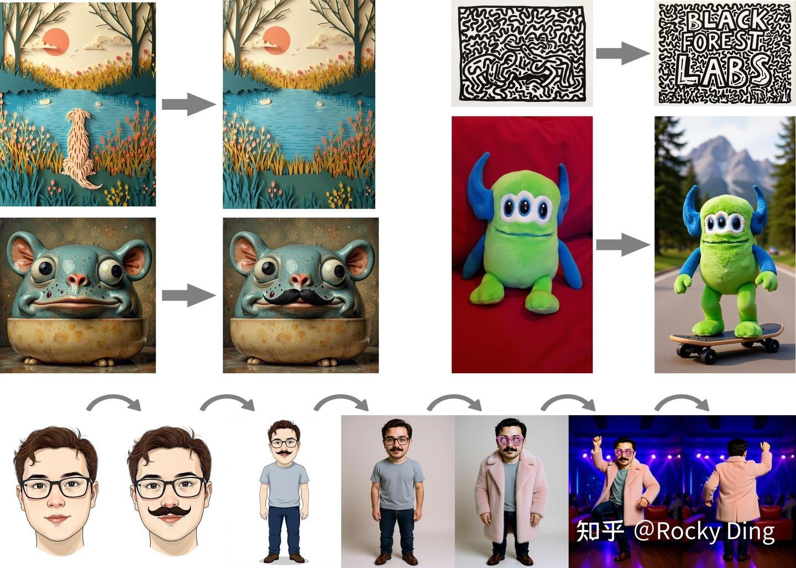

*图：FLUX.1 Kontext图像编辑效果*

</div>

### 双路径多模态特征处理机制

FLUX.1 Kontext的整体架构基于FLUX.1的DiT（Diffusion Transformer）扩展，通过引入参考图像作为条件输入实现多模态生成能力，**其核心创新在于构建双路径多模态特征处理机制**。

<div align="center">

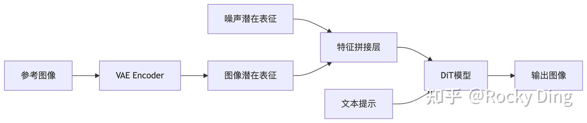

*图：FLUX.1 Kontext工作流程*

</div>

**双模态编码解决的是如何将参考图像输入模型的问题。** 参考图像首先经过冻结的VAE Encoder编码为Latent Tokens特征 $`z_{\mathrm{ref}}\in\mathbb{R}^{h\times w\times c}`$，输入的初始噪声矩阵为 $`z_{\mathrm{noise}}\in\mathbb{R}^{h\times w\times c}`$。噪声矩阵与参考图Latent沿Token序列维度拼接，形成更长的序列：

```math
z_{concat}=\mathrm{Concat}(z_{noise},z_{ref})
\in\mathbb{R}^{2\times h\times w,c}
```

接着将 $`z_{\mathrm{concat}}`$ 输入FLUX.1 Kontext。这样做简单直接，让模型自己学习区分哪部分是生成目标、哪部分是参考条件，同时支持不同的输入与输出分辨率和宽高比，也可以从结构上扩展到多个参考图像 $`y_1,y_2,\ldots,y_N`$。

实验发现，序列拼接（Sequence Concatenation）的效果优于通道级拼接（Channel-wise Concatenation）。可能的原因是序列拼接保持了每张图像的完整性，可以通过位置编码区分不同图像，同时Transformer架构本身也更适合处理序列信息。

### 三维RoPE区分目标图与参考图

FLUX.1 Kontext还需要知道哪些Tokens属于目标图、哪些属于参考图，因此在DiT位置编码中采用3D RoPE，为目标图像和参考图像赋予不同位置：

1. 训练时为目标图像Tokens赋予位置 $(0,h,w)$，推理时目标图像被替换为初始噪声矩阵。
2. 为第 $i$ 张参考图像的Tokens赋予位置 $(i,h,w)$，其中 $i=1,\ldots,N$。

第一个维度 $t=0,1,2,\ldots$ 可以理解为一个虚拟时间标签（Virtual Time Step）：$t=0$ 表示“这是要生成的目标图像”，$t=1,2,\ldots$ 表示“这是第1张、第2张参考图像”。这样模型就能清晰地区分不同输入图像的信息和作用。

```math
\mathrm{RoPE}(x,t)=
\begin{bmatrix}
\cos(t\theta)&-\sin(t\theta)\\
\sin(t\theta)&\cos(t\theta)
\end{bmatrix}
\begin{bmatrix}x_0\\x_1\end{bmatrix}
```

理论上，FLUX.1 Kontext的结构可以支持任意数量的参考图像，但官方实际训练只支持输入一张参考图像，因此标准推理流程也只输入一张图。开源社区常通过先把多张图拼成一张图，再送入Kontext，实现多图像融合效果。

<div align="center">

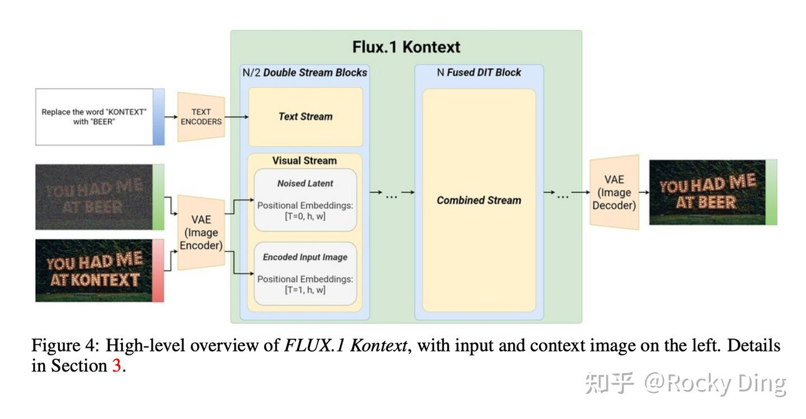

*图：FLUX.1 Kontext整体架构*

</div>

<div align="center">

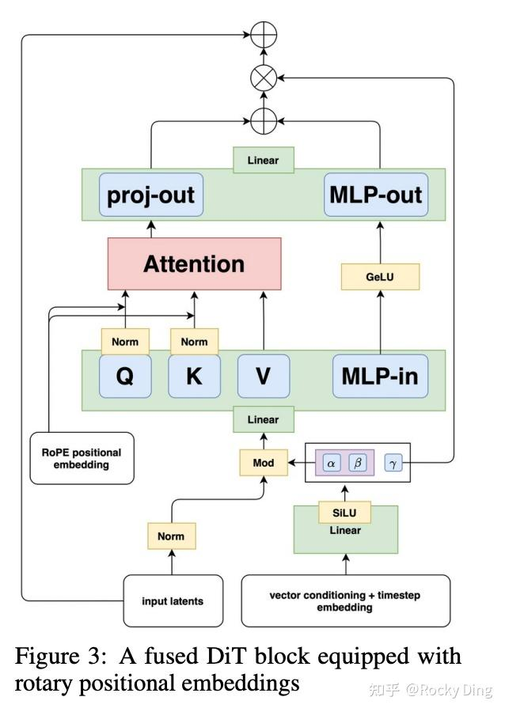

*图：FLUX.1 Kontext继承自FLUX.1的DiT Block*

</div>

### 统一建模图像生成与图像编辑

FLUX.1 Kontext是原生AIGC图像生成编辑大模型，因此需要建模同时满足图像生成与图像编辑要求的条件分布：

```math
p_\theta(x\mid y,c)
```

它表示“在给定参考图像 $y$ 和文字提示词 $c$ 的条件下，生成目标图像 $x$ 的概率”。其中：

1. $x$ 是模型要生成的目标图像（Target Image）。
2. $y$ 是参考图像（Context Image），可以为空；当 $y\neq\varnothing$ 时执行图像内容编辑，当 $y=\varnothing$ 时执行纯文本到图像生成。
3. $c$ 是自然语言提示词，例如“把背景变成雪山”。

通过条件分布 $`p_\theta(x\mid y,c)`$ 建模，同一模型可以处理图像生成和图像编辑两类任务。这种混合训练策略正在成为AIGC图像生成编辑大模型的重要训练基石：高质量、高分辨率的T2I数据可以提升高分辨率编辑中的细节还原和复杂场景处理能力，同时保留模型原生的文本生成图像能力，增强模型面对多样化编辑需求时的泛化性。

文本提示词 $c$ 是描述参考图像与目标图像变化关系的桥梁。官方筛选整理了数百万个 $(x,y,c)$ 三元关系对，并从FLUX.1纯图像生成模型开始训练优化。

### Rectified Flow训练目标与损失函数

直接获得高维图像条件分布 $`p_\theta(x\mid y,c)`$ 的解析解非常困难。由于FLUX.1 Kontext和FLUX.1一样采用Rectified Flow，因此可以把分布建模转化为向量场 $`v_\theta`$ 的学习：

1. **前向扩散过程**：从目标图像 $x$ 出发，随时间 $t$ 向纯噪声 $\varepsilon$ 过渡，形成流 $`z_t`$。
2. **反向去噪过程**：从纯噪声 $\varepsilon$ 出发，沿向量场 $`v_\theta`$ 积分，最终得到目标图像 $x$。

损失函数的作用是让模型预测的向量场尽可能接近真实流变化率：

```math
\mathcal{L}_\theta=
\mathbb{E}_{t\sim p(t),x,y,c}
\left[
\left\|v_\theta(z_t,t,y,c)-(\varepsilon-x)\right\|_2^2
\right]
```

其中，干净目标图像为 $x$，随机高斯噪声满足 $\varepsilon\sim\mathcal{N}(0,1)$；$`z_t`$ 是二者之间的线性插值：

```math
z_t=(1-t)x+t\varepsilon
```

$`v_\theta`$ 是模型预测的速度场，训练目标是逼近 $\varepsilon-x$ 的方向。时间步使用Logit-Normal Shift Schedule从 $p(t;\mu,\sigma=1.0)$ 中采样，模式参数 $\mu$ 可以根据训练数据分辨率调整；当 $y=\varnothing$ 时，省略参考图像Tokens，只保留文本生成图像能力。

这一期望本质上同时对三元组 $(x,y,c)$ 的数据分布和时间步分布 $p(t)$ 取期望，可以展开为：

```math
\mathcal{L}_\theta=
\int_t\int_{x,y,c}p(t)p(x,y,c)
\left\|v_\theta(z_t,t,y,c)-(\varepsilon-x)\right\|_2^2
\,dt\,dx\,dy\,dc
```

这里 $p(x,y,c)$ 是训练数据的联合分布，模型学习的 $`p_\theta(x\mid y,c)`$ 是对真实条件分布 $`p_{\mathrm{data}}(x\mid y,c)`$ 的近似。当损失最小时，模型预测的向量场会诱导出一个流分布，使其尽可能逼近真实数据分布。

### Logit-Normal时间步采样

Rectified Flow选择连续直线作为噪声添加路径：

```math
z_t=a_tx_0+b_t\varepsilon=(1-t)x_0+t\varepsilon
```

其中 $`x_0\sim p_{\mathrm{data}}`$、 $\varepsilon\sim\mathcal{N}(0,1)$ ，并设置 $`a_t=1-t`$、$`b_t=t`$。对应的对数信噪比为：

```math
\lambda_t=\log\frac{a_t^2}{b_t^2}
=\log\frac{(1-t)^2}{t^2}
```

在训练时不会均匀采样混合比例 $t$，而是让模型更多关注特定关键阶段。Logit-Normal分布可以让模型在训练时聚焦特定时间步，从而提升生成图像的质量和细节，是FLUX.1 Kontext实现分辨率自适应训练的重要技术。

时间步 $t$ 的取值范围是 $(0,1)$，而正态分布定义域是整个实数轴。为了用正态分布建模 $t$，需要引入Logit变换及其逆变换：

```math
Y=\mathrm{logit}(t)=\log\frac{t}{1-t},
\qquad
t=\sigma(Y)=\frac{\exp(Y)}{1+\exp(Y)}
```

当 $Y\in\mathbb{R}$ 时， $t=\sigma(Y)$ 必然落在 $(0,1)$。如果随机变量 $Y=\mathrm{logit}(t)$ 服从正态分布 $\mathcal{N}(\mu,\sigma^2)$，那么 $t$ 服从Logit-Normal分布：

```math
t\sim\mathrm{Logit\text{-}Normal}(\mu,\sigma^2)
```

其概率密度函数为：

```math
p(t)=
\frac{
\exp\left(-0.5\cdot(\mathrm{logit}(t)-\mu)^2/\sigma^2\right)
}{
\sigma\sqrt{2\pi}\cdot t(1-t)
}
```

概率密度 $p(t)$ 可以理解为模型训练时的“注意力分配器”，决定模型把更多训练资源放在哪个噪声阶段。工程实现不直接从复杂密度函数采样，而是先采样正态变量，再进行Logit逆变换：

```python
import torch
from torch.distributions import Normal


def sample_t(mu, sigma, shape):
    y = Normal(mu, sigma).sample(shape)
    return torch.sigmoid(y)
```

<div align="center">

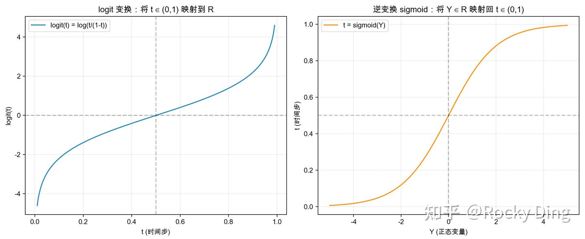

*图：Logit-Normal分布与时间步采样*

</div>

Logit-Normal分布的形状由均值 $\mu$ 和标准差 $\sigma$ 控制：

1. $\mu=0$ 时，采样重心在中间时间步 $t=0.5$，对应中等噪声阶段。
2. $\mu>0$ 时，$t$ 偏向1，对应高噪声阶段。
3. $`\mu<0`$ 时，$t$ 偏向0，对应低噪声阶段。
4. $\sigma$ 越小，采样越集中在 $\sigma(\mu)$ 附近； $\sigma$ 越大，采样覆盖的时间步越广。

在FLUX.1 Kontext中， $\mu$ 与分辨率自适应因子 $\alpha$ 直接绑定： $\mu=\log\alpha$ 。处理高分辨率图像时，可以增大 $\alpha$，让采样重心右移，使模型更多训练高噪声阶段，反复学习如何从复杂噪声中恢复细节；处理低分辨率图像时，可以使用 $\alpha=1$、 $\mu=0$ ，在保证质量的同时提高训练效率。通常固定 $\sigma=1.0$，主要通过调整 $\mu$ 实现分辨率自适应。

<div align="center">

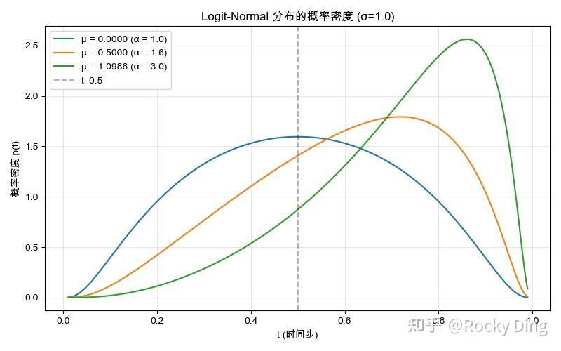

*图：均值与标准差对时间步采样分布的影响*

</div>

<div align="center">

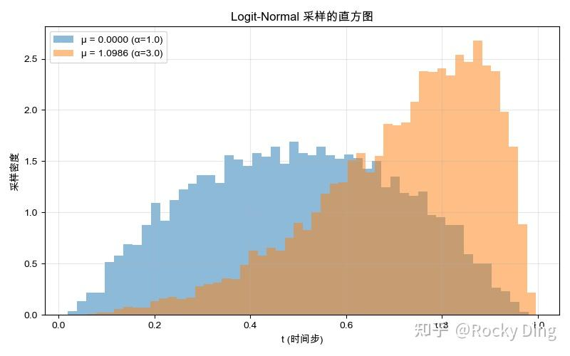

*图：不同分辨率对应的时间步采样重心*

</div>

### Timestep Schedule Shifting

Timestep Schedule Shifting（时间步调度偏移）是FLUX.1 Kontext实现分辨率自适应训练的另一种表达。它通过调整时间步 $t$ 的分布，改变模型对不同噪声阶段的关注程度：高分辨率图像需要更多高噪声阶段训练，以学习从复杂噪声中恢复细节；低分辨率图像则可以聚焦较低噪声阶段，提升训练效率。

对于标准Rectified Flow前向过程，可以定义Log-SNR为：

```math
\lambda_t^{0,1}=2\log\frac{1-t}{t}
=-2\mathrm{logit}(t)
```

<div align="center">

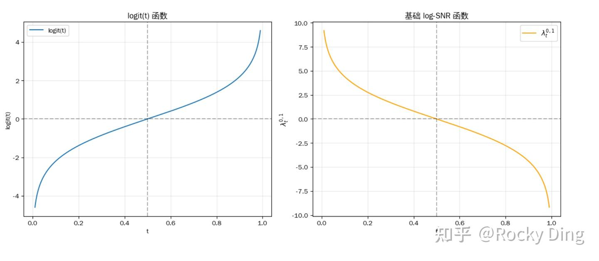

*图：标准Rectified Flow前向过程的Log-SNR*

</div>

对于任意偏移 $\mu$ 和缩放 $\sigma$，Log-SNR可以一般化为：

```math
\lambda_t^{\mu,\sigma}
=-2\left(\sigma\cdot\mathrm{logit}(t)+\mu\right)
=\sigma\lambda_t^{0,1}-2\mu
```

$\sigma$ 控制Log-SNR分布范围， $\mu$ 控制均值偏移。引入分辨率自适应的 $\alpha$-Shifted Log-SNR：

```math
\lambda_t^\alpha=\lambda_t^{0,1}-2\log\alpha
```

当 $\sigma=1.0$ 时，可以得到关键关系 $\mu=\log\alpha$。进一步求解偏移后的时间步 $t'$：

```math
t'=\frac{e^\mu}{e^\mu+\left(\frac{1}{t}-1\right)^\sigma}
```

这个公式把原始时间步 $t$ 映射到新时间步 $t'$，从而改变训练时的Log-SNR分布。当 $\alpha>1$ 时， $t'>t$ ，模型更多训练高噪声阶段；当 $`\alpha<1`$ 时，$`t'<t`$，模型更多训练低噪声阶段。高分辨率图像通过 $\alpha>1$ 强化高噪声阶段学习，低分辨率图像通过 $`\alpha<1`$ 提升训练效率。相关实验中， $\alpha=3.0$ 在分辨率从 $256^2$ 提升到 $1024^2$ 时取得了较好效果。

<div align="center">

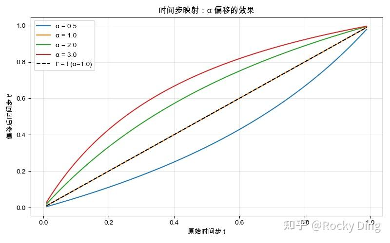

*图：Timestep Schedule Shifting对不同分辨率训练的作用*

</div>

总的来说，Logit-Normal采样与Shifted Timestep是同一策略的两种表达：前者通过调整 $\mu=\log\alpha$ 直接改变时间步采样分布，后者把原始时间步映射为服从偏移分布的新时间步。两者本质上都是改变训练资源在不同噪声阶段之间的分配。

### 经典应用场景

FLUX.1 Kontext可以执行文生图、图像局部编辑、人物一致性保持和风格参考等任务。风格参考并不是复制原图内容，而是提取参考图像的风格，再结合文本提示词生成全新内容，同时保留参考图像中的独特风格。

<div align="center">

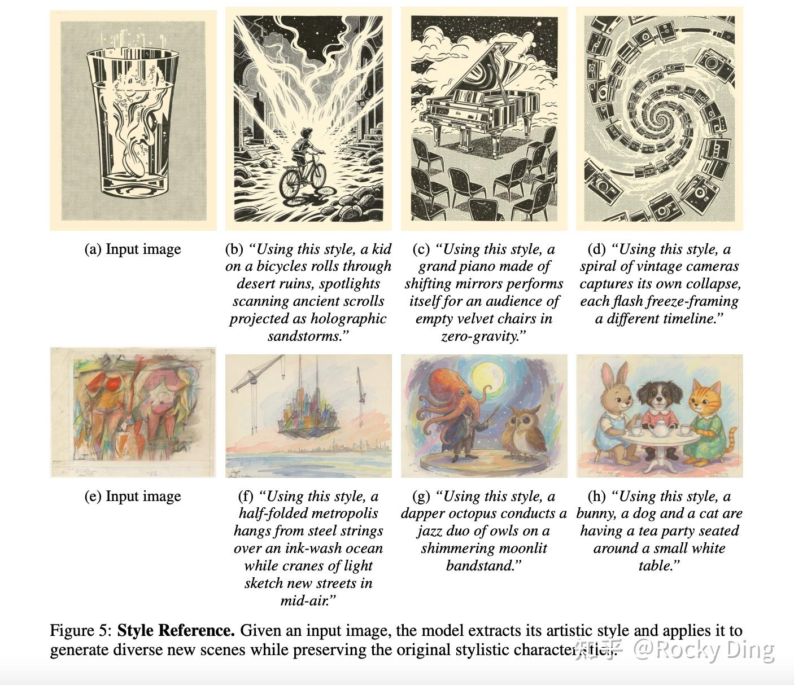

*图：FLUX.1 Kontext风格参考功能*

</div>


<h2 id="q-flux-008">面试问题：介绍一下FLUX.1 Krea的原理，有哪些创新点？</h2>

**难度评分：⭐⭐⭐⭐ (4/5)  |  考察频率：⭐⭐⭐⭐ (4/5)**

FLUX.1 Krea由Black Forest Labs和Krea AI联合研发并开源。Black Forest Labs向Krea AI提供了FLUX.1-dev模型的完整预训练权重`flux-dev-raw`，作为后训练的基座模型。

作为一个输出分布多样、可塑性强的预训练基座，`flux-dev-raw`生成的图像质量还没有达到顶尖基础模型的水准，但它具备成为理想后训练基座的三项优势：

1. `flux-dev-raw`蕴含丰富的通用知识，已经掌握常见物体、动物、人物、拍摄视角和媒介等视觉概念。
2. 它已经具备可观的基础能力，能够生成结构连贯的图像、完成基本构图并进行文字渲染。
3. 最重要的是，它尚未“定型”，没有固化的“AI审美定式”，能够生成从粗糙到精美的多样化图像。

<div align="center">

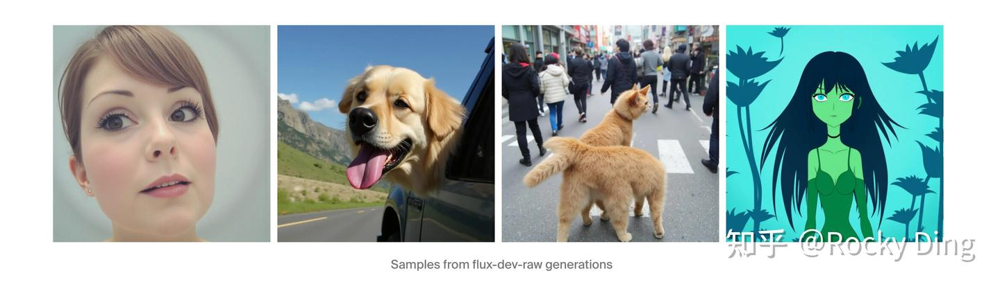

*图：flux-dev-raw模型图像生成效果*

</div>

经过微调训练后，FLUX.1 Krea [dev]展现出较高的审美水平和图像质量，特别是在照片级写实场景中表现突出，整体具备以下特性：

1. **聚焦美学摄影**：擅长生成具有较强美学感的摄影风格图像，缓解常见的“AI感”，提升真实感和图像质量。
2. **提示词理解能力较强**：具备较好的提示词跟随能力，可以处理复杂的内容描述。
3. **采用引导蒸馏技术**：在生成图像时计算效率更高，速度更快。
4. **兼容开源生态**：兼容FLUX.1 [dev]架构及其对应的开源生态系统。

<div align="center">


*图：FLUX.1 Krea [dev]图像生成效果*

</div>

与大多数AIGC图像生成大模型不同，FLUX.1 Krea融入了鲜明的主观审美取向和“美学偏好”（Opinionated），专注于呈现独特审美：减少“AI痕迹”和过曝高光，保留自然细腻的细节。其训练目标是生成更真实、更多样的图像，并避免图像生成中常见的过度饱和和蜡质纹理。

### FLUX.1 Krea如何破除“AI感”

Black Forest Labs和Krea AI在分析文生图大模型的“AI感”时引用了古德哈特定律：**“当一个衡量标准变成目标时，它就不再是一个好的衡量标准。”**

从GAN时代生成猫狗花卉的早期阶段至今，图像生成技术已经取得很大进步。当今模型不仅能生成结构准确的人脸、肢体与手掌，还能理解精确数量关系、渲染复杂字体排版，甚至完成“宇航员骑马”这类复杂场景。

然而，AIGC大模型生成的图像通常具有一种容易被识别的“味道”：过度模糊的背景、蜡质般的皮肤纹理、乏味单调的构图等，这些问题共同构成了所谓的“AI感”。

<div align="center">

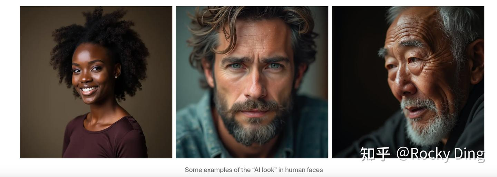

*图：AIGC图像生成大模型常见的“AI感”*

</div>

业界长期过度关注模型的“智能程度”，并通过基准测试衡量空间关系、属性绑定、物体计数、文字渲染等能力。研究界在推进生成模型发展方面取得了显著成果，但在追逐技术能力和基准优化的过程中，早期图像模型的原生质感、风格多样性和创作灵性反而容易被边缘化。

在预训练阶段，FID和CLIP Score等指标对于衡量模型总体性能很有用；预训练之后，DPG、GenEval、T2I-CompBench和GenAI-Bench等评估基准主要衡量提示词遵循、空间关系、属性绑定和物体计数。它们并不能完整描述图像的主观审美质量。

在美学评估方面，LAION-Aesthetics、PickScore、ImageReward和HPSv2等评分模型多数是基于CLIP的微调变体，处理分辨率通常较低、参数量也相对有限。随着图像生成大模型能力提升，这类旧有美学评分模型已经很难独立承担高质量审美评估。

例如，常被用于筛选训练图像的LAION-Aesthetics模型存在明显偏好：更容易选择女性形象、模糊背景、柔化纹理和高亮度图像。美学评分器与图像质量过滤器可以有效筛除劣质图像，但依赖它们筛选训练数据，也会给模型先验注入隐性的审美偏差。

<div align="center">


*图：LAION-Aesthetics评分前5%的图像示例*

</div>

尽管基于视觉语言模型的新一代美学评分器正在出现，核心问题仍然是：**人类偏好与美学判断具有高度主观性，无法被简单压缩为一个数字。**要在提升模型能力的同时避免滑向“AI感”，需要精细的数据策划，以及对模型输出进行充分校准与微调。

### “模式坍缩”的艺术

训练一个AIGC图像生成模型主要分为预训练和后训练两个阶段。模型绝大部分美学特质是在后训练阶段学习的，但模型能力和风格多样性的上限首先由预训练基座决定。

<div align="center">

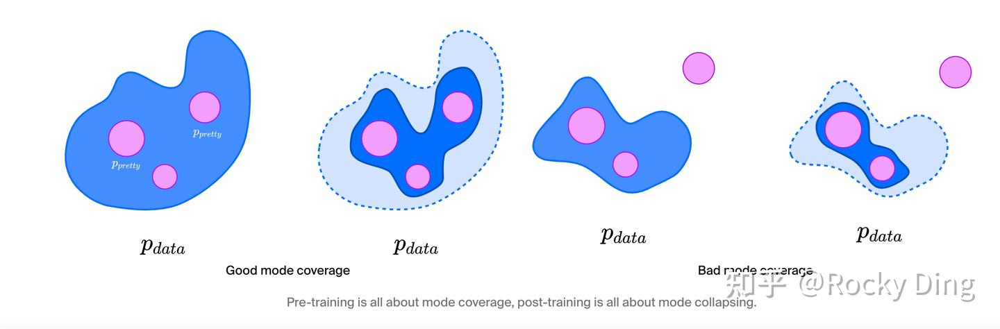

*图：预训练与后训练的目标分工*

</div>

**预训练阶段的重点是“模式覆盖”（Mode Coverage）和“世界理解”（World Understanding）。** 模型需要充分吸收视觉世界中的各类风格、物体场景、地域风貌与人物形象，目标是最大化生成多样性。

预训练模型甚至应该接触“劣质”数据，只要这些不良特征能够被条件机制准确描述。除了让模型知道“何为优秀”，也需要让模型理解“何为糟粕”。当前很多图像生成工作流会使用“手指畸形、面部扭曲、画面模糊、色彩过饱和”等负面提示词；如果模型从未见过这些不良特征，负面条件就无法有效引导模型避开对应的数据分布区域。

**后训练阶段的核心任务，是转移并剔除数据分布中的不良成分。** 预训练模型可以生成多样图像、理解广泛概念，但由于尚未形成明确的美学偏向，往往难以稳定输出高质量图像。此时需要主动利用“模式坍缩”（Mode Collapse）：通过后训练让模型持续偏向期望的优质数据分布区间，而不是平均保留所有类型的输出。

<div align="center">


*图：FLUX.1 Krea通过后训练将生成分布聚焦到优质区域*

</div>

### 监督微调（SFT）流程

<div align="center">

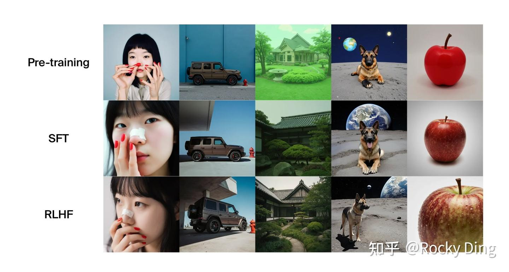

*图：FLUX.1 Krea的监督微调与偏好优化流程*

</div>

FLUX.1 Krea模型中的监督微调（SFT）是其摆脱“AI感”，生成具有照片级真实感和独特美学图像的关键步骤。

### SFT的流程

FLUX.1 Krea 的SFT流程核心是使用精选数据，将通用的基础模型“调教”成一个具有特定审美品味的模型。

1.  **起点：优质的“原始”基础模型**
    SFT并非从零开始，它需要一个知识渊博的“胚子”。FLUX.1 Krea 使用的是Black Forest Labs提供的 **`flux-dev-raw`基础模型**。同时进行了大规模的预训练，其特点是已经具备了大量的“世界知识”（能理解各种物体、风格和概念），但尚未经过过度微调调优，保留了原始生成分布的多样性，可塑性非常强。

2.  **核心：精心策划的训练数据**
    数据是SFT的灵魂，FLUX.1 Krea 严格遵循 **“质量重于数量”** 的原则。其训练数据主要包括：
    - **高质量图像-文本对**：团队手工挑选了符合其审美标准的高质量图像数据集。
    - **合成样本**：在SFT阶段还加入了来自 **Krea自身模型的高质量合成样本**，这有助于稳定模型在迭代过程中的性能。

    整个SFT阶段使用的数据量可能远少于预训练，但凭借极高的数据质量，足以让模型领会到期望的美学风格。

3.  **关键技术：自定义损失函数与CFG分布微调**
    这是一个技术上的重要细节。由于 `flux-dev-raw` 是一个经过指导蒸馏的模型，FLUX.1 Krea 的团队设计了一个**自定义的损失函数，直接在无分类器引导（CFG）的分布上对模型进行微调**。我们可以这样理解：CFG是生成过程中用于控制图像与提示词相关性的一个技术，直接在此分布上优化，能更有效地引导模型朝着既遵守提示词又具备高美学质量的方向生成图像。

### SFT的原理与作用

从原理上看，SFT的本质是让大模型通过“模仿”来重塑行为。

- **原理**：SFT通过**最小化模型预测与目标答案（高质量图像）之间的交叉熵损失**来进行训练。简单来说，就是通过调整模型参数，让它生成的图像在视觉特征上越来越接近那些精心准备的高质量训练图片，同时忽略训练数据中的缺陷部分。

- **作用**：经过SFT阶段后，FLUX.1 Krea大模型发生了根本性的转变：
    - **确立美学基础**：从能“画出”东西，转变为能画出“好看”的东西，初步建立起对自然光影、真实质感和协调构图的偏好。
    - **提升图像质量**：生成的图像在清晰度、结构准确性和细节丰富度上显著提升。
    - **保留多样性**：由于基础模型的“原始”性和数据的质量，模型在确立风格的同时，并未丧失生成的多样性。

### SFT微调与前后环节的协作

SFT微调并非孤立的环节，它为后续的RLHF阶段打下了坚实的基础。

- **SFT与预训练**：预训练让大模型“见多识广”，学会了世界的各种可能性（包括优质和劣质图像），为SFT阶段的负面提示词等技术提供了基础。SFT则是在此基础上做“减法”和“精修”，引导模型专注于高质量和高美学的部分。

- **SFT与RLHF**：SFT解决了“好看”的问题，而RLHF则进一步解决“更符合人类偏好”的问题。SFT可以被看作是**RLHF的必要准备**，它先让模型具备稳定的高质量输出能力，然后RLHF再通过人类偏好数据对这个能力进行精细校准和微调，使作品的风格更鲜明、更符合特定的艺术标准。

为了让你更清晰地理解SFT在整个过程中的承上启下作用，下表对比了这三个核心阶段：

<div align="center">

| **阶段** | **核心目标** | **数据特点** | **对模型的影响** |
| :--- | :--- | :--- | :--- |
| **预训练** | **模式覆盖**与**世界理解** | 海量、多样化的图像-文本对，包含各种质量的图像 | 建立通用视觉知识，最大化生成多样性 |
| **监督微调 (SFT)** | **确立美学基础**与**提升质量** | 少量但极致精选的高质量/合成图像 | 学会生成高清、结构准确、符合特定审美的图像 |
| **RLHF** | **对齐人类偏好**与**风格强化** | 小规模、带有明确艺术导向的人类偏好数据 | 进一步校准输出，使风格更鲜明，更稳健地符合人类审美 |

</div>

### 后训练过程中的关键要点

在监督微调阶段，FLUX.1 Krea精心筛选构建了一个符合官方审美标准的、最高质量的图像数据集。同时在训练FLUX.1 Krea大模型的过程中，还加入了来自Krea-1模型的高质量合成图像数据，这些图像被用于增强 SFT 阶段的模型训练效果。

由于flux-dev-raw是一个经过指导式蒸馏（guidance distilled）的模型，官方设计了一种自定义损失函数，直接在无分类器引导（CFG）的分布上对模型进行微调训练。在SFT阶段之后，FLUX.1 Krea模型的图像生成质量得到了显著提升。但是要使FLUX.1 Krea模型更加稳健并达到官方所追求的美学效果，还需要进一步的工作：这就是RLHF的用武之地。

在RLHF阶段，官方应用了一种偏好优化技术的变体，称为TPO（Tuned Preference Optimization），以进一步提升FLUX.1 Krea模型的美学质量和风格化水平。官方使用了高质量的内部偏好数据，这些数据经过严格筛选以确保质量。同时在微调过程中还会进行多轮偏好优化，进一步优化FLUX.1 Krea模型生成图像的风格与质量。

在探索各种后训练技术的过程中，Krea官方发现了一些关键要点：

1. **质量比数量重要的多**：我们只需要非常少量的数据（不到100万）就能进行有效的后训练。虽然更大的数据集规模有助于模型的稳定性和减少偏差，但数据的质量才是最为重要的，使用小规模、精心挑选的数据集进行训练，依然可以达到极佳的模型整体效果。使用的偏好标签是由标注人员精心收集的，这些标注人员非常清楚当前模型的局限性、需要改进的领域、优点和缺点。同时确保图像数据集内容足够多样，以获得聚焦且有代表性的标注结果。
2. **采取主观明确的训练方法**：目前有许多开源的偏好数据集，被用于评估测试偏好微调技术。这些数据集对于测试各种技术确实非常有用。然而，如果直接在现有数据集上进行训练，往往会导致一些意想不到的负面影响，例如模型生成的图像会偏向对称、简单的构图；会有模糊和过度柔和的纹理；会出现色彩风格趋于单一的情况；会回归到”AI感”等。

Krea官方认为，在”全局”用户偏好上微调训练的模型在审美质量上并非最优。对于像文本渲染、解剖结构、物体结构和提示词遵循度这样有客观事实依据的目标，数据的多样性和规模确实是很有帮助的。然而，对于像美学质量这样主观的目标，将不同的审美品味混合在一起几乎是相互抵触的。

例如，一个用户喜欢高端时尚摄影，另一个用户钟情于极简主义绘画。如果分别获得聚焦、明确的偏好标注，模型很容易对齐并擅长相应风格；但把两种分布合并后，得到的往往是一个边缘化的“中庸”偏好分布，最终模型难以让任何一方满意。

<div align="center">

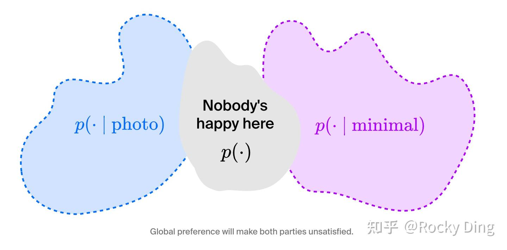

*图：不同审美偏好融合后形成的“中庸”分布*

</div>

这个问题可以通过设计提示词部分缓解，但不是一个充分的解决方案。很多用户最终需要配合LoRA才能获得所需的风格化水平。用户通常希望模型具备合理的默认输出，而不是每次都需要堆叠大量修饰词才能获得具有审美水准的图像。

受此直觉启发，Krea以主观明确的方式收集偏好数据，使其符合团队自身的审美品味和清晰艺术方向。对于美学这种主观目标，将模型有意识地“过拟合”到一种特定风格，往往效果更好、实现也更直接。

### Tuned Preference Optimization技术

在SFT阶段之后，FLUX.1 Krea模型的**图像质量**已经很高了，但**美学风格和鲁棒性**还未达到理想状态。团队发现，使用现有的开源偏好数据集进行优化会导致模型出现“审美中庸”、风格倒退（回归“AI感”）等问题。

TPO正是为了解决这些问题而设计的、一种**高度主观化**的偏好优化技术。

### 一、TPO是什么？

TPO是一种**基于偏好优化的强化学习技术变体**。它的核心思想不是去学习一个“普适的”、“大众的”人类审美，而是**将模型强烈地、有倾向性地对齐到一个非常具体和明确的美学标准上**。

你可以把它理解为模型的“美学特训营”。在这个特训营里，教练（TPO算法）不是教学生“什么样的话大家都爱听”，而是教他“如何成为一名具有独特风格的艺术家”。

### 二、TPO的核心原理

TPO的技术根源来自于像DPO、KTO这样的直接偏好优化算法。这些算法的共同点是**绕过传统RLHF中难以训练的奖励模型，直接利用偏好数据来微调策略模型（即我们要优化的图像生成模型）**。

我们来简单理解一下这个基本原理：

1.  **传统RLHF的痛点**：
    *   需要先训练一个奖励模型来判断人类更喜欢哪张图片。
    *   然后通过强化学习（如PPO）来优化生成模型，以最大化从奖励模型获得的分数。
    *   这个过程非常不稳定、计算成本高，且奖励模型的偏差会直接影响最终效果。

2.  **直接偏好优化的创新**：
    *   它发现，我们可以不训练独立的奖励模型。
    *   而是将问题转化为一个**分类问题**：直接调整生成模型本身的参数，使得它生成“获胜”图片的概率远大于生成“失败”图片的概率。
    *   其损失函数的核心是：**对于一对图片（获胜图片 `X_win` 和失败图片 `X_lose`），优化后模型对 `X_win` 的偏好概率应该大于对 `X_lose` 的偏好概率。**

### 三、TPO的“Tuned”体现在哪里？—— 其关键创新

“Tuned”这个词精准地描述了TPO的精髓——**精心调谐**。它不仅仅是在做偏好优化，而是对整个过程进行了定制化的改进，主要体现在以下几点：

1.  **高度主观与明确的美学导向**
    *   **问题**：开源偏好数据集混合了各种用户的审美，导致模型学习到的是一个“平均审美”，失去了风格棱角。
    *   **TPO的解决方案**：不使用公开数据集，而是**内部收集具有高度一致性的偏好数据**。标注人员完全理解团队想要的艺术方向（如特定的构图、光影、质感）。这使得优化目标非常纯粹和尖锐。

2.  **多轮迭代优化**
    *   官方提到“*在许多情况下，我们应用了多轮的偏好优化*”。这不是一个一次性的过程。
    *   **流程可能是**：`SFT -> TPO Round 1 -> 生成新样本 -> 收集对新样本的偏好 -> TPO Round 2 -> ...`
    *   这种方式允许团队**逐步校准模型**，使其美学风格越来越精确和稳定，不断强化优点、修正缺点。

3.  **对“过度拟合”的重新定义**
    *   在机器学习中，“过度拟合”通常是个贬义词，意味着模型失去了泛化能力。
    *   但在TPO的哲学里，**对于美学这种主观目标，“过度拟合”到一个特定风格上是可取的，甚至是目标**。团队明确指出：“*让模型过度拟合某种特定风格通常是更好且更简单的做法*”。这确保了FLUX.1 Krea输出风格的**鲜明性和一致性**。

4.  **专注于解决SFT后的遗留问题**
    *   SFT解决了“质量”问题，TPO则专注于“风格”和“鲁棒性”。
    *   TPO的偏好数据很可能**特意针对SFT模型表现薄弱或风格不明确的场景**进行收集，例如复杂的构图、特定的色彩搭配、难以渲染的材质等，从而实现精准打击。

### 四、TPO的工作流程

结合以上原理，TPO的一个典型工作流程可以概括为以下步骤：

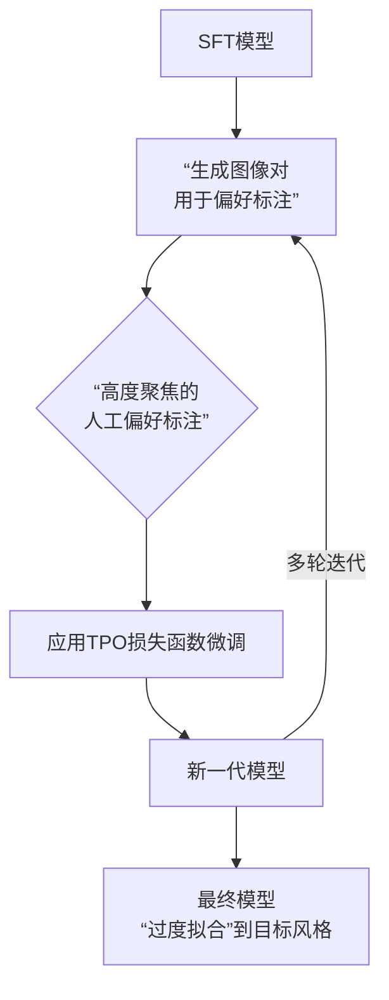
```mermaid
flowchart TD
    A[SFT模型] --> B[“生成图像对<br>用于偏好标注”]
    B --> C{“高度聚焦的<br>人工偏好标注”}
    C --> D[应用TPO损失函数微调]
    D --> E[新一代模型]
    E -- 多轮迭代--> B
    E --> F[最终模型<br>“过度拟合”到目标风格]
```

### 总结：TPO带来的效果

通过TPO技术，FLUX.1 Krea实现了：

*   **鲜明的艺术风格**：模型输出的图像具有高度可识别的、一致的“Krea风格”，而不是模糊的“大众脸”。
*   **卓越的美学质量**：在团队定义的审美标准下，图像的光影、构图、色彩和质感都达到了极高水平。
*   **强大的鲁棒性**：即使面对具有挑战性的提示词，模型也能稳定地输出符合其美学标准的图像，而不是崩溃或产生“AI感”十足的图片。
*   **用户友好性**：用户无需编写冗长复杂的提示词来“对抗”模型的中庸审美，简单的提示也能得到具有高级美学感的默认输出。

**总而言之，TPO是FLUX.1 Krea成功的关键技术之一。它代表了一种新一代模型优化的理念：从追求“什么都会一点”的通用模型，转向在特定领域或风格上做到极致的“专家型”模型。这种“主观明确”的优化路径，很可能成为未来顶级AI模型竞争的核心。**

<h1 id="q-flux-013">3.与FLUX.1相比，FLUX.2有哪些创新点？</h1>

<h2 id="q-flux-018">面试问题：FLUX.2 相比 FLUX.1 的整体能力边界发生了哪些变化？</h2>

**难度评分：⭐⭐⭐ (3/5)  |  考察频率：⭐⭐⭐⭐⭐ (5/5)**

FLUX.2 系列最本质的变化，不只是把 FLUX.1 的文生图质量继续做高，而是把**文生图、单图编辑和多参考图编辑统一到同一套模型能力中**，使模型从“生成一张好看的图片”进一步走向可重复、可组合、可约束的生产工作流。

FLUX.2系列更新的新特性与核心优化亮点，具体如下：
1. **支持参考图生成**：FLUX.2 产品界面最多可输入 10 张参考图像，在角色、产品及风格一致性上达到当前最佳水平。支持显式图像索引，用户可在提示词中通过编号引用特定图像，例如“将图 2 中的衣服穿在图 1 的角色身上”。需要注意，不同部署形态的上限并不完全相同：BFL 当前 API 的 [max]、[pro]、[flex] 最多支持 8 张，Playground 最多支持 10 张，开源 [dev] 建议最多使用 6 张。
2. **图像细节与照片级真实感**：生成图像具备更丰富的细节、更清晰的纹理与更自然的光照表现，适用于产品摄影、可视化及类似专业摄影场景。
3. **文本渲染能力提升**：可稳定生成复杂排版、信息图表、表情包及含细小文字的 UI 界面模型，支持中文输入与中文文字渲染，已具备生产环境可用性。
4. **增强的提示词遵循**：能够更准确地理解并执行复杂的结构化指令（支持 JSON 格式），包括多部分提示词及构图约束。
5. **丰富的世界知识**：模型在现实世界知识、光照逻辑与空间关系方面表现更加合理，可生成场景更连贯、行为更符合预期的图像。
6. **更高分辨率与灵活的宽高比**：支持最高 4MP（例如 1920×1920）的图像编辑分辨率，并允许灵活的输入与输出比例。
7. **支持十六进制颜色描述**：可通过如 #DDC57A 的十六进制代码精准描述对象颜色，在色彩控制方面表现优异。

这些能力并不是彼此孤立的功能点。多参考图提供可复用的角色、商品和风格条件，结构化 Prompt 与十六进制颜色提高控制精度，4MP 编辑和更强文字渲染则让输出更接近设计、广告、电商与 UI 原型等真实生产物料。换句话说，FLUX.2 的主要升级方向是把“生成能力”变成“可进入工作流的视觉智能能力”。

<h2 id="q-flux-019">面试问题：FLUX.2 的 Text Encoder 为什么从 CLIP + T5-XXL 切换到 24B VLM？</h2>

**难度评分：⭐⭐⭐⭐ (4/5)  |  考察频率：⭐⭐⭐⭐ (4/5)**

在Text Encoder部分，FLUX.2的文本编码器不再使用T5和CLIP，而是改用了**Mistral-3-24B视觉语言大模型**（VLM大模型，Mistral-Small-3.2-24B-Instruct-2506），视觉语言大模型提供真实世界知识和上下文理解，增强了对世界、材质、空间关系和构图的建模能力。同时使用单个文本编码器极大地简化了Prompt Embeddings的计算过程。

这项变化的改进意图，可以从三个层面理解：

1. **从“文本相似度”走向“指令与世界知识”**：CLIP擅长学习图文对齐，T5-XXL擅长长文本语义，但二者都不是为复杂视觉指令理解而统一训练的VLM。24B VLM能够把实体关系、材质属性、空间逻辑、文字内容与构图约束组织到同一上下文中，更适合处理结构化Prompt和多对象组合任务。
2. **减少异构编码器之间的语义拼接**：FLUX.1需要同时协调CLIP与T5产生的不同表征；FLUX.2使用单个VLM作为主要文本条件来源，Prompt Embeddings的计算和条件接口更统一，避免多个编码空间在尺度与语义侧重点上的额外对齐成本。
3. **把Prompt扩写纳入同一语言模型能力**：官方开源推理代码可以复用 `Mistral-Small-3.2-24B-Instruct-2506` 对原始Prompt做Prompt Upsampling，再用同一模型提取条件特征。这样，短提示词可以先被整理成更完整的场景描述，再进入生成模型。

这里还要区分两个容易混淆的概念：**VLM负责提供具有视觉知识的文本条件表征，不代表参考图像直接由Mistral编码后送入DiT**。在FLUX.2开源实现中，参考图仍先经过新版VAE编码为图像Latent Token，再与文本Token、目标图像Token在DiT中交互。

它的工程代价也很明确：24B文本编码器显著增加显存和加载成本。因此，官方与Hugging Face提供了远程Text Encoder、量化和分模块卸载路径。面试中不能只回答“换成VLM后语义更强”，还要指出它本质上是用更大的条件模型换取世界知识、指令理解和统一的多模态语义接口。

<h2 id="q-flux-020">面试问题：FLUX.2 的 DiT Backbone 有哪些结构与 Scaling 创新？</h2>

**难度评分：⭐⭐⭐⭐⭐ (5/5)  |  考察频率：⭐⭐⭐⭐⭐ (5/5)**

在DiT Backbone部分，**FLUX.2沿用了与FLUX.1相同的MM-DiT + 并行DiT相结合的整体架构**。简言之，MM-DiT模块首先在独立处理图像潜变量和条件文本，仅在注意力计算环节将二者融合，因此被称为“双流”块。随后的并行DiT模块则对拼接后的图像与文本流进行操作，可视为“单流”块。

从FLUX.1到FLUX.2，DiT架构的核心改进如下：

1. 对DiT部分进行了Scaling，开源FLUX.2 [dev]的参数量从FLUX.1的12B增加到32B。官方实现的隐藏维度为6144，使用48个注意力头。
2. 时间与引导信息（Timestep and Guidance Scale，以 AdaLayerNorm-Zero 调制参数的形式）分别在所有双流块和所有单流块间共享，而非如FLUX.1中为每个块单独设置调制参数，从而降低整体参数量。
3. DiT中的主要线性投影与调制层不再使用偏置参数。具体而言，两种变换器块中的注意力子块与前馈子块在其线性层中均未使用偏置参数。这里不能扩大为“整个FLUX.2所有层都无偏置”，因为VAE中的卷积层仍然包含偏置参数。
4. 在FLUX.1中，单流变换器块将注意力输出投影与前馈网络输出投影进行了融合。FLUX.2的单流块进一步将注意力QKV投影与前馈网络的输入投影相融合，从而实现了完全并行的Transformer块结构：

<div align="center">

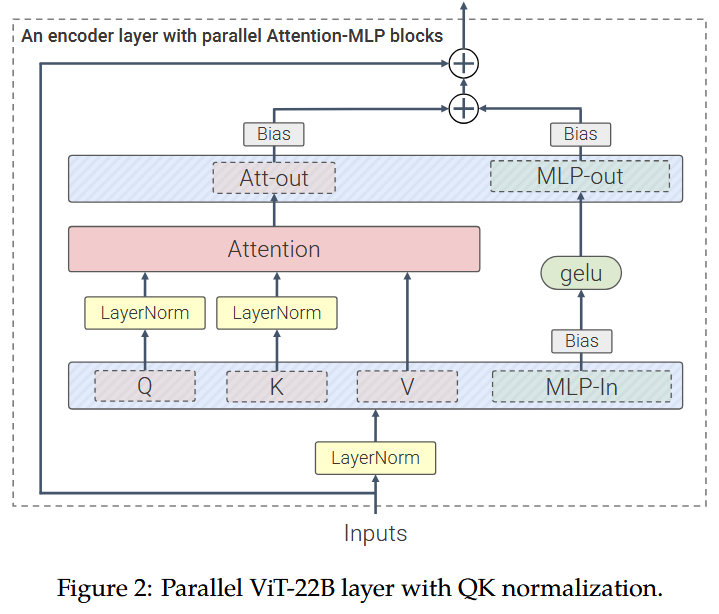

</div>

需要注意的是，与上图中的 ViT-22B 块相比，FLUX.2 采用了SwiGLU作为多层感知机的激活函数，而非使用GELU激活函数（同时也不使用偏置参数）。

FLUX.2 中单流模块的比例显著提高（双流块与单流块的数量比为 8:48，而 FLUX.1 为 19:38）。这意味着单流模块在 DiT 参数中所占比例更大：FLUX.1-12B 约有 54% 的参数位于双流块中，而 FLUX.2-32B 仅有约 24% 的参数在双流模块内（约 73% 的参数集中在单流模块中）。

这组调整的核心意图是：把参数和计算容量更多放到图文Token已经合流后的统一建模阶段。双流块负责建立模态内表征和早期图文对齐，数量更多的单流块则负责对象关系、空间组合、文字布局与参考图融合。共享调制、无偏置线性层和并行QKV/MLP投影，又抵消了32B Scaling带来的部分参数与执行开销。

<h2 id="q-flux-021">面试问题：FLUX.2 如何用四轴 RoPE 与注意力机制统一文生图和多参考图编辑？</h2>

**难度评分：⭐⭐⭐⭐⭐ (5/5)  |  考察频率：⭐⭐⭐⭐ (4/5)**

FLUX.2 在位置编码设计上也进行了调整。FLUX.1 采用 3D RoPE，其中前两维分别编码图像的宽（w）和高（h），第三维为时间维度 t，在生成时固定为 0；而在 FLUX.1 Kontext 版本中，该 t 值对于输入条件图像设为 1，以区分目标图像与条件图像。

FLUX.2 则升级为 4D RoPE 编码：第一维为 t，用于区分目标图像与条件图像——目标图像（对应噪声潜变量 token）的 t 设为 0，而条件图像的 t 则以 10 为间隔依次递增（如 10、20……）；第二维和第三维仍分别对应图像宽高（w 和 h）；第四维为 l，专门用于编码文本 token 的序列位置，对于图像潜变量则固定为 0。因此，新增的第四维主要作用是为文本 token 赋予位置信息，而此前 FLUX.1 中所有文本 token 的位置编码均固定为 0，并未区分其顺序。

官方实现可以把四轴位置ID写成 `(t, h, w, l)`：

- **目标图像Token**使用 `t=0`、实际二维空间坐标 `(h,w)`、`l=0`；
- **第n张参考图Token**使用相互错开的时间轴编号，例如 `t=10、20……`，同时保留各自的 `(h,w)`；
- **文本Token**固定图像相关坐标，只沿 `l` 轴递增，从而显式保留文本序列顺序。

这套设计解决的不是普通意义上的“时间建模”，而是**在一条统一Token序列中建立模态、图像身份与空间位置的坐标系**。不同参考图即使具有相同的二维坐标，也会因为t轴编号不同而保持来源可区分；文本Token则通过l轴获得顺序信息，避免所有文本位置都退化为同一个坐标。

在条件注入流程上，参考图先由VAE编码为Latent Token，再与目标图像Token进入图像流。双流块让文本流和图像流保留独立参数，但在Joint Attention中交换信息；单流块随后对合并后的文本、参考图和目标图Token进行统一建模。开源实现还让参考图Token仅在参考图Token集合内部做注意力，不读取文本和目标图像的Key/Value；文本Token和目标图Token则可以读取全部条件。这样可以避免固定参考条件在去噪过程中被目标图像状态反向改写。由此，文生图可以看作“参考图集合为空”的特例，单图编辑和多图编辑则只是增加一个或多个带独立t轴编号的条件图像，三类任务不再需要三套独立Backbone。

**面试中可以这样收束**：FLUX.2的四轴RoPE不是简单地多加一个位置维度，而是为“文本顺序 + 二维空间 + 多张图像身份”建立统一坐标系，再通过Joint Attention把生成与编辑统一成同一个条件流匹配问题。

<h2 id="q-flux-022">面试问题：FLUX.2 的 VAE 如何权衡可学习性、重建质量与压缩率？</h2>

**难度评分：⭐⭐⭐⭐⭐ (5/5)  |  考察频率：⭐⭐⭐⭐⭐ (5/5)**

在VAE部分，FLUX.2也进行了重要升级。**新版VAE在可学习性、重建质量与压缩率三者间实现了更优的平衡**。

这里的“可学习性”指生成模型（即DiT）在VAE的潜在特征空间（Latent特征空间）中学习生成新样本的难易程度。若潜在特征具备良好的语义化表征，生成任务将更易建模，因为模型仅需捕捉高层语义关系，而无需重构低层感知细节。然而，这种方法可能牺牲图像重建质量，并降低压缩效率。

“质量”在此特指VAE的重建能力，即Decoder解码器能否从压缩后的潜在表示中高保真地还原原始图像。过度压缩通常会引入感知失真与细节丢失。尽管引入感知损失与对抗训练可提升重建效果，但高压缩比往往导致保真度下降。此外，若VAE训练仅追求重建精度，而未对潜在空间施加语义约束，则可能产生含高频噪声或结构混乱的潜在表示，增加生成模型的学习难度。

“压缩率”对应潜在特征的维度，更高的压缩率有助于提升计算效率，但也可能削弱重建质量与生成模型对真实数据分布的拟合能力。

**这三项目标本质上相互制约**：提高压缩率通常会损害重建质量与可学习性；追求完美重建则需降低压缩程度；而为提升语义层面的可学习性，又可能不得不放弃部分底层感知细节。因此，理想的权衡策略是剔除人眼不可感知的信息，同时保留富含语义、利于生成模型高效学习的结构特征——这也正是FLUX.2 VAE的核心设计目标。

相较于FLUX.1 VAE，FLUX.2 VAE在保持重建质量的同时，显著提升了可学习性。具体改进包括：**在保持空间压缩率为8倍的前提下，进一步增加潜在特征的维度（SD-VAE为4维，FLUX.1 VAE为16维，FLUX.2 VAE提升至32维）。潜在维度的增加并未改变DiT处理的token数量，因此不会增加注意力序列长度和二次复杂度**。此外，在训练过程中引入了语义正则化机制，进一步优化了潜在空间的语义组织结构与可学习性。

不过，“token数量不变”不等于“完全没有额外计算”。FLUX.2仍会把每个 `2×2` 的VAE Latent块打包成一个DiT Token，因此32个VAE通道经过Pack后形成128维输入，而FLUX.1的16通道对应64维输入。增加的主要是输入/输出投影维度与局部表示容量，真正昂贵的Transformer序列长度保持不变。这是一种用较小线性开销换取更强Latent表达能力的设计。

BFL将这项工作概括为“Learnability-Quality-Compression Trilemma”：只追求像素重建会把大量生成模型难以学习的高频细节塞进Latent，只追求语义可学习性又可能牺牲纹理与文字还原，而过度压缩会同时伤害两者。FLUX.2选择重新训练整个Latent Space，并通过32通道表示与语义正则化，让DiT面对的是更平滑、更有语义组织、同时仍能被Decoder高保真还原的生成空间。

<h2 id="q-flux-023">面试问题：FLUX.2 在训练、蒸馏和工程部署上有哪些变化？</h2>

**难度评分：⭐⭐⭐⭐ (4/5)  |  考察频率：⭐⭐⭐⭐ (4/5)**

FLUX.2的公开资料并没有披露完整的训练数据配方、损失组合和系统性消融实验，因此这部分需要严格区分**已经公开的工程事实**与**不能从能力表现反推的训练细节**。目前可以确认的关键点主要有以下五项：

1. **统一任务建模**：FLUX.2把文生图、单参考图编辑和多参考图编辑收敛到同一套Rectified Flow Transformer中。任务差异主要由是否存在参考图Token及其位置ID表达，而不是切换不同模型。公开资料可以确认统一架构与能力，但没有公开足够细节来还原完整的多任务采样比例和训练课程。
2. **FLUX.2 [dev]采用Guidance Distillation**：模型卡明确标注[dev]经过引导蒸馏，但没有做少步数的Step Distillation。推理时模型接收Guidance Embedding，可以用一次条件前向传播近似传统CFG的引导效果，避免每一步都分别计算有条件和无条件分支。它仍通常使用几十步采样，与4步蒸馏模型不是一回事。
3. **Prompt Upsampling成为官方推荐的可选推理环节**：官方代码可以先让Mistral把短Prompt扩写为包含对象、关系、光照、镜头和构图约束的长描述，再编码为条件特征。它不是修改扩散方程，而是在进入DiT前提高条件信息密度，尤其适合FLUX.2的大型VLM Text Encoder。
4. **参考图KV Cache降低多图编辑的重复计算**：最新开源实现可以在首个去噪步骤提取参考图Token的Key/Value，并在后续步骤复用。参考图内容在一次采样过程中固定，因此缓存它们不会改变条件语义，却可以减少多参考图带来的重复注意力计算。
5. **模型家族和部署路径进一步分层**：32B的FLUX.2 [dev]面向最高质量的开放权重研究与开发；[pro]、[flex]、[max]提供不同质量、控制和在线服务能力；[klein]则通过4B/9B与4步蒸馏把统一生成编辑能力压到实时和消费级硬件。NVIDIA与ComfyUI提供的FP8版本把[dev]显存占用和推理耗时各降低约40%，而4-bit量化、远程Text Encoder和CPU Offload进一步降低了本地运行门槛。

因此，与FLUX.1相比，FLUX.2的跨周期价值不只是参数从12B扩到32B，而是把**更强的VLM条件、更可学习的Latent Space、统一生成编辑架构、多参考图坐标系以及分层蒸馏部署**组合成一套完整系统。它也说明图像基础模型的竞争重点正在从单次出图质量，转向条件理解、身份一致性、结构化控制、工作流可靠性和单位算力下的可部署能力。

### 参考资料

- [BFL：FLUX.2 Frontier Visual Intelligence](https://bfl.ai/blog/flux-2)
- [BFL：FLUX.2 VAE 专项技术报告](https://bfl.ai/research/representation-comparison)
- [BFL：FLUX.2 官方文档与模型规格](https://docs.bfl.ai/flux_2/flux2_overview)
- [BFL：FLUX.2 官方开源推理代码](https://github.com/black-forest-labs/flux2)
- [BFL：FLUX.2 dev 模型卡](https://huggingface.co/black-forest-labs/FLUX.2-dev)
- [ComfyUI：FLUX.2 Day-0 Support 与本地工作流](https://blog.comfy.org/p/flux2-state-of-the-art-visual-intelligence)
- [NVIDIA：FLUX.2 FP8 与 RTX 部署优化](https://blogs.nvidia.com/blog/rtx-ai-garage-flux.2-comfyui)


---
