# 目录

[1.介绍一下AIGC图像生成领域中LoRA的技术原理和主流应用场景](#q-001)
  - [面试问题：LoRA的核心数学原理是什么？为什么LoRA能够有效适配扩散模型？](#q-002)
  - [面试问题：LoRA通常注入扩散模型中U-Net、DiT和Text Encoder的哪些位置？](#q-003)
  - [面试问题：LoRA在AIGC图像生成领域有哪些主流应用场景？](#q-004)

[2.在AIGC图像生成领域中，LoRA模型有哪些特性与优势？](#q-005)
  - [面试问题：LoRA与全参数微调相比，训练和推理成本有什么差异？](#q-006)
  - [面试问题：如何评价一个人物、风格或概念LoRA的质量？](#q-007)
  - [面试问题：如何调节LoRA权重？多个LoRA同时加载时如何正确组合？](#q-008)
  - [面试问题：多LoRA推理中的Merge、Switch和Composite策略有什么区别？](#q-009)
  - [面试问题：LoRA的离线融合、差分提取和跨底模迁移有哪些边界？](#q-010)

[3.在AIGC图像生成领域中，LoRA模型的微调训练流程包含哪些核心环节？](#q-011)
  - [面试问题：介绍一下LoRA从任务定义到部署验证的完整训练流程](#q-012)
  - [面试问题：LoRA训练数据、Caption标签和长宽比分桶应该如何构造和设计？](#q-013)
  - [面试问题：Rank、Alpha、学习率、训练步数和目标模块应该如何设置？](#q-014)
  - [面试问题：如何判断LoRA欠拟合、过拟合、概念泄漏和底模绑定？](#q-015)
  - [面试问题：LoRA训练中有哪些显存与稳定性优化手段？](#q-016)

[4.在AIGC图像生成领域中，LoRA有哪些主流变体？介绍一下它们的核心原理](#q-017)
  - [面试问题：LoCon和LoHa在原生LoRA上分别做了哪些优化？](#q-018)
  - [面试问题：DoRA、LyCORIS和B-LoRA等方法解决了什么问题？](#q-019)
  - [面试问题：LCM-LoRA与人物/风格LoRA有什么本质区别？](#q-020)

[5.在AIGC图像生成领域中，如何构建差异化LoRA？它适合解决什么问题？](#q-021)
  - [面试问题：差异化LoRA的构建逻辑和数学本质是什么？](#q-022)
  - [面试问题：差异化LoRA有哪些适用边界和验证要求？](#q-023)

[6.介绍一下AIGC图像生成领域中MoE-LoRA的核心原理](#q-024)
  - [面试问题：MoE-LoRA如何通过路由和专家适配器提升条件容量？](#q-025)
  - [面试问题：MoE-LoRA的工程收益、训练风险与适用场景是什么？](#q-026)

[7.介绍一下PEFT技术在AIGC图像生成领域的应用](#q-027)
  - [面试问题：PEFT的核心技术路线有哪些？LoRA处于什么位置？](#q-028)
  - [面试问题：Textual Inversion的原理、优势与局限是什么？](#q-029)
  - [面试问题：DreamBooth和DreamBooth LoRA的原理是什么？](#q-030)
  - [面试问题：LoRA、DreamBooth与Textual Inversion应该如何选择？](#q-031)

---

<h1 id="q-001">1.介绍一下AIGC图像生成领域中LoRA的技术原理和主流应用场景</h1>

<h2 id="q-002">面试问题：LoRA的核心数学原理是什么？为什么LoRA能够有效适配扩散模型？</h2>

**难度评分：⭐⭐⭐⭐ (4/5)  |  考察频率：⭐⭐⭐⭐⭐ (5/5)**

LoRA（Low-Rank Adaptation，低秩适配）的核心判断是：**下游任务需要的不是重新学习整个生成世界，而是在预训练模型已经形成的表示空间中，找到一条成本更低的任务增量。** 它不是对特征矩阵做有损压缩，也不是Stable Diffusion专属的轻量化技巧，而是一种对“权重更新量”进行低秩参数化的PEFT方法。

设预训练层的权重为 $W_0\in\mathbb{R}^{d_{out}\times d_{in}}$。全参数微调直接优化 $W_0$；LoRA冻结 $W_0$，只学习增量 $\Delta W$：

$$
W'=W_0+s\Delta W=W_0+\frac{\alpha}{r}BA
$$

其中 $A\in\mathbb{R}^{r\times d_{in}}$、$B\in\mathbb{R}^{d_{out}\times r}$，$r\ll\min(d_{in},d_{out})$，$\alpha$ 是缩放系数，$s=\alpha/r$。原矩阵若包含 $d_{out}d_{in}$ 个可训练参数，LoRA只需要训练 $r(d_{in}+d_{out})$ 个参数。

例如，某线性层的权重形状为 $1024\times 1024$，全量更新需要 $1,048,576$ 个参数；当 $r=8$ 时，两块低秩矩阵只有：

$$
8\times1024+1024\times8=16,384
$$

可训练参数约缩小64倍。真实模型还包含大量不同形状的层，因此最终压缩比例取决于目标模块范围，而不能用单层比例直接代替整个模型比例。

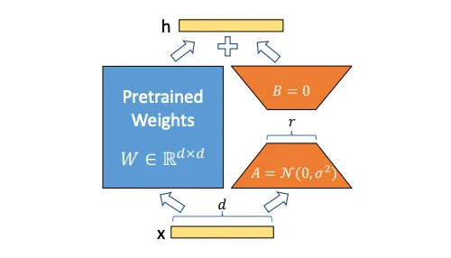

工程实现通常将一个低秩分支并联到原线性层。常见初始化方式是让降维矩阵随机初始化、升维矩阵初始化为0，使初始时 $BA=0$，所以模型在训练第0步与原底模等价。零初始化的升维矩阵仍然可以接收到非零梯度；它的作用是避免随机适配器在一开始污染底模输出，而不是让分支停止学习。

LoRA有效并不意味着任意任务的真实更新都必然严格低秩。更准确的解释是：预训练模型已经学习到大量通用视觉和语义能力，人物身份、画风、材质、产品概念或特定生成行为所需的局部变化，常常可以由一个低维子空间近似。Rank决定的是适配器的容量上限，而最终效果仍由数据分布、标注、目标模块、优化策略和底模先验共同决定。

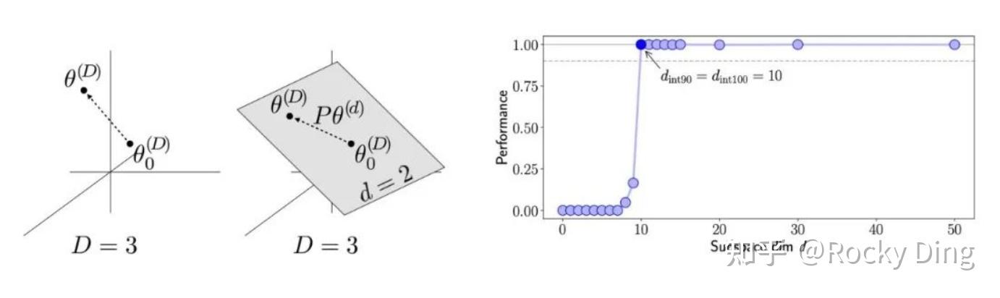

**面试中可以用一句话收束：LoRA不是把底模压小，而是冻结底模，把任务需要的权重增量约束在一个可训练、可插拔、可合并的低秩子空间中。**

<h2 id="q-003">面试问题：LoRA通常注入扩散模型中U-Net、DiT和Text Encoder的哪些位置？</h2>

**难度评分：⭐⭐⭐⭐ (4/5)  |  考察频率：⭐⭐⭐⭐⭐ (5/5)**

LoRA并不天然等于“只训练Cross-Attention”。它可以作用于任何适合低秩参数化的线性层或卷积层，真正的设计问题是：**哪些模块承载了任务所需的表示，哪些模块值得为此付出容量和泛化成本。**

在经典Stable Diffusion U-Net中，LoRA常注入Attention模块的 $W_q$、$W_k$、$W_v$ 和输出投影 $W_o$，也可以覆盖Cross-Attention、Self-Attention、前馈网络和部分卷积层。只训练Cross-Attention成本较低、语义绑定较强；扩大到Self-Attention和卷积层后，模型对局部纹理、空间结构与风格的表达能力通常更强，但文件更大，也更容易把训练集构图一并记住。

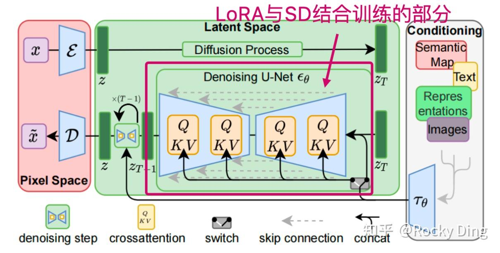

在FLUX、Stable Diffusion 3等DiT或多模态扩散Transformer架构中，目标从U-Net层变成Transformer中的Attention投影、MLP以及多模态联合块。此时不能照搬SD 1.x的层名和分层经验；底座的Token组织方式、文本图像融合位置和归一化结构变化后，同样的Rank和目标模块会产生不同效果。

Text Encoder LoRA则修改CLIP、T5等文本编码器中的Attention或前馈层。它更擅长强化触发词与新概念之间的语义绑定，但也更容易让概念依赖特定词形，或者破坏原有文本空间。小数据训练中通常应让Text Encoder使用更低学习率、训练更少步数，甚至完全冻结，再通过验证集判断是否有必要开放。

目标模块选择可以按任务拆成三类：

| 任务目标 | 优先关注模块 | 主要收益 | 主要风险 |
|---|---|---|---|
| 触发词、人物身份、对象概念 | Cross-Attention、部分Text Encoder | 语义绑定直接 | 触发词依赖、概念泄漏 |
| 风格、材质、局部纹理 | Self-Attention、MLP、卷积层 | 表达容量更强 | 构图记忆、底模绑定 |
| DiT/多模态生成行为 | 联合Attention、MLP、调制层 | 适配新架构 | 参数和实现差异更大 |

这张表说明，模块覆盖不是越多越好。**LoRA训练真正要优化的不是可训练参数数量，而是任务信息应该被写入哪一层表示。**

<h2 id="q-004">面试问题：LoRA在AIGC图像生成领域有哪些主流应用场景？</h2>

**难度评分：⭐⭐⭐ (3/5)  |  考察频率：⭐⭐⭐⭐⭐ (5/5)**

LoRA最常见的应用是人物、角色、产品、风格、服装、材质、动作概念和品牌视觉适配，但这些名字只是表面分类。更本质地看，它承接的是四类增量：

1. **主体增量**：让底模稳定识别某个真人、虚拟角色、宠物、IP形象或产品外观，同时保留换姿态、换背景、换服装的能力。
2. **风格增量**：学习色彩、笔触、光影、材质和构图倾向。优秀风格LoRA应该改变视觉语言，而不是把训练集中的固定人物和场景一起复制出来。
3. **领域增量**：把电商、建筑、游戏美术、服装设计、工业设计等领域分布注入通用底模，使模型更接近生产数据和行业审美。
4. **行为增量**：把少步生成、质量增强、特定编辑行为或控制能力封装成适配器。LCM-LoRA属于这一类，它学习的不是一个角色或画风，而是生成过程的行为变化。

LoRA还改变了模型交付方式。全量微调通常为每个客户保存一份完整底模，LoRA则允许一个基础模型搭配多个小型适配器，形成“共享底座 + 任务增量”的资产体系。它降低了训练、存储、分发和版本切换成本，但也引入了新的治理问题：底模版本、VAE、文本编码器、触发词、权重、许可证和评测样例都必须随LoRA一起管理。

跨周期看，LoRA的价值不只属于Stable Diffusion。只要基础模型足够大、下游任务足够多、全量复制成本足够高，“共享底座 + 参数高效增量”就会持续存在。具体适配器名称会变化，但增量参数化、模型资产组合和任务级版本管理会沉淀为生成式AI基础设施。

<h1 id="q-005">2.在AIGC图像生成领域中，LoRA模型有哪些特性与优势？</h1>

<h2 id="q-006">面试问题：LoRA与全参数微调相比，训练和推理成本有什么差异？</h2>

**难度评分：⭐⭐⭐⭐ (4/5)  |  考察频率：⭐⭐⭐⭐⭐ (5/5)**

LoRA最确定的收益是减少可训练参数、梯度、优化器状态和任务权重存储，而不是让训练中的所有计算都按同一比例下降。冻结底模以后，底模仍要参与前向传播；为了把误差信号传到中间的LoRA分支，训练仍需经过相应计算图。因此，参数量下降几十倍，并不等于FLOPs或训练时长也下降几十倍。

下面从训练、交付和推理三个阶段比较：

| 维度 | LoRA微调 | 全参数微调 |
|---|---|---|
| 可训练参数 | 只训练低秩分支 | 更新全部开放参数 |
| 梯度与优化器状态 | 显著减少 | 成本最高 |
| 激活显存 | 仍取决于底模、分辨率和目标层 | 通常更高，但不会与参数量简单等比 |
| 单任务权重存储 | 小型适配器 | 完整模型副本 |
| 多任务切换 | 可动态加载适配器 | 通常切换整套模型 |
| 小数据风险 | 较易保留底模能力 | 更易过拟合和灾难性遗忘 |
| 表达上限 | 受Rank和目标模块约束 | 容量更高 |

推理阶段要区分“动态加载”和“权重融合”：

- **动态加载**：前向计算同时执行原层与LoRA分支，保留随时切换和调权能力，但会增加少量计算、显存管理与框架开销。
- **权重融合**：预先计算 $W'=W_0+sBA$ 并写回底模，层结构与原模型一致，理论上不增加该层推理计算；代价是切换、撤销、精度管理和多LoRA版本控制更复杂。

因此，“LoRA推理成本完全不变”只在已经正确融合、且不保留额外分支计算时成立。生产环境还要考虑适配器加载I/O、显存碎片、并发租户隔离和融合误差。

全参数微调仍有合理场景：任务分布与底模差异很大、需要改写大量生成行为、训练数据充足、适配器容量成为瓶颈，或者必须获得一个无需外部底模依赖的独立模型。**不是全参数微调过时了，而是大多数个性化任务没有必要一开始就支付它的全部成本。**

<h2 id="q-007">面试问题：如何评价一个人物、风格或概念LoRA的质量？</h2>

**难度评分：⭐⭐⭐ (3/5)  |  考察频率：⭐⭐⭐⭐⭐ (5/5)**

只看“像不像训练图”会把过拟合误判成高质量。一个可用LoRA至少要同时评价还原度、可控性、泛化性和兼容性，并把这些指标放在同一组验证矩阵里。

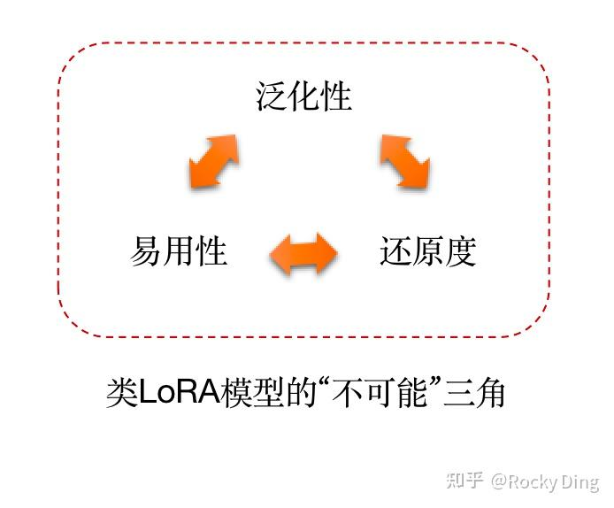

1. **还原度**：人物身份、产品结构、画风语言或概念特征是否准确。主体LoRA可结合人脸识别相似度、人工身份评价和关键细节检查；风格LoRA更依赖盲测与风格一致性评价。
2. **可控性**：触发词是否清晰，权重变化是否平滑，能否响应姿态、镜头、服装、背景和光照等提示。只会复现训练构图，不是可控，而是记忆。
3. **泛化性**：在未见过的Prompt、种子、长宽比和组合条件下是否仍然成立。验证集必须覆盖训练集没有出现过的组合。
4. **兼容性**：更换同架构底模、采样器、CFG、VAE或叠加其他LoRA时是否稳定。兼容性不是必然要求，但必须明确支持范围。
5. **副作用**：是否出现背景泄漏、服装绑定、固定表情、色调污染、文字理解下降、手部与人脸质量退化等问题。

一个实用验证矩阵应固定Prompt、随机种子、分辨率和采样设置，分别测试：不开LoRA、目标权重、多档权重、同架构其他底模、多个未见场景、多LoRA组合。这样才能把底模能力、随机性和LoRA贡献分离开。

**面试中可以用一句话收束：LoRA质量不是单点相似度，而是“特征保真、提示可控、场景泛化、组合兼容、副作用可接受”五个维度的共同结果。**

<h2 id="q-008">面试问题：如何调节LoRA权重？多个LoRA同时加载时如何正确组合？</h2>

**难度评分：⭐⭐⭐⭐ (4/5)  |  考察频率：⭐⭐⭐⭐⭐ (5/5)**

单个LoRA的推理强度可以写成：

$$
W'=W_0+\lambda\frac{\alpha}{r}BA
$$

其中训练缩放 $\alpha/r$ 决定适配器的参数化尺度，推理权重 $\lambda$ 是部署时的外部控制量。不同框架可能把两者合并显示为一个“LoRA权重”，但概念上应区分。

当 $\lambda=0$ 时LoRA不生效；增加 $\lambda$ 通常会增强目标特征，但并不保证线性改善。权重过大可能造成饱和、颜色污染、结构变形或提示词失控，所以不应把“大于1”当作补救欠拟合的通用方法。

多个LoRA同时作用于同一层时，正确的线性组合是各自增量之和：

$$
W'=W_0+\sum_{i=1}^{N}\lambda_i\frac{\alpha_i}{r_i}B_iA_i
$$

不能写成 $(\sum_i\lambda_iA_i)(\sum_i\lambda_iB_i)$，因为后者会额外产生 $A_iB_j$ 一类未经训练的交叉项，而且矩阵次序还可能不满足形状要求。

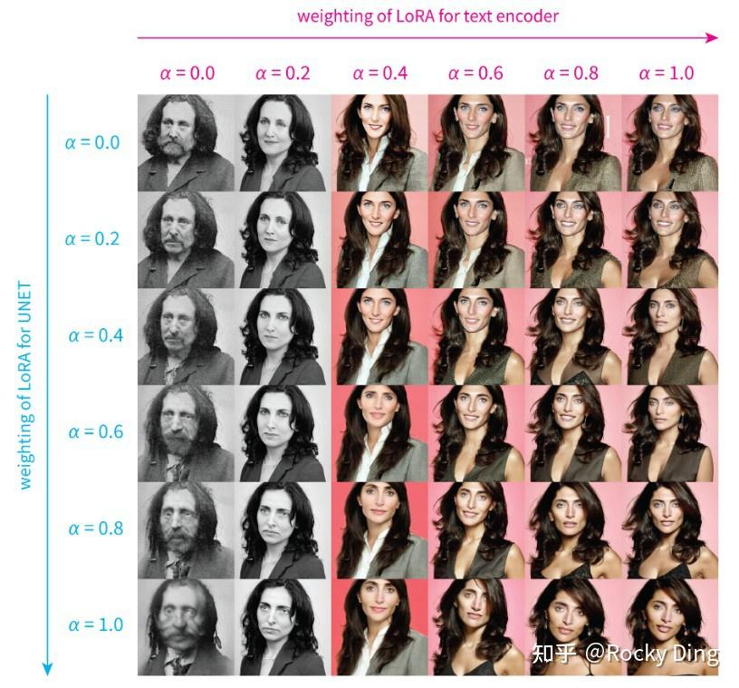

多LoRA冲突通常来自三个层面：它们修改相同权重方向；触发词在文本空间相互污染；人物、服装、风格在训练数据中存在共现绑定。调低权重只能缓解表面冲突，真正的解决方案还包括分层加载、分时间步调度、区域掩码、正交化、路由选择和重新设计训练数据。

<h2 id="q-009">面试问题：多LoRA推理中的Merge、Switch和Composite策略有什么区别？</h2>

**难度评分：⭐⭐⭐⭐ (4/5)  |  考察频率：⭐⭐⭐⭐ (4/5)**

多LoRA组合的本质不是“把插件都打开”，而是在共享去噪轨迹中分配不同适配器的控制权。Merge、Switch和Composite分别在参数空间、时间步和预测空间做组合。

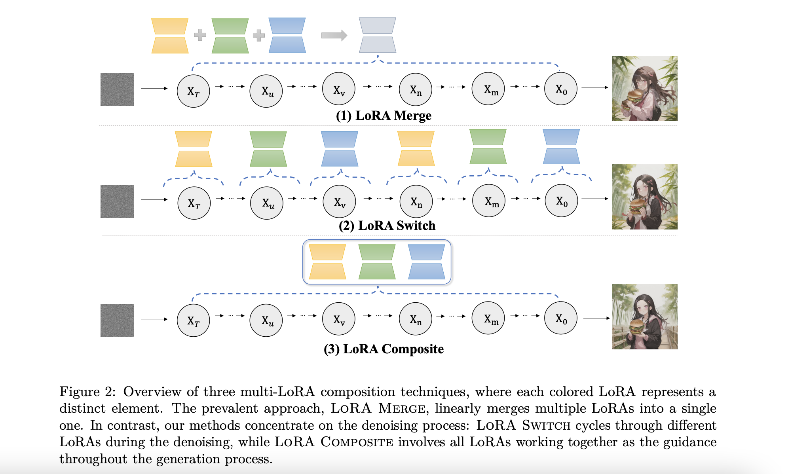

| 策略 | 组合位置 | 每步主干前向次数 | 优势 | 局限 |
|---|---|---:|---|---|
| Merge | 参数增量相加 | 1 | 简单、快速、易融合 | 同层更新方向可能冲突 |
| Switch | 不同时间步切换适配器 | 1 | 避免同一步直接叠加 | 对切换时机敏感，特征可能不连续 |
| Composite | 各适配器独立预测后聚合 | 约为LoRA数量 | 隔离参数冲突，组合更灵活 | 计算开销高，聚合规则未必最优 |

Merge在每个去噪步骤都使用 $`\sum_i\lambda_i\Delta W_i`$，是工程默认方案。Switch则让适配器按时间步轮换或分段生效，例如早期步骤控制构图和主体，后期步骤控制纹理与风格。简单的固定周期轮换未必符合扩散过程语义，更合理的做法通常是基于噪声区间和任务作用阶段设计调度。

Composite让每个LoRA在相同latent和时间步上独立预测噪声或速度，再进行加权聚合：

$$
\hat{\epsilon}=\sum_{i=1}^{N}\omega_i\hat{\epsilon}_i,\qquad \sum_{i=1}^{N}\omega_i=1
$$

它避免在权重空间直接相加，但不能保证“没有冲突”。不同预测方向仍可能相互抵消，简单平均也可能削弱强特征。该策略高度依赖具体实现，不应把某个仓库的回调代码当作行业统一标准。

选择策略时应先问业务约束：若追求吞吐和简单部署，优先Merge；若适配器在不同去噪阶段作用不同，可尝试Switch或连续调度；若质量优先且可以接受近似 $N$ 倍主干计算，再考虑Composite或更复杂的预测融合。

<h2 id="q-010">面试问题：LoRA的离线融合、差分提取和跨底模迁移有哪些边界？</h2>

**难度评分：⭐⭐⭐⭐ (4/5)  |  考察频率：⭐⭐⭐⭐ (4/5)**

LoRA可以离线融合进底模，也可以对多个LoRA做加权运算；两个同架构模型的权重差还可以通过低秩近似压缩成适配器。但这些操作成立的前提是参数具有可比较的坐标系。

同一底模、同一架构、同一参数命名和相近训练链路下，LoRA A与LoRA B可以做加权和或差分：

$$
\Delta W_{new}=\beta\Delta W_A+(1-\beta)\Delta W_B
$$

如果要把一个完整权重差 $W_1-W_0$ 提取成Rank为 $r$ 的LoRA，可以对差分矩阵做截断SVD：

$$
W_1-W_0\approx U_r\Sigma_rV_r^\top=B A
$$

这里存在三条关键边界：

1. **架构边界**：SD 1.x、SDXL、SD3和FLUX的网络结构及参数形状不同，不能直接互融。
2. **坐标边界**：即使架构相同，两个模型如果来自复杂融合、参数置换或不同训练轨迹，直接差分也未必对应可解释能力。
3. **低秩误差边界**：完整权重差可能不是低秩，截断后会丢失信息；Rank越小，提取文件越小，但重建误差通常越大。

所谓“跨底模兼容”也不是二元属性。LoRA往往在训练底模及其近邻微调模型上效果最好，距离越远越容易出现身份漂移、风格变形或触发词失效。生产交付必须记录底模哈希、模型家族、文本编码器、VAE、推荐权重和验证样例，而不能只交付一个孤立的权重文件。

<h1 id="q-011">3.在AIGC图像生成领域中，LoRA模型的微调训练流程包含哪些核心环节？</h1>

<h2 id="q-012">面试问题：介绍一下LoRA从任务定义到部署验证的完整训练流程</h2>

**难度评分：⭐⭐⭐⭐ (4/5)  |  考察频率：⭐⭐⭐⭐⭐ (5/5)**

LoRA训练不是“准备几张图，跑一个脚本”。一个完整闭环至少包含任务定义、底模选择、数据治理、参数设计、训练监控、离线评测和部署验证七个环节。

1. **定义任务和成功标准**：先判断要学习的是人物身份、风格、产品结构、领域分布还是生成行为，并明确哪些属性必须保留、哪些属性必须可编辑。
2. **选择底模和适配范围**：底模应具备任务所需的基础能力，模型许可证也要满足交付要求。目标模块由任务决定，不能机械照搬其他架构配置。
3. **构建训练集和验证集**：训练集覆盖目标变化，验证集覆盖未见Prompt、构图、背景、分辨率和底模。没有独立验证集，就无法区分学习与记忆。
4. **设计Caption与触发词**：Caption负责解释图中哪些信息应该由自然语言承担，触发词负责绑定新增概念。标注过少会把背景写入概念，标注过细则可能稀释目标特征。
5. **确定Rank、Alpha、学习率和训练预算**：以小容量基线启动，定期保存Checkpoint和固定种子样例，依据验证结果调整，而不是只看训练Loss。
6. **执行多维评测**：同时检查还原度、可控性、泛化性、兼容性和副作用，并与不开LoRA及全参数微调基线比较。
7. **部署与资产治理**：记录底模、触发词、推荐权重、采样设置、许可证、数据版本和已知限制，验证动态加载与融合后的数值一致性。

这个流程的核心是建立反馈闭环：生成失败样例要回流到数据筛选、Caption、正则化和验证集，而不是只靠增加Epoch解决。**数据决定LoRA学什么，目标模块决定知识写到哪里，优化器决定如何写入，评测决定这次写入是否可用。**

<h2 id="q-013">面试问题：LoRA训练数据、Caption标签和长宽比分桶应该如何构造和设计？</h2>

**难度评分：⭐⭐⭐⭐ (4/5)  |  考察频率：⭐⭐⭐⭐⭐ (5/5)**

小数据并不意味着数据工程不重要，恰恰相反：样本越少，每一张错误图片和每一个错误标签的影响越大。LoRA数据设计应围绕“目标特征保持一致，非目标因素尽量解耦”展开。

人物LoRA需要身份稳定，但姿态、镜头、表情、服装、背景和光照应有适度变化；产品LoRA要覆盖关键结构和视角；风格LoRA应覆盖不同内容主体，避免模型把某个角色误当成风格组成部分。模糊、重度压缩、错误裁剪、水印和重复近邻样本会降低有效信息密度。

Caption不是越长越好。它要把希望推理时可控的属性显式写出来，把希望绑定到触发词的核心属性留下来。例如训练特定人物时，如果所有样本都穿黑衣但Caption从不描述黑衣，模型更容易把服装吸收到身份中；若每个微小细节都写入Caption，有限训练信号又会被过度拆散。

长宽比分桶（Aspect Ratio Bucketing）的作用是减少为了统一方形分辨率而进行的大幅裁剪，让不同宽高比样本在接近原始构图的分辨率中训练。

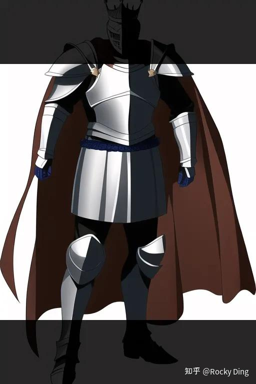

对于图像 $I$ 的宽高比 $a_I$ 和候选Bucket的宽高比 $a_k$，可以选择最接近的Bucket：

$$
k^*=\arg\min_k\left|a_k-a_I\right|
$$

随后只进行有限缩放和裁剪，并在同一Batch内使用相同空间尺寸。工程上还要让宽高满足VAE和网络下采样倍数要求，并控制每个Bucket的像素面积，避免极端长图把显存拉爆。

分桶解决的是构图保留与批处理效率，不会自动修复坏数据。跨周期看，数据工程始终比某个训练UI更重要：工具会迭代，但“明确目标分布、消除伪相关、建立验证集、让失败样例回流”不会过时。

<h2 id="q-014">面试问题：Rank、Alpha、学习率、训练步数和目标模块应该如何设置？</h2>

**难度评分：⭐⭐⭐⭐ (4/5)  |  考察频率：⭐⭐⭐⭐⭐ (5/5)**

不存在适用于所有底模和任务的固定参数表。Rank、Alpha、学习率、训练步数和目标模块共同决定“适配器容量、更新尺度、写入速度和写入位置”，必须联合调节。

| 参数 | 本质作用 | 过小的常见表现 | 过大的常见表现 |
|---|---|---|---|
| Rank $r$ | 增量子空间容量 | 欠拟合、细节不足 | 文件变大、过拟合风险上升 |
| Alpha $\alpha$ | 训练增量缩放 | 更新弱或收敛慢 | 更新过强、对学习率更敏感 |
| 学习率 | 单步更新幅度 | 学习慢、预算内不收敛 | 震荡、失真、遗忘底模能力 |
| 训练步数 | 数据被优化的总次数 | 概念不稳定 | 构图记忆、背景泄漏 |
| 目标模块 | 知识写入位置 | 表达能力不足 | 副作用和存储成本增加 |

可训练参数量随Rank近似线性增长。Alpha通常通过 $\alpha/r$ 参与缩放，但不同训练框架对Alpha、网络倍率和保存格式的解释可能不同，因此迁移配置前必须检查实现，不能把“Alpha固定为Rank一半”当成数学定律。

学习率应与底模架构、目标模块、优化器、Batch Size和数据量共同确定。Text Encoder通常比图像去噪主干更敏感，若开放训练，一般使用更低学习率或更短训练阶段。Rank增大后也不一定要同步增大学习率；更高容量本身已经提高拟合能力。

训练步数可以由重复次数、Epoch和Batch Size推导：

$$
\text{steps per epoch}=\left\lceil\frac{N\times R}{B\times G}\right\rceil
$$

其中 $N$ 是图片数，$R$ 是重复次数，$B$ 是单设备Batch Size，$G$ 是梯度累积步数；多卡训练还要计入设备数。与其背“每张图训练100步”，不如固定总更新步数并根据验证样例选择早停点。

一个稳妥的调参顺序是：先固定优质数据和底模，用小到中等Rank建立基线；再调学习率与训练预算；最后才扩大目标模块或Rank。如果第一轮就同时改变所有参数，最终即使效果变好，也无法知道收益来自哪里。

<h2 id="q-015">面试问题：如何判断LoRA欠拟合、过拟合、概念泄漏和底模绑定？</h2>

**难度评分：⭐⭐⭐⭐ (4/5)  |  考察频率：⭐⭐⭐⭐⭐ (5/5)**

训练Loss只能说明当前噪声预测目标在训练样本上是否下降，不能直接说明LoRA是否可用。生成任务必须通过固定验证面板观察错误类型。

- **欠拟合**：目标特征弱、不同种子不稳定、需要极高权重才能出现。可能原因包括容量不足、学习率过低、步数不足、Caption稀释或底模本身缺少相关先验。
- **过拟合**：训练样本还原很好，但换Prompt就复现固定构图、背景、服装或表情；权重稍高便出现锐化、色块和结构崩坏。
- **概念泄漏**：触发人物时总带出训练背景或服装，触发风格时总出现训练主体。它通常来自数据共现和Caption缺失，而不只是训练步数过多。
- **底模绑定**：在训练底模上表现好，换同架构其他底模便身份或风格崩溃。原因可能是LoRA利用了训练底模独有的特征方向。
- **触发词污染**：普通语义词被新概念占用，导致未加载或低权重下的文本理解异常。应选择不易与自然词义冲突的Token组合并做无触发词对照。

验证时至少固定四类Prompt：训练分布内、训练分布外、属性解耦、多概念组合。每类使用多个种子，并在多个权重档位上比较。人物任务还要将“身份相似度”和“图像美感”分开评估，因为更漂亮不等于更像，像也不等于可编辑。

面对问题时也要按因果顺序修复：先检查数据和标注，再检查底模与目标模块，最后调整Rank、学习率和步数。只靠降低LoRA权重掩盖过拟合，会把训练缺陷转移到每一次推理配置中。

<h2 id="q-016">面试问题：LoRA训练中有哪些显存与稳定性优化手段？</h2>

**难度评分：⭐⭐⭐⭐ (4/5)  |  考察频率：⭐⭐⭐⭐ (4/5)**

LoRA节省了可训练参数相关显存，但高分辨率latent、Attention激活、多个Text Encoder和优化器状态仍可能成为瓶颈。常见优化方式如下：

1. **混合精度**：BF16在支持的硬件上通常比FP16有更大的指数范围；FP16需要关注溢出和损失缩放。FP8依赖硬件与框架实现，不能笼统承诺固定显存比例或“几乎无损”。
2. **梯度检查点**：不保存部分前向激活，在反向时重新计算，以额外计算时间换显存。它不是“逐步更新权重”。
3. **高效Attention**：Flash Attention、PyTorch SDPA、xFormers等实现可减少Attention中间张量，但可用方案取决于模型、硬件和数值精度。
4. **梯度累积**：用多个Micro-Batch近似更大有效Batch。它减少单步峰值显存，但不会增加每次前向看到的样本数，BatchNorm等结构下也不完全等价。
5. **低比特优化器**：8-bit AdamW等可降低优化器状态显存，但需要验证数值稳定性和平台支持。
6. **缓存VAE或文本特征**：在数据增强与文本编码器冻结条件满足时，可预计算latent或文本嵌入；若训练过程需要随机裁剪、动态Caption或训练Text Encoder，则缓存策略会受限。

学习率Warmup、梯度裁剪、EMA式监控、定期Checkpoint和固定验证面板用于提升训练稳定性。调度器不是越复杂越好；小数据LoRA中，常数加Warmup、余弦衰减都可以成立，关键是让总训练预算、初始学习率和验证曲线匹配。

**工程上的核心判断是：显存优化不能以破坏数据随机性、训练目标或可复现性为代价。先确认瓶颈来自参数、激活、Attention还是数据管道，再选择手段。**

<h1 id="q-017">4.在AIGC图像生成领域中，LoRA有哪些主流变体？介绍一下它们的核心原理</h1>

<h2 id="q-018">面试问题：LoCon和LoHa在原生LoRA上分别做了哪些优化？</h2>

**难度评分：⭐⭐⭐⭐ (4/5)  |  考察频率：⭐⭐⭐⭐ (4/5)**

LoCon和LoHa都常见于LyCORIS生态，但它们解决的是不同问题：LoCon扩大低秩适配的模块类型，LoHa提高相同低Rank下更新矩阵的表达能力。

LoCon（LoRA for Convolution）把低秩适配从线性层扩展到卷积层。对于卷积核 $W\in\mathbb{R}^{C_{out}\times C_{in}\times k\times k}$，可以用一个 $k\times k$ 的降维卷积和一个 $1\times1$ 的升维卷积构造增量：

$$
\Delta W\approx W_{up}*W_{down}
$$

其可训练参数量近似为：

$$
rC_{in}k^2+C_{out}r
$$

相比直接训练 $C_{out}C_{in}k^2$ 个卷积参数，LoCon仍然保持参数效率，同时能更直接地适配局部纹理与空间特征。

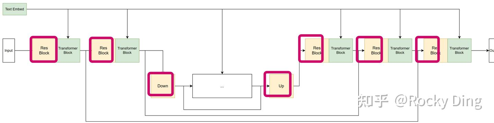

LoHa（LoRA with Hadamard Product）将两个低秩矩阵更新做Hadamard逐元素乘积：

$$
\Delta W=(B_1A_1)\odot(B_2A_2)
$$

若两个乘积的秩都不超过 $r$，根据Hadamard积的秩不等式，有：

$$
\mathrm{rank}(\Delta W)\leq
\mathrm{rank}(B_1A_1)\mathrm{rank}(B_2A_2)\leq r^2
$$

这意味着LoHa可能以较小Rank表达比单个 $BA$ 更复杂的更新，但它并不保证实际有效秩一定达到 $r^2$，也不意味着在所有任务上都优于LoRA。

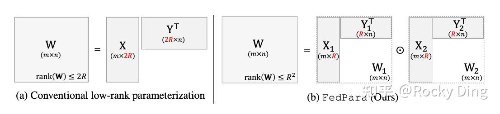

选择时可以这样判断：若任务需要适配卷积层中的局部视觉特征，LoCon更直接；若原生LoRA在较低Rank下容量不足，可尝试LoHa。两者都应通过相同数据、训练预算和验证矩阵做消融，而不是根据社区经验参数直接下结论。

<h2 id="q-019">面试问题：DoRA、LyCORIS和B-LoRA等方法解决了什么问题？</h2>

**难度评分：⭐⭐⭐⭐ (4/5)  |  考察频率：⭐⭐⭐ (3/5)**

类LoRA方法的演进可以按三个方向理解：改进权重参数化、扩大可适配模块、强化内容与风格解耦。

DoRA（Weight-Decomposed Low-Rank Adaptation）把预训练权重分解为幅值与方向，并主要用LoRA更新方向、单独学习幅值。其出发点是让参数高效更新更接近全参数微调的权重变化方式。它可能改善部分任务的学习能力，但会引入额外参数和实现复杂度，实际收益仍依赖模型与任务。

LyCORIS不是单一算法，而是一组参数高效适配方法和实现生态，包含LoCon、LoHa、LoKr等。LoKr使用Kronecker积等结构化分解压缩更新。理解LyCORIS时应区分“算法名称”和“训练框架集合”，避免把所有变体都描述成同一种数学形式。

B-LoRA关注单张参考图中的内容与风格解耦。其思路不是单纯增大Rank，而是基于预训练扩散模型不同网络块承载信息的差异，把内容和风格写入选定的不同适配位置，从而支持风格迁移、内容保留和两类增量的组合。这里的“块具有不同语义职责”来自特定底模与实验观察，换到不同架构时需要重新验证，不能把SDXL上的层级结论永久化。

| 方法/生态 | 主要改动 | 更适合回答的问题 |
|---|---|---|
| DoRA | 解耦权重幅值与方向 | 如何提高低秩更新的表达质量 |
| LoCon | 把适配扩展到卷积层 | 如何学习局部纹理和空间特征 |
| LoHa/LoKr | 改变结构化分解形式 | 如何在参数预算内提高容量 |
| B-LoRA | 选择不同模块承载内容与风格 | 如何增强内容/风格解耦与组合 |

变体不是越新越好。生产选择要比较同等数据和预算下的质量、文件大小、训练稳定性、推理框架支持、融合能力和许可证。**工具名称会快速变化，真正跨周期的是对“容量、注入位置、组合方式、部署成本”四个变量的判断。**

<h2 id="q-020">面试问题：LCM-LoRA与人物/风格LoRA有什么本质区别？</h2>

**难度评分：⭐⭐⭐⭐ (4/5)  |  考察频率：⭐⭐⭐⭐ (4/5)**

人物或风格LoRA主要学习内容分布增量，LCM-LoRA学习的是少步生成行为。Latent Consistency Model通过一致性蒸馏，让模型能够从不同时间点的噪声状态映射到同一条解轨迹附近，从而减少采样步数。LCM-LoRA进一步把这种蒸馏得到的行为增量压缩到LoRA参数中，便于在兼容底模之间复用。

它的训练目标不是“记住一个人物”，而是让去噪网络适应新的少步求解方式。因此部署LCM-LoRA时通常还要匹配对应的采样调度、较低步数和合适的Guidance设置。只加载权重却沿用原来的几十步采样配置，未必得到预期效果。

LCM-LoRA的收益是延迟下降和适配器式交付，代价则可能包括细节、构图稳定性、负向提示控制或高Guidance下质量变化。它也不是对任何底模都无条件通用：模型家族、预测目标、训练分布和实现接口必须兼容。

这类方法提示了LoRA更广的跨周期价值：**适配器不仅能封装“模型知道什么”，还能封装“模型如何推理”。** 在生成系统中，内容能力、控制能力、加速能力和安全能力都可能以不同适配器形态交付。

<h1 id="q-021">5.在AIGC图像生成领域中，如何构建差异化LoRA？它适合解决什么问题？</h1>

<h2 id="q-022">面试问题：差异化LoRA的构建逻辑和数学本质是什么？</h2>

**难度评分：⭐⭐⭐⭐ (4/5)  |  考察频率：⭐⭐⭐ (3/5)**

差异化LoRA，也常被称为差分或残差LoRA，核心目标是提取两个模型状态或两类视觉分布之间的方向。例如希望学习“普通质感 -> 更精修质感”的增量，可以分别得到与状态A、状态B对应的适配器，再构造：

$$
\Delta W_{diff}=\Delta W_B-\Delta W_A
$$

推理时将 $`\lambda\Delta W_{\mathrm{diff}}`$ 加到底模上，相当于沿参数空间中估计的A到B方向移动。它不是一种独立网络架构，而是一种适配器代数和训练思想，可以与原生LoRA、LoCon等参数化方式结合。

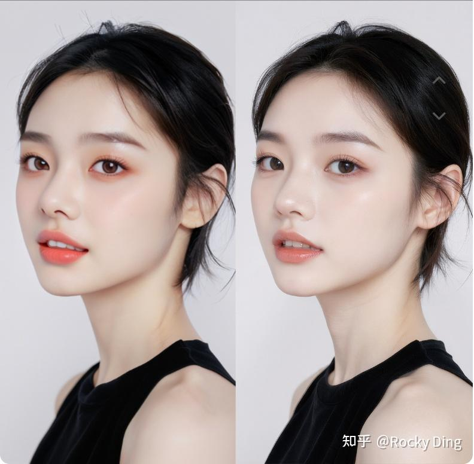

一种直观构建流程是：使用同一底模、同一目标模块、同一Rank和相同训练配置，分别在A组与B组数据上训练适配器；随后将两个适配器对齐并相减。若直接对两个完整模型做差，也可以再用截断SVD压缩为LoRA形式。

更高质量的方案不应只依赖一对图片过拟合。理想数据是内容、构图和语义尽量配对，只让目标属性发生变化；使用多对样本可以平均掉人物、背景与随机噪声造成的伪差异。若A与B同时改变了光照、构图、主体和分辨率，差分方向就无法被解释为单一“质感增强”。

这种方法适合探索美肤、锐度、材质、光照、色调和特定视觉属性的可控方向，但“几乎不影响构图”“不需要提示词”只能作为待验证的目标，不能当作普遍事实。

<h2 id="q-023">面试问题：差异化LoRA有哪些适用边界和验证要求？</h2>

**难度评分：⭐⭐⭐⭐ (4/5)  |  考察频率：⭐⭐⭐ (3/5)**

差分运算看起来简单，真正困难的是保证两边参数可比较、数据差异可归因。

1. **同源底模**：两个适配器应基于相同底模训练。不同底模之间直接相减，得到的往往是模型整体差异，而不是目标属性。
2. **相同参数化**：目标模块、Rank、Alpha、权重命名和矩阵方向要一致。Rank不同或结构不同，需要先重建完整增量矩阵，再重新分解。
3. **配对数据**：A/B样本的非目标变量应尽量一致，否则差分会混入身份、构图、背景和压缩伪影。
4. **双向验证**：正权重应推动A趋向B，负权重应在一定范围内产生反向变化；若只有某几个训练样例成立，说明方向可能不稳定。
5. **副作用评估**：固定Prompt和种子检查构图漂移、语义变化、人脸身份、颜色偏移及高权重失真。

差异化LoRA更像一个局部方向估计器，而不是万能的图像质量插件。参数空间是非线性的，两个独立训练得到的适配器即使终点效果相似，中间坐标也未必完全对齐。离底模越远、权重越大，线性差分近似越容易失效。

**面试中可以用一句话收束：差异化LoRA的价值在于把视觉属性变化转成可复用的参数方向，但它是否可解释，取决于同源模型、配对数据和严格消融，而不是一次权重相减。**

<h1 id="q-024">6.介绍一下AIGC图像生成领域中MoE-LoRA的核心原理</h1>

<h2 id="q-025">面试问题：MoE-LoRA如何通过路由和专家适配器提升条件容量？</h2>

**难度评分：⭐⭐⭐⭐⭐ (5/5)  |  考察频率：⭐⭐⭐ (3/5)**

MoE-LoRA把单个适配器扩展为多个LoRA专家，并通过Router根据输入特征、Token、时间步、层级或条件选择专家。它希望解决的问题是：一个固定低秩子空间可能难以同时承载多风格、多主体、多任务或复杂条件，而把Rank一味增大又会损失模块化与稀疏计算优势。

设第 $i$ 个专家的增量为 $`\Delta W_i=B_iA_i`$，Router输出门控权重 $g_i(x)$，则某层的条件化更新可以写成：

$$
h'=W_0h+\sum_{i\in\mathrm{TopK}(g(x))}g_i(x)\Delta W_i h
$$

当只激活Top-$k$个专家时，总参数容量可以增大，而每个Token或样本实际使用的适配器数量保持较小。

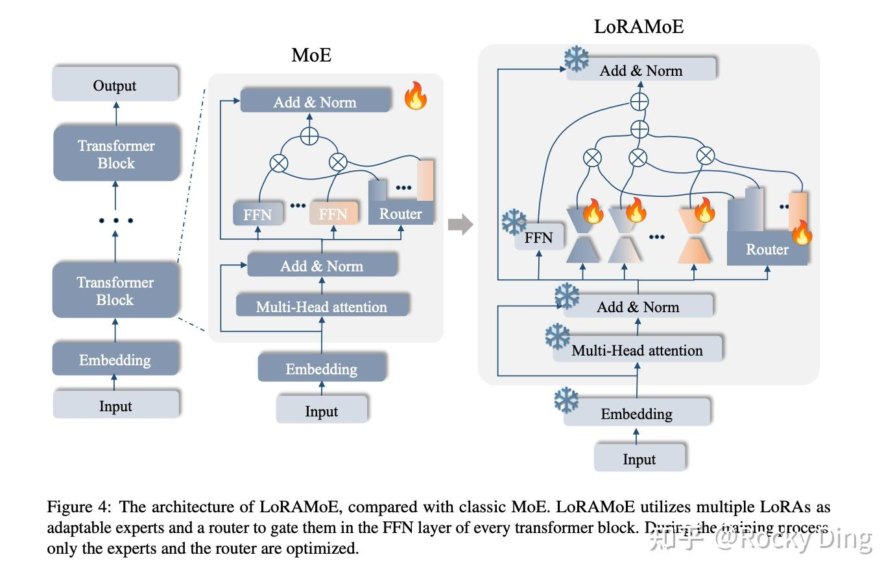

Router的粒度决定系统行为：样本级路由易实现但控制较粗；Token级路由能让不同语义Token使用不同专家，但调度与通信更复杂；时间步路由可以让专家分别负责构图、主体和纹理阶段；层级路由则让专家在不同表示深度承担任务。

为避免所有输入都挤到少数专家，训练通常加入负载均衡损失。一个简化目标可写成：

$$
\mathcal{L}=\mathcal{L}_{gen}+\lambda_{bal}\mathcal{L}_{balance}
$$

专家容量用于限制单个专家接收的Token数量，其工程形式常与每批Token数、专家数和容量因子有关。但具体公式和溢出策略取决于实现，不能把LLM中的固定Top-2配置直接视为所有图像MoE-LoRA的标准答案。

<h2 id="q-026">面试问题：MoE-LoRA的工程收益、训练风险与适用场景是什么？</h2>

**难度评分：⭐⭐⭐⭐⭐ (5/5)  |  考察频率：⭐⭐⭐ (3/5)**

MoE-LoRA的潜在收益是条件容量、专家分工和稀疏激活。它适合多域适配、多风格服务、复杂组合控制或共享底座上的多租户任务，尤其适用于不同任务之间既有共性又存在明显分布差异的场景。

但它不是“LoRA加几个专家就自动更高效”。主要风险包括：

- **专家坍塌**：Router长期选择少数专家，其他专家得不到有效梯度。
- **负载不均**：某些专家成为性能和通信热点，稀疏计算收益被调度开销抵消。
- **专家同质化**：多个专家学习到相似方向，参数增加但容量没有真正分工。
- **路由抖动**：输入或时间步的轻微变化导致专家突变，生成轨迹不连续。
- **评测困难**：最终效果来自Router、专家、底模和采样过程共同作用，问题定位比单LoRA更难。

Dropout、负载均衡损失、专家容量、路由噪声和Top-$k$都需要通过实验确定。不能笼统断言MoE一定更易过拟合、一定适合更小Batch或更高学习率；这些结论高度依赖数据规模、路由粒度和模型实现。

生产中应额外监控专家利用率、路由熵、每专家Token数、专家间更新相似度以及端到端延迟。如果任务数量不多、单个LoRA已经足够，MoE带来的系统复杂度往往大于质量收益。

**跨周期判断是：MoE-LoRA真正有价值的地方不是堆参数，而是把适配能力从一个静态插件升级为可路由的能力集合。前提是路由真的学会分工，部署系统也能兑现稀疏计算。**

<h1 id="q-027">7.介绍一下PEFT技术在AIGC图像生成领域的应用</h1>

<h2 id="q-028">面试问题：PEFT的核心技术路线有哪些？LoRA处于什么位置？</h2>

**难度评分：⭐⭐⭐⭐ (4/5)  |  考察频率：⭐⭐⭐⭐⭐ (5/5)**

**PEFT（Parameter-Efficient Fine-Tuning，参数高效微调）是“冻结大部分预训练参数，只训练少量任务参数”这类微调训练方法的总称**。它的核心目标是降低每个任务的训练、存储和交付成本，同时尽量保留底模能力。它让大模型应用的门槛和成本显著降低。

| 路线 | 训练对象 | 代表方法 | 主要特点 |
|---|---|---|---|
| 重参数化 | 权重更新的低维表示 | LoRA、LoHa、LoKr、DoRA | 易插拔、易融合、生态成熟 |
| 添加模块 | 新增Adapter或控制分支 | Adapter、ControlNet类分支 | 容量强，但结构和推理开销更明显 |
| 表示优化 | Token或Embedding | Textual Inversion | 文件极小，表达上限受文本空间约束 |
| 参数选择 | 偏置、归一化或部分层 | BitFit、Selective Fine-tuning | 实现直接，但能力依赖选层 |
| 提示优化 | 可学习Prompt/Prefix | Soft Prompt、Prefix类方法 | 适合条件注入，依赖架构接口 |

LoRA处于重参数化路线：它不直接解冻原权重，而是给权重更新增加低秩坐标。DreamBooth则主要是一种个性化训练目标与数据正则策略，既可以采用全参数微调，也可以用LoRA承载更新，所以“DreamBooth”和“LoRA”不是同一层面的互斥概念。

在AIGC图像生成中，选择PEFT方法要看知识应该写入哪里：新词语义可以写入Embedding；人物、风格和领域能力可以写入去噪主干的LoRA；强结构控制可能需要独立Adapter或ControlNet；生成行为变化则可能通过蒸馏LoRA或其他模块承载。

<h2 id="q-029">面试问题：Textual Inversion的原理、优势与局限是什么？</h2>

**难度评分：⭐⭐⭐⭐ (4/5)  |  考察频率：⭐⭐⭐⭐ (4/5)**

Textual Inversion冻结文本编码器和扩散模型，只学习一个或少量新的Token Embedding，让占位符 $S_*$ 在文本空间中表示新的视觉概念。

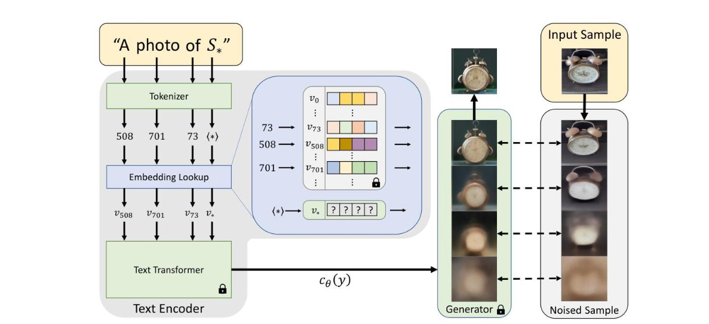

设可学习向量为 $v$，训练图片集合为 $\mathcal{D}$，其目标仍可使用扩散模型的噪声预测损失：

$$
v^*=\arg\min_v\mathbb{E}_{x,t,\epsilon}
\left[\left\|\epsilon-\epsilon_\theta(z_t,t,c(S_*;v))\right\|_2^2\right]
$$

其中底模参数 $\theta$ 固定，只有占位符对应的 $v$ 被更新。训练完成后，可以在Prompt中把 $S_*$ 与其他自然语言组合。

它的优势是参数和文件极小、训练成本低、不会直接改写去噪主干；局限是表达能力受文本嵌入空间约束。复杂人物身份、精细产品结构或与底模先验差异较大的概念，往往难以只靠少量Embedding完整承载。它还可能对初始化Token和Prompt模板敏感。

因此，Textual Inversion更像“为底模已有的视觉知识找到一个新语言入口”，而LoRA则能修改底模生成映射本身。前者适合轻量语义绑定，后者适合更强的特征与行为适配。

<h2 id="q-030">面试问题：DreamBooth和DreamBooth LoRA的原理是什么？</h2>

**难度评分：⭐⭐⭐⭐ (4/5)  |  考察频率：⭐⭐⭐⭐⭐ (5/5)**

DreamBooth是一种少样本主体个性化方法。它用“稀有标识符 + 类别词”绑定目标主体，例如“[V] dog”，并在实例图像上微调生成模型，使模型既记住特定主体，又能在新场景中响应自然语言。

只训练实例图容易让模型把整个“dog”类别收缩成目标对象，造成语言漂移和过拟合。DreamBooth因此引入类别先验保持损失，将实例重建与类别图像正则结合：

$$
\mathcal{L}=\mathcal{L}_{instance}+\lambda_{prior}\mathcal{L}_{prior}
$$

类别图像通常由原模型基于类别Prompt生成，用来约束模型继续保留该类别的多样性。Prior Preservation不是简单加入“负样本”，而是在生成目标上维持类别先验。

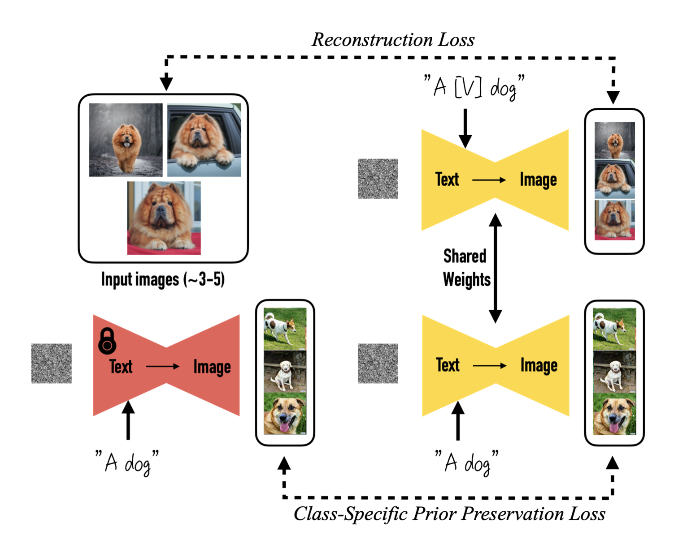

原始DreamBooth可以微调U-Net，并可选择微调文本编码器；DreamBooth LoRA则保留DreamBooth的数据组织、标识符和先验保持目标，但用LoRA参数化U-Net或Text Encoder的更新。前者更新容量更高、单任务权重更大；后者更省显存与存储，也更适合社区分发和多任务切换。

DreamBooth LoRA不是把两个独立模型简单相加，而是“DreamBooth训练范式 + LoRA参数化方式”。理解这一层关系，才能避免把DreamBooth、LoRA和Textual Inversion放在错误的比较维度上。

<h2 id="q-031">面试问题：LoRA、DreamBooth与Textual Inversion应该如何选择？</h2>

**难度评分：⭐⭐⭐⭐ (4/5)  |  考察频率：⭐⭐⭐⭐⭐ (5/5)**

这三者可以从“训练目标、更新位置和交付成本”三个维度比较。DreamBooth描述主体个性化任务及其先验保持训练策略；LoRA描述如何低成本表示权重更新；Textual Inversion描述如何只学习新Token Embedding。因此它们既可以比较，也可以组合。

| 方法 | 主要训练对象 | 表达能力 | 资源与文件 | 典型场景 |
|---|---|---|---|---|
| Textual Inversion | 新Token Embedding | 较低到中等 | 最小 | 轻量概念、风格词、语义入口 |
| LoRA | 去噪主干/文本编码器的低秩增量 | 中等到较高 | 较小 | 人物、风格、产品、领域与行为适配 |
| 全参DreamBooth | U-Net及可选Text Encoder | 较高 | 训练和存储成本高 | 高保真主体个性化、独立模型交付 |
| DreamBooth LoRA | DreamBooth目标下的低秩增量 | 中等到较高 | 较小 | 少样本主体定制与轻量交付 |

选择逻辑可以概括为：如果概念可以被底模已有文本空间表达，只缺少一个新入口，优先Textual Inversion；如果需要修改生成映射，同时要求低成本训练、组合与分发，优先LoRA或DreamBooth LoRA；如果任务与底模差异大、数据和算力充足、LoRA容量经验证不足，再考虑全参数DreamBooth或更大范围微调。

最终不应只比较训练显存，还要比较身份保真、Prompt可编辑性、跨底模兼容、推理延迟、版本治理和许可证。**工具不是护城河，判断才是护城河。类LoRA技术真正跨周期的价值，是把一个越来越大的通用模型拆成稳定底座与可组合增量，让数据、训练、评测和部署形成可持续迭代的闭环。**
