# 目录

[1.介绍一下AIGC图像生成领域中LoRA的技术原理和主流应用场景](#q-001)
  - [面试问题：LoRA的核心数学原理是什么？为什么LoRA能够有效适配扩散模型？](#q-002)
  - [面试问题：LoRA通常注入扩散模型中U-Net、DiT和Text Encoder的哪些位置？](#q-003)
  - [面试问题：LoRA在AIGC图像创作领域有哪些主流应用场景？](#q-004)

[2.在AIGC图像生成领域中，LoRA模型有哪些特性与优势？](#q-005)
  - [面试问题：LoRA与全参数微调相比，训练和推理成本有什么差异？](#q-006)
  - [面试问题：如何评价一个人物、风格或概念LoRA的整体质量？](#q-007)
  - [面试问题：如何调节LoRA权重？多个LoRA同时加载时如何正确组合？](#q-008)
  - [面试问题：多LoRA推理中的Merge、Switch和Composite策略有什么区别？](#q-009)
  - [面试问题：LoRA的离线融合、差分提取和跨底模迁移有哪些特点？](#q-010)

[3.在AIGC图像生成领域中，LoRA模型的微调训练流程包含哪些核心环节？](#q-011)
  - [面试问题：介绍一下LoRA从任务定义到部署验证的完整训练流程](#q-012)
  - [面试问题：LoRA训练数据、Caption标签和长宽比分桶应该如何构造和设计？](#q-013)
  - [面试问题：Rank、Alpha、学习率、训练步数和训练目标模块等关键参数应该如何设置？](#q-014)
  - [面试问题：如何判断LoRA欠拟合、过拟合、概念泄漏和底模型绑定？](#q-015)
  - [面试问题：LoRA训练中有哪些显存与稳定性优化手段？](#q-016)

[4.在AIGC图像生成领域中，LoRA有哪些主流变体？介绍一下它们的核心原理](#q-017)
  - [面试问题：LoCon和LoHa在原生LoRA上分别做了哪些优化？](#q-018)
  - [面试问题：DoRA、B-LoRA等方法有哪些创新点？](#q-019)
  - [面试问题：LCM-LoRA与人物/风格LoRA有什么本质区别？](#q-020)
  - [面试问题：如何构建差异化LoRA？差异化LoRA的构建逻辑和数学本质是什么？它适合解决什么问题？](#q-022)

[5.介绍一下AIGC图像生成领域中MoE-LoRA的核心原理](#q-024)
  - [面试问题：MoE-LoRA如何通过路由和专家适配器提升条件容量？](#q-025)
  - [面试问题：MoE-LoRA的工程收益、训练风险与适用场景是什么？](#q-026)

[6.介绍一下PEFT技术在AIGC图像生成领域的应用](#q-027)
  - [面试问题：PEFT的核心技术路线有哪些？LoRA属于哪个细分类别？](#q-028)
  - [面试问题：Textual Inversion的原理、优势与局限是什么？](#q-029)
  - [面试问题：DreamBooth和DreamBooth LoRA的原理是什么？](#q-030)
  - [面试问题：LoRA、DreamBooth与Textual Inversion应该如何选择？](#q-031)

---

<h1 id="q-001">1.介绍一下AIGC图像生成领域中LoRA的技术原理和主流应用场景</h1>

<h2 id="q-002">面试问题：LoRA的核心数学原理是什么？为什么LoRA能够有效适配扩散模型？</h2>

**难度评分：⭐⭐⭐⭐ (4/5)  |  考察频率：⭐⭐⭐⭐⭐ (5/5)**

LoRA（Low-Rank Adaptation）本质上是对特征矩阵进行低秩分解的一种近似数值分解技术，可以大幅降低特征矩阵的参数量，但是会伴随着一定的有损压缩。从传统深度学习时代走来的读者，可以发现其实LoRA本质上是基于Stable Diffusion/FLUX的一种轻量化训练微调技术。

在AIGC图像创作领域，我们可以使用SD/FLUX模型+LoRA模型的组合微调训练方式，只训练参数量很小的LoRA模型，就能在一些AIGC细分领域任务中取得不错的效果。

LoRA模型的训练逻辑是首先冻结SD/FLUX模型的权重，然后在SD模型的U-Net架构或FLUX系列的Transformer架构中注入LoRA权重，主要作用于CrossAttention部分，并只对这部分的参数进行微调训练。

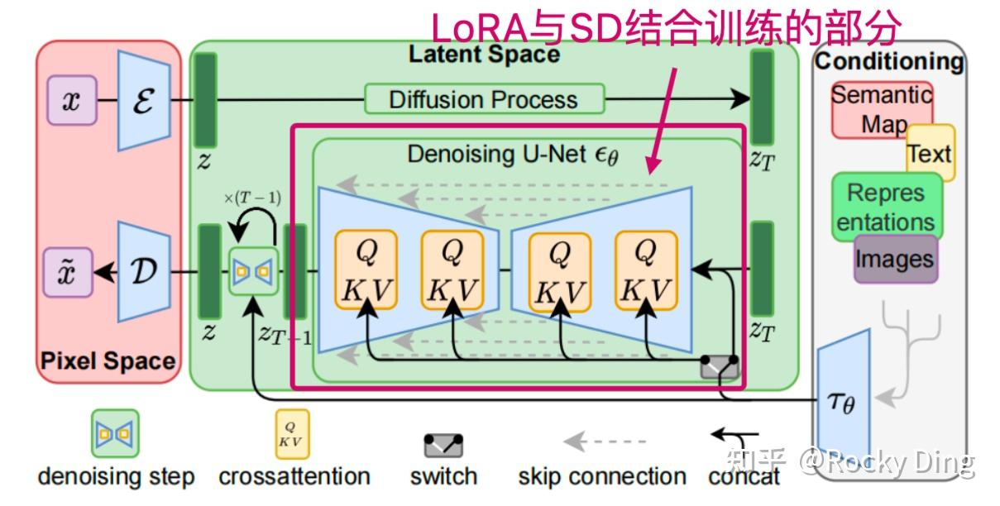

LoRA（Low-Rank Adaptation，低秩适配）的核心价值是：**下游任务需要的不是重新学习整个生成世界，而是在预训练模型已经形成的表示空间中，找到一条成本更低的任务增量。**

也就是说，对于SD/FLUX模型预训练层的权重为 $W_0\in\mathbb{R}^{d_{out}\times d_{in}}$。全参数微调直接优化 $W_0$；LoRA冻结 $W_0$，只学习增量 $\Delta W$：

$$
W'=W_0+s\Delta W=W_0+\frac{\alpha}{r}BA
$$

其中 $\Delta W = AB$ 通过低秩分解由两个低秩矩阵的乘积组成。 $A\in\mathbb{R}^{r\times d_{in}}$ 、 $B\in\mathbb{R}^{d_{out}\times r}$ ， $r\ll\min(d_{in},d_{out})$ ，$r$ 就是 $\Delta W$ 这个参数矩阵的秩（Rank，lora_dim）。 $\alpha$ 是缩放系数， $s=\alpha/r$ 。原矩阵若包含 $d_{out}d_{in}$ 个可训练参数，LoRA只需要训练 $r(d_{in}+d_{out})$ 个参数。

一般来说，尽管SD/FLUX模型的参数数量很大，但每个细分任务对应的本征维度（Intrinsic Dimension）并不大，所以我们设置较小的 $r$ 值就能获得一个参数数量远小于SD/FLUX模型的LoRA模型，并在一些细分任务中获得较好的效果。同时如果我们将 $r$ 设置得越小，LoRA模型的参数数量就越小，但是 $|W' - AB|$ 的近似度就越差。

例如，某线性层的权重形状为 $1024\times 1024$，全量更新需要 $1,048,576$ 个参数；当 $r=8$ 时，两块低秩矩阵只有：

$$
8\times1024+1024\times8=16,384
$$

**可训练参数约缩小64倍**。同时真实模型还包含大量不同形状的层，因此最终压缩比例取决于目标模块范围。What amazing! 非常简洁、高效的思想！

<div align="center">

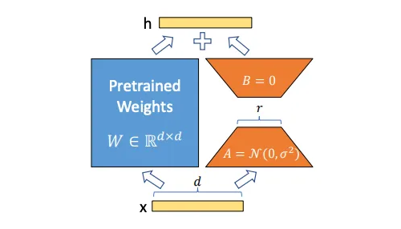

</div>

上图是LoRA模型训练的示意图。通常来说，对于矩阵 $A$ ，我们使用随机高斯分布初始化，并对矩阵 $B$ 使用全0初始化，使得在训练初始状态下 $BA=0$ 。这样能够保证在训练初始阶段时，SD/FLUX模型的预训练权重完全生效。零初始化的升维矩阵仍然可以接收到非零梯度；它的作用是避免随机适配器在一开始污染底模输出。

虽然矩阵 $B$ 使用全0初始化能够让SD模型的权重完全生效，但同时也带来了不对称问题（矩阵 $B$ 全零，矩阵 $A$ 非全零）。我们可以通过“补权重”法（训练前先在SD/FLUX模型权重中减去矩阵 $AB$ 的权重）来使矩阵 $AB$ 都使用随机高斯分布初始化，在效果不变的情况下，增加了对称性：

$$W' = W_o - \Delta W + \Delta W$$

其中 $\Delta W = AB, A \in \mathbb{R}^{n \times d}, B \in \mathbb{R}^{d \times m}, d \ll n$。

LoRA有效并不意味着任意任务的真实更新都必然严格低秩。更准确的解释是：预训练模型已经学习到大量通用视觉和语义能力，人物身份、画风、材质、产品概念或特定生成行为所需的局部变化，常常可以由一个低维子空间近似。Rank决定的是适配器的容量上限，而最终效果仍由数据分布、标注、目标模块、优化策略和底模先验共同决定。

<div align="center">

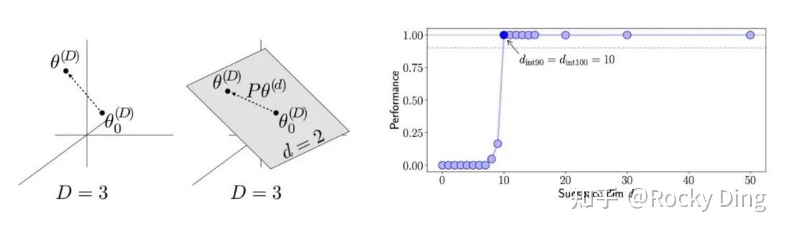

</div>

上图直观展示了LoRA的核心思想：

- **高维原始空间**：左边的 `D=3` 代表预训练大模型的参数空间维度极高（实际中可能是百万/十亿级），$\theta^{(D)}$ 是预训练模型的参数， $\theta_0^{(D)}$ 是微调的起点。
- **低秩子空间约束**：右边的灰色平面 `d=2` 表示LoRA并没有在整个高维空间中更新所有参数，而是将参数更新限制在一个低秩的子空间里。$P\theta^{(d)}$ 是原始参数在低秩子空间上的投影，意味着任务所需的参数更新可以被这个低维子空间很好地捕捉。
- 当训练步数达到 `d_int90 = d_int100 = 10` 左右时，性能突然飙升至接近1.0并保持稳定。
- 这说明**低秩子空间的少量参数更新，已经足以让模型快速收敛到接近最优的性能**，不需要在整个高维空间中全量更新参数。

同时，经过预训练的AIGC大模型已经具备“通用知识”，已经学到了语言、图像等领域的通用底层规律（比如语义理解、视觉特征提取）。很多AIGC细分领域的目标需求本质上并不是“重新学习所有知识”，而是**在通用知识的基础上，注入任务特定的信息**（比如让SD/FLUX生成特定风格的图像）。**这些“任务特定信息”往往只需要对原始参数做很小的调整，且这种调整可以被低秩矩阵近似表示（即图中 `d=2` 的低维子空间足以覆盖任务所需的更新）**。

同时通过LoRA技术的低秩更新避免了全量微调的缺陷，全量微调（如SD/FLUX的直接微调）虽然更新所有参数，但存在明显问题：

- **计算/存储成本极高**：大模型全量微调需要巨大的算力和显存，且每个任务需要单独保存一个完整模型，存储成本爆炸。
- **容易过拟合与遗忘**：在小数据集上全量微调容易过拟合，还可能破坏预训练模型的通用能力（灾难性遗忘）。
- **效率低下**：全量更新中大部分参数的调整对任务收益很小，属于“无效计算”。

而LoRA的低秩更新完美规避了这些问题：

- **参数效率高**：仅更新低秩矩阵（通常是原始参数的1%甚至更少），计算和存储成本大幅降低。
- **保留预训练能力**：原始参数被冻结，预训练的通用知识得以完整保留，仅通过低秩矩阵注入任务信息，避免了灾难性遗忘。
- **收敛速度快**：从右侧性能曲线可以看到，LoRA仅需少量训练步数就达到饱和性能，远快于全量微调。

总的来说，LoRA的核心逻辑是“**精准更新关键参数来高效注入特定任务信息**”。预训练AIGC大模型已经积累了足够的通用知识，LoRA只需要在低秩子空间中做微小调整，就能让AIGC大模型在特定任务上表现优异，同时还能避免全量微调的各种缺陷。**换个更通俗地表达：“不是大模型全参微调训练不起，而是LoRA模型更有性价比！”**


<h2 id="q-003">面试问题：LoRA通常注入扩散模型中U-Net、DiT和Text Encoder的哪些位置？</h2>

**难度评分：⭐⭐⭐⭐ (4/5)  |  考察频率：⭐⭐⭐⭐⭐ (5/5)**

LoRA并不天然等于“只训练Cross-Attention”。它可以作用于任何适合低秩参数化的线性层或卷积层，真正的设计问题是：**哪些模块承载了任务所需的表示，哪些模块值得为此付出容量和泛化成本。**

在经典Stable Diffusion U-Net中，LoRA常注入Attention模块的 $W_q$、 $W_k$ 、 $W_v$ 和输出投影 $W_o$ ，也可以覆盖Cross-Attention、Self-Attention、前馈网络和部分卷积层。只训练Cross-Attention成本较低、语义绑定较强；扩大到Self-Attention和卷积层后，模型对局部纹理、空间结构与风格的表达能力通常更强，但文件更大，也更容易把训练集构图一并记住。

<div align="center">


</div>

在FLUX、Stable Diffusion 3等DiT或多模态扩散Transformer架构中，目标从U-Net层变成Transformer中的Attention投影、MLP以及多模态联合块。此时不能照搬SD 1.x的层名和分层经验；底座的Token组织方式、文本图像融合位置和归一化结构变化后，同样的Rank和目标模块会产生不同效果。

Text Encoder LoRA则修改CLIP、T5等文本编码器中的Attention或前馈层。它更擅长强化触发词与新概念之间的语义绑定，但也更容易让概念依赖特定词形，或者破坏原有文本空间。小数据训练中通常应让Text Encoder使用更低学习率、训练更少步数，甚至完全冻结，再通过验证集判断是否有必要开放。

目标模块选择可以按任务拆成三类：

<div align="center">

| 任务目标 | 优先关注模块 | 主要收益 | 主要风险 |
|---|---|---|---|
| 触发词、人物身份、对象概念 | Cross-Attention、部分Text Encoder | 语义绑定直接 | 触发词依赖、概念泄漏 |
| 风格、材质、局部纹理 | Self-Attention、MLP、卷积层 | 表达容量更强 | 构图记忆、底模绑定 |
| DiT/多模态生成行为 | 联合Attention、MLP、调制层 | 适配新架构 | 参数和实现差异更大 |

</div>

总的来说，模块覆盖不是越多越好。**LoRA训练真正要优化的不是可训练参数数量，而是任务信息应该被写入哪一层表示。**

<h2 id="q-004">面试问题：LoRA在AIGC图像创作领域有哪些主流应用场景？</h2>

**难度评分：⭐⭐⭐ (3/5)  |  考察频率：⭐⭐⭐⭐⭐ (5/5)**

LoRA最常见的应用场景是人物、角色、产品、风格、服装、材质、动作概念和品牌视觉等特征适配，这些场景的本质特征包括四类增量：

1. **主体增量**：让底模型稳定识别某个人物、虚拟角色、宠物、IP形象或产品外观，同时保留换姿态、换背景、换服装的能力。
2. **风格增量**：学习色彩、笔触、光影、材质和构图倾向。优秀风格LoRA应该改变视觉语言，而不是把训练集中的固定人物和场景一起复制出来。
3. **领域增量**：把电商、建筑、游戏美术、服装设计、工业设计等领域的数据分布注入通用底模型，使大模型更接近生产数据和行业审美。
4. **行为增量**：把少步生成、质量增强、特定编辑行为或控制能力封装成适配器。LCM-LoRA属于这一类，它学习的不是一个角色或画风，而是生成过程的行为变化。


<h1 id="q-005">2.在AIGC图像生成领域中，LoRA模型有哪些特性与优势？</h1>

<h2 id="q-006">面试问题：LoRA与全参数微调相比，训练和推理成本有什么差异？</h2>

**难度评分：⭐⭐⭐⭐ (4/5)  |  考察频率：⭐⭐⭐⭐⭐ (5/5)**

我们在**在使用LoRA技术后，会给SD/FLUX模型的微调训练和前向推理带来哪些优势呢？**

### 微调训练阶段

1. **参数量**：矩阵乘积AB与SD/FLUX模型的参数有相同的维度，同时分解出来的两个低秩矩阵可以确保参数更新是在低秩情况下的，这样就显著减少训练的参数数量了。同时**LoRA模型本身的参数量非常小，最小可至3M左右，这使得LoRA模型在开源社区非常方便传播，也进一步促进了AIGC图像创作领域的爆发式繁荣**。

2. **显存占用**：训练LoRA模型所需的算力要求很低，我们可以在2080Ti级别的算力设备上进行LoRA模型的训练。因为使用LoRA技术**大幅降低了SD/FLUX系列模型训练时的显存占用**，整个训练过程中不需要更新SD/FLUX模型的权重，所以SD/FLUX模型对应的优化器参数不需要存储。

3. **计算量：训练过程中的整体计算量没有明显变化**，因为LoRA模型是在SD/FLUX模型的全参梯度基础上增加了“残差”梯度，整体上计算量会比SD/FLUX模型的全参微调略大。

4. **训练数据量**：LoRA模型能在小数据集上进行训练（1张以上即可，理论上1张图片也能训练）。

5. **训练时长**：在其他超参数一致的情况下，与SD/FLUX系列模型全参训练相比，**LoRA模型训练速度更快**。因为训练过程中只更新LoRA模型对应的参数，无需对SD/FLUX模型权重进行更新；同时由于更新的参数量大幅减少，所以数据传输的通信时间也减少了。

### 前向推理阶段

1. **参数量**：在推理过程中，由于LoRA模型权重与SD/FLUX模型权重进行了合并，同时SD/FLUX模型的结构是不改变的，所以**推理时的参数量是不变的**。

2. **显存占用**：在推理过程中，由于LoRA模型权重与SD/FLUX模型权重进行了合并，同时SD/FLUX模型的结构是不改变的，所以**推理时的显存占用和SD模型的显存占用一致**。

3. **推理耗时**：在推理过程中，由于LoRA模型权重与SD/FLUX模型权重进行了合并，同时SD/FLUX模型的结构是不改变的，所以**推理耗时没有增加**。

4. **高效切换**：SD/FLUX模型之间切换需要将所有模型参数加载到内存，从而造成严重的I/O瓶颈。通过对权重更新的有效参数化，**不同LoRA模型之间的切换加载既高效又容易**。

从上面Rocky对LoRA模型的归纳总结。可以看到，SD/FLUX模型与LoRA模型的权重合并后，SD/FLUX模型的结构并没有改变，同时参数量、显存占用、推理耗时也不会改变，**整个推理成本是没有增加的，这无疑让LoRA模型有了更多的实用价值**。

下面我们再从训练、交付和推理三个阶段进行汇总比较：

<div align="center">

| 维度 | LoRA微调 | 全参数微调 |
|---|---|---|
| 可训练参数 | 只训练低秩分支 | 更新全部开放参数 |
| 梯度与优化器状态 | 显著减少 | 成本最高 |
| 激活显存 | 仍取决于底模、分辨率和目标层 | 通常更高，但不会与参数量简单等比 |
| 单任务权重存储 | 小型适配器 | 完整模型副本 |
| 多任务切换 | 可动态加载适配器 | 通常切换整套模型 |
| 小数据风险 | 较易保留底模能力 | 更易过拟合和灾难性遗忘 |
| 表达上限 | 受Rank和目标模块约束 | 容量更高 |

</div>

值得注意的是，推理阶段要区分“动态加载”和“权重融合”：

- **动态加载**：前向计算同时执行原层与LoRA分支，保留随时切换和调权能力，但会增加少量计算、显存管理与框架开销。
- **权重融合**：预先计算 $W'=W_0+sBA$ 并写回底模，层结构与原模型一致，理论上不增加该层推理计算；代价是切换、撤销、精度管理和多LoRA版本控制更复杂。

因此，“LoRA推理成本完全不变”只在已经正确融合、且不保留额外分支计算时成立。生产环境还要考虑适配器加载I/O、显存碎片、并发租户隔离和融合误差。


<h2 id="q-007">面试问题：如何评价一个人物、风格或概念LoRA的整体质量？</h2>

**难度评分：⭐⭐⭐ (3/5)  |  考察频率：⭐⭐⭐⭐⭐ (5/5)**

只看“像不像训练图”会把过拟合误判成高质量。一个可用LoRA至少要同时评价还原度、可控性、泛化性和兼容性，并把这些指标放在同一组验证矩阵里。

<div align="center">

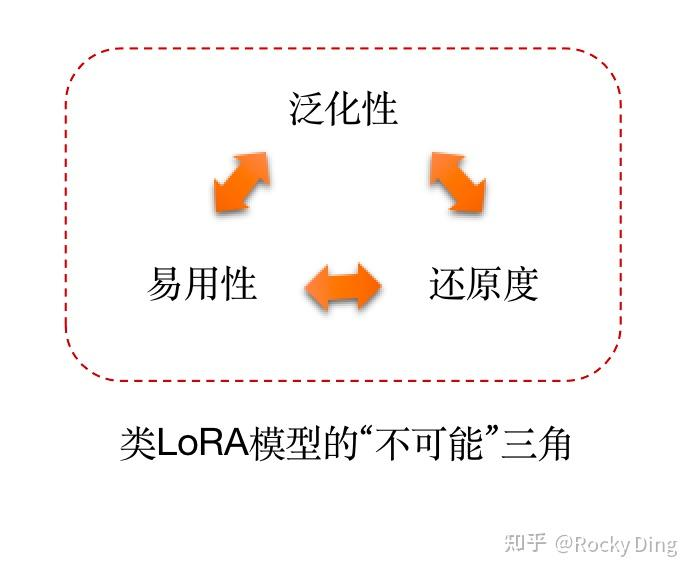

</div>

1. **还原度**：人物身份、产品结构、画风语言或概念特征是否准确。主体LoRA可结合人脸识别相似度、人工身份评价和关键细节检查；风格LoRA更依赖盲测与风格一致性评价。
2. **易用性**：触发词是否清晰，权重变化是否平滑，能否响应姿态、镜头、服装、背景和光照等提示。只会复现训练构图，不是可控，而是记忆。更换同架构底模、采样器、CFG、VAE或叠加其他LoRA时是否稳定。兼容性不是必然要求，但必须明确支持范围。
3. **泛化性**：在未见过的Prompt、种子、长宽比和组合条件下是否仍然成立。验证集必须覆盖训练集没有出现过的组合。
4. **副作用**：是否出现背景泄漏、服装绑定、固定表情、色调污染、文字理解下降、手部与人脸质量退化等问题。

一个实用验证矩阵应固定Prompt、随机种子、分辨率和采样设置，分别测试：不开LoRA、目标权重、多档权重、同架构其他底模、多个未见场景、多LoRA组合。这样才能把底模能力、随机性和LoRA贡献分离开。

**总的来说，LoRA质量不是单点相似度，而是“特征保真、提示可控、场景泛化、组合兼容、副作用可接受”五个维度的共同结果。**

<h2 id="q-008">面试问题：如何调节LoRA权重？多个LoRA同时加载时如何正确组合？</h2>

**难度评分：⭐⭐⭐⭐ (4/5)  |  考察频率：⭐⭐⭐⭐⭐ (5/5)**

单个LoRA的推理强度可以写成：

$$
W'=W_0+\lambda\frac{\alpha}{r}BA
$$

其中训练缩放 $\alpha/r$ 决定适配器的参数化尺度，推理权重 $\lambda$ 是部署时的外部控制量。不同框架可能把两者合并显示为一个“LoRA权重”，但概念上应区分。

<div align="center">


</div>

当 $\lambda=0$ 时LoRA不生效；增加 $\lambda$ 通常会增强目标特征，但并不保证线性改善。权重过大可能造成饱和、颜色污染、结构变形或提示词失控，所以不应把“大于1”当作补救欠拟合的通用方法。

除了调整单个LoRA的权重，我们还可以使用多个LoRA模型同时作用于一个SD/FLUX模型，并配置他们的各自权重，我们拿两个LoRA模型举例：

$$\Delta W = (\alpha_1 A_1 + \alpha_2 A_2)(\alpha_1 B_1 + \alpha_2 B_2)$$

其中 $\alpha_1$ 代表第一个LoRA模型的权重，$\alpha_2$代表第二个LoRA模型的权重。如果我们设置 $\alpha_1 = \alpha_2 = 0.5$ ，我们就得到两个LoRA模型的权重平均值。如果我们设置 $\alpha_1 = 0.8$ ， $\alpha_2 = 0.3$ ，那么第一个LoRA模型的效果会占据主导；如果我们设置 $\alpha_1 = 0.1$，$\alpha_2 = 0.8$ ，那么第二个LoRA模型的效果会占据主导。

也可以表示为：

$$
W'=W_0+\sum_{i=1}^{N}\lambda_i\frac{\alpha_i}{r_i}B_iA_i
$$

但不能写成 $(\sum_i\lambda_iA_i)(\sum_i\lambda_iB_i)$，因为后者会额外产生 $A_iB_j$ 一类未经训练的交叉项，而且矩阵次序还可能不满足形状要求。

我们知道SD/FLUX系列模型中的Text Encoder部分也包含了大量的Attention结构，所以我们也可以使用LoRA技术微调训练SD/FLUX系列模型的Text Encoder，获得Text Encoder LoRA模型。

整个训练流程和SD U-Net LoRA模型一致，在前向推理阶段，将Text Encoder LoRA模型权重合并到SD/FLUX系列模型的Text Encoder中。

在使用时，我们可以更加灵活地在SD/FLUX模型中加载LoRA模型权重：

1. SD/FLUX模型+ U-Net LoRA/Transformer LoRA模型 + Text Encoder LoRA模型
2. SD/FLUX模型+ U-Net LoRA/Transformer LoRA模型
3. SD/FLUX模型+ Text Encoder LoRA模型

三种不同的使用方式，生成图片的效果也会不同，下图是不同LoRA模型的不同权重组合在生成人像的效果：

<div align="center">

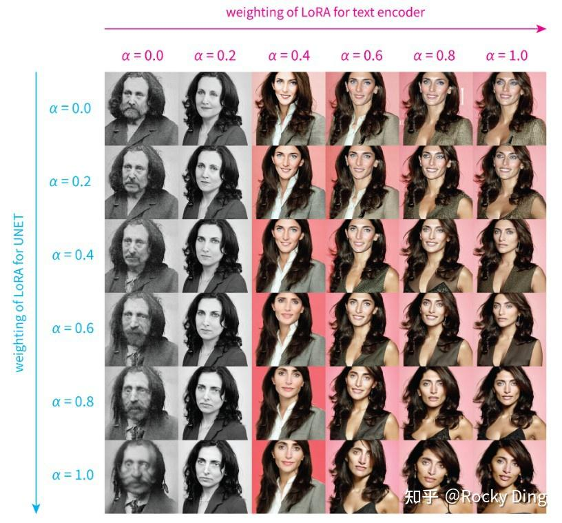

</div>

总的来说，多LoRA冲突通常来自三个层面：它们修改相同权重方向；触发词在文本空间相互污染；人物、服装、风格在训练数据中存在共现绑定。调低权重只能缓解表面冲突，真正的解决方案还包括分层加载、分时间步调度、区域掩码、正交化、路由选择和重新设计训练数据。

<h2 id="q-009">面试问题：多LoRA推理中的Merge、Switch和Composite策略有什么区别？</h2>

**难度评分：⭐⭐⭐⭐ (4/5)  |  考察频率：⭐⭐⭐⭐ (4/5)**

我们在使用多个LoRA模型进行组合（如不同的角色、服装、风格、背景等）推理时，**除了使用经典的Merge策略外，还可以使用Switch和Composite两种高阶组合策略**。

<div align="center">

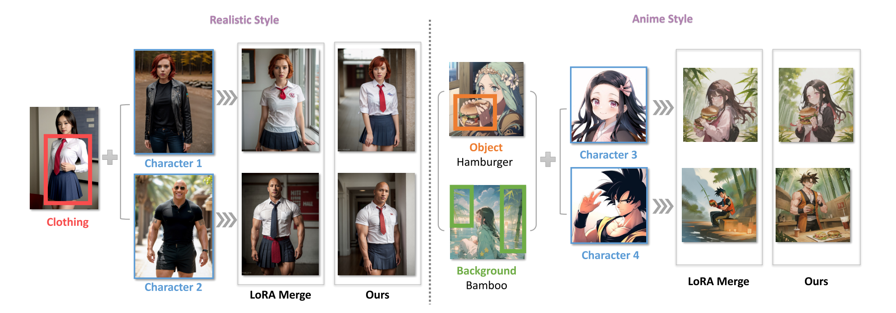

</div>

**在大量不同功能的LoRA模型组合推理时，通过Merge策略会损失一些LoRA的原本特征细节，甚至完全丢失某个LoRA的特征，使其完全失效**。而Switch和Composite策略都会比Merge策略保留更多LoRA的原本特征，同时通过Switch和Composite策略生成的图像中的人物角色特征会比Merge策略要更自然。

<div align="center">

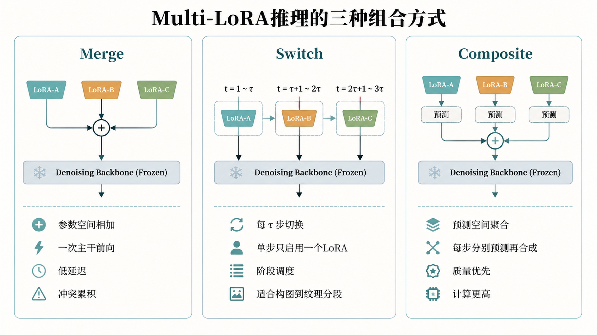

</div>

上图通俗易懂的展示了 Merge 是先在权重里相加，Switch 是按步切换，Composite 是每一步都分别预测再汇总的各策略核心思想。

<div align="center">

| 策略 | 控制位点 | 每步主干前向次数 | 适合的 AIGC 场景 | 主要风险 |
|---|---|---:|---|---|
| Merge | 参数空间 | 1 | 少量兼容 LoRA 的轻量叠加、低延迟部署 | 多个增量在同一层里叠加，冲突容易累积 |
| Switch | 去噪时间轴 | 1 | 人物、服装、风格、背景这类可分阶段协作的元素组合 | 切换节奏、顺序和采样器都会影响结果 |
| Composite | 预测空间 | 约为 LoRA 数量 | 质量优先、复杂组合、希望保住每个元素细节 | 计算和显存开销更高，工程调度更重 |

</div>

### Merge：把多个 LoRA 的增量先合在权重里

Merge 的逻辑最直接：每个 LoRA 都对应一个低秩增量，把这些增量按系数相加后再注入到底模型中。

```math
W' = W_0 + \sum_{i=1}^{K}\lambda_i\frac{\alpha_i}{r_i}B_iA_i
```

它的优点也很朴素：实现简单、推理快、部署方便，适合少量风格相近、目标不冲突的 LoRA 叠加。

问题也同样直接：当 LoRA 数量变多，或者它们分别在人物、服装、背景、风格上改动同一层时，更新方向会互相打架，最后常见结果不是“能力变强”，而是细节丢失、局部变形，甚至把原本清晰的主体压扁。

所以 Merge 更像是“权重级的合并方案”，它适合做底层默认，但不适合把它想成万能解法。只要我们开始追求更复杂的 AIGC 图像组合，单纯加权就会越来越像拿一把螺丝刀去拧所有螺母。

### Switch：把 LoRA 放进扩散过程的时间轴里轮换

**Switch 的思路更像排班，而不是相加**。它在每个去噪步只启用一个 LoRA，到下一段步数再切换到下一个 LoRA。

```math
i_n = \left\lfloor \frac{(n-1)\bmod(K\tau)}{\tau} \right\rfloor + 1
```

这里 `n` 是去噪步编号，`K` 是 LoRA 数量，`τ` 是切换间隔。直观地说，就是每 `τ` 步换一次人上场。

这种方法特别适合 AIGC 图像创作里的“阶段分工”场景。比如一张图里既有角色、服装、背景，又有风格和道具时，不同元素并不总是在同一个去噪阶段发挥作用。

Switch 的价值就在于：它不要求所有 LoRA 同时抢方向盘，而是让它们按节奏轮流接管，从而减少直接叠加造成的互相干扰。

Switch 的优点：
- 避免了权重叠加冲突
- 每个 LoRA 都有独立发挥作用的时间
- 通过调整 switch_step 可以控制融合程度

Switch 的缺点：
- 仍然是一次只用一个 LoRA，可能无法充分体现多个特征的协同效果
- 切换频率不好设置，可能导致特征不连贯

### Composite：每一步都让所有 LoRA 参与，但在预测空间里汇总

**Composite 比 Merge 更重，也比 Switch 更“全”**。它不是把 LoRA 权重先合并，而是在每个去噪步里让每个 LoRA 都各自给出预测，再把这些预测聚合起来。

```math
\tilde{\epsilon}(z_t,c)=\frac{1}{K}\sum_{i=1}^{K}\left[\hat{\epsilon}_{\theta_i'}(z_t)+s\cdot\left(\hat{\epsilon}_{\theta_i'}(z_t,c)-\hat{\epsilon}_{\theta_i'}(z_t)\right)\right]
```

这类写法可以理解成把 Classifier-Free Guidance 的思路扩展到 LoRA：不是只让文本条件参与引导，而是让多个 LoRA 也作为引导信号同时进入每一步预测。它的好处是能保住每个 LoRA 的独立贡献，减少“先合并再互相污染”的问题；代价也很直接，基本就是把每一步的计算负担按 LoRA 数量放大，显存、延迟和工程复杂度都会明显上升。

因此 Composite 更适合质量优先、预算相对宽松、又确实需要复杂组合的场景。比如人物身份、服装、背景、风格都要保留，而且不能接受 Merge 那种“平均一下就糊了”的结果时，Composite 往往更值得试。

Composite的优点：
- **避免权重冲突**：各 LoRA 独立预测，不会互相干扰
- **充分融合信息**：通过平均综合所有 LoRA 的特征
- **稳定性好**：平均操作具有降噪效果

Composite的缺点：
- **计算开销大**：需要进行 n 次 UNet 前向传播（n 是 LoRA 数量）
- **生成速度慢**：耗时是 Merge 方法的 n 倍
- **显存占用高**：需要存储多个预测结果

总的来说，对 AIGC 图像创作而言，可以把选择逻辑记成一句更实用的话：

<div align="center">

| 优先目标 | 更合适的策略 | 一句话理解 |
|---|---|---|
| 低延迟、简单部署 | Merge | 先把多个增量合成一个，再统一推理 |
| 多元素分阶段协作 | Switch | 让不同 LoRA 在不同去噪阶段轮流上场 |
| 质量优先、复杂组合 | Composite | 每一步都让所有 LoRA 投票，但成本更高 |

</div>


<h2 id="q-010">面试问题：LoRA的离线融合、差分提取和跨底模迁移有哪些特点？</h2>

**难度评分：⭐⭐⭐⭐ (4/5)  |  考察频率：⭐⭐⭐⭐ (4/5)**

Rocky向大家通俗易懂的讲解LoRA模型的融合和提取方式，**这主要是为了获得全新的特定效果的LoRA模型**。

**在2022年AIGC时代元年，Stable Diffusion + LoRA的模型融合方法在开源社区一度火爆非凡**。很多开源社区的AI绘画爱好者和AI绘画设计师对Stable Diffusion每一层的权重融合方式都进行了详细的实验与测试，**总结了很多广为流传的实验经验，比如SD的哪几层控制主体、哪几层控制颜色、哪几层控制风格、哪几层控制手型等**。

一晃多年过去了，SD系列也连续发布了SD 2.x、SDXL、SD 3等大模型，同时FLUX.1、FLUX.1 Kontext、FLUX.2也相继发布，**虽然我们不能将SD 1.x 的分层融合经验生搬硬套到最新的模型上，开源社区也没有更多精力对每一款AI绘画大模型进行如此详细的消融实验与测试**，但是SD 1.x 的分层融合经验还是给我们提供了很多灵感与认识AIGC大模型的不同视角，**以及会让我们想起AIGC元年大家的热情与兴奋，不知不觉也让我们哑然失笑**。

到目前为止，LoRA模型的主流融合方式一共有以下两种：

1. LoRA+LoRA全融合/分层融合来获得新LoRA模型。
2. SD/SDXL/SD 3/FLUX模型与LoRA全融合/分层融合来获得新LoRA模型。

除了LoRA模型的融合，**我们还能通过提取的方式**，在SD和FLUX.1系列模型中提取LoRA模型：

1. 两个SD/SDXL/SD 3/FLUX模型差分提取新LoRA模型。
2. 两个LoRA差分提取新LoRA模型。

同一底模、同一架构、同一参数命名和相近训练链路下，LoRA A与LoRA B可以做加权和或差分：

$$
\Delta W_{new}=\beta\Delta W_A+(1-\beta)\Delta W_B
$$

如果要把一个完整权重差 $W_1-W_0$ 提取成Rank为 $r$ 的LoRA，可以对差分矩阵做截断SVD：

$$
W_1-W_0\approx U_r\Sigma_rV_r^\top=B A
$$

关于LoRA的跨底模迁移，这里存在三条关键边界：

1. **架构边界**：SD 1.x、SDXL、SD3和FLUX的网络结构及参数形状不同，不能直接互融。
2. **坐标边界**：即使架构相同，两个模型如果来自复杂融合、参数置换或不同训练轨迹，直接差分也未必对应可解释能力。
3. **低秩误差边界**：完整权重差可能不是低秩，截断后会丢失信息；Rank越小，提取文件越小，但重建误差通常越大。

所谓“跨底模兼容”也不是二元属性。LoRA往往在训练底模及其近邻微调模型上效果最好，距离越远越容易出现身份漂移、风格变形或触发词失效。因此实际场景进行LoRA交付时，必须记录底模哈希、模型架构、文本编码器、VAE、推荐权重和验证样例，而不能只交付一个孤立的权重文件。

<h1 id="q-011">3.在AIGC图像生成领域中，LoRA模型的微调训练流程包含哪些核心环节？</h1>

<h2 id="q-012">面试问题：介绍一下LoRA从任务定义到部署验证的完整训练流程</h2>

**难度评分：⭐⭐⭐⭐ (4/5)  |  考察频率：⭐⭐⭐⭐⭐ (5/5)**

LoRA训练一个完整闭环至少包含任务定义、底模型选择、数据治理、参数设计、训练监控、离线评测和部署验证七个环节。

1. **定义任务和成功标准**：我们首先要判断的学习目标是人物身份、风格、产品结构还是抽象概念，明确学习目标对于整个LoRA训练流程至关重要。
2. **底模型选型**：底模应具备任务所需的基础能力，底模型（SD/SDXL/SD 3/FLUX系列模型）对LoRA模型训练会有很强的基础影响力。**当我们在训练LoRA模型时，需要根据任务场景选择合适的预训练底模型，比如二次元、卡通、真人、风格、概念、国风、科幻、设计、游戏、摄影、风景、建筑、服装、动物、3D、2.5D等。** 如果一时无法找到合适的底模型，可以使用官方的SD 1.5、SD 2.1、SD XL、SD 3、FLUX系列做为底模型，其泛化性能较好。
3. **构建训练集和验证集**：训练集覆盖目标变化，验证集覆盖未见Prompt、构图、背景、分辨率和底模。没有独立验证集，就无法区分学习与记忆。
4. **设计Caption与触发词**：Caption负责解释图中哪些信息应该由自然语言承担，触发词负责绑定新增概念。标注过少会把背景写入概念，标注过细则可能稀释目标特征。
5. **确定Rank、Alpha、学习率和训练预算**：以小容量基线启动，定期保存Checkpoint和固定种子样例，依据验证结果调整，而不是只看训练Loss。
6. **执行多维评测**：同时检查还原度、可控性、泛化性、兼容性和副作用，并与不开LoRA及全参数微调基线比较。
7. **部署与资产治理**：将训练好的LoRA模型部署到生产环境，验证动态加载与融合后的图像生成效果。

<div align="center">

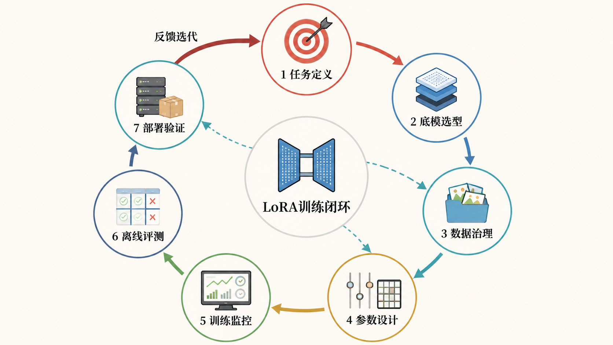

</div>

如上图所示，LoRA训练不是一次性的线性流水线。部署验证暴露的身份漂移、风格泄漏、延迟或兼容性问题，需要重新反馈到任务定义、数据治理和参数设计，形成可持续迭代的工程闭环。

<h2 id="q-013">面试问题：LoRA训练数据、Caption标签和长宽比分桶应该如何构造和设计？</h2>

**难度评分：⭐⭐⭐⭐ (4/5)  |  考察频率：⭐⭐⭐⭐⭐ (5/5)**

**Rocky认为，LoRA训练只需要小数据并不意味着数据工程不重要，恰恰相反：样本越少，每一张错误图片和每一个错误标签的影响越大**。LoRA数据设计应围绕“目标特征保持一致，非目标因素尽量解耦”展开。

人物LoRA需要身份稳定，但姿态、镜头、表情、服装、背景和光照应有适度变化；产品LoRA要覆盖关键结构和视角；风格LoRA应覆盖不同内容主体，避免模型把某个角色误当成风格组成部分。模糊、重度压缩、错误裁剪、水印和重复近邻样本会降低有效信息密度。

Caption不是越长越好。它要把希望推理时可控的属性显式写出来，把希望绑定到触发词的核心属性留下来。例如训练特定人物时，如果所有样本都穿黑衣但Caption从不描述黑衣，模型更容易把服装吸收到身份中；若每个微小细节都写入Caption，有限训练信号又会被过度拆散。

训练分辨率（training resolution）也会对LoRA训练效果产生较大的影响。如果显卡的显存允许，尽量选择大分辨率进行训练。**在较低的分辨率（比如512）下，训练数据中的很多细节特征将会被压缩丢失，甚至人物脸部特征的崩坏**。

当我们**使用大分辨率（比如768、1024等）训练时，LoRA模型能够学习到数据集中的精细特征和细节信息，图片的生成质感、美感以及精细度都会大大增强**。

同时如果基于**单一图像分辨率**（比如1:1）进行训练，就会导致当我们想要**生成不同尺寸分辨率的图像**（比如1:2、3:4、4:3、9:16、16:9等）时，非常容易生成结构崩坏的图像内容。

如下图所示，**为了让所有的数据满足特定的训练分辨率，会进行中心裁剪和随机裁剪等操作，这就导致图像中人物的重要特征缺失：**

<div align="center">

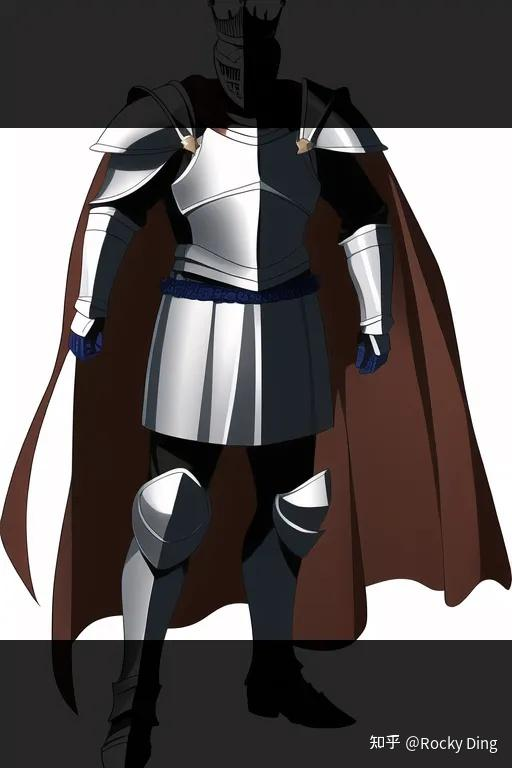

</div>

这上面这种情况下，我们训练的LoRA模型在生成骑士图像的时候，就会出现缺失的骑士特征。

与此同时，**裁剪后的图像还会导致图像内容与标签内容的不匹配**，比如原本描述图像的标签中含有“皇冠”，但是显然裁剪后的图像中已经不包含皇冠的内容了。

为了解决上述问题，长宽比分桶（Aspect Ratio Bucketing）训练策略孕育而生。**长宽比分桶训练策略的本质是多分辨率训练**，是在LoRA模型的训练过程中采用多分辨率而不是单一分辨率，多分辨率训练技术在传统深度学习时代的目标检测、图像分割、图像分类等领域非常有效，在AIGC时代终于有了新的内涵，在AIGC图像创作领域重新繁荣。

那么具体是如何使用长宽比分桶训练策略的呢？**主要通过数据分桶+多分辨率训练两者结合来实现。我们设计多个存储桶（Bucket），每个存储桶代表不同的分辨率（比如512x512、768x768、1024x1024等），并将数据存入对应的桶中。在LoRA训练时，随机选择一个桶，从中采样Batch大小的数据用于多分辨率训练。**

下面Rocky详细介绍一下完整的流程。

我们先对训练数据进行分桶，**这里包含存储桶设计和数据存储两个部分**。

首先我们需要设置存储桶（Bucket）的数量和每个存储桶代表的分辨率。我们定义最大的整体图像像素为1024x1024，最大的单边分辨率为1024。

这时我们以64像素为标准，设置长度为1024不变，宽度以1024为起点，根据数据集中的最小宽度设计存储桶（假设为512），具体流程如下所示：

```python
设置长度为 1024，设置宽度为 1024
设置桶数量为 0
当宽度大于数据集最小宽度 512 时:
    宽度 = 宽度 - 64 （ 960 ）
    那么 （ 960 ， 1024 ）作为一个存储桶的分辨率
    以此类推设计出长度不变，宽度持续自适应的存储桶
```

按照上面的流程，我们可以获得如下的存储桶：

```python
bucket 0 (512, 1024)
bucket 1 (576, 1024)
bucket 2 (640, 1024)
bucket 3 (704, 1024)
bucket 4 (768, 1024)
bucket 5 (832, 1024)
bucket 6 (896, 1024)
bucket 7 (960, 1024)
```

接着我们再以64像素为标准，设置宽度为1024不变，长度以1024为起点，根据数据集中的最小长度设计存储桶（假设为512），按照上面相同的规则，设计对应的存储桶：

```python
bucket 8 (1024, 512)
bucket 9 (1024, 576)
bucket 10 (1024, 640)
bucket 11 (1024, 704)
bucket 12 (1024, 768)
bucket 13 (1024, 832)
bucket 14 (1024, 896)
bucket 15 (1024, 960)
```

最后我们再将1024x1024分辨率作为一个存储桶添加到分桶列表中，从而获得完整的分桶列表：

```python
bucket 0 (512, 1024)
bucket 1 (576, 1024)
bucket 2 (640, 1024)
bucket 3 (704, 1024)
bucket 4 (768, 1024)
bucket 5 (832, 1024)
bucket 6 (896, 1024)
bucket 7 (960, 1024)
bucket 8 (1024, 512)
bucket 9 (1024, 576)
bucket 10 (1024, 640)
bucket 11 (1024, 704)
bucket 12 (1024, 768)
bucket 13 (1024, 832)
bucket 14 (1024, 896)
bucket 15 (1024, 960)
bucket 16 (1024, 1024)
```

完成了分桶的数量与分辨率设计，**我们接下来要做的是将数据集中的图片存储到对应的存储桶中。**

那么，具体是如何将不同分辨率的图片放入对应的桶中呢？

我们首先计算存储桶分辨率的长宽比，对于数据集中的每个图像，我们也计算其长宽比。这时我们将长宽比最接近的数据与存储桶进行匹配，并将图像存入对应的存储桶中，下面的计算过程代表寻找与数据长宽比最接近的存储桶：

```math
\mathrm{image\_bucket}
=
\arg\min_{b\in\mathcal{B}}
\left|\mathrm{bucket\_aspects}(b)-\mathrm{image\_aspect}\right|
```

**如果图像的长宽比与最匹配的存储桶的长宽比差异依然非常大，则从数据集中删除该图像。所以我们最好在数据分桶前将数据进行精细化筛选，增加数据的利用率。**

当 `image_aspect` 与 `bucket_aspects` 完全一致时，可以直接将图片放入对应的存储桶中；当 `image_aspect` 与 `bucket_aspects` 不一致时，需要对图片进行中心裁剪，获得与存储桶一致的长宽比，再放入存储桶中。中心裁剪的过程如下图所示：

<div align="center">

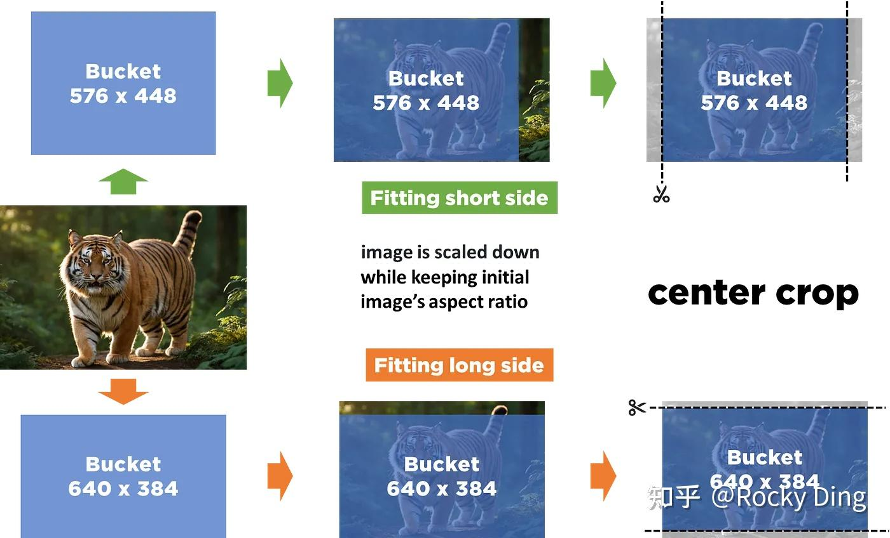

</div>


总的来水，对于图像 $I$ 的宽高比 $a_I$ 和候选Bucket的宽高比 $a_k$，可以选择最接近的Bucket：

$$
k^{*}=\arg\min_{k}\left|a_k-a_I\right|
$$

随后只进行有限缩放和裁剪，并在同一Batch内使用相同空间尺寸。工程上还要让宽高满足VAE和网络下采样倍数要求，并控制每个Bucket的像素面积，避免极端长图把显存拉爆。

由于我们以经做了精细化的存储桶设计，所以出现**长宽比不匹配时的图像裁剪比例一般小于0.033，只去除了小于32像素的实际图像内容，所以对训练影响不大**。

在完成数据的分桶存储后，接下来Rocky再讲解一下在训练过程中如何基于存储桶实现多分辨率训练过程。

在LoRA模型的训练过程中，我们需要从刚才设计的16个存储桶中**随机采样一个存储桶**，并且**确保每次能够提供一个完整的Batch数据**。当遇到选择的存储桶中数据数量不够Batch大小的情况，需要进行**特定的数据补充策略**。

为了解决上述的问题，**我们需要维护一个公共桶（remaining bucket）**，其他存储桶中的数据量不足Batch大小时，将剩余的数据全部放到这个公共桶中。在每次迭代的时候，如果是从常规存储桶中取出数据，则训练分辨率调整成存储桶对应的分辨率。如果是从公共桶中取出，则训练分辨率调整成设计分桶时的基础分辨率，也就是1024x1024。

同时**我们将所有的存储桶根据桶中数据量进行权重设置，具体的权重计算方式为这个存储桶的数据量除以所有剩余存储桶的数据量总和**。如果不通过权重来选择存储存储桶，数据量小的存储桶会在训练过程的早期就被用完，而数据量最大的存储桶会在训练结束时仍然存在，**这就会导致存储桶在整个训练周期中采样不均衡问题**。通过按数据量加权选择桶可以避免这种情况。


<h2 id="q-014">面试问题：Rank、Alpha、学习率、训练步数和训练目标模块等关键参数应该如何设置？</h2>

**难度评分：⭐⭐⭐⭐ (4/5)  |  考察频率：⭐⭐⭐⭐⭐ (5/5)**

总的来说，不存在适用于所有底模型和任务的固定参数表。Rank、Alpha、学习率、训练步数和目标模块共同决定了LoRA模型的效果，所以我们必须根据实际情况，进行联合调节。

<div align="center">

| 参数 | 本质作用 | 过小的常见表现 | 过大的常见表现 |
|---|---|---|---|
| Rank $r$ | 增量子空间容量 | 欠拟合、细节不足 | 文件变大、过拟合风险上升 |
| Alpha $\alpha$ | 训练增量缩放 | 更新弱或收敛慢 | 更新过强、对学习率更敏感 |
| 学习率 | 单步更新幅度 | 学习慢、预算内不收敛 | 震荡、失真、遗忘底模能力 |
| 训练步数 | 数据被优化的总次数 | 概念不稳定 | 构图记忆、背景泄漏 |
| 目标模块 | 额外特征注入位置 | 表达能力不足 | 副作用和存储成本增加 |

</div>

接下来，Rocky对每个关键参数的作用与原理都展开讲讲。

**Rank（network_dimension）是LoRA模型的特征维度参数，也就是LoRA进行低秩分解中的秩。**

那么我们该怎么设置Rank这个参数呢？

在这里Rocky也向大家分享一些经验：

1. 当我们使用的训练集内容比较复杂抽象时，我们可以适当设置高Rank，提升LoRA模型的学习能力。
2. Rank参数并不是设置的越高越好。设置高Rank有助于LoRA模型学习到更多细节特征，但整体上模型的收敛速度变慢，需要的训练时间更长，同时也更容易过拟合。
3. 当我们训练高分辨率（1024x1024）的训练集时，可以设置高Rank，比如说128。
4. 训练人物时，可以设置Rank = 32-64；训练风格时，可以设置Rank = 64-128；训练抽象概念时，可以设置Rank = 128-192或者更高。
5. 通常来说，我们设置Rank = 128能够兼顾到各个情况，算是一个比较平均的值，有效减少过拟合与欠拟合发生的概率。当Rank = 128时，SD LoRA保存下来的文件大小为144MB。

alpha参数将LoRA模型权重进行放缩从而防止下溢并稳定学习， 我们可以将其设置为Rank参数的一半。

使用alpha参数后，LoRA模型的参数 $W = W_{in} \times alpha/dim$ 。alpha参数设置的越大，LoRA模型越倾向于拟合更多的细节，学习速率也越快。在原生LoRA模型中可以取值[1,dim]，在LoCon或者LoHa模型中，推荐取值 $[\frac{dim}{2},dim]$ 。

下面是alpha参数构建代码：

```python
self.scale = alpha / self.lora_dim
def forward(self, x):
        if self.region is None:
            return self.org_forward(x) + self.lora_up(self.lora_down(x)) * self.multiplier * self.scale
```

在学习率方面，其与底模型架构、训练目标模块、优化器、Batch Size和数据量共同确定。Text Encoder通常比DiT、U-Net等扩散模型Backbone更敏感，若开放训练，一般使用更低学习率或更短训练阶段。Rank增大后也不一定要同步增大学习率；更高容量本身已经提高拟合能力。

**根据开源生态的经验，在我们训练SD/SDXL LoRA时，将学习率设置为1e-4就够了。**

同时我们还可以**针对LoRA架构中的A矩阵和B矩阵使用不同学习率**。

$$A矩阵的学习率  = B矩阵的学习率 \times ratio$$ 

这样可以达到加速收敛，训练速度提升 1.5-2倍；并且Loss下降更快，提升整体训练效果。

关于训练步数，可以由重复次数、Epoch和Batch Size推导：

$$
\text{steps per epoch}=\left\lceil\frac{N\times R}{B\times G}\right\rceil
$$

其中 $N$ 是图片数， $R$ 是重复次数， $B$ 是单设备Batch Size， $G$ 是梯度累积步数；多卡训练还要计入设备数。

**考虑到我们训练LoRA模型时一般数据量级不会太大（1-300张为主），所以我们可以设置Batch Size为2-6即可。**

**通常来说，我们在训练LoRA模型时，epoch的设置能够保证数据集中的每张图片训练100步即可。**

一个稳妥的调参顺序是：先固定优质数据和底模型，用小到中等Rank建立基线；再调学习率与训练预算；最后才扩大目标模块或Rank。如果第一轮就同时改变所有参数，最终即使效果变好，也无法知道收益来自哪里。

<h2 id="q-015">面试问题：如何判断LoRA欠拟合、过拟合、概念泄漏和底模型绑定？</h2>

**难度评分：⭐⭐⭐⭐ (4/5)  |  考察频率：⭐⭐⭐⭐⭐ (5/5)**

训练Loss只能说明当前噪声预测目标在训练样本上是否下降，不能直接说明LoRA是否可用。生成任务必须通过固定验证面板观察错误类型。

- **欠拟合**：目标特征弱、不同种子不稳定、需要极高权重才能出现LoRA训练的特征。可能原因包括容量不足、学习率过低、步数不足、Caption稀释或底模本身缺少相关先验。
- **过拟合**：训练样本还原很好，但换Prompt就复现固定构图、背景、服装或表情；权重稍高便出现锐化、色块和结构崩坏。
- **概念泄漏**：触发人物时总带出训练背景或服装，触发风格时总出现训练主体。它通常来自数据共现和Caption缺失，而不只是训练步数过多。
- **底模型绑定**：在训练底模型上表现好，换同架构其他底模型便身份或风格崩溃。原因可能是LoRA利用了训练底模型独有的特征方向。
- **触发词污染**：普通语义词被新概念占用，导致未加载或低权重下的文本理解异常。应选择不易与自然词义冲突的Token组合并做无触发词对照。

验证时至少固定四类Prompt：训练分布内、训练分布外、属性解耦、多概念组合。每类使用多个种子，并在多个权重档位上比较。人物任务还要将“身份相似度”和“图像美感”分开评估，因为更漂亮不等于更像，像也不等于可编辑。

面对问题时也要按因果顺序修复：先检查数据和标注，再检查底模与目标模块，最后调整Rank、学习率和步数。只靠降低LoRA权重掩盖过拟合，会把训练缺陷转移到每一次推理配置中。

<h2 id="q-016">面试问题：LoRA训练中有哪些显存与稳定性优化手段？</h2>

**难度评分：⭐⭐⭐⭐ (4/5)  |  考察频率：⭐⭐⭐⭐ (4/5)**

LoRA技术本身已经节省了大量的训练显存，但是在消费级显卡、高分辨率Latent、多个Text Encoder训练等场景可能成为瓶颈。常见优化方式如下：

1. **混合精度**：如果算力资源非常有限，我们在训练LoRA模型时可以尝试开启FP8精度训练。FP8比FP16能够再节省约30%显存，适用于在消费级24GB显卡上跑更大的batch size，同时精度损失极小。
2. **高效Attention**：通过Flash Attention、PyTorch SDPA、xFormers等外部工具可减少Attention中间张量的显存占用。
3. **梯度累积（gradient_checkpointing）**：**开启梯度累积能够减少显存占用**，从而能够设置更大的Batch Size，但是会减慢训练速度。开启梯度累积后，逐步更新模型权重而不是在训练期间一次更新所有模型权重（用多个Micro-Batch近似更大有效Batch）。
4. **低比特优化器**：8-bit AdamW等可降低优化器状态显存，但需要验证数值稳定性和平台支持。
5. **缓存VAE或文本特征**：在数据增强与文本编码器冻结条件满足时，可预计算latent或文本嵌入；若训练过程需要随机裁剪、动态Caption或训练Text Encoder，则缓存策略会受限。

学习率Warmup、梯度裁剪、EMA式监控、定期Checkpoint保存和训练阶段性验证测试用于提升训练稳定性。调度器不是越复杂越好；小数据LoRA中，常数加Warmup、余弦衰减都可以成立，关键是让总训练预算、初始学习率和验证曲线匹配。

**Rocky认为，LoRA训练工程上的核心判断是：显存优化不能以破坏数据随机性、训练目标或可复现性为代价。先确认瓶颈来自参数、激活、Attention还是数据管道，再选择手段。**

<h1 id="q-017">4.在AIGC图像生成领域中，LoRA有哪些主流变体？介绍一下它们的核心原理</h1>

<h2 id="q-018">面试问题：LoCon和LoHa在原生LoRA上分别做了哪些优化？</h2>

**难度评分：⭐⭐⭐⭐ (4/5)  |  考察频率：⭐⭐⭐⭐ (4/5)**

LoCon和LoHa都常见于LyCORIS生态，但它们解决的是不同问题：LoCon扩大低秩适配的模块类型，LoHa提高相同低Rank下更新矩阵的表达能力。

LoCon（LoRA for Convolution Network）模型是LoRA技术在卷积神经网络（CNN）中的扩展与适配，核心是将低秩分解思想从Transformer的线性层（如 Attention 的 QKV 变换、全连接层）迁移到卷积层，实现卷积模型的参数高效微调（PEFT）。理论上能够实现更细粒度的生成内容的控制。

对于卷积核 $W\in\mathbb{R}^{C_{out}\times C_{in}\times k\times k}$，可以用一个 $k\times k$ 的降维卷积和一个 $1\times1$ 的升维卷积构造增量：

$$
\Delta W\approx W_{up}*W_{down}
$$

其可训练参数量近似为：

$$
rC_{in}k^2+C_{out}r
$$

相比直接训练 $C_{out}C_{in}k^2$ 个卷积参数，LoCon仍然保持参数效率，同时能更直接地适配局部纹理与空间特征。

下图中红色框部分代表LoCon模型在LoRA模型基础上额外增加的训练部分：

<div align="center">

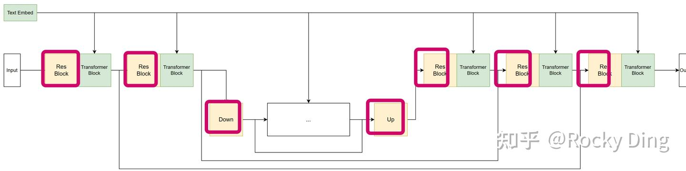

</div>

LoRA模型对卷积层是使用1x1卷积进行降维，而LoCon模型将1x1卷积切换成正常尺寸的卷积进行降维，降维到预设的Rank（lora_dim）。

我们来回顾一下传统深度学习领域中卷积的计算过程：

<div align="center">

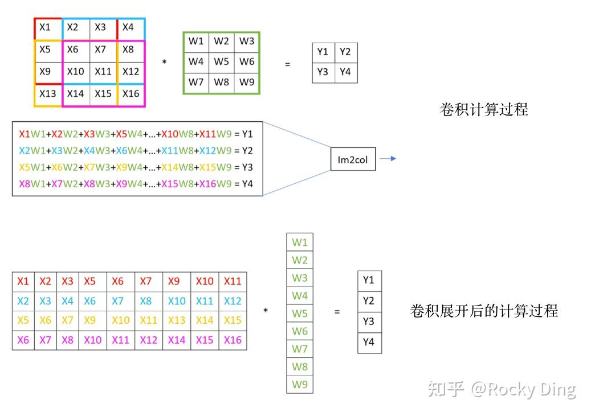

</div>

接下来我们看看使用LoCon技术后，SD系列模型的卷积层权重的变化：

$$
\begin{aligned}
& Conv(in, out, ksize, padding, stride) \\
\rightarrow & \ Conv(rank, out, 1) \circ Conv(in, rank, ksize, padding, stride)
\end{aligned}
$$

使用了LoCon技术后，SD系列模型+LoCon模型的FLOPs变化如下所示。设输入通道数为 $`C_{\mathrm{in}}`$，输出通道数为 $`C_{\mathrm{out}}`$，LoRA Rank为 $`r`$，方形卷积核边长为 $`K`$，输出特征图的高度和宽度分别为 $`H_{\mathrm{out}}`$、$`W_{\mathrm{out}}`$，并忽略Bias与常数系数，则原始卷积的计算量为：

```math
\mathrm{FLOPs}_{\mathrm{before}}
=
C_{\mathrm{out}}C_{\mathrm{in}}K^2H_{\mathrm{out}}W_{\mathrm{out}}
```

LoCon将原始卷积拆成一个 $`K\times K`$ 的降维卷积和一个 $`1\times1`$ 的升维卷积，因此计算量变为：

```math
\mathrm{FLOPs}_{\mathrm{after}}
=
\left(rC_{\mathrm{in}}K^2+C_{\mathrm{out}}r\right)H_{\mathrm{out}}W_{\mathrm{out}}
```

同时训练时的参数数量也发生了变化：

```math
\mathrm{Params}_{\mathrm{before}}
=
C_{\mathrm{out}}C_{\mathrm{in}}K^2
```

```math
\mathrm{Params}_{\mathrm{after}}
=
rC_{\mathrm{in}}K^2+rC_{\mathrm{out}}
```

LoCon在实验中得出可以比LoRA模型在训练中更快地拟合（例如，**LoCon模型在训练600步可以达到LoRA模型训练800步的生成性能**）。这表明LoCon模型可能在训练角色或特定特征上更为高效。另外，将LoCon模型应用于人物角色的风格化上也表现不错。

<div align="center">

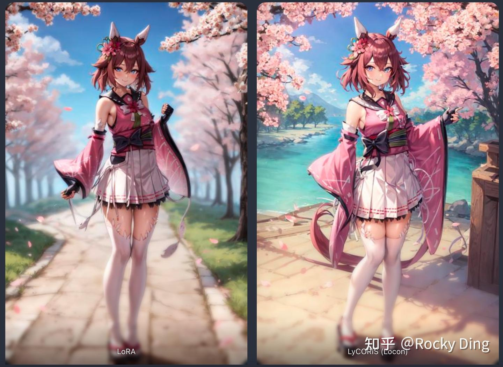

</div>

**LoCon推荐训练参数设置：dim <= 64，alpha = 1 (或者更小，比如说0.3)**

下面我们看看LoCon模型和LoRA模型在处理卷积层的具体区别：

LoRA模型处理卷积层的代码：

```python
if org_module.__class__.__name__ == 'Conv2d':
      in_dim = org_module.in_channels
      out_dim = org_module.out_channels
      self.lora_down = torch.nn.Conv2d(in_dim, lora_dim, (1, 1), bias=False)
      self.lora_up = torch.nn.Conv2d(lora_dim, out_dim, (1, 1), bias=False)
else:
      in_dim = org_module.in_features
      out_dim = org_module.out_features
      self.lora_down = torch.nn.Linear(in_dim, lora_dim, bias=False)
      self.lora_up = torch.nn.Linear(lora_dim, out_dim, bias=False)
```

LoCon模型处理卷积层的代码：

```python
if org_module.__class__.__name__ == 'Conv2d':
            # For general LoCon
            in_dim = org_module.in_channels
            k_size = org_module.kernel_size
            stride = org_module.stride
            padding = org_module.padding
            out_dim = org_module.out_channels
            self.lora_down = nn.Conv2d(in_dim, lora_dim, k_size, stride, padding, bias=False)
            self.lora_up = nn.Conv2d(lora_dim, out_dim, (1, 1), bias=False)
else:
            in_dim = org_module.in_features
            out_dim = org_module.out_features
            self.lora_down = nn.Linear(in_dim, lora_dim, bias=False)
            self.lora_up = nn.Linear(lora_dim, out_dim, bias=False)
```

上面讲到的LoCon主要是对LoRA进行工程应用层面的改造优化（将LoRA的应用扩展到SD/FLUX系列模型的卷积层），接下来我们要讲的**LoHa模型主要是针对LoRA的低秩矩阵分解理论层面进行优化**。

LoHa (LoRA with Hadamard Product)是在LoRA的基础上，使用了哈达玛积（Hadamard Product）代替原生LoRA中的矩阵点乘，将秩的维度从2R扩展到 $R^{2}$，让LoHa理论上在相同的参数配置下能学习到更多的数据分布信息。

<div align="center">

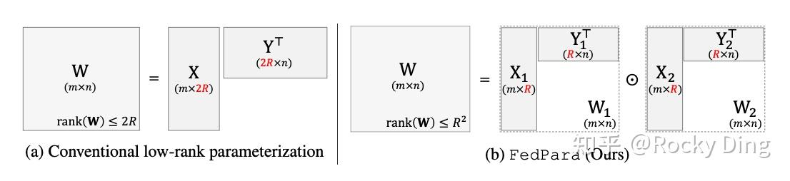

</div>

读者朋友可能对哈达玛积不太熟悉，Don't Worry。我们先来了解一下什么是哈达玛积：**哈达玛积（Hadamard Product），又称逐元素乘积（element-wise product），是线性代数中的一种矩阵运算。它与标准矩阵乘法不同，哈达玛积是对两个相同大小的矩阵的对应元素进行乘积运算。**

给定两个相同大小的矩阵 $A$ 和 $B$ ，它们的哈达玛积 $C$ 定义如下：

$$C = A \circ B$$

其中 $C$ 的每个元素 $c_{ij}$ 计算为：

$$c_{ij} = a_{ij} \times b_{ij}$$

例如，假设有以下两个矩阵 $A$ 和 $B$：

$$A = \begin{bmatrix}
1 & 2 \\
3 & 4
\end{bmatrix}, \quad
B = \begin{bmatrix}
5 & 6 \\
7 & 8
\end{bmatrix}$$

它们的哈达玛积 $C$ 为：


$$C = A \circ B = \begin{bmatrix}
1 \times 5 & 2 \times 6 \\
3 \times 7 & 4 \times 8
\end{bmatrix}
= \begin{bmatrix}
5 & 12 \\
21 & 32
\end{bmatrix}$$

秩的维度小于2R从上面的公式中可以看到，**哈达玛积通过对两个矩阵的逐元素乘积，能够有效地对矩阵进行特征组合、权重计算和信息传播，增强AI模型的表达能力和计算效率**。

在LoHa模型中，应用了哈达玛积后，低秩分解后的形式就转变成如下所示的公式：

$$
\Delta W = (X_1 Y_1^T) \odot (X_2 Y_2^T)
$$

其中需要满足条件：

$$
rank(\Delta W) \leq R^2
$$

可以看到比起原生LoRA的秩的维度小于 $2R$，LoHa将秩的维度扩展到 $R^2$，**解决了原生LoRA受到低秩的限制**。这个思路不仅仅能够用在AIGC图像创作领域，在AIGC其他领域中都可以借鉴与迁移。

这意味着LoHa可能以较小Rank表达比单个 $BA$ 更复杂的更新，但它并不保证实际有效秩一定达到 $r^2$，也不意味着在所有任务上都优于LoRA。

**LoHa训练经验分享：**

1. **LoHa推荐训练参数设置：dim <= 32，alpha = 1 (or lower)**
2. LoHa不适合训练特征不太明确的画风，同时也比较难收敛，**LoHa通常需要比LoRA和LoCon更多的训练步数才能达到较好的效果**。

选择时可以这样判断：若任务需要适配卷积层中的局部视觉特征，LoCon更直接；若原生LoRA在较低Rank下容量不足，可尝试LoHa。两者都应通过相同数据、训练预算和验证矩阵做消融，而不是根据社区经验参数直接下结论。

<h2 id="q-019">面试问题：DoRA、B-LoRA等方法有哪些创新点？</h2>

**难度评分：⭐⭐⭐⭐ (4/5)  |  考察频率：⭐⭐⭐ (3/5)**

DoRA和B-LoRA虽然都使用LoRA作为基础组件，但它们解决的不是同一个问题：**DoRA回答“低秩更新怎样更接近全参数微调”，B-LoRA回答“同一张参考图中的内容和风格怎样分别写入模型”。** 前者主要改进权重参数化，后者主要改进扩散模型中的适配位置和使用方式。

### DoRA：把“更新方向”和“更新幅值”拆开学习

原生LoRA把任务增量写成：

$$
W'=W_0+\Delta W=W_0+BA
$$

这种写法很高效，但有一个容易被忽略的限制：同一个低秩增量 $BA$ 同时承担两件事，一方面改变权重向量的方向，另一方面改变权重向量的长度，也就是幅值。对于小规模任务，这种耦合通常够用；当任务更复杂或Rank较低时，LoRA可能必须用同一个低秩空间同时解决两个不同的优化问题，导致表达能力与全参数微调之间出现差距。

DoRA先对全参数微调（Full Fine-tuning，FT）和LoRA的权重变化进行分析。它观察的不是“参数量越大越好”，而是每个权重向量在训练后发生了多少**方向变化**和**幅值变化**。论文中的实验显示，LoRA的幅值变化与方向变化更容易呈现同向耦合，而全参数微调的变化关系更灵活。DoRA的目标，就是让参数高效微调也具备这种更细粒度的调节能力。

<div align="center">

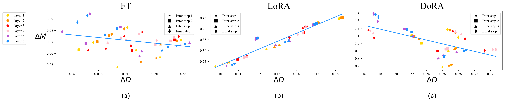

</div>

如上图所示。横轴表示方向差异 $\Delta D$，纵轴表示幅值差异 $\Delta M$。论文分析中，LoRA的点云更接近正相关趋势，而DoRA的更新关系更接近全参数微调的灵活变化。这里要注意证据边界：这张图说明的是权重更新模式的差异，不是直接证明所有扩散图像任务都必然提升相同幅度。

DoRA把预训练权重分解成“幅值向量”和“方向矩阵”。在论文的矩阵记号下，可以写成：

$$
W_0=m_0\frac{V_0}{\left\|V_0\right\|_c}
$$

其中 $m_0$ 保存每个权重向量的幅值，$V_0$ 保存方向，$`\left\|\cdot\right\|_c`$ 表示按列进行归一化。DoRA冻结预训练方向 $`V_0`$ 的主体，只用LoRA低秩分支学习方向增量，同时让幅值向量 $m$ 独立训练：

$$
W'=m\frac{V_0+BA}{\left\|V_0+BA\right\|_c}
$$

原生LoRA像是在一根旋钮上同时调“形状方向”和“强度大小”；DoRA把它拆成两个旋钮，一个负责改变特征方向，另一个负责调整特征强弱。人物身份、画风和材质等任务不再必须用同一组低秩参数同时承担这两类变化。

DoRA的主要收益包括：

1. **表达能力更细**：低Rank下，方向与幅值可以分别适配，减少“为了改变一点风格强度，却把人物结构也带偏”的情况。
2. **训练行为更接近全参数微调**：DoRA不是简单增大LoRA的Rank，而是改变更新的坐标系，让更新方向与幅值拥有更明确的职责。
3. **推理阶段可以合并**：训练完成后，DoRA权重可以合并回底模，不会引入额外推理延迟。动态加载时仍然要考虑适配器分支和框架实现开销。
4. **低Rank场景更值得尝试**：在扩散模型实验中，DoRA在较低Rank时更容易体现相对LoRA的质量差异；但这不是固定的跨模型结论。

DoRA会增加幅值向量等少量可训练参数，并在训练时引入权重归一化相关计算，因此不能简单理解为“完全免费的LoRA”。DoRA论文的主体实验覆盖LLaMA、LLaVA、VL-BART等语言和视觉语言任务；迁移到Stable Diffusion、SDXL或FLUX时，需要使用匹配的实现和重新调参。NVIDIA官方实现也将扩散模型DoRA训练标注为实验性能力，并提示LoRA可能收敛更快、DoRA需要更低学习率或更长训练预算。

从AIGC工程角度，DoRA适合在以下情况中作为LoRA的第二条基线：人物或风格LoRA在低Rank下细节不足；降低Rank后希望维持质量以减小适配器文件；普通LoRA需要很高权重才能生效，但一旦增大权重又带来结构污染。最终是否采用，必须用相同数据、底模、训练步数和验证Prompt做对照，不能只看论文中的语言模型分数。

### B-LoRA：让一张参考图中的内容和风格分开存储

B-LoRA的出发点更贴近AIGC图像创作领域。我们经常希望把一张图中的“内容”与“风格”分开：例如保留一个雕塑的形状，把它变成金色；保留一个人物的姿态和身份，把画面改成水彩、铅笔或赛博朋克风格。普通DreamBooth LoRA或全量LoRA往往把主体、背景、颜色和笔触一起记住，最后出现两个问题：

- 训练得到的LoRA既包含内容又包含风格，不能单独控制；
- 只用一张图训练时容易过拟合，换Prompt后仍然复现原来的主体和背景，或者把风格图中的对象带入生成结果。

B-LoRA没有继续增大Rank，而是先分析SDXL不同Transformer Block对生成结果的影响。论文在SDXL中测试了多个中间Block：通过只在某一个Block注入不同Prompt，观察它对生成图像内容和颜色的影响。论文的分析将Block 2、Block 4视为更偏内容的层，将Block 5视为更偏颜色/风格的层；随后选择Block 4和Block 5联合训练两个LoRA。

<div align="center">

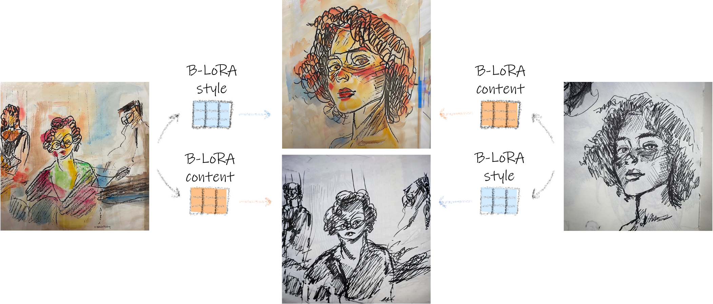

</div>

上图直观展示了同一张输入图像如何得到两个独立的适配器：蓝色的B-LoRA更偏风格，橙色的B-LoRA更偏内容。这里的“偏内容”和“偏风格”不是人工把每个参数贴上标签，而是通过SDXL层级分析和两个Block的联合训练得到的隐式分离结果。

B-LoRA的关键不是“训练两个LoRA”这么简单，而是三个条件同时成立：

1. **只选择特定Block**：论文在SDXL中重点训练 $\Delta W^4$ 和 $\Delta W^5$，而不是把全部11个Transformer Block都打开。
2. **两个Block联合训练**：如果分别独立训练两个Block，它们可能都去记忆完整图像；联合优化才更容易形成一个内容分支和一个风格分支的互补关系。
3. **使用通用训练Prompt**：论文使用类似 `A [v]` 的通用Prompt，避免Caption提前告诉模型哪些信息属于内容、哪些信息属于风格，让分离更多依赖底模不同层级的表示偏置。

论文的单图训练设置包括SDXL底模、冻结模型权重与Text Encoder、Rank为64、1000步优化；在论文实验环境中单张图约需10分钟A100。这里的数字是论文实验配置，不应直接当成所有SDXL或FLUX训练任务的推荐值。

训练完成后，B-LoRA把同一张图的两个增量分别记为内容分支 $`\Delta W_c^4`$ 和风格分支 $`\Delta W_c^5`$。它们可以独立或组合使用：

<div align="center">

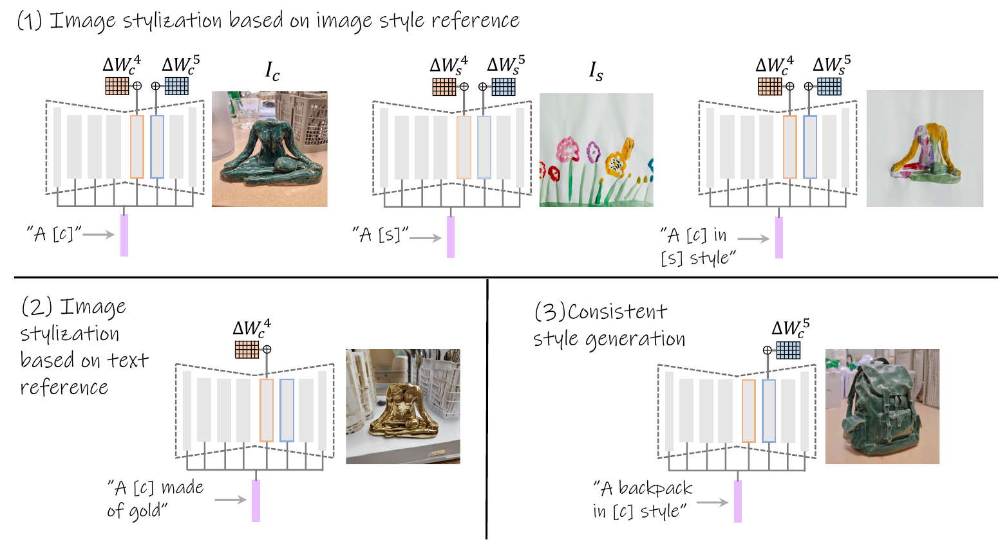

</div>

根据论文的应用流程，可以把B-LoRA理解为三种创作方式：

1. **参考图到参考图的风格迁移**：从内容图像中取 $`\Delta W_c^4`$，从风格图像中取 $`\Delta W_s^5`$，把二者写入同一个SDXL底模，使用类似 `A [c] in [s] style` 的Prompt生成结果。内容分支负责“保留什么”，风格分支负责“用什么视觉语言表达”。
2. **文本控制的图像风格化**：只加载内容图像的 $`\Delta W_c^4`$，再通过文本Prompt指定新风格。这样可以保留主体概念，同时让文字控制外观变化。
3. **一致风格生成**：只加载风格分支 $`\Delta W_s^5`$，再用不同文本Prompt生成不同主体，使同一套视觉风格迁移到多个对象上。

这套方法对AIGC创作工作流的意义，是把原来“一份LoRA同时绑定主体和画风”的资产，拆成可以重复组合的两类资产。它更像把“内容适配器”和“风格适配器”放到不同的网络插槽中，而不是把两个完整LoRA在所有层上直接相加。

B-LoRA也有明确边界。第一，它的层级结论来自SDXL的实验分析，不能直接移植到SD 1.5、SD3或FLUX；换底模后，内容和风格可能位于不同Block，需要重新做层级消融。第二，颜色经常被方法归入风格，但某些对象的颜色恰恰是身份的一部分，强行分离可能损害主体识别。第三，单张图中的背景、道具和主体容易互相泄漏，复杂场景包含大量对象时，内容保持会下降。第四，它解决的是图像风格化与适配器组织问题，不是通用的身份保持、姿态控制或区域编辑方案。

<div align="center">

| 方法 | 主要解决的问题 | 典型AIGC图像场景 | 需要警惕的边界 |
|---|---|---|---|
| 原生LoRA | 用少量参数注入人物、风格或概念 | 人物定制、画风学习、产品概念 | 内容与风格容易绑定，低Rank容量有限 |
| DoRA | 让低秩更新分别调整方向与幅值 | 低Rank人物/风格适配、质量基线 | 扩散模型迁移仍需重新调参，训练成本略增 |
| B-LoRA | 将单图内容与风格分到不同适配位置 | 参考图风格迁移、文本风格化、一致风格生成 | 依赖SDXL层级，复杂场景和颜色身份会泄漏 |

</div>

最终可以这样判断：**DoRA是在“参数怎么更新”这一层改进LoRA，B-LoRA是在“不同视觉信息写入哪里、推理时如何组合”这一层改进LoRA。** DoRA更像通用的参数化增强，可以作为人物、风格和领域LoRA的训练基线；B-LoRA更像面向SDXL图像风格化的专用工作流，适合需要把内容和风格拆开复用的场景。

变体不是越新越好。生产选择要比较同等数据和预算下的质量、文件大小、训练稳定性、推理框架支持、融合能力和许可证。**跨周期真正有价值的不是记住DoRA或B-LoRA的名字，而是能判断问题究竟出在更新容量、权重参数化、注入位置，还是内容与风格的资产组织方式。**


<h2 id="q-020">面试问题：LCM-LoRA与人物/风格LoRA有什么本质区别？</h2>

**难度评分：⭐⭐⭐⭐ (4/5)  |  考察频率：⭐⭐⭐⭐ (4/5)**

**人物/风格LoRA学习的是“生成什么”，LCM-LoRA学习的是“用几步、沿什么轨迹生成”。** 前者把人物身份、服装、画笔质感或构图偏好写入模型的参数增量，属于语义或视觉能力适配；后者把原本需要几十次网络调用的扩散求解过程蒸馏成少步一致性映射，属于采样器/推理行为适配。两者都叫LoRA，是因为最终都可以表示成低秩矩阵，但训练目标、推理依赖和失败模式完全不同。

<div align="center">

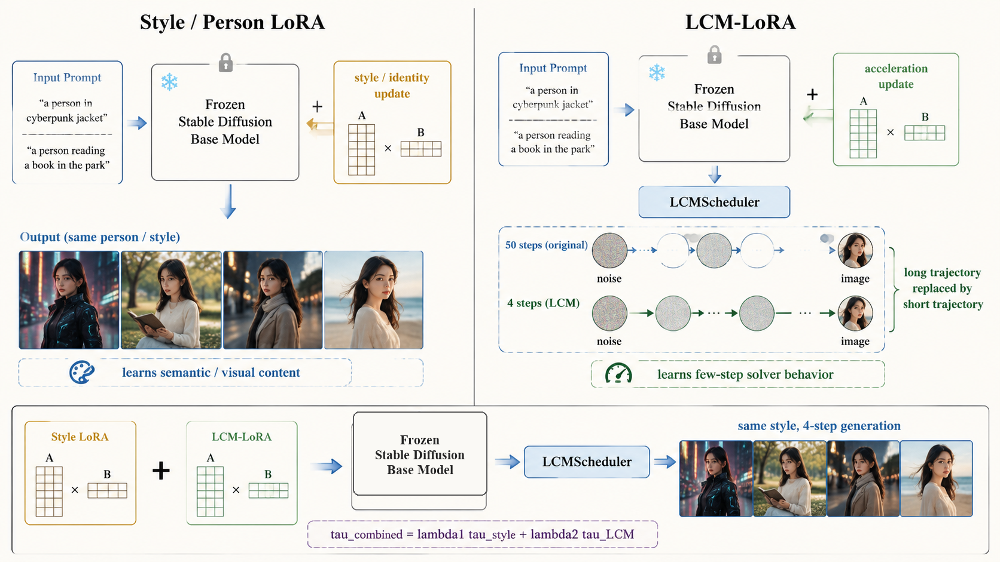

</div>

### 先分清两种“增量”：语义增量与求解器增量

人物LoRA可以从十几张或几十张同一人物图片中学习脸部比例、发型、服装和身份特征；风格LoRA则从画作或设计稿中学习色彩、笔触、线条和构图习惯。它们通常通过提示词触发，例如输入 `a portrait of <token>` 或指定画风，目标是让模型在原有生成能力上增加一块稳定的视觉分布。换句话说，**没有人物或风格LoRA时，模型不知道你要复现哪一套视觉特征；加载后，模型知道“画面应该长什么样”。**

LCM-LoRA不负责记住某个新人物，也不负责把照片变成水彩。它是在已有扩散模型上做一致性蒸馏，学习如何把一个较高噪声状态直接映射到同一条概率流常微分方程（PF-ODE）轨迹上的低噪声状态。**没有风格LoRA时，LCM-LoRA仍然只负责加速底模；没有LCM-LoRA时，人物/风格LoRA仍然可以用普通DPM-Solver++或Euler等采样器生成，只是需要更多步数。**

| 对比维度 | 人物/风格LoRA | LCM-LoRA |
|---|---|---|
| 主要回答 | 画谁、画成什么视觉风格 | 如何更快完成去噪生成 |
| 学习对象 | 数据集对应的语义、身份、纹理或风格分布 | 教师扩散模型的少步求解行为与一致性映射 |
| 是否需要触发词 | 经常需要，用于激活特定概念 | 通常不需要新的概念词，关键是匹配调度器和步数 |
| 推理依赖 | 底模、提示词、LoRA权重、普通采样器 | 兼容底模、LCM-LoRA权重、`LCMScheduler`、少步配置 |
| 常见失败 | 身份漂移、画风泄漏、过拟合、提示词绑定 | 细节损失、构图不稳、步数/CFG不匹配、底模不兼容 |

表：两类LoRA都改变权重，但一个改变能力内容，一个改变求解路径。

### LCM到底蒸馏了什么：把多步扩散变成少步一致性映射

普通扩散模型在推理时从噪声 $`z_T`$ 开始，经过很多个时间步逐渐得到 $`z_0`$。每一步都要调用一次去噪网络，采样步数越多，通常越容易保住细节，但延迟和显存访问也随之增加。LCM把带有Classifier-Free Guidance的反向扩散过程看作一个增强的PF-ODE，并训练一个学生网络，使不同噪声时间点的状态经过少量跳步后落到相同的解轨迹附近。

在简化记号下，LCM的一致性蒸馏目标可以写成：

```math
\mathcal{L}_{\mathrm{LCM}}=\mathbb{E}\left[d\left(f_{\theta}\left(z_{t_{n+k}},c,t_{n+k}\right),\mathrm{sg}\left(f_{\theta^-}\left(\hat{z}_{t_n},c,t_n\right)\right)\right)\right]
```

其中，$`f_{\theta}`$是正在训练的学生网络，$`f_{\theta^-}`$是使用指数移动平均（EMA）更新的目标网络，$`\hat{z}_{t_n}`$由教师扩散模型或ODE求解器从较高噪声时间点 $`t_{n+k}`$ 推进到较低噪声时间点 $`t_n`$，$`d(\cdot,\cdot)`$衡量两个预测结果的一致性，$`\mathrm{sg}(\cdot)`$表示停止梯度。训练的重点不是让学生记住训练图片，而是让它在多个时间点给出彼此一致的终点预测。

LCM-LoRA进一步把学生网络的可训练部分限制在低秩矩阵上。对某个被注入的权重矩阵 $`W_0`$，其更新形式为：

```math
W=W_0+\Delta W_{\mathrm{LCM}},\qquad \Delta W_{\mathrm{LCM}}=B_{\mathrm{LCM}}A_{\mathrm{LCM}}
```

底模参数 $`W_0`$保持冻结，只训练 $`A_{\mathrm{LCM}}`$ 和 $`B_{\mathrm{LCM}}`$。因此，LCM-LoRA不是重新训练一个“快速版人物模型”，而是用较小的加速向量逼近教师模型的少步去噪行为。LCM-LoRA技术报告在SD 1.5、SSD-1B和SDXL上进行蒸馏，并报告4步采样结果；这也解释了为什么同一个思想可以迁移到多个Stable Diffusion家族模型，却不能被理解成对任意扩散架构都无条件通用。

### 为什么LCM-LoRA可以和人物/风格LoRA叠加

人物/风格LoRA通常记为 $`\Delta W_{\mathrm{style}}`$，LCM-LoRA记为 $`\Delta W_{\mathrm{LCM}}`$。在目标模块和底模兼容时，组合后的权重可以近似写为：

```math
W_{\mathrm{combined}}=W_0+\lambda_s\Delta W_{\mathrm{style}}+\lambda_l\Delta W_{\mathrm{LCM}}
```

LCM-LoRA论文把人物或画风适配器称为“style vector”，把LCM-LoRA称为“acceleration vector”，并给出等价的参数组合形式：

```math
\tau_{\mathrm{combined}}=\lambda_1\tau_{\mathrm{style}}+\lambda_2\tau_{\mathrm{LCM}}
```

这里的线性组合不是说两个LoRA在所有情况下都能简单相加，而是说它们在同一个底模、相同注入位置和兼容参数化下可以共同作用。论文在SDXL与PaperCut风格LoRA上展示了这一点：组合后不再额外训练，就可以在LCM多步采样器下用少量步数生成保持该画风的图像。

从AIGC创作流程看，组合关系可以这样理解：

1. **底模提供通用能力**：理解文本、构造主体、组织空间关系。
2. **人物/风格LoRA改变内容分布**：让人物更像目标身份，或让画面具有特定笔触、色彩和材质。
3. **LCM-LoRA改变求解路径**：把从噪声到图像的过程压缩成4到8步附近的少步推理。
4. **LCMScheduler负责配合执行**：采样调度不能继续沿用普通扩散模型的默认配置，否则加速增量与时间步定义不匹配。

因此，LCM-LoRA不是“更强的风格LoRA”，而是可以叠加在风格LoRA旁边的推理加速器。它不会凭空增加人物身份或画风容量，也不能修复训练数据不干净、触发词设计错误或底模与LoRA不匹配等问题。

### 工程上如何使用，以及什么时候不应该使用

在Stable Diffusion工作流中，通常按以下顺序做验证：

1. **先锁定兼容底模**：确认LCM-LoRA与SD 1.5、SDXL等模型家族和目标网络结构匹配，不要把SDXL的适配器直接套到FLUX或SD3上。
2. **替换采样调度器**：在Diffusers中使用 `LCMScheduler.from_config(pipe.scheduler.config)`，再加载对应的LCM-LoRA权重。
3. **再加载人物/风格LoRA**：保持目标模块、Rank和权重格式兼容，从较低权重开始测试，观察身份保持、风格强度和构图稳定性。
4. **从4到8步做质量-延迟曲线**：分别与普通采样器的20到30步结果对比，不要只比较单张“看起来不错”的图片。至少记录首图延迟、批量吞吐、显存峰值、细节保持和提示词遵循度。
5. **单独调采样参数**：LCM的最优步数、Guidance和LoRA权重不是普通DPM-Solver++配置的简单复制。论文实验使用特定的蒸馏Guidance和LCM多步采样器，工程部署仍需按底模、分辨率和任务重新校准。

LCM-LoRA更适合头像批量生成、风格化海报、多租户图片服务和交互式预览等延迟敏感场景；如果任务是极高分辨率精修、复杂文字排版、严格姿态控制或需要保留极细微纹理，应先确认少步采样是否带来不可接受的质量下降。对于ControlNet、Inpainting或多LoRA组合，也要把控制强度、调度器和步数一起做消融，而不是只替换一个权重文件。

还要区分两个常被混淆的“训练成本”：LCM-LoRA减少的是**部署时的网络调用次数**，不是把人物/风格LoRA的素材清洗、标注和训练成本变成零；人物/风格LoRA减少的是**适配新视觉分布时需要更新的参数量**，不是自动带来少步推理。一个适配器优化训练或存储，另一个适配器优化推理路径，二者的收益指标不同。

面试中可以这样收束：**人物/风格LoRA把“模型知道什么”写进低秩参数，LCM-LoRA把“模型如何快速推理”写进低秩参数；前者改变内容与外观，后者改变采样轨迹与延迟，兼容时可以组合，但必须同时匹配底模、注入位置、调度器、步数和Guidance。**


<h2 id="q-022">面试问题：如何构建差异化LoRA？差异化LoRA的构建逻辑和数学本质是什么？它适合解决什么问题？</h2>

**难度评分：⭐⭐⭐⭐ (4/5)  |  考察频率：⭐⭐⭐ (3/5)**

**Rocky认为，差异化LoRA模型可以说是一种巧妙优雅的LoRA训练思想。**

差异化LoRA模型，也常被称为差分或残差LoRA，最早在AIGC开源社区被提出，展现了开源社区的集体智慧。这种LoRA模型的特殊性源自于其训练思想，**旨在让LoRA模型学习两类图像之间的差异**。因此，在LoRA、LoCon、LoHa等架构以及SD、FLUX等不同的AIGC大模型上都能运用这个训练思想，训练对应配套的差异化LoRA模型。

**训练得到的差异化LoRA模型一般用于优化生成图像的整体质量（Low-Level功能），比如美颜美白、美肤、祛痘、磨皮、精修、细节增强、质感加强、光影增强等。**

那么，差异化LoRA模型是如何训练的呢？首先我们需要构建两张内容相似的图像：图 A 和图 B。例如下图所示，左图AI感更强，右图质感更强，整体更自然。

<div align="center">

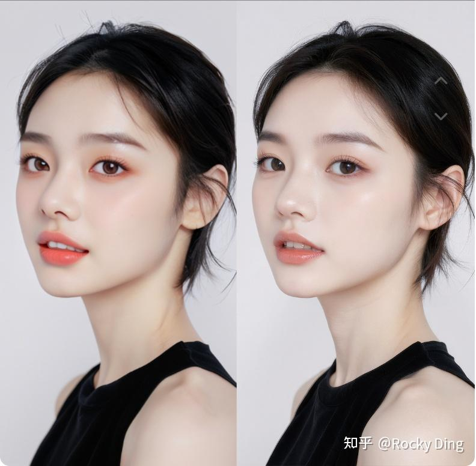

</div>

差异化LoRA的核心目标是提取两个模型状态或两类视觉分布之间的方向。例如希望学习“普通质感 -> 更精修质感”的增量，可以分别得到与状态A、状态B对应的适配器，再构造：

$$
\Delta W_{diff}=\Delta W_B-\Delta W_A
$$

推理时将 $`\lambda\Delta W_{\mathrm{diff}}`$ 加到底模型上，相当于沿参数空间中估计的A到B方向移动。它不是一种独立网络架构，而是一种适配器代数和训练思想，可以与原生LoRA、LoCon等结合应用。

一种直观构建流程是：使用同一底模、同一目标模块、同一Rank和相同训练配置，分别在A组与B组数据上训练适配器；随后将两个适配器对齐并相减。若直接对两个完整模型做差，也可以再用截断SVD压缩为LoRA形式。

在差异化LoRA的训练中，我们分两步进行训练：

1. 以图 A 为训练数据，由于训练数据仅有一张图，过拟合训练得到LoRA A。
2. 以图 B 为训练数据，由于训练数据同样仅有一张图，再次过拟合训练得到LoRA B。

接着我们将两个训练好的LoRA B和LoRA A做差：LoRA B - LoRA A，就最终得到了差异化LoRA C模型。

一张训练数据可以保证LoRA模型能够过拟合到训练数据上，但稳定性不足。为了提高稳定性，我们可以用多个图像对（image pairs）进行训练，从而得到效果更稳定的残差/差异化LoRA模型。

到此为止，我们已经了解了差异化LoRA模型的训练过程。我们可以举一反三，比如使用丑陋的和漂亮的图像对，训练提升图像美感的 LoRA；或者使用细节少的和细节丰富的图像对，训练增加图像细节的LoRA。

这种方法适合探索美肤、锐度、材质、光照、色调和特定视觉属性的可控方向，**一般来说，使用差异化LoRA模型时不需要提示词，对生成图像的构图几乎没有影响，可以说是一种“万金油”的LoRA模型系列。**


<h1 id="q-024">5.介绍一下AIGC图像生成领域中MoE-LoRA的核心原理</h1>

<h2 id="q-025">面试问题：MoE-LoRA如何通过路由和专家适配器提升条件容量？</h2>

**难度评分：⭐⭐⭐⭐⭐ (5/5)  |  考察频率：⭐⭐⭐ (3/5)**

和LoRA技术本身一样，MoE框架也首发于LLM大模型领域，并逐步引入到AIGC图像创作/AI绘画领域中来。相比主流的经典LoRA系列，**LoRA + MoE的思想确实能够在参数量日渐庞大的AIGC图像生成大模型上明显提升微调效率**。

**MoE-LoRA把单个LoRA适配器扩展为多个LoRA专家，并通过Router根据输入特征、Token、时间步、层级或条件选择专家**。它希望解决的问题是：一个固定低秩子空间可能难以同时承载多风格、多主体、多任务或复杂条件，而把Rank一味增大又会损失模块化与稀疏计算优势。

设第 $i$ 个专家的增量为 $`\Delta W_i=B_iA_i`$，Router输出门控权重 $`g_i(x)`$，则某层的条件化更新可以写成：

$$
h'=W_0h+\sum_{i\in\mathrm{TopK}(g(x))}g_i(x)\Delta W_i h
$$

当只激活Top-$k$个专家时，总参数容量可以增大，而每个Token或样本实际使用的适配器数量保持较小。

<div align="center">

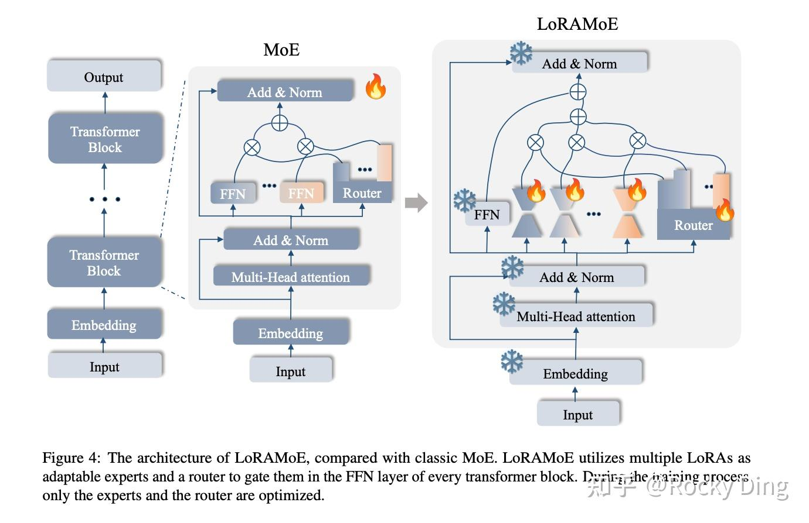

</div>

Router的粒度决定系统行为：样本级路由易实现但控制较粗；Token级路由能让不同语义Token使用不同专家，但调度与通信更复杂；时间步路由可以让专家分别负责构图、主体和纹理阶段；层级路由则让专家在不同表示深度承担任务。

为避免所有输入都挤到少数专家，训练通常加入负载均衡损失。一个简化目标可写成：

$$
\mathcal{L}=\mathcal{L}_{gen}+\lambda_{bal}\mathcal{L}_{balance}
$$

为了保持负载平衡和训练效率，除了引入辅助损失外，我们还可以设置以下的策略:

- **设置随机路由**：在专家网络Top-2规则设置中，除了排名最高的专家网络被选择，第二个专家网络根据其权重比例随机选择。
- **计算专家容量**：我们可以设定一个阈值，来定义一个专家网络能处理多少Tokens。如果两个专家网络的容量都达到上限，Tokens就会溢出，可以通过残差连接传递到下一层，或者被完全丢弃。

**专家网络容量的具体概念如下所示：**

$$
\text{Expert Capacity} = \left( \frac{\text{tokens per batch}}{\text{number of experts}} \right) \times \text{capacity factor}
$$

其中capacity factor代表容量因子。合适的专家网络容量能够将输入的Tokens均匀分配到各个专家网络中去。如果我们使用大于 1 的容量因子，我们可以为Tokens分配不完全平衡时提供了一个缓冲。不过增加容量因子会导致更高的设备间通信成本，**因此这是一个需要权衡的参数**。一般来说，**容量因子设置为1 至 1.25时能够展现出色的性能**。


<h2 id="q-026">面试问题：MoE-LoRA的工程收益、训练风险与适用场景是什么？</h2>

**难度评分：⭐⭐⭐⭐⭐ (5/5)  |  考察频率：⭐⭐⭐ (3/5)**

理解MoE-LoRA，最好先从普通LoRA在AIGC图像创作中的真实问题出发。

假设我们要搭建一个商业人像生成系统，它既要保持人物身份，又要更换服装、控制妆容、切换国风或赛博朋克画风，还要适配证件照、电商海报和社交头像等不同场景。普通做法通常有两种：要么为每种需求分别训练和切换LoRA，要么把人物、服装、画风、光影等多个LoRA同时加载。

第一种做法容易让模型资产越来越多，工作流越来越复杂；第二种做法则容易出现多个LoRA同时修改相同网络层的问题。例如人物LoRA想保留真实五官，二次元风格LoRA想重新塑造脸部比例，服装LoRA又在影响身体轮廓，最终可能出现“人物不像、服装不准、画风也不稳定”的结果。

**MoE-LoRA本质上解决的，就是多个创作能力应该如何分工、又应该在什么时候参与生成的问题。**

可以把它理解成一个AIGC创作团队：底模型负责通用的绘画能力，多个LoRA专家分别擅长人物身份、服装材质、画面风格、光影质感或产品结构，Router则像任务调度者，根据当前的Prompt、图像特征和去噪阶段，选择最适合的少数专家参与生成。

需要强调的是，“人物专家”“风格专家”只是便于理解的示例。真实训练中，专家分工既可以由数据和损失函数自动形成，也可以通过任务划分、路由条件或专门的数据设计进行引导。不能只创建多个LoRA分支，就假设它们一定会自然学会不同能力。

例如，当用户输入“生成一张穿红色汉服的美女在雪山上的电影感人像”时，一个理想化的MoE-LoRA系统可能形成下面的协作过程：

1. **人物身份专家**主要负责保持脸型、五官和个人特征。
2. **服装专家**主要负责汉服结构、纹样和布料质感。
3. **风格专家**主要负责电影感色彩、镜头语言和整体光影。
4. **场景专家**主要负责雪山环境、空间关系和冷暖氛围。
5. **Router**根据Prompt和生成阶段选择其中少数专家，而不是让所有专家从头到尾同时强行修改画面。

这就是“专家分工”和“稀疏激活”的直观含义：**系统可以拥有很多种创作能力，但生成一张具体图片时，只调用当前真正需要的那几种能力。**

将抽象术语换成AIGC图像创作语言，可以得到下面的对应关系：

<div align="center">

| 技术概念 | 在AIGC图像创作中的实际含义 | 可能带来的收益 |
|---|---|---|
| 更大的条件容量 | 同一底模可以容纳更多人物、风格、产品和任务能力 | 不必为每种需求复制一套完整模型 |
| 专家分工 | 不同LoRA分支学习不同的视觉特征或生成阶段 | 降低人物、服装、画风之间的相互干扰 |
| 稀疏激活 | 每次生成只选择少数相关专家 | 避免所有LoRA同时生效造成冲突，并控制计算量 |
| 动态路由 | 根据Prompt、参考图或时间步改变专家组合 | 同一套系统可以处理更复杂、更多变的创作需求 |

</div>

因此，MoE-LoRA更适合下面几类AIGC生产场景：

1. **多风格内容平台**：同一个底模需要持续提供写实、国风、动漫、摄影、游戏概念设计等多种视觉风格。
2. **电商和品牌视觉系统**：既要保持商品结构和品牌元素，又要适配不同模特、场景、节日主题与海报风格。
3. **复杂人物定制**：需要同时控制人物身份、服装、妆容、姿态和画面风格，普通多LoRA叠加已经产生明显冲突。
4. **共享底模服务**：同一个基础模型要服务多个品牌、业务线或客户，但每个业务又有自己的视觉资产和审美规范。

不过，MoE-LoRA不是“多加几个LoRA专家，效果就一定更好”。如果Router没有学会正确分工，系统反而会出现新的问题：

- **专家坍塌**：不管用户生成什么内容，Router总是选择少数几个专家，其他专家几乎不工作。最终表现是不同Prompt都带有相似画风或质感。
- **专家同质化**：多个专家学到了相同能力，看起来专家数量增加了，实际只是重复保存了几份相似LoRA。
- **路由不稳定**：相邻去噪步骤频繁切换不同专家，可能造成人脸特征、服装纹理或画面风格前后不一致。
- **计算收益落空**：如果每次生成仍然激活大量专家，或者路由调度本身开销很高，就无法真正获得稀疏计算的效率收益。
- **问题定位困难**：图片生成失败时，需要判断问题来自底模、某个专家、Router还是专家之间的组合，调试成本高于普通LoRA。

同时，**稠密模型和稀疏模型在过拟合的表现上存在显著差异**。MoE稀疏模型更易于出现过拟合现象，因此在构建MoE-LoRA模型时，我们可以尝试使用更强的内部正则化策略，比如使用更高比例的dropout。具体来说，**我们可以为大模型中的稠密层设定一个较低的dropout率，而为稀疏层设置一个更高的dropout率，以此来优化模型整体性能**。并且像MoE-LoRA这样的稀疏模型往往更适合使用较小的Batch-Size和较高的学习率，这样可以获得更好的训练效果。

所以训练MoE-LoRA时，不仅要看最终图片质量，还要检查每个专家到底学到了什么、Router是否长期偏爱某些专家、不同Prompt是否触发合理的专家组合，以及多人像、多风格和跨场景生成是否稳定。Dropout、负载均衡损失、专家容量、路由噪声和Top-$k$都只是帮助形成合理分工的工程手段，具体配置必须由数据规模、专家数量、路由粒度和底模架构共同决定。

如果业务只有一个人物、一种画风或一个明确任务，单个LoRA通常更简单、更稳定，也更容易部署。只有当创作需求已经明显分化，并且多个LoRA之间的冲突、切换和资产管理成为真实瓶颈时，MoE-LoRA的复杂度才可能值得。

**总的来说，MoE-LoRA不是把更多LoRA简单叠加到模型上，而是让不同LoRA形成专业分工，再由Router为每次AIGC创作动态选择合适的能力组合。它的长期价值不在“专家数量多”，而在“复杂创作任务能够被正确拆分、选择和协同”。**

<h1 id="q-027">6.介绍一下PEFT技术在AIGC图像生成领域的应用</h1>

<h2 id="q-028">面试问题：PEFT的核心技术路线有哪些？LoRA属于哪个细分类别？</h2>

**难度评分：⭐⭐⭐⭐ (4/5)  |  考察频率：⭐⭐⭐⭐⭐ (5/5)**

**PEFT（Parameter-Efficient Fine-Tuning，参数高效微调）是“冻结大部分预训练参数，只训练少量任务参数”这类微调训练方法的总称**。它的核心目标是降低每个任务的训练、存储和交付成本，同时尽量保留底模能力。它让大模型应用的门槛和成本显著降低。

<div align="center">

| 路线 | 训练对象 | 代表方法 | 主要特点 |
|---|---|---|---|
| 重参数化 | 权重更新的低维表示 | LoRA、LoHa、LoKr、DoRA | 易插拔、易融合、生态成熟 |
| 添加模块 | 新增Adapter或控制分支 | Adapter、ControlNet类分支 | 容量强，但结构和推理开销更明显 |
| 表示优化 | Token或Embedding | Textual Inversion | 文件极小，表达上限受文本空间约束 |
| 参数选择 | 偏置、归一化或部分层 | BitFit、Selective Fine-tuning | 实现直接，但能力依赖选层 |
| 提示优化 | 可学习Prompt/Prefix | Soft Prompt、Prefix类方法 | 适合条件注入，依赖架构接口 |

</div>

LoRA处于重参数化路线：它不直接解冻原权重，而是给权重更新增加低秩坐标。DreamBooth则主要是一种个性化训练目标与数据正则策略，既可以采用全参数微调，也可以用LoRA承载更新，所以“DreamBooth”和“LoRA”不是同一层面的互斥概念。

在AIGC图像生成中，选择PEFT方法要看外部知识注入的方式与位置：新词语义可以写入Embedding；人物、风格和领域能力可以写入去噪主干的LoRA；强结构控制可能需要独立Adapter或ControlNet；生成行为变化则可能通过蒸馏LoRA或其他模块承载。

<h2 id="q-029">面试问题：Textual Inversion的原理、优势与局限是什么？</h2>

**难度评分：⭐⭐⭐⭐ (4/5)  |  考察频率：⭐⭐⭐⭐ (4/5)**

Textual Inversion冻结文本编码器和扩散模型，只学习一个或少量新的Token Embedding，让占位符 $S_*$ 在文本空间中表示新的视觉概念。

<div align="center">

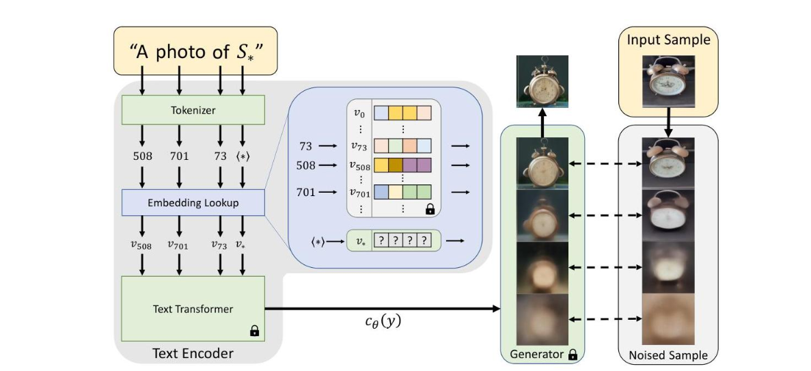

</div>

设可学习向量为 $v$，训练图片集合为 $\mathcal{D}$，其目标仍可使用扩散模型的噪声预测损失：

```math
v^{*}=\arg\min_{v}\mathbb{E}_{x,t,\epsilon}
\left[\left\|\epsilon-\epsilon_{\theta}\left(z_t,t,c(S_{*};v)\right)\right\|_2^2\right]
```

其中底模参数 $\theta$ 固定，只有占位符对应的 $v$ 被更新。训练完成后，可以在Prompt中把 $S_*$ 与其他自然语言组合。

总的来说，Textual Inversion 的实现流程具体过程包括以下几个步骤：

1. **收集输入图像** 用户提供3-5张代表某个新概念的图片，例如特定的雕塑、玩具或独特的艺术风格。这些图像作为大模型的学习基础。

2. **创建新概念词** 为了表示这个新概念，方法会引入一个全新的词汇（在论文中通常标记为S*）。例如，如果我们想要教会模型一个特定的雕塑，我们可以引入一个词如“雕塑X”。

3. **优化词嵌入** 与重新训练整个大模型不同，文本反演只优化这个新概念词在文本嵌入空间中的位置。具体优化过程包括最小化两个方面的差异：

   - 模型使用包含新概念词的文本提示生成的图像
   - 用户提供的实际参考图像

   通过优化，这个新概念词的嵌入向量最终能准确表示新的视觉概念。

4. **集成应用** 一旦新概念词优化完成，就可以和已有的自然语言提示结合使用，让模型生成包含这个个性化元素的新图像。例如，你可以输入“一个戴着‘雕塑X’风格帽子的女孩”，模型就能生成符合你定制需求的图片。

它的优势是参数和文件极小、训练成本低、不会直接改写去噪主干；局限是表达能力受文本嵌入空间约束。复杂人物身份、精细产品结构或与底模先验差异较大的概念，往往难以只靠少量Embedding完整承载。它还可能对初始化Token和Prompt模板敏感。

因此，**Textual Inversion更像“为底模已有的视觉知识找到一个新语言入口”，而LoRA则能修改底模生成映射本身**。前者适合轻量语义绑定，后者适合更强的特征与行为适配。

<h2 id="q-030">面试问题：DreamBooth和DreamBooth LoRA的原理是什么？</h2>

**难度评分：⭐⭐⭐⭐ (4/5)  |  考察频率：⭐⭐⭐⭐⭐ (5/5)**

DreamBooth是一种少样本主体个性化方法。它用“稀有标识符 + 类别词”绑定目标主体，例如“[V] dog”，并在实例图像上微调生成大模型，使大模型既记住特定主体，又能在新场景中响应自然语言。

只训练实例图容易让模型把整个“dog”类别限定到目标对象，造成语言漂移和过拟合。DreamBooth因此引入类别先验保持损失，将实例重建与类别图像正则结合：

$$
\mathcal{L}=\mathcal{L}_{instance}+\lambda_{prior}\mathcal{L}_{prior}
$$

类别图像通常由原模型基于类别Prompt生成，用来约束模型继续保留该类别的多样性。Prior Preservation不是简单加入“负样本”，而是在生成目标上维持类别先验。

<div align="center">

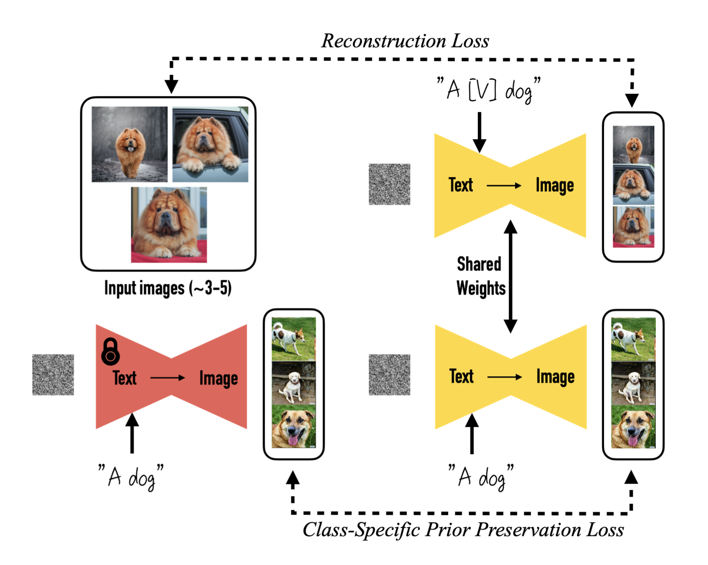

</div>

总的来说，DreamBooth技术在微调训练过程中，主要涉及以下几个关键步骤：

1. **选择目标实体**：在开始训练之前，首先需要明确要生成的目标实体或主题。这通常是一组代表性强、特征明显的图像，可以是人物、宠物、艺术品等。例如，如果目标是生成特定人物的图像，那么这些参考图像应该从不同角度捕捉该人物。

2. **训练数据准备**：收集与目标实体相关的图像。这些图像不需要非常多，但应该从多个角度展示目标实体，以便模型能够学习到尽可能多的细节。此外，还需要收集一些通用图像作为负样本，帮助模型理解哪些特征是独特的，哪些是普遍存在的。

3. **数据标注**：为了帮助大模型更好地识别和学习特定的目标实体，DreamBooth技术使用特定的描述词[V]来标注当前训练任务的数据。这些标注将与目标实体的图像一起输入模型，以此强调这些图像中包含的特定特征。

4. **模型微调**：使用这些特定的训练样本，对Stable Diffusion/FLUX模型或者LoRA模型进行微调训练，并在微调训练过程中增加class-specific prior preservation loss来进行正则化。

5. **验证测试**：微调完成后，使用不同于训练时的文本提示词（但是包含特定的描述词[V]），验证模型是否能够根据新的文本提示词生成带有目标实体特征的图像。这一步骤是检验微调效果的重要环节。

6. **调整和迭代**：基于生成的图像进行评估，如果生成结果未达到预期，可能需要调整微调策略，如调整学习率、增加训练图像数量或进一步优化特殊标签的使用。

**原始DreamBooth可以微调U-Net，并可选择微调文本编码器；DreamBooth LoRA则保留DreamBooth的数据组织、标识符和先验保持目标，但用LoRA参数化U-Net或Text Encoder的更新**。前者更新容量更高、单任务权重更大；后者更省显存与存储，也更适合社区分发和多任务切换。

DreamBooth LoRA不是把两个独立模型简单相加，而是“**DreamBooth训练范式 + LoRA参数化方式**”。

<h2 id="q-031">面试问题：LoRA、DreamBooth与Textual Inversion应该如何选择？</h2>

**难度评分：⭐⭐⭐⭐ (4/5)  |  考察频率：⭐⭐⭐⭐⭐ (5/5)**

DreamBooth描述主体个性化任务及其先验保持训练策略；LoRA描述如何低成本表示权重更新；Textual Inversion描述如何只学习新Token Embedding。因此它们既可以比较，也可以组合。

<div align="center">

| 方法 | 主要训练对象 | 表达能力 | 资源与文件 | 典型场景 |
|---|---|---|---|---|
| Textual Inversion | 新Token Embedding | 较低到中等 | 最小 | 轻量概念、风格词、语义入口 |
| LoRA | 去噪主干/文本编码器的低秩增量 | 中等到较高 | 较小 | 人物、风格、产品、领域与行为适配 |
| 全参DreamBooth | U-Net及可选Text Encoder | 较高 | 训练和存储成本高 | 高保真主体个性化、独立模型交付 |
| DreamBooth LoRA | DreamBooth目标下的低秩增量 | 中等到较高 | 较小 | 少样本主体定制与轻量交付 |

</div>

如果概念可以被底模已有文本空间表达，只缺少一个新入口，优先Textual Inversion；如果需要修改生成映射，同时要求低成本训练、组合与分发，优先LoRA或DreamBooth LoRA；如果任务与底模差异大、数据和算力充足、LoRA容量经验证不足，再考虑全参数DreamBooth或更大范围微调。

最终不应只比较训练显存，还要比较身份保真、Prompt可编辑性、跨底模兼容、推理延迟等。**技术工具不是护城河，对技术工具的认知判断才是护城河。类LoRA技术真正跨周期的价值，是把一个越来越大的通用模型拆成稳定底座与可组合增量，让数据、训练、评测和部署形成可持续迭代的闭环。**
