# 目录

## 第一章 ControlNet模型技术基础

- [1.介绍一下ControlNet的技术原理与模型架构](#1.介绍一下ControlNet的技术原理与模型架构)
- [2.ControlNet有多少种控制条件？介绍一下各控制条件的原理与功能](#2.ControlNet有多少种控制条件？介绍一下各控制条件的原理与功能)
- [3.ConrtolNet是如何训练的？训练ControlNet模型的流程中有哪些关键参数？](#3.ConrtolNet是如何训练的？训练ControlNet模型的流程中有哪些关键参数？)
- [4.ControlNet 1.1与ControlNet相比，有哪些改进？](#4.ControlNet-1.1与ControlNet相比，有哪些改进？)
- [5.介绍一下Controlnet-Union的原理和架构](#5.介绍一下Controlnet-Union的原理和架构)
- [6.ControlNet有哪些主流的AIGC应用案例？](#6.ControlNet有哪些主流的AIGC应用案例？)

## 第二章 其他主流AIGC可控生成技术基础

- [1.介绍一下PULID系列人像一致性技术的核心原理](#1.介绍一下PULID系列人像一致性技术的核心原理)
- [2.介绍一下EcomID人像一致性技术的核心原理](#2.介绍一下EcomID人像一致性技术的核心原理)
- [3.介绍一下FaceChain人像一致性技术的核心原理，训练和推理过程是什么样的？](#3.介绍一下FaceChain人像一致性技术的核心原理，训练和推理过程是什么样的？)
- [4.介绍一下InstantID人像一致性技术的核心原理](#4.介绍一下InstantID人像一致性技术的核心原理)
- [5.介绍一下Easyphoto人像一致性技术的核心原理，训练和推理过程是什么样的？](#5.介绍一下Easyphoto人像一致性技术的核心原理，训练和推理过程是什么样的？)
- [6.介绍一下LayerDiffusion图层分离技术的核心原理](#6.介绍一下LayerDiffusion图层分离技术的核心原理)
- [7.介绍一下IP-Adapter图像特征参考技术的核心原理](#7.介绍一下IP-Adapter图像特征参考技术的核心原理)
- [8.介绍一下SUPIR超分技术的核心原理](#8.介绍一下SUPIR超分技术的核心原理)
- [9.介绍一下AnyText文字渲染技术的核心原理](#9.介绍一下AnyText文字渲染技术的核心原理)
- [10.介绍一下IDM_VTON虚拟试衣（try-on）技术的核心原理](#10.介绍一下IDM_VTON虚拟试衣（try-on）技术的核心原理)

---


# 第一章 ControlNet模型技术基础

<h2 id="1.介绍一下ControlNet的技术原理与模型架构">1.介绍一下ControlNet的技术原理与模型架构 </h2>

### 面试问题：介绍一下ControlNet的模型架构

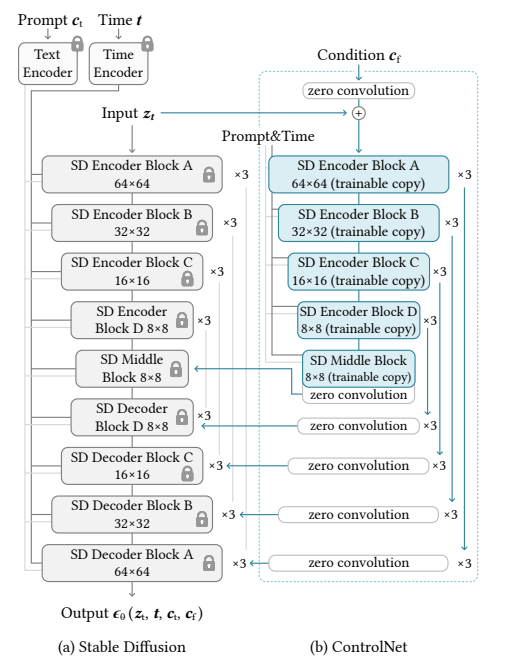

权重克隆：ControlNet 将大型扩散模型的权重克隆为两个副本，一个“可训练副本”和一个“锁定副本”。锁定副本保留了从大量图像中学习到的网络能力，而可训练副本则在特定任务的数据集上进行训练，以学习条件控制。

零卷积：ControlNet 引入了一种特殊类型的卷积层，称为“零卷积”。这是一个 1x1 的卷积层，其权值和偏差都初始化为零。零卷积层的权值会从零逐渐增长到优化参数，这样设计允许模型在训练过程中逐渐调整和学习条件控制，而不会对深度特征添加新的噪声。

特征融合：ControlNet 通过零卷积层将额外的条件信息融合到神经网络的深层特征中。这些条件可以是姿势、线条结构、颜色分布等，它们作为输入调节图像，引导图像生成过程。

灵活性和扩展性：ControlNet 允许用户根据需求选择不同的模型和预处理器进行组合使用，以实现更精准的图像控制和风格化。例如，可以结合线稿提取、颜色控制、背景替换等多种功能，创造出丰富的视觉效果。

### 面试问题：Controlnet如何处理条件图的？

我们知道在 sd 中，模型会使用 VAE-encoder 将图像映射到隐空间，512×512 的像素空间图像转换为更小的 64×64 的潜在图像。而 controlnet 为了将条件图与 VAE 解码过的特征向量进行相加，controlnet 使用了一个小型的卷积网络，其中包括一些普通的卷积层，搭配着 ReLU 激活函数来完成降维的功能。


### 面试问题：加入Controlnet训练后，训练时间和显存的变化？

在论文中，作者提到，与直接优化 sd 相比，优化 controlnet 只需要 23% 的显存，但是每一个 epoch 需要额外的 34% 的时间。可以方便理解的是，因为 controlnet 其实相当于只优化了unet-encoder，所以需要的显存较少，但是 controlnet 需要走两个网络，一个是原 sd 的 unet，另一个是复制的 unet-encoder，所以需要的时间会多一些。

### 面试问题：ControlNet是如何起作用的？

在以Stable Diffusion和FLUX.1为核心的AIGC图像生成过程中，想要ControlNet起作用，首先我们需要输入一张参考图，通过**预处理器** (Preprocessor)对输入参考图按一定的模式进行预处理，通常是使用传统的计算机视觉算法（如边缘检测、人体姿态估计、深度估计等）来从输入参考图中提取出纯粹的控制信息，也就是我们常说的**条件图像**(Conditioning Image)。

当然的，我们也可以不使用预处理功能，直接输入一张自己处理好的图片当作预处理图。下面是Rocky构建的ControlNet的条件图像处理流程图示，让大家能够更好的理解：

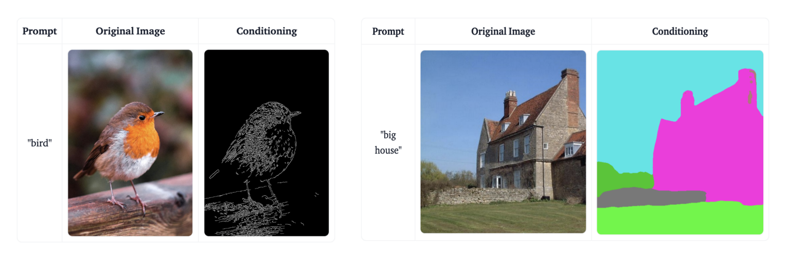

接着条件图像信息通过ControlNet再注入到Stable Diffusion和FLUX.1中，再加上原本就直接注入到Stable Diffusion和FLUX.1中的文本信息和图像信息（可选，进行图生图任务），综合作用进行扩散过程，最终生成受条件信息控制的图像。

总的来说，ControlNet做的就是这样一件事：**它为扩散模型（如 Stable Diffusion/FLUX.1）提供一种额外的“约束”条件，引导AIGC大模型按照我们期望的构图、姿态或结构来生成图像，减少图像生成的随机**性。

为了大家方便的理解，**Rocky也制作了ControlNet推理的完整流程图**，大家可以直观的学习理解：

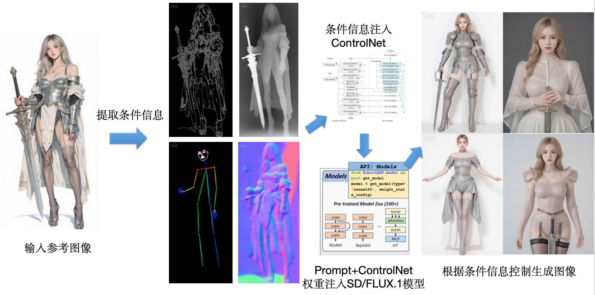

### 面试问题：ControlNet的最小单元是什么样的？

下图是ControlNet模型的最小单元：

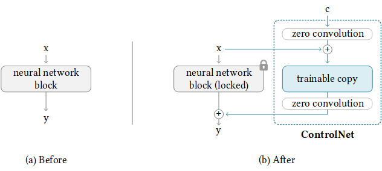

从上图可以看到，**在使用ControlNet模型之后，Stable Diffusion/FLUX.1模型的权重被复制出两个相同的部分，分别是“锁定”副本（locked）权重和“可训练”副本（trainable copy）权重**。

**我们如何理解这两个副本权重呢？** Rocky从训练角度和推理角度给大家进行通俗易懂的讲解。

**首先不管是训练阶段还是推理阶段，ControlNet都在“可训练”副本上输入控制条件** $c$，然后将“可训练”副本输出结果和原来Stable Diffusion/FLUX.1模型的“锁定”副本输出结果**相加（add）**获得最终的输出结果。

在训练阶段，**其中“锁定”副本中冻结参数，权重保持不变，保留了Stable Diffusion/FLUX.1模型原本的能力**；与此同时，**使用新数据对“可训练”副本进行微调训练，学习数据中的控制条件信息**。因为有Stable Diffusion/FLUX.1模型作为预训练权重，**复制“可训练”副本而不是直接训练原始权重还能避免数据集较小时的过拟合**，所以我们使用常规规模数据集（几K-几M级别）就能对控制条件进行学习训练，同时不会破坏Stable Diffusion/FLUX.1模型原本的能力（从数十亿张图像中学习到的大型模型的能力）。

另外，大家可能发现了**ControlNet模型的最小单元结构中有两个zero convolution模块，它们是1×1卷积，并且在微调训练时权重和偏置都初始化为零（zero初始化）**。这样一来，在我们开始训练ControlNet之前，所有zero convolution模块的输出都为零，使得ControlNet完完全全就在原有Stable Diffusion/FLUX.1底模型的能力上进行微调训练，这样可以尽量避免训练加入的初始噪声对ControlNet“可训练”副本权重的破坏，保证了不会产生大的能力偏差。

### 面试问题：ControlNet中的zero卷积层初始权重为什么是0?zero卷积层为什么有效？

大家很可能就会有一个疑问，如果zero convolution模块的初始权重为零，那么梯度也为零，ControlNet模型将不会学到任何东西。**那么为什么“zero convolution模块”有效呢？（AIGC算法面试必考点）**

Rocky进行下面的推导，相信大家对一切都会非常清晰明了：

我们可以假设ControlNet的初始权重为： $y=wx+b$ ，然后我们就可以得到对应的梯度求导：

$$\frac{\partial y}{\partial w}=x,\frac{\partial y}{\partial x}=w,\frac{\partial y}{\partial b}=1$$

如果此时 $w=0$ 并且 $x \neq 0$ ，然后我们就可以得到：

$$\frac{\partial y}{\partial w} \neq 0,\frac{\partial y}{\partial x}=0,\frac{\partial y}{\partial b}\neq 0$$

这就意味着只要 $x \neq 0$ ，一次梯度下降迭代将使w变成非零值。然后就得到： $\frac{\partial y}{\partial x}\neq 0$ 。**这样就能让zero convolution模块逐渐成为具有非零权重的卷积层，并不断优化参数权重**。


### 面试问题：ControlNet中Balanced、My prompt is more important、ControlNet is more important三种模式的区别是什么？


<h2 id="2.ControlNet有多少种控制条件？介绍一下各控制条件的原理与功能">2.ControlNet有多少种控制条件？介绍一下各控制条件的原理与功能</h2>

Rocky认为这是一个非常重要的问题，ControlNet模型的各种控制功能非常多，我们需要进行归纳总结，才能更好的在AIGC时代中运用这些技术工具。

我们可以根据其处理信息的**类型**和**应用场景**归为几大类：

#### 第一类：边缘与线条类
这类模型通过提取图像中的线条、轮廓或边缘信息来控制图像的结构和形状。它们通常用于精确的形状控制和线稿上色。

*   **Canny**：基于Canny边缘检测算法，提取图像中所有显著的边缘。
*   **MLSD**：专门用于检测建筑和室内设计中的**直线**，非常适合生成建筑草图、室内布局。
*   **Scribble**：将输入视为**涂鸦**或手绘草图，能够将非常粗略的线条转化为精致的图像。
*   **Soft Edge**：类似于Canny，但边缘更柔和、更粗，对自然图像（如动物、植物）的兼容性更好。
*   **Lineart**：专门用于提取**线稿**，尤其是从真实照片或艺术作品中提取，线条质量通常比Canny更高、更干净。

#### 第二类：几何与3D信息类
这类模型使用从图像中推断出的3D信息（如深度、法线）来指导生成过程，从而控制物体的空间关系和立体感。

*   **Depth**：提取图像的**深度信息**，生成带有前景、中景、背景层次的图像，非常适合保持场景的立体感和空间一致性。
*   **Normal**：提取物体的**表面法线贴图**，它包含了物体表面细微的朝向信息，能生成光照和表面质感非常逼真的图像。

#### 第三类：语义与内容信息类
这类模型使用更高层次的、经过抽象和理解的信息来控制生成内容，例如人体姿态、物体分割区域等。

*   **OpenPose**：检测图像中人物的**骨骼关键点**（姿势），可以精确控制生成人物的动作、姿态，甚至是手部动作和多人场景。
*   **Segmentation**：使用**语义分割图**，为图像中的不同部分（如天空、树木、人物、衣服）分配不同的颜色标签，从而对画面的每个区域进行像素级的精确控制。

#### 第四类：风格与抽象信息类
这类模型不关注具体的形状或结构，而是关注图像的整体风格、颜色分布或纹理。

*   **Shuffle**：提取输入图像的**颜色分布和风格纹理**，将其应用到生成的新图像上，本质上是一种内容感知的风格迁移。
*   **Instruct Pix2Pix**：这是一个特殊模型，它不依赖于额外的控制图，而是直接接受**文字指令**来编辑图像。

#### 第五类：特殊应用与重绘类
这类模型用于解决特定的图像生成或编辑任务。

*   **Tile**：用于**图像超分辨率**和**细节重绘**。它通过忽略输入图像的宏观结构，专注于局部纹理和细节，来对图像进行“放大并增强细节”的操作。
*   **Inpaint**：专门用于**局部重绘**。需要与Stable Diffusion的inpaint功能结合使用，通过提供蒙版区域和ControlNet的引导，在特定区域内进行高质量、与周围环境协调的重绘。

#### 总结

| 类别 | 核心功能 | 包含模型 |
| :--- | :--- | :--- |
| **边缘与线条** | 控制形状、轮廓、结构 | Canny, MLSD, Scribble, Soft Edge, Lineart |
| **几何与3D** | 控制空间深度、立体感、表面朝向 | Depth, Normal |
| **语义与内容** | 控制人物姿态、物体分区 | OpenPose, Segmentation |
| **风格与抽象** | 控制颜色风格、纹理、根据指令编辑 | Shuffle, Instruct Pix2Pix |
| **特殊应用** | 图像放大、细节增强、局部重绘 | Tile, Inpaint |

在实际使用中，我们经常会将多个ControlNet组合使用，以达到更复杂和精确的控制效果。


<h2 id="3.ConrtolNet是如何训练的？训练ControlNet模型的流程中有哪些关键参数？">3.ConrtolNet是如何训练的？训练ControlNet模型的流程中有哪些关键参数？</h2>

### 面试问题：介绍一下ControlNet的训练过程

我们对ControlNet整体训练过程进行拆解理解。在我们不使用ControlNet模型时，**可以将Stable Diffusion/FLUX.1底模型的图像生成过程表达为：**

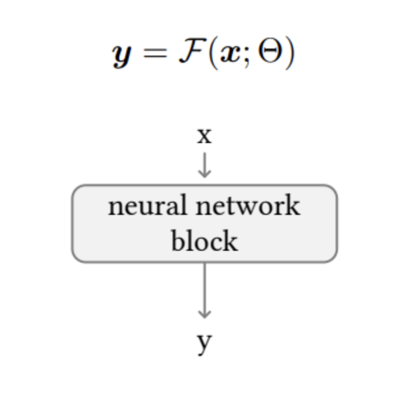

接着，我们在此基础上假设将训练的所有参数锁定在 $\Theta$ 中，然后将其复制为可训练的副本 $\Theta_{c}$ 。复制的 $\Theta_{c}$ 使用额外控制条件信息c进行训练。因此在使用ControlNet之后，**Stable Diffusion/FLUX.1底模型 + ControlNet模型整体的图像生成表达式转化成为：**

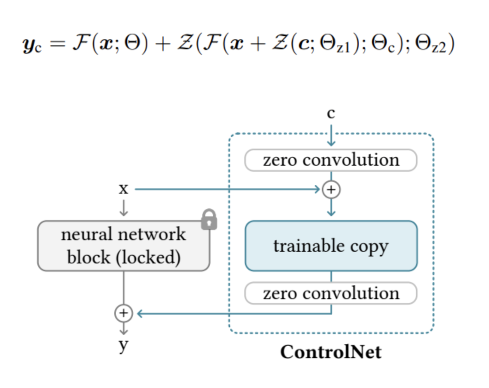

其中 $Z = F(c; \Theta)$ 代表了zero convolution模块， $\Theta_{z1}$ 和 $\Theta_{z2}$ 代表了前后两个zero convolution层的参数权重， $\Theta_{c}$ 则代表了ControlNet的参数权重。

由于训练开始前zero convolution模块的输出都为零，所以ControlNet未经训练时的初始输出为0：

$$\begin{cases} 
\mathcal{Z}\left(\boldsymbol{c};\Theta_{z1}\right) = 0 \\ 
\mathcal{F}\left(x + \mathcal{Z}\left(\boldsymbol{c};\Theta_{z1}\right);\Theta_{\mathrm{c}}\right) = \mathcal{F}\left(x;\Theta_{\mathrm{c}}\right) = \mathcal{F}(x;\Theta) \\
\mathcal{Z}\left(\mathcal{F}\left(x + \mathcal{Z}\left(\boldsymbol{c};\Theta_{z1}\right);\Theta_{\mathrm{c}}\right);\Theta_{z2}\right) = \mathcal{Z}\left(\mathcal{F}\left(x;\Theta_{\mathrm{c}}\right);\Theta_{z2}\right) = \mathbf{0} 
\end{cases}$$

由此可知，**在ControlNet微调训练初始阶段对Stable Diffusion/FLUX.1底模型权重是没有任何影响的，能让底模型原本的性能完整保存**，之后ControlNet的训练也只是在原Stable Diffusion/FLUX.1底模型基础上进行优化。

总的来说，**ControlNet的本质原理使得训练后的模型鲁棒性好，能够避免模型过拟合，并在特定条件场景下具有良好的泛化性，同时能够在小规模数据和消费级显卡上进行训练**。

ControlNet系列模型的训练流程主要分成以下几个步骤：

1. 设计我们想要的额外控制条件：除了上面章节中讲到的控制条件，我们还可以根据实际需求自定义一些控制条件，从而使用ControlNet控制Stable Diffusion/FLUX.1朝着我们想要的细粒度方向生成内容。
2. 构建训练数据集：确定好额外控制条件后，我们就可以开始构建训练数据集了。ControlNet数据集中需要包含三个维度的信息：Ground Truth图片、作为控制条件（Conditional）的图片，以及对应的Caption标签。
3. 训练我们自己的ControlNet模型：训练数据集构建好后，我们就可以开始训练自己的ControlNet模型了，我们需要一个至少8G显存的GPU才能满足ControlNet模型的训练要求。


### 面试问题：ControlNet的损失函数是什么？


<h2 id="4.ControlNet-1.1与ControlNet相比，有哪些改进？">4.ControlNet 1.1与ControlNet相比，有哪些改进？</h2>

**ControlNet 1.1与ControlNet 1.0具有完全相同的模型架构。ControlNet 1.1主要是在ControlNet 1.0的基础上进行了优化训练，提高了鲁棒性和控制效果，同时发布了几个新的ControlNet模型。**

从ControlNet 1.1开始，ControlNet模型将使用标准的命名规则（SCNNR）来命名所有模型，这样我们在使用时也能更加方便与清晰。具体的命名规则如下图所示：

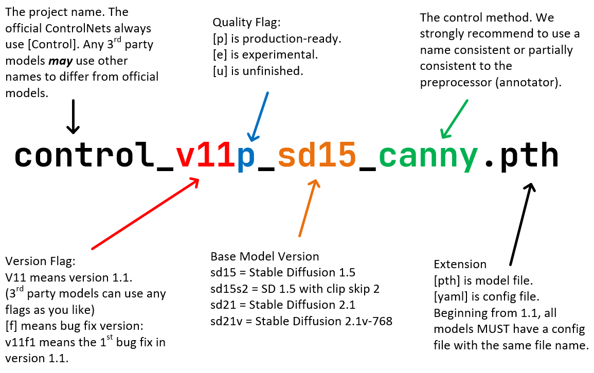

ControlNet 1.1一共发布了14个模型（11个成品模型和3 个实验模型）：

```bash
control_v11p_sd15_canny
control_v11p_sd15_mlsd
control_v11f1p_sd15_depth
control_v11p_sd15_normalbae
control_v11p_sd15_seg
control_v11p_sd15_inpaint
control_v11p_sd15_lineart
control_v11p_sd15s2_lineart_anime
control_v11p_sd15_openpose
control_v11p_sd15_scribble
control_v11p_sd15_softedge
control_v11e_sd15_shuffle（实验模型）
control_v11e_sd15_ip2p（实验模型）
control_v11f1e_sd15_tile（实验模型）
```


<h2 id="5.介绍一下Controlnet-Union的原理和架构">5.介绍一下Controlnet-Union的原理和架构</h2>

controlnet-union-sdxl-1.0模型的结构如下所示：

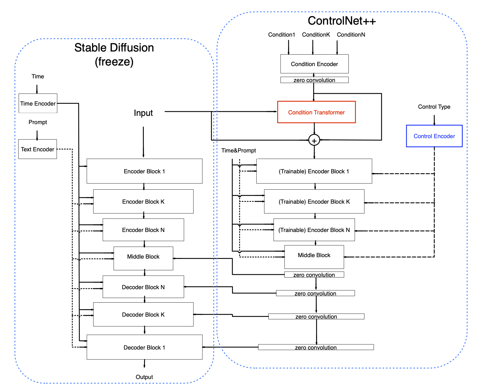

Controlnet-union-sdxl-1.0模型模型的优化点：

1. **采用分桶训练技术**：对不同分辨率数据采用分桶训练策略，这样在推理时能够生成任意宽高比的高分辨率图像。
2. **海量高质量训练数据**：使用超过10M张高质量图像，数据集覆盖多样化的场景和内容。
3. **采用重新标注提示词**：使用CogVLM模型生成详细的Caption描述作为训练标签，使得模型具备优秀的提示词遵循能力。
4. **集成多种训练技巧**：包括但不限于数据增强、多目标损失函数、多分辨率训练等。
5. **参数效率高**：与原始ControlNet相比，参数量几乎未增加，网络参数和计算量无明显上升。
6. **支持多种控制条件**：兼容12种控制方式+5种高级编辑功能，每种条件的控制效果均不逊色于独立训练的ControlNet模型。
7. **支持多条件融合生成**：支持在推理时同时使用多条件的控制能力，多条件融合机制在训练中学习得到，无需手动设置超参数或设计提示词。
8. **兼容性强**：可与业界主流的SDXL模型、LoRA模型兼容使用。

controlnet-union-sdxl-1.0模型基于原始ControlNet架构，同时提出了**两个新模块Condition Transformer（条件变换器）和Control Encoder（控制编码器）**。

**在控制编码器中**，每个控制条件都被赋予一个特定的**控制类型标识符**。例如，OpenPose 对应标识符 (1, 0, 0, 0, 0, 0)，深度图对应 (0, 1, 0, 0, 0, 0)。**当存在多个条件时，例如同时使用 OpenPose 和深度图，其标识符将合并为 (1, 1, 0, 0, 0, 0)**。在控制编码器中，这些标识符通过正弦位置编码转换为嵌入向量，随后通过线性层将其投影至与时间嵌入相同的维度。**控制类型特征会与时间嵌入相加，从而在网络中传递不同控制类型的全局信息**。这一简洁设计有助于ControlNet区分各类控制条件，因为时间嵌入通常对整体网络具有广泛影响。无论是单一条件还是多条件组合，均对应唯一的控制类型标识符。

实际的控制类型标识符如下所示：

0 -- openpose
1 -- depth
2 -- thick line(scribble/hed/softedge/ted-512)
3 -- thin line(canny/mlsd/lineart/animelineart/ted-1280)
4 -- normal
5 -- segment

**在条件变换器中**，对ControlNet进行了扩展，使其能够同时处理多个控制输入。条件变换器的作用在于整合不同图像条件的特征。controlnet-union-sdxl-1.0模型的两大创新点在于：

1. 首先，不同条件共享同一条件控制编码器，从而使网络结构更为简洁与轻量。
2. 其次，引入了一个Transformer层，用于在原始图像特征与条件图像特征之间交换信息。同时并未直接采用Transformer的输出，而是利用其预测原始条件特征的调整量（即条件偏差）。**这种设计类似于 ResNet 的残差思想，实验表明该结构能显著提升模型性能**。

**同时针对多条件的同时控制，对ControlNet的条件编码器（Condition Encoder）也做了改进**。ControlNet原有的条件编码器由多个卷积层与Silu激活函数堆叠而成。**在保持其架构不变的基础上，controlnet-union-sdxl-1.0增加了卷积通道数，构建了一个更“宽”的编码器，这一改进显著提升了网络的表现能力**。原因在于，所有图像条件共享同一编码器，因此需要编码器具备更强的特征表示能力。原有结构对于单一条件可能足够，但在处理十余种条件时则显得力不从心。

**为了让controlnet-union-sdxl-1.0模型能够同时进行多条件的控制生成，官方设置了统一训练策略（Unified Training Strategy）进行多条件训练**。多条件训练有助于促进不同条件之间的融合，并增强模型的鲁棒性（因为单一条件所涵盖的知识有限）。


<h2 id="6.ControlNet有哪些主流的AIGC应用案例？">6.ControlNet有哪些主流的AIGC应用案例？</h2>


---

# 第二章 其他主流AIGC可控生成技术基础

<h2 id="1.介绍一下PULID系列人像一致性技术的核心原理">1.介绍一下PULID系列人像一致性技术的核心原理</h2>

### 面试问题：介绍一下PULID系列人像一致性技术的核心原理和整体功能

PuLID（Pure Identity）的核心目标是在扩散模型生成时保持高度人脸身份一致性。

PULID系列人像一致性技术的依赖模型及其作用：

1. InsightFace模型：提取 512 维人脸身份向量（face_embeddings），并将这个向量作为 IDEncoder 的第一路输入。
2. FaceRestoreHelper + BiseNet（facexlib）：RetinaFace 精准定位人脸并做 5 点对齐，裁切到 512×512；BiseNet 解析人脸语义分割（区分皮肤、头发、耳朵、背景等19类），接着将背景区域替换为白色，人脸区域转为灰度图
将处理后的 "去背景灰度人脸图" 送入 EVA-CLIP，让 EVA-CLIP 专注于学习人脸结构和身份细节，而不被背景颜色、服装等非身份信息干扰。
3. EVA-CLIP模型：EVA-02系列的大型 CLIP 视觉编码器，输入 336×336 分辨率，输出丰富的视觉特征，能够提供超越身份向量的语义级视觉理解——不只是"是谁"，还包含人脸的纹理、光照、表情、细节等视觉语义信息。一共输出两类特征，分别是 CLIP 的全局视觉向量（L2 归一化），代表人脸的整体语义；还有 ViT 中间层隐藏状态列表（共5层），包含多尺度的局部细节特征。
4. PuLID 模型：将之前得到的人像特征和扩散模型的Cross-Attention进行融合(三种正交投影模式：fidelity、style、neutral)，引导扩散模型的生成。具体融合逻辑如下代码所示：

```python
class IDEncoder(nn.Module):
    def __init__(self, width=1280, context_dim=2048, num_token=5):
        super().__init__()
        self.num_token = num_token        # 输出 5 个主 token
        self.context_dim = context_dim    # 每个 token 维度 2048
        // ...
        self.body = nn.Sequential(
            nn.Linear(width, h1),         # 处理 InsightFace + EVA全局向量（1280维融合后）
            nn.LayerNorm(h1),
            nn.LeakyReLU(),
            ...
            nn.Linear(h2, context_dim * num_token),  # 输出 5×2048
        )
        # 5 组 mapping（每组对应 EVA 的一个中间层）
        for i in range(5):
            setattr(self, f'mapping_{i}', ...)       # 处理 CLS token（全局）
            setattr(self, f'mapping_patch_{i}', ...) # 处理 patch tokens（局部均值）

    def forward(self, x, y):
        # x: [N, 1280] = concat(iface_embeds[512], id_cond_vit[768]) InsightFace+EVA全局向量
        x = self.body(x)
        x = x.reshape(-1, self.num_token, self.context_dim)   # → [N, 5, 2048]

        hidden_states = ()
        for i, emb in enumerate(y):   # y = EVA的5个中间层hidden state
            hidden_state = getattr(self, f'mapping_{i}')(emb[:, :1])  # CLS token
                         + getattr(self, f'mapping_patch_{i}')(emb[:, 1:]).mean(dim=1, keepdim=True)  # patch均值
            hidden_states += (hidden_state,)
        hidden_states = torch.cat(hidden_states, dim=1)  # [N, 5, 2048]

        return torch.cat([x, hidden_states], dim=1)     # → [N, 10, 2048]
```

Rocky也总结了PULID的整体流程图，方便大家学习理解：

```python
                        ┌─────────────────────────────────┐
                        │           参考人脸图像             │
                        └──────────────┬──────────────────┘
                                       │
           ┌───────────────────────────┼──────────────────────────┐
           │ InsightFace               │                          │ FaceRestoreHelper
           ▼                          ▼                          ▼
     512维身份向量              RetinaFace对齐               BiseNet人脸解析
    (iface_embeds)            (512×512标准人脸)          (剔除背景→灰度图)
           │                                                      │
           │                                                      ▼
           │                                            EVA02-CLIP-L-14-336 (336×336)
           │                                          ↙              ↘
           │                                  CLS全局向量          5层隐藏状态
           │                              (id_cond_vit)         (id_vit_hidden)
           │                                      │                  │
           └──────────────────────────────────────┘                  │
                              │ concat [512+768=1280]                 │
                              ▼                                       ▼
                         IDEncoder.body (MLP)              IDEncoder.mapping_i × 5
                         → [N, 5, 2048]                    → [N, 5, 2048]
                                          ╲               ╱
                                           ▼             ▼
                                         torch.cat → [N, 10, 2048]
                                                          │
                                           拼接 num_zero 个零 token
                                       (fidelity: 18 token, style: 26 token)
                                                          │
                                            UNet cross-attention 层
                                         (input[4,5,7,8] + output[0~5] + middle[1])
                                                          │
                                           pulid_attention (含正交投影)
                                              out += weight × out_ip
                                                          │
                                                   最终生成图像
```

### 面试问题：介绍一下PULID系列和InstantID的主要差异

|对比维度	|InstantID	|PuLID|
| :--- | :--- | :--- |
|身份特征来源	|只用 InsightFace 的 512 维向量|	InsightFace + EVA-CLIP 双流融合|
|图像语义理解|	无	|EVA-CLIP 提供丰富视觉语义|
|人脸预处理	|直接提取	|先用 BiseNet 解析人脸区域，剔除背景再送 CLIP|
|特征映射网络	|Perceiver Resampler（注意力）|	IDEncoder（MLP + 残差映射）|
|注入方式|	叠加 attention 输出	|叠加 + 可选正交投影|
|ControlNet|	必须（姿态关键点）|	不需要，只靠 attention patch|
|输出|	MODEL + positive + negative|	只有 MODEL|

### 面试问题：介绍一下PULID中的三种正交投影模式的原理

**一、基础背景**

在每步去噪中，U-Net 的 cross-attention 层会输出两个结果：

| 变量 | 含义 | 来源 |
|---|---|---|
| `out` | **文本方向**的 attention 输出 | 原始文字 prompt 的 K/V |
| `out_ip` | **身份方向**的 attention 输出 | PuLID 身份 token 的 K/V |

最终写回 U-Net 的增量是：

```python
# 函数返回的是增量，调用处：out_final = out_text + pulid_attention(...)
return out_ip.to(dtype=dtype)
```

**核心问题**：`out_ip` 里可能有很多成分与 `out`（文本方向）高度重叠，如果直接叠加，身份信号会"抢占"文本 prompt 已经在做的事，造成过度强化或风格冲突。三种模式本质上是对"如何处理 `out_ip` 与 `out` 之间的重叠"给出三种不同答案。

**二、模式 1：neutral（直接叠加，无正交化）**

#### 源码

```python
# neutral 模式
else:
    out_ip = out_ip * weight
```

#### 数学表达

$$\text{增量} = w \cdot \vec{v}_{ip}$$

#### 几何图示

```
         out（文本方向）
          ↑
          │
          │         out_ip（身份方向）
          │        ↗
          │      ↗
          │    ↗
          │  ↗
──────────┼──────────→
          │
```

`out_ip` 直接乘以权重后叠加到 `out`，无任何过滤。

#### 行为特点

- **最强的身份约束**：身份信号中包含的所有分量，包括与文本方向重叠的部分，全部被叠加进去
- **最可能干扰文本 prompt**：如果 prompt 说"微笑"，而参考人脸是严肃表情，neutral 模式会更倾向于保留严肃表情
- **适用场景**：参考图与 prompt 风格一致，追求绝对的身份相似度

**三、模式 2：style（纯正交投影，最彻底的去重叠）**

#### 源码

```python
if ortho:
    out = out.to(dtype=torch.float32)
    out_ip = out_ip.to(dtype=torch.float32)
    
    # 计算 out_ip 在 out 方向上的投影分量
    projection = (torch.sum((out * out_ip), dim=-2, keepdim=True) 
                / torch.sum((out * out),    dim=-2, keepdim=True) * out)
    
    # 从 out_ip 中减去该投影，得到纯正交分量
    orthogonal = out_ip - projection
    
    out_ip = weight * orthogonal
```

#### 数学原理（Gram-Schmidt 正交化）

投影公式来自线性代数中的向量投影：

$$\text{proj}_{\vec{u}}(\vec{v}) = \frac{\vec{v} \cdot \vec{u}}{|\vec{u}|^2} \cdot \vec{u}$$

代码中：
- `out`（文本方向）= $\vec{u}$
- `out_ip`（身份方向）= $\vec{v}$

```python
projection = (sum(out * out_ip) / sum(out * out)) * out
#              ↑ 分子：内积 v·u     ↑ 分母：|u|²       ↑ 方向 u
```

去掉投影后剩下的就是**与 `out` 完全正交的分量**：

$$\vec{v}_{\perp} = \vec{v} - \text{proj}_{\vec{u}}(\vec{v})$$

#### 几何图示

```
                 out_ip
                /
               /
              /  
projection   /     ←── 投影到 out 方向（被删除的部分）
────────────/──────────────→ out 方向
           /
          /  ← orthogonal（正交分量，被保留的部分）
         ↙
```

**16 个零 token 的额外作用**：在 softmax 注意力中，16 个零 token 会稀释约 16/26 ≈ 61% 的注意力权重，使身份 token 总体接收的注意力减少，即使在进行正交化之前，`out_ip` 本身的幅度就已经被压低了。

#### 行为特点

- **与文本 prompt 完全解耦**：删除了所有与文本方向重叠的身份信号，文本 prompt 的控制权最强
- **身份影响最弱但最"干净"**：只有文本 prompt 里没有的、独属于身份的那部分特征才会被注入
- **适用场景**：prompt 内容重要，需要身份仅作"风格参考"，不能干扰构图/表情/姿势等

**四、模式 3：fidelity（动态正交投影，注意力感知的智能混合）**

#### 源码（逐行拆解）

```python
elif ortho_v2:
    out = out.to(dtype=torch.float32)
    out_ip = out_ip.to(dtype=torch.float32)
    
    # 第一步：计算 q 对 ip_k 的原始注意力分数（未缩放）
    attn_map = q @ ip_k.transpose(-2, -1)
    # shape: [batch, seq_len, num_ip_tokens]
    
    # 第二步：softmax + 沿 seq_len 维度取均值
    attn_mean = attn_map.softmax(dim=-1).mean(dim=1, keepdim=True)
    # shape: [batch, 1, num_ip_tokens]
    # 含义：对每个身份 token，所有空间位置平均分配给它的注意力权重
    
    # 第三步：只取前 5 个身份 token 的注意力权重之和
    attn_mean = attn_mean[:, :, :5].sum(dim=-1, keepdim=True)
    # shape: [batch, 1, 1]
    # 含义：空间位置对核心身份 token（IDEncoder.body 输出的5个token）的总关注度
    
    # 第四步：计算同 style 模式一样的投影
    projection = (torch.sum((out * out_ip), dim=-2, keepdim=True)
                / torch.sum((out * out),    dim=-2, keepdim=True) * out)
    
    # 第五步：用注意力权重动态控制去投影的程度
    orthogonal = out_ip + (attn_mean - 1) * projection
    
    out_ip = weight * orthogonal
```

#### 第五步的数学含义（关键）

展开第五步：

$$\vec{v}_{final} = \vec{v}_{ip} + (a - 1) \cdot \text{proj} = \underbrace{(\vec{v}_{ip} - \text{proj})}_{\text{纯正交分量}} + a \cdot \underbrace{\text{proj}}_{\text{投影分量}}$$

其中 $a = \text{attn\_mean} \in [0, 1]$，这是一个**动态插值**：

| attn_mean (a) 的值 | 等价公式 | 实际效果 |
|---|---|---|
| $a = 1$ | $\vec{v}_{ip} + 0 = \vec{v}_{ip}$ | = neutral：保留全部身份（不正交化） |
| $a = 0$ | $\vec{v}_{ip} - \text{proj}$ | = style：去除全部重叠，纯正交分量 |
| $a = 0.5$ | $\vec{v}_{ip} - 0.5 \cdot \text{proj}$ | 介于两者之间 |

#### 为什么用前 5 个 token？

回顾 `IDEncoder` 的输出结构：

```python
# encoders.py
return torch.cat([x, hidden_states], dim=1)
# x:             IDEncoder.body 处理 InsightFace+EVA全局向量后输出的 5 个 token ← 前 5 个
# hidden_states: EVA 5个中间层隐藏状态映射的 5 个 token                         ← 后 5 个
```

前 5 个 token 是融合了 InsightFace 512维身份向量的**核心身份 token**，它们的注意力权重最能反映当前空间位置"是否在关注身份信息"。

#### 动态效果的直觉理解

```
图像空间中不同区域，attn_mean 的典型值：

┌─────────────────────────────────┐
│ 背景区域（天空/墙壁）            │ attn_mean ≈ 0.05  → 几乎完全正交化
│                                 │   身份信号不应影响背景
├─────────────────────────────────┤
│ 颈部/耳廓过渡区                  │ attn_mean ≈ 0.3   → 部分正交化
│                                 │   中等程度保留身份
├─────────────────────────────────┤
│ 核心人脸区（眼睛/鼻子/嘴巴）     │ attn_mean ≈ 0.8   → 几乎不正交化
│                                 │   高度保留身份特征
└─────────────────────────────────┘
```

**五、三种模式的完整对比**

#### 公式总结

```
设 a = attn_mean（注意力感知的动态系数）
   p = proj_{out}(out_ip)（out_ip 在文本方向的投影）
   v⊥ = out_ip - p（纯正交分量）

neutral：  增量 = w × out_ip           = w × (v⊥ + p)          → 保留全部
style：    增量 = w × v⊥               = w × (out_ip - p)       → 只保留正交部分
fidelity： 增量 = w × (v⊥ + a × p)    = w × (out_ip - (1-a)×p) → 动态插值
```

#### 几何统一视图

```
         out（文本方向）
          ↑
          │
          │
     proj ├──────────────────→  out_ip（原始身份方向）
          │          ↗
          │      ↗ ←── fidelity（根据 a 值在这条线上动态选取位置）
          │  ↗
          │↗ ← style（纯正交，投影到文本方向的 ⊥）
          └──────────────────
```

#### 效果对照表

| 维度 | neutral | fidelity | style |
|---|---|---|---|
| **正交化程度** | 无 | 动态（按注意力） | 100% 静态 |
| **num_zero** | 0 | 8 | 16 |
| **attn_mean 参与** | 否 | 是（核心） | 否 |
| **身份相似度** | 最高 | 高（自适应） | 最低 |
| **文本服从度** | 最低 | 高（自适应） | 最高 |
| **面部区域** | 强制身份 | 智能保留 | 减弱身份 |
| **背景区域** | 可能污染 | 几乎无影响 | 几乎无影响 |
| **适用场景** | 极端换脸 | 通用换脸 | 风格参考 |

**结论**：`fidelity` 在身份和文本信号方向接近时，根据该区域对身份的关注度保留合适比例，既保证了眼睛区域的高保真，又不会完全覆盖文本 prompt 的控制（如"微笑"效果）。这就是它被称为"高保真"同时又优于 `neutral` 的原因。


<h2 id="2.介绍一下EcomID人像一致性技术的核心原理">2.介绍一下EcomID人像一致性技术的核心原理</h2>


<h2 id="3.介绍一下FaceChain人像一致性技术的核心原理，训练和推理过程是什么样的？">3.介绍一下FaceChain人像一致性技术的核心原理，训练和推理过程是什么样的？</h2>

FaceChain是一个功能上近似“秒鸭相机”的技术，我们只需要输入几张人脸图像，FaceChain技术会帮我们合成各种服装、各种场景下的AI数字分身照片。下面Rocky就给大家梳理一下FaceChain的训练和推理流程：

#### 训练阶段

1. 输入包含清晰人脸区域的图像。
2. 使用基于朝向判断的图像旋转模型+基于人脸检测和关键点模型的人脸精细化旋转方法来处理人脸图像，获取包含正向人脸的图像。
3. 使用人体解析模型+人像美肤模型，获得高质量的人脸训练图像。
4. 使用人脸属性模型和文本标注模型，再使用标签后处理方法，生成训练图像的精细化标签。
5. 使用上述图像和标签数据微调Stable Diffusion模型得到人脸LoRA模型。
7. 输出人脸LoRA模型。

#### 推理阶段

1. 输入训练阶段的训练图像。
2. 设置用于生成个人写真的Prompt提示词。
3. 将人脸LoRA模型和风格LoRA模型的权重融合到Stable Diffusion模型中。
4. 使用Stable Diffusion模型的文生图功能，基于设置的输入提示词初步生成AI个人写真图像。
5. 使用人脸融合模型进一步改善上述写真图像的人脸细节，其中用于融合的模板人脸通过人脸质量评估模型在训练图像中挑选。
6. 使用人脸识别模型计算生成的写真图像与模板人脸的相似度，以此对写真图像进行排序，并输出排名靠前的个人写真图像作为最终输出结果。

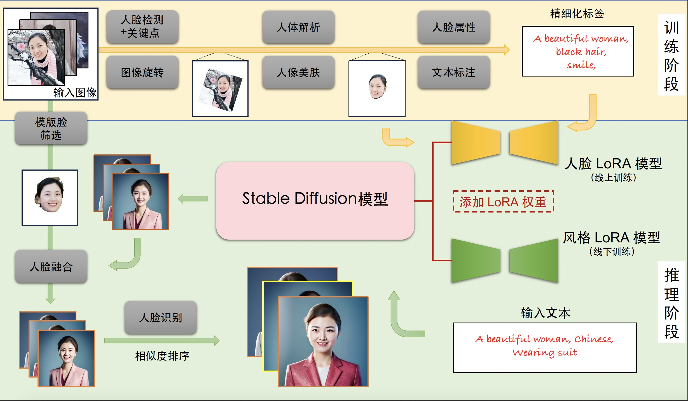


<h2 id="4.介绍一下InstantID人像一致性技术的核心原理">4.介绍一下InstantID人像一致性技术的核心原理</h2>

### 面试问题：介绍一下InstantID人像一致性技术的核心原理和整体功能

InstantID人像一致性技术的核心目标是：给定一张（或多张）参考人脸图片，在扩散模型生成时保持高度的人物身份一致性，同时允许用文本提示词、ControlNet等自由控制姿态、风格和背景，无需额外微调训练或LoRA微调。

InstantID人像一致性技术中依赖模型及其作用：
1. InsightFace模型：**人脸检测**在输入图像中定位人脸区域（bbox）；**人脸识别嵌入**从人脸区域提取 512 维的身份向量（face_embedding），这是整个 InstantID 的核心"人脸指纹"；**面部关键点提取**提取 5 个面部关键点（双眼、鼻尖、两侧嘴角），用于绘制关键点图传入ControlNet。
2. InstantID 模型：把 InsightFace 输出的 512 维人脸向量，通过 Perceiver Resampler（4层、20头 Perceiver 交叉注意力）自适应模块映射为 16 个 1024 维的 token，格式与 CLIP 文本嵌入对齐，可直接写入扩散模型的 cross-attention中（每个 U-Net 中的 cross-attention 层都对应一组 K 投影 和 V 投影，将 Resampler 输出的身份 token 投影为该层的 Key/Value，在原始 attention 输出基础上**叠加add**人脸身份 attention 的输出）。
3. ControlNet 模型：InstantID 专用 ControlNet，是专为人脸关键点设计的变体模型。输入的"控制图"是由 InsightFace 关键点绘制的彩色关键点图（而非深度、线稿等），引导扩散模型维持人脸的面部结构与姿态。

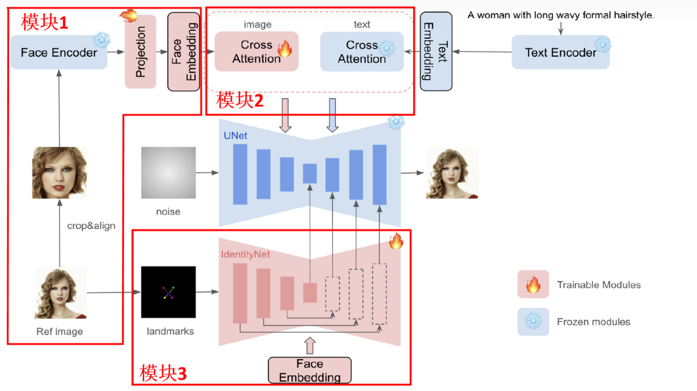

Rocky也总结了InstantID的整体流程图，方便大家学习理解：

```python
参考人脸图 ─────────────────────────────────────────────┐
                                                        ▼
InsightFace (antelopev2)  ──→  512维 face_embed ──→ Resampler ──→ 16×1024 identity tokens
                          ─→  5点 keypoints ──────→ draw_kps ──→ 关键点彩色图
                                                                    │
                                                                    ▼
base MODEL + ControlNet ─────────────────────────────────── ControlNet.set_cond_hint(kps_img)
                                                            + conditioning['cross_attn_controlnet'] = identity_tokens
                                                            + conditioning['control'] = ControlNet

base MODEL ──→ clone ──→ U-Net cross-attn 注入 identity K/V
                                    │
                                    ▼
                              修改后的 MODEL
                                    │
                            与 conditioning 一起
                                    ▼
                              扩散采样
                             （同时受文本 + 身份 + ControlNet 约束）
                                    │
                                    ▼
                             身份一致的生成图像
```

### 面试问题：在单ID图像的情况下，为什么InstantID人物一致性比Photomaker效果好？

1.InstantID利用预训练的人脸模型（如insightface库中的模型）来提取面部特征的语义信息。与Photomaker所使用的CLIP模型相比，这种方法能够更精准和丰富地捕获人物面部表情的特征。

2.InstantID还使用ControlNet来增强面部特征提取，进一步提高图像生成的质量和准确性。

3.Photomaker是先将文本特征和图像特征通过MLPs融合，再做CrossAttention加入U-net。InstantID是图像特征和文本特征分开做CrossAttention，再融合。（可以认为是区别，不要一定是效果好的原因）


<h2 id="5.介绍一下Easyphoto人像一致性技术的核心原理，训练和推理过程是什么样的？">5.介绍一下Easyphoto人像一致性技术的核心原理，训练和推理过程是什么样的？</h2>

#### EasyPhoto的训练流程

1. 人像得分排序：人像排序流程需要用到人脸特征向量、图像质量评分与人脸偏移角度。其中人脸特征向量用于选出最像本人的图片，用于LoRA的训练；图像质量评分用于判断图片的质量，选出质量最低的一些进行超分，提升图片质量；人脸偏移角度用于选出最正的人像，这个最正的人像会在推理阶段中作为参考人像进行使用，进行人脸融合。
2. Top-k个人像选取：选出第一步中得分最高的top-k个人像用于LoRA模型的训练。
3. 显著性分割：将背景进行去除，然后通过人脸检测模型选择出人脸周围的区域。
4. 图像修复：使用图像修复算法进行图像修复，并且超分，并使用美肤模型，最终获得高质量的训练图像。
5. LoRA模型训练：使用处理好的数据进行LoRA模型的训练。
6. LoRA模型融合：在训练过程中，会保存很多中间结果，选择几个效果最好的模型，进行模型融合，获得最终的LoRA模型。

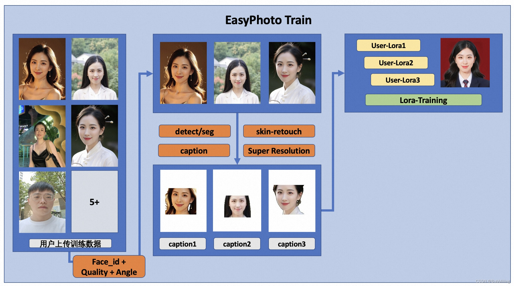 

#### EasyPhoto的推理流程

##### 初步重建

1. 人脸融合：使用人脸融合算法，给定一张模板图和一张最佳质量的用户图，人脸融合算法能够将用户图中的人脸融合到模板人脸图像中，生成一张与目标人脸相似，且具有模版图整体外貌特征的新图像。
2. 人脸裁剪与仿射变换：将训练过程中生成的最佳人脸图片进行裁剪和仿射变换，利用五个人脸关键点，将其贴到模板图像上，获得一个Replaced Image，这个图像会在下一步中提供openpose信息。
3. Stable Diffusion + LoRA重绘和ControlNet控制：使用Canny控制（防止人像崩坏）、颜色控制（使生成的颜色符合模板）以及Replaced Image的Openpose+Face pose控制（使得眼睛与轮廓更像本人），开始使用Stable Diffusion + LoRA进行重绘，用脸部的Mask让重绘区域限制在脸部。

##### 边缘完善

1. 人脸再次融合：和初步重建阶段一样，我们再做一次人脸融合以提升人脸的相似程度。
2. Stable Diffusion + LoRA重绘和ControlNet控制：使用tile控制（防止颜色过于失真）和canny控制（防止人像崩坏），开始第二次重绘，主要对边缘（非人像区域）进行完善。

##### 后处理

后处理主要是提升生成图像的美感与清晰度。

1. 人像美肤：使用人像美肤模型，进一步提升写真图片的质感。
2. 超分辨率重建：对写真图片进行超分辨率重建，获取高清大图。

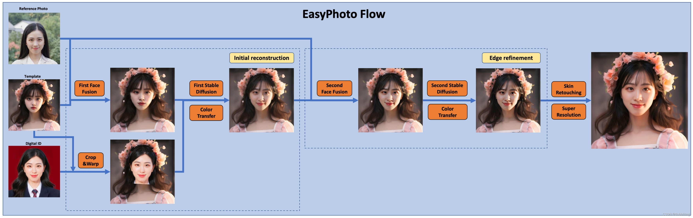 

### 面试问题：EasyPhoto中应用到了哪些人脸特征处理算法？

EasyPhoto作为一款基于Stable Diffusion的AI写真生成工具，深度融合了多类先进的人脸特征处理算法，通过全自动化的流程实现了从训练到推理的高质量人像生成。以下是Rocky对其核心技术进行系统性解析：

#### 一、**人脸检测与关键点定位算法：建立面部几何结构基础**
1. **RetinaFace人脸检测**  
   - **功能**：在多张用户上传图片中精准定位人脸边界框（Bounding Box）及五官关键点（如双眼、鼻尖、嘴角等）。  
   - **作用**：  
     - 排除非人像或低质量图片（如人脸尺寸 < 128像素）；  
     - 为人脸对齐、分割、融合等后续步骤提供空间基准。  

2. **人脸关键点对齐（Face Alignment）**  
   - **方法**：基于RetinaFace检测到的5点关键点（双眼、鼻尖、嘴角），通过**仿射变换（Affine Transformation）** 将倾斜人脸旋转为正脸姿态。  
   - **意义**：消除姿态差异，提升后续特征提取的稳定性。对齐后人脸成为“标准脸”，便于CurricularFace等模型提取一致性高的特征向量。  

3. **关键点扩展应用（如68点/96点模型）**  
   - 在推理阶段结合**OpenPose** 技术，生成身体骨骼与面部细节关键点，用于控制生成图像的姿态与表情自然性。  

下表总结了人脸关键点定位在EasyPhoto中的应用场景：

| **技术** | **关键点数量** | **主要应用场景** | **作用** |
|----------|----------------|------------------|----------|
| **RetinaFace** | 5点 | 训练阶段：人脸检测与初步对齐 | 排除低质量图像，提供基础空间基准 |
| **扩展关键点模型** | 68点/96点 | 推理阶段：精细化控制 | 生成身体骨骼与面部细节，控制姿态与表情 |
| **OpenPose** | 全身多关键点 | 推理阶段：姿态控制 | 结合ControlNet实现姿态一致性 |

#### 二、**人脸特征提取与身份验证算法：保证人像一致性**
1. **CurricularFace深度特征提取**  
   - **原理**：使用预训练的深度卷积网络（如ResNet），从对齐后人脸中提取**512维特征向量（Embedding）** 。  
   - **应用**：  
     - 计算所有训练图片的**平均人脸特征向量**；  
     - 计算每张图与平均特征的**余弦相似度（0~1）**，用于筛选最接近用户本人特征的Top-K图片。  

2. **人脸质量评分与角度筛选**  
   - **质量评估**：结合图像清晰度、光照均匀性等指标，排除模糊或低质图片。  
   - **偏移角度计算**：  
     ```python
     # 计算双眼连线水平倾斜角
     x = keypoint_right_eye_x - keypoint_left_eye_x
     y = keypoint_right_eye_y - keypoint_left_eye_y
     angle = arctan(y/x)  # 角度归一化为0~1分 (90°→0分, 0°→1分)
     ```  
     最正人脸（最高分）作为推理阶段的**参考人脸（Reference Face）**，用于模板融合。  

#### 三、**人像分割与背景处理算法：聚焦人脸区域**
1. **显著性分割（Saliency Segmentation）**  
   - **技术**：使用类似U²-Net的模型分离人像与背景。  
   - **目的**：  
     - 训练阶段：排除背景干扰，使LoRA专注学习人脸特征；  
     - 推理阶段：结合Mask ControlNet，仅重建人脸区域，保持背景完整性。  

2. **背景修复与超分（如GPEN）**  
   - 对分割后的人脸区域进行**去噪、修复缺损部位（如遮挡耳朵）**，再使用**超分辨率模型（如ABPN）** 提升画质至高清。  

#### 四、**人像修复与质量增强算法：提升输入数据质量**
- **GPEN人脸修复**：针对模糊、低分辨率或遮挡的人脸，通过生成对抗网络（GAN）重建细节（如皮肤纹理、发丝）。  
- **ABPN美肤模型**：消除痘印、皱纹等瑕疵，生成均匀肤色，为LoRA提供高质量训练样本。  

#### 五、**人脸融合与表情迁移算法：实现自然换脸**
1. **参考人脸融合（Reference Fusion）**  
   - 将用户最正人脸（Reference Photo）与模板人脸通过**图像变形（Warping）与泊松融合（Poisson Blending）** 结合，生成过渡自然的“基础脸”。  
   - 输出作为ControlNet的**Canny边缘图输入**，引导生成图像保持原人脸结构。  

2. **仿射变换贴合（Affine Warping）**  
   - 利用5点关键点，将LoRA生成的人脸仿射变换后贴合至模板身体，生成带姿态控制的**Replaced Image**。  

#### 六、**人像美化与风格化处理算法：优化生成效果**
1. **双边滤波磨皮（Bilateral Filtering）**  
   - 在推理后处理阶段使用，平滑皮肤同时保留五官边缘锐度，避免“塑料感”。  
2. **HSV色彩空间调整**  
   - 转换至HSV空间，调节饱和度（S）和明度（V）实现**自然美白**，避免RGB直接调整导致的色偏。  
3. **液化变形（Liquify Deformation）**  
   - 通过移动像素位置实现**瘦脸、大眼**等效果，公式控制变形强度随距离中心点衰减。  

#### 七、**算法协同框架：从训练到推理的全链路整合**
1. **训练阶段**  
   ```mermaid
   graph LR
   A[用户上传图片] --> B(RetinaFace检测+对齐)
   B --> C(CurricularFace提取特征)
   C --> D{筛选Top-K图片}
   D --> E[分割背景 + GPEN修复]
   E --> F[训练LoRA]
   ```  
   - LoRA训练中每100步验证一次，按人脸相似度自动融合最优权重。  

2. **推理阶段**  
   - **多ControlNet协同**：  
     - Canny边缘控制（防崩坏） + OpenPose姿态控制 + 颜色迁移 + Mask局部重绘。  
   - **两阶段生成**：  
     - 初步重建（人脸区域） → 边缘完善（头发、衣领等衔接处）。  

> 纵观其技术体系，EasyPhoto的核心竞争力在于将学术界前沿算法（如CurricularFace、GPEN）工程化为端到端流程，推动AI写真从“专家可用”迈向“大众可玩”。其开源生态（GitHub Star超9k）亦加速了工业级AI视觉应用的普惠化进程。


<h2 id="6.介绍一下LayerDiffusion图层分离技术的核心原理">6.介绍一下LayerDiffusion图层分离技术的核心原理</h2>


<h2 id="7.介绍一下IP-Adapter图像特征参考技术的核心原理">7.介绍一下IP-Adapter图像特征参考技术的核心原理</h2>

IP-Adapter 采用了一种解耦的交叉注意力机制，将文本特征和图像特征分开处理，从而使得生成的图像能够更好地继承和保留输入图像的特征。

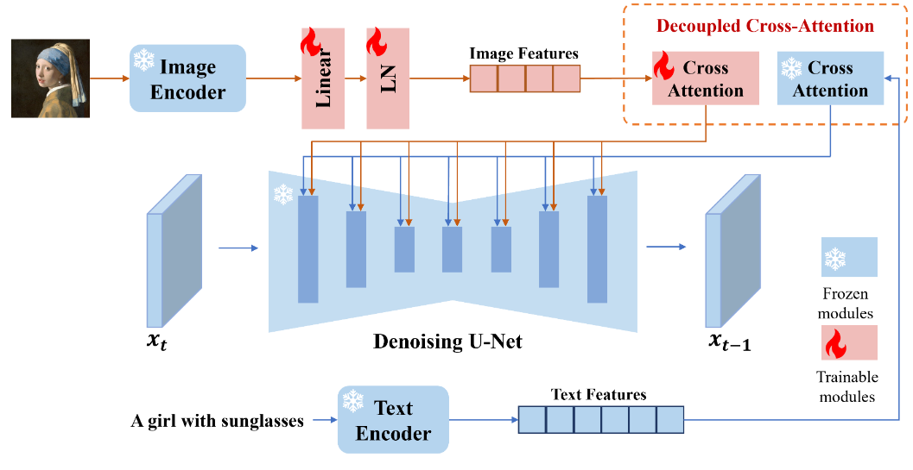
图像编码：IP-Adapter 使用预训练的 CLIP（Contrastive Language-Image Pre-training）图像编码器来提取图像提示的特征。

解耦交叉注意力机制：IP-Adapter 通过这种机制，将文本特征的 Cross-Attention 和图像特征的 Cross-Attention 分区开来。在Unet 的模块中新增了一路 Cross-Attention 模块，用于引入图像特征。

适配模块：IP-Adapter 包含一个图像编码器和包含解耦交叉注意力机制的适配器。这个适配器允许模型在生成图像时，同时考虑文本提示和图像提示，生成与文本描述相匹配的图像。


<h2 id="8.介绍一下SUPIR超分技术的核心原理">8.介绍一下SUPIR超分技术的核心原理</h2>

### 面试问题：介绍一下SUPIR超分技术的整体功能

SUPIR（Scaling Up to Excellence: Practicing Model Scaling for Photo-Realistic Image Restoration） 本质是将 SDXL 的强大生成能力改造成超分辨率/图像修复引擎。核心思路是让 SDXL 的扩散过程不再是"从噪声生成"，而是"以降质图像为控制条件，生成高质量版本"。

其包含了超分辨率（低分辨率图像放大到高分辨率，比如4×）、图像修复（去除压缩噪声、模糊、JPEG artifact）、细节补全（结合文字描述captions/prompt，生成合理细节）、颜色校正（AdaIn 或 Wavelet 方法修正色偏）。

### 面试问题：介绍一下SUPIR超分技术的原理

SUPIR技术框架中的依赖模型及其作用：
1. SDXL 基础模型：SUPIR 的核心是在 SDXL 的基础上叠加控制能力。
2. SUPIR 专有模型（SUPIR-v0F.ckpt 或 SUPIR-v0Q.ckpt）：SUPIR 模型的权重叠加在 SDXL 之上，包含：GLVControl（控制模型，ControlNet 架构的变体）和LightGLVUNet（修改后的主扩散 UNet，在原 SDXL UNet 基础上插入 ZeroSFT 适配层）。

Rocky也总结了SUPIR的整体流程图，方便大家学习理解：

```python
SDXL底座 ──→ [SUPIR Model Loader v2] ──────────────────────────────────────────┐
SDXL CLIP ─┘                                                                   │
SDXL VAE  ─┘        ↓ SUPIRMODEL              ↓ SUPIRVAE                       │
SUPIR ckpt ─┘                                                                   │
                                                                                │
原始低质图像 ──→ [SUPIR First Stage] ──→ 去噪后latent ──→ [SUPIR Conditioner] ─→│
                     ↓                                          ↓               │
              去噪预览图（可选）              SUPIR_cond_pos/neg ──→ [SUPIR Sampler]
                                                                        ↓
                                                                   采样结果 latent
                                                                        ↓
                                                               [SUPIR Decode]
                                                                        ↓
                                                                  高质量超分图像
```

<h2 id="9.介绍一下AnyText文字渲染技术的核心原理">9.介绍一下AnyText文字渲染技术的核心原理</h2>


<h2 id="10.介绍一下IDM_VTON虚拟试衣（try-on）技术的核心原理">10.介绍一下IDM_VTON虚拟试衣（try-on）技术的核心原理</h2>


---
