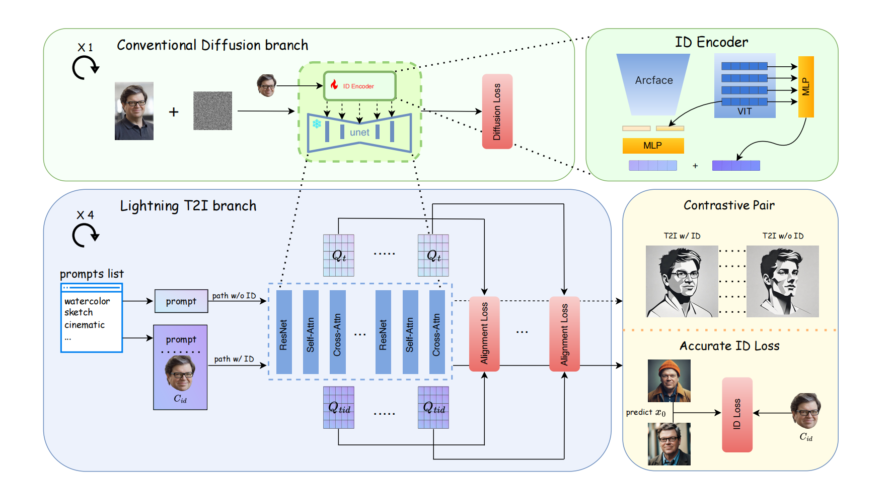
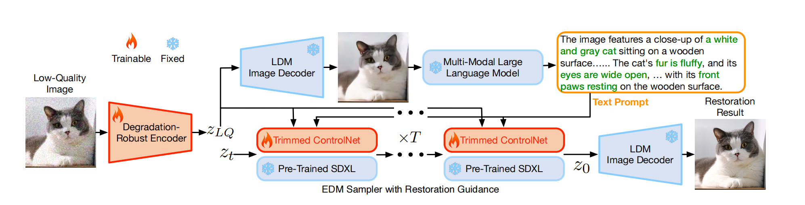
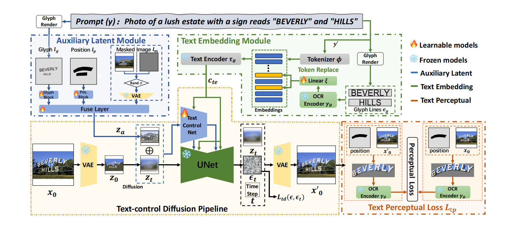
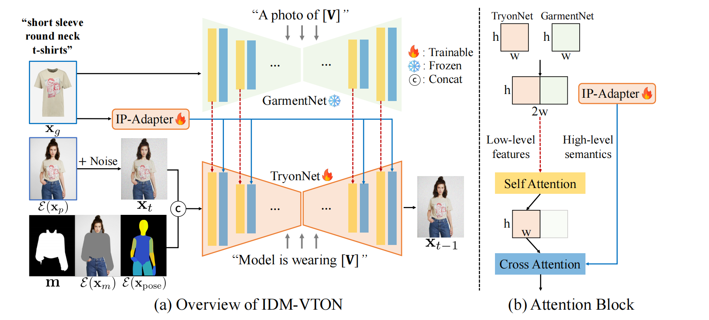

# 目录

## 第一章 ControlNet模型技术基础

[1.介绍一下ControlNet的技术原理与模型架构](#q-001)
  - [面试问题：介绍一下ControlNet的最小单元和整体模型架构](#q-002)
  - [面试问题：ControlNet如何处理条件图？ControlNet是如何在AIGC大模型中起作用的？](#q-003)
  - [面试问题：在扩散模型中加入ControlNet训练后，训练时间和显存有什么变化？](#q-004)
  - [面试问题：ControlNet中的Zero Convolution初始权重为什么是0？Zero Convolution为什么有效？](#q-007)
  - [面试问题：ControlNet中Balanced、My prompt is more important、ControlNet is more important三种模式有什么区别？](#q-008)

[2.介绍一下ControlNet主流控制条件的原理与功能](#q-009)
  - [面试问题：ControlNet有多少种控制条件？介绍一下各控制条件的原理与功能](#q-010)
  - [面试问题：多个ControlNet如何组合？多条件控制时如何处理冲突？](#q-019)
  - [面试问题：ControlNet有哪些主流的AIGC应用案例？](#q-020)

[3.ControlNet是如何训练的？训练ControlNet模型的流程中有哪些关键参数？](#q-011)
  - [面试问题：介绍一下ControlNet的训练过程](#q-012)
  - [面试问题：如何设计一个新的ControlNet控制条件？训练数据集应该怎么构建？](#q-017)
  - [面试问题：ControlNet的损失函数是什么？](#q-013)
  - [面试问题：ControlNet有哪些关键的训练参数？](#q-014)

[4.ControlNet有哪些主流改进版本？](#q-015)
  - [面试问题：ControlNet 1.1与ControlNet相比，有哪些改进？](#q-016)
  - [面试问题：介绍一下ControlNet-Union的原理和架构](#q-018)
  - [面试问题：从Stable Diffusion到FLUX的迭代中，ControlNet有哪些跨周期的本质价值？](#q-005)

## 第二章 其他主流AIGC可控生成技术基础

[1.介绍一下多阶段训练的人像一致性特征注入技术的原理，都有哪些经典算法？](#q-027)
  - [面试问题：多阶段训练式人像一致性的本质原理和跨周期价值是什么？](#q-028)
  - [面试问题：介绍一下FaceChain的AI写真生成链路和技术原理](#q-029)
  - [面试问题：介绍一下EasyPhoto的AI写真生成链路和技术原理](#q-030)
  - [面试问题：多阶段训练的人像一致性特征注入技术中，有哪些关键的人脸处理算法？](#q-031)

[2.介绍一下免训练的人像一致性特征注入技术的原理，都有哪些经典算法？](#q-021)
  - [面试问题：免训练人像一致性特征注入的本质原理和跨周期价值是什么？](#q-022)
  - [面试问题：PuLID系列如何通过身份Token和正交投影平衡身份、文本与风格？](#q-023)
  - [面试问题：InstantID如何通过人脸识别特征和关键点控制实现零样本身份保持？](#q-024)
  - [面试问题：EcomID这类电商人像一致性方案补齐了什么工程能力？](#q-025)

[3.介绍一下参考图特征注入与图层化编辑的核心原理，都有哪些经典算法？](#q-032)
  - [面试问题：IP-Adapter如何把参考图从灵感风格注入AIGC大模型](#q-033)
  - [面试问题：LayerDiffuse如何把单张图构建为可组合图层？](#q-034)

[4.介绍一下特定生产任务如扩散超分修复、文字渲染和虚拟试衣等可控生成技术架构与原理](#q-035)
  - [面试问题：SUPIR这类扩散超分修复技术的核心原理是什么？](#q-036)
  - [面试问题：AnyText这类文字渲染技术为什么能提升图像中文字的可控性？](#q-037)
  - [面试问题：IDM-VTON这类虚拟试衣技术如何同时保持人物、服装和结构一致？](#q-038)

---

# 第一章 ControlNet模型技术基础

<h1 id="q-001">1.介绍一下ControlNet的技术原理与模型架构</h1>

<h2 id="q-002">面试问题：介绍一下ControlNet的最小单元和整体模型架构</h2>

**难度评分：⭐⭐⭐⭐ (4/5)  |  考察频率：⭐⭐⭐⭐⭐ (5/5)**

Rocky认为，ControlNet的跨周期价值不在于它只是Stable Diffusion时代的一个插件，而在于它把扩散模型的“提示词控制”推进到了“结构条件控制”。文本Prompt擅长描述语义，但很难稳定约束姿态、边缘、深度、构图、局部区域和物体关系。ControlNet解决的正是这个问题：**在不破坏底座生成能力的前提下，为扩散模型增加一条可训练、可插拔、可组合的条件控制通道。**

如果从生成建模角度看，加入ControlNet后的扩散模型可以理解为一种“双条件扩散模型”：原来的文本条件负责“生成什么”，ControlNet提供的外部结构条件负责“按照什么形状、姿态、空间关系和局部约束生成”。这不是简单多塞一张图，而是让模型在去噪过程中同时听懂文本语义和视觉结构。

<div align="center">


</div>

从模型结构看，ControlNet的核心可以拆成四件事：

1. **冻结原始扩散模型，保留底座能力。** Stable Diffusion、SDXL或其他扩散底座已经从大规模图文数据中学到了丰富的视觉先验。如果直接微调整个U-Net，模型很容易在小规模控制数据上过拟合，并且破坏原模型的泛化能力。ControlNet选择保留一个locked copy，让底座能力成为稳定基线。
2. **复制一条可训练分支，学习条件控制。** 在经典Stable Diffusion ControlNet中，通常会复制U-Net的Encoder和Middle Block等关键结构作为trainable copy，让它接收边缘图、姿态图、深度图、分割图等条件图，从这些条件中学习“应该如何影响去噪特征”。到了SDXL、FLUX这类新底座上，复制对象和注入位置会随架构变化，但“冻结底座 + 训练控制分支”的思想仍然成立。
3. **用Zero Convolution安全注入控制残差。** 控制分支不会一开始就强行干预底模，而是通过零初始化的1x1卷积输出残差。训练初期残差为0，模型等价于原始扩散模型；随着训练推进，控制残差逐渐学会在合适层级影响生成。
4. **多层特征融合，而不是只在输入端拼接条件。** ControlNet并不是简单把条件图和噪声latent拼在一起，而是在U-Net不同分辨率层级注入控制特征。低层更偏边缘与纹理，高层更偏结构与语义，这也是它能控制复杂画面的关键。

进一步拆到最小单元，ControlNet可以理解为“冻结主干 + 可训练副本 + 零初始化残差连接”：

<div align="center">


</div>

原始扩散模型的某个网络块被复制成两条路径：locked copy保持冻结，trainable copy接收条件输入并学习控制残差，最后通过Zero Convolution把残差加回主干特征。

这个设计有三个好处：

1. **保护底模。** 冻结路径保留原模型已经学到的世界知识和绘画能力。
2. **隔离控制学习。** 可训练路径专门学习条件图如何影响生成，避免把控制任务和通用生成能力混在一起训练。
3. **渐进式接管。** Zero Convolution初始输出为0，训练早期不会扰乱底模；当控制分支学到有效信息后，残差才逐渐变强。

面试中如果想回答得更本质，可以说：ControlNet的最小单元体现的是一种经典系统设计思想，**不要改坏一个已经很强的系统，而是在旁边接一条可控、可学习、可回退的增量路径。** 这就是它比“直接把条件图拼到输入里”更稳定的原因。它学习的不是重新画图的全部能力，而是学习“外部条件应该怎样变成去噪过程中的控制残差”。

<h2 id="q-003">面试问题：ControlNet如何处理条件图？ControlNet是如何在AIGC大模型中起作用的？</h2>

**难度评分：⭐⭐⭐⭐ (4/5)  |  考察频率：⭐⭐⭐⭐⭐ (5/5)**

条件图进入模型前，一般会先经过预处理器。预处理器可以是传统视觉算法，也可以是深度学习模型，例如Canny边缘检测、OpenPose姿态估计、MiDaS/LeReS/Zoe深度估计、语义分割模型、法线估计模型等。它们的作用不是生成最终图片，而是把参考图压缩成一种更“干净”的控制表示。

这里要先区分两个概念：**预处理器不是ControlNet本体，ControlNet模型也不是预处理器。** 预处理器负责把人类能看懂的参考图转成边缘、深度、姿态、分割、线稿等条件图；ControlNet负责学习这些条件图在扩散去噪过程中应该如何影响中间特征。如果用户已经有手工绘制或其他模型生成好的条件图，也可以跳过预处理器，直接把条件图输入ControlNet。

真正进入ControlNet后，条件图会通过一个轻量卷积编码网络转换为与U-Net特征尺度匹配的条件特征。这里有一个容易被忽略的点：Stable Diffusion工作在latent空间，512x512像素图通常会被VAE压缩到64x64 latent；ControlNet也必须把条件图对齐到扩散特征所在的空间尺度，否则条件无法稳定参与去噪。

所以面试中可以这样回答：**ControlNet处理条件图的本质，是把人类可理解的结构信号转换成扩散模型可使用的多尺度特征残差。预处理器负责提取条件，条件编码器负责对齐尺度，ControlNet分支负责学习这些条件应该在去噪过程的哪些层级发挥作用。** 条件图质量决定控制上限，ControlNet训练质量决定模型到底会不会用这个条件。

从完整推理链路看，在以Stable Diffusion、SDXL、FLUX等模型为代表的AIGC图像生成流程中，ControlNet通常从一张参考图开始。参考图会先经过预处理器，被抽取成边缘、姿态、深度、法线、分割、线稿等条件图；如果用户已经有处理好的条件图，也可以跳过预处理器，直接把条件图输入ControlNet。

<div align="center">


</div>

接下来，条件图会被ControlNet编码成多尺度特征，并在扩散模型的去噪过程中与文本Prompt、负向Prompt、初始latent、时间步信息共同作用。文本负责“生成什么”，条件图负责“按照什么结构生成”，底座模型负责“把这些约束转化为合理图像”。

<div align="center">


</div>

Rocky会把ControlNet的作用概括成一句话：**它不是让模型更会画，而是让模型更听指挥。** 这句话背后的技术含义是，ControlNet把扩散模型从纯粹的概率采样器，推进成了可以接受外部结构约束的生成系统。跨周期看，这个思想会一直存在：无论底座从U-Net变成DiT，还是从SD变成FLUX、Imagen、GPT-Image，生产级生成都绕不开结构控制、参考控制和局部控制。

<h2 id="q-004">面试问题：在扩散模型中加入ControlNet训练后，训练时间和显存有什么变化？</h2>

**难度评分：⭐⭐⭐⭐ (4/5)  |  考察频率：⭐⭐⭐⭐⭐ (5/5)**

ControlNet比直接全量微调整个扩散模型更省显存，因为底座U-Net的大部分参数被冻结，反向传播主要发生在可训练控制分支和Zero Convolution等新增模块上。这里不要机械背某个固定数字，因为不同底座、不同实现、不同分辨率、不同batch size和不同优化策略都会改变显存与耗时。更重要的是理解背后的工程逻辑：ControlNet不是免费午餐，它用额外前向计算换来了更稳定的外部条件控制。

这个问题面试时不要只背数字，更要说清楚工程逻辑：

1. **显存下降来自冻结参数。** 冻结分支不需要保存完整的梯度和优化器状态，因此训练显存明显低于全量微调底座。
2. **耗时上升来自额外前向计算。** ControlNet多走了一条控制分支，还要在多层注入控制特征，所以单步计算量会增加。
3. **中间激活仍然是主要成本之一。** 即使参数冻结，训练时仍然需要保留一部分前向中间状态来完成控制分支学习；分辨率越高、控制分支越深，成本越明显。
4. **它用时间换可控性，用结构设计换稳定性。** 这也是很多Adapter类方法的共同工程哲学：不重训底座，而是在底座旁边增加可训练控制模块。

面试中可以收束为一句话：**ControlNet训练的成本变化，本质上是“冻结底座节省反向传播成本”和“新增控制分支增加前向计算成本”之间的权衡。**

<h2 id="q-007">面试问题：ControlNet中的Zero Convolution初始权重为什么是0？Zero Convolution为什么有效？</h2>

**难度评分：⭐⭐⭐⭐ (4/5)  |  考察频率：⭐⭐⭐⭐⭐ (5/5)**

Zero Convolution是ControlNet面试中最容易被问到的点，因为它看起来反直觉：如果卷积权重初始化为0，会不会导致梯度也为0，最终什么都学不到？

答案是不会。假设一个简化的一维线性层为：

```math
y = wx + b
```

它的梯度是：

```math
\frac{\partial y}{\partial w}=x,\quad \frac{\partial y}{\partial x}=w,\quad \frac{\partial y}{\partial b}=1
```

当初始化时 $w=0$ 且 $x \neq 0$，可以得到：

```math
\frac{\partial y}{\partial w}\neq 0,\quad \frac{\partial y}{\partial x}=0,\quad \frac{\partial y}{\partial b}\neq 0
```

也就是说，第一步反向传播时，权重 $w$ 仍然可以被更新；一旦 $w$ 从0变成非零，后续输入方向的梯度也会逐渐打开。Zero Convolution不是让网络永远静默，而是让它在训练初期“安全静默”，等到学到有效控制残差后再逐步介入。

它的工程价值可以概括为三点：

1. **初始等价于原模型。** 未训练ControlNet时，控制分支输出为0，整体效果不破坏底模。
2. **避免随机残差污染。** 如果新增分支随机初始化，一开始就会往U-Net中注入随机噪声，训练会更不稳定。
3. **让控制强度从数据中长出来。** 控制残差不是手工硬塞进去的，而是在数据和损失函数约束下逐渐学习出来的。

<h2 id="q-008">面试问题：ControlNet中Balanced、My prompt is more important、ControlNet is more important三种模式有什么区别？</h2>

**难度评分：⭐⭐⭐⭐ (4/5)  |  考察频率：⭐⭐⭐⭐⭐ (5/5)**

这三种模式本质上是在调节“文本语义”和“结构条件”谁拥有更高控制权。它不是一个纯UI选项，而是生产中非常重要的控制权分配问题。

<div align="center">

| 模式 | 控制倾向 | 适合场景 | 风险 |
|---|---|---|---|
| Balanced | Prompt和ControlNet相对均衡 | 大多数普通生图、姿态控制、构图参考 | 两边都不极端，复杂冲突时可能不够坚定 |
| My prompt is more important | 更尊重文本语义 | 希望保留Prompt指定风格、主体、服装、表情 | 条件图约束可能变弱，结构跟随不够严格 |
| ControlNet is more important | 更尊重条件图 | 精准姿态、建筑线稿、产品结构、固定构图 | Prompt可编辑空间变小，生成可能显得拘谨 |

</div>

Rocky在实践中更建议把它理解为“生成自由度”的旋钮：Prompt越重要，模型越像创作者；ControlNet越重要，模型越像执行者。面试收束可以这样说：**ControlNet不是替代Prompt，而是和Prompt一起构成控制系统；真正的能力是知道什么时候该让模型自由发挥，什么时候该让模型严格服从结构。**

实际使用时还要结合任务类型判断：扩图、局部重绘、精准姿态、建筑线稿、产品轮廓这类任务通常更需要结构条件强一些；风格迁移、主体替换、创意海报这类任务则要给Prompt留出更大语义空间。这个问题背后真正考察的不是你记不记得三个UI选项，而是你是否理解可控生成中的“控制权分配”。

<h1 id="q-009">2.介绍一下ControlNet主流控制条件的原理与功能</h1>

<h2 id="q-010">面试问题：ControlNet有多少种控制条件？介绍一下各控制条件的原理与功能</h2>

**难度评分：⭐⭐⭐⭐ (4/5)  |  考察频率：⭐⭐⭐⭐⭐ (5/5)**

ControlNet的条件类型很多，但面试中不要把它背成模型列表。更好的回答方式是按“控制信息层级”来归纳：低层几何控制、中层空间结构控制、高层语义区域控制、风格纹理控制、局部编辑控制。这样回答更能体现你理解的是可控生成的底层逻辑，而不是只记住了插件名字。

<div align="center">

| 控制类别 | 典型模型/预处理器 | 控制对象 | 核心价值 |
|---|---|---|---|
| 边缘与线条 | Canny、MLSD、Scribble、SoftEdge、Lineart | 轮廓、线稿、直线结构 | 把构图和物体轮廓固定下来 |
| 几何与3D | Depth、Normal | 深度层次、表面朝向 | 保持空间关系、透视和立体感 |
| 姿态与关键点 | OpenPose、DW-Pose、Face Keypoints | 人体动作、手部、脸部关键点 | 解决人物动作和多人构图难控问题 |
| 语义与区域 | Segmentation、Mask、Inpaint | 天空、人物、衣服、背景等区域 | 支持像素级区域编辑和局部重绘 |
| 纹理与风格 | Shuffle、Reference、Tile | 色彩、纹理、局部细节 | 让参考图的风格或细节参与生成 |
| 特殊任务 | Tile、Inpaint、IP2P | 超分、修复、指令编辑 | 从文生图延伸到生产级编辑工作流 |
| 参考图与图像提示 | Reference-only、Revision、IP-Adapter | 图像语义、风格、内容参考 | 把参考图从“人类灵感”变成模型可读条件 |

</div>

如果从面试角度回答，最好不要停留在“有哪些模型”，而要进一步说清楚“什么时候用哪类条件”：

1. **轮廓必须严格对齐时，用Canny、Lineart、Scribble。** 例如产品图、建筑图、动漫线稿上色，核心是不能跑形。
2. **空间关系和透视更重要时，用Depth或Normal。** Depth更关注远近层次，Normal更关注表面朝向和局部几何。
3. **人物动作、手势和表情要稳定时，用OpenPose、DW-Pose或人脸关键点。** 这类条件适合人像写真、短剧海报、多人站位和动作一致性。
4. **区域编辑和局部重绘时，用Segmentation、Mask、Inpaint。** 它们解决的是“改哪里、不改哪里”的问题。
5. **细节修复、超分和局部纹理重建时，用Tile。** Tile不是简单插值放大，而是在原图结构约束下补充高频细节。
6. **希望参考风格、配色或图像语义时，用Shuffle、Reference-only、Revision或IP-Adapter。** 这类能力已经从传统ControlNet扩展到更广义的Adapter控制生态。

### 第一类：边缘与线条控制

Canny、MLSD、Scribble、SoftEdge、Lineart这类条件都在解决“轮廓和线条怎么不跑偏”的问题。Canny适合清晰边缘；MLSD适合建筑、室内、产品这类直线结构；Scribble适合粗糙草图；SoftEdge比Canny更柔和，适合自然物体；Lineart更适合动漫线稿和艺术作品。

它们的共同本质是把图像压缩成二维结构骨架，让扩散模型在采样时围绕这个骨架生成细节。

### 第二类：几何与3D控制

Depth和Normal关注的是三维关系。Depth控制前景、中景、背景的距离层次；Normal控制表面朝向和局部几何细节。它们比边缘更接近空间理解，适合室内设计、建筑渲染、产品展示和复杂场景重绘。

跨周期看，深度、法线、相机位姿、多视角一致性会越来越重要，因为图像生成正在从“单张好看”走向“空间一致、可编辑、可用于3D和视频”。

### 第三类：姿态、关键点与语义区域控制

OpenPose、DW-Pose、人脸关键点、语义分割和Mask控制，本质上是在把人类关注的高层结构显式化。比如人物姿态、手部动作、面部关键点、天空/衣服/道路/人物区域等。这类控制条件非常接近实际生产需求：电商要固定模特姿态，短剧海报要固定多人站位，AI写真要固定脸部结构，设计图要固定区域布局。

### 第四类：风格、纹理和局部细节控制

Shuffle、Tile、Reference这类能力不一定控制明确结构，而是控制颜色分布、纹理密度和局部细节。Tile在超分和局部重绘里很重要，因为它可以在不完全改变原图大结构的情况下补充高频细节。

### 总结

面试中可以用一句话收束：**ControlNet条件类型虽然很多，但背后只有一个核心问题：把原本隐含在图片里的结构信息，显式变成模型可读的控制变量。** 真正值得学习的不是某个预处理器的名字，而是你能否判断一个生产问题到底需要边缘、深度、姿态、分割、纹理还是多条件组合。

<h2 id="q-019">面试问题：多个ControlNet如何组合？多条件控制时如何处理冲突？</h2>

**难度评分：⭐⭐⭐⭐ (4/5)  |  考察频率：⭐⭐⭐⭐ (4/5)**

单个ControlNet解决的是“引入一种外部条件”，多个ControlNet解决的是“让多个外部条件共同约束同一次生成”。生产场景里很少只有一种控制需求：AI写真可能既要固定人物姿态，又要保持脸部结构，还要参考某种风格；室内设计可能既要遵守深度透视，又要保留墙线和家具区域；电商商品图可能既要保持商品轮廓，又要重绘背景和局部材质。

从实现逻辑看，多ControlNet通常不需要联合训练。每个ControlNet可以围绕自己的条件独立训练，在推理时把多个控制分支的输出残差组合起来，再注入底座扩散模型的对应层级。换句话说，Multi ControlNet不是把多个插件简单“堆上去”，而是在去噪过程中把多种条件残差共同纳入控制系统。

常见组合可以这样理解：

<div align="center">

| 组合方式 | 控制目标 | 典型场景 | 关键风险 |
|---|---|---|---|
| OpenPose + Depth | 人物姿态 + 空间结构 | 人像、多人海报、短剧分镜 | 姿态和深度不一致时，人物可能变形 |
| Canny/Lineart + Tile | 轮廓保持 + 细节重建 | 动漫上色、产品超分、老图修复 | 轮廓过强会压制细节发挥 |
| Segmentation + Inpaint | 区域布局 + 局部编辑 | 换背景、换衣服、广告图编辑 | Mask边界处理不好会产生割裂感 |
| Depth + IP-Adapter/Reference | 空间结构 + 参考风格 | 室内设计、风格迁移、场景重绘 | 风格参考可能和空间约束冲突 |
| OpenPose + Face Keypoints | 身体动作 + 面部结构 | AI写真、数字人海报 | 面部控制过强会降低风格可变性 |

</div>

真正难的是处理冲突。多个条件同时输入时，并不是越多越好，而是要判断条件之间的优先级：

1. **硬结构优先。** 产品轮廓、建筑线稿、人体姿态这类不可变结构，通常比风格和色彩更优先。
2. **全局结构先于局部细节。** Depth、OpenPose、Segmentation决定大布局，Tile、Reference、Shuffle更适合补充细节和风格。
3. **Prompt负责语义补全，ControlNet负责边界约束。** 如果Prompt和条件图强烈冲突，要么降低Prompt自由度，要么降低控制权重，否则模型会在两套指令之间摇摆。
4. **多条件要少而准。** 一个成熟工作流通常不是打开所有ControlNet，而是选择最能约束关键变量的两三个条件。

面试中可以这样收束：**Multi ControlNet的长期价值，是把可控生成从单一约束推进到多约束协同。本质上它不是插件叠加，而是生成系统里的条件路由、约束融合和冲突管理。**

<h2 id="q-020">面试问题：ControlNet有哪些主流的AIGC应用案例？</h2>

**难度评分：⭐⭐⭐ (3/5)  |  考察频率：⭐⭐⭐⭐ (4/5)**

ControlNet的主流应用，本质上都围绕一个目标：让AIGC从“随机出图”变成“可交付的视觉生产流程”。面试中可以按行业场景来回答，而不是只列工具。

<div align="center">

| 应用场景 | 常用控制条件 | 解决的问题 |
|---|---|---|
| AI写真/数字人 | OpenPose、人脸关键点、Canny、Depth | 保持人物姿态、脸部结构和构图稳定 |
| 电商商品图 | Canny、Depth、Segmentation、Tile | 保持商品轮廓、材质和局部细节 |
| 室内设计/建筑 | MLSD、Depth、Normal、Segmentation | 控制空间透视、墙线、家具布局 |
| 动漫线稿上色 | Lineart、Scribble、SoftEdge | 保持线稿结构并生成高质量上色 |
| 海报与视觉设计 | Segmentation、Depth、Reference、Inpaint | 控制主体位置、背景层次和局部元素 |
| 图像修复与超分 | Tile、Inpaint、Canny | 在保持原图结构的同时增强细节 |
| 视频/动画前处理 | OpenPose、Depth、Lineart | 为多帧生成提供结构一致性约束 |

</div>

ControlNet真正改变的是生产关系。过去图片生成更像抽卡，用户不断调Prompt、换Seed、碰运气；ControlNet之后，用户可以把姿态、线稿、深度、区域、参考图拆成独立变量，再通过工作流组合起来。这也是为什么它虽然诞生于Stable Diffusion生态，但思想会被后续各种图像、视频、3D和Agent工作流吸收。

一句话收束：**ControlNet的历史贡献，是把AIGC从文本驱动的想象力工具，推进成了结构驱动的可控生产工具。**

<h1 id="q-011">3.ControlNet是如何训练的？训练ControlNet模型的流程中有哪些关键参数？</h1>

<h2 id="q-012">面试问题：介绍一下ControlNet的训练过程</h2>

**难度评分：⭐⭐⭐⭐ (4/5)  |  考察频率：⭐⭐⭐⭐ (4/5)**

ControlNet训练的核心不是“多训练一个模型”，而是把原始扩散模型的去噪能力和外部控制条件对齐起来。没有ControlNet时，扩散模型主要根据噪声latent、时间步和文本条件预测噪声或速度；加入ControlNet后，模型还要学习一件事：给定某种条件图时，应该在不同U-Net层级注入什么样的控制残差。

<div align="center">


</div>

训练数据通常由三部分组成：

1. **目标图像。** 也就是模型最终应该还原或生成的Ground Truth图像。
2. **条件图像。** 从目标图像或配对参考图中提取的边缘、姿态、深度、分割等控制条件。
3. **文本描述。** 对目标图像的Caption或Prompt，用于保留文本语义控制能力。

加入ControlNet后，整体流程可以理解为：

<div align="center">


</div>

在训练初始阶段，由于Zero Convolution输出为0，ControlNet不会影响原始扩散模型：

```math
\begin{cases}
\mathcal{Z}\left(\boldsymbol{c};\Theta_{z1}\right)=0 \\
\mathcal{F}\left(x+\mathcal{Z}\left(\boldsymbol{c};\Theta_{z1}\right);\Theta_c\right)=\mathcal{F}(x;\Theta_c) \\
\mathcal{Z}\left(\mathcal{F}(x;\Theta_c);\Theta_{z2}\right)=0
\end{cases}
```

随后，控制分支会在扩散训练目标的约束下逐渐学习有效残差。常见训练步骤是：

1. 选择控制任务，例如Canny、Depth、OpenPose、Segmentation或自定义条件。
2. 构建三元组数据：目标图像、条件图、Caption。
3. 冻结底座模型，复制并训练ControlNet分支。
4. 使用扩散模型原有噪声预测损失进行训练。
5. 通过验证集检查控制强度、提示词服从度、结构保真度和泛化能力。

<h2 id="q-017">面试问题：如何设计一个新的ControlNet控制条件？训练数据集应该怎么构建？</h2>

**难度评分：⭐⭐⭐⭐ (4/5)  |  考察频率：⭐⭐⭐⭐ (4/5)**

训练ControlNet最容易被误解的地方，是大家一上来就盯着训练脚本、学习率和显卡配置。Rocky认为，真正决定一个自定义ControlNet有没有价值的，往往不是脚本，而是**控制条件设计**。如果控制条件本身不稳定、不通用、和生成目标弱相关，那么后面训练得再久，也只是把一个低质量约束学得更熟。

设计新的ControlNet控制条件，可以按三个问题判断：

1. **这个条件是否能稳定提取？** 比如边缘、深度、人体关键点、人脸关键点、语义分割、法线、草图、Mask都可以由传统CV算法或深度学习模型稳定生成。条件提取越稳定，模型越容易学到可迁移规律。
2. **这个条件是否和目标图像强相关？** 控制条件必须约束生成结果中真正重要的变量。电商场景关心商品轮廓和材质，人像场景关心姿态、脸部结构和手部，室内设计关心透视、墙线和区域布局。
3. **这个条件是否有生产价值？** 不是所有可提取特征都值得训练成ControlNet。真正值得训练的条件，应该能把一个原本不可控、反复抽卡的问题，变成稳定可复用的工作流变量。

训练数据集通常由三元组构成：

<div align="center">

| 数据组成 | 作用 | 构建要点 |
|---|---|---|
| Ground Truth图像 | 模型最终要还原或生成的目标图 | 需要足够多样，覆盖构图、主体、风格、光照和场景变化 |
| Conditioning Image条件图 | 外部控制信号 | 由预处理算法或标注模型从原图中提取，必须和目标图一一对应 |
| Caption文本描述 | 文本语义条件 | 描述主体、场景、风格和细节，避免模型只依赖条件图 |

</div>

这里有两个关键细节。第一，条件图生成器决定了训练上限。如果用来提取人脸关键点的模型不稳定，训练出来的ControlNet就会把噪声也当成规律学习进去。第二，Caption质量决定Prompt可编辑空间。Caption太弱，模型容易变成“条件图复读机”；Caption太强但和图像不对齐，又会削弱结构控制的稳定性。

举一个人脸关键点ControlNet的例子：如果目标是让AIGC写真更稳定地保持脸部结构，就可以用人脸检测/关键点模型从原图中提取关键点热图或骨架图，作为Conditioning Image；原图作为Ground Truth；再用人工或自动Caption描述人物、服装、场景、光照和风格。模型训练完成后，用户就可以用人脸关键点控制面部结构，再用Prompt改变风格、妆容、服装和场景。

面试中可以这样回答：**自定义ControlNet的本质，不是训练一个新插件，而是把业务中最难控制的视觉变量，抽象成稳定、可提取、可学习、可复用的条件表示。** 这也是ControlNet真正跨周期的地方：底座模型会换，训练脚本会换，但“如何把业务约束变成模型可读条件”这个能力不会过期。

<h2 id="q-013">面试问题：ControlNet的损失函数是什么？</h2>

**难度评分：⭐⭐⭐⭐ (4/5)  |  考察频率：⭐⭐⭐⭐ (4/5)**

ControlNet通常沿用扩散模型的训练目标，本质上还是预测噪声、预测速度或预测干净样本，取决于底座模型的参数化方式。以常见噪声预测为例，训练目标可以写成：

```math
\mathcal{L}=\mathbb{E}_{z_0,t,\epsilon,c,y}\left[\left\|\epsilon-\epsilon_\theta(z_t,t,y,c)\right\|_2^2\right]
```

其中 $z_t$ 是加噪后的latent，$t$ 是时间步，$y$ 是文本条件，$c$ 是控制条件图，$\epsilon_\theta$ 是带ControlNet的噪声预测网络。

面试时可以进一步展开：ControlNet并不一定需要一个全新的损失函数，因为它的目标不是重新定义生成任务，而是让原有去噪任务在额外条件下完成得更稳定。真正影响训练效果的，往往是数据质量、条件图质量、Caption质量、控制强度分布、学习率、batch size、训练分辨率和是否过拟合到某一种条件风格。

<h2 id="q-014">面试问题：ControlNet有哪些关键的训练参数？</h2>

**难度评分：⭐⭐⭐⭐ (4/5)  |  考察频率：⭐⭐⭐⭐ (4/5)**

<div align="center">

| 参数 | 影响对象 | 面试解释 |
|---|---|---|
| 数据规模与质量 | 泛化能力 | 控制条件必须覆盖足够多构图、姿态和内容，否则只会记住模板 |
| 条件图生成方式 | 控制上限 | 预处理器越稳定，模型越容易学到可迁移控制规律 |
| Caption质量 | 文本服从度 | Caption太弱会让模型过度依赖条件图，削弱Prompt可编辑性 |
| 学习率 | 稳定性 | 过大容易破坏控制分支，过小学习不到有效残差 |
| 分辨率与Bucket | 尺寸泛化 | 多分辨率训练可以提升实际生产中的宽高比适应能力 |
| 控制dropout | 鲁棒性 | 随机丢弃部分条件有助于模型不被单一条件绑死 |

</div>

训练时还有一个很容易被忽略的判断：不要只看生成图“好不好看”，还要看四个指标：

1. **结构保真度。** 条件图要求的姿态、边缘、深度、区域是否被稳定遵守。
2. **Prompt服从度。** 模型是否还能根据文本改变主体、风格、服装、材质和场景。
3. **泛化能力。** 换构图、换风格、换主体后，控制能力是否仍然成立。
4. **冲突处理能力。** 当Prompt和条件图不完全一致时，模型是合理折中，还是直接崩掉。

一句话收束：**ControlNet训练不是单纯训练一个插件，而是在底座生成能力、外部条件表示和生产数据分布之间做对齐。** 面试中答到这里，基本就能体现你理解的是可控生成系统，而不是只会跑一个训练命令。

<h1 id="q-015">4.ControlNet有哪些主流改进版本？</h1>

<h2 id="q-016">面试问题：ControlNet 1.1与ControlNet相比，有哪些改进？</h2>

**难度评分：⭐⭐⭐ (3/5)  |  考察频率：⭐⭐⭐⭐ (4/5)**

ControlNet 1.1与ControlNet 1.0在核心架构上基本一致，真正的改进主要来自训练体系、模型覆盖、命名规范和鲁棒性提升。面试中不要把它理解成一次架构革命，更准确的说法是：**ControlNet 1.1是ControlNet从研究原型走向可用生态的一次工程化升级。**

<div align="center">


</div>

ControlNet 1.1的重要变化包括：

1. **更规范的模型命名。** 通过统一命名规则，让用户能从文件名中看出版本、底座、任务类型和控制条件，降低工程使用成本。
2. **更丰富的控制模型。** 典型模型包括Canny、MLSD、Depth、Normal、Segmentation、Inpaint、Lineart、OpenPose、Scribble、SoftEdge、Tile、Shuffle、IP2P等。
3. **更强的鲁棒性。** 1.1版本在训练数据和训练策略上做了优化，面对不同输入质量、不同画风和不同控制强度时更稳定。
4. **更贴近生产工作流。** Tile、Inpaint、Lineart Anime等能力让ControlNet不只是文生图辅助，而是进入局部重绘、超分、动漫线稿、图像编辑等工作流。

如果展开到不同控制类型，ControlNet 1.1的改进可以看得更清楚：

<div align="center">

| 控制类型 | 典型改进 | 面试中应该抓住的本质 |
|---|---|---|
| Canny/边缘类 | 使用随机阈值和更干净数据提升鲁棒性 | 让模型不要过拟合某一种边缘强度 |
| Depth/深度类 | 混合MiDaS、LeReS、Zoe等不同深度来源与分辨率 | 降低对单一深度预处理器的依赖 |
| OpenPose/姿态类 | 加强身体、手部、面部关键点控制 | 从粗姿态控制走向更细粒度的人像控制 |
| Inpaint/重绘类 | 混合随机Mask和光流遮挡Mask训练 | 让局部编辑和遮挡修复更接近真实生产需求 |
| Tile/细节类 | 在结构保持下重建高频细节 | 把超分从像素放大推进到语义细节重构 |

</div>

这也是为什么ControlNet 1.1不能只理解成“模型更多了”。它真正补齐的是数据清洗、预处理鲁棒性、任务覆盖、命名规范和生产工作流适配。

ControlNet 1.1常见模型包括：

```bash
control_v11p_sd15_canny
control_v11p_sd15_mlsd
control_v11f1p_sd15_depth
control_v11p_sd15_normalbae
control_v11p_sd15_seg
control_v11p_sd15_inpaint
control_v11p_sd15_lineart
control_v11p_sd15s2_lineart_anime
control_v11p_sd15_openpose
control_v11p_sd15_scribble
control_v11p_sd15_softedge
control_v11e_sd15_shuffle
control_v11e_sd15_ip2p
control_v11f1e_sd15_tile
```

面试收束可以这样说：**ControlNet 1.1的长期价值不是某一个模型文件，而是证明了可控生成需要标准化的条件库、命名体系、预处理器生态和工作流组合能力。**

<h2 id="q-018">面试问题：介绍一下ControlNet-Union的原理和架构</h2>

**难度评分：⭐⭐⭐⭐ (4/5)  |  考察频率：⭐⭐⭐ (3/5)**

ControlNet-Union解决的是ControlNet生态进入生产后暴露出的一个现实问题：如果每一种控制条件都训练一个独立ControlNet，模型数量会越来越多，组合成本越来越高，多条件融合也越来越难。ControlNet-Union的思路是把多种控制条件统一到一个模型中，让一个控制模型同时理解OpenPose、Depth、Line、Normal、Segmentation等多类条件。

<div align="center">


</div>

它的核心机制可以概括为三点：

1. **共享控制编码器。** 不再为每一种条件单独准备一套完整控制网络，而是让不同条件通过共享编码器进入统一控制空间。
2. **控制类型标识。** 每种条件会有自己的类型标识，例如OpenPose、Depth、Line、Normal、Segmentation等。多条件同时输入时，类型标识也会组合起来，让网络知道当前输入到底是什么控制信号。
3. **条件变换器融合多条件。** Condition Transformer负责在多种条件特征之间交换信息，学习不同条件之间如何协同，而不是依赖用户手动调一堆权重。

这里的控制类型标识可以理解成“条件路由标签”。如果没有类型标识，一个统一模型很容易把边缘、深度、姿态、分割这些信号混在一起；有了类型标识之后，模型不仅看到条件图本身，也知道“这张条件图代表什么控制含义”。这件事看起来是工程细节，本质上是在解决可控生成系统里的条件语义对齐问题。

可以把ControlNet-Union理解为从“单插件控制”走向“统一控制路由”。它的工程优化点包括：

<div align="center">

| 优化方向 | 具体做法 | 长期价值 |
|---|---|---|
| 多条件统一 | 一个模型支持多类控制条件 | 降低模型管理和部署复杂度 |
| 类型感知 | 为不同条件加入控制类型标识 | 避免网络混淆边缘、深度、姿态等信号 |
| 多条件融合 | 用Transformer或残差机制融合条件特征 | 从手工调参走向学习式融合 |
| 高分辨率适配 | 分桶训练、多分辨率数据 | 更适合SDXL和实际生产图尺寸 |
| 数据规模化 | 大规模高质量图文条件数据 | 提升泛化和Prompt服从能力 |

</div>

Rocky认为，ControlNet-Union的意义不只是“一个模型顶多个模型”，而是代表可控生成从插件时代走向控制系统时代。未来模型底座会继续换，但多条件统一编码、类型标识、控制路由、冲突融合这些问题不会消失。

<h2 id="q-005">面试问题：从Stable Diffusion到FLUX的迭代中，ControlNet有哪些跨周期的本质价值？</h2>

**难度评分：⭐⭐⭐⭐ (4/5)  |  考察频率：⭐⭐⭐ (3/5)**

ControlNet最早在Stable Diffusion 1.x生态里爆发，但它的价值不应该被限制在SD 1.5插件时代。更准确地说，ControlNet提供的是一种可控生成范式：**把外部结构条件编码成模型可使用的控制信号，并在生成过程的关键层级注入约束。** 底座模型可以从U-Net换成DiT，可以从SD换成SDXL、FLUX或后续更强的多模态生成模型，但生产级图像生成依然需要结构控制、参考控制、局部编辑和多条件协同。

从SD 1.5到SDXL，再到FLUX，这条演进线可以这样理解：

<div align="center">

| 阶段 | 底座特点 | ControlNet/可控生成的变化 | 不变的问题 |
|---|---|---|---|
| SD 1.5时代 | U-Net架构成熟，社区生态爆发 | 复制U-Net分支，多层残差注入，形成Canny、Depth、OpenPose等条件库 | 如何把条件图变成去噪残差 |
| SDXL时代 | 分辨率更高，文本编码更复杂，模型体积更大 | 出现ControlNet Union、Control-LoRA、T2I-Adapter等统一或轻量控制路线 | 如何降低模型管理成本与多条件冲突 |
| FLUX/DiT时代 | Transformer/DiT结构更强，多模态融合更原生 | 控制分支需要适配双流/单流模块、注意力结构和图文联合嵌入 | 如何在新架构里稳定注入外部控制 |
| 未来多模态生成 | 图像、视频、3D、编辑趋向统一 | 控制能力可能被底座原生吸收，也可能以Adapter/Tool形式存在 | 如何让生成从“好看”走向“可交付” |

</div>

真正不会变的是五件事：

1. **外部条件表示不会消失。** 人类依然需要用边缘、姿态、深度、Mask、参考图、关键点等方式表达视觉意图。
2. **条件与语义的冲突不会消失。** Prompt想要的内容和条件图要求的结构经常不完全一致，模型必须学会折中。
3. **多条件融合不会消失。** 生产图像不是单变量问题，往往同时需要姿态、结构、风格、区域和细节控制。
4. **训练数据三元组不会消失。** 目标图、条件图、文本描述依然是训练可控生成模块的基本数据形态。
5. **评估标准不会只看美观。** 结构保真、Prompt服从、局部一致性、泛化能力和工作流稳定性会越来越重要。

Rocky认为，学习ControlNet最重要的不是记住某个版本的模型文件，而是提炼出这种跨周期能力：**当底座模型越来越强时，单点插件会被吸收，但“如何把业务约束变成模型可读控制变量”会一直有价值。** 这也是为什么ControlNet哪怕作为具体插件有周期，作为可控生成思想仍然值得反复学习。

---

# 第二章 其他主流AIGC可控生成技术基础

<h1 id="q-027">1.介绍一下多阶段训练的人像一致性特征注入技术的原理，都有哪些经典算法？</h1>

<h2 id="q-028">面试问题：多阶段训练式人像一致性的本质原理和跨周期价值是什么？</h2>

**难度评分：⭐⭐⭐ (3/5)  |  考察频率：⭐⭐⭐ (3/5)**

多阶段训练式人像一致性技术的本质，是把“某个人是谁”从一组零散照片中抽取出来，沉淀成一个可复用的身份表示，再通过模板、控制条件和后处理，把这个身份稳定放进不同场景中。**它和免训练路线最大的区别是：免训练路线把身份作为“推理时条件”，训练式路线把身份变成“模型参数或权重增量”**。

Rocky认为，这类技术真正值得学习的是它代表了一种生产级AIGC系统设计思想：**不要把身份一致性交给一次采样结果，而要通过数据筛选、身份训练、结构控制、局部修复和质量评估，把身份稳定性变成一条可重复的工作流。**

从原理上看，多阶段训练式人像一致性通常分成五层：

1. **数据治理层。** 用户上传的照片质量参差不齐，系统需要做人脸检测、关键点对齐、角度筛选、清晰度判断、人像分割和人脸修复。这里解决的是“哪些照片值得进入训练集”的问题。
2. **身份建模层。** 通过LoRA、DreamBooth式个性化微调或其他轻量训练，把用户身份写入大模型的权重增量中。这里解决的是“如何让大模型记住这个人”的问题。
3. **条件控制层。** 推理时再组合Prompt、模板图、ControlNet、Mask/Inpaint、风格LoRA等条件。这里解决的是“这个人要以什么姿态、服装、风格和场景出现”的问题。
4. **局部修复层。** 对脸部、发丝、衣领、手部、背景边界等容易穿帮的位置做二次重绘、人脸融合、超分、美肤。这里解决的是“生成图是否自然可交付”的问题。
5. **质量评估层。** 用人脸相似度、图像质量评分、清晰度、是否崩脸等指标筛选候选图。这里解决的是“哪张图应该交给用户”的问题。

Rocky认为，这个领域的跨周期典型链路可以概括为：

```text
用户照片采集
  -> 人脸检测、对齐、身份相似度筛选、质量修复
  -> 自动Caption/标签清洗
  -> 训练个人LoRA或个性化身份模型
  -> 与风格LoRA、ControlNet、模板图、Mask组合推理
  -> 人脸融合、局部重绘、超分、美肤
  -> 相似度评估、质量排序和返修
```

**这个流程看起来很长，但每一步都在解决一个真实产品问题**：用户输入不可控、身份容易跑偏、姿态构图难稳定、局部细节容易崩、生成结果需要自动筛选。AI写真能从Demo走向产品，靠的不是某一个大模型突然变强，而是各个不同的功能模块被串成了稳定工作流闭环。

<div align="center">

| 维度 | 免训练身份注入 | 多阶段训练式身份注入 |
|---|---|---|
| 身份存放位置 | 推理时条件Token/Attention/Adapter | LoRA、DreamBooth或其他权重增量 |
| 使用门槛 | 快速、轻量、单图或少图可用 | 需要上传多张图并等待训练 |
| 身份稳定性 | 依赖特征编码和注入策略 | 身份可复用，批量模板生成更稳定 |
| 可编辑性 | Prompt自由度更高，但身份可能漂移 | 身份更稳，但容易和风格/服装模板冲突 |
| 典型场景 | 即时头像、快速试用、轻量写真 | AI写真馆、数字分身、角色定制、批量模板 |

</div>

它的优势很明确：身份可复用、模板批量化强、适合高质量AI写真和数字分身产品；代价也很明确：需要训练时间，用户等待更久，数据清洗成本更高，而且身份LoRA可能和风格LoRA、服装模板、姿态控制发生冲突。

**训练式人像一致性不是单个算法，而是数据筛选、身份训练、控制生成、后处理评估组成的产品级算法工作流。大模型和配套工具会持续更新迭代，但把身份一致性做成稳定交付系统的构建思想，会一直有跨周期价值。**

<h2 id="q-029">面试问题：介绍一下FaceChain的AI写真生成链路和技术原理</h2>

**难度评分：⭐⭐⭐ (3/5)  |  考察频率：⭐⭐⭐ (3/5)**

FaceChain可以理解为AI写真领域非常典型的“身份保持人像生成”系统。它不是单纯的换脸工具，也不是只训练一个LoRA就结束，而是在回答一个更产品化的问题：**怎样让用户上传少量照片后，稳定生成像本人、可换风格、可套模板、可批量交付的人像写真。**

早期FaceChain的核心链路是“少量个人照片 -> 数据清洗与人脸筛选 -> 个人LoRA训练 -> 模板化写真生成 -> 人脸后处理与质量筛选”。后续FaceChain-FACT版本则进一步走向“免训练身份Adapter”路线，用单张人脸作为推理时身份条件，降低每个用户都要单独训练LoRA的等待成本。

Rocky认为，FaceChain最值得学习的地方，不是某个版本到底叫LoRA还是Face Adapter，而是它完整呈现了AI写真技术路线的演进：**第一阶段把身份写进轻量权重，第二阶段把身份变成推理时条件；前者追求可复用和稳定，后者追求即时体验和低门槛。这两者都是A人像写真领域的核心技术分支。**

### 早期训练式路线：个人LoRA如何支撑AI写真

早期训练式FaceChain的本质，是把一个人的身份从少量照片中提炼出来，再以LoRA的形式压缩成可复用的个性化权重。**这个过程表面上是模型训练，底层其实是数据治理**。因为LoRA学习能力很强，它不仅会学习用户的脸，也会学习照片中的模糊、噪声、背景、错误曝光、低清纹理和不稳定姿态。如果训练数据很脏，LoRA就会把“坏照片的特征”一起固化进去。

典型流程如下：

1. **多张用户照片输入。** 通常要求人脸清晰、角度多样、遮挡较少，避免只提供单一角度或过度美颜图片。
2. **人脸检测与关键点对齐。** 先定位人脸框和眼、鼻、嘴等关键点，再通过仿射变换或方向校正把人脸对齐到更稳定的训练状态。
3. **身份相似度筛选。** 用ArcFace、CurricularFace这类人脸识别模型提取身份Embedding，筛掉不像本人、严重遮挡、姿态过偏或质量太差的样本。
4. **人像分割与背景抑制。** 通过显著性分割、人体解析或人像Mask减少背景、服装、发丝噪声对身份学习的干扰。
5. **人脸修复与质量增强。** 对模糊、低清、压缩严重或局部破损的照片做人脸修复、超分和美肤，避免LoRA学习到低质量纹理。
6. **自动标注与触发词设计。** 用属性识别或Caption模型生成训练标签，让身份触发词和风格、服装、场景描述之间保留可编辑空间。
7. **训练个人LoRA。** 冻结大模型主体，只训练低秩增量参数，把用户身份作为轻量权重沉淀下来。
8. **验证与权重选择。** 在训练过程中保存多个checkpoint，用模板图验证相似度和画面质量，再选择或融合更稳定的LoRA权重。

这条路线的优势很明确：身份可复用、模板批量化强，适合AI写真馆、证件照、角色定制、数字分身这类“同一个人生成多套内容”的场景。它的代价也很明确：需要训练等待，数据清洗成本较高，个人LoRA还可能和风格LoRA、服装模板、姿态控制互相干扰。

### 新版演进：FACT为什么从训练式LoRA走向免训练Adapter

FaceChain-FACT可以理解为从“为每个用户训练一个LoRA”走向“推理时注入身份特征”的演进。它通过人脸识别特征、Face Adapter和解耦训练思路，把身份信息作为生成条件注入扩散过程，从而减少每个用户都要单独训练LoRA的等待成本。

**这件事背后的趋势很清楚：AI写真产品越往大众使用走，越不能让用户每次生成都等待训练**。训练式LoRA适合高复用、高定制、可等待的场景；免训练Adapter适合即时体验、低门槛试用、单图或少图快速生成。两者不是简单替代关系，而是服务不同的产品约束。

<div align="center">

| 路线 | 身份表示方式 | 核心优势 | 主要代价 | 适合场景 |
|---|---|---|---|---|
| 个人LoRA训练式路线 | 把身份写入LoRA权重 | 身份可复用，适合批量模板 | 需要训练等待，可能过拟合 | AI写真馆、角色定制、数字分身 |
| FACT/Face Adapter路线 | 推理时注入身份特征 | 单图可用，速度快，交互门槛低 | 身份稳定性依赖特征注入与融合策略 | 即时头像、轻量写真、快速试用 |

</div>

需要注意的是，FaceChain的演进并不是简单的“旧方案过时”，而是产品需求推动技术形态改变：从“用训练成本换身份稳定”，逐渐扩展到“用推理时Adapter换即时体验”。这也是AIGC应用很典型的周期演进。

### 推理阶段：从身份条件到可交付写真

无论是个人LoRA还是FACT，推理阶段都不是单纯“画一张脸”，而是在不同场景、服装、姿态和风格下生成像用户本人的完整写真。可以拆成六步：

1. 加载AIGC基础大模型，以及个人LoRA或Face Adapter身份条件。
2. 输入写真Prompt、模板图以及其他控制条件等，例如职业照、中国风、古风、证件照、写真棚拍等。
3. 使用文生图、图生图或局部重绘生成初步结果。
4. 结合ControlNet、Mask/Inpaint或模板结构控制姿态、构图和可编辑区域。
5. 通过人脸融合、人脸修复、超分、美肤等模块提高相似度和成片质感。
6. 用人脸相似度模型和图像质量模型排序，筛选更像、更清晰、更少崩坏的结果。

<div align="center">


</div>

从工程角度看，FaceChain这类系统的共同判断是：生成模型本身只负责“画出来”，而AIGC写真产品真正难的是“像不像、稳不稳、能不能批量交付”。因此，一个可用AI写真链路通常会把身份、结构、局部修复和质量评估拆开处理：

<div align="center">

| 阶段 | 核心目标 | 典型技术 | 解决的问题 |
|---|---|---|---|
| 输入筛选 | 让训练样本更干净 | 人脸检测、身份向量、姿态/质量评分 | 避免低质样本污染个人LoRA |
| 身份表示 | 沉淀或注入用户身份 | LoRA、Face Adapter、Caption、模板验证 | 让用户身份可以跨场景复用或即时注入 |
| 结构控制 | 保持模板姿态和构图 | ControlNet、OpenPose、Mask/Inpaint | 避免写真随机跑姿态、跑构图 |
| 脸部增强 | 提升相似度与质感 | 人脸融合、人脸修复、超分、美肤 | 修复脸崩、低清、皮肤质感差 |
| 结果筛选 | 自动选择稳定成片 | 人脸相似度、图像质量评分 | 降低人工挑图成本 |

</div>

FaceChain的长期价值，是把AI写真从“单次抽卡生图”推进到“身份保持生成系统”。总的来说，**FaceChain早期代表训练式个性化路线，FACT代表免训练身份Adapter路线。前者更像定制模型，后者更像即时身份条件注入。真正的跨周期价值，是理解AI写真不是单模型能力问题，而是身份表示、结构控制、局部修复和质量评估组成的端到端工作流。**

<h2 id="q-030">面试问题：介绍一下EasyPhoto的AI写真生成链路和技术原理</h2>

**难度评分：⭐⭐⭐ (3/5)  |  考察频率：⭐⭐⭐ (3/5)**

EasyPhoto和FaceChain类似，都是面向AI写真、数字分身、人像模板生成的端到端工程方案。但如果说FaceChain更适合用来理解“身份保持路线如何演进”，那么EasyPhoto更适合用来理解一个生产级AI写真系统怎样把**输入治理、LoRA训练、结构控制、局部重建、颜色协调、边缘修复和质量评估**构建成完整的AIGC算法解决方案闭环。

Rocky认为，EasyPhoto的核心价值在于它把一个问题讲得很清楚：**AI写真产品真正难的不是偶然生成一张好图，而是从用户质量参差不齐的输入照片开始，稳定产出像本人、结构合理、边缘自然、肤色协调、能批量交付的成片。**

### EasyPhoto的训练流程

EasyPhoto训练阶段的目标，是把用户照片中真正稳定的身份特征提取出来，再训练成一个可复用的个人LoRA。这里最关键的不是“开始训练”这个动作，而是训练前后的一整套筛选和验证机制。

它的训练流程可以拆成五层：

1. **人脸检测与对齐。** 先定位人脸区域和关键点，再用仿射变换把眼睛、鼻子、嘴角等位置对齐到更标准的坐标系，减少旋转、裁剪和轻微姿态差异。
2. **身份特征提取与样本排序。** 用CurricularFace、ArcFace这类人脸识别模型提取身份Embedding，再结合人脸偏移角度、清晰度、质量评分筛出更像本人、更适合训练的照片。
3. **参考正脸选择。** 从用户照片中选择更接近正脸、质量更高、身份更稳定的样本，作为后续人脸融合、姿态对齐和模板重建的重要参考。
4. **人像分割与修复。** 通过显著性分割、人像Mask、人脸框裁剪等方式减少背景、服装、复杂噪声对训练的干扰；对低清、模糊、压缩严重的照片做人脸修复、超分和美肤。
5. **LoRA训练、验证与融合。** 在训练过程中保存多个checkpoint，用模板图验证人脸相似度和图像质量，再选择或融合更稳定的LoRA权重，而不是简单相信最后一步一定最好。

这套流程的核心判断是：**训练式人像一致性不是把所有用户照片都喂给LoRA，而是先把照片变成高质量、身份一致、背景干扰少的训练资产。** 否则LoRA学到的就不只是“这个人是谁”，还会包括模糊、噪点、错误角度、美颜痕迹和杂乱背景。

<div align="center">


</div>

我们可以用下面这张表总结EasyPhoto训练阶段各模块的作用：

<div align="center">

| 训练模块 | 核心输入 | 核心输出 | 解决的问题 |
|---|---|---|---|
| 人脸检测与对齐 | 用户原始照片 | 对齐后的人脸区域 | 消除旋转、裁剪和姿态差异 |
| 身份特征提取 | 对齐人脸 | 人脸Embedding/相似度 | 选择更像本人的训练样本 |
| 人像排序 | 相似度、角度、质量分 | Top-K训练样本和参考正脸 | 避免低质样本污染LoRA |
| 分割与修复 | 原图、人像Mask | 更干净的训练图 | 减少背景、低清和压缩噪声干扰 |
| LoRA训练与融合 | 清洗样本、Caption、验证图 | 稳定个人LoRA | 获得可复用身份权重并降低偶然性 |

</div>

### EasyPhoto的推理流程

推理阶段通常分为**初步重建、颜色协调、边缘完善和后处理**四段。这个设计很有工程味道：第一次重建负责“像本人并且进入模板”，颜色协调负责“脸、身体、背景不割裂”，边缘完善负责“修发丝、脸部轮廓、衣领和局部穿帮”，最后后处理负责“把成片质感拉起来”。

第一阶段是**初步重建**。EasyPhoto会先做人脸融合，把训练阶段选出的参考正脸和模板图结合起来，得到一个更接近用户脸型和五官结构的基础图；然后通过人脸裁剪和仿射变换，把用户脸部结构贴合到模板位置。接着再使用Stable Diffusion进行img2img或局部重建。

这一阶段不是只靠LoRA，而是组合多种控制信号：

1. **Canny控制。** 约束人像边缘，降低人脸和五官结构崩坏概率。
2. **颜色控制。** 让生成结果的颜色分布更接近模板，避免脸部和背景颜色割裂。
3. **OpenPose/Face Pose控制。** 约束眼睛、轮廓、脸部姿态和整体结构。
4. **个人LoRA。** 提供用户身份特征。
5. **Mask重建。** 只对指定人像区域进行重建，减少不该变化的区域被模型随意改写。

重建完成后，可能仍然存在颜色偏移，所以EasyPhoto会做颜色迁移，让重建区域和模板图在色彩分布上更协调。

第二阶段是**边缘完善**。第一次重建后，主体通常已经比较像本人，但头发边界、脸部轮廓、耳朵、脖子、衣领和背景交界处容易出现穿帮。EasyPhoto会再次进行人脸融合，然后通过img2img和Mask对人像周围区域进行二次重建。注意这里的重点不是重新生成整个人，而是修正边缘，使人物和模板场景更自然融合。

第三阶段是**后处理与质量闭环**。EasyPhoto会使用人像美肤、超分、清晰度增强等模块进一步提升成片质量，并通过人脸相似度、图像质量评分或人工/规则筛选淘汰不稳定结果。这个阶段看起来像“修图”，但对产品交付很关键，因为用户不会评价模型架构是否优雅，而会直接评价照片是否清晰、皮肤是否自然、脸是否像、边缘是否穿帮。

<div align="center">


</div>

可以把EasyPhoto推理阶段总结成下面这张表：

<div align="center">

| 推理阶段 | 核心动作 | 技术组合 | 工程价值 |
|---|---|---|---|
| 初步重建 | 把用户身份放进模板 | 人脸融合、仿射变换、LoRA、ControlNet、Mask | 解决“像本人”和“进入模板”的问题 |
| 颜色协调 | 修正局部色彩偏移 | 颜色迁移、模板参考 | 让脸、身体、背景不割裂 |
| 边缘完善 | 修头发、脸部边界、衣领等穿帮区域 | 二次人脸融合、img2img、Mask重建 | 提升局部自然度 |
| 最终后处理 | 提升清晰度和皮肤质感 | 美肤、超分、人像增强 | 提升用户可感知质量 |
| 质量闭环 | 选择更稳定结果 | 人脸相似度、图像质量评分 | 降低人工筛图成本 |

</div>

EasyPhoto的跨周期启发是：AIGC产品真正可用，往往不是因为某一个大模型特别强，而是因为它把输入筛选、生成控制、局部返修、质量评估和结果排序构建成为稳定可靠的工作流闭环。**大模型能力决定产品基准线，工程工作流决定交付效果上限与稳定性。**

总的来说，**EasyPhoto本质上是一个人像生成工作流编排系统。LoRA负责身份沉淀，ControlNet负责结构约束，Mask/Inpaint负责局部重建，人脸融合负责相似度兜底，后处理负责成片质感，质量评估负责闭环筛选。真正值得学习的不是某个插件，而是它把多个不完美模型组织成可交付系统的能力。**

<h2 id="q-031">面试问题：多阶段训练的人像一致性特征注入技术中，有哪些关键的人脸处理算法？</h2>

**难度评分：⭐⭐⭐ (3/5)  |  考察频率：⭐⭐⭐ (3/5)**

多阶段训练式人像一致性方案的难点，不只在LoRA训练本身，更在训练前的数据清洗、训练中的身份约束、推理中的结构控制，以及推理后的修复评估。如果输入照片质量差、角度混乱、背景干扰严重，后面模型再强也只是把噪声学得更稳定。

Rocky认为，这类系统里的人脸处理算法非常关键：有的解决“脸在哪里”，有的解决“脸有没有摆正”，有的解决“是不是同一个人”，有的解决“哪些区域该被重绘”，有的解决“生成结果能不能交付”。

<div align="center">

| 算法模块 | 典型算法/模型 | 基本工作原理 | 在链路中解决的问题 |
|---|---|---|---|
| 人脸检测 | RetinaFace等 | 在图像中预测人脸框与关键点 | 找到脸的位置，为裁剪、对齐、质量判断提供入口 |
| 人脸对齐 | 5点关键点仿射变换 | 用眼睛、鼻尖、嘴角等关键点估计几何变换 | 消除旋转、尺度和轻微姿态差异 |
| 身份特征提取 | ArcFace、CurricularFace | 把人脸编码为定长Embedding，用余弦相似度比较身份 | 判断是不是同一个人，筛选训练样本和生成结果 |
| 人像分割 | 显著性分割、人体解析 | 输出人像区域或语义Mask | 降低背景、衣服、水印、杂物对身份学习的污染 |
| 人脸修复 | GPEN、CodeFormer、人像超分 | 用先验或编码器-解码器结构重建清晰人脸 | 修复模糊、低清、压缩伪影和局部崩坏 |
| 控制生成 | LoRA、ControlNet、Mask/Inpaint | 分别约束身份权重、空间结构和可编辑区域 | 避免脸像了但姿态跑了，或姿态对了但脸不像 |
| 人脸融合 | Face Fusion类模型 | 把用户身份特征融合到模板或生成图的人脸区域 | 在生成前后为相似度兜底 |
| 结果排序 | 相似度评分、质量评分 | 对候选图做人脸相似度和图像质量评估 | 自动筛出更像、更清晰、更少崩坏的成片 |

</div>

### 第一类：人脸检测与对齐

人脸检测解决的是“脸在哪里”。RetinaFace这类模型通常会同时输出人脸边界框和眼睛、鼻子、嘴角等关键点。没有这一步，后面的裁剪、角度估计、身份特征提取、质量评分都没有稳定入口。

人脸对齐解决的是“脸有没有摆正”。训练式人像系统通常会根据五点关键点做仿射变换，把倾斜、尺度不同的人脸映射到相对标准的位置。这样做的意义很直接：如果同一个人的训练图有的歪、有的偏、有的裁剪很乱，LoRA或身份编码器学到的就会混入姿态噪声，而不是稳定身份。

### 第二类：身份特征提取与样本筛选

ArcFace、CurricularFace这类模型的核心作用，是把一张人脸编码成一个定长向量，也就是身份Embedding。两个Embedding之间通常可以用余弦相似度衡量身份接近程度：

```math
\mathrm{sim}(x_1,x_2)=\frac{f(x_1)\cdot f(x_2)}{\|f(x_1)\|\,\|f(x_2)\|}
```

相似度越高，说明两张脸越像同一个人。这一步不是让机器“真的理解一个人”，而是把人眼判断的“像不像”变成可排序、可筛选、可自动化的指标。

在FaceChain/EasyPhoto这类系统里，身份Embedding通常有两个用途：

1. **训练前筛样本。** 从用户上传的多张照片里选出最像本人、最稳定的照片，避免把明显不像、遮挡严重、质量差的图放进训练集。
2. **推理后排结果。** 从多张生成图里筛出更像用户本人的候选图，降低人工挑图成本。

这一步的本质是把“像不像”从主观感受变成可计算指标。它不完美，尤其会受年龄、妆容、姿态、光照影响，但它比完全靠人工肉眼筛图更适合批量化产品。

### 第三类：人像分割、修复与质量增强

人像分割负责把人物区域和背景分开。对于训练个人LoRA来说，这一步很重要，因为LoRA不只会学习人脸，也可能学习背景、衣服、发丝边缘、噪点和水印。通过显著性分割、人体解析或人像Mask，可以把模型学习的注意力尽量拉回人物本身。

人脸修复和超分解决的是输入质量问题。用户上传的照片经常会有模糊、噪声、低清、压缩伪影、局部遮挡等问题。如果不先修复，训练出来的身份表示会把这些低质特征也固化进去。GPEN、CodeFormer、人像超分和美肤模型的作用，就是把训练素材和最终结果都拉到一个更稳定的视觉质量区间。

### 第四类：控制生成、人脸融合与结果排序

控制生成解决的是“身份、结构和编辑边界能不能同时稳定”。LoRA负责身份和风格权重，ControlNet负责姿态、边缘、深度、构图等结构约束，Mask/Inpaint负责限定哪些区域可以被重绘。它们组合起来，才能避免生成结果“脸像了但姿态跑了”或者“姿态对了但脸不像”。

人脸融合常用于相似度兜底：当扩散模型生成的五官不够像时，可以把用户脸部身份特征融合到模板或生成图中，再通过重绘让融合边缘更自然。它不是替代扩散模型，而是补足扩散模型在人脸局部一致性上的不稳定。

结果排序是最后一道质量闸门。一个生产系统通常不会只生成一张图就交付，而是生成多张候选，再用人脸相似度、图像质量评分、清晰度、是否崩脸、边缘是否穿帮等指标筛选。面试里讲到这里，就说明你理解的是完整产品闭环，而不是单个模型。

**训练式人像一致性真正考的是端到端工程判断：哪些图能进训练集、身份如何被编码、哪些区域该生成、哪些结构必须被控制、哪些细节该后处理、哪些结果必须淘汰。**

<h1 id="q-021">2.介绍一下免训练的人像一致性特征注入技术的原理，都有哪些经典算法？</h1>

<h2 id="q-022">面试问题：免训练人像一致性特征注入的本质原理和跨周期价值是什么？</h2>

**难度评分：⭐⭐⭐⭐ (4/5)  |  考察频率：⭐⭐⭐⭐⭐ (5/5)**

免训练人像一致性，我们首先要理解什么是“免训练”：**免的是针对每个用户的重新训练，不是整个方法完全没有训练。** PuLID、InstantID、PhotoMaker、IP-Adapter FaceID等方法都需要在发布前训练一个通用的身份适配模块；用户使用时只需要提供一张或少量参考图，不再为这个人更新底座权重、训练个人LoRA或执行DreamBooth微调。

它解决的是一个非常具体的落地问题：文本Prompt擅长控制场景、动作和风格，但不擅长稳定表达“这个人的脸”；直接把参考图送进视觉编码器，又往往会把发型、服装、光照、背景和构图等身份无关因素一起带入。于是，免训练路线通常先用人脸检测与对齐得到可靠的人脸区域，再用人脸识别模型提取较稳定的身份表示，最后通过Adapter、额外的Cross-Attention或IdentityNet，把身份条件接入扩散模型的去噪过程。

我们可以把它抽象成下面这条链路：

```text
参考人像
  -> 人脸检测、关键点定位与对齐
  -> 人脸识别编码器提取身份特征
  -> IDEncoder、MLP或Resampler映射为身份Token
  -> 通过图像Cross-Attention或IdentityNet注入扩散主干
  -> 与文本、姿态、构图条件共同参与去噪
  -> 生成身份保持但场景可变化的新图像
```

从信息表示角度看，它至少包含四个环节：

<div align="center">

| 环节 | 解决的问题 | 典型做法 |
|---|---|---|
| 身份特征提取 | 表示相对稳定的“是谁” | InsightFace、ArcFace类人脸识别Embedding |
| 细节特征补充 | 保留面部纹理、表情和局部视觉细节 | CLIP、EVA-CLIP、多层视觉特征 |
| 条件空间映射 | 让身份特征进入扩散模型的条件空间 | MLP、IDEncoder、Resampler、Adapter |
| 去噪过程注入 | 让身份在生成时持续发挥作用 | 图像Cross-Attention、IdentityNet、关键点控制 |

</div>

这条路线的经典算法可以按“身份特征如何注入”的思路来进行汇总：

1. **图像Prompt适配路线。** IP-Adapter及其FaceID变体在文本Cross-Attention之外增加图像条件通道，把参考图或人脸Embedding映射为Key/Value。它的优点是结构简单、可插拔，缺点是身份与空间结构的约束相对弱。
2. **多特征身份Token路线。** PhotoMaker通过堆叠式身份Embedding融合一张或多张参考图，PuLID则进一步结合人脸识别特征与多层视觉语义特征；二者都把身份压缩成扩散模型可读取的Token，但身份特征来源和训练目标并不相同。
3. **身份与空间双通道路线。** InstantID用人脸Embedding表达“是谁”，用五点人脸关键点表达“脸在什么位置、朝向和尺度”，通过IdentityNet把两类条件分开处理。
4. **面向领域数据的组合路线。** EcomID在PuLID身份注入和InstantID IdentityNet的基础上，使用电商人像数据强化真实感、背景语义一致性和关键点控制，代表的是“通用算法 + 领域数据 + 可控条件”的工程化方向。

这几类方案的共同点是：用户侧不需要训练更新大模型参数；它们的差异则集中在身份表示的判别性、视觉细节保留方式、空间控制强弱、底座兼容性和推理时的身份-文本权衡。

免训练方法的身份特征是在推理时临时注入的，并没有为某个用户建立持续更新的参数记忆。因此，它通常比个人LoRA更快、更适合一次性生成和交互式试错，但在长序列角色稳定、特殊服饰或个人风格固化方面，未必能替代训练式方案；参考图质量、人脸检测、姿态变化和底座模型能力也会直接影响最终结果。

Rocky认为，这条路线真正的跨周期价值不是“某个技术能不能把脸变得更像用户”，而是**把个性化生成从大模型权重定制问题，推进成了外部身份表示的条件注入问题。** 未来底座从U-Net换成DiT，从SDXL换成FLUX或更强的原生多模态生成大模型，身份、风格、姿态和参考图仍然可以通过某种条件接口进入生成过程。

**免训练人像一致性的核心不是“换脸”，而是把人脸识别空间、视觉语义空间和扩散注意力空间连接起来。**

<h2 id="q-023">面试问题：PuLID系列如何通过身份Token和正交投影平衡身份、文本与风格？</h2>

**难度评分：⭐⭐⭐⭐ (4/5)  |  考察频率：⭐⭐⭐⭐ (4/5)**

PuLID（Pure and Lightning ID Customization）的核心目标不是单纯提高人脸相似度，而是同时解决两类问题：一方面，身份条件要足够强，生成结果确实像参考人物；另一方面，身份注入不能污染底座模型原本的Prompt遵循能力、构图、光照和风格编辑能力。

它的第一层是身份表示。PuLID使用人脸识别特征捕捉身份判别信息，同时引入EVA-CLIP等视觉特征补充纹理、表情和局部外观，再通过MLP把全局和局部信息映射成多组身份Token。之后，身份Token不与文本Token粗暴拼接，而是通过类似IP-Adapter的并行图像Cross-Attention，使用独立的 $K_{id}$ 和 $V_{id}$ 参与注意力计算：

```math
\mathrm{Attention}_{\mathrm{id}}(Q,K_{\mathrm{id}},V_{\mathrm{id}})
=\mathrm{Softmax}\left(\frac{QK_{\mathrm{id}}^{\top}}{\sqrt{d}}\right)V_{\mathrm{id}}
```

**这样做的关键是保留文本通道和身份通道的可调节性**。文本仍然负责场景、动作与风格，身份通道主要负责人物特征，二者不是把所有信息压进同一个Token序列。

PuLID的人物特征注入链路主要如下所示：

```text
参考人脸图像
  -> 人脸检测、对齐、背景弱化
  -> InsightFace提取身份向量
  -> EVA-CLIP提取视觉语义
  -> IDEncoder映射为身份Token
  -> 并行图像Cross-Attention注入
  -> 在文本、姿态、风格约束下生成身份一致图像
```

普通的身份定制训练容易产生一个隐蔽问题：训练时参考人脸往往来自目标图像本身，模型为了重建目标图，会把背景、光照、构图和发型等身份无关信息也当成身份条件的一部分。到了推理阶段，当用户要求换风格、换视角或换背景时，身份条件就会与Prompt发生冲突，表现为“脸更像了，但模型不会听Prompt”。

PuLID为此增加了一个Lightning T2I训练分支，如下图所示。它从相同的初始噪声和相同Prompt出发，构造两条对比路径：一条只使用文本条件，另一条同时使用文本和身份条件；然后在对应的Cross-Attention层和去噪阶段，对齐两条路径的语义响应与布局特征。直观理解是：加入身份以后，人物身份可以变化，但原模型对“场景、风格、构图”等非身份语义的响应不应被无故改写。

<div align="center">



</div>

它同时使用更接近推理结果的身份损失。Lightning分支经过少量完整去噪步骤得到接近真实图像的结果，再用人脸识别特征计算生成脸与参考脸的余弦距离。整体目标可以概括为：

```math
\mathcal{L}=\mathcal{L}_{diff}+\mathcal{L}_{align}+\lambda_{id}\mathcal{L}_{id}
```

其中， $\mathcal{L}_{diff}$ 保证扩散生成基本能力， $\mathcal{L}_{align}$ 减少身份注入对文本语义和布局的污染， $\mathcal{L}_{id}$ 提升最终身份相似度。这里的Lightning分支主要服务于训练中的对齐和身份监督，不应该简单理解为“PuLID必须依赖某个采样器才能工作”。

标题中的“正交投影”还需要区分两个层次：**对比对齐是PuLID论文的核心训练思想，正交投影更多是公开实现中用于推理时调节身份与文本冲突的控制策略。** 在注意力输出空间中，如果身份方向为 $v_{id}$、文本方向为 $v_{txt}$，可以用下面的形式去除身份方向中与文本方向重叠的分量：

<div align="center">

| 处理方式 | 数学直觉 | 生成倾向 | 适合场景 |
|---|---|---|---|
| 直接叠加 | 保留完整身份增量 | 身份约束强，但可能影响Prompt | 追求高身份相似度 |
| 去除重叠分量 | 保留身份方向中与文本正交的部分 | 文本和风格更容易发挥 | 风格化、强编辑场景 |
| 部分保留重叠分量 | 在身份相似度与可编辑性之间调节 | 身份与Prompt折中 | 通用人像生成 |

</div>

投影的基本形式是：

```math
\mathrm{proj}_{v_{\mathrm{txt}}}(v_{\mathrm{id}})
=\frac{v_{\mathrm{id}}\cdot v_{\mathrm{txt}}}{\|v_{\mathrm{txt}}\|^{2}}v_{\mathrm{txt}}
```

去掉重叠分量后，身份增量可以写成：

```math
v_{\mathrm{id}}^{\perp}
=v_{\mathrm{id}}-\mathrm{proj}_{v_{\mathrm{txt}}}(v_{\mathrm{id}})
```

实际实现通常不会在所有位置完全删除身份信号，而是用权重保留一部分重叠分量。因此，身份强度、正交处理方式以及开始注入身份的去噪阶段共同构成一个连续的权衡：身份注入越早、权重越高，通常越像参考人物，但Prompt编辑空间越小；注入越晚、去耦越强，风格和构图越自由，但身份保持可能下降。

PuLID系列从SDXL迁移到FLUX后，具体网络接口也发生了变化：SDXL版本主要通过U-Net中的并行Cross-Attention接入身份Token；PuLID-FLUX把ID Encoder从MLP升级为Transformer，并参考Flamingo的思路，在若干DiT Block之间插入额外Cross-Attention，让身份特征与图像Token交互。变的是底座结构和注入位置，不变的是“先把身份编码成独立条件，再控制它对主生成路径的干扰”这一核心思想。

总的来说，**PuLID先用对比对齐解决“身份注入不要污染底模行为”的训练问题，再用身份Token和正交处理调节推理时的身份-文本冲突；它的长期价值是把身份一致性从贴脸技巧提升为条件解耦问题。**

<h2 id="q-024">面试问题：InstantID如何通过人脸识别特征和关键点控制实现零样本身份保持？</h2>

**难度评分：⭐⭐⭐⭐ (4/5)  |  考察频率：⭐⭐⭐⭐ (4/5)**

InstantID的核心设计可以概括成一句话：**用人脸识别特征表达“是谁”，用弱空间关键点表达“脸在哪里、朝向和尺度如何”，再把两类条件放进相互解耦的生成路径。** 它只需要一张参考人脸，用户侧不需要训练LoRA或微调整个AIGC底座大模型。

InstantID包含三个关键部件：

1. **人脸Embedding。** 通过InsightFace等人脸识别模型提取具有判别性的身份特征。相比通用CLIP图像特征，它更贴近人脸识别任务，更适合表达稳定的面部身份。
2. **Image Adapter。** 用可训练投影层把人脸特征映射到扩散模型的条件空间，并通过解耦的图像Cross-Attention将其注入U-Net。它负责补充面部细节与身份语义，但不直接承担空间布局控制。
3. **IdentityNet。** IdentityNet借鉴ControlNet的多尺度残差控制思想，但把条件改成面部空间信息：使用两只眼睛、鼻子和嘴巴共五个关键点形成较弱的空间条件，同时在IdentityNet的Cross-Attention中使用身份Embedding，而不是把文本Prompt作为它的主要条件。

<div align="center">


</div>

InstantID的核心流程可以概括为：

```text
参考人脸
  -> 人脸检测、对齐并提取face embedding
  -> Image Adapter把身份特征映射为图像条件Token
  -> 五点关键点图输入IdentityNet约束脸部空间
  -> IdentityNet内部以身份Embedding作为Cross-Attention条件
  -> 文本、身份、关键点共同控制扩散采样
```

这里有两个容易被混淆的细节。第一，IdentityNet不是“把五点关键点直接喂给普通ControlNet”这么简单，而是一个专门训练的身份控制分支；关键点提供弱空间约束，身份Embedding负责语义身份。第二，五点关键点是有意选择的弱控制：过于密集的面部关键点会把脸型、嘴部开合等细节锁得过死，降低表情、风格和文本编辑能力；完全没有空间约束，又会让人脸在画面中的几何自由度过大。

因此，InstantID的“双通道”可以这样理解：Image Adapter解决“像谁以及面部细节是否保留”，IdentityNet解决“脸部结构如何落在画面中”。在推理时，两条条件的权重可以独立调节，身份相似度与文本编辑能力之间就有了更清晰的控制旋钮。

InstantID的训练也体现了典型的Adapter范式：冻结预训练扩散大模型，只训练Image Adapter和IdentityNet；推理时加载一个普通的SDXL底座大模型，再把这两个新增模块接入。这样既降低了训练成本，也保留了社区底座模型、LoRA和其他ControlNet的组合空间。

它的边界也很明确：参考图必须能被可靠检测和对齐；大姿态、遮挡、低清和极端风格会削弱身份Embedding的有效信息；官方基础实现通常以最大人脸作为参考，并不等价于已经解决了多人物身份绑定问题。更重要的是，身份相似度指标只能衡量部分身份特征，不能替代对表情、年龄、发型、肤色和场景合理性的人工或模型评估。


<h2 id="q-025">面试问题：EcomID这类电商人像一致性方案补齐了什么工程能力？</h2>

**难度评分：⭐⭐⭐ (3/5)  |  考察频率：⭐⭐⭐ (3/5)**

EcomID是一个面向SDXL的人像身份定制插件与训练方法。它把PuLID的身份注入能力与InstantID的IdentityNet结构结合起来，针对电商人像中最难的两个问题做增强：**身份条件不能过度污染背景和Prompt语义，人脸位置、大小与朝向又必须可控。**

EcomID的核心组合可以拆成三层：

1. **继承PuLID的身份注入。** 使用PuLID的ID-Encoder和图像Cross-Attention组件，并保留其对齐损失带来的身份-文本解耦能力，减少身份Embedding把背景、风格和构图一起拖走的问题。
2. **继承InstantID的IdentityNet思路。** 以人脸关键点作为空间条件，把人脸Embedding通过Cross-Attention注入IdentityNet，使关键点不仅能约束脸部位置、尺度和朝向，也能与身份语义共同作用。
3. **用领域数据训练空间控制。** EcomID的训练配置是约200万张淘宝人像图像，其中人脸占比超过3%，图像分辨率超过800且美学分数高于5.5。训练时冻结PuLID的IP-Adapter，重点训练IdentityNet，使空间控制分支适应真实电商人像分布；这一步是通用方法与领域交付之间的关键连接。

<div align="center">

| EcomID中的能力 | 解决的问题 | 具体机制 |
|---|---|---|
| 身份保持 | 参考人物不要在改背景和风格时明显变脸 | PuLID ID-Encoder、图像Cross-Attention |
| 面部空间控制 | 脸部位置、尺度和朝向可调 | 五点关键点条件、IdentityNet |
| 文本与背景一致性 | 身份注入不要吞掉Prompt语义 | 对齐损失、冻结底座和独立条件通道 |
| 领域真实感 | 适应电商人像的审美和构图分布 | 高质量领域数据训练IdentityNet |

</div>

EcomID本身主要补齐的是**领域数据与身份控制分支**，并不自动保证服装、商品像素级不变，也不等于虚拟试衣模型。商品分割、服装保持、局部重绘、候选排序、超分和投放审核，都属于可以继续叠加在其上的上层工作流能力。

它的跨周期价值在于，说明身份一致性从Demo走向产业时，真正需要补的不是一个更大的身份Embedding，而是三件事：**领域数据让模型学会真实分布，空间条件让生成结果可调，条件解耦让底座的文本和背景生成能力不被破坏。** 这三件事比“某个项目在某一组案例中更像”更值得长期学习。


<h1 id="q-032">3.介绍一下参考图特征注入与图层化编辑的核心原理，都有哪些经典算法？</h1>

<h2 id="q-033">面试问题：IP-Adapter如何把参考图从灵感风格注入AIGC大模型？</h2>

**难度评分：⭐⭐⭐⭐ (4/5)  |  考察频率：⭐⭐⭐⭐⭐ (5/5)**

**IP-Adapter解决的是一个很具有跨周期价值的问题：** 文本Prompt擅长表达离散概念和语义关系，却很难精确复刻一张参考图中的整体风格、主体外观、色彩分布和视觉氛围。IP-Adapter不尝试把图像强行“翻译”成一长串文字，而是在文本Prompt之外增加一条独立的图像Prompt通道，让扩散模型直接消费连续视觉表示。

<div align="center">


</div>

如果直接将图像Token与文本Token拼接后送入原有Cross-Attention，两种条件就会竞争同一套Key/Value投影和注意力分布：图像条件过强时会压制文本，文本条件过强时又会丢失参考图信息。IP-Adapter的核心创新是**解耦Cross-Attention（Decoupled Cross-Attention）**，即为文本与图像建立相互独立、又能在每个去噪阶段融合的条件接口。

它的整体工作链路可以分为四步：

1. **提取视觉语义。** 冻结的CLIP图像编码器将参考图压缩为视觉Embedding。
2. **生成图像Token。** 轻量投影网络将Embedding映射到与扩散模型Cross-Attention兼容的特征空间；原始IP-Adapter将全局图像Embedding映射为4个图像Token。
3. **解耦注意力计算。** U-Net当前图像特征生成共享的Query，文本Token与图像Token分别生成独立的Key/Value。
4. **按强度融合条件。** 文本分支与图像分支的输出相加，图像条件由系数 $\lambda$ 控制，因而可以在参考图一致性与文本可编辑性之间连续调节。

其核心计算可写为：

```math
Z_{\mathrm{new}}
=\mathrm{Attention}(Q,K_t,V_t)
+\lambda\,\mathrm{Attention}(Q,K_i,V_i)
```

其中， $(K_t,V_t)$ 来自文本Token， $(K_i,V_i)$ 来自图像Token。两个分支共享Query，说明它们都在回答“当前空间位置需要什么信息”；但Key/Value分离，使文本语义和视觉参考可以保持相对独立的表达空间。

训练时，IP-Adapter冻结预训练文生图底座和CLIP图像编码器，只训练图像投影网络以及新增图像分支的Key/Value投影。原论文中适配器约有22M可训练参数。这个数字不是需要死记的产品规格，它体现的架构思想是：**保留底座的通用生成先验，用轻量旁路扩展新的条件模态。**

IP-Adapter基础版主要使用CLIP的全局图像Embedding，更擅长提供整体风格与语义，但会损失部分局部细节和空间信息。IP-Adapter Plus进一步使用CLIP倒数第二层的网格特征，再通过包含可学习Query的映射网络生成更细粒度的图像Token，因而能保留更多局部内容。

Rocky再帮大家总结一下IP-Adapter和ControlNet、LoRA的区别：

<div align="center">

| 技术 | 输入条件 | 控制重点 | 注入位置 | 典型用途 |
|---|---|---|---|---|
| ControlNet | 边缘、深度、姿态、分割等条件图 | 结构与空间约束 | U-Net多尺度特征残差 | 姿态、构图、线稿、深度控制 |
| IP-Adapter | 参考图的视觉Embedding | 整体风格、内容与语义参考 | 独立图像Cross-Attention | 参考图变体、风格与主体参考 |
| LoRA | 训练得到的低秩权重 | 风格/角色/概念参数化 | 模型权重增量 | 固定风格或角色长期复用 |

</div>

IP-Adapter的跨周期价值在于，它证明了图像可以像文本一样成为模型的原生条件：文本Prompt提供离散语义，图像Prompt提供连续视觉表示，结构条件提供空间约束。真实创作也很少从零开始，更常见的是围绕品牌图、商品图、人物图和视觉风格进行变体生成。

**IP-Adapter的本质不是让扩散模型简单地“看图作画”，而是通过解耦Cross-Attention建立一个可插拔、可调节的视觉条件接口，把参考图从“人看的灵感”变成“模型可读的连续Prompt”。**


<h2 id="q-034">面试问题：LayerDiffuse如何把单张图构建为可组合图层？</h2>

**难度评分：⭐⭐⭐ (3/5)  |  考察频率：⭐⭐⭐ (3/5)**

LayerDiffuse解决的是传统图像生成的一个长期痛点：扩散模型通常只输出一张“拍扁”的RGB图片，但真实设计工作流需要前景、背景、透明通道等可以单独编辑和重新组合的图层资产。

**1. 为什么不能直接让RGB模型多生成一个Alpha通道？**

在前景 $I_{fg}$、背景 $I_{bg}$ 和透明度 $\alpha$ 确定后，常见Alpha合成可写为：

```math
I_{\mathrm{blend}}
=\alpha I_{\mathrm{fg}}+(1-\alpha)I_{\mathrm{bg}}
```

问题在于，Stable Diffusion这类隐空间扩散模型的VAE是在RGB图像上训练的，并不理解Alpha的物理与组合含义。对完全透明的像素而言，其RGB颜色在最终合成结果中不可见，因而可以是多种值；如果直接给VAE或U-Net增加第四个通道，会改变已学习的隐变量分布和网络接口，也会破坏与大量预训练模型、LoRA和社区工作流的兼容性。

**2. LayerDiffuse如何用Latent Transparency建模RGBA？**

LayerDiffuse没有完全重训一套RGBA扩散底座大模型，而是学习一个轻量的**隐透明度偏移（Latent Transparency Offset）**。设原始RGB图像经预训练VAE得到隐变量 $x$，透明度编码器再根据RGB与Alpha预测一个偏移 $x_{\epsilon}$：

```math
x_a=x+x_{\epsilon}
```

这个偏移不是随意扰动，而是受到隐空间分布约束，使调整后的 $x_a$ 仍尽量停留在原有VAE和预训练扩散模型熟悉的隐空间附近。随后，专用的透明度解码器从 $x_a$ 恢复RGBA，扩散侧的Adapter或LoRA则学习在去噪过程中生成这种带透明信息的隐表示。

这个设计的关键不是“增加一个通道”，而是**把RGBA信息压入原有隐空间可容纳的小偏移中**。因此，它同时追求透明表示能力与旧生态兼容性，这比单纯扩宽输入输出通道更具有架构价值。

**3. 它如何从单个透明对象扩展到多图层生成？**

LayerDiffuse使用约100万对透明图像与图层数据训练透明度编解码器和扩散适配分支。在多图层任务中，它可为前景与背景建立独立生成分支，再通过注意力共享让两个分支在语义、几何、光照和遮挡关系上协同，避免完全独立生成后再强行拼接造成的风格和空间断裂。

在统一表示下，它可以支持多种工作流：

1. 从文本生成原生透明背景的前景素材。
2. 给定前景，生成与之匹配的背景。
3. 给定背景，生成能自然融入环境的前景。
4. 联合生成前景、背景与合成图，使多层关系在生成过程中被共同约束。
5. 通过逐层迭代构建更复杂的多层合成，并与边缘、深度等结构条件组合。

<div align="center">

| 能力 | 普通图像生成 | LayerDiffuse图层生成 |
|---|---|---|
| 输出形态 | 单张RGB图 | RGBA或多层资产 |
| 编辑粒度 | 主要依赖Mask二次重绘 | 前景、背景和透明通道可独立修改 |
| 图层来源 | 生成后抠图或Matting | 生成过程原生建模透明图层 |
| 适合场景 | 壁纸、插画、照片 | 设计素材、贴纸、广告、电商与视频合成 |
| 长期价值 | 生成内容成品 | 生成可组合的视觉中间资产 |

</div>

还要注意，**原生透明图层生成不等于生成后抠图，也不等于将任意扁平图恢复成真实源图层。** LayerDiffuse论文明确说明，它不负责将已存在的合成图逆向分解为原始图层；它也没有直接生成PSD、Figma那样带对象名称、矢量路径、字体、图层顺序和可编辑特效的完整设计文档。它解决的是像素层面的RGBA生成与组合，不能被夸大为通用设计稿分层引擎。

生产落地时，还要验证预乘Alpha与直通Alpha的格式一致性、前景边缘的颜色泄漏和白边、半透明材质、头发与毛绒等细结构，以及投影、反射、遮挡和图层顺序是否在合成后保持合理。最终还应通过PNG通道检查和不同背景色合成测试，确认Alpha信息没有在保存、传输或下游软件中丢失。

**LayerDiffuse的价值不是给最终图片机械地多加一个Alpha通道，而是用受分布约束的Latent Transparency将透明与组合关系纳入生成过程。它把AIGC从“生成一张完稿”推向“生成可拆、可改、可复用的视觉中间资产”，这才是图层化生成的跨周期价值。**


<h1 id="q-035">4.介绍一下特定生产任务如扩散超分修复、文字渲染和虚拟试衣等可控生成技术架构与原理</h1>

<h2 id="q-036">面试问题：SUPIR这类扩散超分修复技术的核心原理是什么？</h2>

**难度评分：⭐⭐⭐⭐ (4/5)  |  考察频率：⭐⭐⭐ (3/5)**

SUPIR（Scaling-UP Image Restoration）面向的是现实世界图像修复：输入图片可能同时包含低分辨率、噪声、模糊、JPEG压缩、颜色偏移和未知退化等情况。它的核心判断是：**当信息已经真正丢失时，单纯优化像素重建无法凭空找回细节，必须引入AIGC大模型的视觉先验；但生成先验越强，也越容易制造与原图不一致的“合理幻觉”。**

所以，SUPIR的技术重点不是单纯把SD、SDXL、FLUX等接到超分链路中，而是建立“生成先验”和“低质原图锚点”之间的制衡关系。



### 第一层：退化鲁棒的图像编码

原始SDXL的VAE Encoder主要见过较高质量图像，直接编码低质图时，可能把压缩块、噪声和模糊错误地理解为内容。SUPIR复制并微调一个退化鲁棒Encoder，让低质图与对应高质图经过编码和固定Decoder后尽量接近：

```math
\mathcal{L}_{E}=\left\|D\left(E_{dr}(x_{LQ})\right)-D\left(E_{dr}(x_{GT})\right)\right\|_{2}^{2}
```

这里的目标不是先完成最终超分，而是先得到一个更可信的低质图Latent，避免后续扩散模型沿着错误内容继续生成。

### 第二层：裁剪式控制分支与ZeroSFT

SUPIR保留了ControlNet“冻结生成底座、训练额外控制分支”的跨周期思想，但没有完整复制庞大的SDXL U-Net Encoder，而是裁剪部分ViT Block，构建更可训练的控制分支。低质图特征随后通过ZeroSFT注入SDXL主干。

ZeroSFT不是普通Zero Convolution的简单改名。它在零初始化残差之外，引入Spatial Feature Transform和Group Normalization，学习由低质图条件产生的缩放与偏移参数，对主干特征进行空间自适应调制。普通残差连接只是在说“加多少控制特征”，ZeroSFT进一步表达“不同位置的主干特征应该怎样缩放和偏移”，因此更适合像素级图像修复。

### 第三层：大规模数据与多模态语义条件

SUPIR使用SDXL作为大规模生成先验，并构建了约2000万张高分辨率、高质量图像及其文本描述，还加入约7万张人脸图像和10万张负质量样本。推理时可以用LLaVA理解低质图内容并自动生成描述，再把内容Prompt、质量Prompt和负向质量Prompt共同送入修复流程。

这一步的意义不只是“多加一个Prompt”。对于严重模糊、语义不明确的区域，文字条件提供了高层内容约束；对于油画感、过度平滑、脏污、低清等失败方向，负向质量条件告诉模型哪些视觉模式需要被排除。

### 第四层：恢复引导采样抑制幻觉

SUPIR在EDM采样过程中，把当前生成预测持续拉回低质图Latent。其核心可以抽象为：

```math
z_{t-1}=\hat{z}_{t-1}+k_t\left(z_{LQ}-\hat{z}_{t-1}\right),\qquad k_t=\left(\frac{\sigma_t}{\sigma_T}\right)^{\tau_r}
```

扩散早期主要决定构图和低频结构，此时 $k_t$ 较大，结果更贴近原图；扩散后期主要补充高频纹理，此时约束逐渐减弱，允许生成先验恢复毛发、皮肤、材质等细节。它解决的不是“如何采样更好看”，而是**如何按时间步分配原图忠实度与生成自由度**。

完整链路可以概括为：

```text
低质图像
  -> 退化鲁棒Encoder得到LQ latent
  -> LLaVA或人工Prompt补充内容语义
  -> 裁剪式控制分支提取多尺度LQ特征
  -> ZeroSFT把空间条件注入SDXL
  -> 恢复引导采样平衡原图锚点与生成先验
  -> VAE解码与颜色校正
  -> 一致性和感知质量验收
```

实际场景中不能只看图片是否更锐利。老照片、人脸、证件、商品Logo和图中文字都属于高风险区域，需要额外计算人脸Embedding相似度、OCR一致性、边缘或结构距离，并保留传统超分或不增强版本作为降级结果。

总的来说，**SUPIR的本质不是放大像素，而是用大模型先验补全丢失信息，再用退化鲁棒编码、空间条件注入和恢复引导采样限制幻觉。它最有跨周期价值的思想，是“生成负责补全，观测负责锚定，评估负责兜底”。**

<h2 id="q-037">面试问题：AnyText这类文字渲染技术为什么能提升图像中文字的可控性？</h2>

**难度评分：⭐⭐⭐⭐ (4/5)  |  考察频率：⭐⭐⭐ (3/5)**

AnyText解决的是扩散模型中的“符号精确性”问题。普通文生图大模型把文字当成与砖墙、树叶相似的视觉纹理，只要局部看起来像字就可能获得较低的生成损失；但人类阅读要求字符、笔画、顺序和语义严格正确。一个字错一笔，视觉上可能只差几个像素，业务上却已经完全不可用。

因此，AnyText没有继续依赖Prompt让大模型“猜字”，而是把待渲染内容拆成三类显式空间条件：

<div align="center">

| 条件 | 表达的信息 | 解决的问题 |
|---|---|---|
| Glyph字形图 $l_g$ | 每一行文字的标准笔画外观 | 明确“写什么、字长什么样” |
| Position位置图 $l_p$ | 每段文字的目标区域 | 约束“写在哪里、占多大范围” |
| Masked Image $l_m$ | 需要保留的原图内容 | 区分从零生成与局部文字编辑 |

</div>

### Auxiliary Latent Module：把字形、位置和编辑区域变成空间条件

AnyText分别用卷积模块编码Glyph和Position，用VAE编码Masked Image，再把三者融合为与扩散latent空间对齐的辅助特征：

```math
z_a=f\left(G(l_g)+P(l_p)+E(l_m)\right)
```

$z_a$会与带噪latent一起进入可训练的TextControlNet，而原始U-Net保持冻结。这个设计继承了ControlNet的跨周期思想：底座继续负责场景、人物、材质和光照，文字控制分支专门学习字形与位置，避免为了学会写字而破坏底座的通用生成能力。

### Text Embedding Module：让OCR笔画表征进入文本语义空间

仅有Glyph图仍然不够，因为扩散模型还要理解这行字与整张图片语义的关系。AnyText会把Prompt中引号包围的待渲染文本替换为特殊占位符，同时把每行文字单独渲染成Glyph图，再用PP-OCRv3识别网络提取全连接层之前的笔画特征。经过线性映射后，这些OCR视觉特征会替换占位符Embedding，并与普通Caption Token一起进入CLIP Text Encoder。

这样，模型同时得到两类互补信息：辅助latent负责像素级字形与位置，Text Embedding负责文字内容与场景语义。前者回答“字应该怎么画”，后者回答“这行字在画面里表达什么”。

### Text Perceptual Loss：让训练目标真正关心有没有写对

普通扩散损失对几个错误笔画并不敏感。AnyText因此从当前去噪结果估计 $x_0$，根据位置条件裁剪文字区域，再用OCR网络比较生成文字与真实文字的中间特征。整体目标写成：

```math
\mathcal{L}=\mathcal{L}_{td}+\lambda\mathcal{L}_{tp}
```

其中，$\mathcal{L}_{td}$是文本控制扩散损失，$\mathcal{L}_{tp}$是文字感知损失。后者把训练关注点从“整张图像像不像”拉回“字符是否真的正确”。AnyText还构建了AnyWord-3M多语言数据集，并使用Sentence Accuracy、Normalized Edit Distance和FID分别衡量完整字符串正确率、编辑距离与整体图像质量。



AnyText2进一步把控制范围从“内容与位置”扩展到每行文字的字体和颜色，并用WriteNet与AttnX改善注入效率。这说明文字生成的技术演化不是简单追求更高OCR分数，而是在逐步补齐一套真正的排版属性系统：内容、字形、位置、字体、颜色、透视、材质和层级关系。

生产边界同样重要。对于合同金额、药品剂量、品牌Logo、长段正文和必须严格遵守字体规范的内容，最可靠的方案往往仍是“生成背景与文字区域，最后由确定性排版引擎渲染文字”，或者至少通过OCR逐行验收后再交付。字体文件本身也有版权，AnyText代码采用Apache 2.0并不自动代表所使用字体、底座模型和训练素材都可以无限制商用。

**AnyText的本质是把文字从不可控的视觉纹理，拆成可验证的符号内容、字形表示和空间布局，再用OCR表征与文字感知损失把“写对”直接写进训练目标。跨周期看，生成模型负责视觉融合，确定性符号系统负责精确表达。**

<h2 id="q-038">面试问题：IDM-VTON这类虚拟试衣技术如何同时保持人物、服装和结构一致？</h2>

**难度评分：⭐⭐⭐⭐ (4/5)  |  考察频率：⭐⭐⭐ (3/5)**

IDM-VTON处理的不是普通图像编辑，而是一个多目标约束的条件生成问题：给定人物图 $x_p$ 和独立服装图 $x_g$，输出人物穿上指定服装后的图像。结果既要保留人物的脸、头发、姿态和背景，又要保留服装的颜色、图案、Logo、领口、袖型和版型，还要生成符合人体结构的褶皱、遮挡与光照。

它最关键的设计，是没有尝试用一种Embedding同时表达服装的全部信息，而是把服装特征分成高层语义与低层细节两条路径：

<div align="center">

| 模块 | 输入与注入方式 | 主要职责 |
|---|---|---|
| TryonNet | 当前带噪latent、试衣Mask、去衣人物latent、DensePose latent | 生成目标人物并保持姿态与非试衣区域 |
| IP-Adapter | CLIP服装特征注入Cross-Attention | 表达服装类别、款式和整体语义 |
| GarmentNet | 服装latent经并行SDXL U-Net编码后注入Self-Attention | 保留Logo、图案、纹理和边缘等低层细节 |
| 详细服装Caption | 同时提供给TryonNet与GarmentNet | 补充领口、袖长、材质和图案等语言语义 |

</div>

### TryonNet：把试衣建模成结构受控的局部重绘

IDM-VTON以SDXL Inpainting U-Net作为TryonNet。输入端会把当前带噪latent、试衣区域Mask、去除原服装后的人物图latent以及DensePose结构latent沿通道拼接成13通道输入，并把扩展后的输入卷积层新增权重初始化为0。Mask告诉模型“哪里允许改变”，DensePose告诉模型“身体表面和姿态如何组织”，去衣人物图则保留脸、头发、手部和背景等非试衣信息。

### IP-Adapter：把服装高层语义送入Cross-Attention

IDM-VTON使用冻结的CLIP Vision Encoder提取服装图的高层视觉语义，再训练投影层与图像Cross-Attention。它擅长表达“这是一件短袖圆领T恤、是什么颜色和大致款式”，但CLIP对细小Logo、复杂花纹、织物纹理和边缘结构的保留能力有限。

### GarmentNet：把服装低层细节送入Self-Attention

为补足IP-Adapter，IDM-VTON增加一个并行的GarmentNet。它使用预训练SDXL U-Net Encoder处理服装latent，提取不同尺度的中间特征，再与TryonNet对应层特征拼接，通过Self-Attention完成细粒度交互，最后只保留TryonNet一侧的输出继续生成。

这种“双路服装编码”很有跨周期价值：高层语义适合通过Cross-Attention控制“是什么”，低层视觉特征适合通过Self-Attention或特征注入控制“具体长什么样”。只用CLIP容易丢图案，只做像素粘贴又无法生成自然褶皱，两条路径组合才能同时处理商品身份和穿着真实性。

### 详细Caption与单对样本定制

IDM-VTON还为人物和服装构造详细Caption，而不是统一使用“upper garment”这类弱描述，让SDXL已有的文生图先验参与领口、袖长、纹理和材质建模。面对训练分布之外的真实商品时，它还允许用一组人物-服装配对图，对TryonNet上采样阶段的Attention层进行少量定制，从而强化特定服装的Logo、文字和复杂图案保持。

完整链路可以概括为：

```text
人物图 -> 人体解析、试衣Mask、DensePose -> TryonNet结构条件
服装图 -> CLIP视觉编码 -> IP-Adapter Cross-Attention高层语义
服装图 -> GarmentNet多尺度编码 -> Self-Attention低层细节
详细Caption -> 补充服装与人物语义
多条件扩散去噪 -> 试衣区域重绘 -> 人物与服装一致性验收
```



生产中必须明确，2D虚拟试衣生成的是“视觉上如何穿”，不是人体测量、尺码推荐或物理布料仿真，不能据此承诺真实合身程度。IDM-VTON论文也指出，位于重绘Mask中的纹身、痣等人物属性可能丢失；复杂Logo、细字、透明材质、跨类别服装和极端姿态仍可能失真。验收时除LPIPS、SSIM、CLIP相似度和FID外，还应单独检测Logo/OCR、服装颜色、人体关键点、手臂遮挡和人物身份。官方代码与权重采用CC BY-NC-SA 4.0，商业服务不能直接把研究许可证当作生产授权。

**IDM-VTON的本质，是用Mask和DensePose守住人物结构，用Cross-Attention承载服装高层语义，用Self-Attention注入服装低层细节。它的跨周期价值不是某个换衣模型，而是“语义条件、结构条件和细节条件必须分路编码、分层融合”。**

---
