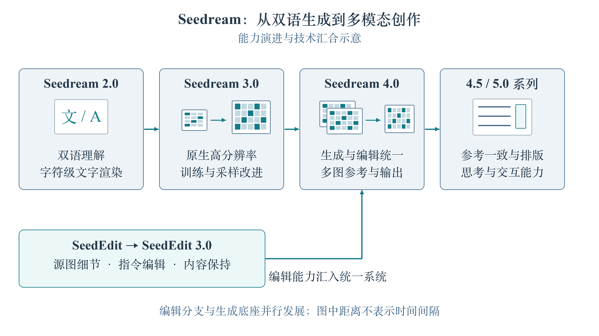
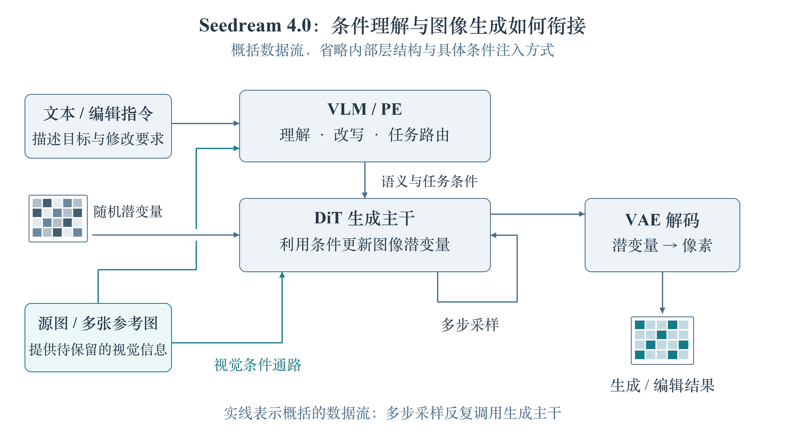
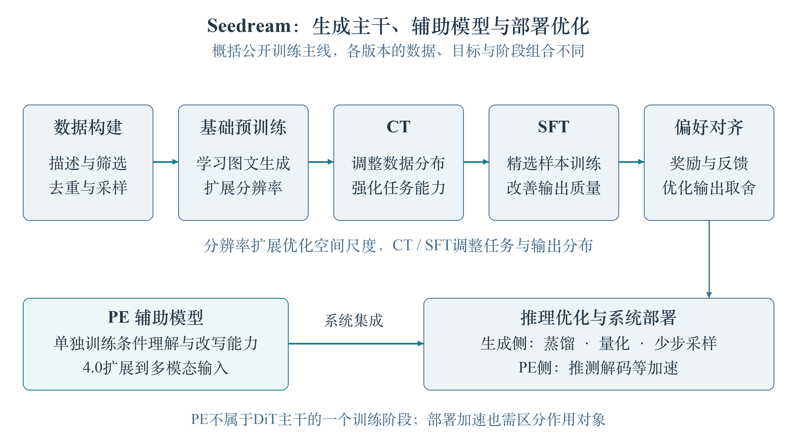
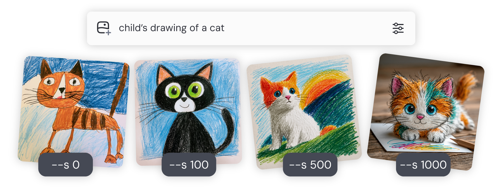
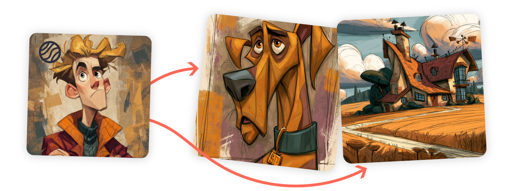
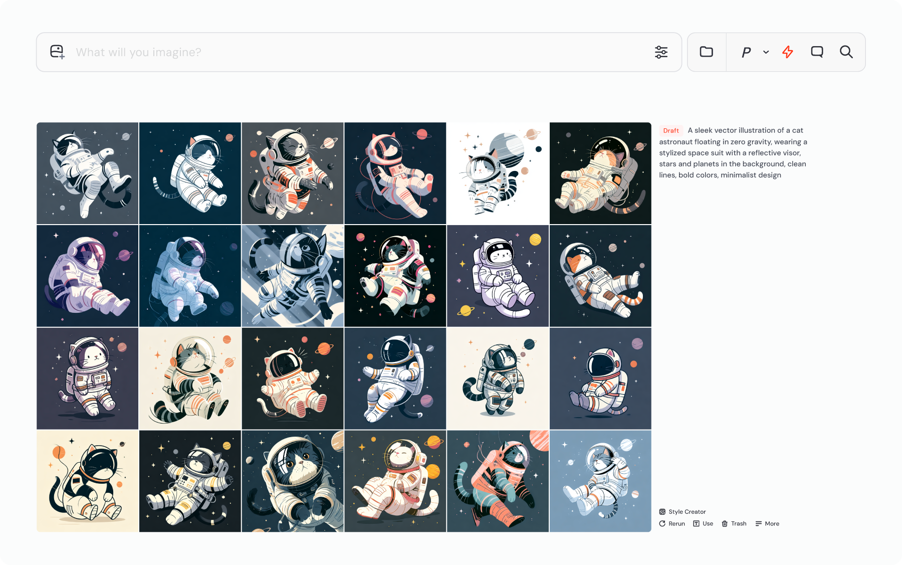

# 目录

[1.主流的AIGC图像创作大模型有哪些？AIGC图像创作领域未来的技术发展趋势是什么样的？](#q-001)
  - [面试问题：AIGC图像创作领域未来的技术发展趋势是什么样的？](#q-002)
  - [面试问题：AIGC图像创作大模型的主流技术范式有哪些？](#q-003)
  - [面试问题：AIGC图像创作涵盖哪些典型任务？（进阶）](#q-004)
  - [面试问题：AIGC图像创作领域的模型训练与优化趋势是什么？](#q-005)
  - [面试问题：AIGC图像创作大模型的效果应该如何评估？](#q-006)

[2.Google公司在AIGC图像创作领域有哪些核心成果和跨周期价值？](#q-007)
  - [面试问题：Google在AIGC图像创作领域形成了怎样的技术演进主线？](#q-008)
  - [面试问题：Imagen系列模型有什么跨周期技术价值？](#q-009)
  - [面试问题：Nano Banana系列有哪些优秀特点？](#q-010)

[3.OpenAI公司在AIGC图像创作领域有哪些核心成果和跨周期价值？](#q-011)
  - [面试问题：OpenAI在AIGC图像创作领域形成了怎样的技术演进主线？](#q-012)
  - [面试问题：DALL-E系列模型跨周期的创新点是什么？](#q-013)
  - [面试问题：GPT-4o图像生成系统和GPT-Image系列的优秀特点是什么？](#q-014)

[4.介绍一下Seedream系列的技术原理和模型架构](#q-015)
  - [面试问题：Seedream系列的技术演进主线是什么？](#q-016)
  - [面试问题：Seedream系列的模型架构和关键创新点是什么？](#q-017)
  - [面试问题：SeedEdit系列模型解决了什么问题？](#q-018)
  - [面试问题：Seedream系列公开的训练流程包括哪些关键阶段？](#q-019)

[5.其他主流AIGC图像创作大模型有哪些核心特点和跨周期价值？](#q-020)
  - [面试问题：Midjourney系列模型有哪些优秀特点？](#q-022)
  - [面试问题：HiDream-I1的技术原理和模型架构是什么？](#q-023)
  - [面试问题：GLM-Image的创新点有哪些？](#q-024)
  - [面试问题：Qwen-Image系列的创新点有哪些？](#q-025)
  - [面试问题：Z-Image系列的创新点有哪些？](#q-026)

---

<h1 id="q-001">1.主流的AIGC图像创作大模型有哪些？AIGC图像创作领域未来的技术发展趋势是什么样的？</h1>

<h2 id="q-002">面试问题：AIGC图像创作领域未来的技术发展趋势是什么样的？</h2>

**难度评分：⭐⭐⭐⭐ (4/5)  |  考察频率：⭐⭐⭐⭐⭐ (5/5)**

Rocky认为，2026年是AIGC图像创作领域的“中场时刻”。2026年之前很多非常热闹的AIGC图像生成单点技术，会因为新一代原生多模态模型、统一图像生成编辑模型、后训练体系和智能体工作流的发展而被快速淘汰。能够经受考验留下的则是继续繁荣的跨周期技术，**比如扩散模型的数学&物理本质原理、Flow Matching框架、自回归视觉token、强文本编码器、参考特征控制、图像编辑、文字渲染、多轮一致性、偏好对齐和推理式视觉创作等核心技术**。

Rocky认为，AIGC图像创作领域的未来趋势可以从五个能力层级理解，如下表所示：

| 能力层级 | 核心定义 | 代表能力 | 典型模型/方法 | 主要挑战 |
|---|---|---|---|---|
| L1：原子生成（Atomic Generation） | 直接从文本生成图像 | 文生图、照片基础审美/真实感 | DDPM、Stable Diffusion、DiT、DALL-E 1等 | 不可控性强，空间关系、数量、身份和布局容易错 |
| L2：额外条件生成（Conditional Generation） | 在文本之外加入各种显式条件信息 | 身份/姿态/布局/文字渲染一致性等特征控制 | Stable Diffusion/FLUX生态 + ControlNet/IP-Adapter/PULID/InstantID等控制技术 | 属性绑定、空间精度、局部控制等仍不稳定 |
| L3：上下文生成（In-Context Generation ） | 生成推理过程中原生吸收多参考图、多条件、多轮历史或多图上下文的信息 | 多图融合、多轮编辑、角色一致、风格一致、跨图叙事等 | FLUX.1 Kontext/FLUX.2、GPT-4o/GPT Image-2、Gemini/Nano Banana pro、Qwen-Image、Seedream 4.0、Z-Image等 | 需要在多轮漂移、身份保持、未编辑区域保真、长上下文一致性方向持续优化 |
| L4：智能体式生成（Agentic Generation） | 围绕创作目标自主规划步骤、选择并调用生成与编辑工具，根据工具返回结果或视觉评估反馈调整后续动作，形成多步创作闭环 | 参考检索、任务分解、模型与工具选择、多步生成编辑、视觉评估与迭代修正 | Lovart、即梦AI、JarvisArt/JarvisEvo等 | 评估反馈可靠性、工具调用正确性、多步一致性、停止条件与成本延迟 |
| L5：世界建模生成（World-Modeling Generation） | 根据已有视觉观测、历史状态及动作或控制条件，预测环境后续变化并生成相应视觉结果，追求空间、时间与交互规律的一致性 | 动作条件下的未来预测、可交互环境生成、长时序状态保持、机器人与自动驾驶视觉仿真 | Google DeepMind Genie 3、NVIDIA Cosmos 系列等 | 动作响应准确性、长期状态一致性、物理与因果忠实性、仿真到现实的差距 |

因此，未来AIGC图像创作除了“更高质量、更高审美”这些基础维度，还要从**外观生成**走向**智能视觉生成**：模型需要理解结构、记住上下文、遵守物理规则、调用外部工具、验证自身结果，并服务于真实的AIGC图像创作领域各方向的应用场景，如下图所示。

过去的AIGC图像创作系统已经能够复用部分生成能力，但在文字渲染、身份保持、参考图控制、精细编辑、虚拟试装等复杂任务上，往往还需要额外的控制模块、专用模型和人工流程。现在**前沿图像模型正在把更多生成、编辑与参考条件控制能力纳入同一基础模型，使其能够结合指令、源图和参考图完成更复杂的视觉创作**。

这种趋势可以概括为**生成与编辑的统一建模**。它的驱动力主要来自三个方面：

1. **共享视觉能力，使不同任务之间具备知识与训练信号复用的空间**。文生图、图像编辑、局部重绘和参考图生成等虽然任务形式不同，但都依赖对象识别、空间关系、材质光照、语义对应和视觉细节生成等基础能力。例如，“生成一个红色杯子”和“把图中的杯子改成红色”，都需要理解杯子的形状、表面材质与颜色表达；后者还需要识别修改区域，并保持其他内容不变。让这些任务共享模型底座，有机会复用共同的视觉知识，减少为每个任务分别学习相近能力的重复投入。统一训练的价值在于共享能力基础，同时学习不同任务的约束。 这种收益取决于数据质量、任务配比和训练目标，不能假定多任务训练一定优于专用模型。

2. **复杂创作需要同时协调“改什么”和“保留什么”，推动生成与条件理解更紧密地结合**。真实编辑往往包含多个相互制约的要求。例如，“把人物的外套换成参考图中的款式，同时保持脸部身份、姿态、背景和原有光照”，需要模型同时理解源图、参考图与修改指令。如果这些信息被拆分到多个独立阶段处理，而阶段之间只传递简化提示词、局部特征或中间图像，就可能丢失细节约束；连续处理还可能引入身份漂移、边界异常和非目标区域变化。统一建模提供了在同一次生成过程中联合利用这些条件、协调修改目标与保留要求的机会。 要真正实现稳定编辑，仍需要针对性的训练数据、条件表达和保真约束，单纯共用一个主干并不能保证一致性。

3. **多任务数据与工程投入可以围绕同一底座积累，形成持续迭代的规模效应**。如果每增加一种创作能力，都需要单独训练、部署和维护一套模型，系统的适配与评估成本就会不断增加。共享底座后，基础视觉能力的改进有机会服务于多个任务，训练数据处理、偏好对齐、推理优化和评估体系也能部分复用。例如，更好的文字理解与渲染能力，可以同时帮助海报生成、文字替换和信息图制作。对于需要覆盖多种创作任务的平台，统一底座有利于把能力建设集中到可复用的基础设施上。 不过，实际收益仍取决于模型规模、任务干扰、调用频率和部署方式；对高精度或低延迟任务，专用模型与外部工具仍然可能更合适。

因此，未来通用AIGC图像创作模型的重要发展方向，是**将生成、编辑和参考控制能力更稳定地组合起来，在完成修改的同时保持身份、结构、文字、风格及未编辑区域的一致性**。这会推动文生图、图生图、文字渲染、局部编辑、多图融合和多轮创作逐步共享更强的模型底座；专业任务则可以继续通过专用模块或工具补充。

<h2 id="q-003">面试问题：AIGC图像创作大模型的主流技术范式有哪些？</h2>

**难度评分：⭐⭐⭐⭐ (4/5)  |  考察频率：⭐⭐⭐⭐⭐ (5/5)**

当前主流的AIGC图像创作大模型不再只有一种路线，而是多种技术范式并行演进，如下表所示：

| 技术范式 | 核心思想 | 代表模型/系列 |
|---|---|---|
| 经典扩散去噪 | 从噪声逐步去噪，通常在像素空间或潜空间中生成图像 | DDPM、Stable Diffusion、SDXL、DiT等 | 
| 多阶段/级联生成 | 先获得低分辨率或低细节结果，再逐步增强 | Imagen、DALL-E 2、GLIDE等 |
| Flow Matching / Rectified Flow生成范式 | 学习从噪声到数据的连续向量场，通过数值积分完成生成，追求更高效的生成路径 | FLUX、Stable Diffusion 3、Seedream、Qwen-Image |
| 自回归视觉生成（AR） | 将图像表示为 token 或多尺度表示，预测下一个 token 或尺度 | DALL-E 1、Parti、LlamaGen、VAR、Emu3、Janus-Pro等 |
| 掩码 token / 离散扩散 |  并行预测缺失视觉 token，并通过多轮迭代逐步修正 | MaskGIT、Muse等 | 
| AR + Diffusion/离散扩散组合架构 | 为不同模态或输出采用互补建模目标，并可能共享 Transformer 表示 | GLM-Image、Transfusion、Show-o、JanusFlow等 |
| 原生多模态统一生成编辑 | 统一处理文本、图像、参考图、编辑指令、多轮上下文和目标图像 | GPT Image、Nano Banana、Seedream、Qwen-Image-Edit、Midjourney等 |

各个主流技术范式的流程图如下所示：

总的来说，**2022-2024年主线是扩散模型规模化和开源生态爆发；2024-2026年技术主线逐渐转向Flow Matching、DiT、自回归视觉token、AR+扩散混合架构，以及理解-生成-编辑统一的原生多模态大模型。**

<h2 id="q-004">面试问题：AIGC图像创作涵盖哪些典型任务？（进阶）</h2>

**难度评分：⭐⭐⭐ (3/5)  |  考察频率：⭐⭐⭐⭐ (4/5)**

AIGC图像创作涵盖了多种细粒度任务，如下表所示，主要包括以下几类：

| 任务类别 | 主要任务内容 |
|---|---|
| 内容生成与多图合成 | 文生图、图生图、参考图生成、多图融合、布局条件生成 |
| 内容与区域编辑 | 对象添加、删除、替换、局部重绘、扩图、背景替换 |
| 外观、风格与光影变换 | 颜色、材质、光照、质感、美化、风格迁移 |
| 结构、姿态与视角变换 | 姿态、动作、比例、几何结构、面部结构、视角变化 |
| 文本与视觉版式创作 | 文字生成、文字编辑、Logo替换、海报、PPT、UI、信息图和科学图解 |
| 身份与跨图一致性控制 | 人物、角色、产品、品牌身份，多轮编辑和跨图一致性 |
| 恢复增强与垂直工作流 | 超分、去噪、压缩修复、细节增强、虚拟试装、商品编辑和电商生产 |

<h2 id="q-005">面试问题：AIGC图像创作领域的模型训练与优化趋势是什么？</h2>

**难度评分：⭐⭐⭐⭐ (4/5)  |  考察频率：⭐⭐⭐⭐⭐ (5/5)**

随着AIGC图像大模型从单次文生图走向多条件生成、精细编辑和连续创作，训练与优化的目标也在发生变化：模型既要生成高质量图像，也要准确理解指令、利用参考信息，并在修改过程中保持不应改变的内容。

大模型规模与训练算力仍然重要，而数据质量、任务设计、后训练反馈和推理效率，是把大模型基础能力转化为稳定创作能力的重要因素。我们可以从以下五个方面理解这一趋势。

### 1. 如何构造更有效的训练监督？

训练数据的重点正在从“数量更多”转向“每个样本提供的信息更准确”。除了图像和文本，还需要根据任务补充对象、属性、空间关系、文字区域、mask、参考图和编辑结果等结构化信息。

例如，一条图像编辑样本可以由**源图像 + 编辑指令 + 编辑区域 + 目标图像**组成。

对“把人物外套改成黑色，但保持脸部、姿态和背景不变”这类任务，只有一条粗略的图像描述是不够的，还需要让训练数据明确哪些区域应该改变、哪些区域应该保留。

这也是 VLM 重标注的价值：它不仅生成更长的 caption，还可以补充对象关系、文字内容、布局和编辑约束。数据筛选还要考虑去重、来源与授权、审美质量、任务均衡和安全内容，避免模型反复学习错误描述或单一风格。

### 2. 如何让同一个底座模型学习多种创作任务？

文生图、图生图、局部重绘、扩图、参考图生成和多图融合，需要的输入条件不同，但可以通过混合任务训练，让模型学习如何解释不同形式的条件。

例如，可以在同一训练体系中混合以下样本：
- 只有文本条件的文生图；
- 文本加源图像的图生图；
- 文本加源图像加 mask 的局部重绘；
- 文本加参考图的风格或身份控制；
- 多张参考图融合为一张目标图。

这样做的目标是让模型复用对象理解、空间关系、材质和视觉细节等共同能力，同时学会区分“需要修改的区域”和“必须保留的区域”。

### 3. 如何把人类偏好转化为可学习的信号？

基础训练主要让模型“能够生成”，后训练则进一步要求模型“更符合指令和偏好”。监督微调通常使用高质量示范样本，教模型完成具体任务；偏好优化则通过比较不同结果，调整模型对质量、指令遵循和编辑保真的倾向。

一个简单的偏好样本可以是：同一个指令生成两个结果，其中一个文字更准确、未编辑区域更稳定，就作为偏好结果。

SFT 适合学习任务格式和基本行为；DPO 类方法适合利用偏好对进行直接优化；GRPO 或其他基于奖励的训练方法，则需要可靠的奖励函数或评价器。VLM-as-a-Judge、OCR 检查、区域相似度和人工偏好都可以提供反馈，但这些评价器本身也可能产生偏差，因此不能把自动评分直接当成绝对正确答案。

### 4. 如何利用失败样本持续修正模型？

模型训练越来越重视困难样本，而不是只在平均数据上继续堆训练量。需要从评测和实际使用中发现模型经常失败的模式，再针对这些模式构造数据和训练任务。

常见的困难模式包括：
- 多个对象的数量和位置错误；
- 海报或界面中的文字拼写、排版错误；
- 多轮编辑中的身份漂移；
- 局部重绘影响了未编辑区域；
- 参考图中的材质、服装或产品特征没有被保留。

例如，如果模型在“同时生成多个指定对象”时经常漏掉对象，就可以补充数量均衡、空间关系明确的训练样本；如果模型在连续编辑中出现身份漂移，就需要增加多轮编辑链和跨图一致性样本。

这会形成一个更具体的闭环：生成结果 → 自动或人工评估 → 失败归因 → 构造针对性样本 → 再训练 → 独立评测

这里的“闭环训练”不等于模型天然具备自我博弈能力。它依赖稳定的评估器、清晰的失败分类和独立测试集，否则模型可能只是针对评价器投机优化。

### 5. 如何通过更少的采样并步数进行高质量生成？

许多高质量图像模型需要多轮迭代采样，直接部署会受到延迟、显存和成本限制。因此，推理优化的重要目标是：在尽量少损失细节和可控性的情况下减少采样和计算。

常见方法包括：
- 一致性蒸馏；
- 少步采样蒸馏；
- 量化；
- 注意力或特征缓存；
- 并行推理；
- 更轻量的服务模型。

这里需要强调，少步并不自动等于更好：采样步数下降后，文字准确性、细节、空间关系和身份一致性可能受到影响，所以必须在目标任务上重新评估。

下图生动的展示了AIGC图像模型的训练与优化的核心过程：

从整体上看，**AIGC图像模型的训练与优化正在形成更紧密的协作关系**：高质量数据提供有效监督，基础训练建立通用能力，后训练改善任务表现，评估反馈定位薄弱环节，蒸馏与部署优化降低使用成本。 各环节相互配合，才能让模型在复杂创作中持续保持质量、可控性与效率。

<h2 id="q-006">面试问题：AIGC图像创作大模型的效果应该如何评估？</h2>

**难度评分：⭐⭐⭐ (3/5)  |  考察频率：⭐⭐⭐⭐ (4/5)**

过去的图像生成评估往往偏重“画面是否自然、清晰、美观”，但当模型开始处理复杂指令、文字渲染、局部编辑、多图融合和多轮创作后，单一审美分数已经无法代表模型的实际能力。更合理的评估方式，是按照任务目标拆分质量、遵循、一致性、安全和工程效率，并结合自动指标、人工评测与线上数据进行综合判断。

| 评估维度 | 关注问题 | 典型指标/方法 |
|---|---|---|
| 感知质量与多样性 | 图像是否自然、清晰、少伪影，并保持足够的风格和内容覆盖 | 人类偏好、Aesthetic Score、FID/KID、Precision/Recall、重复率和多样性统计 |
| 指令与条件遵循 | 是否完成了文本、参考图、mask、布局等全部条件要求 | 结构化 prompt 检查、VLM 评价、人工成对比较、任务成功率 |
| 语义、属性与空间关系 | 主体、属性、数量、位置、遮挡和关系是否正确 | 对象检测、属性识别、关系检查、布局评估、VQA 或结构化解析 |
| 文本与版式 | 图中文字是否正确、可读，位置和排版是否合理 | OCR 字符准确率、编辑距离、文字框位置、排版检查和人工评测 |
| 编辑区域与主体一致性 | 目标区域是否按要求变化，未编辑区域和参考主体是否保持 | mask 区域评估、非编辑区域差异、LPIPS/DINO/CLIP 辅助指标、主体或身份相似度 |
| 多轮、跨图与物理合理性 | 连续编辑是否漂移，多张图是否保持一致；在适用场景下是否符合物理和状态变化 | 多轮编辑链、跨图一致性测试、restore-to-original、专家评测、动作条件测试 |
| 安全与工程可用性 | 是否安全、稳定、可交付，并满足速度、成本和服务要求 | 安全分类、隐私与商标检查、审核通过率、延迟、吞吐、失败率、单张可用结果成本 |

因此，**Rocky认为，AIGC图像模型评估不是寻找一个能够概括所有能力的总分，而是建立与任务对应的评估矩阵**。文生图重点看指令遵循、语义关系和感知质量；图像编辑重点看目标区域变化、非编辑区域保真和主体一致性；多轮创作还要检查长期漂移；进入生产环境后，则需要进一步加入安全、延迟、成本、失败率和可用结果率。模型评估的核心，是确认模型能否在目标任务上有较好的效果与稳定的性能。

<h1 id="q-007">2.Google公司在AIGC图像创作领域有哪些核心成果和跨周期价值？</h1>

<h2 id="q-008">面试问题：Google在AIGC图像创作领域形成了怎样的技术演进主线？</h2>

**难度评分：⭐⭐⭐⭐ (4/5)  |  考察频率：⭐⭐⭐ (3/5)**

Rocky认为，Google在AIGC图像创作领域的演进，可以从两层理解：**能力上，从高质量文生图扩展到可控编辑、多图组合和多轮创作；技术上，扩散生成、自回归视觉生成、掩码建模与原生多模态系统长期并行探索**。

**第一，Imagen系列强化了语言理解与图像生成的协同**。初代Imagen将强文本编码器与级联扩散结合，展示了语言表示对图文对齐和生成质量的重要作用。随后Imagen 2、Imagen 3和Imagen 4持续推进画质、文字、指令遵循和产品可用性。其中，Imagen 3公开确认为潜空间扩散模型；其他版本的具体结构应依据各自的技术披露判断，不能默认完整沿用初代架构。

**第二，Parti和Muse探索了不同的视觉生成机制**。Parti将文生图建模为文本到离散图像token序列的自回归生成问题；Muse通过预测被掩码的视觉token，并行补全和迭代修正图像。二者说明，图像生成可以从序列预测和掩码建模中获得不同的能力与效率选择，与Imagen形成互补的研究布局。

**第三，可控编辑逐渐成为独立的重要能力**。Imagen Editor等工作将文本指令、源图像和编辑区域结合，关注目标区域是否正确变化、非编辑内容是否保持。Muse也展示了局部重绘、扩图等编辑能力。这说明Google对图像创作的探索，早已从“生成一张新图”扩展到“围绕已有图像进行可控修改”。

**第四，Gemini将图像生成进一步融入多模态上下文**。Gemini 2.0 Flash的原生图像输出已经支持图文交错生成和对话式编辑；后续Nano Banana、Nano Banana Pro与Nano Banana 2进一步强化参考图利用、主体一致性、文字渲染、知识结合和创作控制，并发展出不同的质量与效率定位。其意义在于让图像创作能够利用连续的指令和视觉上下文，而不再局限于一次文本到图像的调用。
因此，Google的技术演进应理解为：多种生成机制并行探索，图像生成与编辑持续融合，语言理解、视觉上下文和知识推理逐步进入创作过程。 Imagen与Gemini各有定位；闭源图像系统的能力表现，也不能直接用于反推其底层生成架构。

图中上层并列展示三种生成机制：扩散路线通过逐步去噪形成图像，并可结合超分模型进行级联增强；自回归路线依次预测视觉token，再解码成图；掩码路线通过并行补全与多轮迭代形成图像。下层展示创作能力的扩展：可控编辑利用指令、源图像与选区约束修改范围，原生多模态创作则利用参考图和历史上下文支持图文输出与多轮修改。各面板为通用机制或能力示意，省略部分中间步骤，不表示路线之间的先后替代关系，也不代表某一闭源系统的内部架构。

从技术路线上，还可以如下表这样严谨区分：

| 技术路线 | 代表模型 / 系统 | 开源与技术边界 | 核心贡献 |
|---|---|---|---|
| 专用图像生成 | **Imagen（初代）** | 使用冻结的T5-XXL文本编码器，将低分辨率文生图扩散模型与超分扩散模型级联，逐级生成高分辨率图像 | 展示强语言表示对图文对齐的重要作用，并通过“基础生成 + 超分增强”兼顾整体内容与细节 |
| 专用图像生成 | **Imagen 2 / Imagen 3** | Imagen 2官方明确属于扩散模型；Imagen 3技术报告明确采用潜空间扩散 | 持续提升画质、指令遵循和文字等能力，进一步完善数据治理、评测与产品化；其中Imagen 3报告对数据与评估有较系统的说明 |
| 专用图像生成 | **Imagen 4** | 官方发布重点介绍文生图能力、文字表现、质量与效率定位 | 在Gemini原生图像能力发展的同时，继续推进专用文生图路线，强化细节、文字拼写与排版，以及不同使用需求下的产品配置 |
| 自回归视觉生成 | **Parti** | 使用ViT-VQGAN将图像表示为离散token，通过编码器—解码器模型自回归生成图像token序列 | 将文生图视为序列到序列建模，探索扩大模型规模对复杂描述、组合场景与知识表达的帮助 |
| 掩码视觉生成 | **Muse** | 在离散视觉token空间中，根据文本条件预测被掩码的token，通过并行解码和多轮迭代完成生成 | 探索视觉生成的并行解码方式，并利用掩码建模支持局部重绘、扩图及无显式mask的编辑 |
| 文本引导的可控编辑 | **Imagen Editor** | 在Imagen基础上针对文本引导的局部重绘进行微调，利用编辑mask与原始图像条件约束生成 | 将“按指令修改”与“保留输入图像内容”结合，并通过EditBench系统评估局部编辑能力 |
| 原生多模态生成与编辑 | **Gemini 2.0 Flash原生图像能力** | 官方公开支持多模态输入与原生图像输出；不能仅凭这些能力确定图像生成组件采用扩散、自回归或何种混合机制 | 建立图文交错输出与对话式图像编辑的重要产品节点，使生成过程能够利用连续的语言和视觉上下文 |
| 原生多模态生成与编辑 | **Nano Banana / Gemini 2.5 Flash Image** | 属于Gemini原生图像生成与编辑路线；具体图像生成组件的详细机制不应由产品效果反推 | 推进自然语言编辑、主体保持和多图组合等能力的实用化 |
| 原生多模态生成与编辑 | **Nano Banana Pro / Gemini 3 Pro Image** | 官方强调基于Gemini 3 Pro的推理与世界知识能力；搜索等外部信息接入属于系统能力，不能据此推断生成架构 | 强化知识相关视觉表达、文字渲染、多图组合和精细编辑控制，服务于更复杂的创作任务 |
| 原生多模态生成与编辑 | **Nano Banana 2 / Gemini 3.1 Flash Image** | 官方将其定位于Flash图像路线，结合知识、推理、文字和主体一致性能力；质量与速度表现需要在具体任务中评估 | 强调生成与编辑的响应效率，与Pro路线形成不同的能力和效率定位，不宜简单理解为全面替代Pro |

<h2 id="q-009">面试问题：Imagen系列模型有什么跨周期技术价值？</h2>

**难度评分：⭐⭐⭐⭐ (4/5)  |  考察频率：⭐⭐⭐ (3/5)**

**Imagen系列值得长期借鉴的，是围绕条件理解、分阶段生成、采样稳定性、数据质量与评测反馈进行系统设计。** 初代Imagen提供了较完整的架构与实验依据；Imagen 3则展示了潜空间生成、高质量描述和系统评测在后续模型中的重要作用。

初代Imagen由一个冻结的T5-XXL文本编码器、一个生成64 × 64图像的像素空间扩散模型，以及两个分别生成256 × 256和1024 × 1024图像的超分扩散模型组成。**三个扩散模型都接收文本条件，两个超分模型还接收上一级的低分辨率图像。** 因此，后续阶段既要增强图像细节，也要继续遵循文本约束，并非普通的插值放大。

如下图中，文本表征分别为基础生成与两级超分提供条件，图像则沿64 × 64 → 256 × 256 → 1024 × 1024逐级生成。下方示例对应各阶段的输出，便于观察分辨率与细节的变化。

从公开资料看，Imagen 3在图文对齐、高分辨率生成和数据治理等目标上延续了系列方向，但具体实现已有变化。下表中详细展示了Imagen系列可以复用的技术思想：

| 可复用的技术思想 | 初代Imagen的代表做法 | Imagen 3的公开延续或变化 | 工程启示 |
|---|---|---|---|
| 增强条件表征与语义监督 | 使用冻结的T5-XXL文本编码器，并通过实验研究文本编码器规模的影响 | 使用原始描述与Gemini生成的合成描述，增强训练文本的细节与多样性；不据此推断推理时的文本编码器 | 图文对齐同时依赖条件表示与监督质量，应先定位瓶颈，再决定扩展哪个模块 |
| 按尺度分解生成任务 | 64 × 64基础生成后，通过两个文本条件超分扩散模型逐级生成至1024 × 1024 | 采用潜空间扩散，报告中的默认配置生成1024 × 1024图像，并可接2×、4×或8×超分 | 基础生成与分辨率增强可以分工，但须权衡计算、延迟和误差传递 |
| 提高训练数据的有效性 | 使用大规模图文数据，并进行一定的数据过滤 | 披露多阶段过滤、去重与相似样本降权、AI生成图像移除，以及原始与合成描述配对 | 数据规模之外，还应关注描述完整性、重复度、覆盖范围和噪声 |
| 用分维度评测指导迭代 | 提出DrawBench，结合人工评价检查复杂语义能力 | 分开评估整体偏好、图文对齐、视觉吸引力、细粒度对齐和数量推理，并结合自动指标 | 模型可以在一个维度进步、另一个维度仍然不足，需要按失败类型改进 |

上图中概括的是可以跨模型复用的技术思想，想要深入理解这些思想，可以重点抓住下面四个问题。

**第一，语义约束没有落实时，应该改哪里？**

在初代Imagen的实验设置中，扩大冻结文本编码器，比单纯扩大图像扩散模型更能改善图文对齐与生成质量。这说明，在纯文本语料上获得的语言表征可以帮助图像生成；冻结编码器还可以避免生成模型训练时对它进行参数更新，并在条件允许时预先计算文本表征。这个结论应理解为该研究设置下的瓶颈分析，不能推广成“文本编码器越大，所有图像模型都一定越好”。

例如，要求“红色方块位于蓝色圆形左侧”，结果却交换了颜色或位置，就需要检查条件表示、训练监督与生成端的约束落实能力。单纯提高输出分辨率，通常不能解决属性绑定或空间关系错误。

Imagen 3的数据做法补充了另一侧的思路：每张训练图像同时配有原始caption与合成caption，后者由多个Gemini模型使用不同指令生成，以改善描述质量和语言多样性。原始描述只有“几个积木”时，忠实补充颜色、数量与相对位置，可以提供更具体的监督；但描述越长并不必然越好，错误细节也会污染训练。**文本编码器负责表示输入条件，caption负责提供训练监督，两者作用互补，不能当成替代关系。**

**第二，级联生成怎样分配计算，又怎样处理上游误差？**

初代Imagen将高分辨率生成拆成基础生成与两级超分，便于在不同尺度上分配模型容量和计算。“先形成整体内容，再增强细节”是便于理解的概括，而不是严格的语义分工，因为超分阶段也接收文本条件并参与细节生成。

这种结构的难点是：超分模型在训练时看到的低分辨率条件，与推理时上一级实际生成的图像可能不同。初代Imagen在两级超分中使用**噪声条件增强（noise conditioning augmentation）**，对低分辨率条件加入噪声，并让模型感知噪声强度，以增强它处理上游生成瑕疵的鲁棒性。这体现了级联系统中的普遍要求：下游模块要适应上游的实际输出分布。

分阶段处理也有代价，包括更多推理步骤、部署复杂度和误差传递。超分可以改善纹理与清晰度，却不能保证修复基础图像中已经错误的数量或布局。Imagen 3报告披露的高分辨率生成与后续超分，说明这种任务分解仍有价值，但不能据此认定它沿用初代的级联结构或噪声增强方案。

**第三，为什么训练好的模型还需要精心设计采样策略？**

在初代Imagen中，增大CFG强度有助于增强文本约束，但也可能让预测像素超出训练数据范围，造成过饱和与不自然的结果。Imagen提出的**动态阈值（dynamic thresholding）**根据每一步预测图像的像素绝对值分布确定阈值，再对预测值裁剪和缩放，缓解强引导下的失真。其技术价值是把条件遵循与采样稳定性一起考虑，而不是将引导强度无限调大。

需要区分贡献边界：CFG并非Imagen首创，动态阈值是初代Imagen的代表性采样改进；Imagen 3是否使用相同方案不能由其生成效果反推。面向像素数值范围设计的处理，也不能不加判断地照搬到潜空间模型。

**第四，怎样确认一次升级真正解决了问题？**

初代Imagen通过DrawBench检查颜色、数量、空间关系和复杂描述等能力；Imagen 3进一步将整体偏好、视觉吸引力和不同粒度的图文对齐等维度分开评估，减少评价者将“好看”与“符合要求”混为一谈的影响。例如，图片即使非常精美，把要求的三个物体画成四个，仍然没有完成数量约束。

Imagen 3报告还讨论了FID等自动指标与内容质量、审美偏好之间的不一致。因此，评测应帮助定位失败类型，并反馈到数据、训练和推理环节。数据侧的去重、相似样本降权与质量过滤，也要与覆盖范围、偏差和记忆风险一起检查；报告中移除AI生成图像是该训练方案减少伪影与偏差的策略，不能泛化成“所有合成图像都不适合训练”。更完整的评估维度见[图像创作模型的效果评估](#q-006)。

**Imagen的长期价值是把条件理解、分阶段生成和采样稳定性放在一起设计，并通过数据质量与分维度评测持续定位瓶颈。**

<h2 id="q-010">面试问题：Nano Banana系列有哪些优秀特点？</h2>

**难度评分：⭐⭐⭐ (3/5)  |  考察频率：⭐⭐⭐ (3/5)**

**Nano Banana系列是Google基于Gemini发展的原生多模态图像生成与编辑模型系列，其突出特点是将文本指令、源图像、参考图和对话上下文共同用于创作。** 

初代Nano Banana重点推进自然语言编辑、多图融合和主体保持；Nano Banana Pro进一步强调知识推理、文字渲染与精细控制；Nano Banana 2则在Flash路线上结合较强创作能力与快速响应。理解这个系列，既要看共同的创作能力，也要区分不同版本在质量、控制和效率上的定位。

相较于以专用文生图能力见长的Imagen路线，Nano Banana系列更突出多模态输入与对话式编辑体验。两条路线在生成和编辑任务上存在交集，具体能力仍需按版本及产品入口判断。

先明确系列中的三个关键版本：

| 系列名称 | 官方对应模型 | 主要定位 | 代表性特点 |
|---|---|---|---|
| **Nano Banana（初代）** | Gemini 2.5 Flash Image | 自然语言生成、编辑与快速创作 | 通过语言完成定向修改，利用多张输入图像进行融合，并强化人物、物体外观的一致性 |
| **Nano Banana Pro** | Gemini 3 Pro Image | 复杂构图、知识相关视觉内容与精细创作 | 更强调推理与世界知识、文字渲染、多图组合，以及视角、光照和局部区域等创作控制 |
| **Nano Banana 2** | Gemini 3.1 Flash Image | 在Flash路线上结合较强图像能力与快速迭代 | 将知识结合、文字渲染、主体一致性和创作控制等能力带入更注重响应效率的工作流，并强调图像搜索增强 |

**Nano Banana 2与Nano Banana Pro是不同模型，不能把版本数字理解为对Pro的全面替代。** Google在Nano Banana 2的发布说明中，仍将Pro定位于更强调高保真与事实准确性的任务，将Nano Banana 2定位于快速生成、指令遵循和图像搜索增强；这些是产品定位，具体任务中的表现仍需要根据实际落地场景进行评估。

从创作过程看，这个系列的主要特点可以归纳为以下五类：

| 核心特点 | 主要能力与版本侧重 | 简短例子 | 理解边界 |
|---|---|---|---|
| **自然语言生成与编辑** | 将文本指令与输入图像结合，支持生成、添加、删除、替换和风格调整；初代已重点展示定向编辑，后续版本继续增强控制能力 | 保留主体，将背景改为夜景，再调整光照 | 指令式修改不等于严格的像素级保护，未指定区域仍可能发生变化 |
| **多图参考与主体一致性** | 综合不同参考图中的人物、物体、风格与构图信息，尽量保持主体外观；Pro和Nano Banana 2进一步强调复杂组合与一致性 | 将人物参考图与服装、场景参考图组合成新画面 | 多图输入数量、可保持的主体数量和实际成功率是不同概念；遮挡、相似主体和连续修改仍会增加难度 |
| **文字渲染与内容本地化** | Pro和Nano Banana 2更强调可读文字、多语言表达，以及图内文字的翻译和替换 | 将海报文案换成另一种语言，并尽量延续原有视觉风格 | 小字号、长文本、复杂字形和精确排版仍需逐项核验 |
| **知识结合与搜索增强** | 利用多模态理解与世界知识组织视觉内容；在支持的入口中结合搜索信息，Nano Banana 2进一步强调图像搜索增强 | 根据给定资料生成说明图，或参考检索到的视觉信息描绘特定对象 | 搜索增强属于系统能力；事实依据、检索内容和最终图像表达需要分别检查 |
| **多轮创作与输出控制** | 在连续指令中迭代画面，调整视角、焦点、光照、色彩和长宽比；Pro与Nano Banana 2提供更丰富的高分辨率输出选择 | 先确定构图，再修改文案和光照，最后适配横版与竖版 | 历史上下文不等于长期记忆；分辨率、比例和控制选项取决于具体模型及调用入口 |

**Nano Banana 2将较强的创作能力带入更注重响应效率的Flash路线。** 其官方发布资料强调快速生成与编辑、知识结合、文字渲染、主体一致性，以及从512px到4K的输出规格，使它更适合频繁试稿与连续修改。Pro的官方资料则强调复杂构图、精细控制及2K、4K输出。高分辨率能力应归于具体版本，不能统一套用到初代；实际调用时，还应检查入口支持的参数与返回图像的真实尺寸。

在工程落地中，还需要区分三个容易混淆的概念：

1. **对话上下文与长期记忆。** 多轮编辑依赖应用提供的文本、图像和历史交互。模型能利用这些上下文承接修改，不代表它会在不同会话中永久记住主体；连续编辑仍可能积累身份、构图和细节漂移。
2. **模型知识与实时检索。** 模型已有知识、搜索返回的信息和最终图片是不同环节。只有在支持并启用相应工具的入口中，才能利用搜索增强；检索结果正确，也不保证图片中的文字、数值或关系表达正确。闭源系统呈现这些能力，同样不足以反推其图像生成组件采用扩散、自回归或某种混合架构。
3. **模型定位与实际选型。** 更快的模型不一定在所有配置下都更便宜，成本还受分辨率、推理配置、工具调用及计费入口影响。输入图像数量与主体保持能力也不能混为一个上限。应使用实际任务比较编辑准确性、主体保持、文字正确率、事实可靠性、延迟和成本，而不是仅凭型号名称选择。

**Nano Banana系列的跨周期价值，在于让图像创作能够围绕输入素材和连续指令进行迭代：生成之后还能修改，修改时能够利用参考图，后续操作能够承接已有上下文。** 这类工作流能否真正可用，取决于模型是否既完成目标变化，又尽量保持不应变化的内容。

下图从左到右并列展示Nano Banana、Nano Banana Pro和Nano Banana 2的代表性生成效果，分别呈现人物一致性与风格化创作、文字排版与知识相关创作、信息图与文字渲染：

<h1 id="q-011">3.OpenAI公司在AIGC图像创作领域有哪些核心成果和跨周期价值？</h1>

<h2 id="q-012">面试问题：OpenAI在AIGC图像创作领域形成了怎样的技术演进主线？</h2>

**难度评分：⭐⭐⭐⭐ (4/5)  |  考察频率：⭐⭐⭐⭐ (4/5)**

Rocky认为，OpenAI在AIGC图像创作领域形成的是五条相互衔接的演进主线：**视觉表示与序列建模、语义空间与图像解码、描述质量与指令遵循、原生多模态对话创作，以及专用图像模型。** 但除了DALL-E 1 和 DALL-E 2 提供了较完整的开源方案外；DALL-E 3、GPT-4o 和 GPT Image 这些闭源系统则更多体现了数据、交互与产品工程的变化，我们无法知道更多技术细节。

下表是OpenAI在AIGC图像创作领域技术演进路径的具体汇总：

| 技术阶段 | 代表系统 | 公开机制与技术边界 | 能力和产品变化 | 跨周期价值 |
|---|---|---|---|---|
| 离散视觉 token 与自回归生成 | **DALL-E 1** | 使用 dVAE 将图像表示为离散 token，Transformer 对文本 token 和图像 token 序列进行自回归建模 | 将自然语言直接连接到图像 token 生成；长序列和分辨率是主要约束 | 证明视觉内容可以进入统一的序列建模框架 |
| 语义表征与扩散解码 | **DALL-E 2 / unCLIP** | 由 CLIP 图文表征、prior表征的预测模型 和 diffusion decoder 组成 | 将文本意图映射到图像语义表征，再由扩散解码器渲染图像，并支持图像条件生成方向 | 将“理解用户想要什么”和“如何生成像素”拆成可组合模块 |
| 描述质量与指令遵循 | **DALL-E 3** | 官方公开资料重点讨论高质量 caption、训练数据重描述和复杂 prompt 遵循；完整生成主干没有充分公开 | 提升复杂描述、多对象关系和图中文字等任务的遵循能力，并与 ChatGPT 提示词协同 | 说明数据描述质量与语言意图展开本身就是模型能力的一部分 |
| 原生多模态对话创作 | **GPT-4o 图像生成** | OpenAI 将图像生成整合到 GPT-4o 的多模态交互中；底层图像生成组件没有充分公开 | 文本、输入图像、生成结果和历史对话可以共同参与创作与编辑 | 图像生成从单次调用转向连续交互和修改闭环 |
| 专用图像模型 | **GPT Image 系列** | 公开为图像生成与编辑模型/API 入口；不同版本的架构、训练细节和当前可用能力应以对应日期的官方文档为准 | 更适合应用集成、参数控制、批量调用和生产部署 | 将研究能力转化为可监控、可调用、可迭代的视觉基础设施 |

这条主线还包含一条与底层生成架构并行的编辑能力演进：**纯文本生成 → 图像 variations 与局部编辑 → 输入图像条件编辑 → 多轮对话式修改 → 专用生成编辑 API：**

1. **DALL-E 1：** 图像能否像语言一样被 token 化，并通过统一序列建模生成。
2. **DALL-E 2：** 文本意图能否先进入共享语义空间，再交给扩散解码器渲染。
3. **DALL-E 3：** 训练数据的描述质量和 prompt 展开能力，是否成为生成模型的核心竞争力。
4. **GPT-4o：** 图像生成能否成为多模态对话、理解和连续修改的一部分。
5. **GPT Image：** 研究能力如何沉淀为可调用、可评估、可迭代的图像生成编辑基础设施。

OpenAI图像生成大模型技术路线具体如下所示：

总的来说，**OpenAI 的图像创作演进是把“表示—对齐—生成—交互—工程化”逐步连接起来。** Rocky认为这条路线对行业的跨周期启发在于：图像模型的竞争边界已经从单次采样质量，扩展到数据描述、上下文理解、编辑稳定性、工作流闭环和生产部署能力。

<h2 id="q-013">面试问题：DALL-E系列模型跨周期的创新点是什么？</h2>

**难度评分：⭐⭐⭐⭐ (4/5)  |  考察频率：⭐⭐⭐⭐ (4/5)**

Rocky认为，理解DALL-E系列的跨周期价值，可以抓住三个持续影响图像模型的问题：**图像如何表示，语义如何参与生成，训练描述如何提供有效监督。** 三代模型分别在这些问题上给出了有代表性的跨周期答案。

### 1. DALL-E 1：用离散视觉表示，把图像生成接入大规模序列建模

图像直接以像素形式参与序列建模，序列很长，计算开销也大。DALL-E 1采用两阶段训练：先训练dVAE，把一张256×256的图像压缩成32×32的离散视觉token网格；随后固定这套视觉编解码器，将文本token与1024个图像token拼接起来，训练自回归Transformer学习它们的联合分布。生成时，模型以文本为条件逐步预测图像token，再由解码器重建图像。

这套设计把两个问题分开处理：视觉编解码器负责压缩和重建图像，Transformer负责学习文本条件下视觉token的组合规律。高维像素因此被转换成了可以进行序列预测的离散表示。文本和图像使用不同的编码方式，但可以进入同一个序列建模框架。

图像离散化并非始于DALL-E 1，VQ-VAE等更早的工作已经探索过这条路线。DALL-E 1的代表性贡献在于，**把离散视觉表示、文本条件和大规模自回归训练结合起来，展示了通用文生图任务在数据与模型规模扩大后的潜力。** 后续模型即使同样采用离散视觉token，也可能使用自回归预测、掩码预测等不同的生成方式。

这项工作留下了一个至今仍有用的工程判断：**视觉表示本身就是生成能力的一部分。** 压缩过强，会损失细节；token太多，会增加训练和推理成本。表示阶段已经丢失的信息，后续生成模型很难保证准确恢复。因此，研究离散视觉生成时，需要把tokenizer的重建质量、序列长度与生成模型的预测能力放在一起评估。

### 2. DALL-E 2：让语义表征与图像解码分工，复用图文对齐能力

CLIP能够把文本和图像映射到相互对齐的表征空间，但文本向量与图像向量并不相同。DALL-E 2的unCLIP路线在中间加入了prior：根据文本条件，预测可能对应的CLIP图像表征；随后，扩散解码器以这个图像表征为条件生成图像。

核心流程可以概括为：**文本条件 → prior预测CLIP图像表征 → 扩散解码器生成图像。**

这里的prior（先验模型）是一个需要训练的条件生成模型，学习给定文本时可能出现的图像表征。论文分别研究了自回归prior和扩散prior，并报告了扩散prior的计算效率优势。解码器采用扩散模型，其设计还保留了文本条件通路。训练prior和decoder时，CLIP保持冻结。因此，这套系统体现的是预训练表征与生成模块之间的分工，不能用一个“是否自回归”字段概括整个系统。

下图展示了CLIP图文对齐与unCLIP生成流程之间的关系：

图中虚线上方表示CLIP的对比学习过程，虚线下方表示文生图流程；prior区域的两个分支是两种可选实现，不是必须依次通过的两个阶段。这种分工也解释了图像variations的来源：输入图像经CLIP编码后，可以直接将图像表征交给解码器重新采样，在保留部分语义与风格的同时改变表征没有固定的细节。

**DALL-E 2的长期启发，是将已有的表征能力转化为生成条件。** 不过，CLIP图像表征并不是原图的无损压缩，它没有完整保存每个像素的位置和所有局部属性。因此，语义相近不等于布局准确，更不等于编辑后主体身份与未编辑区域都能严格保持。条件生成系统的控制精度，取决于条件表示究竟保留了哪些信息；精确布局或局部编辑往往还需要更直接的空间约束。

### 3. DALL-E 3：用更准确的图像描述，补足指令遵循所需的训练监督

图像里包含的信息，往往比配套文本丰富得多。一张训练图可能有多个主体、不同属性和明确的空间关系，但原始描述只提到了其中一个主体。模型虽然看到了整张图，却缺少足够明确的文字条件，去学习这些细节应该与哪些表达对应。这会影响推理时的指令遵循：用户写出了详细要求，模型却未必在训练中得到过同样细致、准确的图文对应监督。

DALL-E 3的重要工作，是通过改进图像描述模型，为训练图像生成更详细的合成caption，并将这些描述用于文生图训练。它补足了原始图文数据中容易缺失的主体属性、动作与关系信息，让模型有机会学到更细致的条件对应。

下图对比了同一图像的原始网页文本（Alt Text）、简短合成描述（SSC）和详细合成描述（DSC）。阅读时应关注描述覆盖了哪些视觉信息，而不仅是文本长短：

**有效监督取决于描述是否准确覆盖图像中的关键条件。** 单纯拉长caption并不能保证收益；如果描述模型补出了图中不存在的对象，或者写错位置和数量，增加的文本反而会成为错误监督。重描述数据仍然需要质量检查，尤其要关注对象遗漏、属性绑定错误、关系错误和幻觉。重描述也不等同于偏好对齐：前者改善图像与文本之间的对应监督，后者处理生成结果之间的偏好信号，二者解决的问题不同。

还应当区分训练与产品交互两个环节：训练阶段的图像重描述，改善的是模型学到的图文对应关系；ChatGPT在产品中的提示词组织与扩写，改善的是用户意图如何传递给图像模型。二者可以配合，但不能互相替代。提示词更完整，也无法保证图像模型一定执行正确，更不能据此推断模型已经具备稳定的多轮编辑能力。

DALL-E 3留给模型训练的一个实用判断是：**遇到复杂指令遵循不足，除了检查模型容量和训练方法，也要回到数据，确认目标能力是否得到过足够准确的监督。** 这一判断适用于不同的生成架构，具有持续的工程价值。

<h2 id="q-014">面试问题：GPT-4o图像生成系统和GPT-Image系列的优秀特点是什么？</h2>

**难度评分：⭐⭐⭐⭐ (4/5)  |  考察频率：⭐⭐⭐⭐ (4/5)**

在AIGC图像创作领域，随着技术的不断发展，一次图像创作不单单是一次图像生成，还包含了大量的二次处理：保留主体，改掉标题，换一个背景，再把不该动的细节留下等。**GPT-4o 图像生成系统把这些要求放进同一段多模态对话中连续处理；GPT Image 系列则把生成和编辑功能进一步构建为统一的图像大模型能力。** 

OpenAI 对 GPT-4o 图像生成能力的公开介绍，重点在原生多模态交互、复杂指令遵循、文字渲染和连续编辑体验上；具体生成主干、参数规模和训练细节并没有完整公开。因此，我们主要讨论的是可观察到的产品能力和工程含义，不把它们反推成未经证实的内部架构。生成效果图如下图所示：

GPT-4o 图像生成系统的特点，可以总结为以下四个互相衔接的能力：

1. **把创作上下文放在一起处理。** 文本要求、用户上传的源图或参考图、此前的生成结果和聊天历史，可以共同参与下一次生成。图像创作因此从一次性的 `prompt-to-image`，变成围绕上下文不断推进的 `conversation-to-image`。
2. **把复杂指令转化为可执行的视觉约束。** 多主体、属性绑定、相对位置、材质、风格和画面文字经常同时出现在一个要求里。GPT-4o 的价值在于先理解这些约束之间的关系，再把它们传递给图像生成过程。
3. **把生成和修改连接成连续操作。** 用户可以在已有结果上要求换背景、改比例、替换局部文案或保留主体特征，而不必每次从头描述整张图。
4. **让文字和知识参与视觉表达。** 图中文字、表格、流程关系和信息层级成为生成目标的一部分。多模态模型的语言理解和世界知识可以帮助组织这些内容，但知识辅助不等于事实核验，文字渲染也不等于排版完全正确。涉及数字、专名、公式和结构化信息时，仍然需要自动检查或人工复核。

这四点共同降低了自然语言创作的使用门槛：用户不必先理解采样器、CFG 或 seed，便可以通过对话表达需求。但这种门槛下降主要发生在交互层，不能替代对结果质量、可控性和稳定性的评估。GPT-4o 的跨周期价值在于：**图像生成不再只是一个独立的采样工具，而成为多模态模型理解意图、处理参考信息并持续完成视觉任务的一环。**

GPT Image 系列代表另一条产品化路径：把图像生成和编辑能力作为相对明确的专用模型入口，交给应用通过请求参数、输入图像和业务流程来调用。具体模型名称、可用输入输出、尺寸、质量参数和版本状态会随官方产品迭代变化。

从生产系统看，GPT Image 系列主要有四类价值：

1. **输入输出边界清晰。** 应用可以将文本提示、源图、参考图或编辑掩码组织成结构化请求，再接收图像结果并进入后续审核、存储和发布流程。不同版本是否支持某种输入，不能跨版本推断。
2. **生成与编辑共用一套调用入口。** 文生图、参考图生成和图像编辑可以被编排进同一业务流程，减少产品为每种任务维护独立模型的成本；但统一入口不代表每类任务拥有相同的质量和延迟。
3. **质量、尺寸和成本可以纳入工程权衡。** 生产系统关注的不只是审美，还包括分辨率、响应时间、失败重试、内容安全、单位成本、缓存和结果可复现性。某个版本支持的参数和快照，应以当前 API 文档为准，不应把一次调用经验当成长期承诺。
4. **模型能力可以沉淀为可评估的工作流节点。** 电商素材、营销海报、产品图、教育图示等场景，需要把提示词模板、参考素材、自动质检、人审和版本回滚连接起来。模型只是其中一个节点，真正的产品价值来自从输入到交付的闭环。

下图是GPT Image模型的生成效果图：

<h1 id="q-015">4.介绍一下Seedream系列的技术原理和模型架构</h1>

<h2 id="q-016">面试问题：Seedream系列的技术演进主线是什么？</h2>

**难度评分：⭐⭐⭐⭐ (4/5)  |  考察频率：⭐⭐⭐ (3/5)**

Seedream系列可以理解为字节/即梦生态在AIGC图像生成编辑领域的系统化演进：模型怎样读懂中英文提示并进行文字渲染，怎样在提高分辨率时把质量和成本控制住，以及怎样根据原图和参考图完成可控编辑。**它的演进主线，是把“理解意图、生成图像、保留约束、反复编辑”逐步在一套创作系统中实现。**

Seedream系列的图像生成Backbone为扩散/Flow Matching范式下的Diffusion Transformer。Seedream 4.0则加入了更多模块，比如VLM/PE模块负责理解输入、任务路由、prompt rewriting、auto-thinking和长宽比估计等。Seedream持续打磨文生图底座，SeedEdit则集中解决“给定原图后，哪些该改、哪些该保留”的编辑难题。到Seedream 4.0，生成与编辑开始进入同一多模态系统。4.5与5.0系列继续把参考一致性、信息密度和交互能力推向产品侧。Seedream系列的整体演进路线如下表所示：

| 版本 / 分支 | 主要解决的问题 | 能力变化 |
|---|---|---|
| Seedream 2.0 | 中英文语义与画面文字如何共同处理 | 建立双语文生图基础，强化中文理解、字符级文字渲染与偏好对齐 |
| Seedream 3.0 | 复杂提示、高分辨率与训练效率如何兼顾 | 延续MMDiT主干，引入Flow Matching、分辨率适配和表征对齐，能够原生输出最高2K图像，取消2.0中的Refiner阶段 |
| SeedEdit / SeedEdit 3.0 | 按指令修改时如何保住不该变化的内容 | 从编辑样本构造和迭代对齐，发展到多源编辑数据、任务元信息、条件化奖励与生成编辑联合训练 |
| Seedream 4.0 | 文生图、编辑和多图条件能否进入同一系统 | 联合处理生成、单图编辑、多图参考与多图输出，并以VLM/PE整理多模态条件、以系统优化降低推理开销 |
| Seedream 4.5 | 复杂参考与文字密集创作如何更稳定 | 官方重点展示多图主体识别、参考细节保持、排版与密集文字能力 |
| Seedream 5.0 Lite / Pro | 图像创作如何衔接信息获取、推理和专业表达 | Lite强调思考与联网搜索，Pro强调高信息密度图像、空间标注编辑和多语言生成 |

下图生动展示了Seedream系列技术线路的演进与融合：

总的来说，Seedream系列的技术主线，是从双语文生图基础大模型，沿着Flow Matching DiT、高质量数据工程、原生高分辨率、VLM参与后训练、图像编辑统一化和推理加速这几条线，逐步走向一个生产级多模态图像生成编辑系统。

<h2 id="q-017">面试问题：Seedream系列的模型架构和关键创新点是什么？</h2>

**难度评分：⭐⭐⭐⭐⭐ (5/5)  |  考察频率：⭐⭐⭐ (3/5)**

Rocky认为，理解Seedream的架构，优先需要理解：VAE负责像素图像与潜变量之间的编码、解码；DiT/MMDiT在潜空间中处理图像与条件；Flow Matching规定训练时要学习的连续生成路径。

文生图推理时，文本会先被编码为条件表示，模型从随机潜变量出发，经过多步更新得到图像潜变量，再由VAE解码为像素图像；并不需要先输入一张真实的目标图。编辑任务则额外注入源图和参考图条件，使模型既能利用原图细节，也能遵循修改要求。不同版本的条件处理方式不同，但这条“条件 - 潜变量生成 - 解码”的主链路是一致的。

### Seedream 2.0：兼顾双语语义与字符渲染

Seedream 2.0是面向中英双语场景的扩散式文生图基础模型。论文公开的组件包括自研VAE、MMDiT式DiT、双语LLM文本编码器、Glyph-Aligned ByT5和Scaled RoPE。可以把它们理解为一条条件生成链路：文本编码器提供句子级语义，ByT5补充待渲染文字的字符信息，MMDiT从噪声潜变量出发并结合这些条件生成图像Latent变量，VAE再把结果还原为图像。

- **双语LLM与字符编码各有分工。** LLM理解句子整体含义、文化语境和文字布局描述；ByT5提供字符级表示，帮助模型处理需要画进图里的字。ByT5并不能独自解决长文字排版，报告指出仅用字符特征仍可能出现重复或布局混乱，因此把它投影后与LLM特征结合，再输入DiT。
- **MMDiT负责图文条件交互。** 图像与文本token进入Transformer block，通过注意力交互；不同模态保留各自的前馈变换。它是生成网络的结构设计，扩散或Flow目标则规定训练时如何学习生成过程。
- **Scaled RoPE适配不同画幅。** 按图像分辨率缩放旋转位置编码，使不同分辨率下中心区域的位置表示更可比，帮助模型向未训练过的长宽比泛化；这不是对任意分辨率都保证无损。
- **Refiner补充基础模型的输出分辨率。** 2.0使用独立的Refiner将基础输出从512尺度提升至1024尺度，同时改善纹理和轻微结构缺陷。这是基础生成之后的图像细化阶段；后训练的CT、SFT与RLHF则在下文训练流程中展开。

下图是Seedream 2.0的训练数据标注效果图：

### Seedream 3.0：改善高分辨率训练与图文对齐

Seedream 3.0延续Seedream 2.0的MMDiT主干，改变的重点在训练目标、数据采样、分辨率适配和偏好对齐。其先在平均约 $256 \times 256$ 的像素尺度、不同长宽比数据上预训练，再扩展到 $512 \times 512$ 至 $2048 \times 2048$ 的范围；这一版本可原生生成最高2K图像，并因底座能力增强而取消2.0的Refiner阶段。

- **Flow Matching定义生成路径的学习目标。** 3.0沿噪声与图像潜变量之间的插值路径训练MMDiT预测速度场，推理时通过数值积分逐步获得图像潜变量。网络结构仍为MMDiT，实际生成速度还取决于采样步数、轨迹设计和加速方法。
- **Cross-modality RoPE处理跨模态位置关系。** 3.0将文本token也表示为二维序列，并把其位置接续到图像token的位置体系中，以更一致地建模文本与视觉特征关系。这有助于文字和图像内容对齐，但不是直接给每段文字指定像素坐标。
- **REPA给中间表征增加视觉监督。** 训练时将MMDiT中间特征与预训练视觉编码器DINOv2-L的特征对齐，报告显示这能加快收敛。它是训练期的辅助损失，不代表生成时还要额外运行DINOv2。
- **分辨率感知时间步采样。** 相同的噪声时间步在不同分辨率下不一定提供同样有效的学习信号。3.0根据训练分辨率平移时间步分布，在高分辨率训练中增加低信噪比区域的采样概率，使训练信号随空间尺度调整。

### Seedream 4.0：统一生成、编辑与多图条件

Seedream 4.0将文生图、单图编辑、多图参考与多图输出放进统一的多模态系统。理解其结构时，可以区分图像生成主干与用户输入处理模块：前者在潜空间生成图像，后者把文本、源图和任务意图整理为模型可用的条件。多图输入不是被简单压缩成一段caption，视觉条件和语言条件共同约束后续生成。

- **高效DiT与高压缩VAE控制计算量。** DiT处理图像潜变量，VAE压缩图像以减少latent token数量，从而降低高分辨率下的计算开销。压缩率也必须与文字、纹理和局部结构的重建质量一起权衡；论文并未披露足以复现全部内部结构的细节。
- **VLM/PE把多模态需求整理成生成条件。** 基于Seed1.5-VL训练的Prompt Engineering模块可处理文本、单图或多图输入，执行任务路由、提示改写、参考图描述和长宽比估计，再把条件交给DiT。
- **图像条件与多任务训练共同支撑编辑。** 报告在DiT框架中引入causal diffusion，并联合后训练文生图和编辑任务。参考图的视觉信息参与生成，VLM提供语义与任务条件，两者共同约束结果；causal diffusion的信息依赖方式在SeedEdit问题中继续说明。
- **加速手段要区分适用对象与测量口径。** 对抗蒸馏、分布匹配和量化用于降低图像生成推理开销，推测解码针对PE模型的token生成。报告以计算FLOPs为口径，描述了相对Seedream 3.0超过10倍的训练与推理加速；这不能直接换算成训练总时长或用户端到端等待时间缩短十倍。另一个约1.4秒生成2K图像的报告数据，则明确不含LLM/VLM PE耗时。

上图中展示了4.0模型中条件处理、潜空间生成与图像解码的分工。采样器在多个时间步反复调用生成主干，更新潜变量，完成后再交给VAE解码。只有理解这条链路，才能区分条件理解、生成计算与图像还原各自带来的能力和成本。

<h2 id="q-018">面试问题：SeedEdit系列模型解决了什么问题？</h2>

**难度评分：⭐⭐⭐⭐ (4/5)  |  考察频率：⭐⭐⭐ (3/5)**

图像编辑需要同时完成两个目标：按指令修改指定内容，尽量保留其他内容。SeedEdit系列围绕这个取舍展开优化：**根据自然语言指令改变目标内容，同时保留指令未要求改变的区域和属性。**如果用户要求换风格或改脸，风格或身份本身就不应被无条件锁定。

早期SeedEdit提出从文生图模型出发构造编辑前后图像对，再训练带输入图像条件的扩散模型。模型逐步从“根据提示重新生成”对齐到“保留原图并按要求修改”，并在新训练好的模型基础上继续构造、筛选训练样本，经过多轮微调提升编辑成功率。这条路线把生成能力转化为编辑能力，但数据偏差和真实照片域差异仍需要处理。

SeedEdit 3.0在这条路线基础上，将扩散生成底座从Seedream 2.0升级为Seedream 3.0。更高的原生分辨率和更强的文字渲染能力，为人脸、物体细节和中英文文字编辑提供了更好的基础；但它并不能自动解决编辑范围和保真取舍，后者仍由数据、条件和优化目标共同决定。关键机制有四项：

1. **因果扩散让输入图像成为生成条件。** 输入图像与待生成图像经过共享参数的扩散分支，利用带方向约束的注意力交换中间特征。这样生成分支能够使用输入图像中的细节表征。这里的“因果”描述注意力的信息依赖结构，不表示模型拥有物理因果推理能力。
2. **VLM与连接模块传递编辑意图。** VLM抽取图像的高层语义，连接模块再把任务类型和编辑标签注入扩散模型。VLM负责理解“要做什么”，扩散分支负责在视觉空间完成修改，两者由条件表示衔接。这样做也弥补了纯VLM描述难以完整保存纹理、身份和局部结构的缺口。
3. **多源数据和元信息缓解监督冲突。** 训练数据包括合成编辑、真实照片、传统图像操作和视频帧。同样要求“换背景”，一类样本只替换背景，另一类还改变了人物姿态或光照，直接混合会让监督含义变得模糊。SeedEdit 3.0因此加入数据级任务标签、文本重描述和编辑属性标签，区分局部编辑、人脸保持、结构保持和风格保持等语境。任务标签与编辑标签通过独立的embedding注入模型，帮助模型区分不同数据的约束；这些标签并不等同于精确像素mask，也不能保证非编辑区域逐像素不变。
4. **条件化奖励在“改”与“保”之间取舍。** 模型联合优化Rectified Flow扩散损失和多种奖励项，并根据任务决定奖励是否生效。例如，用户只要求换背景时，身份保持是有意义的约束；用户要求更换人物时，继续奖励身份保持反而会与指令冲突。奖励还要在当前时间步能够可靠估计结果时才有意义。报告采用专家奖励模型，并非简单地用一个通用VLM分数解决全部编辑目标。

SeedEdit系列模型具体架构如下图所示：

SeedEdit 3.0还与文生图数据联合训练。编辑数据提供指令和输入输出关系，高质量T2I数据则补充画质、分辨率和生成分布，减少编辑训练对底座原有生成能力的损害。

<h2 id="q-019">面试问题：Seedream系列公开的训练流程包括哪些关键阶段？</h2>

**难度评分：⭐⭐⭐⭐⭐ (5/5)  |  考察频率：⭐⭐⭐ (3/5)**

Seedream的训练可以沿着五个环节理解：**构建可靠数据，学会基础生成，强化目标任务，对齐输出偏好，再把模型组合成可用的服务。**

**1. 数据构建：决定模型学到什么，以及哪些错误不该学。**

数据处理既要检查图像质量，也要检查caption是否准确、语义分布是否失衡。3.0通过视觉形态与文本语义两个维度协同采样，兼顾画面类型和内容覆盖；4.0进一步补充知识图像、公式和教学材料，改善专业内容覆盖。单纯增加图像数量，无法补上描述错误和稀有概念缺失。

3.0的缺陷感知训练是一个具体例子：一张照片可能只有角落带水印，其他区域仍然有训练价值。模型先定位缺陷，再在潜空间损失中屏蔽相应区域。这样可以保留有效内容，减少模型对缺陷的学习；它不等于先把原图修复成无瑕疵图像。

**2. 基础预训练与分辨率扩展：先建立生成能力，再学习更细的空间结构。**

生成主干在大规模图文数据上学习条件生成。3.0以MMDiT为主干，采用Flow Matching与REPA联合目标：前者训练生成路径的速度预测，后者对齐中间视觉表征。随后逐步扩展训练分辨率，并结合不同长宽比的样本，提高模型对空间尺度的适应能力。

不同版本模型的训练分辨率也不一样，3.0先在平均像素规模约为 $256 \times 256$ 的数据上预训练，再扩展到 $512 \times 512$ 至 $2048 \times 2048$ 的范围；4.0则从约 $512 \times 512$ 扩展到 $1024 \times 1024$ 至 $4096 \times 4096$。这里的乘积表示像素规模，实际数据包含不同长宽比，并非全部是正方形。分阶段训练也不意味着每次推理都先生成小图再逐级放大；3.0已取消2.0的Refiner阶段。

**3. CT与SFT：把通用生成能力调整到具体任务和质量要求。**

CT（Continuing Training，继续训练）与SFT（Supervised Fine-Tuning，监督微调）都是属于继续训练阶段，但使用的数据和侧重点不同。2.0在CT中混合人工精选图像与高质量预训练数据，在SFT中使用更精选的审美样本；4.0的CT重点增强编辑指令遵循，SFT进一步改善参考图与结果图的一致性。分辨率扩展主要改变空间尺度和计算负担，CT/SFT主要调整任务与输出分布，两者在实际训练安排中可以交织。

这些目标也会相互牵制。2.0报告指出，高审美标准的SFT数据能够改善画面美感，却可能降低图文对齐，因此又通过数据重采样兼顾两者。判断一个后训练阶段是否有效，需要同时检查它改善了什么、牺牲了什么。

**4. 偏好对齐：让训练信号覆盖人对结果的实际判断。**

基础生成损失不能完整表达审美、文字准确性、复杂指令和细节保持等要求。2.0通过自研奖励模型与多轮RLHF优化偏好；3.0使用VLM奖励模型，并研究奖励模型规模对效果的影响；4.0也披露了RLHF后训练。它们共享偏好优化的思路，但不能概括成所有版本都使用同一种奖励模型和优化算法。SeedEdit 3.0的条件化专家奖励，则更直接针对编辑中的身份、结构与审美取舍。

**5. 辅助模型与部署优化：分别降低理解条件和生成图像的成本。**

2.0、3.0和4.0都包含PE（Prompt Engineering）阶段或模块，2.0以微调LLM改善提示表达，4.0进一步采用基于Seed1.5-VL的多模态PE模型，处理参考图理解、任务路由、提示改写和长宽比估计。PE有自己的训练过程，与DiT生成主干分工协作。

部署优化同样要分对象：4.0在图像生成侧组合对抗蒸馏、分布匹配和量化，以减少采样计算与硬件开销；PE侧通过推测解码降低token生成耗时。评估系统时，应把条件处理、图像采样和解码等耗时一起计入，才能知道用户实际等待多久。

上图中将生成主干的训练与PE辅助模型分开，箭头表示概括的训练和集成关系。实际部署后的失败样本可以用于后续数据分析与再训练。

<h1 id="q-020">5.其他主流AIGC图像创作大模型有哪些核心特点和跨周期价值？</h1>

<h2 id="q-022">面试问题：Midjourney系列模型有哪些优秀特点？</h2>

**难度评分：⭐⭐⭐ (3/5)  |  考察频率：⭐⭐⭐⭐ (4/5)**

Midjourney擅长把一个尚不具体的视觉想法，高效生成可供挑选的图像。构图、色彩、材质和风格往往已经有较完整的表达，用户再通过参考图、个人审美设置和编辑工具继续调整。**它的优势主要是高效形成视觉方向，复用风格与主体，批量探索方案，再把选中的结果修改到可用。**

从版本演进看，V6加强长提示词理解，V7改善图像细节并引入Draft Mode和Omni Reference，V8.1进一步提升生成效率并支持原生2K输出。2026年7月24日发布的V8.2重点改善审美、图像质量和个性化；随后开放的V8 Edit Model又扩展了指令编辑与多图参考能力。Midjourney尚未完整公开网络与训练配方，我们主要从产品行为解释它的特点。

### 1. 审美表达完整，风格强度也能控制

Midjourney在创意插画、概念设计和氛围图等场景中，能够较快给出构图、光影与色彩相互协调的方案。这种默认风格有助于用户寻找视觉方向，但完成具体任务还要检查对象数量、属性、文字和布局是否符合要求。画面精致与指令准确需要分别评价。

`--stylize`（简写`--s`）用于调节风格化程度：较低的值倾向于更贴近文字描述，较高的值给模型更多艺术发挥空间；`--raw`则降低默认风格干预，让提示词对结果有更大的影响。例如，要求“儿童画的一只猫”时，过高的风格化可能生成一张精致的立体猫图，却偏离了儿童画的朴素笔触。参数的价值在于帮助用户选择这种取舍，具体如下图所示，展示同一主题在不同参数下的表达差异：

### 2. 参考控制覆盖风格、主体与多图组合

参考图的作用取决于使用方式。Image Prompt可以影响内容、构图与色彩；Style Reference通过`--sref`复用媒介、笔触、配色与光照等视觉风格；主体参考则侧重把人物或物体特征带入新的画面。把这些条件分开，才能判断结果究竟应当“风格像”还是“主体像”。

下图为V7示例，人物、狗和建筑的内容不同，但配色、笔触和造型语言相近，说明风格可以跨主题复用：

主体参考需要注明版本：V7的Omni Reference使用`--oref`和`--ow`控制单张参考图的影响；V8.1/V8.2则使用Edit Model，支持最多四张参考图，并可结合Style Reference、Personalization和Moodboards。多图组合仍可能出现属性串位或细节变化，任务越强调身份、服装标识和局部结构，越需要逐项核对。

### 3. 个人偏好与项目风格可以积累和复用

Personalization通过用户选择或喜欢的图片建立审美偏好，使同一提示词更接近个人习惯；Moodboards则允许用户组织一组参考图，为某个项目指定风格方向。前者适合表达长期偏好，后者适合区分不同项目：同一位设计师可以为儿童绘本、品牌海报和科幻概念图建立不同的视觉参考集合。

两者都可以通过`--p`及对应代码调用，降低每次从头描述风格的成本。用户无需自行准备LoRA训练流程，但这只是使用方式上的差别，不能据此推断内部采用哪一种微调或条件编码算法。V8.2的官方更新重点之一就是改善个性化对用户偏好的响应。

社区中的作品、提示词与风格代码也便于发现和复用创作方法。可以确认的是，这些交互服务于偏好表达和经验积累；社区各类行为如何进入基础模型训练，仍应以公开披露为边界。

### 4. 先批量探索，再投入高质量生成

创作早期往往还没有确定构图与风格，快速看到多个方向比马上得到一张大图更有帮助。Draft Mode将这一阶段单独做成产品功能，让用户先筛选候选，再对选中的方向继续生成。

不同版本的Draft行为不同：V7一次生成四张草图；官方V8专门说明中，V8.1/V8.2的网页Draft一次提供24张512×512低分辨率候选，可通过Vary或Remix进一步生成较高分辨率版本。它降低了试方向的成本，但后续生成仍可能改变细节，不能视为对原草图无变化的放大。

下图展示同一主题的批量探索：

Conversational Mode则解决需求表达问题，通过文字或语音交互辅助编写提示词；其功能说明明确列出V7和V8.1。它与Draft可以配合，但提示词辅助、批量生成和直接编辑已有图像是不同能力。评估迭代效率时，还应分别看候选生成速度、GPU计费消耗和用户实际等待时间。

### 5. 指令编辑与选区编辑让结果能够继续加工

2026年8月27日开放测试的V8 Edit Model支持按文字指令修改已有图像、结合多张参考图生成新构图，以及在Editor中进行局部重绘和扩图。它承接了此前Omni Reference、Character Reference和Retexture的相关用途，使参考创作与图像修改更容易衔接。

下图展示了原指令要求银色骑士骑上火焰马并手持花剑。三张参考图分别提供不同元素，文字指令规定它们在目标画面中的关系：

实际操作还要区分两种修改：整图指令编辑适合改变风格、视角或整体内容；选区编辑则通过明确修改范围，减少其他区域被改动的机会。2026年9月24日的官方更新说明，定向选区编辑只改变选中的像素，有利于连续修改时保留原图质量。这一说明应限定在相应选区编辑功能，不扩大为所有自然语言编辑的逐像素保真承诺。

**Midjourney提供的跨周期经验是：审美表达、条件控制和迭代效率需要一起设计。** 对创作者而言，先用草图选方向，再固定风格与参考主体，最后处理局部细节，是一条可以实际执行的工作流；对模型与产品团队而言，值得借鉴的是如何让这些控制方式易于理解、能够组合，并让用户看清每次修改的结果。

<h2 id="q-023">面试问题：HiDream-I1的技术原理和模型架构是什么？</h2>

**难度评分：⭐⭐⭐⭐ (4/5)  |  考察频率：⭐⭐⭐ (3/5)**

HiDream-I1聚焦于构建“高效扩散Transformer基础模型”，它的核心价值包含了**Latent Flow Matching + Sparse Diffusion Transformer + 动态MoE + 多文本编码器 + 蒸馏加速**。

从模型范式看，HiDream-I1不是DALL-E 1那类自回归图像token模型，也不是GLM-Image那种“AR规划 + 扩散渲染”的混合架构，而是更接近FLUX、Stable Diffusion 3、Seedream 3.0这类**潜空间扩散/Flow Matching DiT路线**。它的目标很直接：**在保持开源图像生成模型高画质、高语义理解和强prompt following的同时，把图像生成大模型推理成本和部署门槛降下来**。

HiDream-I1的核心架构可以拆成五个核心模块：

1. **潜空间生成：用VAE把图像压到latent空间。**  
   模型不直接在像素空间生成图像，而是先通过VAE把图像压缩成更低维的latent表示，再在latent空间进行去噪/流匹配生成，最后由VAE解码回图像。这是现代高分辨率图像生成模型的主流工程选择，因为它能显著降低序列长度和计算成本。

2. **生成目标：采用Latent Flow Matching。**  
   HiDream-I1论文将其放在Latent Flow Matching框架下，而不是传统DDPM式多步噪声预测。Flow Matching可以把生成过程理解为学习从噪声分布到真实数据分布的连续速度场，通常更适合与Transformer、大规模训练和少步采样结合。面试中可以简化为：**它仍属于扩散/Flow类连续生成范式，不是自回归逐token生成。**

3. **主干网络：17B Sparse Diffusion Transformer。**  
   HiDream-I1的Full版本约17B参数，但它不是把全部参数都做成每一步都密集参与计算的普通DiT，而是在Diffusion Transformer中引入稀疏计算。这里的关键不是“参数越大越好”，而是把图像生成里的高分辨率latent、长文本条件和复杂空间关系拆成更可控的token交互，让模型在需要全局语义时保留Transformer的建模能力，在不需要所有token密集交互时减少冗余计算。  
   Sparse DiT解决的本质问题是：**图像生成模型继续变大以后，Attention计算、显存占用和推理延迟会迅速成为瓶颈；稀疏计算让模型容量可以继续扩展，但单次前向不必为所有参数和所有token支付完整成本。** 这也是HiDream-I1区别于普通密集DiT的关键。

4. **动态MoE：让“模型容量”和“实际计算量”解耦。**  
   dynamic Mixture-of-Experts不是为了堆一个更吓人的参数规模，而是让不同prompt、不同语义模式、不同视觉风格、不同生成阶段可以路由到不同专家。MoE的核心价值在于：模型可以拥有更大的总参数容量，但每次前向只激活部分专家，从而把“可表达能力”和“实际计算成本”拆开。  
   对图像生成来说，这一点很重要：写实摄影、插画、文字海报、复杂空间关系、长prompt、多主体组合，对特征建模的需求并不完全相同。如果所有样本都走同一组密集参数，模型要么容量不足，要么推理太贵；动态MoE则允许模型根据输入选择更合适的专家路径，在质量、速度、显存和部署成本之间取得更细的平衡。

5. **混合文本编码：用强文本理解支撑prompt following。**  
   HiDream-I1使用Hybrid Text Encoding，把不同类型的文本编码能力结合起来，既需要CLIP/T5类编码器提供图文对齐和语义表示，也需要更强语言模型能力帮助理解长prompt、复杂属性、风格描述和对象关系。它说明新一代图像模型的上限不仅取决于图像生成主干，也取决于文本编码器和图文语义对齐质量。

上图是HiDream-I1模型各模型结构图。HiDream-I1的跨周期价值可以精炼为四点：

1. **高效DiT会长期存在。** 图像生成模型继续变大以后，Transformer主干、高分辨率latent、长文本条件和多图条件都会推高成本。Sparse DiT、MoE、缓存、蒸馏、少步采样会成为长期基础能力。

2. **稀疏激活是大图像模型规模化的重要方向。** 稠密模型参数越大，推理越贵；MoE和稀疏计算让模型可以“容量更大、计算更省”，这对开源模型尤其重要。

3. **强文本编码器决定复杂prompt上限。** 未来图像生成不只是画“一个漂亮主体”，而是要理解长描述、多对象关系、文字、风格、位置和编辑意图。Hybrid Text Encoding体现的是图像模型向多模态语言理解借力的趋势。

4. **质量、速度、成本分层会成为产业模型标配。** Full/Dev/Fast不是简单发三个版本，而是说明图像生成模型要同时服务研究评测、开发调试、生产部署和交互体验。真正能长期留下的模型路线，必须既能出高质量图，也能被低成本调用。

总的来说，**HiDream-I1代表开源图像生成模型中“高效Sparse DiT/Flow Matching”的路线。它的核心创新是在扩散/Flow DiT框架内，用稀疏Transformer、动态MoE、混合文本编码和蒸馏加速，把大模型的生成质量、语义理解、推理速度和部署成本重新平衡。**

<h2 id="q-024">面试问题：GLM-Image的创新点有哪些？</h2>

**难度评分：⭐⭐⭐⭐⭐ (5/5)  |  考察频率：⭐⭐⭐ (3/5)**

GLM-Image代表的是一条非常值得重视的混合路线：**让自回归模型先做语义规划，让扩散/DiT解码器再做高保真视觉渲染。** 它不是纯扩散模型，也不是传统自回归像素/token生成模型，而是把“语言模型式的语义理解能力”和“扩散模型式的细节生成能力”拆开，各自处理最擅长的部分。

GLM-Image采用**hybrid autoregressive + diffusion decoder architecture**，整体约16B参数，其中9B自回归生成器负责生成视觉语义token，7B diffusion decoder负责latent-space图像解码。它在一般图像质量上对齐主流latent diffusion模型，但在**文本渲染、知识密集型图像生成、复杂信息表达和图像编辑**上更有优势。

上图是GLM-Image模型架构图。GLM-Image的核心创新可以从五个层面理解：

1. **9B自回归生成器：先生成“语义蓝图”。**  
   GLM-Image的AR模块基于GLM-4-9B类语言模型初始化，并扩展词表以支持视觉token。它不是直接画像素，而是先把prompt中的对象、布局、文字、知识关系、空间关系压缩成一组语义token。其生成过程会先形成约256个紧凑编码，再扩展到1K-4K token，对应1K-2K级高分辨率输出。可以说，**AR部分负责低频语义、全局结构和复杂指令规划。**

2. **7B扩散解码器：再渲染“视觉细节”。**  
   扩散解码器基于single-stream DiT，在latent空间中把AR生成的语义token还原成高保真图像。它重点负责纹理、光影、材质、边缘、笔画、局部细节和真实感。这样设计的好处是，扩散模块不需要从零开始理解复杂prompt，而是更多承担“把语义蓝图渲染成视觉结果”的工作。

3. **语义token桥接AR和扩散。**  
   GLM-Image真正关键的中间层，不是简单把文本embedding塞给扩散模型，而是让AR模块先生成更结构化的视觉语义token。这些token既保留语言模型对复杂语义、知识和布局的理解，又能作为扩散解码器的条件输入。它解决的是纯扩散模型常见的问题：画面细节很好，但复杂文字、知识逻辑、对象关系和空间结构容易对不准。

4. **Glyph Encoder强化文本渲染。**  
   GLM-Image的diffusion decoder配备Glyph Encoder文本模块，用于提升图像中文字的准确渲染。文本渲染不是简单“让模型多看一些带字图片”就能解决，因为中文、英文、多行小字、海报排版、信息图、公式/标注类内容都要求模型同时理解语义和字形。GLM-Image把文字渲染变成模型结构和训练目标的一部分，这是它区别于普通文生图模型的重要创新。

5. **T2I和I2I统一到同一模型。**  
   GLM-Image不仅支持文生图，也支持图生图、图像编辑、风格迁移、身份保持和多主体一致性等任务。Diffusers文档也明确说明，GLM-Image Pipeline同时集成AR token generation和DiT image decoding，并支持可选条件图像输入。这说明它不是单一文生图模型，而是朝“生成 + 编辑 + 参考保持”的统一创作模型演进。

训练和优化层面，GLM-Image最值得记住的是**解耦式后训练**：

1. **AR模块偏语义奖励。**  
   自回归模块更适合用低频反馈优化，比如审美、语义对齐、指令遵循、对象关系、文字内容和知识正确性。它决定“图里应该有什么、各元素应该怎么组织”。

2. **扩散解码器偏细节奖励。**  
   解码器更适合用高频反馈优化，比如纹理真实感、局部细节、笔画可读性、文字准确率、边缘质量和视觉保真。它决定“语义蓝图最终画得是否细、是否真、文字是否清楚”。

3. **GRPO式解耦强化学习。**  
   GLM-Image使用基于GRPO的细粒度模块化反馈策略，分别增强语义理解和视觉细节质量。这里的关键不是“用了某个RL算法”本身，而是**后训练目标被拆给不同模块**：语义模块和渲染模块不再共享一个粗糙奖励，而是分别对齐各自职责。

GLM-Image的优秀点不只是“文字渲染强”，而是它把几个长期问题放在同一个架构里解决：

1. **复杂prompt理解。** AR模块继承语言模型的语义理解能力，更适合处理知识密集、长文本、多对象、多关系的prompt。
2. **高保真视觉质量。** 扩散/DiT解码器保留了扩散模型在真实感、纹理和细节上的优势。
3. **中英文文本渲染。** Glyph Encoder和文本渲染后训练让它更适合海报、PPT、菜单、说明图、科普图、流程图等富文本场景。
4. **知识密集型生成。** 例如食谱图、实验步骤、地图标注、垃圾分类口诀、水循环原理、流程说明等任务，需要的不只是画得漂亮，而是信息结构正确。
5. **生成编辑统一。** 同一模型支持T2I和I2I，说明它可以进入更完整的图像创作工作流，而不是只做一次性文生图。

总的来说，**GLM-Image的核心创新是把图像生成拆成“AR负责语义规划，扩散/DiT负责细节渲染”的两阶段混合系统。它的跨周期价值不只是提升中文文字渲染，而是证明未来图像模型会越来越依赖语言模型的语义规划能力、扩散模型的高保真渲染能力、语义token桥接机制，以及按模块职责设计的后训练对齐。**

<h2 id="q-025">面试问题：Qwen-Image系列的创新点有哪些？</h2>

**难度评分：⭐⭐⭐⭐⭐ (5/5)  |  考察频率：⭐⭐⭐⭐ (4/5)**

Qwen-Image系列代表的是中文和复杂文字图像生成中非常重要的一条路线：**用强多模态语言模型做语义理解，用MMDiT/Flow Matching做高质量生成，用专门VAE和数据工程解决文字渲染，再把文生图和图像编辑统一到同一套架构里。** 它的价值不只是“中文文字画得更准”，而是把图像生成从审美图推进到海报、PPT、菜单、信息图、文档配图和知识可视化这些真实生产场景。

从系列演进看，可以把Qwen-Image理解成三步：

1. **Qwen-Image：20B MMDiT基础模型，重点突破复杂文本渲染。**  
   Qwen-Image核心能力是complex text rendering和precise image editing。它不只支持英文，还特别强调中文这类logographic language，因为中文文字渲染需要同时处理字形、笔画、排版、语义和上下文。

2. **Qwen-Image-Edit：把生成模型推进到精准编辑。**  
   编辑版不是简单在原模型上加一个inpainting接口，而是把输入图像同时送入Qwen2.5-VL和VAE Encoder：Qwen2.5-VL提供语义理解，VAE Encoder提供外观和结构重建信息。这样模型既知道“要改什么”，也知道“原图长什么样”，从而兼顾语义编辑和视觉保真。

3. **Qwen-Image-2.0：统一生成编辑、原生2K和专业排版。**  
   Qwen-Image-2.0进一步走向统一架构：用Qwen3-VL作为条件编码器，用Multimodal Diffusion Transformer进行条件-目标联合建模，强调1K-token指令、专业排版、原生2K分辨率、多语言文字渲染，以及生成和编辑一体化。它说明Qwen-Image系列已经从“能画复杂文字”升级到“能做复杂视觉文档和设计任务”。

上图是Qwen-Image模型架构示意图。Qwen-Image系列的核心创新可以从六个层面理解：

1. **强多模态语言模型作为条件编码器。**  
   Qwen-Image不是只用普通CLIP文本编码器理解prompt，而是借助Qwen2.5-VL/Qwen3-VL这类强多模态模型提供更强的文本、图像、文档和空间语义理解。这样模型更适合处理长prompt、多对象关系、图文混排、复杂指令和编辑意图。面试中可以概括为：**图像生成的上限，越来越依赖前端语义理解模型。**

2. **MMDiT/Flow Matching作为生成主干。**  
   Qwen-Image使用MMDiT类架构处理文本和图像latent之间的跨模态交互，并用Flow Matching训练目标提升大规模生成稳定性。相比传统U-Net扩散模型，MMDiT更适合大模型化、长条件建模、多模态token交互和高分辨率生成。

3. **专门优化VAE，解决细文字和纹理重建。**  
   文字渲染能力不只取决于DiT主干，也高度依赖VAE。通用VAE在压缩图像时容易丢失小字、笔画、细线和纹理，导致生成模型即使“理解了文字”，最终解码时也会糊掉。Qwen-Image围绕富文本图像对VAE进行专门优化；Qwen-Image-VAE-2.0又进一步强调高压缩率下的通用图像和text-rich场景重建能力。这个点很重要：**VAE不是背景组件，而是文字渲染和编辑保真的底层瓶颈。**

4. **MSRoPE解决文本-图像联合位置编码。**  
   复杂海报、菜单、PPT和信息图不只是“生成一些字”，而是要把文字放在正确区域、保持多行排版、避免遮挡主体，并让文本内容和图像空间对齐。MSRoPE这类多模态位置编码的价值在于，把文本序列位置和图像空间位置更自然地映射到同一建模框架中，提升文本、对象和布局之间的空间对齐。

5. **文本数据工程和课程学习。**  
   技术报告强调了大规模数据收集、过滤、标注、合成和平衡，并采用从非文本到文本渲染、从简单文本到复杂文本、再到段落级描述的渐进式训练策略。这里的本质是：文字渲染不是靠模型“自发学会”的，而是靠富文本数据、OCR结构化标注、合成渲染数据、长文本排版样本和训练课程共同堆出来的能力。

6. **生成和编辑统一。**  
   Qwen-Image-Edit通过多任务训练，把T2I、TI2I和I2I reconstruction放到同一训练范式里，并用Qwen2.5-VL语义表示与VAE重建表示共同约束编辑结果。Qwen-Image-2.0进一步强调统一生成和编辑，这说明未来图像模型不应只是“从零生成一张图”，而要能在已有图像上做稳定、局部、语义一致的持续修改。

总的来说，**Qwen-Image系列的核心创新不是单点画质提升，而是把强VLM语义理解、MMDiT/Flow Matching生成、专用VAE、MSRoPE位置编码、富文本数据工程和生成编辑统一整合起来。它的跨周期价值在于证明：下一阶段图像模型要真正进入生产场景，必须稳定处理文字、布局、语义和编辑一致性，而不只是生成一张审美不错的图片。**

<h2 id="q-026">面试问题：Z-Image系列的创新点有哪些？</h2>

**难度评分：⭐⭐⭐⭐ (4/5)  |  考察频率：⭐⭐⭐ (3/5)**

**Z-Image代表的是“高效、轻量、统一、可编辑”的新一代扩散Transformer路线。** 它的核心不是把参数量无限做大，而是用6B级Single-Stream Diffusion Transformer、紧凑VAE、统一生成编辑训练、可扩展数据构造和Turbo蒸馏，把高质量图像生成能力压到更低成本、更易部署的开源系统里。

从系列定位看，Z-Image可以分成三个代表版本：

1. **Z-Image-Turbo：面向高效文生图。**  其定位为高效开源图像生成模型，强调6B参数、约314K H800 GPU hours完整训练预算、8 NFE少步生成和低显存推理。**它证明开源模型不一定要走超大参数路线，也可以用更精巧的架构和蒸馏策略获得很强质量**。

2. **Z-Image-Omni-Base：面向统一生成编辑。**  **Omni-Base把文生图和图生图训练放在同一套框架里**，使模型可以同时学习从文本生成图像、根据参考图进行变换、保持主体和风格一致等能力。

3. **Z-Image-Edit：面向指令式图像编辑。**  Edit版本重点解决真实创作中的图像编辑问题：不是重新生成一张图，而是在保留原图结构、身份、风格和未编辑区域的前提下，按照指令修改局部内容、文字、颜色、背景或物体。

下图是Z-Image系列通用的训练流程：

Z-Image系列的核心创新可以从六个层面理解：

1. **S3-DiT / Single-Stream DiT提升参数效率。**  
   相比双流DiT把文本和图像分别建模再融合，Single-Stream DiT更倾向于把文本token、视觉语义token和VAE图像token放进统一序列中交互。这样做的价值是结构更简洁、参数利用率更高，也更适合把生成和编辑任务统一到同一个backbone里。

2. **紧凑VAE降低序列长度和推理成本。**  
   Z-Image使用空间压缩率较高的VAE，把图像压缩成更短的latent序列。图像token越少，DiT的注意力计算越省，推理显存和延迟也越低。这个点和Qwen-Image强调VAE重建质量不同：Qwen更强调富文本细节保真，Z-Image更突出高压缩和高效率之间的平衡。

3. **Omni-pretraining统一文生图和图生图。**  
   传统流程通常先训练T2I模型，再为编辑任务单独加ControlNet、LoRA、Inpaint或其他插件。Z-Image更强调在预训练阶段就混合T2I和I2I数据，让模型从底层就学会“生成”和“编辑”两类分布。这会提升编辑任务中的主体保持、局部修改和参考图利用能力。

4. **Z-Captioner构建可扩展编辑数据。**  
   编辑模型最缺的是高质量“源图-目标图-编辑指令”三元组。Z-Captioner通过对源图、目标图分别做详细标注，再分析差异并合成编辑指令，把弱对齐图像对转成可训练编辑样本。它的本质是把编辑数据构造自动化、规模化，让模型能学到更细粒度的局部变化。

5. **多来源编辑数据提升真实可用性。**  
   Z-Image-Edit不仅依赖人工编辑样本，还利用专家模型合成、同源图像多版本配对、视频帧配对、文本编辑渲染系统等方式扩充训练对。视频帧天然具备连续性，适合提供姿态、背景和局部变化；文本渲染系统则补足真实世界文字编辑数据稀缺的问题。

6. **Turbo蒸馏让模型进入交互式场景。**  
   Z-Image-Turbo和Decoupled DMD体现的是少步生成方向：把高质量多步扩散模型蒸馏成8 NFE甚至更低延迟的推理模型。对产品和工作流来说，这非常关键，因为交互式创作需要用户快速试错，而不是每次等待很长时间。

训练流程上，Z-Image最有价值的是三点：

1. **先学基础视觉-语义对齐，再学统一生成编辑。**  
   Pretraining阶段让模型获得基础图像生成能力；Omni-pretraining阶段再引入任意分辨率、T2I/I2I联合训练和多级别双语标注，使模型具备更强的生成编辑统一能力。

2. **编辑训练要保持T2I和I2I平衡。**  
   如果编辑数据比例过高，模型可能牺牲原本文生图能力；如果T2I数据过高，模型又学不好局部编辑。因此Z-Image-Edit的训练关键不是简单堆编辑数据，而是控制数据比例、任务平衡和真实用户分布。

3. **Prompt Enhancer补足真实指令缺口。**  
   用户真实prompt往往含糊、短、不完整，Prompt Enhancer可以补充歧义消解、世界知识和细节描述。模型在SFT阶段适配增强后的prompt分布，可以提高真实使用中的指令遵循和结果稳定性。

Z-Image模型架构如上图所示。总的来说，**Z-Image系列的核心创新是用6B级Single-Stream DiT和紧凑VAE构建高效生成主干，再通过Omni-pretraining、Z-Captioner、可扩展编辑数据和Turbo蒸馏，把文生图、图生图、指令编辑和低延迟推理统一起来。它的跨周期价值在于证明：AIGC图像模型的未来不只有巨型闭源路线，高效开源模型同样可以凭借架构效率、数据工程和推理优化进入真实创作工作流。**
