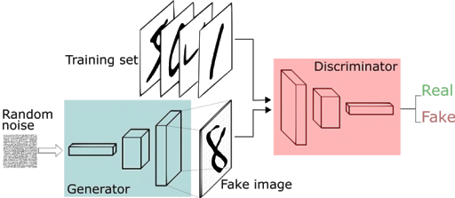
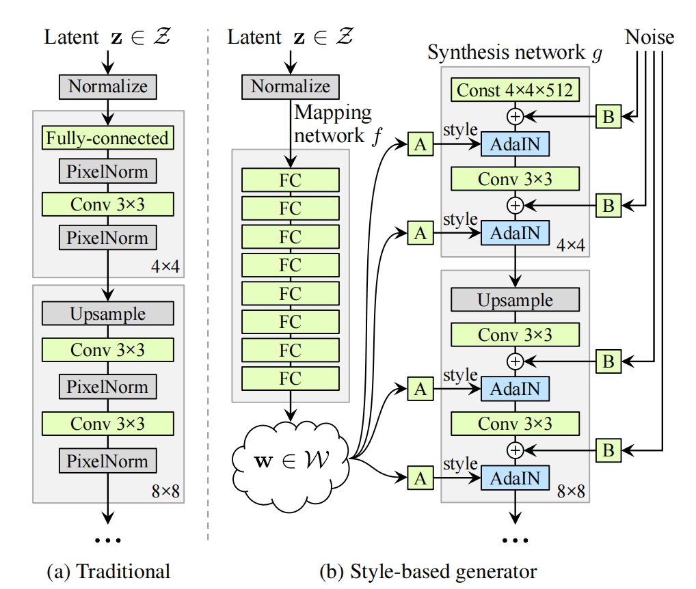
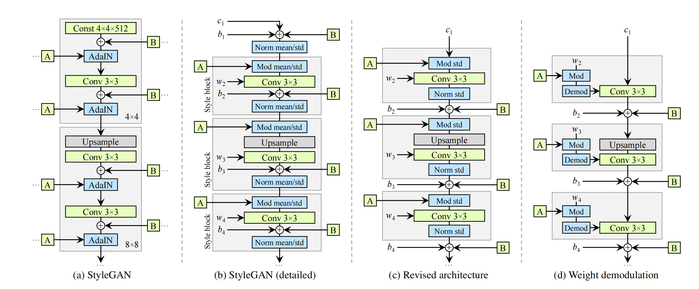
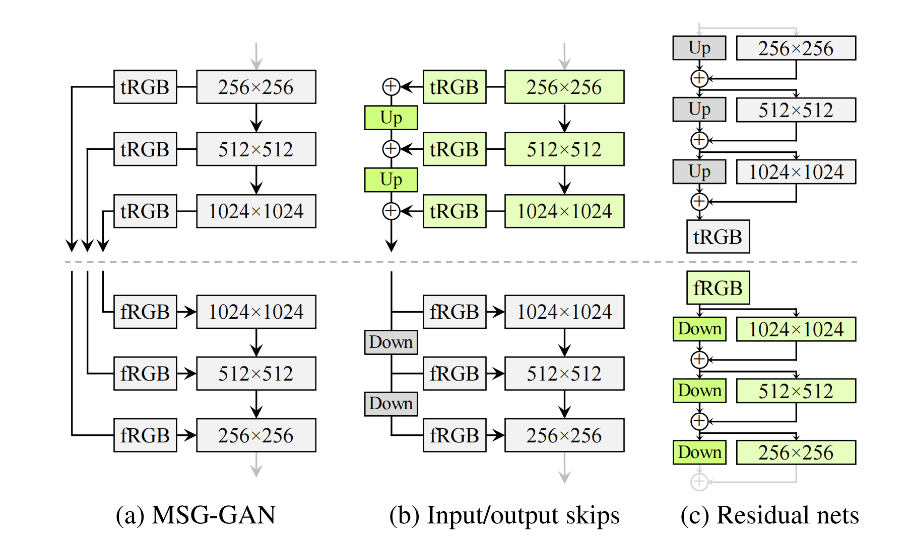
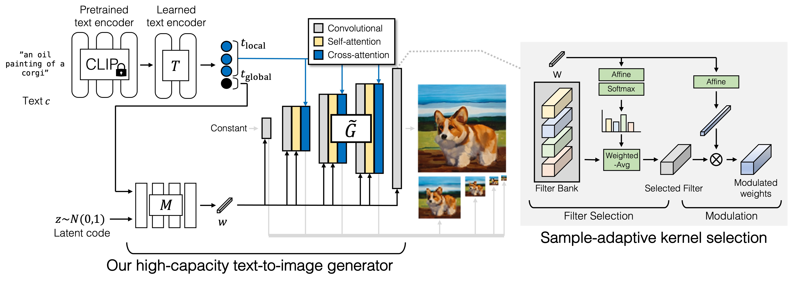
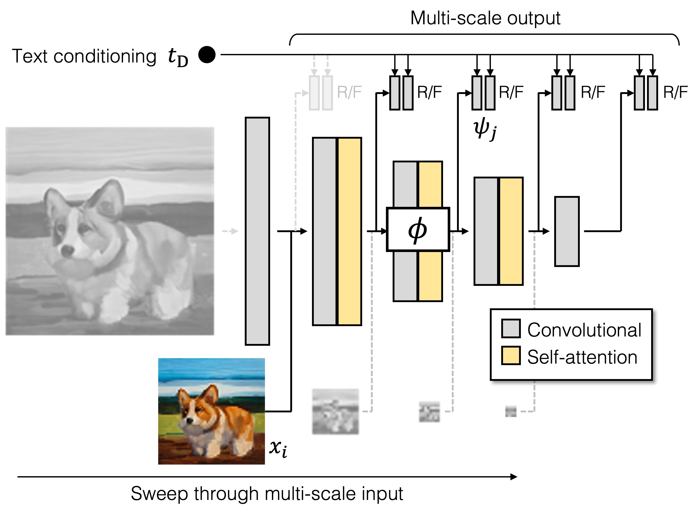
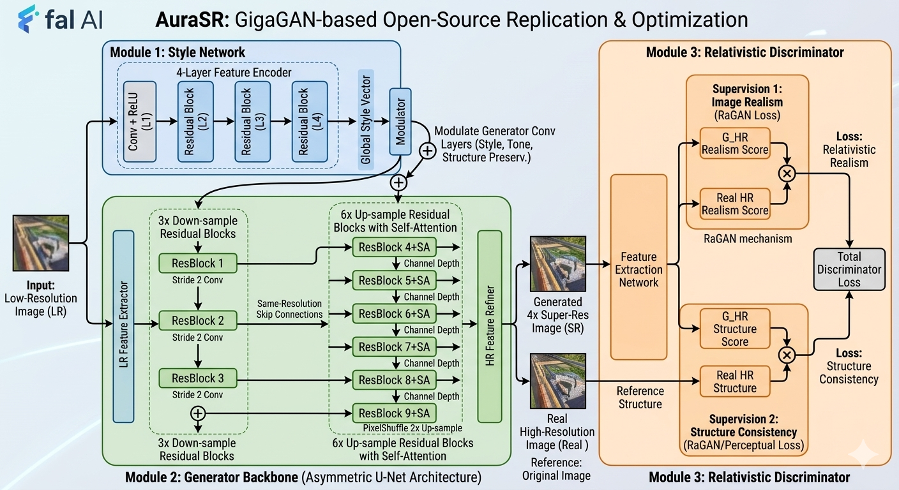

# 目录

[1.介绍一下GAN的核心思想和原理](#1.介绍一下GAN的核心思想和原理)
  - [面试问题：介绍一下生成对抗网络（GAN）的核心思想](#面试问题-介绍一下生成对抗网络gan的核心思想)
  - [面试问题：GAN的训练流程是什么样的？](#面试问题-gan的训练流程是什么样的)
  - [面试问题：进行GAN的完整公式推导与理论证明（进阶）](#面试问题-进行gan的完整公式推导与理论证明)

[2.什么是GAN模型的Mode-collapse(模式坍塌)问题？有哪些解决方法？](#2.什么是GAN模型的Mode-collapse%28模式坍塌%29问题？有哪些解决方法？)
  - [面试问题：介绍一下GAN模型的Mode Collapse（模式坍塌）问题的本质](#面试问题-介绍一下gan模型的mode-collapse模式坍塌问题的本质)
  - [面试问题：为了解决 Mode Collapse（模式坍塌），GAN的主流变体模型都做了哪些优化？](#面试问题-为了解决mode-collapse模式坍塌gan的主流变体模型都做了哪些优化)

[3.哪些经典的GAN模型跨过了周期，在AIGC时代继续落地应用？](#3.哪些经典的GAN模型跨过了周期，在AIGC时代继续落地应用？)
  - [面试问题：哪些GAN模型在 AIGC 时代主流的Low-Level技术中广泛应用？GAN模型如何实现这些功能？](#面试问题-在aigc时代核心的low-level技术中包含了哪些gan模型gan模型如何实现这些功能)
  - [面试问题：介绍一下StyleGAN系列模型的原理](#面试问题-介绍一下stylegan系列模型的原理)
  - [面试问题：介绍一下GigaGAN 与 AuraSR的原理以及两者之间的关系（进阶）](#面试问题-介绍一下gigagan-与-aurasr的原理以及两者之间的关系)

[4.GAN和扩散模型有哪些差异？各自的优势有哪些？](#4.GAN和扩散模型有哪些差异？各自的优势有哪些？)
  - [面试问题：介绍一下 GAN 和扩散模型的核心差异](#面试问题-介绍一下-gan-和扩散模型的核心差异)
  - [面试问题：介绍一下 GAN 和扩散模型各自的核心优势和主流应用场景](#面试问题-介绍一下-gan-和扩散模型各自的核心优势和主流应用场景)

---

<h1 id="1.介绍一下GAN的核心思想和原理">1.介绍一下GAN的核心思想和原理</h1>

<h2 id="面试问题-介绍一下生成对抗网络gan的核心思想">面试问题：介绍一下生成对抗网络（GAN）的核心思想</h2>

**难度评分：⭐⭐⭐ (3/5)  |  考察频率：⭐⭐⭐⭐⭐ (5/5)**

2014年Ian Goodfellow在《Generative Adversarial Nets》论文中第的一次提出 **GAN** 概念；Yann LeCun评价其为近十年AI领域最重要思想之一。

### 1. GAN的核心思想

GAN的核心思想是**基于博弈论的极小极大对抗框架**，通过生成器（Generator，G）与判别器（Discriminator，D）两个网络的相互对抗训练，实现对真实数据分布的无监督学习。

1. **双角色对抗博弈**：
  - 生成器G：类比“伪造者”，目标是生成以假乱真的样本，拟合真实数据的概率分布，最大化判别器的判断错误率。
  - 判别器D：类比“警察”，目标是精准区分输入样本是来自真实训练数据，还是生成器伪造的样本，最大化分类准确率。
2. **训练收敛目标——纳什均衡**：
  对抗训练过程会驱动两个网络持续优化，理论上最终达到全局最优纳什均衡点，即生成器完美拟合真实数据的分布，判别器对任意样本的判断概率恒为 $\frac{1}{2}$ ，完全无法区分真实样本与生成样本。

<div align="center">



</div>

### 2. GAN的技术原理

接下来，我们开始进行GAN本质原理的详细推导，在此之前，我们先定义一下相关符号和公式。

**核心符号与网络定义**

<div align="center">

| 符号 | 定义 |
|------|------|
| $p_{data}(x)$ | 真实数据的概率分布，是生成器需要拟合的目标分布 |
| $p_z(z)$ | 生成器输入的噪声分布（通常为均匀分布/高斯分布）|
| $G(z;\theta_g)$ | 生成器网络，可训练参数为 $\theta_g$ ，将噪声 $z$ 从隐空间映射到数据空间，生成样本为 $x=G(z)$ |
| $p_g(x)$ | 生成器生成样本的概率分布，由 $G(z)$ 与 $p_z(z)$ 隐式定义 |
| $D(x;\theta_d)$ | 判别器网络，可训练参数为 $\theta_d$ ，输入样本 $x$ ，输出0或1的标量。1代表 $x$ 来自真实数据，0代表 $x$ 是生成样本 |

</div>

**极小极大目标函数**

GAN的训练过程被构造成一个零和极小极大博弈，目标函数定义为： 

```math
\min_{G} \max_{D} V(D,G)=\mathbb{E}_{x\sim p_{data}(x)}[\log D(x)]+\mathbb{E}_{z\sim p_{z}(z)}[\log (1-D(G(z)))]
```

- 对判别器D：目标是**最大化** $V(D,G)$。对于真实样本 $x\sim p_{data}$ ，希望 $D(x)$ 尽可能接近1， $\log D(x)$ 尽可能大（趋近0）；对于生成样本 $G(z)$ ，希望 $D(G(z))$ 尽可能接近0， $\log(1-D(G(z)))$ 尽可能大（趋近0）。
- 对生成器G：目标是**最小化** $V(D,G)$，即最大化判别器的错误率，希望 $D(G(z))$ 尽可能接近1，让 $\log(1-D(G(z)))$ 尽可能小（趋近 $-\infty$ ）。

**工程优化：目标函数修正**

原始目标函数在训练早期存在严重的梯度消失问题：训练初期生成器 $G$ 性能很差，判别器 $D$ 能以高置信度区分生成样本，此时 $D(G(z))\approx0$ ， $\log(1-D(G(z)))$ 的梯度趋近于0，导致生成器在训练一开始便无法获得有效梯度。

因此工程上可以对生成器的目标函数进行修正，将 $G$ 的优化目标从**最小化** $\log(1-D(G(z)))$ 替换为**最大化** $\log D(G(z))$ 。该修正能在训练早期为生成器提供更强的梯度信号，大幅缓解梯度消失问题。

<h2 id="面试问题-gan的训练流程是什么样的">面试问题：GAN的训练流程是什么样的？</h2>

**难度评分：⭐⭐⭐ (3/5)  |  考察频率：⭐⭐⭐⭐⭐ (5/5)**

GAN采用**交替优化**的训练策略：先固定生成器G，优化判别器D；再固定判别器D，优化生成器G，循环迭代直至收敛。完整训练流程如下：

> 超参数：迭代更新步数 $k$ （原文实验取 $k=1$ ，每训练1次判别器D，再同步训练1次生成器G）
> 1. 训练迭代次数：
>     1. 循环 $k$ 次，优化判别器D：
>         - 从噪声先验 $p_z(z)$ 中采样 $m$ 个噪声样本 $\{z^{(1)}, ..., z^{(m)}\}$
>         - 从训练数据分布 $p_{data}(x)$ 中采样 $m$ 个训练数据 $\{x^{(1)}, ..., x^{(m)}\}$
>         - 对判别器D的参数 $\theta_d$ 执行随机梯度上升更新：
>           $$\nabla_{\theta_{d}} \frac{1}{m} \sum_{i=1}^{m}\left[\log D\left(x^{(i)}\right)+\log \left(1-D\left(G\left(z^{(i)}\right)\right)\right)\right]$$
>     2. 结束 $k$ 次循环，优化生成器G：
>         - 从噪声先验 $p_z(z)$ 中采样 $m$ 个噪声样本 $\{z^{(1)}, ..., z^{(m)}\}$
>         - 对生成器G的参数 $\theta_g$ 执行随机梯度下降更新（原始目标）：
>           $$\nabla_{\theta_{g}} \frac{1}{m} \sum_{i=1}^{m} \log \left(1-D\left(G\left(z^{(i)}\right)\right)\right)$$
>         - （工程修正后，执行随机梯度上升更新）：
>
> $$
> \nabla_{\theta_{g}} \frac{1}{m} \sum_{i=1}^{m} \log D\left(G\left(z^{(i)}\right)\right)
> $$
>
> 2. 结束训练迭代

<h2 id="面试问题-进行gan的完整公式推导与理论证明">面试问题：进行GAN的完整公式推导与理论证明（进阶）</h2>

**难度评分：⭐⭐⭐⭐⭐ (5/5)  |  考察频率：⭐⭐⭐ (3/5)**

上面几个问题中，Rocky已经讲解了GAN的目标函数和训练流程，在本问题中，Rocky带着大家完整推导GAN的目标函数，从而对GAN的本质原理有更深刻的洞察。

### 1. 固定 $G$ 时，最优判别器 $D_G^*(x)$ 的推导

**命题1**：对于任意固定的生成器G，最优判别器的闭式解为：
```math
D_{G}^{*}(x)=\frac{p_{data}(x)}{p_{data}(x)+p_{g}(x)}
```

**完整推导**：

对于固定的G，判别器D的优化目标是最大化目标函数 $V(G,D)$ 。首先将目标函数的期望形式转化为积分形式（期望的定义： $\mathbb{E}_{x\sim p}[f(x)] = \int_x p(x)f(x)dx$ ）：

$$
\begin{aligned}
V(G, D) & =\int_{x} p_{data}(x) \log (D(x)) d x+\int_{z} p_{z}(z) \log (1-D(G(z))) d z
\end{aligned}
$$

对第二项做变量替换：令 $x=G(z)$ ，根据随机变量函数的期望变换法则，生成样本的分布 $p_g(x)$ 满足

$$
\mathbb{E}_{z\sim p_z}\bigl[f(G(z))\bigr] = \mathbb{E}_{x\sim p_g}\bigl[f(x)\bigr]
$$

因此第二项可改写为 $\displaystyle \int_{x} p_{g}(x)\log\bigl(1-D(x)\bigr)\,\mathrm{d}x$ 。

由此，目标函数可合并为对 $x$ 的单积分形式：

$$
V(G, D) = \int_{x} \left[ p_{data}(x) \log D(x) + p_{g}(x) \log (1-D(x)) \right] dx
$$

要最大化该积分，只需对每个 $x$ ，最大化被积函数 $f(y) = a\log y + b\log(1-y)$ ，其中：
- $a=p_{data}(x)$ ， $b=p_g(x)$ ，均为非负且不同时为0的常数；
- $y=D(x) \in [0,1]$ ，为待优化的变量。

对 $f(y)$ 关于 $y$ 求一阶导数，并令导数为0，求解极值点：

$$
\frac{df(y)}{dy} = \frac{a}{y} - \frac{b}{1-y} = 0
$$

化简求解：

$$
\frac{a}{y} = \frac{b}{1-y} \implies a(1-y) = by \implies a = y(a+b) \implies y = \frac{a}{a+b}
$$

再通过二阶导数验证极值性质：

$$
\frac{d^2f(y)}{dy^2} = -\frac{a}{y^2} - \frac{b}{(1-y)^2} < 0
$$

二阶导数恒小于0，说明该极值点为全局最大值点。将 $a=p_{data}(x)$ 、 $b=p_g(x)$ 代回，即得到固定G时的最优判别器：

$$
D_{G}^{*}(x)=\frac{p_{data}(x)}{p_{data}(x)+p_{g}(x)}
$$

命题1得证。

### 2. 全局最优解的证明

**定理1**：目标函数的全局最小值当且仅当 $p_g = p_{data}$ 时取得，此时全局最小值为 $C(G) = -\log4$ ，且最优判别器满足 $D_G^*(x)=\frac{1}{2}$ 。

**完整推导**：

首先定义固定G时，D取最优解的目标函数为：

$$
C(G) = \max_{D} V(G,D)
$$

GAN的训练目标是找到G，最小化 $C(G)$ 。

将最优判别器 $D_G^*(x)$ 代入 $C(G)$ ，可得：

```math
C(G) = \mathbb{E}_{x \sim p_{\mathrm{data}}}\bigl[\log D_{G}^{\ast}(x)\bigr] + \mathbb{E}_{x \sim p_{g}}\bigl[\log \bigl(1 - D_{G}^{\ast}(x)\bigr)\bigr]
```

将

```math
D_{G}^{\ast}(x)=\frac{p_{\mathrm{data}}(x)}{p_{\mathrm{data}}(x)+p_g(x)},\qquad 1-D_{G}^{\ast}(x)=\frac{p_g(x)}{p_{\mathrm{data}}(x)+p_g(x)}
```

代入，因此：

$$
C(G) = \int_{x} p_{data}(x) \log\left( \frac{p_{data}(x)}{p_{data}(x)+p_g(x)} \right) dx + \int_{x} p_{g}(x) \log\left( \frac{p_{g}(x)}{p_{data}(x)+p_g(x)} \right) dx
$$

为了分析该式的最小值，我们引入**KL散度（相对熵）**与**JS散度（Jensen-Shannon散度）**：

1.  KL散度定义： $KL(P\|Q) = \int_x P(x)\log\frac{P(x)}{Q(x)}dx$ ，满足 $KL(P\|Q)\geq0$ ，当且仅当 $P=Q$ 时取等号。
2.  JS散度定义： $JSD(P\|Q) = \frac{1}{2}KL(P\|\frac{P+Q}{2}) + \frac{1}{2}KL(Q\|\frac{P+Q}{2})$ ，满足 $JSD(P\|Q)\geq0$ ，当且仅当 $P=Q$ 时取等号，取值范围为 $[0, \log2]$ 。

对 $C(G)$ 进行代数变形，拆分对数项：

$$
\begin{aligned}
C(G) &= \int_x p_{data}(x) \log\left( \frac{2p_{data}(x)}{p_{data}(x)+p_g(x)} \cdot \frac{1}{2} \right) dx + \int_x p_{g}(x) \log\left( \frac{2p_{g}(x)}{p_{data}(x)+p_g(x)} \cdot \frac{1}{2} \right) dx \\
&= \log\frac{1}{2} \cdot \left( \int_x p_{data}(x)dx + \int_x p_g(x)dx \right) + \int_x p_{data}(x) \log\left( \frac{p_{data}(x)}{\frac{p_{data}(x)+p_g(x)}{2}} \right) dx + \int_x p_{g}(x) \log\left( \frac{p_{g}(x)}{\frac{p_{data}(x)+p_g(x)}{2}} \right) dx
\end{aligned}
$$

由于概率分布的全积分等于1，即 $\int_x p_{data}(x)dx = \int_x p_g(x)dx = 1$ ，因此 $\log\frac{1}{2} \cdot 2 = \log\frac{1}{4} = -\log4$ 。

剩余的两个积分项恰好是KL散度的形式，因此：

$$
C(G) = -\log4 + KL\left(p_{data} \bigg\| \frac{p_{data}+p_g}{2}\right) + KL\left(p_{g} \bigg\| \frac{p_{data}+p_g}{2}\right)
$$

结合JS散度的定义，可进一步简化为：

$$
C(G) = -\log4 + 2\cdot JSD\left( p_{data}\| p_{g}\right) \quad \text{(3)}
$$

由于JS散度恒非负，即 $JSD(p_{data}\|p_g) \geq 0$ ，因此 $C(G) \geq -\log4$ 。

当且仅当 $p_g = p_{data}$ 时， $JSD(p_{data}\|p_g)=0$ ，此时 $C(G)$ 取得全局最小值 $-\log4$ ，同时最优判别器 $D_G^*(x)=\frac{p_{data}(x)}{p_{data}(x)+p_{data}(x)}=\frac{1}{2}$ ，定理1得证。

### 3. GAN的算法收敛性证明

**命题2**：若G和D具有足够的容量，且在GAN训练的每一步中，给定G时D都能达到最优解，同时 $p_g$ 按照目标函数

```math
\mathbb{E}_{x\sim p_{\mathrm{data}}}\bigl[\log D_{G}^{\ast}(x)\bigr] + \mathbb{E}_{x\sim p_{g}}\bigl[\log\bigl(1 - D_{G}^{\ast}(x)\bigr)\bigr]
```

进行更新，则 $p_g$ 会收敛到 $p_{data}$ 。

**完整推导**：

1. 首先，将 $V(G,D)$ 视为关于分布 $p_g$ 的函数 $U(p_g, D)$ 。对于任意固定的D， $U(p_g, D)$ 是关于 $p_g$ 的凸函数：

    $$U(p_g, D) = \int_x p_{data}(x)\log D(x) dx + \int_x p_g(x)\log(1-D(x)) dx$$

    该式对 $p_g$ 是线性的，而线性函数是凸函数，因此 $U(p_g, D)$ 关于 $p_g$ 凸。

2.  根据凸分析的基本性质：**凸函数的上确界仍然是凸函数**。 $C(G) = \sup_D U(p_g, D)$ 是多个凸函数的上确界，因此 $C(G)$ 是关于 $p_g$ 的凸函数。

3.  同时，定理1已经证明，该凸函数 $C(G)$ 存在**唯一的全局最小值点** $p_g = p_{data}$ 。

4.  对于凸函数的次梯度，有如下性质：若 $f(x) = \sup_{\alpha \in A} f_\alpha(x)$ ，且每个 $f_\alpha(x)$ 都是关于 $x$ 的凸函数，则当 $\beta = \arg\sup_{\alpha \in A} f_\alpha(x)$ 时， $\partial f_\beta(x) \in \partial f(x)$ ，即 $f$ 在 $x$ 处的次梯度包含了 $f_\beta$ 在 $x$ 处的梯度。

    对应到GAN的训练过程：每一步固定 $p_g$ ，找到最优的 $D^* = \arg\max_D U(p_g, D)$ ，此时 $U(p_g, D^*)$ 关于 $p_g$ 的梯度，就是 $C(G)$ 关于 $p_g$ 的次梯度。

5.  算法1中，每一步对 $p_g$ 的更新，本质是沿着 $C(G)$ 的次梯度方向做梯度下降。对于具有唯一全局最小值的凸函数，只要更新步长足够小，梯度下降迭代必然会收敛到全局最小值点 $p_g = p_{data}$ 。

命题2得证。

> 注：该收敛性证明基于非参数无限容量的理想场景；实际中G和D由有限参数的网络实现，整个传统深度学习时代都在不断优化模型架构、训练技术、优化策略等来逼近整个理论极限，即全局最优的纳什均衡。

<h1 id="2.什么是GAN模型的Mode-collapse(模式坍塌)问题？有哪些解决方法？">2.什么是GAN模型的Mode collapse(模式坍塌)问题？有哪些解决方法？</h1>

<h2 id="面试问题-介绍一下gan模型的mode-collapse模式坍塌问题的本质">面试问题：介绍一下GAN模型的Mode Collapse（模式坍塌）问题的本质</h2>

**难度评分：⭐⭐⭐ (3/5)  |  考察频率：⭐⭐⭐⭐⭐ (5/5)**

### 1. Mode Collapse（模式坍塌）的核心定义

GAN的核心是**生成器G**与**判别器D**的对抗博弈，理想收敛状态是达到**纳什均衡**，即 $P_g(x)$ 完全拟合 $p_{data}(x)$ ，判别器对任意样本的输出均为 $\frac{1}{2}$ ，无法区分真假。

**然而上述是GAN穷尽整个技术周期都在追寻的理论理想状态**。在GAN的大部分训练情况下，生成器在训练中仅学习到真实数据分布的**部分模式甚至单一模式**，生成样本的多样性严重缺失，最终收敛到一个价值不高的局部最优解，而非拟合完整训练数据分布的全局最优解或高价值局部最优解，而这个现象这就是 **模式坍塌（Mode Collapse）**。

>**数据的模式（Mode）**：是指真实数据分布中高概率密度的区域，对应数据的核心语义/视觉特征簇。例如人脸数据中，不同性别、年龄、种族、脸型的人脸，就是不同的模式。

模式坍塌的核心是**多样性不足，而非生成质量不足**，坍塌的样本可能视觉上非常清晰、逼真，但翻来覆去只有有限的几种样式，无法覆盖训练数据的全部特征：
- **完全坍塌**：无论输入的随机噪声 $z$ 如何变化，生成器输出几乎完全一致的样本，彻底丧失多样性；
- **部分坍塌**：生成器仅能生成真实数据中的少数几类模式，例如只能生成年轻女性人脸，无法生成老人、儿童、男性人脸，这是GAN实际训练中更为常见的情况。

### 2. Mode Collapse（模式坍塌）的本质原因

**模式坍塌的本质是GAN对抗训练带来的固有缺陷**，核心成因可分为4类：

1. GAN对抗训练中的纳什均衡困境：GAN的优化是一个**极小极大交替优化问题**，而非普通的单目标优化。训练中固定G优化D，再固定D优化G，循环往复。此时（1）若判别器D训练过度、能力过强，生成器G会出现梯度消失，无法获得有效的更新信号，难以学习新的模式；（2）若判别器D能力不足，生成器会找到“欺骗捷径”：只需生成少数几个能稳定骗过D的高质量样本，就能获得极低的损失，无需再探索真实数据的其他模式。此时G会锁定这个局部最优解，无论输入噪声如何变化，都只输出这几类样本，最终发生坍塌。

2. 原始目标函数的散度缺陷：原始GAN的目标函数基于**JS散度**衡量 $P_{data}(x)$ 与 $P_g(x)$ 的分布距离，**在高维空间中，真实数据和生成数据的分布均为低维流形，二者的支撑集几乎没有重叠，此时JS散度会退化为常数** $\log2$，导致生成器的梯度完全消失。此时 $G$ 无法获得探索新模式的有效梯度，只能重复生成已经被 $D$ 认可的样本，最终陷入模式坍塌。

3. 灾难性遗忘（模式遗忘）：GAN的交替训练会导致严重的模式遗忘问题。生成器先学会了模式A，能骗过当前的判别器D；随后判别器D更新，学会识别模式A，生成器G为了骗过新的判别器D，转而学习模式B，却彻底遗忘了已经学会的模式A。训练过程中，生成器G在不同模式间来回切换，永远无法同时覆盖训练数据的所有模式，最终形成部分坍塌。

4. 小批次（Mini-batch）训练的分布偏差：实际训练中，GAN一般采用小批次数据更新模型，每个批次的样本只能覆盖真实数据的部分模式。若批次大小过小，或数据分布不均，生成器G会在每轮训练中仅学习到当前批次的模式，无法泛化到完整的训练分布，进一步加剧模式坍塌。

### 3. Mode Collapse（模式坍塌）与训练不稳定、欠拟合的区别（进阶）

首先我们需要明确**模式坍塌与生成质量好坏的区别**：

模式坍塌的核心是**多样性缺失**，而非生成样本模糊、质量差。很多坍塌的样本视觉上高度逼真，但仅能生成有限的几种样式；而生成样本模糊更多是训练不稳定、欠拟合导致的。

接着我们在理解模式坍塌与训练不稳定、欠拟合三者的区别：

1. 训练不稳定是「优化过程的失控」（过程性问题）：GAN的极小极大交替优化过程**完全失控，无法收敛到纳什均衡**。生成器G和判别器D的对抗博弈陷入“此消彼长”的死循环，无法达成平衡，训练全程震荡，甚至出现梯度爆炸/消失，最终无法得到有效的生成模型。典型表现为生成效果全程剧烈波动，某一轮生成的样本初具轮廓，下一轮直接变成随机噪点；训练全程无法产出稳定、高质量的样本，效果时好时坏，没有持续提升的趋势。
2. 模式坍塌是「生成分布的覆盖不全」（多样性缺陷）：生成器G收敛到了**局部纳什均衡**，生成分布 $P_g(x)$ 仅拟合了真实数据分布 $P_{data}(x)$ 的少数几个高概率密度区域（模式），完全放弃了对剩余模式的学习，最终表现为**生成样本多样性严重缺失，但单样本的生成质量/保真度可以极高**。
3. 欠拟合是「生成分布的整体偏离」（拟合能力缺陷）：本质是生成器的**拟合能力严重不足，完全没有学到真实数据的核心分布与特征**，生成分布 $P_g(x)$ 与真实分布 $P_{data}(x)$ 整体严重偏离，属于拟合能力缺陷。和模式坍塌的“学了一部分、学精了”完全相反，欠拟合是“什么都没学会，只学到了皮毛”。典型表现是生成样本模糊、失真，完全没有真实数据的核心语义特征。比如人脸生成中，生成的样本没有清晰的五官轮廓，只是模糊的色块。样本保真度和多样性双差，没有任何可用的生成结果。

**三者核心区别对比表**

<div align="center">

| 对比维度 | 模式坍塌（Mode Collapse） | 训练不稳定（Training Instability） | 欠拟合（Underfitting） |
| :--- | :--- | :--- | :--- |
| **核心本质** | 生成分布覆盖不全，多样性缺陷，收敛到局部最优 | 优化过程失控，无稳定收敛趋势，过程性故障 | 生成分布整体偏离，拟合能力缺陷，未收敛到有效解 |
| **核心问题** | 多样性严重缺失，保真度极高 | 训练过程震荡，无法稳定收敛 | 保真度极差，核心特征完全没学到 |
| **收敛状态** | 已收敛，但收敛到局部纳什均衡 | 完全不收敛，无稳定的收敛方向 | 未收敛，模型未学到有效特征 |
| **样本核心特征** | 清晰、保真度高，样式高度同质化，多样性极差 | 效果剧烈波动，时好时坏，全程无法产出稳定样本 | 模糊、失真，无核心语义特征，保真度和多样性双差 |

</div>

**三者高频易混淆误区**

- 误区1：把生成模糊的样本都归为欠拟合。
  纠正：只有“完全没学到核心特征的模糊样本”才是欠拟合；训练不稳定也会导致样本模糊、波动；而**模式坍塌的样本通常是清晰、高保真的，只是多样性不足**，这是最核心的区分点。
- 误区2：把模式坍塌等同于训练不稳定。
  纠正：模式坍塌是模型已经稳定收敛了，只是收敛到了局部最优解，损失曲线是平稳的；而训练不稳定是模型完全无法收敛，全程震荡，二者的收敛状态完全相反。
- 误区3：把欠拟合等同于模式坍塌。
  纠正：欠拟合是“啥都没学会”，生成分布整体偏离真实分布；模式坍塌是“只学会了一部分”，生成分布是真实分布的子集，二者的拟合程度天差地别。
- 误区4：把过拟合和模式坍塌混淆。
  纠正：过拟合是生成器直接复制/记忆了训练集样本，生成的是训练集的复制品；模式坍塌是生成器创造了新样本，但仅能生成少数几种模式，并非复制训练集。

**三者的因果关联**

三者并非完全互斥，存在明确的因果传导关系：
1. **训练不稳定是根源性问题，极易诱发另外两类故障**：
   训练不稳定导致的梯度消失，会让生成器G无法获得探索新模式的有效梯度，最终陷入模式坍塌；而参数剧烈震荡，会让生成器G无法持续学习真实数据的特征，最终停留在欠拟合状态。
2. **严重的模式坍塌会反向加剧训练不稳定**：
   当生成器G完全锁定在少数模式后，判别器D会快速学会识别这些模式，导致生成器G损失突然飙升，二者再次进入剧烈对抗的震荡状态，加剧训练不稳定。
3. **欠拟合的模型若强行训练，可能先缓解欠拟合，再陷入模式坍塌**：
   欠拟合的模型随着训练推进，先学到真实数据的基础特征，缓解欠拟合；若此时没有对多样性的约束，生成器G会快速找到欺骗判别器D的捷径，最终陷入模式坍塌。

<h2 id="面试问题-为了解决mode-collapse模式坍塌gan的主流变体模型都做了哪些优化">面试问题：为了解决 Mode Collapse（模式坍塌），GAN的主流变体模型都做了哪些优化？</h2>

**难度评分：⭐⭐⭐⭐ (4/5)  |  考察频率：⭐⭐⭐⭐⭐ (5/5)**

针对Mode Collapse（模式坍塌）问题，主流的解决方案按核心思路可分为5大类：

### 1. 目标函数改进策略

核心思路：放弃存在缺陷的JS散度，采用更适合高维分布、能提供持续平滑梯度的距离度量，从根源上避免梯度消失，让生成器能持续探索新的模式。

- **WGAN/WGAN-GP**：最经典的改进方案。将JS散度替换为**Wasserstein距离（EM距离）**，该距离在两个分布无重叠时仍能提供有意义的平滑梯度，从而解决了梯度消失问题。WGAN通过权重裁剪来满足Lipschitz连续，后续WGAN-GP改用梯度惩罚实现，训练更稳定，模式坍塌问题得到极大缓解。
- **LSGAN**：将GAN原始判别器的损失替换为最小二乘损失，让被判别为真的样本始终能获得梯度，避免了样本远离决策边界时的梯度消失，鼓励生成器探索更多模式，减少坍塌。
- **f-GAN**：将分布距离推广到通用的**f散度**家族，可通过不同的f函数适配不同的数据分布，避免JS散度的固有缺陷，提升训练稳定性与模式覆盖度。

### 2. 训练流程优化策略

核心思路：优化交替训练的流程，平衡 $D$ 与 $G$ 的能力，避免一方碾压，同时解决模式遗忘问题。

- **判别器训练强度控制**：严格控制D与G的更新频率比，通常设置为每更新1次G，同步更新1~5次D，避免D训练过度导致G梯度消失，也避免D过弱导致G找到欺骗捷径。
- **经验回放（Experience Replay）**：借鉴强化学习的思路，将生成器历史生成的样本存入缓存池，训练判别器时，不仅使用当前G生成的样本，还从缓存池中随机抽取历史样本。这能避免D遗忘历史假样本，从而防止G为了适配新的D而遗忘已学会的模式，缓解灾难性遗忘导致的坍塌。
- **ProGAN**：首次实现了1024×1024 分辨率的稳定、高保真、高多样性生成。它提出"先学全局模式，再补局部细节"渐进式训练核心思想。从 4×4 的低分辨率开始训练，随着训练推进，逐步向生成器和判别器中添加高分辨率层，最终生成 1024×1024 的高分辨率图像的渐进式训练范式。该方法让生成器先学习数据的全局模式（如人脸轮廓、五官布局），再逐步学习细节特征，训练过程极度稳定，大幅降低了模式坍塌的概率。

### 3. 正则化约束策略

核心思路：给D和G添加显式约束，强制生成器提升样本多样性，同时让判别器的梯度保持平滑，避免过度尖锐的决策边界。

- **Improved GAN**：（1）小批次判别（Minibatch Discrimination），让判别器在判断样本真假时，同时计算该样本与当前批次内其他样本的特征相似度，若批次内样本高度相似则直接判假，从损失层面强制生成器提升样本多样性。（2）特征匹配（Feature Matching），不直接让生成器骗过判别器的最终输出，而是让生成器拟合真实样本在判别器中间层的特征统计量。判别器的中间层已经学会了区分真假样本的核心特征，生成器匹配这些特征，就必须学习真实数据的本质分布，而非仅仅找到判别器的漏洞。
- **谱归一化（Spectral Normalization）**：对判别器的每一层权重做谱归一化，强制网络满足Lipschitz连续，让判别器的训练全程稳定，不会出现梯度爆炸或梯度消失，避免D变得过强，为G提供持续有效的更新信号，是目前GAN中应用最广泛的正则化方案之一。
- **梯度惩罚（Gradient Penalty）**：除WGAN-GP外，DRAGAN等方案也通过对判别器的梯度添加惩罚项，让判别器D的梯度保持平滑，避免决策边界过度尖锐，防止生成器G只能找到少数几个能骗过判别器D的“安全点”，鼓励生成器G探索更多模式。
- **多尺度噪声注入**：不再仅给生成器输入层添加随机噪声，而是在生成器G的每一层都注入独立的随机噪声，强制生成器G对噪声变化做出响应，提升样本的多样性，避免输入噪声变化但输出不变的完全坍塌。

### 4. 模型架构优化策略

核心思路：通过优化生成器/判别器架构，提升GAN整体的特征学习能力。

- **DCGAN**：虽非直接解决模式坍塌问题，但其首次在GAN框架中引入卷积模块、批归一化等稳定的网络设计规范，为后续所有GAN研究提供了可靠的工程基础，首次实现了较稳定的图像生成。
- **PatchGAN 判别器**：与传统判别器相比，PatchGAN 关注的是图像的局部区域（通常是 70×70 的图像块），而非整个图像。这种设计有助于判别器关注图像的局部结构和纹理，从而更好地评估生成图像的质量。
- **多生成器GAN**：使用多个独立的生成器，每个生成器专门负责学习真实数据分布中的一个子模式，再通过门控网络融合多个生成器的输出。每个G只需专注学好自己负责的模式，不会出现“学新忘旧”的问题，大幅提升整体的模式覆盖度。
- **多判别器架构**：使用多个判别器，分别负责不同尺度、不同特征空间、不同模式的真假判断，避免单个判别器出现特征偏见，为生成器提供更全面的反馈，强制G学习所有模式。
- **AdaGAN**：增量式训练多个GAN，每个新的GAN专门学习之前所有GAN都没有覆盖到的“遗漏模式”，最终将多个GAN的生成结果融合。通过逐步补全的方式，完整覆盖真实数据的所有模式，解决部分坍塌问题。
- **SAGAN**：首次将自注意力机制引入 GAN，让判别器和生成器能捕捉图像的长距离全局依赖，解决了传统 CNN 只能捕捉局部特征、导致生成图像全局结构不一致的问题。提升了复杂场景（自然场景、多目标图像）的生成质量，让生成器能学习到更完整的全局模式，显著缓解了复杂数据集上的模式坍塌。

### 5. 进阶的综合优化策略

核心思路：通过特征解耦、辅助特征注入等复合策略，让生成器学习到更鲁棒、更解耦的特征，而非仅学习能骗过判别器的表面特征，从本质上提升模式覆盖能力。

- **CGAN**：给生成器和判别器同时引入类别 / 标签条件约束，将无监督生成转为有条件生成，强制生成器学习对应条件下的专属数据模式。大幅缓解了无约束生成的模式坍塌问题，让生成内容具备可控性，为后续条件生成、文本生成图像奠定了基础。
- **BigGAN**：基于 SAGAN 架构，核心创新包括（1）大批次训练（Batch Size 最高 2048）、大模型容量，让模型在一次更新中能覆盖更丰富的数据模式；（2）截断技巧（Truncation Trick）通过截断输入噪声的分布，精准平衡生成质量和多样性；（3）结合谱归一化与正交正则化，保证大规模训练的稳定性。首次在 ImageNet 128×128 分辨率上实现了超越以往所有模型的生成效果，大幅缓解了大规模多类别数据集上的模式坍塌问题。
- **StyleGAN系列**：在ProGAN基础上升级，通过**自适应实例归一化（AdaIN）** 将生成过程解耦为不同尺度的风格控制：低尺度控制全局姿态、脸型等全局模式，中尺度控制五官、发型等局部模式，高尺度控制纹理、噪点等细节。解耦后的生成器可以独立控制不同维度的特征，不会因学习一个特征而丢失另一个，是目前在数字人、动漫角色等封闭特定域生成多样性、抗坍塌能力最强的GAN架构之一。
- **自监督学习辅助**：给GAN添加自监督辅助任务（如旋转预测、对比学习、掩码重构），让生成器不仅要骗过判别器，还要学习到数据的核心语义特征。这能避免G只学到欺骗D的表面特征，提升特征的鲁棒性与泛化性，进而提升模式覆盖度。
- **基于能量的EBGAN**：将判别器替换为自编码器，以样本的重构误差作为能量值，给真实样本分配低能量，假样本分配高能量。将GAN纳入能量模型框架，使判别器训练更稳定，能为G提供更平滑的梯度，有效缓解梯度消失与模式坍塌。


<h1 id="3.哪些经典的GAN模型跨过了周期，在AIGC时代继续落地应用？">3.哪些经典的GAN模型跨过了周期，在AIGC时代继续落地应用？</h1>

<h2 id="面试问题-在aigc时代核心的low-level技术中包含了哪些gan模型gan模型如何实现这些功能">面试问题：哪些GAN模型在 AIGC 时代主流的Low-Level技术中广泛应用？GAN模型如何实现这些功能？</h2>

**难度评分：⭐⭐⭐ (3/5)  |  考察频率：⭐⭐⭐⭐⭐ (5/5)**

### 1. AIGC时代主流的Low-Level技术概念

在AIGC时代，Low-Level（底层视觉）技术主要关注图像与视频的基础质量提升与内容编辑（生成、编辑、修复、增强）​，如**超分辨率、去噪、修复、换脸、补全、风格迁移**等。

GAN模型的优势在于  **低延迟** 、**端到端轻量** 、 **效果稳定**，所以在这些特定任务中持续发挥着关键作用。

下面Rocky将详细阐述AIGC时代主流的Low-Level技术领域的任务需求、核心GAN模型，以及这些模型如何实现相应功能。

### 2. AIGC时代主流的Low-Level技术中核心GAN模型与实现原理

<div align="center">

| 任务类型 | 训练数据设计 | 代表GAN模型 | 核心 AIGC 应用价值 |
|----------|----------|-----------------|--------|
| 图像超分辩率重建 | 低清图像/高清图像数据对 | **ESRGAN、Real-ESRGAN、AuraSR** | 解决 AIGC 生成图像分辨率不足、放大后模糊的痛点，同时实现海量低质素材（老照片、低清截图、监控画面）的高清化放大，是 AIGC 画质提升的核心底座 |
| 低质盲人脸修复 | 严重退化人脸/高质量人脸数据对 | **GFPGAN** | AIGC 数字人增强、低清人脸修复、证件照提质的核心技术，既要恢复人脸高清细节，又要严格保证身份不偏移 |
| 通用盲图像修复	|  严重退化图像/高质量图像数据对 | 	**DeblurGANv2、MPRNet、Restormer** | 解决 AIGC 素材、摄影作品、视频帧的混合退化问题（运动模糊、高斯噪声、JPEG 压缩伪影、雨雾遮挡等），是图像/视频画质增强、修复的核心技术。 | 
| 图像到图像翻译 | 草图 / 语义 → 成片 | **Pix2PixHD**、**SPADE / GauGAN**、**CycleGAN**、**StarGAN v2** | 实现不同域之间的图像转换，保留输入语义内容的同时转换域属性，是 AI 绘画草图转实景、语义标签转场景、风格迁移、数字孪生场景生成的重要技术 |
| 图像补全（Inpainting） | 	破损图片/完整图片数据对 | 	**LaMa** | 实现图像缺失、破损、遮挡区域的合理填充，是 PS AI 填充、AI 修图工具、老照片破损修复、水印 / 瑕疵去除、内容重绘的核心底层技术 | 
| 交互式生成/编辑 | 高质量图像数据集 | **StyleGAN2/3**、**DragGAN** | 在 GAN 潜空间或特征上**编辑**语义，实现图像属性的解耦、控制、编辑 |

</div>

在AIGC时代扩散模型和GAN融合​发展的生态中，以上的核心功能特点常作为商业AIGC工作流中的一环，例如在Stable Diffusion、FLUX等扩散模型的前处理和后处理中，扮演“得力助手”的角色。

<h2 id="面试问题-介绍一下stylegan系列模型的原理">面试问题：介绍一下StyleGAN系列模型的原理</h2>

**难度评分：⭐⭐⭐⭐ (4/5)  |  考察频率：⭐⭐⭐⭐⭐ (5/5)**

### 1. StyleGAN 系列的核心基础思想

StyleGAN 系列是 NVIDIA Tero Karras 团队打造的里程碑式生成对抗网络，从 2018 年首次提出至今，围绕生成质量、可控性、解耦性、训练稳定性、小数据适配、几何等变性六大核心方向持续迭代，彻底改变了GAN在人脸高保真图像生成方向的技术范式。

在 StyleGAN 之前的 GAN 模型的生成器是典型的 “黑盒”，即输入隐向量 $z$ 直接送入网络，通过前馈网络逐层上采样生成图像。这种设计存在三个缺陷：

1. 隐空间严重纠缠：输入隐向量 $Z$ 必须拟合训练数据的分布，导致不同语义特征（如人脸的姿态、性别、年龄）高度耦合，无法独立控制；
2. 生成过程不可控：无法分层控制图像的高层语义与底层细节，插值效果非线性严重，易出现特征突变；
3. 随机细节生成低效：网络需要消耗大量容量从隐向量中生成伪随机细节（如毛发、雀斑），易出现重复纹理和伪影。

StyleGAN 系列的核心突破，是借鉴风格迁移的思想，**将图像生成拆解为 “风格编码” 与 “分层合成” 两个独立过程，通过中间隐空间 $W$ 实现特征解耦，通过逐层风格调制实现对生成过程的细粒度控制，从根本上解决了传统 GAN 的黑盒问题**。

同时，所有StyleGAN系列的人脸编辑功能，都建立在同一个核心假设之上：**人脸的所有语义属性，都对应隐空间中的一个线性方向**。

编辑的过程，就是**在隐空间中沿着某个语义方向，对隐向量 $W$ 进行线性偏移**：

$$w' = w + \alpha \cdot d$$

其中：
- $w$ ：原始人脸的风格向量
- $d$ ：对应某个属性（如性别、年龄、微笑）的单位方向向量
- $\alpha$ ：编辑强度（正负表示属性的两个方向，如+α=变老，-α=变年轻）

StyleGAN系列的所有改进，本质都是让这个假设更接近现实。这个假设的成立程度，直接决定了编辑的精度、平滑性和无副作用程度。

StyleGAN系列的迭代路径可以总结为：
1.  StyleGAN1解决了“能不能控”的问题，让GAN从黑盒变成了可分层调控的生成工具；
2.  StyleGAN2解决了“好不好看”的问题，消除伪影，提升了生成质量和稳定性；
3.  StyleGAN3解决了“动起来自不自然”的问题，让GAN从静态图像生成，拓展到了数字人动画生成领域。

### 2. StyleGAN1的核心原理

StyleGAN1 是系列的开山之作，首次提出了**基于风格向量 $w$ 空间和分层AdaIN调制的生成器架构**，彻底重构了传统GAN的生成器设计。新架构为GAN带来了编辑能力，解决了传统 GAN 生成器的黑盒特性、隐空间纠缠、分层可控性缺失、随机细节与高层语义无法解耦的问题。

**【StyleGAN1的整体架构】**

StyleGAN1的生成器分为**映射网络（Mapping Network）**、**合成网络（Synthesis Network）**两大核心模块，辅以**显式噪声输入**、**AdaIN(自适应实例归一化)风格调制** 和 **混合正则化（Mixing Regularization）** 三大关键机制，整体结构如下：

```
输入z(512维高斯) → 映射网络(8层MLP) → 中间隐向量w(512维)
                                 ↓
                         仿射变换(A模块) → 风格向量y
                                 ↓
常量输入(4×4×512) → 合成网络(18层卷积) → 生成图像(1024×1024)
                                 ↑
                        逐层高斯噪声输入(B模块)
```

映射网络 $f: z → w$ 包含8层全连接MLP，输入输出均为512维，将服从标准高斯分布的输入隐向量 $z$ 映射到中间隐空间 $w$ 。

**为什么使用 $w$ 空间，而不是原始 $z$ 空间呢 ？**

经典GAN的输入 $z$ 直接从高斯分布采样，存在严重的 **特征纠缠** 。StyleGAN1论文中通过实验证明：
- $z$ 空间是**纠缠的**：单个维度的变化会同时影响多个语义属性
- $w$ 空间是**部分解耦的**：不同维度的变化更倾向于对应独立的语义属性
- 映射网络能够一定程度上"拉直"隐空间，将扭曲的高斯分布 $z$ ，映射为更均匀、更线性的 $w$ 分布

合成网络 $g$ 摒弃了传统GAN将 $z$ 直接输入的设计，**从一个固定的4×4×512可学习常量张量开始生成**，完全通过风格向量控制（编辑精度的核心）生成过程。合成网络 $g$ 共18层卷积，每一层都接收独立的风格向量$w_i$，通过AdaIN注入风格信息。对应从4×4到1024×1024的9个分辨率，每个分辨率包含2层卷积；每层的核心执行模块为：`3×3卷积 → 显式噪声注入 → AdaIN风格调制 → 非线性激活`，低分辨率层后接2倍上采样。

其中**AdaIN风格调制** 的具体公式如下：

$$
AdaIN\left( x_{i},y\right) =y_{s,i} \frac {x_{i}-\mu (x_{i})}{\sigma (x_{i})}+y_{b,i}
$$

其中 $x_i$ 是卷积输出的第 $i$ 个特征图， $y=(y_s, y_b)$ 是风格向量，由 $w$ 通过仿射变换得到：
$y_i = A_i \cdot w + b_i$ 。

接着将 $y_i$ 按通道维度拆分为两部分，即得到该层的风格参数：

$$y_i = \begin{bmatrix} y_{s,i} \\ y_{b,i} \end{bmatrix}$$

总的来说，先对每个特征图做实例归一化，消除原有特征的统计信息；再用风格向量的缩放 $y_s$ 和偏置 $y_b$ 重新调制特征，实现风格对图像特征的控制。

<div align="center">



</div>

**显式噪声输入** 同样是StyleGAN精妙的设计之一，为合成网络的每一层都注入独立的单通道高斯噪声，通过可学习的通道级缩放因子，加到卷积输出的特征图上。

$$x_i' = x_i + \sigma_i \odot n_i$$

其中：
- $x_i$ ：第 $i$ 层卷积操作的输出特征图，维度为 $\mathbb{R}^{d_i \times H_i \times W_i}$ （通道×高度×宽度）
- $n_i$ ：第 $i$ 层的显式噪声图，维度为 $\mathbb{R}^{1 \times H_i \times W_i}$ ，从标准高斯分布 $\mathcal{N}(0,1)$ 中独立采样
- $\sigma_i$ ：第 $i$ 层的可学习缩放参数向量，维度为 $\mathbb{R}^{d_i}$ （每个通道一个独立的缩放因子）
- $\odot$ ：广播逐元素相乘（噪声图 $n_i$ 会被广播到所有 $d_i$ 个通道）

这样做的核心作用是将图像的 **细节特征（毛发、雀斑、皮肤毛孔、背景纹理）** 与高层语义（身份、姿态）完全解耦，显式噪声仅影响局部细节特征，不改变全局语义和整体构图。**它将生成器从 "既要生成语义结构，又要生成细节特征" 的双重负担中解放，让风格向量专注于编码语义信息，让显式噪声专注于编码细节信息，从而实现了生成质量和真实感的巨大飞跃**。

而 **混合正则化（Mixing Regularization）** 则是在训练时，随机选取一定比例的图像，用两个随机隐向量 $z1/z2$ 生成 $w1/w2$ ，在合成网络的随机选择一层切换风格（ $w1$ 控制最一层和之前的所有层， $w2$ 控制后续层）。

这样做的核心目的是强制网络去学习相邻层的风格，强化风格的局部化特性，让不同分辨率的层控制不同层级的语义。论文中通过风格混合实验，精确量化了不同层控制的人脸属性：

- 粗尺度层（ $4^2-8^2$ ）：控制姿态、脸型、发型、眼镜、性别、年龄等高层全局属性；
- 中尺度层（ $16^2-32^2$ ）：控制面部细节、眼睛开合、发型细节、鼻子形状、嘴巴形状、表情等中层特征；
- 细尺度层（ $64^2-1024^2$ ）：控制肤色、颜色、纹理、光照、妆容等底层像素特征。
  
这是StyleGAN1最有价值的贡献之一，也是所有后续编辑技术的基石。

### 3. StyleGAN2的核心改进

StyleGAN1虽然有很多开创性的贡献，但也有一些不足。比如AdaIN会带来的水滴状伪影、渐进式增长架构会导致图像相位不一致，同时StyleGAN本身存在高分辨率生成细节失真、训练稳定性不足的问题。

StyleGAN2 针对 StyleGAN1 生成图像的伪影问题进行了优化，同时进一步提升了隐空间解耦性和训练稳定性。

**【权重解调（Weight Demodulation）】**

在StyleGAN2中，使用了权重解调（Weight Demodulation）来替代AdaIN，**虽然AdaIN在StyleGAN中被替代，但是在扩散模型中依旧熠熠生辉**。StyleGAN1的AdaIN会对每个特征图独立归一化，破坏了特征图之间的相对幅值关系，是伪影的核心来源，基于此StyleGAN2将风格调制从激活层转移到卷积权重上：
- 先通过风格向量对卷积核进行**调制（Modulation）**，缩放卷积核的输出通道；
- 再对调制后的卷积核做**解调（Demodulation）**，对每个输出通道的权重做归一化，保证输出特征的标准差为1。



这样的设计既保留了风格控制的能力，又完全保留了特征的空间相关性，消除了AdaIN带来的伪影，同时保持了前向传播的高效性。

**【摒弃渐进式增长，重构多尺度架构】**

此外，由于StyleGAN1继承了Progressive GAN的渐进式训练（从4×4逐步增长到1024×1024分辨率），虽提升了训练稳定性，但会导致生成特征的相位不一致，物体细节在分辨率增长时出现错位。

基于这个问题，StyleGAN2做了两大改进：
  - 用**残差连接+双线性上/下采样**替代渐进式增长，保证高低分辨率特征的相位对齐；
  - 用**跳连结构重构生成器/判别器**，生成器用残差块，判别器用残差连接，大幅提升高分辨率图像的生成质量和训练稳定性。



**【针对性正则化技术】**

StyleGAN2中加入了**路径长度正则化（Path Length Regularization）**，强制隐空间 $W$ 的微小变化与生成图像的变化呈线性关系，让 $W$ 空间的插值更平滑，进一步提升特征解耦性。其核心逻辑是让生成器雅可比矩阵的范数保持恒定，避免隐空间的非线性扭曲，让用户对生成结果的控制更精准。

持此之外还设计了**懒惰正则化（Lazy Regularization）** 的策略，使得R1正则化和路径长度正则化无需每轮都迭代计算，改为每16步计算一次，在不损失效果的前提下，将训练速度提升了近2倍。

### 4. StyleGAN3的核心改进

StyleGAN3是整个系列的又一次范式革新，从连续信号处理的底层理论出发，解决了之前版本一直存在的 **纹理粘连（Texture Sticking）** 问题，实现了生成图像的平移/旋转等变性，**为GAN的数字人动画生成领域铺平了道路**。

StyleGAN3是怎么做到的呢？首先，我们要知道，什么是几何等变性：**先变换隐向量再生成图像，和先生成图像再变换图像，得到的结果完全一致**。

StyleGAN1/2中，生成人脸的细节（毛发、纹理、皮肤毛孔）会“粘在图像的像素坐标上”，而非人脸表面；当我们通过隐空间插值让人脸平移/旋转时，细节不会跟随物体移动，导致数字人动画生成时出现严重的不自然感，缺乏几何等变性。

上述问题的根源是由**信号混叠（Aliasing）** 和 **坐标泄露** 产生的。

**信号混叠（Aliasing）** 主要表现为高频信号的错误采样。很多主流的 GAN 的操作都违反了奈奎斯特采样定理，
为了无失真地重建一个连续信号，采样频率必须至少是信号最高频率的 2 倍。在GAN的生成器中，**逐点非线性激活（如 Leaky ReLU）** 是混叠的最大来源。当我们对一个带限信号应用逐点非线性时，会产生无穷多的高频谐波分量。这些高频分量超过了当前分辨率的奈奎斯特频率，会被错误地采样为低频分量，这就是混叠。

混叠的直观表现就是纹理粘连：当、我们平移或旋转图像时，这些错误的低频分量不会跟着物体一起移动，而是留在原地，看起来就像是纹理粘在了像素网格上。

**绝对坐标泄露** 表现为GAN生成器中有很多操作会向网络泄露绝对像素坐标。比如：
1. 固定的常量输入：StyleGAN1/2 最顶层的 4×4 常量张量，本身就包含了绝对坐标信息
2. 逐像素噪声：噪声是和像素坐标绑定的，平移图像时噪声不会跟着动
3. 边界填充：零填充、反射填充都会在图像边界产生不连续，泄露绝对位置
4. 非对称卷积核：3×3 卷积核本身不是径向对称的，会破坏旋转等变性

这两个问题相互作用，共同导致了之前的一些主流GAN生成器的不等变性。StyleGAN3 的所有设计，都是围绕着系统性消除混叠和全链路封堵坐标泄露这两个目标展开的。

**【StyleGAN3的核心架构优化】**

StyleGAN3的核心设计目标是：**让生成器对连续信号的平移/旋转完全等变性**，即对输入特征做几何变换，生成图像的所有细节会进行跟随变换，不产生粘连。

那么StyleGAN3是如何实现上述的目标呢？

1. **连续信号视角的建模重构**。将网络中所有离散特征图视为**连续带限信号的离散采样**，严格遵循奈奎斯特采样定理，确保网络的每一步操作都不会引入混叠，消除网络感知绝对像素坐标的可能。

2. **混叠的系统性消除**
  - **上采样滤波器升级**：将之前系列的双线性上采样，替换为**Kaiser窗sinc滤波器**，带外衰减超过100dB，消除上采样带来的混叠；旋转等变版本进一步替换为径向对称的jinc滤波器，保证旋转时的频谱一致性。
  - **带限非线性操作**：逐点非线性会产生任意高频分量，是混叠的核心来源。StyleGAN3设计了专属流程：先对特征图做2×上采样→应用非线性激活→2×带限下采样，滤除所有超过奈奎斯特频率的分量，确保非线性操作后无混叠。同时开发了自定义CUDA内核，将三步操作融合，实现了10倍的速度提升。
  - **非临界采样**：低分辨率层降低截止频率，为非线性操作留出频谱余量，实现更强的带外衰减；高分辨率层采用临界采样，保证输出图像的锐度，兼顾了抗混叠和生成质量。

3. **绝对坐标泄露的全链路封堵**
  - 移除了StyleGAN1/2中的逐像素噪声输入，因为噪声与绝对像素坐标绑定，会破坏等变性；
  - 移除了边界填充，改用固定的10像素边缘余量，防止边界信息泄露绝对坐标；
  - 用 **傅里叶特征（Fourier Features）** 替换了固定的4×4常量输入，实现了输入特征的连续平移和旋转，为整个网络的等变性打下基础；同时加入可学习的仿射层，控制输入特征的全局平移和旋转，让生成内容的全局姿态更丰富。

4.  **平移/旋转等变的最终实现**
  - **StyleGAN3-T**：保留3×3卷积，实现了亚像素级的平移等变性，深度解决了纹理粘连问题；
  - **StyleGAN3-R**：将3×3卷积替换为1×1卷积，仅通过上/下采样实现像素间的信息传播，配合径向对称的jinc滤波器，实现了任意角度的旋转等变性，生成的物体旋转时，所有细节完美跟随物体表面移动。

上述优化深度解决了纹理粘连问题，生成的内容在平移/旋转时，细节紧密跟随物体，**为数字人动画、3D内容创作提供了核心基础**。同时保持了与StyleGAN2相当的FID指标，图像质量无下降。

### 5. StyleGAN系列的损失函数

**【StyleGAN1 完整损失函数】**

StyleGAN1设计了两套损失函数，一开始使用WGAN-GP损失函数，后续优化为经典的GAN非饱和损失+R1正则。

WGAN-GP损失函数通过梯度惩罚强制判别器满足1-Lipschitz约束，解决原始GAN的模式崩溃和训练不稳定问题。

- 判别器总损失：

$$
\mathcal{L}_D = \underbrace{\mathbb{E}_{G(z)\sim p_g}[D(G(z))] - \mathbb{E}_{x\sim p_{\text{data}}}[D(x)]}_{\text{WGAN核心损失}} + \underbrace{\lambda_{\text{gp}} \cdot \mathbb{E}_{\hat{x}\sim p_{\hat{x}}}\left[ \left( \|\nabla_{\hat{x}} D(\hat{x}) \|_2 - 1 \right)^2 \right]}_{\text{梯度惩罚项(GP)}}
$$

- 生成器损失：

$$
\mathcal{L}_G = - \mathbb{E}_{z\sim p_z}[D(G(z))]
$$

其中：
- $\hat{x}$ 为真实样本与生成样本的随机插值： $\hat{x} = \epsilon x + (1-\epsilon)G(z)$ ， $\epsilon \sim U(0,1)$ （0-1均匀分布）
- $\lambda_{\text{gp}}$ 为梯度惩罚权重，官方默认取值为10
- 此处 $D(\cdot)$ 输出为Wasserstein距离拟合值，而非概率评分

后续StyleGAN又采用了优化方案：非饱和逻辑损失 + R1正则化，与ProGAN方案一致，训练稳定性和生成效果优于WGAN-GP损失，**后续StyleGAN系列全面沿用该核心框架**。

- 判别器总损失：

$$
\mathcal{L}_D = \underbrace{ - \mathbb{E}_{x\sim p_{\text{data}}}[\log D(x)] - \mathbb{E}_{z\sim p_z}[\log(1 - D(G(z)))] }_{\text{非饱和逻辑损失（判别器项）}} + \underbrace{ \lambda_{\text{r1}} \cdot \mathcal{R}_1 }_{\text{R1梯度惩罚正则项}}
$$

- 生成器总损失（仅非饱和损失，无正则项）：

$$
\mathcal{L}_G = - \mathbb{E}_{z\sim p_z}[\log D(G(z))]
$$

- R1正则项完整公式：

$$
\mathcal{R}_1 = \mathbb{E}_{x\sim p_{\text{data}}} \left[ \| \nabla_x D(x) \|_2^2 \right]
$$

其中：
- $\lambda_{\text{r1}}$ 为R1正则权重，StyleGAN1官方默认固定取值为10
- R1正则核心：仅对真实样本的判别器梯度做惩罚，强制梯度平滑，满足Lipschitz约束，计算效率和稳定性优于WGAN-GP

**【StyleGAN2 完整损失函数】**

StyleGAN2在「非饱和逻辑损失+R1正则化」的核心框架上 **新增路径长度正则化（PL正则）** ，解决StyleGAN1隐空间编辑不稳定的问题，是该版本最核心的损失函数升级。

- PL正则项完整公式：

$$
\mathcal{R}_{\text{pl}} = \mathbb{E}_{z\sim p_z, w\sim \mathcal{N}(0,I)} \left[ \left( \| J_w^T w \|_2 - a \right)^2 \right]
$$

其中：
  - $J_w$：生成器合成网络对风格向量 $w$ 的雅可比矩阵，表征 $w$ 的微小变化对生成图像的影响
  - $a$：路径长度的移动平均值，训练中动态更新，更新公式为 $a \leftarrow \mu a + (1-\mu) \| J_w^T w \|_2$ ，平滑系数 $\mu$ 官方默认0.99

生成器总损失：

$$
\mathcal{L}_G = \mathcal{L}_G^{\text{adv}} + \lambda_{\text{pl}} \cdot \mathcal{R}_{\text{pl}} = \underbrace{ - \mathbb{E}_{z\sim p_z}[\log D(G(z))] }_{\text{非饱和对抗损失}} + \underbrace{ \lambda_{\text{pl}} \cdot \mathcal{R}_{\text{pl}} }_{\text{路径长度正则项}}
$$

判别器总损失：

$$
\mathcal{L}_D = \mathcal{L}_D^{\text{adv}} + \lambda_{\text{r1}} \cdot \mathcal{R}_1 = \underbrace{ - \mathbb{E}_{x\sim p_{\text{data}}}[\log D(x)] - \mathbb{E}_{z\sim p_z}[\log(1 - D(G(z)))] }_{\text{非饱和对抗损失}} + \underbrace{ \lambda_{\text{r1}} \cdot \mathbb{E}_{x\sim p_{\text{data}}} \left[ \| \nabla_x D(x) \|_2^2 \right] }_{\text{R1正则项}}
$$

其中StyleGAN2对权重做了分辨率适配，官方公式为 $\lambda_{\text{r1}} = \frac{\gamma}{2}$，其中 $\gamma=0.0002 \times \text{分辨率}^2$ ；例如1024×1024分辨率下， $\gamma=204.8$ ， $\lambda_{\text{r1}}=102.4$ 。核心目标是让隐空间的线性插值对应图像空间的均匀变化，提升隐空间可编辑性，让风格调制更平滑。同时 $\lambda_{\text{pl}}$ 为PL正则权重，官方默认取值为2，可选开启，开启后不损失生成质量，显著提升隐空间编辑能力。

**【StyleGAN3 完整损失函数】**

StyleGAN3**核心损失框架继承自StyleGAN2**，无核心公式修改。仅在StyleGAN3-T这个3D感知变体（人脸/场景视角生成）模型中引入了相机姿态一致性损失，核心目标是在不同相机姿态的场景下，保持身份/内容一致性，仅改变视角。

- 姿态一致性损失公式：
  
$$
\mathcal{L}_{\text{pose}} = \mathbb{E}_{z\sim p_z, \xi_1, \xi_2 \sim p_{\xi}} \left[ \| \text{Enc}(G(z, \xi_1)) - \text{Enc}(G(z, \xi_2)) \|_1 \right]
$$

- 加入该损失后的生成器总损失：

$$
\mathcal{L}_G = \mathcal{L}_G^{\text{adv}} + \lambda_{\text{pl}} \cdot \mathcal{R}_{\text{pl}} + \lambda_{\text{pose}} \cdot \mathcal{L}_{\text{pose}}
$$

其中：
- $\xi_1, \xi_2$：从相机姿态分布 $p_\xi$ 采样的两组不同相机外参（平移、旋转、视角等）
- $\text{Enc}(\cdot)$：预训练特征编码器（人脸场景用ArcFace，通用场景用CLIP）
- $\lambda_{\text{pose}}$ 为姿态一致性损失的权重，官方默认取值0.1~1，根据场景调整

到这里，Rocky再总结一下StyleGAN系列损失函数的演进核心过程：
  - StyleGAN1：完成从WGAN-GP到「非饱和损失+R1正则」的切换，奠定系列基础框架
  - StyleGAN2：新增PL正则，补齐隐空间可编辑性的短板，成为系列最优通用方案
  - StyleGAN3：完全继承StyleGAN2的损失体系，仅做场景化适配，核心优化集中在架构抗混叠


<h2 id="面试问题-介绍一下gigagan-与-aurasr的原理以及两者之间的关系">面试问题：介绍一下GigaGAN 与 AuraSR的原理以及两者之间的关系（进阶）</h2>

**难度评分：⭐⭐⭐⭐ (4/5)  |  考察频率：⭐⭐⭐ (3/5)**

### 1. GigaGAN 的特点与优势

在进行AIGC时代后，扩散模型几乎统治了整个图像生成领域，GigaGAN可以说是GAN技术绽放出的“最后光芒”。GigaGAN是迄今为止参数量最大的文生图GAN模型，一共有1B（10亿）的参数量，是AIGC时代的GAN大模型。GigaGAN主要以下的几个特点：

1. 首个在LAION 2B数据集上训练成功的超大规模文生图GAN模型
2. 仅需0.13 秒就能单步生成512*512分辨率的图像。
3. 单步生成4k分辨率的超高分辨率图像仅需 3.66 秒。
4. 和StyleGAN一样具有解耦可控的潜在向量空间，可以用于风格迁移、语义特征混合/插值和隐空间向量运算等可控生成任务。
5. 生成效果在COCO 零样本测试集的FID为9.09，低于当时的 DALL・E 2、原生Stable Diffusion 1.5。

### 2. GigaGAN 核心模型架构

GigaGAN 的整体架构，分为生成器、判别器、超分器三大独立又可组合的模块。

**【GigaGAN生成器】**

生成器模块是 GigaGAN 的核心，它在 StyleGAN 的基础上进行了优化，整体分为三大子模块：

**文本编码模块**为权重冻结的 CLIP ViT-L/14 ，把 prompt 提取成文本特征，再过一个可学习的 Transformer 层 $T$，把文本拆成两部分：
  - 全局文本特征 $t_{global}$：对整个 prompt 的整体理解，拿去和随机隐向量 $z$ 一起生成风格码 $w$；
  - 局部词嵌入 $t_{local}$ ：每个单词的细粒度特征，用于交叉注意力机制，让生成器精准对应 prompt 里的每个词，解决图文对齐问题。

这和传统 StyleGAN 只靠一个全局风格码调制完全不同，相当于既给了整体的「创作指令」，又给了逐词的「细节要求」。

**风格映射网络 $M$**：一个 4 层的 MLP，把随机隐向量 $z$ 和全局文本特征 $t_{global}$ ，映射成 1024 维的风格码 $w$。这个 $w$ 就是整个生成器的「指挥棒」，不仅要调制卷积层，还要动态选择卷积核，是整个生成器的核心控制信号。

**合成网络**：经典的 StyleGAN 就是一串上采样卷积块，而 GigaGAN 的每个卷积块，都变成了**自适应卷积核选择→L2 自注意力→文本 - 图像交叉注意力**的三件套，一层一层上采样，最终输出的不是单张图，而是一个 5 级的图像金字塔（4×4→8×8→16×16→32×32→64×64）。

这个设计一箭双雕：
  - 一是每个模块同时解决了「表达力」「长距离建模」「图文对齐」三个问题。
  - 二是多尺度金字塔输出，给判别器提供了全尺度的监督信号，解决低分辨率层训练不充分的问题。

<div align="center">



</div>

**【GigaGAN判别器】**

GigaGAN 能稳定训练，核心就在这个独创的MS-I/O（多尺度输入 - 多尺度输出）判别器，还有一套组合损失函数，解决了传统文生图 GAN 的训练痛点。

1. 双分支基础结构：一个文本分支提取全局文本特征，一个图像分支处理生成器输出的多尺度图像金字塔，两个分支的特征最终做对比，对「图像是不是真的」和「图像和文本对不对得上」两个维度同时判断。
2. MS-I/O 核心设计：这是 GigaGAN 最优雅的设计之一。传统 GAN 的判别器，只对最终的高分辨率图做一次真假判断；而 GigaGAN 的判别器，对生成器输出的每一个尺度的图像，都在判别器后续的所有下采样层做独立的真假判断。举个例子，64×64 的输入图，会在 32、16、8、4、1 五个尺度都做预测；32×32 的输入图，会在 16、8、4、1 四个尺度做预测，以此类推，总共 15 个预测分支。这就相当于给生成器的每一个分辨率层，都提供了独立的梯度信号，低分辨率层也要学好整体结构和语义，不然直接被判别器惩罚。这样的设计解决了大模型低分辨率层失活的问题，生成的图结构更合理，图文对齐也更好。
3. 组合损失函数：除了标准的非饱和 GAN 损失，还加了三个关键损失，让训练更加稳定：
（1）匹配感知损失：强制判别器必须关注文本条件，把真实图 / 生成图和随机的不匹配文本配对，全部判成假。让判别器从训练一开始就必须同时看「图像真不真」和「图文对不对」，深度解决了图文对齐的核心痛点。
（2）CLIP 对比损失：让生成的图像和 prompt 在 CLIP 特征空间里尽可能对齐，进一步强化图文匹配，同时给生成器提供额外的稳定训练信号。
（3）视觉辅助 GAN 损失：拿冻结的 CLIP 图像编码器做了一个额外的判别器，用预训练模型的特征来判断真假，相当于给训练加了一个「资深评委」，大幅提升了超大规模参数训练的稳定性。

<div align="center">



</div>

**【GigaGAN超分模块】**

GigaGAN 构建了一个两阶段生成的整体设计：先用基础生成器生成 64×64 的图，再用单独训练的 GAN 超分模块，超分到 512×512 甚至 4096×4096分辨率。

这个超分模块用的是非对称 U-Net 架构，3 个下采样残差块 + 6 个带注意力的上采样残差块，还有同分辨率的跳跃连接，训练的时候除了基础的 GAN 损失，还加了 LPIPS 感知损失，保证超分后图像和原图的一致性。

值得一提的是，**这个超分模块是即插即用的**，可以作为AIGC图像领域通用的超分工具，效果比 Real-ESRGAN等经典超分模型更好。而GigaGAN中的这个超分模块这也是后面 AuraSR 诞生的核心基础。

### 3. AuraSR 和 GigaGAN 的关系

AuraSR 是 Fal AI 团队基于 GigaGAN 超分器架构，做开源复刻与工程优化的 4 倍超分 GAN 模型，是 GigaGAN 超分模块的开源版本，也是当前 AI 工业界最主流的轻量高效超分方案之一。

### 4. AuraSR 的核心技术原理

AuraSR 的整体架构分为 3 个核心模块：
1. 风格网络：4 层特征编码器，输入低分辨率图像，提取全局风格向量，用于调制生成器卷积层，保证超分后完全保留原图的风格、色调与结构。
2. 生成器Backbone：非对称 U-Net 架构，3 个下采样残差块 + 6 个带自注意力的上采样残差块，搭配同分辨率跳跃连接，兼顾结构保留与高清细节生成。
3. 相对论判别器：同时监督两个核心目标，分别是超分图像的真实感以及超分图像与原图的结构一致性，避免生成虚假细节、篡改原图内容。

<div align="center">



</div>

AuraSR 系列迭代历程：
1. AuraSR v1 版本：权重完全开源，并针对 AI 生成的图像做专项训练优化，消费级显卡即可运行。
2. AuraSR v2 核心升级：
   - 模拟退化预处理：训练时加入 JPG 压缩、高斯模糊、噪声等真实图像退化模拟，让模型适配真实世界的低清照片，不再局限于干净的 AI 生成图；
   - 分块训练对齐：训练时采用小块切分训练，和推理过程完全对齐，解决超分后细节过度、乱加虚假纹理的问题；
   - 重叠分块推理：新增重叠分块 + 双次推理平均算法，彻底消除大图超分的拼接接缝问题。

### 5. AuraSR 的核心优势与落地场景

1. 核心优势：
    - 速度极致：512px→1024px 超分仅需 0.25 秒，比扩散超分、Real-ESRGAN 快数十倍；
    - 效果均衡：兼顾保真度与细节生成，不篡改原图结构 / 风格，同时适配 AI 生成图与真实照片；
    - 部署友好：轻量化设计，消费级显卡、端侧设备均可流畅运行，支持批量处理。

2. 核心落地场景：AI 生成图高清化、老照片 / 模糊图像修复、电商 / 商业素材高清生产、视频帧批量超分、直播 / 游戏实时画面超分。


<h1 id="4.GAN和扩散模型有哪些差异？各自的优势有哪些？">4.GAN和扩散模型有哪些差异？各自的优势有哪些？</h1>

<h2 id="面试问题-介绍一下-gan-和扩散模型的核心差异">面试问题：介绍一下 GAN 和扩散模型的核心差异</h2>

**难度评分：⭐⭐⭐⭐ (4/5)  |  考察频率：⭐⭐⭐⭐⭐ (5/5)**

Rocky认为，GAN 和扩散模型的核心差异可以从数学原理、生成范式、训练稳定性、隐空间特性、推理效率和应用生态六个核心维度来深入理解。

<div align="center">

| 对比维度 | GAN | 扩散模型 |
| :--- | :--- | :--- |
| **核心数学建模范式** | 隐式生成模型，无显式概率分布建模 | 显式概率生成模型，基于变分推断建模数据分布 |
| **核心思想与生成范式** | **对抗博弈**。通过生成器 $G$ 与判别器 $D$ 的对抗训练。 $G$ 的目标是生成以假乱真的数据欺骗 $D$ ， $D$ 的目标是准确区分真假。这是一个寻找纳什均衡的**极小极大博弈**过程。 | **加噪与重建**。通过前向过程向数据逐步添加噪声，再训练网络学习逆向的**去噪过程**。其生成是从纯噪声出发，沿着学习到的“向量场”（如噪声预测、分数函数等）逐步迭代恢复。 |
| **训练稳定性与模式覆盖** | **训练不稳定**。对抗训练过程的优化目标通常难收敛，易梯度消失、模式崩溃、震荡不收敛等。| **高度稳定**。其训练目标（如预测噪声）本质上是**稳定的回归任务**，训练过程能稳步拟合数据分布。基于似然的特性使其天然具备良好的**模式覆盖**能力。 |
| **隐空间与重建能力** | **隐空间容量通常有限**。GAN通常将随机噪声压缩为一个**风格向量**（style code），信息损失较多，导致**GAN反演**的重建精度相对较差。 | **隐空间容量大且连续**。其隐空间天然是**特征谱**形式，通过DDIM反演等技术，能以极高精度将真实图像映射回生成轨迹，为图像编辑等下游任务提供了坚实基础。 |
| **推理速度** | **一次前向推理，速度极快**。生成仅需生成器 $G$ 一次前向推理，生成速度具有绝对优势。 | **多步迭代，较慢**。生成需要从噪声开始进行数十到数百步的迭代去噪，计算成本高。但可通过**DDIM**（跳步采样）、**一致性模型**、**Rectified Flow**等技术大幅加速。 |
| **主流架构与生态** | 核心为生成器 $G$ + 判别器 $D$ 的对抗框架。在细分领域（如数据增强、图像Low-Level处理、数字人）仍有稳固地位。 | 主流为图像编/解码器 + **U-Net/DiT-Transformer** + Text Encoder的扩散架构。拥有**强大繁荣的开源生态**，有丰富的配套工具（LoRA、ControlNet、AIGC特征注入技术等），推动了AIGC图像创作的持续繁荣。 |

</div>

总的来说，Rocky 认为 GAN 如同一个在对抗中不断精进技艺的“伪造大师”，追求**实时推导的效率与博弈对抗的智慧**；而扩散模型则像一位耐心细致的“文物修复大师”，擅长**通过稳定的多步重建来追求极致的真实性与多样性**。

<h2 id="面试问题-介绍一下-gan-和扩散模型各自的核心优势和主流应用场景">面试问题：介绍一下 GAN 和扩散模型各自的核心优势和主流应用场景</h2>

**难度评分：⭐⭐⭐ (3/5)  |  考察频率：⭐⭐⭐⭐⭐ (5/5)**

### 1. GAN的优势

1.  **极高的实时性与低延迟**：这是GAN最显著的优势，它能做到毫秒级出图。一次前向推理即可对图像进行增强、编辑、生成，使其在对实时性要求高的应用中不可替代。
2.  **封闭域的高保真度**：在人脸、动漫角色等特定封闭域，StyleGAN 系列等改进型 GAN 的生成细节、一致性、细节控制依然是行业标杆，在数字人、动漫人物生成等垂直领域的工业落地非常成熟。
3.  **极强的轻量化与端侧部署能力**：经过十余年的持续发展，GAN 可被压缩到极小的参数量，能在低算力的移动端、嵌入式设备、边缘设备上流畅运行，工业界端侧落地的成熟度极高，适配算力受限的部署场景。
4.  **成熟可靠的图像Low-Level处理能力**：在超分辨率、图像修复、图像补全等经典视觉任务上，GAN 有大量轻量、高效、开箱即用的成熟方案，推理速度和效果的平衡度极佳。

### 2. 扩散模型的优势

1.  **卓越的训练稳定性与可扩展性**：训练过程稳健，不需要复杂的调参和工程 trick，易于Scaling up模型规模和数据量，性能随规模增长而可靠提升。
2.  **强大的模式覆盖与生成质量**：在保证超高清、高保真生成效果的同时，生成样本的多样性远超 GAN。目前在复杂的图像生成任务中，扩散模型通常能达到较好的落地商用效果。
3.  **天花板级的可控性与可扩展性**：天生适配多模态条件控制，ControlNet、LoRA 等技术让生成控制的粒度精细到像素级，能轻松实现复杂的图像创意生成需求。
4.  **蓬勃的开源生态**：以Stable Diffusion、FLUX为代表的开源模型及其庞大配套工具链，极大地降低了AIGC图像内容的创作和研发门槛。

### 3. GAN 和扩散模型的主流应用场景

- 优先选择 GAN：实时交互生成、端侧 / 边缘设备部署、人脸 / 动漫等封闭域特定内容生成、补全 / 超分 / 修复任务、对延迟有极致要求的工业场景。
- 优先选择扩散模型：全领域通用文生图 / 图生图 / 复杂内容创作、高分辨率复杂场景生成、需要细粒度可控的生成任务、跨模态生成、视频 / 3D / 音频等多领域生成、小样本小众领域的生成任务、对质量和多样性有双重要求的场景。

---