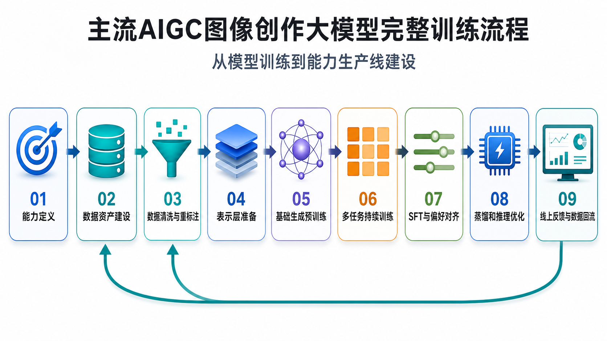
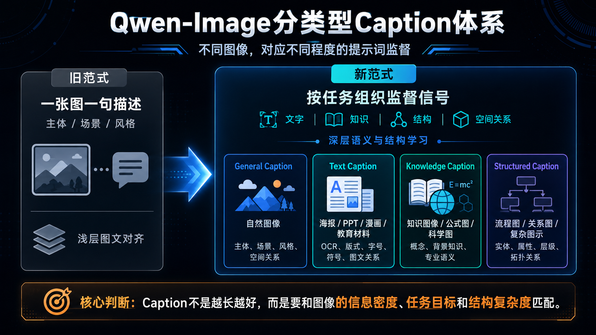
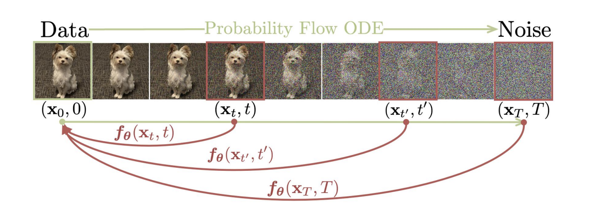
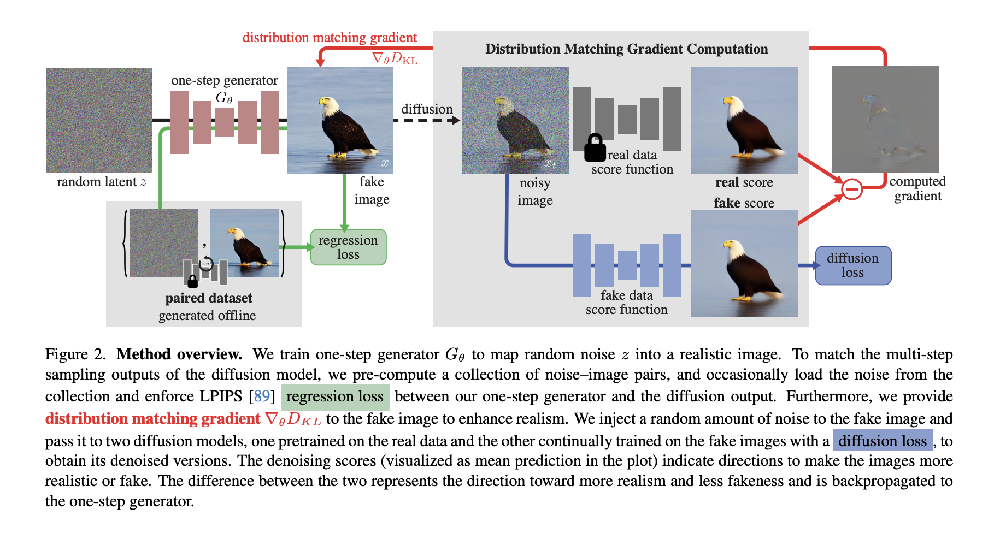
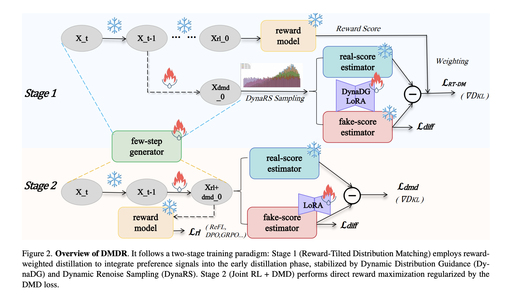

# 目录

[1.AIGC图像创作大模型的完整训练与性能优化流程通常包含哪些阶段？](#q-001)

[2.AIGC图像创作大模型的数据工程和标注体系如何决定能力上限？](#q-004)
  - [面试问题：AIGC图像创作大模型的数据工程通常包含哪些关键环节？](#q-005)
  - [面试问题：为什么高质量Caption、VLM重标注和合成数据会显著影响Prompt Following？](#q-006)
  - [面试问题：文字渲染、知识图像和编辑数据应该如何构建？](#q-007)

[3.AIGC图像创作大模型如何进行持续训练、SFT和偏好对齐？](#q-013)
  - [面试问题：Continued Training、SFT、DPO、GRPO、RLHF/RLAIF分别解决什么问题？](#q-014)
  - [面试问题：图像生成中的奖励模型、VLM-as-a-Judge和人类偏好数据如何发挥作用？](#q-015)
  - [面试问题：图像创作大模型的训练为什么需要T2I/I2I联合训练和多粒度编辑数据？](#q-016)

[4.AIGC图像创作大模型如何做性能优化和推理加速？](#q-017)
  - [面试问题：少步采样、Consistency Distillation、DMD/Turbo蒸馏解决了什么问题？](#q-018)
  - [面试问题：量化、缓存、注意力优化、Token压缩和编译优化分别适合哪些AIGC图像创作推理场景？](#q-019)
  - [面试问题：AIGC图像创作领域实际部署中如何平衡图像质量、生成速度、显存占用和成本？](#q-020)

---

<h1 id="q-001">1.AIGC图像创作大模型的完整训练与性能优化流程通常包含哪些阶段？</h1>

**难度评分：⭐⭐⭐ (3/5)  |  考察频率：⭐⭐⭐⭐⭐ (5/5)**

在2026年AIGC时代的“中场时刻”到来后，AIGC图像创作大模型的训练流程已经不能再被简化成“收集一批图文对数据，然后训练一个扩散模型”。**今天主流的AIGC图像创作大模型的整体能力与预训练、高质量Caption标签、VLM重标注、富文本数据、编辑数据、后训练、偏好对齐、少步蒸馏和推理优化等策略高度相关**。

Rocky认为，我们真正要抓住的是一个AIGC图像领域的训练跨周期通用范式：**AIGC图像创作大模型的训练，需要围绕“数据、表示、生成、对齐、加速、反馈”思想构建一条持续迭代的训练生产线。**

从Stable Diffusion、FLUX、Qwen-Image、GLM-Image、HiDream-I1、Z-Image、Seedream以及MidJourney、Nana Banana、GPT-Image等闭源多模态图像创作系统的共同演进看，**一个通用的AIGC图像创作大模型训练流程，通常可以提炼总结为九个阶段，如下表所示：**

<div align="center">

| 阶段 | 核心任务 | 本质目标 | 关键产出 |
|---|---|---|---|
| 1. 任务定义与能力边界设计 | 明确大模型要支持文生图、图生图、图像编辑、文字渲染、多图参考生成、知识图像生成、特征一致性生成、风格控制生成还是实时生成 | 先定义“要训练什么能力”，避免把训练变成无目标堆数据 | 能力矩阵、数据配比、评测指标、安全边界 |
| 2. 数据资产建设 | 收集图文对、图像对、编辑对、OCR图像、富文本图像、知识图像、专业设计图和多语言数据等 | 决定大模型能学习哪些数据分布，以及最终能覆盖哪些AIGC图像创作场景 | 原始训练数据库、数据来源分层、版权与安全策略 |
| 3. 数据清洗、去重与质量筛选 | 做去重、去水印、低质过滤、审美筛选、安全过滤、分辨率过滤和分布平衡 | 降低噪声样本污染，避免大模型过拟合重复数据或被低质数据带偏 | 高质量基础训练集、质量标签、风险样本库 |
| 4. 语义标注与多模态重标注 | 用Caption模型、VLM、OCR、布局分析和人工校验生成高密度标注 | 把“图像里有什么”转化为大模型可以学习的文本监督信息标签 | 详细Caption、OCR文本、空间关系描述、风格标签、编辑差异描述 |
| 5. 表示层准备与对齐 | 训练或选择VAE/Tokenizer/Text Encoder/VLM条件编码器，并校准Latent空间和文本条件格式 | 建好图像从像素进入Latent空间、文本从自然语言进入条件空间的桥梁 | 图像Tokenizer、文本/多模态编码器、Latent规范、条件注入格式 |
| 6. 基础预训练 | 在大规模高质量图文数据上训练文生图基础大模型，学习从语义条件到图像分布的映射 | 获得通用生成能力，先让大模型成为高价值的核心基础底座 | 基础T2I、I2I生成能力、通用审美质量、基本prompt following能力 |
| 7. 持续训练与多任务能力扩展 | 加入高分辨率、文字渲染、图像编辑、多图参考、局部控制、知识图像和专业场景数据等进行继续训练 | 从“通用图像生成”走向“复杂图像创作任务可用”，补齐基础预训练中缺失的创作生成能力 | 编辑能力、富文本能力、多图一致性、专业图生成能力 |
| 8. SFT、偏好对齐与安全对齐 | 用精选高质量样本、人类偏好、奖励模型、VLM-as-a-Judge、DPO/GRPO/RLHF/RLAIF做后训练 | 让大模型的生成内容更符合人类审美、指令意图、编辑保真和安全要求 | 审美提升、文字准确性提升、bad case修复、安全拒答策略 |
| 9. 蒸馏、推理优化与反馈闭环 | 做少步蒸馏、量化、缓存、编译、并行推理、线上评测和bad case反馈优化等 | 构建低成本、低延迟、可稳定交付的产品能力 | Fast/Turbo版本、部署配置、评测报表、数据回流机制 |

</div>

注：要做好文字渲染，就必须有OCR、字体、版式、多语言文本数据；要做好图像编辑，就必须有源图、目标图、编辑指令和未编辑区域约束；要做好知识图像，就必须引入图表、流程图、PPT、地图、公式和结构化标注。



总的来说，Rocky认为**AIGC图像创作大模型的竞争，早已不是单点模型架构的竞争，而是谁能更系统地把数据、表示、生成、对齐、评测、部署和反馈闭环完整串联构建成一个训练系统。整个系统越完整，训练得到的AIGC图像创作大模型越接近一个可持续进化的视觉创作基础设施。**


<h1 id="q-004">2.AIGC图像创作大模型的数据工程和标注体系如何决定能力上限？</h1>

<h2 id="q-005">面试问题：AIGC图像创作大模型的数据工程通常包含哪些关键环节？</h2>

**难度评分：⭐⭐⭐ (3/5)  |  考察频率：⭐⭐⭐⭐⭐ (5/5)**

Rocky认为，AIGC图像创作大模型的数据工程，不能再理解为“把图文对收集得足够多”。这个理解停留在AIGC时代早期的文生图阶段。到了Stable Diffusion 3、FLUX、Qwen-Image、GLM-Image、HiDream-I1、Z-Image、Seedream这一代大模型，数据工程已经变成一套围绕能力目标展开的系统方法。

更本质地说，**数据工程决定大模型能看见什么、如何理解这些内容、在哪些任务上被反复校准，以及最终能不能进入真实创作工作流。** 架构决定大模型的表达能力，数据工程决定这种表达能力会被训练到何种上限。

AIGC图像创作大模型的数据工程，通常包括八个关键环节：

<div align="center">

| 数据工程环节 | 核心任务 | 解决的本质问题 | 代表性启发 |
|---|---|---|---|
| 能力驱动的数据规划 | 按文生图、编辑、文字渲染、知识图像、多图参考、专业设计等能力倒推数据需求 | 避免“有多少数据训多少能力”的被动训练 | Seedream 4.0按多模态创作任务扩展数据，Qwen-Image围绕生成+编辑统一构建数据 |
| 多源数据采集 | 收集自然图像、艺术图像、设计图、电商图、UI、海报、PPT、教材图、图表、公式、编辑对、多图参考数据 | 扩展模型的世界知识覆盖和多任务覆盖 | Stable Diffusion依赖大规模图文对，Seedream强调数百垂直场景和知识型概念 |
| 质量过滤与安全过滤 | 过滤坏文件、低分辨率、模糊图、压缩伪影、水印、NSFW、错误方向、低信息量样本 | 降低噪声样本对模型分布的污染 | Qwen-Image-2.0的多阶段过滤包含坏文件、分辨率、去重、NSFW、旋转、熵、CLIP对齐等过滤 |
| 去重与分布平衡 | 结合视觉相似度、语义相似度和低层视觉特征去重，并控制类别、风格、语言、场景比例 | 避免大模型记忆重复样本，同时减少高频风格挤压长尾能力 | Seedream 4.0将语义和低层视觉embedding用于去重，Seedream 3.0提出视觉形态与语义分布的双轴采样思想 |
| Caption重写与结构化标注 | 用VLM、OCR、版面分析和人工校验生成详细caption、文字、对象、属性、关系、风格、布局信息 | 把“图像里有什么”转成大模型可学习的监督标签 | Qwen-Image-2.0区分General/Text/Knowledge/Structured captions，Seedream 4.0强化细粒度caption模型 |
| 任务型数据构造 | 构造T2I、I2I、inpainting、outpainting、局部编辑、多图参考、身份保持、文字编辑数据 | 让大模型不只会从零生成，还会理解真实创作任务 | SeedEdit、Qwen-Image-Edit、Z-Image-Edit都强调源图-指令-目标图的编辑数据 |
| 合成数据与长尾补齐 | 用OCR、LaTeX、版式系统、渲染系统、强模型或规则生成公式、图表、海报、富文本和长尾编辑数据 | 补足真实数据中稀缺但产品高频需要的能力 | Seedream 4.0用OCR和LaTeX生成公式图像，Qwen-Image/Z-Image强化富文本和编辑合成数据 |
| 多阶段反馈闭环 | 从低分辨率到高分辨率，从T2I到T2I+编辑，从通用数据到偏好数据，再用评测和bad case回流修正分布 | 让数据分布随大模型能力阶段动态演进 | Qwen-Image-2.0采用多阶段、多分辨率数据管线，Seedream 4.0构建MagicBench/DreamEval反馈能力短板 |

</div>

Rocky认为上述能够提炼出两类具备跨周期价值的方法：

第一类是**通用型数据工程方法**，几乎所有大模型都会长期使用：数据清洗、去重、分布平衡、质量筛选、caption重写、多阶段训练数据调度。这些方法不依赖某个具体模型架构，即使用U-Net、DiT、MMDiT、Single-Stream DiT或AR+扩散混合架构，也都绕不开。

第二类是**代表性数据工程方法**，它们不是每个大模型都已经做得很好，也不一定都完整公开了训练数据细节，但会长期影响下一代AIGC图像创作大模型。这里有四个特别值得关注的方向：

1. **Seedream 4.0的知识型视觉数据管线：从“自然图像覆盖”走向“知识结构覆盖”。**  
   Seedream 4.0发现，单纯依赖自然图像和常规图文对，会让模型在instructional content、mathematical expressions等知识密集型内容上覆盖不足。因此它把知识数据拆成自然数据和合成数据两路：自然数据从教材、论文、小说等PDF中抽取高质量图表，再用质量分类器过滤模糊、杂乱、噪声样本，并用难度分类器划分easy/medium/hard，过难样本在预训练中降采样；合成数据则利用OCR结果和LaTeX源码生成不同结构、符号密度和分辨率的公式图像。**这个方法的本质不是“多收一些图表”，而是让模型系统性见过公式、图表、流程、教材图这类有信息结构的视觉对象。它的跨周期价值在于：AIGC图像模型要进入教育、办公、科研、营销和专业设计，就必须补上知识型视觉数据，而不能只靠审美图像**。

2. **Qwen-Image的分类型caption体系：从“一张图一句描述”走向“按任务组织监督信号”。**  
   Qwen-Image/Qwen-Image-2.0把caption分成General Caption、Text Caption、Knowledge Caption和Structured Caption。General Caption负责主体、场景、风格、空间关系等通用描述；Text Caption面向PPT、海报、漫画、教育材料等文本密集图像，强调OCR文本、版式、符号和语义关系；Knowledge Caption补充图像相关背景知识，让模型不只看见表面内容，还能学习图像背后的概念；Structured Caption用于流程图、关系图、复杂图示，显式建模实体、属性、层级和拓扑关系。这个体系的核心价值是：不同图像需要不同标注语言。自然照片、海报、公式图、流程图不能都用同一种caption模板，否则模型会学到“浅层图文对齐”，但学不到复杂结构和专业语义。



3. **Z-Image的高效数据基础设施与编辑指令构造：从“数据堆叠”走向“多粒度、多任务、可迁移的数据底座”。**  
   Z-Image强调用Z-Captioner生成双语、多粒度的合成caption，包括长/中/短描述、标签和模拟用户prompt，并在图生图任务中随机使用目标图caption或成对差异caption，对应参考生成和多任务编辑。它的关键不是单纯生成更长caption，而是让同一张图在不同训练阶段以不同粒度被使用：短caption适合泛化，长caption适合细节对齐，tag适合概念覆盖，差异caption适合编辑指令学习。对于编辑任务来说，真正有价值的不是“源图+目标图”这两个文件本身，而是把二者之间的变化抽象成可学习的自然语言指令，例如保留什么、修改什么、修改到什么程度。再结合数据基础设施中的高质量过滤、概念平衡、长尾重采样和任务比例控制，Z-Image的启发是：数据工程要服务“训练效率”和“能力迁移”，不是只服务样本规模。

4. **GLM-Image的字形/语义增强思路：从“文本作为语义token”走向“文本作为可渲染的视觉结构”。**  
   GLM-Image强调其“自回归语义规划 + 扩散解码器”的混合架构，并在扩散解码侧引入Glyph Encoder类文本模块来提升文字渲染和知识密集型图像生成。这里要区分两件事：语义规划解决“画面要表达什么、版面大致如何组织”，字形增强解决“每个字符到底长什么样、笔画是否完整、文本区域是否可读”。普通文本编码器更擅长表达语义，但不一定理解字符级形状、笔画、排列和区域约束；Glyph-byT5这类方法的核心启发，是通过字符级、字形对齐的编码，让生成模型把文字当成视觉结构来学习，而不只是把文字当成prompt里的语义token。对应到数据工程层面，长期有效的方法不是简单增加“带字图片”，而是构造可校验的文字渲染样本、字体/字形对齐样本、OCR可验证的密集文本图、图文排版样本和知识型图示样本，让模型同时学习语言语义、字形结构和版面约束。它的跨周期价值在于：未来的海报、PPT、科普图、公式图、菜单、UI生成，都需要把语言理解、字形结构和视觉排版统一起来。

Rocky认为，这四类方法背后的共同趋势是：**AIGC图像创作大模型的数据工程正在从“图文对规模竞争”，进入“语义密度、结构标注、任务构造和反馈闭环竞争”。** 谁能把知识、文字、编辑、多图参考这些复杂视觉任务转化成高质量训练信号，谁就更容易训练出真正可用的下一代图像创作基础模型。


<h2 id="q-006">面试问题：为什么高质量Caption、VLM重标注和合成数据会显著影响Prompt Following？</h2>

**难度评分：⭐⭐⭐⭐ (4/5)  |  考察频率：⭐⭐⭐⭐⭐ (5/5)**

Prompt Following的本质，不是模型“懂不懂人话”这么简单，而是模型在训练时有没有反复见过**文本指令、图像细节、空间关系、文字内容、编辑意图之间的高密度对应关系**。

**早期网页图文对最大的问题是弱监督标注整体上太弱：** caption短、噪声高、像无关标签，不像描述。比如一张海报只写“poster”或“beautiful design”，模型无法学到标题在什么位置、正文是什么、字体风格如何、主体和背景是什么关系、左上角和右下角分别有什么元素。这样的数据越多，模型越容易学成“会画氛围，但不听细节”。

高质量Caption、VLM重标注和合成数据，本质上是在提升训练标签的语义密度。可以从六个层面理解：

1. **从“标签监督”升级为“描述监督”。**  
   普通caption像关键词，只告诉模型“这是什么”；高质量caption会描述主体、属性、数量、位置、动作、风格、光照、构图和关系。**DALL-E 3之后，“更好的caption带来更好的prompt following”已经成为AIGC图像生成领域的长期共识**。

2. **从“单一caption”升级为“分类型caption”。**  
   Qwen-Image-2.0很有代表性：它把caption拆成General captions、Text captions、Knowledge captions、Structured captions。这个思路的价值在于，不同图片需要不同标注方式。自然图像需要主体和风格，海报/PPT需要文字和版式，知识图像需要背景知识和逻辑关系，复杂场景需要实体、属性和关系结构。

3. **从“图文对齐”升级为“多模态语义对齐”。**  
   VLM可以识别对象数量、材质、位置、文字、布局、图表结构和局部细节，并把这些信息转成更细的训练文本。Seedream 4.0进一步引入文本质量分类器、细粒度caption模型和更强跨模态embedding，本质上是在减少“图像的丰富信息，但标注没完全表达”的浪费。

4. **从“生成描述”升级为“编辑意图描述”。**  
   图像编辑任务不是描述一张图，而是描述两张图之间发生了什么。高质量编辑数据需要源图caption、目标图caption、差异描述、编辑指令和保真约束。Seedream 4.0为参考图和目标图生成不同粒度的caption，并鼓励用一致术语描述二者相同部分；Z-Image/Z-Captioner类思路则强调把源图、目标图的差异转成自然语言编辑指令。

5. **从“真实数据覆盖”升级为“合成数据补长尾”。**  
   真实数据里高质量公式、长文本海报、多语言菜单、复杂流程图、精确局部编辑样本往往不够多。合成数据的价值不是廉价替代真实数据，而是用可控方式补足长尾能力。Seedream 4.0用OCR输出和LaTeX源码生成多结构、多符号密度、多分辨率公式图像，就是典型例子。

6. **从“训练数据”升级为“评测-反馈-再造数据”。**  
   Prompt Following真正难的是长尾失败样例：多主体关系错、文字漏字、局部编辑改坏背景、复杂指令只执行一半。MagicBench、DreamEval、OCR评测、编辑一致性评测和用户bad case回流，都会反过来告诉数据团队下一轮应该补什么样的数据。

可以把几类caption的作用概括如下：

<div align="center">

| 标注类型 | 主要内容 | 解决的问题 | 代表性启发 |
|---|---|---|---|
| General Caption | 主体、风格、场景、光照、构图 | 提升通用图文对齐 | Stable Diffusion、SDXL、DALL-E 3路线 |
| Text Caption | OCR文本、字体、字号、位置、行列、版式 | 提升文字渲染和排版能力 | Qwen-Image、Z-Image、GLM-Image |
| Knowledge Caption | 图表含义、公式语义、教材知识、背景概念 | 提升知识图像和专业图示生成 | Seedream 4.0、GLM-Image |
| Structured Caption | 实体、属性、空间关系、层级结构 | 提升复杂组合和布局控制 | Qwen-Image-2.0 |
| Edit Caption | 源图描述、目标图描述、差异描述、编辑指令 | 提升图像编辑和保真能力 | SeedEdit、Qwen-Image-Edit、Z-Image-Edit |

</div>

所以，Prompt Following不是靠“持续增加模型参数量”自然出现的。Rocky认为它更像一种被数据工程训练出来的能力：**caption越细，大模型越知道该学习对齐什么特征；标注越结构化，大模型越能理解复杂约束；合成数据越精准，大模型越能覆盖真实世界稀缺但产品高频的长尾任务。**

<h2 id="q-007">面试问题：文字渲染、知识图像和编辑数据应该如何构建？</h2>

**难度评分：⭐⭐⭐⭐ (4/5)  |  考察频率：⭐⭐⭐⭐ (4/5)**

文字渲染、知识图像和编辑数据，是AIGC图像生成从“生成”走向“生成编辑”的关键分水岭。因为这三类任务不只考验审美，还考验精确性、结构性和可控性。

Rocky认为，这三类数据代表了下一代图像生成数据工程中最值得长期关注的方向：**文字渲染解决“写得对”，知识图像解决“讲得清”，编辑数据解决“改得准且不乱改”。**

这三类数据应分别构建：

<div align="center">

| 数据类型 | 必须标注什么 | 最容易失败的地方 | 有代表性的方法 |
|---|---|---|---|
| 文字渲染数据 | OCR文本、字符级内容、字体、字号、颜色、位置、行列、语言、版式层级 | 错字、漏字、糊字、大小写错误、中文笔画错、文字和背景不协调 | Qwen-Image的Text Caption，Z-Image的双语文字渲染数据，GLM-Image的Glyph-byT5字形增强 |
| 知识图像数据 | 图表类型、坐标/数值、公式LaTeX、流程关系、教材语义、图文对应关系 | 图表看起来像但逻辑错，公式结构错，流程关系错，知识表达不可信 | Seedream 4.0从PDF抽取知识图像，并用质量/难度分类器与OCR/LaTeX合成公式数据 |
| 编辑数据 | 源图、目标图、编辑指令、mask或区域、差异描述、未编辑区域约束、身份/风格保持要求 | 改一处坏全局，主体身份漂移，背景被误改，文字编辑不稳定 | SeedEdit、Qwen-Image-Edit、Z-Image-Edit的源图-指令-目标图数据 |
| 多图参考数据 | 每张参考图提供的身份、风格、姿态、物体、尺度、材质、空间关系 | 多图混淆、对象绑定错误、尺度错乱、风格过拟合 | FLUX Kontext、Seedream 4.0多图参考和多图编辑数据 |
| 反馈数据 | OCR准确率、编辑一致性、人类偏好、VLM评分、bad case类型 | 训练集看似完整，但真实用户长尾问题无法修复 | MagicBench、DreamEval、用户反馈驱动的数据回流 |

</div>

在具体构建时，我们需要抓住五个原则。

1. **文字渲染数据要从“看见文字”升级为“理解字形和版式”。**  
   只给模型一张带字图片是不够的。它需要知道文本内容是什么、文字在哪个区域、每行怎么排、字体大小和颜色是什么、文字和背景是什么关系。对于中文尤其如此，因为中文字符的笔画结构复杂，少一笔、多一笔都会影响可读性。GLM-Image引入Glyph-byT5这类字形编码思路，说明文字渲染不能只靠普通文本caption，还需要更细粒度的字形和区域监督。

2. **知识图像数据要从“图像像不像”升级为“信息对不对”。**  
   教材图、公式图、统计图、流程图、科普图、PPT和地图，失败点往往不是美感，而是事实关系。Seedream 4.0的数据策略很有代表性：从教材、论文、小说等PDF中抽取高质量图表，用低质量分类器过滤模糊、杂乱样本，用难度分类器区分easy/medium/hard，并通过OCR和LaTeX源码合成不同结构、符号密度和分辨率的公式图像。这说明知识图像数据工程的关键是“结构覆盖”，不是“图片数量”。

3. **编辑数据要从“图像对”升级为“可解释的变化过程”。**  
   高质量编辑数据至少需要`源图 + 编辑指令 + 目标图`，更好的数据还要有mask、差异描述、源图caption、目标图caption、未编辑区域约束和身份保持说明。Seedream 4.0为参考图和目标图生成多种详细程度的caption，本质上是在给编辑任务做数据增强；Z-Captioner类方法的启发是，先分别理解源图和目标图，再把差异转成自然语言编辑指令。

4. **合成数据要服务长尾能力，而不是替代真实分布。**  
   合成数据最适合补真实世界难以大规模获得的样本：多语言长文本、公式、复杂图表、特定版式、局部编辑、文字替换、身份保持、极端构图。它的优势是可控，风险是分布过于规则。因此更合理的做法是：用合成数据补齐能力空洞，用真实数据校准视觉自然度，再用评测和人工偏好控制比例。

5. **数据要和评测闭环绑定。**  
   文字渲染要看OCR/字符准确率，知识图像要看结构和事实一致性，编辑任务要看instruction following与consistency的平衡，多图参考要看对象绑定和结构稳定。Seedream 4.0构建MagicBench和DreamEval，Qwen-Image-2.0强调自动数据飞轮，本质上都说明：数据工程不能停在训练集构造，而要进入“评测发现问题，再反向补数据”的闭环。

总的来说，**文字渲染、知识图像和编辑数据，是AIGC图像生成从娱乐工具走向生产力工具的三道门槛。文字渲染要求字符级监督，知识图像要求结构化语义监督，编辑数据要求变化过程监督。谁能把这三类数据工程做深，谁的模型就更容易在海报、PPT、教育材料、电商设计、IP创作和专业编辑中形成长期竞争力。**

---

<h1 id="q-013">3.AIGC图像创作大模型如何进行持续训练、SFT和偏好对齐？</h1>

<h2 id="q-014">面试问题：Continued Training、SFT、DPO、GRPO、RLHF/RLAIF分别解决什么问题？</h2>

**难度评分：⭐⭐⭐⭐ (4/5)  |  考察频率：⭐⭐⭐⭐⭐ (5/5)**

Rocky认为，AIGC图像创作大模型的微调训练/后训练，不能简单理解为“预训练之后再微调一下”。它真正解决的是一个更产品化的问题：**如何把一个“会生成图像的基础大模型”，训练成一个“可控、稳定、符合人类偏好、能进入真实创作工作流的视觉生产系统”。**

从Stable Diffusion 3的DPO、Seedream 4.0的CT/SFT/RLHF/VLM Prompt Engineering、Qwen-Image的SFT+DPO/GRPO、Z-Image的SFT分布收窄、模型融合、DPO+GRPO和RLHF、FLUX Kontext的生成编辑联合微调可以看出，主流AIGC图像创作大模型的微调训练/后训练大体围绕五类方法展开：

<div align="center">

| 方法 | 核心目标 | 典型数据/信号 | 解决的本质问题 | 代表性启发 |
|---|---|---|---|---|
| Continued Training / CT | 扩展能力边界 | 知识图像、编辑对、多图参考、富文本、专业场景数据 | 让基础大模型从“会生成图像”扩展到“会做更多图像相关任务” | Seedream 4.0用CT增强编辑指令理解和多任务能力，Z-Image-Edit用编辑对继续训练 |
| SFT | 收窄输出分布，注入高质量审美和指令样式 | 高质量人工筛选图、详细caption、专业设计样本、任务平衡样本 | 让模型从“分布很宽”变成“稳定好看、听话、可用” | Z-Image把SFT定义为从多样分布收敛到高质量子流形，Qwen-Image用SFT修正短板 |
| DPO | 用偏好对做离线对齐 | 同prompt下chosen/rejected图像对，人类或VLM验证偏好对 | 高效注入可验证偏好，尤其适合文字、数量、对象关系等客观维度 | SD3使用DPO提升人类偏好；Qwen-Image/Z-Image把DPO用于图像偏好对齐 |
| GRPO / Online RL | 基于奖励模型做在线相对优化 | 多候选采样、组内相对奖励、综合reward | 进一步优化审美、真实感、复杂指令和主观质量 | Qwen-Image采用DPO后接GRPO；Z-Image用GRPO做多维奖励细化 |
| RLHF / RLAIF | 用人类或AI反馈构建偏好闭环 | 人类评分、VLM-as-a-Judge、OCR评测、安全评测、用户bad case | 把模型输出对齐真实用户偏好和产品安全边界 | Seedream 4.0引入RLHF，Z-Image构建多维奖励模型和人机混合偏好管线 |
| PE-aware SFT / Prompt Enhancer对齐 | 让模型适配前置VLM/Prompt Enhancer的输入格式 | 经VLM改写后的prompt、图像理解结果、推理链、任务路由输出 | 让模型不只听用户原始prompt，还能听懂系统重写后的高质量任务表示 | Seedream 4.0训练VLM作为PE模块，Z-Image在SFT中对齐固定VLM Prompt Enhancer |
| Model Merging | 融合不同SFT方向的能力 | 多个偏向不同能力的SFT checkpoint | 降低单一SFT模型的偏置，在审美、写实、指令遵循之间做折中 | Z-Image通过多个SFT变体线性融合提升鲁棒性 |

</div>

这些方法不是并列堆叠，而是有清晰分工。

1. **Continued Training解决“能力范围不够”。**  
   基础预训练学到的是通用文生图分布，但真实产品需要文字渲染、图像编辑、多图参考、知识图像、专业设计、角色一致性。CT的作用就是在不推倒重训的前提下，把模型推向新的任务分布。它更像“继续扩能力”，不是简单“调风格”。

2. **SFT解决“输出分布太散”。**  
   Web-scale预训练给模型带来多样性，也带来噪声、低质模式和不稳定风格。SFT的本质是把模型从宽分布推向高质量子分布。**Z-Image的说法很有代表性：SFT不是只修局部瑕疵，而是在用高质量样本和grounded caption把模型锚定到更稳定的审美、写实和指令遵循区域**。

3. **DPO解决“离线偏好对齐”。**  
   如果某个prompt生成多张图，人类或VLM可以判断哪张更符合要求。DPO把这种“更好/更差”的偏好对直接变成训练信号。它特别适合客观可判定的维度，比如文字是否正确、对象数量是否正确、主体关系是否满足、构图约束是否执行。

4. **GRPO/RLHF解决“多维偏好综合优化”。**  
   图像质量不是单一分数。真实感、审美、文字、语义、编辑保真、安全之间经常互相冲突。GRPO和RLHF的价值在于允许模型在多候选、多奖励、多目标之间做相对优化。Z-Image的DPO后接GRPO、Qwen-Image的大规模DPO+小规模GRPO，都是这个方向的代表。

5. **PE-aware SFT解决“用户原始意图和模型输入之间的落差”。**  
   真实用户prompt经常模糊、跳跃、不完整。Seedream 4.0和Z-Image都体现出一个趋势：前面放一个VLM/Prompt Enhancer做任务路由、prompt重写、图像理解、甚至推理链生成；后面的图像模型要在SFT阶段适配这种增强后的输入分布。这个方法很有跨周期价值，因为未来图像模型会越来越像“VLM理解层 + 生成模型”的系统。

从公式和流程上，可以更清楚地区分它们。

先统一一个符号：给定文本或多模态条件 $c$，目标图像潜变量 $x_0$，时间步 $t$，加噪/插值后的中间状态 $x_t$，图像生成模型预测噪声、速度场或score，记为 $f_\theta(x_t,t,c)$。不管底层是DDPM、Rectified Flow还是Flow Matching，基础训练都可以抽象成：

```math
\mathcal{L}_{\text{gen}}(\theta)=
\mathbb{E}_{(x_0,c)\sim \mathcal{D},t}
\left[
\left\|f_\theta(x_t,t,c)-y_t\right\|_2^2
\right]
```

其中 $y_t$ 可以是噪声 $\epsilon$、velocity $v_t$ 或flow matching目标。理解这个公式很重要：**CT和SFT大多没有改变“怎么学”的基本形式，而是改变“从哪些数据学、按什么比例学、把模型推向什么分布”。DPO、GRPO、RLHF/RLAIF才进一步把“人类或AI更喜欢什么”显式变成优化信号。**

**Continued Training / CT：沿用生成损失，在新任务分布上继续扩能力。** CT通常仍然优化 $\mathcal{L}_{gen}$ ，但训练数据从通用预训练集 $\mathcal{D}_{pre}$ 切换或混合为新任务数据 $\mathcal{D}_{\text{ct}}$，例如编辑对、多图参考、知识图像、富文本图像：

```math
\mathcal{L}_{\text{CT}}=
\mathbb{E}_{(x_0,c)\sim \mathcal{D}_{\text{ct}},t}
\left[
\left\|f_\theta(x_t,t,c)-y_t\right\|_2^2
\right]
```

CT的工程流程是：先选定要补的能力短板，例如文字编辑、多图参考、知识图像；再构造对应数据分布集合；然后以较小学习率继续训练，并混入一部分通用数据或正则约束，避免大模型过度偏向新任务导致遗忘。Seedream 4.0中CT主要增强编辑指令理解和多任务能力，Z-Image-Edit也把编辑对作为继续训练的重要来源。

**SFT：仍然是监督生成损失，但用高质量样本把大模型拉向“高质量分布”。** SFT也可以写成加权监督损失：

```math
\mathcal{L}_{\text{SFT}}=
\mathbb{E}_{(x_0,c,w)\sim \mathcal{D}_{\text{sft}},t}
\left[
w\cdot
\left\|f_\theta(x_t,t,c)-y_t\right\|_2^2
\right]
```

这里的关键不是公式变复杂，而是 $\mathcal{D}_{\text{sft}}$ 的质量更高、分布更窄、任务更平衡， $w$ 可以体现样本质量、任务权重或难度权重。如果SFT对象是VLM/Prompt Enhancer，还会使用自回归交叉熵：

```math
\mathcal{L}_{PE-SFT} = -\sum_i \log p_\theta(a_i\mid a_{<i},c)
```

其中 $a_i$ 是prompt重写、任务路由、推理链或结构化描述中的token。

SFT工程流程是：筛选高质量图像和高密度caption；按审美、写实、文字、编辑、知识图像等能力做任务平衡；用监督损失训练；再通过评测和bad case回流修正数据比例。SFT的结果不是让模型“学会生成新世界”，而是让它在已会的能力里更稳定、更高质量、更强一致性。

**DPO：不训练奖励模型，直接用偏好对做离线对齐。** DPO的训练样本是 $(c,x^+,x^-)$：同一个prompt下， $x^+$ 是chosen图， $x^-$ 是rejected图。经典DPO可以写成：

```math
\mathcal{L}_{\text{DPO}}=
-\mathbb{E}
\log\sigma
\left(
\beta
\left[
\log\frac{\pi_\theta(x^+\mid c)}{\pi_{\text{ref}}(x^+\mid c)}
-
\log\frac{\pi_\theta(x^-\mid c)}{\pi_{\text{ref}}(x^-\mid c)}
\right]
\right)
```

对扩散/Flow模型来说， $\log \pi_\theta$ 往往不能像语言大模型那样直接计算，所以实际会用去噪损失或flow matching损失的差值近似“这个模型更偏向chosen还是rejected”。Qwen-Image的DPO就是基于flow matching criterion构造chosen/rejected的差分目标。

DPO的工程流程是：同prompt采样多张图；人类、VLM或规则选出最好和最差；用DPO提高chosen相对rejected的概率，同时用参考模型 $\pi_{\text{ref}}$ 约束模型不要偏离太远。它特别适合文字正确性、数量、对象关系、版式约束这类相对客观的偏好。

**GRPO：在线采样一组候选图，用组内相对奖励做强化学习。** GRPO的核心是同一个条件 $c$ 下采样 $G$ 个候选图 $\{x_i\}_{i=1}^G$，用奖励模型 $R(x_i,c)$ 打分，再把每张图的奖励标准化为组内优势：

```math
A_i=
\frac{
R(x_i,c)-\mathrm{mean}(\{R(x_j,c)\}_{j=1}^{G})
}{
\mathrm{std}(\{R(x_j,c)\}_{j=1}^{G})
}
```

然后用类似PPO的裁剪目标更新模型：

```math
\mathcal{L}_{\text{GRPO}}=
-\mathbb{E}
\left[
\min(r_i A_i,\mathrm{clip}(r_i,1-\epsilon,1+\epsilon)A_i)
-\beta D_{\text{KL}}(\pi_\theta\Vert\pi_{\text{ref}})
\right]
```

其中 $r_i$ 表示新旧策略概率比， $D_{\text{KL}}$ 用来约束模型不要为了追奖励而跑偏。

GRPO的工程流程是：当前模型在线生成一组候选；奖励模型从审美、真实感、文字、语义、编辑保真、安全等维度打分；计算组内相对优势；更新模型；再持续抽检是否出现reward hacking。GRPO比DPO成本更高，但能优化更主观、更综合的质量维度。

**RLHF / RLAIF：不是单一算法，而是“反馈数据 + 奖励模型 + 策略优化”的闭环。** RLHF用人类反馈训练奖励模型，RLAIF用AI/VLM反馈或人机混合反馈训练奖励模型。奖励模型通常优化：

```math
\mathcal{L}_{\text{RM}}=
-\mathbb{E}_{(c,x^+,x^-)}
\log\sigma(R_\phi(x^+,c)-R_\phi(x^-,c))
```

得到奖励模型 $R_\phi$ 后，再用DPO、GRPO、PPO类方法优化生成模型。完整流程可以概括为：

   ```text
   采样多候选图像
   → 人类/VLM/OCR/规则给出偏好或分数
   → 训练多维奖励模型
   → 用DPO做离线客观维度对齐
   → 用GRPO/PPO做在线综合偏好优化
   → 人类抽检、bad case回流、更新奖励模型
   ```

所以RLHF/RLAIF解决的不是某个单点损失函数问题，而是把人类审美、指令遵循、文字准确性、安全边界和真实用户反馈接入训练循环。面试里我们要特别强调：RLHF/RLAIF的难点不在“套一个强化学习公式”，而在奖励模型是否可靠、偏好数据是否干净、多目标奖励是否会互相冲突，以及如何防止reward hacking。

总的来说，**预训练解决“会不会基础生成”，Continued Training解决“会不会胜任更多细分生成任务”，SFT解决“能够生成高质量和高审美的图像”，DPO/GRPO/RLHF解决“人类更喜欢哪个生成图像”，PE-aware SFT解决“系统如何把用户意图翻译成模型能执行的生成任务”。**

<h2 id="q-015">面试问题：图像生成中的奖励模型、VLM-as-a-Judge和人类偏好数据如何发挥作用？</h2>

**难度评分：⭐⭐⭐⭐⭐ (5/5)  |  考察频率：⭐⭐⭐ (3/5)**

图像生成的偏好对齐，比文本生成更麻烦。文本任务里，很多问题可以用字符串、事实一致性或标准答案做判断；但图像生成要同时判断审美、语义、文字、布局、身份、风格、编辑保真、真实感和安全边界。很多时候不是“对/错”，而是“哪张更符合用户意图”。

**所以奖励模型、VLM-as-a-Judge和人类偏好数据的核心作用，是把主观创作质量拆成可训练、可评测、可优化的多维信号。**

常见奖励信号包括七类：

<div align="center">

| 奖励/偏好信号 | 评价什么 | 适合谁来评 | 典型作用 |
|---|---|---|---|
| 语义对齐 | 主体、属性、数量、动作、空间关系是否符合prompt | VLM + 人类抽检 | 提升复杂prompt following |
| 文字/OCR准确性 | 字符是否正确、是否漏字、排版是否符合要求 | OCR + VLM + 规则检查 | 提升海报、PPT、菜单、知识图像文字能力 |
| 审美质量 | 构图、色彩、光影、真实感、风格一致性 | 人类偏好 + 审美模型 | 提升默认出图质量 |
| 编辑保真 | 目标区域是否改变，未编辑区域是否保持 | VLM + 图像相似度 + 人类评审 | 提升局部编辑和身份保持 |
| 多图一致性 | 多参考图中的身份、物体、风格、尺度是否绑定正确 | VLM + 人类评审 | 提升角色一致、多图参考和商品合成 |
| 安全与合规 | 是否存在违规内容、隐私风险、版权/品牌风险 | 安全分类器 + 人类审核 | 建立产品安全边界 |
| 真实用户偏好 | 用户最终更喜欢哪张图、是否愿意继续编辑/下载/使用 | 人类偏好、线上反馈、Arena投票 | 对齐真实创作工作流 |

</div>

这里最值得关注的是三种跨周期方法。

第一种是**把prompt拆成可判定的子目标**。Z-Image在奖励模型中把指令拆成主体、属性、动作/交互、空间/构图、风格/渲染条件等层级，再让标注者或评估器判断哪些元素满足、哪些没满足。这个方法很有价值，因为它避免把一张图粗暴打成一个总分，而是能告诉模型“到底哪里没做好”。

第二种是**VLM生成候选偏好对，人类做验证清洗**。纯人工偏好标注太贵，纯VLM评判又容易误判。Z-Image用VLM程序化生成大量chosen/rejected偏好对，再做人类验证清洗，这代表一种更可扩展的偏好数据生产方式。Qwen-Image的DPO/GRPO框架也体现出类似趋势：大规模偏好学习靠自动化和VLM，小规模关键环节靠人类校验。

第三种是**先优化客观维度，再优化主观维度**。文字是否正确、数量是否正确、对象是否出现，这类维度比较客观，适合DPO或规则/VLM评测；审美、真实感、风格偏好更主观，适合GRPO/RLHF和人类偏好。Z-Image的“DPO做客观维度，GRPO做在线细化”就是一个很清晰的工程路径。

GLM-Image也给出一个重要启发：复杂图像生成系统可以做**模块化奖励**。如果系统里有语义规划模块和扩散渲染模块，那么语义、知识、文字内容可以偏向规划层评价，纹理、笔画、细节、视觉保真可以偏向渲染层评价。这个方向的跨周期价值在于：未来图像模型会越来越复杂，奖励也会从单一总分走向模块化、多维度、可解释。

但我们同时也要知道：**奖励模型不是万能裁判。** VLM可能误判小字，OCR可能漏检艺术字体，人类偏好可能偏向某种审美风格，奖励模型也可能带来reward hacking。Z-Image在少步蒸馏里把RL和Distribution Matching正则结合，就是为了防止模型只追奖励分数而生成视觉上不自然的结果。

所以，高质量图像后训练不是“找一个奖励模型猛训”，而是要构建一个闭环：

```text
生成多候选
→ VLM/OCR/规则/人类评估
→ 构造偏好对或奖励分数
→ DPO/GRPO/RLHF优化
→ 人类复核和bad case回流
→ 更新奖励模型与训练数据
```

Rocky认为，图像生成偏好对齐的长期方向，不是把人类审美完全交给AI裁判，而是让VLM、规则、奖励模型和人类反馈形成分工：**模型负责规模化发现问题，人类负责校准价值判断，训练算法负责把这种判断稳定地展现在AIGC图像生成系统的效果上。**

<h2 id="q-016">面试问题：图像创作大模型的训练为什么需要T2I/I2I联合训练和多粒度编辑数据？</h2>

**难度评分：⭐⭐⭐⭐ (4/5)  |  考察频率：⭐⭐⭐⭐ (4/5)**

图像创作大模型在图像编辑任务的核心矛盾是：**既要改得动，又不能乱改。** 只改目标区域不难，难的是在执行指令的同时保持主体身份、背景结构、材质风格、光照关系和未编辑区域稳定。

如果只训练T2I，模型会擅长从零生成，但不懂如何在图像编辑任务中保留原图的不可修改部分特征；如果只训练I2I编辑，模型可能牺牲文生图质量、审美泛化和开放世界生成能力。因此SeedEdit、Qwen-Image-Edit、Z-Image-Edit、FLUX Kontext、Seedream 4.0都指向同一条主线：**未来主流图像创作大模型会从“文生图模型 + 单独编辑器”走向“生成和编辑统一训练”。**

T2I/I2I联合训练的价值可以分成四层。

1. **保住基础文生图能力。**  
   编辑数据通常比T2I数据更贵、更少、分布更窄。Z-Image-Edit明确建议在继续训练编辑能力时保留较高比例的T2I数据，以避免模型在编辑任务上适应过度，导致通用文生图质量下降。这个经验很关键：编辑训练不是替代T2I训练，而是叠加在T2I能力之上。

2. **同时学习“改”和“不改”。**  
   编辑任务不只是学习目标图长什么样，还要学习哪些区域不能动。源图、目标图、编辑指令、mask/区域、差异描述、未编辑区域约束共同构成训练信号。没有这些约束，模型容易出现“指令执行了，但身份、背景、构图也被破坏”的问题。

3. **覆盖多粒度编辑任务。**  
   真实用户不会只做一种编辑。数据里必须覆盖局部编辑、全局风格编辑、文字编辑、身份保持、多图参考、多轮编辑、视角变化、背景替换、商品合成等任务。FLUX Kontext把编辑评测拆成local editing、global editing、character reference、style reference、text editing，本质上就是把编辑能力拆成多个可训练、可评测的子能力。

4. **让编辑进入多轮工作流。**  
   产品级的图像创作系统中的图像编辑并不是“一次改完”的单次任务，而是反复修改的持续性任务。多轮编辑会放大身份漂移、结构退化和画质损失。FLUX Kontext论文也指出，多轮编辑可能引入视觉伪影和身份退化。因此训练数据和评测必须覆盖链式编辑，否则模型在demo里好看，在真实工作流里会性能崩溃。

当前，我们可以把编辑训练数据分成六类：

<div align="center">

| 数据类型 | 训练目标 | 关键标注 | 代表性启发 |
|---|---|---|---|
| 局部编辑 | 添加、删除、替换对象，同时保持背景 | 源图、目标图、编辑区域、未编辑区域约束 | SeedEdit、Qwen-Image-Edit、Z-Image-Edit |
| 全局编辑 | 改风格、光照、季节、材质，但保持主体结构 | 风格描述、主体保持约束、目标效果 | FLUX Kontext、Seedream 4.0 |
| 文字编辑 | 修改Logo、海报、菜单、PPT、UI文字 | OCR文本、位置、字体、替换内容 | Qwen-Image、Z-Image、GLM-Image |
| 身份保持编辑 | 保持人物、商品、角色或IP一致 | 身份描述、参考图、相似度/一致性评估 | FLUX Kontext character reference、Seedream多图参考 |
| 多图参考编辑 | 从多张图中抽取身份、风格、物体、姿态或材质 | 每张参考图的功能、对象绑定、尺度关系 | Seedream 4.0、FLUX Kontext |
| 多轮/链式编辑 | 连续多次修改仍保持结构和画质 | 编辑历史、每轮目标、累积一致性评价 | Qwen-Image chained editing、FLUX Kontext iterative editing |

</div>

训练策略上，主流方法通常不是“一步到位”，而是分阶段推进：

```text
T2I基础模型
→ 加入编辑对做Continued Training
→ 混合T2I数据防止生成能力退化
→ 用各子任务平衡的高质量子集做SFT
→ 用偏好/奖励信号优化instruction following和consistency
→ 用多轮评测和bad case回流修复长尾问题
```

这里有两个非常重要的工程判断。

第一，**编辑数据必须各子任务平衡。** 如果局部添加/删除过多，模型会忽视文字编辑、身份保持和风格迁移；如果合成文字编辑数据过多，模型可能远离真实用户输入分布。Z-Image-Edit提到合成数据虽然指令准确，但分布可能离真实用户较远，所以在最终SFT阶段要谨慎下采样，这个经验非常有价值。

第二，**编辑能力必须同时看instruction following和consistency。** GPT类闭源图像系统、Seedream、Qwen-Image、FLUX Kontext的评测都在说明一个事实：编辑模型最难的是平衡“听话”和“保真”。只听话会改坏原图，只保真会不执行指令。真正好的编辑训练，就是让模型学会在这两者之间找到稳定边界。

总的来说，**图像编辑训练不是给T2I模型加一个mask技巧，而是构造一个生成-编辑统一的训练体系。T2I数据保住开放生成能力，I2I数据教会模型执行修改，多粒度编辑数据覆盖真实工作流，偏好对齐负责在“改得准”和“不乱改”之间找到人类真正想要的平衡。**

---

<h1 id="q-017">4.AIGC图像创作大模型如何做性能优化和推理加速？</h1>

<h2 id="q-018">面试问题：少步采样、Consistency Distillation、DMD/Turbo蒸馏解决了什么问题？</h2>

**难度评分：⭐⭐⭐⭐⭐ (5/5)  |  考察频率：⭐⭐⭐⭐ (4/5)**

基于扩散/Flow的AIGC图像创作大模型的生成能力很强，生成质量很高，但它天然有一个产品化瓶颈：**生成一张图片往往不是跑一次模型前向推理，而是要在去噪轨迹上跑很多次前向推理。这会大大增强产品侧用户的体验耗时。**

所以AIGC图像创作大模型的性能优化和推理加速就成为了AIGC图像创作产品落地商用的“最后一公里”。其中主流的蒸馏方法包括少步采样、Consistency Distillation、DMD和Turbo模型等，其本质上就是在解决同一个问题：**如何把“几十步慢慢去噪”压缩成“少数几步甚至一步可用”，同时尽量保持原AIGC图像创作大模型的生成画质、审美和prompt following等能力。**

我们可以将这类技术可以从下面几个维度进行理解：

1. **采样器优化：** 它不改变模型本身，而是优化ODE/SDE求解器和噪声调度策略，让相同步数下的去噪轨迹更稳。DPM-Solver、Euler、Heun、UniPC、Karras scheduler等都属于这一类。它解决的是“同样跑20步，怎么比原来跑得更好”。

2. **Consistency Distillation：** 它让学生模型学习教师采样轨迹上不同时间点之间的一致映射。直观理解就是：学生模型不再老老实实沿着每个小台阶走，而是学会从噪声状态直接跳到更干净的状态。它适合做少步、一步、实时预览，但复杂细节和多样性容易被压缩。



3. **Distribution Matching Distillation(DMD)：** DMD更关心输出分布是否逼近教师模型，而不是逐步复刻教师的每一个中间状态。它的价值在于让少步学生模型不只是“像教师的轨迹”，而是“生成结果的整体分布接近教师”。SDXL-Turbo、SD3-Turbo、Z-Image-Turbo背后的产业逻辑都类似：用蒸馏换低延迟，用少步换交互体验。



4. **Distribution Matching Distillation meets Reinforcement Learning(DMDR)：** DMDR在Z-Image中被使用，它的核心不是简单“蒸馏之后再做奖励模型打分”，而是把RL奖励优化接入少步蒸馏过程，同时用 Distribution Matching(DM) 项作为正则，约束模型不要为了追求奖励分数而出现 reward hacking，比如生成高分但视觉不自然、细节崩坏、颜色漂移的图像。



Rocky认为，上述的蒸馏技术最有价值的地方，是它把AIGC图像生成从“离线等待”推向“交互式创作”。用户在产品里真正需要的是既有高质量图像生成过程，也能先快速看到生成方向，再决定是否进入高质量生成。

**虽然少步采样和蒸馏能让AIGC图像创作大模型“少跑几次前向推理”，但步数越少，越容易牺牲精度、细节、稳定性、多样性和复杂prompt遵循。** 所以整体上看，这些技术更适合让用户先快速确认生成方向，然后再选择原生的强力AIGC图像创作大模型进行完整的图像创作。

<h2 id="q-019">面试问题：量化、缓存、注意力优化、Token压缩和编译优化分别适合哪些AIGC图像创作推理场景？</h2>

**难度评分：⭐⭐⭐⭐ (4/5)  |  考察频率：⭐⭐⭐⭐ (4/5)**

如果说少步采样和蒸馏解决的是“模型要跑多少次前向推理”的问题，那么量化、混合精度、SDPA/xFormers、DeepCache、Token Merging、torch.compile解决的就是另一个问题：**每一次AIGC图像创作大模型前向推理，能不能更加高效。**

AIGC图像创作大模型的单次推理成本，主要卡在四个地方：矩阵乘太多、Attention序列太长、去噪步骤重复、模型和数据在显存中反复搬运。当前主流的性能加速方法其实都是在尝试解决这四个不同的瓶颈。

<div align="center">

| 瓶颈 | 代表方法 | 本质原理 | 适合场景 | 主要风险 |
|---|---|---|---|---|
| 数值精度和带宽 | 混合精度、FP8/INT8/4-bit量化、SVDQuant | 用更少bit存储和计算，同时敏感层保留高精度 | 大模型部署、低显存资源、批量生成等场景 | outlier（神经网络权重或激活值里的“异常大值”或“极端值”）、VAE/Norm敏感、校准不足导致画质下降 |
| Attention成本 | SDPA、xFormers、FlashAttention、SageAttention | 用更高效kernel减少Attention显存读写和中间矩阵开销 | DiT/MMDiT、长prompt、高分辨率、视频生成 | 后端兼容性、mask限制、不同kernel带来微小差异 |
| 去噪轨迹重复 | DeepCache、First Block Cache、TeaCache、节点/特征缓存 | 复用相邻去噪步或工作流中变化很小的中间结果 | 扩散模型去燥过程、多轮编辑、反复调参 | 缓存间隔过大导致细节漂移 |
| Token数量 | Token Merging、Latent/token压缩、紧凑VAE | 合并相似token或降低Latent序列长度 | 高分辨率生成、实时预览、低成本推理 | 小字、边缘、局部纹理和空间细节损失 |
| Python/框架开销 | torch.compile、TensorRT、算子融合、CUDA Graph | 把动态图变成更稳定的计算图，减少调度和kernel启动开销 | 固定shape、生产部署、批量推理 | 首次编译慢，动态shape和自定义节点适配成本高 |
| 显存峰值 | VAE tiling、动态VRAM、CPU offload、异步权重搬运 | 把一次大计算拆块，或把暂不用的权重移出GPU | 大图解码、视频VAE、多模型工作流、低显存场景 | PCIe传输开销、拼接伪影、调度复杂度 |

</div>

第一类是**量化和混合精度**。它本质上是让大模型的不同模块用不同精度工作。fp16和bf16主要降低显存和带宽，同时保留较好的数值稳定性；fp8、int8、4-bit进一步降低存储和计算成本，但需要scale、校准和异常值处理。AIGC图像创作大模型对此尤其敏感，因为每一步去噪都会放大数值误差，VAE、Norm层、输出投影、文本编码器也不一定都适合低精度，需要进行精心的调试与测试。

这里我们以SVDQuant为例，普通weight-only量化主要节省权重显存，但如果activation仍然成本很高，真实速度收益会受限。SVDQuant在此基础上更进一步，它想做W4A4，也就是权重层和激活层都走4-bit路径。它的核心不是简单四舍五入，而是**把难量化的outlier交给一个高精度低秩分支，把剩下的主体残差交给4-bit分支**。如果再配合Nunchaku这类kernel融合引擎，就能减少低秩分支带来的额外数据搬运成本。总的来说，**SVDQuant是“outlier吸收 + 低秩补偿 + 4-bit残差计算 + kernel融合”的系统级量化方案。**

第二类是**注意力优化**。基于DiT/MMDiT和图像创作大模型把图像、文本、时间帧都变成更长的token序列，Attention的成本很容易变成整体计算瓶颈。SDPA是PyTorch官方的scaled dot-product attention基础技术，会根据硬件和张量形态调度到合适后端；xFormers提供memory-efficient attention，核心是减少显式attention矩阵带来的显存压力。

FlashAttention 通过 tiling / 分块计算、online softmax、避免显式存储完整 attention matrix，减少显存读写，从而做到 exact attention 但更快、更省显存。SageAttention的核心不是像 FlashAttention 那样只强调 exact attention 的 IO-aware 分块，而是进一步把 attention 计算做成 8-bit 量化注意力，目标是在推理阶段 plug-and-play 地替换原 attention kernel，在尽量不损失精度的情况下加速 LLM、图像生成、视频生成等模型。它们的共同价值是：**不改变模型语义，只把同一个Attention的处理成本降低。**


第三类是**缓存类加速**，比如DeepCache等。它不是重新训练小模型，也不是减少采样步数，而是利用扩散模型连续去噪步之间的时间冗余：相邻timestep里，高层语义特征变化慢，低层纹理和细节变化快。所以DeepCache会在某些完整去噪步中计算并缓存扩散模型的高层特征，在后续若干步中只更新较浅分支，再把缓存的高层特征拿回来复用。

DeepCache最关键的判断是：**少步采样解决“要跑多少步”，DeepCache解决“每一步能不能少算一部分”。** 它通常不需要额外训练，也可以和DDIM、PLMS等采样器叠加。论文实验中，DeepCache在Stable Diffusion v1.5上实现约2.3倍加速，CLIP Score仅下降约0.05；在LDM-4-G的ImageNet实验中实现约4.1倍加速，FID只轻微下降约0.22。但它的边界也很清楚：它更依赖U-Net扩散模型中的skip connection结构和去噪步之间的特征相似性，缓存间隔过大时，颜色、局部结构和细节可能漂移；迁移到完全不同的DiT结构时，需要重新验证。

第四类是**Token压缩**。Token Merging的思想很直接：如果一些视觉token在当前阶段已经非常相似，就把它们合并，减少后续Attention和MLP要处理的序列长度。它特别适合高分辨率、实时预览和低成本推理。但这类方法的风险也很符合直觉：token少了，局部信息就可能被平均掉，小字、边缘、手部、纹理、复杂构图更容易受影响。

第五类是**编译和图优化**。torch.compile、TensorRT、CUDA Graph、算子融合解决的是模型的工程执行问题：减少Python调度开销、减少kernel启动次数、把可预测的动态图尽量变成稳定的计算图。它在固定shape、批量推理、生产部署里更有价值；而在ComfyUI这类节点多、shape变化多、自定义算子多的生态里，收益会更依赖具体工作流。

第六类是**显存和工作流层优化**。这类优化经常被低估，但其实在AIGC实际产业中非常重要。VAE tiling把大图或视频VAE解码切成空间/时间小块，TAESD/Latent2RGB用轻量近似解码做快速预览；动态VRAM、CPU offload、异步权重搬运让基础大模型、VAE、ControlNet、LoRA、文本编码器能在有限显存里轮流工作。

总的来说，Rocky认为**AIGC图像创作大模型的推理优化不是单纯追求速度更快，而是在质量、速度、显存、成本、稳定性和可复现性之间做系统平衡。** Attention kernel选择、混合精度/量化、特征缓存、token压缩、编译优化、显存调度、VAE/预览分层这些思想，**不会因为SD、FLUX、Qwen-Image、Seedream、Z-Image等模型换代而消失，因为它们对应的是长期存在的硬约束：算力、显存、延迟、吞吐、交互体验和部署成本**。

<h2 id="q-020">面试问题：AIGC图像创作领域实际部署中如何平衡图像质量、生成速度、显存占用和成本？</h2>

**难度评分：⭐⭐⭐⭐ (4/5)  |  考察频率：⭐⭐⭐⭐⭐ (5/5)**

AIGC图像创作领域的实际部署中，最容易犯的错误，是把性能优化理解成“把模型跑得越快越好”。但AIGC产业里真正的问题通常不是“最快”，而是：**不同用户、不同任务、不同付费层级，应该给不同的质量和速度组合。**

所以部署策略要先按场景分层：

<div align="center">

| 场景 | 推荐策略 | 关注重点 |
|---|---|---|
| 快速草稿 | Turbo/少步采样、低分辨率、轻量VAE预览 | 先让用户看到方向 |
| 标准创作 | Dev/Fast模型、10-20步、bf16/fp16、SDPA/xFormers | 质量、速度和成本平衡 |
| 专业出图 | Full/Pro模型、高分辨率、更多采样步、高质量VAE | 细节、文字、结构和可交付性 |
| 图像编辑 | 源图/条件缓存、局部mask、未编辑区域约束 | 保真、身份一致和局部可控 |
| 批量生产 | 批处理、队列调度、量化、编译优化、缓存 | 吞吐、单图成本和稳定性 |
| 端侧/私有化 | 小模型、蒸馏、量化、动态显存、紧凑VAE | 低显存、低成本和可部署性 |

</div>

我们可以用四个指标做综合的判断：

1. **质量是不是够交付。**  
   草稿阶段只需要创作方向对即可；商业海报、商品图、知识图像、带文字图像，就必须关注细节、OCR、结构、身份一致和编辑保真。

2. **速度是不是符合交互。**  
   用户调prompt时等10秒可能已经嫌慢，但最终高清出图等几十秒也许可以接受。速度标准取决于工作流位置，而不是单一数字。

3. **成本是不是能规模化。**  
   单图GPU成本、显存占用、吞吐、排队时间、模型加载时间，都会影响产品毛利。

4. **稳定性是不是能承受真实用户。**  
   真实用户不会只用标准prompt和标准分辨率。他们会长prompt、多LoRA、大图、视频、多图参考、反复编辑。部署系统必须能处理OOM、缓存失效、结果复现和异常回退。

Rocky认为，成熟的AIGC图像产品通常不是“一个模型打天下”，而是整个系列模型的组合：**Turbo负责探索，Dev/Fast负责常规生成，Full/Pro负责最终交付。** HiDream-I1的Full/Dev/Fast、Z-Image-Turbo、SDXL/SD3-Turbo都体现了这种产业分层思想。

**训练优化决定模型上限，推理优化决定产品的商业可用程度，系统调度决定产品能不能规模化。** 只有把质量、速度、显存、成本和稳定性放在一起综合评估和决策，才是真正理解AIGC图像生成部署的核心本质。

---
