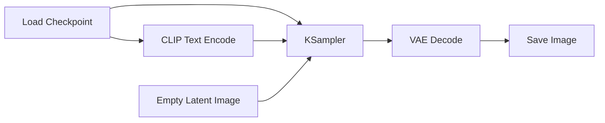
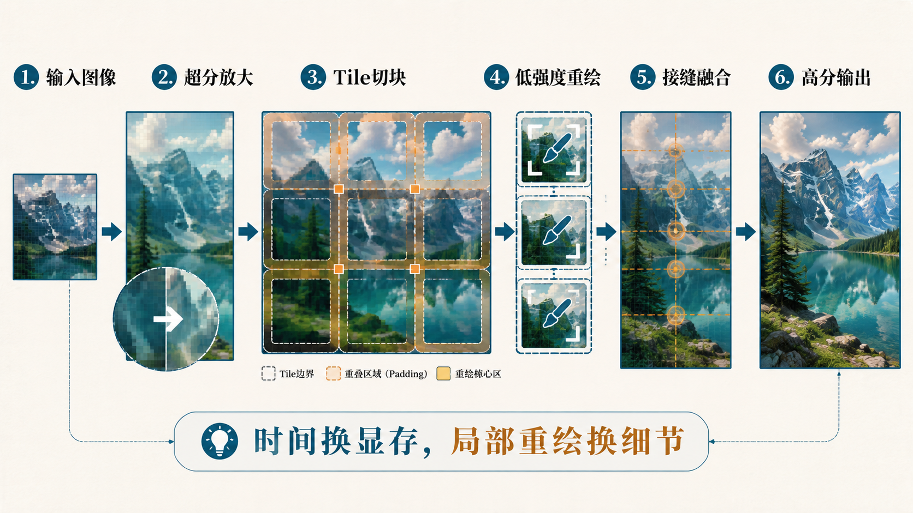
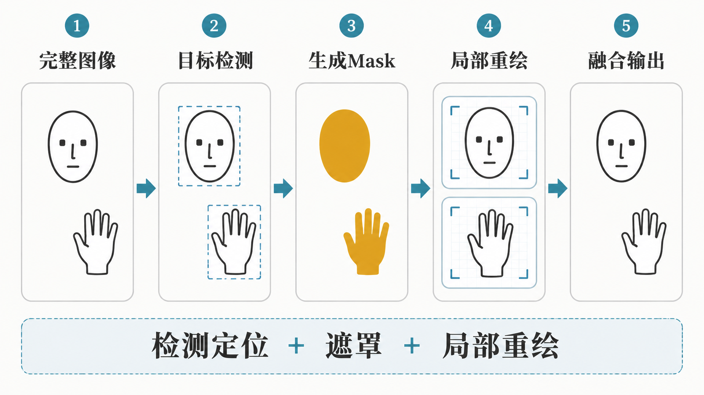

# 目录

[1.主流的AIGC图像生成框架有哪些？应该如何选型？](#q-001)
  - [面试问题：目前主流的AIGC图像生成框架有哪些？它们分别解决什么问题？](#q-002)
  - [面试问题：在AIGC图像生成框架中，从Prompt到图像生成过程通常经历哪些环节？](#q-003)

[2.ComfyUI为什么会成为AIGC图像创作领域的重要工作流框架？](#q-004)
  - [面试问题：ComfyUI的节点图和工作流架构是什么？](#q-005)
  - [面试问题：ComfyUI为什么适合复杂AIGC图像工作流和生产化场景？](#q-006)
  - [面试问题：ComfyUI全新动态显存（Dynamic VRAM）优化机制是什么？](#q-006b)
  - [面试问题：ComfyUI中常见核心节点类型有哪些？](#q-007)

[3.Diffusers为什么是AIGC图像生成模型研发和部署的重要工程库？](#q-012)
  - [面试问题：Diffusers框架的核心设计思想是什么？](#q-013)
  - [面试问题：Pipeline、Scheduler、Adapter和Model Component在Diffusers中分别起什么作用？](#q-014)
  - [面试问题：Diffusers在训练、推理优化和生产部署中有哪些关键能力？](#q-015)

[4.Stable Diffusion WebUI、Forge、SD.Next和Fooocus分别适合什么场景？](#q-008)
  - [面试问题：Stable Diffusion WebUI的核心功能和长期价值是什么？](#q-009)
  - [面试问题：Stable Diffusion WebUI Forge、SD.Next和Fooocus各自有哪些跨周期价值与特点？](#q-010)
  - [面试问题：Variation Seed、Hires.fix和提示词权重控制如何在WebUI中分别如何发挥作用？](#q-011)

[5.AIGC图像生成框架中常用插件和扩展能力的底层原理是什么？](#q-016)
  - [面试问题：Tiled VAE和Tiled Diffusion为什么能降低大图生成显存压力？](#q-018)
  - [面试问题：Ultimate SD Upscale的工作原理是什么？](#q-017)
  - [面试问题：ADetailer为什么能自动修复脸部、手部和局部细节？](#q-019)
  - [面试问题：结构控制、参考图控制、风格/角色注入、局部选择与编辑这些Adapter控制能力的经典插件有哪些？](#q-020)

---

<h1 id="q-001">1.主流的AIGC图像生成框架有哪些？应该如何选型？</h1>

<h2 id="q-002">面试问题：目前主流的AIGC图像生成框架有哪些？它们分别解决什么问题？</h2>

**难度评分：⭐⭐⭐ (3/5)  |  考察频率：⭐⭐⭐⭐⭐ (5/5)**

Rocky认为，AIGC图像生成框架不能只理解为“一个能跑扩散模型或者AIGC图像创作大模型的界面”。到了FLUX、SD3/SD3.5、Qwen-Image、HiDream、Z-Image、Seedream、GPT-Image、Nano Banana这一代AIGC图像创作大模型之后，框架的本质已经变成三件事：**模型接入层、创作工作流层、工程部署层**。

我们从使用场景看，主流框架可以分成五类：

<div align="center">

| 框架类型 | 代表框架 | 核心价值 | 适合人群/场景 |
|---|---|---|---|
| 可视化工作流框架 | ComfyUI | 用节点图把模型、采样器、VAE、ControlNet、LoRA、后处理串成可复现流程 | 复杂工作流、批量生产、影视/电商/设计Pipeline |
| 参数面板式创作框架 | Stable Diffusion WebUI | 以Gradio界面承载txt2img、img2img、inpaint、插件和参数调试 | 新手、社区插件、快速出图、提示词实验 |
| WebUI增强分支 | Stable Diffusion WebUI Forge、SD.Next | 在WebUI范式上强化资源管理、模型兼容、实验特性或多模型支持 | 低显存、本地部署、多模型尝试 |
| 低门槛产品化工具 | Fooocus等 | 尽量隐藏采样器、CFG、ControlNet等复杂参数，让用户像使用产品一样生成图像 | 非技术用户、快速创意验证、轻量设计 |
| Python研发/部署库 | Diffusers | 用代码统一管理Pipeline、Scheduler、模型组件、训练脚本和推理优化等模块 | 算法研发、模型评测、产品后端、API服务 |

</div>

Rocky认为，最有跨周期价值的不是某一个框架本身，而是每个框架背后的精华**产品构建思想**：

1. **WebUI类框架把复杂模型包装成可操作产品。**  
   它的价值是降低使用门槛，让更多创作者能通过提示词、采样器、CFG、Seed、Hires.fix、ControlNet等参数完成图像创作。


2. **ComfyUI类框架把图像生成变成可编排工作流。**  
   它的价值不是“界面更酷”，而是在AIGC创作画布上把复杂生成流程拆成节点，让每个节点的输入、输出、参数和依赖关系可见、可复现、可自动化。


3. **Diffusers类框架把图像生成变成可研发、可部署、可测试的软件工程。**  
   它的价值是把模型组件、Scheduler、Adapter、量化、offload、torch.compile、训练脚本和推理服务整合到Python生态里。


4. **插件生态把基础模型扩展成完整AIGC图像创作系统。**  
   ControlNet注入特征控制，IP-Adapter进行图像参考，LoRA控制风格和角色，ADetailer补局部修复，Tiled VAE/Tiled Diffusion进行超高清图像生成和低显存推理，Ultimate SD Upscale进行超分和细节重绘等。

可以说，**AIGC图像生成框架的竞争，已经从“谁能启动模型”变成“谁能承载更复杂的模型生态、更稳定的工作流复现、更低成本的推理部署和更高效率的创作生产线”。**

<div align="center">

</div>


<h2 id="q-003">面试问题：在AIGC图像生成框架中，从Prompt到图像生成过程通常经历哪些环节？</h2>

**难度评分：⭐⭐⭐⭐ (4/5)  |  考察频率：⭐⭐⭐⭐⭐ (5/5)**

一个AIGC图像生成框架看起来是在“输入prompt，点击生成”，但底层通常会经历一条完整的推理链路：

```text
用户输入Prompt/参考图/控制图
→ Prompt解析与增强
→ 文本编码器/VLM条件编码
→ 扩散模型权重与Adapter模型权重加载
→ 初始噪声/Latent初始化
→ Scheduler/KSampler多步去噪
→ ControlNet/IP-Adapter/LoRA等条件注入
→ VAE Decode解码成像素图
→ 后处理、GAN超分、局部修复、保存与元数据记录
```

我们可以把这条链路拆成七个关键环节：

<div align="center">

| 执行环节 | 核心任务 | 框架中对应的典型组件 | 关键风险 |
|---|---|---|---|
| 输入层 | 接收prompt、负向prompt、参考图、mask、Control图、Seed和尺寸参数 | WebUI参数面板、ComfyUI输入节点、Diffusers函数参数 | 输入不完整、参数冲突、尺寸不兼容 |
| 条件编码层 | 把文本、图像参考和控制信号转成模型可用的条件表示 | CLIP/T5/VLM Encoder、IP-Adapter、ControlNet预处理器 | 文本截断、条件弱化、多条件冲突 |
| 模型加载层 | 加载Base Model、VAE、LoRA、ControlNet、Text Encoder、Tokenizer | Checkpoint Loader、LoRA Loader、Diffusers Components | 权重版本不匹配、显存不足、低精度误差 |
| 采样调度层 | 决定从噪声到图像的去噪路径 | KSampler、Scheduler、Sampler、CFG、Steps | 步数过少、CFG过高、Scheduler不适配模型 |
| 条件注入层 | 在去噪过程中注入文本、结构、参考图、风格和局部控制 | Cross-Attention、ControlNet、IP-Adapter、LoRA、Regional Prompt | 过度控制、局部破坏、风格污染 |
| 解码输出层 | 把latent解码成RGB图像并保存元数据 | VAE Decode、Save Image、PNG info | VAE色偏、细节损失、元数据缺失 |
| 后处理层 | 做超分、局部修复、大图切块、脸手修复和批处理 | Hires.fix、Ultimate SD Upscale、ADetailer、Tiled VAE | 接缝、局部不一致、过度重绘 |

</div>

Rocky认为，理解框架执行链路有两个跨周期的行业思想价值：

第一，**能够定位问题**。如果生成结果不遵循prompt，可能是caption/文本编码/CFG/条件注入的问题；如果大图爆显存，可能是VAE解码、attention序列长度或tile策略的问题；如果局部人脸坏了，可能不是主模型不行，而是分辨率和局部像素不足，需要ADetailer或局部inpaint。

第二，**能够做工程选型**。ComfyUI适合把上述链路可视化成稳定工作流，WebUI适合快速调参，Diffusers适合把链路写成可测试、可部署、可扩展的Python服务。


<h1 id="q-004">2.ComfyUI为什么会成为AIGC图像创作领域的重要工作流框架？</h1>

<h2 id="q-005">面试问题：ComfyUI的节点图和工作流架构是什么？</h2>

**难度评分：⭐⭐⭐ (3/5)  |  考察频率：⭐⭐⭐⭐⭐ (5/5)**

ComfyUI的核心不是“又一个图像生成界面”，而是一个**以创作画布为中心的节点图工作流引擎**。它把图像生成过程拆成一系列可连接、可复用、可保存的节点，例如加载模型、编码prompt、采样、解码、加载LoRA、应用ControlNet、超分、保存图像等。

这里的“创作画布”不是一个简单的UI概念，而是ComfyUI在竞争激烈的AI绘画框架中脱颖而出的底层设计思想。传统WebUI更像一个参数面板：用户在固定表单里填写prompt、seed、steps、CFG、采样器和插件参数，然后等待结果。ComfyUI则更像一张可以无限展开的视觉工程画布：模型、文本条件、图像条件、局部mask、ControlNet、IP-Adapter、LoRA、采样器、VAE、超分、局部修复、保存节点，都可以被放在同一张画布上，并通过连线显式表达它们之间的因果关系。

Rocky认为，**创作画布的跨周期价值，是把AIGC图像创作从“调参数”升级为“搭系统”**。在早期AI绘画阶段，用户关心的是如何用一个prompt生成一张好图；但到了多模型、多参考图、多ControlNet、多LoRA、多区域编辑和批量生产阶段，真正重要的已经不是某个单独参数，而是整条创作链路如何被组织、复现、调试和复用。ComfyUI的画布正好承载了这种复杂性。

一个最基础的Stable Diffusion/FLUX类工作流可以抽象成：



节点图有四个关键设计：

1. **节点是功能单元。**  
   每个节点只做一件相对清晰的事，例如加载模型、编码文本、采样、解码、保存。它让复杂生成流程从“黑盒按钮”变成“可拆解流程”。

2. **连线是数据依赖。**  
   节点之间传递的不是抽象概念，而是具体数据类型，例如 `MODEL`、`CLIP`、`VAE`、`CONDITIONING`、`LATENT`、`IMAGE`、`MASK`。这使得用户可以明确知道信息如何流动。

3. **画布是创作过程的空间化表达。**  
   在ComfyUI里，用户不是在一个表单里线性填写参数，而是在画布上组织一个视觉生产系统。哪一路是正向prompt，哪一路是负向prompt，哪一路是参考图条件，哪一路是局部mask，哪一步做latent upscale，哪一步做VAE decode，都会被空间化地呈现出来。**这让复杂图像创作从“脑子里记流程”变成“画布上看流程”**。

4. **工作流是可复现资产。**  
   ComfyUI可以保存/加载JSON工作流，也可以从生成图片中恢复工作流元数据。对团队协作来说，这比“截图一堆参数”更可靠。

ComfyUI一个自定义节点的基本形式通常包含输入类型、输出类型、执行函数和分类信息：

```python
class CustomNode:
    @classmethod
    def INPUT_TYPES(cls):
        return {
            "required": {
                "image": ("IMAGE",),
                "strength": ("FLOAT", {"default": 0.5, "min": 0, "max": 1}),
            }
        }

    RETURN_TYPES = ("IMAGE",)
    FUNCTION = "process"
    CATEGORY = "ImageProcessing"

    def process(self, image, strength):
        output = do_something(image, strength)
        return (output,)
```

这个设计的长期价值在于：**AIGC图像创作越来越不是单次生成，而是“模型加载、条件控制、编辑、超分、局部修复、批处理、评测和自动化”的组合工程。ComfyUI真正抓住的不是节点本身，而是把节点组织到创作画布里的能力。节点负责模块化，画布负责系统化；节点让能力可复用，画布让创作流程可理解、可调试、可迁移。**

这也是ComfyUI能够在众多AI绘画框架中形成差异化的原因：它没有只把扩散模型包装成一个更好用的面板，而是把AIGC图像创作抽象成一张可编排、可扩展、可复现的视觉工作流画布。**当AIGC图像创作进入复杂工作流时代，创作画布就不再是交互形式，而是生产力基础设施。**


<h2 id="q-006">面试问题：ComfyUI为什么适合复杂AIGC图像工作流和生产化场景？</h2>

**难度评分：⭐⭐⭐⭐ (4/5)  |  考察频率：⭐⭐⭐⭐⭐ (5/5)**

ComfyUI适合复杂工作流，本质上是因为它解决了AIGC图像生产中的四个痛点：**流程不可见、参数不可复现、局部修改要全量重跑、复杂模型组合难以管理**。

ComfyUI官方也强调了几个很关键的能力：节点/图/流程图界面、异步队列、只重新执行发生变化的工作流部分、智能显存管理、工作流JSON保存和从生成图片恢复工作流等。这些能力对普通玩家是效率提升，对生产团队则是流程资产化。

可以从五个角度理解它的价值：

1. **流程透明。**  
   WebUI里很多流程被封装在面板和脚本后面；ComfyUI把流程展开成节点图。用户可以明确看到prompt如何编码、ControlNet在哪一步注入、latent在哪里被放大、VAE在哪里解码。

2. **复现能力强。**  
   一个复杂工作流可以保存成JSON，也可以随图片一起保存元数据。团队成员之间传的不是“你把CFG调到7.5，再开某个插件”，而是一份可执行工作流。

3. **局部重算效率高。**  
   如果只改prompt，理论上模型加载节点、VAE加载节点、部分预处理节点不需要重新执行。对大模型、多ControlNet、多LoRA场景来说，这种增量执行能显著提升迭代效率。

4. **复杂组合能力强。**  
   多LoRA、多ControlNet、IP-Adapter、多图参考、区域prompt、mask编辑、Tiled VAE、超分、ADetailer这类链路在面板式工具里容易混乱，在节点图里更容易管理。

5. **更接近自动化和后端服务。**  
   ComfyUI不仅是GUI，也可以通过API和队列系统接入自动化生产流程。很多团队会把它作为视觉工作流后端，而不是只当本地绘图软件。

**ComfyUI的跨周期价值，是把AIGC图像生成从“参数调试工具”推进到“视觉生成工作流编排系统”。当模型越来越多、插件越来越多、任务越来越复杂时，节点图不是界面偏好，而是一种工程必然。**

<div align="center">


</div>


<h2 id="q-006b">面试问题：ComfyUI全新动态显存（Dynamic VRAM）优化机制是什么？它如何缓解本地大模型显存和内存压力？</h2>

**难度评分：⭐⭐⭐⭐⭐ (5/5)  |  考察频率：⭐⭐⭐⭐ (4/5)**

ComfyUI的全新动态显存（Dynamic VRAM）优化，本质上不是“把模型压缩一下”，也不是简单调小分辨率、降低batch size或者把模型粗暴搬到CPU。它真正解决的是本地AIGC大模型推理中的一个系统级矛盾：**模型权重越来越大，工作流越来越复杂，但用户机器的VRAM、系统内存、PCIe带宽和磁盘I/O都不是无限资源。**

在SDXL、FLUX、WAN、Qwen-Image、HiDream这类大模型生态中，一个真实工作流往往不只加载一个U-Net/DiT，还会同时涉及文本编码器、VAE、LoRA、ControlNet、IP-Adapter、视频模型、局部修复模型和超分模型。传统显存管理通常依赖三种方式：

1. **预估模型需要多少显存。**  
   框架先估算模型、激活、中间结果和插件需要多少显存，再决定哪些权重放GPU，哪些权重放CPU。

2. **在GPU和CPU之间搬运权重。**  
   显存不够时，把部分权重卸载到系统内存；需要计算时，再搬回GPU。

3. **依赖操作系统分页兜底。**  
   当系统内存也不够时，Windows页面文件或Linux swap可能被动介入，导致模型虽然“没崩”，但速度会急剧下降，甚至卡死。

这套方式在小模型时代还能接受，但在大模型和复杂工作流时代会遇到三个问题：**预估不准、搬运太多、OOM风险不可控**。尤其是多个模型、多个LoRA和视频生成任务叠加时，框架很难提前知道后面每一步到底会访问哪些权重、保留哪些中间状态、释放哪些缓存。

Dynamic VRAM的核心思想是：**把显存管理从“静态预估占用”改造成“按需物理化、按压力淘汰、按计算路径调度”的动态权重工作集管理。**

可以把它理解成ComfyUI为PyTorch模型权重引入了一层更细粒度的内存调度系统：

```text
模型文件/权重切片
→ mmap或文件切片引用
→ VBAR虚拟显存地址空间
→ 计算真正访问某层权重时触发fault
→ 有显存则物理加载并复用
→ 显存紧张则释放低优先级权重
→ 极端情况下只为当前算子创建临时GPU张量
```

这里最关键的是VBAR。VBAR可以理解为一块为模型权重准备的**GPU虚拟地址空间**。创建VBAR时，并不等于把全部模型权重都真实塞进物理VRAM；它更像先把“这些权重未来可能住在哪里”安排好。只有当某一层真正参与计算，系统才通过类似 `fault` 的机制把对应权重物理化到GPU显存里。

从执行机制看，Dynamic VRAM大致可以分成六步：

1. **模型加载阶段不急于深拷贝全部权重。**  
   ComfyUI对safetensors加载路径做了更贴近动态显存的处理。权重可以先以mmap或文件切片引用的方式存在，框架记录每个tensor对应的文件偏移、大小和几何信息，而不是一上来就把所有权重完整复制成常驻PyTorch张量。

2. **模型准备阶段建立VBAR和动态pin状态。**  
   在本地ComfyUI代码里，`ModelPatcherDynamic`会为非CPU加载设备维护 `dynamic_vbars` 和 `dynamic_pins`。模型被准备为Dynamic VRAM加载时，权重不再全部强制加载到GPU，而是优先进入“可按需加载”的状态。

3. **算子执行前触发权重物理化。**  
   进入具体Linear、Conv或Attention相关模块时，ComfyUI会检查模块是否有 `_v` 这类VBAR分配信息。执行前通过 `vbar_fault` 判断这段权重是否已经驻留。如果已经驻留，就直接使用；如果没有驻留，就从文件切片、pinned host buffer或缓存路径把当前算子需要的权重加载到合适的位置。

4. **显存够用时缓存权重，显存紧张时动态释放。**  
   如果GPU显存足够，当前层权重会被保留在VRAM里，后续重复访问可以更快。如果显存压力上升，ComfyUI可以从VBAR里释放一部分低优先级权重，而不是让整条工作流直接OOM。当前活跃模型、最近访问的VBAR和即将参与计算的权重会拥有更高优先级。

5. **加载失败时走临时张量兜底。**  
   如果某段权重无法长期驻留在VBAR里，Dynamic VRAM并不必然崩溃。它可以只为当前层创建临时GPU张量，把本次计算需要的权重拷进去，用完后释放或复用。这意味着显存压力从“全模型必须同时住进VRAM”变成“当前计算窗口需要什么就加载什么”。

6. **预取与异步offload降低等待时间。**  
   ComfyUI还引入了动态VBAR预取和异步offload能力。比如 `model_prefetch.py` 会根据 `prefetch_dynamic_vbars` 准备后续模块的权重；启动参数里也提供了 `--async-offload`、`--disable-async-offload`、`--fast-disk` 等选项，让快NVMe、pinned memory和GPU stream之间的配合更灵活。

所以，Dynamic VRAM真正改变的不是某个单点参数，而是模型权重的生命周期：

<div align="center">

| 对比维度 | 传统显存管理 | Dynamic VRAM |
|---|---|---|
| 权重加载方式 | 尽量提前加载或按估算搬运 | 按计算访问路径动态物理化 |
| 显存判断方式 | 依赖模型大小和经验预估 | 运行时根据真实压力调度 |
| OOM处理 | 预估失败时容易直接崩溃 | 优先释放、降级到临时张量或按需重载 |
| 系统内存占用 | 容易堆积CPU副本或触发分页 | 更强调文件切片、缓存和可释放内存 |
| 复杂工作流适配 | 模型越多越难预估 | 更适合多模型、多LoRA、多阶段工作流 |
| 开发者心智负担 | 需要手动猜低显存策略 | 更接近自动化资源调度 |

</div>

这套机制带来的直接收益，可以概括为四点：

第一，**降低复杂工作流的系统内存压力。**  
Dynamic VRAM减少了“GPU一份、CPU再常驻一份、页面文件再兜底一份”的低效内存形态。模型权重可以更多依赖文件映射、切片读取和按需加载，系统内存不再需要长期承载那么多完整副本。

第二，**显著降低因权重卸载不足导致的OOM风险。**  
传统低显存方案经常遇到“前面能跑，后面突然爆”的问题。Dynamic VRAM把释放、重载和临时张量兜底放到运行时路径里，目标是让工作流在显存紧张时降速，而不是直接崩溃。

第三，**在部分场景下提升模型加载和LoRA应用速度。**  
因为模型加载节点不一定要立刻把所有权重深拷贝到PyTorch常驻张量里，所以首次加载、切换prompt、加载LoRA等动作在一些大模型场景中会更快。公开测试中，类似FLUX 2 Dev bf16这类任务的首次启动、改prompt和加载LoRA耗时都有明显下降；WAN 2.2 14B双模型视频任务在32GB内存机器上也能看到端到端耗时的大幅改善。

第四，**让“高VRAM占用”不再等同于内存泄漏。**  
Dynamic VRAM倾向于把最快的VRAM用作真实工作集缓存。如果监控面板里看到GPU显存占用较高，不一定是坏事；关键要看工作流是否稳定、是否触发OOM、端到端耗时是否下降。现代推理系统的目标不是让显存看起来很空，而是让显存被有效利用，并且在压力到来时能及时释放。

在面试里，如果被问到“Dynamic VRAM为什么比普通lowvram更高级”，可以这样回答：

> 普通lowvram更像人工规定哪些模块放CPU、哪些模块放GPU；Dynamic VRAM更像给ComfyUI引入了一个面向模型权重的运行时内存调度器。它不要求一开始就把模型全部装进物理显存，而是通过VBAR、按需fault、权重切片读取、优先级释放和异步预取，把模型权重变成可动态调度的工作集。

当然，Dynamic VRAM也不是“无限显存魔法”。它仍然受三个因素约束：

1. **硬件平台约束。**  
   这类优化对NVIDIA GPU、Windows/Linux和CUDA生态更友好；不同平台、WSL、AMD或其他后端的支持程度需要看具体版本。

2. **I/O和带宽约束。**  
   如果模型反复从慢盘或低带宽路径加载，Dynamic VRAM可以避免OOM，但不保证每个场景都更快。快NVMe、足够PCIe带宽、合理的pinned memory和异步stream会影响收益。

3. **工作流整体约束。**  
   显存优化只能解决权重驻留和搬运问题，不能消除高分辨率latent、长视频序列、attention中间激活和VAE解码本身的计算/内存成本。评估时不能只看单步it/s，而要看完整工作流从加载到出图/出视频的端到端时间。

这也是为什么Dynamic VRAM对ComfyUI的长期价值很大：它让ComfyUI不只是一个“节点画布”，而更像一个能承载大模型时代本地推理压力的**视觉生成工作流运行时**。当AIGC图像和视频模型继续变大，框架竞争就不再只是UI交互、插件数量和节点生态，而会进入更底层的资源调度能力竞争。

**总的来说，Dynamic VRAM的本质，是把模型权重从静态常驻资源变成动态工作集；把显存不足从一次性OOM问题，转化为运行时调度、释放、预取和按需加载问题。**


<h2 id="q-007">面试问题：ComfyUI中常见核心节点类型有哪些？</h2>

**难度评分：⭐⭐⭐ (3/5)  |  考察频率：⭐⭐⭐⭐ (4/5)**

ComfyUI节点很多，我们没必要背插件名。更重要的是按生成链路理解节点类型：

<div align="center">

| 节点类型 | 典型节点 | 输入/输出 | 解决的问题 |
|---|---|---|---|
| 模型加载节点 | Load Checkpoint、Load Diffusion Model、Load VAE、Load LoRA、Load ControlNet | 输出MODEL、CLIP、VAE等 | 把模型权重变成可执行组件 |
| 文本编码节点 | CLIP Text Encode、T5 Text Encode、Prompt组合节点 | 文本到CONDITIONING | 把自然语言转成条件向量 |
| Latent节点 | Empty Latent Image、VAE Encode、Latent Upscale | LATENT | 管理扩散/Flow模型实际操作的潜空间 |
| 采样节点 | KSampler、KSampler Advanced、SamplerCustom | MODEL + CONDITIONING + LATENT到LATENT | 完成多步去噪生成 |
| 图像解码节点 | VAE Decode、Save Image、Preview Image | LATENT到IMAGE | 把潜变量解码成可见图像并输出 |
| 控制节点 | ControlNet Apply、IP-Adapter Apply、Conditioning Combine、Mask节点 | 控制图/参考图/条件融合 | 引入姿态、深度、边缘、参考图和区域约束 |
| 后处理节点 | Upscale、Tiled VAE、Face Detailer、Image Blend | IMAGE/MASK | 超分、修复、融合和细节增强 |

</div>

这些节点背后有一条统一逻辑：**模型生成不是一口气完成，而是由“条件构造、latent采样、像素解码、后处理增强”四类计算组合而成。** 熟悉节点类型，本质上就是熟悉AIGC图像生成系统的模块边界。


<h1 id="q-012">3.Diffusers为什么是AIGC图像生成模型研发和部署的重要工程库？</h1>

<h2 id="q-013">面试问题：Diffusers框架的核心设计思想是什么？</h2>

**难度评分：⭐⭐⭐⭐ (4/5)  |  考察频率：⭐⭐⭐⭐⭐ (5/5)**

Diffusers是Hugging Face生态中用于扩散/生成模型推理、训练和部署的重要Python库。它不是给普通用户点按钮的应用工具，而是给算法工程师和研究者使用的**模型工程库**。

Diffusers的核心抽象是 `DiffusionPipeline`。它把图像生成所需的多个组件封装成一个可调用对象：

```python
from diffusers import DiffusionPipeline
import torch

pipe = DiffusionPipeline.from_pretrained(
    "stabilityai/stable-diffusion-xl-base-1.0",
    torch_dtype=torch.float16,
).to("cuda")

image = pipe(
    prompt="cinematic photo of a futuristic city at sunset",
    num_inference_steps=30,
).images[0]
```

这个抽象的价值在于：

1. **统一不同模型的调用方式。**  
   Stable Diffusion、SDXL、SD3、FLUX、Z-Image、GLM-Image、video diffusion等模型架构不同，但都可以被封装成pipeline形式。

2. **组件可替换。**  
   Scheduler、VAE、U-Net/DiT、Text Encoder、LoRA、ControlNet、IP-Adapter等都可以组合或替换，方便研究和工程实验。

3. **贴近生产部署。**  
   Diffusers支持offload、量化、torch.compile、xFormers/SDPA等推理优化策略，也能和Transformers、Accelerate、PEFT、Hub生态打通。

4. **兼顾训练和推理。**  
   它不仅能进行模型推理，还提供训练脚本、LoRA微调、DreamBooth、Textual Inversion、ControlNet训练等工程入口。

Rocky认为，Diffusers的跨周期价值是：**把AIGC图像生成从“模型仓库里的权重文件”变成“可组合、可测试、可部署的软件组件”。** 这对算法岗很重要，因为真实业务不是在本地进行图像创作，而是要把模型接进服务、评测、数据回流和产品链路。


<h2 id="q-014">面试问题：Pipeline、Scheduler、Adapter和Model Component在Diffusers中分别起什么作用？</h2>

**难度评分：⭐⭐⭐⭐ (4/5)  |  考察频率：⭐⭐⭐⭐ (4/5)**

Diffusers里最重要的不是背API，而是理解几个核心抽象：

<div align="center">

| 抽象 | 作用 | 类比 | 面试要点 |
|---|---|---|---|
| Pipeline | 把完整生成流程封装成可调用对象 | 一条装配线 | 负责组织文本编码、去噪、解码、后处理 |
| Model Component | U-Net、DiT、VAE、Text Encoder、Tokenizer等模型模块 | 装配线上的机器 | 组件可替换，决定模型能力边界 |
| Scheduler | 控制采样时间步和去噪更新公式 | 采样路线规划器 | 决定速度、稳定性和步数-质量关系 |
| Adapter | LoRA、ControlNet、各类Adapter等 | 外接能力模块 | 不重训主模型也能补风格、结构、参考图控制 |
| Optimization | offload、quantization、torch.compile、attention优化 | 工程加速层 | 决定能否低成本部署 |

</div>

我们可以把Diffusers框架下一次推理理解成：

```text
Pipeline接收prompt和参数
→ Tokenizer/Text Encoder得到文本条件
→ Scheduler初始化时间步和噪声
→ U-Net/DiT在每个时间步预测噪声/velocity/flow
→ Scheduler更新Latent
→ VAE把Latent解码成图像
→ Safety/后处理/输出
```

其中Scheduler非常关键。它不是“可有可无的小参数”，而是决定去噪路径的数值方法。Euler、DDIM、DPM-Solver、UniPC、LCM Scheduler等Scheduler在步数、稳定性、质量和速度上各有取舍。

Adapter则体现了AIGC图像生成框架的另一个趋势：**基础大模型规模越来越大，但业务能力经常靠轻量模块扩展。** LoRA补风格和角色特征，ControlNet补结构控制特征，各类Adapter补各种细分条件信息。这些能力如果都靠重训主模型，成本会极高。


<h2 id="q-015">面试问题：Diffusers在训练、推理优化和生产部署中有哪些关键能力？</h2>

**难度评分：⭐⭐⭐⭐ (4/5)  |  考察频率：⭐⭐⭐⭐ (4/5)**

Diffusers的工程价值，主要体现在三条线：

1. **训练线：让研究方法可复现。**  
   Diffusers提供了多类训练脚本和示例，常见包括LoRA、DreamBooth、Textual Inversion、ControlNet训练、模型蒸馏等。对算法岗来说，它适合快速验证“某个训练策略是否有效”。

2. **推理优化线：让大模型能跑起来、跑得快。**  
   官方文档中明确提到Diffusers围绕offloading、quantization和torch.compile等优化，让大模型在显存受限设备上可用，并在显存足够时提升推理速度。实际工程中还会结合FP16/BF16、SDPA/xFormers、FlashAttention、SageAttention、VAE tiling、CPU/GPU offload等策略。

3. **部署线：让模型成为服务组件。**  
   Diffusers天然适合封装成API服务，因为pipeline是Python对象，可以接入FastAPI、队列系统、GPU调度、模型缓存、批量推理、日志评测和bad case回流。

同时，**Diffusers不是最适合普通创作者手动创作图像的工具，也不是天然的可视化工作流框架**。它的强项是研发、评测、自动化、部署和生态集成。真正的生产系统，往往会用Diffusers承载后端服务，用ComfyUI探索和固化复杂工作流，用WebUI/Forge做创意调参和插件验证。


<h1 id="q-008">4.Stable Diffusion WebUI、Forge、SD.Next和Fooocus分别适合什么场景？</h1>

<h2 id="q-009">面试问题：Stable Diffusion WebUI的核心功能和长期价值是什么？</h2>

**难度评分：⭐⭐⭐ (3/5)  |  考察频率：⭐⭐⭐⭐⭐ (5/5)**

Stable Diffusion WebUI，是Stable Diffusion生态里非常重要的参数面板式创作框架之一。它基于Gradio实现，把txt2img、img2img、inpainting、outpainting、upscale、prompt权重、X/Y/Z Plot、Textual Inversion、LoRA、ControlNet、ADetailer等多维能力放进统一界面。**它曾经是很多人应用学习Stable Diffusion的第一入口，但今天再看WebUI，它已经不是“领先的主流工具”，而是一个已经完成历史使命、被新范式取代、但仍然有跨周期价值的产品样本**。

我们需要知道，**WebUI不是因为功能太少而衰落，而是因为它的“参数面板范式”跟不上复杂AIGC工作流的结构化需求。** 它在SDXL阶段之后仍有过维护和新模型适配，例如后续版本继续补充SD3支持、采样器和性能优化；但从生态势能看，WebUI的主战场已经被ComfyUI系统性取代。原因不只是ComfyUI“更新更快”，而是ComfyUI把创作过程从表单调参升级成了节点化、画布化、可复现的工作流系统。

WebUI的核心功能可以概括为三层：

<div align="center">

| 层次 | WebUI提供的能力 | 解决的问题 | 后来被谁继承或升级 |
|---|---|---|---|
| 基础生成层 | txt2img、img2img、inpaint、outpaint、upscale | 让普通用户不用写代码就能调用扩散模型 | ComfyUI节点、Diffusers Pipeline、各类商业绘图产品 |
| 参数控制层 | Prompt权重、Seed、CFG、Steps、Sampler、Hires.fix、Denoising Strength | 把扩散模型推理过程暴露为可调参数 | ComfyUI工作流参数、Diffusers Scheduler和Pipeline配置 |
| 生态扩展层 | LoRA、Textual Inversion、ControlNet、ADetailer、Ultimate SD Upscale、X/Y/Z Plot | 让社区快速试验新能力和新插件 | ComfyUI自定义节点、Forge、SD.Next、产品化插件市场 |

</div>

WebUI不是一个单纯的“画图网页”，而是把扩散模型从研究代码翻译成AIGC创作者能理解的交互语言。模型、提示词、噪声种子、条件强度、分辨率、重绘幅度、局部修复、插件扩展，都被放进一个可操作的控制面板里。这个控制面板虽然今天不再是复杂工作流的最优形态，但它定义了AIGC图像创作早期最重要的参数词汇表。


它的局限也非常典型：

1. **复杂流程被折叠在多个Tab和插件参数里。**  
   当任务只是“出一张图”时，WebUI足够高效；但当任务变成角色一致性、局部重绘、多ControlNet、多LoRA组合、分阶段超分、批量生产和版本复现时，页面参数会迅速变成隐式状态，流程不容易被看见、复用和传递。

2. **参数面板擅长调试，不擅长表达因果链路。**  
   WebUI能告诉用户“这里有一个Hires.fix开关、这里有一个ControlNet参数”，但很难像ComfyUI那样把prompt编码、ControlNet注入、latent upscale、VAE decode、局部修复和保存节点展开成一条清晰的生成图。

3. **插件生态强，但系统边界容易变脆。**  
   WebUI的插件生态曾经极大降低创新门槛，可插件越多，版本兼容、参数冲突、显存占用、批处理稳定性和工作流复现问题就越明显。到了SDXL、SD3、FLUX、Qwen-Image这类模型不断变化的阶段，参数面板式架构很难继续承载最复杂的生产化链路。

因此，WebUI被ComfyUI打败，本质上不是一个“谁的按钮更多”的问题，而是**创作范式从参数面板走向创作画布，从手工调参走向工作流编排，从单次出图走向可复现生产链路**。ComfyUI赢在它把AIGC图像生成过程显式组织成节点图，让复杂任务可以被保存、复用、分享、调试和工程化。

但WebUI仍然有值得学习和借鉴的跨周期价值：

1. **产品化价值：把研究能力翻译成大众入口。**  
   早期Stable Diffusion需要命令行和脚本，WebUI把模型选择、prompt、Seed、CFG、尺寸、Hires.fix和插件变成可视化控件，完成了从“研究代码”到“AIGC创作工具”的关键一步。

2. **参数抽象价值：让用户理解扩散模型的可控维度。**  
   很多人第一次理解Seed控制随机性、CFG控制文本条件强度、Denoising Strength控制重绘幅度、Hires.fix控制两阶段高分辨率生成，都是通过WebUI。这些抽象后来被ComfyUI、Diffusers和商业产品继续继承。

3. **生态验证价值：用低门槛插件市场验证新能力。**  
   ControlNet、ADetailer、Ultimate SD Upscale、Regional Prompter、OpenPose Editor、Segment Anything、ReActor等能力，曾经都可以在WebUI生态中快速被创作者试用、传播和迭代。它证明了AIGC框架的竞争力不只来自模型本身，也来自扩展机制和社区反馈速度。

4. **反面样本价值：说明参数面板的上限。**  
   **WebUI最值得后来的框架学习的地方，恰恰包括它的失败**：当系统从“单模型出图”进入“多模型、多条件、多阶段、多插件、多版本复现”后，隐式表单状态会逐渐输给显式工作流图。这个经验对AI Agent、视频生成、3D生成和多模态内容生产系统同样成立。

Rocky认为，**Stable Diffusion WebUI的历史价值，是把扩散模型变成普通创作者可用的参数化AIGC工具；它被ComfyUI取代的原因，是参数面板无法承载复杂工作流的可视化、可复现和生产化需求。工具会过时，但它沉淀下来的参数抽象、插件生态和产品化路径，仍然值得长期学习。**


<h2 id="q-010">面试问题：Stable Diffusion WebUI Forge、SD.Next和Fooocus各自有哪些跨周期价值与特点？</h2>

**难度评分：⭐⭐⭐ (3/5)  |  考察频率：⭐⭐⭐⭐ (4/5)**

Forge、SD.Next和Fooocus都不是简单的“WebUI换皮”。它们更像WebUI范式衰落之后分化出的三条支线：**Forge保留专家参数面板，但补工程底座；SD.Next保留WebUI入口，但扩展成多模型平台；Fooocus反过来隐藏复杂参数，把WebUI能力产品化成低门槛创作体验。**

Rocky认为，理解这三个工具，不要只问“它们能不能替代ComfyUI”。更重要的问题是：当ComfyUI已经赢得复杂工作流主战场后，WebUI系工具还留下了哪些值得学习的跨周期经验。答案不是某个按钮或某个插件，而是三种产品化方向：**资源效率、平台兼容、体验抽象**。

<div align="center">

| 工具 | 核心定位 | 核心特点 | 跨周期价值 |
|---|---|---|---|
| Stable Diffusion WebUI Forge | WebUI增强平台 | 在Stable Diffusion WebUI之上优化资源管理、推理速度、新模型适配和实验特性 | 说明老框架想延寿，首先要补底层工程能力，而不是堆更多按钮 |
| SD.Next | 多模型、多平台WebUI | 把WebUI扩展成支持图像、视频、caption、upscale和处理流程的综合平台 | 说明开源工具要长期存活，需要从单模型界面走向模型路由和平台化兼容 |
| Fooocus | 低门槛图像生成产品 | 隐藏复杂参数，自动处理采样、提示词增强和质量策略，让用户专注prompt与图像 | 说明好的产品不是暴露全部能力，而是替用户折叠复杂性 |

</div>

**第一，Forge的跨周期价值，是把“参数面板工具”往“运行性能增强”方向优化。**

原始WebUI最强的是交互入口和插件生态，但它的短板是资源管理、新模型适配、低显存运行和复杂扩展兼容。Forge的意义不是重新发明一套创作范式，而是在WebUI这个旧范式上强化底层：显存管理、模型加载、offload、量化模型、FLUX等新模型尝试、ControlNet/IP-Adapter/LoRA等扩展兼容。

这背后给我们的长期启发是：**当一个框架的交互范式已经老化，但用户迁移成本很高时，最现实的优化方式不是重做产品外壳，而是对运行性能进行增强。** 很多AI Agent平台、向量数据库、模型服务框架都会遇到类似问题：用户已经习惯旧入口，但新模型和新任务要求更强的资源调度、缓存、插件兼容和故障恢复能力。Forge值得学的不是WebUI界面，而是“在存量生态上做工程增强”的思路。

Forge也有边界。它依然没有真正跳出参数面板式交互，复杂流程的可视化表达和版本复现仍然不如ComfyUI。它更像老WebUI用户通往新模型时代的一座桥，而不是下一代AIGC工作流的最终形态。

**第二，SD.Next的跨周期价值，是把“单一WebUI”往“多模型平台”方向扩展。**  

SD.Next的重点是把生成、编辑、caption、upscale、图像和视频处理等能力放在一个更综合的WebUI平台里，并强调多模型、多平台、性能、灵活性和用户体验。

这条路线的长期价值在于“平台化兼容”。模型生态不会停在SD1.5、SDXL或某一个AIGC大模型系列上，工具层迟早要面对不同模型结构、不同推理后端、不同硬件、不同任务形态之间的路由问题。SD.Next给我们的启发是：**一个AIGC工具如果只绑定一个大模型系列，很容易随模型过时；如果能把大模型接入、任务类型、硬件适配和后处理能力抽象成平台，就有更长的生存空间。**

但SD.Next同样有取舍。它保留了WebUI式综合面板的复杂度，适合愿意学习参数和配置的高级用户；对于极复杂的节点化工作流，ComfyUI仍然更清晰；对于真正工程部署，Diffusers式代码管线仍然更容易测试、自动化和集成。

<div align="center">


</div>

**第三，Fooocus的跨周期价值，是把“专家参数”往“产品体验”方向折叠。**  

Fooocus最有意思的地方，是它几乎反着WebUI走。WebUI把尽可能多的参数暴露给用户，Fooocus则尽量减少手动调参，让用户把注意力放在提示词和图像结果上。它借鉴了Midjourney式体验：默认策略替用户处理采样、提示词增强、图像质量和部分编辑流程。

这条路线的长期价值在于“复杂性折叠”。当底层模型越来越强，普通用户并不一定需要看到Sampler、Steps、CFG、Denoising Strength、Scheduler、VAE、Clip Skip等所有参数。真正好的产品，会把专家经验沉淀为默认策略，把模型能力包装成稳定体验，**这与后来的主流AIGC创作平台逻辑暗合**。只是Fooocus后来进入有限支持状态，但它已经证明了一件很重要的事：**不是所有AIGC工具都要变成专家控制台，面向大众创作时，隐藏复杂性本身就是产品能力。**

<div align="center">


</div>

Rocky认为，这三者体现了AIGC工具演进的一个规律：

> **WebUI主线虽然输给了ComfyUI，但WebUI生态没有白走。Forge留下的是运行性能增强经验，SD.Next留下的是平台化兼容经验，Fooocus留下的是产品化抽象经验。真正有长期价值的不是某个工具会不会过时，而是它把“模型能力如何进入用户工作流”这件事拆成了不同答案。**

总的来说，**如果要做复杂可复现流程，优先看ComfyUI；如果要做研发部署，优先看Diffusers；如果要理解WebUI系工具的历史价值，就看Forge、SD.Next和Fooocus如何分别处理资源效率、模型兼容和体验简化。AI技术工具不是护城河，AI行业的认知判断才是护城河。**


<h2 id="q-011">面试问题：Variation Seed、Hires.fix和提示词权重控制如何在WebUI中分别如何发挥作用？</h2>

**难度评分：⭐⭐⭐⭐ (4/5)  |  考察频率：⭐⭐⭐⭐ (4/5)**

WebUI里很多参数看似是操作技巧，底层其实对应扩散模型推理过程中的关键控制点。

**Variation Seed控制的是初始噪声的相似性。**  

Seed决定初始噪声，Variation Seed则引入第二个噪声源，通过Variation Strength做插值：

$$
N_{\text{final}}=(1-\alpha)N_{\text{original}}+\alpha N_{\text{variation}}
$$

当 $\alpha$ 较小时，图像保留原始构图，只改变局部纹理、光影或细节；当 $\alpha$ 较大时，生成结果会逐渐接近新Seed。它适合做“保留方向、探索变体”的功能。

**Hires.fix解决的是直接高分辨率生成不稳定的问题。**  

早期Stable Diffusion在低分辨率训练较多，直接生成高分辨率容易出现多头、多肢体、结构重复。Hires.fix通常采用两阶段流程：

```text
低分辨率先生成稳定构图
→ 使用超分算法或Latent Upscale算法放大
→ 在较低denoising strength下进行二次img2img细化
```

它的本质是：先让模型在熟悉分辨率里确定全局结构，再在高分辨率里补细节。

**提示词权重影响的是文本条件在交叉注意力中的竞争强度。**  

Stable Diffusion这类文生图模型不是把Prompt当成普通字符串直接画图，而是先把提示词编码成文本token embedding，再在U-Net去噪过程中通过Cross-Attention注入图像特征。可以把它简单理解为：

$$
\text{Attention}(Q,K,V)=\text{softmax}\left(\frac{QK^T}{\sqrt{d}}\right)V
$$

其中 $Q$ 来自当前图像latent特征，$K$ 和 $V$ 来自文本条件。WebUI里的提示词权重，例如 `(word:1.3)`、`(word)`、`[word]`，本质上是在提高或降低某些文本token对注意力分布的影响，让模型在去噪时更偏向某个主体、风格、材质、构图或局部属性。

但提示词权重不是“越高越好”。权重过低，模型可能忽略关键词；权重过高，注意力会过度集中，容易出现画面僵硬、局部过饱和、主体变形、风格压倒内容等问题。

我们在面试中更应该讲清楚它和Seed、Hires.fix的分工：

<div align="center">

| 参数/方法 | 控制对象 | 影响结果 | 常见取舍 |
|---|---|---|---|
| Seed / Variation Seed | 初始噪声 | 构图、随机性、细节变化 | 固定复现 vs 探索多样性 |
| Hires.fix | 两阶段分辨率生成流程 | 全局结构、高分细节、重绘稳定性 | 结构稳定 vs 细节增强 |
| 提示词权重 | 文本token在Cross-Attention中的条件强度 | 主体突出、风格倾向、局部属性强调 | 语义可控 vs 过度强调 |

</div>

总的来说，**Variation Seed调的是噪声起点，Hires.fix调的是分辨率生成策略，提示词权重调的是文本条件在注意力机制中的竞争强度。只有深入理解这三者，才算真正理解WebUI参数背后的扩散模型可控生成逻辑。**


<h1 id="q-016">5.AIGC图像生成框架中常用插件和扩展能力的底层原理是什么？</h1>

<h2 id="q-018">面试问题：Tiled VAE和Tiled Diffusion为什么能降低大图生成显存压力？</h2>

**难度评分：⭐⭐⭐⭐ (4/5)  |  考察频率：⭐⭐⭐⭐⭐ (5/5)**

Tiled VAE和Tiled Diffusion都利用了一个朴素但长期有效的工程思想：**大图整体推理生成消耗资源较大，就切成小块进行；小块之间不一致，就通过重叠、加权融合和全局共享状态来进行修正。** 但二者切的位置不一样：

<div align="center">

| 方法 | 切分对象 | 主要目标 | 核心风险 |
|---|---|---|---|
| Tiled VAE | VAE Encode/Decode阶段的图像或Latent | 降低大图编码/解码显存 | 接缝、颜色不一致、GroupNorm统计不准 |
| Tiled Diffusion | 扩散采样阶段的Latent Tile | 在低显存下生成/重绘超大图 | Tile之间语义不一致、边缘断裂、全局结构漂移 |

</div>

**Tiled VAE**主要解决VAE显存问题。VAE Decoder在高分辨率下很吃显存，因为它要把Latent特征解码成RGB图像。如果把整张大图一次性解码，容易爆显存。Tiled VAE把图像分块解码，再通过重叠区域和归一化统计修正减少接缝。

**Tiled Diffusion**则是在扩散采样阶段分块。它比Tiled VAE更深一层：不是等图像生成完再切开处理，而是在Latent去噪过程中就把大画布切成多个局部窗口，让每个窗口分别预测噪声或去噪方向，再把这些局部预测融合回同一个全局Latent。

它背后的关键思想与**MultiDiffusion**高度相关。MultiDiffusion要解决的问题是：如何在不重新训练或微调基础文生图模型的情况下，让多个局部扩散生成过程共同满足同一个全局结果。它不是把多张小图最后拼起来，而是把多个扩散路径绑定到一套共享参数或共享画布上，在每一步采样时共同更新同一个全局图像。

<div align="center">


</div>

可以把MultiDiffusion理解成一种“共享画布上的多路局部去噪”：

1. **先有一个全局Latent画布。**  
   这张画布代表最终要生成的大图，不是每个tile各自维护一张完全独立的小图。

2. **从全局画布裁出多个重叠窗口。**  
   每个窗口对应一个局部视野，可以有自己的prompt、mask、区域约束或结构条件，也可以共享同一个全局prompt。

3. **每个窗口调用同一个扩散大模型预测去噪方向。**  
   模型仍然只处理自己熟悉的小分辨率patch，所以显存压力下降；但这些patch都来自同一张全局Latent。

4. **把局部预测写回全局画布。**  
   对于重叠区域，不是简单覆盖，而是做加权平均或融合，相当于让多个局部扩散路径对同一片区域“投票”。

5. **重复这个过程直到采样结束。**  
   因为每一步都在共享画布上融合，tile之间会逐渐形成一致的边界、纹理和语义，而不是最后才硬拼。

从更抽象的角度看，MultiDiffusion像是在每个去噪步解一个一致性问题：

```text
每个局部窗口都希望按照自己的条件生成合理局部
全局画布又要求所有局部窗口在重叠区域保持一致
最终结果是在“局部可控”和“全局一致”之间做折中
```

这就是它比普通切图拼接更高级的地方。普通切图是“先分裂、后缝合”；MultiDiffusion/Tiled Diffusion是“边生成、边对齐”。前者容易接缝明显、语义断裂；后者在每个去噪步都让局部路径回到同一个全局latent里，天然更适合超宽图、超高图、全景图、区域控制和大图重绘。

我们可以把Tiled Diffusion理解成：

```text
初始化全局Latent
→ 切成多个重叠tile
→ 每个tile分别运行扩散模型，预测噪声/去噪方向
→ 把所有tile的预测写回全局Latent
→ 对重叠区域做加权融合，保证局部一致
→ 更新全局Latent
→ 重复直到采样结束
```

<div align="center">


</div>

Tiled VAE/Tiled Diffusion虽然能大幅节省超大图推理生成的资源，但也存在一些工程取舍：

1. **显存下降，但时间会上升。**  
   大图被拆成多个tile后，每个tile显存更低，但需要多次前向推理，整体耗时通常更长。

2. **重叠越大，一致性越好，但计算越重。**  
   overlap太小容易接缝明显；overlap太大又会增加重复计算。

3. **局部一致不等于全局语义一定正确。**  
   Tiled Diffusion能缓解边界不连续，但如果全局构图本身没有被prompt、ControlNet或低分辨率初稿约束好，大图仍然可能出现主体重复、空间关系漂移或局部语义不一致。

4. **Tiled VAE解决的是编码/解码显存，Tiled Diffusion解决的是采样显存。**  
   前者偏后处理和latent/RGB转换，后者直接影响扩散生成过程。面试中把这两者混在一起讲，是很常见的失分点。

Rocky认为，Tiled类插件的跨周期价值不在某个具体插件，而在它体现了一种长期有效的工程范式：**当大模型能力强于硬件承载能力时，不一定要立刻换更大的显卡，也可以把问题拆成局部计算、共享状态和全局融合。** 这套思想不仅适用于超高清图像创作领域，也适用于视频生成里的分段一致性、3D生成里的多视角一致性、多图拼接里的局部约束融合，甚至适用于更广义的AI系统工程。


<h2 id="q-017">面试问题：Ultimate SD Upscale的工作原理是什么？</h2>

**难度评分：⭐⭐⭐ (3/5)  |  考察频率：⭐⭐⭐⭐ (4/5)**

Ultimate SD Upscale解决的是一个非常实际的问题：**如何把一张中低分辨率图像放大到2K/4K，同时不只是机械插值，而是补出更可信的局部细节。**

Rocky认为，它本质上是一个把传统超分、扩散模型img2img、Tile切块和接缝融合组合起来的大图细节重绘流程。它体现了一种典型的AIGC工程思路：**先用便宜、稳定的方法解决尺度问题，再用扩散模型在局部补语义细节，最后用融合策略把局部结果重新组织成一张完整大图。**

它的核心流程可以概括为：

```text
输入图像
→ 超分模型先对图像初步放大
→ 按Tile切成多个重叠块
→ 每个Tile用img2img低强度重绘补细节
→ 对重叠区域做mask blur、padding和融合
→ 必要时做接缝修复
→ 输出高分辨率图像
```

如果画成流程图，它不是“输入图像 -> 放大 -> 输出图像”这么简单，而是一个多阶段工程链路：

<div align="center">



</div>

这张图的重点是：Ultimate SD Upscale先把尺度问题交给超分模型，再把细节问题交给局部扩散重绘，最后用padding、mask blur和seams fix这类融合策略处理Tile边界。

Rocky认为其中的核心思想有三点：

1. **先放大，再重绘。**  
   直接让扩散模型从低分辨率生成4K图很容易结构崩坏；先用ESRGAN、4x-UltraSharp、R-ESRGAN等upscaler做初步放大，再用扩散模型做低强度img2img，可以在保留原图结构的同时补充纹理。这里的upscaler负责“把尺寸撑起来”，扩散模型负责“让细节更像真的”。

2. **切块降低显存压力。**  
   4K图像整体送入模型会消耗大量显存。Tile策略把大图分成512、768或1024等小块，让普通显卡也能处理。它和Tiled Diffusion的精神相通：不是硬扛整张大图，而是把显存压力转化成更多次局部推理。

3. **重叠融合抑制接缝。**  
   Tile之间如果完全独立重绘，会出现边界断裂。padding、mask blur、seams fix等策略就是为了让边缘区域更平滑。

Ultimate SD Upscale里有三个参数最容易决定成败：

<div align="center">

| 关键参数 | 控制对象 | 调得太低的问题 | 调得太高的问题 |
|---|---|---|---|
| Tile尺寸 | 单次重绘区域大小 | 上下文不足、局部细节碎 | 显存压力上升 |
| Denoising Strength | 每个Tile被重绘的幅度 | 只放大原图缺陷，细节不够新 | 人物身份、文字和纹理被改写 |
| Padding / Mask Blur | Tile边缘融合范围 | 接缝明显、边界断裂 | 边缘过糊、局部细节被抹平 |

</div>

它的风险也很明显：denoise过低，只会放大原图缺陷；denoise过高，局部会被改写，导致人物身份、文字、纹理风格不一致。Tile太小，模型看不到足够上下文，容易局部合理但全局不协调；Tile太大，又会重新遇到显存瓶颈。

我们还要了解它和Tiled VAE/Tiled Diffusion的区别：**Tiled VAE解决的是编码/解码阶段的大图显存问题，Tiled Diffusion解决的是采样阶段的大图生成问题，Ultimate SD Upscale更偏后处理链路，解决的是已有图像如何放大、切块、局部重绘和融合输出。** 三者都用到了“分块计算”的思想，但作用阶段不一样。

总的来说，**Ultimate SD Upscale不是单纯超分，而是“超分 + 切块 + 低强度重绘 + 接缝融合”的组合工程。它用时间换显存，用局部重绘换细节，用融合策略换全局连续性。它的跨周期价值在于提醒我们：AIGC工程里很多看似简单的图像增强，真正落地时都不是单一模型能力，而是多个模块被组织成稳定工作流。**


<h2 id="q-019">面试问题：ADetailer为什么能自动修复脸部、手部和局部细节？</h2>

**难度评分：⭐⭐⭐ (3/5)  |  考察频率：⭐⭐⭐⭐ (4/5)**

ADetailer的本质是一个**自动检测 + 自动遮罩 + 自动局部重绘**插件，**把原本需要人工完成的局部修图流程自动化了。**

Rocky认为，ADetailer最有价值的地方，是它体现了一种AIGC后处理范式：**先用检测模型找到容易出错的小区域，再把这些区域变成mask，最后用inpainting把局部重新生成一遍。** 基础大模型负责生成完整图片，ADetailer负责把整图里最容易翻车的局部重新修复与完善。

完整流程通常是：

```text
先生成完整图像
→ 用检测模型识别人脸、手部、人体等区域
→ 根据bbox/segmentation生成mask
→ 对mask做扩张、腐蚀、偏移、合并等预处理
→ 使用inpainting在局部区域高分辨率重绘
→ 将修复区域融合回原图
```

如果画成流程图，ADetailer就是一个典型的“检测定位 -> 遮罩生成 -> 局部重绘 -> 融合输出”链路：

<div align="center">



</div>

这张图的重点是：ADetailer先定位脸、手、人体等易出错区域，再把检测框转成mask，最后只在局部做inpainting重绘，而不是推翻整张图重新生成。

ADetailer常用YOLOv8、YOLO World、MediaPipe Face等检测模型。它通过检测模型自动检测对象、创建mask，然后用原图和mask做inpainting。**这里的关键不是检测模型有多神，而是把检测、mask和局部重绘串成了一个稳定自动化流程**。

为什么这能改善脸和手？核心原因有三点：

1. **局部区域获得更多像素预算。**  
   全身人像里脸和手可能只占很小区域，基础大模型在整图生成时没有足够像素预算去精修。ADetailer把脸、手、人体等区域检测出来，再局部放大重绘，相当于给这些细节重新分配一次分辨率和注意力。

2. **只改坏的地方，不重画整张图。**  
   它保留整体构图、姿态、背景和光照，只在mask区域内修复，避免全图img2img导致身份和构图漂移。

3. **可以结合ControlNet约束局部。**  
   对手、脸、姿态等区域，可以结合lineart、openpose、depth、tile等ControlNet模型，减少高denoise带来的局部乱改。

同时，ADetailer里有几个参数会直接影响结果：

<div align="center">

| 环节 | 关键参数/动作 | 作用 | 常见问题 |
|---|---|---|---|
| 检测定位 | 检测模型、置信度、目标类别 | 找到脸、手、人体等待修复区域 | 漏检、误检、框选范围不准 |
| Mask预处理 | Mask dilation、erosion、blur、padding | 扩大或平滑修复边界 | mask太小修不全，太大影响原图 |
| 局部重绘 | Denoising Strength、局部prompt、steps | 决定修复幅度和细节生成质量 | denoise太高导致身份漂移，太低修复不明显 |
| 融合输出 | 贴回原图、边缘融合 | 保持全图结构和局部自然过渡 | 边界痕迹、肤色不一致、纹理断裂 |

</div>

但ADetailer也不是万能的。检测失败、mask过小、denoise过高、局部提示词和全图冲突，都会导致修复区域不自然。尤其在人脸一致性、手部结构、文字和复杂姿态上，它更像“自动化补救流程”，不是基础大模型能力上限的根本替代。

总的来说，**ADetailer解决的不是基础大模型的根本能力上限，而是把“检测局部缺陷、生成遮罩、局部重绘、融合输出”自动化。它特别适合脸、手、人体这类小区域细节修复，是AIGC图像工作流里典型的局部后处理增强模块。**


<h2 id="q-020">面试问题：结构控制、参考图控制、风格/角色注入、局部选择与编辑这些Adapter控制能力的经典插件有哪些？</h2>

**难度评分：⭐⭐⭐⭐ (4/5)  |  考察频率：⭐⭐⭐⭐⭐ (5/5)**

在不同的AIGC创作框架中，在面对复杂的AIGC算法解决方案任务时，单靠一个核心大模型可能还不能完成全部的功能。我们还需要借助各种不同功能的Adapter技术工具与插件来实现各种细分领域的定制化功能。比如，**基础大模型负责生成能力，Prompt负责语义方向，Adapter类插件负责把结构、参考图、角色风格和局部编辑这些外部约束注入生成过程。**

这里的Adapter它不一定指某一种特定的功能模块，而是指在不完全重训基础大模型的前提下，为生成过程接入额外控制信号的机制。这些能力通常不是孤立使用，而是组合成工作流。真实生产里，用户不是“装一个插件就完事”，而是把结构控制、参考图控制、LoRA注入、局部选择、重绘和超分串起来。

<div align="center">

| Adapter控制能力 | 经典插件/模块 | 典型输入信号 | 补齐的核心能力 | 底层作用 |
|---|---|---|---|---|
| 结构控制 | ControlNet、T2I-Adapter等 | 姿态图、边缘图、深度图、线稿、法线、tile图 | 控制构图、姿态、边缘、透视和空间结构 | 在去噪网络中注入额外结构条件，让图像不只听Prompt，还服从几何约束 |
| 参考图控制 | IP-Adapter、Reference Only、InstantID、PuLID、PhotoMaker等 | 参考图、头像、身份特征、图像embedding | 控制人物身份、参考风格、构图相似性和图像语义迁移 | 把图像特征注入Cross-Attention或相关条件层，让大模型“看图作画” |
| 风格/角色注入 | LoRA、LyCORIS、Textual Inversion、DreamBooth模型等 | 小规模微调权重、embedding、角色/风格样本 | 学习特定角色、服装、画风、产品概念或品牌视觉 | 用低成本参数增量或embedding改写基础大模型的表达偏好 |
| 局部选择与编辑 | Segment Anything、ADetailer、Inpaint Anything、Regional Prompter等 | 点击、框选、mask、检测框、区域prompt | 选择局部、隔离对象、区域重绘、多主体分区控制 | 通过分割、检测和区域条件，把全图生成拆成可编辑的局部任务 |

</div>

**Rocky认为，Adapter类插件的核心价值，就是把这些自然语言难以稳定表达的功能要求，转成大模型更容易理解注入的结构图、图像embedding、增量权重、mask或区域条件。**

具体来说：

1. **结构控制解决“画面骨架不听话”的问题。**  
   ControlNet、T2I-Adapter这类工具的价值，是把OpenPose、Canny、Depth、Lineart、Tile等结构图特征注入生成过程。它们不是让大模型“更会生成图像”，而是让大模型在去噪时受到额外结构约束。

2. **参考图控制解决“只靠文字描述不够像”的问题。**  
   IP-Adapter、InstantID、PuLID、PhotoMaker等技术工具，本质上是在Prompt之外加入图像条件。它们可以让模型参考人物身份、脸部特征、画面风格、产品外观或构图关系。跨周期看，参考图控制会越来越重要，因为真实创作往往不是从零生成，而是围绕已有角色、品牌、商品、场景做一致性扩展。

3. **风格/角色注入解决“通用大模型缺少特定概念”的问题。**  
   LoRA、LyCORIS、Textual Inversion、DreamBooth等技术代表的是低成本个性化。基础大模型学到的是通用分布，但创作者常常需要某个角色、某类服装、某种品牌视觉、某个画风或某个产品概念。

4. **局部选择与编辑解决“全图生成不可控”的问题。**  
   Segment Anything、ADetailer、Inpaint Anything、Regional Prompter这类工具，把大图拆成可选择、可遮罩、可区域控制的局部任务。SAM负责快速分割，ADetailer负责检测后局部修复，Regional Prompter负责区域语义分配。它们让AIGC图像创作从“一次性抽卡”走向“可选择、可修改、可迭代”的编辑流程。

一个典型的AIGC图像工作流可以概括为：

```text
用户意图
→ VLM理解和Prompt增强
→ AIGC基础大模型生成
→ 结构控制锁定姿态和构图
→ 参考图控制保持身份和风格
→ LoRA/Embedding注入角色或品牌概念
→ SAM/检测模型定位局部
→ Inpaint/ADetailer/超分做局部修复和细节增强
→ 评测和反馈回流
```

这个链路也解释了为什么ComfyUI会比传统WebUI更适合复杂插件编排：ControlNet、IP-Adapter、LoRA、SAM、Inpaint、Upscale这些能力在参数面板里容易变成一堆隐式开关，但在节点图里可以显式呈现为条件路径、图像路径、mask路径和后处理路径。同时，**Rocky认为插件不是越多越好，关键是约束是否清晰、权重是否合理、顺序是否稳定、结果是否可复现。**

这些插件如果使用不当，也会带来风险。比如结构控制过强会让画面僵硬，参考图控制过强会牺牲创意空间，LoRA叠太多会风格污染或角色冲突，mask边缘处理不好会出现融合痕迹。真正成熟的工作流，不是把所有Adapter都打开，而是在创作目标、模型能力和硬件资源之间做取舍。
