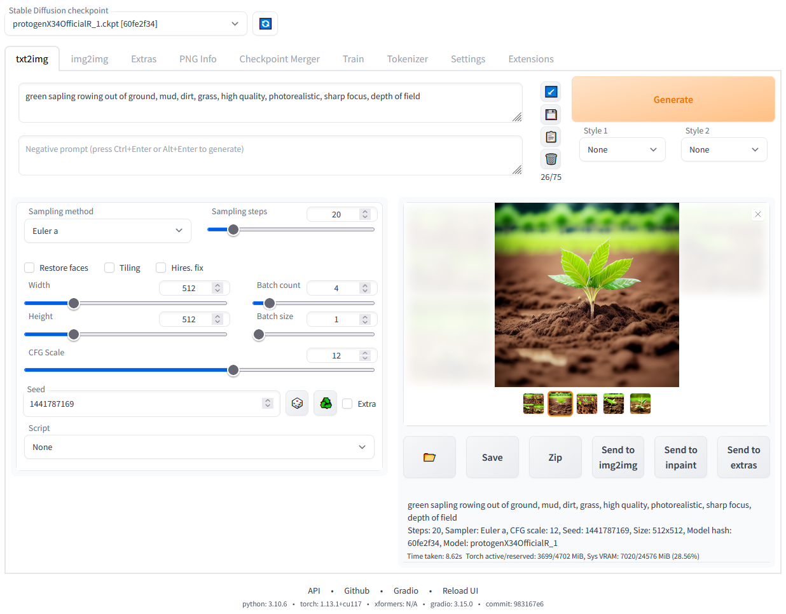
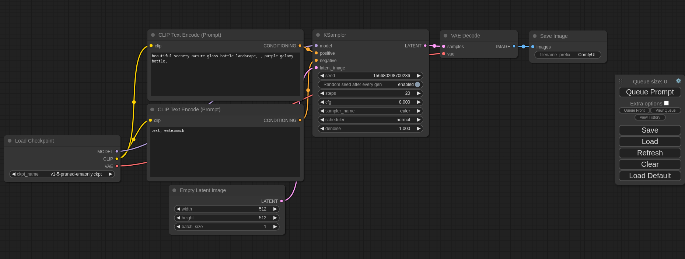
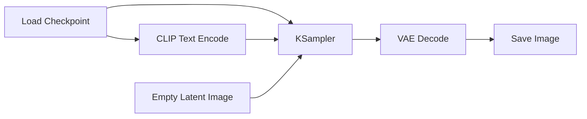
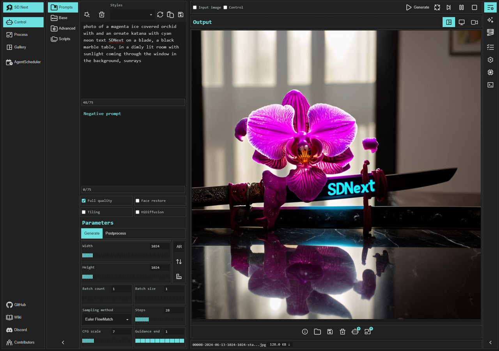
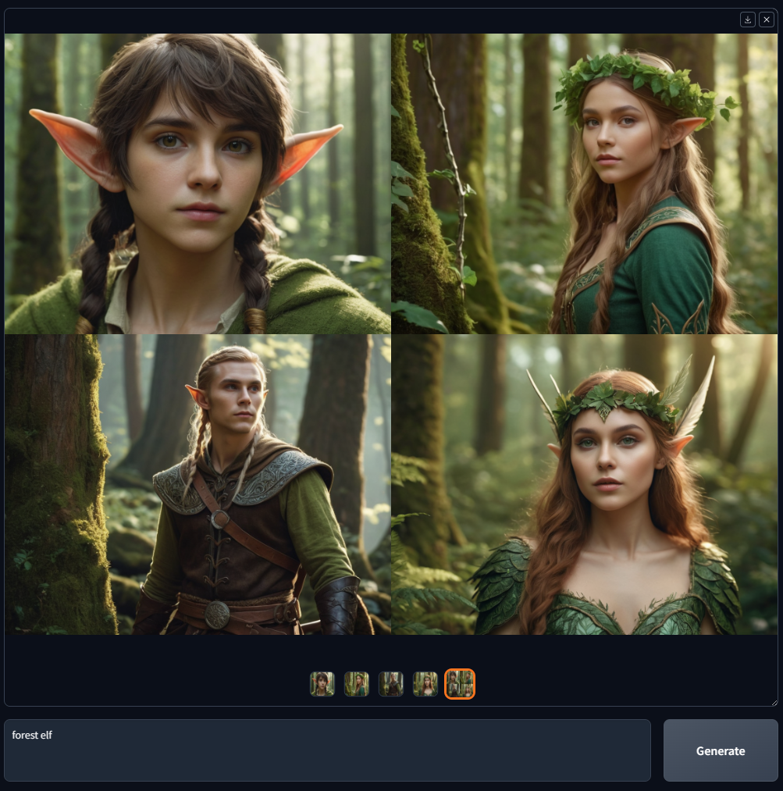
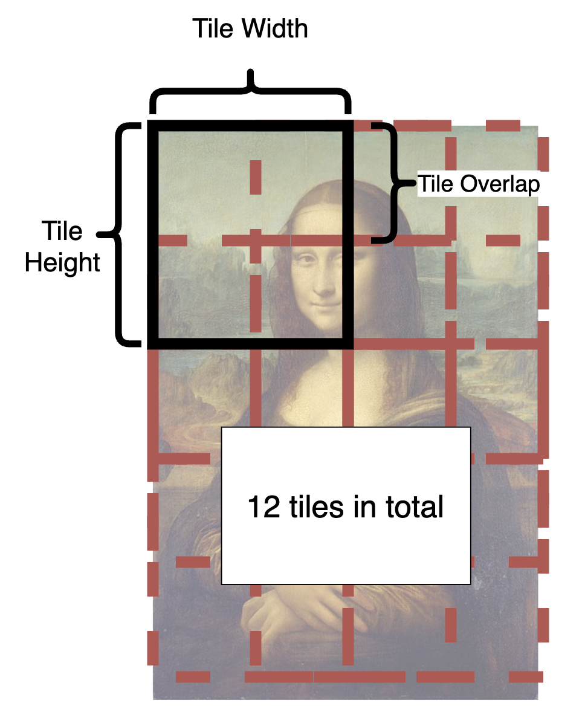

# 目录

[1.主流的AIGC图像生成框架有哪些？应该如何选型？](#q-001)
  - [面试问题：目前主流的AIGC图像生成框架有哪些？它们分别解决什么问题？](#q-002)
  - [面试问题：在AIGC图像生成框架中，从Prompt到图像生成过程通常经历哪些环节？](#q-003)

[2.ComfyUI为什么会成为AIGC图像创作领域的重要工作流框架？](#q-004)
  - [面试问题：ComfyUI的节点图和工作流架构是什么？](#q-005)
  - [面试问题：ComfyUI为什么适合复杂AIGC图像工作流和生产化场景？](#q-006)
  - [面试问题：ComfyUI中常见核心节点类型有哪些？](#q-007)

[3.Diffusers为什么是AIGC图像生成模型研发和部署的重要工程库？](#q-012)
  - [面试问题：Diffusers框架的核心设计思想是什么？](#q-013)
  - [面试问题：Pipeline、Scheduler、Adapter和Model Component在Diffusers中分别起什么作用？](#q-014)
  - [面试问题：Diffusers在训练、推理优化和生产部署中有哪些关键能力？](#q-015)

[4.Stable Diffusion WebUI、Forge、SD.Next和Fooocus分别适合什么场景？](#q-008)
  - [面试问题：Stable Diffusion WebUI的核心功能和长期价值是什么？](#q-009)
  - [面试问题：Stable Diffusion WebUI Forge、SD.Next和Fooocus各自解决什么问题？](#q-010)
  - [面试问题：Variation Seed、Hires.fix和采样器参数在WebUI中分别如何发挥作用？](#q-011)

[5.AIGC图像生成框架中常用插件和扩展能力的底层原理是什么？](#q-016)
  - [面试问题：Ultimate SD Upscale的工作原理是什么？](#q-017)
  - [面试问题：Tiled VAE和Tiled Diffusion为什么能降低大图生成显存压力？](#q-018)
  - [面试问题：ADetailer为什么能自动修复脸部、手部和局部细节？](#q-019)
  - [面试问题：ControlNet、IP-Adapter、LoRA、Segment Anything这类插件分别补齐什么能力？](#q-020)

---

<h1 id="q-001">1.主流的AIGC图像生成框架有哪些？应该如何选型？</h1>

<h2 id="q-002">面试问题：目前主流的AIGC图像生成框架有哪些？它们分别解决什么问题？</h2>

**难度评分：⭐⭐⭐ (3/5)  |  考察频率：⭐⭐⭐⭐⭐ (5/5)**

Rocky认为，AIGC图像生成框架不能只理解为“一个能跑Stable Diffusion的界面”。到了FLUX、SD3/SD3.5、Qwen-Image、HiDream、Z-Image、Seedream、GPT-Image、Nano Banana这一代模型之后，框架的本质已经变成三件事：**模型接入层、创作工作流层、工程部署层**。

从使用场景看，主流框架可以分成五类：

<div align="center">

| 框架类型 | 代表框架 | 核心价值 | 适合人群/场景 |
|---|---|---|---|
| 可视化工作流框架 | ComfyUI | 用节点图把模型、采样器、VAE、ControlNet、LoRA、后处理串成可复现流程 | 复杂工作流、批量生产、影视/电商/设计管线 |
| 参数面板式创作框架 | Stable Diffusion WebUI | 以Gradio界面承载txt2img、img2img、inpaint、插件和参数调试 | 新手、社区插件、快速出图、提示词实验 |
| WebUI增强分支 | Stable Diffusion WebUI Forge、SD.Next | 在WebUI范式上强化资源管理、模型兼容、实验特性或多模型支持 | 低显存、本地部署、多模型尝试、WebUI老用户迁移 |
| 低门槛产品化工具 | Fooocus等 | 尽量隐藏采样器、CFG、ControlNet等复杂参数，让用户像使用产品一样生成图像 | 非技术用户、快速创意验证、轻量设计 |
| Python研发与部署库 | Diffusers | 用代码统一管理Pipeline、Scheduler、模型组件、LoRA、量化、offload、训练脚本和推理优化 | 算法研发、模型评测、产品后端、API服务 |

</div>

其中最有跨周期价值的不是某一个框架本身，而是框架背后的**产品构建方式**：

1. **WebUI类框架把复杂模型包装成可操作产品。**  
   它的价值是降低使用门槛，让更多创作者能通过提示词、采样器、CFG、Seed、Hires.fix、ControlNet等参数完成图像创作。

2. **ComfyUI类框架把图像生成变成可编排工作流。**  
   它的价值不是“界面更酷”，而是把复杂生成流程拆成节点，让每个节点的输入、输出、参数和依赖关系可见、可复现、可自动化。

3. **Diffusers类框架把图像生成变成可研发、可部署、可测试的软件工程。**  
   它的价值是把模型组件、Scheduler、Adapter、量化、offload、torch.compile、训练脚本和推理服务整合到Python生态里。

4. **插件生态把基础模型扩展成完整创作系统。**  
   ControlNet补控制，IP-Adapter补图像参考，LoRA补风格和角色，ADetailer补局部修复，Tiled VAE/Tiled Diffusion补大图和低显存，Ultimate SD Upscale补超分和细节重绘。


可以说，**AIGC图像生成框架的竞争，已经从“谁能启动模型”变成“谁能承载更复杂的模型生态、更稳定的工作流复现、更低成本的推理部署和更高效率的创作生产线”。**

<div align="center">






</div>


<h2 id="q-003">面试问题：在AIGC图像生成框架中，从Prompt到图像生成过程通常经历哪些环节？</h2>

**难度评分：⭐⭐⭐⭐ (4/5)  |  考察频率：⭐⭐⭐⭐⭐ (5/5)**

一个AIGC图像生成框架看起来是在“输入prompt，点击生成”，但底层通常会经历一条完整的推理链路：

```text
用户输入Prompt/参考图/控制图
→ Prompt解析与增强
→ 文本编码器/VLM条件编码
→ 模型权重与Adapter加载
→ 初始噪声/Latent初始化
→ Scheduler/KSampler多步去噪
→ ControlNet/IP-Adapter/LoRA等条件注入
→ VAE Decode解码成像素图
→ 后处理、超分、局部修复、保存与元数据记录
```

可以把这条链路拆成七个关键环节：

<div align="center">

| 执行环节 | 核心任务 | 框架中对应的典型组件 | 关键风险 |
|---|---|---|---|
| 输入层 | 接收prompt、负向prompt、参考图、mask、Control图、Seed和尺寸参数 | WebUI参数面板、ComfyUI输入节点、Diffusers函数参数 | 输入不完整、参数冲突、尺寸不兼容 |
| 条件编码层 | 把文本、图像参考和控制信号转成模型可用的条件表示 | CLIP/T5/VLM Encoder、IP-Adapter、ControlNet预处理器 | 文本截断、条件弱化、多条件冲突 |
| 模型加载层 | 加载Base Model、VAE、LoRA、ControlNet、Text Encoder、Tokenizer | Checkpoint Loader、LoRA Loader、Diffusers Components | 权重版本不匹配、显存不足、低精度误差 |
| 采样调度层 | 决定从噪声到图像的去噪路径 | KSampler、Scheduler、Sampler、CFG、Steps | 步数过少、CFG过高、Scheduler不适配模型 |
| 条件注入层 | 在去噪过程中注入文本、结构、参考图、风格和局部控制 | Cross-Attention、ControlNet、IP-Adapter、LoRA、Regional Prompt | 过度控制、局部破坏、风格污染 |
| 解码输出层 | 把latent解码成RGB图像并保存元数据 | VAE Decode、Save Image、PNG info | VAE色偏、细节损失、元数据缺失 |
| 后处理层 | 做超分、局部修复、大图切块、脸手修复和批处理 | Hires.fix、Ultimate SD Upscale、ADetailer、Tiled VAE | 接缝、局部不一致、过度重绘 |

</div>

Rocky认为，理解框架执行链路有两个价值：

第一，**能够定位问题**。如果生成结果不听prompt，可能是caption/文本编码/CFG/条件注入的问题；如果大图爆显存，可能是VAE解码、attention序列长度或tile策略的问题；如果局部人脸坏了，可能不是主模型不行，而是分辨率和局部像素不足，需要ADetailer或局部inpaint。

第二，**能够做工程选型**。WebUI适合快速调参，ComfyUI适合把上述链路可视化成稳定工作流，Diffusers适合把链路写成可测试、可部署、可扩展的Python服务。


<h1 id="q-004">2.ComfyUI为什么会成为AIGC图像创作领域的重要工作流框架？</h1>

<h2 id="q-005">面试问题：ComfyUI的节点图和工作流架构是什么？</h2>

**难度评分：⭐⭐⭐ (3/5)  |  考察频率：⭐⭐⭐⭐⭐ (5/5)**

ComfyUI的核心不是“又一个图像生成界面”，而是一个**节点图工作流引擎**。它把图像生成过程拆成一系列可连接、可复用、可保存的节点，例如加载模型、编码prompt、采样、解码、加载LoRA、应用ControlNet、超分、保存图像等。

一个最基础的Stable Diffusion/FLUX类工作流可以抽象成：



节点图有三个关键设计：

1. **节点是功能单元。**  
   每个节点只做一件相对清晰的事，例如加载模型、编码文本、采样、解码、保存。它让复杂生成流程从“黑盒按钮”变成“可拆解流程”。

2. **连线是数据依赖。**  
   节点之间传递的不是抽象概念，而是具体数据类型，例如 `MODEL`、`CLIP`、`VAE`、`CONDITIONING`、`LATENT`、`IMAGE`、`MASK`。这使得用户可以明确知道信息如何流动。

3. **工作流是可复现资产。**  
   ComfyUI可以保存/加载JSON工作流，也可以从生成图片中恢复工作流元数据。对团队协作来说，这比“截图一堆参数”更可靠。

ComfyUI一个自定义节点的基本形式通常包含输入类型、输出类型、执行函数和分类信息：

```python
class CustomNode:
    @classmethod
    def INPUT_TYPES(cls):
        return {
            "required": {
                "image": ("IMAGE",),
                "strength": ("FLOAT", {"default": 0.5, "min": 0, "max": 1}),
            }
        }

    RETURN_TYPES = ("IMAGE",)
    FUNCTION = "process"
    CATEGORY = "ImageProcessing"

    def process(self, image, strength):
        output = do_something(image, strength)
        return (output,)
```

这个设计的长期价值在于：**AIGC图像创作越来越不是单次生成，而是“模型加载、条件控制、编辑、超分、局部修复、批处理、评测和自动化”的组合工程。节点图是承载这种组合工程的天然结构。**


<h2 id="q-006">面试问题：ComfyUI为什么适合复杂AIGC图像工作流和生产化场景？</h2>

**难度评分：⭐⭐⭐⭐ (4/5)  |  考察频率：⭐⭐⭐⭐⭐ (5/5)**

ComfyUI适合复杂工作流，本质上是因为它解决了AIGC图像生产中的四个痛点：**流程不可见、参数不可复现、局部修改要全量重跑、复杂模型组合难以管理**。

ComfyUI官方也强调了几个很关键的能力：节点/图/流程图界面、异步队列、只重新执行发生变化的工作流部分、智能显存管理、工作流JSON保存和从生成图片恢复工作流等。这些能力对普通玩家是效率提升，对生产团队则是流程资产化。

可以从五个角度理解它的价值：

1. **流程透明。**  
   WebUI里很多流程被封装在面板和脚本后面；ComfyUI把流程展开成节点图。用户可以明确看到prompt如何编码、ControlNet在哪一步注入、latent在哪里被放大、VAE在哪里解码。

2. **复现能力强。**  
   一个复杂工作流可以保存成JSON，也可以随图片一起保存元数据。团队成员之间传的不是“你把CFG调到7.5，再开某个插件”，而是一份可执行工作流。

3. **局部重算效率高。**  
   如果只改prompt，理论上模型加载节点、VAE加载节点、部分预处理节点不需要重新执行。对大模型、多ControlNet、多LoRA场景来说，这种增量执行能显著提升迭代效率。

4. **复杂组合能力强。**  
   多LoRA、多ControlNet、IP-Adapter、多图参考、区域prompt、mask编辑、Tiled VAE、超分、ADetailer这类链路在面板式工具里容易混乱，在节点图里更容易管理。

5. **更接近自动化和后端服务。**  
   ComfyUI不仅是GUI，也可以通过API和队列系统接入自动化生产流程。很多团队会把它作为视觉工作流后端，而不是只当本地绘图软件。

面试中可以这样收束：

> **ComfyUI的跨周期价值，是把AIGC图像生成从“参数调试工具”推进到“视觉生成工作流编排系统”。当模型越来越多、插件越来越多、任务越来越复杂时，节点图不是界面偏好，而是一种工程必然。**

<div align="center">


</div>


<h2 id="q-007">面试问题：ComfyUI中常见核心节点类型有哪些？</h2>

**难度评分：⭐⭐⭐ (3/5)  |  考察频率：⭐⭐⭐⭐ (4/5)**

ComfyUI节点很多，但面试时没必要背插件名。更重要的是按生成链路理解节点类型：

<div align="center">

| 节点类型 | 典型节点 | 输入/输出 | 解决的问题 |
|---|---|---|---|
| 模型加载节点 | Load Checkpoint、Load Diffusion Model、Load VAE、Load LoRA、Load ControlNet | 输出MODEL、CLIP、VAE等 | 把模型权重变成可执行组件 |
| 文本编码节点 | CLIP Text Encode、T5 Text Encode、Prompt组合节点 | 文本到CONDITIONING | 把自然语言转成条件向量 |
| Latent节点 | Empty Latent Image、VAE Encode、Latent Upscale | LATENT | 管理扩散/Flow模型实际操作的潜空间 |
| 采样节点 | KSampler、KSampler Advanced、SamplerCustom | MODEL + CONDITIONING + LATENT到LATENT | 完成多步去噪生成 |
| 图像解码节点 | VAE Decode、Save Image、Preview Image | LATENT到IMAGE | 把潜变量解码成可见图像并输出 |
| 控制节点 | ControlNet Apply、IP-Adapter Apply、Conditioning Combine、Mask节点 | 控制图/参考图/条件融合 | 引入姿态、深度、边缘、参考图和区域约束 |
| 后处理节点 | Upscale、Tiled VAE、Face Detailer、Image Blend | IMAGE/MASK | 超分、修复、融合和细节增强 |

</div>

这些节点背后有一条统一逻辑：**模型生成不是一口气完成，而是由“条件构造、latent采样、像素解码、后处理增强”四类计算组合而成。** 熟悉节点类型，本质上就是熟悉AIGC图像生成系统的模块边界。


<h1 id="q-012">3.Diffusers为什么是AIGC图像生成模型研发和部署的重要工程库？</h1>

<h2 id="q-013">面试问题：Diffusers框架的核心设计思想是什么？</h2>

**难度评分：⭐⭐⭐⭐ (4/5)  |  考察频率：⭐⭐⭐⭐⭐ (5/5)**

Diffusers是Hugging Face生态中用于扩散/生成模型推理、训练和部署的重要Python库。它不是给普通用户点按钮的工具，而是给算法工程师、研究者和产品后端使用的**模型工程库**。

Diffusers的核心抽象是 `DiffusionPipeline`。它把图像生成所需的多个组件封装成一个可调用对象：

```python
from diffusers import DiffusionPipeline
import torch

pipe = DiffusionPipeline.from_pretrained(
    "stabilityai/stable-diffusion-xl-base-1.0",
    torch_dtype=torch.float16,
).to("cuda")

image = pipe(
    prompt="cinematic photo of a futuristic city at sunset",
    num_inference_steps=30,
).images[0]
```

这个抽象的价值在于：

1. **统一不同模型的调用方式。**  
   Stable Diffusion、SDXL、SD3、FLUX、PixArt、Kandinsky、video diffusion等模型架构不同，但都可以被封装成pipeline形式。

2. **组件可替换。**  
   Scheduler、VAE、UNet/DiT、Text Encoder、LoRA、ControlNet、IP-Adapter等都可以组合或替换，方便研究和工程实验。

3. **贴近生产部署。**  
   Diffusers支持offload、量化、torch.compile、xFormers/SDPA等推理优化策略，也能和Transformers、Accelerate、PEFT、Hub生态打通。

4. **兼顾训练和推理。**  
   它不仅能跑模型，还提供训练脚本、LoRA微调、DreamBooth、Textual Inversion、ControlNet训练等工程入口。

Rocky认为，Diffusers的跨周期价值是：**把AIGC图像生成从“模型仓库里的权重文件”变成“可组合、可测试、可部署的软件组件”。** 这对算法岗很重要，因为真实业务不是在本地手动点图，而是要把模型接进服务、评测、数据回流和产品链路。


<h2 id="q-014">面试问题：Pipeline、Scheduler、Adapter和Model Component在Diffusers中分别起什么作用？</h2>

**难度评分：⭐⭐⭐⭐ (4/5)  |  考察频率：⭐⭐⭐⭐ (4/5)**

Diffusers里最重要的不是背API，而是理解几个核心抽象：

<div align="center">

| 抽象 | 作用 | 类比 | 面试要点 |
|---|---|---|---|
| Pipeline | 把完整生成流程封装成可调用对象 | 一条装配线 | 负责组织文本编码、去噪、解码、后处理 |
| Model Component | UNet、DiT、VAE、Text Encoder、Tokenizer等模型模块 | 装配线上的机器 | 组件可替换，决定模型能力边界 |
| Scheduler | 控制采样时间步和去噪更新公式 | 采样路线规划器 | 决定速度、稳定性和步数-质量关系 |
| Adapter | LoRA、ControlNet、IP-Adapter、T2I-Adapter等 | 外接能力模块 | 不重训主模型也能补风格、结构、参考图控制 |
| Optimization | offload、quantization、torch.compile、attention优化 | 工程加速层 | 决定能否低成本部署 |

</div>

可以把一次Diffusers推理理解成：

```text
Pipeline接收prompt和参数
→ Tokenizer/Text Encoder得到文本条件
→ Scheduler初始化时间步和噪声
→ UNet/DiT在每个时间步预测噪声/velocity/flow
→ Scheduler更新latent
→ VAE把latent解码成图像
→ Safety/后处理/输出
```

其中Scheduler非常关键。它不是“可有可无的小参数”，而是决定去噪路径的数值方法。Euler、DDIM、DPM-Solver、UniPC、LCM Scheduler等Scheduler在步数、稳定性、质量和速度上各有取舍。

Adapter则体现了现代图像生成框架的另一个趋势：**基础模型越来越大，但业务能力经常靠轻量模块扩展。** LoRA补风格和角色，ControlNet补结构控制，IP-Adapter补图像参考，T2I-Adapter补轻量条件控制。这些能力如果都靠重训主模型，成本会极高。


<h2 id="q-015">面试问题：Diffusers在训练、推理优化和生产部署中有哪些关键能力？</h2>

**难度评分：⭐⭐⭐⭐ (4/5)  |  考察频率：⭐⭐⭐⭐ (4/5)**

Diffusers的工程价值，主要体现在三条线：

1. **训练线：让研究方法可复现。**  
   Diffusers提供了多类训练脚本和示例，常见包括LoRA、DreamBooth、Textual Inversion、ControlNet训练、模型蒸馏等。对算法岗来说，它适合快速验证“某个训练策略是否有效”。

2. **推理优化线：让大模型能跑起来、跑得快。**  
   官方文档中明确提到Diffusers围绕offloading、quantization和torch.compile等优化，让大模型在显存受限设备上可用，并在显存足够时提升推理速度。实际工程中还会结合FP16/BF16、SDPA/xFormers、FlashAttention、SageAttention、VAE tiling、CPU/GPU offload等策略。

3. **部署线：让模型成为服务组件。**  
   Diffusers天然适合封装成API服务，因为pipeline是Python对象，可以接入FastAPI、队列系统、GPU调度、模型缓存、批量推理、日志评测和bad case回流。

但面试中也要讲边界：

> Diffusers不是最适合普通创作者手动调图的工具，也不是天然的可视化工作流框架。它的强项是研发、评测、自动化、部署和生态集成。真正的生产系统，往往会用Diffusers承载后端服务，用ComfyUI探索和固化复杂工作流，用WebUI/Forge做创意调参和插件验证。


<h1 id="q-008">4.Stable Diffusion WebUI、Forge、SD.Next和Fooocus分别适合什么场景？</h1>

<h2 id="q-009">面试问题：Stable Diffusion WebUI的核心功能和长期价值是什么？</h2>

**难度评分：⭐⭐⭐ (3/5)  |  考察频率：⭐⭐⭐⭐⭐ (5/5)**

Stable Diffusion WebUI，也就是常说的A1111 WebUI，是Stable Diffusion生态里影响力最大的参数面板式创作框架之一。它基于Gradio实现，把txt2img、img2img、inpainting、outpainting、upscale、prompt权重、X/Y/Z Plot、Textual Inversion、LoRA、ControlNet、ADetailer等能力放进统一界面。

它的长期价值主要有三点：

1. **降低Stable Diffusion使用门槛。**  
   早期Stable Diffusion需要写Python脚本和命令行，WebUI把模型选择、prompt、采样器、步数、CFG、Seed、分辨率、插件都变成可视化参数。

2. **形成强大的社区插件生态。**  
   WebUI的最大价值不是内置功能本身，而是围绕它形成了ControlNet、ADetailer、Ultimate SD Upscale、Regional Prompter、OpenPose Editor、Segment Anything、Roop/ReActor等大量扩展。

3. **成为AIGC图像创作参数范式的普及入口。**  
   很多人第一次理解Seed、CFG、Sampler、Steps、Denoising Strength、Hires.fix、Inpaint Mask，都是通过WebUI。这些参数后来也被ComfyUI、Diffusers和各类产品吸收。

但WebUI也有局限：复杂流程容易变成“多个页面和插件之间手动跳转”，工作流复现能力弱于ComfyUI；对新模型和复杂多模态链路的适配速度，也越来越依赖社区维护和分支生态。

所以面试中可以这样回答：

> **WebUI的跨周期价值，是把扩散模型从研究代码变成可被大众使用的创作工具；但随着模型和工作流复杂度上升，它更适合快速调参和插件实验，而不是承载最复杂的生产级流程编排。**


<h2 id="q-010">面试问题：Stable Diffusion WebUI Forge、SD.Next和Fooocus各自解决什么问题？</h2>

**难度评分：⭐⭐⭐ (3/5)  |  考察频率：⭐⭐⭐⭐ (4/5)**

这三个工具都可以看作WebUI生态的不同方向分化：

<div align="center">

| 工具 | 核心定位 | 主要解决的问题 | 适合场景 |
|---|---|---|---|
| Stable Diffusion WebUI Forge | WebUI增强平台 | 优化资源管理、加速推理、支持实验特性和低显存模型运行 | 老WebUI用户、低显存、FLUX/新模型尝试 |
| SD.Next | 多后端、多模型WebUI分支 | 在WebUI范式下支持更多模型、后端、优化和部署选项 | 喜欢WebUI交互但希望更强兼容性 |
| Fooocus | 低门槛图像生成产品 | 隐藏复杂参数，弱化调参负担，让用户专注prompt和图像结果 | 非技术用户、快速概念图、轻量创作 |

</div>

Forge的关键不是“又一个WebUI换皮”，而是围绕资源管理和新模型适配做增强。它的官方定位就是在Stable Diffusion WebUI之上，让开发更容易、优化资源管理、加速推理并研究实验特性。对低显存用户来说，Forge的价值在于把显存管理、offload、量化模型和新模型适配做得更工程化。

SD.Next更像是WebUI路线的扩展型平台，强调多模型、多后端和更多高级功能。它适合希望保留WebUI交互习惯，但又不想被原始A1111生态限制的人。

Fooocus则走另一条路线：减少参数暴露，把很多采样、提示词增强、图像质量策略自动化。它牺牲了一部分可控性，换来了更接近产品的低门槛体验。

Rocky认为，这三者体现了AIGC工具演进的一个规律：

> **同一个Stable Diffusion生态，会自然分化出“专家工作台”“资源优化分支”“低门槛产品”和“代码研发库”。工具没有绝对先进，只有是否匹配你的创作复杂度、硬件约束和工程目标。**

<div align="center">





</div>


<h2 id="q-011">面试问题：Variation Seed、Hires.fix和采样器参数在WebUI中分别如何发挥作用？</h2>

**难度评分：⭐⭐⭐⭐ (4/5)  |  考察频率：⭐⭐⭐⭐ (4/5)**

WebUI里很多参数看似是操作技巧，底层其实对应扩散模型推理过程中的关键控制点。

**Variation Seed控制的是初始噪声的相似性。**  
Seed决定初始噪声，Variation Seed则引入第二个噪声源，通过Variation Strength做插值：

$$
N_{\text{final}}=(1-\alpha)N_{\text{original}}+\alpha N_{\text{variation}}
$$

当 $\alpha$ 较小时，图像保留原始构图，只改变局部纹理、光影或细节；当 $\alpha$ 较大时，生成结果会逐渐接近新Seed。它适合做“保留方向、探索变体”。

**Hires.fix解决的是直接高分辨率生成不稳定的问题。**  
早期Stable Diffusion在低分辨率训练较多，直接生成高分辨率容易出现多头、多肢体、结构重复。Hires.fix通常采用两阶段流程：

```text
低分辨率先生成稳定构图
→ 使用超分算法或latent upscale放大
→ 在较低denoising strength下进行二次img2img细化
```

它的本质是：先让模型在熟悉分辨率里确定全局结构，再在高分辨率里补细节。

**采样器决定的是去噪路径和数值求解策略。**  
Euler、Euler a、DDIM、DPM++ 2M Karras、DPM++ SDE Karras等采样器，本质上是不同的反向扩散/ODE/SDE求解方式。面试中不用背“哪个一定最好”，要讲清楚三组取舍：

<div align="center">

| 参数/方法 | 控制对象 | 影响结果 | 常见取舍 |
|---|---|---|---|
| Seed / Variation Seed | 初始噪声 | 构图、随机性、细节变化 | 固定复现 vs 探索多样性 |
| Steps | 去噪迭代次数 | 细节、稳定性、速度 | 高质量 vs 低延迟 |
| CFG Scale | 文本条件强度 | Prompt遵循、画面自然度 | 听话 vs 过度约束 |
| Sampler/Scheduler | 去噪路径 | 画质、纹理、稳定性 | 快速预览 vs 精修输出 |
| Denoising Strength | img2img重绘强度 | 保留原图 vs 改写图像 | 一致性 vs 创造性 |

</div>

一句话总结：

> **Variation Seed调的是噪声起点，Hires.fix调的是分辨率生成策略，采样器调的是从噪声到图像的路径。理解这三者，才算真正理解WebUI参数背后的扩散模型推理逻辑。**


<h1 id="q-016">5.AIGC图像生成框架中常用插件和扩展能力的底层原理是什么？</h1>

<h2 id="q-017">面试问题：Ultimate SD Upscale的工作原理是什么？</h2>

**难度评分：⭐⭐⭐ (3/5)  |  考察频率：⭐⭐⭐⭐ (4/5)**

Ultimate SD Upscale解决的是一个非常实际的问题：**如何把一张中低分辨率图像放大到2K/4K，同时不只是机械插值，而是补出更可信的局部细节。**

它的典型流程可以概括为：

```text
输入图像
→ 传统/神经网络超分初步放大
→ 按Tile切成多个重叠块
→ 每个Tile用img2img低强度重绘补细节
→ 对重叠区域做mask blur、padding和融合
→ 必要时做接缝修复
→ 输出高分辨率图像
```

核心思想有三点：

1. **先放大，再重绘。**  
   直接让扩散模型从低分辨率生成4K图很容易结构崩坏；先用upscaler放大，再用SD做低强度img2img，可以在保留原图结构的同时补充纹理。

2. **切块降低显存压力。**  
   4K图像整体送入模型会消耗大量显存。Tile策略把大图分成512或768等小块，让普通显卡也能处理。

3. **重叠融合抑制接缝。**  
   Tile之间如果完全独立重绘，会出现边界断裂。padding、mask blur、seams fix等策略就是为了让边缘区域更平滑。

它的风险也很明显：denoise过低，只会放大原图缺陷；denoise过高，局部会被改写，导致人物身份、文字、纹理风格不一致。面试里可以这样总结：

> **Ultimate SD Upscale不是单纯超分，而是“超分 + 切块 + 低强度重绘 + 接缝融合”的组合工程。它用时间换显存，用局部重绘换细节，但必须控制denoising strength和tile融合，否则容易出现接缝、局部风格漂移和细节幻觉。**


<h2 id="q-018">面试问题：Tiled VAE和Tiled Diffusion为什么能降低大图生成显存压力？</h2>

**难度评分：⭐⭐⭐⭐ (4/5)  |  考察频率：⭐⭐⭐⭐⭐ (5/5)**

Tiled VAE和Tiled Diffusion都利用了一个朴素但很有效的工程思想：**大图整体算不动，就切成小块算；小块之间不一致，就通过重叠、融合和全局约束来修正。**

但二者切的位置不一样：

<div align="center">

| 方法 | 切分对象 | 主要目标 | 核心风险 |
|---|---|---|---|
| Tiled VAE | VAE Encode/Decode阶段的图像或latent | 降低大图编码/解码显存 | 接缝、颜色不一致、GroupNorm统计不准 |
| Tiled Diffusion | 扩散采样阶段的latent tile | 在低显存下生成/重绘超大图 | Tile之间语义不一致、边缘断裂、全局结构漂移 |

</div>

**Tiled VAE**主要解决VAE显存问题。VAE Decoder在高分辨率下很吃显存，因为它要把latent解码成RGB图像。如果把整张大图一次性解码，容易爆显存。Tiled VAE把图像分块解码，再通过重叠区域和归一化统计修正减少接缝。

**Tiled Diffusion**则是在采样过程中分块。它的底层思想与MultiDiffusion高度相关：多个局部扩散路径不是各自生成完再粗暴拼接，而是在每个去噪步中融合重叠区域，让不同Tile共享约束，从而减少边界不连续。

可以把Tiled Diffusion理解成：

```text
初始化全局latent
→ 切成多个重叠tile
→ 每个tile分别预测噪声/去噪方向
→ 把重叠区域的预测结果加权融合
→ 更新全局latent
→ 重复直到采样结束
```

<div align="center">




</div>

Rocky认为，Tiled类插件的跨周期价值不是某个具体插件，而是它体现了一种长期有效的工程范式：**在模型能力和硬件显存之间做分块计算、局部重绘和全局融合。** 这套思想不仅适用于SD大图，也适用于视频生成、3D生成和多图拼接任务。


<h2 id="q-019">面试问题：ADetailer为什么能自动修复脸部、手部和局部细节？</h2>

**难度评分：⭐⭐⭐ (3/5)  |  考察频率：⭐⭐⭐⭐ (4/5)**

ADetailer的本质是一个**自动检测 + 自动遮罩 + 自动局部重绘**插件。它不是让基础模型突然更懂手和脸，而是把原本需要人工完成的局部inpainting流程自动化。

完整流程通常是：

```text
先生成整图
→ 用检测模型识别人脸、手部、人体等区域
→ 根据bbox/segmentation生成mask
→ 对mask做扩张、腐蚀、偏移、合并等预处理
→ 使用inpainting在局部区域高分辨率重绘
→ 将修复区域融合回原图
```

ADetailer常用YOLOv8、YOLO World、MediaPipe Face等检测模型。官方说明也很直接：它通过检测模型自动检测对象、创建mask，然后用原图和mask做inpainting。

为什么这能改善脸和手？

1. **局部区域获得更多像素预算。**  
   全身人像里脸可能只占几十个像素，模型很难画清。ADetailer把脸裁出来放大重绘，相当于给局部细节更多分辨率。

2. **只改坏的地方，不重画整张图。**  
   它保留整体构图、姿态、背景和光照，只在mask区域内修复，避免全图img2img导致身份和构图漂移。

3. **可以结合ControlNet约束局部。**  
   对手、脸、姿态等区域，可以结合lineart、openpose、depth、tile等ControlNet，减少高denoise带来的局部乱改。

但ADetailer也不是万能的。检测失败、mask过小、denoise过高、局部提示词和全图冲突，都会导致修复区域不自然。面试中最稳的回答是：

> **ADetailer解决的不是基础模型的根本能力上限，而是把“检测局部缺陷、生成遮罩、局部重绘、融合输出”自动化。它特别适合脸、手、人体这类小区域细节修复，是AIGC图像工作流里典型的局部后处理增强模块。**


<h2 id="q-020">面试问题：ControlNet、IP-Adapter、LoRA、Segment Anything这类插件分别补齐什么能力？</h2>

**难度评分：⭐⭐⭐⭐ (4/5)  |  考察频率：⭐⭐⭐⭐⭐ (5/5)**

AIGC图像插件生态的本质，是围绕基础模型补齐四类能力：**结构控制、参考图控制、风格/角色注入、局部选择与编辑**。

<div align="center">

| 插件/模块 | 补齐的能力 | 输入信号 | 底层作用 |
|---|---|---|---|
| ControlNet | 姿态、边缘、深度、线稿、法线、Tile等结构控制 | OpenPose、Canny、Depth、Lineart、Tile图 | 在去噪网络中注入额外结构条件 |
| IP-Adapter | 参考图风格、角色、构图或身份控制 | 参考图image embedding | 把图像条件注入cross-attention或相关条件层 |
| LoRA / LyCORIS | 风格、角色、服装、画风、产品概念 | 小规模微调权重 | 用低秩增量修改主模型表达 |
| Segment Anything / SAM | 快速分割目标区域 | 点击、框选、mask提示 | 为inpainting、局部重绘、抠图和组合生成提供mask |
| Regional Prompter | 区域级prompt控制 | 区域划分和局部prompt | 减少多主体混淆和局部语义串扰 |

</div>

它们背后的共同趋势是：**基础模型负责生成分布，插件负责把创作意图转成更强的条件约束。** 这也是为什么插件生态长期不会消失。即使基础模型越来越强，真实创作仍然需要姿态、参考、身份、局部、版式、区域和批处理控制。

Rocky认为，未来AIGC图像框架会越来越像一个视觉Agent工作台：

```text
用户意图
→ VLM理解和Prompt增强
→ 基础模型生成
→ Control/Adapter/LoRA注入约束
→ SAM/检测模型定位局部
→ Inpaint/超分/ADetailer修复
→ 评测和反馈回流
```

所以，面试中理解插件不能停留在“这个插件怎么用”。更本质的回答是：

> **插件是基础模型能力和真实创作需求之间的工程桥梁。ControlNet解决结构可控，IP-Adapter解决参考图可控，LoRA解决低成本个性化，SAM/ADetailer解决局部可编辑。谁能把这些能力稳定编排起来，谁就更接近真实AIGC图像生产系统。**
