# 目录

## 第一章 图像基础概念高频考点

- [1.数字图像在计算机中是如何表示的？](#img-basic-q-001)
- [2.图像尺寸、分辨率、宽高比、PPI和DPI有什么区别？](#img-basic-q-002)
- [3.位深、色深、每像素位数、数据类型和动态范围有什么区别？](#img-basic-q-003)
- [4.灰度、RGB、BGR、RGBA以及HWC、CHW分别表示什么？](#img-basic-q-004)
- [5.常见色彩空间如何选择？色域、白点和Gamma为什么不能忽略？](#img-basic-q-005)
- [6.RAW图像和RGB图像有什么区别？ISP完成了哪些处理？](#img-basic-q-006)
- [7.透明图与普通图像有什么区别？Alpha合成有哪些常见陷阱？](#img-basic-q-007)
- [8.JPEG、PNG、WebP、AVIF、TIFF和OpenEXR应该如何选择？](#img-basic-q-008)
- [9.图像采样、缩放与混叠是什么？为什么缩小图像前要低通滤波？](#img-basic-q-009)
- [10.图像中的低频与高频信息分别是什么？](#img-basic-q-010)
- [11.什么是图像信噪比？SNR高是否一定代表视觉质量好？](#img-basic-q-011)
- [12.什么是图像畸变？径向畸变、切向畸变和透视变形有什么区别？](#img-basic-q-012)
- [13.AIGC图像模型的输入预处理为什么必须保持训练与推理一致？](#img-basic-q-013)

## 第二章 图像经典处理技术高频考点

- [1.图像卷积与互相关的区别是什么？卷积核、步幅、填充方式和边界处理如何影响输出？](#img-proc-q-001)
- [2.图像点运算如何调整亮度、对比度和Gamma？](#img-proc-q-002)
- [3.什么是图像直方图？直方图均衡化与CLAHE有什么区别？](#img-proc-q-003)
- [4.图像二值化的原理是什么？全局阈值、Otsu和自适应阈值如何选择？](#img-proc-q-004)
- [5.图像噪声有哪些主要类型？如何根据成像机制建立噪声模型？](#img-proc-q-005)
- [6.均值、高斯、中值、双边和引导滤波有什么区别？](#img-proc-q-006)
- [7.NLM、小波、BM3D、全变分和维纳滤波如何进行图像去噪？](#img-proc-q-007)
- [8.图像模糊的退化模型是什么？逆滤波、维纳反卷积和Richardson-Lucy如何恢复图像？](#img-proc-q-008)
- [9.Roberts、Prewitt、Sobel和Scharr一阶梯度算子有什么区别？](#img-proc-q-009)
- [10.拉普拉斯、LoG和DoG算子的原理与局限是什么？](#img-proc-q-010)
- [11.Canny边缘检测为什么要经过平滑、非极大值抑制和双阈值连接？](#img-proc-q-011)
- [12.空间域与频率域滤波有什么关系？低通、高通、带通和陷波滤波器如何选择？](#img-proc-q-012)
- [13.膨胀、腐蚀、开闭运算、形态学梯度、顶帽和黑帽分别有什么作用？](#img-proc-q-013)
- [14.连通域、轮廓、距离变换、骨架化和分水岭如何分析目标结构？](#img-proc-q-014)
- [15.最近邻、双线性、双三次、Area和Lanczos插值如何选择？](#img-proc-q-015)
- [16.仿射变换、透视变换和通用重映射有什么区别？](#img-proc-q-016)
- [17.高斯金字塔、拉普拉斯金字塔和多尺度处理有什么价值？](#img-proc-q-017)
- [18.Alpha融合、羽化、多频段融合和泊松融合有什么区别？](#img-proc-q-018)
- [19.经典图像处理算法在AIGC数据、控制、编辑和交付链路中承担什么职责？](#img-proc-q-019)

## 第三章 AIGC图像创作基础概念

- [1.什么是AIGC图像创作？它与传统图像处理和判别式视觉任务有什么区别？](#aigc-basic-q-001)
- [2.像素空间、连续潜空间和离散视觉Token分别如何表示图像？](#aigc-basic-q-002)
- [3.一个AIGC图像生成系统从条件输入到最终图像通常经历哪些环节？](#aigc-basic-q-003)
- [4.Diffusion、VAE、GAN、Flow和自回归模型在图像生成中有什么异同？](#aigc-basic-q-004)
- [5.什么是自回归图像生成模型？它为什么又重新成为主流技术路线？](#aigc-basic-q-005)
- [6.AIGC图像创作中的Low-Level任务包括哪些方向？](#aigc-basic-q-006)
- [7.AIGC图像创作中的可控性、多样性、真实性和原图保持为什么经常相互制约？](#aigc-basic-q-007)
- [8.Scaling Law在AIGC图像创作领域成立吗？它有哪些适用边界？](#aigc-basic-q-008)

## 第四章 AIGC图像创作领域的评价指标

- [1.AI生成图像的常用评价指标](#1.AI生成图像的常用评价指标)
- [2.什么是REAL评价指标？](#2.什么是REAL评价指标？)
- [3.介绍一下Aesthetic Score Predictor、Aesthetic Predictor V2.5评价指标的原理](#3.介绍一下Aesthetic-Score-Predictor、Aesthetic-Predictor-V2.5评价指标的原理)
- [4.介绍一下FID指标的原理](#4.介绍一下FID指标的原理)
- [5.介绍一下CLIP score指标的原理](#5.介绍一下CLIP-score指标的原理)
- [6.介绍一下PartiPrompts指标的原理](#6.介绍一下PartiPrompts指标的原理)
- [7.什么是SSIM图像评估指标？](#8.什么是SSIM图像评估指标？)
- [8.什么是PSNR图像评估指标？](#9.什么是PSNR图像评估指标？)
- [9.为什么AIGC图像生成不能只用一个指标评估？](#9.为什么AIGC图像生成不能只用一个指标评估？)
- [10.GenEval、DPG-Bench、TIFA、VQAScore等如何评价复杂提示词遵循？](#eval-q-010)
- [11.ImageReward、PickScore、HPS v2与Aesthetic Predictor有什么区别？](#eval-q-011)
- [12.如何评价中文、多语言文字和版式生成能力？](#eval-q-012)
- [13.如何评价AIGC图像编辑模型的编辑成功率与原图保持能力？](#eval-q-013)
- [14.个性化生成和参考图生成如何评价主体与身份一致性？](#eval-q-014)
- [15.人工成对评测、胜率、Elo和Bradley-Terry的原理与局限是什么？](#eval-q-015)

## 第一章 图像基础概念高频考点正文

<h2 id="img-basic-q-001">1.数字图像在计算机中是如何表示的？</h2>

**难度评分：⭐⭐ (2/5)  |  考察频率：⭐⭐⭐⭐⭐ (5/5)**

数字图像不是“一张图片文件”这么简单。对计算机而言，它首先是一组按照空间位置排列的离散数值；文件格式只是这组数值在磁盘上的编码方式。理解这一点，才能把像素、通道、数据类型、色彩空间和模型张量串成同一条链路。

### 1.从连续场景到离散像素

现实世界中的光场在空间和强度上近似连续。相机或扫描设备会对它进行两次离散化：

1. **空间采样**：把连续平面划分为有限的像素网格。
2. **幅值量化**：把连续光强映射为有限的数字等级。

因此，一幅灰度图可以表示为二维矩阵 $I(h,w)$；彩色图通常表示为三维张量 $I(h,w,c)$。其中，$H$ 是高度、$W$ 是宽度、$C$ 是通道数。像素不是“绝对颜色点”，它的数值含义还取决于数据类型、色彩空间、传递函数和取值范围。

<div align="center">

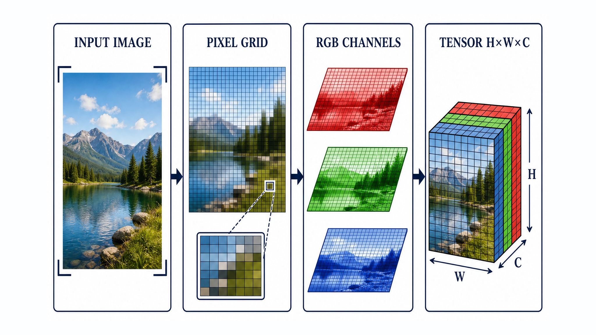

*图：连续视觉信息经过空间采样、像素网格化、RGB通道组织后，最终形成模型可处理的 $H\times W\times C$ 张量。*

</div>

### 2.像素、通道和张量

以一张 `1024 × 768` 的 8-bit RGB 图像为例：

- 空间上共有 $1024 \times 768$ 个像素；
- 每个像素有 R、G、B 三个通道；
- 每个通道通常使用 8 bit，取值范围是 0—255；
- 解码后的理论原始存储量约为 $1024 \times 768 \times 3$ Byte，尚未计算行对齐、元数据和容器开销。

一般情况下，未压缩栅格数据的理论大小可以近似写为：

```math
\mathrm{Bytes}\approx
\frac{H\times W\times C\times b}{8}
```

其中，$b$ 表示每个通道的位深。JPEG、PNG 等文件之所以通常更小，是因为它们保存的是编码或压缩后的数据；模型读入图像后，仍会先解码回像素数组，再转换成浮点张量。

### 3.栅格图像与矢量图形的边界

JPEG、PNG、WebP、相机 RAW 解码结果都属于栅格图像，放大后最终受像素网格约束。SVG、字体轮廓和部分设计稿主要由路径、曲线和几何属性描述，可以在重新栅格化前无损缩放。AIGC图像模型通常消费或输出栅格张量，即使提示词中要求“矢量风格”，得到的也不等于真正可编辑的矢量资产。

**面试中可以用一句话回答：数字图像的本质，是连续视觉信号经过空间采样和数值量化后形成的多通道离散张量；文件格式只是这份张量的存储与传输方式。**

<h2 id="img-basic-q-002">2.图像尺寸、分辨率、宽高比、PPI和DPI有什么区别？</h2>

**难度评分：⭐⭐ (2/5)  |  考察频率：⭐⭐⭐⭐⭐ (5/5)**

这些概念经常被混用，但它们描述的是不同层级：像素尺寸决定数字图像有多少采样点，宽高比决定画面形状，PPI连接像素与物理显示尺寸，DPI则主要描述打印设备的墨点密度。

### 1.四个概念分别回答什么问题

<div align="center">

| 概念 | 典型写法 | 回答的问题 | 常见误区 |
|---|---|---|---|
| 像素尺寸 | `1024 × 768 px` | 图像横向和纵向各有多少像素 | 只写“高清”却不说明像素数量 |
| 像素总量 | 约 0.79 MP | 一共有多少像素 | 总像素相同不代表宽高比相同 |
| 宽高比 | `4:3`、`16:9`、`1:1` | 画布形状与构图边界 | 改比例时直接拉伸主体 |
| PPI | Pixels Per Inch | 单位物理长度显示多少像素 | 把屏幕 PPI 当成图片固有清晰度 |
| DPI | Dots Per Inch | 打印设备每英寸落多少墨点 | 只改 DPI 元数据就认为增加了细节 |

</div>

“分辨率”在不同语境中可能指像素尺寸，也可能指设备空间分辨能力。工程沟通中最好直接写“宽 × 高像素”，避免只说“2K”“4K”而不说明长边、短边和宽高比。

### 2.像素与打印尺寸的关系

如果目标打印宽度为 $`W_{\mathrm{inch}}`$，图像横向像素数为 $`W_{\mathrm{px}}`$，有效像素密度为 $P$，则：

```math
W_{\mathrm{inch}}=
\frac{W_{\mathrm{px}}}{P}
```

例如，3000 像素宽的图像按 300 PPI 排版，打印宽度约为 10 英寸。严格来说，PPI描述图像像素与物理尺寸的关系，DPI描述打印机墨点；日常软件常把二者混写，但面试时应说明这一区别。

### 3.为什么修改DPI不等于提升清晰度

只修改文件中的 DPI/PPI 元数据，并不会凭空增加像素，也不会恢复纹理。只有发生重新采样或超分辨率重建时，像素矩阵才会变化。屏幕展示通常首先取决于 CSS/界面布局、实际像素尺寸和设备 PPI，而不是图片文件里写了 72 DPI 还是 300 DPI。

对AIGC图像创作而言，真正影响模型输入的是像素尺寸、长宽比分桶、裁剪策略和模型空间压缩倍率；DPI主要在印刷交付环节才成为关键约束。

<h2 id="img-basic-q-003">3.位深、色深、每像素位数、数据类型和动态范围有什么区别？</h2>

**难度评分：⭐⭐⭐ (3/5)  |  考察频率：⭐⭐⭐⭐⭐ (5/5)**

原有资料常把“位深”“色深”“24位图像”和“高动态范围”混成一个概念。它们有关联，但不能画等号。**位深回答能离散成多少等级，通道数回答记录多少类分量，数据类型回答如何存这些数，动态范围则回答从噪声底到饱和上限能覆盖多大的有效信号范围。**

### 1.位深与每像素位数

若单通道使用 $b$ bit，可表达的离散等级数为：

```math
L=2^b
```

8-bit 灰度图每个像素通常有 256 个灰度等级。标准 24-bit RGB 通常指三个通道各 8 bit，即每像素 24 bit；32-bit RGBA 通常是在 24-bit RGB 基础上增加 8-bit Alpha。这里的“32位图像”不能与深度学习中的 `float32` 张量混为一谈。

<div align="center">

| 常见表示 | 通道构成 | 每通道精度 | 典型用途 |
|---|---|---|---|
| 1-bit 二值图 | 1 通道 | 1 bit | 掩码、简单文档与符号图 |
| 8-bit 灰度图 | 1 通道 | 8 bit | 灰度视觉任务、深度图可视化副本 |
| 24-bit RGB | 3 通道 | 8 bit | 网页、普通照片、常规模型输入 |
| 32-bit RGBA | 4 通道 | 8 bit | 透明素材、UI资产与图像合成 |
| 48-bit RGB | 3 通道 | 16 bit | 专业摄影、中间处理和高精度调色 |
| 浮点图像 | 1—多通道 | FP16/FP32 | HDR、渲染、科学图像与模型内部张量 |

</div>

### 2.位深与数据类型不是同一件事

`uint8` 通常表示 0—255，`uint16` 通常表示 0—65535；浮点张量则可能约定为 0—1、-1—1，也可能暂时超出这一范围。把 `uint8` 直接转换为 `float32` 只改变存储类型，不会自动完成除以 255、Gamma 解码或色彩空间转换。

### 3.位深与动态范围也不是同一件事

更高位深能减少量化误差和色带，为宽动态范围保留更多编码空间，但真实动态范围还受传感器满阱容量、读出噪声、曝光、编码曲线和显示能力约束。将 8-bit 图像保存成 16-bit 文件不会恢复已经丢失的高光和阴影。

在AIGC训练中，错误的位深或范围处理会直接改变数据分布：16-bit 图像被错误截断到 8-bit 会损失渐变；0—255 张量被当作 0—1 输入，则可能让编码器进入完全异常的数值区间。

<h2 id="img-basic-q-004">4.灰度、RGB、BGR、RGBA以及HWC、CHW分别表示什么？</h2>

**难度评分：⭐⭐⭐ (3/5)  |  考察频率：⭐⭐⭐⭐⭐ (5/5)**

这一题表面上在问缩写，实际考察的是模型数据管线能否对齐。很多“模型颜色不对”或“张量维度报错”，根因不是模型能力，而是通道语义、通道顺序或张量布局被弄错。

### 1.通道语义

- **灰度图**：通常只有一个亮度或强度通道，但医学图像、深度图、法线图、分割掩码的单通道数值未必代表亮度。
- **RGB**：三个通道依次表示红、绿、蓝，是深度学习和网页图像的常见顺序。
- **BGR**：通道内容与 RGB 相同，但顺序相反；OpenCV 许多传统接口默认采用 BGR。
- **RGBA**：在 RGB 之外增加 Alpha 通道。Alpha 描述覆盖或透明度，不是第四种颜色。

### 2.张量布局

<div align="center">

| 布局 | 含义 | 常见场景 |
|---|---|---|
| HWC | 高度、宽度、通道 | NumPy、PIL 解码结果和部分图像接口 |
| CHW | 通道、高度、宽度 | 单张 PyTorch 模型输入 |
| NHWC | 批次、高度、宽度、通道 | 部分 TensorFlow/推理后端 |
| NCHW | 批次、通道、高度、宽度 | PyTorch/CUDA 常见批输入 |

</div>

`permute` 或 `transpose` 只改变维度排列，不能替代 RGB/BGR 通道交换；`reshape` 更不能在不理解内存布局的情况下完成通道转换。一个形状正确的张量，仍可能在语义上完全错误。

### 3.工程检查顺序

进入模型前至少确认五件事：形状、通道语义、通道顺序、数据类型、数值范围。输出图保存前还要执行反归一化、裁剪合法范围、恢复通道顺序，并明确如何处理 Alpha。

**面试收束：图像张量不仅有 shape，还有语义合同；维度对上了，不代表数据就对了。**

<h2 id="img-basic-q-005">5.常见色彩空间如何选择？色域、白点和Gamma为什么不能忽略？</h2>

**难度评分：⭐⭐⭐ (3/5)  |  考察频率：⭐⭐⭐⭐⭐ (5/5)**

色彩空间不是一张“格式清单”，而是一套解释颜色数值的坐标系统。相同的三个数，在不同原色、白点、传递函数和色域定义下可能对应不同颜色。只看数组值、不看颜色管理，是数据集偏色和跨设备不一致的常见来源。

### 1.常见色彩空间的职责

<div align="center">

| 色彩空间/表示 | 核心特点 | 典型用途 | 主要边界 |
|---|---|---|---|
| RGB | 用三原色加法混合表示颜色 | 显示、摄影、模型输入 | 数值含义依赖具体 RGB 色域和传递函数 |
| HSV/HSL | 将色相、饱和度与明度类分量分开 | 交互调色、阈值分割、数据增强 | 感知距离不均匀，不适合作为通用颜色误差 |
| CIE Lab | 以设备无关目标描述亮度和对立色轴 | 色差、颜色匹配、聚类 | 仍需正确的白点和源颜色转换 |
| YCbCr | 分离亮度与色度分量 | JPEG、视频编码和色度子采样 | 不能简单当作“另一种RGB顺序” |
| 线性 RGB | 数值与光强更接近线性关系 | 渲染、光照、Alpha合成 | 显示前通常还需编码到显示传递函数 |

</div>

工程中常口头混用 YUV 和 YCbCr，但严格来说，YUV源于模拟视频表示，数字图像和视频编码中更常见的是 YCbCr。

### 2.色域、白点和传递函数

- **色域**：一套系统可表示的颜色范围，例如 sRGB、Display P3、Adobe RGB。
- **白点**：定义什么被视为中性白，会影响整体色彩适应。
- **传递函数/Gamma**：规定编码值与线性光强的关系。sRGB不是简单的纯幂函数，也不能把“除以255”当成线性化。
- **ICC配置文件**：告诉颜色管理系统该如何解释和转换图像颜色。

在非线性 sRGB 编码值上直接做物理光照、模糊平均或透明合成，可能产生亮度偏暗、边缘发灰等问题；需要物理一致性时，应先转换到线性光空间，运算后再编码回显示空间。

### 3.对AIGC数据的影响

如果训练集混入未转换的 Display P3、Adobe RGB、相机厂商色彩和无配置文件图像，模型看到的就不是稳定的颜色分布。可靠的数据工程应先读取颜色配置，转换到明确的工作色彩空间，再做归一化和增强，并在输出端保留或显式写入颜色配置。

<h2 id="img-basic-q-006">6.RAW图像和RGB图像有什么区别？ISP完成了哪些处理？</h2>

**难度评分：⭐⭐⭐ (3/5)  |  考察频率：⭐⭐⭐⭐ (4/5)**

RAW不是“更大的RGB图片”，而是靠近传感器测量端的数据。RGB则通常已经经过重建和颜色处理，适合显示或进入常规视觉算法。两者之间隔着一条决定画质、色彩和噪声形态的 ISP 管线。

### 1.RAW数据记录了什么

普通单传感器相机常使用 Bayer CFA。每个感光单元通常只测量一种颜色分量，常见排列包括 RGGB、BGGR、GRBG、GBRG，而不是固定只有 GRBG。RAW还可能包含黑电平、白电平、曝光、白平衡系数、镜头信息和厂商私有元数据。

因此，RAW像素不能直接等同于完整 RGB 像素。它通常具有更高位深、更接近线性光响应，并保留更多后期调整空间，但也包含传感器噪声、坏点和镜头相关误差。

### 2.ISP从RAW到可显示RGB的典型过程

一条常见但并非唯一的 ISP 流程包括：

1. 黑电平校正与坏点修复；
2. 镜头阴影和部分几何校正；
3. 去马赛克，将单色采样重建为多通道 RGB；
4. 白平衡和颜色校正矩阵；
5. 去噪、锐化和局部增强；
6. 色调映射、Gamma/传递函数编码；
7. 转换到目标色彩空间并压缩保存。

<div align="center">

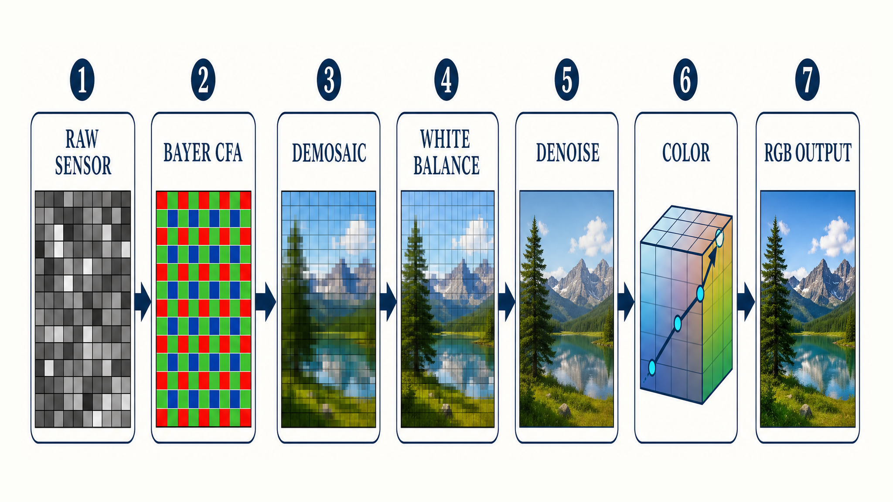

*图：RAW传感器采样先经过Bayer CFA解释与去马赛克，再通过白平衡、去噪和颜色变换得到可显示的RGB结果。*

</div>

具体顺序和算法由相机、手机及软件定义，不能把某一条流程当成所有设备的公开实现。

### 3.AIGC场景中的选择

直接使用 RGB/JPEG 训练更方便，但模型会同时学习相机 ISP 风格、锐化、降噪和压缩痕迹。使用 RAW 可以保留更多物理信息，适合低照度增强、计算摄影和可控成像，但需要统一传感器响应、曝光、白平衡与去马赛克流程。

**真正需要对齐的不是“.raw”或“.jpg”后缀，而是从光子测量到模型张量之间的完整成像链路。**

<h2 id="img-basic-q-007">7.透明图与普通图像有什么区别？Alpha合成有哪些常见陷阱？</h2>

**难度评分：⭐⭐⭐ (3/5)  |  考察频率：⭐⭐⭐⭐ (4/5)**

透明图与普通图的核心差异，是是否携带独立的覆盖度/透明度信息。Alpha不是“删除背景后的空白”，而是参与像素合成的数值通道；如果读取、预乘和背景填充约定不一致，就会产生黑边、白边和颜色污染。

### 1.Alpha通道与合成公式

将前景颜色记为 $`C_s`$、背景颜色记为 $`C_b`$，Alpha归一化为 $\alpha\in[0,1]$，最基本的前景覆盖合成是：

```math
C_{\mathrm{out}}=
\alpha C_s+(1-\alpha)C_b
```

$\alpha=0$ 表示完全透明，$\alpha=1$ 表示完全不透明。8-bit Alpha通常用 0—255 编码，但参与计算时一般会转换到 0—1。

### 2.Straight Alpha与Premultiplied Alpha

- **Straight Alpha**：RGB保存原始前景颜色，合成时再乘 Alpha。
- **Premultiplied Alpha**：RGB已经预先乘过 Alpha，合成时不能再次相乘。

两种约定本身都正确，混用才是问题。为了得到物理上更合理的边缘，Alpha合成还应在合适的线性光空间完成，而不是机械地在非线性显示编码值上相加。

### 3.格式与数据集陷阱

PNG、WebP、AVIF通常可支持连续 Alpha；GIF传统上主要依赖单个透明索引，难以表达平滑半透明。标准 JPEG 不保存 Alpha。BMP/TIFF能否保存 Alpha取决于具体变体和读取器约定，不能只看扩展名。

完全透明像素仍可能保留隐藏 RGB。若训练前直接丢弃 Alpha，透明区的黑色或白色底可能被模型学成轮廓光晕。AIGC透明素材应明确采用保留 Alpha、预乘，还是合成到固定/随机背景，并保证训练与推理一致。

<h2 id="img-basic-q-008">8.JPEG、PNG、WebP、AVIF、TIFF和OpenEXR应该如何选择？</h2>

**难度评分：⭐⭐⭐ (3/5)  |  考察频率：⭐⭐⭐⭐⭐ (5/5)**

图像格式选择不是“哪个更先进”，而是压缩损失、解码兼容性、位深、透明度、HDR、元数据和工作流成本之间的权衡。更重要的是，**文件格式、像素数据、色彩空间和编码质量是四个不同变量。**

<div align="center">

| 格式 | 压缩特性 | Alpha/高位深 | 典型优势 | 主要边界 |
|---|---|---|---|---|
| JPEG | 典型为有损DCT压缩 | 标准流程无Alpha，通常8-bit | 照片体积小、兼容性高 | 文字边缘、反复保存和高频纹理易产生伪影 |
| PNG | 无损压缩 | 支持Alpha，常见8/16-bit | 图标、截图、掩码、透明资产 | 照片体积通常大于有损格式 |
| WebP | 有损或无损 | 支持Alpha与动画 | Web分发效率与兼容性较平衡 | 工具链和参数会影响一致性 |
| AVIF | 基于AV1图像编码 | 可支持Alpha、高位深与HDR | 高压缩效率、现代分发 | 编解码成本和旧环境兼容性需验证 |
| TIFF | 容器能力强，可无损或不压缩 | 常支持高位深、多页和丰富元数据 | 扫描、出版、专业中间文件 | 变体多、体积大、读取约定不完全统一 |
| OpenEXR | 面向浮点与多通道数据 | FP16/FP32、多层多通道 | VFX、渲染、HDR中间资产 | 不适合作为普通网页图片格式 |

</div>

### 1.压缩如何改变模型数据

JPEG量化会削弱或重排部分高频信息，并可能产生块效应、振铃和色度子采样痕迹。反复解码再保存会累积损失。PNG虽然无损，但不能恢复源图在更早阶段已经丢失的信息。AVIF/WebP的质量参数也不是可与JPEG质量值直接横向对应的统一标尺。

### 2.AIGC工程中的选择原则

- 照片分发：在兼容性和体积之间选择 JPEG、WebP 或 AVIF；
- 透明素材、掩码、文字截图：优先考虑 PNG 或经过验证的无损 WebP；
- 高位深调色、科学或渲染中间结果：选择 TIFF/OpenEXR 等能保留精度的格式；
- 训练数据：记录解码器版本、色彩配置、Alpha策略和压缩质量，避免数据集按来源形成可被模型“投机学习”的格式指纹。

格式只是交付容器。对模型而言，决定分布的是解码后真正得到的像素、颜色、噪声和压缩伪影。

<h2 id="img-basic-q-009">9.图像采样、缩放与混叠是什么？为什么缩小图像前要低通滤波？</h2>

**难度评分：⭐⭐⭐ (3/5)  |  考察频率：⭐⭐⭐⭐ (4/5)**

缩放不是简单地“增加或删除像素”。从信号处理角度看，缩小图像是在降低空间采样率；如果原图仍包含超过新采样网格承载能力的高频分量，这些信息不会正确消失，而会折叠成错误的低频纹理，这就是混叠。

### 1.采样与奈奎斯特条件

对一维信号，若最高频率为 $`f_{\max}`$，采样频率 $`f_s`$ 至少应满足：

```math
f_s\ge 2f_{\max}
```

二维图像需要在水平和垂直方向共同考虑这一条件。细密条纹、织物、栅栏和规则纹理在缩小时出现摩尔纹、锯齿或闪烁，通常就是采样率下降后发生了混叠。

### 2.为什么下采样前要低通滤波

正确的下采样通常先用低通滤波器去除新奈奎斯特频率以上的内容，再减少像素。否则，高频能量会错误映射到低频，后续即使再放大也难以恢复。抗混叠不是让图像“故意变糊”，而是在信息容量下降前，主动删除无法被新网格正确表达的频率。

<div align="center">

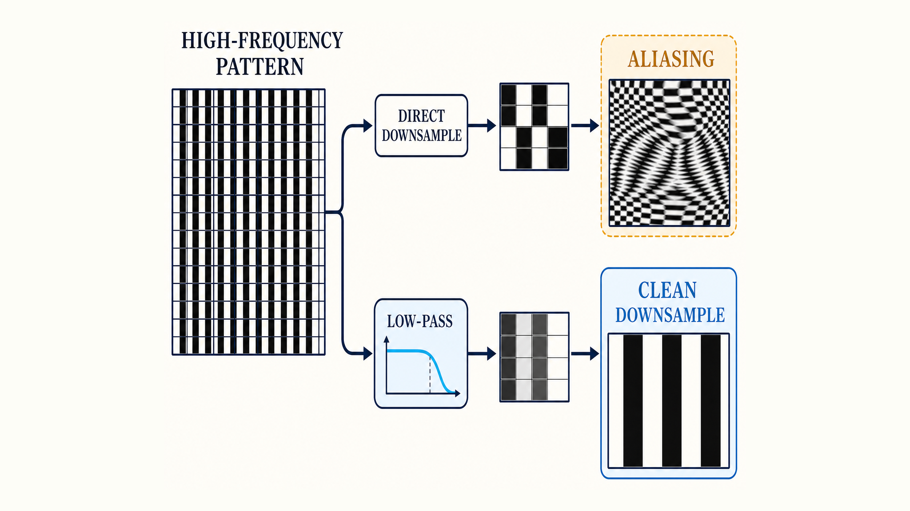

*图：高频纹理直接降采样会折叠成错误的摩尔纹；先低通再降采样，才能让输出频率落入新采样网格的表达范围。*

</div>

### 3.常见插值方法的边界

- 最近邻：保留硬边，适合离散标签和像素艺术，但容易产生阶梯；
- 双线性：速度快、结果平滑，但可能损失细节；
- 双三次/Lanczos：通常更锐利，但参数不当会产生振铃；
- Area类方法：常用于稳定缩小；
- 学习式超分：可以生成可信细节，但生成的细节不等于原图真实信息。

分割掩码、深度图、法线图和自然图像不能机械地共用同一种插值。尤其是类别掩码，使用连续插值会制造不存在的类别编号。

<h2 id="img-basic-q-010">10.图像中的低频与高频信息分别是什么？</h2>

**难度评分：⭐⭐⭐⭐ (4/5)  |  考察频率：⭐⭐⭐⭐ (4/5)**

低频与高频描述的是像素随空间位置变化的快慢，而不是“重要信息”和“不重要信息”的同义词。低频通常承载大范围亮度、色块和缓慢变化的结构；高频通常对应边缘、细纹理、锐利文字，也可能来自噪声、压缩振铃和锯齿。

### 1.空间域与频域视角

灰度图 $I(x,y)$ 的二维离散傅里叶变换可以写为：

```math
F(u,v)=
\sum_{x=0}^{M-1}\sum_{y=0}^{N-1}
I(x,y)
\exp\left[
-2\pi \mathrm{i}
\left(
\frac{ux}{M}+\frac{vy}{N}
\right)
\right]
```

频谱中心附近通常表示缓慢变化分量，远离中心的位置表示更快的空间变化，前提是做过相应的频谱移位。傅里叶频谱不是“梯度分布图”的简单等价物：梯度运算会强化高频，但频域描述的是整幅图在不同空间频率基函数上的投影。

### 2.高频不等于细节，低频也不等于背景

- 清晰轮廓、头发丝和小字号文字包含大量高频；
- 随机噪声、JPEG振铃同样可能是高频；
- 大面积光照、天空渐变和主体整体轮廓主要由低频支撑；
- “主体/背景”是语义划分，“高频/低频”是信号变化尺度划分，二者不能直接对应。

### 3.与AIGC模型的关系

VAE压缩、下采样和有限分辨率会优先挑战细小文字与高频纹理；扩散或流模型的不同时间阶段也会呈现由整体结构到局部细节逐步成形的现象，但不能机械地把时间步与某个固定频段一一绑定。训练中过度强调像素损失容易得到平滑结果，过度追求锐度又可能放大伪细节和噪声。

**面试中可收束为：频率分析提供的是图像变化尺度，不提供语义答案；高质量生成需要同时守住低频结构和可信高频。**

<h2 id="img-basic-q-011">11.什么是图像信噪比？SNR高是否一定代表视觉质量好？</h2>

**难度评分：⭐⭐⭐ (3/5)  |  考察频率：⭐⭐⭐⭐ (4/5)**

信噪比衡量有用信号功率相对于噪声功率的大小。若干净信号为 $S$、观测图像为 $I=S+N$、噪声为 $N$，一种常见定义是：

```math
\mathrm{SNR}=10\log_{10}
\left(
\frac{\sum S^2}{\sum N^2}
\right)
```

单位通常为 dB。若使用的是幅值比而非功率比，相应形式会使用 $`20\log_{10}`$。实际工程必须说明信号与噪声如何定义，不能只报告一个脱离估计方法的 SNR 数字。

### 1.没有干净参考图时如何估计

真实照片往往没有同场景的无噪声真值。此时可能在均匀区域估计噪声方差，或使用相机噪声模型、重复曝光、盲噪声估计网络。用图像均值平方除以噪声方差只在特定平稳假设下成立，并不是所有图像的通用真理。

### 2.SNR与PSNR的区别

SNR关注信号相对噪声，信号功率来自参考信号本身；PSNR通常使用允许的峰值强度与均方误差之比，常用于比较重建图和参考图。二者都依赖误差定义，也都不能完整覆盖感知质量、语义正确性和审美偏好。

### 3.SNR高为什么不一定更好

一个强去噪模型可能通过抹掉皮肤纹理、毛发和文字边缘获得更高的数值 SNR，却让图像变得蜡化。AIGC模型还可能生成视觉上自然但参考图中不存在的细节，这类结果无法只用传统噪声模型判断。

因此，SNR适合评价受控成像和噪声抑制，不应替代结构、感知、文本遵循和人工偏好评价。**指标真正有价值的地方，不是给复杂画质下一个单分数结论，而是回答具体哪类误差被减少了。**

<h2 id="img-basic-q-012">12.什么是图像畸变？径向畸变、切向畸变和透视变形有什么区别？</h2>

**难度评分：⭐⭐⭐⭐ (4/5)  |  考察频率：⭐⭐⭐ (3/5)**

图像畸变是实际成像位置相对理想成像模型发生的系统性偏移。它通常改变几何形状和位置关系，不一定直接降低局部清晰度。工程上最常见的是镜头径向畸变和切向畸变，而透视变形来自相机姿态与三维投影关系，不能简单用同一组镜头系数解释。

### 1.径向畸变

径向畸变随像点到主点的距离变化：

- **桶形畸变**：边缘向外鼓，直线看起来向外弯；
- **枕形畸变**：边缘向内收，直线看起来向内弯；
- **复合/波浪畸变**：不同半径区域呈现不同方向的弯曲。

### 2.切向畸变

切向畸变主要来自镜头与传感器平面未完全同轴。令归一化坐标为 $(x,y)$，$r^2=x^2+y^2$，一种常见模型为：

```math
\begin{aligned}
x_d={}&x\left(1+k_1r^2+k_2r^4+k_3r^6\right)
+2p_1xy+p_2\left(r^2+2x^2\right),\\
y_d={}&y\left(1+k_1r^2+k_2r^4+k_3r^6\right)
+p_1\left(r^2+2y^2\right)+2p_2xy.
\end{aligned}
```

其中，$`k_1,k_2,k_3`$ 是径向畸变系数，$`p_1,p_2`$ 是切向畸变系数。不同相机模型还可能使用鱼眼等其他投影方程，不能把这套多项式模型外推到所有镜头。

### 3.透视变形与其他几何误差

平行线在图像中汇聚、近大远小，主要来自透视投影和相机姿态；滚动快门弯曲则与传感器逐行曝光和运动有关。它们可能与镜头畸变同时存在，但校正机制不同。

<div align="center">

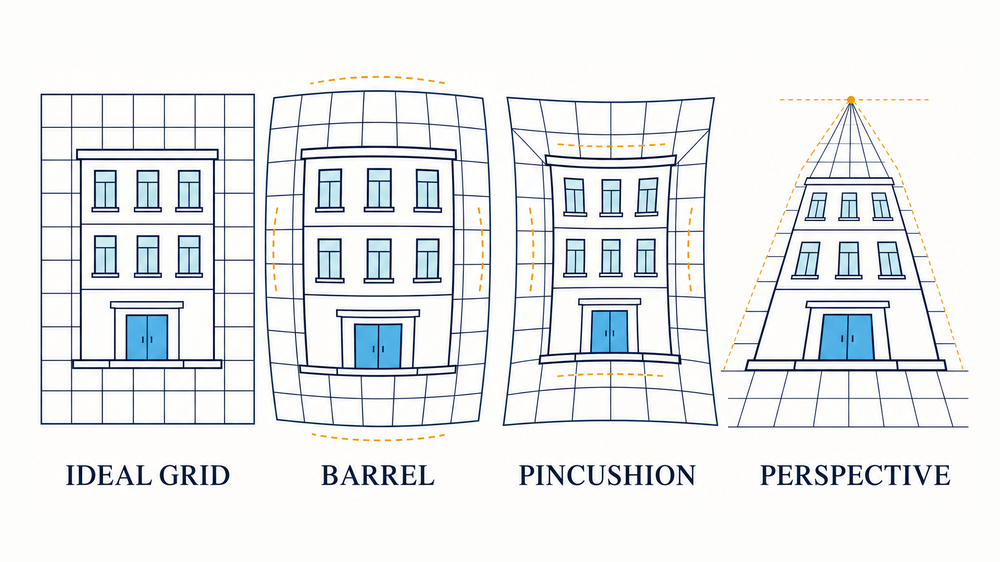

*图：桶形和枕形畸变表现为随半径变化的曲线弯曲，透视变形则表现为平行线向消失点汇聚，二者不能混用同一套校正解释。*

</div>

标定通常通过已知几何图案估计内参和畸变系数，再做反向映射与重采样。校正会牺牲部分边缘视野，并引入插值和空白区域。AIGC训练数据若混入未统一的广角畸变，模型可能把镜头偏差当作特定场景风格，进而影响人物比例、建筑直线和多视图一致性。

<h2 id="img-basic-q-013">13.AIGC图像模型的输入预处理为什么必须保持训练与推理一致？</h2>

**难度评分：⭐⭐⭐⭐ (4/5)  |  考察频率：⭐⭐⭐⭐⭐ (5/5)**

同一张图片进入不同代码路径后出现色偏、构图变化、细节损失，很多时候不是底模差异，而是输入合同不同。**预处理不是模型外的一层清洁工作，而是模型实际数据分布的一部分。训练和推理只要在解码、颜色、尺寸或归一化上错开一步，就会制造分布偏移。**

### 1.完整输入链路

一条可复现的AIGC图像输入链路通常包括：

1. **文件解码**：固定解码器行为，处理损坏文件、动画帧和高位深图像；
2. **方向统一**：读取 EXIF Orientation，并把方向真正应用到像素；
3. **颜色管理**：读取 ICC 配置，转换到明确的工作色彩空间；
4. **Alpha处理**：保留、预乘，或合成到明确背景，不能默认静默丢弃；
5. **尺寸策略**：按长宽比分桶，执行 resize、crop 或 pad，并记录插值与抗混叠设置；
6. **张量转换**：统一 RGB/BGR、HWC/CHW、数据类型和数值范围；
7. **模型约束**：满足编码器总步幅、Patch大小或批处理对齐要求；
8. **增强与批处理**：保证掩码、框、关键点和条件图执行相同几何变换。

### 2.典型故障与根因

<div align="center">

| 现象 | 常见根因 | 应检查的合同 |
|---|---|---|
| 整体红蓝颠倒 | RGB/BGR混用 | 通道顺序 |
| 画面发灰或明暗异常 | Gamma、线性光或范围处理错误 | 色彩空间与传递函数 |
| 主体被截断 | 中心裁剪与长宽比分桶不一致 | resize/crop/pad策略 |
| 透明边缘出现黑白光晕 | Alpha被丢弃或预乘约定不一致 | Alpha与背景策略 |
| 掩码边缘出现新类别 | 对离散标签使用双线性插值 | 条件数据插值方式 |
| 训练正常、线上退化 | 训练和服务端解码/归一化不同 | 端到端版本与参数 |

</div>

### 3.如何建立可验证的预处理契约

- 将每一步写成带版本的配置，而不是散落在数据脚本和服务代码中；
- 为代表性样本保存解码后像素、预处理张量统计和可视化回读；
- 对训练端、离线评测端和线上推理端做同图逐像素或容差对比；
- 记录原始尺寸、裁剪框、色彩配置、Alpha策略和随机增强种子；
- 把极端长宽比、透明图、CMYK JPEG、16-bit PNG、EXIF旋转图和损坏文件加入回归测试。

Rocky认为，AIGC图像工程真正的基本功，不是记住某个框架的一组默认参数，而是把“文件到张量、张量到模型、模型到交付图”的数据合同做成可追踪、可复现、可回归的系统能力。模型会迭代，但输入分布治理具有跨周期价值。

---

## 第二章 图像经典处理技术高频考点正文

<h2 id="img-proc-q-001">1.图像卷积与互相关的区别是什么？卷积核、步幅、填充方式和边界处理如何影响输出？</h2>

**难度评分：⭐⭐⭐ (3/5)  |  考察频率：⭐⭐⭐⭐⭐ (5/5)**

卷积是经典图像处理的基础操作。平滑、锐化、梯度、模板匹配和许多神经网络层，都可以理解为用一个局部核在图像上滑动并聚合邻域信息。真正容易出错的不是会不会套公式，而是没有分清卷积、互相关、边界扩展和输出尺寸约定。

### 1.卷积与互相关

二维离散卷积可以写为：

```math
g(x,y)=
\sum_i\sum_j
K(i,j)f(x-i,y-j)
```

卷积在计算时会翻转核；互相关则通常使用 $f(x+i,y+j)$，不翻转核。许多计算机视觉库和深度学习框架名为“卷积”的算子，实际执行的是互相关。对于高斯等中心对称核，两者结果相同；对方向性梯度核，翻转会改变响应符号。

<div align="center">

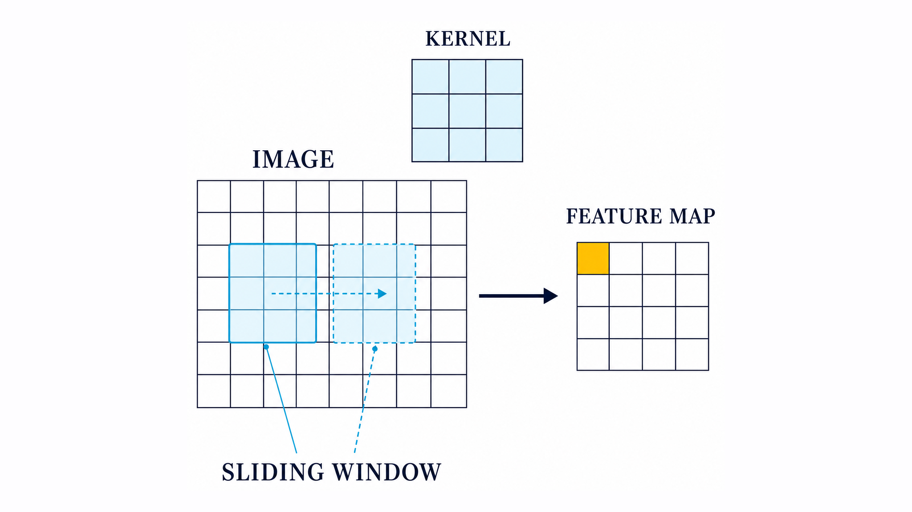

*图：卷积或互相关都以局部窗口为基本计算单元；窗口与核完成一次聚合后，对应写入特征图中的一个响应位置。*

</div>

### 2.四个决定输出的工程参数

- **核大小与权重**：决定感受范围和频率响应。大核覆盖范围更广，但计算量和边界影响也更大。
- **步幅**：决定核每次移动的距离。步幅大于1会同时执行特征提取与下采样，可能带来混叠。
- **填充**：`valid`不补边，输出会缩小；`same`通常试图保持空间尺寸，但奇偶核、步幅和框架定义会影响精确结果。
- **边界模式**：零填充、复制、镜像、循环会产生不同边缘统计。零填充可能制造暗边，循环填充适合周期信号但不适合普通照片。

### 3.卷积核必须满足任务约束

平滑核通常权重非负且和为1，以避免整体亮度漂移；微分和高通核的系数和通常接近0，以抑制常量区域。核是否可分离也影响效率，例如二维高斯核可以拆成横向和纵向两次一维滤波，将计算复杂度显著降低。

**面试中可以这样收束：卷积不是一个孤立公式，而是一套局部线性系统；核、步幅、填充和边界共同定义了它真正实现的变换。**

<h2 id="img-proc-q-002">2.图像点运算如何调整亮度、对比度和Gamma？</h2>

**难度评分：⭐⭐ (2/5)  |  考察频率：⭐⭐⭐⭐ (4/5)**

点运算只根据当前像素值计算输出，不直接访问邻域。它计算简单，却是曝光校正、对比度拉伸、掩码处理和模型前后处理的基础。与卷积相比，点运算改变的是灰度映射，不改变像素的空间位置。

### 1.线性亮度与对比度变换

最常见的形式是：

```math
s=\alpha r+\beta
```

$\alpha$ 控制对比度，$\beta$ 控制整体偏移。结果必须根据目标数据类型裁剪或重新映射；若直接写回 `uint8` 而未处理溢出，可能发生截断或取模，得到与预期完全不同的颜色。

### 2.Gamma或幂律变换

对归一化强度 $r\in[0,1]$，幂律变换可写为：

```math
s=cr^{\gamma}
```

当 $\gamma$ 小于1时通常抬升暗部，大于1时通常压低中间调。这里的图像增强Gamma与颜色管理中的sRGB传递函数相关但不完全等价：不能把任意幂律增强当作严格的sRGB线性化。

### 3.常见点运算

- 反相：用于掩码和胶片式表示；
- 分段线性拉伸：只增强指定强度区间；
- 阈值与截断：将连续强度映射为有限区间；
- 归一化与标准化：服务于显示或模型输入，但必须说明是按图、按通道还是按数据集统计；
- 查找表：把固定映射预计算，适合实时部署。

对AIGC素材做增强时，应先明确当前数据处于线性光还是显示编码空间。**同一个数学变换作用在不同颜色编码上，视觉和物理含义并不相同。**

<h2 id="img-proc-q-003">3.什么是图像直方图？直方图均衡化与CLAHE有什么区别？</h2>

**难度评分：⭐⭐⭐ (3/5)  |  考察频率：⭐⭐⭐⭐ (4/5)**

直方图统计每个强度区间出现的次数或概率，它描述全局灰度分布，却不保存像素位置。因此，两张构图完全不同的图像可能拥有相似直方图。直方图适合分析曝光与对比度，但不能替代结构和语义评价。

### 1.直方图均衡化

设灰度级概率为 $p(k)$，累积分布函数为：

```math
F(k)=\sum_{j=0}^{k}p(j)
```

直方图均衡化使用累积分布重新映射灰度，使输出更充分利用可用强度范围。它对低对比度灰度图有效，但全局操作可能放大噪声、改变亮度观感，并在彩色图像逐RGB通道处理时引入色偏。

### 2.CLAHE为什么更稳定

CLAHE将图像划分为局部网格，对每个区域做限制对比度的均衡化，再对网格结果插值。裁剪直方图可以抑制局部噪声被无限放大，适合光照不均的文档、医学图像和低照度场景。

### 3.彩色图像如何处理

通常不直接分别均衡RGB三个通道，而是转换到能分离亮度与色度的表示，只处理亮度类分量，再转换回来。转换时仍需明确色彩空间、白点和取值范围。

在AIGC数据增强中，直方图匹配和CLAHE可以模拟曝光域差异，但参数过强会制造不自然的局部对比度，形成训练分布中不存在的“处理风格”。

<h2 id="img-proc-q-004">4.图像二值化的原理是什么？全局阈值、Otsu和自适应阈值如何选择？</h2>

**难度评分：⭐⭐⭐ (3/5)  |  考察频率：⭐⭐⭐⭐⭐ (5/5)**

二值化把连续灰度或概率映射为前景与背景两类。它的难点不在输出是0/1还是0/255，而在阈值是否能稳定分离目标，并且不破坏细线、孔洞和边界。

### 1.基本阈值模型

```math
B(x,y)=
\begin{cases}
1,&I(x,y)\ge T,\\
0,&I(x,y)\lt T.
\end{cases}
```

如果前景更暗，可以反转判定。输出值选择0/1、0/255或布尔类型取决于后续接口，不能混用后直接参与算术运算。

### 2.常用方法的适用边界

<div align="center">

| 方法 | 阈值来源 | 优势 | 主要边界 |
|---|---|---|---|
| 固定全局阈值 | 人工或业务规则 | 快、可解释、部署稳定 | 对曝光和背景变化敏感 |
| Otsu | 最大化类间方差 | 无需手工给阈值 | 更适合前景背景近似双峰的直方图 |
| 自适应均值/高斯阈值 | 局部邻域统计减常数 | 能处理缓慢变化的光照 | 窗口和偏置不当会切碎目标或放大纹理 |
| 多级阈值 | 多个类别边界 | 可分离多个强度层 | 类别数和稳定性更难确定 |

</div>

Otsu的核心目标可以表示为最大化类间方差：

```math
\sigma_B^2(T)=
\omega_0(T)\omega_1(T)
\left[\mu_0(T)-\mu_1(T)\right]^2
```

### 3.二值化之后还要验证什么

不能只看前景比例。应结合任务检查连通域数量、孔洞、细线召回、边界偏移和小目标损失。AIGC编辑中的mask二值化还要区分硬掩码与软Alpha：硬阈值便于区域逻辑，软边缘更适合自然合成，二者不应互相替代。

<h2 id="img-proc-q-005">5.图像噪声有哪些主要类型？如何根据成像机制建立噪声模型？</h2>

**难度评分：⭐⭐⭐ (3/5)  |  考察频率：⭐⭐⭐⭐ (4/5)**

噪声不是一个统一的“随机点”类别。只有先判断它来自光子统计、传感器读出、传输错误、压缩、量化还是模型攻击，才能选择正确的处理方式。按名称列十几种分布，却不说明生成机制，对工程选型帮助很小。

<div align="center">

| 噪声/伪影 | 典型机制 | 常见表现 | 适合的建模思路 |
|---|---|---|---|
| 高斯加性噪声 | 读出与电子噪声近似 | 全图连续颗粒 | $I=S+N$，噪声方差近似稳定 |
| 泊松/散粒噪声 | 光子到达计数 | 暗部相对更明显，方差依赖信号 | 计数过程或Poisson-Gaussian联合模型 |
| 椒盐/脉冲噪声 | 传输错误、坏点 | 随机极黑或极白像素 | 稀疏异常值模型 |
| 乘性/散斑噪声 | 相干成像、增益扰动 | 噪声强度随信号变化 | $I=S(1+N)$ 或对数域近似 |
| 条带与固定模式噪声 | 行列增益、传感器偏置 | 规则横竖条纹 | 结构化偏置或频域峰值 |
| 压缩伪影 | 量化、块变换、色度子采样 | 块效应、振铃、颜色渗漏 | 编解码退化模型，而非单纯随机噪声 |

</div>

### 1.真实相机噪声通常是混合的

真实RAW噪声常同时包含与信号相关的散粒噪声和近似与信号无关的读出噪声；经过ISP、去马赛克、锐化和压缩后，噪声还会变得空间相关。训练去噪模型时只叠加固定方差白高斯噪声，往往无法覆盖真实照片。

### 2.对抗扰动不是普通成像噪声

白盒、黑盒和物理对抗扰动属于安全与鲁棒性问题，其目标是诱导模型决策，而不是模拟传感器随机误差。二者可以在同一系统中评测，但不应混为一种噪声分布。

<h2 id="img-proc-q-006">6.均值、高斯、中值、双边和引导滤波有什么区别？</h2>

**难度评分：⭐⭐⭐ (3/5)  |  考察频率：⭐⭐⭐⭐⭐ (5/5)**

平滑算法本质上都在利用局部或引导信息降低变化，但它们对边缘、离群点和纹理的假设不同。不存在对所有噪声都最好的滤波器，只有与噪声模型和交付目标匹配的选择。

### 1.高斯滤波的机制

二维各向同性高斯核为：

```math
G(x,y)=
\frac{1}{2\pi\sigma^2}
\exp\left(
-\frac{x^2+y^2}{2\sigma^2}
\right)
```

$\sigma$ 越大，平滑尺度越大。高斯核可分离为横向和纵向两个一维核，因此能以更低成本实现大范围平滑。它适合近似高斯噪声和抗混叠预滤波，但也会跨越边缘平均。

<div align="center">

| 方法 | 类型 | 权重依据 | 更适合 | 主要代价 |
|---|---|---|---|---|
| 均值滤波 | 线性局部 | 邻域等权平均 | 快速基线、弱随机噪声 | 模糊边缘，受离群点影响 |
| 高斯滤波 | 线性局部 | 空间距离 | 平稳噪声、尺度空间 | 仍会平滑细节 |
| 中值滤波 | 非线性局部 | 邻域排序取中值 | 椒盐与脉冲噪声 | 大窗口会破坏细线和纹理 |
| 双边滤波 | 非线性局部 | 空间距离与颜色差 | 保边平滑 | 参数敏感，计算更重，可能产生梯度反转 |
| 引导滤波 | 局部线性模型 | 引导图结构 | 抠图、细化、保边平滑 | 引导图错误会传递结构 |

</div>

中值滤波不是线性卷积；双边滤波也不能简单称为低通滤波器，因为权重依赖图像内容。面试回答应把“线性/非线性、局部/非局部、是否保边”三组边界说清楚。

<h2 id="img-proc-q-007">7.NLM、小波、BM3D、全变分和维纳滤波如何进行图像去噪？</h2>

**难度评分：⭐⭐⭐⭐ (4/5)  |  考察频率：⭐⭐⭐⭐ (4/5)**

局部滤波只利用附近像素，而更强的经典去噪方法会利用非局部自相似、变换域稀疏性或显式先验。它们的共同目标不是简单压低方差，而是在去除随机扰动的同时保住结构和纹理。

### 1.主要方法

- **NLM（Non-Local Means）**：在更大搜索区域寻找相似patch，按相似度加权平均。重复纹理上有效，但计算量大，patch距离受噪声估计影响。
- **小波阈值去噪**：把图像分解到多尺度小波系数，对较小系数做硬阈值或软阈值，再重建。适合稀疏变换表示，但阈值过强会产生振铃或纹理损失。
- **BM3D**：将相似patch堆叠为三维组，在变换域协同收缩，再聚合回图像。对白高斯噪声是强经典基线，但噪声标准差估计和真实噪声失配会影响效果。
- **全变分去噪**：通过数据一致项和总变分正则抑制振荡，擅长保留分段平滑边缘，但可能产生阶梯效应。
- **维纳滤波**：根据模糊/信号与噪声功率谱，在抑噪和逆滤波之间做最小均方误差权衡。

### 2.如何选择而不是背名单

先判断噪声是否加性、信号相关、稀疏脉冲或结构化，再决定方法。真实业务还要同时报告边缘保持、纹理真实性、颜色稳定、运行时延和参数鲁棒性。只追求PSNR可能奖励过度平滑；只追求锐度又可能保留噪声或生成伪纹理。

经典去噪的跨周期价值在于它把先验写得清楚：局部平滑、非局部重复、变换稀疏或总变分。即使最终使用深度模型，这些先验仍然帮助定位失败原因和构建基线。

<h2 id="img-proc-q-008">8.图像模糊的退化模型是什么？逆滤波、维纳反卷积和Richardson-Lucy如何恢复图像？</h2>

**难度评分：⭐⭐⭐⭐ (4/5)  |  考察频率：⭐⭐⭐ (3/5)**

去模糊不是普通锐化。锐化可以提高边缘对比度，却不一定反演成像过程；图像恢复则从明确的点扩散函数、运动轨迹和噪声模型出发，估计退化前图像。

### 1.经典退化模型

```math
y=k*x+n
```

$x$ 是潜在清晰图像，$k$ 是点扩散函数或模糊核，$n$ 是噪声，星号表示卷积。运动模糊、散焦和大气扰动对应不同的核；若核未知，就进入更困难的盲去卷积问题。

### 2.三类恢复方法

- **逆滤波**：在频域直接除以模糊传递函数。只要某些频率接近零，噪声就会被剧烈放大，因此很少在真实噪声下单独使用。
- **维纳反卷积**：根据噪声与信号功率比抑制不稳定频率，在恢复细节与放大噪声之间折中。
- **Richardson-Lucy**：基于Poisson似然进行非负迭代更新，常用于天文、显微等计数成像；迭代过多会放大噪声和振铃。

一种简化维纳形式为：

```math
\widehat{X}(u,v)=
\frac{H^*(u,v)}
{\lvert H(u,v)\rvert^2+K}
Y(u,v)
```

$K$ 近似表达噪声与信号功率比。实际系统中核估计错误往往比公式本身更致命。

### 3.恢复结果如何判断

除了PSNR/SSIM，还要检查振铃、重影、噪声放大和文字结构。AIGC增强模型可能生成视觉上合理的新细节，但这不等于恢复了真实观测信息；在证据敏感的医学、司法和工业场景中必须明确“恢复”与“生成”的边界。

<h2 id="img-proc-q-009">9.Roberts、Prewitt、Sobel和Scharr一阶梯度算子有什么区别？</h2>

**难度评分：⭐⭐⭐ (3/5)  |  考察频率：⭐⭐⭐⭐⭐ (5/5)**

一阶梯度描述图像强度增长最快的方向，边缘通常对应梯度幅值较大的位置。令水平和垂直响应为 $`G_x`$、$`G_y`$：

```math
\nabla I=
\begin{bmatrix}G_x\\G_y\end{bmatrix},
\qquad
M=\sqrt{G_x^2+G_y^2},
\qquad
\theta=\mathrm{atan2}(G_y,G_x)
```

### 1.算子差异

<div align="center">

| 算子 | 核与方向特点 | 优势 | 主要边界 |
|---|---|---|---|
| Roberts | 2×2交叉差分，偏45度方向 | 极简、定位紧凑 | 对噪声敏感，方向覆盖有限 |
| Prewitt | 3×3均匀平滑加差分 | 简单、比Roberts稳健 | 旋转一致性与精度一般 |
| Sobel | 3×3加权平滑加差分 | 抗噪与计算成本平衡 | 边缘可能较宽，方向近似有误差 |
| Scharr | 优化3×3方向响应 | 小核下旋转一致性通常优于Sobel | 仍是局部微分，不能自动形成完整轮廓 |

</div>

Sobel核可理解为一个方向做差分，正交方向做近似平滑。它并不等于先执行完整高斯模糊再求导，但具有一定平滑作用。

### 2.为什么梯度图不等于最终边缘图

梯度幅值会同时响应真实轮廓、纹理和噪声，还会产生多像素宽的边缘。要获得可用轮廓，通常还需要方向处理、非极大值抑制、阈值和连通性分析。面试中不能把“Sobel输出”与“完整边缘检测结果”画等号。

<h2 id="img-proc-q-010">10.拉普拉斯、LoG和DoG算子的原理与局限是什么？</h2>

**难度评分：⭐⭐⭐⭐ (4/5)  |  考察频率：⭐⭐⭐⭐ (4/5)**

拉普拉斯是二阶微分算子，对各方向强度变化做汇总：

```math
\nabla^2 I=
\frac{\partial^2 I}{\partial x^2}+
\frac{\partial^2 I}{\partial y^2}
```

它对孤立点、细线和快速变化敏感，可用于锐化或通过零交叉寻找边缘，但也会更强地放大高频噪声。不能简单断言二阶算子一定比一阶算子“定位更准”，结果取决于噪声、尺度、离散核和后处理。

### 1.Laplacian、LoG与DoG

- **Laplacian**：直接计算二阶响应，速度快，对噪声最敏感。
- **LoG（Laplacian of Gaussian）**：先用高斯核在指定尺度平滑，再计算拉普拉斯，通过零交叉检测边缘或斑点。
- **DoG（Difference of Gaussians）**：用两个不同尺度高斯结果之差近似尺度归一化LoG，计算更高效，也常用于尺度空间关键点。

### 2.锐化时的符号约定

离散拉普拉斯核可能使用中心为正或中心为负的约定。锐化时是加还是减拉普拉斯响应，必须与核符号一致。核系数和通常为0，所以常量区域响应为0；边界模式不当仍可能在图像四周制造假边缘。

### 3.为什么要显式选择尺度

小尺度保留细节但易响应噪声，大尺度抑噪但会合并相邻结构。LoG/DoG的关键不是“更复杂的算子”，而是把边缘和斑点检测放入尺度空间中理解。

<h2 id="img-proc-q-011">11.Canny边缘检测为什么要经过平滑、非极大值抑制和双阈值连接？</h2>

**难度评分：⭐⭐⭐⭐ (4/5)  |  考察频率：⭐⭐⭐⭐⭐ (5/5)**

Canny不是一个单独卷积核，而是一条把连续梯度响应变成细、连通、可控边缘的处理流水线。它试图在检测率、定位精度和单边缘响应之间取得平衡。

### 1.完整流程

1. **高斯平滑**：降低噪声对微分的放大，平滑尺度决定能检测多细的结构。
2. **梯度计算**：通常用Sobel类算子得到幅值和方向。
3. **非极大值抑制**：沿梯度方向只保留局部最大响应，把宽边缘压成近似单像素边缘。
4. **双阈值分类**：高于高阈值的是强边缘，介于高低阈值之间的是弱边缘，低于低阈值的被抑制。
5. **滞后连接**：只保留与强边缘通过邻域连通的弱边缘，减少孤立噪声响应。

<div align="center">

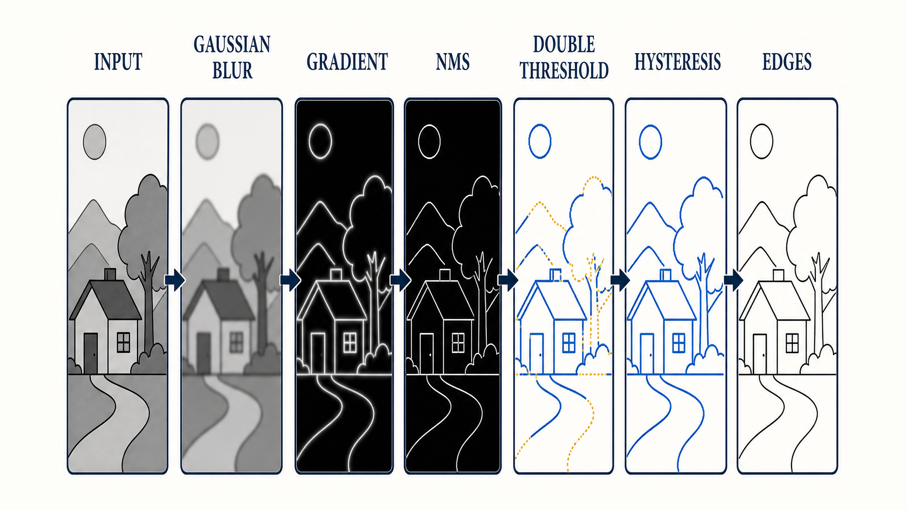

*图：Canny通过平滑抑噪、梯度响应、非极大值抑制、双阈值分类和滞后连接，把宽而连续的响应逐步收敛为细且连通的边缘。*

</div>

### 2.参数之间不是独立的

高斯 $\sigma$、低阈值和高阈值共同决定结果。增大平滑会减少噪声，同时丢失细边；降低阈值会提高召回，也会增加纹理响应。固定阈值跨曝光、跨分辨率使用通常不稳定，应结合归一化、分位数或验证集校准。

### 3.AIGC控制图中的边界

Canny图常用作结构条件，但它只表达局部边缘，不理解对象身份、遮挡顺序和真实深度。边缘过密会把纹理噪声也锁进生成过程，边缘过稀则失去结构约束。**经典边缘算子提供的是确定性几何提示，不是语义答案。**

<h2 id="img-proc-q-012">12.空间域与频率域滤波有什么关系？低通、高通、带通和陷波滤波器如何选择？</h2>

**难度评分：⭐⭐⭐⭐ (4/5)  |  考察频率：⭐⭐⭐⭐ (4/5)**

空间域卷积与频率域乘法是同一线性系统的两种表达。若图像频谱为 $F(u,v)$，滤波器频率响应为 $H(u,v)$：

```math
G(u,v)=H(u,v)F(u,v)
```

对大核或可通过FFT高效实现的滤波，频率域可能更有优势；对小核、局部非线性或需要复杂边界处理的任务，空间域通常更直接。

### 1.四类滤波器

- **低通**：保留缓慢变化成分，用于平滑、抗混叠和噪声抑制，但会损失边缘。
- **高通**：强调快速变化成分，用于锐化和细节增强，也会放大噪声。
- **带通/带阻**：保留或抑制某一频率范围，适合纹理分析和周期结构处理。
- **陷波**：在特定频率位置抑制窄带干扰，适合规则条纹和周期噪声。

### 2.理想、Butterworth与Gaussian响应

理想频域截断边界最硬，空间域容易产生Gibbs振铃；Butterworth用阶数控制过渡陡峭度；Gaussian响应平滑，振铃更弱，但频率选择不如硬截断尖锐。

### 3.傅里叶、DCT和小波的职责不同

傅里叶提供全局正弦基，适合分析周期频率；DCT常用于能量压缩和块编码；小波同时保留尺度与局部位置信息，适合多尺度去噪。形态学操作属于集合与局部结构运算，不应归为频域滤波。

<h2 id="img-proc-q-013">13.膨胀、腐蚀、开闭运算、形态学梯度、顶帽和黑帽分别有什么作用？</h2>

**难度评分：⭐⭐⭐ (3/5)  |  考察频率：⭐⭐⭐⭐⭐ (5/5)**

数学形态学用结构元素探测和修改目标形状。它不是“白色区域随便变大变小”，而是前景定义、结构元素形状、尺寸、锚点和迭代次数共同决定的集合运算。

### 1.膨胀与腐蚀

对二值前景集合 $A$ 和结构元素 $B$：

```math
\begin{aligned}
A\oplus B&=\left\{z\mid (\widehat{B})_z\cap A\ne\varnothing\right\},\\
A\ominus B&=\left\{z\mid B_z\subseteq A\right\}.
\end{aligned}
```

- 膨胀扩展前景，可连接近邻区域、填补窄缝，但也会合并本应分开的实例。
- 腐蚀收缩前景，可去除小前景点、断开细连接，但也会吞掉小目标。

### 2.组合运算

<div align="center">

| 运算 | 组合 | 常见作用 | 风险 |
|---|---|---|---|
| 开运算 | 先腐蚀后膨胀 | 去除小前景、断开细连接 | 小目标可能消失 |
| 闭运算 | 先膨胀后腐蚀 | 填小孔、连接窄断点 | 相邻实例可能粘连 |
| 形态学梯度 | 膨胀减腐蚀 | 提取目标边界带 | 边界宽度依赖结构元素 |
| 顶帽 | 原图减开运算 | 提取亮小结构 | 尺度选择不当会误提纹理 |
| 黑帽 | 闭运算减原图 | 提取暗小结构或孔洞 | 对背景趋势敏感 |

</div>

<div align="center">

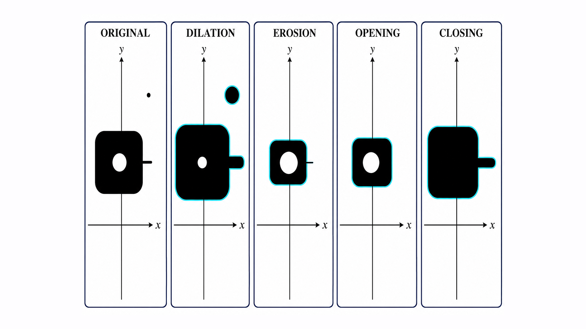

*图：膨胀与腐蚀分别扩张和收缩前景；开运算倾向于移除孤立点与细连接，闭运算倾向于填补小孔并连接窄缝。*

</div>

### 3.结构元素就是形状先验

矩形、椭圆、十字和方向性线段会产生不同结果。对于文字笔画、道路、发丝或孔洞，应根据目标尺度和方向选择结构元素，而不是默认反复使用3×3方块。

AIGC编辑mask的后处理中，形态学可修复小洞、扩展保护区和清理孤立点，但必须在验证集上控制边界位移，否则“修mask”会变成“改构图”。

<h2 id="img-proc-q-014">14.连通域、轮廓、距离变换、骨架化和分水岭如何分析目标结构？</h2>

**难度评分：⭐⭐⭐ (3/5)  |  考察频率：⭐⭐⭐⭐ (4/5)**

二值化和形态学之后，系统还需要把像素集合转换为可计算的对象。连通域、轮廓和距离变换承担的正是从“前景像素”到“实例结构”的桥梁。

### 1.连通域与轮廓

- **连通域标记**：按4邻域或8邻域把相连前景分组，输出实例标签、面积、质心和外接框。邻域定义不同，对角接触区域是否属于同一目标也不同。
- **轮廓提取**：沿边界生成有序点集，可进一步计算周长、面积、凸包、最小外接矩形和层级关系。轮廓依赖二值边界，噪声会制造大量短轮廓。

### 2.距离变换与骨架

距离变换为每个前景像素计算到最近背景的距离，可用于估计局部半径、寻找中心和构建软边缘。骨架化尝试把目标收缩为保持拓扑的中心线，适合文字、血管和道路，但对小毛刺敏感。

### 3.分水岭为什么既能分实例也会过分割

分水岭把图像或距离图视为地形，从标记或局部极小区域向外“灌水”。它能分开相互粘连的目标，但噪声产生的大量局部极小值会导致过分割，因此常配合平滑、形态学和可靠marker。

在AIGC数据清洗与编辑中，这些算法适合做mask质检、实例拆分、孔洞统计和边界缓冲。它们可解释、可回归，但无法仅凭像素连通性判断两个区域是否语义上属于同一对象。

<h2 id="img-proc-q-015">15.最近邻、双线性、双三次、Area和Lanczos插值如何选择？</h2>

**难度评分：⭐⭐⭐ (3/5)  |  考察频率：⭐⭐⭐⭐⭐ (5/5)**

插值回答的是“目标坐标落在源像素之间时如何估计数值”。它不会恢复原图中不存在的信息；学习式超分可以合成细节，但不能与确定性插值混为一类。

<div align="center">

| 方法 | 使用邻域与机制 | 优势 | 主要边界 | 更适合 |
|---|---|---|---|---|
| 最近邻 | 取最近源像素 | 最快、保持离散标签 | 锯齿和块状明显 | mask、类别图、像素艺术 |
| 双线性 | 2×2邻域线性加权 | 快且平滑 | 放大会模糊高频 | 常规图像和特征图 |
| 双三次 | 4×4邻域三次核 | 细节与平滑折中 | 更慢，可能过冲或振铃 | 照片缩放、高质量通用处理 |
| Area | 按源区域覆盖聚合 | 缩小较稳定 | 放大不具备恢复能力 | 下采样与面积平均 |
| Lanczos | 截断sinc核 | 锐利、频率保持较好 | 振铃，对噪声敏感 | 高质量照片重采样 |

</div>

### 1.缩小与放大不是同一个问题

缩小前需要抗混叠低通，重点是避免高频折叠；放大则是在稀疏采样之间估计值，重点是平滑度、锐度和伪影。不能只按“算法越复杂越好”排序。

### 2.几何映射应使用逆映射

实际缩放或旋转通常对每个输出像素反查源坐标，再执行插值。正向映射容易产生孔洞和覆盖冲突。还要固定像素中心、半像素偏移和 `align_corners` 类坐标约定，否则训练与部署即使都写“双线性”，结果也可能不一致。

### 3.AIGC中的选择

图像、mask、深度、法线、光流和特征图具有不同数值语义。mask常用最近邻或专门的软mask策略；深度和连续条件可用线性插值但要处理无效值；法线插值后通常要重新归一化。模型中间上采样还可能使用反卷积、PixelShuffle或学习式模块，不能笼统说扩散模型统一采用双三次插值。

<h2 id="img-proc-q-016">16.仿射变换、透视变换和通用重映射有什么区别？</h2>

**难度评分：⭐⭐⭐⭐ (4/5)  |  考察频率：⭐⭐⭐⭐⭐ (5/5)**

三者都在改变像素坐标，但约束强度不同。仿射变换保持直线和平行关系；透视变换保持直线但允许平行线汇聚；通用重映射则可以表达镜头畸变、流场和非刚性形变。

### 1.仿射变换

```math
\begin{bmatrix}x'\\y'\\1\end{bmatrix}=
\begin{bmatrix}
a_{11}&a_{12}&t_x\\
a_{21}&a_{22}&t_y\\
0&0&1
\end{bmatrix}
\begin{bmatrix}x\\y\\1\end{bmatrix}
```

二维仿射有6个自由参数，可组合平移、旋转、缩放、剪切和反射。三组不共线点对应可以确定一个仿射变换。

### 2.透视变换

透视变换使用3×3单应矩阵，在整体尺度不变意义下有8个自由度。四组一般位置的点对应可估计单应性。它适合文档矫正、平面广告牌替换和俯视变换，但只有当场景可近似为平面或相机仅发生旋转时，一个全局单应矩阵才足够。

### 3.通用重映射

重映射直接为每个输出像素提供源坐标，可表达径向畸变校正、稠密光流、局部扭曲和非刚性编辑。代价是需要更密集的映射场，并处理折叠、越界和插值。

所有几何变换都要同时作用于图像及其框、关键点、mask和控制图。只变图不变标注，会制造比模型噪声更隐蔽的数据错误。

<h2 id="img-proc-q-017">17.高斯金字塔、拉普拉斯金字塔和多尺度处理有什么价值？</h2>

**难度评分：⭐⭐⭐⭐ (4/5)  |  考察频率：⭐⭐⭐⭐ (4/5)**

图像中的目标具有不同尺度：人脸轮廓、眼睛、睫毛和皮肤纹理不能用同一个固定窗口同时描述。图像金字塔通过逐级平滑和采样，构建从整体结构到局部细节的多尺度表示。

### 1.高斯金字塔

每一层通常先低通再下采样：

```math
G_{l+1}=\mathrm{down}\left(G_l*g_{\sigma}\right)
```

它适合多尺度检测、粗到细估计和降低搜索成本。若只下采样不预滤波，会把混叠带入所有后续层级。

### 2.拉普拉斯金字塔

拉普拉斯层保存当前高斯层与下一层上采样结果之间的差：

```math
L_l=G_l-\mathrm{up}\left(G_{l+1}\right)
```

它近似表示不同尺度的带通细节，并可从最粗层逐级重建原图，常用于多频段融合、压缩和细节增强。

### 3.与AIGC多尺度机制的关系

经典金字塔不等于神经网络特征金字塔，也不能直接等同于扩散模型时间步，但它提供了重要直觉：低分辨率层更关注大结构，高分辨率层承载局部细节。高分辨率生成、分块重绘和多尺度条件控制都需要处理不同尺度之间的一致性，而不是只在最终像素层“补锐度”。

<h2 id="img-proc-q-018">18.Alpha融合、羽化、多频段融合和泊松融合有什么区别？</h2>

**难度评分：⭐⭐⭐⭐ (4/5)  |  考察频率：⭐⭐⭐⭐ (4/5)**

图像融合的目标不是把两张图平均，而是在颜色、边界、光照和纹理之间建立连续过渡。不同方法解决的冲突不同：Alpha控制覆盖权重，羽化处理窄边界，多频段融合按尺度组合，泊松融合则在梯度域传播结构。

<div align="center">

| 方法 | 核心机制 | 擅长 | 主要边界 |
|---|---|---|---|
| Alpha融合 | 按mask权重逐像素混合 | 可控透明度、图层合成 | 颜色和光照不匹配时仍有接缝 |
| 羽化 | 对边界mask做平滑过渡 | 快速弱化硬边 | 大范围亮度差仍明显，易产生虚边 |
| 多频段融合 | 不同金字塔尺度使用不同权重 | 全景拼接、跨尺度无缝过渡 | 实现和参数更复杂，可能引入重影 |
| 泊松融合 | 区域内部匹配源梯度，边界服从目标 | 纹理迁移与亮度渐变融合 | 颜色可能漂移，不适合必须保真Logo和文字 |

</div>

泊松融合的一种典型目标是：

```math
\min_f
\int_{\Omega}
\left\lVert \nabla f-v\right\rVert^2\,\mathrm{d}x,
\qquad
f\big|_{\partial\Omega}=f_{\mathrm{target}}
```

$v$ 通常来自源图梯度或混合梯度，边界条件来自目标图。它优化的是梯度一致性，不保证绝对颜色、身份细节或文字像素完全不变。

AIGC局部编辑中，融合方法应根据交付目标选择：人像皮肤和自然纹理可容忍梯度传播，商品颜色、品牌Logo和文字则更需要像素与颜色保真。

<h2 id="img-proc-q-019">19.经典图像处理算法在AIGC数据、控制、编辑和交付链路中承担什么职责？</h2>

**难度评分：⭐⭐⭐⭐ (4/5)  |  考察频率：⭐⭐⭐⭐⭐ (5/5)**

大模型并没有让经典图像处理失效。恰恰相反，模型负责开放语义生成，经典算法负责确定性的数据合同、几何约束、mask质量和交付验收。二者的关系不是替代，而是“生成能力”与“可控工程”之间的分工。

<div align="center">

| 链路 | 经典算法职责 | 带来的价值 | 常见风险 |
|---|---|---|---|
| 数据入库 | 解码、颜色统一、去重辅助、质量统计、几何校正 | 稳定训练分布 | 过度去噪或增强会改变真实数据 |
| 条件构建 | Canny、形态学、轮廓、距离图、透视矫正 | 生成可解释控制信号 | 条件过密会锁死纹理，过稀会失去结构 |
| 编辑预处理 | mask清理、连通域、边界扩缩、软化与对齐 | 提高编辑成功率 | 边界移动可能伤害非目标区域 |
| 生成后处理 | 色彩匹配、融合、锐化、去噪和尺寸适配 | 接入实际交付规格 | 后处理可能掩盖模型缺陷或制造伪细节 |
| 质量监控 | 直方图、频谱、边缘、几何与伪影统计 | 可回归、低成本发现异常 | 单一统计不能替代语义与人工评价 |

</div>

<div align="center">

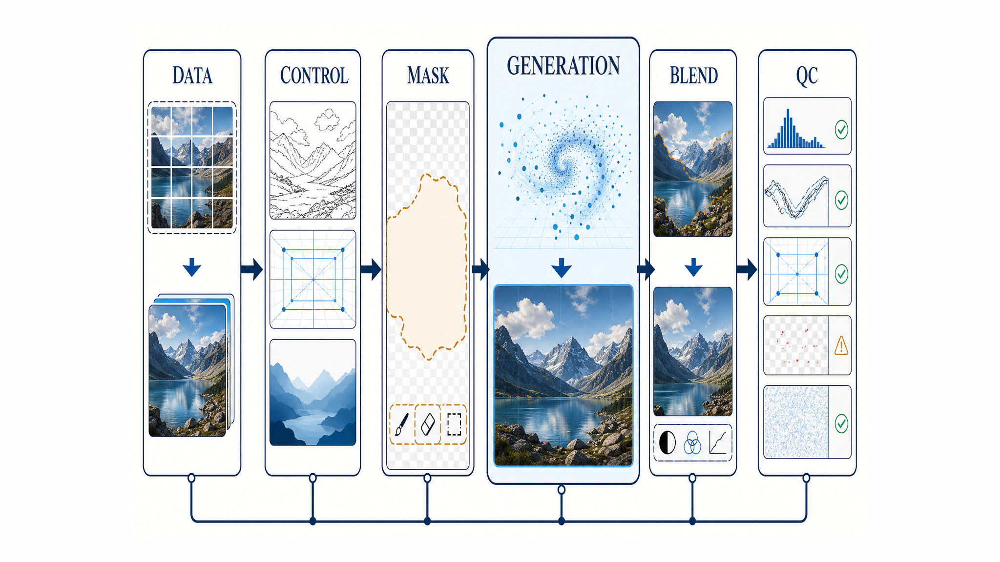

*图：经典算法贯穿数据标准化、控制条件、mask处理、融合与质量检查，生成模型则承担开放语义合成；两类能力共同构成可控交付链路。*

</div>

### 1.经典算法的优势

它们通常速度快、参数少、可解释、可单元测试，适合把隐性的视觉问题转换为明确规则。例如，用连通域检查mask碎片，用频谱峰值发现条纹，用边缘距离测量编辑边界漂移。

### 2.经典算法的边界

阈值、卷积核和几何规则不理解开放世界语义。它们无法单独判断“人物还是不是同一个人”“提示词是否满足”“生成纹理是否符合真实物理”。因此，需要与检测、分割、多模态评审和人工验收共同构成质量闭环。

### 3.跨周期判断

Rocky认为，经典图像处理真正不会过时的部分，不是某个固定核或OpenCV接口，而是把视觉问题拆成采样、噪声、频率、几何、形态和融合约束的能力。模型会换代，框架会重构，但可解释的输入输出合同、失败定位和回归验证始终是AIGC产品从演示走向稳定交付的基础设施。

---

## 第三章 AIGC图像创作基础概念

<h2 id="aigc-basic-q-001">1.什么是AIGC图像创作？它与传统图像处理和判别式视觉任务有什么区别？</h2>

**难度评分：⭐⭐ (2/5)  |  考察频率：⭐⭐⭐⭐⭐ (5/5)**

AIGC图像创作不是“让模型学会画画”这么简单，它的本质是：**在文本、图像、结构、身份或其他条件约束下，学习并采样一个视觉内容分布。** 传统图像处理、判别式视觉和生成式视觉都处理图像，但解决的问题不同。

<div align="center">

| 技术类型 | 典型输入输出 | 学习或计算目标 | 输出是否唯一 |
|---|---|---|---|
| 传统图像处理 | 图像 → 变换后图像 | 按确定规则改变像素、频率或几何 | 通常较确定 |
| 判别式视觉 | 图像 → 标签、框、Mask或特征 | 学习 $`p(y\mid x)`$，判断输入属于什么 | 通常追求确定预测 |
| 生成式视觉 | 条件与随机变量 → 新图像 | 学习 $`p_\theta(x\mid c)`$，生成合理样本 | 天然一对多 |

</div>

这里的条件 $c$ 可以是提示词、参考图、草图、深度、姿态、Mask或身份特征。模型输出的目标不是复现某一张训练图，而是在训练分布中组合出满足条件、视觉自然且具有一定新颖性的样本。

因此，AIGC产品真正困难的部分不只在模型出图，还包括条件表达、生成边界、结果筛选、可复现性、安全策略和交付规范。**模型负责提出视觉候选，系统负责把候选约束成可用结果。**

**面试中可以用一句话收束：传统图像处理执行确定变换，判别模型理解已有图像，AIGC图像模型则在条件约束下对可能的视觉结果进行分布建模与采样。**


<h2 id="aigc-basic-q-002">2.像素空间、连续潜空间和离散视觉Token分别如何表示图像？</h2>

**难度评分：⭐⭐⭐⭐ (4/5)  |  考察频率：⭐⭐⭐⭐⭐ (5/5)**

图像生成首先是表示问题。模型在哪里生成，决定了它看到多少Token、保留多少细节、需要多少算力，以及后续能否与语言模型共享序列接口。

<div align="center">

| 表示空间 | 基本单位 | 优势 | 主要代价 |
|---|---|---|---|
| 像素空间 | RGB像素或像素块 | 信息直接、没有额外编解码瓶颈 | 维度高，训练和采样成本大 |
| 连续潜空间 | VAE等编码器输出的连续特征 | 显著压缩空间尺寸，适合Diffusion/Flow连续建模 | 编码器可能损失文字、细线和高频纹理 |
| 离散视觉Token | 码本索引或离散Patch Token | 可与文本Token统一做序列建模和自回归预测 | 量化误差、码本利用率与序列长度成为瓶颈 |

</div>

三种表示的关系可以用下图概括：像素空间保留信息最直接，连续潜空间用编解码换取计算效率，离散视觉Token则进一步换取了统一序列建模能力。

<div align="center">

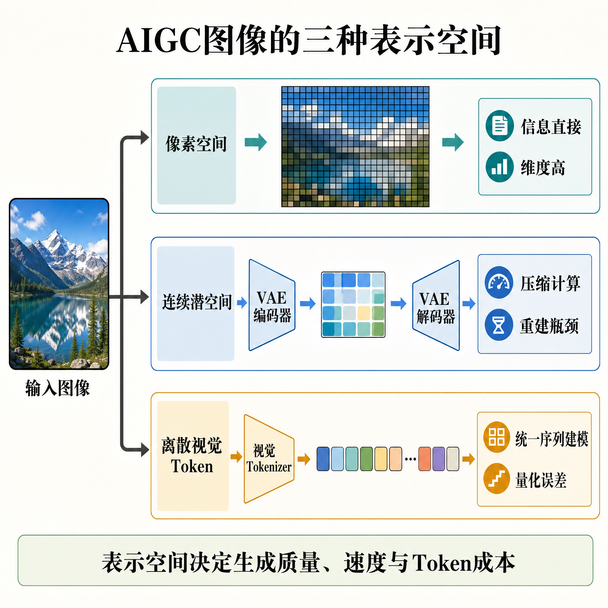

</div>

*图：三种表示空间分别在信息保真、计算压缩、序列统一和量化误差之间形成不同权衡。*

连续潜空间通常通过编码器 $E$ 和解码器 $D$ 完成：

```math
z=E(x),\qquad \hat{x}=D(z)
```

模型在 $z$ 上生成可以降低计算量，但最终质量上限同时受生成Backbone和编解码器约束。即使生成网络预测出了正确语义，VAE重建能力不足，也可能把小字、皮肤纹理或细线结构抹掉。

离散视觉Token更接近语言模型的处理方式，可以把文本和图像组织为统一序列；但高分辨率图像会产生很长的Token序列。当前很多系统采用混合路线：用自回归或多模态模型负责语义规划，再用Diffusion/Flow解码器负责连续细节渲染。

**表示不是模型之前的普通预处理，而是生成质量、速度和多模态统一能力的第一层天花板。**

<h2 id="aigc-basic-q-003">3.一个AIGC图像生成系统从条件输入到最终图像通常经历哪些环节？</h2>

**难度评分：⭐⭐⭐ (3/5)  |  考察频率：⭐⭐⭐⭐⭐ (5/5)**

不同模型的公开实现不完全相同，但从系统抽象看，主流AIGC图像生成通常包含六个环节：

1. **条件理解**：文本编码器或VLM把提示词、对话历史与多模态输入转换为条件特征；
2. **视觉表示**：源图、参考图或目标画布被编码为像素、连续Latent或离散视觉Token；
3. **状态初始化**：从随机噪声、掩码后的Latent、源图加噪结果或起始Token序列开始；
4. **生成Backbone**：U-Net、DiT、Transformer或混合架构预测噪声、速度场、Token概率或直接图像变换；
5. **采样与解码**：采样器多步更新状态，自回归模型逐步预测Token，随后由VAE或视觉解码器还原图像；
6. **后处理与验收**：执行色彩管理、尺寸适配、NSFW检测、水印策略、质量评价和失败重试。

<div align="center">

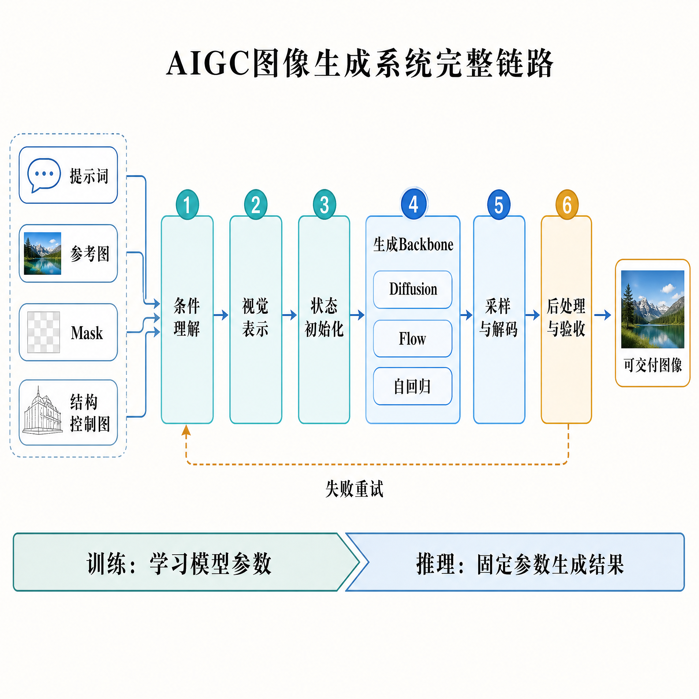

</div>

*图：提示词、参考图、Mask和结构控制图先进入条件与表示链路，再由生成Backbone、采样解码和验收模块共同完成交付；验收失败还会触发条件调整与重试。*

### 训练与推理不要混为一谈

训练阶段用数据和目标函数更新参数，回答“模型学什么”；推理阶段固定参数，通过条件、Seed、采样器和解码器得到结果，回答“模型如何用”。很多面试回答只描述推理界面，却没有说明训练目标；也有人只会背训练公式，却无法解释输出为什么受Seed、条件强度和解码器影响。

**真正的生成系统不是一个Backbone，而是条件、表示、模型、采样、解码与验收共同构成的链路。任何一个环节失真，都可能被误判为“大模型不行”。**


<h2 id="aigc-basic-q-004">4.Diffusion、VAE、GAN、Flow和自回归模型在图像生成中有什么异同？</h2>

**难度评分：⭐⭐⭐⭐ (4/5)  |  考察频率：⭐⭐⭐⭐⭐ (5/5)**

这些模型都试图学习数据分布，但选择了不同的表示、训练目标和生成路径。面试中不能只回答“谁效果更好”，而要说明它们如何建模、如何生成，以及工程代价是什么。

<div align="center">

| 范式 | 核心机制 | 典型生成方式 | 主要优势 | 主要局限 |
|---|---|---|---|---|
| VAE | 概率编码器、解码器与变分下界 | 从连续潜变量一次解码 | 潜空间连续、推理快、可重建 | 单独生成时容易偏平滑，受后验与解码器约束 |
| GAN | 生成器与判别器对抗博弈 | 噪声经生成器一次前向 | 速度快、封闭域细节强 | 训练不稳定、模式坍塌、反演困难 |
| Diffusion | 学习加噪过程的逆向去噪 | 从噪声多步迭代还原 | 训练稳定、模式覆盖与条件控制能力强 | 多步推理成本较高 |
| Flow/Flow Matching | 学习连接简单分布与数据分布的连续速度场 | 数值求解ODE得到样本 | 轨迹直接，适合少步与高效采样 | 质量仍依赖路径、目标和求解器设计 |
| 自回归 | 分解联合概率并预测下一个Token | 按顺序生成视觉Token | 似然目标清晰，易与语言、多模态推理统一 | 串行延迟和长序列成本较高 |

</div>

### 它们不是互斥标签

现实系统经常组合多种范式：Latent Diffusion中的VAE主要负责压缩与解码，Diffusion或Flow负责潜空间生成；自回归模型可以先生成语义Token，再交给Diffusion解码器渲染；对抗损失也可以用于训练VAE解码器或超分模块。

因此，判断技术路线时应拆开看：**谁负责表示、谁负责语义规划、谁负责生成轨迹、谁负责最终渲染。** 模型名称会换代，这四个职责长期存在。


<h2 id="aigc-basic-q-005">5.什么是自回归图像生成模型？它为什么又重新成为主流技术路线？</h2>

**难度评分：⭐⭐⭐⭐ (4/5)  |  考察频率：⭐⭐⭐⭐ (4/5)**

自回归模型把图像转换为像素、Patch或离散视觉Token序列，再按照既定顺序预测下一个Token。若视觉序列为 $`v_1,\ldots,v_N`$，条件为 $`c`$，其联合概率可以分解为：

```math
p(v_1,\ldots,v_N\mid c)=
\prod_{i=1}^{N}p(v_i\mid v_{\lt i},c)
```

早期像素级自回归生成质量高但速度慢，离散视觉Tokenizer和Transformer的发展降低了建模难度。更重要的是，文本、图像、布局和动作都可以Token化，自回归路线因此天然适合统一多模态理解、推理与生成。

### 1.核心优势

- 训练目标与语言模型的Next-Token Prediction一致，容易复用大模型能力；
- 可以显式建模长程语义、对象关系、文字内容和生成历史；
- 支持文本Token与视觉Token交错组织，适合多轮对话式创作。

### 2.核心局限

- Token逐步生成带来串行延迟，高分辨率图像的序列尤其长；
- 扫描顺序会引入人为因果结构，二维空间未必天然适合一维顺序；
- 视觉Tokenizer的量化与重建误差会限制细节上限。

当前常见优化包括多尺度生成、分组或块级预测、Mask并行预测，以及“自回归语义规划 + Diffusion/Flow细节解码”的混合架构。**自回归路线重新受到重视，不是因为它突然比所有扩散模型更好，而是多模态大模型需要一个统一的序列接口。**


<h2 id="aigc-basic-q-006">6.AIGC图像创作中的Low-Level任务包括哪些方向？</h2>

**难度评分：⭐⭐⭐ (3/5)  |  考察频率：⭐⭐⭐⭐ (4/5)**

Low-Level视觉关注像素、噪声、模糊、分辨率、颜色、纹理和局部结构等底层属性。它通常从受损或受限观测 $y$ 恢复潜在清晰图像 $x$，可以抽象为逆问题：

```math
y=\mathcal{H}(x)+n
```

其中，$\mathcal{H}$ 表示降采样、模糊、压缩或成像退化，$n$ 表示噪声。超分辨率、去噪、去模糊、去雾、压缩伪影修复、老照片修复和色彩化都属于常见方向。

<div align="center">

| 任务类型 | 核心目标 | 是否有较强输入事实约束 | 生成先验的主要风险 |
|---|---|---|---|
| 去噪/去模糊/去压缩 | 恢复被退化的信息 | 强 | 把真实细节当噪声删除 |
| 超分辨率 | 提高空间分辨率并补充细节 | 中到强 | 生成不存在的纹理和文字 |
| 修复/补全 | 恢复缺失或损坏区域 | 取决于缺失面积 | 大区域内容无法被事实验证 |
| 色彩化/风格迁移 | 预测颜色或重组风格统计 | 中到弱 | 颜色、材质与历史事实不一致 |
| 开放式文生图 | 从语义条件创造新画面 | 弱 | 真实性无法由单一参考图判断 |

</div>

传统方法更强调数据一致性与物理先验，GAN、Diffusion和Flow等生成模型则提供更强的自然图像先验。先验越强，结果越可能“看起来合理”；但在医疗、遥感、取证和商品文字等场景中，合理不等于真实。

### 超分、增强与生成式修复的边界

<div align="center">

| 任务 | 首要目标 | 尺寸是否必然变化 | 允许“创造”多少细节 |
|---|---|---|---|
| 超分辨率 | 从低分辨率恢复高分辨率图像 | 是，像素数增加 | 传统保真超分较少，感知超分较多 |
| 图像增强 | 去噪、去模糊、去雾、校色或提高对比度 | 不必然 | 应尽量服从真实退化模型 |
| 联合超分增强 | 将“又小又差”的输入变大并修好 | 是 | 取决于业务的保真要求 |
| 生成式修复 | 利用强先验补全丢失或不可恢复的信息 | 不必然 | 最多，也最容易产生幻觉 |

</div>

<div align="center">

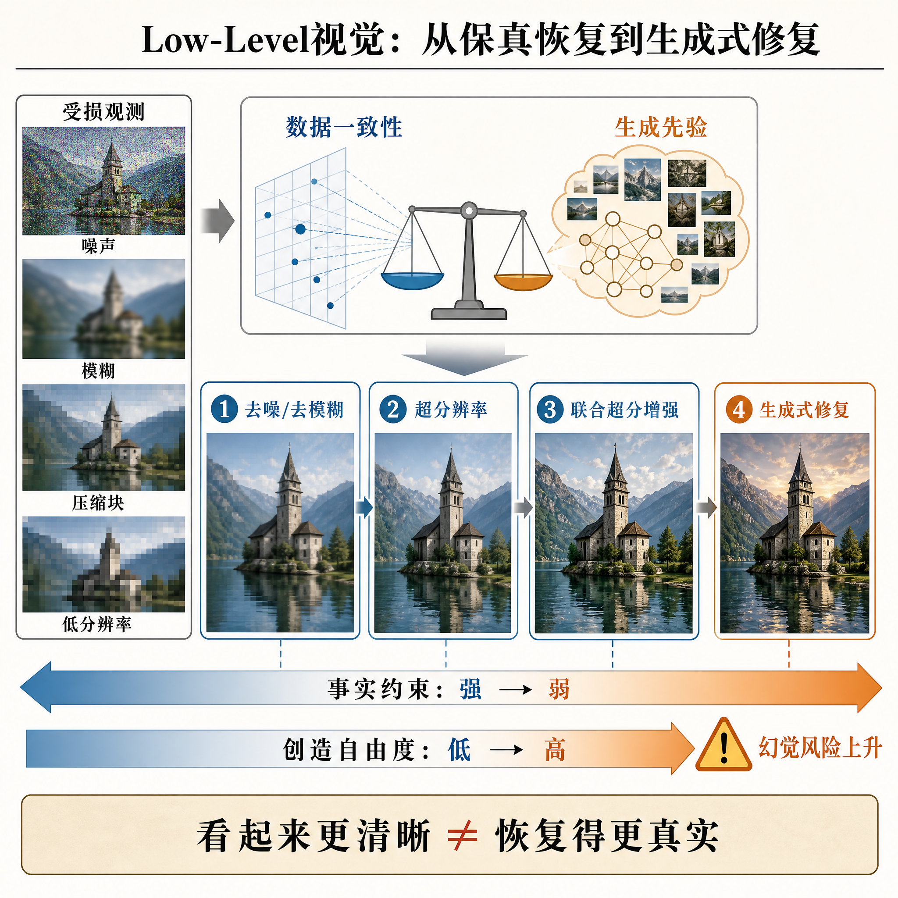

</div>

*图：从去噪、去模糊到超分增强与生成式修复，输入事实约束逐步减弱，生成自由度和幻觉风险同时上升。*

PSNR高的超分结果可能偏平滑，生成式超分可能更锐利，却凭空改写人脸、文字或建筑纹理。这就是Perception-Distortion Trade-off：感知真实感与像素忠实度往往不能同时最优。因此，评价超分增强时应同时报告全参考保真指标、感知质量和业务关键信息错改率，而不是只问“看起来是不是更清晰”。

因此，Low-Level任务的关键不是一味追求锐利，而是明确允许模型补多少信息。**修复任务首先是忠实恢复，其次才是视觉创造；开放式生成则相反。** 具体传统算法和GAN模型可分别在第二章与GAN系列章节深入学习，本题只建立任务边界。


<h2 id="aigc-basic-q-007">7.AIGC图像创作中的可控性、多样性、真实性和原图保持为什么经常相互制约？</h2>

**难度评分：⭐⭐⭐⭐ (4/5)  |  考察频率：⭐⭐⭐⭐⭐ (5/5)**

生成系统同时追求四个目标：条件遵循、样本多样、视觉真实和非目标内容保持。但这些目标经常互相拉扯，不存在对所有任务都最优的一组参数。

- **提高Guidance或条件权重**可以增强提示词和结构遵循，但过强时可能导致过饱和、纹理僵硬和自然度下降；
- **增加随机性**可以扩大多样性，却会降低身份、构图和复现稳定性；
- **增强生成先验**可以补出更锐利的细节，却可能偏离输入事实，产生“看起来更真、实际更假”的幻觉；
- **强化原图保持**可以保护背景和商品细节，却可能让编辑区域变化不足；
- **减少采样步数**可以降低延迟，但可能牺牲复杂指令遵循或局部细节。

这类问题本质上是多目标优化。正确做法不是寻找一个万能配置，而是先定义业务优先级。例如，广告创意允许较大视觉变化，证件照修复和商品换背景则必须严格保护身份、Logo、文字和商品结构。

Rocky认为，模型能力的真正分水岭，不是某张图能否惊艳，而是系统能否稳定地把这些目标放在一条可调、可测、可回归的Pareto前沿上。**生产配置不是审美预设，而是任务风险的显式表达。**


<h2 id="aigc-basic-q-008">8.Scaling Law在AIGC图像创作领域成立吗？它有哪些适用边界？</h2>

**难度评分：⭐⭐⭐⭐⭐ (5/5)  |  考察频率：⭐⭐⭐⭐ (4/5)**

结论是：**AIGC图像模型存在可观察的经验Scaling规律，但它不是“参数越大，所有能力就会无限变好”的自然定律。** 在给定架构、数据配比、训练目标与算力区间内，扩大模型、数据和计算通常能降低训练损失并提升部分生成能力；超出该区间是否继续成立，需要新的实验验证。

SD 3对不同深度MM-DiT的实验表明，在其测试规模内，模型容量增加伴随验证损失下降，并与GenEval、人类偏好等指标呈现相关性。这说明Transformer/DiT是图像生成的重要扩展路径，但单组实验不能“完全证明”所有AIGC模型、所有指标和无限规模下都遵循同一曲线。

<div align="center">

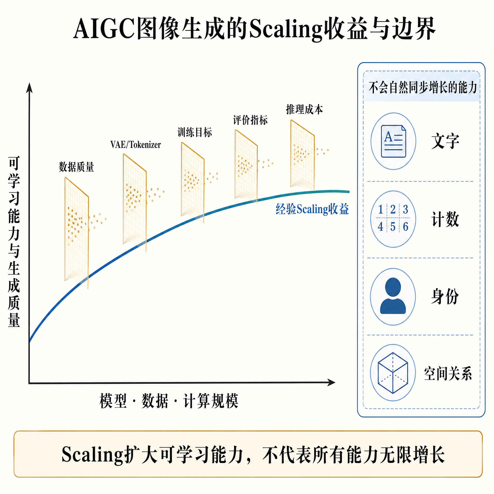

</div>

*图：扩大模型、数据和计算规模通常带来经验性能力收益，但数据质量、视觉表示、训练目标、评价方式和推理成本会形成连续瓶颈，文字、计数、身份与空间关系也不会自然同步增长。*

### 1.图像生成的Scaling不只有参数量

1. **模型Scaling**：Backbone、条件编码器和VAE容量；
2. **数据Scaling**：数据量、Caption密度、长尾覆盖与去重质量；
3. **计算Scaling**：训练步数、分辨率课程、优化器与并行效率；
4. **条件Scaling**：从短文本编码器扩展到长上下文或VLM；
5. **后训练Scaling**：偏好数据、指令编辑数据和可验证奖励。

### 2.主要边界

- 数据重复、噪声与Caption错误会让算力放大错误分布；
- VAE或视觉Tokenizer会形成表示瓶颈，Backbone再大也无法恢复已丢失的信息；
- 指标可能饱和或被投机优化，训练损失下降不等于商业体验同步提升；
- 推理延迟、显存和单位出图成本会约束产品化；
- 文字、计数、身份和空间关系等能力可能需要专门数据与目标，不能只靠参数自然涌现。

**Scaling扩大的是模型可学习能力，数据合同、表示质量、训练目标和评价闭环决定这些能力最终长成什么。**

---

## 第四章 AIGC图像创作领域的评价指标

<h2 id="1.AI生成图像的常用评价指标">1.AI生成图像的常用评价指标</h2>

**难度评分：⭐⭐⭐ (3/5)  |  考察频率：⭐⭐⭐⭐⭐ (5/5)**

评价 AIGC 图像最容易犯的错误，是把“高品质”压缩成一个分数。**真正可靠的评价体系，不是寻找一个万能指标，而是先明确生成任务允许什么变化，再选择与目标一致的度量。**

例如，超分、去噪和修复通常有配对真值，重点是恢复得是否忠实；文生图没有唯一标准答案，重点会转向真实感、文本一致性、构图、审美、多样性与安全性。二者不能共用同一套指标逻辑。

常用指标可以分为以下几层：

<div align="center">

| 评价层次 | 代表方法 | 主要回答的问题 | 典型适用任务 |
|---|---|---|---|
| 像素保真 | MSE、MAE、PSNR | 输出像素与参考图差多少 | 去噪、压缩、超分、重建 |
| 结构与感知保真 | SSIM、MS-SSIM、LPIPS、DISTS | 结构或人类感知是否接近参考图 | 修复、图生图、可控编辑 |
| 分布质量与多样性 | FID、KID、Precision/Recall | 一批生成图是否接近真实数据分布 | GAN、扩散模型、模型横评 |
| 图文与组合对齐 | CLIP Score、VQA 式评估、对象/关系计数 | 图像是否真的满足提示词 | 文生图、复杂组合生成 |
| 审美与人类偏好 | Aesthetic Predictor、偏好奖励模型、人工打分 | 画面是否更符合目标用户偏好 | 创意生成、封面、广告素材 |
| 无参考画质 | NIQE、BRISQUE、学习型 IQA | 没有真值时是否存在明显退化 | 线上内容质检、历史图片修复 |
| 业务与安全 | 采用率、重生成率、审核通过率、侵权/安全检测 | 内容能否被稳定使用 | 商业化生产系统 |

</div>

Inception Score（IS）在生成模型早期很有代表性：条件分布尖锐意味着单张图容易被分类，边缘分布分散意味着样本具有类别多样性。但它只看生成集、依赖分类器标签空间，也难以直接判断生成分布是否接近目标真实分布，因此今天更适合作为历史基础，而不是唯一结论。

Rocky认为，指标真正的跨周期价值不在名字，而在它把哪一种产品目标变成了可观测反馈。模型会换代，评价闭环不会消失。

<h2 id="2.什么是REAL评价指标？">2.什么是REAL评价指标？</h2>

**难度评分：⭐⭐⭐⭐ (4/5)  |  考察频率：⭐⭐⭐ (3/5)**

论文：[REAL: Realism Evaluation of Text-to-Image Generation Models for Effective Data Augmentation](https://arxiv.org/abs/2502.10663)

REAL 解决的不是“图像看起来漂亮吗”，而是“图像中的对象属性、关系和风格是否符合现实世界约束”。这一点对合成数据尤其重要：画面可以很精致，但如果动物纹理、物体关系或照片/插画风格不真实，进入训练集后反而会把错误知识放大。

REAL 将真实性拆成三个互补维度：

<div align="center">

| 维度 | 核心问题 | 基本机制 |
|---|---|---|
| 细粒度视觉属性 | 颜色、纹理、形状等是否符合对象事实 | 从知识来源构造属性问题，再用 VQA 模型检查生成图 |
| 非常规视觉关系 | 主体、客体和动作关系是否自然成立 | 从提示词抽取实体与关系，逐项验证对象存在和关系正确性 |
| 视觉风格 | 结果是否符合照片写实或插画等目标风格 | 使用风格分类器判断生成图风格，并与提示要求比较 |

</div>

<div align="center">

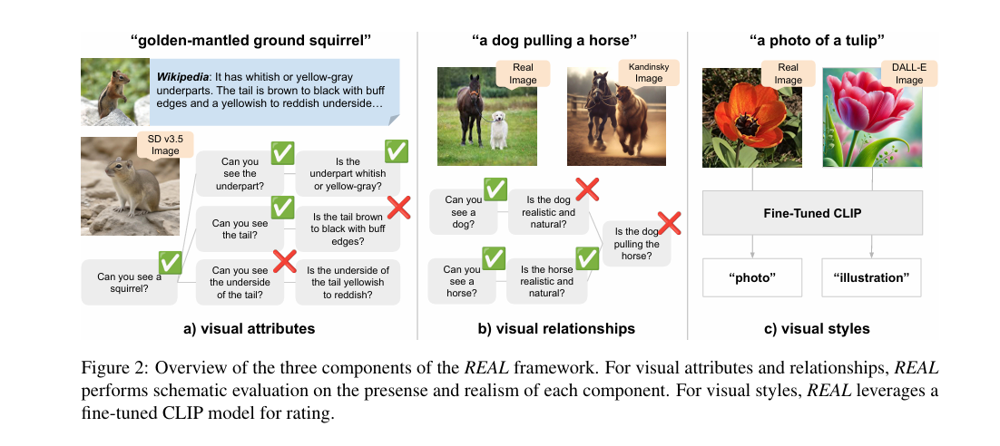

</div>

论文报告中，REAL 与人工判断的 Spearman 相关系数最高达到 0.62；在其数据增强实验里，高分合成样本能够改善下游任务，而低分样本可能伤害性能。这些结果支持“真实性筛选对合成数据有价值”，但不能推出 REAL 已经覆盖所有领域、文化语境和物理规律。

REAL 的边界也很清楚：VQA 模型自身会有幻觉和偏差，知识源不一定覆盖长尾对象，问答式检查也不等于严格的三维几何或物理仿真。因此它应与分布指标、任务指标和人工抽检组合使用。

面试中可以用一句话收束：**REAL 的价值，是把模糊的“像真的”拆成可提问、可验证的属性—关系—风格结构。**

<h2 id="3.介绍一下Aesthetic-Score-Predictor、Aesthetic-Predictor-V2.5评价指标的原理">3.介绍一下Aesthetic Score Predictor、Aesthetic Predictor V2.5评价指标的原理</h2>

**难度评分：⭐⭐⭐ (3/5)  |  考察频率：⭐⭐⭐⭐ (4/5)**

Aesthetic Score Predictor 的本质，是把人类对构图、色彩、光影、主体突出程度和整体观感的偏好，蒸馏成一个可批量运行的回归模型。常见做法是先用 CLIP 或其他视觉编码器提取图像特征，再训练一个较轻的 MLP 或线性回归头预测人类审美评分：

```math
a(x)=g_{\phi}\!\left(f_{\mathrm{vision}}(x)\right)
```

其中 $`f_{\mathrm{vision}}`$ 提取语义与视觉表示，$`g_{\phi}`$ 将表示映射为审美分数。训练标签可以来自人工打分、成对偏好或经过清洗的社区反馈。

所谓 Aesthetic Predictor V2.5，可以理解为这类审美预测器在数据、视觉编码器、训练目标或标注清洗上的迭代版本；不同开源实现的 backbone 和标尺并不完全一致，使用时必须记录具体权重、预处理和评分范围，不能只写“V2.5”就横向比较。

它在 AIGC 工程中常用于：

- 从同一提示词的多张候选图中重排序；
- 清洗训练集或筛除明显低质样本；
- 作为偏好优化或奖励模型的一路信号；
- 监控模型升级后审美分布是否整体漂移。

但审美分数不等于真实性、提示词一致性和商业可用性。一张风格浓烈但主体错误的图可能拿到高审美分；偏好数据还会放大特定文化、构图和社区风格。Rocky认为，审美模型更像“规模化初筛器”，不是替代目标用户和专业设计师的最终裁判。

<h2 id="4.介绍一下FID指标的原理">4.介绍一下FID指标的原理</h2>

**难度评分：⭐⭐⭐⭐ (4/5)  |  考察频率：⭐⭐⭐⭐⭐ (5/5)**

FID（Fréchet Inception Distance）衡量的是**真实图像集合与生成图像集合在特征空间中的分布距离**，不是两张图片之间的逐像素相似度。

经典做法是用预训练 Inception 网络提取两组图像的特征，并分别用高斯分布近似。设真实特征的均值和协方差为 $`\mu_r,\Sigma_r`$，生成特征为 $`\mu_g,\Sigma_g`$，则：

```math
\mathrm{FID}=
\lVert\mu_r-\mu_g\rVert_2^2+
\mathrm{Tr}\!\left(
\Sigma_r+\Sigma_g-2(\Sigma_r\Sigma_g)^{1/2}
\right)
```

第一项衡量分布中心偏移，第二项衡量协方差结构差异。通常 FID 越低，表示生成集在所选特征空间中越接近真实集。它能够同时感知生成质量下降和模式覆盖不足，因此比只看生成样本的 IS 更适合真实集—生成集比较。

计算流程如下：

1. 固定真实集、生成集、图像数量和预处理方式；
2. 使用同一特征网络提取两组 embedding；
3. 分别估计均值和协方差；
4. 计算 Fréchet 距离，并在相同协议下比较模型。

<div align="center">

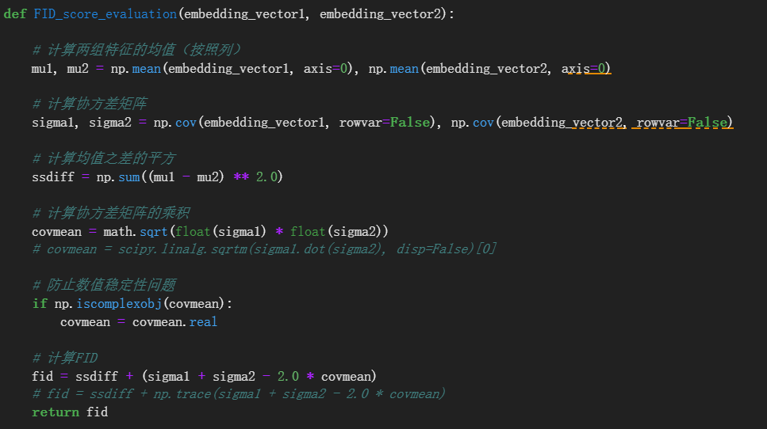

</div>

FID 有四个高频边界：

- **对样本数敏感**：小样本估计有偏，不同生成数量的结果不能直接比较；
- **对实现协议敏感**：resize、归一化、压缩格式和 Inception 实现不同都会造成数值漂移；
- **不检查提示词对齐**：生成完全错误但分布像真实集，FID 仍可能不差；
- **平均分会掩盖子域失败**：人物很好、文字很差，整体 FID 可能看不出来。

因此，FID 的正确用法不是问“多少分算好”，而是在同一数据、同一代码和同一采样预算下做相对比较，并搭配 CLIP Score、组合能力和人工评测。

<h2 id="5.介绍一下CLIP-score指标的原理">5.介绍一下CLIP-score指标的原理</h2>

**难度评分：⭐⭐⭐ (3/5)  |  考察频率：⭐⭐⭐⭐⭐ (5/5)**

CLIP Score 主要衡量图像与文本提示在 CLIP 共享语义空间中的一致性。设图像编码器输出 $`v`$，文本编码器输出 $`t`$，归一化后的基本形式为：

```math
\mathrm{CLIPScore}(I,T)=
\frac{v^{\mathsf T}t}{\lVert v\rVert_2\lVert t\rVert_2}
```

分数越高，表示 CLIP 认为图像与文本在语义上越接近。它不需要唯一参考图，适合文生图模型的大规模自动评估，也可以用于候选图重排序、提示词诊断和训练数据筛选。

但 CLIP Score 测到的是“CLIP 看起来像不像”，不是提示词中每个约束都正确。它对显著主体和整体语义较敏感，却可能忽略数量、左右关系、否定词、文字拼写、局部属性和复杂组合关系；模型还可能学会迎合 CLIP 特征，而不是真正提高人类可感知质量。

工程上应把复杂 prompt 拆成对象、属性、关系、数量和文字等原子条件，再结合检测、OCR、VQA 或专门 benchmark 检查。**CLIP Score 适合做语义入口，不适合做语义终局。**

<h2 id="6.介绍一下PartiPrompts指标的原理">6.介绍一下PartiPrompts指标的原理</h2>

**难度评分：⭐⭐⭐ (3/5)  |  考察频率：⭐⭐⭐⭐ (4/5)**

严格来说，PartiPrompts 不是一个直接输出单一分数的“指标”，而是一套用于压力测试文生图模型的结构化提示词集合。它包含 1600 余条英文提示词，覆盖简单对象、细粒度属性、数量、空间关系、复杂组合、风格、文字与符号、世界知识和想象性场景等类别。

它的核心价值，是把“模型会不会画图”拆成多个能力切片。同一个模型可能在摄影风格和单主体生成上很好，却在数量、左右关系或文字生成上持续失败；如果只看总体 CLIP Score，这些结构性短板很容易被平均掉。

典型使用流程是：

1. 固定采样器、分辨率、随机种子数量和推理预算；
2. 按 PartiPrompts 类别批量生成图像；
3. 使用人工偏好、CLIP/VQA、对象检测、OCR 或其他评分器评价；
4. 按类别报告能力雷达，而不是只汇报一个总平均分；
5. 对低分样本做错误归因，区分文本编码、组合推理、生成先验和渲染问题。

它的边界在于提示词以英文和特定文化语境为主，自动评分器也可能继承偏差。面向中文生成、电商海报或工业设计时，应保留其“分能力压力测试”的方法论，同时建立领域内提示词集和人工验收标准。

<h2 id="8.什么是SSIM图像评估指标？">7.什么是SSIM图像评估指标？</h2>

**难度评分：⭐⭐⭐ (3/5)  |  考察频率：⭐⭐⭐⭐⭐ (5/5)**

SSIM（Structural Similarity Index Measure）用于比较一张待评图与配对参考图的结构相似性。它不只统计像素误差，而是在局部窗口中比较亮度、对比度和结构，因此通常比 MSE/PSNR 更接近人类对结构失真的感知。

经典 SSIM 可以写成亮度、对比度和结构三项的组合：

```math
\mathrm{SSIM}(x,y)=
l(x,y)^{\alpha}c(x,y)^{\beta}s(x,y)^{\gamma}
```

在常用设置 $`\alpha=\beta=\gamma=1`$ 且 $`C_3=C_2/2`$ 下，可化为：

```math
\mathrm{SSIM}(x,y)=
\frac{(2\mu_x\mu_y+C_1)(2\sigma_{xy}+C_2)}
{(\mu_x^2+\mu_y^2+C_1)(\sigma_x^2+\sigma_y^2+C_2)}
```

$`\mu_x,\mu_y`$ 是局部均值，$`\sigma_x^2,\sigma_y^2`$ 是局部方差，$`\sigma_{xy}`$ 是协方差，$`C_1,C_2`$ 用于避免分母接近零。对各窗口得分取平均，就得到整图 SSIM；分数通常越高越好。

<div align="center">

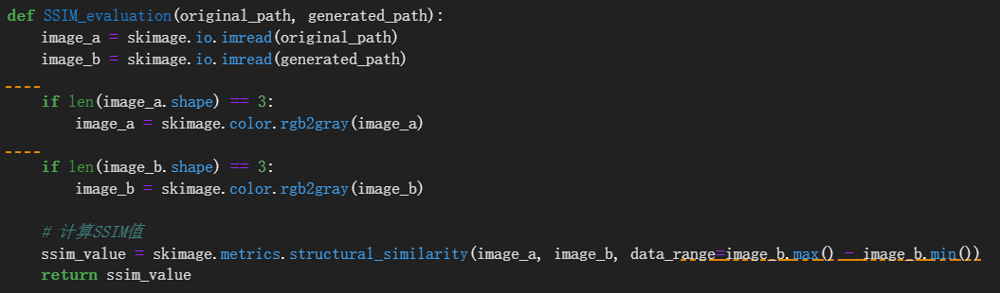

</div>

SSIM 适合去噪、压缩、超分和重建等有配对真值的任务，但要求两张图严格对齐。轻微平移、裁剪或允许合理纹理重绘时，SSIM 可能显著下降；反过来，高 SSIM 也不保证纹理自然或语义正确。AIGC 超分增强如果允许生成新细节，应同时使用 LPIPS、FID 和人工偏好，避免用 SSIM 把模型逼回“保守而模糊”的输出。

<h2 id="9.什么是PSNR图像评估指标？">8.什么是PSNR图像评估指标？</h2>

**难度评分：⭐⭐⭐ (3/5)  |  考察频率：⭐⭐⭐⭐⭐ (5/5)**

PSNR（Peak Signal-to-Noise Ratio，峰值信噪比）由待评图与配对参考图的均方误差推导而来，用分贝表示像素重建的保真程度。对高度为 $`H`$、宽度为 $`W`$、通道数为 $`C`$ 的图像：

```math
\mathrm{MSE}=\frac{1}{HWC}
\sum_{i=1}^{H}\sum_{j=1}^{W}\sum_{k=1}^{C}
\left(x_{ijk}-y_{ijk}\right)^2
```

```math
\mathrm{PSNR}=10\log_{10}\!\left(\frac{\mathrm{MAX}_I^2}{\mathrm{MSE}}\right)
=20\log_{10}\!\left(\frac{\mathrm{MAX}_I}{\sqrt{\mathrm{MSE}}}\right)
```

$`\mathrm{MAX}_I`$ 是像素动态范围的最大值：8-bit 图像通常为 255，归一化浮点图像通常为 1。PSNR 越高表示像素误差越小；两张图完全相同时 MSE 为 0，PSNR 理论上趋于无穷大。

<div align="center">

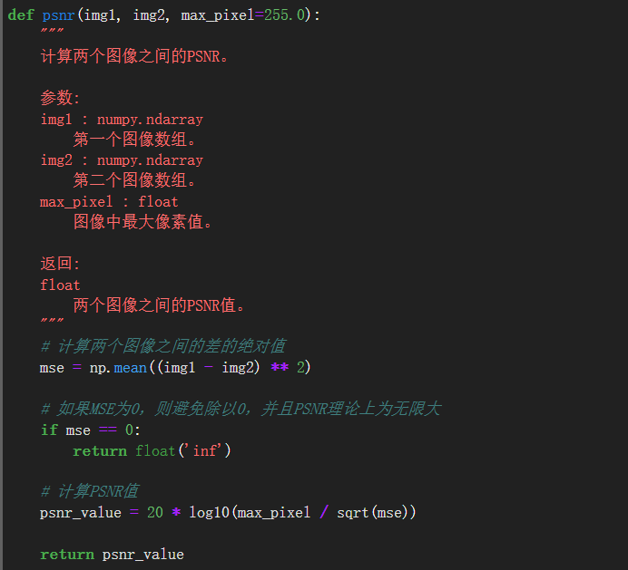

</div>

PSNR 的优点是计算简单、可复现，适合相同数据和退化协议下比较重建模型；缺点是把所有像素误差等价处理，不理解边缘、纹理、主体和语义。像素平均后的模糊图可能拥有更高 PSNR，却不一定更清晰、更真实。

需要特别强调：PSNR 与 FID 分属不同评价协议，一个面向配对像素重建，一个面向集合分布。不能用“PSNR 低、FID 高”这类方向混乱的组合直接推断多样性；必须先统一“高分/低分代表什么”以及任务是否存在唯一真值。

<h2 id="9.为什么AIGC图像生成不能只用一个指标评估？">9.为什么AIGC图像生成不能只用一个指标评估？</h2>

**难度评分：⭐⭐⭐⭐ (4/5)  |  考察频率：⭐⭐⭐⭐⭐ (5/5)**

因为图像生成是一个多目标系统：清晰、真实、符合提示、具有审美、多样、安全、快速和便宜之间经常互相拉扯。任何单一指标都只是投影，优化得越极致，越可能把模型推向这个指标的盲区。

一个可落地的评价矩阵至少包含五层：

<div align="center">

| 层次 | 离线问题 | 建议指标或方法 |
|---|---|---|
| 内容正确性 | 对象、属性、数量、关系和文字是否正确 | CLIP Score、VQA、检测、OCR、分类 benchmark |
| 视觉质量 | 是否清晰、自然、无明显伪影 | PSNR/SSIM（有配对真值）、LPIPS、无参考 IQA、人工盲评 |
| 分布与多样性 | 是否接近目标域并覆盖足够模式 | FID、KID、Precision/Recall、重复率 |
| 审美与偏好 | 是否符合用户、品牌或设计风格 | 审美预测器、成对偏好、专业设计评审 |
| 安全与可交付 | 是否侵权、冒名、违规，成本是否可控 | 安全分类、身份/水印检测、延迟、成本、失败率 |

</div>

真正的产品闭环还要接入线上反馈：首轮采用率、重生成率、编辑时长、导出率、审核通过率、投诉率和每个可用结果的综合成本。一个模型即使离线 FID 更低，如果用户反复重抽、人工修图时间更长，产品价值仍然可能下降。

推荐采用以下工程流程：

1. **先定义任务合同**：哪些内容必须保真，哪些区域允许生成，哪些风险不可接受；
2. **建立固定离线集**：同时覆盖常规、长尾、对抗和真实业务提示词；
3. **分层自动评测**：不要只给总分，保留任务、风格、语言和用户群切片；
4. **加入人工盲评**：采用成对比较并随机化顺序，减少绝对打分漂移；
5. **小流量线上验证**：观察用户行为和真实交付成本；
6. **错误回流**：把失败样本转成训练数据、回归测试和安全规则，形成数据飞轮。

Rocky认为，评价体系不是模型发布前的一张成绩单，而是连接数据、训练、产品和用户反馈的控制系统。**指标不是护城河，围绕真实任务持续校准指标的能力，才是跨周期能力。**

<h2 id="eval-q-010">10.GenEval、DPG-Bench、TIFA、VQAScore等如何评价复杂提示词遵循？</h2>

**难度评分：⭐⭐⭐⭐ (4/5)  |  考察频率：⭐⭐⭐⭐⭐ (5/5)**

复杂提示词评价的本质，是把一句自然语言拆成多个可以验证的原子约束，再检查生成图是否逐项满足。CLIP Score 更擅长判断整图与文本是否“语义相近”，但对数量、空间关系、属性绑定和否定关系不够敏感。例如，“两只猫在一辆红色汽车左边”和“一只猫在两辆汽车右边”可能包含相似词汇，却对应完全不同的画面合同。

四类常见方法的评价粒度不同：

<div align="center">

| 方法 | 核心机制 | 擅长发现的问题 | 主要边界 |
|---|---|---|---|
| GenEval | 用目标检测器、位置和颜色分类器检查对象级组合属性 | 对象共现、数量、颜色、位置、颜色归属 | 受检测器类别空间和小目标召回率限制 |
| DPG-Bench | 将密集提示词组织成可检查的语义图或原子事实，再逐项进行 VQA/MLLM 判断 | 多对象、长描述、细粒度属性、复杂关系 | 评审模型可能遗漏隐含关系或继承语言偏差 |
| TIFA | 从文本自动生成多组问答，使用 VQA 模型回答并统计正确率 | 对象、动作、材质、计数、空间关系等可解释诊断 | 问题生成质量和 VQA 能力共同决定结果 |
| VQAScore | 把整条文本改写成“图中是否展示该描述”，取 VQA 模型回答 Yes 的概率 | 整体文本—图像对齐和复杂组合判断 | 单个概率可能掩盖到底是哪一条约束失败 |

</div>

### GenEval：对象级可执行检查

GenEval 不直接计算一个全局 embedding 的余弦相似度，而是先检测图中的对象，再检查数量、位置、颜色和属性绑定。例如提示词要求“一个蓝色杯子和两个红色苹果”，系统不仅要确认杯子和苹果都存在，还要检查数量及颜色是否绑定到正确对象。

这种方法可解释性强：低分可以落到“漏对象”“数量错误”或“属性串位”。但如果检测器本身不认识某个长尾物体，或者小目标被漏检，生成模型会为评估器的错误背锅。因此 GenEval 更适合比较标准对象组合，不应被当成开放世界语义的最终裁判。

### DPG-Bench：密集提示词逐项核验

DPG-Bench 随 ELLA 工作提出，包含约 1K 条密集提示词，重点评估多个对象、细粒度属性和复杂关系。它的关键不是提示词更长，而是把长提示中的实体、属性和关系变成结构化检查项，再聚合各项是否成立。

工程上应同时报告总分和分类型得分。如果一个模型在主体对象上得分很高，却持续忽略背景、材质和空间关系，总分可能仍然看起来不错，但它并不适合海报、商品陈列和复杂场景生成。

### TIFA：从提示词生成问答单元

给定提示词 $`T`$，TIFA 生成 $`M`$ 个问题—答案对 $`(q_i,a_i)`$，再让 VQA 模型根据生成图 $`I`$ 回答。简化形式可以写成：

```math
\mathrm{TIFA}(I,T)=\frac{1}{M}\sum_{i=1}^{M}
\mathbb{I}\!\left[\mathrm{VQA}(I,q_i)=a_i\right]
```

它的优点是参考图无关、问题级可解释：可以直接看到是“红色”没生成，还是“三个物体”数量不对。其风险来自两层模型误差：语言模型可能生成无效或歧义问题，VQA 模型也可能看错图。因此高风险评测应抽查问答质量，并固定问题生成器和 VQA 版本。

### VQAScore：直接估计文本陈述成立的概率

VQAScore 将文本放入类似“这张图是否展示了：$`T`$？”的问题中，使用生成式 VQA 模型计算回答 Yes 的概率：

```math
\mathrm{VQAScore}(I,T)=
P\!\left(\mathrm{Yes}\mid I,\mathrm{Question}(T)\right)
```

与 TIFA 的多问题平均相比，VQAScore 形式更简单，可以利用 VQA 模型对整句组合关系的理解；但如果只输出单一概率，就不容易定位失败项。实际系统可以先用 VQAScore 做批量排序，再对低分或高风险样本用 TIFA/DPG 式问题分解做诊断。

这类指标共有四个工程注意点：

1. **固定评审器**：不同检测器、VQA 或 MLLM 的绝对分数不能直接横比；
2. **避免同源偏差**：生成模型和评审模型共享相近训练分布时，可能出现“同一种错误互相认可”；
3. **保留能力切片**：对象、数量、属性、位置、文字和世界知识要分别报告；
4. **设置人工仲裁**：对于评审器低置信、多个评审器冲突或业务关键样本，必须进入人工复核。

面试中可以用一句话收束：**复杂提示词评价不是再找一个更大的相似度模型，而是把语言合同变成一组可执行的视觉断言。**

<h2 id="eval-q-011">11.ImageReward、PickScore、HPS v2与Aesthetic Predictor有什么区别？</h2>

**难度评分：⭐⭐⭐⭐ (4/5)  |  考察频率：⭐⭐⭐⭐⭐ (5/5)**

四者都可能输出一个分数，但监督信号和回答的问题不同。Aesthetic Predictor 主要学习“这张图本身是否具有审美吸引力”；ImageReward、PickScore 和 HPS v2 则同时接收文本与图像，学习“对于这个提示词，人更偏好哪张结果”。

<div align="center">

| 方法 | 典型输入 | 主要监督 | 更适合回答 | 典型盲区 |
|---|---|---|---|---|
| Aesthetic Predictor | 图像 | 绝对审美评分或社区美学标签 | 画面是否好看、构图是否舒服 | 不保证满足提示词，也不保证事实正确 |
| ImageReward | 文本 + 图像 | 专家对生成结果的评分和排序 | 哪张图更符合综合人类偏好 | 可能把标注者审美与训练模型偏差固化为奖励 |
| PickScore | 文本 + 候选图像 | Pick-a-Pic 真实用户的成对选择 | 同一提示下用户更愿意选哪张 | 用户群、模型池和平台行为会影响偏好分布 |
| HPS v2 | 文本 + 图像 | HPD v2 中跨来源的人类成对偏好 | 跨风格、跨模型的人类偏好预测 | 仍受数据年代、提示分布和评审人群限制 |

</div>

### Aesthetic Predictor：图像侧审美回归

Aesthetic Predictor 常用视觉编码器提取图像表示，再通过线性层或 MLP 预测审美分。它擅长筛掉构图混乱、主体不突出或整体观感差的样本，却可能给“画得漂亮但完全答错题”的图像高分。因此它适合训练集初筛和候选图审美重排序，不应单独承担提示词遵循评价。

### ImageReward：专家偏好驱动的通用奖励模型

ImageReward 通过系统化的人工标注流程学习文本条件下的人类偏好，原论文报告训练数据包含约 13.7 万组专家比较。它不仅可作为自动评价器，也可在 Reward Feedback Learning 等方法中成为优化信号。

风险在于奖励劫持：如果训练长期只追逐同一个 ImageReward，模型可能学会奖励模型偏爱的颜色、构图和风格捷径，而不是全面提高真实质量。因此奖励模型更适合成为多目标系统的一路信号，并定期用新的人类数据做外部校准。

### PickScore：真实用户选择蒸馏出的偏好分

PickScore 基于 Pick-a-Pic 收集的真实用户成对选择训练。它更接近“用户面对两个结果会点哪一个”，能够用于同 prompt 候选排序和模型对比。不过，平台用户并不等于所有目标用户：社区可能偏爱高饱和、强风格或某类题材，企业设计、商品准确性和儿童内容安全不一定得到充分表达。

### HPS v2：跨来源偏好数据上的 CLIP 微调评分器

HPS v2 使用 HPD v2 训练，论文报告其数据包含 798,090 次人类偏好选择和 433,760 对图像，并通过微调 CLIP 获得评分模型。它强调跨图像来源和更公平的提示词设计，适合模型级横评与人类偏好近似。

偏好模型通常可以用 Bradley–Terry/逻辑回归式目标理解。设同一提示下，人更偏好图像 $`I_w`$ 而不是 $`I_l`$，评分器输出 $`s(I,T)`$，则偏好概率可写成：

```math
P(I_w\succ I_l\mid T)=
\sigma\!\left(s(I_w,T)-s(I_l,T)\right)
```

这类模型共同存在三类边界：

- **偏好不等于正确性**：高偏好图仍可能文字错误、数量错误或侵犯版权；
- **绝对分数不可随意跨版本比较**：模型权重、归一化和候选池变化都会改变标尺；
- **同一奖励不可长期垄断训练与评测**：既用同一模型优化，又用它宣布胜利，会形成闭环自证。

正确用法是：Aesthetic Predictor 负责审美初筛，GenEval/TIFA 等负责内容正确性，ImageReward/PickScore/HPS v2 近似人类偏好，最终再用盲评与线上采用率校准。

<h2 id="eval-q-012">12.如何评价中文、多语言文字和版式生成能力？</h2>

**难度评分：⭐⭐⭐⭐ (4/5)  |  考察频率：⭐⭐⭐⭐⭐ (5/5)**

文字生成评价不能只问“OCR 能不能读出来”。一张商业海报即使字符全部正确，如果阅读顺序、换行、字号层级、字体风格或文字与商品的空间关系错误，仍然无法交付。完整评价应拆成**内容正确、字形合法、版式正确、风格一致和编辑稳定**五层。

### 1.文字内容正确性

对生成图进行 OCR，比较目标字符串与识别字符串。常用指标包括：

- **整词/整句准确率**：整段文字完全正确的比例，最严格也最接近商业交付；
- **字符准确率**：正确字符占目标字符的比例；
- **CER（Character Error Rate）**：字符级替换、删除和插入错误；
- **WER（Word Error Rate）**：适合以词为空间单位的语言；
- **Normalized Edit Distance**：对不同长度文本进行归一化比较。

CER 的经典形式为：

```math
\mathrm{CER}=\frac{S+D+I}{N}
```

其中 $`S`$、$`D`$、$`I`$ 分别表示替换、删除和插入次数，$`N`$ 是目标文本字符数。CER 越低越好。

中文评测要额外统计形近字、同音字、繁简体、标点和中英数字混排；不能把所有语言混成一个 micro average，否则数量占优势的英文样本会掩盖中文或其他低资源文字的失败。更合理的是按语言和文字系统分别报告，再计算 macro average。

### 2.字形与可读性

OCR 正确不代表字形自然。模型可能生成缺笔、多笔、粘连、镜像字符或不存在的“伪汉字”，但强 OCR 仍可能根据上下文猜对。应增加：

- 字符区域人工可读率；
- 字形轮廓与目标 glyph 的 IoU、Chamfer Distance 或感知相似度；
- 小字号、弯曲文字、透视文字和复杂背景下的分层准确率；
- 字体一致性、笔画连贯性和边缘伪影检查。

AnyText-benchmark、MARIO-Eval 等公开测试可以作为通用入口，但产品还应加入真实业务字体、品牌字和低频汉字。

### 3.版式与阅读顺序

版式评测需要比较文字框的位置、尺度和层级：

- 文本框检测 Precision/Recall；
- 预测框与目标框的 IoU；
- 行间距、对齐方式、换行点和留白；
- 标题—副标题—正文的层级关系；
- 多栏、竖排、环形文字和中英混排的阅读顺序；
- 文字是否遮挡商品、人脸、Logo 或其他关键主体。

对于自由文生图没有唯一目标版式时，可以使用设计规则检查、MLLM 评审和专业设计师成对盲评，而不应伪造一个像素级唯一真值。

### 4.风格一致与局部编辑稳定性

还要检查字体材质、颜色、阴影、透视和场景光照是否一致。对于“把海报上的 2025 改成 2026”这类编辑任务，评价合同应是：目标文字必须改变，其余文字、商品、人物和背景尽量不变。

因此需要同时报告：

- 编辑文字准确率和版式保持率；
- 非编辑区域 SSIM/LPIPS/DINO 相似度；
- 连续多轮改字后的累积漂移；
- 文本安全、商标、敏感词和错误信息风险。

面向 Seedream、Qwen-Image、Z-Image、Nano Banana、GPT-Image 等模型做比较时，必须固定语言比例、字符长度、字体类型、画布尺寸和提示模板，并把中文、英文、数字、标点和中英混排分别报告。**文字生成真正的终点不是 OCR 识别成功，而是生成结果能否直接进入海报、包装、电商和信息图工作流。**

<h2 id="eval-q-013">13.如何评价AIGC图像编辑模型的编辑成功率与原图保持能力？</h2>

**难度评分：⭐⭐⭐⭐ (4/5)  |  考察频率：⭐⭐⭐⭐⭐ (5/5)**

图像编辑评价是典型的双目标问题：**该改的区域必须改对，不该改的区域必须保住。**只评价编辑指令是否完成，会奖励“重新生成整张图”的模型；只评价与原图相似，又会奖励几乎什么都没改的模型。

可以把输入图记为 $`I_s`$、输出图记为 $`I_e`$、目标编辑区域 mask 记为 $`M`$。完整评价至少需要四条轴线。

### 1.编辑成功率：目标变化是否发生

编辑区域应根据任务类型选择可执行指标：

- **对象增删/替换**：使用目标检测、分割或 VQA 判断目标对象是否出现或消失；
- **属性修改**：检查颜色、材质、动作、表情、季节和光照是否符合指令；
- **空间移动**：比较编辑前后的目标框位置及与其他对象的关系；
- **文字修改**：使用 OCR、CER、文本框 IoU 和版式保持率；
- **开放指令**：使用 VQAScore、MLLM Judge 和人工成对评测判断指令完成度。

编辑成功率应按编辑类型分层报告。一个模型擅长调色，不代表它也擅长对象删除、姿态修改和文字替换。

### 2.原图保持：非编辑区域是否被误伤

在非编辑区域 $`1-M`$ 上，可以计算 MAE、PSNR、SSIM、LPIPS 或 DINO 特征距离。以 mask 外的平均绝对误差为例：

```math
\mathrm{MAE}_{\mathrm{keep}}=
\frac{\left\lVert(1-M)\odot(I_e-I_s)\right\rVert_1}
{\left\lVert1-M\right\rVert_1}
```

像素指标适合严格局部编辑，LPIPS/DINO 更能容忍轻微的渲染差异。但全图 SSIM 或 LPIPS 容易被大面积未编辑背景“稀释”：目标主体已经变脸，整体分数仍可能很好。因此应分别计算目标区域、边界过渡带和非编辑区域。

### 3.身份、结构和视觉自然度

原图保持不只是像素保持，还包括：

- 人物或角色身份是否稳定，可使用 ArcFace、DINO 或主体裁剪后的视觉相似度；
- 商品 Logo、包装结构和关键纹理是否保留；
- 姿态、相机视角、景深和光照是否发生无关漂移；
- 编辑边界是否出现接缝、鬼影、重复肢体和局部清晰度突变；
- 输出是否仍具有真实感和审美质量。

这解释了为什么图像编辑不能只用 CLIP：CLIP 可能确认“红色汽车”出现了，却无法保证驾驶员、车牌和背景没有被重画。

### 4.多轮编辑与工作流稳定性

Nano Banana、GPT-Image、SeedEdit、FLUX Kontext、Qwen-Image-Edit 等产品形态越来越强调对话式多轮编辑。评测不能只看第一轮，还应记录：

- 第 $`k`$ 轮后的指令完成率；
- 原始主体和背景相似度随轮次的衰减曲线；
- 历史指令是否被意外撤销；
- 新指令是否污染旧编辑区域；
- 连续保存、压缩和重采样造成的画质退化；
- 每次编辑的延迟、失败重试率和可撤销性。

EditVal 提供多类细粒度编辑任务和自动/人工评价；PIE-Bench 更常用于基于反演的文本编辑和结构保持分析；GEdit-Bench 则以真实用户指令为基础，适合评价更通用的指令编辑模型。使用 benchmark 时仍要固定模型版本、分辨率、编辑轮数和评审器。

不建议把编辑成功和原图保持过早压缩成一个加权总分。更可靠的方式是报告二维 Pareto 结果：横轴是编辑完成度，纵轴是非目标区域保持度，再用人工偏好判断哪些模型真正实现了“改得准、保得住”。

<h2 id="eval-q-014">14.个性化生成和参考图生成如何评价主体与身份一致性？</h2>

**难度评分：⭐⭐⭐⭐ (4/5)  |  考察频率：⭐⭐⭐⭐⭐ (5/5)**

个性化生成评价同样是双目标：一方面要保留参考主体的身份，另一方面要遵循新的文本、姿态、场景和风格。如果只追求参考图相似度，最安全的策略就是复制原图；如果只追求 prompt，主体又容易发生身份漂移。

### 1.主体保持与提示词遵循要分开测

常用主体一致性指标包括：

- **CLIP-I**：参考图与生成图的 CLIP 图像 embedding 余弦相似度，适合粗粒度语义和外观；
- **DINO 相似度**：通常更关注物体局部结构和视觉对应，常用于非人脸主体；
- **ArcFace/InsightFace 相似度**：适合人脸身份验证，不能被普通 CLIP-I 取代；
- **局部感知相似度**：在分割后的主体区域计算 LPIPS、DINO patch 或其他视觉特征；
- **MLLM Judge/人工评分**：判断服装变化后主体是否仍是同一个角色或商品。

以归一化主体 embedding $`f(I_r)`$ 和 $`f(I_g)`$ 为例，身份相似度可以写成：

```math
S_{\mathrm{id}}=
\frac{f(I_r)^{\mathsf T}f(I_g)}
{\lVert f(I_r)\rVert_2\lVert f(I_g)\rVert_2}
```

同时还要使用 CLIP-T、TIFA、VQAScore 或任务检测器评价新 prompt 是否完成，不能把两个目标混为一项。

### 2.为什么必须裁剪或分割主体

直接比较整图 embedding 会混入背景和构图。如果参考图与生成图都在海边，即使人物已经变脸，整图 CLIP-I 仍可能很高；如果主体一致但背景从室内换到雪山，整图相似度又可能被错误拉低。

因此更合理的流程是：检测或分割主体，分别计算主体保持和背景/文本遵循。对于多主体图，还要建立参考主体与生成主体的一一匹配，避免“平均相似度”掩盖身份互换。

### 3.不同主体需要不同身份模型

- **真人肖像**：人脸检测与对齐后使用 ArcFace 类 embedding，同时检查肤色、年龄、姿态和遮挡子集；
- **动漫/IP 角色**：使用 DINO、局部 patch 相似度和人工角色辨识，普通人脸模型可能不适用；
- **商品与品牌物体**：检查轮廓、Logo、文字、颜色、材质和关键结构，不应只看通用语义；
- **宠物和长尾主体**：需要细粒度物种/个体特征以及跨姿态评测；
- **多参考图融合**：分别检查每个身份来源贡献，防止某一参考图完全主导结果。

### 4.一致性之外还要检查可编辑性与多样性

一个好的个性化模型不应只会复刻训练照，还应在不同服装、动作、视角、光照和风格下保住身份。建议建立如下测试矩阵：

<div align="center">

| 评价维度 | 核心问题 | 代表指标 |
|---|---|---|
| 主体一致性 | 是否仍是同一人物、角色或商品 | ArcFace、DINO、CLIP-I、局部 MLLM 评分 |
| 提示词遵循 | 新场景、动作和风格是否完成 | CLIP-T、TIFA、VQAScore、任务检测器 |
| 跨条件鲁棒性 | 大姿态、遮挡、换装和跨风格后是否稳定 | 分条件身份相似度、失败率 |
| 生成多样性 | 是否只复制少数训练构图 | LPIPS、多样性、重复率、近邻检索 |
| 记忆与隐私 | 是否直接复现参考图或训练图 | 最近邻分析、成员推断、人工复核 |

</div>

DreamBench 等 benchmark 传统上结合主体一致性与文本一致性，DreamBench++ 进一步使用面向人类判断的多模态评审来评价 concept preservation 和 prompt following。无论使用哪一套 benchmark，都应保存主体裁剪方法、参考图数量、提示词难度和评审模型版本。

面试中可以这样收束：**主体一致性不是“像不像参考照片”，而是身份在跨姿态、跨场景、跨风格变换后是否仍然稳定，同时保留足够的可编辑空间。**

<h2 id="eval-q-015">15.人工成对评测、胜率、Elo和Bradley-Terry的原理与局限是什么？</h2>

**难度评分：⭐⭐⭐⭐ (4/5)  |  考察频率：⭐⭐⭐⭐⭐ (5/5)**

当审美、真实感和综合可用性很难用自动指标完全表达时，人工成对评测通常比绝对打分更稳定：给评审者同一个提示词下的 A、B 两张图，询问哪张更好，或允许平局、都差和无法判断。

### 1.成对胜率

模型 $`i`$ 的简单胜率可以写成：

```math
\mathrm{WinRate}_i=
\frac{W_i+\lambda T_i}{N_i}
```

$`W_i`$ 是胜场数，$`T_i`$ 是平局数，$`N_i`$ 是总对局数；$`\lambda`$ 常取 0.5，也可以单独报告平局而不折算。胜率直观，但强烈依赖对手：对弱模型胜率很高，不代表面对强模型仍然领先。

### 2.Elo：在线更新的相对等级分

Elo 为每个模型维护等级分 $`R_i`$。模型 $`i`$ 对模型 $`j`$ 的期望胜率可写成：

```math
E_{ij}=\frac{1}{1+10^{(R_j-R_i)/400}}
```

观察到实际结果 $`S_i`$ 后更新：

```math
R_i^{\mathrm{new}}=R_i+K(S_i-E_{ij})
```

Elo 适合持续到来的竞技场投票，但结果会受到初始分、$`K`$ 值、对局顺序和参赛模型进出影响。相同投票数据如果更新顺序不同，也可能产生轻微差异。

### 3.Bradley–Terry：从全部成对比较联合估计能力

Bradley–Terry 模型假设每个模型有潜在能力参数 $`\beta_i`$，模型 $`i`$ 战胜 $`j`$ 的概率为：

```math
P(i\succ j)=
\frac{e^{\beta_i}}{e^{\beta_i}+e^{\beta_j}}
```

与逐局更新的 Elo 相比，Bradley–Terry 通常对整批对局进行最大似然估计，更适合离线榜单、置信区间和统计检验。两者本质都在估计相对能力，而不是一个脱离对手池的绝对质量。

### 4.人工偏好榜单的主要局限

- **对手池依赖**：加入或移除模型会改变相对排序和分数解释；
- **提示词分布依赖**：人像、文字、海报或编辑任务的比例会直接决定榜单更奖励谁；
- **评审人群偏差**：普通用户、摄影师、设计师和行业客户对“更好”的定义不同；
- **顺序与展示偏差**：左右位置、加载速度、默认缩放、压缩质量和品牌泄漏都会影响选择；
- **非传递偏好**：A 可能胜 B、B 胜 C、C 又胜 A，单轴等级分无法表达多维能力；
- **模型非平稳**：闭源 API 可能静默更新，同一模型名在不同日期并不是同一个系统；
- **样本不独立**：同一提示词、同一用户或同一风格大量重复，会让置信区间过窄；
- **偏好不等于安全与事实正确**：用户更喜欢的图像仍可能文字错误、身份侵权或包含错误知识。

### 5.更可靠的人工评测协议

1. 按对象、组合、文字、写实、风格、编辑和长尾场景分层抽取提示词；
2. 固定模型/API 版本、日期、分辨率、推理预算和候选图数量；
3. 隐藏模型身份，随机左右顺序，统一图片压缩和显示尺寸；
4. 允许平局、都差和无法判断，不强迫评审制造伪偏好；
5. 每个样本由多名评审独立判断，报告一致性和争议率；
6. 同时给出胜率、Bradley–Terry/Elo、有效样本数和 bootstrap 置信区间；
7. 发布分任务结果和失败案例，不用一个总 Elo 掩盖文字、编辑或安全短板；
8. 用线上采用率、重生成率和人工修图时长检验离线偏好是否真的转化为产品价值。

Rocky认为，Elo 的价值是把大量相对选择压缩成可读排序，但它不是模型能力的物理常数。**任何 Elo 都只在特定时间、对手池、提示词分布、评审人群和评测协议下成立。**

---
