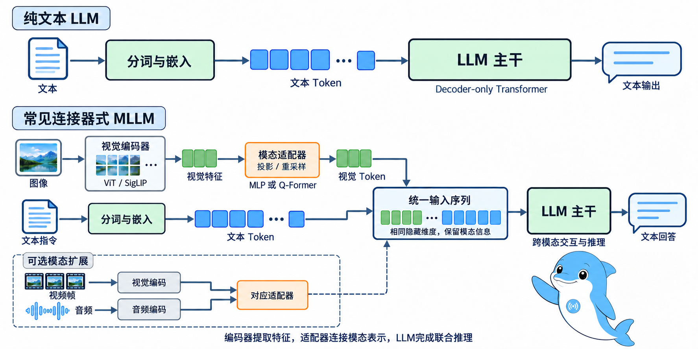
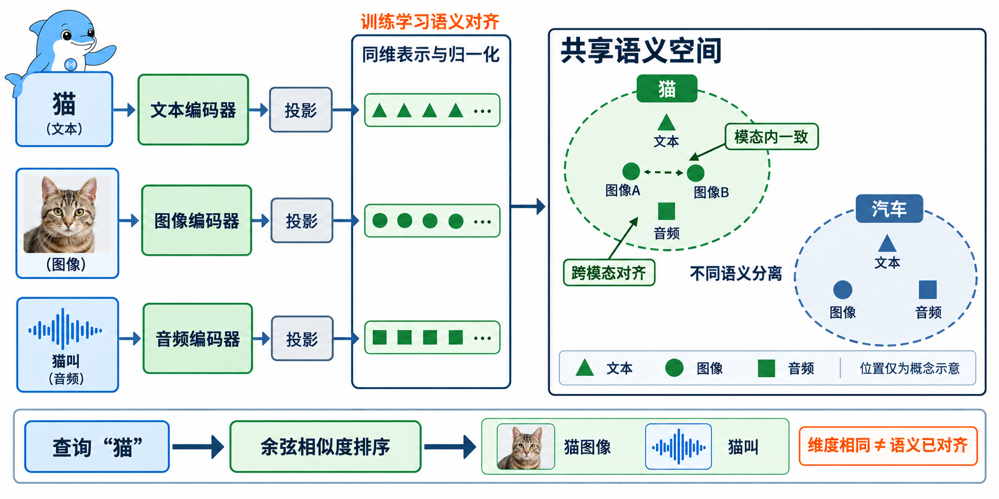
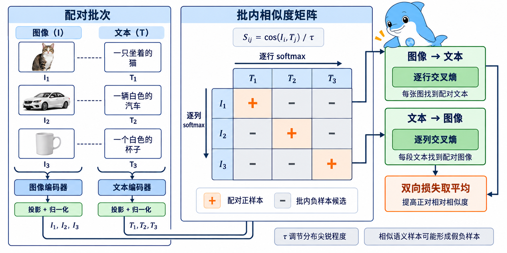
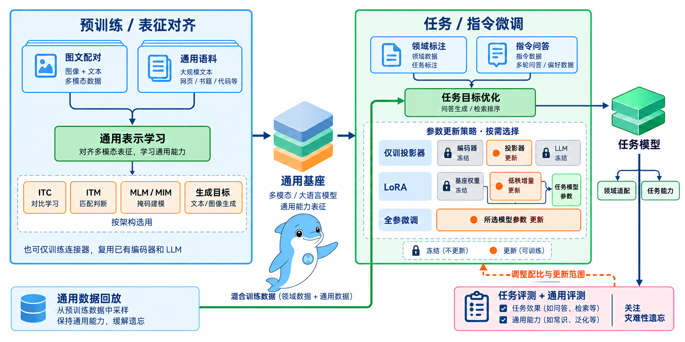
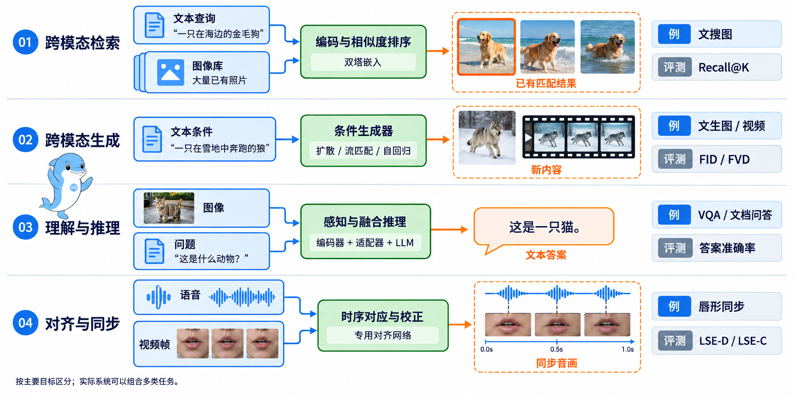

## 5.1 AI 多模态理论基础高频考点

> 本章是多模态部分的开篇，先把后文反复用到的基础概念讲清楚。内容依次包括 MLLM 与 LLM 在架构、数据和能力边界上的差异，多模态词嵌入与统一向量空间，预训练与微调各自的目标、方法和权衡，以及多模态任务按输入输出关系的分类。后续章节讨论编码器、映射器、生成器等核心组件时，会直接用到这些概念。

---

### [5.1.1 多模态与语言大模型的区别](#q511)
- [5.1.1.1 面试问题：多模态大模型与 LLM 在架构上有哪些关键差异？](#q5111)
- [5.1.1.2 面试问题：多模态模型的训练数据与 LLM 有什么本质不同？](#q5112)
- [5.1.1.3 面试问题：多模态模型与 LLM 在应用能力边界上有何差异？](#q5113)

### [5.1.2 多模态词嵌入的定义](#q512)
- [5.1.2.1 面试问题：多模态词嵌入相比传统词嵌入的本质区别是什么？](#q5121)
- [5.1.2.2 面试问题：多模态词嵌入需要满足哪些核心条件？如何形式化描述？](#q5122)

### [5.1.3 多模态中预训练和微调的区别](#q513)
- [5.1.3.1 面试问题：多模态预训练阶段的核心目标与训练任务是什么？](#q5131)
- [5.1.3.2 面试问题：多模态微调阶段的核心目标与常用方法是什么？](#q5132)
- [5.1.3.3 面试问题：预训练与微调在通用性、成本、能力保持上有何关键权衡？](#q5133)

### [5.1.4 多模态解决的代表性任务](#q514)
- [5.1.4.1 面试问题：多模态任务可以如何整体分类？分类依据是什么？](#q5141)
- [5.1.4.2 面试问题：四类代表性任务各自的典型落地场景与技术特征是什么？](#q5142)

### [附录 术语表](#q51g)

---

### 5.1.1 多模态与语言大模型的区别

#### 5.1.1.1 面试问题：多模态大模型与 LLM 在架构上有哪些关键差异？

**难度评分：⭐⭐ (2/5)  |  考察频率：⭐⭐⭐⭐ (4/5)**

多模态大模型（MLLM）是在语言大模型（LLM）的基础上加了视觉、听觉等感知能力，主干仍然是 LLM，如图 1-1 所示。两者在架构上的差异主要有两处，如表 1-1 所示。

1. **能处理的模态不同。** LLM 只收文本、只出文本，DeepSeek-V4-Pro 属于这一类，整体是一个 Decoder-only Transformer，输入输出都是 token 序列。MLLM 能同时处理文本、图像、音频甚至视频，比如给 LLaVA、Qwen-VL、BLIP-2 一张图，它们能回答"这是什么"。

2. **输入端多了两个模块。** LLM 只有一个 Transformer 主干，MLLM 在它前面加了两层组件。

    （1）**模态编码器**：把非文本模态编码成 token。CLIP-ViT-L 把一张图像编码成 256 或 576 个 1024 维的视觉 token，Whisper 编码器把一段音频编码成 1500 个语音 token。
    （2）**投影器（Projector）**：把非文本模态的向量映射到 LLM 的文本嵌入空间。LLaVA-1.5 用的是两层 GELU-MLP，把 CLIP-ViT-L 的 1024 维输出投到 Vicuna-7B（基于 LLaMA 2）的 4096 维隐藏空间。

训练时 LLM 基座可以冻结，LLaVA 1.0 的第一阶段就是这样做的；也可以放开一起训，LLaVA 1.5 的第二阶段解冻了 LLM。现在的 VLM 大多采用"编码器 → 投影器 → LLM"这套三段式结构。

表 1-1 LLM 与 MLLM 架构对照

| 维度 | LLM | MLLM |
|---|---|---|
| 输入模态 | 仅文本 | 文本 + 图像 + 视频 + 音频 |
| 输出模态 | 文本 | 文本（部分支持图/音/视频生成） |
| 主干结构 | Decoder-only Transformer | 模态编码器 + 投影器 + LLM 主干 |
| 关键新增模块 | 无 | 视觉编码器（CLIP-ViT、SigLIP）+ 音频编码器（Whisper、Mimi）+ 投影器（MLP、Q-Former、Pixel Shuffle） |
| 输入 token 形式 | 文本 token | 文本 token + 模态 token（拼接为统一序列） |
| 代表模型 | DeepSeek-V4-Pro | Qwen3-VL-235B-A22B-Thinking、InternVL3.5-241B-A28B、Gemini 3.5 Flash、LLaVA |

> **面试速答**：MLLM 以 LLM 为主干，差异主要在两处。一是模态，LLM 只处理文本，MLLM 还能处理图像、音频和视频。二是输入端多了模态编码器和投影器，编码器把非文本输入编码成 token，投影器再把它映射到 LLM 的文本嵌入空间。现在的 VLM 大多是编码器、投影器、LLM 三段式结构。

---

#### 5.1.1.2 面试问题：多模态模型的训练数据与 LLM 有什么本质不同？

**难度评分：⭐⭐⭐ (3/5)  |  考察频率：⭐⭐⭐⭐ (4/5)**

两者的数据差别主要看两点，一是数据的形态，二是不同数据按什么比例混在一起训练。

1. **LLM 的数据是纯文本序列。** 预训练用书籍、网页、论文等纯文本语料，规模一般在万亿 token 量级，LLaMA 2 用了 2 万亿 token，常见的数据组合有 Common Crawl、C4、RedPajama 等。训练目标是 next-token prediction，文本本身就是标签。

2. **MLLM 的数据以跨模态配对为主**，也就是"模态 A + 模态 B"成对出现，常见的有下面三类。

    （1）**图文对**：LAION-5B 约 58 亿组，LAION-COCO 6 亿组，CC12M 1200 万组。这些数据大多是从网页上爬下来的图片和它的 alt-text，量很大，标注质量参差不齐。
    （2）**视频-字幕对**：WebVid-10M 等。
    （3）**指令微调数据**：LLaVA-Instruct-150K 是纯文本 GPT-4 根据图像的描述和检测框写出来的，ShareGPT4V、ALLaVA-4V 则由 GPT-4V 直接看图生成，这类数据的规模在 15 万~500 万条之间。

3. **数据配比是多模态训练里很关键的一环。** 多模态训练一般不会只用图文对，会按一定比例混入纯文本数据，常见是 10%~30%，用来防止 LLM 基座的语言能力在多模态训练中退化。LLaVA-1.5 在指令微调阶段混入了纯文本的 ShareGPT 数据，即便如此，后续研究测得 LLaVA-1.5-13B 的 MT-Bench 分数仍从 Vicuna-13B 的 6.57 降到了 5.99。Qwen-VL 在多任务预训练阶段放了 780 万条纯文本数据，约占该阶段数据的一成，专门用来保住语言能力。

> **面试速答**：差别主要在数据形态和数据配比。LLM 用万亿 token 量级的纯文本，文本本身就是标签；MLLM 以跨模态配对数据为主，包括图文对、视频-字幕对和指令微调数据。多模态训练还会混入 10%~30% 的纯文本数据，防止 LLM 基座的语言能力退化。

---

#### 5.1.1.3 面试问题：多模态模型与 LLM 在应用能力边界上有何差异？

**难度评分：⭐⭐ (2/5)  |  考察频率：⭐⭐⭐ (3/5)**

LLM 处理语言相关的任务，MLLM 能处理需要整合多种模态信息的任务。MLLM 能做的事情更多，但在单项任务上不一定比专用模型强。

1. **LLM 做语言任务。** 文本生成、写代码、摘要、翻译、对话都属于这一类，代表模型是 DeepSeek-V4-Pro。这些任务的输入和输出都是文本序列。

2. **MLLM 把能力扩展到了跨模态场景**，落地较多的有下面几个。

    （1）**以图搜物**：电商的"拍照搜商品"，要同时理解图片内容和商品库里的文字描述。
    （2）**医学影像辅助诊断**：把 CT、MRI 图像和病历文本放在一起生成诊断建议，例如 Med-PaLM M。
    （3）**短视频内容合规审核**：同时看画面、配文和语音，判断视频是否违规。
    （4）**文档/OCR 理解**：解析财报表格、流程图、发票等结构复杂的文档，GPT-6、InternVL3.5、Qwen3-VL 都能做。

**两个常见误解**

1. **"MLLM 一定比 LLM 强"。** 在纯文本任务上，MLLM 通常比同规模的 LLM 稍弱，因为一部分模型容量花在了视觉对齐上。[5.1.1.2](#q5112) 提到的 LLaVA-1.5-13B 是一个例子，它的 MT-Bench 分数低于自己的语言基座 Vicuna-13B。

2. **"MLLM 能替代所有视觉专家模型"。** 在 OCR、细粒度分类、目标检测这些单项任务上，通用 MLLM 一般比不过专用模型（如 PaddleOCR、基于 EVA-CLIP 微调的下游模型）。MLLM 的长处在综合推理，任务需要同时看懂图像、理解问题、再结合常识作答时，专用模型替代不了它。

图 1-1 多模态输入扩展示意图

> **面试速答**：LLM 做文本进、文本出的语言任务，MLLM 能做需要整合多种模态信息的任务，比如以图搜物、医学影像辅助诊断和文档理解。MLLM 能做的事更多，但在纯文本任务上通常比同规模 LLM 稍弱，在 OCR、目标检测等单项任务上一般也比不过专用模型。它的长处在综合推理。

---

### 5.1.2 多模态词嵌入的定义

#### 5.1.2.1 面试问题：多模态词嵌入相比传统词嵌入的本质区别是什么？

**难度评分：⭐⭐⭐ (3/5)  |  考察频率：⭐⭐⭐⭐ (4/5)**

先说传统词嵌入。Word2Vec（2013）、GloVe 给每个词分配一个固定向量，常见是 300 维；BERT 输出的是上下文相关的向量，同一个词在不同句子里向量不同，BERT-base 是 768 维。不管哪一种，语义相近的词在向量空间里都离得近。"猫"和"猫咪"的向量很近，"猫"和"汽车"就离得远。

1. **传统词嵌入只在单一模态内部有效。** 文本、图像、音频的嵌入各在各的向量空间里，彼此没法直接比较，算不出文本"猫"和一张猫的照片有多相似。

2. **多模态词嵌入（也叫跨模态嵌入）把文本、图像、音频等不同类型的信息映射到同一个向量空间。** 和传统词嵌入相比，它在两个方向上做了扩展。

    （1）**输入的模态变多了**：除了文本，其他模态也能转成同一空间里的向量。
    （2）**"语义相近"的范围变大了**：语义相近、向量就接近，这条原则没变，只是"语义相近"从同义词扩展到了不同模态里的同一个概念。一段猫叫的音频、一张猫的照片、文本"猫"，三者的向量应该聚在同一区域，并且远离和"汽车"有关的向量，如图 1-2 所示。

代表工作是 CLIP。在它之前，DeViSE（2013）、VSE++ 等已经做过图文联合嵌入，但训练数据规模小，泛化能力有限。CLIP 在 4 亿图文对上训练，第一次在大规模数据上证明了统一向量空间行得通，并用它做零样本图像分类。分类时不需要任何标注数据做微调，只要计算图像向量和一组候选文本向量的相似度就能完成。

> **面试速答**：传统词嵌入只在单一模态内有效，多模态词嵌入把文本、图像、音频映射到同一个向量空间。语义相近、向量就接近，这条原则没变，只是"语义相近"扩展到了不同模态里的同一个概念，文本"猫"和猫的照片应该聚在一起。CLIP 在 4 亿图文对上证明了统一向量空间行得通。

---

#### 5.1.2.2 面试问题：多模态词嵌入需要满足哪些核心条件？如何形式化描述？

**难度评分：⭐⭐⭐⭐ (4/5)  |  考察频率：⭐⭐⭐⭐ (4/5)**

统一向量空间要同时满足两个条件。

1. **模态内一致性**：同一模态里语义相近的内容，向量也要接近。两张不同角度拍的猫，向量应该接近。这一条和传统词嵌入的要求一样。

2. **跨模态对齐性**：不同模态里语义一致的内容，向量也要接近。文本"猫"、猫的照片和猫叫的音频要聚在一起，并远离"汽车"相关的向量。传统词嵌入没有这项要求，它是多模态词嵌入特有的。

形式化地写，文本编码器 $f_t(\cdot)$ 和图像编码器 $f_v(\cdot)$ 分别把文本 $t$ 和图像 $v$ 映射到同一个 $d$ 维空间。对匹配的图文对 $\langle t, v \rangle$ 和不匹配的 $\langle t, v' \rangle$，要求

$$\text{sim}(f_t(t), f_v(v)) > \text{sim}(f_t(t), f_v(v'))$$

对比学习损失做的就是这件事，拉近匹配对，推远不匹配对。CLIP 的 InfoNCE 损失基于这个思路，在一个 batch 里（典型大小 32768）让样本互为负样本，算出相似度矩阵，再用交叉熵拟合对角线上的匹配对。

**两个条件缺一个会怎样？** 只有模态内一致性、没有跨模态对齐，比如 Word2Vec 配一个单独训练的 ResNet，就做不了跨模态检索。只追求跨模态对齐、不管模态内一致性，比如训练数据严重偏斜时，会出现"向量空间塌陷"，语义不同的样本被错误拉近，下游所有相似度计算都会失效。CLIP 训练时用大 batch 加对称对比损失，两个条件都照顾到了。

很多下游任务都建立在多模态词嵌入上。跨模态检索直接比较嵌入向量的相似度，多模态理解在对齐后的嵌入上做语义交互，跨模态生成也离不开它，Stable Diffusion 就是靠文本编码器的嵌入来控制生成条件。

图 1-2 跨模态嵌入空间示意图

> **面试速答**：要同时满足模态内一致性和跨模态对齐性，也就是同一模态里语义相近的内容向量接近，不同模态里语义一致的内容向量也接近。形式化地说，匹配图文对的相似度要大于不匹配对，CLIP 用 InfoNCE 对比损失拉近匹配对、推远不匹配对。缺了跨模态对齐就做不了跨模态检索，缺了模态内一致性可能出现向量空间塌陷。

---

### 5.1.3 多模态中预训练和微调的区别

#### 5.1.3.1 面试问题：多模态预训练阶段的核心目标与训练任务是什么？

**难度评分：⭐⭐⭐⭐ (4/5)  |  考察频率：⭐⭐⭐⭐⭐ (5/5)**

多模态大模型和纯文本 LLM 一样，先预训练、再微调。多模态训练多出来的一点是，跨模态对齐从预训练一直延续到微调。

**预训练的目标是对齐**，让模型把图像、文本、音频等不同模态的信息映射到同一个语义空间。用的数据以大规模弱标注配对数据为主（如 LAION-5B 的约 58 亿组图文对），同时混入一定比例的纯文本语料，保住模型的语言能力。

**预训练主要有三类任务**

1. **跨模态对比学习（ITC，Image-Text Contrastive）**：用 InfoNCE 损失拉近匹配的图文对、推远不匹配的，如图 1-3 所示，代表模型有 CLIP、ALIGN。

2. **图文匹配（ITM，Image-Text Matching）**：给模型一组图文对，让它判断是否匹配，是一个二分类任务。BLIP、ALBEF 在 ITC 之外又加了 ITM，用来学更细的跨模态交互。

3. **掩码建模（MLM / MIM）**：随机遮住文本里的部分 token 或图像里的部分 patch，让模型预测被遮住的内容，以此学习模态内的语义表示。BEIT-3、FLAVA 等模型用了这类任务。

**InfoNCE 损失公式**

图 1-3 对比学习示意图

$$\mathcal{L}_{\text{ITC}} = -\frac{1}{2N}\sum_{i=1}^{N}\left[\log\frac{e^{\text{sim}(t_i,v_i)/\tau}}{\sum_{j=1}^{N}e^{\text{sim}(t_i,v_j)/\tau}}+\log\frac{e^{\text{sim}(t_i,v_i)/\tau}}{\sum_{j=1}^{N}e^{\text{sim}(t_j,v_i)/\tau}}\right]$$

$\tau$ 是温度系数，CLIP 把它设成可学习参数，初始值 0.07；$N$ 是一个批次里的样本数，CLIP 默认 32768。方括号里的两项对应两个检索方向，第一项固定文本 $t_i$、在批内所有图像里找匹配，第二项固定图像 $v_i$、在批内所有文本里找匹配。两个方向都算，双向检索才都能对齐。

**预训练很贵。** 编码器、投影层和 LLM 基座都要做全参数或大规模参数更新。千亿参数级别的模型，一次预训练要花数百万美元，训练周期通常是几周到几个月。所以从零预训练多模态基座的基本只有头部厂商。

> **面试速答**：预训练的目标是跨模态对齐，把不同模态映射到同一个语义空间，数据以大规模弱标注配对数据为主，并混入纯文本保住语言能力。训练任务主要有跨模态对比学习 ITC、图文匹配 ITM 和掩码建模 MLM/MIM 三类。这一阶段要大规模更新参数，成本很高，从零训练的基本只有头部厂商。

---

#### 5.1.3.2 面试问题：多模态微调阶段的核心目标与常用方法是什么？

**难度评分：⭐⭐⭐ (3/5)  |  考察频率：⭐⭐⭐⭐⭐ (5/5)**

**微调是把通用基座适配到具体的下游任务。** 比如做医疗影像检索，可以用 10 万条标注好的影像-报告配对数据来微调；做某个电商平台的商品识别，就用这个平台自己的商品图文对做领域迁移。

**训练目标跟着下游任务走**

1. **视觉问答（VQA）**：以问答对话的形式微调，优化 next-token prediction 损失，代表数据集有 VQAv2、GQA、ScienceQA。

2. **跨模态检索**：优化对比损失或排序损失（triplet loss），常见于电商搜索。

3. **图像描述生成（Image Captioning）**：优化语言模型的交叉熵损失，代表数据集有 COCO Captions、Flickr30k。

4. **文档理解**：混合 VQA 与 OCR-aware 损失，代表数据集有 DocVQA、ChartQA。

**微调更看重计算效率**，主流做法有三类。

1. **参数高效微调（PEFT）**：LoRA、Adapter、Prefix-Tuning 等方法只更新不到 1% 的参数。其中用得最多的是 LoRA，开源 VLM 的社区微调大多基于它。2023~2024 年又出现了几种改进，DoRA 做权重分解，进一步缩小和全参微调的差距；LoftQ 把低比特量化和 LoRA 放在一起初始化；PiSSA 用主奇异值初始化，收敛更快。在 Qwen3-VL、InternVL3.5 等新一代基座的社区微调里，这几种方法都有人在用。

2. **冻结 + 仅训映射器**：LLM 基座和视觉编码器都冻结，只训练几 M 参数的投影层。LLaVA 1.0 第一阶段就是这么做的，适合算力很紧张或者只需要小幅领域迁移的情况。

3. **全参数微调**：在医疗、金融等高价值场景，也会对 LLM 基座做全参数更新，但要混入通用数据来缓解灾难性遗忘。

成本上，微调一般只要数百到数千美元，训练几小时到几天，单卡或 8 卡 A100/H100 就能跑完。开源社区能做出大量基于 LLaVA、Qwen-VL 的领域变体，靠的就是这个成本。

> **面试速答**：微调的目标是把通用基座适配到具体下游任务，训练目标跟着任务走，VQA 优化 next-token prediction 损失，检索优化对比或排序损失。方法上更看重计算效率，主流是 LoRA 等参数高效微调，也可以冻结基座只训投影层，高价值场景才做全参数微调并混入通用数据。成本一般在数百到数千美元。

---

#### 5.1.3.3 面试问题：预训练与微调在通用性、成本、能力保持上有何关键权衡？

**难度评分：⭐⭐⭐⭐ (4/5)  |  考察频率：⭐⭐⭐⭐ (4/5)**

1. **通用性与专用性。** 预训练出来的模型通用能力强，LLaVA-1.5、Qwen-VL、InternVL 等基座在 MMBench、MME、ScienceQA 这些通用榜单上表现比较均衡，但直接拿到医疗影像、工业质检这类垂直领域，往往达不到上线部署的要求。微调后的模型在目标任务上会明显变好，通用能力则可能下降。

2. **成本。** 预训练一次数百万到上千万美元、训练几周；微调一般只要数百到数千美元，训练几小时到几天。两者差了三个数量级以上，产业分工也由此而来，基座模型由少数头部团队训练，下游应用团队只做微调。

3. **能力保持。** 微调阶段最要防的是灾难性遗忘，模型在专用任务上训练之后，通用任务的表现大幅下降。例如在医疗影像上做完全参数微调，再让它"描述一下这张自然风景照"，它可能已经描述不好了。

**缓解灾难性遗忘的常见做法**

1. **混入通用数据**：在微调数据里掺入 10%~30% 的通用指令数据（如 LLaVA-Instruct），保住模型的基础能力。

2. **LoRA 冻结基座**：LoRA 只训练低秩增量，基座的原始权重保持不动，遗忘比全参微调轻得多。

3. **选择性冻结**：冻结视觉编码器和 LLM 基座，只微调投影层和部分顶层，尽量多保留预训练学到的知识。

**怎么选。** 如表 1-2 所示，下游任务和预训练数据分布差不多时，比如通用 VQA、图像描述，优先用 LoRA 加少量领域数据。分布差得远的医疗、工业场景，就需要全参数微调，同时一定要混入通用数据。只做轻量的领域迁移，比如风格定制，只训投影层也可以。

表 1-2 预训练与微调对照

| 维度 | 预训练 | 微调 |
|---|---|---|
| 核心目标 | 跨模态对齐 + 通用语义建模 | 适配特定下游任务/领域 |
| 数据规模 | 数十亿~百亿级配对数据（LAION-5B、DataComp-1B） | 数千~百万条任务数据（VQAv2、DocVQA、领域私有数据） |
| 数据来源 | 互联网弱标注爬取 + 合成 caption（蒸馏） | 人工标注 + 蒸馏 + 领域专家标注 |
| 训练参数量 | 编码器 + 投影器 + LLM 基座全量或大规模更新 | PEFT < 1%（LoRA/DoRA）/ 仅投影器 ~M 级 / 全参微调 |
| 单次成本 | 数百万~千万美元 | 数百~数千美元 |
| 训练周期 | 数周~数月 | 数小时~数天 |
| 算力需求 | 千卡 A100/H100/H200 集群 | 单卡或 8 卡 A100/H100 |
| 主要风险 | 数据配比失衡导致能力失衡、训练崩溃 | 灾难性遗忘 |
| 产业角色 | 头部团队（OpenAI、Google、Anthropic、阿里、上海 AI Lab、智谱） | 应用厂商、开源社区、垂直行业团队 |

先预训练、再微调，如图 1-4 所示。

图 1-4 预训练与微调流程示意图

> **面试速答**：预训练换来通用性，微调换来目标任务上的效果，代价是通用能力可能下降。两者成本差三个数量级以上，所以基座由少数头部团队训练，应用团队只做微调。微调最要防灾难性遗忘，常用混入 10%~30% 通用数据、LoRA 冻结基座和选择性冻结来缓解。

---

### 5.1.4 多模态解决的代表性任务

#### 5.1.4.1 面试问题：多模态任务可以如何整体分类？分类依据是什么？

**难度评分：⭐⭐ (2/5)  |  考察频率：⭐⭐⭐ (3/5)**

多模态任务最清楚的分法，是看输入输出模态之间的关系，如图 1-5 所示，也就是输入是什么模态、输出是什么模态、两者之间是检索、转换还是整合。按这个标准可以分成四类，如表 1-3 所示。

1. **跨模态检索（Cross-modal Retrieval）**：输入一种模态，在另一种模态里找出匹配的结果，典型如文搜图、图搜文。

2. **跨模态生成（Cross-modal Generation）**：输入一种模态，生成另一种模态的新内容，典型如文生图、文生视频、TTS。

3. **多模态理解与推理（Multimodal Understanding & Reasoning）**：同时接收多种模态，输出理解或推理的结果（通常是文本），典型如 VQA、文档问答。

4. **跨模态对齐与转换（Cross-modal Alignment & Translation）**：把同一内容在不同模态之间转换或同步，典型如风格迁移、音画同步。

**为什么按输入输出关系来分？** 有两个工程上的原因。

1. **技术路线差异大**：检索任务靠对比学习得到的嵌入空间（CLIP 系），生成任务靠扩散模型或自回归解码器（SD、Wan 系），理解推理任务靠 VLM 三段式架构（LLaVA 系），对齐转换任务靠专门的对齐网络（Wav2Lip 等）。分出了类别，技术选型也就基本定了。

2. **评测基准不同**：检索看 R@1/R@5，生成看 FID/CLIP-Score，理解推理看 VQA Accuracy/MMBench，对齐看 Sync 指标。类别分清了，才知道该用哪套评测基准。

也可以按模态组合分成图文、视频、音频等，但这样分，同一类里会混着技术路线完全不同的任务，边界不清楚。

> **面试速答**：按输入输出模态之间的关系分成四类，跨模态检索、跨模态生成、多模态理解与推理、跨模态对齐与转换。这样分是因为四类的技术路线和评测基准各不相同，类别分清了，技术选型和评测方案也就基本定了。按图文、视频、音频这样的模态组合来分，同一类里会混着技术路线完全不同的任务。

---

#### 5.1.4.2 面试问题：四类代表性任务各自的典型落地场景与技术特征是什么？

**难度评分：⭐⭐⭐ (3/5)  |  考察频率：⭐⭐⭐⭐ (4/5)**

1. **跨模态检索。** 最常见的是图文检索。电商的"拍照搜商品"是以图搜商品，淘宝图搜、京东拍照购都属于这一类；搜索引擎的图片搜索是以文搜图。视频检索的典型场景在安防，输入一段文字描述，就能在监控视频里定位目标片段。技术上依赖统一嵌入空间，常用 CLIP，中文场景用 Chinese-CLIP，图搜领域用 EVA-CLIP。推理时只需要算相似度，延迟低，容易大规模部署。它也是最早在产业里落地的多模态任务。

2. **跨模态生成。** 这是目前 AIGC 领域最活跃的方向，主要任务和代表作品如下。

    （1）**文本生成图像**：根据一段文字描述画出对应的图片，风格、构图和画面内容都由文字控制。代表作 FLUX.2。
    （2）**文本生成视频**：根据文字描述生成一段画面连贯的视频，新一代模型还能同步生成对白和音效。代表作 Veo 3.1。
    （3）**图像描述生成**：看一张图，用文字说出图里有什么、正在发生什么。代表作 Qwen3-VL。
    （4）**文字转语音（TTS）**：把文字读成自然的语音，给几秒钟参考音频还能模仿指定的音色。代表作 CosyVoice。
    （5）**语音转文字（ASR）**：把一段语音转写成文字。代表作 Whisper。
    （6）**语音驱动数字人**：输入一张人像照片和一段语音，生成这个人开口说话的视频，口型和表情跟着语音变化。代表作 EchoMimic。

    图像和视频生成主要用扩散模型，语音和对话主要用自回归解码器。这类任务的训练成本比检索类高得多，但生成的内容可以直接交付使用。

3. **多模态理解与推理。** 典型任务是视觉问答（VQA），输入一张图和一个相关问题，比如"图中的猫戴了帽子吗？"，模型给出答案。工业上的落地场景有下面几类。

    （1）**短视频内容合规审核**：综合画面、配文、语音判断内容是否违规，抖音、快手等平台都有大规模部署。
    （2）**医疗辅助诊断**：结合 CT 影像和病历文本做辅助诊断，例如 Med-PaLM M、RadFM。
    （3）**文档理解**：解析财报、发票、合同等结构复杂的文档，InternVL3.5、Qwen3-VL 在 DocVQA、ChartQA、TableVQA 等任务上已有工业落地。
    （4）**GUI Agent**：看懂界面后操控浏览器和桌面 App，Qwen3-VL Thinking、InternVL3.5 和 Gemini 3.5 Flash 都具备这种能力。

    技术上用的是三段式 VLM 架构（编码器 + 投影器 + LLM），开源的 LLaVA、Qwen-VL、InternVL 系列和闭源的 Gemini、GPT-6 主攻的都是这类任务。2025 年起，这个方向开始往"统一多模态"（UMM）发展，把理解和生成放进同一个模型，代表有 Janus-Pro 和 InternVL-U。

4. **跨模态对齐与转换。** 代表任务有三个。

    （1）**图像风格迁移**：把照片转成梵高风格的画，代表方法有 Neural Style Transfer（Gatys 等，2015）、AdaIN、InstantStyle。
    （2）**音画对齐（唇形同步）**：让视频里人物的唇形和语音对上，代表有 Wav2Lip、SadTalker，常用在视频配音、数字人直播和外语配音自动化上。
    （3）**跨语言对齐**：多语言多模态模型（如 MuMu、PaLI-X）让同一张图在不同语言下的描述保持一致。

    它们常常是其他多模态任务的中间环节，视频生成里的音画同步就是一例。单独部署时一般用专用模型，不用通用 VLM，因为专用模型对时序和空间的控制更精确。

表 1-3 四类多模态任务对照

| 任务类型 | 输入→输出关系 | 主流技术路线 | 评测指标 | 代表落地场景 |
|---|---|---|---|---|
| 跨模态检索 | 一种模态 → 另一种模态匹配结果 | 双塔编码器 + 对比学习 | R@1 / R@5 / R@10 | 拍照搜商品、图片搜索、安防视频检索 |
| 跨模态生成 | 一种模态 → 另一种模态全新内容 | 扩散 / 流匹配 / 自回归 / Vocoder | FID / FVD / CLIP-Score / MOS | 文生图/视频/语音、数字人 |
| 多模态理解与推理 | 多种模态 → 文本回答 | 三段式 VLM（编码器+投影器+LLM） | VQA Accuracy / MMBench / MMMU / DocVQA | VQA、医疗诊断、文档理解、GUI Agent |
| 跨模态对齐与转换 | 同一内容在模态间转换/同步 | 专用对齐网络 / Adapter / 风格 ControlNet | Sync / LSE-D / 风格相似度 | 音画同步、风格迁移、配音 |

图 1-5 多模态任务分类示意图

> **面试速答**：检索用于拍照搜商品和安防视频检索，靠 CLIP 类统一嵌入空间，延迟低、易部署。生成覆盖文生图、文生视频、TTS 和数字人，主要用扩散模型和自回归解码器，训练成本高。理解推理用于内容审核、文档理解和 GUI Agent，基于三段式 VLM。对齐转换做风格迁移和唇形同步，多用专用模型。

---

### 附录 术语表

**缩写**

1. **ViT**：Vision Transformer，把图像切成固定大小的 patch，每个 patch 线性投影成一个 token，再送进 Transformer 编码。CLIP-ViT-L 指 CLIP 里的 ViT-Large 视觉编码器。（[5.1.1.1](#q5111)）

2. **MLP / GELU**：MLP 是 Multi-Layer Perceptron，多层感知机；GELU 是 Gaussian Error Linear Unit，一种平滑的激活函数。LLaVA-1.5 的投影器是两层线性层中间夹一个 GELU。（[5.1.1.1](#q5111)）

3. **VLM**：Vision-Language Model，视觉语言模型。（[5.1.1.1](#q5111)）

4. **SigLIP**：Sigmoid Loss for Language Image Pre-training，Google 提出的 CLIP 改进版，把批内 softmax 对比损失换成逐对的 sigmoid 二分类损失，常用作视觉编码器。（[5.1.1.1](#q5111)）

5. **Q-Former**：Querying Transformer，BLIP-2 提出的投影器，用一组可学习的查询向量通过交叉注意力从视觉特征里提取固定数量的 token。（[5.1.1.1](#q5111)）

6. **C4**：Colossal Clean Crawled Corpus，从 Common Crawl 网页数据清洗出的英文语料，常用于 LLM 预训练。（[5.1.1.2](#q5112)）

7. **LAION / CC12M**：LAION 是德国非营利组织 Large-scale Artificial Intelligence Open Network，发布了 LAION-5B 等开放图文数据集；CC12M 是 Conceptual 12M，Google 发布的图文对数据集。（[5.1.1.2](#q5112)）

8. **MT-Bench**：Multi-Turn Benchmark，多轮对话评测集，用 GPT-4 当裁判给回答打 1 到 10 分，常用来看模型的对话和指令遵循能力。（[5.1.1.2](#q5112)）

9. **CT / MRI**：CT 是 Computed Tomography，计算机断层扫描；MRI 是 Magnetic Resonance Imaging，磁共振成像。两者都是常见的医学影像。（[5.1.1.3](#q5113)）

10. **OCR**：Optical Character Recognition，光学字符识别，把图片里的文字识别成文本。（[5.1.1.3](#q5113)）

11. **BERT**：Bidirectional Encoder Representations from Transformers，Google 在 2018 年提出的双向 Transformer 编码器。（[5.1.2.1](#q5121)）

12. **GloVe**：Global Vectors for Word Representation，斯坦福在 2014 年提出，基于全局词共现统计训练词向量。（[5.1.2.1](#q5121)）

13. **DeViSE / VSE++**：DeViSE 是 Deep Visual-Semantic Embedding，把图像特征映射到词向量空间做零样本识别；VSE++ 是视觉语义嵌入（Visual-Semantic Embedding）的改进版，在三元组损失里重点使用最难的负样本。（[5.1.2.1](#q5121)）

14. **ResNet**：Residual Network，残差网络，用跨层残差连接训练很深的卷积网络，是常见的图像骨干网络。（[5.1.2.2](#q5122)）

15. **SD**：Stable Diffusion，在压缩后的潜空间里做扩散的文生图模型。（[5.1.2.2](#q5122)）

16. **R@K**：Recall@K，检索时正确结果出现在前 K 个返回结果里的查询比例，常用 R@1、R@5。（[5.1.4.1](#q5141)）

17. **FID / FVD**：FID 是 Fréchet Inception Distance，用 Inception 网络提取特征，比较生成图像和真实图像的分布距离，越低越好；FVD 是 Fréchet Video Distance，用于视频。（[5.1.4.1](#q5141)）

18. **CLIP-Score**：用 CLIP 计算生成图像和文本描述的相似度，衡量图文是否一致。（[5.1.4.1](#q5141)）

19. **AIGC**：AI-Generated Content，人工智能生成内容。（[5.1.4.2](#q5142)）

20. **AdaIN**：Adaptive Instance Normalization，自适应实例归一化，用风格图特征的均值和方差替换内容图特征的统计量，实现风格迁移。（[5.1.4.2](#q5142)）

21. **MOS**：Mean Opinion Score，平均意见分，由人工给语音质量打 1 到 5 分。（[5.1.4.2](#q5142)）

22. **MMMU**：Massive Multi-discipline Multimodal Understanding，考大学水平多学科图文题的评测基准。（[5.1.4.2](#q5142)）

23. **LSE-D**：Lip Sync Error Distance，唇形同步误差距离，用 SyncNet 计算唇部画面和语音特征的距离，越低说明口型越准。（[5.1.4.2](#q5142)）

**重要概念**

1. **模态（Modality）**：信息的表现形式，如文本、图像、音频、视频。多模态指同时处理两种及以上的模态。（[5.1.1.1](#q5111)）

2. **Token**：模型处理的基本单元。文本 token 一般是子词，视觉 token 对应图像里一个 patch 或一块区域编码后的向量。（[5.1.1.1](#q5111)）

3. **Decoder-only Transformer**：只用 Transformer 解码器堆叠的结构，靠因果注意力按顺序预测下一个 token，是当前 LLM 的主流结构。（[5.1.1.1](#q5111)）

4. **next-token prediction**：根据前面的 token 预测下一个 token 的训练目标。（[5.1.1.2](#q5112)）

5. **指令微调（Instruction Tuning）**：用"指令加回答"格式的数据训练，让模型学会按用户要求作答。（[5.1.1.2](#q5112)）

6. **弱标注**：来源粗糙、没有经过逐条人工校对的标注，如网页爬取的图片和 alt-text（图片的替代文本）。（[5.1.3.1](#q5131)）

7. **Patch**：图像切成的固定大小小块，ViT 里每个 patch 对应一个 token。（[5.1.3.1](#q5131)）

8. **温度系数（$\tau$）**：对比损失里缩放相似度的参数，越小，相似度分布越尖锐。（[5.1.3.1](#q5131)）

9. **扩散模型**：训练时逐步给数据加噪，再让网络学会一步步去噪，推理时从纯噪声出发生成样本，是图像和视频生成的主流方法。（[5.1.4.1](#q5141)）

10. **自回归解码器**：按顺序一个接一个生成 token 的解码方式，LLM 就用它生成文本。（[5.1.4.1](#q5141)）

11. **双塔编码器**：图像和文本各用一个独立编码器，分别算出向量后再比相似度。CLIP 是这种结构，检索时可以提前算好候选库的向量。（[5.1.4.2](#q5142)）

12. **流匹配（Flow Matching）**：学习一个把噪声分布搬到数据分布的速度场，推理时沿这条路径积分得到样本。（[5.1.4.2](#q5142)）

13. **声码器（Vocoder）**：把梅尔频谱等声学特征还原成音频波形的模型，如 HiFi-GAN。（[5.1.4.2](#q5142)）

14. **ControlNet**：给扩散模型加一个可训练的旁路分支，用线稿、深度图、姿态等额外条件控制生成结果。（[5.1.4.2](#q5142)）
