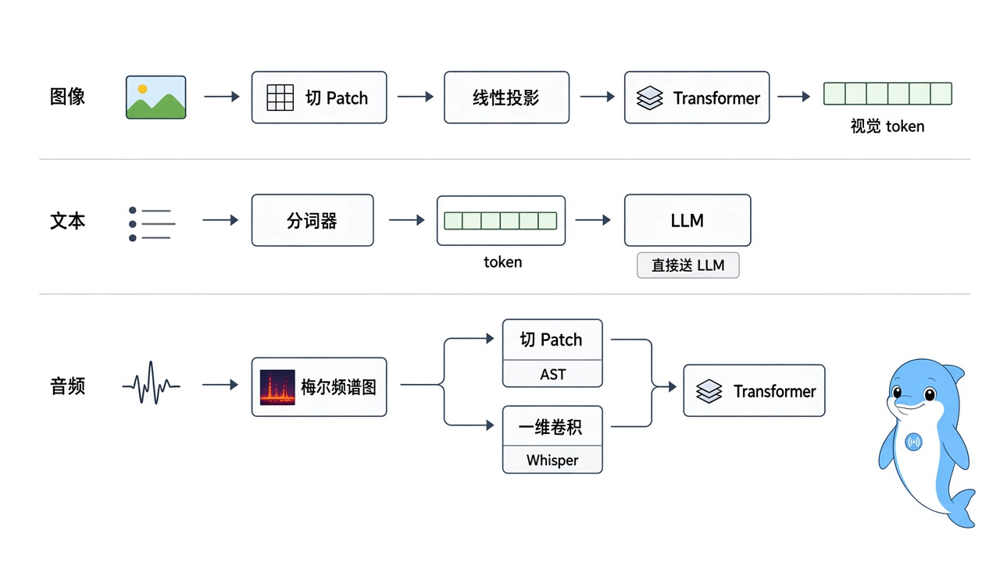
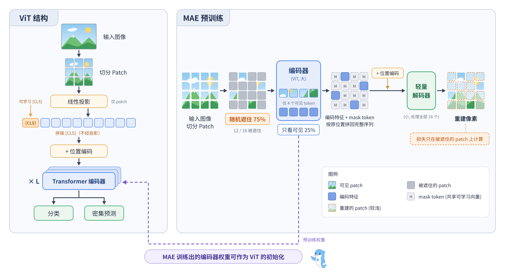
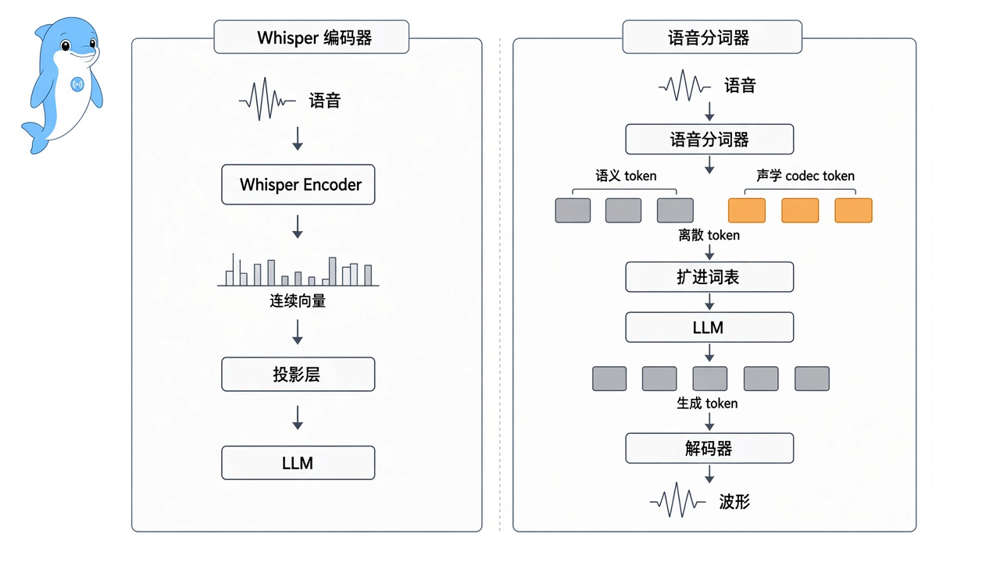
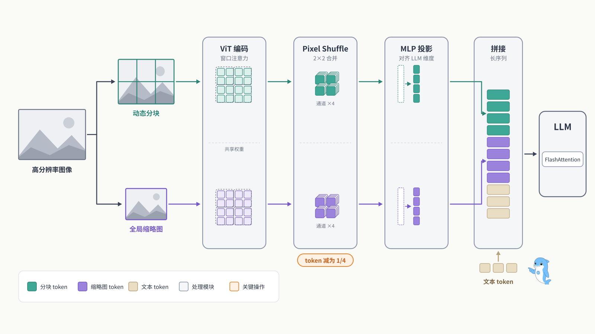
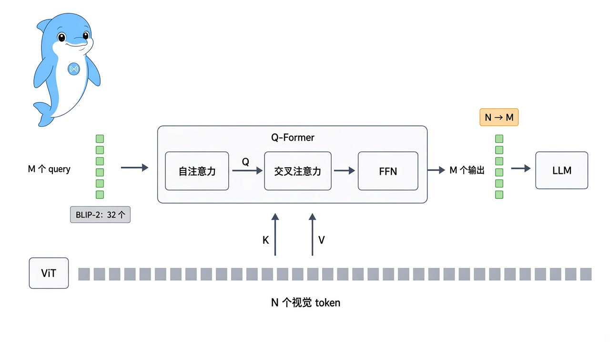
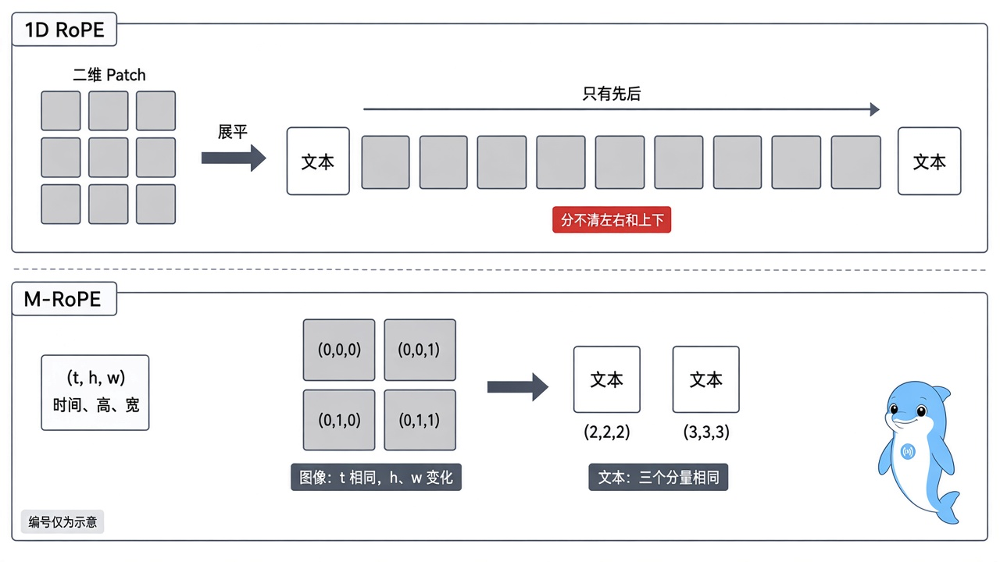
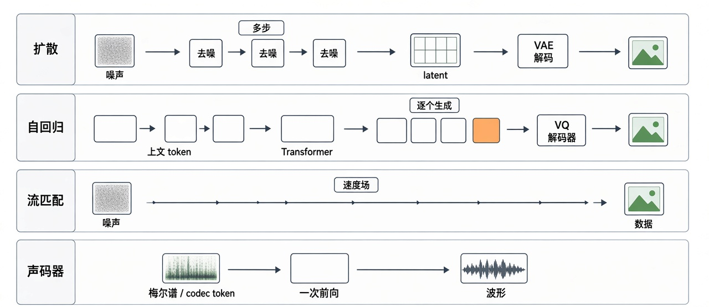
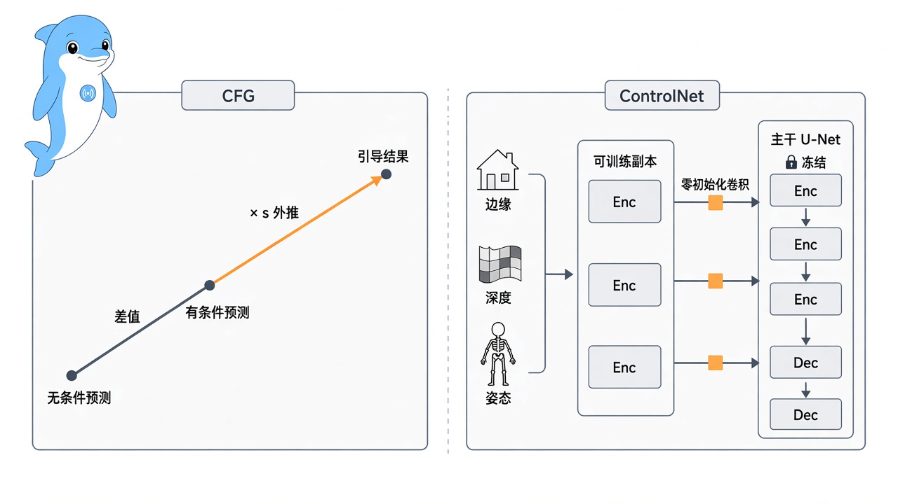

## 5.2 AI 多模态核心组件高频考点

> 本章接着 5.1 的基础概念，拆开多模态大模型的三类主要组件：编码器、映射器和生成器。先讲编码器怎样把图像、语音变成向量序列，再讲映射器怎样把这些向量接进 LLM，最后讲扩散、自回归、流匹配和声码器几类生成器怎样把模型输出还原成图像、视频和语音。后面讲基石模型和主流模型时，会直接用这三类组件拆解架构。

---

### [5.2.1 多模态模型中使用编码器的主要作用，以及它在不同模态中的职责](#q5-2-1)
- [5.2.1.1 面试问题：编码器在多模态模型中的核心作用是什么？为什么不可或缺？](#q5-2-1-1)
- [5.2.1.2 面试问题：视觉、文本、音频三类编码器的处理流程有何差异？](#q5-2-1-2)
- [5.2.1.3 面试问题：编码器的输出能否直接送入 LLM？为什么需要后续模块？](#q5-2-1-3)

### [5.2.2 视觉表示编码器 ViT 和 MAE，包括结构特点、预训练方式](#q5-2-2)
- [5.2.2.1 面试问题：ViT 的网络结构与工作流程是什么？](#q5-2-2-1)
- [5.2.2.2 面试问题：ViT 原始的有监督预训练方式有何局限？](#q5-2-2-2)
- [5.2.2.3 面试问题：MAE 的预训练策略与关键设计是什么？为什么遮蔽率高达 75%？](#q5-2-2-3)
- [5.2.2.4 面试问题：ViT 与 MAE 在主流多模态模型中如何被使用？](#q5-2-2-4)

### [5.2.3 音频表示编码器 Whisper 和语音 Tokenizer，说明模型结构、预训练目标](#q5-2-3)
- [5.2.3.1 面试问题：Whisper 编码器的模型结构与训练目标是什么？](#q5-2-3-1)
- [5.2.3.2 面试问题：语音 Tokenizer 是什么？与 Whisper 编码器有何区别？](#q5-2-3-2)
- [5.2.3.3 面试问题：在多模态模型中如何选型？Whisper 与语音 Tokenizer 各自适合什么场景？](#q5-2-3-3)

### [5.2.4 多模态模型在处理高分辨率视觉输入时常用的策略](#q5-2-4)
- [5.2.4.1 面试问题：高分辨率视觉输入为何对 ViT 构成挑战？](#q5-2-4-1)
- [5.2.4.2 面试问题：动态分块方案如何工作？有何优缺点？](#q5-2-4-2)
- [5.2.4.3 面试问题：多尺度编码与自适应分辨率分别解决什么问题？](#q5-2-4-3)
- [5.2.4.4 面试问题：Token 压缩与稀疏注意力如何缓解长序列压力？](#q5-2-4-4)

### [5.2.5 多模态模型中“映射器”的核心作用与设计目标](#q5-2-5)
- [5.2.5.1 面试问题：为什么多模态模型必须引入映射器？它解决了什么问题？](#q5-2-5-1)
- [5.2.5.2 面试问题：映射器的输入输出形式是什么？设计目标有哪些？](#q5-2-5-2)

### [5.2.6 多模态中常见的输入映射器有哪些类型？基本结构如何？](#q5-2-6)
- [5.2.6.1 面试问题：主流输入映射器的分类维度与代表方案有哪些？](#q5-2-6-1)
- [5.2.6.2 面试问题：四类映射器的基本结构与计算流程对比](#q5-2-6-2)

### [5.2.7 四类主流映射器各自的设计动机、优势与适用场景是什么？](#q5-2-7)
- [5.2.7.1 面试问题：Linear Projection（线性投影）的优点与适用场景](#q5-2-7-1)
- [5.2.7.2 面试问题：MLP 映射器相比线性投影有何优势？](#q5-2-7-2)
- [5.2.7.3 面试问题：Cross-Attention 式映射器（Q-Former）的核心思想是什么？](#q5-2-7-3)
- [5.2.7.4 面试问题：Conv Mapper 适合的模态与场景有哪些？](#q5-2-7-4)

### [5.2.8 在输入映射器中加入位置编码与模态类型编码，分别起到什么作用？](#q5-2-8)
- [5.2.8.1 面试问题：映射器中加入位置编码（Position Embedding）的作用是什么？](#q5-2-8-1)
- [5.2.8.2 面试问题：加入模态类型编码（Modality Type Embedding）的作用是什么？](#q5-2-8-2)

### [5.2.9 多模态生成器在整体架构中的作用与设计目标](#q5-2-9)
- [5.2.9.1 面试问题：多模态生成器的角色分工是什么？](#q5-2-9-1)
- [5.2.9.2 面试问题：生成器需要满足哪些核心设计目标？](#q5-2-9-2)

### [5.2.10 主流模态生成器有哪些类型？基本结构如何？](#q5-2-10)
- [5.2.10.1 面试问题：主流生成器的分类维度与代表方案有哪些？](#q5-2-10-1)
- [5.2.10.2 面试问题：各类生成器的基本结构与计算流程对比](#q5-2-10-2)

### [5.2.11 主流生成器各自的设计动机、优势与适用场景是什么？](#q5-2-11)
- [5.2.11.1 面试问题：扩散模型生成器（DDPM/LDM/SD3/FLUX）的核心机制与适用场景](#q5-2-11-1)
- [5.2.11.2 面试问题：自回归生成器（Chameleon/Emu3/Janus-Pro）的核心机制与适用场景](#q5-2-11-2)
- [5.2.11.3 面试问题：流匹配生成器（Flow Matching/Rectified Flow）的核心机制与优势](#q5-2-11-3)
- [5.2.11.4 面试问题：Vocoder 类生成器（HiFi-GAN/EnCodec/VALL-E）的核心机制与适用场景](#q5-2-11-4)

### [5.2.12 模态生成器训练与推理的关键工程权衡](#q5-2-12)
- [5.2.12.1 面试问题：条件控制与内容创造的权衡如何处理？](#q5-2-12-1)
- [5.2.12.2 面试问题：训练与推理阶段如何缓解模态鸿沟问题？](#q5-2-12-2)
- [5.2.12.3 面试问题：主流采样策略与推理加速方法有哪些？](#q5-2-12-3)

### [附录 术语表](#q52g)

---

### 5.2.1 多模态模型中使用编码器的主要作用，以及它在不同模态中的职责

#### 5.2.1.1 面试问题：编码器在多模态模型中的核心作用是什么？为什么不可或缺？

**难度评分：⭐⭐ (2/5)  |  考察频率：⭐⭐⭐⭐ (4/5)**

编码器把原始信号转成模型能处理的向量序列。图像是像素矩阵，音频是波形，视频是一串连续的帧，这些数据 LLM 都没法直接读。

LLM 的输入端只接收嵌入向量。文本先由分词器切成 token，再查嵌入表变成向量；图像、音频没有现成的词表可查，只能先由编码器把原始信号转成语义向量，才能接进 LLM。缺了编码器，非文本模态就进不了模型。

> **面试速答**：编码器把图像像素、音频波形、视频帧这些原始信号转成模型能处理的向量序列。LLM 只接收嵌入向量，文本可以查嵌入表，图像和音频没有现成的词表，必须先经编码器转成语义向量，所以缺了编码器，非文本模态就进不了模型。

---

#### 5.2.1.2 面试问题：视觉、文本、音频三类编码器的处理流程有何差异？

**难度评分：⭐⭐ (2/5)  |  考察频率：⭐⭐⭐⭐ (4/5)**

三类编码器的前处理各不相同，主干基本都是 Transformer。

1. **视觉编码器。** 处理图像和视频帧，主流方案是 ViT（Vision Transformer）。ViT 把图像切成固定大小的图块（patch），ViT-B/16 用 16×16，CLIP 常用的 ViT-L/14 用 14×14，每个 patch 经线性投影变成一个 token，再送进 Transformer 编码。输出是一组视觉 token，每个 token 对应图像里的一块区域。视频要先抽帧，每帧单独过 ViT，再把各帧的 token 拼起来。

2. **文本编码器。** 文本经分词器（Tokenizer）切成 token 序列，再由 Transformer 编码。多模态大模型里，文本一般直接交给 LLM 基座处理，不另配文本编码器。

3. **音频编码器。** 处理语音和其他声音。常见做法是先把波形转成梅尔频谱图（Mel Spectrogram），得到“频率×时间”的二维特征，后面的处理有两种。

    （1）**当作图像**：AST（Audio Spectrogram Transformer）把频谱图当图像切 patch。

    （2）**当作时间序列**：Whisper 沿时间轴用一维卷积下采样，再送进 Transformer。

    代表模型有 Whisper 编码器，以及专为语音大模型训练的语音 Tokenizer，如 SpeechTokenizer、Mimi。

三者都是先把连续信号切成片段、映射成向量，再用 Transformer 建模片段之间的长距离依赖，差别主要在前处理，如图 2-1 所示。

图 2-1 三类编码器处理流程示意图

> **面试速答**：三类编码器的主干基本都是 Transformer，差别在前处理。视觉编码器以 ViT 为主，把图像切成 patch 再线性投影成 token；文本由分词器切成 token，多模态模型里一般直接交给 LLM 处理；音频先转成梅尔频谱图，再按图像切 patch，或沿时间轴卷积下采样。

---

#### 5.2.1.3 面试问题：编码器的输出能否直接送入 LLM？为什么需要后续模块？

**难度评分：⭐⭐⭐ (3/5)  |  考察频率：⭐⭐⭐ (3/5)**

不能直接送，原因有两个。

1. **维度不匹配。** 视觉编码器 CLIP-ViT-L 的输出是 1024 维，LLaMA-7B 的隐藏维度是 4096，两者拼不成一条序列。

2. **语义空间不一致。** 视觉编码器在图文对比学习任务上预训练，输出分布在视觉特征空间；LLM 的 token 嵌入分布在它自己的语言空间。两者都是向量，坐标系却不同，不经对齐直接送进去，LLM 没法把它们当成有意义的输入。

所以编码器和 LLM 之间要加一个投影模块，负责维度变换和空间对齐，也就是映射器（Projector）。常见实现有单层线性投影（LLaVA-1.0）、两层 MLP（LLaVA-1.5）和 Q-Former（BLIP-2）。编码器只管把原始信号变成语义向量，跨模态对齐交给后面的映射器。

> **面试速答**：不能直接送。一是维度不匹配，CLIP-ViT-L 输出 1024 维，LLaMA-7B 的隐藏维度是 4096；二是语义空间不一致，视觉特征和 LLM 的词嵌入不在同一个坐标系。所以中间要加映射器做维度变换和空间对齐，常见的有线性投影、两层 MLP 和 Q-Former。

---

### 5.2.2 视觉表示编码器 ViT 和 MAE，包括结构特点、预训练方式

#### 5.2.2.1 面试问题：ViT 的网络结构与工作流程是什么？

**难度评分：⭐⭐ (2/5)  |  考察频率：⭐⭐⭐⭐⭐ (5/5)**

ViT（Vision Transformer）用 Transformer 代替 CNN 做视觉特征提取。它几乎没有加入视觉专用的结构，直接把 NLP 里的标准 Transformer Encoder 搬到了图像上。

以 ViT-B/16 为例，输入一张 224×224 的图像，切成 196 个 16×16 的 patch，每个 patch 经线性投影变成一个 768 维向量，相当于 NLP 里的一个 token。再加上位置编码（Position Embedding）和一个可学习的 [CLS] token，一起送进 Transformer Encoder。分类任务取 [CLS] token 的输出，检测、分割等密集预测任务取全部 patch token 的输出。

ViT 去掉了卷积、池化这些人工设计的归纳偏置，完全靠自注意力建模 patch 之间的全局关系。这让它很容易随模型和数据规模扩展，代价是对训练数据量依赖很强。

> **面试速答**：ViT 把图像切成 patch，每个 patch 线性投影成 token，加上位置编码和 [CLS] token 后送进标准 Transformer Encoder。分类取 [CLS] 输出，密集预测取全部 patch 输出。它几乎不带视觉归纳偏置，扩展性好，但很依赖数据量。

---

#### 5.2.2.2 面试问题：ViT 原始的有监督预训练方式有何局限？

**难度评分：⭐⭐⭐ (3/5)  |  考察频率：⭐⭐⭐⭐ (4/5)**

ViT 原论文用有监督图像分类做预训练，沿用的是 CNN 时代的做法。放到 Transformer 上，问题在于它需要海量标注数据。

原论文在 JFT-300M（约 3 亿张带标签的图片）上预训练后，ViT 才超过同级别的 CNN；只用 ImageNet 这种规模的数据训练时，ViT 比同等规模的 ResNet 低几个百分点。

原因在归纳偏置。卷积天然假设局部相关和平移不变，小数据上也能学到像样的视觉特征；ViT 没有这些先验，只能从数据里自己学，需要的样本量就大得多。

这个局限推动了后来的自监督预训练方法，如 MAE、DINO。它们不依赖人工标注，可以用更便宜的无标注图片训练 ViT。

> **面试速答**：ViT 原论文用有监督分类预训练，要在 JFT-300M 这种约 3 亿张标注图片的数据上训练才能超过 CNN，只用 ImageNet 时比同规模 ResNet 差。原因是它没有卷积的局部相关、平移不变先验，只能从大量数据里学。这推动了 MAE、DINO 等自监督方法。

---

#### 5.2.2.3 面试问题：MAE 的预训练策略与关键设计是什么？为什么遮蔽率高达 75%？

**难度评分：⭐⭐⭐⭐ (4/5)  |  考察频率：⭐⭐⭐⭐⭐ (5/5)**

MAE（Masked Autoencoder）用自监督的掩码重建预训练 ViT，不需要标注。做法是随机遮住 75% 的 patch，只把剩下 25% 的可见 patch 送进编码器，再用一个轻量解码器重建被遮住 patch 的像素。它有两个关键设计。

1. **遮蔽率 75%，远高于 BERT 的 15%。** 图像的信息冗余比文本高得多，一张猫的照片遮掉四分之三，剩下的部分往往仍能看出是猫。只遮 15% 的话，模型靠相邻像素插值就能完成重建，学不到语义。遮蔽率拉高以后，模型必须理解整张图的内容才能补全。

2. **编码器只处理可见的 25% patch。** 被遮住的 patch 到解码阶段才以 mask token 的形式加入。编码器的输入长度只有原来的四分之一，解码器又很轻（默认 8 层、512 维，每个 token 的计算量不到编码器的 10%），MAE 论文报告整体预训练提速 3 倍以上。

> **面试速答**：MAE 随机遮住 75% 的 patch，编码器只处理可见的 25%，再由轻量解码器补上 mask token 重建像素。遮蔽率这么高，是因为图像冗余大，遮得少靠邻近像素插值就能补全，学不到语义。编码器输入变短、解码器又轻，预训练能提速 3 倍以上。

---

#### 5.2.2.4 面试问题：ViT 与 MAE 在主流多模态模型中如何被使用？

**难度评分：⭐⭐ (2/5)  |  考察频率：⭐⭐⭐ (3/5)**

ViT 和 MAE 不在同一个层面。ViT 是模型架构，MAE 是预训练方法，MAE 拿 ViT 当骨干来训练，两者可以组合，如图 2-2 所示。多模态模型里，ViT 通常是视觉编码器的骨干，权重来自不同的预训练方法。

1. **LLaVA 系列**：用 CLIP 预训练的 ViT-L/14 做视觉编码器，CLIP 的图文对比训练让视觉特征自带语义，接 LLM 时更容易对齐。

2. **InternVL 系列**：用自研的 InternViT，架构同样是 ViT，训练数据和策略针对多模态对齐做了调整。

3. **BLIP-2、MiniGPT-4**：用 EVA-CLIP 的 ViT-g/14。EVA 先用掩码图像建模预训练，遮住部分 patch 去重建 CLIP 特征，EVA-CLIP 再从它初始化做图文对比训练，把自监督表示和跨模态对齐结合了起来。

ViT 决定视觉编码器的结构，CLIP、MAE 这类方法决定怎样训练它，多模态模型里两者配合使用。

图 2-2 ViT 结构与 MAE 预训练示意图

> **面试速答**：ViT 是模型架构，MAE 是预训练方法，两者可以组合。多模态模型里 ViT 通常做视觉编码器的骨干，LLaVA 用 CLIP 预训练的 ViT，InternVL 用自研的 InternViT，BLIP-2 用的 EVA-CLIP 先做掩码图像建模、再做图文对比训练。

---

### 5.2.3 音频表示编码器 Whisper 和语音 Tokenizer，说明模型结构、预训练目标

#### 5.2.3.1 面试问题：Whisper 编码器的模型结构与训练目标是什么？

**难度评分：⭐⭐⭐ (3/5)  |  考察频率：⭐⭐⭐⭐ (4/5)**

Whisper 是 OpenAI 在 2022 年发布的语音识别模型。它的编码器是语音多模态大模型常用的音频前端，Qwen-Audio 用 Whisper-large-v2 初始化音频编码器，Qwen2-Audio 换成了 Whisper-large-v3，SALMONN 把 Whisper 编码器和音频事件编码器 BEATs 一起用。

1. **模型结构。** Whisper 是标准的 Encoder-Decoder Transformer，编码器负责把语音转成隐表示。音频先重采样到 16kHz，按 30 秒切窗，转成对数梅尔频谱图（Log-Mel Spectrogram），形状是 (80, 3000)，large-v3 把梅尔频带数改成了 128。接着两层一维卷积做下采样并升到模型隐藏维度，得到长度 1500 的序列，再送进 Transformer Encoder（large 系列 32 层），输出 1500 个语音表示向量。

2. **训练目标。** Whisper 用大规模弱监督的多任务学习训练。最初的版本用了 68 万小时从网上收集的带转写语音，large-v3 扩展到 100 万小时弱标注数据加 400 万小时由 large-v2 生成的伪标注数据。一个模型同时学多语种语音识别（ASR）、译成英文的语音翻译、语种识别、有无语音检测和时间戳预测，靠在解码器输入端放不同的任务 token 切换任务。训练目标是把语音转成文字，所以编码器输出的表示偏语义，容易和文本对上，适合给 LLM 当输入前端。

多模态模型一般只取 Whisper 的编码器，丢掉原生解码器，再用投影层把编码器输出接到 LLM 的嵌入空间。

> **面试速答**：Whisper 是 Encoder-Decoder Transformer，音频按 30 秒切窗转成对数梅尔频谱，经两层一维卷积下采样成 1500 帧再编码。它用大规模弱监督数据做识别、翻译等多任务训练，表示偏语义。多模态模型常只取编码器接投影层。

---

#### 5.2.3.2 面试问题：语音 Tokenizer 是什么？与 Whisper 编码器有何区别？

**难度评分：⭐⭐⭐⭐ (4/5)  |  考察频率：⭐⭐⭐⭐ (4/5)**

语音 Tokenizer 把连续的语音波形转成离散 token 序列，让语音可以像文本一样由自回归 LLM 建模和生成。它大致分两类。

1. **语义 token**：对 HuBERT 特征做 k-means 聚类，或者像 CosyVoice 那样在 ASR 编码器里插入量化层、用识别任务监督训练，主要保留“说了什么”。

2. **声学 codec token**：SoundStream、EnCodec、Mimi 这类神经音频编解码器，用残差向量量化（RVQ）加重建损失训练，要求能从 token 还原出波形，音色、韵律、环境声都尽量保留。

SpeechTokenizer 和 Mimi 把两类合在一起。SpeechTokenizer 让 RVQ 第一层蒸馏 HuBERT 的语义信息，后面几层补声学细节；Mimi 用一个单独的语义码本蒸馏 WavLM，和声学 RVQ 并行。

和 Whisper 编码器相比，差别主要在三处。

1. **输出形式。** Whisper 编码器输出连续向量（1500×d 的浮点张量），要经过投影层才能接进 LLM；语音 Tokenizer 输出离散的整数 token，可以直接扩进 LLM 词表，和文本 token 共用同一套自回归生成机制，如图 2-3 所示。

2. **训练目标。** Whisper 是语音到文本的弱监督训练，表示偏语义；codec 类 Tokenizer 以重建波形为目标，声学信息保留得更完整。

3. **适合的任务。** Whisper 编码器适合语音理解，把语音变成语义向量交给 LLM 做 ASR、语音问答；语音 Tokenizer 是端到端语音生成的基础，LLM 只能直接生成离散 token，生成后再由对应的解码器还原成波形。Moshi 的输入和输出都用 Mimi，SpeechGPT 用 mHuBERT 离散单元，走的都是这条路线。

图 2-3 Whisper 编码器与语音分词器对比示意图

> **面试速答**：语音 Tokenizer 把语音波形转成离散 token，分语义 token 和声学 codec token 两类。和 Whisper 编码器比，它输出离散整数，能直接扩进 LLM 词表，训练以重建波形为主，声学信息更全。它适合端到端语音生成，Whisper 适合语音理解。

---

#### 5.2.3.3 面试问题：在多模态模型中如何选型？Whisper 与语音 Tokenizer 各自适合什么场景？

**难度评分：⭐⭐⭐ (3/5)  |  考察频率：⭐⭐⭐ (3/5)**

两者按模型要不要直接输出语音来分工，也经常一起用。

**适合用 Whisper 编码器的场景**

1. **语音理解**：ASR、语音翻译、语音问答、会议纪要，输入是语音，输出是文本。

2. **语音指令对话**：用户说话提问，模型用文本回答，需要语音时再外接 TTS，Qwen-Audio、SALMONN 都属于这一类。

3. **快速接入现有 LLM**：Whisper 编码器输出连续向量，像视觉编码器一样加一个投影层就能接上，不用扩 LLM 词表，改造成本最低。

**适合用语音 Tokenizer 的场景**

1. **端到端语音生成**：模型直接生成语音，不经过外接 TTS，例如 Moshi、SpeechGPT。

2. **保留音色和情感**：codec token 里有音色、韵律信息，生成时能保持说话人特征和情绪起伏。

3. **低延迟语音交互**：端到端方案省掉了“ASR→LLM→TTS”串联带来的延迟，更适合全双工实时对话。

**组合用法。** 不少端到端语音模型在输入端用连续的音频编码器听懂语音，在输出端用离散语音 token 说话。2025 年 3 月发布的 Qwen2.5-Omni 是典型例子，音频编码器由 Whisper-large-v3 初始化，负责说话的 Talker 模块输出离散语音 token，再经 DiT 和 BigVGAN 还原成波形。之后的 Qwen3-Omni、Qwen3.5-Omni 把 Whisper 换成了从头训练的 AuT 音频编码器，输出端改成多码本 codec token 加因果卷积网络还原波形，输入连续、输出离散的分工没有变。

环境音、音效、音乐这类非语音音频的理解，通常用 CLAP、AudioCLIP 等对比学习模型，属于另一条技术路线，本题不展开。

> **面试速答**：看模型要不要直接输出语音。只做语音理解、语音指令对话，或想低成本接入现有 LLM，用 Whisper 编码器加投影层；要端到端生成语音、保留音色情感、做低延迟全双工对话，用语音 Tokenizer。很多端到端模型输入用连续编码器，输出用离散语音 token。

---

### 5.2.4 多模态模型在处理高分辨率视觉输入时常用的策略

#### 5.2.4.1 面试问题：高分辨率视觉输入为何对 ViT 构成挑战？

**难度评分：⭐⭐⭐ (3/5)  |  考察频率：⭐⭐⭐⭐ (4/5)**

ViT 的自注意力要在每两个 token 之间算一次点积，计算量随 token 数二次增长。224×224 的图像按 16×16 切，只有 196 个 token；换成 4K 图像（3840×2160），同样的切法是 240×135=32400 个 token，直接做全局自注意力，显存和算力都扛不住。

可很多业务偏偏需要高分辨率。

1. **OCR**：要识别小字，下采样后字符就糊了。

2. **医学影像**：CT、病理图像里的关键病灶可能只占几十个像素，细节丢了就失去诊断价值。

3. **文档理解**：表格、图表里密集排列的数字和文字，分辨率不够就解析不对。

> **面试速答**：ViT 的自注意力计算量随 token 数二次增长。224×224 图像按 16×16 切只有 196 个 token，4K 图像同样切法有 32400 个，全局注意力的显存和算力都扛不住。可 OCR、医学影像、文档理解这些任务又必须保留细节，不能简单下采样。

---

#### 5.2.4.2 面试问题：动态分块方案如何工作？有何优缺点？

**难度评分：⭐⭐⭐ (3/5)  |  考察频率：⭐⭐⭐⭐⭐ (5/5)**

动态分块（Dynamic Tiling）是目前最常用的高分辨率方案。高分辨率图像被切成多个小块，每块单独过 ViT，最后把各块的输出拼成一条长 token 序列送进 LLM。

InternVL-1.5 采用了动态分块。它按原图长宽比把图像切成若干 448×448 的子图，训练时 1 到 12 块，测试时最多放到 40 块，每块单独编码后拼接，另外保留一张缩略图提供全局信息。到 InternVL3.5，这套做法仍在沿用。

**优势**

1. **复用预训练权重**：编码器不用改，预训练好的 ViT 权重直接复用，迁移成本低。

2. **方便并行**：各子图独立编码，可以并行处理。

3. **token 数可控**：设定分块数上限，就能把单图的总 token 数控制住。

**不足**

1. **子图之间没有信息交互**：每块只看到自己，一张跨两个子图的长表格可能因为缺上下文被解析错。

2. **token 序列变长**：分块多了，拼出来的序列可能有几千个 token，压力转到 LLM 端。ViT 端的二次方问题缓解了，LLM 端的 KV Cache 和推理延迟却上去了。

所以动态分块常和后面讲的 token 压缩、稀疏注意力一起用。

> **面试速答**：动态分块按原图长宽比把高分辨率图像切成多个子图，每块单独过 ViT 后拼接，再加一张缩略图补全局信息，InternVL-1.5 是代表。优点是复用 ViT 权重、易并行、token 数可控；缺点是子图之间没有交互，拼接后序列变长，压力转到 LLM 端。

---

#### 5.2.4.3 面试问题：多尺度编码与自适应分辨率分别解决什么问题？

**难度评分：⭐⭐⭐⭐ (4/5)  |  考察频率：⭐⭐⭐⭐ (4/5)**

这两类方案常被混为一谈，解决的问题并不相同。

1. **多尺度编码**：解决全局语义和局部细节难以兼顾的问题。同一张图用不同分辨率分别编码，低分辨率分支抓全局（这是一张办公桌的照片），高分辨率分支抓细节（桌上那本书封面上的字），再把两路特征融合。思路来自计算机视觉里的特征金字塔网络（FPN）。多模态模型里的例子是 DeepSeek-VL，它用 384×384 输入的 SigLIP-L 提取语义特征，再用 1024×1024 输入的 SAM-B 提取高分辨率细节，两路特征合并后送进 LLM。

2. **自适应分辨率编码**：解决统一缩放到固定尺寸带来的浪费和变形问题。它按图像原本的大小和长宽比编码，token 数跟着图像大小变，小图少、大图多。Qwen2-VL 提出的原生动态分辨率（Naive Dynamic Resolution）属于这一思路，图像只调整到 patch 尺寸的整数倍，在可配置的最小、最大像素范围内保持原始长宽比，避免强制缩放造成的变形。Qwen2.5-VL、Qwen3-VL 都沿用了这套做法。

多尺度处理的是同一张图的多种粒度，自适应分辨率处理的是不同图的不同尺寸，两者可以叠加使用。

> **面试速答**：多尺度编码解决全局语义和局部细节难兼顾的问题，同一张图用高低两种分辨率编码再融合，例如 DeepSeek-VL 的 SigLIP 加 SAM。自适应分辨率解决固定尺寸带来的浪费和变形，按原图尺寸编码，token 数随图大小变，Qwen2-VL 提出后一直沿用。两者可以叠加。

---

#### 5.2.4.4 面试问题：Token 压缩与稀疏注意力如何缓解长序列压力？

**难度评分：⭐⭐⭐⭐ (4/5)  |  考察频率：⭐⭐⭐⭐ (4/5)**

前面几种策略在输入端控制计算量，token 压缩和稀疏注意力在编码过程中降开销，一个减少 token 数，一个改注意力的算法。

1. **Token 压缩**：在编码之后减少 token 数量。

    （1）**池化与 Pixel Shuffle**：把相邻的 patch token 合并。InternVL-1.5 在分块编码之后用 Pixel Shuffle 把每块的 token 数压到原来的四分之一；Qwen2.5-VL、Qwen3-VL 用两层 MLP 把相邻 2×2 个特征合成一个 token。

    （2）**可学习 query 聚合**：用一组可学习的 query token，通过交叉注意力从视觉特征里提取信息。BLIP-2 的 Q-Former 采用这种做法，把 ViT 输出的 257 个视觉 token 压成 32 个 query token 再送进 LLM。

2. **窗口注意力与稀疏注意力**：不减少 token 数，改的是自注意力的计算方式。

    （1）**窗口注意力**：只在局部窗口内算自注意力。Swin Transformer 采用窗口注意力，把计算量从随图像尺寸二次增长降到线性增长，再用移位窗口（shifted window）让相邻窗口交换信息。Qwen2.5-VL 的视觉编码器也在大部分层改用窗口注意力，32 层里只保留 4 层全局注意力。

    （2）**FlashAttention**：不改变注意力的数学定义，靠分块计算和减少显存读写来加速，长序列场景基本都会开启。

实际项目通常组合使用。InternVL 系列先动态分块，再对每块做 Pixel Shuffle 压缩，LLM 端用 FlashAttention 加速长序列推理，如图 2-4 所示。

图 2-4 高分辨率图像处理流程示意图

> **面试速答**：token 压缩在编码后减少 token 数，常用 Pixel Shuffle 合并相邻 token，或用 Q-Former 压成固定数量。稀疏注意力不减 token，窗口注意力把复杂度降到线性，FlashAttention 靠分块计算省显存。实际项目里几种手段组合使用。

---

### 5.2.5 多模态模型中“映射器”的核心作用与设计目标

#### 5.2.5.1 面试问题：为什么多模态模型必须引入映射器？它解决了什么问题？

**难度评分：⭐⭐ (2/5)  |  考察频率：⭐⭐⭐⭐ (4/5)**

编码器的输出不能直接送进 LLM。映射器（Projector，也叫对齐模块、连接器）接在两者之间，负责把编码器输出变成 LLM 能用的输入。它要解决两个问题。

1. **维度不匹配。** 视觉编码器 CLIP-ViT-L 输出 1024 维，LLaMA-7B 的隐藏维度是 4096，维度不同就拼不成统一序列。映射器最基本的工作是做维度变换，把编码器输出投到 LLM 的隐藏维度。

2. **语义空间不对齐。** CLIP 的视觉编码器在图文对比任务上训练，输出落在视觉特征空间；LLM 的 token 嵌入落在它自己的语言空间。同样表示“猫”，CLIP 输出的视觉向量和 LLaMA 里“cat”这个 token 的嵌入并不会自然落在一起。映射器要在训练中学到一个变换，让 LLM 能把视觉 token 当作有意义的输入来处理。

> **面试速答**：因为编码器输出和 LLM 输入之间有两道坎。一是维度不匹配，CLIP-ViT-L 输出 1024 维，LLaMA-7B 要 4096 维；二是语义空间不对齐，视觉向量和词嵌入不在同一区域。映射器负责维度变换，并在训练中学到一个变换，让 LLM 能把视觉 token 当作有意义的输入。

---

#### 5.2.5.2 面试问题：映射器的输入输出形式是什么？设计目标有哪些？

**难度评分：⭐⭐⭐ (3/5)  |  考察频率：⭐⭐⭐ (3/5)**

映射器的输入是编码器输出的向量序列，形状为 `(N, d_enc)`，N 是 token 数，`d_enc` 是编码器隐藏维度；输出是和 LLM token 嵌入同维度的向量序列 `(M, d_llm)`，可以直接拼进 LLM 的输入序列。要注意 N 和 M 的关系，线性投影和 MLP 保持 N=M，Q-Former、Pixel Shuffle 会把 N 压成更小的 M。

设计目标有四个。

1. **对齐**：输出向量要落进 LLM 能理解的语义空间，让 LLM 把多模态 token 和文本 token 放在一起处理，这是映射器最主要的目标。

2. **信息保真**：投影过程中尽量少丢原始模态的信息，别让编码器提取的细节在这一步被抹平。

3. **计算可控**：映射器自身要轻，还要能控制输出 token 数。高分辨率图像、长音频等场景里，token 压缩能力直接决定 LLM 端的推理成本。

4. **好训练**：对齐预训练阶段通常冻结编码器和 LLM，只训练映射器，跨模态对齐全靠它来学，所以结构要容易优化、容易收敛。

四个目标之间有取舍。Q-Former 表达力强，但参数多、难训练；线性投影训练稳，表达力有限。后面几问里各类方案的差别，基本都是在这几个目标之间做的取舍。

> **面试速答**：映射器输入 (N, d_enc) 的编码器输出，输出和 LLM 嵌入同维度的 (M, d_llm) 序列。线性投影和 MLP 保持 N=M，Q-Former、Pixel Shuffle 会压成更小的 M。设计目标有对齐、信息保真、计算可控、好训练四个，各方案在其间取舍。

---

### 5.2.6 多模态中常见的输入映射器有哪些类型？基本结构如何？

#### 5.2.6.1 面试问题：主流输入映射器的分类维度与代表方案有哪些？

**难度评分：⭐⭐⭐ (3/5)  |  考察频率：⭐⭐⭐⭐ (4/5)**

按结构，主流映射器可以分成四类。

1. **线性投影（Linear Projection）。** 最简单的形态，一层全连接完成维度变换。代表是 LLaVA-1.0，CLIP-ViT 输出的视觉 token 经一层 Linear 直接接到 Vicuna 的词嵌入空间。

2. **MLP 映射器。** 在线性投影的基础上加非线性激活，通常是两层。LLaVA-1.5、LLaVA-1.6 用两层 GELU-MLP，InternVL 系列也用 MLP 映射器，这是目前最常用的轻量映射器。

3. **交叉注意力映射器（也叫 Resampler、Q-Former）。** 用一组可学习的 query token，通过交叉注意力从视觉特征里提取信息。代表有 BLIP-2 的 Q-Former 和 Flamingo 的 Perceiver Resampler，MiniGPT-4 直接沿用了 BLIP-2 训练好的 Q-Former，只多训一层线性投影。它们的主要特点是会压缩 token 数量。

4. **卷积映射器（Conv Mapper）。** 用卷积或 Pixel Shuffle 做空间下采样和维度变换。代表有 MobileVLM 的 LDP（Lightweight Downsample Projector）和 InternVL-1.5 的 Pixel Shuffle 加 MLP。

另外还有一些混合方案。Honeybee 的 C-Abstractor 先用几个 ResNet 块提取局部特征，再用自适应平均池化压到指定的 token 数，之后再接 ResNet 块；Qwen-VL 用单层交叉注意力模块，把视觉特征压成 256 个 query token。它们都可以看作上面几类的工程变体。

> **面试速答**：按结构分四类。线性投影只有一层全连接，代表是 LLaVA-1.0；MLP 映射器加了非线性，LLaVA-1.5 和 InternVL 都用；交叉注意力映射器用 query 压缩 token，代表是 Q-Former；卷积映射器做空间下采样，代表是 MobileVLM 的 LDP。

---

#### 5.2.6.2 面试问题：四类映射器的基本结构与计算流程对比

**难度评分：⭐⭐⭐ (3/5)  |  考察频率：⭐⭐⭐⭐ (4/5)**

四类映射器在结构复杂度、参数量、是否压缩 token、训练难度上差别明显，如表 2-1 所示。下面以 CLIP-ViT-L（1024 维）接 LLaMA-7B（4096 维）为例。

1. **线性投影。** 结构最简单，单层 `Linear(d_enc → d_llm)`。输入 N 个视觉 token，输出还是 N 个。参数量约 `d_enc × d_llm` = 1024×4096 ≈ 4.2M，是四类里最轻的。计算只有一次矩阵乘法，没有非线性。

2. **MLP 映射器。** 结构是 `Linear → GELU → Linear`，第一层 `d_enc → d_hidden`，第二层 `d_hidden → d_llm`，token 数同样是 N 进 N 出。LLaVA-1.5 取 `d_hidden = d_llm`，参数量约 1024×4096 + 4096×4096 ≈ 21M，是线性投影的 5 倍左右。计算是两次矩阵乘法加一次激活。

3. **交叉注意力映射器。** 结构最复杂，主体是一个轻量 Transformer，维护 M 个可学习的 query token（M 远小于 N，BLIP-2 的 Q-Former 用 32 个），每层做 query 之间的自注意力、query 对视觉 token 的交叉注意力和 FFN。输入 N 个视觉 token，输出压缩后的 M 个。参数量从几千万到几亿不等，Q-Former 约 188M，训练也最复杂。

4. **卷积映射器。** 结构是卷积层（或 Pixel Shuffle）加投影层。以 Pixel Shuffle 为例，把 `(H, W, d_enc)` 的特征图做空间重排，变成 `(H/s, W/s, d_enc×s²)`，再用 MLP 投到 `d_llm`。token 数从 N 压到 N/s²，s 是下采样率，常取 2，token 数变成原来的四分之一。参数量和 MLP 同一量级，同时带空间下采样。

表 2-1 四类映射器关键属性对照

| 属性 | Linear | MLP | Cross-Attention | Conv |
|---|---|---|---|---|
| 结构复杂度 | 极低 | 低 | 高 | 中 |
| 参数量 | ~4M | ~21M | 数千万~数亿 | 与 MLP 同一量级 |
| 是否压缩 token | 否（N→N） | 否（N→N） | 是（N→M, M<<N） | 是（N→N/s²） |
| 是否引入空间感知 | 否 | 否 | 否 | 是 |
| 训练难度 | 低 | 低 | 高 | 中 |
| 代表模型 | LLaVA-1.0 | LLaVA-1.5、InternVL | BLIP-2、Flamingo | MobileVLM、InternVL-1.5 |

> **面试速答**：线性投影是单层 Linear，N 进 N 出，约 4.2M 参数。MLP 是两层 Linear 夹 GELU，约 21M。交叉注意力映射器用 M 个 query 把 N 个 token 压成 M 个，Q-Former 约 188M，最难训。卷积映射器把 token 压到 N/s²，并带空间感知。

---

### 5.2.7 四类主流映射器各自的设计动机、优势与适用场景是什么？

#### 5.2.7.1 面试问题：Linear Projection（线性投影）的优点与适用场景

**难度评分：⭐⭐ (2/5)  |  考察频率：⭐⭐⭐⭐ (4/5)**

线性投影的优点集中在三点。

1. **参数少，训练便宜。** 只有一层全连接，约 4M 参数，相对 LLM 基座可以忽略。在冻结编码器和 LLM、只训映射器的对齐预训练阶段，用线性投影开销很小，工程门槛低。

2. **训练稳定，收敛快。** 没有非线性，也没有可学习 query，基本不会出现不收敛或 loss 震荡。

3. **便于分析。** 线性变换可以直接分析权重矩阵，观察视觉空间被怎样映射到语言空间。

**适用场景**

1. **编码器已和文本对齐过**：比如 CLIP-ViT-L 接 LLaMA-7B，CLIP 特征本来是和文本对比训练出来的，单层线性投影就能用。

2. **token 数本来就不多**：视觉端不会输出上千个 token，不需要在映射器里压缩。

3. **快速验证**：换新数据集、新任务做初步实验时，线性投影搭流程最快。

4. **资源很紧**：映射器的参数量也要严格控制时可以考虑。

编码器和 LLM 之间语义差距大（如非 CLIP 系的视觉编码器、音频、视频），或者需要压缩 token 时，线性投影就不够用了，要换 MLP 或交叉注意力方案。LLaVA 从 1.0 升级到 1.5 时把线性投影换成了两层 MLP，论文的解释是提高映射器的表示能力可以提升多模态能力。

> **面试速答**：线性投影参数少、训练稳、便于分析，约 4M 参数，对齐预训练开销很小。适合编码器已经和文本对齐过、token 数不多、快速验证或资源很紧的场景。语义差距大或需要压缩 token 时就不够用了，LLaVA-1.5 因此换成了两层 MLP。

---

#### 5.2.7.2 面试问题：MLP 映射器相比线性投影有何优势？

**难度评分：⭐⭐⭐ (3/5)  |  考察频率：⭐⭐⭐⭐⭐ (5/5)**

MLP 比线性投影多了非线性，表达能力更强，好处体现在三方面。

1. **映射能力更强。** 两层 MLP 加 GELU 可以拟合非线性的特征变换，而视觉特征空间到 LLM 嵌入空间的映射未必是线性的。要注意，MLP 和线性投影一样是逐 token 变换，每个视觉 token 单独映射，看不到上下文，结合上下文理解图像内容是 LLM 的工作。

2. **对语义差距更大的编码器更稳。** 编码器不是 CLIP 那样图文对齐过的模型时，比如纯视觉自监督的 DINO-ViT、MAE-ViT，输出和 LLM 文本空间差得更远，非线性映射的作用更明显。

3. **有实验支持。** LLaVA-1.5 论文做了逐项消融，在加入 VQAv2 数据和格式提示之后，再把线性投影换成两层 MLP，MME 从 1323.8 提到 1355.2，GQA 从 46.8 到 47.3，MM-Vet 从 26.3 到 27.8。提升不大但各项一致，代价只是多了约 17M 参数。此后 LLaVA-1.6、InternVL、Qwen2.5-VL 等开源模型都用 MLP 做映射器。

**代价**

1. **参数更多**：参数量约为线性投影的 5 倍（CLIP-L 接 LLaMA-7B 时约 21M），相对 LLM 仍然很轻。

2. **训练略难**：多了非线性，理论上训练难一点，实际上两层 MLP 很稳定，收敛和线性投影没有明显差别。LLaVA-1.5 换成 MLP 后，只把预训练阶段的学习率减半。

大多数图文多模态模型里，两层 GELU-MLP 是性价比最高的映射器，表达力比线性投影强，训练成本比交叉注意力低得多，也不增加工程复杂度。没有特殊约束时可以作为默认选择。

> **面试速答**：MLP 多了非线性，能拟合非线性的特征变换，对 DINO、MAE 这类没和文本对齐过的编码器也更稳。LLaVA-1.5 的消融里，只换 MLP 一步，MME、GQA、MM-Vet 都有小幅一致的提升，参数只多约 17M。注意它和线性投影一样逐 token 变换，看不到上下文。

---

#### 5.2.7.3 面试问题：Cross-Attention 式映射器（Q-Former）的核心思想是什么？

**难度评分：⭐⭐⭐⭐ (4/5)  |  考察频率：⭐⭐⭐⭐⭐ (5/5)**

交叉注意力映射器的代表是 BLIP-2 的 Q-Former 和 Flamingo 的 Perceiver Resampler。它们用一组可学习的 query token，通过交叉注意力主动从视觉特征里挑选信息，输出的 token 数由 query 数量决定，和视觉 token 有多少无关。

具体来说，Q-Former 维护 M 个可学习的 query 向量（BLIP-2 是 32 个），每层先做 query 之间的自注意力，再做 query 对视觉 token 的交叉注意力（query 作 Q，视觉 token 作 K 和 V），最后过 FFN。视觉端输入 N 个 token（可以上百甚至上千），输出始终是 M 个 query 对应的向量，实现 N→M 的压缩，如图 2-5 所示。它有三个特点。

1. **压缩 token。** 线性投影和 MLP 逐 token 变换，N 个进 N 个出；Q-Former 能把上千个视觉 token 压到几十个，LLM 端的序列长度和推理成本都会降下来，视频、高分辨率图像等长序列场景受益最大。

2. **有选择地提取。** 平均池化也能压缩 token，但它对所有区域一视同仁；Q-Former 的 query 在训练目标引导下学会关注更有用的视觉信息。

3. **可以先独立预训练。** BLIP-2 分两阶段训练。第一阶段冻结图像编码器，用图文对比、图文匹配、图文生成三个任务单独训练 Q-Former；第二阶段接上冻结的 LLM 做生成式训练。第一阶段训好的 Q-Former 可以接不同的 LLM，BLIP-2 就分别接了 OPT 和 FlanT5。

**代价**

1. **参数量大**：Q-Former 约 188M 参数，训练成本远高于 MLP。

2. **训练难度高**：query 数量、初始化方式和训练目标都要仔细调。

3. **会丢信息**：从 N 压到 M 必然丢掉部分细节，对 OCR、密集场景识别等需要保留全部细节的任务不友好。InternVL、Qwen2.5-VL 等新一代开源模型改用 MLP，再配合 Pixel Shuffle 或相邻 token 合并来压缩。

视频理解、超高分辨率图像、端侧部署等需要严格控制 LLM 输入长度的长序列场景，适合用交叉注意力映射器。

图 2-5 Q-Former 结构示意图

> **面试速答**：用一组可学习的 query，通过交叉注意力从视觉特征里挑信息，输出 token 数由 query 数决定，BLIP-2 用 32 个 query。它能大幅压缩 token、有选择地提取，还能先独立预训练再接不同 LLM。代价是约 188M 参数、难训练，压缩会丢细节，对 OCR 不友好。

---

#### 5.2.7.4 面试问题：Conv Mapper 适合的模态与场景有哪些？

**难度评分：⭐⭐⭐ (3/5)  |  考察频率：⭐⭐⭐ (3/5)**

卷积映射器的长处是保留空间局部关系，同时能按需做空间下采样。代表有 MobileVLM 的 LDP 和 InternVL-1.5 的 Pixel Shuffle 投影模块。

适合的模态主要是空间结构强的图像和视频帧。卷积自带局部连接和平移不变的归纳偏置，擅长建模相邻区域之间的关系。音频如果转成了梅尔频谱图（时间×频率的二维结构），也能用卷积映射器。纯文本或已经高度抽象、没有空间结构的语义向量，用卷积没有明显好处。

**适合的场景**

1. **高分辨率视觉**：在映射阶段直接做 2 倍或 4 倍下采样，视觉 token 数变成原来的 1/4 或 1/16，正好配合 [5.2.4.4](#q5-2-4-4) 讲的 token 压缩。InternVL-1.5 用 2×2 的 Pixel Shuffle，把每个子图的 token 数从 1024 压到 256。

2. **端侧部署**：MobileVLM 的 LDP 用深度可分离卷积，参数不到 20M，把视觉 token 从 576 个压到 144 个，运行速度比视觉编码器快约 81 倍。

3. **OCR、文档理解**：交叉注意力是全局压缩，卷积是局部下采样，更能保留文字、表格的相对位置，不容易打乱二维版面。

**局限**

1. **灵活性不如交叉注意力**：卷积核只看局部，做不了远距离的信息挑选。

2. **对输入有要求**：必须有空间或时频结构，压平成一维的语义向量不适用。

卷积映射器很少单独使用，一般和 MLP 组合，先用卷积或 Pixel Shuffle 做空间下采样，再用 MLP 做维度对齐和语义投影，同时满足压缩和对齐两个目标。

> **面试速答**：卷积映射器适合图像、视频帧和梅尔频谱这类有空间或时频结构的输入。它能在映射阶段做下采样，适合高分辨率视觉、端侧部署和 OCR 文档理解，InternVL-1.5 的 Pixel Shuffle 把每块 1024 个 token 压到 256。局限是只看局部，一般和 MLP 组合使用。

---

### 5.2.8 在输入映射器中加入位置编码与模态类型编码，分别起到什么作用？

#### 5.2.8.1 面试问题：映射器中加入位置编码（Position Embedding）的作用是什么？

**难度评分：⭐⭐⭐⭐ (4/5)  |  考察频率：⭐⭐⭐ (3/5)**

ViT 和 LLM 各有自己的位置编码，但在映射器里或映射器之后补充位置信息，仍然有用。

问题出在跨模态拼接之后。ViT 给每个 patch 加的是二维空间位置编码，能区分左上和右下；LLM 用的是一维序列位置编码（如 RoPE），只区分先后顺序。视觉 token 经映射器投进 LLM 空间后，会和文本 token 拼成一条一维序列。LLM 的一维位置编码只能告诉模型“视觉 token A 排第 10 位、B 排第 11 位”，分不清 A 在 B 的左边还是上方。ViT 特征里虽然已经混入了位置信息，LLM 这一层却没有显式的二维坐标。

解决方法主要有两种。

1. **保留视觉端的二维位置编码**：把视觉 token 原有的 2D 位置编码和映射结果相加后送进 LLM，让 LLM 保留对二维空间关系的感知。

2. **重新设计多模态位置编码**：Qwen2-VL 提出的 M-RoPE（Multimodal RoPE）把旋转位置编码拆成时间、高度、宽度三个分量，图像 token 用高、宽分量编码空间位置，视频再加上时间分量；文本 token 三个分量取相同的值，退化成普通的一维 RoPE，如图 2-6 所示。这样 LLM 既知道时间顺序，也知道空间布局。

缺少空间位置信息时，“图中左上角的物体是什么”“红框在蓝框的哪一侧”等需要空间推理的问题更容易答错。

图 2-6 一维 RoPE 与 M-RoPE 对比示意图

> **面试速答**：视觉 token 拼进 LLM 的一维序列后，一维位置编码只能表示先后，分不清左右上下。补位置编码就是把二维空间信息带进 LLM，做法有两种，一是把视觉端的 2D 位置编码加到映射结果上，二是像 Qwen2-VL 的 M-RoPE 那样把位置拆成时间、高、宽三个分量。

---

#### 5.2.8.2 面试问题：加入模态类型编码（Modality Type Embedding）的作用是什么？

**难度评分：⭐⭐⭐ (3/5)  |  考察频率：⭐⭐⭐ (3/5)**

模态类型编码（也叫 Segment Embedding、Modality Token）的作用是让模型知道序列里每个 token 来自哪种模态。

经过映射器对齐，视觉 token 和文本 token 在向量空间里已经比较接近，这本来就是对齐要达到的效果。可模型在一些环节仍要区分两者。

1. **损失计算**：文本 token 参与 LLM 的语言建模损失，视觉 token 一般不参与。

2. **计算路径**：不同模态可能走不同的计算路径，例如 Flamingo 在冻结的 LLM 层之间插入门控交叉注意力层，让文本 token 去查询视觉特征。

3. **内容边界**：多模态指令微调中，模型要分清哪部分是用户问题、哪部分是图像内容。

实现方式有两种。

1. **可学习的模态类型嵌入**：给每种模态分配一个可学习向量，加到该模态所有 token 上。ViLT 就给文本 token 和图像 patch token 分别加了模态类型嵌入，做法来自 BERT 的 segment embedding。

2. **特殊标记包裹**：用 `...</img>`、`<audio>...</audio>` 这类特殊 token 包住对应模态的内容，让 LLM 自己学会模态边界。Qwen-VL 用 `` 和 `</img>` 包住图像特征，LLaVA 用 `<image>` 占位符标出图像插入的位置，InternVL 也用 ``、`</img>` 加图像上下文 token。这种方式不额外加嵌入向量，模态信息体现在序列结构里。

位置编码回答 token 在哪，模态类型编码回答 token 属于哪种模态，两者互不干扰，常常一起用。当前主流的多模态大模型大多用特殊标记就够了；需要对不同模态做差异化处理时，才会显式加模态类型嵌入。

> **面试速答**：模态类型编码让模型知道每个 token 来自哪种模态，用于区分哪些 token 算语言建模损失、走哪条计算路径、问题和图像的边界在哪。实现上可以像 ViLT 那样加可学习的模态嵌入，也可以像 Qwen-VL、LLaVA 那样用特殊标记包裹，目前主流用后者。

---

### 5.2.9 多模态生成器在整体架构中的作用与设计目标

#### 5.2.9.1 面试问题：多模态生成器的角色分工是什么？

**难度评分：⭐⭐⭐ (3/5)  |  考察频率：⭐⭐⭐⭐ (4/5)**

多模态生成器在 MLLM 架构的输出端，负责把 LLM 的高层语义、隐状态或离散 token 变成具体模态的信号。任务不同，它承担的角色也不同，大致有三种。

1. **模态解码器（Decoder）。** 最基础的角色，把抽象表示还原成目标模态的原始信号。例如 Stable Diffusion 用 VAE 解码器把 64×64 的 latent 还原成 512×512 的图像，HiFi-GAN 把梅尔谱还原成语音波形，EnCodec 解码器把离散 token 还原成音频。此时生成器基本是确定性的转换，看重保真度和速度，不负责创造内容。

2. **内容创造者（Creator）。** 文生图、文生视频、TTS 里，生成器要从噪声或初始状态出发，按条件生成全新的内容。比如 FLUX.2 从纯噪声出发迭代去噪生成图像，Veo 3.1 根据文字生成视频，Voxtral TTS 用 3 秒参考音频就能克隆音色。这时同样的条件应当能生成多种合理且不同的结果，多样性和保真度同样重要。

3. **条件控制响应器（Controller-aware Generator）。** 现在的生成器通常要同时响应多种条件，包括文本 prompt、参考图、姿态骨架、深度图、风格图、人脸 ID 图等。比如 SDXL 配 ControlNet 按线稿或深度图生成室内设计，IP-Adapter 把参考图的风格融进新图，InstantID、PuLID 在多张图里保持同一张脸，DisCo-Speech 把语音拆成内容、韵律、音色三部分分别控制。这里可控性比多样性更重要。

> **面试速答**：生成器在 MLLM 的输出端，把 LLM 的语义或 token 变成具体模态的信号，大致有三种角色。模态解码器做确定性还原，看重保真和速度；内容创造者从噪声生成新内容，看重多样性；条件控制响应器要遵循参考图、姿态、深度等条件，可控性优先。

---

#### 5.2.9.2 面试问题：生成器需要满足哪些核心设计目标？

**难度评分：⭐⭐⭐ (3/5)  |  考察频率：⭐⭐⭐ (3/5)**

生成器的设计目标比编码器复杂，因为它的输出直接给用户看。一张糊掉的图、一段断断续续的语音马上会被发现，编码器的内部表示用户却接触不到。常见的设计目标有五个。

1. **保真度（Fidelity）**：生成结果的分布接近真实数据。图像常用 FID（Fréchet Inception Distance，越低越好），文图一致性用 CLIP-Score，视频用 FVD，语音用 MOS 和 WER。

2. **可控性（Controllability）**：严格遵循输入条件，包括文本、姿态骨架、参考图、风格图。CFG、ControlNet、IP-Adapter 都是为此设计的，见 [5.2.12.1](#q5-2-12-1)。

3. **多样性（Diversity）**：同一条件下结果要有合理变化，避免模式坍缩（mode collapse），也就是同一个 prompt 总输出几乎相同的图。多样性和可控性此消彼长。

4. **推理效率（Latency）**：包括生成步数、单步延迟和显存占用。SDXL 常规采样要 20 到 50 步，SDXL Turbo 用对抗蒸馏把步数压到 1 到 4 步。端侧场景对这一项最敏感。

5. **训练稳定性**：扩散模型训练相对稳定；HiFi-GAN 等基于 GAN 的声码器要平衡重建损失和对抗损失，调不好容易训崩。

这五个目标很难同时做到最好。SDXL Turbo 用 1 到 4 步推理换来了速度，输出分辨率也从 SDXL 的 1024×1024 降到了 512×512，是一个典型的取舍。

> **面试速答**：常见有五个目标，保真度、可控性、多样性、推理效率和训练稳定性。生成器的输出直接给用户看，所以要求比编码器高。这几项很难同时做到最好，多样性和可控性此消彼长，SDXL Turbo 用少步推理换速度，输出分辨率也降到了 512×512。

---

### 5.2.10 主流模态生成器有哪些类型？基本结构如何？

#### 5.2.10.1 面试问题：主流生成器的分类维度与代表方案有哪些？

**难度评分：⭐⭐⭐ (3/5)  |  考察频率：⭐⭐⭐⭐ (4/5)**

生成器可以从两个角度分类，一是按建模方式（怎么生成），二是按目标模态（生成什么）。按建模方式分四类。

1. **扩散模型（Diffusion）**：从噪声出发，经过多步迭代去噪得到数据。代表作 Stable Diffusion。

2. **自回归生成（Autoregressive）**：把目标模态离散成 token 序列，和文本 token 一起用 Transformer 做 next-token 预测。代表作 Emu3。

3. **流匹配（Flow Matching / Rectified Flow）**：学习一个把噪声连续变换成数据的速度场，推理时沿这个场求解常微分方程（ODE）。它和扩散模型关系很近，SD3、FLUX、Wan 这些扩散架构的模型用的都是流匹配训练目标。代表作 FLUX.2。

4. **声码器与神经音频编解码器（Vocoder / Codec）**：把梅尔谱或离散声学 token 还原成波形，是语音生成链路的最后一步。代表作 HiFi-GAN。

按目标模态分五类，如表 2-2 所示。

表 2-2 生成器按目标模态分类

| 目标模态 | 主流范式 | 代表方案 |
|---|---|---|
| 图像 | 扩散/流匹配为主，自回归追赶 | FLUX.2、Qwen-Image、Z-Image、Emu3 |
| 视频 | 扩散/流匹配（DiT 架构） | Veo 3.1、Wan 3.0、Seedance 2.5、Kling |
| 语音（TTS） | 自回归语言模型 + codec/声码器，或非自回归扩散 | CosyVoice 3、Voxtral TTS、OmniVoice |
| 3D 资产 | 多视图生成 + 重建、结构化 latent 生成 | TripoSR、InstantMesh、TRELLIS.2 |
| 统一多模态 | 统一 token 空间自回归，或自回归 + 扩散混合 | Chameleon、Emu3、Janus-Pro、Show-o、BLIP3-o |

图像和视频生成以扩散和流匹配为主，自回归在统一多模态模型里用得最多，TTS 的主流是自回归语言模型加 codec 或声码器，声码器专门负责语音链路的最后一步。

> **面试速答**：按建模方式分扩散、自回归、流匹配、声码器四类，代表作分别是 Stable Diffusion、Emu3、FLUX.2 和 HiFi-GAN。按目标模态分图像、视频、语音、3D 和统一多模态。图像视频以扩散和流匹配为主，统一多模态多用自回归，语音末端靠声码器。

---

#### 5.2.10.2 面试问题：各类生成器的基本结构与计算流程对比

**难度评分：⭐⭐⭐⭐ (4/5)  |  考察频率：⭐⭐⭐⭐ (4/5)**

四类生成器在网络结构、训练目标和推理步数上的差别，如表 2-3 所示，计算流程如图 2-7 所示。

**扩散模型。** 主体是一个去噪网络（U-Net 或基于 Transformer 的 DiT），训练时预测加进数据里的噪声 $\epsilon$，损失为

$$\mathcal{L} = \mathbb{E}_{t, x_0, \epsilon}[\|\epsilon - \epsilon_\theta(x_t, t, c)\|^2]$$

推理时从纯噪声 $x_T \sim \mathcal{N}(0, I)$ 出发，用 DDIM、DPM-Solver 等采样器迭代去噪到 $x_0$，常用 20 到 50 步。LDM（Latent Diffusion）是一项关键的工程优化，先用 VAE 把 512×512 的图像压成 64×64×4 的 latent，再在 latent 空间做扩散，空间尺寸缩小到 1/64，计算量大幅下降。

**自回归生成器。** 复用 LLM 的 Transformer Decoder。关键前置步骤是把目标模态离散成 token，图像用 VQ-VAE、VQGAN 等量化器（码本常见 8192 到几万），语音用 SpeechTokenizer、EnCodec 等 codec。生成时逐个 token 输出，再用对应的解码器（VQ 解码器或声码器）还原成原始信号。一张图的 token 数从几百到几千不等，Chameleon 把 512×512 的图像编码成 1024 个 token，序列长度直接决定推理延迟。

**流匹配生成器。** 思路和扩散相近，表述更直接，直接学习从噪声分布到数据分布的条件速度场 $v_\theta(x_t, t)$，损失为

$$\mathcal{L} = \mathbb{E}_{t, x_0, x_1}[\|v_\theta(x_t, t) - (x_1 - x_0)\|^2]$$

推理时用 ODE 求解器从 $x_0$ 积分到 $x_1$。直线路径让采样步数比传统扩散少，SD3 默认 28 步；再经过蒸馏，FLUX.1 [schnell] 用 1 到 4 步就能出图。

**声码器。** 结构通常是转置卷积上采样加残差块（HiFi-GAN、BigVGAN），输入是中间表示（梅尔谱、codec token、自监督语音特征），输出是 16/24/48kHz 的波形。GAN 声码器用重建损失加多尺度判别器的对抗损失训练。它是非自回归的，一次前向就生成整段波形，是四类里最快的。

表 2-3 四类生成器关键属性对照

| 属性 | 扩散 | 自回归 | 流匹配 | Vocoder |
|---|---|---|---|---|
| 网络结构 | U-Net / DiT | Transformer Decoder | DiT（同扩散） | 转置卷积 + GAN 判别器 |
| 训练目标 | 噪声预测 MSE | next-token CE | 速度场 MSE | 重建 + 对抗损失 |
| 典型推理步数 | 20-50（蒸馏后 1-8） | 等于 token 数（几百到几千） | 20-50（蒸馏后 1-4） | 1 |
| 输入 | 噪声 + 条件 | 上文 token + 条件 | 噪声 + 条件 | 中间表征 |
| 输出形式 | 连续值（latent / pixel） | 离散 token | 连续值（latent） | 连续波形 |
| 主战场 | 图像、视频 | 统一多模态、语音 token 生成 | 新一代图像/视频基座 | 语音末端 |
| 代表 | Stable Diffusion | Emu3 | FLUX.2 | HiFi-GAN |

图 2-7 四类生成器计算流程示意图

> **面试速答**：扩散模型用 U-Net 或 DiT 预测噪声，常用 20 到 50 步。自回归生成器把模态离散成 token 逐个预测，步数等于 token 数。流匹配学习从噪声到数据的速度场，蒸馏后可到 1 到 4 步。声码器一次前向出波形，最快。

---

### 5.2.11 主流生成器各自的设计动机、优势与适用场景是什么？

#### 5.2.11.1 面试问题：扩散模型生成器（DDPM/LDM/SD3/FLUX）的核心机制与适用场景

**难度评分：⭐⭐⭐⭐ (4/5)  |  考察频率：⭐⭐⭐⭐⭐ (5/5)**

扩散模型是目前图像和视频生成的主流方法。训练时逐步给数据加噪直到变成纯噪声，同时训练一个网络学会逐步去噪；推理时从纯噪声出发，反复去噪得到新样本。

**技术演进**

1. **DDPM（2020）**：打下基础，训练和采样都用 T=1000 步，采用固定的 $\beta$ 噪声调度。质量好，推理慢。

2. **DDIM（2021）**：把采样改成非马尔可夫过程，50 步左右就能接近 1000 步的质量。

3. **LDM / Stable Diffusion（2022）**：把扩散从像素空间搬到 VAE 的 latent 空间（64×64×4），计算量大幅下降，消费级 GPU 也能跑文生图，扩散模型由此走向大规模应用。

4. **DiT（2023）**：用 Transformer 替换 U-Net，扩散模型开始表现出类似 LLM 的规模扩展规律。SD3、Wan 都用 DiT 类架构。

5. **SD3 / FLUX.1（2024）**：改用 Rectified Flow 训练目标（见 [5.2.11.3](#q5-2-11-3)），采样步数进一步减少。

6. **SD3.5 / FLUX.2 / Qwen-Image（2025）**：参数规模到了 8B 到 32B（SD3.5 Large 约 8B，Qwen-Image 20B，FLUX.2 [dev] 32B），文字渲染、长 prompt 理解和多参考图一致性明显变好。

7. **Z-Image（2025）**：阿里通义的 6B 模型，用单流 DiT（S3-DiT）把文本 token 和图像 latent 拼成一条序列统一处理，技术报告称效果可以比肩参数量大得多的开源模型，蒸馏版 Z-Image-Turbo 只需 8 次函数评估。

8. **连续对抗流模型（CAFM，2026）**：字节跳动 Seed 提出，用学习到的判别器替换流匹配固定的 MSE 损失，对已有模型做后训练。在 ImageNet 256×256 上，SiT 的无引导 FID 从 8.26 降到 3.63，加引导后从 2.06 降到 1.53。

**优势**

1. **训练稳定**：相比 GAN 很少训崩，是目前最容易训练的高质量生成方法。

2. **质量上限高**：目前主流的开源图像基座（FLUX、Qwen-Image、Z-Image）都走扩散或流匹配路线。

3. **控制手段多**：CFG、ControlNet、IP-Adapter、LoRA 微调等工具最完善，见 [5.2.12.1](#q5-2-12-1)。

4. **生态成熟**：Hugging Face Diffusers、ComfyUI 等工具链覆盖完整工作流，社区分享的 LoRA 和 ControlNet 模型数量庞大。

**局限**

1. **推理慢**：常规采样要几十步，实时场景用不了，需要 LCM、Turbo 等蒸馏方法加速，见 [5.2.12.3](#q5-2-12-3)。

2. **难与文本 token 统一**：扩散输出的是连续 latent，没法像自回归那样和文本 token 共用一个 LLM，做统一多模态模型要多一层设计。BLIP3-o 等自回归加扩散的混合方案就是为了解决这个问题。

扩散模型适合高质量图像生成、视频生成、电商海报和漫画分镜等设计工作流，以及建筑设计、姿态生成等需要强结构控制的场景。代表作 FLUX.2。

> **面试速答**：扩散模型训练时逐步加噪、学习逐步去噪，推理时从纯噪声反复去噪生成样本。演进上 DDIM 减少步数，LDM 搬到潜空间降成本，DiT 换成 Transformer 便于扩展，SD3、FLUX 改用流匹配目标。它训练稳、质量高、控制工具多，短板是推理慢、难和文本 token 统一。

---

#### 5.2.11.2 面试问题：自回归生成器（Chameleon/Emu3/Janus-Pro）的核心机制与适用场景

**难度评分：⭐⭐⭐⭐ (4/5)  |  考察频率：⭐⭐⭐⭐⭐ (5/5)**

自回归生成器把图像、视频、语音离散成 token，和文本 token 放进同一个词表，由一个 Transformer Decoder 统一做 next-token 预测。2024 年 Chameleon、Emu3 相继发布，这条路线重新受到关注；2025 年又出现了一批统一理解和生成的开源模型。

**关键机制**

1. **先离散化**：图像用 VQ-VAE、VQGAN、MoVQ 等量化器编码（码本从 8192 到几万），语音用 SpeechTokenizer、EnCodec、Mimi 量化成离散的语义 token 和声学 token。

2. **统一词表**：图像码直接并进文本词表。Chameleon 的词表共 65536 个 token，其中 8192 个是图像码，架构是标准的 Decoder-only Transformer。

3. **统一损失**：图像 token 和文本 token 一样，用交叉熵做 next-token 预测。

**代表工作**

1. **Chameleon（Meta，2024）**：7B/34B，早期融合的图文自回归模型，验证了这条路线可行。论文也承认它的图像分词器重建文字较多的图像效果差。

2. **Emu3（智源，2024）**：只用 next-token 预测训练，还能自回归生成视频。论文报告直接用原始提示词时 GenEval 为 0.54，和 SDXL 的 0.55 相当；用 GPT-4V 改写提示词后达到 0.66。

3. **VAR（2024）**：把逐 token 预测改成逐尺度预测（next-scale prediction），从粗到细逐级生成，速度比逐 token 快得多，获 NeurIPS 2024 最佳论文。

4. **Janus-Pro（DeepSeek，2025）**：1B/7B，把理解和生成的视觉编码拆成两条路径，理解用 SigLIP 编码器，生成用 VQ 分词器，缓解两种任务对视觉表示要求不同带来的冲突。

5. **混合路线**：Show-o 在同一个 Transformer 里对文本做自回归、对图像做离散扩散；BLIP3-o 让自回归模型输出条件，再用扩散 Transformer 生成 CLIP 图像特征。它们已经不是纯自回归，目标同样是统一理解和生成。

**优势**

1. **架构统一**：训练和推理栈和 LLM 一样，FlashAttention、连续批处理、KV Cache 这些 LLM 工程优化都能直接用。

2. **任意模态混合输入输出**：图、文、音可以在多轮对话里自然交错。

3. **扩展规律可预测**：模型规模、数据量和效果之间呈现和 LLM 类似的扩展规律。

4. **和文本对话无缝衔接**：生成的图像 token 和文本处在同一个上下文里，支持边对话边画图。

**局限**

1. **图像质量曾明显落后于扩散**：2024 年以来 Emu3、VAR 等工作大幅缩小了差距。

2. **推理延迟随 token 数线性增长**：一张图上千个 token 要逐个生成，耗时明显高于少步扩散；VAR 的逐尺度预测和 Show-o 的混合范式都在缓解这个问题。

3. **离散化有损**：VQ 码本量化会丢细节，不如连续 latent 精细，BLIP3-o 改为生成连续的 CLIP 特征就是针对这一点。

自回归生成器适合需要理解和生成一体化的全模态对话助手、边对话边改图的创意场景，以及统一多模态模型研究。代表作 Janus-Pro。

> **面试速答**：自回归生成器把图像、语音离散成 token 并进文本词表，统一做 next-token 预测，代表有 Chameleon、Emu3、Janus-Pro。优势是架构和 LLM 一致，能任意模态混合输入输出。短板是延迟随 token 数线性增长，量化会丢细节。

---

#### 5.2.11.3 面试问题：流匹配生成器（Flow Matching/Rectified Flow）的核心机制与优势

**难度评分：⭐⭐⭐⭐ (4/5)  |  考察频率：⭐⭐⭐⭐ (4/5)**

流匹配（Flow Matching）在 2022 年提出、2023 年发表于 ICLR，2024 年起在大规模生成模型里普及。它可以看成扩散模型的另一种表述，目标相近，训练目标更直接，推理路径更短。

流匹配不再定义加噪和反向去噪过程，直接学习一个随时间变化的速度场 $v_\theta(x_t, t)$，描述从噪声分布 $x_0 \sim \mathcal{N}(0, I)$ 到数据分布 $x_1 \sim p_{\text{data}}$ 的连续变换。训练目标为

$$\mathcal{L}_{\text{FM}} = \mathbb{E}_{t, x_0, x_1}\left[\|v_\theta(x_t, t) - (x_1 - x_0)\|^2\right]$$

其中 $x_t = (1-t) x_0 + t x_1$ 是两点之间的直线插值。推理时用欧拉法或 RK4 求解 ODE $\frac{dx}{dt} = v_\theta(x_t, t)$，从 $x_0$ 积分到 $x_1$。

Rectified Flow 是工业界最常用的形式。它让噪声和数据之间走直线，reflow 操作可以把路径进一步拉直，减少采样步数。

**相比传统扩散的优势**

1. **采样步数更少**：DDPM 要 1000 步，DDIM 约 50 步，DPM-Solver 约 20 步；流匹配模型直接采样一般二三十步，SD3 默认 28 步。压到 1 到 4 步仍然要靠蒸馏或 reflow，FLUX.1 [schnell] 是蒸馏得到的 4 步以内版本。

2. **训练目标简单**：只有一个 MSE 损失，不依赖复杂的噪声调度系数，代码更短。

3. **概念更清楚**：直接学速度场，不需要“加噪再去噪”两段叙述。

4. **工具能复用**：在特定参数化下和扩散模型等价，CFG、ControlNet 等扩散生态的工具基本能直接迁移。

**代表工作**

1. **Flow Matching（Lipman 等，ICLR 2023）**：理论奠基。

2. **Rectified Flow（Liu 等，ICLR 2023）**：提出 reflow 把路径拉直。

3. **SD3（Stability AI，2024）**：把 Rectified Flow 扩展到 8B 规模的文生图模型，并让训练时的时间步采样偏重轨迹中段。

4. **FLUX.1（Black Forest Labs，2024）/ FLUX.2（2025）**：同样基于流匹配，FLUX.2 [dev] 为 32B。

5. **MeanFlow（2025）**：何恺明团队提出，学习一段时间区间上的平均速度（流匹配学的是瞬时速度），不用蒸馏就能一步生成，ImageNet 256×256 一步生成的 FID 为 3.43。

6. **CAFM（2026）**：用对抗判别器替换流匹配的 MSE 损失做后训练，目标是提升生成质量，论文明确说明它不是为少步生成设计的。

新发布的开源文生图、文生视频基座大多采用流匹配目标，SD3、FLUX、Wan、Z-Image 都是；对延迟敏感、需要少步采样的场景，流匹配模型也更容易蒸馏到几步。

> **面试速答**：流匹配直接学习从噪声到数据的速度场，Rectified Flow 让两者之间走直线，训练只要一个 MSE 损失。相比扩散，它采样步数更少，SD3 默认 28 步，蒸馏后可到 1 到 4 步，扩散生态的工具也能复用。SD3、FLUX、Wan、Z-Image 都用流匹配目标。

---

#### 5.2.11.4 面试问题：Vocoder 类生成器（HiFi-GAN/EnCodec/VALL-E）的核心机制与适用场景

**难度评分：⭐⭐⭐ (3/5)  |  考察频率：⭐⭐⭐ (3/5)**

声码器（Vocoder）是语音合成链路的最后一步，负责把中间表示还原成波形。说什么、用什么语气，由前面的语义模型或自回归 token 生成器决定。标题里的 VALL-E 属于前端的 codec 语言模型，和 EnCodec 解码器配合使用，下面一起讲。

声码器的输入是中间表示，可以是梅尔谱（80 维×时间帧）、codec 离散 token 或 HuBERT 等自监督特征，输出是 16/24/48kHz 的浮点波形。主流方案有三类。

1. **GAN 声码器**：以 HiFi-GAN、BigVGAN 为代表，转置卷积上采样加残差块，用多周期判别器（MPD）和多尺度判别器（MSD）做对抗训练。一次前向生成整段波形，是最快的语音生成方案之一。

2. **神经音频编解码器**：以 EnCodec、SoundStream、Mimi 为代表，基于残差向量量化（RVQ），编码器把音频压到很低的码率（EnCodec 的 24kHz 模型支持 1.5 到 24kbps），解码器从离散 token 还原波形。端到端语音模型常用神经 codec，Moshi 用的就是 Mimi。

3. **codec 语言模型加解码器**：以 VALL-E、CosyVoice 为代表，前端模型先生成离散语音 token，再由 codec 解码器或声码器还原波形。VALL-E 用自回归模型预测 EnCodec token，只需 3 秒参考音频就能零样本克隆音色；CosyVoice 先生成监督训练得到的语义 token，再用流匹配模型生成梅尔谱，最后由 HiFi-GAN 出波形。

**代表工作**

1. **HiFi-GAN（2020）**：经典的梅尔谱到波形声码器，至今部署很广。

2. **EnCodec（Meta，2022）**：RVQ 神经音频编解码器，VALL-E、MusicGen 都用它做音频 token 化。

3. **VALL-E（微软，2023）**：把 TTS 当作 codec token 的语言建模问题来做，开启了 codec 语言模型路线。

4. **CosyVoice（阿里，2024）**：开源的多语种零样本 TTS，中文效果好，目前已迭代到 CosyVoice 3。

5. **DisCo-Speech（ACL 2026）**：设计了解耦语音 codec（DisCodec），把语音拆成内容、韵律、音色三个子空间，语言模型负责延续韵律，解码器注入目标音色，可以在克隆音色的同时单独控制韵律。

6. **Voxtral TTS（Mistral，2026 年 3 月）**：4B 参数，自回归生成语义 token，再用流匹配生成声学 token，3 秒参考音频即可零样本克隆，支持 9 种语言。

7. **OmniVoice（2026 年 4 月）**：非自回归的离散掩码扩散架构，直接从文本生成多码本声学 token，省掉语义、声学两阶段链路，支持 600 多种语言。

**优势**

1. **快**：GAN 声码器非自回归，一次前向出整段音频，远快于实时。

2. **音质高**：好的声码器合成的语音，主观评分已经接近真人录音。

3. **零样本克隆**：codec 语言模型只需几秒参考音频就能模仿音色。

4. **可解耦控制**：DisCo-Speech 能把音色、韵律、内容分开调整。

声码器用在所有 TTS 系统的最后一步、端到端语音对话模型的输出端、实时语音克隆和配音、多语种场景，以及有声书、广告等需要细调情感的语音定制。代表作 HiFi-GAN。

> **面试速答**：声码器是语音合成的最后一步，把梅尔谱、codec token 等中间表示还原成波形。主流有 GAN 声码器、神经音频编解码器，以及先生成语音 token 再解码的 codec 语言模型。GAN 声码器一次前向出整段波形，代表作 HiFi-GAN。

---

### 5.2.12 模态生成器训练与推理的关键工程权衡

#### 5.2.12.1 面试问题：条件控制与内容创造的权衡如何处理？

**难度评分：⭐⭐⭐⭐ (4/5)  |  考察频率：⭐⭐⭐⭐⭐ (5/5)**

条件控制（生成结果严格遵循输入）和内容创造（保留多样性）此消彼长。条件分布 $p(y|x)$ 越尖锐，生成结果的熵越低，多样性越差。控制越强，模型越收敛到符合条件的窄分布；多样性越强，模型在条件之外保留的可能性越多。控制信号拉满，模型只会按条件机械复刻；控制信号为零，输出又和条件无关。

**常用的平衡机制**

1. **Classifier-Free Guidance（CFG）**：扩散和流匹配模型的标配。训练时以一定概率（常见 10%）丢掉条件，推理时按 $\hat\epsilon = \epsilon_{\text{uncond}} + s \cdot (\epsilon_{\text{cond}} - \epsilon_{\text{uncond}})$ 调节。SD 系列的 scale 常用 1 到 12，s=1 相当于不加引导（多样性高、对齐差），7 到 8 最常用，12 以上容易过饱和、出现塑料感。FLUX.1 [dev] 做了引导蒸馏，只接收一个 guidance 参数（常用 3.5 左右），取值范围和 SD 不能直接对照。

2. **ControlNet（Zhang 等，2023）**：复制一份 SD 主干的编码层作为可训练分支，通过零初始化卷积接回主干，注入边缘、深度、姿态等结构条件，如图 2-8 所示。控制强度可以单独调（control scale 从 0 到 1），建筑、产品、姿态生成场景用得最多。

3. **IP-Adapter（腾讯，2023）**：用解耦的交叉注意力注入参考图特征，实现以图引导图，常和 ControlNet 一起用。

4. **ReferenceNet / InstantID / PuLID（2023~2024）**：专门解决人物 ID 一致性，让多张生成图保持同一张脸。

不同场景的常见取值如表 2-4 所示。这张表是 SD 系模型的经验范围，没有统一出处，具体数值要按模型和采样器调整。

表 2-4 不同场景的 CFG 经验取值

| 场景 | CFG scale | 额外控制 | 设计哲学 |
|---|---|---|---|
| OCR / 医学影像生成 | 1 至 3 | ControlNet 全量 | 强约束、低自由度 |
| 商品主图 / 海报 | 5 至 7 | IP-Adapter + ControlNet | 中等控制 + 风格引导 |
| 数字人 / 虚拟主播 | 5 至 7 | InstantID + ReferenceNet | ID 一致性 + 适度变化 |
| 艺术创作 | 7 至 12 | 仅文本提示 | 高自由度、追求惊艳 |
| 概念探索 / 头脑风暴 | 1 至 5 | 无 | 最大多样性 |

电商、数字人等场景常把几种控制叠加起来，ControlNet 管结构，IP-Adapter 管风格，InstantID 管人脸。

图 2-8 CFG 与 ControlNet 示意图

> **面试速答**：条件分布越尖锐，多样性越差，两者此消彼长。常用 CFG 调节引导强度，SD 系 scale 常用 7 到 8，太高会过饱和；ControlNet 注入边缘、深度、姿态等结构条件，IP-Adapter 注入参考图风格，InstantID 等保持人脸一致。实际按场景叠加几种控制。

---

#### 5.2.12.2 面试问题：训练与推理阶段如何缓解模态鸿沟问题？

**难度评分：⭐⭐⭐⭐ (4/5)  |  考察频率：⭐⭐⭐⭐ (4/5)**

模态鸿沟（Modality Gap）指不同模态在向量空间中的分布不重合，导致跨模态生成质量受限。它在生成器里比在编码器里更突出，编码器只需要把意思理解对，生成器还要在另一个模态里合成可信的内容。

**模态鸿沟的三种表现**

1. **语义鸿沟**：文本“cat”和图像里的猫，在原始嵌入空间里不重合。即使经过 CLIP 对齐，图像嵌入和文本嵌入仍各自聚在一个区域，同模态向量更近、异模态向量更远。Liang 等人在 NeurIPS 2022 发表的《Mind the Gap》系统分析了 CLIP 等模型里的这种现象。

2. **表示粒度鸿沟**：文本是离散 token，图像和语音是连续信号。用码本把它们离散化会丢细节，这是早期自回归图像生成质量不如扩散的重要原因。

3. **细节生成鸿沟**：模型学到了整体分布，细节却画不准，早期 Stable Diffusion 常见的手指畸形和文字乱码就属于这一类。

**训练阶段的缓解策略**

1. **大规模配对预训练**：CLIP 的 4 亿图文对、LAION-5B 的 58 亿图文对、DataComp-1B 等，用对比学习把不同模态拉进同一个空间，这是跨模态生成的基础。

2. **统一 token 空间联合训练**：Chameleon、Emu3 把图像和文本放进同一个 Transformer 一起训练，让模型在表示层就学到统一空间。

3. **共享表示空间**：ImageBind（Meta，2023）以图像为中心把 6 种模态绑定到同一空间，只用图像与其他各模态的配对数据训练，文本和音频之间也自动对齐了。

4. **合成描述增强**：用视觉语言模型给海量图片生成详细描述，弥补网页 alt-text 过于简略的问题。DALL·E 3（2023）用重新生成的详细描述训练；SD3 用 CogVLM 生成合成描述，和原始描述各占一半，消融实验里 GenEval 总分从 43.27 提到 49.78。

**推理阶段的工程手段**

1. **即插即用的适配器**：IP-Adapter（参考图条件）、T2I-Adapter（结构条件）、LoRA（风格），不重训基座就能加入新条件。

2. **详细 prompt 和负向提示词**：正向写“highly detailed, professional photography”强化质量，负向写“deformed hands, extra fingers, low quality”抑制常见缺陷，这是 SD 社区的常用做法。

3. **后处理修复**：人脸用 GFPGAN 或 CodeFormer 修复，手部用 HandRefiner 局部重绘，文字用 OCR 校对。很多商用 SD 工作流的最后一步都是后处理。

4. **多轮编辑修正**：FLUX.2、Qwen-Image-2.1 这类把生成和编辑放进同一个模型的方案，可以对同一张图连续做多轮修改，一次没生成好的地方分几次修好。

> **面试速答**：模态鸿沟表现为语义不重合、离散化丢细节和细节画不准。训练时靠大规模配对预训练、统一 token 空间联合训练、ImageBind 式共享空间和合成详细描述来缓解；推理时靠适配器、正负提示词、后处理修复和多轮编辑来补救。

---

#### 5.2.12.3 面试问题：主流采样策略与推理加速方法有哪些？

**难度评分：⭐⭐⭐⭐ (4/5)  |  考察频率：⭐⭐⭐⭐ (4/5)**

扩散和流匹配生成器的推理延迟主要来自多步迭代。加速路线有好几条，都是在步数和质量之间做取舍。

1. **改进采样器。** 模型不变，只换采样器。

    （1）**DDPM 原始采样**：1000 步，是理论起点，实际部署用不了。

    （2）**DDIM（2021）**：跳步采样，50 步左右接近 DDPM 1000 步的质量。

    （3）**DPM-Solver / DPM-Solver++（2022）**：针对扩散 ODE 的高阶求解器，DPM-Solver 用 10 到 20 步就能出高质量样本，DPM-Solver++ 在带引导的采样下约 15 到 20 步，是 SD 社区的常用采样器。

    （4）**UniPC（2023）**：统一的预测-校正框架，主要针对 10 步以内的少步采样。

2. **蒸馏加速。** 需要重新训练一个少步的学生模型。

    （1）**Progressive Distillation（Salimans 和 Ho，2022）**：每轮蒸馏把步数减半，是少步蒸馏的早期代表。

    （2）**LCM（2023）**：基于一致性模型（Consistency Model）做潜空间一致性蒸馏，把几十步的教师模型蒸馏成 1 到 4 步的学生模型。LCM-LoRA 是轻量版本，可以直接挂到 SD、SDXL 上。

    （3）**SDXL Turbo（Stability AI，2023）**：对抗扩散蒸馏（ADD），1 到 4 步生成 512×512 图像。

    （4）**SDXL-Lightning（字节跳动，2024）**：渐进式蒸馏加对抗损失，提供 1、2、4、8 步多个版本，其中 1 步版本是实验性质。

    （5）**TDM（ICCV 2025）**：把分布匹配和轨迹匹配结合起来，蒸馏时不需要训练数据。它用 500 次迭代、2 个 A800 GPU 小时就把 PixArt-α 蒸馏成 4 步生成器，用户偏好超过 50 步的教师模型；视频上把 CogVideoX-2B 蒸馏到 4 步，VBench 总分从 80.91 提到 81.65。

3. **流匹配的少步采样。** 利用路径更直的特点减少步数。

    （1）**Rectified Flow**：路径接近直线，少步采样误差更小，再配合 reflow 或蒸馏就能做到 1 到 4 步。FLUX.1 [schnell] 是 4 步以内的蒸馏版本，FLUX.1 [dev] 一般用二三十步到 50 步。

    （2）**InstaFlow（ICLR 2024）**：对 SD 1.5 做文本条件 reflow 再蒸馏，得到一步生成模型，A100 上 0.09 秒出一张图，COCO 2014-30k 上 FID 为 13.1。

    （3）**MeanFlow（2025）**：原生一步生成，不需要蒸馏，见 [5.2.11.3](#q5-2-11-3)。

4. **架构层面的加速。** 降低每一步的计算量。

    （1）**Latent Diffusion**：扩散搬到 64×64 的 latent 空间，单步计算量大幅下降，是最早也最有效的加速手段，SD 系列全部采用。

    （2）**DiT 替换 U-Net**：Transformer 结构更容易用上 FlashAttention 等 LLM 工程优化，也更便于扩展规模。

    （3）**单流 DiT**：Z-Image 的 S3-DiT 把文本和图像 token 放进同一条流、共享全部参数，比双流 MM-DiT 更省参数，6B 规模就做到了和更大模型相当的效果。

常见方案的步数如表 2-5 所示。

表 2-5 常见加速方案步数对照

| 方案 | 步数 | 适用场景 |
|---|---:|---|
| SD 1.5 + DDIM | 50 | 历史基线 |
| SDXL + DPM-Solver++ | 20~30 | 常规商用 |
| SDXL-Lightning | 1/2/4/8 | 低延迟商用 |
| SDXL Turbo | 1~4 | 实时交互 |
| LCM-LoRA + SDXL | 4 | 已有 SDXL 工作流的加速插件 |
| FLUX.1 [schnell] | 1~4 | 高质量、低延迟 |
| FLUX.1 [dev] / SD3 | 28~50 | 质量优先 |
| Z-Image-Turbo | 8 | 高质量、低延迟 |

质量优先可以选 FLUX.2、Qwen-Image 等大模型，按官方推荐步数采样；速度优先可以选 SDXL Turbo（1 步）、FLUX.1 [schnell]（4 步）或 Z-Image-Turbo（8 步）；已有 SDXL 工作流想加速，用 LCM-LoRA 或 SDXL-Lightning，挂上就能用；自研模型想低成本蒸馏，可以参考 TDM 等不需要训练数据的方法。

> **面试速答**：加速路线有四条。换采样器，DDIM、DPM-Solver 把步数降到几十步以内；做蒸馏，LCM、SDXL Turbo、TDM 压到 1 到 4 步；用流匹配，路径更直，更容易少步采样，MeanFlow 能原生一步生成；改架构，潜空间扩散和 DiT 降低单步开销。

---

### 附录 术语表

**缩写**

1. **LLM**：Large Language Model，大语言模型。（[5.2.1.1](#q5-2-1-1)）

2. **CLIP**：Contrastive Language-Image Pre-training，OpenAI 在 2021 年提出的图文对比预训练模型，它的视觉编码器常被多模态模型直接拿来用。（[5.2.1.2](#q5-2-1-2)）

3. **MLP / GELU**：MLP 是 Multi-Layer Perceptron，多层感知机；GELU 是 Gaussian Error Linear Unit，一种平滑的激活函数。（[5.2.1.3](#q5-2-1-3)）

4. **BLIP-2**：Bootstrapping Language-Image Pre-training 的第二版，Salesforce 在 2023 年提出，用 Q-Former 连接冻结的图像编码器和冻结的 LLM。（[5.2.1.3](#q5-2-1-3)）

5. **CNN / NLP**：CNN 是 Convolutional Neural Network，卷积神经网络；NLP 是 Natural Language Processing，自然语言处理。（[5.2.2.1](#q5-2-2-1)）

6. **ResNet**：Residual Network，残差网络，用跨层残差连接训练很深的卷积网络，是常见的图像骨干网络。（[5.2.2.2](#q5-2-2-2)）

7. **DINO**：self-DIstillation with NO labels，Meta 在 2021 年提出的自监督视觉预训练方法，让学生网络去拟合教师网络对同一图像不同裁剪的输出。（[5.2.2.2](#q5-2-2-2)）

8. **BERT**：Bidirectional Encoder Representations from Transformers，Google 在 2018 年提出的双向 Transformer 编码器，用遮住部分 token 再预测的方式预训练。（[5.2.2.3](#q5-2-2-3)）

9. **ASR**：Automatic Speech Recognition，自动语音识别。（[5.2.3.1](#q5-2-3-1)）

10. **RVQ**：Residual Vector Quantization，残差向量量化。用多级码本依次量化，每一级只编码上一级没表示好的残差，级数越多还原越精细。（[5.2.3.2](#q5-2-3-2)）

11. **HuBERT / WavLM**：HuBERT 是 Hidden-Unit BERT，Meta 在 2021 年提出的自监督语音表示模型，通过预测聚类得到的隐藏单元来训练；WavLM 是微软在 2021 年提出的自监督语音模型，在 HuBERT 思路上加入了去噪训练。（[5.2.3.2](#q5-2-3-2)）

12. **TTS**：Text-to-Speech，文本转语音。（[5.2.3.3](#q5-2-3-3)）

13. **DiT**：Diffusion Transformer，用 Transformer 做去噪网络的扩散模型结构。（[5.2.3.3](#q5-2-3-3)）

14. **CLAP**：Contrastive Language-Audio Pretraining，音频和文本的对比预训练模型，思路与 CLIP 相同。（[5.2.3.3](#q5-2-3-3)）

15. **OCR / CT**：OCR 是 Optical Character Recognition，光学字符识别；CT 是 Computed Tomography，计算机断层扫描。（[5.2.4.1](#q5-2-4-1)）

16. **SigLIP / SAM**：SigLIP 是 Sigmoid Loss for Language Image Pre-training，Google 提出的 CLIP 改进版，把批内 softmax 对比损失换成逐对的 sigmoid 损失；SAM 是 Segment Anything Model，Meta 在 2023 年发布的通用分割模型，DeepSeek-VL 用它的 ViT-B 编码器提取高分辨率细节。（[5.2.4.3](#q5-2-4-3)）

17. **FFN**：Feed-Forward Network，前馈网络，Transformer 每层里注意力之后的两层全连接。（[5.2.6.2](#q5-2-6-2)）

18. **VQAv2 / GQA / MME / MM-Vet**：多模态评测基准。VQAv2 和 GQA 是视觉问答数据集，GQA 侧重组合推理；MME 用是非题分别考感知和认知能力；MM-Vet 用开放式问题综合考识别、OCR、知识、空间关系等能力，由 GPT-4 打分。（[5.2.7.2](#q5-2-7-2)）

19. **OPT / FlanT5**：OPT 是 Open Pre-trained Transformer，Meta 在 2022 年开源的语言模型系列；FlanT5 是 Google 用大规模指令数据微调过的 T5 模型。（[5.2.7.3](#q5-2-7-3)）

20. **RoPE**：Rotary Position Embedding，旋转位置编码，按 token 位置把查询和键向量旋转相应角度，让注意力分数只依赖相对位置。（[5.2.8.1](#q5-2-8-1)）

21. **ViLT**：Vision-and-Language Transformer，2021 年提出的图文模型，不用单独的视觉骨干，图像 patch 和文本 token 直接一起送进 Transformer。（[5.2.8.2](#q5-2-8-2)）

22. **MLLM**：Multimodal Large Language Model，多模态大语言模型，在 LLM 的基础上接入视觉、语音等模态。（[5.2.9.1](#q5-2-9-1)）

23. **VAE**：Variational Autoencoder，变分自编码器。在 Stable Diffusion 里负责把图像压到潜空间，再把生成的潜变量解码回图像。（[5.2.9.1](#q5-2-9-1)）

24. **SDXL**：Stable Diffusion XL，Stability AI 在 2023 年发布的 Stable Diffusion 升级版，原生分辨率 1024×1024。（[5.2.9.1](#q5-2-9-1)）

25. **FVD / MOS / WER**：FVD 是 Fréchet Video Distance，比较生成视频和真实视频的特征分布距离，越低越好；MOS 是 Mean Opinion Score，人工给语音打 1 到 5 分的平均分；WER 是 Word Error Rate，词错误率。（[5.2.9.2](#q5-2-9-2)）

26. **CLIP-Score**：用 CLIP 计算生成图像和文本描述的相似度，衡量图文是否一致。（[5.2.9.2](#q5-2-9-2)）

27. **GAN**：Generative Adversarial Network，生成对抗网络，生成器和判别器对抗训练。（[5.2.9.2](#q5-2-9-2)）

28. **U-Net**：一种编码器、解码器对称并带跳跃连接的卷积网络，早期扩散模型的去噪网络多用它。（[5.2.10.2](#q5-2-10-2)）

29. **DDPM / DDIM**：DDPM 是 Denoising Diffusion Probabilistic Models，去噪扩散概率模型；DDIM 是 Denoising Diffusion Implicit Models，去噪扩散隐式模型。（[5.2.10.2](#q5-2-10-2)）

30. **VQ-VAE / VQGAN**：VQ-VAE 是 Vector Quantized VAE，把图像编码成离散码本索引的自编码器；VQGAN 在它的基础上加入对抗损失和感知损失，重建更清晰。（[5.2.10.2](#q5-2-10-2)）

31. **MSE / CE**：MSE 是 Mean Squared Error，均方误差；CE 是 Cross-Entropy，交叉熵。（[5.2.10.2](#q5-2-10-2)）

32. **LoRA**：Low-Rank Adaptation，低秩适配，冻结原权重，只训练一对低秩矩阵作为增量，常用来给扩散模型加风格或角色。（[5.2.11.1](#q5-2-11-1)）

33. **SiT**：Scalable Interpolant Transformers，在 DiT 结构上改用插值框架（含流匹配）训练的类别条件图像生成模型，常用作 ImageNet 生成的基线。（[5.2.11.1](#q5-2-11-1)）

34. **GenEval**：一个文生图评测基准，用目标检测模型检查生成图里物体的数量、颜色、位置等是否符合提示词。（[5.2.11.2](#q5-2-11-2)）

35. **RK4**：四阶龙格-库塔法（Runge-Kutta），常用的 ODE 数值求解方法，每步做四次函数评估，比欧拉法精度高。（[5.2.11.3](#q5-2-11-3)）

36. **VBench**：一个视频生成评测基准，从画面质量、时序一致性、语义一致性等多个维度给视频打分。（[5.2.12.3](#q5-2-12-3)）

**重要概念**

1. **归纳偏置（Inductive Bias）**：模型结构里预先写进去的假设。卷积假设相邻像素相关、同一图案在哪里出现都一样，数据少时也能学好。（[5.2.2.1](#q5-2-2-1)）

2. **自监督学习**：不用人工标注，靠数据自身构造训练目标，如遮住一部分再预测，或让同一图像的不同视图表示一致。（[5.2.2.2](#q5-2-2-2)）

3. **蒸馏**：用一个已训练好的教师模型的输出或中间特征来监督学生模型，让学生学到教师的能力。（[5.2.3.2](#q5-2-3-2)）

4. **全双工**：通话双方可以同时说和听。语音对话模型做到全双工后，用户可以随时打断模型。（[5.2.3.3](#q5-2-3-3)）

5. **KV Cache**：自回归推理时缓存每个已生成 token 的键和值，避免每步重复计算，序列越长占用显存越多。（[5.2.4.2](#q5-2-4-2)）

6. **潜空间（latent）**：自编码器压缩出的低维表示空间。在潜空间里做扩散，计算量比在像素空间小得多。（[5.2.9.1](#q5-2-9-1)）

7. **一致性模型（Consistency Model）**：训练网络把扩散轨迹上任意一点直接映射回轨迹起点，从而可以一步或几步生成。（[5.2.12.3](#q5-2-12-3)）
