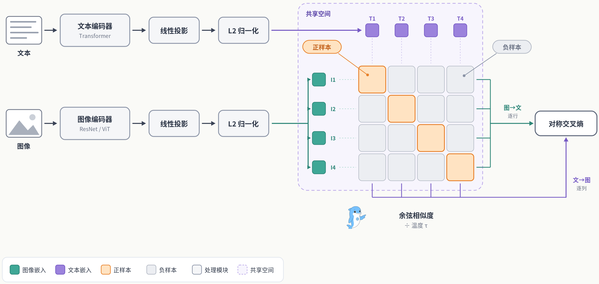
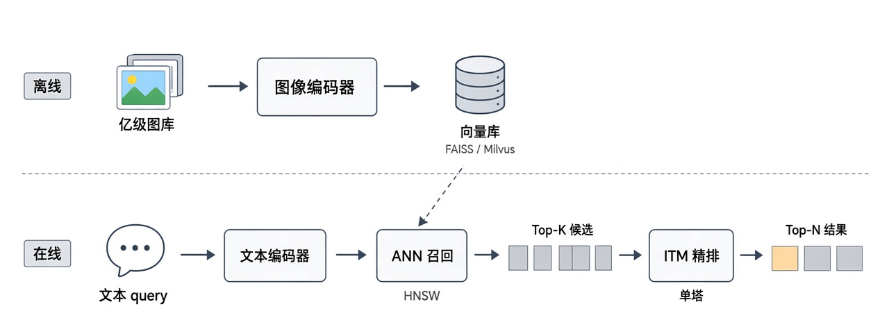
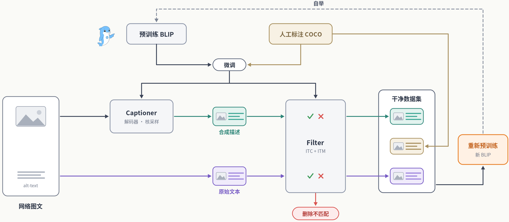
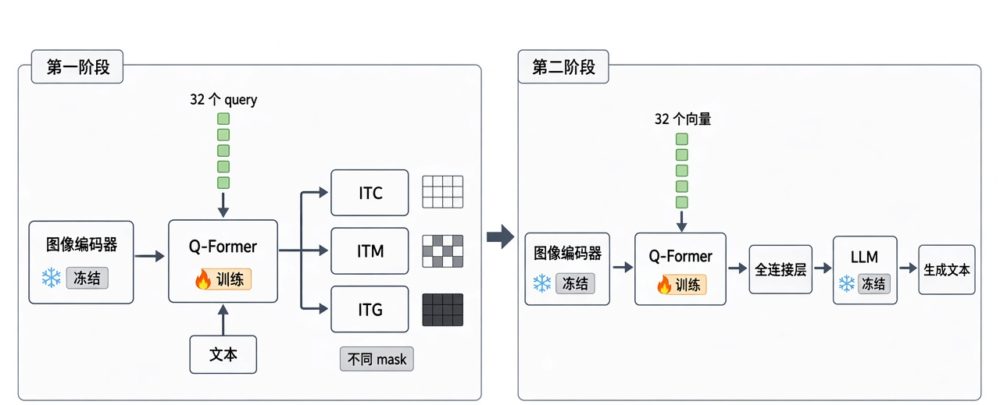
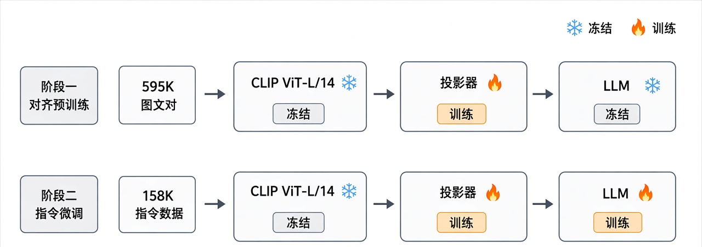
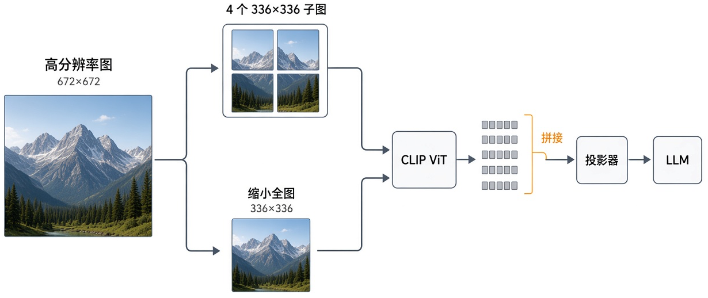

## 5.3 AI 多模态基石模型核心技术高频考点

> 本章接着 5.2 的三类组件，拆解三个基石模型系列。先讲 CLIP 怎样用双塔结构和对比学习做图文对齐、零样本分类和检索，再讲 BLIP 怎样补上细粒度匹配、文本生成和数据清洗，BLIP-2 怎样用 Q-Former 接入冻结的 LLM，最后讲 LLaVA 怎样靠投影器和视觉指令微调做成视觉助手。5.4 的主流模型会沿这三条路线展开。

---

### [5.3.1 CLIP 的核心结构，以及为什么采用双编码器 + 对比学习](#q5-3-1)
- [5.3.1.1 面试问题：CLIP 的双编码器结构与前向流程是怎样的？](#q5-3-1-1)
- [5.3.1.2 面试问题：为什么 CLIP 采用双塔（dual-encoder）而非单塔融合架构？](#q5-3-1-2)
- [5.3.1.3 面试问题：对比学习相比分类式/生成式目标，为什么更适合 CLIP 的大规模预训练？](#q5-3-1-3)

### [5.3.2 CLIP 的预训练目标，以及它相比传统分类预训练的优势与局限](#q5-3-2)
- [5.3.2.1 面试问题：CLIP 的对比预训练目标与传统 ImageNet 监督分类有何本质区别？](#q5-3-2-1)
- [5.3.2.2 面试问题：CLIP 预训练范式存在哪些固有局限？](#q5-3-2-2)

### [5.3.3 CLIP 的零样本推理流程，以及类别名到文本提示的构造问题](#q5-3-3)
- [5.3.3.1 面试问题：CLIP 的零样本分类推理流程是怎样的？](#q5-3-3-1)
- [5.3.3.2 面试问题：为什么文本提示（prompt）的构造会显著影响零样本精度？](#q5-3-3-2)

### [5.3.4 CLIP 在跨模态检索中的优势与落地瓶颈](#q5-3-4)
- [5.3.4.1 面试问题：CLIP 的双塔结构为什么天然适合大规模跨模态检索？](#q5-3-4-1)
- [5.3.4.2 面试问题：CLIP 检索在实际落地中存在哪些瓶颈？如何缓解？](#q5-3-4-2)

### [5.3.5 BLIP 的核心结构，以及它为什么采用统一编码器 + 生成式解码器的设计](#q5-3-5)
- [5.3.5.1 面试问题：BLIP 的 MED（多模态编码-解码混合）结构包含哪几种功能模式？](#q5-3-5-1)
- [5.3.5.2 面试问题：为什么 BLIP 要在 CLIP 式双编码器之外引入生成式解码器？](#q5-3-5-2)

### [5.3.6 BLIP 的预训练目标，以及它相比纯对比学习在能力上的差异](#q5-3-6)
- [5.3.6.1 面试问题：BLIP 的三个预训练目标（ITC/ITM/LM）各自承担什么作用？](#q5-3-6-1)
- [5.3.6.2 面试问题：相比 CLIP 的纯对比学习，BLIP 多目标设计扩展了哪些能力？](#q5-3-6-2)

### [5.3.7 BLIP 的 CapFilt 数据增强方法，以及它在预训练中的作用与优势](#q5-3-7)
- [5.3.7.1 面试问题：CapFilt 的 Captioner 与 Filter 分别如何工作？](#q5-3-7-1)
- [5.3.7.2 面试问题：CapFilt 为什么能提升网络爬取数据的质量？解决了什么核心痛点？](#q5-3-7-2)

### [5.3.8 BLIP 在图文理解任务中的优势](#q5-3-8)
- [5.3.8.1 面试问题：BLIP 在图文检索任务上相比 CLIP 有何优势？](#q5-3-8-1)
- [5.3.8.2 面试问题：BLIP 如何统一支持 VQA、Image Captioning 等生成式理解任务？](#q5-3-8-2)

### [5.3.9 BLIP-2 的技术演进，以及 Q-Former 在跨模态对齐中的作用](#q5-3-9)
- [5.3.9.1 面试问题：BLIP-2 为什么采用冻结图像编码器 + 冻结 LLM + 轻量 Q-Former 的设计？](#q5-3-9-1)
- [5.3.9.2 面试问题：Q-Former 的两阶段训练如何实现跨模态对齐？](#q5-3-9-2)

### [5.3.10 LLaVA 的核心结构，以及它为何以 LLM 为核心](#q5-3-10)
- [5.3.10.1 面试问题：LLaVA 的三段式结构（视觉编码器 + 投影器 + LLM）如何工作？](#q5-3-10-1)
- [5.3.10.2 面试问题：为什么 LLaVA 选择以 LLM 为核心而非以视觉模型为核心？](#q5-3-10-2)

### [5.3.11 LLaVA 的预训练目标，以及它与纯对比学习模型的能力差异](#q5-3-11)
- [5.3.11.1 面试问题：LLaVA 的两阶段训练（特征对齐预训练 + 指令微调）目标分别是什么？](#q5-3-11-1)
- [5.3.11.2 面试问题：相比 CLIP/BLIP 的对比学习，LLaVA 的生成式训练带来了哪些能力差异？](#q5-3-11-2)

### [5.3.12 LLaVA 的合成数据策略，以及它在指令微调中的作用](#q5-3-12)
- [5.3.12.1 面试问题：LLaVA 如何借助纯文本 GPT-4 合成多模态指令数据？](#q5-3-12-1)
- [5.3.12.2 面试问题：合成指令数据为什么是 LLaVA 视觉指令跟随能力的关键？](#q5-3-12-2)

### [5.3.13 LLaVA 与 BLIP-2 在架构与目标上的取舍](#q5-3-13)
- [5.3.13.1 面试问题：LLaVA 与 BLIP-2 在跨模态连接模块（MLP vs Q-Former）上有何取舍？](#q5-3-13-1)
- [5.3.13.2 面试问题：LLaVA 与 BLIP-2 在训练成本与数据效率上有何差异？](#q5-3-13-2)

### [5.3.14 LLaVA 系列的技术演进，以及它对复杂视觉任务的影响](#q5-3-14)
- [5.3.14.1 面试问题：从 LLaVA-1.0 到 LLaVA-1.5/NeXT 的关键技术演进有哪些？](#q5-3-14-1)
- [5.3.14.2 面试问题：这些演进如何提升模型在高分辨率、文档 OCR、复杂推理等任务上的能力？](#q5-3-14-2)

### [附录 术语表](#q53g)

---

### 5.3.1 CLIP 的核心结构，以及为什么采用双编码器 + 对比学习

#### 5.3.1.1 面试问题：CLIP 的双编码器结构与前向流程是怎样的？

**难度评分：⭐⭐ (2/5)  |  考察频率：⭐⭐⭐⭐⭐ (5/5)**

CLIP（Contrastive Language-Image Pre-training）是 OpenAI 在 2021 年发布的图文对比预训练模型，由两条互相独立的编码分支组成，所以也叫双塔架构。它在约 4 亿图文对上训练，数据集叫 WIT（WebImageText）。后来很多视觉语言模型（VLM）的视觉编码器都直接取自 CLIP。

两条分支的配置如下。

1. **图像编码器**：可选 ResNet 系（ResNet-50、ResNet-101，以及按 EfficientNet 方式放大的 RN50x4、RN50x16、RN50x64）或 Vision Transformer（ViT-B/32、ViT-B/16、ViT-L/14），把一张图像压成一个全局向量。论文里效果最好的配置是 ViT-L/14@336px。

2. **文本编码器**：一个约 63M 参数的 Transformer（12 层、512 宽、8 个注意力头），用词表大小 49152 的 BPE 分词，上下文长度 77 个 token，取 [EOS] 位置的输出作为整句向量。

前向流程分三步，先分别编码，再投影到联合空间，最后算相似度。图像和文本各自经编码器得到特征，再各经一层线性投影映射到同一个 $d$ 维联合空间（ViT-B 系是 512 维，ViT-L/14 是 768 维），做 L2 归一化，然后计算图文向量的余弦相似度，并用可学习的温度系数 $\tau$ 缩放，如图 3-1 所示。

两个模态在编码阶段不交互。图像分支和文本分支之间没有 cross-attention，只在最后一步做点积。这种晚融合设计让 CLIP 的图文特征可以离线预计算，在线只做向量检索，5.3.4.1 会展开讲它在检索中的用法。

图 3-1 CLIP 双塔结构与对比学习示意图

> **面试速答**：CLIP 由图像编码器和文本编码器两座独立的塔组成，图像侧用 ResNet 或 ViT，文本侧是 63M 参数的 Transformer。两路特征各自线性投影到同一联合空间，做 L2 归一化后算余弦相似度，再用温度系数缩放。两个模态只在最后的点积处交互，所以特征可以离线预计算。

---

#### 5.3.1.2 面试问题：为什么 CLIP 采用双塔（dual-encoder）而非单塔融合架构？

**难度评分：⭐⭐⭐ (3/5)  |  考察频率：⭐⭐⭐⭐ (4/5)**

跨模态模型在架构上有两条路线。双塔（dual-encoder，晚融合）让图文各自独立编码，最后只做向量点积；单塔（fusion-encoder，早融合）把图文 token 拼在一起，送进带 cross-attention 的 Transformer 深度交互，ViLT 和 ALBEF 的融合分支属于后者。CLIP 选双塔，看重的是训练和推理都能扩展。

1. **双塔才撑得起对比学习需要的超大 batch。** CLIP 的 InfoNCE 损失把同一 batch 里的其他样本当作负样本，batch 越大，负样本越多，CLIP 的 batch 是 32768。双塔下一个 batch 只需 $N$ 次图像编码和 $N$ 次文本编码，相似度矩阵靠一次矩阵乘法得到。换成单塔，每个图文组合都要过一次融合编码器，前向次数升到 $O(N^2)$，32768 的 batch 在单塔下跑不动。

2. **双塔的特征可以离线预计算。** 图像库的向量提前算好存进向量数据库，查询时只编码一次 query，再做近似最近邻搜索。单塔要求 query 和每个候选重新联合编码，没法预存，图库到了亿级，检索延迟无法接受。

双塔的代价是放弃了细粒度交互。图文只在最后一层点积相遇，"红色杯子在蓝色盘子的左边还是右边"这种涉及空间关系、属性绑定的判断，CLIP 很难做好。BLIP、ALBEF 在双塔之外再加融合编码器来做 ITM 任务，目的是补上这一块。

CLIP 的目标是对齐、检索和零样本分类，用细粒度交互换来大 batch 训练和高效检索，对它来说是划算的。

> **面试速答**：双塔让图文各自编码、只在最后点积，一个 batch 只要 N 次图像编码和 N 次文本编码，才撑得起 32768 的对比学习 batch，单塔要 O(N²) 次前向。双塔特征还能离线预计算，检索时只编码 query。代价是丢了细粒度交互，空间关系和属性绑定做不好。

---

#### 5.3.1.3 面试问题：对比学习相比分类式/生成式目标，为什么更适合 CLIP 的大规模预训练？

**难度评分：⭐⭐⭐ (3/5)  |  考察频率：⭐⭐⭐⭐ (4/5)**

在 CLIP 之前，从图文数据里学视觉表示主要有两种思路。分类式把 caption 映射成固定标签做分类，生成式让模型逐词生成图像的 caption。CLIP 论文做了对比实验，最后选了对比学习，主要因为训练效率高得多。

1. **生成式目标太难，收敛慢。** 同一张图可以有很多种合理描述，逐词预测 caption 等于要模型拟合语言的全部细节。CLIP 论文的实验里，一个 63M 参数的 Transformer 语言模型逐词预测 caption，学会识别 ImageNet 类别的速度比预测词袋（bag-of-words）的简单基线慢 3 倍；把词袋预测换成对比目标，效率又提高 4 倍。对比学习只要求匹配图文的相似度高于不匹配的，是宽松得多的代理任务。

2. **分类式目标受限于固定标签空间。** 把 caption 转成 one-hot 标签（如 ImageNet 的 1000 类）会丢掉文本的开放语义，"一只橘色的小猫趴在沙发上"被压成"猫"一个标签，"橘色""沙发""趴"这些概念都学不到。对比学习直接用整句自然语言做监督，标签空间是开放的，CLIP 能做开放词表的零样本分类，前提在这里。

3. **和大 batch、海量噪声数据契合。** InfoNCE 在大 batch 下负样本多，监督信号丰富。4 亿网络图文对里有一部分错配，对比目标拉近正例、推远负例，是在整批样本上做统计平均，受单条噪声 caption 的影响一般比逐词生成小。

形式化地看，CLIP 要让匹配图文对的相似度高于同一 batch 里所有不匹配的对，即满足 $\text{sim}(f_v(v_i), f_t(t_i)) > \text{sim}(f_v(v_i), f_t(t_j)),\ j \neq i$。对称的 InfoNCE 损失用温度系数 $\tau$ 控制相似度分布的尖锐程度，这里不展开。

> **面试速答**：CLIP 论文的实验里，逐词预测 caption 的 Transformer 学 ImageNet 类别比预测词袋慢 3 倍，换成对比目标效率再提高 4 倍。分类式目标把文本压成固定标签，丢掉开放语义；对比学习用整句文本监督，只要求匹配对相似度更高，适合大 batch 和含噪的网络数据。

---

### 5.3.2 CLIP 的预训练目标，以及它相比传统分类预训练的优势与局限

#### 5.3.2.1 面试问题：CLIP 的对比预训练目标与传统 ImageNet 监督分类有何本质区别？

**难度评分：⭐⭐⭐ (3/5)  |  考察频率：⭐⭐⭐⭐ (4/5)**

ImageNet 监督分类学的是图像到固定标签的映射，CLIP 学的是图像和自然语言的对齐，两者的迁移能力差别很大。

1. **监督信号的形态不同。** ImageNet 预训练用 128 万张图、1000 个离散类别，标签是人工标注的 one-hot 向量，模型最后一层是 1000 维的分类头。CLIP 用 4 亿网络图文对，监督信号是整句自然语言，没有分类头，靠图文向量的余弦相似度衡量匹配程度。

2. **可迁移性不同，这是差别最大的地方。** ImageNet 模型的分类头和 1000 个类绑定，迁移到新任务要换掉分类头重新微调，训练时没见过的类别没法直接识别。CLIP 没有固定分类头，做新任务时把候选类别名写成文本送进文本编码器，就能零样本分类。论文里 ViT-L/14@336px 在 ImageNet 上的零样本 Top-1 准确率是 76.2%，没用 ImageNet 的 128 万张训练图，就追平了原版有监督 ResNet-50。

3. **分布偏移下更稳。** 在 ImageNet-A、ImageNet-R、ImageNet-Sketch 等自然分布偏移测试集上，有监督 ResNet 的准确率掉得很厉害，CLIP 掉得少得多。常见的解释是 CLIP 学到的是用语言锚定的语义概念，对单一数据集纹理的过拟合较少。

代价是不够专精。在和训练分布完全一致的封闭任务上，专门用 ImageNet 训练的模型仍可能胜过 CLIP 的零样本结果。CLIP 的长处是开放词表、迁移能力强和抗分布偏移。

> **面试速答**：ImageNet 监督分类学图像到 1000 个固定标签的映射，有分类头，换任务要重新微调；CLIP 学图像和整句文本的对齐，没有分类头，换类别名就能零样本分类。ViT-L/14@336px 不用 ImageNet 训练图，零样本准确率 76.2%，追平有监督 ResNet-50，在分布偏移测试集上也更稳。

---

#### 5.3.2.2 面试问题：CLIP 预训练范式存在哪些固有局限？

**难度评分：⭐⭐⭐ (3/5)  |  考察频率：⭐⭐⭐⭐ (4/5)**

CLIP 擅长对齐和迁移，双塔加全局对比的做法也带来几类绕不开的局限，面试中常被追问。

1. **细粒度理解弱。** 图文只在最后做全局向量点积，局部细节建模不足。计数（"图里有几只猫"）、空间关系（"杯子在书的左边"）、属性绑定（"红色的车和蓝色的房子"容易混淆）都做不好。这是双塔晚融合结构带来的问题，单靠加数据很难完全解决。

2. **训练数据有噪声和偏见。** 4 亿图文对主要来自互联网 alt-text，质量参差，网络数据里的性别、种族刻板印象也会被模型继承，OpenAI 在原论文里专门讨论了这类风险。BLIP 提出 CapFilt 清洗数据，直接动机是数据噪声。

3. **零样本结果对 prompt 敏感。** 同一个类别，用 "dog" 和 "A photo of a dog." 做类别文本，结果不一样。论文报告，只加这一个模板，ImageNet 准确率就提高 1.3 个百分点，要结果稳定，往往还得做 prompt 集成（见 5.3.3.2）。

4. **文本端能力有限。** 文本编码器只有 63M 参数，上下文长度 77 个 token，处理不了长文本和复杂的语义推理。它更像一个标签编码器，BLIP-2、LLaVA 后来改用 LLM 做语言侧，原因之一在此。

5. **不能生成。** CLIP 只能做匹配、检索、分类这些判别任务，生成 caption、回答开放问题要外接解码器或 LLM。

这些局限推动了后面的演进，BLIP 补上生成能力，BLIP-2 接入 LLM，LLaVA 补上指令跟随。对比学习路线本身也有改进版，代表是 SigLIP（2023）和 SigLIP 2（2025）。SigLIP 用 sigmoid 损失替代 softmax 对比损失，每个图文对单独算二分类，不再需要跨 GPU 做全局归一化，batch 更容易放大；SigLIP 2 改用 Google 的多语言 Gemma 分词器（词表 256K），还推出了保持原始长宽比、支持多种分辨率的 NaFlex 变体。PaliGemma、LLaVA-OneVision 等模型都用 SigLIP 做视觉编码器。

> **面试速答**：CLIP 的局限有五类。细粒度理解弱，计数、空间关系、属性绑定做不好；网络数据有噪声和偏见；零样本结果对 prompt 敏感；文本编码器只有 63M 参数、77 个 token；只能判别，不能生成。对比路线上的改进版是 SigLIP 和 SigLIP 2。

---

### 5.3.3 CLIP 的零样本推理流程，以及类别名到文本提示的构造问题

#### 5.3.3.1 面试问题：CLIP 的零样本分类推理流程是怎样的？

**难度评分：⭐⭐ (2/5)  |  考察频率：⭐⭐⭐⭐⭐ (5/5)**

CLIP 零样本分类把分类问题改写成图文检索问题，问的是这张图和哪条类别文本最匹配。推理流程分四步。

1. **构造文本提示。** 把任务的所有候选类别名套进模板，生成一组候选文本。ImageNet 的 1000 个类逐一套进 `"A photo of a {label}."`，得到 1000 句文本（"A photo of a dog."、"A photo of a cat."……）。

2. **编码候选文本。** 文本编码器把这 1000 句各编码成一个向量，并做 L2 归一化，得到一组类别向量。类别集固定时，这一步离线算一次，后面所有图片复用。

3. **编码待分类图像。** 图片送进图像编码器得到图像向量，同样做归一化。

4. **算相似度取最大。** 计算图像向量和每个类别向量的余弦相似度，除以温度后做 softmax，相似度最高的类别作为预测结果。

CLIP 论文把这套流程解释为用文本编码器现场生成分类器权重。传统分类器的权重矩阵靠训练得到，训练完就固定了；CLIP 把每个类别文本编码出的向量当作这个类的分类权重，换一批类别名，相当于换了一个分类器，不用重新训练。模型预训练时没见过 ImageNet 的标签划分，也能直接分类，零样本的说法由此而来。

工程上，同一个 CLIP 今天分"猫/狗/鸟"，明天改成分"良性/恶性肿瘤切片"，只要改类别文本。不过精度很依赖类别文本的写法，下一问展开。

> **面试速答**：先把候选类别名套进 "A photo of a {label}." 这样的模板，用文本编码器编码成类别向量并归一化，再把图像编码成向量，算余弦相似度，除以温度做 softmax，取最高的类别。类别向量相当于现场生成的分类器权重，换类别名就换了分类器，不用重新训练。

---

#### 5.3.3.2 面试问题：为什么文本提示（prompt）的构造会显著影响零样本精度？

**难度评分：⭐⭐⭐ (3/5)  |  考察频率：⭐⭐⭐ (3/5)**

CLIP 的训练语料是完整的句子，推理时如果只给孤立的类别名，就和训练分布对不上，零样本精度因此对 prompt 写法很敏感。

1. **裸标签和训练分布不匹配。** 训练时和图像配对的文本大多是完整句子（"a photo of a golden retriever on the grass"），只有一个单词的情况很少。直接拿 "dog" 当类别文本，落在文本编码器很少见过的分布上，相似度估计不准。套上 `"A photo of a {label}."` 把标签包成句子，论文报告这一个模板就让 ImageNet 准确率提高 1.3 个百分点。

2. **一词多义要靠 prompt 消歧。** ImageNet 里的 "crane" 既有鹤也有起重机，Oxford-IIIT Pets 里的 "boxer" 指犬种，文本编码器却可能理解成拳击手。给模板补上领域上下文，如 `"A photo of a {label}, a type of pet."`，能把语义锚定到正确含义，CLIP 为不同数据集准备专用模板，原因也在这里。

3. **prompt 集成进一步降低方差。** 单个模板有偶然性，CLIP 为同一类别准备多个模板（`"a photo of a {label}."`、`"a bad photo of a {label}."`、`"a cropped photo of the {label}."` 等），分别编码后在嵌入空间取平均，再归一化，作为这一类的代表向量。ImageNet 上用了 80 个模板，比单个默认模板再提高 3.5 个百分点，和 prompt 工程合计提高近 5 个百分点。平均后的文本向量可以缓存，摊到大量预测上，推理成本和单个分类器相同。

既然类别向量是现场合成的分类器权重，写 prompt 也就是在设计分类器，写得越接近训练分布、语义越明确，类别向量的质量越高。后来 CoOp、CoCoOp 把人工模板换成可学习的连续 prompt 向量，用少量样本学出提示，延续了这个思路。

> **面试速答**：CLIP 训练时配对的多是完整句子，裸类别名和训练分布对不上，套上 "A photo of a {label}." 在 ImageNet 上就提高 1.3 个百分点。模板还能补领域上下文、消除一词多义；80 个模板做集成再提高 3.5 个百分点，合计近 5 个百分点。CoOp 等方法进一步把模板换成可学习向量。

---

### 5.3.4 CLIP 在跨模态检索中的优势与落地瓶颈

#### 5.3.4.1 面试问题：CLIP 的双塔结构为什么天然适合大规模跨模态检索？

**难度评分：⭐⭐ (2/5)  |  考察频率：⭐⭐⭐⭐ (4/5)**

跨模态检索（以文搜图、以图搜文）是 CLIP 落地最广的场景，双塔结构和向量检索系统配合得很好。

1. **特征可以离线预计算。** 图像和文本各自编码，互不依赖。亿级图库可以提前全部编码成向量，存进 FAISS、Milvus 等向量检索库，检索时只编码一次 query，剩下的交给向量库。单塔要求 query 和每个候选联合编码，做不到预存。

2. **检索变成近似最近邻搜索（ANN）。** 图文都映射到同一个归一化向量空间，跨模态匹配等价于按余弦相似度（也即内积）排序，这种排序可以直接交给 HNSW、IVF-PQ 等 ANN 索引。借助这些索引，亿级库的检索可以做到毫秒级，库变大时耗时的增长也远慢于线性。

3. **一套向量双向复用。** 同一套图文向量既支持以文搜图，也支持以图搜文，还能以图搜图、以文搜文，不用为每个方向单独建模。电商的拍照搜同款、相册的用文字找照片都用到了这一点。

和单塔对比，差距更直观。假设图库有 1 亿张图，用户发起一次文本查询，双塔只需 1 次文本编码加 1 次 ANN 检索；单塔要把 query 和 1 亿张图逐一联合编码，相当于 1 亿次前向。所以工业检索系统普遍用 CLIP 式双塔做召回，单塔的精排能力只用在召回后的小候选集上，形成双塔召回、单塔精排的两阶段方案，如图 3-2 所示。

图 3-2 双塔召回与单塔精排两阶段检索流程图

> **面试速答**：双塔让图像和文本各自编码，图库向量可以离线算好存进向量库，查询时只编码一次 query。图文在同一个归一化空间里，匹配变成内积排序，可以直接用 HNSW、IVF-PQ 等 ANN 索引，亿级库也能毫秒级返回。单塔要和每个候选联合编码，只适合召回后的精排。

---

#### 5.3.4.2 面试问题：CLIP 检索在实际落地中存在哪些瓶颈？如何缓解？

**难度评分：⭐⭐⭐⭐ (4/5)  |  考察频率：⭐⭐⭐ (3/5)**

CLIP 检索效率高，到了工业场景也会暴露几个瓶颈，面试中常以"你用 CLIP 做检索遇到过什么问题"的形式追问。

1. **细粒度和组合语义检索弱。** query 越精确，CLIP 越吃力。"穿红色裙子、戴墨镜、站在埃菲尔铁塔前的女性"这种多属性组合加空间关系的查询，全局向量很难编码准确，容易召回只满足部分条件的图。缓解办法是用 BLIP、BLIP-2 这种带融合编码器的模型做召回后重排，双塔先召回 Top-K，再用带 cross-attention 的 ITM 模型精排。

2. **领域偏移导致精度下降。** CLIP 主要在自然图像上训练，迁移到医学影像、工业缺陷、遥感、电商白底图等专业领域时，预训练分布覆盖不到，检索精度明显下降。缓解办法是在领域图文对上做 LoRA 微调或继续对比预训练，BiomedCLIP、FashionCLIP 都是这样得到的领域版本。

3. **文本端长度和表达受限。** 文本编码器的上下文只有 77 个 token，长查询、长文档放不下，复杂的逻辑查询也理解不好。缓解办法是长文本先截断或摘要再编码，或者换用文本端更强的模型，如微软的 LLM2CLIP 把微调过的 LLM 接成 CLIP 的文本编码器，长文本检索提升明显。

4. **模态鸿沟（modality gap）。** Liang 等人 2022 年的研究发现，CLIP 的图像向量和文本向量在联合空间里各自聚在一块区域，彼此隔着一段距离，没有完全重合。跨模态相似度的绝对值因此偏低，阈值不好定。缓解办法是检索时只看相对排序，不用绝对阈值，或者对向量做中心化校正。

5. **向量索引要在精度和延迟之间权衡。** 亿级库必须用 IVF-PQ、HNSW 等近似索引，PQ 量化压缩会损失精度，召回率、延迟和内存要反复调参。缓解办法是分层索引，召回阶段放宽，重排阶段补回精度。

这些瓶颈决定了 CLIP 在检索系统里适合做高召回的粗排。典型架构是 CLIP 双塔召回几百个候选，再由融合模型或业务规则精排，返回 Top-N。

> **面试速答**：主要瓶颈有五个。组合语义查询容易召回只满足部分条件的图，可以用 ITM 模型重排；专业领域精度下降，要用领域数据微调；文本只有 77 个 token；图文向量之间有模态鸿沟，阈值难定；ANN 索引要权衡精度和延迟。实际常把 CLIP 当召回器，后面接精排。

---

### 5.3.5 BLIP 的核心结构，以及它为什么采用统一编码器 + 生成式解码器的设计

#### 5.3.5.1 面试问题：BLIP 的 MED（多模态编码-解码混合）结构包含哪几种功能模式？

**难度评分：⭐⭐⭐ (3/5)  |  考察频率：⭐⭐⭐⭐ (4/5)**

BLIP（Bootstrapping Language-Image Pre-training）是 Salesforce 在 2022 年提出的图文预训练模型，主体结构是 MED（Multimodal mixture of Encoder-Decoder，多模态编码-解码混合）。它用一套大体共享的参数同时支持理解和生成，可以按需切换成三种功能模式。

1. **单模态编码器（Unimodal Encoder）**：图像编码器（ViT）和文本编码器各自独立工作，和 CLIP 的双塔类似，用于 ITC（图文对比）任务，学习全局对齐。文本端在句首加 `[CLS]` token。

2. **图像引导的文本编码器（Image-grounded Text Encoder）**：在文本编码器每个 Transformer block 的自注意力和前馈层（FFN）之间插入一层 cross-attention，让文本去看图像特征。文本端加 `[Encode]` token，它的输出向量用于 ITM（图文匹配）二分类。

3. **图像引导的文本解码器（Image-grounded Text Decoder）**：把编码器的双向自注意力换成因果自注意力（causal self-attention），模型可以自回归地逐词生成文本。文本端加 `[Decode]` token，用于 LM（语言建模）任务，也就是看图生成 caption。

三种模式共用一套文本 Transformer，编码器和解码器除自注意力层外共享全部参数，包括嵌入层、cross-attention 和 FFN。论文的解释是编码和解码的差别主要体现在自注意力上，编码用双向注意力表示当前输入，解码用因果注意力预测下一个 token，其他层在两类任务里作用相近，共享既省参数，又能从多任务训练中获益。论文的消融也显示，除自注意力外全部共享，效果好于完全不共享；把自注意力也共享，编码和解码任务互相冲突，效果反而变差。

> **面试速答**：MED 有三种模式。单模态编码器类似 CLIP 双塔，用于 ITC；图像引导的文本编码器在每个 block 插入 cross-attention，用 [Encode] 的输出做 ITM；图像引导的文本解码器把双向自注意力换成因果自注意力，用于 LM 生成 caption。编码器和解码器除自注意力层外共享全部参数。

---

#### 5.3.5.2 面试问题：为什么 BLIP 要在 CLIP 式双编码器之外引入生成式解码器？

**难度评分：⭐⭐⭐ (3/5)  |  考察频率：⭐⭐⭐⭐ (4/5)**

CLIP 式纯双编码器只能做判别，给定图文算相似度，没法生成文本。BLIP 引入生成式解码器，是想让一个模型同时覆盖理解和生成，补上 CLIP 留下的两块空白。

1. **CLIP 不能生成。** 图像描述（captioning）、视觉问答（VQA）要求模型输出自然语言，双塔最后只输出一个相似度，没有逐词解码的通路。BLIP 的图像引导文本解码器用因果自注意力加 cross-attention，可以看着图自回归地写出句子，captioning、VQA 由此进入能力范围。

2. **CLIP 缺少细粒度跨模态交互。** CLIP 的图文只在最后一层点积，属性绑定、空间关系这些细节处理不好。BLIP 的图像引导文本编码器在每层插入 cross-attention，文本 token 可以逐层关注图像的不同区域，ITM 学到的对齐比 ITC 精细得多。

BLIP 论文还认为，编码和解码共享大部分参数后，可以从多任务训练中获益，这是它用一套 MED 权重同时做两类任务的依据。

另一个动机在数据上。有了生成式解码器，BLIP 才能用模型自己生成 caption 来清洗训练数据（CapFilt 里的 Captioner），用生成能力反过来提升数据质量。

> **面试速答**：CLIP 双塔只输出相似度，做不了 captioning、VQA 这些生成任务，也缺少细粒度交互。BLIP 用图像引导的文本解码器补上生成能力，用逐层 cross-attention 的编码器学细粒度匹配，两者共享大部分参数。有了解码器，BLIP 还能用自己生成的 caption 清洗训练数据。

---

### 5.3.6 BLIP 的预训练目标，以及它相比纯对比学习在能力上的差异

#### 5.3.6.1 面试问题：BLIP 的三个预训练目标（ITC/ITM/LM）各自承担什么作用？

**难度评分：⭐⭐⭐ (3/5)  |  考察频率：⭐⭐⭐⭐⭐ (5/5)**

BLIP 预训练时同时优化三个目标，分别对应 MED 的三种模式，从粗到细、从理解到生成。

1. **ITC（Image-Text Contrastive，图文对比）**：作用于单模态编码器。和 CLIP 一样用 InfoNCE 拉近匹配的图文对、推远不匹配的，学全局对齐，让图文向量进入同一空间，给后两个目标打基础。BLIP 还沿用 ALBEF 的做法，引入动量编码器和软标签，缓解网络数据里"负样本其实也匹配"的噪声。

2. **ITM（Image-Text Matching，图文匹配）**：作用于图像引导的文本编码器，是一个二分类任务，判断图文对是否匹配。文本经逐层 cross-attention 融合了图像信息，ITM 学到的是细粒度对齐，能分辨 ITC 难以区分的难负样本（hard negative，语义相近但细节不符的图文）。BLIP 按 ITC 相似度挖掘难负样本，同一 batch 里对比相似度越高的负样本，被选中的概率越大。

3. **LM（Language Modeling，语言建模）**：作用于图像引导的文本解码器，用因果自注意力自回归地逐词生成图像的 caption，优化交叉熵损失（带 0.1 的标签平滑）。它给模型带来生成能力，也是 CapFilt 中 Captioner 的基础。BLIP 用的是 LM，没有用 BERT 式的 MLM（遮词预测），论文认为 LM 能让模型把视觉信息转成连贯的描述。

三个目标覆盖了对齐、匹配判别和生成这条能力链，ITC 打底，ITM 学细粒度交互，LM 把对齐转成生成。三者共享 MED 的大部分参数，同一套权重既能检索、问答，也能写描述。CLIP 只有 ITC，所以只会判别，ITM 和 LM 是 BLIP 超出 CLIP 的能力来源。

> **面试速答**：ITC 在单模态编码器上做对比学习，学全局对齐，并用动量编码器缓解噪声；ITM 在带 cross-attention 的编码器上判断图文是否匹配，配合难负样本学细粒度对齐；LM 在解码器上逐词生成 caption，带来生成能力。CLIP 只有 ITC，另外两个目标是 BLIP 多出来的能力。

---

#### 5.3.6.2 面试问题：相比 CLIP 的纯对比学习，BLIP 多目标设计扩展了哪些能力？

**难度评分：⭐⭐⭐ (3/5)  |  考察频率：⭐⭐⭐⭐ (4/5)**

CLIP 只用 ITC，能力停留在判别；BLIP 用 ITC、ITM、LM 三个目标，把能力扩展到理解和生成两端。

1. **生成能力（来自 LM）。** 这是最大的扩展。CLIP 回答不了"图里发生了什么"，BLIP 用 LM 训出的解码器可以直接生成 caption、回答 VQA，从检索、分类工具变成能输出语言的理解模型。

2. **更强的细粒度对齐（来自 ITM）。** 逐层 cross-attention 加难负样本挖掘，让 BLIP 在需要分辨细节的任务上明显好于 CLIP。检索精排时，ITM 能纠正 ITC 召回结果里"看着像、细节错"的候选。

3. **一个模型适配多种任务。** 同一套 MED 权重经过微调，可以做检索、VQA、captioning、视觉对话等下游任务，CLIP 通常只擅长检索和零样本分类，BLIP 省去了为每个任务单独训模型的成本。

4. **数据自举（来自生成加判别）。** 有了 Captioner（生成）和 Filter（判别），BLIP 能用模型自身清洗训练数据（CapFilt），数据和模型可以交替提升，CLIP 做不到。

代价也要说清楚。多目标加融合编码器让 BLIP 的训练比 CLIP 复杂，每步算力更高。ITC 召回的效率和 CLIP 相当，ITM 精排却要对每个候选做一次联合编码，开销随候选数线性增长，没法像纯双塔那样直接给亿级库打分，只能走召回、重排两阶段。BLIP 的文本端由 BERT-base 初始化，规模不大，复杂语言推理能力有限，这块短板到 BLIP-2 接入 LLM 才补上。

> **面试速答**：BLIP 比 CLIP 多出三项能力。LM 带来 caption、VQA 等生成能力；ITM 的逐层 cross-attention 和难负样本挖掘带来细粒度对齐，可以做检索精排；生成加判别还能清洗数据。代价是训练更复杂，ITM 精排只能用在召回后的小候选集上，文本端规模小，推理能力有限。

---

### 5.3.7 BLIP 的 CapFilt 数据增强方法，以及它在预训练中的作用与优势

#### 5.3.7.1 面试问题：CapFilt 的 Captioner 与 Filter 分别如何工作？

**难度评分：⭐⭐⭐ (3/5)  |  考察频率：⭐⭐⭐⭐ (4/5)**

CapFilt（Captioning and Filtering）是 BLIP 论文的主要创新之一，用模型自身清洗训练数据，BLIP 名字里的 Bootstrapping（自举）指的是它。它由两个从预训练 MED 微调出来的模块组成。

1. **Captioner（描述生成器）负责补。** 它用 MED 的图像引导文本解码器模式，在 COCO 等人工标注数据上微调，专门给网络图片生成合成 caption。网络图片的原始 alt-text 常常和图像内容无关（"IMG_2021.jpg""点击购买"），Captioner 能看图写出一句描述画面内容的文本。论文用核采样（nucleus sampling，每步从累计概率超过阈值的候选词里随机采样）生成，得到的描述比束搜索（beam search）更多样，下游效果更好。

2. **Filter（过滤器）负责删。** 它用 MED 的图像引导文本编码器模式（带 ITM 头），在同样的人工标注数据上微调，判断一条图文对是否真的匹配。原始网络 alt-text 和 Captioner 生成的合成 caption 都要过它，被判为不匹配的文本会被删掉。

两者配合的流程分四步，如图 3-3 所示。

1. **微调。** 用预训练好的 MED 分别微调出 Captioner 和 Filter。

2. **生成。** 对每张网络图片，Captioner 生成合成 caption，连同原始 alt-text 一起送进 Filter。

3. **过滤。** Filter 删掉不匹配的文本，保留干净的图文对。

4. **重训。** 把过滤后的网络数据、合成 caption 和人工标注数据合并成新数据集，重新预训练一个 BLIP。

论文报告，在 1400 万张图片的数据集上，单用 Captioner 或单用 Filter 都有提升，两者一起用效果互补，比直接用原始网络文本好很多；换成更大的数据集和更大的视觉骨干，CapFilt 还能继续带来提升，说明它在数据规模和模型规模上都能扩展。

图 3-3 CapFilt 数据自举流程图

> **面试速答**：Captioner 是在 COCO 上微调过的图像引导解码器，用核采样给网络图片生成合成 caption；Filter 是微调过的带 ITM 头的编码器，把原始 alt-text 和合成 caption 里不匹配的删掉。清洗后的数据加上人工标注数据，用来重新预训练 BLIP，两者一起用的效果好于单用其一。

---

#### 5.3.7.2 面试问题：CapFilt 为什么能提升网络爬取数据的质量？解决了什么核心痛点？

**难度评分：⭐⭐⭐⭐ (4/5)  |  考察频率：⭐⭐⭐ (3/5)**

CapFilt 针对的是网络图文数据噪声大，这也是 CLIP 式预训练最常被批评的地方。

网络 alt-text 和图像内容只是弱相关。LAION、CC12M 等数据集的文本来自网页图片的 alt 属性，很多是文件名、SEO 关键词、广告语、品牌名，并不描述图像本身。直接拿这种图文对做对比学习，相当于给模型喂大量错误的监督信号。扩大数据规模能稀释一部分噪声，但收益递减。

CapFilt 从两个方向提高信噪比。

1. **Captioner 补信号。** 对 alt-text 没有意义的图，生成一条贴合画面的合成 caption，相当于新造出高质量正样本，解决原始文本没说图里有什么的问题。

2. **Filter 压噪声。** 不管是原始 alt-text 还是合成 caption，只要 Filter 判定和图不匹配就删掉。Captioner 偶尔写错的描述和原始数据里的硬噪声都会被清掉。

用模型清洗自己的训练数据，不至于陷入自我强化，原因是 Captioner 和 Filter 都在少量人工标注数据（COCO）上微调过，相当于把人工标注的质量标准蒸馏进清洗器，再用它规模化地审查海量网络数据。这是把小规模高质量监督迁移到大规模弱监督数据上。

CapFilt 让数据质量变成可以由模型能力驱动、迭代提升的环节，模型越强，清洗出的数据越好，数据越好，又能训出更强的模型。LLaVA 用 GPT-4 合成指令数据（见 5.3.12.1），走的也是用模型改善数据的路子。

> **面试速答**：网络 alt-text 常是文件名、广告语，和图像弱相关，直接训练等于喂错误监督。CapFilt 一边用 Captioner 给图片补上贴合画面的描述，一边用 Filter 删掉不匹配的原始文本和合成文本。两个模块都在人工标注的 COCO 上微调过，等于把人工标准放大到海量网络数据上。

---

### 5.3.8 BLIP 在图文理解任务中的优势

#### 5.3.8.1 面试问题：BLIP 在图文检索任务上相比 CLIP 有何优势？

**难度评分：⭐⭐⭐ (3/5)  |  考察频率：⭐⭐⭐ (3/5)**

BLIP 在图文检索上的优势来自 ITC 召回加 ITM 重排的两阶段做法，弥补了 CLIP 纯双塔召回快但不够准的短板。

1. **更干净的训练数据。** CapFilt 清洗后的图文对噪声更低，ITC 学到的全局对齐好于直接在原始网络文本上训练的结果。

2. **ITM 提供细粒度精排。** CLIP 只能算全局向量相似度，分辨不出"看着像、细节不符"的候选。BLIP 先用 ITC 双塔召回 Top-K 候选，保留双塔的效率，再用带 cross-attention 的 ITM 编码器给这 K 个候选逐一打匹配分并重排。ITM 让文本逐层关注图像，能识别 ITC 漏掉的细粒度错配，把匹配的结果排到前面。

3. **难负样本训练让排序更可靠。** 训练 ITM 时按 ITC 相似度挖掘难负样本，逼模型分辨细微差别，区分高度相似的干扰项时明显强于只看全局相似度的模型。

效率上，ITM 只作用于召回后的小候选集，BLIP 论文在 COCO 上取 $k=256$，在 Flickr30K 上取 $k=128$。全库召回仍由 ITC 双塔加 ANN 完成，ITM 只做最后的精排，整体延迟可控。论文报告，用同样的 1400 万张预训练图片，BLIP 在 COCO 上的平均 R@1（正确结果排在第一位的查询比例）比此前最好的 ALBEF 高 2.7 个百分点。

> **面试速答**：BLIP 先用 ITC 双塔召回 Top-K，再用带 cross-attention 的 ITM 编码器逐一打分重排，COCO 上 k 取 256。ITM 靠难负样本训练，能识别全局相似度分辨不出的细节错配，CapFilt 清洗的数据也让召回更准。重排只作用于小候选集，整体延迟可控。

---

#### 5.3.8.2 面试问题：BLIP 如何统一支持 VQA、Image Captioning 等生成式理解任务？

**难度评分：⭐⭐⭐ (3/5)  |  考察频率：⭐⭐⭐ (3/5)**

BLIP 能统一支持多种生成式理解任务，靠的是 MED 可以切换模式，同一套权重换注意力 mask 和输入形式，就能适配不同任务。

1. **Image Captioning 直接用解码器模式。** 把 MED 切到图像引导的文本解码器，输入图像，以 `[Decode]` 起始，自回归生成描述。这是 LM 预训练目标的直接延伸，结构基本不用改。微调时在 caption 前加 "a picture of" 提示，效果略好。BLIP 在 COCO 和 NoCaps 上明显超过预训练数据量相近的方法。

2. **VQA 改成编码问题、解码答案。** BLIP 把 VQA 当生成任务来做，早期模型大多把 VQA 当分类。具体分两步，先用图像引导的文本编码器把图像和问题联合编码，再把融合表示送进文本解码器，自回归地生成答案。答案不限定在固定候选集里，训练集里没出现过的答案也能输出。

三类任务共享同一组参数，差别只在三处。

1. **注意力 mask**：编码用双向，解码用因果。

2. **任务提示**：captioning 以 `[Decode]` 起始并加 "a picture of" 前缀，VQA 的解码器以编码后的"图像 + 问题"表示为条件。

3. **输入组合**：captioning 只输入图像，VQA 输入图像和问题。

CLIP 只有判别能力，做 VQA 只能在固定候选答案里选相似度最高的；BLIP 靠解码器把这些任务统一成看图写字，能生成开放式文本。BLIP-2 和 LLaVA 延续了用生成统一多任务的思路，只是把生成端换成了 LLM。

> **面试速答**：靠 MED 的模式切换。captioning 直接用图像引导的解码器，以 [Decode] 起始生成描述；VQA 先用图像引导的编码器联合编码图像和问题，再由解码器生成开放式答案。三类任务共享同一组参数，只换注意力 mask、任务提示和输入组合。

---

### 5.3.9 BLIP-2 的技术演进，以及 Q-Former 在跨模态对齐中的作用

#### 5.3.9.1 面试问题：BLIP-2 为什么采用冻结图像编码器 + 冻结 LLM + 轻量 Q-Former 的设计？

**难度评分：⭐⭐⭐ (3/5)  |  考察频率：⭐⭐⭐⭐⭐ (5/5)**

BLIP-2 是 Salesforce 在 2023 年提出的 BLIP 后续版本。和 BLIP 相比，最大的变化是不再自己从头训练文本端，改为复用现成的冻结大模型，只训练一个轻量的桥接模块。结构是冻结的图像编码器（EVA-CLIP 的 ViT-g/14 或 CLIP 的 ViT-L/14）加冻结的 LLM（OPT 或 FlanT5），中间是可训练的 Q-Former（约 188M 参数）。

1. **复用预训练成果，省下重训成本。** 视觉端已有强大的 CLIP、EVA-CLIP 视觉编码器，语言端已有强大的 LLM，BLIP-2 不重训它们，只学怎样把视觉信息转给 LLM。论文报告，BLIP-2 在零样本 VQAv2 视觉问答上比 DeepMind 的 Flamingo-80B 高 8.7 个百分点，可训练参数却少 54 倍；最大的 ViT-g 加 FlanT5-XXL 组合在单台 16 卡 A100 上训练，第一阶段不到 6 天，第二阶段不到 3 天。

2. **冻结 LLM，保住原有语言能力。** 对 LLM 全参微调去对齐视觉，容易损伤它原有的语言推理和世界知识，也就是灾难性遗忘。冻结 LLM 能保留它的对话、推理和知识，视觉信息以软提示的形式注入。

3. **Q-Former 跨过模态鸿沟。** 冻结的视觉编码器输出视觉空间的特征，冻结的 LLM 期待语言空间的输入，两者之间有模态鸿沟。Q-Former 用一组可学习 query 通过 cross-attention 从冻结的视觉特征里抽取并压缩出 32 个 LLM 能理解的视觉 token，起到桥接作用。

这套设计也有代价。冻结两端意味着模型上限受所选视觉编码器和 LLM 限制；Q-Former 要两阶段训练，比单纯的 MLP 投影复杂。在低成本接入强 LLM 这个目标下，它的性价比很高，后来不少 VLM 沿用了冻结主干加轻量连接的做法。LLaVA 走了另一条路，用更简单的 MLP，并在指令微调时解冻 LLM，在指令跟随上效果更好（见 5.3.13.1）。

> **面试速答**：BLIP-2 复用冻结的视觉编码器和冻结的 LLM，只训练约 188M 参数的 Q-Former，可训练参数比 Flamingo-80B 少 54 倍，零样本 VQAv2 反而高 8.7 个百分点。冻结 LLM 能避免灾难性遗忘，Q-Former 用 32 个 query 把视觉特征压成 LLM 能用的 token。代价是上限受两端模型限制，训练要分两阶段。

---

#### 5.3.9.2 面试问题：Q-Former 的两阶段训练如何实现跨模态对齐？

**难度评分：⭐⭐⭐⭐ (4/5)  |  考察频率：⭐⭐⭐⭐⭐ (5/5)**

Q-Former 的训练分两个阶段，分别解决视觉特征怎样抽取、抽取出的特征怎样交给 LLM 两个问题，如图 3-4 所示。这里聚焦训练流程。

Q-Former 内部有 32 个可学习的 query 向量，每个 768 维。这些 query 通过 cross-attention 读取冻结视觉编码器输出的图像特征，把数量多、维度高的视觉特征压成 32 个固定的输出向量。输出是 32×768，而 ViT-L/14 输出的图像特征是 257×1024。这 32 个向量作为视觉 token 交给 LLM。

1. **第一阶段，视觉-语言表示学习。** Q-Former 接在冻结的视觉编码器后面，还不接 LLM，用 BLIP 同款的三个目标联合训练，即 ITC（图文对比）、ITM（图文匹配）和 ITG（Image-grounded Text Generation，图像引导的文本生成）。不同任务用不同的自注意力 mask，控制 query 和文本 token 能否互相看见，迫使 query 抽取和文本最相关的视觉信息，丢掉冗余的像素细节。

2. **第二阶段，视觉到语言的生成学习。** 把第一阶段训好的 Q-Former 接到冻结的 LLM 前面，输出的 32 个向量经一层全连接投影到 LLM 的词嵌入维度，作为软视觉提示（soft visual prompt）拼在 LLM 输入文本的前面。这一阶段 LLM 冻结，只训练 Q-Former 和投影层，用语言建模损失让 LLM 根据这些视觉 token 生成正确的文本。接 decoder-only 的 OPT 时用普通的语言建模损失；接 encoder-decoder 的 FlanT5 时用前缀语言建模损失，把文本切成两段，前一段和视觉表示一起送进编码器，后一段作为解码器的生成目标。

分两阶段的原因是，如果跳过第一阶段直接接 LLM，query 还不会抽取有意义的视觉信息，LLM 要自己承担视觉和语言对齐，负担重。论文的消融显示，去掉第一阶段后，两类 LLM 的零样本 VQA 效果都明显下降，用 OPT 时还出现了灾难性遗忘，训练越久性能越差。

Q-Former 的 32 个 query 起到信息瓶颈的作用。一方面把视觉 token 数量压下来，减轻 LLM 的序列长度负担；另一方面经过两阶段训练，这 32 个向量落在 LLM 能理解的语义空间里，冻结两端之间的跨模态对齐靠它完成。

图 3-4 Q-Former 两阶段训练示意图

> **面试速答**：Q-Former 用 32 个可学习 query 通过 cross-attention 把图像特征压成 32 个向量。第一阶段只接冻结的视觉编码器，用 ITC、ITM、ITG 和不同的注意力 mask 训练 query 抽取与文本相关的信息；第二阶段经全连接层接冻结的 LLM，用语言建模损失训练。跳过第一阶段，零样本 VQA 会明显变差。

---

### 5.3.10 LLaVA 的核心结构，以及它为何以 LLM 为核心

#### 5.3.10.1 面试问题：LLaVA 的三段式结构（视觉编码器 + 投影器 + LLM）如何工作？

**难度评分：⭐⭐ (2/5)  |  考察频率：⭐⭐⭐⭐⭐ (5/5)**

LLaVA（Large Language and Vision Assistant）是 2023 年提出的视觉指令微调模型，采用后来 VLM 最常见的三段式结构，依次是视觉编码器、投影器和 LLM。这里聚焦 LLaVA 的具体实现。

1. **视觉编码器（冻结）。** LLaVA 用预训练的 CLIP ViT-L/14 做视觉编码器。LLaVA-1.0 输入 224×224 的图像，取最后一层之前的 patch 特征，得到 256 个视觉 token。这部分一般冻结，直接复用 CLIP 学好的视觉语义。

2. **投影器（主要的可训练模块）。** 它把 CLIP 输出的视觉特征（1024 维）映射到 LLM 的词嵌入空间（LLaMA-7B 系是 4096 维）。LLaVA-1.0 用一个线性投影，LLaVA-1.5 换成两层 GELU-MLP，单这一项改动就有稳定的提升。

3. **大语言模型。** LLaVA 用 Vicuna（基于 LLaMA 的指令微调版）做语言主干。投影后的视觉 token 被当作视觉单词，和文本 token 拼成一个序列送进 LLM，由 LLM 自回归地生成回答。

前向流程是图像经 CLIP 编码，投影器把特征映射成视觉 token，和文本 token 拼接后由 LLM 生成文本。对齐预训练阶段只训练中间的投影器，它也是整条链路里最轻的模块。

LLaVA 说明了不用 Q-Former 那样复杂的桥接，一个简单的投影层加上强 LLM，也能做出好用的多模态助手。它结构简单、容易复现，成了开源社区最常用的 VLM 基线之一，衍生出大量领域变体。

> **面试速答**：LLaVA 用冻结的 CLIP ViT-L/14 提取 patch 特征，LLaVA-1.0 在 224 分辨率下得到 256 个视觉 token；投影器把 1024 维特征映射到 LLM 词嵌入空间，1.0 用线性层，1.5 用两层 GELU-MLP；视觉 token 和文本 token 拼接后交给 Vicuna 自回归生成回答。

---

#### 5.3.10.2 面试问题：为什么 LLaVA 选择以 LLM 为核心而非以视觉模型为核心？

**难度评分：⭐⭐⭐ (3/5)  |  考察频率：⭐⭐⭐⭐ (4/5)**

以 LLM 为中心是 LLaVA 和后来主流 MLLM 的共同设计思路，视觉编码器负责感知，理解、推理、对话和生成交给 LLM。这样分工有几方面的考虑。

1. **复杂推理和世界知识来自 LLM。** 多模态任务的难点常常在看见之后的推理，"这张图为什么好笑""照图里的菜谱该先做哪一步"，需要常识、逻辑和语言组织能力，这是 LLM 在海量文本预训练中积累的长处。CLIP 式视觉模型只给出特征向量，没有这种推理能力。

2. **继承 LLM 的指令跟随和对话能力。** LLaVA 用的 Vicuna 已经过指令微调，会按要求回答。视觉接到这样的 LLM 上，模型很快就能进行多轮视觉对话，不用从头学对话。反过来以视觉模型为中心、外挂小语言模块，对话和指令跟随会差很多。

3. **统一的 token 序列让视觉自然融入语言。** 视觉信息投影成视觉 token 拼进文本序列，模型用同一套自回归机制处理图文，架构统一，训练简单。多模态能力也能随基座 LLM 升级而提升，LLaVA-1.5 论文里把 LLM 从 7B 换到 13B，综合评测 MM-Vet 的提升最明显。

4. **符合感知和认知的分工。** 视觉编码器把像素变成语义特征，LLM 负责理解、推理和表达，投影器把感知结果转给 LLM。模块之间解耦，可以各自独立升级。

以 LLM 为中心也有边界。在精确 OCR、目标检测等纯视觉细粒度任务上，这类模型未必比得过专用视觉模型。就通用视觉理解、推理和对话来说，这条路线已经被大量模型验证有效。

> **面试速答**：多模态任务的难点常在看见之后的推理，常识、逻辑和语言组织都来自 LLM。以 LLM 为中心还能直接继承 Vicuna 的指令跟随和对话能力，视觉 token 拼进文本序列后用同一套自回归机制处理，基座升级时多模态能力也跟着提升。代价是纯视觉细粒度任务未必比得过专用模型。

---

### 5.3.11 LLaVA 的预训练目标，以及它与纯对比学习模型的能力差异

#### 5.3.11.1 面试问题：LLaVA 的两阶段训练（特征对齐预训练 + 指令微调）目标分别是什么？

**难度评分：⭐⭐⭐ (3/5)  |  考察频率：⭐⭐⭐⭐⭐ (5/5)**

LLaVA 分两阶段训练，先解决视觉和语言的对齐，再学按指令完成任务，各阶段冻结和训练的模块如图 3-5 所示。两个阶段都用自回归语言建模损失（预测下一个 token），只在回答部分计算损失，和 CLIP、BLIP 的对比损失不同。

1. **阶段一，特征对齐预训练（Feature Alignment Pre-training）。**

    （1）**目标**：让投影器学会把 CLIP 视觉特征映射到 LLM 的词嵌入空间，建立视觉 token 和语言的初步对齐。

    （2）**数据**：从 CC3M 过滤出的约 595K 图文对，每条组织成单轮对话，问题是请模型简要描述图像，答案是原始 caption。

    （3）**训练设置**：冻结视觉编码器和 LLM，只训练投影器。论文把这一步看作给冻结的 LLM 训练一个兼容的视觉分词器。

2. **阶段二，端到端指令微调（Visual Instruction Tuning）。**

    （1）**目标**：让模型理解多样的视觉指令，进行多轮对话和复杂推理，LLaVA 的主要创新在这一步。

    （2）**数据**：约 158K 条 GPT-4 合成的多模态指令数据。

    （3）**训练设置**：视觉编码器仍冻结，LLM 和投影器一起训练。模型从只会描述图片，变成能按各种指令完成视觉任务的助手。

分两阶段的原因是，一开始就用指令数据端到端训练，投影器还没建立基本对齐，视觉 token 对 LLM 来说接近噪声，复杂指令更学不会。先用大量简单图文对把投影器校准好，再用少而精的指令数据教复杂能力，先对齐、后对话，训练更稳。BLIP-2 的 Q-Former 两阶段训练也遵循先建立对齐、再面向任务的顺序。

图 3-5 LLaVA 两阶段训练示意图

> **面试速答**：两个阶段都用自回归语言建模损失。阶段一冻结视觉编码器和 LLM，只用约 595K 条 CC3M 图文对训练投影器，把视觉特征对齐到词嵌入空间；阶段二视觉编码器仍冻结，用约 158K 条 GPT-4 合成的指令数据联合训练投影器和 LLM，学会多轮对话和推理。

---

#### 5.3.11.2 面试问题：相比 CLIP/BLIP 的对比学习，LLaVA 的生成式训练带来了哪些能力差异？

**难度评分：⭐⭐⭐ (3/5)  |  考察频率：⭐⭐⭐⭐ (4/5)**

LLaVA 全程用自回归语言建模损失，CLIP 用纯对比损失，BLIP 用对比、匹配加生成的混合损失。训练目标不同，能力边界也不同。

1. **从判别、检索到开放式对话。** CLIP 的对比学习学到的是图文是否匹配，属于判别能力；LLaVA 的生成式训练让模型能针对任意指令生成自由文本，可以多轮对话、解释和推理。CLIP 答不了"请详细描述这张图并推测拍摄者的意图"，LLaVA 可以。

2. **直接调用 LLM 的推理能力。** 生成式训练和 LLM 的预训练目标（next-token prediction）一致，能直接复用 LLM 的世界知识、逻辑推理和常识。对比学习的输出只是一个相似度，调动不了这些能力。

3. **指令跟随。** 这是 LLaVA 和 BLIP 系的主要区别。BLIP、BLIP-2 也能生成，但主要面向 captioning、VQA 等固定任务；LLaVA 经过指令微调，能理解多样、开放的人类指令，更接近通用视觉助手。

4. **代价是让出检索效率和判别精度。** LLaVA 不产出可索引的对齐向量，不适合做大规模跨模态检索，那仍是 CLIP 双塔的场景。在图文是否匹配这种纯判别任务上，生成式模型也未必比专门的 ITC、ITM 更准、更快。

三者的定位可以这样区分，CLIP 是对齐器和检索器，BLIP 是理解与生成统一的模型，LLaVA 是以 LLM 为中心的视觉对话助手。从 CLIP 到 LLaVA，训练目标从对比走向生成，能力重心也从检索匹配移到理解、推理和对话。

> **面试速答**：LLaVA 全程用语言建模损失，和 LLM 的预训练目标一致，能直接调用 LLM 的知识和推理，做开放式多轮对话；指令微调又让它能理解多样的人类指令，BLIP 系主要面向固定任务。代价是不产出可索引的对齐向量，不适合大规模检索，纯判别任务也未必比 ITC、ITM 准。

---

### 5.3.12 LLaVA 的合成数据策略，以及它在指令微调中的作用

#### 5.3.12.1 面试问题：LLaVA 如何借助纯文本 GPT-4 合成多模态指令数据？

**难度评分：⭐⭐⭐ (3/5)  |  考察频率：⭐⭐⭐⭐ (4/5)**

LLaVA 最有开创性的贡献，是用纯文本 GPT-4 合成多模态指令数据。人工标注视觉对话成本高、规模小，视觉指令数据当时非常稀缺。

论文用的是只接受文本输入的 GPT-4 和 ChatGPT。做法是把图像已有的文字信息交给它，用了两种符号化表示。

1. **Captions（图像描述）**：COCO 等数据集已有的人工描述，告诉 GPT-4 图里有什么。

2. **Bounding boxes（目标框）**：用文字给出每个物体的类别和坐标，让 GPT-4 了解空间布局。

GPT-4 根据这些文字推断图像内容，再围绕它生成指令和回答，整个过程不需要视觉模型参与。生成的指令数据分三类，共约 158K 条。

1. **对话型（Conversation），58K 条**：围绕图像内容的多轮问答，问图里有什么、在做什么，训练基础的视觉对话能力。

2. **细节描述型（Detailed Description），23K 条**：要求对图像做详细、丰富的长描述，训练细粒度感知和表达。

3. **复杂推理型（Complex Reasoning），77K 条**：需要结合常识多步推理的问题，如"这种天气下骑车要注意什么"，训练推理能力。

这套方法可以看作一次跨模态的知识蒸馏，以图像的符号化表示为媒介，把 GPT-4 的推理和表达能力蒸馏进多模态指令数据，再用这些数据训练 LLaVA。它和 BLIP 的 CapFilt 都是用模型改善数据，CapFilt 只做补充和过滤，LLaVA 用更强的外部模型直接造数据。后来的 ShareGPT4V、ALLaVA 等数据集沿用并放大了这个做法，改用能看图的 GPT-4V 来生成。

> **面试速答**：LLaVA 用的 GPT-4 只接受文本，于是把 COCO 图像已有的 caption 和目标框坐标写成文字交给它，让它推断画面内容，再生成对话、细节描述、复杂推理三类指令数据，共约 158K 条。这相当于借助符号化表示，把 GPT-4 的能力蒸馏进多模态数据。

---

#### 5.3.12.2 面试问题：合成指令数据为什么是 LLaVA 视觉指令跟随能力的关键？

**难度评分：⭐⭐⭐ (3/5)  |  考察频率：⭐⭐⭐⭐ (4/5)**

指令数据决定了模型在第二阶段学到什么样的行为，模型的能力上限很大程度上取决于微调数据的质量和多样性。

1. **把会描述升级成会按指令做事。** 阶段一只教会模型看图说一句描述，离助手还很远。理解开放式问题、多轮对话、按要求推理，都要靠指令数据来教。论文在自建的 LLaVA-Bench（COCO）上做了消融，做指令微调比不做，指令跟随得分高出 50 分以上。

2. **三类数据覆盖不同能力。** 对话型教基础问答和交互，细节描述型训练细粒度感知和长文本组织，复杂推理型注入多步推理和常识。同一组消融里，在对话数据之外加入少量细节描述和复杂推理数据，总分再提高约 7 分，对话类问题的表现也跟着变好。

3. **GPT-4 保证了答案质量。** 指令和回答都由 GPT-4 生成，逻辑和语言组织质量高，LLaVA 模仿这些回答，相当于向 GPT-4 对齐。在论文的合成指令跟随评测上，LLaVA 的得分达到拿真实 caption 和目标框作答的纯文本 GPT-4 的 85.1%。

4. **少量高质量数据就能见效。** 约 158K 条精心合成的数据就带来了明显的指令跟随能力，说明在指令微调阶段，数据质量的作用很大。后来的 ShareGPT4V、ALLaVA-4V 进一步做了规模更大、质量更高的视觉指令数据集。

> **面试速答**：阶段一只教会模型看图写一句描述，指令跟随要靠第二阶段的指令数据来教，论文里做不做指令微调，LLaVA-Bench 得分差 50 分以上。三类数据分别训练对话、细节感知和推理，加入后两类总分再提高约 7 分。答案由 GPT-4 生成，质量高，约 158K 条就够用。

---

### 5.3.13 LLaVA 与 BLIP-2 在架构与目标上的取舍

#### 5.3.13.1 面试问题：LLaVA 与 BLIP-2 在跨模态连接模块（MLP vs Q-Former）上有何取舍？

**难度评分：⭐⭐⭐⭐ (4/5)  |  考察频率：⭐⭐⭐⭐ (4/5)**

LLaVA 和 BLIP-2 都是视觉编码器、连接模块加 LLM 的结构，在连接模块上做了相反的选择，LLaVA 用简单的 MLP，BLIP-2 用复杂的 Q-Former。这一对比是面试中常被深挖的点。

1. **BLIP-2 的 Q-Former 主动压缩。** 用一组可学习 query 通过 cross-attention 从视觉特征里抽取并压缩出 32 个视觉 token，再送进 LLM。视觉 token 少，LLM 序列短，推理省算力；缺点是结构复杂，要两阶段训练，压缩还可能丢掉细粒度视觉信息。

2. **LLaVA 的 MLP 保留全部 token。** 用两层 GELU-MLP 把 CLIP 的全部 patch token 逐个投影到 LLM 空间，不做压缩，LLaVA-1.5 的 336×336 输入对应 576 个视觉 token。结构简单，对齐只需一个阶段，视觉信息完整保留，细粒度任务表现好；缺点是视觉 token 多，LLM 序列长，推理算力更高。

两者在结构、token 数和训练复杂度上的差别如表 3-1 所示。

表 3-1 LLaVA 与 BLIP-2 连接模块对照

| 维度 | LLaVA（MLP 投影） | BLIP-2（Q-Former） |
|---|---|---|
| 连接模块结构 | 两层 GELU-MLP（LLaVA-1.5） | Q-Former（约 188M 参数） |
| 是否压缩 token | 否，保留全部 patch token | 是，压缩为 32 个 query |
| 视觉 token 数 | 多（LLaVA-1.5 为 576） | 少（32） |
| 训练复杂度 | 低，对齐只需一个阶段 | 高，需两阶段训练 |
| 细粒度信息保留 | 完整 | 压缩有损 |
| 推理序列长度/算力 | 较长/较高 | 较短/较低 |
| 可复现性 | 高，社区主流基线 | 中，结构更复杂 |

取舍落在信息保留和计算效率之间。Q-Former 用结构复杂度换 token 效率，适合算力受限或需要短序列的场景；MLP 用更多 token 换信息完整和训练简单，适合追求细粒度理解、看重复现的场景。

后来 MLP 路线更流行。LLaVA-1.5 用简单的 MLP，在多项基准上超过了结构更复杂的 BLIP-2 和 InstructBLIP。论文据此认为，全连接的连接模块足够强，数据效率也高，有强 LLM 和高质量指令数据时，把视觉信息原样交给 LLM 处理就够了，LLaVA 式结构因此成了开源社区的常用起点。高分辨率导致 token 数暴涨时，又会重新引入压缩，如 InternVL 的 Pixel Shuffle。

> **面试速答**：Q-Former 用 32 个 query 把视觉特征压成少量 token，LLM 序列短、省算力，但结构复杂、要两阶段训练，还会丢细节；MLP 把全部 patch token 逐个投影，信息完整、训练简单，代价是序列长。LLaVA-1.5 用 MLP 超过了 BLIP-2，高分辨率场景再配合 Pixel Shuffle 压缩。

---

#### 5.3.13.2 面试问题：LLaVA 与 BLIP-2 在训练成本与数据效率上有何差异？

**难度评分：⭐⭐⭐ (3/5)  |  考察频率：⭐⭐⭐ (3/5)**

两者都复用预训练的视觉编码器和 LLM、只训练中间部分，在数据规模、训练成本和训练阶段上差别明显。

1. **数据规模，LLaVA 精简得多。** BLIP-2 的 Q-Former 第一阶段要在 1.29 亿张图片的数据上训练（沿用 BLIP 的数据，网络图片的文本经 CapFilt 处理），query 才能学会抽取有意义的视觉特征。LLaVA-1.0 只用约 595K 对齐数据加 158K 指令数据；LLaVA-1.5 用 558K 对齐数据加 665K 指令数据，合计约 120 万条。差距在于 LLaVA 的投影器不用从零学怎样抽取视觉信息，CLIP 已经对齐好的特征直接投影过去即可。

2. **训练成本，LLaVA 低得多。** LLaVA-1.0 在 8 张 A100 上，对齐预训练不到 4 小时，指令微调约 10 小时；LLaVA-1.5 的 13B 版本在单台 8 卡 A100 上约一天训完。BLIP-2 最大的组合在单台 16 卡 A100 上，两个阶段合计不到 9 天。

3. **训练阶段的复杂度。** BLIP-2 是 Q-Former 表示学习加接入 LLM 的生成学习两阶段，第一阶段就含 ITC、ITM、ITG 三个目标，工程上更复杂。LLaVA 是投影器对齐加指令微调两阶段，每个阶段只有语言建模一个目标，实现简单得多。

LLaVA 的数据效率建立在完全复用 CLIP 已对齐的视觉特征上，对齐的大部分工作已经在 CLIP 的 4 亿图文对预训练里完成，LLaVA 省下的对齐数据，相当于提前花在了 CLIP 上。BLIP-2 的 Q-Former 在自己的训练里重新学一套视觉-语言的压缩对齐，需要的数据也就更多。

已有强 CLIP 视觉编码器和强指令 LLM 时，LLaVA 路线省数据、省算力、容易复现；需要短视觉序列，或者希望连接模块学到独立于 CLIP 的对齐表示时，BLIP-2 路线更有价值。开源社区做领域 VLM，多数从 LLaVA 式结构起步。

> **面试速答**：LLaVA-1.0 只用约 595K 对齐数据和 158K 指令数据，8 张 A100 十几个小时训完，LLaVA-1.5 的 13B 版本也只要约一天；BLIP-2 第一阶段要在 1.29 亿张图片上训练，最大组合在 16 卡 A100 上要训近 9 天。LLaVA 省下的对齐成本，其实已经花在 CLIP 的 4 亿图文对预训练里。

---

### 5.3.14 LLaVA 系列的技术演进，以及它对复杂视觉任务的影响

#### 5.3.14.1 面试问题：从 LLaVA-1.0 到 LLaVA-1.5/NeXT 的关键技术演进有哪些？

**难度评分：⭐⭐⭐ (3/5)  |  考察频率：⭐⭐⭐⭐ (4/5)**

LLaVA 系列保持三段式结构和生成式训练不变，靠几处改动持续提升效果。

1. **LLaVA-1.0（2023）奠定框架。** CLIP ViT-L/14 加线性投影加 Vicuna，提出视觉指令微调和 GPT-4 合成数据，验证了简单架构配高质量指令数据的可行性。输入分辨率只有 224×224，投影器也简单，细粒度能力有限。

2. **LLaVA-1.5（2023）做工程精修。** 主要有三处改动。

    （1）投影器从线性层换成两层 GELU-MLP。

    （2）视觉编码器换成 CLIP ViT-L/14@336，输入分辨率提到 336×336。

    （3）加入 VQA、OCR、区域级 VQA 等学术任务数据，并用回答格式提示规范输出，指令数据共 665K 条。

    这些改动让 LLaVA-1.5 在 11 个基准上取得当时最好的成绩，13B 版本仍只需单台 8 卡 A100 训练约一天。

3. **LLaVA-1.6 / LLaVA-NeXT（2024）主攻高分辨率。** 主要改动是 AnyRes 动态高分辨率，按长宽比把高分辨率图切成若干 336×336 的网格子图分别编码，再拼上一张缩小的全图，如图 3-6 所示，输入像素是原来的 4 倍，最高支持 672×672、336×1344、1344×336 三种长宽比，OCR、文档、图表等细粒度任务明显变强。它还调整了指令数据，加入 DocVQA、ChartQA 等文档和图表数据，并支持 Mistral-7B、Nous-Hermes-2-Yi-34B 等更强的基座。

4. **LLaVA-OneVision（2024）统一单图、多图和视频。** 把三种场景放进同一框架，提供 0.5B、7B、72B 三档，强调跨场景的任务迁移。之后 LLaVA-OneVision-1.5（2025）换用原生分辨率的 RICE-ViT 编码器和 Qwen3 基座；LLaVA-OneVision-2（2026 年 4 月发布，最初名为 2.0）又换成 OneVision-Encoder，把图像、长视频和空间理解放进同一架构。两代都公开了数据、训练代码和权重。

这条演进线上，主干架构基本不变，提升来自三方面，更高的分辨率（AnyRes）、更好的投影器和更强的基座、更高质量更多样的指令数据。LLaVA 的思路是保持架构简单，把精力投在分辨率和数据上。

图 3-6 AnyRes 动态高分辨率示意图

> **面试速答**：LLaVA-1.0 确立了 CLIP、线性投影加 Vicuna 的结构和视觉指令微调；LLaVA-1.5 换成两层 MLP 和 336 分辨率，并加入学术任务数据，在 11 个基准上取得当时最好成绩；LLaVA-NeXT 用 AnyRes 切块把像素提高到 4 倍；LLaVA-OneVision 系列再统一单图、多图和视频。

---

#### 5.3.14.2 面试问题：这些演进如何提升模型在高分辨率、文档 OCR、复杂推理等任务上的能力？

**难度评分：⭐⭐⭐ (3/5)  |  考察频率：⭐⭐⭐ (3/5)**

LLaVA 系列的演进可以拆成三条，看得更清、读得更准、想得更深，分别对应高分辨率、OCR 与文档、复杂推理三类任务。

1. **看得更清，靠高分辨率。** LLaVA-1.0 的 224×224 输入只有 256 个视觉 token，一张密集文本的文档图压进去，每个字只占几个像素，看不清。LLaVA-NeXT 的 AnyRes 把高分辨率图切成多个子图分别用 CLIP 编码，有效分辨率成倍提升，文字、表格、图表的细节得以保留。OCR、DocVQA、ChartQA 等任务的提升主要来自这里，分辨率不够时，推理再强也无从下手。

2. **读得更准，靠 OCR 和区域级数据。** 看清之后还要会读。LLaVA-1.5 和 LLaVA-NeXT 在指令数据里加入 OCR 文本、文档问答、区域级标注（目标框加文本）数据，教模型把视觉细节和文字符号对应起来。高分辨率加上 OCR 数据，文档理解才可用。

3. **想得更深，靠推理数据和更强的基座。** 一方面持续扩充、提升复杂推理类指令数据，另一方面换用推理更强的 LLM，多模态推理能力随之提升。LLaVA-1.5 论文里把 LLM 从 7B 换到 13B，MM-Vet 提升最明显，说明认知能力的上限很大程度由 LLM 决定。

三条路径互相配合。高分辨率让模型拿到细粒度信息，OCR 数据让模型把这些信息对应到语言，强基座加推理数据让模型用这些信息推理，缺一环都会成为短板，所以 LLaVA 每次大版本升级都同时在分辨率、数据和基座上推进。

落地时，要做一个能读财报、看流程图、做多步推理的视觉助手，可以沿这三条路径走，提分辨率、补 OCR 和推理数据、选强基座。提分辨率的做法有两种，LLaVA-NeXT 和 InternVL 系列用动态切块，Qwen3-VL 用原生动态分辨率，5.2.4.2 和 5.2.4.3 分别讲过。

> **面试速答**：高分辨率让模型看得清，AnyRes 切块后文字和图表细节不再被压没；OCR、文档问答和区域级数据教模型把视觉细节对应到文字；复杂推理数据和更强的基座 LLM 提升推理。三者缺一不可，所以 LLaVA 每次升级都同时推进分辨率、数据和基座。

---

### 附录 术语表

**缩写**

1. **BPE**：Byte Pair Encoding，字节对编码。从字符开始，反复合并语料中最常一起出现的相邻符号，得到子词词表，Sennrich 等人在 2016 年把它用到神经机器翻译的分词上。（[5.3.1.1](#q5-3-1-1)）

2. **InfoNCE**：Info Noise-Contrastive Estimation，DeepMind 的 van den Oord 等人在 2018 年提出的对比损失。把一个正样本和一批负样本的相似度做 softmax，最大化正样本的概率。（[5.3.1.2](#q5-3-1-2)）

3. **ViLT / ALBEF**：ViLT 是 Vision-and-Language Transformer，2021 年提出，图像 patch 和文本 token 直接一起送进同一个 Transformer；ALBEF 是 ALign BEfore Fuse，Salesforce 在 2021 年提出，先用对比学习对齐图文特征，再送进融合编码器。（[5.3.1.2](#q5-3-1-2)）

4. **CoOp / CoCoOp**：CoOp 是 Context Optimization，把 CLIP 提示模板里的上下文词换成可学习的向量；CoCoOp 是 Conditional Context Optimization，让这组向量随输入图像变化。两者都在 2022 年发表。（[5.3.3.2](#q5-3-3-2)）

5. **HNSW / IVF-PQ**：HNSW 是 Hierarchical Navigable Small World，分层的近邻图索引，查询时从上层粗略定位，逐层往下找；IVF-PQ 是 Inverted File with Product Quantization，先聚类分桶，只在少数桶里搜索，再用乘积量化压缩向量。（[5.3.4.1](#q5-3-4-1)）

6. **LoRA**：Low-Rank Adaptation，低秩适配，微软在 2021 年提出。冻结原权重，只训练一对低秩矩阵作为增量。（[5.3.4.2](#q5-3-4-2)）

7. **COCO / NoCaps**：COCO 是 Common Objects in Context，微软在 2014 年发布的图像数据集，每张图有 5 条人工描述，常用于 captioning 和检索；NoCaps 是 2019 年发布的图像描述评测集，考察模型描述 COCO 里没有的物体的能力。（[5.3.7.1](#q5-3-7-1)）

8. **EVA-CLIP**：北京智源研究院在 2023 年发布的 CLIP 改进版，视觉编码器先用掩码图像建模预训练，再做图文对比训练。（[5.3.9.1](#q5-3-9-1)）

9. **OPT / FlanT5**：OPT 是 Open Pre-trained Transformer，Meta 在 2022 年开源的 decoder-only 语言模型系列；FlanT5 是 Google 在 2022 年发布的、用大规模指令数据微调过的 T5 模型，属于 encoder-decoder 结构。（[5.3.9.1](#q5-3-9-1)）

10. **CC3M**：Conceptual Captions，Google 在 2018 年发布的约 330 万条图文对数据集，文本由网页 alt-text 清洗改写而来。（[5.3.11.1](#q5-3-11-1)）

11. **DocVQA / ChartQA**：DocVQA 是 2021 年发布的文档图像问答数据集；ChartQA 是 2022 年发布的图表问答数据集，很多问题需要对图表数值做推理。（[5.3.14.1](#q5-3-14-1)）

**重要概念**

1. **动量编码器（Momentum Encoder）**：主编码器参数的指数滑动平均副本，更新慢、输出稳定。BLIP 沿用 ALBEF 的做法，用它的输出生成软标签，降低错误负样本的影响。思路最早来自 MoCo。（[5.3.6.1](#q5-3-6-1)）

2. **软提示（Soft Prompt）**：拼在 LLM 输入前面的一组连续向量，不对应词表里的任何词，作为条件引导 LLM 生成。BLIP-2 把 Q-Former 输出的视觉向量当作软提示。（[5.3.9.1](#q5-3-9-1)）

3. **Pixel Shuffle**：一种空间重排操作，把相邻 2×2 个特征沿通道拼成一个，token 数降到原来的四分之一，InternVL 用它压缩视觉 token。（[5.3.13.1](#q5-3-13-1)）
