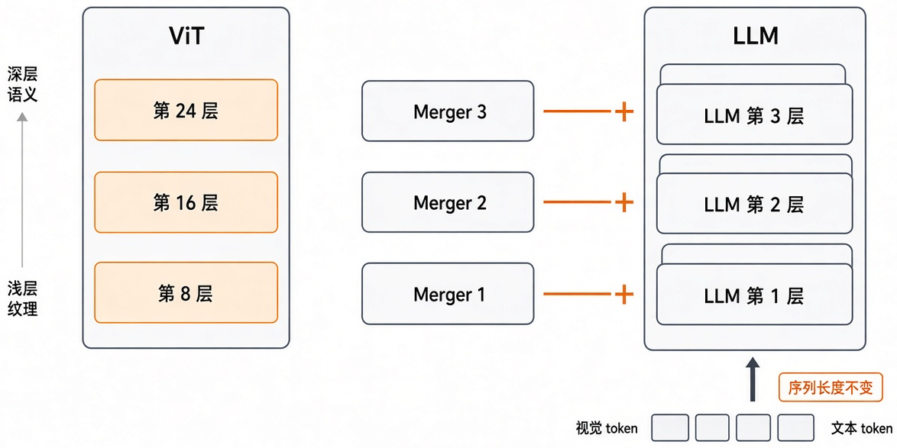
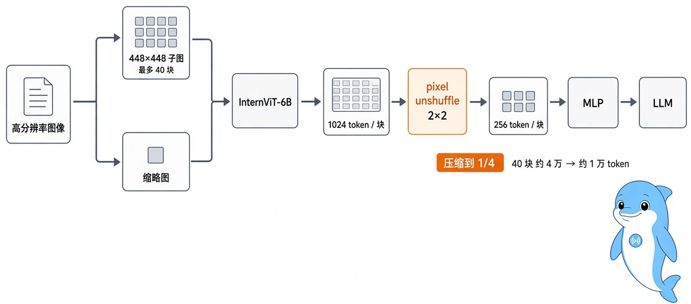
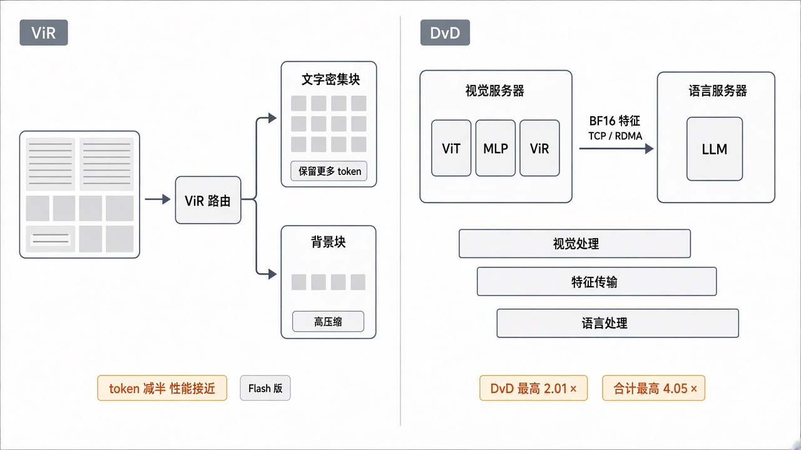
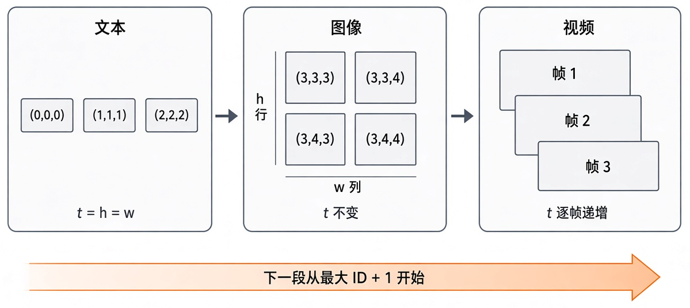
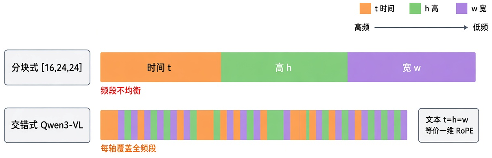
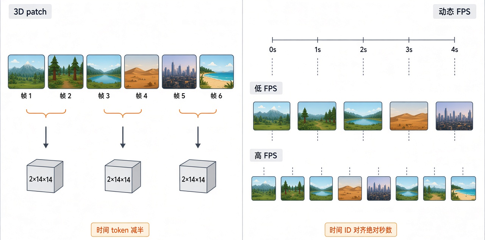
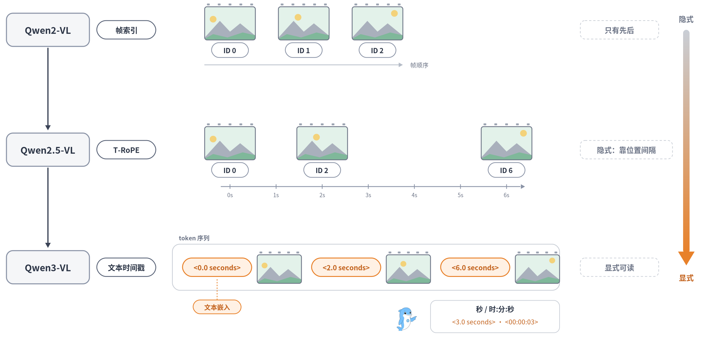
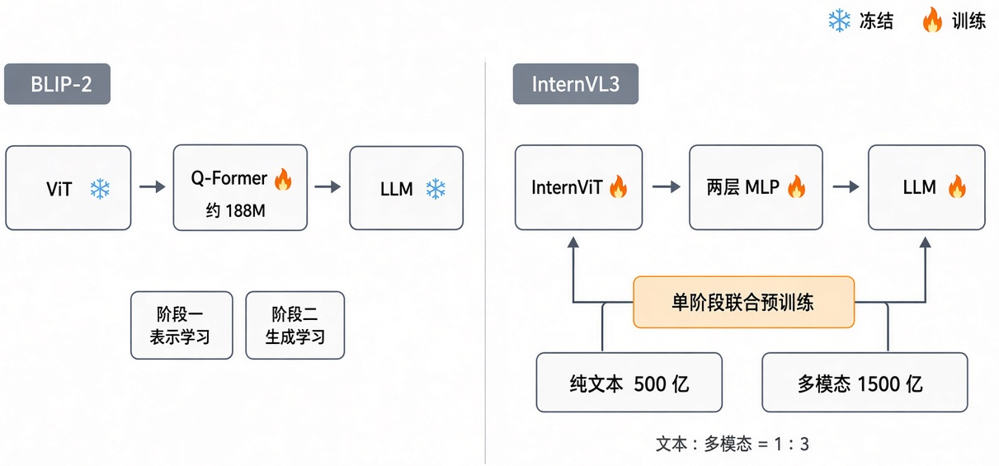
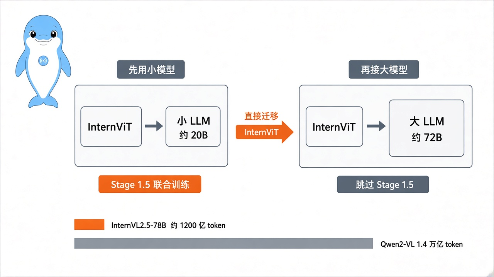
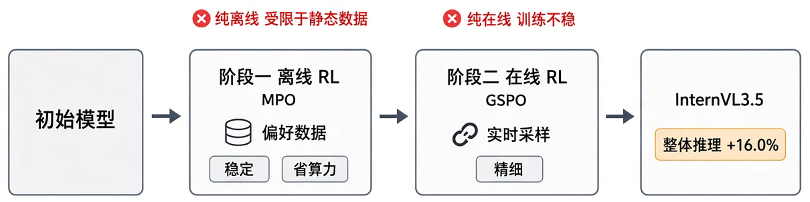

## 5.4 AI 多模态主流模型核心技术高频考点

> 本章拆解主流开源系列的关键技术。依次讲视觉编码器与 token 压缩，多模态位置编码与长上下文，框、掩码等结构化输出，视频时序建模，预训练与后训练范式，训练数据清洗，最后讲模型怎样调用工具、把设计稿写成代码。

---

### [5.4.1 Qwen-VL 系列视觉编码器经历了哪些关键演进，各解决什么问题](#q5-4-1)
- [5.4.1.1 面试问题：从固定分辨率到原生动态分辨率，解决了什么问题？](#q5-4-1-1)
- [5.4.1.2 面试问题：Qwen2.5-VL 为什么要做 Window Attention 与 RMSNorm/SwiGLU 等高效化改造？](#q5-4-1-2)
- [5.4.1.3 面试问题：DeepStack 多层次特征融合如何在不增加 token 的情况下提升细粒度？](#q5-4-1-3)

### [5.4.2 高分辨率输入下视觉 token 压缩的演进路线是怎样的](#q5-4-2)
- [5.4.2.1 面试问题：视觉 token 爆炸的根源是什么？早期的固定比例压缩方案怎么做？](#q5-4-2-1)
- [5.4.2.2 面试问题：从固定压缩到内容自适应，ViR 与系统级 DvD 分别解决了什么？](#q5-4-2-2)

### [5.4.3 多模态位置编码 RoPE 家族如何统一图文视频并支持外推](#q5-4-3)
- [5.4.3.1 面试问题：M-RoPE 的三分量设计是怎样的，如何统一图文视频？](#q5-4-3-1)
- [5.4.3.2 面试问题：MRoPE-Interleave 的交错设计带来了哪些作用？](#q5-4-3-2)

### [5.4.4 复杂文档理解如何依赖长上下文并支撑超长序列](#q5-4-4)
- [5.4.4.1 面试问题：复杂文档为何依赖长上下文？长序列又会带来哪些挑战？](#q5-4-4-1)
- [5.4.4.2 面试问题：长序列建模有哪些多层支撑设计？](#q5-4-4-2)

### [5.4.5 多模态模型如何用统一语言接口产出框与掩码等结构化输出](#q5-4-5)
- [5.4.5.1 面试问题：框坐标文本化与 SEG token 路由到下游解码器是怎么做的？](#q5-4-5-1)
- [5.4.5.2 面试问题：统一序列/路由 token 相比专用 head 有哪些优劣？](#q5-4-5-2)

### [5.4.6 视觉定位的坐标怎么表示才准](#q5-4-6)
- [5.4.6.1 面试问题：归一化、千分制、绝对坐标三种表示如何对比选型？](#q5-4-6-1)
- [5.4.6.2 面试问题：IoU 奖励、特殊 token 与高分辨率如何共同保证定位精度？](#q5-4-6-2)

### [5.4.7 视频输入如何在 token 预算内保留时序信息](#q5-4-7)
- [5.4.7.1 面试问题：3D patch 时序分块与动态 FPS 采样如何保留时序信息？](#q5-4-7-1)
- [5.4.7.2 面试问题：3D 卷积编码器与逐帧编码有什么区别？](#q5-4-7-2)

### [5.4.8 视频事件的时刻如何被精确表达](#q5-4-8)
- [5.4.8.1 面试问题：从帧索引时间对齐到文本时间戳对齐经历了怎样的演进？](#q5-4-8-1)
- [5.4.8.2 面试问题：显式文本时间戳带来了哪些时序推理好处？](#q5-4-8-2)

### [5.4.9 视觉能力是事后缝合还是原生习得](#q5-4-9)
- [5.4.9.1 面试问题：BLIP-2 两阶段改装与 InternVL3 原生多模态预训练有何本质区别？](#q5-4-9-1)
- [5.4.9.2 面试问题：原生多模态预训练的数据配比与工程要点是什么？](#q5-4-9-2)

### [5.4.10 大模型的视觉预训练如何降本](#q5-4-10)
- [5.4.10.1 面试问题：渐进式缩放为何要先用小 LLM 训好视觉编码器再迁移？](#q5-4-10-1)
- [5.4.10.2 面试问题：Qwen-VL 三阶段训练范式及各阶段数据策略是怎样的？](#q5-4-10-2)

### [5.4.11 后训练如何在能力与对齐之间取平衡](#q5-4-11)
- [5.4.11.1 面试问题：SFT 加 DPO 两阶段组合与冻结 ViT 是出于什么考量？](#q5-4-11-1)
- [5.4.11.2 面试问题：RLCS 带课程采样如何支撑以推理为中心的目标？](#q5-4-11-2)

### [5.4.12 强化学习如何既稳又能突破上界](#q5-4-12)
- [5.4.12.1 面试问题：级联 RL 从离线到在线，为何优于单阶段？](#q5-4-12-1)
- [5.4.12.2 面试问题：可验证奖励 RLVR 如何做多域校验并防范 reward hacking？](#q5-4-12-2)

### [5.4.13 训练数据如何治理才能不毒化推理](#q5-4-13)
- [5.4.13.1 面试问题：重复生成的成因是什么？为何对 CoT 推理尤其致命？](#q5-4-13-1)
- [5.4.13.2 面试问题：三道闸数据过滤流水线如何抑制重复生成？](#q5-4-13-2)

### [5.4.14 多模态模型如何从感知走向可执行动作](#q5-4-14)
- [5.4.14.1 面试问题：原生多模态工具调用如何弥补文本式工具调用的不足？](#q5-4-14-1)
- [5.4.14.2 面试问题：设计到代码如何实现像素级复现与视觉反馈闭环？](#q5-4-14-2)

### [附录 术语表](#q54g)

---

### 5.4.1 Qwen-VL 系列视觉编码器经历了哪些关键演进，各解决什么问题

#### 5.4.1.1 面试问题：从固定分辨率到原生动态分辨率，解决了什么问题？

**难度评分：⭐⭐⭐ (3/5)  |  考察频率：⭐⭐⭐⭐ (4/5)**

视觉编码器的第一条演进线，是从把任意图像缩到固定尺寸，改成按原始尺度处理。Qwen-VL 系列把这条线走得最完整。

1. **Qwen-VL用固定分辨率加位置感知适配器。** 视觉编码器用 OpenCLIP 的 ViT-bigG 初始化，约 1.9B 参数，第一阶段输入 224×224，后两个阶段提到 448×448。ViT 后面接一个位置感知的视觉-语言适配器，用单层 cross-attention 配 256 个可学习 query，把长度不定的图像特征压成固定的 256 个视觉 token，并在 query 和 key 的计算里加入 2D 绝对位置编码，保留空间信息。

2. **固定分辨率的问题是形变和丢细节。** 所有图像都要缩放到同一个正方形，长宽比特殊的图会被拉伸，文档、票据这种高分辨率的密集文本图，缩放后细节就看不清了。

3. **Qwen2-VL改用朴素动态分辨率（Naive Dynamic Resolution）。** 图像按原始分辨率切 patch，视觉 token 数随图像大小变化，原始比例得以保留。为了适配大小不定的网格，它去掉 ViT 原有的绝对位置编码，改用 2D-RoPE。ViT 后接一个 MLP，把相邻 2×2 个 token 合成一个，224×224 的图按 patch=14 编码后压成 64 个 token，再加上 `<|vision_start|>`、`<|vision_end|>` 两个标记，共 66 个。ViT 约 675M 参数，三个尺寸的模型共用。

动态分辨率解决了形变和细节丢失，也对位置编码提出了新要求，网格大小不再固定，绝对位置编码用不了，Qwen2-VL 换成 2D-RoPE 的原因在此。动态分辨率的一般做法见 5.2.4.3，LLM 一侧的位置编码见 5.4.3.1。

> **面试速答**：Qwen-VL 用固定的 224/448 分辨率，靠 256 个 query 的 cross-attention 适配器把视觉特征压成定长 token，长宽比特殊的图会形变，密集文本会丢细节。Qwen2-VL 改成朴素动态分辨率，按原图切 patch，token 数随图大小变化，并用 2D-RoPE 替换绝对位置编码来适配可变网格。

---

#### 5.4.1.2 面试问题：Qwen2.5-VL 为什么要做 Window Attention 与 RMSNorm/SwiGLU 等高效化改造？

**难度评分：⭐⭐⭐⭐ (4/5)  |  考察频率：⭐⭐⭐ (3/5)**

动态分辨率让模型看得清，代价是大图会产生大量 patch，ViT 全局注意力的计算量随 patch 数二次增长。Qwen2.5-VL（2025）从零训练了一个原生动态分辨率 ViT，在结构上做了两项改动。

1. **窗口注意力把大部分层的计算量降到线性。** 32 层 ViT 里只有 4 层用全局自注意力，其余层都用窗口注意力，最大窗口 112×112，对应 8×8 个 patch，比这小的区域直接处理，不做填充。大部分层只在局部窗口内算注意力，计算量随 patch 数线性增长，少数全局层保留全图视野。

2. **RMSNorm 和 SwiGLU 让 ViT 和 LLM 结构一致。** 标准 ViT 用 LayerNorm 和 GELU，Qwen 系列 LLM 用 RMSNorm 和 SwiGLU，两边结构不统一。Qwen2.5-VL 的 ViT 也改用 RMSNorm 和 SwiGLU，向 LLM 的结构靠拢，整体网络更简洁。

两项改动的目的相同，保住动态分辨率带来的细节，同时把大图的算力和工程开销压回可控范围。

> **面试速答**：动态分辨率下大图的 patch 很多，全局注意力的开销随 patch 数二次增长。Qwen2.5-VL 的 ViT 只保留 4 层全局注意力，其余用最大 112×112 的窗口注意力，计算量近似线性；归一化和激活也换成 RMSNorm、SwiGLU，和 LLM 结构保持一致。

---

#### 5.4.1.3 面试问题：DeepStack 多层次特征融合如何在不增加 token 的情况下提升细粒度？

**难度评分：⭐⭐⭐⭐ (4/5)  |  考察频率：⭐⭐⭐⭐ (4/5)**

到 Qwen3-VL（2025），视觉编码器改用 SigLIP 2 的结构并从官方权重初始化（默认 SigLIP2-SO400M，2B、4B 小模型用 SigLIP2-Large），patch 尺寸从 14 改为 16。这一代的瓶颈从效率转到特征质量。传统做法只把 ViT 最后一层的特征送进 LLM，中间层的细节信息会丢掉，DeepStack 针对的是这个问题。

1. **做法是跨层抽取、分别投影、残差注入。** 从 ViT 的三个不同深度抽取 patch 特征，每层各用一个独立的 MLP merger 投影到 LLM 的隐藏维度，再直接加到 LLM 前三层对应位置的隐藏状态上，如图 4-1 所示。Qwen3-VL-8B 的配置里，抽取的是编号 8、16、24 的 ViT 层。特征是叠加到已有的隐藏状态上，序列长度不变，多层视觉信息进来了，视觉 token 数没有增加。

2. **多层融合能提升细粒度感知和图文对齐。** ViT 不同深度编码的粒度不同，浅层保留更多边缘、纹理和局部结构，深层偏向类别和语义。只用末层会丢细节，多层融合让 LLM 同时拿到低层细节和高层语义，文档、小目标、密集排布等细粒度任务更依赖这些信息。视觉信息在 LLM 的早期层就注入进来，图文之间的对应关系也能更早建立。

Qwen-VL 各代视觉编码器的变化如表 4-1 所示。

表 4-1 Qwen-VL 系列视觉编码器演进对照

| 代次 | 分辨率处理 | ViT 位置编码 | 效率与结构要点 | ViT 来源与规模 |
|---|---|---|---|---|
| Qwen-VL | 固定 224/448 | 适配器内 2D 绝对位置编码 | cross-attention 压成 256 个 token | OpenCLIP ViT-bigG，约 1.9B |
| Qwen2-VL | 朴素动态分辨率 | 2D-RoPE | MLP 合并 2×2 token | 约 675M |
| Qwen2.5-VL | 原生动态分辨率 | 2D-RoPE | 窗口注意力，RMSNorm、SwiGLU | 从零训练 |
| Qwen3-VL | 原生动态分辨率 | 2D-RoPE，加插值的可学习位置编码 | DeepStack 多层注入，patch 14→16 | SigLIP2-SO400M 初始化 |

图 4-1 Qwen3-VL DeepStack 多层特征注入示意图

> **面试速答**：DeepStack 从 ViT 的三个不同深度抽取特征，各自经独立的 MLP merger 投影后，直接加到 LLM 前三层的隐藏状态上。特征是叠加进去的，序列长度不变，视觉 token 不增加。浅层细节和深层语义一起进入 LLM，文档、小目标等细粒度任务因此受益，图文对齐也更早建立。

---

### 5.4.2 高分辨率输入下视觉 token 压缩的演进路线是怎样的

#### 5.4.2.1 面试问题：视觉 token 爆炸的根源是什么？早期的固定比例压缩方案怎么做？

**难度评分：⭐⭐⭐ (3/5)  |  考察频率：⭐⭐⭐⭐ (4/5)**

高分辨率和 token 数量互相牵制，InternVL-1.5 把这对矛盾暴露得最典型。

1. **token 爆炸来自分块。** 标准 ViT 的输入只有 224 或 336，文档、表格、票据这种密集文本图被压成两三百个 token，每个字只占几个像素，读不清，OCR 和文档问答任务首先卡在这里。InternVL-1.5 用动态高分辨率分块来解决（流程见 5.2.4.2），按长宽比把图切成 448×448 的子图，训练时 1 到 12 块，测试时零样本放大到 40 块，相当于 4K 分辨率。每个子图按 patch=14 过 ViT，得到 $(448/14)^2 = 1024$ 个 patch token，40 块不压缩约有 4 万个视觉 token，会大量占用显存，也挤占 LLM 的上下文。

2. **第一代解法是固定比例的空间下采样。** InternVL-1.5 对每个子图的 patch 特征做一次 2×2 的 space-to-depth，把 2×2 的空间块折进通道维，空间分辨率减半、通道数变成 4 倍，token 数降到 $1/4$。一个子图从 1024 个 token 降到 256 个，40 块从约 4 万降到约 1 万，如图 4-2 所示。

3. **配套还有长宽比匹配、缩略图和更强的 ViT。** 分块时从 35 种预设长宽比里选最接近原图的，减少形变和无效块；另加一张 448×448 的全局缩略图保留整体信息；视觉编码器用经过持续学习的 InternViT-6B，压缩后每个 token 承载的语义更多。

InternVL 的代码和不少资料把这一步叫 pixel shuffle，本书第 2、3 章也沿用了这个叫法。按操作方向，它其实是下采样的 pixel unshuffle，维护者在 GitHub issue 里承认原叫法是笔误，InternVL2.5、InternVL3 的论文改写成 pixel unshuffle，代码里的函数名没有改，InternVL3.5 的论文又写回了 pixel shuffle。

这类方案的局限是压缩比固定。Qwen2-VL 的 MLP 合并 2×2 和 InternVL 的 pixel unshuffle 都把 token 压到 $1/4$，信息密集区和背景区用同样的力度压，下一问的内容自适应压缩针对的就是这一点。

图 4-2 InternVL-1.5 动态分块与 token 压缩流程图

> **面试速答**：根源在高分辨率分块，InternVL-1.5 把图切成最多 40 个 448×448 子图，每块 1024 个 patch token，不压缩约 4 万个。早期办法是固定比例下采样，每块做 2×2 的 space-to-depth，token 数降到 1/4，即每块 256 个。缺点是信息密集区和背景区压得一样多。

---

#### 5.4.2.2 面试问题：从固定压缩到内容自适应，ViR 与系统级 DvD 分别解决了什么？

**难度评分：⭐⭐⭐⭐ (4/5)  |  考察频率：⭐⭐⭐⭐ (4/5)**

到 InternVL3.5（2025），token 效率分成算法和系统两部分来做，分别对应 ViR 和 DvD，如图 4-3 所示。

1. **ViR 按内容决定每块的压缩率。** ViR（Visual Resolution Router，视觉分辨率路由）为每个图块选择压缩率，文字、OCR 等信息密集的块保留更多 token，背景、纯色等简单的块压得更狠。早期方案只按图像宽高决定切几块，ViR 看的是每一块内容值不值得多花 token。它通过 ViCO（Visual Consistency Learning，视觉一致性学习）训练接入，用在 InternVL3.5-Flash 版本上。论文报告，视觉 token 减少 50% 时，性能保持在原模型的近 100%。

2. **DvD 把视觉和语言拆到不同的 GPU 服务器上。** DvD（Decoupled Vision-Language Deployment，解耦视觉-语言部署）把 ViT、MLP（Flash 版还有 ViR）放在视觉服务器上，LLM 单独放在语言服务器上。视觉端批量处理图像，产出紧凑的 BF16 视觉特征，经 TCP 单向传给语言端，也可以用 RDMA 加速。整个过程组织成视觉处理、特征传输、语言处理三段异步流水线，三段相互重叠，视觉计算不再阻塞语言端。论文报告，单用 DvD 推理最高提速 2.01 倍。

3. **两者叠加，一个减量，一个并行。** ViR 减少 token 数，语言端的序列变短，视觉端到语言端要传的特征也变少；DvD 让视觉和语言计算并行。论文报告，两者结合后，推理速度最高是 InternVL3 的 4.05 倍。

图 4-3 InternVL3.5 ViR 与 DvD 示意图

> **面试速答**：ViR 是 InternVL3.5-Flash 里的视觉分辨率路由器，按每个图块的内容选压缩率，密集区多留 token、背景区多压，视觉 token 减半时性能保持近 100%。DvD 把视觉编码和 LLM 拆到不同服务器上，组成三段异步流水线，单独提速最高 2.01 倍，两者合计最高是 InternVL3 的 4.05 倍。

---

### 5.4.3 多模态位置编码 RoPE 家族如何统一图文视频并支持外推

#### 5.4.3.1 面试问题：M-RoPE 的三分量设计是怎样的，如何统一图文视频？

**难度评分：⭐⭐⭐⭐ (4/5)  |  考察频率：⭐⭐⭐⭐⭐ (5/5)**

一维 RoPE 只能编码序列里的先后位置，表达不了图像的二维空间和视频的时间维。Qwen2-VL 提出的 M-RoPE（Multimodal Rotary Position Embedding）把旋转位置编码拆成时间、高、宽三个分量，它和一维 RoPE 的区别 5.2.8.1 已经讲过（见图 2-6），这里展开它的实现和各模态的位置 ID 规则。

实现上，M-RoPE 把每个注意力头的旋转频率按 `mrope_section` 分成三段，分别用时间、高、宽三个位置 ID 计算旋转角度。Qwen2-VL 的配置是 [16, 24, 24]，对应 64 组旋转频率。各模态的 ID 分配规则如图 4-4 所示。

1. **文本**：三个分量取相同的 ID，逐 token 加 1，此时 M-RoPE 和一维 RoPE 完全等价，语言模型原有的行为不受影响。

2. **图像**：同一张图里所有视觉 token 的时间 ID 相同，高、宽 ID 按 token 在网格中的行、列位置赋值。

3. **视频**：视频看作帧序列，时间 ID 逐帧递增，每帧内的高、宽 ID 和图像一样赋值。

4. **跨模态衔接**：混合输入时，下一个模态的起始 ID 是前一模态的最大位置 ID 加 1，整段序列的位置保持连续。

这套规则还有利于长序列外推。图像和视频的位置 ID 按行列和帧号计，数值比展平成一维后逐个累加小得多，推理时更容易外推到更长的序列。Qwen2.5-VL 又把视频的时间 ID 和绝对时间对齐，见 5.4.7.1。

图 4-4 M-RoPE 三分量位置编号示意图

> **面试速答**：M-RoPE 把旋转频率按 mrope_section 分成时间、高、宽三段，各用一个位置 ID。文本三个 ID 相同，等价于一维 RoPE；图像时间 ID 固定，高宽按行列赋值；视频时间 ID 逐帧递增；下一模态从前一模态最大 ID 加 1 开始。位置 ID 数值较小，也利于外推。

---

#### 5.4.3.2 面试问题：MRoPE-Interleave 的交错设计带来了哪些作用？

**难度评分：⭐⭐⭐⭐ (4/5)  |  考察频率：⭐⭐⭐⭐ (4/5)**

Qwen3-VL 的交错式 MRoPE（Interleaved-MRoPE）解决的是旋转频率在三个轴之间分配不均的问题。

1. **问题出在分块分配。** Qwen2-VL、Qwen2.5-VL 的 M-RoPE 按时间、高、宽整段切分旋转频率，在 [16, 24, 24] 的配置下，频率最高的前 16 组全给了时间，较低的频段分给高和宽。Qwen3-VL 技术报告认为，这种分块方式让频谱分配不均衡，妨碍长视频理解。

2. **交错式改为按频率组轮流分配三个轴。** 各频率组按时间、高、宽轮流分配（$t, h, w, t, h, w, \dots$），每个轴都覆盖从高到低的整个频段，如图 4-5 所示。Qwen3-VL 的配置把 `mrope_section` 设为 [24, 20, 20] 并打开交错开关。纯文本输入的三个 ID 相同，所有频率组按同一个位置旋转，结果和标准 RoPE 一致。

3. **相比分块式，交错式的收益有四点。**

    （1）**长视频时序建模更稳**：时间分量覆盖全频段，跨度很长的事件也能稳定建模。

    （2）**时空表达更均衡**：每个轴都同时有高频和低频分量，图像、视频、视觉定位（grounding）等任务的位置表达更一致。

    （3）**外推更省**：Qwen3-VL 原生支持 256K 上下文，可以借助 YaRN 扩到 1M。官方 README 说明，交错式 MRoPE 的位置 ID 增长比普通 RoPE 慢，从 256K 扩到 1M 时缩放因子取 2 或 3 就够，不必取 4。

    （4）**保留纯文本能力**：纯文本退化为标准 RoPE，语言模型的预训练先验不受影响。

4. **其他系列也在做多轴位置编码。** GLM-4.5V 在 LLM 里用 3D-RoPE，配置里的 `mrope_section` 是 [8, 12, 12]，按 transformers 的实现约定依次对应时间、高、宽；InternVL3 用 V2PE（可变视觉位置编码），给视觉 token 更小的位置增量，以容纳更长的多模态上下文。

各方案的对比如表 4-2 所示。

表 4-2 多模态位置编码方案对照

| 方案 | 代表模型 | 设计要点 | 主要收益 |
|---|---|---|---|
| 2D-RoPE | Qwen2-VL 起的 ViT | 二维相对位置 | 适配可变网格 |
| M-RoPE | Qwen2-VL、Qwen2.5-VL | 时间、高、宽分块三分量 | 统一图文视频，压低位置 ID |
| Interleaved-MRoPE | Qwen3-VL | 三轴频率交错分配 | 长视频、外推、时空均衡 |
| 3D-RoPE | GLM-4.5V | mrope_section 为 [8, 12, 12] | 统一图文视频的位置表示 |
| V2PE | InternVL3 | 视觉 token 用更小的位置增量 | 支撑更长的多模态上下文 |

图 4-5 分块式与交错式 MRoPE 频率分配对比示意图

> **面试速答**：分块式 M-RoPE 把频率最高的一段全给时间轴，高、宽分到低频段，频谱不均衡，妨碍长视频理解。Qwen3-VL 改为按频率组轮流分配时间、高、宽，每个轴都覆盖全频段，长视频时序建模更稳。纯文本仍等价于标准 RoPE，位置 ID 增长慢，从 256K 扩到 1M 只需较小的 YaRN 缩放因子。

---

### 5.4.4 复杂文档理解如何依赖长上下文并支撑超长序列

#### 5.4.4.1 面试问题：复杂文档为何依赖长上下文？长序列又会带来哪些挑战？

**难度评分：⭐⭐⭐ (3/5)  |  考察频率：⭐⭐⭐ (3/5)**

位置编码之外，长上下文是复杂文档理解的另一个前提。多页 PDF、研究报告、带表格和图表的长文，要求模型一次读入大量文本和多张高分辨率页面图，还要在跨页、跨模态的内容之间建立引用关系，上下文窗口不够长就装不下。长序列会带来两个挑战。

1. **token 预算容易超限。** 高分辨率页面图本身就要消耗大量视觉 token，多页叠加，再加上正文文本，序列长度很快超出常规的上下文窗口。

2. **算力和位置编码都有压力。** 注意力的计算量随序列长度二次增长，序列越长开销越大；位置编码在远超训练长度时能否稳定外推，也直接影响长序列建模的质量，5.4.3 反复讨论 RoPE 外推，原因在这里。

> **面试速答**：多页 PDF、带图表的长报告要一次装进大量文本和多张高分辨率页面图，还要建立跨页、跨模态的引用，只能靠长上下文。挑战有两方面，一是视觉 token 多，序列很快超出窗口；二是注意力开销随长度二次增长，位置编码还要在超出训练长度时稳定外推。

---

#### 5.4.4.2 面试问题：长序列建模有哪些多层支撑设计？

**难度评分：⭐⭐⭐⭐ (4/5)  |  考察频率：⭐⭐⭐ (3/5)**

GLM-4.5V（2025）从基座、位置编码、计算结构和输入适配四个层面支撑长序列，这套组合也可以用到其他模型上。

1. **长上下文基座。** 语言基座是 GLM-4.5-Air，GLM-4.5V 官方支持 64K 上下文，配置里的 `max_position_embeddings` 是 65536。后续的 GLM-4.6V 训练时把上下文扩到了 128K。

2. **3D-RoPE 位置编码。** LLM 里的 3D-RoPE 分别对时间、高、宽建模（见 5.4.3.2），旋转位置编码只依赖相对位置，图文交错的长序列里，位置语义保持一致。

3. **MoE 控制长序列成本。** 总参数 106B，每个 token 只激活约 12B，长序列推理的计算开销相对可控。

4. **高分辨率与任意长宽比。** 支持最高 4K 分辨率和任意长宽比的图像输入，文档细节看得清。

Qwen3-VL 走的是另一条路，靠交错式 MRoPE 位置 ID 增长慢的特点，再加 YaRN，把原生 256K 的上下文扩到 1M。两家的做法都可以归到三件事上，基座窗口足够长，RoPE 能外推，稀疏激活控制成本。

> **面试速答**：GLM-4.5V 从四个层面支撑长序列。基座 GLM-4.5-Air 提供 64K 上下文；LLM 里的 3D-RoPE 分别编码时间、高、宽；MoE 结构 106B 总参数只激活约 12B，控制计算量；输入端支持 4K 分辨率和任意长宽比。Qwen3-VL 则靠交错式 MRoPE 加 YaRN，把 256K 扩到 1M。

---

### 5.4.5 多模态模型如何用统一语言接口产出框与掩码等结构化输出

#### 5.4.5.1 面试问题：框坐标文本化与 SEG token 路由到下游解码器是怎么做的？

**难度评分：⭐⭐⭐ (3/5)  |  考察频率：⭐⭐⭐ (3/5)**

多模态模型想用一个模型覆盖检测、定位、分割等上百种任务，不再为每类任务单独训练专家模型。InternVL2（2024）靠两种互补的机制做到这一点。

1. **框坐标直接当作文本生成。** 视觉定位（grounding）被改写成看图写坐标，给定一句描述，模型以文本形式输出对应的边界框。InternVL 的格式是 `<ref>描述</ref><box>[[x1, y1, x2, y2]]</box>`，坐标按图像宽高归一化到 0~1000 并取整，官方 RefCOCO 评测用的提示词是 `Please provide the bounding box coordinate of the region this sentence describes: <ref>{}</ref>`。这里没有检测专用的输出头，框就是序列里的几个数字 token，由 LLM 自回归生成。

2. **掩码等输出由特殊 token 路由到下游解码器。** InternVL2 借助 VisionLLM v2 的设计，把 MLLM 和多个任务解码器连起来，支持图像、边界框、掩码等输出格式。VisionLLM v2 里，模型先生成 `[DET]`、`[SEG]`、`[GEN]` 等路由 token 来选定解码器，紧跟其后的一组可学习 super-link query 经 LLM 处理后，隐藏状态作为条件送进对应的解码器。之后的 Sa2VA（2025）做得更直接，把 InternVL2/2.5 和 SAM 2 接在一起，取 `[SEG]` token 在 LLM 里的隐藏状态，作为提示送进 SAM 2 的解码器，完成图像和视频的指代分割，梯度可以经 `[SEG]` 回传到 MLLM。

两种方式都留在以 LLM 为中心、自回归生成的框架里，答案要么直接写成坐标文本，要么由特殊 token 驱动专用解码器。

> **面试速答**：框坐标直接作为文本生成，InternVL 输出 ref 和 box 标签包住的坐标，归一化到 0~1000，不需要检测头。掩码等输出靠特殊 token 路由，VisionLLM v2 用路由 token 加 super-link query，把隐藏状态送给对应解码器；Sa2VA 直接把 [SEG] 的隐藏状态交给 SAM 2 生成掩码。

---

#### 5.4.5.2 面试问题：统一序列/路由 token 相比专用 head 有哪些优劣？

**难度评分：⭐⭐⭐ (3/5)  |  考察频率：⭐⭐⭐ (3/5)**

把输出统一成序列加路由 token，和传统的每个任务一个专用输出头相比，优势在通用性和可扩展性。

1. **一个模型覆盖大量任务。** 新增任务通常只需调整指令和数据，不用设计新的输出头再重训，正好契合指令驱动的多模态助手。

2. **复用 LLM 的语言和推理能力。** 坐标、类别、关系都以语言形式表达，检测和定位可以借助 LLM 的常识和上下文理解，处理"穿红衣服的那个人"这种需要语义消歧的指代。

3. **跨任务共享知识。** 检测、描述、问答共用同一套主干，任务之间可以互相促进。

代价也很明确。逐 token 生成的文本坐标，在像素级精度上往往比不过专用检测器；`[SEG]` 路由方案要额外挂载并训练下游解码器，统一也有成本。文本坐标的精度有限，坐标怎样表示就成了下一个问题。

> **面试速答**：优势是通用，一个模型靠调整指令和数据就能扩展到新任务，不用新设计输出头；坐标、类别都用语言表达，能借 LLM 的常识处理需要语义消歧的指代；各任务共享主干。代价是文本坐标的像素级精度往往不如专用检测器，路由方案还要额外训练下游解码器。

---

### 5.4.6 视觉定位的坐标怎么表示才准

#### 5.4.6.1 面试问题：归一化、千分制、绝对坐标三种表示如何对比选型？

**难度评分：⭐⭐⭐⭐ (4/5)  |  考察频率：⭐⭐⭐⭐ (4/5)**

同样是把框写成文本，坐标有三种常见表示，各有取舍。

1. **小数归一化坐标。** 把坐标除以图像宽高，落在 $[0,1]$ 区间，代表作是 Shikra（2023），默认保留 3 位小数。数值范围稳定，和图像分辨率解耦；代价是丢掉了物体的真实像素尺度，每个坐标也要占用较多 token。

2. **千分制相对坐标。** 先按宽高归一化，再乘以 1000 取整。Qwen-VL 用 [0, 1000) 的整数坐标，InternVL 系列归一化到 [0, 1000]。GLM-4.5V 同样用千分制，框写成左上角和右下角构成的四元组 $[x_1, y_1, x_2, y_2]$，并用 `<|begin_of_box|>`、`<|end_of_box|>` 两个特殊 token 包住坐标，内部括号可以是 `[]`、`[[]]`、`()`、`<>` 等样式。整数坐标和分辨率解耦，任意分辨率和长宽比下语义一致，也便于解析。

3. **绝对像素坐标。** Qwen2.5-VL 直接用输入图像的实际尺寸表示框和点，不做归一化。它本来就按原始尺度处理图像，训练时见到的坐标和图像真实尺度一致，模型可以直接学到物体的真实大小和间距。

绝对坐标的好处是保留真实尺度，并且和原生分辨率的输入一致，避免输入按原尺度、标签却被归一化的错配，小目标和密集场景的位置刻画也更直接；代价是数值范围随图像尺寸变化，模型要适应不同量级的坐标。下一代 Qwen3-VL 又改回 [0, 1000] 的归一化坐标，技术报告明确写了这一点和 Qwen2.5-VL 不同。选型时，绝对坐标适合和原生分辨率配套、看重真实尺度的场景，千分制跨分辨率稳定，前面提到的几家模型多数用它。

三种表示的对比如表 4-3 所示。

表 4-3 三种坐标表示对照

| 表示方式 | 代表模型 | 与分辨率关系 | 尺度信息 | 主要代价 |
|---|---|---|---|---|
| 小数归一化 $[0,1]$ | Shikra | 解耦 | 丢失真实尺度 | 每个坐标占用 token 较多 |
| 千分制整数 | Qwen-VL、InternVL 系列、GLM-4.5V、Qwen3-VL | 解耦，跨分辨率语义一致 | 相对量 | 仍丢失真实尺度 |
| 绝对像素 | Qwen2.5-VL | 直接对齐原尺度 | 保留真实尺度 | 数值量级随图像变化 |

> **面试速答**：小数归一化把坐标压到 [0,1]，代表是 Shikra，和分辨率无关但丢失真实尺度；千分制把相对坐标乘 1000 取整，Qwen-VL、InternVL、GLM-4.5V、Qwen3-VL 都用它，跨分辨率稳定；绝对像素是 Qwen2.5-VL 的选择，保留真实尺度、和原生分辨率一致，代价是数值量级随图像变化。

---

#### 5.4.6.2 面试问题：IoU 奖励、特殊 token 与高分辨率如何共同保证定位精度？

**难度评分：⭐⭐⭐ (3/5)  |  考察频率：⭐⭐⭐ (3/5)**

能输出框不等于框得准。定位精度取决于训练目标、输出规范和输入条件三方面，GLM-4.1V-Thinking 和 GLM-4.5V 的做法比较完整。

1. **用 IoU 做可验证奖励。** 强化学习阶段，grounding 任务按 IoU（交并比）打分，统计 IoU 超过阈值的预测框占全部框的比例，模型朝框得更准的方向优化。配合按难度调度的课程采样（见 5.4.11.2），定位训练的难度随模型能力调整。

2. **标准化输出减少抽取错误。** 坐标统一放在 `<|begin_of_box|>` 和 `<|end_of_box|>` 之间，校验器只取框内内容和参考答案比对，坐标被抽错的概率更低。

3. **高分辨率输入是前提。** 支持任意长宽比和最高 4K 分辨率，小目标、密集排布和精细边缘能保留下来。看不清就框不准，分辨率和 token 压缩的权衡见 5.4.2。

GLM-4.5V 还能在思考模式下先逐步推理、再输出边界框，适合需要语义消歧的复杂指代。它是混合推理模型，加上 `/nothink` 也可以跳过思考直接作答。

> **面试速答**：训练上，GLM-4.1V-Thinking 在强化学习里按 IoU 给 grounding 打分，配合课程采样调节难度；输出上，坐标统一包在 begin_of_box 和 end_of_box 两个特殊 token 之间，校验器只比对框内内容，减少抽取错误；输入上，支持 4K 分辨率和任意长宽比，小目标看得清。GLM-4.5V 还能先推理再出框。

---

### 5.4.7 视频输入如何在 token 预算内保留时序信息

#### 5.4.7.1 面试问题：3D patch 时序分块与动态 FPS 采样如何保留时序信息？

**难度评分：⭐⭐⭐⭐ (4/5)  |  考察频率：⭐⭐⭐⭐ (4/5)**

视频比图像多了时间维，逐帧编码会让 token 数随帧数线性增长。Qwen2.5-VL 把动态分辨率从空间维扩展到时间维，用两项设计控制 token 数，同时保留时序信息，如图 4-6 所示。

1. **3D patch 把时间维纳入 patch 划分。** 相邻两帧绑成一个时序 patch（temporal patch size 为 2），patch 形状是时间×高×宽，即 $2\times14\times14$。视频以时空小块为单位编码，时间维的 token 数减半，短时的时序信息保留在同一个 patch 里。这一做法沿用自 Qwen2-VL，实现上是深度为 2 的 3D 卷积，单张图像则复制成两帧处理。

2. **动态 FPS（Frames Per Second，每秒帧数）采样让模型适应不同帧率。** 训练时用变化的帧率采样视频，并把 M-RoPE 的时间 ID 和绝对时间对齐，模型通过时间 ID 之间的间隔感知节奏快慢，在不同采样率的视频之间保持一致的时间语义。真实视频的帧率各不相同，固定帧率很难同时照顾长短视频和快慢动作；Qwen2-VL 只按帧序号编码时间，反映不了内容变化的速度和事件的绝对时刻。时间 ID 和绝对时间对齐后，模型能理解事件发生在第几秒。

两者配合，3D patch 降低时间维的冗余，动态 FPS 加绝对时间对齐保证时间语义，模型可以在可控的 token 预算内处理更长的视频，也能做时刻定位。

图 4-6 3D patch 与动态 FPS 采样示意图

> **面试速答**：3D patch 把相邻两帧绑成一个 2×14×14 的时空 patch，时间维 token 减半，短时时序留在 patch 内。动态 FPS 在训练时用变化的帧率采样，并把 M-RoPE 的时间 ID 和绝对时间对齐，模型靠 ID 间隔感知快慢，能定位事件发生在第几秒。

---

#### 5.4.7.2 面试问题：3D 卷积编码器与逐帧编码有什么区别？

**难度评分：⭐⭐⭐ (3/5)  |  考察频率：⭐⭐⭐ (3/5)**

逐帧编码把视频当成一串独立的图像，每帧各自过 ViT 提取空间特征，帧与帧之间的运动和变化，要靠后面的 LLM 和位置编码去补。

3D 卷积编码把 ViT 的 patch 嵌入层从 2D 卷积换成 3D 卷积，卷积核在时间维上覆盖相邻两帧，步长也是 2。GLM-4.1V-Thinking 和 GLM-4.5V 的技术报告写明，视觉编码器参照 Qwen2-VL，把 2D 卷积换成 3D 卷积，视频在时间维上下采样 2 倍。5.4.7.1 讲的 3D patch 也是这样实现的，两家用的是同一种做法。和逐帧编码相比，区别有三点。

1. **时序信息进入的位置不同。** 逐帧编码在 patch 层面只有空间信息；3D 卷积在 patch 嵌入时就把相邻两帧的像素放进同一个卷积核，短时的运动和变化直接编码进特征。

2. **token 数不同。** 3D 卷积在时间维下采样 2 倍，同样的帧数，视觉 token 数是逐帧编码的一半。

3. **长程时序仍要靠后面补。** 3D 卷积只覆盖相邻两帧，跨越几秒、几分钟的事件关系，仍由 LLM 结合位置编码和时间标记来处理。GLM-4.1V-Thinking 在每帧的 token 后插入一个时间索引 token，把该帧的时间戳写成字符串，和 Qwen3-VL 的文本时间戳（见 5.4.8.1）思路相近。

> **面试速答**：逐帧编码让每帧独立过 ViT，只提取空间特征，时序全靠后面的 LLM 补。3D 卷积把 patch 嵌入换成覆盖相邻两帧的卷积，短时运动直接进入特征，时间维 token 也减半，GLM-4.5V 和 Qwen2.5-VL 都这样做。更长的时序关系仍靠 LLM 加位置编码和时间标记。

---

### 5.4.8 视频事件的时刻如何被精确表达

#### 5.4.8.1 面试问题：从帧索引时间对齐到文本时间戳对齐经历了怎样的演进？

**难度评分：⭐⭐⭐⭐ (4/5)  |  考察频率：⭐⭐⭐ (3/5)**

事件发生在第几秒，是时序建模的另一个问题。Qwen 系列在这上面改了三代，演进过程如图 4-7 所示。

1. **Qwen2-VL 用帧索引。** 视频的时间 ID 随帧序号递增，只能表示先后顺序，反映不了真实时间。

2. **Qwen2.5-VL 把绝对时间放进位置编码。** 它用的 T-RoPE 是 MRoPE 的时间同步版本，时间 ID 和绝对时间对齐。时间信息仍是隐式的，模型只能从位置 ID 的间隔推断时刻。

3. **Qwen3-VL 把时间显式写成文本。** 文本时间戳对齐（Text-Timestamp Alignment）在每个视频时序 patch 前加一个文本形式的时间戳，如 `<3.0 seconds>`，用普通的文本嵌入编码。时间以可读文本的形式出现在序列里，直接标出每段画面对应的时刻。训练时同时生成秒和时:分:秒（HMS）两种格式的时间戳，提高模型对不同时间写法的适应能力。

从隐式的位置分量到显式的文本标记，时间从模型内部的编码细节，变成了序列里可读、可比较、可计算的信息。

图 4-7 帧索引时间对齐与文本时间戳对齐对比示意图

> **面试速答**：Qwen2-VL 的时间 ID 只是帧序号；Qwen2.5-VL 用 T-RoPE 把时间 ID 和绝对时间对齐，但时间仍藏在位置编码里，只能从 ID 间隔推断；Qwen3-VL 在每个时序 patch 前插入 <3.0 seconds> 这样的文本时间戳，用普通文本嵌入编码，训练时混用秒和时分秒两种格式。

---

#### 5.4.8.2 面试问题：显式文本时间戳带来了哪些时序推理好处？

**难度评分：⭐⭐⭐ (3/5)  |  考察频率：⭐⭐⭐ (3/5)**

时间从隐式的位置编码改成显式的文本标记，时序能力更精确，也更灵活。

1. **事件定位更精确。** 每段画面和具体时刻直接对应，模型可以按时间戳定位事件，Qwen3-VL 的 README 称它能对数小时的视频做秒级索引。

2. **时序推理更直接。** 时间以可读文本参与建模，模型可以像处理普通文本一样对时刻做比较、计算和表述。

3. **格式灵活。** 训练中混用秒和时分秒两种格式，模型既能理解，也能按不同格式输出时间，适配不同的下游需求。

4. **实现简单。** 复用标准的文本嵌入就能注入时间信息，不用为时序定位另设专门的结构或位置编码分量。

把 5.4.7 和本节连起来看，3D patch 和 3D 卷积让短时时序进入特征，动态 FPS 加绝对时间对齐让模型感知节奏，文本时间戳负责精确表达绝对时刻，三层叠加，模型才能高效理解长视频并做到秒级定位。

> **面试速答**：显式时间戳把每段画面和具体时刻直接对应，事件定位更精确，长视频能做秒级索引；时间作为文本参与建模，可以直接比较和计算；训练时混用秒和时分秒格式，输出更灵活；实现上只复用文本嵌入，不用改结构或位置编码。

---

### 5.4.9 视觉能力是事后缝合还是原生习得

#### 5.4.9.1 面试问题：BLIP-2 两阶段改装与 InternVL3 原生多模态预训练有何本质区别？

**难度评分：⭐⭐⭐⭐ (4/5)  |  考察频率：⭐⭐⭐⭐⭐ (5/5)**

两条路线的分歧在于视觉能力在什么时候进入语言模型，是语言模型训完之后接上去，还是在预训练阶段和语言能力一起学出来。这是本章考察频率最高的问题之一。

1. **BLIP-2 走事后改装（retrofit）路线。** 冻结现成的视觉编码器和 LLM，只训练中间约 188M 参数的 Q-Former，分视觉-语言表示学习和视觉到语言的生成学习两个阶段（见 5.3.9.2）。LLM 在预训练里从没接触过视觉，视觉信息以软提示的形式注入，也就是拼在 LLM 输入前面的一组连续向量。

2. **InternVL3 走原生多模态预训练路线。** 它保留 ViT-MLP-LLM 结构，中间是一个随机初始化的两层 MLP，LLM 用预训练好的基座模型（Qwen2.5 系列和 InternLM3-8B）初始化。区别在训练方式，InternVL3 把语言预训练和多模态对齐合并进同一个预训练阶段，LLM 参与训练，不另设对齐阶段，视觉能力和语言能力一起习得。

原生路线的好处是避开事后对齐的割裂。事后对齐把冻结的视觉空间和语言空间靠一个小模块拼起来，细粒度交互和分布一致性都受限；原生预训练让两种模态在同一阶段共同优化。InternVL3 论文给了一个佐证，它在多数纯文本基准上超过了 Qwen2.5 的 Chat 模型，联合训练没有拖累语言能力。两条路线的结构差别如图 4-8 所示，各维度的对比如表 4-4 所示。

表 4-4 BLIP-2 与 InternVL3 预训练范式对照

| 维度 | BLIP-2（两阶段改装） | InternVL3（原生预训练） |
|---|---|---|
| 视觉能力来源 | 预训练后外挂，事后对齐 | 预训练阶段与语言能力一起习得 |
| 连接模块 | Q-Former（约 188M） | 随机初始化的两层 MLP |
| 训练阶段 | 表示学习、生成学习两阶段 | 语言和多模态数据在同一预训练阶段联合训练 |
| LLM 是否训练 | 冻结 | 参与联合预训练 |
| 主要风险 | 模态鸿沟、对齐不充分 | 预训练成本高，需要掌控基座 |
| 适合谁 | 想低成本给现成 LLM 加视觉 | 有基座和算力的团队 |

原生路线的代价是成本高，要从预训练阶段起投入大量算力，还要能掌控语言基座，通常只有头部团队承担得起。BLIP-2 式冻结两端加轻量桥接，在低成本给现成的强 LLM 加视觉能力这件事上仍有性价比。

图 4-8 BLIP-2 与 InternVL3 预训练范式对比示意图

> **面试速答**：BLIP-2 冻结视觉编码器和 LLM，只训 188M 的 Q-Former，视觉能力是语言模型训完后接上去的。InternVL3 仍用两层 MLP 连接 ViT 和 LLM，区别是把语言预训练和多模态对齐合进同一阶段，LLM 一起训练，视觉和语言能力同时习得，纯文本能力也没有下降。代价是成本高，要掌控基座。

---

#### 5.4.9.2 面试问题：原生多模态预训练的数据配比与工程要点是什么？

**难度评分：⭐⭐⭐⭐ (4/5)  |  考察频率：⭐⭐⭐⭐ (4/5)**

原生多模态预训练（Native Multimodal Pre-Training）把语言预训练和多模态对齐合并进同一个预训练阶段，工程上有三个要点。

1. **预训练阶段混合两类数据。** 大规模纯文本语料和多样的多模态数据（图文对、视频-文本、图文交错序列）混在一起联合预训练，模型从一开始就同时学习语言能力和多模态能力。

2. **数据配比是主要难点。** 异构数据混合的最优采样比例不好定，InternVL3 分两步确定。先分别在纯多模态数据和纯语言数据上训练独立模型，各自找到最优的内部配比；再在固定的总预算下确定两类数据的相对比例。论文的结论是语言和多模态数据按 1:3 混合时整体最好，总训练量约 2000 亿 token，其中语言数据约 500 亿，多模态数据约 1500 亿。

3. **位置编码和后训练配套。** 用 V2PE 支撑更长的多模态上下文（见 5.4.3.2），后训练用 SFT 加 MPO（混合偏好优化）强化对话和推理能力。

> **面试速答**：做法是在同一个预训练阶段混合纯文本和图文、视频、交错数据联合训练。难点在配比，InternVL3 先分别找出语言和多模态数据各自的内部配比，再在固定预算下定两者比例，结论是 1:3，总量约 2000 亿 token。配套用 V2PE 支撑长上下文，后训练用 SFT 加 MPO。

---

### 5.4.10 大模型的视觉预训练如何降本

#### 5.4.10.1 面试问题：渐进式缩放为何要先用小 LLM 训好视觉编码器再迁移？

**难度评分：⭐⭐⭐ (3/5)  |  考察频率：⭐⭐⭐⭐ (4/5)**

原生预训练上限高，成本也高。InternVL2.5 的渐进式缩放（Progressive Scaling）要压低的是大模型视觉预训练的成本，思路是先用小 LLM 把视觉编码器训好，再迁移到大 LLM 上，流程如图 4-9 所示。

1. **第一步，小 LLM 对齐视觉编码器（Stage 1.5）。** InternViT 和一个资源友好的小 LLM（如 20B）联合训练，集中优化基础视觉能力和跨模态对齐，避开直接用大 LLM 训练视觉端的高昂算力。

2. **第二步，迁移到大 LLM，跳过重训。** 训好的 InternViT 直接接到更大的 LLM（如 72B）上，训练大模型时可以跳过 Stage 1.5，直接复用已优化的 InternViT。

这套做法成立，依据是论文的一个观察。ViT 和 LLM 即使用 next-token prediction 损失联合训练，学到的视觉特征仍是通用表示，其他 LLM 也能直接理解。视觉特征不和某个 LLM 强绑定，换 LLM 时就不用重训视觉端。

论文报告，InternVL2.5-78B 全程只用了约 1200 亿 token，不到 Qwen2-VL 1.4 万亿 token 的 1/10。成本降在三处，一是避开大 LLM 和视觉端的昂贵联合训练，二是视觉编码器训一次、跨规模复用，三是配套的数据打包策略（选取、搜索、打包、维护四步）提高 GPU 利用率。迁移后仍要经过 MLP 预热和全模型指令微调，渐进式缩放省掉的是重训视觉端的那部分成本。

图 4-9 InternVL2.5 渐进式缩放流程图

> **面试速答**：InternVL2.5 先用 20B 左右的小 LLM 和 InternViT 联合训练视觉能力与跨模态对齐，再把训好的 InternViT 直接接到 72B 等大 LLM 上，跳过这一阶段。依据是这样训出的视觉特征是通用表示，别的 LLM 也能理解。InternVL2.5-78B 因此只用约 1200 亿 token，不到 Qwen2-VL 的 1/10。

---

#### 5.4.10.2 面试问题：Qwen-VL 三阶段训练范式及各阶段数据策略是怎样的？

**难度评分：⭐⭐⭐ (3/5)  |  考察频率：⭐⭐⭐⭐ (4/5)**

作为对比，Qwen-VL 确立了更经典的预训练、多任务预训练、监督微调三阶段范式，三个阶段在训练哪些模块、用什么数据上逐步推进。

1. **阶段一，预训练（Pretraining）。** 冻结 LLM，只训练视觉编码器和适配器，建立基础的图文对齐，输入分辨率 224×224。数据是网络爬取的图文对，从 50 亿条清洗到约 14 亿条，规模大、质量参差，目的是用规模换对齐。

2. **阶段二，多任务预训练（Multi-task Pretraining）。** 解冻全部参数训练整个模型，分辨率提到 448×448。数据覆盖图像描述、视觉问答、视觉定位、指代定位、带定位的描述、OCR 和纯文本自回归 7 类任务，同类任务的数据打包成长度 2048 的图文交错序列，模型的能力广度主要来自这一阶段。

3. **阶段三，监督微调（Supervised Fine-Tuning）。** 冻结视觉编码器，训练 LLM 和适配器，用约 35 万条指令和多轮对话数据微调，得到 Qwen-VL-Chat。

三个阶段先对齐、再扩展任务、最后对齐人类指令，数据从大而粗逐步走向小而精。和渐进式缩放放在一起看，渐进式缩放解决的是视觉编码器跨规模复用的成本，三阶段范式定下的是模块解冻顺序和数据由粗到精的节奏。

> **面试速答**：Qwen-VL 分三阶段。预训练冻结 LLM，在 224 分辨率下用约 14 亿条清洗后的网络图文对训练视觉编码器和适配器；多任务预训练解冻全部参数，448 分辨率，覆盖描述、问答、定位、OCR 等 7 类任务；监督微调冻结视觉编码器，用约 35 万条指令数据训练 LLM 和适配器。

---

### 5.4.11 后训练如何在能力与对齐之间取平衡

#### 5.4.11.1 面试问题：SFT 加 DPO 两阶段组合与冻结 ViT 是出于什么考量？

**难度评分：⭐⭐⭐ (3/5)  |  考察频率：⭐⭐⭐⭐ (4/5)**

后训练的第一类范式是监督微调提升能力、偏好优化调整对齐，Qwen2.5-VL 是标准样本，两个阶段都冻结 ViT，只更新语言侧。

1. **SFT 阶段让模型会做。** 用约 200 万条数据做监督微调，纯文本和多模态各占一半，多模态部分包括图文对和视频等。数据来源有通用 VQA、拒绝采样，以及文档和 OCR、grounding、视频、Agent 等专项数据。这一阶段让模型掌握各类任务技能和指令跟随的基本格式，决定能力边界。

2. **DPO 阶段让回答更合人意。** SFT 只能学标准答案，表达不了两个都对的回答里哪个更好。DPO 只在图文和纯文本数据上进行，用偏好对（更优回答和较差回答）直接优化模型对更优回答的倾向，每个样本只处理一次。它不需要单独训练奖励模型，也不需要复杂的在线采样，工程上比 PPO 类方法更轻、更稳。

3. **冻结 ViT 是为了保护视觉表示、节省开销。** 视觉感知能力在预训练里已经建立，后训练数据量相对较少，冻结 ViT 能避免视觉表示被扰动，也降低训练开销，让后训练集中在语言侧的任务适配和偏好对齐上。

> **面试速答**：SFT 用约 200 万条图文、视频和纯文本数据，让模型掌握各类任务和指令格式；DPO 再用偏好对教模型在几个正确回答里选更好的，不用奖励模型和在线采样，比 PPO 轻。两阶段都冻结 ViT，保护预训练学到的视觉表示，也省训练开销。

---

#### 5.4.11.2 面试问题：RLCS 带课程采样如何支撑以推理为中心的目标？

**难度评分：⭐⭐⭐⭐ (4/5)  |  考察频率：⭐⭐⭐⭐ (4/5)**

后训练的目标从对齐偏好转向提升推理时，需要更强的强化学习。GLM-4.1V-Thinking（2025）以推理为中心，团队认为大规模预训练得到的视觉基座基本决定了最终性能的上限，于是先打造强基座，再用 RLCS 提升 STEM 解题、视频理解、grounding、GUI 智能体、长文档理解等多个领域的能力。

RLCS（Reinforcement Learning with Curriculum Sampling，带课程采样的强化学习）把课程学习引入在线采样，让训练样本的难度持续匹配模型当前的能力，每次更新都尽量有信息量。

1. **难度分级，离线和在线结合。** 训练前，用几个成熟的 VLM（或早期的 RL checkpoint）在全量数据上跑 pass@k，结合专家的人工难度标注，把数据分成由易到难的几个难度档；训练中，记录每个 rollout 的 pass@k，映射到对应的难度档，实时反映模型的当前水平。

2. **采样重加权，集中在中等难度。** 按训练迭代持续调整各难度档的采样权重，太简单和当前太难的样本降采样，中等难度的样本多曝光，模型在这一区间收益最大。

3. **奖励以可验证奖励为主。** 奖励系统同时支持 RLVR（Reinforcement Learning with Verifiable Rewards，可验证奖励强化学习）和 RLHF。可验证的领域用规则校验，数学题用 SymPy 做带容差的数值匹配，grounding 用 IoU，开放式问题用 LLM 判分；多个领域的数据按比例混合，用 GRPO 目标优化。校验器的设计见 5.4.12.2。

4. **训练稳定性工程。** 去掉 KL 损失和熵损失；用较大的 batch；动态采样时按无效样本比例的 EMA 扩大采样量；按样本计算损失，论文发现比按 token 计算更稳；思考过长时插入 `</think>`，强制模型给出答案；训练时把多个样本打包进固定长度的序列，提高效率。论文还调高了 PPO 式裁剪的上界（clip-higher），并把采样的 top-p 阈值设为 1，即不截断候选词。

论文的一条教训是奖励系统必须稳健，任何一个领域的校验器有缺陷，都可能让整个 RL 训练失稳甚至崩溃。

> **面试速答**：RLCS 把课程学习引入在线采样，先用多个 VLM 的 pass@k 加人工标注给数据分难度档，训练中再按 rollout 的 pass@k 实时更新，降采样太易和太难的样本，集中训练中等难度。奖励以 SymPy、IoU 等可验证校验为主，配合 RLHF，用 GRPO 优化，并靠去掉 KL 和熵损失等手段稳住训练。

---

### 5.4.12 强化学习如何既稳又能突破上界

#### 5.4.12.1 面试问题：级联 RL 从离线到在线，为何优于单阶段？

**难度评分：⭐⭐⭐⭐ (4/5)  |  考察频率：⭐⭐⭐⭐ (4/5)**

强化学习常见的两难是在线训练不稳，离线训练又被静态数据限制上限。InternVL3.5 的级联式强化学习（Cascade RL）用由粗到细的两个阶段处理这个问题，流程如图 4-10 所示。

1. **第一阶段，离线 RL 做粗对齐。** 用 MPO（Mixed Preference Optimization，混合偏好优化）在预先收集的偏好数据上训练。离线数据不用实时采样，收敛稳定、成本低，负责把模型快速带到一个不错的初始策略附近。

2. **第二阶段，在线 RL 做精对齐。** 用 GSPO 从当前策略实时采样数据再优化。在线数据更贴合模型当前的分布，负责在较优解附近精细打磨。

级联优于单阶段，是因为离线和在线的短板正好互补。

1. **纯在线 RL 不稳、昂贵、冷启动差。** 全程实时采样对超参数和初始策略很敏感，容易震荡；从未对齐的策略直接在线训练，冷启动阶段样本质量低、效率差，算力消耗大。

2. **纯离线 RL 受静态数据限制。** MPO、DPO 等离线方法稳定、便宜，能力上界却被预先收集的数据限住，模型没法通过和环境交互继续提升。

3. **级联先离线打底，再在线精修。** 离线 RL 廉价、稳定地把策略带到较好的起点，在线 RL 在此基础上继续提升，既避开在线冷启动的不稳，也突破离线数据的上限。

论文报告，InternVL3.5 的整体推理性能比 InternVL3 提升 16.0%，MMMU、MathVista 等推理任务都有改进。把三家放在一起看，后训练从 Qwen2.5-VL 的 SFT 加 DPO（对齐偏好），到 GLM-4.1V-Thinking 的 RLCS（按难度提升推理），再到 InternVL3.5 的级联 RL（离线求稳、在线提上限），目标从让回答合人意，走向推理更强且训练可控。

图 4-10 InternVL3.5 级联强化学习流程图

> **面试速答**：级联 RL 先用 MPO 在离线偏好数据上做粗对齐，稳定、便宜地把策略带到好起点，再用 GSPO 在线采样精修。纯在线 RL 不稳、冷启动差，纯离线 RL 被静态数据限住上限，两段串起来正好互补。InternVL3.5 的整体推理性能比 InternVL3 提升 16.0%。

---

#### 5.4.12.2 面试问题：可验证奖励 RLVR 如何做多域校验并防范 reward hacking？

**难度评分：⭐⭐⭐⭐ (4/5)  |  考察频率：⭐⭐⭐ (3/5)**

无论 RLCS 还是级联 RL，奖励信号是否可靠都决定训练成败，RLVR 要解决的是奖励的可靠性问题。

1. **按领域配自动校验器。** GLM-4.1V-Thinking 的数学题用 SymPy 做带容差的数值匹配，grounding 按 IoU 超过阈值的框所占比例打分，开放式问题用 LLM 判分。每个领域尽量用能自动判断对错的信号代替人工打分，RL 才能大规模、低成本地跑起来。

2. **答案标记让抽取更准。** 要求模型把最终答案放在 `<|begin_of_box|>` 和 `<|end_of_box|>` 之间，校验器只比对框内的内容，避免从很长的推理过程里抽错答案。

3. **reward hacking 要靠校验器的设计来防。** reward hacking 指模型学会用取巧的方式骗过校验器，并没有把任务做对。论文举的例子是，模型对 LLM 判分器给出"0 到 10 之间的一个正确数字"这种含糊答案来骗分。防范的办法是把校验规则写严，覆盖这类投机答案；校验器本身也要稳健，论文观察到，任何一个领域的校验器有缺陷，都可能让整个 RL 训练崩溃，奖励系统的工程质量和算法同样重要。

主观、无法自动验证的领域（如文风、有用性）则由 RLHF 补位。能自动验证的用可验证奖励，验证不了的用人类反馈，在成本和覆盖面之间取平衡。

> **面试速答**：RLVR 给每个领域配自动校验器，数学用 SymPy 做数值匹配，grounding 用 IoU，开放题用 LLM 判分，再要求答案写进 box 标记，方便准确抽取。防 reward hacking 要把校验规则写严、把校验器做稳，任何一个领域的校验器有缺陷，都可能拖垮整个训练。主观领域交给 RLHF。

---

### 5.4.13 训练数据如何治理才能不毒化推理

#### 5.4.13.1 面试问题：重复生成的成因是什么？为何对 CoT 推理尤其致命？

**难度评分：⭐⭐⭐ (3/5)  |  考察频率：⭐⭐⭐ (3/5)**

数据质量直接决定模型行为，重复生成是数据问题拖累推理的典型案例。InternVL2.5 论文观察到，训练集里只要混入少量带重复模式的样本，哪怕只有几千条，也足以在推理时诱发重复生成。

1. **成因是模型模仿了训练数据里的异常模式。** 重复生成（repetitive generation）指模型推理时陷入循环，反复输出相同的词句或段落。网络数据里本来就有大量重复内容（模板化文本、反复出现的字幕、堆砌的关键词），模型学到这种分布后，生成时就可能复现循环。

2. **长输出和 CoT 推理受害最重。** 长链思维推理（Chain-of-Thought，CoT）和长文本生成的输出很长，一旦中途陷入循环，整条推理链就会跑偏，无法收敛到正确答案。InternVL2.5 论文指出，重复模式在长文本输出和 CoT 推理任务上危害最大，这也是它重视数据清洗的直接动机。

> **面试速答**：重复生成指模型推理时陷入循环、反复输出相同内容，成因是模型模仿了训练数据里的重复模式，InternVL2.5 发现几千条这样的样本就足以诱发。CoT 和长文本的输出很长，一旦中途陷入循环，整条推理链就跑偏、得不出答案，所以危害最大。

---

#### 5.4.13.2 面试问题：三道闸数据过滤流水线如何抑制重复生成？

**难度评分：⭐⭐⭐ (3/5)  |  考察频率：⭐⭐⭐ (3/5)**

InternVL2.5 设计了一条三道闸的数据过滤流水线，专门清除异常样本，尤其是重复样本。

1. **LLM 质量打分（LLM-Based Quality Scoring）。** 用于纯文本数据。用预训练 LLM 配合领域专用的提示词给每条样本打 0~10 分，低于阈值（如 7 分）的直接剔除，守住整体质量。

2. **重复检测（Repetition Detection）。** 用 LLM 配合专门的提示词标记带重复模式的样本，经人工复核后，低于阈值（如 3 分）的剔除。多模态数据也走这一步，高质量的学术数据集豁免，避免误删。

3. **启发式规则过滤（Heuristic Rule-Based Filtering）。** 用规则检测句长异常、重复行等显式异常，人工确认后移除，多模态数据也用类似的规则。

论文报告，这套流水线明显减少了重复生成等异常行为，CoT 推理任务提升明显。少量异常数据就能明显影响推理行为，所以清洗必须在训练前完成。这和 5.4.9.2 的数据配比、5.4.12.2 的校验器稳健性是同一个道理，数据和奖励信号的质量直接决定模型行为。

> **面试速答**：第一道是 LLM 质量打分，给纯文本样本打 0~10 分，低于 7 分左右的剔除；第二道是重复检测，用 LLM 标记重复样本，人工复核后剔除，学术数据集豁免；第三道是启发式规则，过滤句长异常、重复行等。论文报告重复生成明显减少，CoT 任务提升明显。

---

### 5.4.14 多模态模型如何从感知走向可执行动作

#### 5.4.14.1 面试问题：原生多模态工具调用如何弥补文本式工具调用的不足？

**难度评分：⭐⭐⭐ (3/5)  |  考察频率：⭐⭐⭐⭐ (4/5)**

多模态模型的下一步是从看懂走向能执行，也就是多模态智能体。2025 年 12 月发布的 GLM-4.6V 把原生多模态工具调用作为主要特性。

传统的文本式工具调用为纯文本场景设计，要么先由 VLM 把图像转成文字描述再驱动工具，要么用纯文本 LLM 加旁挂视觉模型的级联管线。放到多模态智能体场景里，会暴露三类问题。

1. **输入侧丢信息。** 图像、截图、文档页要先转成文字描述才能进入工具调用，版式、细节和视觉证据大量丢失。

2. **输出侧看不懂视觉结果。** 工具返回的统计图表、渲染后的网页截图、检索到的商品图本身是图像，纯文本模型无法理解，难以纳入后续推理。

3. **感知和动作割裂。** 看懂和执行分属不同的模型或环节，管线复杂，误差逐级累积，形成感知和动作之间的鸿沟（perception-action gap）。

GLM-4.6V 用原生多模态工具调用（native multimodal tool calling）把感知和动作接起来。

1. **图像直接作为工具参数。** 图像、截图、文档页可以直接作为工具参数传入，不用先转成文字，信息损失少，管线也更简单。

2. **看懂工具返回的图像。** 搜索结果、统计图表、渲染后的网页截图、检索到的商品图等工具返回内容，模型能直接理解，并纳入后续推理和最终输出。

3. **工具调用纳入强化学习目标。** 训练时把工具调用行为放进通用的强化学习目标，提升模型在复杂工具链中的任务规划、指令遵循和格式遵循能力。

GLM-4.6V 训练时上下文扩到 128K，提供 GLM-4.6V（106B 总参数，激活 12B）和 GLM-4.6V-Flash（9B）两个版本，用同一个模型完成以图像为主的端到端智能体流程。

> **面试速答**：文本式工具调用要先把图像转成文字，丢版式和细节；工具返回的图表、截图看不懂；感知和执行分在不同模型里，误差累积。GLM-4.6V 让图像直接作为工具参数，能理解工具返回的图像并继续推理，还把工具调用纳入强化学习目标，用一个模型完成看图、调用和执行。

---

#### 5.4.14.2 面试问题：设计到代码如何实现像素级复现与视觉反馈闭环？

**难度评分：⭐⭐⭐⭐ (4/5)  |  考察频率：⭐⭐⭐⭐ (4/5)**

设计到代码（design to code）是多模态智能体最有代表性的落地任务之一，GLM-4.6V 在这项任务上走通了感知、生成和自我校正。

1. **像素级复现（Pixel-Level Replication）把截图变成代码。** 用户上传网页截图或设计稿，模型识别其中的布局、组件和配色，生成高保真的 HTML/CSS/JS 代码。支撑它的训练设计有三项，在大规模长上下文图文数据上持续预训练，借鉴 Glyph 工作的视觉-语言压缩对齐思路，以及十亿级的多模态感知与世界知识数据。

2. **交互式编辑（Interactive Editing）支持局部修改。** 用户在生成页面的截图上圈出一个区域，再给出自然语言指令（如"把这个按钮左移并改成深蓝色"），模型定位到对应的代码片段并修改。这一步用的是视觉 grounding 能力（见 5.4.6），把截图区域对应到代码片段。

3. **视觉反馈闭环（Visual Feedback Loop）负责自我校正。** 受团队此前 UI2Code^N 工作的启发，模型生成代码后由系统渲染成截图，截图再交回给模型，模型对照目标检查渲染结果并修正代码，保证布局和视觉一致。强化学习针对这个闭环做了优化，目标是多步、和视觉对齐的修正。

两项机制让前端能力从截图生成代码，延伸到可以持续迭代、自我校正的视觉编程，更接近真实开发中的多轮修改流程。

> **面试速答**：像素级复现让模型从截图或设计稿识别布局、组件和配色，生成 HTML/CSS/JS 代码。交互式编辑让用户在截图上圈选区域、用自然语言提修改，模型靠视觉 grounding 定位代码片段。视觉反馈闭环把生成的代码渲染成截图交回模型，模型对照目标反复修正，强化学习也针对这个闭环做了优化。

---

### 附录 术语表

**缩写**

1. **OpenCLIP**：LAION 等开源社区维护的 CLIP 复现项目，用公开的大规模图文数据训练了包括 ViT-bigG 在内的多种视觉编码器。（[5.4.1.1](#q5-4-1-1)）

2. **RMSNorm / SwiGLU**：RMSNorm 是 Root Mean Square Layer Normalization，均方根层归一化，Zhang 和 Sennrich 在 2019 年提出，只按均方根缩放，不像 LayerNorm 那样减去均值；SwiGLU 是带 Swish 激活的门控线性单元，Shazeer 在 2020 年提出，LLaMA、Qwen 等 LLM 的前馈层常用它。（[5.4.1.2](#q5-4-1-2)）

3. **BF16**：bfloat16，Google Brain 提出的 16 位浮点格式，指数位和 FP32 一样是 8 位，表示范围大，深度学习训练和推理常用。（[5.4.2.2](#q5-4-2-2)）

4. **TCP / RDMA**：TCP 是 Transmission Control Protocol，传输控制协议；RDMA 是 Remote Direct Memory Access，远程直接内存访问，网卡直接读写远端机器的内存，绕过操作系统内核，延迟更低。（[5.4.2.2](#q5-4-2-2)）

5. **YaRN**：Yet another RoPE extensioN method，2023 年提出的 RoPE 上下文扩展方法，对不同频率的旋转分量做不同程度的插值，只需少量微调就能把上下文窗口扩大数倍。（[5.4.3.2](#q5-4-3-2)）

6. **V2PE**：Variable Visual Position Encoding，可变视觉位置编码，2024 年提出。（[5.4.3.2](#q5-4-3-2)）

7. **MoE**：Mixture of Experts，混合专家。每层有多个前馈"专家"，路由器为每个 token 只挑少数几个参与计算，总参数量大，单个 token 的计算量小。（[5.4.4.2](#q5-4-4-2)）

8. **RefCOCO**：基于 COCO 图像的指代表达数据集，给一句描述，要求模型定位对应的目标，常用来评测视觉定位能力。（[5.4.5.1](#q5-4-5-1)）

9. **SAM 2**：Segment Anything Model 2，Meta 在 2024 年发布的分割模型，在 SAM 的基础上支持视频，可以跨帧跟踪和分割目标。（[5.4.5.1](#q5-4-5-1)）

10. **SFT / MPO**：SFT 是 Supervised Fine-Tuning，监督微调；MPO 是 Mixed Preference Optimization，混合偏好优化，InternVL 团队在 2024 年提出，把偏好损失、回答质量损失和生成损失结合起来训练 MLLM。（[5.4.9.2](#q5-4-9-2)）

11. **DPO / PPO**：DPO 是 Direct Preference Optimization，直接偏好优化，斯坦福大学团队在 2023 年提出，直接用偏好对优化模型，不单独训练奖励模型；PPO 是 Proximal Policy Optimization，近端策略优化，OpenAI 在 2017 年提出的强化学习算法，早期的 RLHF 多用它，需要奖励模型和在线采样。（[5.4.11.1](#q5-4-11-1)）

12. **VQA**：Visual Question Answering，视觉问答，给定图像和问题，要求模型用文字作答。（[5.4.11.1](#q5-4-11-1)）

13. **STEM / GUI**：STEM 是 Science, Technology, Engineering and Mathematics，指理工科领域；GUI 是 Graphical User Interface，图形用户界面。（[5.4.11.2](#q5-4-11-2)）

14. **RLHF**：Reinforcement Learning from Human Feedback，基于人类反馈的强化学习，先用人类偏好数据训练奖励模型，再用强化学习优化模型。（[5.4.11.2](#q5-4-11-2)）

15. **GRPO**：Group Relative Policy Optimization，组相对策略优化，DeepSeek 在 2024 年的 DeepSeekMath 论文里提出。对同一问题采样一组回答，用组内平均奖励做基线，省掉了价值网络。（[5.4.11.2](#q5-4-11-2)）

16. **KL / EMA**：KL 是 Kullback-Leibler 散度，衡量两个概率分布的差异，强化学习里常用来约束模型不偏离参考模型太远；EMA 是 Exponential Moving Average，指数滑动平均，新值权重高、旧值权重按指数衰减。（[5.4.11.2](#q5-4-11-2)）

17. **GSPO**：Group Sequence Policy Optimization，组序列策略优化，Qwen 团队在 2025 年提出，把 GRPO 里按 token 计算的重要性比率和裁剪改成按整个序列计算，训练更稳定。（[5.4.12.1](#q5-4-12-1)）

18. **MathVista**：2023 年发布的视觉数学推理评测基准，题目要结合图表、几何图形等视觉信息做数学推理。（[5.4.12.1](#q5-4-12-1)）

19. **UI2Code^N / Glyph**：UI2Code^N 是清华大学和智谱在 2025 年提出的界面转代码模型，生成代码后渲染、和目标对照、再修改，用强化学习训练；Glyph 是清华大学和智谱在 2025 年提出的长文本处理框架，把长文本渲染成图像，再交给视觉语言模型读取，以此压缩 token 数。（[5.4.14.2](#q5-4-14-2)）

**重要概念**

1. **长度外推**：模型在推理时处理比训练时更长的序列，并保持效果。旋转位置编码的外推能力和位置 ID 的增长速度有关。（[5.4.3.1](#q5-4-3-1)）

2. **课程学习（Curriculum Learning）**：按由易到难的顺序安排训练样本，Bengio 等人在 2009 年系统提出。RLCS 把它用在强化学习的在线采样上。（[5.4.6.2](#q5-4-6-2)）

3. **数据打包（Packing）**：把多条短样本拼进一条固定长度的序列一起训练，减少填充，提高 GPU 利用率。（[5.4.10.1](#q5-4-10-1)）

4. **拒绝采样（Rejection Sampling）**：让模型对同一问题生成多个回答，只保留通过校验或评分较高的回答作为训练数据。（[5.4.11.1](#q5-4-11-1)）

5. **pass@k**：对一道题采样 k 个回答，至少有一个正确的比例。RLCS 用它衡量题目对当前模型的难度。（[5.4.11.2](#q5-4-11-2)）

6. **rollout**：强化学习中用当前模型针对一个提示完整生成一次回答的过程，也指生成的结果。（[5.4.11.2](#q5-4-11-2)）

7. **SymPy**：Python 的开源符号计算库，可以化简、比较数学表达式，常用来校验数学题的答案。（[5.4.11.2](#q5-4-11-2)）
