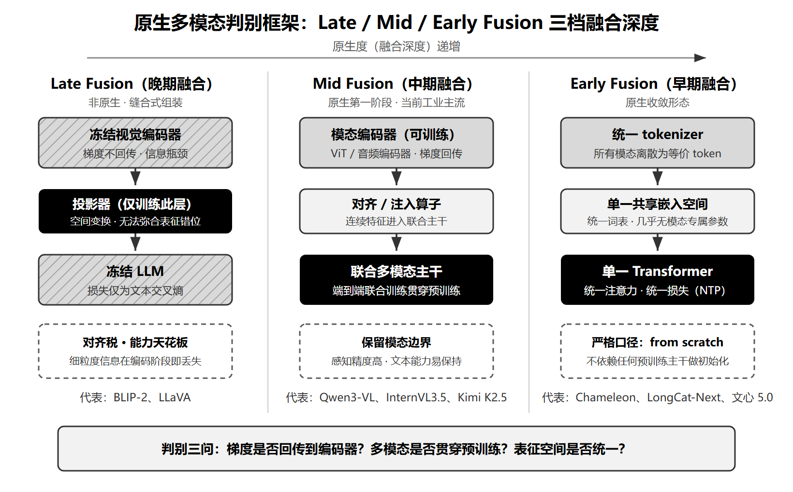
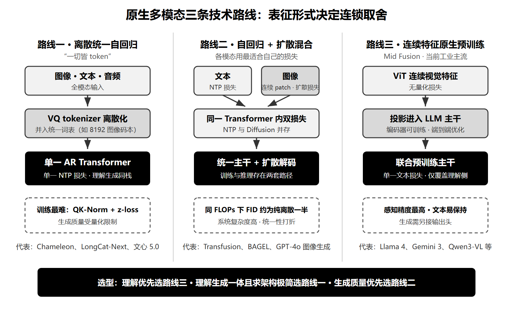
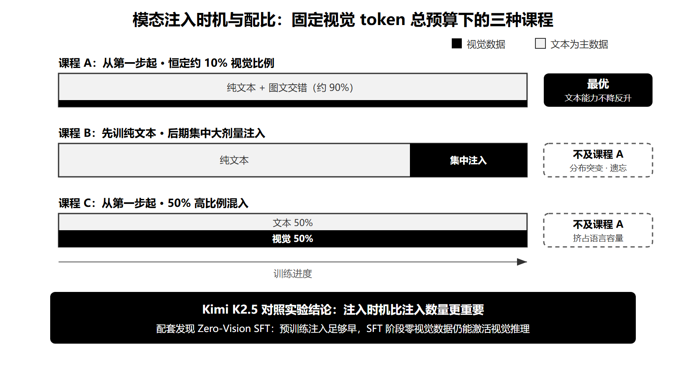
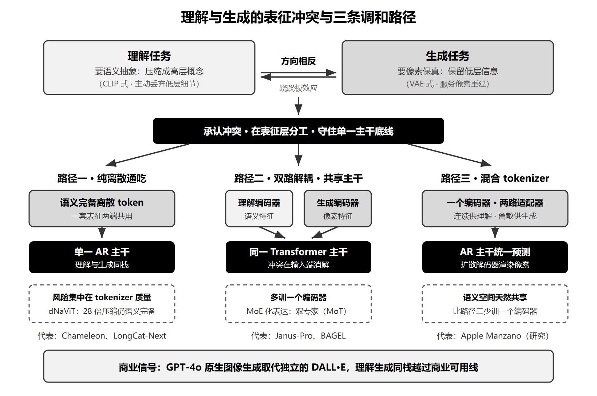
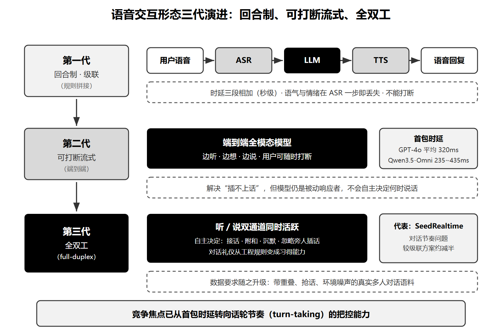

## 5.5 AI多模态原生模型核心技术高频考点

- [1.什么是原生多模态大模型？它与"外接视觉编码器"的模块化路线有何本质区别？](#1.什么是原生多模态大模型？它与"外接视觉编码器"的模块化路线有何本质区别？)
  - [面试问题-原生多模态大模型的定义与判别标准是什么？](#面试问题-原生多模态大模型的定义与判别标准是什么？)
  - [面试问题-"原生多模态""全模态（Omni）""统一理解生成"三个概念有什么区别与联系？](#面试问题-"原生多模态""全模态（Omni）""统一理解生成"三个概念有什么区别与联系？)
  - [面试问题-模块化"缝合式"路线存在哪些根本局限，促使业界转向原生训练？](#面试问题-模块化"缝合式"路线存在哪些根本局限，促使业界转向原生训练？)
- [2.原生多模态模型有哪些主流技术路线？各自的设计动机与取舍是什么？](#2.原生多模态模型有哪些主流技术路线？各自的设计动机与取舍是什么？)
  - [面试问题-离散token统一自回归路线的基本思想是什么？工程上有哪些经典难题？](#面试问题-离散token统一自回归路线的基本思想是什么？工程上有哪些经典难题？)
  - [面试问题-自回归与扩散混合的路线为什么会出现？它调和了什么矛盾？](#面试问题-自回归与扩散混合的路线为什么会出现？它调和了什么矛盾？)
  - [面试问题-保留连续视觉特征的原生预训练路线为什么成为当前工业主流？](#面试问题-保留连续视觉特征的原生预训练路线为什么成为当前工业主流？)
  - [面试问题-几条技术路线如何横向对比与选型？](#面试问题-几条技术路线如何横向对比与选型？)
- [3.原生多模态预训练在数据与训练策略上有哪些关键设计？](#3.原生多模态预训练在数据与训练策略上有哪些关键设计？)
  - [面试问题-模态混合比例与注入时机如何影响模型能力？](#面试问题-模态混合比例与注入时机如何影响模型能力？)
  - [面试问题-联合训练如何做到纯文本能力不退化？](#面试问题-联合训练如何做到纯文本能力不退化？)
- [4.理解与生成在同一个模型里统一，难点在哪里？](#4.理解与生成在同一个模型里统一，难点在哪里？)
  - [面试问题-为什么理解与生成对视觉表征的要求存在冲突？有哪些调和方案？](#面试问题-为什么理解与生成对视觉表征的要求存在冲突？有哪些调和方案？)
  - [面试问题-统一自回归生成图像为什么慢？有哪些加速思路？](#面试问题-统一自回归生成图像为什么慢？有哪些加速思路？)
- [5.全模态实时交互模型在系统设计上要解决哪些问题？](#5.全模态实时交互模型在系统设计上要解决哪些问题？)
  - [面试问题-端到端全模态与"语音识别→大模型→语音合成"级联方案的本质区别是什么？](#面试问题-端到端全模态与"语音识别→大模型→语音合成"级联方案的本质区别是什么？)
  - [面试问题-流式低时延语音生成有哪些关键机制？](#面试问题-流式低时延语音生成有哪些关键机制？)
  - [面试问题-从"可打断"到"全双工"，交互形态的演进方向是什么？](#面试问题-从"可打断"到"全双工"，交互形态的演进方向是什么？)

<h3 id="1.什么是原生多模态大模型？它与"外接视觉编码器"的模块化路线有何本质区别？">1.什么是原生多模态大模型？它与"外接视觉编码器"的模块化路线有何本质区别？</h3>

<h4 id="面试问题-原生多模态大模型的定义与判别标准是什么？">面试问题-原生多模态大模型的定义与判别标准是什么？</h4>

**难度评分：⭐⭐⭐ (3/5)  |  考察频率：⭐⭐⭐⭐⭐ (5/5)**

"原生多模态（Native Multimodal）"是 2025 年以来出现频率最高的架构叙事，但不同厂商的口径差异极大。回答这道题的正确姿势是：先给严格定义，再给宽窄两种口径，最后落到一套可操作的判别标准。

**最严格的定义来自 Apple 的缩放律研究。** Apple 在 ICCV 2025 的《Scaling Laws for Native Multimodal Models》中，通过对 457 个不同参数量与数据配比的模型做系统扫描实验，将原生多模态模型定义为：**从零开始（from scratch）在所有模态上同时训练、不依赖任何预训练 LLM 或预训练视觉编码器做初始化的模型**。按这个口径，业界绝大多数自称"原生"的模型都不合格。

**更实用的框架是按融合深度分三档：**

- **Late Fusion（晚期融合，非原生）**：冻结的视觉编码器 + 投影器 + LLM 的"组装式"方案，梯度不回传到编码器、损失仅为文本交叉熵——即 5.3 节中 BLIP-2、LLaVA 所代表的缝合范式。
- **Mid Fusion（中期融合，原生的第一阶段）**：仍保留模态编码器，但多模态特征进入联合主干、端到端联合训练贯穿预训练全程。Qwen3-VL、InternVL3.5、Kimi K2.5 属于此档，也是当前工业界的主流形态。
- **Early Fusion（早期融合，原生的收敛形态）**：所有模态经统一映射进入单一共享嵌入空间，由一个 Transformer 主干统一建模，所有模态被当作等价 token。代表作是 Meta 的 Chameleon、美团的 LongCat-Next、百度的文心 5.0（ERNIE 5.0）。

**按输入输出对偶性还有一组正交分类。** 2026 年的系统性综述《Toward Native Multimodal Modeling: A Roadmap》把原生模型按任务形态分为三类：**M2T**（Multi-to-Text，多模态输入、文本输出，如 Qwen3-VL）、**M2G**（Multi-to-Target，面向图像/音视频生成，如 MiniMax 的 H3）、**M2M**（Multi-to-Multi，理解与生成对称统一，如文心 5.0）。融合深度三分法回答"怎么训"，这组分类回答"训出来做什么"，两者组合即可精确定位任何一个新发布的模型。

**可操作的判别标准有五条。** 拿到一个新模型，依次检查：

- **训练起点**：多模态数据是否从预训练第一步就参与？MiniMax-M3 官方明确"从训练第一步起做混合模态训练"；而 Kimi K2.5 是在纯文本基座上续训 15T 视觉-文本混合 token——宽口径下算原生，严格口径属"后原生化"。
- **表征统一性**：所有模态是否进入同一词表或同一嵌入空间？Chameleon 把 8192 的图像码本并入 65536 的统一词表，是最彻底的实现。
- **主干单一性**：是否单一 Transformer 统一注意力与损失，还是存在 Thinker-Talker、双专家这类结构分工？
- **编码器依赖**：完全不依赖外挂编码器（Early Fusion），还是保留编码器但端到端联合训练（Mid Fusion）？
- **文本能力同步获得**：语言能力与多模态能力是否在同一过程中习得，而非"先有语言、后补视觉"？

**闭源模型的"原生"只能采信官方口径，开源模型的"原生"也要细读技术报告。** Google 自 Gemini 初代起就宣称 natively multimodal，OpenAI 称 GPT-4o 为端到端训练的 omni 模型，但两者的训练配方均未公开，原生程度无法独立验证。开源侧同样存在口径落差：Llama 4 官方表述为"native multimodality with early fusion"，但其视觉编码器基于 MetaCLIP、且经历过与冻结语言模型配合的独立训练阶段——严格说是"early fusion 的输入序列 + 独立训练的编码器"的混合体。面试中能主动指出营销口径与学术口径的落差，是区分"背概念"和"懂概念"的信号。

---

<h4 id="面试问题-"原生多模态""全模态（Omni）""统一理解生成"三个概念有什么区别与联系？">面试问题-"原生多模态""全模态（Omni）""统一理解生成"三个概念有什么区别与联系？</h4>

**难度评分：⭐⭐ (2/5)  |  考察频率：⭐⭐⭐⭐ (4/5)**

这三个词在技术报告与营销文案中经常被混用，实际上刻画的是三个相互独立的维度，任何一个都不能推出另外两个。

**原生多模态刻画"融合深度"。** 关注的是训练起点与架构统一程度：多模态是从第一天就联合训练，还是后期缝合。这是纵向维度。

**全模态（Omni）刻画"模态广度"。** 关注的是输入输出覆盖面：除图文外能否听（音频输入）、能否说（语音输出）、能否看视频。这是横向维度。一个 Omni 模型不必是严格原生的——Qwen3-Omni 能听会说，但其 Thinker-Talker 架构带有独立的视觉编码器、音频编码器与语音解码器，属于 Mid Fusion 而非 Early Fusion。

**统一理解生成刻画"任务对称性"。** 关注的是同一主干能否既理解图像又生成图像。GPT-5 的多模态理解很强，但图像生成走的是独立的模型线，不满足任务对称；字节的 BAGEL 满足统一理解生成，但它基于 Qwen2.5-7B 改造而来，不是严格原生。

一句话区分三者：**原生回答"怎么训出来的"，Omni 回答"能进出哪些模态"，统一理解生成回答"同一个主干会不会既看图又画图"。**

**三个维度可以独立组合，用反例记忆最牢靠：**

- **原生但不 Omni**：Chameleon 只覆盖图文两个模态，但它是 from scratch 的 Early Fusion。
- **Omni 但非严格原生**：LongCat-Flash-Omni（560B 总参、27B 激活）支持实时音视频交互，但保留了约 6 亿参数的轻量视觉/音频编码器。
- **统一理解生成但非原生**：DeepSeek 的 Janus-Pro 在单一 Transformer 内同时做理解与生成，但视觉编码基于预训练组件、基座是预训练 LLM。
- **三者同时满足**：文心 5.0、LongCat-Next 是目前最接近"原生 + 全模态 + 理解生成一体"终局形态的已发布模型。

回答这类题的要点是先辨认题干在问哪个维度，避免"Omni 就等于原生"的想当然——这也是面试官设置这道题的主要陷阱。

---

<h4 id="面试问题-模块化"缝合式"路线存在哪些根本局限，促使业界转向原生训练？">面试问题-模块化"缝合式"路线存在哪些根本局限，促使业界转向原生训练？</h4>

**难度评分：⭐⭐⭐ (3/5)  |  考察频率：⭐⭐⭐⭐ (4/5)**

5.3 节的 CLIP → BLIP-2 → LLaVA 主线，本质上是"条件适配"：视觉被当作外部条件接入一个已经训练完成的语言模型。从第一性原理看，这是在用条件分布 $p(\text{text} \mid \text{image})$ 去近似联合分布 $p(\text{text}, \text{image})$——三个根本局限都源于这个近似。

**局限一：冻结编码器构成信息瓶颈。** 编码器的预训练目标（如对比对齐）决定了它保留什么信息、丢弃什么信息。下游任务需要的细粒度信息——OCR 文字、边界框坐标、图表结构——可能在编码阶段就已经丢失，后面的 LLM 再强也无法恢复。梯度不回传到编码器，意味着这个瓶颈永远无法被任务信号修正。BLIP-2 两阶段改装与原生预训练的完整对比，详见 5.4 节中"视觉能力是事后缝合还是原生习得"主问题的相关内容。

**局限二：对齐税（alignment tax）。** 投影器只能做空间变换，无法弥合两个独立预训练出来的表征空间之间的系统性错位。表现有二：一是需要额外的对齐训练阶段与对齐数据，成本转嫁到下游；二是对齐训练常以牺牲语言能力为代价——5.1 节提到 GPT-4o 在纯文本榜单上仅与 GPT-4 Turbo 相近而非超越，部分模型容量被视觉对齐占用是公认解释。

**局限三：能力天花板被缩放律证实。** Apple 的 457 模型扫描实验给出了量化结论：Late Fusion 相比 Early Fusion **没有内在优势**；在小参数量区间 Early Fusion 反而更强、训练成本更低、部署更简单；达到 compute-optimal 时，Late Fusion 需要更高的参数/数据比。这个结果把"缝合只是算力不足时的权宜之计"从经验判断变成了实证结论。

**业界的转向是一致且迅速的。** 2025 年之后发布的旗舰模型无一例外让多模态深度进入预训练：Llama 4 官方称采用 early fusion、图文联合预训练超 30T token；MiniMax-M3 从第一步起混合模态训练；智谱 GLM-5V-Turbo 把视觉从预训练阶段融入并作为"原生多模态 Coding 基座"发布。缝合范式并未消失，但已退居学术基线与小模型场景。

  
   
  <b>图 5.5.1-1　Late / Mid / Early Fusion 三档融合深度对比</b>

---

<h3 id="2.原生多模态模型有哪些主流技术路线？各自的设计动机与取舍是什么？">2.原生多模态模型有哪些主流技术路线？各自的设计动机与取舍是什么？</h3>

<h4 id="面试问题-离散token统一自回归路线的基本思想是什么？工程上有哪些经典难题？">面试问题-离散token统一自回归路线的基本思想是什么？工程上有哪些经典难题？</h4>

**难度评分：⭐⭐⭐⭐ (4/5)  |  考察频率：⭐⭐⭐⭐ (4/5)**

这条路线的第一性动机是把 LLM 的成功公式原样推广到所有模态："一切皆 token"——如果 next-token prediction 能学会语言的一切，那么把图像、音频也变成 token，同一个目标函数就应该能学会一切模态。

**基本思想：所有模态离散化进同一词表。** Meta 的 Chameleon（2024）是开山作：图像经 VQ tokenizer 离散化——一张 512×512 的图变成 1024 个 token、码本大小 8192——并入 65536 的统一词表，7B/34B 的单一 Transformer 从第一层起做 early fusion，理解与生成共用一个 next-token prediction 损失。BAAI 的 Emu3 随后用 8B 参数验证了纯 NTP 可以同时超越 SDXL（生成）与 LLaVA-1.6（理解），该工作于 2026 年登上 Nature，为这条路线确立了学术地位。

**这条路线的吸引力在于把多模态问题整体"退化"为已被解决的问题：**

- 词表与损失统一后，LLM 的全套训练方法论——数据课程、学习率退火、SFT 与 RL 对齐——无需修改即可复用；
- 推理侧完全继承 LLM 基建，KV cache、投机解码、量化部署全部现成，无需为视觉生成单独维护一条扩散服务管线；
- 理解与生成天然同栈，跨模态的上下文（如"参考上一张图的风格再画一张"）在同一序列内自然表达。

**难题一：统一 softmax 下的模态竞争与训练不稳定。** 文本 token 与图像 token 在同一个输出分布里竞争 logit 空间，不同模态的熵差异会导致训练中后期 norm 漂移直至发散。Chameleon 的解法已成为该路线的标准配置：**QK-Norm**（对 attention 的 query/key 做归一化）加 **z-loss** 正则，再配合调整 LayerNorm 的位置，才把 34B 规模的训练稳定下来。

**难题二：模态混合调度。** 多模态数据不能简单拼接投喂——某一模态在局部训练窗口内占比过高时，模型会学出退化的无条件先验（对另一模态"视而不见"）。混合比例与采样课程必须精细设计，这部分经验详见本节"模态混合比例与注入时机如何影响模型能力？"子问题。

**难题三：离散化的信息损失。** VQ 量化不可避免地丢失细节，这曾被认为是该路线做不了 OCR、文档解析等细粒度感知的根本原因。美团的 LongCat-Next（2026）给出了反例：其 dNaViT 视觉分词器在 28 倍压缩率下保持语义完备，配合 DiNA（离散原生自回归）范式——文本、视觉、音频共享同一套参数、同一个注意力、同一个损失——在 OmniDocBench 文档解析基准上超过了 Qwen3-Omni 与专用视觉模型 Qwen3-VL。这说明离散路线的感知上限取决于 tokenizer 的质量，而非离散化本身。该模型 68.5B 总参、激活约 3B，以 MIT 协议开源，是这条路线目前最完整的工业样本。

---

<h4 id="面试问题-自回归与扩散混合的路线为什么会出现？它调和了什么矛盾？">面试问题-自回归与扩散混合的路线为什么会出现？它调和了什么矛盾？</h4>

**难度评分：⭐⭐⭐⭐ (4/5)  |  考察频率：⭐⭐⭐ (3/5)**

混合路线的出现，直接回应的是纯离散自回归的最大短板——图像生成质量。

**矛盾的两端：离散化伤生成，扩散难统一。** 扩散模型在连续空间建模图像分布，生成质量高、细节保真好，但其多步去噪的训练目标与 next-token prediction 不兼容，难以塞进统一序列建模框架；纯离散自回归在架构上最统一，但 VQ 量化损失加上逐 token 串行解码，同时拖累生成质量与生成速度。混合路线的主张是：**让每种模态用最适合自己的损失函数，代价是牺牲"一个损失走天下"的纯粹性。**

**Transfusion 用对照实验给出了量化答案。** Meta 的 Transfusion（2024）在单一 Transformer 内混用两种损失：文本 token 走 NTP，图像 patch 保持连续表征、走扩散损失。与 Chameleon 式的全离散方案严格对照：**相同 FLOPs 下，图像生成的 FID 约为离散方案的一半；图生文任务只需约 21.8% 的 FLOPs 即可打平**。这组数字是"模态特定损失值得保留"最常被引用的证据，也是面试中最值得记住的实证结论。

**工程化变体在 2025 年集中落地。** 字节的 BAGEL（14B 总参、激活 7B）采用 MoT（Mixture-of-Transformer-Experts）结构——理解专家与生成专家分工，配双视觉编码器（像素级 + 语义级），是开源统一模型的代表；Apple 的 Manzano 研究则提出混合 tokenizer——同一个视觉编码器接两路适配器，连续嵌入供理解、离散 token 供生成，由自回归主干统一预测、扩散解码器渲染像素。商业侧，GPT-4o 的原生图像生成于 2025 年 3 月上线并取代扩散式的 DALL·E，官方确认其为自回归生成，证明"生成能力内置于统一主干"已越过商业可用线。

**这条路线的取舍要说透：** 换来的是接近专用扩散模型的生成质量；付出的是双损失、双路径带来的训练与推理系统复杂度，以及"统一"程度的折扣——模型内部实际上仍存在两套模态处理逻辑。

---

<h4 id="面试问题-保留连续视觉特征的原生预训练路线为什么成为当前工业主流？">面试问题-保留连续视觉特征的原生预训练路线为什么成为当前工业主流？</h4>

**难度评分：⭐⭐⭐ (3/5)  |  考察频率：⭐⭐⭐⭐⭐ (5/5)**

在多模态理解这一侧，2025~2026 年的旗舰模型几乎全部收敛到同一条路线：保留 ViT 类视觉编码器输出的连续特征，但让多模态从预训练早期就深度参与、端到端联合优化——也就是判别标准三分法中的 Mid Fusion。

**优势一：感知精度最高。** 连续特征没有量化损失，在 OCR、视觉定位、文档图表解析这些细粒度任务上天然占优。Qwen3-VL、InternVL3.5（最大 241B-A28B）在文档理解基准上的强势表现均建立在连续特征之上。

**优势二：完整继承 LLM 的成熟训练体系。** 数据管线、并行训练 infra、SFT 与 RL 对齐方法可以全套复用。InternVL3.5 的原生预训练阶段仅用约 250B token（文本:多模态约 1:2.5、序列长度 32K）就完成语言与多模态能力的同步构建，正是因为它直接嫁接在成熟的语言模型训练管线上。

**优势三：文本能力最容易保持。** 连续特征通过投影进入主干，不侵占文本词表与输出分布，语言能力受到的扰动最小（详见本节"联合训练如何做到纯文本能力不退化？"子问题）。

**代表模型的密度足以说明工业共识：**

- Llama 4 官方称采用 early fusion 输入序列、图文联合预训练超 30T token（视觉编码器基于 MetaCLIP），Scout 版本 17B 激活参数、16 专家、10M 上下文；
- Gemini 3 官方口径 natively multimodal，MMMU-Pro 81%、1M token 上下文；
- Kimi K2.5（1T 总参、32B 激活）用 400M 的 MoonViT 编码器配合视觉-文本混合续训；
- 阶跃星辰 Step 3（321B 总参、38B 激活）以"全尺寸原生多模态推理模型"为定位开源；
- 腾讯混元 Hunyuan-Large-Vision 用原生分辨率 ViT 配 389B 总参、52B 激活的 MoE 主干；
- 智谱 GLM-5V-Turbo 将这条路线推进到 Coding 场景，视觉从预训练阶段融入新一代 CogViT 编码器。

**局限同样要答出来。** 这条路线只覆盖理解侧——生成需要另接输出头或独立模型；且按严格口径，其"原生度"存疑：多数模型初始化自预训练 LLM，是"原生预训练"而非"原生模型"。它与缝合式的本质分界在于编码器是否参与联合训练、多模态是否贯穿预训练，这一对比在 5.4 节中"视觉能力是事后缝合还是原生习得"主问题已有完整展开，此处不再重复。

---

<h4 id="面试问题-几条技术路线如何横向对比与选型？">面试问题-几条技术路线如何横向对比与选型？</h4>

**难度评分：⭐⭐⭐⭐ (4/5)  |  考察频率：⭐⭐⭐⭐ (4/5)**

三条路线没有绝对优劣，只有围绕"表征形式"这一根源变量展开的连锁取舍。全模态实时交互是与三者正交的系统维度（任何一条路线都可以做 Omni 化），单独放在本章第 5 个主问题讨论。

**三条路线核心属性对比：**

| 属性 | 离散统一自回归 | 自回归+扩散混合 | 连续特征原生预训练 |
|---|---|---|---|
| 表征形式 | 全模态离散 token，统一词表 | 文本离散 + 图像连续（双损失） | 文本离散 + 视觉连续（单损失） |
| 理解精度 | 取决于 tokenizer 质量（dNaViT 已证明可达专用模型水平） | 高（理解路径用连续/语义特征） | 最高（无量化损失） |
| 生成能力 | 原生具备，质量受量化限制 | 原生具备，质量接近专用扩散模型 | 不具备，需外接生成头 |
| 训练稳定性 | 最难（模态竞争，需 QK-Norm/z-loss） | 中（双损失需平衡权重与调度） | 最好（沿用 LLM 成熟配方） |
| 部署成本 | 低（完全复用 LLM 推理栈，但生成侧时延高） | 高（AR 与扩散两套推理逻辑） | 低（理解侧与 LLM 栈一致） |
| 代表模型 | Chameleon、LongCat-Next、文心 5.0 | Transfusion、BAGEL、GPT-4o 图像生成 | Llama 4、Gemini 3、Qwen3-VL、InternVL3.5、Kimi K2.5 |

**选型逻辑按业务目标展开：**

- **理解优先**（文档解析、GUI Agent、多模态推理）：选连续特征原生预训练，这是当前性能、成本、生态成熟度的综合最优解，也是绝大多数团队的默认选择。
- **理解生成一体、追求架构极简**：选离散统一自回归，收益是推理基建与 LLM 完全复用、理解生成天然同栈，代价是要自己解决 tokenizer 质量与训练稳定性。
- **生成质量优先**（图像/视频生成为主业务）：选混合路线，用系统复杂度换生成质量。MiniMax 的实践是一个注脚：通用多模态 LLM 用 M3（428B 总参、23B 激活、1M 上下文），全模态生成另起 H3 系统（统一理解上下文、生成 2K 带原生立体声的音视频）——同一家公司按业务目标拆成两条线。美团的布局同理：LongCat-Flash-Omni 负责全模态实时交互，LongCat-Next 负责离散原生统一，同族两线各司其职。

**收敛趋势判断。** 短期三线并行；长期看，理解与生成在单一主干内无缝共存（M2M 形态）是各家公开路线图的共同指向——文心 5.0 以 2.4 万亿总参、激活不足 3% 的超稀疏 MoE 配合 Next-Group-of-Tokens Prediction 做全模态统一自回归，是这个方向上最激进的已发布样本。

  
   
  <b>图 5.5.2-1　原生多模态三条技术路线架构对比</b>

---

<h3 id="3.原生多模态预训练在数据与训练策略上有哪些关键设计？">3.原生多模态预训练在数据与训练策略上有哪些关键设计？</h3>

<h4 id="面试问题-模态混合比例与注入时机如何影响模型能力？">面试问题-模态混合比例与注入时机如何影响模型能力？</h4>

**难度评分：⭐⭐⭐⭐ (4/5)  |  考察频率：⭐⭐⭐⭐ (4/5)**

原生预训练最核心的工程自由度不在架构，而在数据课程（data curriculum）：混什么、混多少、什么时候混。这道题有两个 2026 年的实证结论可以直接引用。

**结论一：原生多模态遵循与 LLM 相近的缩放律，参数与数据应等比扩展。** Apple 的 457 模型扫描实验表明，early fusion 原生模型的 scaling 行为与纯文本 LLM 高度一致，compute 增加时参数量与数据量应大致等比例增长；数据构成会改变最优分配——caption 类图文对占比高时应偏向"多训数据"，interleaved 交错图文占比高时则相反。其参照混合配比约为：caption 类 45% + interleaved 类 45% + 纯文本 10%。

**结论二：注入时机比注入数量更重要。** Kimi K2.5（1T 总参、32B 激活）在固定视觉 token 总预算的对照实验中发现：**从预训练第一步起、以约 10% 的恒定比例混入视觉数据，效果优于"先训文本、后期集中注入"，也优于 50% 的高比例混入**。配套发现是 Zero-Vision SFT——当预训练阶段视觉注入足够早、足够充分时，即使 SFT 阶段完全不用视觉数据，模型依然表现出视觉推理能力。这说明多模态对齐主要在预训练完成，后训练只是激活。

**结论三：MoE 要配模态无关路由。** 同样来自 Apple 的扫描实验：在 MoE 化的原生模型中，**模态无关（modality-agnostic）路由显著优于人为指定的模态感知路由**——不规定哪个专家管哪个模态，专家反而会在训练中自发形成模态分工。LongCat-Next 的技术报告同样观察到 MoE 路由的模态专精化现象，两者互为印证。这对工程的含义是：不要把模态先验硬编码进路由器。

**典型配比与课程可作为工程参照：**

- InternVL3.5 原生预训练阶段：约 250B token，文本:多模态约 1:2.5，序列长度 32K；
- Qwen3.5-Omni：音视频语料超 1 亿小时，其 AuT 音频编码器单独从零训练用了 4000 万小时音频；
- BAAI Emu3.5 的两阶段课程是渐进式设计的典型样本：第一阶段以 32K 序列长度训约 10T token 学基础对齐，第二阶段再用约 3T token 提升分辨率与标注质量；
- 渐进式课程已是标配——先低分辨率大批量学对齐，再高分辨率小批量学细节，与 5.4 节中"渐进式缩放为何要先用小LLM训好视觉编码器再迁移？"子问题描述的降本思路同源。

**回答框架建议：** 先给"等比缩放"和"早注入、低恒比"两个结论，再用一句话点出背后的直觉——多模态能力像语言能力一样需要在表征形成早期就参与塑造，晚期注入等于在已经固化的语言空间上打补丁。

---

<h4 id="面试问题-联合训练如何做到纯文本能力不退化？">面试问题-联合训练如何做到纯文本能力不退化？</h4>

**难度评分：⭐⭐⭐⭐ (4/5)  |  考察频率：⭐⭐⭐⭐ (4/5)**

"加视觉必掉文本"曾是行业共识——5.1 节提到过 GPT-4o 纯文本能力仅与 GPT-4 Turbo 相近的现象。2026 年的新证据表明：退化不是必然，关键变量是数据课程。

**反例一：视觉数据反哺文本能力。** Kimi K2.5 在纯文本基座上续训 15T 视觉-文本混合 token 后，MMLU-Pro、GPQA 等纯文本基准不降反升，SWE-bench Verified 达到 76.8%。给出的解释是：交错图文数据带来了纯文本语料中稀缺的推理链形态（图表推理、空间关系、过程演示），对文本推理构成正迁移。

**反例二：专项能力持平。** 智谱 GLM-5V-Turbo 以"原生多模态 Coding 基座"为定位，官方口径是多模态化之后纯文本编程能力与文本基座持平——视觉能力是增量而非置换。

**保持文本能力的三个工程抓手：**

- **恒定纯文本配比**：预训练全程保留一条纯文本数据流，不让多模态数据在任何阶段独占训练窗口。Apple 实验中纯文本约占 10%，与 5.1 节提到的"多模态训练混入 10%~30% 纯文本"的经验区间一致。
- **早注入代替晚冲击**：视觉数据从第一步起低比例恒定注入（K2.5 结论），避免后期大剂量多模态数据冲垮已经收敛的语言分布——灾难性遗忘的很大一部分来自分布突变而非容量挤占。
- **训练稳定器**：z-loss 与 QK-Norm 抑制模态竞争引发的 logit 漂移，这在离散路线上是必需品（详见本节"离散token统一自回归路线的基本思想是什么？工程上有哪些经典难题？"子问题），在连续路线上同样有正向作用。

**一个可验证的判别信号：** 厂商是否敢于公布多模态化前后的纯文本基准对比。敢公布且不退化的（K2.5、GLM-5V-Turbo），其原生训练配方通常经得起推敲；只谈多模态榜单、回避纯文本对比的，往往在语言能力上付出了未披露的代价。

  
   
  <b>图 5.5.3-1　固定视觉 token 总预算下三种注入课程的对比</b>

---

<h3 id="4.理解与生成在同一个模型里统一，难点在哪里？">4.理解与生成在同一个模型里统一，难点在哪里？</h3>

<h4 id="面试问题-为什么理解与生成对视觉表征的要求存在冲突？有哪些调和方案？">面试问题-为什么理解与生成对视觉表征的要求存在冲突？有哪些调和方案？</h4>

**难度评分：⭐⭐⭐⭐ (4/5)  |  考察频率：⭐⭐⭐⭐ (4/5)**

统一理解生成（业界称 UMM 或 M2M 形态）的根本难点不在损失函数，而在表征：两类任务对"图像应该被编码成什么"的要求方向相反。

**冲突的本质：语义抽象 vs 像素保真。** 理解任务希望表征做 CLIP 式的语义抽象——把"一只在草地上奔跑的金毛"压缩成高层概念，主动丢弃毛发纹理、光照渐变这些低层细节；生成任务恰恰相反，希望表征保留足够的低层信息以便重建像素，接近 VAE 的目标。一套表征同时服务两端，必然两头受损——早期统一模型普遍出现"理解拖累生成、生成拖累理解"的跷跷板现象，这也是很长时间里理解模型与生成模型分家的根本原因。

**调和路径一：纯离散，赌 tokenizer 的质量。** 用一套语义完备的离散表征通吃两端——Chameleon 开创、LongCat-Next 目前走得最远（dNaViT 在 28 倍压缩下同时支撑文档级理解与图像生成）；BAAI 的 Emu3.5 同样属于此路径，其词表总量 282,926、其中视觉 token 131,072。这条路径架构最优雅，风险全部集中在 tokenizer 上。

**调和路径二：双路解耦，共享主干。** 承认两类任务需要不同的视觉编码，把冲突消解在输入端。DeepSeek 的 Janus-Pro 把理解与生成的视觉编码解耦为两条独立路径、共享同一个 Transformer 主干，文生图基准 GenEval 达到 80%、超过 DALL-E 3；字节 BAGEL 的 MoT 双专家加双视觉编码器（像素级 + 语义级）是同一思想的 MoE 化表达。

**调和路径三：混合 tokenizer，一编码器两出口。** Apple 的 Manzano 研究让同一个视觉编码器接两路适配器：连续嵌入供理解路径、离散 token 供生成路径，自回归主干统一预测，扩散解码器负责最终渲染。相比路径二少训一个编码器，语义空间天然共享。

**三条路径的共同点值得点破：** 都不再试图用"一套表征硬扛两类任务"，而是承认冲突、在表征层做分工，同时守住"单一主干"的底线。GPT-4o 原生图像生成于 2025 年 3 月上线并取代独立的 DALL·E，标志着理解生成同栈已经越过商业可用线——统一不再是学术理想，而是产品路线。

---

<h4 id="面试问题-统一自回归生成图像为什么慢？有哪些加速思路？">面试问题-统一自回归生成图像为什么慢？有哪些加速思路？</h4>

**难度评分：⭐⭐⭐⭐ (4/5)  |  考察频率：⭐⭐⭐ (3/5)**

统一自回归把图像生成变成了逐 token 的串行解码，这在效率上天然吃亏——它是离散路线工程落地的头号瓶颈，也是面试中考察"是否真正理解 AR 生成代价"的常设追问。

**慢的根源：串行解码 × token 数量。** 一张 512×512 的图在 Chameleon 的 VQ 方案下对应 1024 个 token，必须逐个采样、每步一次完整前向；分辨率翻倍，token 数变为 4 倍，串行链条等比拉长。对比之下，扩散模型虽需多步去噪，但每一步对全图并行，且采样步数可以蒸馏压缩（相关加速方法详见 5.2 节"多模态生成器"中"主流采样策略与推理加速方法"相关内容）——串行瓶颈与并行瓶颈的差异，决定了两者在高分辨率下的时延差距。

**加速思路一：一次预测一组 token。** 把预测粒度从单 token 提升到 token 组，直接缩短串行步数。文心 5.0 的 Next-Group-of-Tokens Prediction 是这一思路在全模态统一架构上的工业实现。

**加速思路二：减少要生成的 token 总量。** 在 tokenizer 层面做高压缩比——LongCat-Next 的 dNaViT 做到 28 倍压缩仍保持语义完备，意味着同样一张图需要自回归生成的 token 数大幅下降，训练与推理同时受益。

**加速思路三：训推分离，解码阶段并行化。** 训练仍用自回归目标，推理时切换为双向并行的离散扩散式解码。BAAI 的 Emu3.5（34.1B、13T token 训练）用 DiDA 适配实现单图推理约 20 倍加速、理解与生成指标基本无损，验证了"AR 训练 + 并行解码"两者可以解耦。

三条思路相互正交、可以叠加，共同指向一个判断：**串行解码不是离散自回归路线的宿命，而是可以被工程逐步消解的代价**——这也是该路线在 2026 年重新获得工业界押注的原因之一。

  
   
  <b>图 5.5.4-1　理解与生成的表征冲突与三条调和路径</b>

---

<h3 id="5.全模态实时交互模型在系统设计上要解决哪些问题？">5.全模态实时交互模型在系统设计上要解决哪些问题？</h3>

<h4 id="面试问题-端到端全模态与"语音识别→大模型→语音合成"级联方案的本质区别是什么？">面试问题-端到端全模态与"语音识别→大模型→语音合成"级联方案的本质区别是什么？</h4>

**难度评分：⭐⭐⭐ (3/5)  |  考察频率：⭐⭐⭐⭐ (4/5)**

语音交互的传统实现是三段级联：ASR 把语音转成文字、LLM 生成文字回复、TTS 把回复合成为语音。GPT-4o（2024）第一次让业界直观看到端到端方案与级联方案的体验差距。区别集中在三个维度。

**信息维度：级联在第一段就丢掉了副语言信息。** 语音转文字的瞬间，语气、情绪、重音、停顿、说话人特征、环境声全部丢失——模型看到的"你可真行啊"没有阴阳怪气与真诚夸赞之分。端到端模型直接消费音频表征（如 GLM-4-Voice 将语音离散化为 12.5Hz 的低码率 token 序列供 LLM 直接建模），副语言信息全程保留，回复的语气也可以由模型自己决定。

**时延维度：级联的时延是三段之和。** 每一段都要等上一段输出相对完整的结果，整句等待不可避免，实际产品时延普遍在秒级。端到端模型可以边听、边想、边说——GPT-4o 的语音响应平均 320ms、最快 232ms，进入了人类对话自然停顿的量级。

**节奏维度：级联系统没有"对话节奏"的概念。** 何时接话、何时沉默、被打断时如何优雅收尾，级联方案只能靠 VAD（语音活动检测）阈值等规则硬编码，而这些恰恰是自然对话的核心。端到端模型可以从真实对话数据中学习节奏（详见本节"从'可打断'到'全双工'，交互形态的演进方向是什么？"子问题）。

**级联并未出局，选型要看场景。** 级联成本低、模块可独立升级替换、内容可控性强，客服、外呼等垂直场景仍是主流选择；但旗舰交互产品已全面转向端到端——阿里 Qwen 的 Omni 系列、字节的 SeedRealtime（已在豆包全量上线）、智谱的 GLM-Realtime 均是端到端路线。两者的关系类似"缝合式与原生"在交互场景的重演：规则拼接的系统永远无法学到跨越模块边界的能力。

---

<h4 id="面试问题-流式低时延语音生成有哪些关键机制？">面试问题-流式低时延语音生成有哪些关键机制？</h4>

**难度评分：⭐⭐⭐⭐ (4/5)  |  考察频率：⭐⭐⭐⭐ (4/5)**

端到端只是入场券，交互体验的硬指标是首包时延——用户说完话到听见第一声回应的间隔。以公开技术细节最完整的 Qwen-Omni 系列为参照，可以拆出四个关键机制。

**机制一：分工式架构，理解与发声解耦。** Thinker-Talker 是该系列的标志设计：Thinker 负责多模态理解与文本推理，Talker 专职把 Thinker 的语义流实时转成语音流，两者流式衔接——推理还没结束，发声已经开始。该架构自 Qwen2.5-Omni（7B 稠密）确立，Qwen3-Omni 升级为 30B-A3B 的 MoE 版本，Qwen3.5-Omni 进一步宣称以 omnimodal 方式原生预训练（官方口径），支持 256K 上下文与 113 种语言的语音识别。

**机制二：分块流式输入。** 音频与视频按 chunk 切块进入 Thinker，不等整段输入结束就开始理解，把"听"的等待时间摊平到说话过程中。

**机制三：时间对齐位置编码。** 音频流与视频帧必须在时间轴上严格对齐，否则"看到的口型"与"听到的声音"错位。TMRoPE 把时间维度显式编入位置编码，让音视频 token 在统一时钟上交错排列——这是 5.4 节中 M-RoPE 思想在实时交互场景的延伸。

**机制四：多码本并行合成，首帧即发声。** Talker 采用多码本自回归配合 MTP（多 token 预测），生成第一帧 codec 编码即可开始合成波形，无需等待完整句子；Qwen3.5-Omni 又引入 ARIA，在流式解码中动态对齐文本单元与语音单元，避免长句中语音与语义漂移。

**大参数模型的实时化是另一层工程问题。** 美团的 LongCat-Flash-Omni 在 560B 总参规模上做到实时音视频交互，靠三件事：MoE 稀疏化（27B 激活）配零计算专家压低单 token 成本；视觉/音频编解码器控制在约 6 亿参数的轻量级；音视频特征按 chunk 交错进入主干，维持稳定的流式节拍。它说明"模型大"与"响应快"可以通过系统设计兼得，稀疏架构是全模态实时化的天然盟友。

**效果量级要记住：** Qwen3.5-Omni 端到端音频首包 235ms（Flash 版）至 435ms（Plus 版）、视频交互首包 426~651ms，与 GPT-4o 的平均 320ms 同处一个量级。端到端流式方案已把首包时延带入"数百毫秒俱乐部"，逼近人类对话的生理下限。

---

<h4 id="面试问题-从"可打断"到"全双工"，交互形态的演进方向是什么？">面试问题-从"可打断"到"全双工"，交互形态的演进方向是什么？</h4>

**难度评分：⭐⭐⭐ (3/5)  |  考察频率：⭐⭐⭐ (3/5)**

语音交互形态经历了三代演进，每一代解决的都是上一代的体验天花板。

**第一代：回合制。** 级联方案的产物——你说完、系统想、系统说完、你再说，任何一方都不能中途插入。体验上像对讲机，不像对话。

**第二代：可打断的流式交互。** GPT-4o 一代确立的形态：模型流式输出语音，用户可以随时打断，模型立即停下并处理新输入。解决了"插不上话"，但模型仍然是被动响应者——它不会主动决定什么时候该说话。

**第三代：全双工（full-duplex）。** 模型与用户同时在"听"与"说"两个通道上保持活跃，模型自主决定何时接话、何时附和、何时保持沉默、何时忽略无关的旁人插话。字节的 SeedRealtime（2026）是这一形态的代表：单一端到端模型在连续音视频流上"边看、边听、边说"，官方对比显示相对自家级联系统将"对话节奏问题"减少约一半，已在豆包全量上线。开源侧，美团的 LongCat-Flash-Omni 以 128K 上下文支撑 8 分钟以上的连续音视频交互（其实时化的系统设计详见本节"流式低时延语音生成有哪些关键机制？"子问题），补上了全双工所需的长时记忆这块拼图。

**竞争焦点已经从时延转向节奏。** 首包时延进入数百毫秒后，继续压缩的边际收益急剧下降；而接话时机、附和语、抢话处理、噪声环境下"知道哪句话是对自己说的"——这些 turn-taking（话轮转换）能力成为新的差异化战场。其本质是把过去由 VAD 阈值和工程规则硬编码的对话礼仪，变成从真实对话数据中习得的模型能力。

**对训练的要求随之改变。** 数据侧，语料要从"干净的单人指令录音"升级为带重叠、抢话、环境噪声的真实多人对话；建模侧，时间本身成了需要学习的对象——沉默多久算冷场、停顿多久算让渡话轮，都是有分布规律、可以从数据中习得的量。谁先把这两件事做扎实，谁就拿到下一代交互入口。

  
   
  <b>图 5.5.5-1　语音交互形态三代演进：回合制、可打断流式、全双工</b>

---
