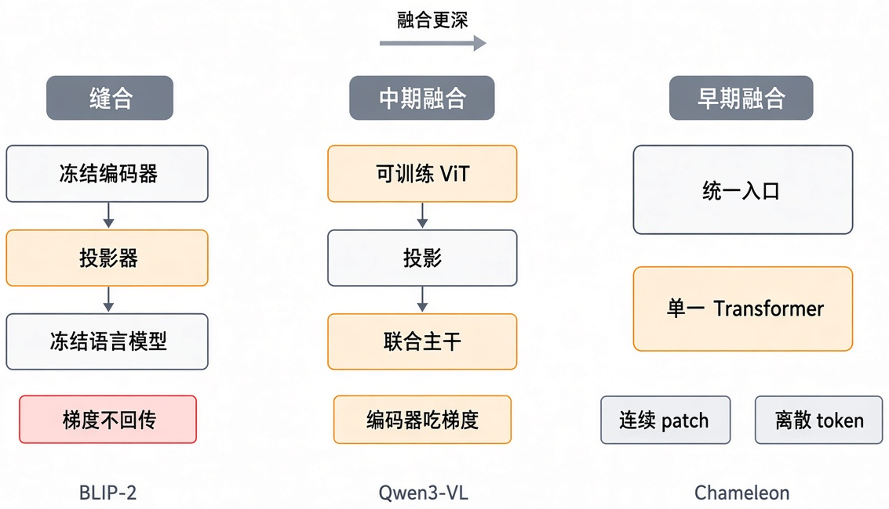
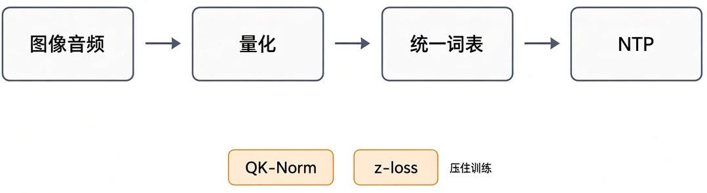
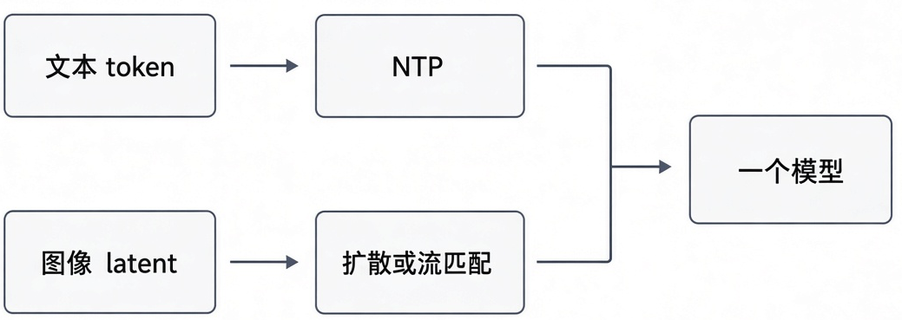
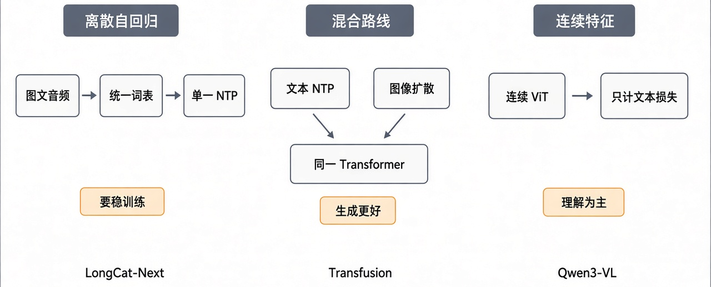
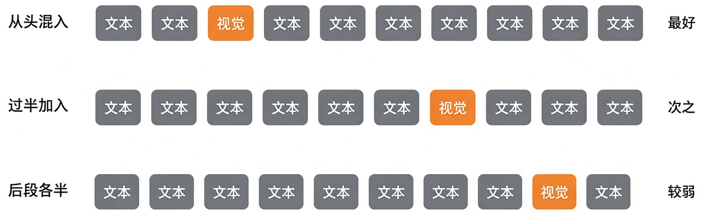
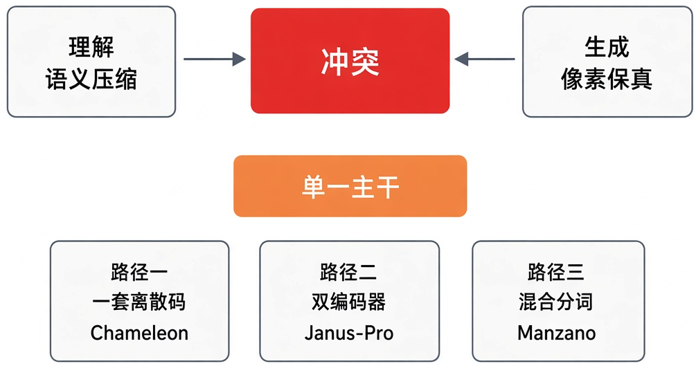
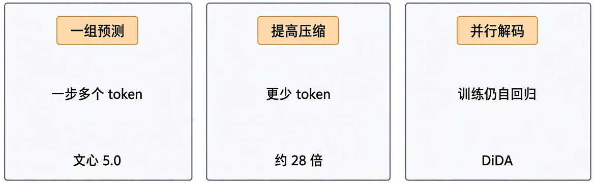
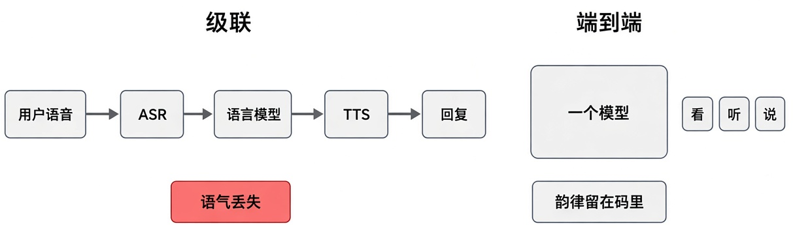
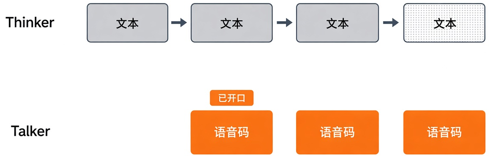
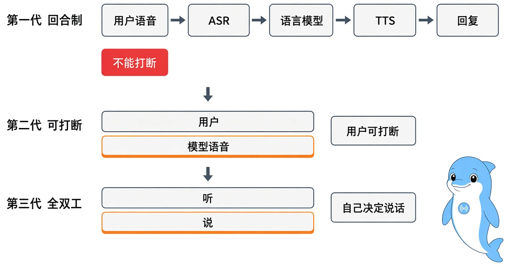

## 5.5 AI 多模态原生模型高频考点

> 本章讨论多模态能力是在预训练里一起学出来的，还是事后把视觉编码器接上去。依次讲原生多模态怎样判别，三条技术路线如何取舍，数据课程怎样保住文本能力，理解与生成为什么会互相牵制，以及全模态实时交互怎样从级联走到全双工。

---

### [5.5.1 什么是原生多模态大模型，它与外接视觉编码器的模块化路线有何区别](#q551)
- [5.5.1.1 面试问题：原生多模态大模型的定义与判别标准是什么？](#q5511)
- [5.5.1.2 面试问题：原生多模态、全模态（Omni）与统一理解生成有什么区别？](#q5512)
- [5.5.1.3 面试问题：模块化缝合路线有哪些局限？](#q5513)

### [5.5.2 原生多模态模型有哪些主流技术路线，各自怎么取舍](#q552)
- [5.5.2.1 面试问题：离散 token 统一自回归路线的基本思想是什么，工程上有哪些难题？](#q5521)
- [5.5.2.2 面试问题：自回归与扩散混合的路线为什么会出现，它调和了什么矛盾？](#q5522)
- [5.5.2.3 面试问题：保留连续视觉特征的预训练路线为什么成了理解任务的常见选择？](#q5523)
- [5.5.2.4 面试问题：几条技术路线如何横向对比与选型？](#q5524)

### [5.5.3 原生多模态预训练在数据与训练策略上有哪些设计](#q553)
- [5.5.3.1 面试问题：模态混合比例与注入时机如何影响模型能力？](#q5531)
- [5.5.3.2 面试问题：联合训练如何做到纯文本能力不退化？](#q5532)

### [5.5.4 理解与生成在同一个模型里统一，难点在哪里](#q554)
- [5.5.4.1 面试问题：为什么理解与生成对视觉表征的要求会冲突，有哪些调和方案？](#q5541)
- [5.5.4.2 面试问题：统一自回归生成图像为什么慢，有哪些加速思路？](#q5542)

### [5.5.5 全模态实时交互模型在系统设计上要解决哪些问题](#q555)
- [5.5.5.1 面试问题：端到端全模态与语音识别、大模型、语音合成的级联方案有什么区别？](#q5551)
- [5.5.5.2 面试问题：流式低时延语音生成有哪些机制？](#q5552)
- [5.5.5.3 面试问题：从可打断到全双工，交互形态怎样演进？](#q5553)

### [附录 术语表](#q55g)

---

### 5.5.1 什么是原生多模态大模型，它与外接视觉编码器的模块化路线有何区别

#### 5.5.1.1 面试问题：原生多模态大模型的定义与判别标准是什么？

**难度评分：⭐⭐⭐ (3/5)  |  考察频率：⭐⭐⭐⭐⭐ (5/5)**

2025 年以来，各家技术报告都在用「原生多模态」，口径并不一样。回答时先给一个能核对的定义，再说明工业报告里的宽口径，最后落到能检查的几条标准。

Apple 在 ICCV 2025 的论文 *Scaling Laws for Native Multimodal Models* 里，把原生多模态模型定义为从零开始、在各模态上同时训练、初始化时既不用预训练语言模型、也不用预训练视觉编码器的模型。论文扫描了 457 个不同参数量和数据配比的模型。按这个口径，多数自称原生的工业模型并不满足，因为它们的语言主干或视觉编码器来自已有 checkpoint。

融合深度至少有三套容易混在一起的说法，如图 5-1 所示。

1. **缝合。** 冻结视觉编码器，只训练投影器，语言模型多数时候也冻结，损失只算文本交叉熵。5.3 节的 BLIP-2、LLaVA 属于这一档。2026 年综述 *Toward Native Multimodal Modeling*（A Roadmap）把这种冻结组装叫 late fusion，并把它算作非原生。

2. **中期融合。** 仍保留模态编码器，多模态特征进入联合主干，编码器在预训练里吃到任务梯度。Qwen3-VL、InternVL3.5 是理解侧的代表。它们通常从已有语言模型初始化，满足不了 Apple 的从零定义，但已经离开了「只训一层投影器」。

3. **早期融合。** 各模态进入同一个 Transformer 主干。这里还有两种做法，不能并成一件事。Apple 论文里的 early fusion 把文本 token 和连续图像 patch 送进同一个 Transformer，图像不做离散化，模态专用参数基本上只有切 patch 的线性层。Chameleon、美团 LongCat-Next、百度文心 5.0（ERNIE 5.0）则把模态收成离散编号，放进共享词表，再用 next-token prediction 统一建模。

缝合路线可以写成，其中 $\mathrm{sg}(\cdot)$ 是停止梯度，$W$ 是投影矩阵，交叉熵只作用在文本 token 上，所以视觉编码器收不到梯度。

$$
\mathbf{z}=\mathrm{sg}\bigl(\mathrm{ViT}(I)\bigr),\quad \mathbf{h}=W\mathbf{z},\quad \mathcal{L}=-\sum_t\log p_\theta(y_t\mid \mathbf{h},\,y_{\lt t})
$$

中期融合拿掉 $\mathrm{sg}$，视觉编码器和语言模型优化同一份语言建模损失。离散词表上的早期融合把各模态映射到同一张嵌入表，图像、文本、音频的编号在一条序列里交错，目标退回标准的 next-token prediction。

$$
\mathcal{L}_{\mathrm{NTP}}=-\sum_{t=1}^{L}\log p_\theta(x_t\mid x_{\lt t})
$$

这时视觉不再只是条件前缀，理解和生成可以共用同一份似然。Apple 的连续 patch 早期融合不走这张词表，图像位置也不进 softmax。

同一篇 2026 年综述还按输入输出把模型分成三类，和融合深度正交。多模态进、文本出，如 Qwen3-VL。多模态进、图像或音视频这类非文本目标出。多模态进、多模态出，理解和生成放在同一张网络里，如文心 5.0。定位一个新模型时，两个轴一起用。

可核对的标准有五条。

1. **训练起点。** 多模态数据是否从预训练第一步就参与。MiniMax-M3 公开写明从第一步做混合模态训练，总参数约 428B、激活约 23B、上下文 100 万 token。Kimi K2.5 是在 Kimi-K2 纯文本基座上继续训练约 15T 视觉与文本混合 token，宽口径可以叫原生预训练，严格口径属于后原生化。

2. **表征是否进同一空间。** Chameleon 把规模 8192 的图像码本并进规模 65536 的统一词表。连续特征路线的视觉向量不进词表。

3. **主干是否单一。** 单一 Transformer 共用注意力和损失，还是 Thinker-Talker、双专家这类分工。

4. **编码器是否还在。** 完全不靠外挂编码器，还是保留编码器但端到端一起训练。

5. **文本能力从哪来。** 语言能力和多模态能力是在同一次训练里形成，还是先训完语言模型再补视觉。

闭源模型的「原生」只能采信官方原文，开源模型也要核对技术报告。Gemini 自初代起称 natively multimodal。OpenAI 在 2024 年把 GPT-4o 称为端到端训练的 omni 模型。GPT-4o 和 GPT-5 已于 2026 年 2 月 13 日从 ChatGPT 下线，现役是 GPT-6 系列。这几家都没有公开训练配方，不能从产品口号判断它们是否从零训练。Llama 4 官方写的是 native multimodality with early fusion，视觉编码器基于 MetaCLIP，并且配合冻结的 Llama 单独训练过，所以它是早期融合式的输入序列，加上一个单独训过的编码器。

图 5-1 三档融合深度对比示意图

> **面试速答**：严格的原生多模态，按 Apple 在 ICCV 2025 的定义，是从零开始在各模态上同时训练，不用预训练语言模型或视觉编码器做初始化。工业报告里的宽口径还要再分档。缝合冻结编码器、只训投影器。中期融合保留编码器并让它吃到梯度，Qwen3-VL、InternVL3.5 属于这一档，但通常从已有语言模型初始化。早期融合要分清 Apple 的连续图像 patch，以及 Chameleon 那种离散统一词表。

---

#### 5.5.1.2 面试问题：原生多模态、全模态（Omni）与统一理解生成有什么区别？

**难度评分：⭐⭐ (2/5)  |  考察频率：⭐⭐⭐⭐ (4/5)**

这三个词经常出现在同一篇技术报告里，说的是三件不同的事：

1. **原生多模态看融合深度。** 多模态是从训练早期就和语言一起优化，还是预训练完成后再接上去。这是纵向的。

2. **全模态看覆盖范围。** 除了图文，还有没有音频输入、语音输出和视频理解。这是横向的。全模态模型不必满足从零训练。Qwen3-Omni 能听会说，Thinker-Talker 结构里仍有独立的视觉编码器、音频编码器和语音解码器，属于中期融合。

3. **统一理解生成看任务是否对称。** 同一个主干能不能既理解图像又生成图像。2025 年的 GPT-4o 把图像生成放进了统一主干，这个模型已于 2026 年 2 月 13 日从 ChatGPT 下线，现役 GPT-6 的内部分工没有公开，不能沿用旧说法。字节 BAGEL 把理解和生成放在一个模型里，总参数 14B、激活 7B，基座来自 Qwen2.5-7B，满足不了从零训练。

四个边界例子可以把三个轴拆开。

1. **从零的早期融合，但模态很少。** Chameleon 只覆盖图文，初始化不靠预训练语言模型。

2. **全模态，但编码器还在。** 美团 LongCat-Flash-Omni 总参数 560B、激活 27B，做实时音视频交互，感知和语音重建仍是单独模块。

3. **理解与生成在一个 Transformer 里，但不是从零训练。** DeepSeek 的 Janus-Pro 用两套视觉编码，语言侧和视觉侧都依赖预训练组件。

4. **三个轴同时靠近。** 文心 5.0 从零训练文本、图像、视频和音频，理解和生成共用一套自回归。LongCat-Next 把文本、视觉、音频收成离散 token，在 LongCat-Flash-Lite 的 A3B 结构上从零训练，总参数 68.5B，激活约 3B。

看一个具体模型时，先问题目问的是哪一个轴。全模态和原生不能互相代替。三个轴彼此独立，如图 5-2 所示。

图 5-2 三个概念轴对照示意图

> **面试速答**：原生多模态说的是训练和结构有多统一，全模态说的是覆盖了哪些模态，统一理解生成说的是同一个主干能不能既看懂又生成。三件事可以分开成立。Qwen3-Omni 能听会说，仍是带编码器的 Thinker-Talker。文心 5.0 和 LongCat-Next 更接近从零训练，并且把理解和生成放进同一套自回归。

---

#### 5.5.1.3 面试问题：模块化缝合路线有哪些局限？

**难度评分：⭐⭐⭐ (3/5)  |  考察频率：⭐⭐⭐⭐ (4/5)**

CLIP、BLIP-2、LLaVA 这条线，是把视觉当成外部条件，接到已经训完的语言模型上。目标函数用条件分布 $p(\text{text} \mid \text{image})$ 去近似联合分布 $p(\text{text}, \text{image})$。联合分布同时支持图像生成和以图像为条件的文本建模，条件分布只覆盖后者。后面几条局限都从这里来。

1. **冻结编码器把信息卡住。** 它对应马尔可夫链 $I\to\mathrm{enc}_{\mathrm{frozen}}(I)\to\mathrm{LLM}$。数据处理不等式说，数据经过一个函数之后，它和下游变量的互信息不会增加，也就是 $I(y;\mathrm{enc}(I))\le I(y;I)$。编码器参数不再被下游损失更新，这个上界接上语言模型之后也抬不上去。CLIP 式对比预训练优化的是图像和 caption 的互信息，不是图像和 OCR 文本、图像和边界框的互信息。投影器开始训练之前，编码器保留什么、丢掉什么已经定了。BLIP-2 两阶段改装和原生预训练的对照见 [5.4.9.1](#q5-4-9-1)。

2. **对齐要付一笔容量，常叫对齐税（alignment tax）。** 投影器 $h=Wz+b$ 只是仿射变换，消不掉两个独立预训练空间之间的非线性错位。后果有两面。对齐阶段和对齐数据会增加，成本挪到下游。对齐过程还会占用模型容量，语言能力可能变弱。[5.1.1.2](#q5112) 里的例子是 LLaVA-1.5-13B，MT-Bench 从语言基座 Vicuna-13B 的 6.57 降到 5.99。2024 年 OpenAI 发布 GPT-4o 时，纯文本表现和 GPT-4 Turbo 放在同一档，也可以当作当时的产品观察。该模型现已下线。

3. **从零训练的对照里，late fusion 没有先天优势。** Apple 对 457 个从零模型的扫描给出的是另一件事。他们的 late fusion 是视觉编码器接到解码器上，两边都从零训练，不是冻结的 LLaVA。在这个设定里，late fusion 相对 early fusion 没有先天优势。参数量较小的区间，early fusion 损失更低，训练更省，部署更简单。算力最优时，late fusion 需要更高的参数量对数据量之比。论文同时写明，把已经训好的模块接起来，样本效率很高。所以这组结果不能改写成「冻结式缝合一定更差」。缝合省下的，是不必从零重训语言模型。

2025 年以后的旗舰模型，多数在预训练里就放入多模态数据。Llama 4 用 early fusion 的输入序列，官方博客写整体数据混合超过 30T token。模型卡另写 Scout 约 40T、Maverick 约 22T，两处口径不同，回答时要说清是哪一个。MiniMax-M3 从第一步做混合模态训练。缝合路线还在，多见于课程里的学术基线和较小模型。三条局限如图 5-3 所示。

图 5-3 缝合路线三条局限示意图

> **面试速答**：缝合路线拟合的是「看见图像再写文本」，图像生成不在这个目标里。冻结编码器一旦丢掉文字、框和图表结构，后面的语言模型补不回来。对齐还要额外数据，并可能占掉语言能力。Apple 的从零实验说明，带编码器的 late fusion 没有先天优势。冻结式缝合是另一回事，它的好处是能复用已经训好的大模型。

---

### 5.5.2 原生多模态模型有哪些主流技术路线，各自怎么取舍

#### 5.5.2.1 面试问题：离散 token 统一自回归路线的基本思想是什么，工程上有哪些难题？

**难度评分：⭐⭐⭐⭐ (4/5)  |  考察频率：⭐⭐⭐⭐ (4/5)**

这条路线把语言模型的做法推广到其他模态。文本上 next-token prediction 已经够用，于是把图像和音频也变成离散编号，用同一个目标函数去拟合。

视觉编码器先输出连续特征 $\mathbf{z}_e\in\mathbb{R}^{d}$，再对码本 $\{e_k\}_{k=1}^{K}$ 做最近邻量化。

$$
k^*=\arg\min_k\|\mathbf{z}_e-e_k\|_2,\quad \mathbf{z}_q=e_{k^*}
$$

$k^*$ 作为视觉 token。Chameleon（2024）取 $K=8192$，一张 $512\times 512$ 的图像经过 $32\times 32$ 的特征图得到 1024 个编号，并进规模 65536 的统一词表。7B 和 34B 的单一 Transformer 从第一层就做早期融合，理解和生成共用 $\mathcal{L}_{\mathrm{NTP}}$。分词器通常另有重建项 $\|\mathbf{z}_e-\mathbf{z}_q\|_2^2$，码本用指数滑动平均或 straight-through 更新。常见顺序是先稳住码本，再训 Transformer。细节见 [5.2.11.2](#q5-2-11-2)。GenEval 是文生图的组合指令评测，总分在 0 到 1 之间。

智源 Emu3 用约 8.5B 参数（论文写 8.49B）只做 next-token prediction。技术报告在 2024 年放出，2026 年 1 月 28 日发表于 *Nature*。原始提示词下 GenEval 为 0.54，SDXL 为 0.55，提示词改写后到 0.66。它说明纯 next-token prediction 可以做到和当时扩散模型同一档，不能写成全面超过 SDXL，也不能写成超过 LLaVA-1.6。

词表和损失统一之后，有三件事情可以直接沿用语言模型。

1. **训练配方可以复用。** 数据课程、学习率退火、监督微调和强化学习对齐，不必为视觉单独发明一套。

2. **推理栈可以复用。** KV cache、投机解码和量化部署都在。视觉生成不必单独维护一套扩散服务。

3. **跨模态上下文在同一条序列里。** 例如按前一张图的风格继续画，可以写进同一个似然。

工程上有三道反复出现的难题。

1. **统一 softmax 下的模态竞争。** 文本和图像共用 $p(x_t\mid x_{\lt t})=\mathrm{softmax}(z)_t$。图像位置的条件熵通常低于文本，最大 logit 容易被推到极端，训练中后期会出现范数漂移，甚至发散。Chameleon 的稳定化后来成了这条路线的常用配置。QK-Norm（Query-Key Normalization）在算注意力之前，把 query 和 key 沿通道做归一化，约束 $\mathrm{softmax}(QK^\top/\sqrt{d})$ 的输入尺度。z-loss 直接惩罚配分函数，压住 logit 尺度。

$$
\mathcal{L}_z=\lambda\bigl(\log\sum_i e^{z_i}\bigr)^2
$$

再加上 LayerNorm 位置的调整，34B 规模才训得稳。因果链是模态熵差导致 logit 尺度失控，再用归一化注意力和 $\log Z$ 正则压住。

2. **模态混合不能简单拼接。** 某个模态在局部窗口里占比过高，模型会学到对另一模态没有响应的先验。比例和采样课程要单独设计，见 [5.5.3.1](#q5531)。

3. **离散化会丢细节。** 向量量化曾经被认为做不好 OCR 和文档解析。LongCat-Next（2026）给出的反例限定在分词器质量，不限定在「离散化本身做不到」。它的 dNaViT 在最高约 28 倍压缩下仍做任意分辨率的编码和解码。文本、视觉、音频共用参数、注意力和损失，论文把这套做法叫 DiNA（Discrete Native Autoregressive，离散原生自回归）。OmniDocBench 英文 0.152、中文 0.226，低于同表的 Qwen3-Omni 和 Qwen3-VL，这项分数越低越好。MMStar 为 69.3，低于 Qwen3-VL-A3B 的 72.1。文档理解上它可以超过同规模的连续模型，通用视觉问答并没有全面超过。离散统一自回归与两处稳定化如图 5-4 所示。

图 5-4 离散统一自回归示意图

> **面试速答**：离散统一自回归把图像和音频收成 token，并进同一张词表，用 next-token prediction 同时做理解和生成。Chameleon 的图像码本是 8192，统一词表是 65536。训练不稳来自图文共用 softmax，常用 QK-Norm 和 z-loss。量化会丢细节，LongCat-Next 说明在分词器足够好时，文档理解可以接近甚至超过同规模的连续模型，但不是每一项理解任务都超过。

---

#### 5.5.2.2 面试问题：自回归与扩散混合的路线为什么会出现，它调和了什么矛盾？

**难度评分：⭐⭐⭐⭐ (4/5)  |  考察频率：⭐⭐⭐ (3/5)**

混合路线针对的是纯离散自回归的生成质量。

离散化会伤保真，扩散目标又难并进统一的序列似然。扩散在连续空间里建模 $p(I)$，生成质量高，去噪目标和 next-token prediction 对不上。纯离散自回归在结构上最整齐，向量量化和逐 token 串行解码同时拉低质量和速度。混合路线的主张是，每种模态用和它的统计结构相配的损失，代价是放弃单一 softmax。

网络上常常是一条 Transformer、两套注意力掩码、两个输出头。文本位置用因果掩码，在词表上算 next-token prediction。图像 patch 保持连续表征 $\mathbf{x}\in\mathbb{R}^{N\times d}$，损失取扩散或流匹配。

$$
\mathcal{L}_{\mathrm{diff}}=\mathbb{E}_{t,\boldsymbol{\epsilon}}\bigl[\|\boldsymbol{\epsilon}-\epsilon_\theta(\mathbf{x}_t,t,\mathbf{c})\|_2^2\bigr],\qquad \mathbf{x}_t=\alpha_t\mathbf{x}_0+\sigma_t\boldsymbol{\epsilon}
$$

图像 token 之间通常允许双向注意，去噪需要全局上下文。文本保持因果约束。参数共享，掩码不同。总损失是 $\mathcal{L}=\mathcal{L}_{\mathrm{NTP}}+\lambda\mathcal{L}_{\mathrm{diff}}$。$\lambda$ 偏大，生成质量上去，语言能力下来。$\lambda$ 偏小，模型退回以视觉为条件的语言模型。

Meta 的 Transfusion（2024）把这套双损失接进单一 Transformer，并和 Chameleon 式的全离散方案在受控计算量下比较。同等计算量下，图像生成的 FID（Fréchet Inception Distance，越低越好）大约是离散方案的一半。图生文持平，大约只用离散方案 21.8% 的计算量。这是「按模态保留损失有收益」的常用证据，比的是缩放曲线，不是拿 7B 的 Transfusion 直接对打 Chameleon 34B。

2025 年的工程变体把分工做得更明确。BAGEL 总参数 14B、激活 7B，用 MoT（Mixture-of-Transformer-Experts，Transformer 专家混合），理解专家和生成专家分开，并配像素级和语义级两套视觉编码器，基座来自 Qwen2.5-7B。Apple 的 Manzano 用混合分词器。同一个视觉编码器接两路适配器，连续嵌入给理解，离散 token 给生成，自回归主干统一预测，扩散解码器渲染像素。2025 年 3 月，GPT-4o 的原生图像生成上线并取代当时的扩散式 DALL·E，官方确认生成过程是自回归。这个产品线已随 GPT-4o 下线，只能当作 2025 年的产品证据，不能当作现在的代表模型。

收益是生成质量可以接近专用扩散模型。代价是双损失、双路径带来的训练和推理复杂度，模型内部仍保留两套模态逻辑。文本与图像两路并列，如图 5-5 所示。

图 5-5 自回归与扩散双损失示意图

> **面试速答**：混合路线让文本继续做 next-token prediction，图像在连续空间里做扩散或流匹配，用来补上纯离散自回归的生成质量。Transfusion 在同等计算量下，FID 大约是全离散方案的一半，图生文持平大约只用 21.8% 的计算量。BAGEL、Manzano 是后来的工程变体。代价是损失、掩码和推理路径都变成两套。

---

#### 5.5.2.3 面试问题：保留连续视觉特征的预训练路线为什么成了理解任务的常见选择？

**难度评分：⭐⭐⭐ (3/5)  |  考察频率：⭐⭐⭐⭐⭐ (5/5)**

在多模态理解上，2025 到 2026 年的开源旗舰大多留着 ViT 一类编码器输出的连续特征，并让多模态从预训练里就参与端到端优化。按 [5.5.1.1](#q5511) 的分档，这是中期融合。这一档的代表仍是 Qwen3-VL 和 InternVL3.5。

视觉侧不做量化。

$$
\mathbf{H}_v=\mathrm{ViT}(I)\in\mathbb{R}^{N\times d_v},\quad \mathbf{H}_v'=W\mathbf{H}_v\in\mathbb{R}^{N\times d}
$$

$\mathbf{H}_v'$ 作为条件前缀和文本嵌入拼接，自回归损失只作用在文本位置。

$$
\mathcal{L}=-\sum_{t\in\mathcal{T}_{\mathrm{text}}}\log p_\theta(y_t\mid \mathbf{H}_v',\,y_{\lt t})
$$

视觉位置不进词表，不参加 softmax，因此不和文本抢 logit 空间，语言分布受到的扰动较小。和缝合的差别是这里的 ViT 不冻结，$\partial\mathcal{L}/\partial\theta_{\mathrm{ViT}}$ 从联合训练一开始就存在。生成能力也由结构决定。模型没有学习 $p(\mathbf{H}_v\mid y)$，要画图就得另接扩散头或离散码本。

连续特征有三方面比较适合理解任务。

1. **没有量化误差。** OCR、视觉定位、文档和图表这些细粒度任务用得上。Qwen3-VL、InternVL3.5 的文档理解建立在连续特征上。InternVL3.5 最大的是 241B-A28B，总参数约 240.7B。

2. **能接上已有的语言模型训练管线。** InternVL3.5 的原生预训练阶段约 250B token，文本与多模态大约 1 比 2.5，序列长度 32K。语言主干初始化自已有的 LLM，所以这一阶段是联合继续训练，不是 Apple 定义的从零模型。论文仍把它叫 native pre-training。

3. **文本能力相对好守。** 视觉 token 不进词表 softmax。进一步的做法见 [5.5.3.2](#q5532)。

另外两个常被拿来对照的模型，结构并不相同。Llama 4 的输入序列是 early fusion，Scout 激活 17B、16 个专家、总参数 109B、上下文 10M，视觉编码器基于 MetaCLIP 且单独训练过。Kimi K2.5 总参数 1T、激活 32B，视觉编码器 MoonViT 约 400M，是在纯文本基座上继续混合训练，不是从零的早期融合。

这条路线主要覆盖理解。按严格口径，原生程度要看初始化。它和缝合的分界，是编码器是否参加联合训练、多模态是否进了预训练，对照已经写在 [5.4.9.1](#q5-4-9-1)。连续特征只对文本算损失，如图 5-6 所示。

图 5-6 连续视觉特征示意图

> **面试速答**：理解任务上的常见做法，是保留 ViT 的连续特征，只对文本位置算损失，同时让编码器在预训练里吃到梯度。Qwen3-VL 和 InternVL3.5 是这一档的代表。连续特征没有量化误差，也不和文本抢 softmax，所以细粒度感知和语言能力都比较好守。模型本身不学习画图，图像生成要另接输出头。它们多数从已有语言模型初始化，不等于从零的原生模型。

---

#### 5.5.2.4 面试问题：几条技术路线如何横向对比与选型？

**难度评分：⭐⭐⭐⭐ (4/5)  |  考察频率：⭐⭐⭐⭐ (4/5)**

三条路线没有绝对的高下。表征形式一旦选定，理解精度、生成能力和部署方式会跟着变。全模态实时交互和这三条正交，任何一条都可以往音视频交互扩展，放在 [5.5.5](#q555) 单独讲。对照如表 5-1 所示，结构差别如图 5-7 所示。

表 5-1 三条技术路线对照

| 属性 | 离散统一自回归 | 自回归加扩散 | 连续特征预训练 |
|---|---|---|---|
| 表征 | 各模态离散 token，共用词表 | 文本离散，图像连续，两套损失 | 文本离散，视觉连续，只对文本算损失 |
| 理解 | 取决于分词器。文档任务上可以接近专用模型 | 理解路径可以用连续或语义特征 | 没有量化误差，细粒度任务上通常更稳 |
| 生成 | 同一套自回归就能生成，质量受量化限制 | 主干里用扩散或流匹配，质量接近专用生成模型 | 不直接生成图像，要另接生成头 |
| 训练 | 图文抢同一套 softmax，常用 QK-Norm 和 z-loss | 要平衡两套损失的权重 | 沿用语言模型的训练配方 |
| 部署 | 复用语言模型推理栈，生成时延随 token 数上升 | 自回归和扩散两套推理 | 理解侧和语言模型推理栈一致 |
| 代表 | Chameleon、LongCat-Next、文心 5.0 | Transfusion、BAGEL、Manzano | Qwen3-VL、InternVL3.5。Llama 4 的输入是早期融合，编码器另训 |

选型按业务目标展开。

1. **理解优先。** 文档解析、GUI 操作、多模态推理，选连续特征。性能、成本和现成工具链目前最齐，Qwen3-VL、InternVL3.5 是默认例子。

2. **理解和生成放在一起，并且希望推理栈只有一套。** 选离散统一自回归。收益是基础设施和语言模型相同。代价是要自己把分词器质量和训练稳定性做上去。文心 5.0 是已发布的大规模样本，技术博客给出的总参数是 2.4 万亿，技术报告写的是从零训练的超稀疏混合专家、不看模态标签的路由，以及统一的下一组 token 预测。报告没有公布激活参数占总量的比例。

3. **生成质量优先。** 选混合路线，用系统复杂度换生成质量。MiniMax-M3 本身是理解侧的混合模态模型，不拿它代替图像生成系统。

短期内三条线会并行。各家公开路线图都把「一个主干里同时理解和生成」写成后续方向。文心 5.0 的下一组 token 预测里，文本仍是 next-token prediction，并加上多 token 预测来提高吞吐。视觉用下一帧与尺度预测，音频用下一 codec 预测。

图 5-7 三条技术路线对比示意图

> **面试速答**：三条路线的差别从表征形式传下来。离散统一自回归最整齐，生成质量和训练稳定性受分词器与 softmax 竞争的限制。自回归加扩散保留图像的连续损失，生成更好，系统和推理都更复杂。连续特征最适合理解，Qwen3-VL 和 InternVL3.5 是代表，画图要另接模块。选型时先问业务要的是理解、统一词表，还是生成质量。

---

### 5.5.3 原生多模态预训练在数据与训练策略上有哪些设计

#### 5.5.3.1 面试问题：模态混合比例与注入时机如何影响模型能力？

**难度评分：⭐⭐⭐⭐ (4/5)  |  考察频率：⭐⭐⭐⭐ (4/5)**

预训练里能动的旋钮，很多在数据课程上，也就是模态组成、混合比例和注入时机。比例在优化里对应梯度混合。每一步的有效更新可以写成

$$
\Delta\theta \propto \alpha\,\nabla\mathcal{L}_{\mathrm{mm}}+(1-\alpha)\,\nabla\mathcal{L}_{\mathrm{text}}
$$

$\alpha$ 过大，文本方向的梯度被淹没。$\alpha$ 过小，视觉梯度稀疏，对齐做不充分。2025 到 2026 年有两组可以直接引用的实验，注意它们说的「早期」是注入时机，不是 [5.5.1.1](#q5511) 里的早期融合结构。

1. **从零的原生模型，缩放行为和语言模型接近。** Apple 的 457 个模型表明，early fusion 的损失随计算量下降的指数，和纯文本语言模型同一量级。参数量 $N$ 和数据量 $D$ 大体上要一起扩，和 Chinchilla 缩放律一样，都近似按计算量的平方根增长。数据构成会改最优分配。caption 类图文对信息密度较低，占比高时更应该加数据。交错图文占比高时，更应该加参数。论文没有给出「caption 45%、交错 45%、纯文本 10%」这种固定配方，不同混合的整体趋势相近，具体比例要按数据形态重拟合。

2. **注入时机比事后把视觉堆在末尾更要紧。** Kimi K2.5 在视觉与文本 token 总预算固定时做了对照。从第一步起就按大约 10% 视觉、90% 文本的恒定比例混合，好于先训一段纯文本、再提高视觉比例。表里的中档是先用纯文本走完约 50% 的预算，再按 20% 视觉混合。后档是先用纯文本走完约 80%，再按 50% 视觉混合。论文还写，视觉比例本身对最终多模态成绩的影响不大，早注入加上较低的视觉比例更好。这和「表征几何在训练早期就定型」的观察一致。纯文本梯度先把空间塑好，再引入视觉，只是在已经固化的流形上做局部修正。

3. **配套的监督微调可以几乎不用视觉样本。** Kimi 的 Zero-Vision SFT 只用文本监督数据来激活视觉推理和工具使用。图像上的操作通过 IPython 里的程序来代理，例如二值化之后估计物体大小。论文发现，这一阶段再加入人工设计的视觉轨迹，泛化反而变差。多模态对齐主要在预训练里完成，后训练更多是把已经对齐的能力调用出来。

4. **混合专家的路由不要写死模态。** Apple 的扫描里，路由器取 $\mathrm{softmax}(W\mathbf{h})$，不把模态编号拼进 $\mathbf{h}$。这种不看模态标签的路由，好于按模态指定专家。模型会自己学出和模态相关的权重。LongCat-Next 的技术报告也用了不看模态标签的混合专家，并观察到专家会按任务分化。把模态先验写进路由器，等于提前锁死专家容量。

几组已经公开的课程可以当工程参照，不能当成通用最优解。

1. **InternVL3.5。** 原生预训练阶段约 250B token，文本与多模态大约 1 比 2.5，序列长度 32K。

2. **Emu3.5。** 两阶段合计约 13T token。第一阶段 10T，序列长度 32K。第二阶段约 3T，提高分辨率和标注。模型从 Qwen3 初始化，架构是离散 next-token prediction，严格口径不是从零。

3. **分辨率课程。** 先用低分辨率、大批量学对齐，再用高分辨率、小批量学细节。降本动机和 [5.4.10.1](#q5-4-10-1) 的渐进式缩放同一类。

多模态能力要在表征形成的早期参加塑造。训练末尾再大剂量注入，是在已经固化的语言空间上修补。三种注入课程如图 5-8 所示。

图 5-8 视觉注入课程示意图

> **面试速答**：混合比例对应每一步里多模态梯度和文本梯度各占多少。Apple 的从零实验说明，参数量和数据量要近似按计算量的平方根一起增长，没有一条 45%、45%、10% 的固定配方。Kimi K2.5 在视觉 token 总预算固定时，从第一步起按大约 10% 的视觉比例混合，好于先训纯文本、后段再提高视觉比例。路由也不要按模态写死专家。

---

#### 5.5.3.2 面试问题：联合训练如何做到纯文本能力不退化？

**难度评分：⭐⭐⭐⭐ (4/5)  |  考察频率：⭐⭐⭐⭐ (4/5)**

「一加视觉，文本就会变差」曾经是常见判断。[5.1.1.2](#q5112) 里 LLaVA-1.5 的 MT-Bench 下降是一个缝合路线的例子。2026 年的证据说明，退化不是必然的，课程形状比「有没有视觉」更要紧。

机制上，退化主要来自训练分布突然改道。纯文本阶段收敛到 $p_{\mathrm{text}}$ 之后，如果把混合比 $\alpha$ 从 0 一下子抬到 0.5，小批量里的 token 分布会跳变，优化轨迹离开已经形成的文本区域，这和灾难性遗忘的典型过程一致。全程保持较小且稳定的 $\alpha$，相当于在 $p_{\mathrm{text}}$ 附近持续加一点多模态扰动。三种课程的对照见 [5.5.3.1](#q5531)。

Kimi K2.5 给出的文本侧证据要归到正确的阶段。续训约 15T 混合 token 建立的是视觉和文本的对齐。纯文本基准的提升出现在其后的视觉强化学习。MMLU-Pro 从 84.7% 到 86.4%，GPQA-Diamond 从 84.3% 到 86.4%。SWE-bench Verified 的 76.8% 是最终成绩，不是续训前后的差值，不能写成「加上视觉之后编程分涨到 76.8%」。

工程上有三项做法反复出现。

1. **纯文本流不要断。** 预训练全程留着纯文本数据，避免多模态数据独占某个阶段。[5.1.1.2](#q5112) 给出的经验区间是混入 10%~30% 纯文本。这是第 1 章记下的经验范围，不是 Apple 论文测出来的配比。

2. **视觉从早期以低比例进入。** 用 K2.5 的课程，避免后段大剂量多模态数据冲掉已经收敛的语言分布。分布突变比「视觉占用了容量」更能解释遗忘。

3. **稳住 logit。** z-loss 和 QK-Norm 抑制模态竞争引起的漂移。离散路线上它们几乎是必要件，见 [5.5.2.1](#q5521)。连续路线上视觉不进 softmax，压力小一些，仍然可以沿用。

看一家厂商的配方时，先看它有没有公布多模态化前后的纯文本基准。Kimi 公布了视觉强化学习前后的 MMLU-Pro 和 GPQA-Diamond，而且是上升。只报多模态榜、不报纯文本对照的，语言能力有没有损失就无法从外部判断。

> **面试速答**：文本变差，常常是因为视觉数据在训练后段突然占掉很大比例，分布跳离了已经收敛的语言区域。Kimi K2.5 从第一步起按大约 10% 的视觉比例混合，并在全程保留文本数据。纯文本基准的提升来自其后的视觉强化学习，MMLU-Pro 从 84.7% 到 86.4%，GPQA-Diamond 从 84.3% 到 86.4%。SWE-bench Verified 的 76.8% 只是最终成绩。

---

### 5.5.4 理解与生成在同一个模型里统一，难点在哪里

#### 5.5.4.1 面试问题：为什么理解与生成对视觉表征的要求会冲突，有哪些调和方案？

**难度评分：⭐⭐⭐⭐ (4/5)  |  考察频率：⭐⭐⭐⭐ (4/5)**

把理解和生成放进同一个模型，难处在表征。两类任务对「图像应该被编成什么样」的要求相反。

记视觉表征为 $z$。理解任务希望 $z$ 保留和语义标签 $y_{\mathrm{sem}}$ 的互信息，同时丢掉图像里和语义无关的部分。

$$
\max I(z;y_{\mathrm{sem}})\quad\text{并尽量}\quad\min I(z;I)
$$

CLIP 和对比学习沿这个方向走，丢掉纹理等低层细节，换可迁移的语义。生成任务希望 $\max I(z;I)$，也就是能重建，对应 VAE 的 $-\log p(I\mid z)$ 或扩散的去噪。一个编码器很难同时当信息瓶颈和充分统计量。早期统一模型里，理解和生成互相牵制，两类模型因此长期分开训练。

理解要把场景压成高层概念。生成要留下毛发、光照等低层信息。用同一个 $z$ 同时服务两端，两端都会让步。后来的做法改成表征层分工，主干仍尽量只有一个。三条路径如图 5-9 所示。

1. **风险集中在分词器。** 用一套语义上够用的离散表征同时支持理解和生成。Chameleon 开了头。LongCat-Next 的 dNaViT 在最高约 28 倍压缩下同时支撑文档级理解和图像生成。智源 Emu3.5 也走离散词表，总词表 282926，其中文本 token 151854、视觉 token 131072，模型 34.1B，并从 Qwen3 初始化。这条路径结构最整齐，上限取决于分词器。

2. **两套编码，一个主干。** 承认两类任务需要不同的视觉编码，把冲突留在输入端。Janus-Pro 使用两套编码器、一个 Transformer。

$$
z_{\mathrm{und}}=E_{\mathrm{und}}(I),\qquad z_{\mathrm{gen}}=E_{\mathrm{gen}}(I)
$$

理解时以 $z_{\mathrm{und}}$ 为条件做 next-token prediction，生成时对 $z_{\mathrm{gen}}$ 对应的码本做 next-token prediction。主干共享，冲突不进入注意力。Janus-Pro-7B 的 GenEval 为 0.80，高于 DALL·E 3 的 0.67。BAGEL 的 MoT 双专家加像素级、语义级两套视觉编码器，是同一想法的专家化。专家分工发生在前馈层，注意力仍作用在单一序列上。

3. **一个编码器，两路出口。** Manzano 让同一个视觉编码器接两路适配器。连续嵌入给理解，离散 token 给生成。自回归主干统一预测，扩散解码器负责最后的像素。比第二条路径少训一个编码器，语义空间天然在同一个编码器里。

图 5-9 理解与生成三条调和路径示意图

三条路径的共同点，是不再用一个向量同时承担两类任务。2025 年 3 月 GPT-4o 的图像生成取代了独立的 DALL·E，说明当时理解和生成同栈已经达到可发布的产品水平。该模型现已下线。

> **面试速答**：理解要把图像压成语义，生成要留住像素细节，同一个视觉向量很难两头都做好。调和办法是在表征层分工，主干仍尽量只有一个。一条路用一套高质量离散码，如 LongCat-Next。一条路用两套编码器，如 Janus-Pro，GenEval 0.80。一条路用一个编码器加两路适配器，如 Manzano。

---

#### 5.5.4.2 面试问题：统一自回归生成图像为什么慢，有哪些加速思路？

**难度评分：⭐⭐⭐⭐ (4/5)  |  考察频率：⭐⭐⭐ (3/5)**

统一自回归把图像生成变成逐 token 串行解码，步数和单步计算量一起决定时延。这是离散路线落地时最常被追问的代价。

设 patch 边长为 $p$，视觉 token 数 $N=(H/p)\times(W/p)$。Chameleon 里 $512\times 512$ 对应 $N=1024$，每步一次完整前向，注意力复杂度 $O(L^2)$，$L$ 随已生成长度增加。分辨率边长加倍，$N$ 变为 4 倍，墙钟时间的增长不低于 4 倍，KV cache 也变长。扩散每一步对全图并行，步数和分辨率的关系弱得多，所以分辨率一高，自回归更吃亏。采样和蒸馏见 [5.2.12.3](#q5-2-12-3)。

加速思路有三条，彼此可以叠加。

1. **一步预测一组 token。** 串行步数从 $N$ 降到大约 $N/k$。文心 5.0 的下一组 token 预测是这个方向的工业实现，但各组的内容按模态不同。文本用多 token 预测提高吞吐，视觉用下一帧与尺度预测，音频用下一 codec 预测。

2. **减少必须生成的 token 数。** 在分词器里提高压缩比。LongCat-Next 的 dNaViT 最高约 28 倍压缩，$N$ 下来之后，训练和推理一起受益。

3. **训练和推理解耦。** 训练仍用 $\prod_t p(x_t\mid x_{\lt t})$，似然可以分解。推理改成离散扩散，在远小于 $N$ 的步数里并行更新整张 token 图。Emu3.5（34.1B，两阶段合计约 13T token）用 DiDA（Discrete Diffusion Adaptation，离散扩散适配）把逐 token 解码换成双向并行预测，单张图大约加速 20 倍，论文写理解和生成指标基本不掉。自回归训练和并行解码可以分开。Emu3.5 从 Qwen3 初始化，这个加速说明的是解码方式，不是从零训练。

串行解码是离散自回归目前的代价，不是改不了的结构命运。2026 年工业上重新投入这条路线，和压缩比、分组预测、并行解码这三件事有关。三条加速如图 5-10 所示。

图 5-10 自回归图像生成加速示意图

> **面试速答**：自回归画图慢，是因为一张图要串行生成成百上千个 token，分辨率一高，步数和 KV cache 一起涨。加速有三条。一步预测一组 token，文心 5.0 按模态把组预测做成了下一组 token 预测。提高分词器压缩比，LongCat-Next 最高约 28 倍。训练仍用自回归，推理改成离散扩散并行解码，Emu3.5 的 DiDA 单图大约加速 20 倍。

---

### 5.5.5 全模态实时交互模型在系统设计上要解决哪些问题

#### 5.5.5.1 面试问题：端到端全模态与语音识别、大模型、语音合成的级联方案有什么区别？

**难度评分：⭐⭐⭐ (3/5)  |  考察频率：⭐⭐⭐⭐ (4/5)**

语音交互的传统实现是三段级联。语音识别把语音转成文本，语言模型生成文本回复，语音合成再把回复合成为语音。2024 年 GPT-4o 的语音模式，让端到端和级联的听感差别变得明显。该模型已于 2026 年 2 月 13 日下线，这里只保留当时的对照。级联对应三条链串起来。

$$
\mathrm{audio}\xrightarrow{\mathrm{ASR}}\mathrm{text}\xrightarrow{\mathrm{LLM}}\mathrm{text}\xrightarrow{\mathrm{TTS}}\mathrm{audio}
$$

由数据处理不等式，$I(\mathrm{reply};\mathrm{audio})\le I(\mathrm{reply};\mathrm{ASR}(\mathrm{audio}))$。第一段完成之后，语气、情绪和重音这些信息的上界就被锁死。差别可以从三个方面看。

1. **信息。** 语音转成文本时，说话人特征和环境声一起丢掉，同一句话的不同语气在文本里分不开。端到端直接拟合 $p(\mathrm{audio}_{\mathrm{out}},\mathrm{text}\mid\mathrm{audio}_{\mathrm{in}},I)$。Qwen3-Omni 的 Talker 把语音编成多码本的离散 codec，和文本放在同一套生成过程里，韵律在码里，不是语音合成事后补上的。

2. **时延。** 级联时延是三段相加，$T_{\mathrm{cas}}=T_{\mathrm{ASR}}+T_{\mathrm{LLM}}+T_{\mathrm{TTS}}$，而且每一段往往要等上一段输出相对完整，产品时延常在秒级。端到端流式是重叠，语言模型还没说完就可以开始发声。OpenAI 在 2024 年给出的 GPT-4o 语音响应，平均 320 ms，最快 232 ms。这是已下线模型的历史数字。

3. **节奏。** 级联系统里的接话、沉默和被打断后的收尾，依赖语音活动检测（Voice Activity Detection，VAD）一类规则。端到端模型可以从真实对话里学习这些节奏，见 [5.5.5.3](#q5553)。

级联没有消失。它成本较低，模块可以分开升级，说出去的内容也更好控，客服和外呼里仍然常见。旗舰交互产品则更多转向端到端，如阿里的 Qwen-Omni 系列、字节 2026 年 8 月起在豆包全量上线的 SeedRealtime。这和缝合、原生的关系类似。规则把模块接起来，学不到跨过模块边界的能力。级联与端到端如图 5-11 所示。

图 5-11 级联与端到端对照示意图

> **面试速答**：级联是语音识别、语言模型、语音合成三段相接。语音一旦收成文本，语气和情绪的信息上界就锁死了，时延还是三段相加。端到端直接在语音上建模，韵律留在离散语音码里，还可以边生成边发声。级联在客服这类要控内容和便于替换模块的场景里仍然常见。GPT-4o 已于 2026 年 2 月下线，只能当作 2024 年的历史对照。

---

#### 5.5.5.2 面试问题：流式低时延语音生成有哪些机制？

**难度评分：⭐⭐⭐⭐ (4/5)  |  考察频率：⭐⭐⭐⭐ (4/5)**

端到端只打通信息通路。交互体验看的是首包时延，也就是用户说完到听到第一声回应的间隔。Qwen2.5-Omni 和 Qwen3-Omni 的技术报告比较完整，这里用它们说明机制。

1. **理解和发声分开，但流式衔接。** Thinker-Talker 是这个系列的主要结构。Thinker 是多模态语言模型，输出隐藏状态 $\mathbf{h}_t$，也可以输出文本 token。Talker 是较小的 codec 语言模型，把 $\mathbf{h}_t$ 映射成语音码。Thinker 算第 $t$ 步时，Talker 已经在合成前面的帧。这个分工在 Qwen2.5-Omni 的 7B 稠密模型上定下来。Qwen3-Omni 换成 30B-A3B 的混合专家。技术报告写，冷启动下的理论端到端首包时延是 234 ms。它支持 119 种语言的文本、19 种语言的语音理解和 10 种语言的语音生成。

2. **输入按块进来。** 音频和视频不必等整段结束才开始理解，聆听的等待被摊进说话过程。

3. **音视频在时间轴上对齐。** 对不齐，口型和声音会错位。Qwen3-Omni 的 TM-RoPE（Time-aligned Multimodal RoPE，时间对齐的多模态旋转位置编码）把 M-RoPE 的时间、高度、宽度三分量接上绝对时间，旋转角按 24、20、20 分配。文本三个分量用同一套位置编号，退回一维 RoPE。音频带绝对时间，每个时间编号对应 80 ms。图像的时间编号保持常数，行列决定高度和宽度。这是 [5.4.3.1](#q5-4-3-1) 的 M-RoPE 在实时流里的延伸。

4. **多码本先出粗码，第一帧就可以发声。** Talker 用残差向量量化，语音表征写成各级码本之和，粗码本先输出，细码本补残差。Qwen3-Omni 用轻量的因果卷积网络代替按块的扩散，生成第一帧 codec 就可以开始合成波形，不必等完整句子。

大参数模型要同时做到实时，靠的是另一层系统设计。LongCat-Flash-Omni 在总参数 560B、激活 27B 的规模上做实时音视频，用了带零计算专家的混合专家来降低单 token 成本，音视频特征按块进入主干。模型规模和响应速度可以靠稀疏计算同时满足。编码器本身的参数量，技术卡没有给出可核对的数字，这里不写。Thinker 与 Talker 的流式衔接如图 5-12 所示。

图 5-12 Thinker-Talker流式衔接示意图

> **面试速答**：流式语音要压的是首包时延。Qwen-Omni 用 Thinker 负责多模态理解，Talker 把隐藏状态收成语音码，两边流式衔接。音视频按块进入，并用 TM-RoPE 在时间轴上对齐，音频每步约 80 ms。多码本先出粗码，第一帧 codec 就可以合成波形。Qwen3-Omni 报告的理论首包时延是 234 ms。

---

#### 5.5.5.3 面试问题：从可打断到全双工，交互形态怎样演进？

**难度评分：⭐⭐⭐ (3/5)  |  考察频率：⭐⭐⭐ (3/5)**

语音交互的形态大致走了三代，每一代解决的是上一代听起来最别扭的地方，如图 5-13 所示。

1. **回合制。** 级联方案的产物。一方说完，另一方才开始处理和回复。中途插不进去，形态接近半双工对讲。

2. **可打断的流式交互。** GPT-4o 一代把这个体验做明显了。模型流式输出语音，用户可以随时打断，模型停下来处理新输入。插不上话的问题解决了，模型仍是被动响应，不会自己决定什么时候开口。

3. **全双工。** 模型和用户在听、说两个通道上同时保持活跃。模型自己决定接话、附和、保持沉默，或忽略无关的插话。字节 SeedRealtime 在 2026 年 8 月起于豆包全量上线，公开介绍是单一模型在连续音视频流上同时看、听、说。开源侧，LongCat-Flash-Omni 用 560B 总参数、27B 激活支撑实时音视频，设计见 [5.5.5.2](#q5552)。

首包时延进到几百毫秒之后，继续压缩的收益下降得很快。接下来比的是话轮，也就是谁在什么时候开始说、附和、抢话，以及在噪声里判断这句话是不是在对自己说。形式上，模型要学习条件策略 $p(a_t\mid x_{\le t})$，其中 $a_t$ 可以是听、说、附和或让出话轮。VAD 只是能量阈值 $\mathbf{1}[E_t\gt \tau]$，覆盖不了重叠说话和附和。全双工把这些对话习惯从规则改成从真实对话里估计的分布。

训练数据也要跟着变。干净的单人指令录音不够，语料要包含重叠、抢话和环境噪声。沉默多久算冷场、停顿多久算把话轮让出，都是可以从数据里估计的分布。

图 5-13 语音交互形态演进示意图

> **面试速答**：语音交互先是回合制，一方说完另一方才答，不能中途插入。后来的流式模型可以边说边被打断，但仍然只会被动停下来。全双工是听和说同时开着，模型自己决定接话、附和、沉默或忽略旁人。时延进到几百毫秒之后，差别更多在话轮节奏。

---

### 附录 术语表

**缩写**

1. **OmniDocBench**：文档解析评测，覆盖论文、财报、表格和公式等版面。常用编辑距离一类指标，分数越低越好。（[5.5.2.1](#q5521)）

2. **MMStar**：多模态综合理解评测，题目经过筛选，用来减少纯文本就能答对的泄漏。（[5.5.2.1](#q5521)）

3. **MMLU-Pro**：Massive Multitask Language Understanding Pro，比 MMLU 更难的多学科纯文本选择题。（[5.5.3.2](#q5532)）

4. **GPQA-Diamond**：Graduate-Level Google-Proof Q&A 的 Diamond 子集，博士水平的科学问答，题目设计成不容易靠检索直接找到答案。（[5.5.3.2](#q5532)）

5. **SWE-bench Verified**：Software Engineering Benchmark 的人工核验子集，题目来自真实 GitHub issue，看模型提交的补丁能否通过测试。（[5.5.3.2](#q5532)）

**重要概念**

1. **straight-through**：量化这一步本身不可导。前向传播用离散编号，反向传播把梯度原样传过量化，用来更新码本。常和指数滑动平均一起训练视觉分词器。（[5.5.2.1](#q5521)）
