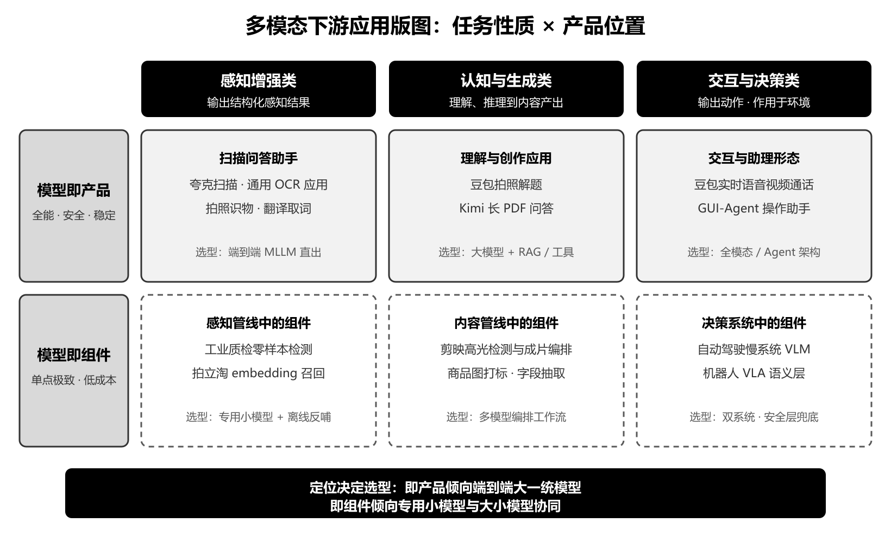
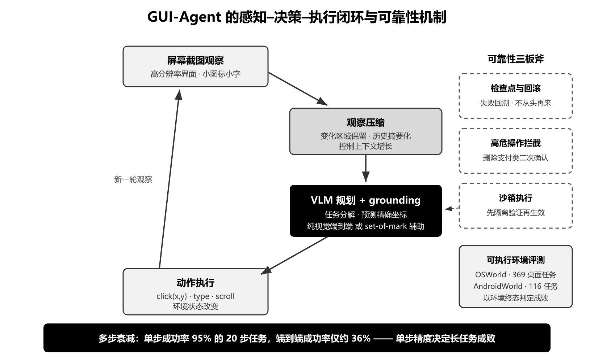
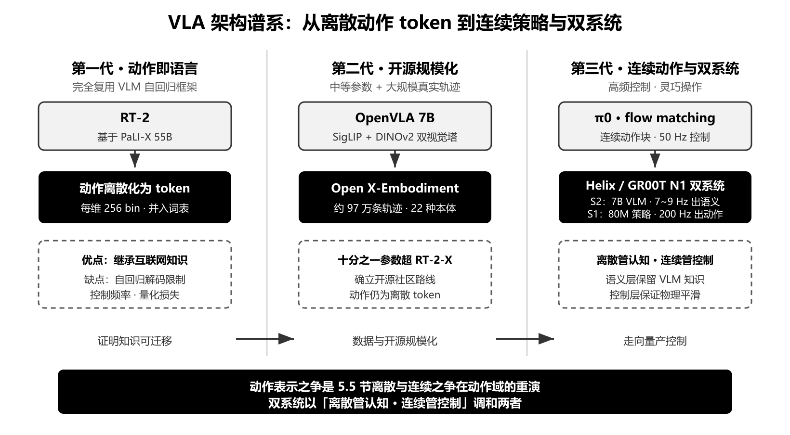

## 5.6 AI多模态下游应用高频考点

- [1.多模态大模型的下游应用版图与落地路径应如何选型？](#1.多模态大模型的下游应用版图与落地路径应如何选型？)
  - [面试问题-多模态下游应用可以按什么框架分类与定位？](#面试问题-多模态下游应用可以按什么框架分类与定位？)
  - [面试问题-提示工程、多模态RAG、微调与蒸馏四条落地路径如何选型？](#面试问题-提示工程、多模态RAG、微调与蒸馏四条落地路径如何选型？)
  - [面试问题-下游落地中的幻觉问题如何系统性治理？](#面试问题-下游落地中的幻觉问题如何系统性治理？)
- [2.从产品角度出发，多模态模型能力如何转化为可交付的产品？](#2.从产品角度出发，多模态模型能力如何转化为可交付的产品？)
  - [面试问题-如何从产品需求反推模型选型与部署形态？](#面试问题-如何从产品需求反推模型选型与部署形态？)
  - [面试问题-多模态产品的评测体系与数据飞轮应如何设计？](#面试问题-多模态产品的评测体系与数据飞轮应如何设计？)
  - [面试问题-大小模型协同的工程架构是怎样设计的？](#面试问题-大小模型协同的工程架构是怎样设计的？)
- [3.如何拆解代表性产品中理解类功能背后的多模态方案？](#3.如何拆解代表性产品中理解类功能背后的多模态方案？)
  - [面试问题-豆包「拍照解题」功能背后应用了哪些多模态方案？](#面试问题-豆包「拍照解题」功能背后应用了哪些多模态方案？)
  - [面试问题-Kimi「长PDF解析问答」应该用长上下文直读还是多模态RAG？](#面试问题-Kimi「长PDF解析问答」应该用长上下文直读还是多模态RAG？)
  - [面试问题-以图搜图与拍照购物为什么采用检索式而非生成式方案？](#面试问题-以图搜图与拍照购物为什么采用检索式而非生成式方案？)
- [4.如何拆解代表性产品中交互与生成类功能背后的多模态方案？](#4.如何拆解代表性产品中交互与生成类功能背后的多模态方案？)
  - [面试问题-豆包「实时语音视频通话」功能背后应用了哪些多模态方案？](#面试问题-豆包「实时语音视频通话」功能背后应用了哪些多模态方案？)
  - [面试问题-剪映「智能成片」类功能如何编排理解与生成模型？](#面试问题-剪映「智能成片」类功能如何编排理解与生成模型？)
- [5.多模态Agent的通用架构是什么？GUI-Agent的技术主线考察哪些要点？](#5.多模态Agent的通用架构是什么？GUI-Agent的技术主线考察哪些要点？)
  - [面试问题-多模态Agent的通用架构包含哪些模块？视觉输入扮演什么角色？](#面试问题-多模态Agent的通用架构包含哪些模块？视觉输入扮演什么角色？)
  - [面试问题-GUI-Agent如何实现界面理解与精确定位？](#面试问题-GUI-Agent如何实现界面理解与精确定位？)
  - [面试问题-Agent的评测基准与多步可靠性问题如何应对？](#面试问题-Agent的评测基准与多步可靠性问题如何应对？)
- [6.OCR与文档智能方向，多模态大模型如何重塑传统技术管线？](#6.OCR与文档智能方向，多模态大模型如何重塑传统技术管线？)
  - [面试问题-MLLM端到端方案与传统OCR管线如何对比与融合？](#面试问题-MLLM端到端方案与传统OCR管线如何对比与融合？)
  - [面试问题-高分辨率文档解析的技术难点有哪些？](#面试问题-高分辨率文档解析的技术难点有哪些？)
  - [面试问题-文档结构化信息抽取有哪些工程实践要点？](#面试问题-文档结构化信息抽取有哪些工程实践要点？)
- [7.在工业质检等传统CV任务中，多模态大模型的能力边界在哪里？](#7.在工业质检等传统CV任务中，多模态大模型的能力边界在哪里？)
  - [面试问题-少样本与零样本缺陷检测有哪些基于多模态大模型的方案？](#面试问题-少样本与零样本缺陷检测有哪些基于多模态大模型的方案？)
  - [面试问题-什么场景下不应该使用多模态大模型？](#面试问题-什么场景下不应该使用多模态大模型？)
- [8.具身智能与自动驾驶如何把多模态大模型带进物理世界？](#8.具身智能与自动驾驶如何把多模态大模型带进物理世界？)
  - [面试问题-VLA模型的架构谱系是怎样演进的？动作表示之争的本质是什么？](#面试问题-VLA模型的架构谱系是怎样演进的？动作表示之争的本质是什么？)
  - [面试问题-具身智能与自动驾驶落地面临哪些共性问题？](#面试问题-具身智能与自动驾驶落地面临哪些共性问题？)


<h3 id="1.多模态大模型的下游应用版图与落地路径应如何选型？">1.多模态大模型的下游应用版图与落地路径应如何选型？</h3>

<h4 id="面试问题-多模态下游应用可以按什么框架分类与定位？">面试问题-多模态下游应用可以按什么框架分类与定位？</h4>

**难度评分：⭐⭐ (2/5)  |  考察频率：⭐⭐⭐⭐ (4/5)**


**按任务性质可分三类。**

- **感知增强类**：模型充当更强的感知器，替代或增强传统 CV 管线，输出仍是结构化感知结果。典型场景包括 OCR 与文档解析、工业质检、开放词汇检测分割。
- **认知与生成类**：模型完成理解、推理到内容产出的闭环，如拍照解题、长文档问答、图文创作与视频剪辑。
- **交互与决策类**：模型的输出是动作而非内容，涵盖 GUI-Agent、具身智能与自动驾驶。该类对可靠性要求最高，因为错误会作用于真实环境。

**按产品位置分「模型即产品」与「模型即组件」。** 豆包、ChatGPT 属于前者，模型能力边界就是产品能力边界，要求全能、安全与稳定的对话体验；拍立淘的重排模块、剪映的高光检测属于后者，模型只是管线中的一环，要求单点极致、低延迟与低成本。这个维度直接决定技术选型：即产品倾向端到端大一统模型，即组件倾向专用小模型或大小模型协同。

**两个维度交叉即可定位任意应用。** 例如工业质检是「感知增强 × 模型即组件」，对应的合理方案是零样本检测模型加产线小模型，而不是让 72B 对话模型上产线——分类框架的价值就在于避免这类错配。后续各主问题正是沿着这张版图逐格展开。

---

<h4 id="面试问题-提示工程、多模态RAG、微调与蒸馏四条落地路径如何选型？">面试问题-提示工程、多模态RAG、微调与蒸馏四条落地路径如何选型？</h4>

**难度评分：⭐⭐⭐ (3/5)  |  考察频率：⭐⭐⭐⭐⭐ (5/5)**

**提示工程是验证期的默认起点。** 零训练成本、小时级迭代，配合 few-shot 示例与输出模板即可完成可行性验证。天花板明显：无法注入领域知识，长提示推高每次调用成本，对格式的约束是「软」的。

**多模态RAG解决知识缺失。** 传统文本 RAG 处理图文文档时要先 OCR 再切块，版面与图表信息在转换中丢失。ColPali 路线改为页面级视觉检索：用 PaliGemma-3B 直接将整页编码为多向量表示，检索时以 late-interaction 方式逐 token 求最大相似度（MaxSim）聚合打分，免去 OCR 环节，图表、印章、手写批注都保留在检索证据里。知识频繁更新（如产品手册月度改版）时，RAG 是唯一不需要重训的路径。

**微调解决行为缺失。** 三种信号提示应该微调：领域词汇模型根本不认识（医学影像术语、电网设备名）、输出格式必须严格稳定（下游系统按 JSON Schema 消费）、风格需要统一（客服话术）。LoRA 冻结原权重 $`W_0`$、只训练低秩增量：

```math
W' = W_0 + \Delta W = W_0 + BA,\qquad B\in\mathbb{R}^{d\times r},\ A\in\mathbb{R}^{r\times k},\ r\ll\min(d,k)
```

可训练参数量从 $`dk`$ 降到 $`r(d+k)`$，rank 8～64 的配置下通常不足总参数的 1%，单机 8 卡即可完成 7B～72B 模型适配，是业务侧的主流形态；全参微调仅在数据量达到十万级且行为迁移幅度大时才划算。

**蒸馏解决成本约束。** 任务固定、流量巨大后，用大模型批量生成带推理链的标注，训练 2B～7B 专用小模型。标准目标是硬标签交叉熵与教师软分布 KL 散度的加权：

```math
\mathcal{L}_{\text{distill}} = \alpha\,\mathcal{L}_{\text{CE}}\bigl(y,\,p_s\bigr) + (1-\alpha)\,\tau^{2}\,\mathrm{KL}\bigl(p_t^{\tau}\,\Vert\,p_s^{\tau}\bigr)
```

其中温度 $`\tau`$ 软化教师分布 $`p_t`$，让学生 $`p_s`$ 学到类别间的相对关系而非只学正确答案。单次推理成本可降一个数量级以上，代价是失去通用性，任务边界一变就要重蒸。

| 路径 | 数据需求 | 一次性成本 | 迭代速度 | 适用阶段 |
| --- | --- | --- | --- | --- |
| 提示工程 | 数条示例 | 无 | 小时级 | 可行性验证 |
| 多模态RAG | 文档库本身 | 建索引 | 天级 | 知识密集、频繁更新 |
| 微调（LoRA/SFT） | 数千至数万条 | 训练卡时 | 周级 | 行为定制、格式约束 |
| 蒸馏小模型 | 数万条教师标注 | 训练+验证 | 周至月级 | 高流量、任务固化 |


---

<h4 id="面试问题-下游落地中的幻觉问题如何系统性治理？">面试问题-下游落地中的幻觉问题如何系统性治理？</h4>

**难度评分：⭐⭐⭐ (3/5)  |  考察频率：⭐⭐⭐⭐⭐ (5/5)**


**先分清多模态特有的幻觉类型。**

- **对象幻觉**：描述图中不存在的物体，POPE 基准即以「图中是否有 X」的二元问询专测此项；
- **细粒度抄写幻觉**：OCR 场景把模糊的数字、日期「脑补」成通顺但错误的值，金融票据场景中危害最大；
- **定位幻觉**：文字答对但给出的框或页码错位，直接破坏「点击溯源」类产品体验。

**治理按输入、解码、系统三层展开。** 输入侧保证信息保真：分辨率不足是抄写幻觉的第一诱因，动态分块策略（见 5.2 节「动态分块方案如何工作？有何优缺点？」子问题）要按业务字号下限校准 token 预算。解码侧加「硬约束」：JSON Schema 约束解码保证结构合法；要求模型同时输出证据定位（bbox 或页码引用），把「凭空生成」改造成「有据可查」，验证成本从读全文降到看一处。系统侧承认模型会错：对金额、身份证号等关键字段用专用 OCR 或规则二次校验，双通道不一致即转人工；对低置信输出主动拒答并降级到人工流程。

**拒答机制依赖置信度校准。** 「低置信转人工」策略有效的前提是模型的置信度可信，衡量指标是期望校准误差（ECE）——把样本按置信度分桶后，逐桶比较平均置信度与实际准确率：

```math
\mathrm{ECE}=\sum_{b=1}^{B}\frac{|S_b|}{N}\,\Bigl|\,\mathrm{acc}(S_b)-\mathrm{conf}(S_b)\,\Bigr|
```

ECE 越大说明模型「过度自信」，此时任何基于置信度阈值的拒答与人审路由都会失灵，需要先做温度缩放等校准手段再谈分流。

**业务红线场景必须双通道。** 医疗报告、资金结算类应用中，「模型直出且无校验」在评审中会被一票否决。能主动讲出拒答机制与人机回环设计的候选人，比只谈模型能力的明显高一档——幻觉治理考察的实质是工程判断力，不是模型知识。

<div align="center">
  
  <br/>
  <b>图 5.6.1-1　多模态下游应用版图：任务性质 × 产品位置</b>
</div>

---

<h3 id="2.从产品角度出发，多模态模型能力如何转化为可交付的产品？">2.从产品角度出发，多模态模型能力如何转化为可交付的产品？</h3>

<h4 id="面试问题-如何从产品需求反推模型选型与部署形态？">面试问题-如何从产品需求反推模型选型与部署形态？</h4>

**难度评分：⭐⭐⭐ (3/5)  |  考察频率：⭐⭐⭐⭐ (4/5)**

**部署形态由成本–延迟–合规三角决定。**

- **云端 API**：迭代最快、无运维负担，适合验证期与流量波动大的场景；代价是数据出域，金融、医疗、政务类客户通常直接排除。
- **私有化部署**：满足等保与行业合规，模型规格受限于客户 GPU 预算，7B～72B 之间做精度与显存的权衡，量化（AWQ/GPTQ 类 INT4）是标配手段。
- **端侧部署**：隐私、离线可用、零边际成本三重收益，代价是只能承载 2B～4B 级小模型，依赖 NPU 的 INT4/INT8 算力，能力上限明显。

**延迟预算决定模型规格与交互设计。** 拍照解题类异步任务用户可接受 2～3 秒，容得下大模型加工具调用；实时语音通话要求首响接近人类对话中约 200 毫秒的停顿感知阈值，必须走流式架构。同一个模型能力，交互形态不同，可用的技术方案完全不同。

**成本要按单位经济学算。** 单次调用成本 × 日调用量 × 毛利率倒推出可承受的模型规格；一个日活千万的免费拍照功能若全量走 72B 模型，推理成本足以吞掉整条业务线的预算——这正是下一个子问题大小模型协同架构存在的理由。

---

<h4 id="面试问题-多模态产品的评测体系与数据飞轮应如何设计？">面试问题-多模态产品的评测体系与数据飞轮应如何设计？</h4>

**难度评分：⭐⭐⭐ (3/5)  |  考察频率：⭐⭐⭐⭐ (4/5)**

**评测分三层，各答各的问题。**

- **离线基准**：通用榜单（MMMU、OCRBench、DocVQA 等）只做门槛筛查；真正起决策作用的是自建业务评测集——从真实流量中分层抽样、人工标注金标准，覆盖长尾难例。要警惕公开基准的数据污染：训练语料可能已包含测试题，榜单分与业务表现脱钩是常态。
- **上线前人评**：按正确性、有用性、安全性多维打分，用标注一致性控制评委质量，常用 Cohen's Kappa $`\kappa=\dfrac{p_o-p_e}{1-p_e}`$（$`p_o`$ 为观测一致率、$`p_e`$ 为随机一致率），$`\kappa`$ 低于 0.6 说明标注标准本身有歧义，先修标注规范再谈模型好坏；主观维度必须多人背靠背。
- **线上指标**：A/B 实验看任务完成率、点踩率、追问率、留存。线上指标是最终裁判，离线涨点线上跌是常见现象，原因多为评测集分布与真实流量漂移。

**数据飞轮把 badcase 变成资产。** 闭环是：线上负反馈回流 → 聚类归因（是分辨率问题、知识缺失还是幻觉）→ 定向补数据或改管线 → 修复后将该类 case 固化进回归测试集。回归集的意义在于防「修东坏西」：每次模型更新必须全量通过历史回归集才能发布。一个运营两年的多模态产品，其回归集往往比任何公开基准都更能预测线上表现，这是团队真正的护城河。

---

<h4 id="面试问题-大小模型协同的工程架构是怎样设计的？">面试问题-大小模型协同的工程架构是怎样设计的？</h4>

**难度评分：⭐⭐⭐⭐ (4/5)  |  考察频率：⭐⭐⭐ (3/5)**

单一大模型扛全量流量在成本上不成立，成熟产品的标准形态是分层路由：小模型扛量、大模型兜底、大模型反哺小模型。

**路由层决定请求流向。** 前置一个轻量判别器（规则、小分类模型或小 MLLM 自评）估计请求难度：清晰印刷体的整页 OCR、常见商品识别等 80%～90% 的简单请求由 2B～7B 专用小模型或缓存直接消化；模糊手写、复杂推理、多轮追问升级到大模型。设路由到小模型的比例为 $`\rho`$，单次请求的期望成本为：

```math
\mathbb{E}[C] = C_{\text{router}} + \rho\,C_{\text{small}} + (1-\rho)\,C_{\text{large}}
```

大小模型单次成本差常达 20～50 倍，代入 $`C_{\text{large}}=30\,C_{\text{small}}`$ 可算出：$`\rho`$ 从 80% 提到 90%，整体成本从约 $`6.8\,C_{\text{small}}`$ 降到 $`3.9\,C_{\text{small}}`$——路由器每提升一个点的分流准确率都直接兑换成毛利。路由错误有两种代价——简单请求走大模型烧钱，困难请求走小模型损体验——所以路由器本身也要用线上数据持续校准。

**大模型对小模型有三重反哺。**

- **蒸馏教师**：批量生成带推理链的标注训练小模型，即上一主问题中蒸馏路径的常态化运转；
- **自动标注员**：对回流数据先预标注、人工只做审核修正，标注成本可降一个数量级，这也是数据飞轮能高速转动的前提；
- **影子模式验证**：新版小模型上线前，大模型在旁路对同批流量出参考答案，二者对比即可在不影响用户的情况下估计小模型的真实精度。

**协同架构的隐性考点是一致性维护。** 大小模型对同一输入给出不同答案时用户会感知「时好时坏」，因此升级路由的边界要稳定，且小模型每轮蒸馏都应以当前大模型为教师同步刷新，避免两套能力长期漂移。

---

<h3 id="3.如何拆解代表性产品中理解类功能背后的多模态方案？">3.如何拆解代表性产品中理解类功能背后的多模态方案？</h3>

<h4 id="面试问题-豆包「拍照解题」功能背后应用了哪些多模态方案？">面试问题-豆包「拍照解题」功能背后应用了哪些多模态方案？</h4>

**难度评分：⭐⭐⭐ (3/5)  |  考察频率：⭐⭐⭐⭐ (4/5)**

**输入处理决定后面一切的上限。** 手机实拍图任意比例、倾斜、带阴影，先做畸变矫正与题目区域检测（一页多题时逐题裁剪）；进入模型前按动态分块处理高分辨率输入（原理见 5.2 节「动态分块方案如何工作？有何优缺点？」子问题），手写小字与上下标对分辨率预算尤其敏感——分块粒度不足时，指数、分式结构直接在视觉端丢失，后面推理再强也无济于事。

**识别环节走 OCR-free 端到端。** 印刷体混排手写体、数学公式转 LaTeX，传统检测+识别管线在二维公式结构上先天吃力，端到端视觉语言模型（GOT-OCR2.0 这类约 580M 的专用模型即为代表路线）把版面、公式、文字一次性读出，语义先验还能纠正模糊笔迹。

**推理环节的关键是防算错。** 解题走 CoT 分步推理，但大模型的算术不可靠，成熟方案是让模型产出解题思路的同时，将数值计算交给代码执行或符号计算工具校验，模型负责「怎么解」、工具负责「算对」。这正是 5.6 节多模态Agent主问题中工具调用模式的一个具体实例。

**产品闭环藏着数据飞轮。** 输出按步骤结构化呈现并标注知识点，用户的「答案有误」反馈与错题本行为回流成为最高价值的困难样本来源；晚自习时段的尖峰流量则由大小模型路由消化——一道产品拆解题，实际把本章前两个主问题全部串了起来。

---

<h4 id="面试问题-Kimi「长PDF解析问答」应该用长上下文直读还是多模态RAG？">面试问题-Kimi「长PDF解析问答」应该用长上下文直读还是多模态RAG？</h4>

**难度评分：⭐⭐⭐⭐ (4/5)  |  考察频率：⭐⭐⭐⭐ (4/5)**

Kimi 以长上下文起家（产品宣传支持约 200 万字上下文），拿它的长 PDF 问答功能做考题，考的正是「长上下文 vs 检索增强」这对经典架构之争在多模态下的新形态。

**长上下文直读的优势与代价。** 整本文档一次性进上下文，跨章节推理、全局汇总类问题（「全书的论证结构是什么」）表现最好，没有召回遗漏问题。代价有三：百页 PDF 视觉 token 化后规模庞大，预填充延迟与成本随文档长度线性甚至超线性增长；超长序列存在「lost in the middle」效应，中部细节的召回率明显低于首尾；文档库场景（几千份合同）根本塞不进任何上下文。

**多模态RAG的优势与代价。** ColPali 路线把每一页作为图像编码为多向量，检索时用 late-interaction 的 MaxSim 打分：query 的每个 token 向量在页面所有 patch 向量中取最大内积、再对 query 侧求和：

```math
s(q,d)=\sum_{i\in q}\;\max_{j\in d}\;\mathbf{E}_{q_i}^{\top}\mathbf{E}_{d_j}
```

这种逐 token 细粒度匹配比单向量双塔更能命中「某一小块图表」级别的证据，同时页面向量仍可离线预计算。召回 top-k 页后交给 MLLM 精读，成本与文档总量解耦、天然支持跨文档，且免 OCR 保留版面证据。代价是两跳架构引入召回损失：问题表述与原文措辞差异大时（隐含语义型问题），相关页可能根本进不了上下文。

**产品的现实解是混合架构。** 短文档直读、长文档与文档库走检索增强、全局类问题用分段摘要再汇总（map-reduce 式），三条路径按文档长度与问题类型路由。判别时报三个变量即可：文档量级（单篇还是库）、问题类型（定位型还是全局型）、更新频率（静态还是日更）。

**citation 定位是这类产品的隐藏考点。** 答案旁标注页码与原文出处，既是体验设计，更是幻觉治理手段——它强迫模型的每个结论「有据可查」。检索式架构天然自带出处，直读架构则要额外训练模型输出引用，这也是很多产品最终偏向混合架构的工程原因。

---

<h4 id="面试问题-以图搜图与拍照购物为什么采用检索式而非生成式方案？">面试问题-以图搜图与拍照购物为什么采用检索式而非生成式方案？</h4>

**难度评分：⭐⭐⭐ (3/5)  |  考察频率：⭐⭐⭐ (3/5)**

**主链路是 CLIP 系双塔加向量索引。** 商品库离线批量编码为 embedding，线上 query 图过同一编码器得到向量，以余弦相似度 $`s=\cos(\mathbf{v}_q,\mathbf{v}_d)`$ 在 ANN 索引（HNSW、IVF-PQ 类）中召回。十亿级商品库的检索可压到百毫秒内，靠的正是 CLIP 对比学习赋予的对齐 embedding 空间加上可离线预计算的性质。

**纯 MLLM 方案在检索场景结构性不成立。**

- **无法建索引**：生成式模型的「相似度判断」发生在前向推理中，无法离线物化为可索引的向量，每次查询都要对候选逐一推理；
- **成本与延迟**：对十亿商品哪怕只重排千分之一，per-query 的生成式推理成本也比一次 ANN 查询高数个数量级；
- **输出不稳定**：检索要求同 query 同结果，采样式生成天然与之冲突。

**生成式模型的正确位置在链路两端。** 前端做 query 理解：识别用户拍的是「鞋」还是「鞋上的 logo」，抽取颜色、款式等结构化属性改写检索条件；后端做精排与解释：对召回的 top-50 候选做属性级比对（同款判定、颜色差异说明），并生成推荐理由。入库侧则用 MLLM 离线为商品图生成结构化属性标签，反过来提升召回质量。


---

<h3 id="4.如何拆解代表性产品中交互与生成类功能背后的多模态方案？">4.如何拆解代表性产品中交互与生成类功能背后的多模态方案？</h3>

<h4 id="面试问题-豆包「实时语音视频通话」功能背后应用了哪些多模态方案？">面试问题-豆包「实时语音视频通话」功能背后应用了哪些多模态方案？</h4>

**难度评分：⭐⭐⭐⭐ (4/5)  |  考察频率：⭐⭐⭐⭐ (4/5)**

**第一层判别：级联还是端到端。** 级联方案（语音识别 → 大模型 → 语音合成）三段串行，首响延迟是各段之和 $`T_{\text{first}}\approx T_{\text{ASR}}+T_{\text{LLM}}+T_{\text{TTS}}`$，各段独立优化也难以压进对话节奏；且语气、情绪、背景音在转文本时全部丢失。端到端全模态方案将语音直接作为 token 流进出模型，首包延迟只取决于首个语义块的生成，保留副语言信息、支持边听边想。二者的本质区别在 5.5 节已有专门子问题展开。豆包的实时语音走的是端到端路线，技术参照系是 Qwen3-Omni 的 Thinker-Talker 结构：Thinker 负责多模态理解与语义规划，Talker 以流式方式生成语音 token，首包延迟压到亚秒级。

**第二层是视频流的 token 预算管理。** 视频通话不可能逐帧全分辨率进模型：常规做法是低频关键帧采样（1～2 fps）叠加事件触发提帧（画面剧变、用户明确要求「看这个」时提高采样），配合视觉 token 压缩控制上下文增长。这与 5.4 节视频理解中时序分块与动态采样的策略一脉相承——产品把「算力预算」变成了「注意力策略」。

**第三层是交互工程指标。** 人类对话的停顿感知阈值约 200 毫秒，产品指标围绕它展开：首响延迟（流式生成首包）、可打断（回声消除 + 流式 VAD，用户开口即停止播报并保留已生成上下文）、进而演进到全双工（模型可主动插话、附和）。这三级演进正是 5.5 节「从可打断到全双工」子问题的产品化落点。

---

<h4 id="面试问题-剪映「智能成片」类功能如何编排理解与生成模型？">面试问题-剪映「智能成片」类功能如何编排理解与生成模型？</h4>

**难度评分：⭐⭐⭐ (3/5)  |  考察频率：⭐⭐⭐ (3/5)**

智能成片（一键把素材剪成短片）是「模型即组件」形态的典型代表：链路里没有一个端到端大模型，而是十余个模型的流水线编排：

**理解段：把素材变成结构化时间轴。** 镜头边界检测先把素材切成 shot；视频理解模型为每个片段生成带时间戳的内容描述（人物、动作、场景、情绪），时间对齐机制可回看 5.4 节视频时间戳对齐相关子问题；高光打分则是多信号融合——画质（清晰度、构图）、人脸与表情、动作幅度、音频能量共同决定片段的「可用度」排序。

**决策段：叙事模板与节拍对齐。** 按模板（旅行 vlog、生日、宠物）确定叙事结构与目标时长，从高光池中选段排序；配乐确定后做 beat 对齐，把剪辑点吸附到音乐节拍上——这一步是纯算法而非大模型，却对成片质感影响最大。

**生成段：多模型补齐交付物。** ASR 出字幕再由 LLM 润色标题文案、按内容情绪推荐配乐、可选 TTS 旁白。近年的演进方向是用视频生成模型补转场与空镜，理解与生成在同一管线中开始融合。

---

<h3 id="5.多模态Agent的通用架构是什么？GUI-Agent的技术主线考察哪些要点？">5.多模态Agent的通用架构是什么？GUI-Agent的技术主线考察哪些要点？</h3>

<h4 id="面试问题-多模态Agent的通用架构包含哪些模块？视觉输入扮演什么角色？">面试问题-多模态Agent的通用架构包含哪些模块？视觉输入扮演什么角色？</h4>

**难度评分：⭐⭐⭐ (3/5)  |  考察频率：⭐⭐⭐⭐⭐ (5/5)**

Agent 与普通对话应用的分界线是闭环：模型的输出会改变环境状态，环境的新状态又成为模型的输入。多模态 Agent 的通用架构由四个模块构成。

**四模块架构。**

- **规划**：把目标任务分解为可执行步骤，主流范式从 ReAct（推理与行动交替）到 plan-and-execute（先出计划再逐步执行、失败时重规划）；
- **工具调用**：以 function calling 形式调用外部能力，多模态场景的工具箱包括检测分割、OCR、搜索、代码执行——模型负责决策「用什么工具、传什么参数」，工具负责确定性执行；
- **记忆**：短期记忆靠上下文窗口维护任务状态，长期记忆外置到向量库，跨会话保留用户偏好与历史结论；
- **反思**：对执行结果自检（截图比对预期、校验工具返回值），失败时回溯重试而非硬着头皮继续。

**视觉输入在 Agent 中有三重角色。** 一是任务输入（用户发来一张报错截图）；二是环境观察（GUI-Agent 的每一步都以屏幕截图感知状态）；三是工具返回（代码执行画出的图表需要模型自己「看懂」再决定下一步）。第二重角色带来 Agent 特有的新问题：观察是持续产生的，高分辨率截图逐步累积会撑爆上下文，因此需要观察压缩——只保留变化区域、对历史观察降采样或摘要化，这可视作 5.2 节视觉 token 压缩问题在时间维度上的延伸。

---

<h4 id="面试问题-GUI-Agent如何实现界面理解与精确定位？">面试问题-GUI-Agent如何实现界面理解与精确定位？</h4>

**难度评分：⭐⭐⭐⭐ (4/5)  |  考察频率：⭐⭐⭐⭐ (4/5)**

**grounding 是坐标预测问题的极端形态。** 通用检测容忍几个像素的框偏差，GUI 点击一个 20×20 像素的图标却是全对或全错。坐标表示方案（归一化、千分制、绝对像素）的选型逻辑见 5.4 节「归一化、千分制、绝对坐标三种表示如何对比选型？」子问题；GUI 场景叠加了高分辨率难题——4K 屏截图中的小图标，对视觉分辨率与 token 预算的要求比自然图像苛刻得多。

**两条技术路线的消长。** 结构化辅助路线借助 accessibility tree 或 DOM 拿到控件列表，或用 set-of-mark 方式在截图上叠加编号标注框，把「预测坐标」降级为「选择编号」，工程上稳但依赖系统接口，遇到 canvas 渲染、游戏界面即失效。纯视觉端到端路线只靠截图：CogAgent（18B，专设 1120×1120 高分辨率视觉分支）证明了可行性，OS-Atlas 用跨平台 grounding 语料补齐了「认识各种控件」的基本功，UI-TARS 进一步把感知、grounding、动作生成统一进单一模型端到端训练。趋势与 5.4/5.5 节的叙事一致：中间表示逐步被端到端吸收。

**动作空间与轨迹数据是隐性考点。** 动作空间需覆盖 click(x,y)、type、scroll、长按、组合键，桌面与移动端不同构；训练数据是「截图-动作」轨迹，来源包括人工录制、规则合成与模型探索后筛选，标注成本远高于普通图文对——数据侧的答案深度，往往最能区分做过与没做过的候选人。

---

<h4 id="面试问题-Agent的评测基准与多步可靠性问题如何应对？">面试问题-Agent的评测基准与多步可靠性问题如何应对？</h4>

**难度评分：⭐⭐⭐ (3/5)  |  考察频率：⭐⭐⭐ (3/5)**

Agent 评测与静态问答评测的本质区别：

**主流基准都是可执行环境。** OSWorld 提供 369 个真实桌面任务（跨 Ubuntu、Windows 应用），在虚拟机中执行并以脚本校验终态；AndroidWorld 覆盖 116 个安卓任务且参数动态生成，杜绝背题；WebArena 面向自托管网站任务。人类在 OSWorld 上的成功率约 72%，当前最强模型仍与之有明显差距——长程任务是主要失分点。

**多步衰减是 Agent 可靠性的数学本质。** 无回滚机制时，任务成功要求每一步都成功，端到端成功率随步数呈指数衰减：

```math
P_{\text{task}}=\prod_{t=1}^{n}p_t\approx p^{\,n}
```

设单步成功率 $`p=0.95`$、任务需 $`n=20`$ 步，则 $`0.95^{20}\approx 0.36`$。这解释了为什么 Agent demo 惊艳而产品难用，也指明了两个优化方向：提高单步精度（$`p`$ 提到 0.99 时同样 20 步的成功率回升到约 0.82，grounding 准确率的提升按幂次放大），以及缩短有效步数 $`n`$（把高频操作序列固化为单个工具或宏）。

**可靠性工程**

- **检查点与回滚**：关键节点保存状态，失败回溯到最近检查点重试，而不是从头再来；
- **高危操作拦截**：删除、支付、发送类动作设白名单与二次确认，宁可中断也不误操作；
- **沙箱执行**：先在隔离环境跑通再作用于真实环境，与幻觉治理中「模型输出不直接生效」的思路一致。

<div align="center">
  
  <br/>
  <b>图 5.6.5-1　GUI-Agent 的感知–决策–执行闭环与可靠性机制</b>
</div>

---

<h3 id="6.OCR与文档智能方向，多模态大模型如何重塑传统技术管线？">6.OCR与文档智能方向，多模态大模型如何重塑传统技术管线？</h3>

<h4 id="面试问题-MLLM端到端方案与传统OCR管线如何对比与融合？">面试问题-MLLM端到端方案与传统OCR管线如何对比与融合？</h4>

**难度评分：⭐⭐⭐ (3/5)  |  考察频率：⭐⭐⭐⭐⭐ (5/5)**

OCR 是多模态落地体量最大的方向之一，「大模型会不会取代传统 OCR」几乎是必考题：

**传统管线：检测 → 识别 → 版面分析三段式。** 文本检测（DBNet 类）、行识别（CRNN 到 SVTR 的演进）、版面还原（版面分析 + 阅读顺序）各自优化。优点是快（单页毫秒到几十毫秒级）、字符级精度可控、错误可定位到具体环节修复；缺点是级联误差累积，且复杂版面（多栏混排、表格嵌图、印章覆盖文字）的结构还原一直是弱项。

**MLLM 端到端：一次前向读整页。** GOT-OCR2.0（约 580M 参数的专用端到端模型）与 Qwen-VL 系通用模型代表两种规格的同一路线：输入整页图像，直接输出带结构的文本（Markdown、LaTeX、HTML 表格）。优点是抗复杂版面、语义先验可纠正模糊字符、天然支持「读了就答」的文档问答；缺点同样来自语义先验——把看不清的数字「脑补」成通顺的错误值（即 5.6 节幻觉治理子问题中的抄写幻觉），且字符级精度缺乏保证、单页成本高出传统管线一个数量级以上。

**融合是工业界的现实答案。** 两种典型形态：其一，MLLM 做版面理解与阅读顺序、专用小模型做字符识别，MinerU、olmOCR 类文档解析系统即此路线，兼得结构能力与字符精度；其二，MLLM 直出全文、关键字段（金额、证件号）用专用 OCR 二次复核，双通道不一致转人工。选型判据落到业务形态：自由格式文档问答用端到端，高精度结构化录入用融合管线，海量简单版面用传统管线扛量——又回到大小模型协同的总框架。

---

<h4 id="面试问题-高分辨率文档解析的技术难点有哪些？">面试问题-高分辨率文档解析的技术难点有哪些？</h4>

**难度评分：⭐⭐⭐⭐ (4/5)  |  考察频率：⭐⭐⭐⭐ (4/5)**

一张 A4 纸按 300 dpi 扫描约为 2480×3508 像素，而主流视觉编码器的原生输入不过几百像素见方——分辨率鸿沟是文档智能所有技术难点的总根源。

**token 预算与信息保真的对撞。** 直接缩放到编码器原生分辨率，正文小字直接糊掉；按 5.2 节动态分块策略切 tile 处理（InternVL 系以 448×448 tile 配合 Pixel Unshuffle 将每 tile 压到 256 token），视觉 token 数随分辨率平方增长：

```math
N_{\text{tokens}} = \left\lceil \frac{W}{448} \right\rceil \times \left\lceil \frac{H}{448} \right\rceil \times 256
```

代入 A4 的 2480×3508：$`\lceil 2480/448\rceil\times\lceil 3508/448\rceil = 6\times 8 = 48`$ 个 tile，约 1.2 万视觉 token——单页就接近许多模型上下文的可观比例，多页文档立即撞上下文与成本墙。工程上按「业务最小字号在多少像素」反推分块粒度：合同小六号脚注与海报大标题的最优配置完全不同，这也是文档产品要暴露「精读/速读」档位的原因。

**结构化元素各有专属难点。**

- **表格**：合并单元格、跨页续表、无线框表格的结构还原，输出为 HTML/Markdown 时行列对应关系极易错乱；
- **公式**：二维结构转 LaTeX，上下标、分式嵌套对分辨率最敏感；
- **图表**：柱状图、折线图的数值读取（ChartQA 类任务）要求「视觉测量」能力，是当前模型错误率最高的元素之一；
- **阅读顺序**：多栏、图文绕排下的正确串联，直接决定下游 RAG 切块质量。

**评测锚点。** 通用能力看 OCRBench、DocVQA，表格与公式看专项集；但业务评测永远要自建——印章遮挡、复印噪声、手写批注这些真实世界的分布，公开基准覆盖不了。答这道题时把「分辨率 → token 预算 → 结构还原 → 评测」串成因果链，就是满分结构。

---

<h4 id="面试问题-文档结构化信息抽取有哪些工程实践要点？">面试问题-文档结构化信息抽取有哪些工程实践要点？</h4>

**难度评分：⭐⭐⭐ (3/5)  |  考察频率：⭐⭐⭐⭐ (4/5)**

**约束解码保证「格式对」。** 以 JSON Schema 或语法约束解码强制输出结构合法，字段名、类型、枚举值不会跑偏。必须向面试官点破：约束解码只保证合法、不保证正确，金额抄错一位照样是合法 JSON——格式正确性与内容正确性是两个独立问题。

**字段级校验保证「内容对」。** 利用字段的先验结构互验：身份证号校验位、金额数字与大写互验、日期合理性（开票日期不能晚于今天）、跨字段一致性（单价 × 数量 ≈ 总价）。校验规则命中即拦截，这一层拦下的错误远比换更大的模型多。

**置信度路由决定「谁来兜底」。** 生成式模型没有现成的字段级置信度，常用多次采样一致性作代理——对同一字段采样 $`K`$ 次，取众数答案的出现频率：

```math
\hat{p}(y)=\frac{1}{K}\sum_{k=1}^{K}\mathbf{1}\bigl[y^{(k)}=y\bigr]
```

$`\hat{p}`$ 低于阈值的字段路由人工核验、高置信字段抽检。人审比例从 100% 降到 10%～20% 就是这类产品的商业模型本身，所以置信度校准的好坏直接等于毛利率。

**版面锚定让人审提效。** 要求模型在输出字段值的同时给出来源 bbox，人审界面高亮原图位置，核验一个字段从「找遍全页」变成「看一眼框」。这与 5.4 节坐标预测能力直接相关，也再次印证：grounding 不是学术指标，是产品体验与人力成本。


---

<h3 id="7.在工业质检等传统CV任务中，多模态大模型的能力边界在哪里？">7.在工业质检等传统CV任务中，多模态大模型的能力边界在哪里？</h3>

<h4 id="面试问题-少样本与零样本缺陷检测有哪些基于多模态大模型的方案？">面试问题-少样本与零样本缺陷检测有哪些基于多模态大模型的方案？</h4>

**难度评分：⭐⭐⭐⭐ (4/5)  |  考察频率：⭐⭐⭐ (3/5)**

工业质检的核心痛点是缺陷样本天然稀缺：新产线冷启动时正常样本管够、缺陷样本寥寥数张甚至为零，传统监督检测模型无从训起。

**零样本路线：用语言描述代替缺陷标注。** WinCLIP 是代表工作：把 CLIP 的图文对齐能力搬进异常检测，分别构造异常提示 $`t_{+}`$（a photo of a damaged ...）与正常提示 $`t_{-}`$，对图像窗口特征 $`f(x)`$ 做二类 softmax 得到异常分数：

```math
a(x)=\frac{\exp\bigl(\cos(f(x),t_{+})/\tau\bigr)}{\exp\bigl(\cos(f(x),t_{+})/\tau\bigr)+\exp\bigl(\cos(f(x),t_{-})/\tau\bigr)}
```

配合多尺度滑窗聚合实现像素级定位，在 MVTec-AD 基准上零样本即可达到约 91% 的 image-level AUROC——没有见过一张缺陷图，靠的全是 5.3 节对比学习预训练注入的通用视觉语义。

**少样本与可交互路线：MLLM 补上「解释」能力。** AnomalyGPT 类工作将异常检测嵌入多模态对话模型：以模拟异常数据训练，支持少样本参考图输入，不仅判断有无缺陷，还能指出位置并用语言描述缺陷类型——「能对话的质检」对产线工程师的调试价值远超一个裸分数。开放词汇组合拳则是 Grounding DINO（文本描述 → 检测框）串 SAM（框 → 精确 mask），无需任何训练即可对「表面划痕」「焊点缺失」这类新目标出分割结果，常用于巡检类低时延要求场景。

---

<h4 id="面试问题-什么场景下不应该使用多模态大模型？">面试问题-什么场景下不应该使用多模态大模型？</h4>

**难度评分：⭐⭐⭐ (3/5)  |  考察频率：⭐⭐⭐⭐ (4/5)**

- **延迟不允许**：产线节拍常在百毫秒量级，YOLO 系检测模型单帧 5～10 毫秒，MLLM 单次推理秒级——差两个数量级，任何优化都填不平；
- **确定性要求**：质检、医疗等场景要求同输入同输出、结果可审计可复现，生成式采样的随机性与之根本冲突，temperature 归零也只能缓解不能根除；
- **单位成本不成立**：日均百万件的检测任务，单件推理成本乘上量就是答案，大模型的边际成本结构撑不起高频低价值调用；
- **精度形态不匹配**：封闭集合上的极致 mAP 是专用小模型的主场；大模型的优势在开放语义与零样本泛化——固定的十种缺陷类别、充足的标注数据之下，大模型并无精度优势。

**说「不用」不等于「无用」，大模型在这些场景的正确位置是离线侧。**

- **预标注员**：大模型先标、人工修正，标注效率提升数倍，呼应大小模型协同子问题中的反哺机制；
- **难例挖掘与归因**：对线上小模型的低置信样本做二次判读与聚类归因，指导定向补数据；
- **报告生成**：把一天的质检统计写成人类可读的班次报告，纯语言任务，天然适配。

---

<h3 id="8.具身智能与自动驾驶如何把多模态大模型带进物理世界？">8.具身智能与自动驾驶如何把多模态大模型带进物理世界？</h3>

<h4 id="面试问题-VLA模型的架构谱系是怎样演进的？动作表示之争的本质是什么？">面试问题-VLA模型的架构谱系是怎样演进的？动作表示之争的本质是什么？</h4>

**难度评分：⭐⭐⭐⭐⭐ (5/5)  |  考察频率：⭐⭐⭐⭐ (4/5)**

**谱系沿三代演进。** 第一代以 RT-2 为代表：基于 55B 的 PaLI-X，把机械臂每个自由度的连续动作均匀量化为 256 个 bin，一步动作即一串「动作 token」$`a_t\in\{0,1,\dots,255\}^{7}`$（7 自由度），动作即语言、完全复用 VLM 的自回归框架，首次证明互联网级图文知识可迁移到操作任务（认得「灭绝的动物」并抓起恐龙玩偶）。第二代以 OpenVLA 为代表：7B 开源模型，SigLIP 与 DINOv2 双视觉塔，在 Open X-Embodiment 约 97 万条真实机器人轨迹上训练，以十分之一参数量超过 RT-2-X，确立了「开源数据集 + 中等规模」的社区路线。第三代转向连续动作与分层：π0 用 flow matching 头输出连续动作块，控制频率达 50 Hz，支撑叠衣服级的灵巧操作；Figure 的 Helix 与 NVIDIA GR00T N1 采用双系统——慢系统 S2（7B 级 VLM，7～9 Hz）负责场景理解与任务语义，快系统 S1（约 80M 的动作策略，200 Hz）负责平滑连续控制，两者以潜变量接口衔接。

**动作表示之争是 5.5 节离散与连续之争的重演。** 离散动作 token 的优点是完全复用 LLM 基建（词表、自回归、训练目标），缺点是自回归逐 token 解码限制控制频率、量化引入精度损失——与 5.5 节离散 token 统一自回归路线的取舍完全同构。连续表示以 flow matching 为代表：学习一个以观测 $`o`$ 为条件的速度场，把噪声样本沿直线路径搬运到真实动作块：

```math
\mathcal{L}_{\text{FM}}=\mathbb{E}_{\tau,\,a_0,\,a_1}\Bigl\|\,v_\theta\bigl(a_\tau,\tau\mid o\bigr)-(a_1-a_0)\,\Bigr\|^{2},\qquad a_\tau=(1-\tau)\,a_0+\tau\,a_1
```

推理时从噪声 $`a_0`$ 出发做少量积分步即可一次产出整段连续动作块（π0 以此支撑 50 Hz 控制），动作平滑、天然适配高频控制，代价是脱离语言词表、无法直接继承 VLM 的生成接口。双系统正是当前的调和方案：语义层留在离散 token 世界享受 VLM 的知识，控制层交给连续策略保证物理可行——「离散管认知、连续管控制」。

---

<h4 id="面试问题-具身智能与自动驾驶落地面临哪些共性问题？">面试问题-具身智能与自动驾驶落地面临哪些共性问题？</h4>

**难度评分：⭐⭐⭐⭐ (4/5)  |  考察频率：⭐⭐⭐ (3/5)**

具身与自驾看似两个行业，落地时面对的是同一组问题：数据从哪来、长尾怎么办、安全怎么兜底。

**数据稀缺是第一约束。** 机器人动作数据无法从互联网爬取，每一条都要真实交互产生。四条采集与扩增路线并行：遥操作采集（ALOHA 类双臂低成本方案把单条轨迹成本打下来）、跨本体聚合（Open X-Embodiment 汇集 22 种机器人形态的数据，换取跨本体泛化）、仿真加域随机化（Isaac 类平台批量生成、随机化物理参数与纹理以缩小 sim-to-real 差距）、世界模型合成（NVIDIA Cosmos、Genie 类交互式世界模型直接生成带动作条件的视频数据，是当前增速最快的路线）。自驾的对应物是影子模式回传与场景库合成，逻辑相同：真实数据封顶，合成数据补长尾。

**长尾场景恰是 VLM 的价值锚点。** 自驾的快慢双系统是标准答案：快系统（端到端轨迹模型）以高频处理常规驾驶，慢系统（VLM，DriveVLM 为代表、理想 MindVLA 类方案已走向量产）以低频处理长尾——异形车辆、临时交管手势、语义复杂的路牌，靠的正是 VLM 从互联网学来的世界知识；Waymo 的 EMMA 则展示了以 Gemini 为底座的端到端路线。这套快慢结构与 Helix 的 S1/S2 完全同构——面试中点出「具身与自驾在架构上正在收敛」是明显的加分项。

**安全兜底决定能否量产。** 共性原则是 VLM 的输出不直接驱动执行器：建议先经规则安全层校验（碰撞检测、动力学可行性、限速约束），越界即拒绝并降级到保守策略。评测同样二分：开环指标（轨迹误差）易刷但与真实表现脱节，闭环评测（仿真环境全链路交互、实车路测）才是金标准——这与 Agent 评测子问题中「环境终态判定」的思想一致，物理世界只是把犯错的代价放大了一万倍。

<div align="center">
  
  <br/>
  <b>图 5.6.8-1　VLA 架构谱系：从离散动作 token 到连续策略与双系统</b>
</div>

---
