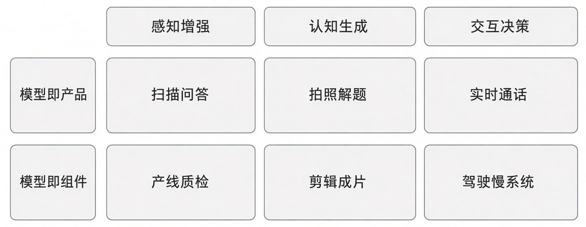
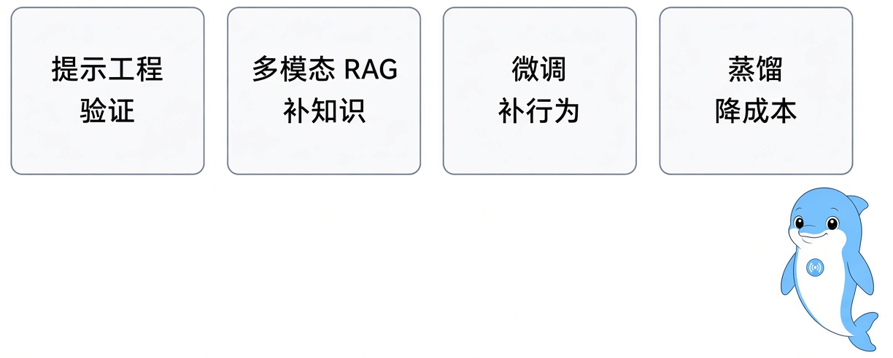
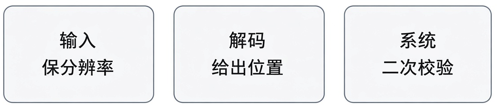
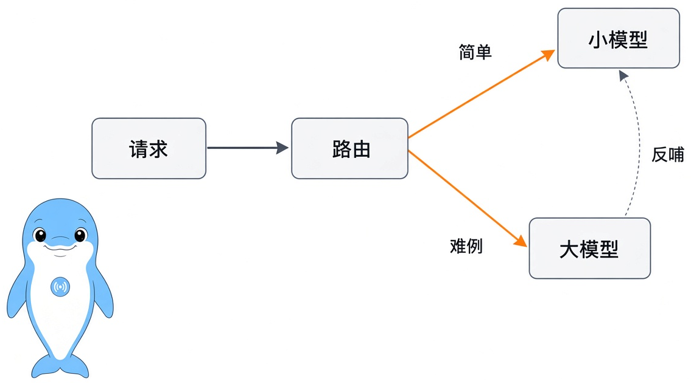
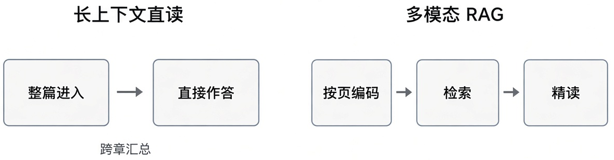
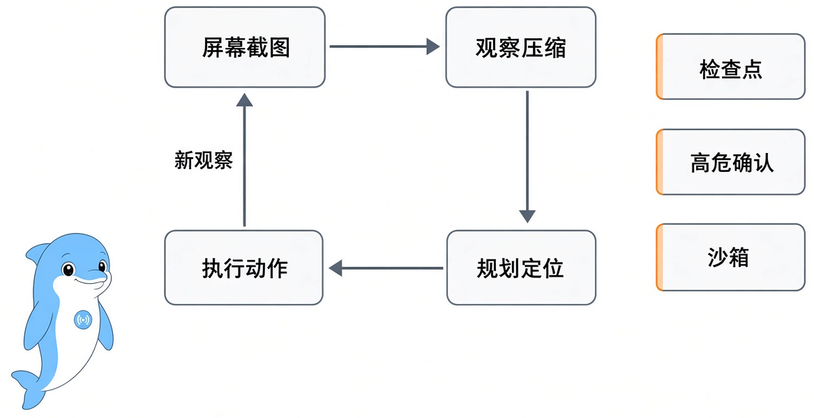
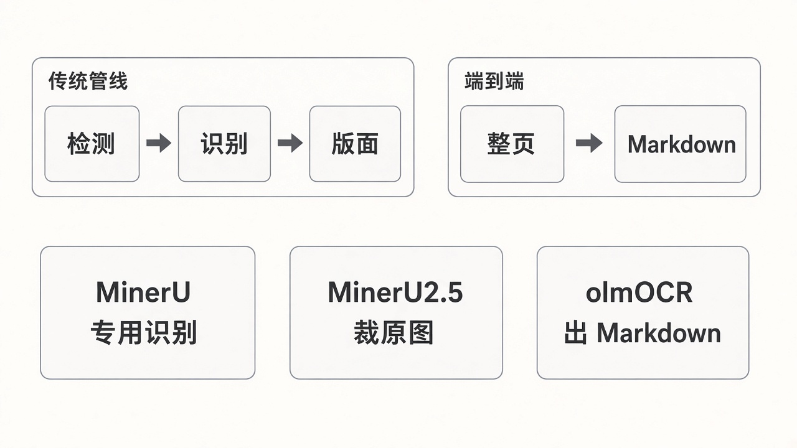
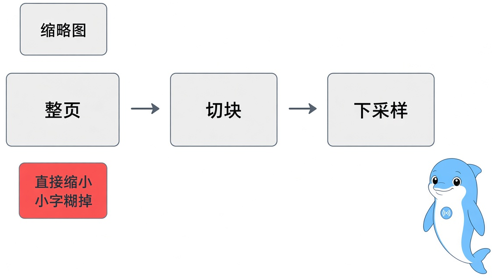
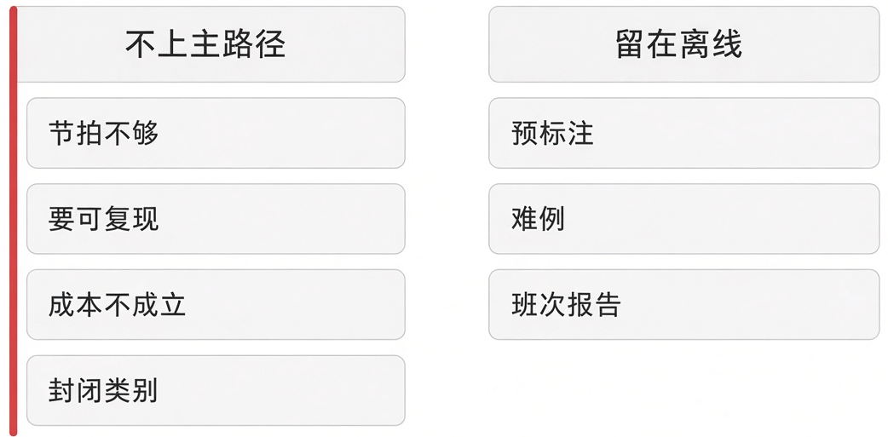
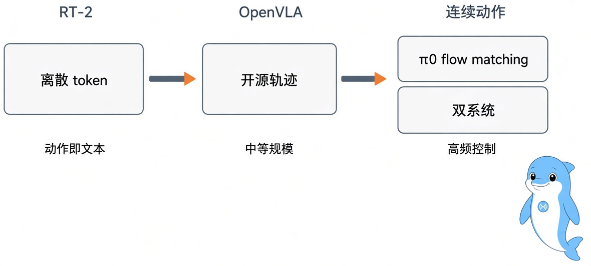

## 5.6 AI 多模态下游应用高频考点

> 本章在全书后段。前面各章讲完组件、基石模型、主流模型和原生多模态，这里改问这些能力怎样变成可交付的应用。依次讲下游版图和四条落地路径，产品选型、评测与大小模型协同，理解类和交互生成类产品怎么拆，多模态 Agent 与 GUI Agent，文档智能，工业质检的边界，以及具身和自动驾驶怎样进入物理世界。

---

### [5.6.1 多模态大模型的下游应用版图与落地路径应如何选型](#q561)
- [5.6.1.1 面试问题：多模态下游应用可以按什么框架分类与定位？](#q5611)
- [5.6.1.2 面试问题：提示工程、多模态 RAG、微调与蒸馏四条落地路径如何选型？](#q5612)
- [5.6.1.3 面试问题：下游落地中的幻觉问题如何系统性治理？](#q5613)

### [5.6.2 从产品角度出发，多模态模型能力如何转化为可交付的产品](#q562)
- [5.6.2.1 面试问题：如何从产品需求反推模型选型与部署形态？](#q5621)
- [5.6.2.2 面试问题：多模态产品的评测体系与数据飞轮应如何设计？](#q5622)
- [5.6.2.3 面试问题：大小模型协同的工程架构是怎样设计的？](#q5623)

### [5.6.3 如何拆解代表性产品中理解类功能背后的多模态方案](#q563)
- [5.6.3.1 面试问题：豆包「拍照解题」功能背后应用了哪些多模态方案？](#q5631)
- [5.6.3.2 面试问题：Kimi「长 PDF 解析问答」应该用长上下文直读还是多模态 RAG？](#q5632)
- [5.6.3.3 面试问题：以图搜图与拍照购物为什么采用检索式而非生成式方案？](#q5633)

### [5.6.4 如何拆解代表性产品中交互与生成类功能背后的多模态方案](#q564)
- [5.6.4.1 面试问题：豆包「实时语音视频通话」功能背后应用了哪些多模态方案？](#q5641)
- [5.6.4.2 面试问题：剪映「智能成片」类功能如何编排理解与生成模型？](#q5642)

### [5.6.5 多模态 Agent 的通用架构是什么？GUI Agent 的技术主线考察哪些要点](#q565)
- [5.6.5.1 面试问题：多模态 Agent 的通用架构包含哪些模块？视觉输入扮演什么角色？](#q5651)
- [5.6.5.2 面试问题：GUI Agent 如何实现界面理解与精确定位？](#q5652)
- [5.6.5.3 面试问题：Agent 的评测基准与多步可靠性问题如何应对？](#q5653)

### [5.6.6 OCR 与文档智能方向，多模态大模型如何重塑传统技术管线](#q566)
- [5.6.6.1 面试问题：MLLM 端到端方案与传统 OCR 管线如何对比与融合？](#q5661)
- [5.6.6.2 面试问题：高分辨率文档解析的技术难点有哪些？](#q5662)
- [5.6.6.3 面试问题：文档结构化信息抽取有哪些工程实践要点？](#q5663)

### [5.6.7 在工业质检等传统 CV 任务中，多模态大模型的能力边界在哪里](#q567)
- [5.6.7.1 面试问题：少样本与零样本缺陷检测有哪些基于多模态大模型的方案？](#q5671)
- [5.6.7.2 面试问题：什么场景下不应该使用多模态大模型？](#q5672)

### [5.6.8 具身智能与自动驾驶如何把多模态大模型带进物理世界](#q568)
- [5.6.8.1 面试问题：VLA 模型的架构谱系是怎样演进的？动作表示之争的本质是什么？](#q5681)
- [5.6.8.2 面试问题：具身智能与自动驾驶落地面临哪些共性问题？](#q5682)

### [附录 术语表](#q56g)

---

### 5.6.1 多模态大模型的下游应用版图与落地路径应如何选型

#### 5.6.1.1 面试问题：多模态下游应用可以按什么框架分类与定位？

**难度评分：⭐⭐ (2/5)  |  考察频率：⭐⭐⭐⭐ (4/5)**

定位用两个轴，交叉以后再谈选型，如图 6-1 所示。

1. **任务性质。** 看模型交出的是什么。

    （1）感知增强。模型充当更强的感知器，替代或加强传统 CV 管线，输出仍是结构化结果。OCR、文档解析、工业质检、开放词汇检测都属于这一格。

    （2）认知与生成。模型要完成理解、推理，再产出内容。拍照解题、长文档问答、图文创作和视频剪辑都属于这一格。

    （3）交互与决策。输出是动作。GUI Agent、具身操作和自动驾驶都属于这一格。错一步会改到真实环境，可靠性要求最高。

2. **产品位置。** 看模型在产品里占多大。

    （1）模型即产品。豆包、ChatGPT 属于这一类。用户直接面对模型，能力边界和产品边界重合，对话要稳，安全约束要跟着走。现役的 ChatGPT 模型族是 GPT-6，GPT-4o 和 GPT-5 已于 2026 年 2 月 13 日下线，不能再当作现役代表。

    （2）模型即组件。拍立淘里的重排、剪映里的高光检测，模型只是管线中的一环。要求单点效果、低延迟和低成本。

两轴一交叉，选型就跟着落位。工业质检是感知增强乘模型即组件，合理方案是零样本检测再加产线小模型。把一个大型对话模型直接放上产线，延迟和成本都对不上节拍。后面各问按这张表逐格展开。

图 6-1 下游应用两维定位示意图

> **面试速答**：下游应用用两轴定位。任务性质分成感知增强、认知与生成、交互与决策，看输出是结构化结果、内容还是动作。产品位置分成模型即产品和模型即组件。两轴交叉以后再选端到端大模型或专用小模型，避免把对话模型直接送上产线。

---

#### 5.6.1.2 面试问题：提示工程、多模态 RAG、微调与蒸馏四条落地路径如何选型？

**难度评分：⭐⭐⭐ (3/5)  |  考察频率：⭐⭐⭐⭐⭐ (5/5)**

四条路径对应四种缺口，如图 6-2 所示。数据量和迭代节奏的经验对照如表 6-1 所示。

1. **提示工程。** 验证期的默认起点。不用训练，几小时就能改一版，配上少量示例和输出模板就能看可行性。它补不进成库的领域知识，提示一长，每次调用都更贵，格式约束也是软的。

2. **多模态 RAG。** 补的是知识。RAG（Retrieval-Augmented Generation，检索增强生成）在纯文本文档上可以先 OCR 再切块，版面和图表会在这一步丢掉。ColPali（Faysse et al., 2024）改成按页检索。它在 PaliGemma-3B 上加一层投影，把每个文本 token 和图像 patch 的输出映到 128 维，检索时用 late interaction 的 MaxSim。query 的每个向量在页面所有 patch 向量里取最大内积，再对 query 侧求和。

$$
s(q,d)=\sum_{i\in q}\max_{j\in d}\mathbf{E}_{q_i}^{\top}\mathbf{E}_{d_j}
$$

图表、印章和手写批注留在页面图像里，不必先 OCR。手册改版时，换掉索引中的页面即可，不必为新知识重训。提示工程也不重训，但它装不下一整库文档。

3. **微调。** 补的是行为。领域词模型不认识、输出必须严格符合下游 JSON Schema、话术必须统一，这三种信号都指向微调。LoRA（Low-Rank Adaptation，低秩适配，Hu et al., 2021）冻结原权重 $W_0$，只训练低秩增量。

$$
W' = W_0 + \Delta W = W_0 + BA,\qquad B\in\mathbb{R}^{d\times r},\ A\in\mathbb{R}^{r\times k},\ r\ll\min(d,k)
$$

可训练参数从 $dk$ 降到 $r(d+k)$。论文里很小的秩就往往够用。全参微调要更多数据和算力，业务侧更常见的是 LoRA。

4. **蒸馏。** 补的是成本。任务固定、流量变大以后，用大模型批量生成带推理链的标注，再训一个专用小模型。Hinton 等人 2015 年的目标，是硬标签交叉熵和教师软分布 KL 散度的加权。

$$
\mathcal{L}_{\text{distill}} = \alpha\,\mathcal{L}_{\text{CE}}\bigl(y,\,p_s\bigr) + (1-\alpha)\,\tau^{2}\,\mathrm{KL}\bigl(p_t^{\tau}\,\Vert\,p_s^{\tau}\bigr)
$$

温度 $\tau$ 把教师分布 $p_t$ 摊软，学生 $p_s$ 学的是类别之间的相对关系。代价是通用性没了，任务边界一变就要重蒸。

表 6-1 四条落地路径对照

| 路径 | 数据需求 | 一次性成本 | 迭代速度 | 适用阶段 |
| --- | --- | --- | --- | --- |
| 提示工程 | 数条示例 | 无 | 小时级 | 可行性验证 |
| 多模态 RAG | 文档库本身 | 建索引 | 天级 | 知识密集、频繁更新 |
| 微调（LoRA/SFT） | 数千至数万条 | 训练卡时 | 周级 | 行为定制、格式约束 |
| 蒸馏小模型 | 数万条教师标注 | 训练+验证 | 周至月级 | 高流量、任务固化 |

表 6-1 里的数据量和周期是业务侧的经验量级，用来比较路径，不是某篇论文测出来的常数。

图 6-2 四条落地路径示意图

> **面试速答**：提示工程用来验证，不训练、改得快，补不进成库知识。多模态 RAG 补知识，ColPali 按页做视觉检索，文档改版只更新索引。微调补行为，LoRA 只训低秩增量。蒸馏在任务固定、流量变大以后，用大模型的标注去训小模型。

---

#### 5.6.1.3 面试问题：下游落地中的幻觉问题如何系统性治理？

**难度评分：⭐⭐⭐ (3/5)  |  考察频率：⭐⭐⭐⭐⭐ (5/5)**

先把多模态里多出来的幻觉分开，再按输入、解码和系统三层治理，如图 6-3 所示。

1. **对象幻觉。** 描述图中不存在的物体。POPE（Polling-based Object Probing Evaluation，Li et al., 2023）用「图中是否有 X」这种是否题专门测它。

2. **细粒度抄写幻觉。** OCR 把模糊的数字、日期补成读得通、但是错的值。金融票据里这种错误直接进账。

3. **定位幻觉。** 文字答对了，框或页码是错的。点击溯源会失效。

治理也分三层。

1. **输入。** 分辨率不够是抄写幻觉的第一诱因。动态分块见 [5.2.4.2](#q5-2-4-2)，token 预算要按业务最小字号来留，压缩算法见 [5.4.2.1](#q5-4-2-1)。

2. **解码。** JSON Schema 约束解码只保证结构合法。同时要求模型给出证据位置，边界框或页码，核对时不用重读整页。

3. **系统。** 金额、身份证号等字段用专用 OCR 或规则再验一遍。两条通道不一致就转人工。低置信输出可以拒答。前提是置信度本身可信。期望校准误差（Expected Calibration Error，ECE）把样本按置信度分桶，比较每桶的平均置信度和实际准确率。

$$
\mathrm{ECE}=\sum_{b=1}^{B}\frac{|S_b|}{N}\,\Bigl|\,\mathrm{acc}(S_b)-\mathrm{conf}(S_b)\,\Bigr|
$$

ECE 大，说明模型过于自信。这时先做温度缩放一类校准，再按阈值分流。医疗报告和资金结算不能让模型直接出结果、旁边没有校验。

图 6-3 幻觉治理三层示意图

> **面试速答**：多模态幻觉要分开看。对象幻觉用 POPE 的是否题来测，抄写幻觉会改掉数字，定位幻觉会给错框或页码。治理在输入侧保住分辨率，解码侧约束格式并要求证据位置，系统侧对关键字段二次校验。拒答之前要先看 ECE，置信度不可信时阈值没有意义。

---

### 5.6.2 从产品角度出发，多模态模型能力如何转化为可交付的产品

#### 5.6.2.1 面试问题：如何从产品需求反推模型选型与部署形态？

**难度评分：⭐⭐⭐ (3/5)  |  考察频率：⭐⭐⭐⭐ (4/5)**

部署形态由延迟、成本和合规一起定，不是先选定一个最大的模型再往下砍。

1. **云端 API。** 迭代快，不用自己运维，适合验证期和流量波动大的场景。数据要出域。金融、医疗、政务客户经常因此直接排除。

2. **私有化部署。** 满足等保和行业合规。模型规格受客户 GPU 预算限制。AWQ、GPTQ 这一类 INT4 量化用来把权重放进现有显存。

3. **端侧部署。** 数据不出设备，可以离线，调用本身不再按次计云费用。能放下的只有小模型，还要靠 NPU 的低比特算力，能力上限明显。

延迟预算同时决定规格和交互。拍照解题可以等数秒。实时语音要对齐人对话的话轮节奏。Stivers 等人 2009 年测了 10 种语言，话轮间隔的众数落在 0 到 200 ms，全样本平均偏移约 208 ms。这是测出来的分布。产品上的超时阈值要按自己的交互另定。同一个模型，交互从异步改成实时，可用的架构会换一套。

成本按单次调用乘日调用量，再对照毛利率，倒推承受得起的规格。免费、高频的功能如果全量走最大的模型，推理费用会先碰到预算。下一问用大小模型协同把这笔费用压下来。

> **面试速答**：先看数据能不能出域、用户能等多久、单次调用乘上流量还剩多少毛利。云端 API 迭代快，私有化满足合规，端侧换来离线和隐私，模型必须小。异步任务可以等数秒，实时语音要对齐大约一两百毫秒的话轮间隔，架构会因此不同。

---

#### 5.6.2.2 面试问题：多模态产品的评测体系与数据飞轮应如何设计？

**难度评分：⭐⭐⭐ (3/5)  |  考察频率：⭐⭐⭐⭐ (4/5)**

评测分三层，各答各的问题。数据飞轮把线上错误收成回归集。

1. **离线基准。** MMMU、OCRBench、DocVQA 只做门槛筛查。能决定发不发布的，是从真实流量里分层抽样、人工标出金标准的业务集，里面要有长尾难例。公开测试题可能已经进了训练语料，榜单涨分和业务表现脱钩很常见。

2. **上线前人评。** 按正确性、有用性、安全性打分。标注一致性用 Cohen's Kappa。

$$
\kappa=\dfrac{p_o-p_e}{1-p_e}
$$

$p_o$ 是观测一致率，$p_e$ 是随机猜也会一致的比例。Landis 与 Koch（1977）把 0.41 到 0.60 称为 moderate，0.61 到 0.80 称为 substantial。$\kappa$ 还停在 moderate 时，先改标注规范。主观维度要多人背靠背。

3. **线上指标。** A/B 实验看任务完成率、点踩率、追问率和留存。线上指标是最终裁判。离线涨、线上跌，多半是评测集和真实流量已经不一样。

数据飞轮的闭环是四步。线上负反馈流回来，按分辨率、知识缺失或幻觉聚类，定向补数据或改管线，再把同一类错误写进回归集。每次更新都要全量通过回归集，避免修好一边、弄坏另一边。回归集记的是这条产品真实出过错的样子。

> **面试速答**：评测分三层。公开榜只做门槛，业务集才决定发布。人评要看 Kappa，停在 moderate 就先改规范。线上完成率、点踩和留存是最终裁判。负反馈要聚类、补数据，并写进回归集，每次发布都全量再跑。

---

#### 5.6.2.3 面试问题：大小模型协同的工程架构是怎样设计的？

**难度评分：⭐⭐⭐⭐ (4/5)  |  考察频率：⭐⭐⭐ (3/5)**

单一大模型扛全量流量，成本上站不住。成熟产品是分层路由，如图 6-4 所示。小模型扛量，大模型处理难例，大模型再把能力交回小模型。

路由放在前面。规则、小分类器或小 MLLM 的自评，用来估计请求难度。清晰印刷体、常见商品等简单请求，交给专用小模型或缓存。模糊手写、多步推理和多轮追问，再升级到大模型。设路由到小模型的比例为 $\rho$，单次请求的期望成本是

$$
\mathbb{E}[C] = C_{\text{router}} + \rho\,C_{\text{small}} + (1-\rho)\,C_{\text{large}}
$$

把线上测到的 $\rho$ 和两种单价代进去，就能看出分流比例怎样进入总成本。两种错误都要算。简单请求走大模型，浪费算力。困难请求走小模型，直接答错。路由器要用线上数据持续校准。

大模型对小模型有三重反哺。

1. **蒸馏教师。** 批量生成带推理链的标注，让 [5.6.1.2](#q5612) 的蒸馏路径持续转起来。

2. **预标注。** 回流数据先由大模型标一版，人工改错。标注量因此下降，飞轮才转得动。下降多少要按自己的抽检来算，没有统一倍数。

3. **影子模式。** 新小模型上线前，大模型在旁路对同一批流量出参考答案。用户无感，就能估计小模型的真实精度。

同一输入如果大小模型答案长期不一致，用户会觉得时好时坏。路由边界要稳定。小模型每一轮蒸馏都用当前大模型当教师，避免两套能力越走越远。

图 6-4 大小模型路由示意图

> **面试速答**：全量走大模型成本站不住，所以前面加路由，简单请求给小模型，难例升级。期望成本由分流比例和两种单价决定，具体倍数要用线上数据代，不要背一个固定倍率。大模型同时当教师、预标注员和影子对照。路由边界要稳，小模型要跟着当前大模型刷新。

---

### 5.6.3 如何拆解代表性产品中理解类功能背后的多模态方案

#### 5.6.3.1 面试问题：豆包「拍照解题」功能背后应用了哪些多模态方案？

**难度评分：⭐⭐⭐ (3/5)  |  考察频率：⭐⭐⭐⭐ (4/5)**

豆包拍照解题是面试里的产品入口。公开材料没有公布这条功能的模块清单。要答的是拍照解题绕不开的四段。

1. **输入。** 手机实拍有任意比例、倾斜和阴影。先做畸变矫正，一页多题就逐题裁剪。进模型前按动态分块处理高分辨率，原理见 [5.2.4.2](#q5-2-4-2)。手写小字和上下标对分辨率最敏感。分块太粗，指数和分式在视觉端就没了。

2. **识别。** 印刷体、手写体和公式混在一页上。传统的检测加识别，在二维公式上吃力。GOT-OCR2.0（Wei et al., 2024）约 580M 参数，把整页读成文字、公式或表格。通用理解可以走 Qwen3-VL 这一档，规格和成本都另算。语义先验能补模糊笔迹，也会把看不清的数字补错，也就是 [5.6.1.3](#q5613) 里的抄写幻觉。

3. **推理。** 解题用链式思维（Chain-of-Thought，CoT）分步写。大模型的算术不稳定。成熟做法是模型给出解法，数值计算交给代码执行或符号计算。模型负责怎么解，工具负责算对。这是 [5.6.5.1](#q5651) 里工具调用的一个实例。

4. **回流。** 输出按步骤呈现，并标上知识点。用户点「答案有误」，错题本里的行为，会成为困难样本。晚自习的流量尖峰靠 [5.6.2.3](#q5623) 的路由消化。

> **面试速答**：公开材料没有给出豆包拍照解题的内部清单。拍照解题分四段。先矫正和裁题，再用动态分块保住小字。识别可以走 GOT-OCR2.0 或 Qwen3-VL。解题步骤由模型写，数值交给代码或符号工具。用户纠错再流回回归集。

---

#### 5.6.3.2 面试问题：Kimi「长 PDF 解析问答」应该用长上下文直读还是多模态 RAG？

**难度评分：⭐⭐⭐⭐ (4/5)  |  考察频率：⭐⭐⭐⭐ (4/5)**

Kimi 在 2024 年 3 月宣布约 200 万字上下文进入内测。长 PDF 问答考的是，这份长度该一次性读完，还是检索以后再读，如图 6-5 所示。200 万字是那次内测的宣传数字，不要写成现在每个入口的默认窗口。

1. **长上下文直读。** 整篇放进上下文，跨章节推理和全局汇总最好，没有召回遗漏。代价有三件。百页 PDF 视觉 token 化以后，预填充的延迟和费用随长度上涨。超长序列有 lost in the middle（Liu et al., 2023），中部细节的召回低于首尾。几千份合同也塞不进任何窗口。

2. **多模态 RAG。** ColPali 把每一页编码成多向量，MaxSim 公式见 [5.6.1.2](#q5612)。这种逐 token 匹配，比单向量双塔更容易打中一小块图表。页面向量可以离线算好。召回 top-k 页以后交给 MLLM 精读，费用和库的总页数解开，也保留版面。代价是两跳。问题和原文措辞差得远时，相关页可能进不了上下文。

3. **混合。** 短文档直读。长文档和文档库走检索。全局问题先分段摘要再汇总。路由时看三个量。单篇还是整库，定位型还是全局型，静态还是日更。

答案旁边标页码和出处，既是交互，也是幻觉治理。检索天然带得出处。直读要额外训练模型输出引用。很多产品最后用混合架构，和这件事有关。

图 6-5 长文档直读与检索示意图

> **面试速答**：Kimi 在 2024 年 3 月把约 200 万字上下文放进内测，这不是现在每个入口的默认窗口。直读适合单篇里的跨章和全局问题，中部会丢细节，文档库塞不进窗口。多模态 RAG 按页检索再精读，费用和库大小解开，但有召回损失。短文档、长文档和全局问题要分开路由，答案要带页码。

---

#### 5.6.3.3 面试问题：以图搜图与拍照购物为什么采用检索式而非生成式方案？

**难度评分：⭐⭐⭐ (3/5)  |  考察频率：⭐⭐⭐ (3/5)**

拍立淘是拍照购物的产品代表。公开材料没有把它的线上编码器写成某一个开源模型。主链路是检索。生成式模型放不到这条链路的中段。

1. **主链路。** 商品库离线编码成 embedding，线上 query 图过同一编码器，用余弦相似度 $s=\cos(\mathbf{v}_q,\mathbf{v}_d)$ 在近似最近邻索引里召回。CLIP 是这条双塔路线的代表。索引常见 HNSW 和 IVF-PQ。十亿级库能在较短延迟内返回，靠的是向量可以预计算。具体延迟随库和机器变化。

2. **生成式中段不成立。** 三件事卡死它。

    （1）建不了索引。生成式的相似度发生在一次前向里，变不成可离线存放的向量。每次查询都要对候选再跑模型。

    （2）费用和延迟。候选规模一大，逐个生成的成本远高于一次近似最近邻查询。差多少倍要按自己的库来算。

    （3）结果不稳。检索要求同一次 query 得到同一批结果。采样式生成给不出稳定的同一批结果。

3. **生成式的位置。** 前端做 query 理解，分清用户拍的是鞋还是鞋上的标志，抽出颜色和款式，改写检索条件。后端对召回的一小批候选做属性比对，并写出推荐理由。入库时可以用 MLLM 给商品图打结构化标签，提高召回。Qwen3-VL 可以承担这种理解，不承担十亿级的在线打分。

> **面试速答**：以图搜图的主链路是双塔嵌入加近似最近邻，CLIP 是代表，向量可以离线算好。生成式模型建不了索引，也不能对十亿商品逐个打分，采样还不稳定。它适合放在两端，前面理解 query，后面解释一小批候选。拍立淘是拍照购物里的代表，具体编码器要以公开实现为准。

---

### 5.6.4 如何拆解代表性产品中交互与生成类功能背后的多模态方案

#### 5.6.4.1 面试问题：豆包「实时语音视频通话」功能背后应用了哪些多模态方案？

**难度评分：⭐⭐⭐⭐ (4/5)  |  考察频率：⭐⭐⭐⭐ (4/5)**

这一问要分开讲。语音侧有官方方案。视频帧怎么进模型，这篇发布没有写。

1. **级联还是端到端。** 级联是语音识别、大模型、语音合成三段相接，时延相加，语气和背景声在转写时丢掉。差别见 [5.5.5.1](#q5551)。豆包当前公开的实时语音是 Seeduplex，官方称为原生全双工端到端模型，相对上一代半双工端到端，强调边听边说，并已在豆包 App 全量上线。官方比较上一代半双工框架，判停 MOS 提高 8%，对话流畅度 MOS 提高 12%。它不是 Qwen3-Omni 的 Thinker-Talker。那是另一条公开结构，首包时延的机制见 [5.5.5.2](#q5552)，数字不能安到豆包上。

2. **视频预算。** 官方这篇没有给出豆包视频通话的抽帧策略。视频通话共通的约束是，画面不能逐帧全分辨率送进模型。低频抽帧，画面大变或用户要求看某处时再提高采样。时序采样见 [5.4.7.1](#q5-4-7-1)。这篇发布没有给出帧率。

3. **交互形态。** 从回合制到可打断，再到全双工，见 [5.5.5.3](#q5553)。可打断要处理回声，并用语音活动检测判断用户开口。话轮间隔的测量见 [5.6.2.1](#q5621)，不要把 200 ms 说成豆包的首包指标。

> **面试速答**：豆包实时语音的公开方案是 Seeduplex，原生全双工端到端，相对上一代半双工。官方给出的比较是判停 MOS 提高 8%，流畅度 MOS 提高 12%。它不是 Qwen 的 Thinker-Talker。视频抽帧策略没有在这篇发布里公开，只能讲低频采样这条共通约束。交互形态从回合制走到可打断，再到全双工。

---

#### 5.6.4.2 面试问题：剪映「智能成片」类功能如何编排理解与生成模型？

**难度评分：⭐⭐⭐ (3/5)  |  考察频率：⭐⭐⭐ (3/5)**

智能成片是模型即组件。公开材料没有给出剪映的完整模型清单，也不宜写成「链路里有十余个模型」。按理解、决策、生成三段来拆。

1. **理解。** 镜头边界检测先把素材切成 shot。视频理解模型给每个片段写带时间戳的描述，人物、动作、场景和情绪。时间对齐见 [5.4.8.1](#q5-4-8-1)。高光打分把画质、人脸表情、动作幅度和音频能量合在一起，排出片段可用度。

2. **决策。** 模板定叙事和目标时长，再从高光池里选段、排序。配乐定了以后做节拍对齐，剪辑点吸到拍子上。这一步是算法，对成片节奏影响很大。

3. **生成。** 语音识别出字幕，语言模型润色标题和文案，按情绪推荐配乐，需要旁白时再接语音合成。补转场和空镜可以再接视频生成模型。Seedance 2.5 是当前这一档的公开代表，不能据此断定剪映内部用的是哪一个。

> **面试速答**：智能成片是一串组件，不是一个端到端大模型，剪映的内部名单也没有公开。理解段切镜头、写时间戳描述并打高光。决策段按模板选段，再把剪辑点对齐音乐节拍。生成段补字幕、文案、配乐和旁白，转场可以再接视频生成模型。

---

### 5.6.5 多模态 Agent 的通用架构是什么？GUI Agent 的技术主线考察哪些要点

#### 5.6.5.1 面试问题：多模态 Agent 的通用架构包含哪些模块？视觉输入扮演什么角色？

**难度评分：⭐⭐⭐ (3/5)  |  考察频率：⭐⭐⭐⭐⭐ (5/5)**

Agent 和普通对话的分界是闭环。模型的输出改变环境，新的环境状态再变回输入。通用架构有四个模块。

1. **规划。** 把目标拆成可执行步骤。ReAct（Reasoning and Acting）是推理和行动交替。plan-and-execute 是先出计划再逐步执行，失败时重规划。

2. **工具调用。** 以 function calling 调用外部能力。多模态场景里的工具包括检测分割、OCR、搜索和代码执行。模型决定用哪个工具、传什么参数。工具负责确定性地执行。

3. **记忆。** 短期记忆靠上下文窗口保住任务状态。长期记忆外置到向量库，跨会话保留偏好和历史结论。

4. **反思。** 对照截图和工具返回值做自检。失败就回溯重试，不要沿着错的状态继续。

视觉输入有三种角色。一是任务输入，用户发来一张报错截图。二是环境观察，GUI Agent 每一步都靠屏幕截图知道当前状态。三是工具返回，代码画出的图要模型自己看懂，再决定下一步。第二种会持续产生高分辨率截图，上下文会被撑满，所以要压缩观察。只留变化区域，历史观察降采样或收成摘要。token 压缩见 [5.2.4.4](#q5-2-4-4)，这里是把它用到时间维上。

> **面试速答**：多模态 Agent 是闭环，输出会改变环境。四个模块是规划、工具调用、记忆和反思。视觉有三种角色，用户输入、每一步的屏幕观察、工具返回的图像。屏幕观察会越积越多，要压缩历史，只把变化留在上下文里。

---

#### 5.6.5.2 面试问题：GUI Agent 如何实现界面理解与精确定位？

**难度评分：⭐⭐⭐⭐ (4/5)  |  考察频率：⭐⭐⭐⭐ (4/5)**

GUI 上的 grounding 比通用检测更脆。检测框偏几个像素往往还能用。点一个只有几十像素的图标，偏出图标即失败。坐标用归一化、千分制还是绝对像素，见 [5.4.6.1](#q5-4-6-1)。高分辨率截图里的小图标，对 token 预算比自然图像更紧。

两条路线现在都在用。

1. **结构化辅助。** 读操作系统给出的控件树（accessibility tree），或读网页 DOM，拿到控件列表。set-of-mark（Yang et al., 2023）在截图上叠加编号框，把预测坐标改成选择编号。工程上稳，但依赖系统接口。canvas 渲染和游戏界面拿不到这棵树，路线就失效。

2. **纯视觉。** 只看截图。CogAgent（Hong et al., CVPR 2024）是 18B，高分辨率分支输入 $1120\times 1120$，说明只靠截图可以做 GUI。OS-Atlas 放出跨平台 grounding 语料，规模超过 1300 万个界面元素。UI-TARS 只吃截图，把感知、grounding 和动作放进一个端到端模型。控件树在拿得到时仍然更稳，纯视觉补的是拿不到树的界面。

动作空间要覆盖点击、输入、滚动、长按和组合键。桌面和手机的动作并不相同。训练数据是截图加动作的轨迹，来自人工录制、规则合成，以及模型自己探索后再筛选。标注成本高于普通图文对。

> **面试速答**：GUI 点击偏出一个图标即失败，坐标格式见 5.4.6.1。一条路线读控件树或 DOM，或用 set-of-mark 把坐标改成编号，canvas 和游戏界面会失效。另一条只看截图，CogAgent 用 1120 的高分辨率分支证明了可行性，OS-Atlas 补 grounding 数据，UI-TARS 把感知和动作放进一个模型。动作空间和轨迹数据要单独准备。

---

#### 5.6.5.3 面试问题：Agent 的评测基准与多步可靠性问题如何应对？

**难度评分：⭐⭐⭐ (3/5)  |  考察频率：⭐⭐⭐ (3/5)**

静态问答看文字对不对。Agent 要在环境里执行，再检查终态。感知、决策、执行的闭环，以及挡住不可逆操作的三道机制，如图 6-6 所示。

1. **可执行基准。** OSWorld（2024）有 369 个真实电脑任务，在虚拟机里跑，用脚本检查终态。环境支持 Ubuntu、Windows 和 macOS。论文主体是这 369 个任务，另有 43 个 Windows 任务用于分析。人类成功率 72.36%，当时最好的模型 12.24%，失分主要在 GUI grounding 和操作知识。后来的榜单、步数上限和 OSWorld-Verified 都改过协议。答题要说清是哪一版，不要把 2024 年的差距说成现在的差距。AndroidWorld 有 116 个任务、覆盖 20 个应用，参数每次随机生成，用来避免背题。WebArena 面向自托管网站。

2. **多步衰减。** 没有回滚时，每一步都要成功，端到端成功率随步数相乘。

$$
P_{\text{task}}=\prod_{t=1}^{n}p_t\approx p^{\,n}
$$

若单步成功率 $p=0.95$、任务 $n=20$ 步，则 $0.95^{20}\approx 0.36$。这是算术例子，不是某个产品的实测。$p$ 提到 0.99 时，同样 20 步大约回到 0.82。另一个方向是把高频操作收成一个工具，缩短 $n$。

3. **可靠性机制。**

    （1）检查点。关键节点保存状态，失败回到最近的检查点，不必从头再来。

    （2）高危确认。删除、支付、发送设确认，必要时直接拒绝。

    （3）沙箱。先在隔离环境跑通，再作用于真实环境。模型和幻觉治理里的原则一样，模型输出不直接生效。

图 6-6 GUI Agent 感知决策执行闭环示意图

> **面试速答**：Agent 评测要在环境里检查终态。OSWorld 2024 年的 369 个任务上，人类成功率 72.36%，当时最好模型 12.24%，后来的协议变过，不能把当年的差距说成现在。没有回滚时，成功率随步数相乘，0.95 的 20 次方大约只剩 0.36。工程上用检查点、高危确认和沙箱，让错误可以退回，也不直接生效。

---

### 5.6.6 OCR 与文档智能方向，多模态大模型如何重塑传统技术管线

#### 5.6.6.1 面试问题：MLLM 端到端方案与传统 OCR 管线如何对比与融合？

**难度评分：⭐⭐⭐ (3/5)  |  考察频率：⭐⭐⭐⭐⭐ (5/5)**

「大模型会不会取代传统 OCR」要先把两条管线分开，再讲现在实际在用的融合方式，如图 6-7 所示。

1. **传统管线。** 文本检测、行识别、版面和阅读顺序，分段优化。检测有 DBNet 一类，识别从 CRNN 走到 SVTR。优点是快，错误可以定位到具体一段再修。缺点是级联误差会累加。多栏、表格套图、印章压住文字，结构还原一直难。

2. **端到端。** 一次前向读整页。GOT-OCR2.0 约 580M，是专用模型。Qwen3-VL 是通用 MLLM 的代表。输入整页，直接输出 Markdown、LaTeX 或 HTML 表格。复杂版面更稳，语义先验能纠正模糊字符，也可以接着做文档问答。同一个先验会把看不清的数字补成通顺的错值，也就是 [5.6.1.3](#q5613) 的抄写幻觉。字符级精度没有传统管线那种按框可查的保证。单页成本高于传统管线，高多少要按自己的批量和硬件算。

3. **融合。** 现在至少有三种公开形态，外加一种工程双通道。MinerU 初版是版面检测加专用 OCR、公式和表格识别，不是一个 MLLM 包打全页。MinerU2.5 改成两段，先在降采样的页上看版面，再按框裁原图细读。olmOCR 是端到端，把页面图像直接写成 Markdown。金额、证件号再用专用 OCR 复核，两条通道不一致就转人工。这是工程做法，不是上面三篇论文的结构。自由格式问答用端到端，高精度录入用融合或复核，海量简单版面仍用传统管线扛量。

图 6-7 文档解析路线对照示意图

> **面试速答**：传统 OCR 分段做检测、识别和版面，快，错误也好定位，复杂版面容易累积误差。端到端一次读整页，GOT-OCR2.0 和 Qwen3-VL 是两种规格，抗复杂版面，也会抄错数字。MinerU 初版是专用模型管线，MinerU2.5 先看版面再裁原图，olmOCR 直接出 Markdown。关键字段再用专用 OCR 复核。

---

#### 5.6.6.2 面试问题：高分辨率文档解析的技术难点有哪些？

**难度评分：⭐⭐⭐⭐ (4/5)  |  考察频率：⭐⭐⭐⭐ (4/5)**

A4 是 210 mm 乘 297 mm。按 300 dpi，$210/25.4\times 300\approx 2480$，$297/25.4\times 300\approx 3508$，扫描大约是 $2480\times 3508$。主流视觉编码器的原生输入往往只有几百像素见方。分辨率差距是文档解析一连串难点的起点。

token 数和信息保真对着干，如图 6-8 所示。直接缩到编码器原生分辨率，正文小字会糊。InternVL-1.5 按 [5.4.2.1](#q5-4-2-1) 切成 $448\times 448$ 的块，每块 1024 个 patch，再做 2×2 下采样，压到 256 个 token。

$$
N_{\text{tokens}} = \left\lceil \frac{W}{448} \right\rceil \times \left\lceil \frac{H}{448} \right\rceil \times 256
$$

代入上面的 A4，$\lceil 2480/448\rceil\times\lceil 3508/448\rceil=6\times 8=48$ 块，约 1.2 万视觉 token。公式只计内容块。InternVL-1.5 还会加一张全局缩略图。这是这一代模型的算法，不是所有 MLLM 的算法。Qwen 系列用的是另一套合并。合同脚注和海报大标题的最优分块不一样，所以文档产品会露出精读和速读两档。

结构化元素各自有难点。

1. **表格。** 合并单元格、跨页续表、无线框表，输出 HTML 或 Markdown 时行列容易错位。

2. **公式。** 二维结构转 LaTeX。上下标和分式嵌套对分辨率最敏感。

3. **图表。** 要从柱状图、折线图里读出数值。ChartQA 专门测从图表里读数值。公开榜没有给出「哪一种元素错误率最高」的总排名。

4. **阅读顺序。** 多栏和绕排一旦串错，后面的 RAG 切块就错。

评测上，通用能力看 OCRBench、DocVQA，表格和公式看专项集。印章遮挡、复印噪声和手写批注，公开基准覆盖不到，上线前仍要自建业务集。

图 6-8 高分辨率文档分块示意图

> **面试速答**：A4 按 300 dpi 大约 2480×3508，和编码器的原生输入差着一个分辨率量级。InternVL-1.5 切成 448 的块，每块压到 256 个 token，一页内容块就有约 1.2 万，缩略图另计。表格、公式、图表和阅读顺序各有难点。公开榜覆盖不到印章和手写，业务集要自己建。

---

#### 5.6.6.3 面试问题：文档结构化信息抽取有哪些工程实践要点？

**难度评分：⭐⭐⭐ (3/5)  |  考察频率：⭐⭐⭐⭐ (4/5)**

格式对和内容对是两件事。人审比例由置信度决定，校准不好时阈值没有意义。

1. **约束解码。** 用 JSON Schema 或语法约束，让字段名、类型和枚举值不跑偏。它只保证合法，不保证正确。金额抄错一位，仍然是合法 JSON。

2. **字段校验。** 用字段自己的结构互验。身份证号的校验位，金额的数字和大写，开票日期不能晚于今天，单价乘数量是否接近总价。规则命中就拦截。这一层拦住的错误，常常多于单纯换一个更大的模型。这是工程经验，不是一篇论文的消融。

3. **置信度路由。** 生成式模型往往没有现成的字段级置信度。可以用多次采样的一致程度做代理。同一字段采样 $K$ 次，众数答案的出现频率是

$$
\hat{p}(y)=\frac{1}{K}\sum_{k=1}^{K}\mathbf{1}\bigl[y^{(k)}=y\bigr]
$$

低于阈值的字段转人工，高置信字段抽检。人审比例由阈值和流量决定。

4. **版面锚定。** 输出字段值时同时给出来源框。人审界面高亮原图位置，核验从翻整页变成看一个框。坐标预测见 [5.4.6.1](#q5-4-6-1)。

> **面试速答**：约束解码只保证 JSON 合法，金额抄错一位仍然合法。身份证校验位、大小写金额和单价乘数量，用来拦内容错误。字段置信度可以用多次采样的一致频率代理，低的转人工。同时给出来源框，人审就不用翻整页。人审能降到多少，要按自己的阈值算。

---

### 5.6.7 在工业质检等传统 CV 任务中，多模态大模型的能力边界在哪里

#### 5.6.7.1 面试问题：少样本与零样本缺陷检测有哪些基于多模态大模型的方案？

**难度评分：⭐⭐⭐⭐ (4/5)  |  考察频率：⭐⭐⭐ (3/5)**

新产线冷启动时，正常样本很多，缺陷样本很少，甚至一张都没有。监督检测器此时训不起来。

1. **零样本。** 用语言描述代替缺陷标注。CLIP 的二类提示可以写成一个异常分数。$t_{+}$ 是异常描述，$t_{-}$ 是正常描述，$f(x)$ 是图像或窗口特征。

$$
a(x)=\frac{\exp\bigl(\cos(f(x),t_{+})/\tau\bigr)}{\exp\bigl(\cos(f(x),t_{+})/\tau\bigr)+\exp\bigl(\cos(f(x),t_{-})/\tau\bigr)}
$$

这是二类提示下的 CLIP 分数，不是 WinCLIP 论文里的完整公式。WinCLIP（Jeong et al., CVPR 2023）在这之上做了状态词和模板的组合，并把窗口、patch 和整图三级特征聚合起来。论文报告，MVTec-AD 上零样本的 image-level AUROC 是 91.8%，pixel-level AUROC 是 85.1%。没有见过该产线的缺陷图，靠的是对比学习已经学到的图文对齐，见第 3 章。

2. **少样本和可对话。** AnomalyGPT（AAAI 2024）用模拟异常图训练，不是用真实缺陷标注堆出来的。推理时给一张正常样本，就能迁到没见过的物体。它直接判断有没有异常、指出位置，并能多轮对话。论文报告，MVTec-AD 上 1-shot 的 image-level AUC 是 94.1%。开放词汇的另一条组合是 Grounding DINO 出框，SAM 把框变成 mask，不用为「表面划痕」再训一个检测器。它适合冷启动和巡检，不适合当成产线节拍上的检测器。

> **面试速答**：没有缺陷图时，可以用语言描述做零样本。WinCLIP 在 CLIP 二类提示上加了提示词组合和多尺度窗口，MVTec-AD 的 image-level AUROC 是 91.8%。AnomalyGPT 用模拟异常训练，一张正常样本就能对话并指出位置。Grounding DINO 加 SAM 适合新类别冷启动，不承担产线节拍。

---

#### 5.6.7.2 面试问题：什么场景下不应该使用多模态大模型？

**难度评分：⭐⭐⭐ (3/5)  |  考察频率：⭐⭐⭐⭐ (4/5)**

有四类场景，在线环节不该把 MLLM 放在主路径上，如图 6-9 所示。

1. **节拍不够。** 产线节拍常常到不了大模型一次前向的时间。专用检测器仍是在线节拍的选择。

2. **要可复现。** 质检和医疗要求同输入同输出，结果要能审计。生成式采样做不到这一点。温度调到 0 只能减少波动。

3. **单件成本不成立。** 日均百万件的检测，单件推理成本乘上件数，就会先碰到预算。大模型的边际成本和这种高频、低单价的调用对不上。

4. **类别是封闭的。** 固定的十几种缺陷、标注也够，专用小模型负责把精度做高。大模型的长处是开放语义和零样本。封闭集合上它没有天生的精度优势。

不放在在线主路径，不等于离线也没有位置。

1. **预标注。** 大模型先标，人工改正。效率和 [5.6.2.3](#q5623) 的预标注是同一件事。

2. **难例。** 对线上小模型的低置信样本做第二次判读，再聚类，用来决定补什么数据。

3. **报告。** 把一天的质检统计写成班次报告。这是语言任务，适合大模型。

图 6-9 在线不用大模型的判定示意图

> **面试速答**：产线节拍、同输入同输出、海量低单价调用、封闭类别加充足标注，这四种情况不要把 MLLM 放在在线主路径上。专用检测器负责节拍和可复现。大模型留在离线，做预标注、难例归因和班次报告。具体毫秒差要自己测，不要背一个固定倍数。

---

### 5.6.8 具身智能与自动驾驶如何把多模态大模型带进物理世界

#### 5.6.8.1 面试问题：VLA 模型的架构谱系是怎样演进的？动作表示之争的本质是什么？

**难度评分：⭐⭐⭐⭐⭐ (5/5)  |  考察频率：⭐⭐⭐⭐ (4/5)**

VLA（Vision-Language-Action，视觉-语言-动作）把看到的画面和语言指令映射成动作。谱系可以分成三代，差别如图 6-10 所示。动作表示之争，和 [5.5.2.4](#q5524) 里离散 token 与连续表征的取舍是同一类问题。

1. **离散动作。** RT-2 以 PaLI-X 55B 和 PaLM-E 为底座。动作沿用 RT-1 的量化。末端执行器的 6 自由度位移，加上夹爪开合，这 7 个连续维度各自均匀量化成 256 个 bin，再加一个终止指令，一步是 8 个整数。PaLI-X 直接复用已有的整数 token。动作因此能放进自回归。它要证明的是，网页规模的图文知识能迁到操作，对象可以不在机器人训练集里。论文指出，模型计算开销高，接到更高控制频率时，实时推理会成为瓶颈。

2. **开源中等规模。** OpenVLA 是 7B，视觉侧融合 SigLIP 和 DINOv2，语言侧是 Llama 2。训练用的是从 Open X-Embodiment 里整理出的约 97 万条真实轨迹。数据集全文是 60 个数据集、22 种机器人形态、超过 100 万条轨迹，97 万条是 OpenVLA 的整理结果。论文报告，在 29 个任务上，绝对成功率比 55B 的 RT-2-X 高 16.5 个百分点，参数约为后者的七分之一，论文的说法是 7 倍更少。这是 29 个任务的平均差距，各项上的语义泛化要分开看。动作在这一代仍然是离散 token。

3. **连续动作。** $\pi_0$ 用 PaliGemma 做底座，另加约 300M 的动作专家，合计约 3.3B。动作块长度 $H=50$，用条件 flow matching 一次生成整段连续动作。论文写控制频率最高约 50 Hz，例子包括叠衣服。推理从噪声积分到动作块，实验用 10 步 Euler。直线路径是

$$
a_{\tau}=(1-\tau)\,a_0+\tau\,a_1,\qquad
\mathcal{L}_{\mathrm{FM}}=\mathbb{E}\bigl\|v_{\theta}(a_{\tau},\tau\mid o)-(a_1-a_0)\bigr\|^{2}
$$

这里 $a_0$ 是噪声，$a_1$ 是真实动作块，速度目标是动作减去噪声，和 $\pi_0$ 论文里的 $A-\epsilon$ 一致。

双系统把语义和控制拆开，不是把 Helix 的频率抄到每一家。Figure 的 Helix 里，System 2 是 7B 的 VLM，7～9 Hz，输出一个连续潜变量。System 1 约 80M，200 Hz，输出连续动作。GR00T N1 的论文是另一种数字。System 2 是 VLM，在 L40 上约 10 Hz。System 1 是用 flow matching 训练的扩散 Transformer，约 120 Hz。2026 年 4 月公开的权重是 GR00T N1.7，约 3B，仓库写明视觉骨干是 Cosmos-Reason2-2B，架构属于 Qwen3-VL，动作头仍是 flow matching。N1 的频率不要安到 N1.7 上。

离散动作复用语言模型的词表、自回归和训练目标，控制频率和量化精度受限制。连续动作平滑，适合高频控制，离开了语言词表。双系统把语义留在视觉语言模型里，把控制交给连续策略。

图 6-10 VLA 架构谱系示意图

> **面试速答**：第一代 RT-2 把 7 个连续维度各量化成 256 bin，再加终止指令，共 8 个整数，放进自回归。OpenVLA 是 7B，用约 97 万条轨迹，参数约为 55B 版 RT-2-X 的七分之一，29 个任务上绝对成功率高 16.5 个百分点。第三代把动作留在连续空间，$\pi_0$ 用 flow matching，Helix 和 GR00T 用双系统，两家的频率不同。当前开源权重是 GR00T N1.7。

---

#### 5.6.8.2 面试问题：具身智能与自动驾驶落地面临哪些共性问题？

**难度评分：⭐⭐⭐⭐ (4/5)  |  考察频率：⭐⭐⭐ (3/5)**

具身和自驾的硬件不同，落地时面对的是同一组约束。数据从哪来，长尾怎么处理，安全谁来兜底。

1. **数据。** 机器人动作不能从网页上直接爬。四条路并行。遥操作采集，ALOHA 代表的低成本双臂方案把单条轨迹的硬件成本降下来。跨本体聚合，Open X-Embodiment 汇集 22 种形态、超过 100 万条轨迹。仿真加域随机化，Isaac 一类平台批量生成数据，并随机化物理参数和纹理，缩小仿真到真机的差距。世界模型用来补数据。NVIDIA Cosmos 是面向物理 AI 的世界基础模型。DeepMind 的 Genie 是可交互的生成式环境。二者都不是已经公开的同一种动作条件配方，不要写成可以互换的数据接口。自驾对应的是影子模式回传和场景库合成。真实数据有上限，合成数据用来补长尾。

2. **长尾。** 自驾里的快系统以高频处理常规驾驶，慢系统用 VLM 处理少见场景，异形车辆、临时手势、语义复杂的路牌。DriveVLM 把场景描述、分析和分层规划放进 VLM。DriveVLM-Dual 再和传统驾驶管线并行，论文写明在量产车上做过部署验证。理想 2025 年 3 月在 GTC 介绍的 MindVLA 也是端到端加 VLM 的双系统，公开报道没有把它写成已经全量量产。Waymo 的 EMMA 以 Gemini 为底座，把轨迹、检测和道路图放进语言空间。论文同时写了限制。能处理的帧数少，没有接入激光雷达或毫米波雷达，计算开销大。它是研究模型。这套快慢分工和 Helix 的 System 1、System 2 是同一种拆法，频率和规格各家不同。

3. **安全。** VLM 的输出不直接驱动执行器。先过规则层，碰撞、动力学可行性和限速，越界就拒绝，并降到保守策略。评测也要分开。开环的轨迹误差容易刷，和真实表现会脱节。闭环要在仿真里走完全程，再做实车路测。这和 [5.6.5.3](#q5653) 的终态判定是同一原则，物理世界里一次错误的代价更高。

> **面试速答**：具身和自驾都缺动作数据，靠遥操作、跨本体数据集、仿真和世界模型来补，Cosmos 和 Genie 不是同一种接口。长尾交给低频的 VLM，常规驾驶交给高频策略。DriveVLM-Dual 在量产车上验证过，MindVLA 和 EMMA 不能写成已经全量量产。VLM 的输出要先过规则层，评测以闭环为准。

---

### 附录 术语表

**缩写**

1. **AWQ**：Activation-aware Weight Quantization，激活感知的权重量化。Lin 等人 2023 年提出，量化时按激活幅度决定哪些权重需要少丢精度。（[5.6.2.1](#q5621)）

2. **GPTQ**：Accurate Post-Training Quantization for Generative Pre-trained Transformers，面向生成式预训练 Transformer 的训练后量化。Frantar 等人 2022 年提出，逐层最小化量化带来的输出误差。（[5.6.2.1](#q5621)）

3. **NPU**：Neural Processing Unit，神经网络处理器。手机和端侧设备上常见的推理芯片。（[5.6.2.1](#q5621)）

4. **HNSW**：Hierarchical Navigable Small World，分层可导航小世界图。Malkov 与 Yashunin 提出的近似最近邻索引。（[5.6.3.3](#q5633)）

5. **IVF-PQ**：Inverted File with Product Quantization，倒排文件加乘积量化。先用倒排缩小搜索范围，再用乘积量化压缩向量。（[5.6.3.3](#q5633)）

6. **DBNet**：Differentiable Binarization，可微二值化。Liao 等人 2020 年用于实时场景文本检测。（[5.6.6.1](#q5661)）

7. **CRNN**：Convolutional Recurrent Neural Network，卷积循环网络。Shi、Bai 与 Yao 在 2016 年把它用于基于图像的序列文字识别。（[5.6.6.1](#q5661)）

8. **SVTR**：Scene Text Recognition with a Single Visual Model，单视觉模型的场景文字识别。Du 等人 2022 年提出。（[5.6.6.1](#q5661)）

9. **AUROC**：Area Under the ROC Curve，ROC 曲线下面积。ROC 是 Receiver Operating Characteristic。分数越高，正负样本越容易分开。（[5.6.7.1](#q5671)）

**重要概念**

1. **MVTec-AD**：MVTec Anomaly Detection，Bergmann 等人在 CVPR 2019 发布的工业异常检测基准，同时有图像级和像素级标注。（[5.6.7.1](#q5671)）
