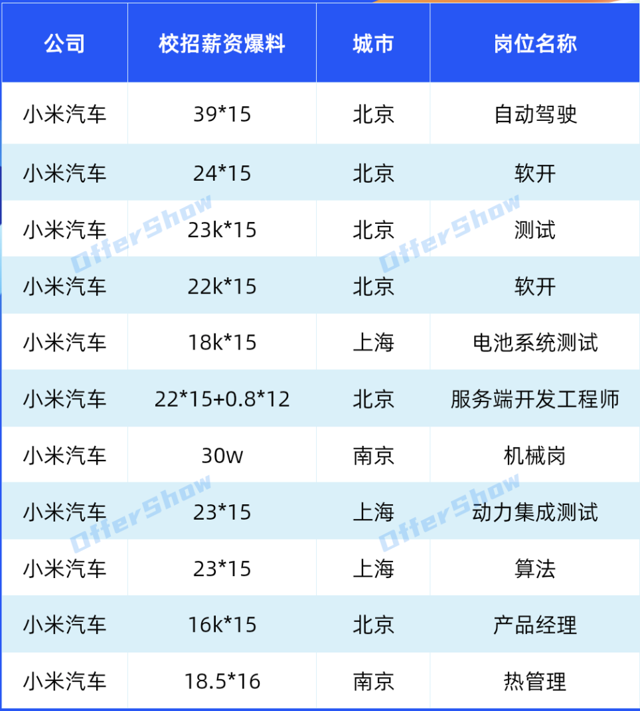

# 往届AIGC算法岗薪资情况汇总

判断一份 AI 岗位 offer，首先要把“岗位做什么”和“收入怎样兑现”讲清楚。大模型算法、Agent 应用开发、AI Infra 和测试开发，对能力的要求、定级方式与收入结构都可能不同；仅凭岗位名称带有 AI，不能推导出稳定的薪资溢价。

本文整理往届算法岗薪资样本，并补充开发、Agent/AI、测试开发的横向比较。**这些数字属于个案自报和区间估计，不是公司官方薪资标准，也不是总体平均数或中位数。** 除明确注明的城市与业务外，样本的具体届次、学历、部门、职级及兑现条件并不完整，不应补写成确定事实。

## 目录

- [一、薪资比较的统一口径](#salary-scope)
- [二、往届 AIGC 与算法岗个案](#salary-history)
- [三、开发、Agent/AI 与测开参考区间](#salary-comparison)
  - [字节跳动](#salary-bytedance)
  - [腾讯](#salary-tencent)
  - [阿里巴巴与蚂蚁集团](#salary-alibaba-ant)
  - [京东](#salary-jd)
  - [美团](#salary-meituan)
  - [百度](#salary-baidu)
  - [快手](#salary-kuaishou)
  - [网易](#salary-netease)
  - [小米](#salary-xiaomi)
  - [滴滴](#salary-didi)
- [四、怎样比较首年收入与持续收入](#salary-offer)
- [五、面向 AIGC 求职的选择原则](#salary-decision)

## 一、薪资比较的统一口径

本次补充的比较信息整理于 **2026 年 9 月**，用于理解往届案例和 2027 届求职时的谈薪范围。**2027 届指毕业届次，不代表表中数字已经在该届统一落地；历史案例与预测区间不能合并解释为已核验的 2027 届 offer。**

| 项目 | 本文口径 | 比较时需要确认 |
|---|---|---|
| 月薪 | `k` 表示千元人民币，按税前名义金额理解 | 工资构成、试用期折扣、是否包含津贴 |
| 月薪 × 计薪月数 | 例如 `30k × 16 = 48 万`，只做算术折算 | 其中多少个月保底、多少依赖绩效，不能一律视为固定收入 |
| 普通档、SP、SSP | 沿用求职交流中的相对档位标签 | 不是跨公司统一职级，也不保证同公司各部门口径一致 |
| 签字费 | 单列金额，默认不计入可持续年收入 | 发放时间、分期、服务期及离职返还条件 |
| 股权 | 股票、限制性股票、期权必须分清 | 授予总额、逐年归属、行权与出售条件、计价时点 |
| 补贴 | 房补、餐补、地方人才补贴等单列 | 资格、期限、税务与是否已计入报价 |
| 城市与业务 | 只保留已明确的案例标签 | 同名岗位在城市、业务、招聘批次之间不可直接互推 |

下文的年化数均以“万元”为单位。**月薪乘以计薪月数只是名义折算，不证明全部兑现，也不等于首个自然年实收。** 入职月份、奖金考核周期、归属期及税费都会影响实际到手金额。

## 二、往届 AIGC 与算法岗个案

以下个案保留具体报价与地点，不推定未知年份、学历或评级。算法岗个案与后文的开发/测开区间属于不同样本，不能因为同一家公司就直接比较高低档。

| 公司 | 岗位 | 薪资样本 | 工作地点 | 折算与待确认项 |
|---|---|---|---|---|
| 字节跳动 | 算法工程师 | `44k × 15 + 签字费` | 北京 | 月薪乘月数为 66 万；签字费金额与发放条件未明确 |
| 小红书 | 算法工程师 | `45k × 16 × 1.18 + 签字费` | 北京 | 算式结果为 84.96 万；`1.18` 的含义未明确，不应直接认定为固定现金或普遍系数 |
| 快手 | 算法工程师 | `43k × 16 + 2 × 12 + 六位数签字费` | 北京 | 月薪乘月数为 68.8 万；`2 × 12` 的单位未注明，若指每月 2k 补贴则另为 2.4 万，需单独确认 |
| 快手 | 搜索算法工程师 | `36k × 16` | 北京 | 名义折算 57.6 万 |
| 美团 | 算法工程师 | `38k × 15.5` | 北京 | 名义折算 58.9 万；小数月通常涉及奖金表达，需确认保底部分 |
| 高德 | 算法工程师 | `42k × 16 + 签字费` | 北京 | 月薪乘月数为 67.2 万；签字费未明确 |
| Momenta | 算法工程师 | `50k × 14，无签字费，无期权` | 苏州 | 名义折算 70 万；“无签字费、无期权”仅描述该个案 |
| 作业帮 | 大模型算法（NLP） | `31k × 15` | 北京 | 名义折算 46.5 万 |
| 百度 | 算法工程师 | `30k × 16` | 北京 | 名义折算 48 万 |

### 小米汽车校招薪资样本

图中信息作为单独样本保留。图示报价不能直接推广为小米集团、汽车业务全部部门或后续届次的统一标准；比较时仍需核对岗位、城市、计薪月数、奖金和股权兑现条件。

## 三、开发、Agent/AI 与测开参考区间

下面按公司归纳三类岗位的名义报价。**各档由不同案例及估计拼成，不是同一学历、城市、业务和届次的严格对照实验。** Agent/AI 列中涉及应用开发、基础设施、推荐工程和模型算法，已尽量拆明；没有明确细分职责的区间，应作为进一步询问的线索。

### 岗位名称与实际工作

| 方向 | 典型工作 | 薪资比较边界 |
|---|---|---|
| 大模型/多模态算法 | 数据、训练、对齐、检索与模型评测 | 研究经历、训练规模、学历和业务稀缺度会影响定级 |
| Agent 应用开发 | 工具调用、工作流、RAG、上下文管理、可观测性 | 常与后端或应用研发体系比较，不能套用高端算法岗个案 |
| AI Infra | 训练与推理平台、分布式、性能、数据基础设施 | 更依赖系统与性能工程能力，不等同于普通 API 集成 |
| 测试开发/AI 测开 | 自动化、质量平台、服务测试、模型与 Agent 评测 | “AI 测开”可能是不同职责组合，需看代码与系统责任范围 |

### 字节跳动

| 方向 | 普通档参考 | SP 参考 | SSP 参考 |
|---|---|---|---|
| 开发（前后端） | `26k × 15`，39 万 | `28–30k × 15`，42–45 万 | `32–38k × 15`，48–57 万；另有 5–9 万签字费 |
| Agent/AI 相关 | `28k × 15`，42 万 | `30–32k × 15`，45–48 万 | `34–36k × 15`，51–54 万；签字费未明确 |
| 测试开发 | `23k × 15`，34.5 万 | `25k × 15`，37.5 万 | 按月薪 28k 理解，`28k × 15` 为 42 万；需确认单位 |

开发个案还包括 `40k × 15 + 10 万签字费`、上海搜索架构 `34k × 15 + 11 万签字费`、成都数据中心平台化开发 `25k × 15`。前两例在签字费全额计入时分别为 70 万、62 万，不能据此推断是普遍可得的档位。杭州后端另有约 50 万总包样本，但构成不明，不拆算月薪。

AI 测开约 25k/月属于估计，不能视为已确认的普遍报价。岗位带有 Agent 或 AI 标签，仍需以实际研发职责、定级和书面 offer 判断。

### 腾讯

| 方向 | 普通档参考 | SP 参考 | SSP 参考 |
|---|---|---|---|
| 开发（前后端） | `27k × 15`，40.5 万；另有 3 万签字费 | `29–33k × 15`，43.5–49.5 万；另有 3–6 万签字费及 4–6 万股票表述 | `35–38k × 15`，52.5–57 万；另有 8 万签字费及 5–10 万股票表述 |
| Agent/AI 相关 | `30k × 15`，45 万，具体职责待确认 | 大模型岗约 70 万总包，构成未明确 | 算法岗 `41–42k × 17`，69.7–71.4 万；另列 20–30 万但构成未明确 |
| 测试开发 | `25k × 15`，37.5 万；另有“2 年股权”表述，金额未明确 | `27k × 15`，40.5 万 | `30k × 15`，45 万；另有 5 万签字费与 6 万股票表述 |

大模型和算法岗的高薪样本，不应作为 Agent 应用开发的默认报价。测试开发普通档案例涉及腾讯云成都，SP 案例涉及北京；城市和业务差异需要与岗位差异一起考虑。

前端另有 `27k × 15 + 5 万签字费` 的样本，腾讯地图相关业务有 `33k × 15` 的样本。开发 SSP 如果额外 5–10 万股票确实是首年归属价值，且 8 万签字费首年全额发放，则端点组合的首年名义合计为 **65.5–75 万**；这一范围只是算术包络，不证明每个端点组合都有实际 offer。股权期限未确认时，不直接把它计入首年现金。

测试开发 SSP 的 `45 + 5 + 6 = 56 万` 同样依赖股票为首年价值、签字费首年全额兑现的前提。算法岗额外 20–30 万的性质不明，应保留“构成待确认”，不能径直归为签字费或年终奖。

### 阿里巴巴与蚂蚁集团

**淘天、阿里其他业务与蚂蚁集团不能合并成一套薪资标准。** 下表中开发普通档有杭州淘天后端案例，其余区间仍需要确认具体业务与用工主体。

| 主体与方向 | 普通档参考 | SP 参考 | SSP 参考 |
|---|---|---|---|
| 阿里相关开发 | `25–26k × 16`，40–41.6 万；另有 1 万签字费 | `29–30k × 16`，46.4–48 万 | `32–35k × 16`，51.2–56 万；另有 3–8 万签字费 |
| 阿里相关 Agent/AI | 缺少可明确归属的普通档样本 | `26–28k × 16`，41.6–44.8 万 | `30k × 16` 及以上，48 万起 |
| 阿里相关测试开发 | `22k × 16`，35.2 万 | `24k × 16`，38.4 万 | `26k × 16`，41.6 万 |
| 蚂蚁集团 Java + AI 后端 | `23k × 15 + 绩效`，34.5 万加未明确部分 | 未明确 | 未明确 |

蚂蚁案例需要进一步核对 `15 薪` 是否已含部分绩效，避免把同一奖金重复相加。地方人才补贴不属于企业固定工资，受学历、毕业时间、落户或参保等条件限制，不应普遍折成“每月多拿 2–4k”。

### 京东

| 方向 | 普通档参考 | SP 参考 | SSP 参考 |
|---|---|---|---|
| 开发（前后端） | `22.4k × 20`，44.8 万 | `26–28k × 20`，52–56 万 | `30–32k × 20`，60–64 万 |
| Agent/AI 相关 | `26k × 18`，46.8 万 | Java + AI 案例 `30k × 18`，54 万 | 端智能研发案例 `28k × 20`，56 万 |
| 测试开发 | `20k × 20`，40 万 | `22k × 20`，44 万 | `24k × 20`，48 万 |

其他开发样本包括前端 `26k × 20`、数据开发 `27–28k × 20`、京东云数据库 `24k × 20`，名义折算分别为 52 万、54–56 万、48 万。

比较京东 offer 时，关键是把“20 薪”中的固定月数、绩效奖金和发放周期拆清楚。不同岗位案例也出现 18 薪，不能统一替换成 20 薪。关于某部门“多数人拿满”的交流信息，不能证明个人奖金保底，更不能外推至全公司。

### 美团

| 方向 | 普通档参考 | SP 参考 | SSP 参考 |
|---|---|---|---|
| 开发（前后端） | `23k × 15.5`，35.65 万 | `25k × 15.5`，38.75 万；另有 5 万签字费 | `30k × 15.5`，46.5 万；另有 8 万签字费与股权 |
| Agent/AI 相关 | `25k × 15.5`，38.75 万 | `27–28k × 15.5`，41.85–43.4 万 | 推荐工程相关样本 `30k × 15.5 + 8 万签字费`，签字费全额计入时为 54.5 万 |
| 测试开发 | `23k × 15.5`，35.65 万 | `25k × 15.5`，38.75 万 | `28k × 15.5`，43.4 万 |

开发 SSP 的 `30k × 15.5 + 8 万` 已经是 **54.5 万**，尚未计入股权，不能再写成 45–50 万总包。上海点评有月薪 30k、签字费 8 万、股票 30 万分四年的个案；只有四年等额归属时才可粗略折为每年 7.5 万的授予价值，实际仍需核对归属表与股价。

普通档开发与测开在上述样本中的月薪相同，不代表所有部门待遇都相同。`15.5 薪` 应确认年终绩效系数与首年折算，业务线相关 AI 岗位也不能直接等同于模型研究岗。

### 百度

| 方向 | 普通档参考 | SP 参考 | SSP 参考 |
|---|---|---|---|
| 开发（前后端） | `22–24k × 16`，35.2–38.4 万 | `25–28k × 16`，40–44.8 万；另有 6–8 万签字费 | `30–32k × 16`，48–51.2 万；另有 9 万签字费 |
| Agent/AI 相关 | `25–26k × 16`，40–41.6 万；涉及智能体业务、AI 基建优化 | `28k × 16`，44.8 万 | 凤巢模型工程样本 `30k × 16`，48 万 |
| 测试开发 | `22k × 16`，35.2 万；另有 6 万签字费 | `25k × 16`，40 万；另有 6 万签字费 | `26k × 16`，41.6 万；另有 8 万签字费 |

开发另有客户端 `22–28k × 16`、C++ `22–26k × 16` 的区间表述。部分签字费案例按两年发放，应按实际合同拆分，不能把全部签字费算作首年到账，也不能认定所有岗位都采用相同规则。

例如测试开发 SSP 报价 `26k × 16 + 8 万签字费`：不考虑折算时，工资与计薪月数部分为 41.6 万；若签字费两年等额发放，首年计入 4 万，则首年名义现金为 **45.6 万**，而不是 49.6 万。比较智能体业务和测开时，应同时看持续收入与签字费到期后的收入。

### 快手

| 方向 | 普通档参考 | SP 参考 | SSP 参考 |
|---|---|---|---|
| 开发（前后端） | `25.5k × 16`，40.8 万 | `27–30k × 16`，43.2–48 万 | `32–35k × 16`，51.2–56 万 |
| Agent/AI 相关 | `27k × 16`，43.2 万 | `28–30k × 16`，44.8–48 万 | `32k × 16`，51.2 万 |
| 测试开发 | 电商案例 `24k × 16 + 2k × 12`，工资部分 38.4 万，补贴 2.4 万 | `27k × 16`，43.2 万 | `30k × 16`，48 万 |

开发另有前端 `32k × 16`、交易支付业务 `30.5k × 16` 的样本，后者工资部分为 48.8 万；有案例另提每月 2k 房补，应核实是否独立发放及是否全年适用。

电商测开普通档含全年补贴时为 40.8 万。房补是否受城市、住址、入职时间或最长发放期限限制，需要逐一确认；实习补贴与正式员工补贴也不能混算。

### 网易

**这组数据的估计成分较高。** 不同游戏、内容和工具业务的奖金结构差异明显，以下档位不能视为已逐一核实的 offer 样本。

| 方向 | 普通档估计 | SP 估计 | SSP 估计 |
|---|---|---|---|
| 开发（前后端） | `22k × 13`，28.6 万 | `25k × 15`，37.5 万 | `28k × 16`，44.8 万 |
| Agent/AI 相关 | `25k × 13`，32.5 万 | `27k × 15`，40.5 万 | `30k × 16`，48 万 |
| 测试开发 | `22k × 15`，33 万 | `24k × 15`，36 万 | `27k × 15`，40.5 万 |

个案中有杭州开发 `28k ×（13–16）` 的表达，折算范围为 36.4–44.8 万。招聘标价、项目奖金说明和个人 offer 是不同类型的信息，不能用其中一种补齐另一种的缺失条件。AI 工作可能涉及美术生成、NPC、语音等，但岗位的实际研发深度和薪资仍需单独确认。

社招涨幅不属于校招薪资口径，不能用极端跳槽涨幅推断应届生待遇。

### 小米

| 方向 | 普通档参考 | SP 参考 | SSP 参考 |
|---|---|---|---|
| 开发（前后端） | 南京、武汉样本 `15–18k × 15`，22.5–27 万 | `21–23k × 15`，31.5–34.5 万 | 北京样本 `26k × 15`，39 万 |
| Agent/AI 相关 | 武汉 AI Infra 案例 `23k × 15`，34.5 万 | `25k × 15`，37.5 万 | 大模型数据处理/Infra 相关案例 `26k × 15`，39 万 |
| 测试开发 | 北京区间表述 `15–18k × 15`，22.5–27 万 | `20k × 15`，30 万 | `25k × 15`，37.5 万 |

开发另有北京软件开发 `20k × 15`、分布式系统开发 `26k × 15` 的案例，分别为 30 万和 39 万。测试开发 SSP 的算术结果是 **37.5 万**，不能写成 33 万。

城市差异和 Infra 岗位职责对比较尤其重要。武汉 AI Infra 个案提及公积金缴存比例 12%，但不能据此认定所有岗位、城市或计缴基数一致；公积金也不应直接加进税前现金工资。

### 滴滴

| 方向 | 普通档参考 | SP 参考 | SSP 参考 |
|---|---|---|---|
| 开发（前后端） | `21–23k × 15`，31.5–34.5 万 | `25–27k × 15`，37.5–40.5 万；另有 3–5 万签字费 | `30–33k × 15`，45–49.5 万 |
| Agent/AI 相关 | `25k × 15`，37.5 万 | `27–28k × 15`，40.5–42 万 | `30k × 15`，45 万 |
| 测试开发 | `21k × 15`，31.5 万 | `25k × 15`，37.5 万 | `27k × 15`，40.5 万 |

开发样本还包括前端 `23–30k × 15`、杭州后端 `26k × 15`、成都国际化外卖 `22k × 16`，名义折算分别为 34.5–45 万、39 万、35.2 万。签字费不是所有案例都有。

测试开发 SP 的 `25k × 15` 应为 **37.5 万**，不能写成 27.5 万。调度、定价、安全等业务中的 AI 岗位，也需要进一步区分算法研发、应用开发与平台工程，不能仅凭公司经营印象判断具体团队的稳定性。

## 四、怎样比较首年收入与持续收入

**首年收入高，可能只是签字费集中；名义总包高，也可能是未归属股权较多。** 建议把每份 offer 拆成三张账：保证现金、目标现金、按年归属的股权。所有项目都按同一观察窗口统计，例如入职后 12 个月，并单独列出第二年及签字费到期后的情况。

| 账目 | 计算方式 | 不能混入的内容 |
|---|---|---|
| 保证现金 | 观察期内合同保证支付的工资、保证奖金及满足条件的固定补贴 | 未承诺绩效、未到账股权、尚未符合资格的人才补贴 |
| 目标现金 | 工资 + 按目标绩效假设的奖金 + 观察期内应发签字费 + 符合条件的补贴 | 全部跨年签字费、重复计入的年终奖 |
| 股权价值 | 按实际归属计划与明确估值假设单列 | 尚未归属的多年授予总额；不可直接把期权面值当现金 |
| 到手与购买力 | 在上述基础上考虑税费、个人缴存及生活成本 | 将税前报价直接视为可支配收入 |

例如 `30k × 15.5 + 8 万签字费 + 30 万股票/4 年`，应先问清：15.5 个月中哪些保底，8 万何时到账，30 万股票怎样归属。只有在完整计薪周期、签字费全额兑现、股权等额归属且估值不变的假设下，才可以算出 46.5 万工资及奖金、8 万签字费、7.5 万股权参考价值，名义合计 62 万。**这个数不是保证现金，更不是到手工资。**

谈薪时可以逐项确认：

1. 月薪由哪些项目组成，保证发多少个月，试用期是否折扣？
2. 超过 12 个月的部分如何与绩效挂钩，入职不足一年怎样折算？
3. 签字费何时发放、分几次，离职或试用期未通过时是否返还？
4. 股票还是期权，授予数量与计价方式是什么，是否存在 cliff、逐年归属或交易限制？
5. 房补和人才补贴是否需申请，有没有期限，是否已经包含在总包中？
6. offer 所属用工主体、城市、部门和实际岗位职责是否与面试时一致？
7. 哪些金额写入正式文件，哪些只是目标值、历史经验或口头预估？

对于无法确认的部分，保留“未知”比自行补齐更有价值。可以分别建立保底、目标绩效和较好绩效三种场景，比较收入波动，而不是只挑最乐观场景谈高低。

## 五、面向 AIGC 求职的选择原则

Rocky认为，AI 求职的长期判断应落在可积累的能力上：能否深入数据和模型，能否把非确定性的生成结果接入可靠业务流程，能否参与评测、部署与线上反馈，而不只是岗位名称是否时髦。

**算法、Agent、Infra 与测开各有能力门槛，不存在只凭名称就成立的固定薪资排序。** 高端算法个案可能受到研究履历、稀缺方向和特别定级影响；应用开发的价值可能来自复杂系统交付；测试开发也可能承担高质量的模型评测与平台工程工作。具体职责比名义分类更值得追问。

选择时把持续收入、团队任务、导师与协作、数据和算力资源、上线责任、工作节奏放在一起比较。单条高薪案例适合用来拓展信息边界，不适合用来断言自己应得的精确报价；关于普遍加班、平均在职时长、裁员概率或必然涨薪的判断，也不能从零散薪资样本中推出。
