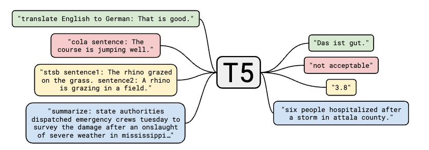

# 目录

## 第一章 【T5：文本编码器】核心基础知识高频考点
- [1.请讲一讲T5模型的原理,以及在视频生成领域的作用](#1.请讲一讲T5模型的原理,以及在视频生成领域的作用)
- [2.T5对原始Transformer做了哪些简化修改（如层归一化位置、位置编码）？这些修改如何影响训练效率和稳定性？](#2.T5对原始Transformer做了哪些简化修改（如层归一化位置、位置编码）？这些修改如何影响训练效率和稳定性？)
- [3.T5的文本到文本框架如何适配多模态任务（如视频描述生成）？需对架构或训练策略做哪些调整？](#3.T5的文本到文本框架如何适配多模态任务（如视频描述生成）？需对架构或训练策略做哪些调整？)
- [4.视频生成中需解决“文本-视频语义对齐”问题，T5如何参与这一过程？关键技术是什么？](#4.视频生成中需解决“文本-视频语义对齐”问题，T5如何参与这一过程？关键技术是什么？)
- [5.视频编辑任务（如“将视频中白天的街道改为夜晚”）中，T5如何辅助实现可控编辑？](#5.视频编辑任务（如“将视频中白天的街道改为夜晚”）中，T5如何辅助实现可控编辑？)
- [6.T5在文本到视频生成（Text-to-Video Generation）中扮演什么角色？其核心优势是什么？](#6.T5在文本到视频生成（Text-to-Video-Generation）中扮演什么角色？其核心优势是什么？)

## 第二章 【CLIP：文本-图像嵌入模型】核心基础知识高频考点

- [1.请讲一讲CLIP模型的原理及其应用场景？](1.请讲一讲CLIP模型的原理及其应用场景？)
- [2.请介绍下什么是对比学习？](#2.请介绍下什么是对比学习？)
- [3.请介绍下对比学习有哪些常见的方法？](#3.请介绍下对比学习有哪些常见的方法？)
- [4.请讲一讲BLIP2模型的原理及其优势？](#4.请讲一讲BLIP2模型的原理及其优势？)
- [5.在BLIP2中的Q-Former作用是什么？](#5.在BLIP2中的Q-Former作用是什么？)
- [6.BLIP2中的Q-Former有什么缺点？](#6.BLIP2中的Q-Former有什么缺点？)

## 第三章 【DDPM：去噪扩散概率模型】核心基础知识高频考点

- [1.请讲一讲DDPM模型的原理及其应用场景？](#1.请讲一讲DDPM模型的原理及其应用场景？)
- [2.DDPM的采样过程是如何实现的？](#2.的采样过程是如何实现的？)
- [3.DDPM在CIFAR10数据集上的表现如何？与其他模型相比有何优势？](#3.DDPM在CIFAR10数据集上的表现如何？与其他模型相比有何优势？)
- [4.DDPM如何扩展到视频生成领域？](#4.DDPM如何扩展到视频生成领域？)

## 第四章 【DDIM：去噪扩散隐式模型】核心基础知识高频考点

- [1.请讲一讲DDIM模型的原理及其应用场景？](#1.请讲一讲DDIM模型的原理及其应用场景？)
- [2.DDIM如何通过非马尔可夫前向过程改进DDPM的采样效率？](#2.DDIM如何通过非马尔可夫前向过程改进DDPM的采样效率？)
- [3.DDIM为何适合视频生成任务？](#3.DDIM为何适合视频生成任务？)
- [4.DDIM如何解决视频生成的累积误差问题？](#4.DDIM如何解决视频生成的累积误差问题？)
- [5.DDIM 在视频生成中的局限性？](#5.DDIM在视频生成中的局限性？)

## 第五章 【LDM(StableDiffusion)】核心基础知识高频考点
- [1.请讲一讲StableDiffusion模型的原理及其应用场景？](1.请讲一讲StableDiffusion模型的原理及其应用场景？)
- [2.请介绍下StableDiffusion和latent-diffusion什么关系？](#2.请介绍下StableDiffusion和latent-diffusion什么关系？)
- [3.LDM如何在感知图像压缩阶段减少计算复杂度？](#3.LDM如何在感知图像压缩阶段减少计算复杂度？)
- [4.LDM在文本条件图像生成任务中如何利用交叉注意力机制？](#4.LDM在文本条件图像生成任务中如何利用交叉注意力机制？)
- [5.请解释StableDiffusion从图像生成扩展到视频生成的核心挑战](#5.请解释StableDiffusion从图像生成扩展到视频生成的核心挑战)
- [6.潜在扩散模型相比像素空间扩散在视频生成中的优势](#6.潜在扩散模型相比像素空间扩散在视频生成中的优势)

## 第六章 【DiT：带Transformer的可扩展扩散模型】核心基础知识高频考点

- [1.位置编码在Transformer中的作用?](#1.位置编码在Transformer中的作用?)
- [2.为什么Transformer适合多模态任务？](#2.为什么Transformer适合多模态任务？)
- [3.Transformer的并行化体现在哪个地方？](#3.Transformer的并行化体现在哪个地方？)
- [4.为什么Transformer一般使用LayerNorm？](#4.为什么Transformer一般使用LayerNorm？)
- [5.Transformer为什么使用多头注意力机制？](#5.Transformer为什么使用多头注意力机制？)
- [6.Transformer训练的Dropout是如何设定的？](#6.Transformer训练的Dropout是如何设定的？)

## 第七章 【FiT：扩散模型灵活视觉Transformer】核心基础知识高频考点

- [1.FiT的核心创新点是什么？它如何解决传统扩散模型在分辨率泛化上的局限性？](#1.FiT的核心创新点是什么？它如何解决传统扩散模型在分辨率泛化上的局限性？)
- [2.FiTv2相比FiT做了哪些关键改进？这些改进如何影响视频生成的潜在应用？](#2.FiTv2相比FiT做了哪些关键改进？这些改进如何影响视频生成的潜在应用？)
- [3.FiTv2的“混合数据预处理”策略是什么？如何通过该策略平衡模型在标准分辨率与外推任务上的性能？](#3.FiTv2的“混合数据预处理”策略是什么？如何通过该策略平衡模型在标准分辨率与外推任务上的性能？)
- [4.如何将FiTv2的思路应用于视频生成？可能面临哪些挑战？](#4.如何将FiTv2的思路应用于视频生成？可能面临哪些挑战？)
  

## 第八章 【Playground：文本转图像生成模型】核心基础知识高频考点
- [1.请讲一讲Playground模型的原理及其应用场景？](#1.请讲一讲Playground模型的原理及其应用场景？)
- [2.Playgroundv2.5在图像生成中通过EDM噪声调度提升色彩表现，若将这一技术迁移到视频生成，可能面临哪些挑战？](#2.Playgroundv2.5在图像生成中通过EDM噪声调度提升色彩表现，若将这一技术迁移到视频生成，可能面临哪些挑战？)
- [3.Playgroundv2.5通过均衡分桶策略优化多比例图像生成，如何将此能力应用于视频生成中的不同分辨率（如16:9横屏vs9:16竖屏）？](#3.Playgroundv2.5通过均衡分桶策略优化多比例图像生成，如何将此能力应用于视频生成中的不同分辨率（如16:9横屏vs9:16竖屏）？)
- [4.Playgroundv2.5通过用户评分迭代优化人脸、手部细节，若用于视频中的人物动作生成，需额外考虑哪些因素？](#4.Playgroundv2.5通过用户评分迭代优化人脸、手部细节，若用于视频中的人物动作生成，需额外考虑哪些因素？)
- [5.Playgroundv2.5提出MJHQ-30K基准评估图像美学质量，如何设计类似的视频生成评估基准？](#5.Playgroundv2.5提出MJHQ-30K基准评估图像美学质量，如何设计类似的视频生成评估基准？)
  

## 第九章 【VAE：变分自编码器】核心基础知识高频考点
- [1.VAE的基本原理是什么？它与标准自编码器有何本质区别？](#1.VAE的基本原理是什么？它与标准自编码器有何本质区别？)
- [2.将VAE直接应用于视频生成会遇到哪些主要挑战？](#2.将VAE直接应用于视频生成会遇到哪些主要挑战？)

## 第十章 【VideoGPT： 利用 VQ-VAE 和Transformer生成视频】核心基础知识高频考点
- [1.请讲一讲VideoGPT模型的原理及其应用场景？](#1.请讲一讲VideoGPT模型的原理及其应用场景？)
- [2.VideoGPT在处理视频生成任务时，为什么选择了基于自回归模型的架构，而不是直接在全像素空间进行自回归建模？](#2.VideoGPT在处理视频生成任务时，为什么选择了基于自回归模型的架构，而不是直接在全像素空间进行自回归建模？)
- [3.VideoGPT的消融研究揭示了哪些关键设计选择对模型性能的影响？](#3.VideoGPT的消融研究揭示了哪些关键设计选择对模型性能的影响？)

## 第十一章 【ShareGPT4Video：通过更好的字幕提升视频理解和生成】核心基础知识高频考点
- [1.请讲一讲ShareGPT4Video模型的原理及其应用场景？](#1.请讲一讲ShareGPT4Video模型的原理及其应用场景？)
- [2.ShareCaptioner-Video模型在视频字幕生成方面有哪些独特功能？其性能如何？](#2.ShareCaptioner-Video模型在视频字幕生成方面有哪些独特功能？其性能如何？)
- [3.请解释DiffSW（差分滑动窗口描述策略）的核心思想及其创新点](#3.请解释DiffSW（差分滑动窗口描述策略）的核心思想及其创新点)
- [4.与传统方法相比，ShareGPT4Video在视频描述生成方面有哪些重要改进？](#4.与传统方法相比，ShareGPT4Video在视频描述生成方面有哪些重要改进？)
- [5.ShareCaptioner-Video模型具备哪四种能力？各自的应用场景是什么？](#5.ShareCaptioner-Video模型具备哪四种能力？各自的应用场景是什么？)

## 第十二章 【EMA-VFI：一种视频帧插值模型】核心基础知识高频考点
- [1.请讲一讲EMA-VFI模型的原理及其应用场景？](#1.请讲一讲EMA-VFI模型的原理及其应用场景？)
- [2.EMA-VFI提出的帧间注意力（IFA）机制是如何具体实现运动和外观信息的提取的？](#2.EMA-VFI提出的帧间注意力（IFA）机制是如何具体实现运动和外观信息的提取的？)
- [3.EMA-VFI提到的混合CNN和Transformer架构是如何克服高分辨率输入下帧间注意力的计算开销的？](#3.EMA-VFI提到的混合CNN和Transformer架构是如何克服高分辨率输入下帧间注意力的计算开销的？)

---

## 第一章 【T5：文本编码器】核心基础知识高频考点
<h2 id="1.请讲一讲T5模型的原理,以及在视频生成领域的作用">1.请讲一讲T5模型的原理,以及在视频生成领域的作用</h2>

T5（Text-to-Text Transfer Transformer）采用统一的文本到文本框架，将各类自然语言处理任务（如翻译、分类、摘要）均转化为文本生成任务。

**其核心创新包括：**
- 任务统一化：通过添加任务前缀（如"translate:"、"summarize:"）将不同任务映射为相同输入-输出格式
- Encoder-Decoder架构：基于标准Transformer结构，使用编码器理解输入文本，解码器生成目标文本
- Span Corruption预训练：通过随机掩码连续文本片段并训练模型重构内容，提升语言建模能力

**在视频生成领域的作用**,T5在视频生成中主要承担语义解析与控制信号生成的关键角色：

- **文本-视频语义对齐​**
  - 将用户文本描述（如“日落时分的海滩”）解析为结构化视觉特征
  - 通过跨模态注意力机制对齐文本与视频潜空间表示

- **条件生成控制​**
  - 作为视频生成模型的控制模块，将文本指令转换为时空特征信号
  - 示例：输入“奔跑的马” → 输出动作轨迹、场景布局等控制参数

- **视频编辑支持​**
  - 解析编辑指令（如“将白天场景改为夜晚”）
  - 生成局部修改掩码和内容替换指导信号

总结：T5通过文本到文本的通用框架为视频生成提供了可靠的语义理解基础，是实现文本驱动视频生成的关键技术桥梁，但其在复杂场景下的精细化控制仍需进一步优化。

<h2 id="2.T5对原始Transformer做了哪些简化修改（如层归一化位置、位置编码）？这些修改如何影响训练效率和稳定性？">2.T5对原始Transformer做了哪些简化修改（如层归一化位置、位置编码）？这些修改如何影响训练效率和稳定性？</h2>

**T5的架构调整包括：**
1. 层归一化（LayerNorm）位置：
原始Transformer：LayerNorm在残差连接和激活函数之后。
T5调整：LayerNorm置于残差连接之前（Pre-Norm），提升训练稳定性（梯度流动更顺畅）。
1. 位置编码：
使用相对位置编码（Relative Position Embeddings）而非绝对位置编码：每个注意力头学习一组标量，根据查询-键的相对位置偏移调整注意力logits。
优势：更好地处理长序列，泛化到训练未见长度。
1. 简化偏置项：移除LayerNorm中的偏置参数和部分线性层的偏置，减少冗余参数。

**影响：**
- 训练效率：Pre-Norm允许使用更大学习率，加速收敛；相对位置编码减少外推偏差。
- 稳定性：简化设计降低过拟合风险，论文中T5-Base在GLUE上标准差仅0.235。

<h2 id="3.T5的文本到文本框架如何适配多模态任务（如视频描述生成）？需对架构或训练策略做哪些调整？">3.T5的文本到文本框架如何适配多模态任务（如视频描述生成）？需对架构或训练策略做哪些调整？</h2>

**适配多模态任务的扩展方案：**
1. 输入适配：
- 视频表示为帧序列+文本描述，通过线性投影将视频特征映射为令牌序列，与文本令牌拼接为统一输入。
- 例：输入："video caption: <frame_1> ... <frame_n> text: A person is running."
2. 架构调整：
- 在Encoder中增加跨模态注意力层，使文本令牌与视频令牌交互。
- 参考VilBERT/LXMERT，但保留T5的Decoder用于生成输出。
3. 训练策略：
- 预训练：使用视频-文本对（如HowTo100M）进行Span Corruption（掩码部分文本或视频特征）。
- 微调：任务前缀改为多模态指令（如"video QA: [video] Q: What is the person doing?"）。

**挑战：**
- 计算成本：视频数据维度高，需设计高效稀疏注意力机制。
- 模态对齐：需强化视频与文本的语义对齐损失（如对比学习）。

<h2 id="4.视频生成中需解决“文本-视频语义对齐”问题，T5如何参与这一过程？关键技术是什么？">4.视频生成中需解决“文本-视频语义对齐”问题，T5如何参与这一过程？关键技术是什么？</h2>

文本-视频语义对齐需确保生成的视频内容与文本描述的语义一致（如“红色跑车在盘山公路漂移”不能出现蓝色车辆或直行场景）。

T5通过两方面参与：① 文本侧语义解构：利用预训练的Span Corruption和Encoder-Decoder架构，将文本拆解为细粒度语义单元（如“红色跑车”→颜色+主体，“盘山公路漂移”→场景+动作+动态），输出结构化的语义嵌入；② 跨模态特征融合：通过跨模态注意力机制（如Cross-Attention），将T5的文本嵌入与视频生成模型的视觉特征（如帧级CNN特征、时空Transformer特征）在潜空间对齐，约束视觉生成过程贴合文本语义。

关键技术包括任务前缀引导的特征聚焦（如添加“video control: ”前缀强化生成导向）、对比学习增强对齐（拉近文本-正样本视频对的特征距离，推远负样本对）。

<h2 id="5.视频编辑任务（如“将视频中白天的街道改为夜晚”）中，T5如何辅助实现可控编辑？">5.视频编辑任务（如“将视频中白天的街道改为夜晚”）中，T5如何辅助实现可控编辑？</h2>

T5在视频编辑中负责编辑指令解析与局部控制生成：

首先解析用户指令的编辑意图（“改时间”）、目标属性（“夜晚”）及作用范围（“街道”）；

然后通过语义匹配定位原视频中与“街道”“白天”相关的视觉区域（如天空、建筑光照特征）；

最后生成编辑控制信号，包括：① 局部掩码（标记需修改的像素区域），② 属性替换特征（如夜晚的低照度、暖色调、灯光分布），③ 时序一致性约束（确保多帧修改后的光照渐变自然）。

例如，T5可将“白天→夜晚”解析为“光照强度降低60%+色温偏黄+添加路灯光斑”，指导视频编辑模型仅修改指定区域的光照属性，避免全局失真。

<h2 id="6.T5在文本到视频生成（Text-to-Video Generation）中扮演什么角色？其核心优势是什么？">6.T5在文本到视频生成（Text-to-Video Generation）中扮演什么角色？其核心优势是什么？</h2>

**T5在文本到视频生成中承担语义解析与控制信号生成的核心角色**：首先将用户输入的自然语言指令（如“一只橘猫在雪地追逐蝴蝶”）解析为结构化的语义特征（包含主体、动作、场景、时序关系等），再通过跨模态对齐将这些特征转换为视频生成模型（如扩散模型、GAN）可理解的时空控制信号（如物体运动轨迹、背景动态、光影变化）。

**其核心优势在于**强大的语义理解与指令遵循能力——依托大规模预训练的Text-to-Text框架，能精准捕捉复杂指令的细节（如“慢动作”“逆光”），并通过零样本迁移适配未见过的场景组合，为视频生成提供可靠的高层语义指导，避免生成内容与文本脱节。

## 第二章 【CLIP：文本-图像嵌入模型】核心基础知识高频考点
<h2 id="1.请讲一讲CLIP模型的原理及其应用场景？">1.请讲一讲CLIP模型的原理及其应用场景？</h2>

**CLIP模型**是一种多模态模型，能够通过**对比学习**同时理解图像和文本。‌ 该模型由两个子模块组成：**一个文本编码器和一个图像编码器**，
通过**对比学习将图像和文本的特征对齐**，从而在同一个向量空间中进行匹配。

CLIP的核心思想是将**图像和文本编码到同一个向量空间中**，这使得它能够进行**文本与图像的跨模态检索**。

**在预训练阶段**，CLIP通过对比图像和文本的向量表示，学习它们之间的匹配关系。模型接收一批图像-文本对作为输入，
尝试将匹配的图像和文本向量在共同的语义空间中拉近，而不匹配的向量则推远。这种学习方式使得CLIP能够捕捉到图像和文本之间的深层语义联系，
实现**跨模态理解**。

CLIP的应用场景非常广泛，包括**零样本学习、图像分类、文本-图像检索、文本到图像生成以及开放领域的检测分割**等任务。

<h2 id="2.请介绍下什么是对比学习？">2.请介绍下什么是对比学习？</h2>

**对比学习（Contrastive Learning）** 是一种基于样本之间相似性和差异性的无监督或自监督学习方法，旨在通过构建**正负样本对**来学习数据的有效表示。
对比学习广泛应用于**自然语言处理（NLP）、计算机视觉（CV）等领域，尤其在表征学习（Representation Learning）** 中表现出色。
通过对比正例和负例，模型能够学习到不同样本之间的相似性和差异性，从而生成更具区分性的特征表示。

**核心思想：**

通过样本之间的相似性和差异性来训练模型。它通过引入正例和负例，希望模型能够将正例样本对（即相似的样本对）的嵌入距离拉近，
同时将负例样本对（即不相似的样本对）的嵌入距离拉远，即**最小化类内距离，最大化类间距离**。

**对比学习的目标函数：**
对比学习的目标是**最小化类内距离，最大化类间距离**。其基本目标函数可以表示为：

$$
L = \sum_{(x_i, x_{j+}) \in P} \|f(x_i) - f(x_{j+})\|^2_2 - \sum_{(x_i, x_{j-}) \in N} \|f(x_i) - f(x_{j-})\|^2_2
$$

其中：

$x_i$ 是样本 $i$ ，$x_{j^+}$ 是与 $x_i$ 相似的正例样本，$x_{j^-}$ 是与 $x_i$ 不相似的负例样本。

$f(x)$ 是模型的嵌入函数，它将样本 $x$ 映射到一个低维向量空间。

$\mathcal{P}$ 和 $\mathcal{N}$ 分别是正例对和负例对的集合。

通过最小化这个目标函数，模型可以学习到在嵌入空间中相似的样本靠得更近，而不相似的样本被推得更远。

<h2 id="3.请介绍下对比学习有哪些常见的方法？">3.请介绍下对比学习有哪些常见的方法？</h2>

**SimCLR:** 一种用于自监督表征学习的对比学习方法，主要用于计算机视觉任务。SimCLR 通过数据增强生成正例对，并使用对比损失函数来最大化正样本对的相似度，
同时最小化负样本对的相似度。

**SimCLR 的主要步骤包括：**

- 数据增强：对同一张图片进行不同的数据增强（如翻转、裁剪、颜色变化），生成两张不同的视角，构成正例对。
- 特征提取：通过神经网络（如 ResNet）对两张增强后的图片进行编码，生成嵌入向量。
- 对比损失：通过对比损失函数（如 InfoNCE），最大化正例对的相似度，最小化负例对的相似度。

SimCLR 的损失函数（InfoNCE 损失）：

    

其中：
- $z_i$ 和 $z_{j^+}$ 是正例对的嵌入表示。

- $\text{sim}(z_i, z_j)$ 是嵌入向量之间的相似度，通常使用余弦相似度。

- $\tau$ 是一个温度超参数。

**MoCo（Momentum Contrast for Unsupervised Visual Representation Learning）** 是另一种用于自监督学习的对比学习方法。
MoCo 使用一个动态更新的队列来存储负例，从而提高对比学习在大规模数据集上的效率。

**MoCo 的核心思想**是使用一个动量编码器（momentum encoder）生成稳定的负例，并通过一个动态队列保存大量负例样本，确保训练过程中的负例样本丰富多样。

**Triplet Loss** 是一种经典的对比学习损失函数，通常用于人脸识别等任务。Triplet Loss 使用三个样本构建一个样本三元组(anchor,positive,negative)，其中：

- **Anchor**：参考样本。
- **Positive**：与 Anchor 类似的样本。
- **Negative**：与 Anchor 不相似的样本。

Triplet Loss 的目标是让 Anchor 和 Positive 的距离比 Anchor 和 Negative 的距离更近：

    

其中，$x_a$、$x_p$ 和 $x_n$ 分别是 Anchor、Positive 和 Negative 样本，$\alpha$ 是一个边界值。

<h2 id="4.请讲一讲BLIP2模型的原理及其优势？">4.请讲一讲BLIP2模型的原理及其优势？</h2>

BLIP-2模型是一种创新的视觉-语言预训练模型，通过结合**冻结的图像编码器和大语言模型**，降低了预训练成本，提高了视觉语言任务的性能‌‌。
BLIP-2采用两阶段预训练策略：第一阶段学习视觉语言表示，第二阶段进行视觉到语言的生成学习‌。

**模型结构：**

BLIP-2的核心是Q-Former，这是一个轻量级的变换器模块，用于从视觉特征中提取与语言相关的多模态嵌入。Q-Former由两个Transformer子模块组成，
分别用于图像特征提取和文本处理‌。图像特征提取使用ViT（Vision Transformer），而文本处理则通过一个既可以作为编码器也可以作为解码器的Transformer实现‌。

**BLIP-2的预训练任务包括以下三个目标：**

- 图文匹配（ITM）‌：这是一个分类任务，判断图像和文本描述是否匹配。通过在一个batch内寻找负样本，进行二分类‌。
- ‌图像-文本对比学习（ITC）‌：将图像表示和文本表示对齐，使它们的互信息达到最大‌。
- 语言建模‌：通过大型语言模型进行语言生成任务，如文本生成或问答任务‌。

**创新点和优势：**

BLIP-2的创新点在于其模块化设计，使得模型可以复用现有的强大视觉模型（如CLIP、ViT）和语言模型（如GPT、OPT），无需端到端联合训练，
从而大大降低了开发和训练成本‌。此外，BLIP-2通过冻结图像编码器和大型语言模型，仅训练投影层，进一步减少了计算成本‌。

<h2 id="5.在BLIP2中的Q-Former作用是什么？">5.在BLIP2中的Q-Former作用是什么？</h2>

BLIP2中的Q-Former的主要作用是融合视觉语义和LLM（大语言模型）的能力‌。

Q-Former是一个轻量级的transformer，它使用一个可学习的query向量集，从冻结的视觉模型提取视觉特征。

Q-Former的设计是为了解决视觉语义向量和LLM融合的挑战。

<h2 id="6.BLIP2中的Q-Former有什么缺点？">6.BLIP2中的Q-Former有什么缺点？</h2>

BLIP2的Q-Former结构的主要缺点包括**参数量庞大、收敛过程缓慢以及性能提升不显著‌**。具体来说：
- **参数量庞大‌**：Q-Former模型的参数量超过100百万，这使得模型在有限的数据量下难以实现有效训练‌。庞大的参数集使得模型训练过程更加复杂和耗时。
- **收敛过程缓慢**‌：Q-Former的训练具有一定的挑战性，因为它引入了大量的参数，这些参数在样本量有限的情况下难以有效收敛。即使在数据和计算资源都很充裕的情况下，Q-Former的性能提升也并不显著‌。
- **性能提升不显著‌**：即使在数据量充足的情况下，Q-Former的性能上限也未能显著超越LLaVA-1.5的性能表现。

## 第三章 【DDPM：去噪扩散概率模型】核心基础知识高频考点

## 第四章 【DDIM：去噪扩散隐式模型】核心基础知识高频考点

## 第五章 【StableDiffusion】核心基础知识高频考点

<h2 id="1.请讲一讲StableDiffusion模型的原理及其应用场景？">1.请讲一讲StableDiffusion模型的原理及其应用场景？</h2>

<h2 id="2.请介绍下StableDiffusion和latent-diffusion什么关系？">2.请介绍下StableDiffusion和latent-diffusion什么关系？</h2>

**Stable Diffusion 是 Latent Diffusion 模型的一种具体实现和最有名的代表**。它们的关系可以理解为“实作与理论”，或者“具体产品与底层技术框架”的关系。

**Latent Diffusion**：是一种高效的模型架构思想。它不直接在原始像素空间进行扩散，而是先将图像通过一个变分自编码器（VAE）压缩到维度更小的“潜空间”进行处理，从而大幅降低计算成本。

**Stable Diffusion**：是由Stability AI等团队基于上述Latent Diffusion架构开发并开源的具体模型。它由UNet（在潜空间去噪）、VAE（图像与潜空间互转）和 Text Encoder（理解文本）三大核心组件构成。

## 第六章 【DiT：带Transformer的可扩展扩散模型】核心基础知识高频考点

<h2 id="1.位置编码在Transformer中的作用?">1.位置编码在Transformer中的作用?</h2>

**提供位置信息**‌：位置编码为序列中的每个元素提供其在序列中的位置信息，使得模型能够识别和区分序列中不同位置的元素。

**增强模型表达能力**‌：加入位置编码后，模型能够同时关注到序列中元素的相对位置和全局上下文信息，这对于处理长距离依赖和全局信息非常重要。

解决Transformer模型的局限性‌：Transformer模型在处理序列数据时，原本无法直接获取元素的顺序信息。位置编码通过为每个位置分配一个独特的向量表示，
解决了这一问题，使得模型能够理解序列中元素的相对和绝对位置关系。

分类‌：位置编码可以分为绝对位置编码和相对位置编码。绝对位置编码为序列中的每个位置分配一个唯一的编码，直接反映元素在序列中的绝对位置；
而相对位置编码则关注于元素之间的相对位置关系。

<h2 id="2.为什么Transformer适合多模态任务？">2.为什么Transformer适合多模态任务？</h2>

**Transformer的灵活性和强大的表征能力**使其适合多模态任务。它可以通过**共享参数和跨模态注意力机制**来整合不同模态的信息，从而实现更高效的特征学习和融合。

<h2 id="3.Transformer的并行化体现在哪个地方？">3.Transformer的并行化体现在哪个地方？</h2>

Transformer的并行化主要体现在**自注意力机制和前馈神经网络的计算过程中**。自注意力机制可以并行计算查询、键和值之间的相似度，而前馈神经网络也可以并行处理输入数据。

<h2 id="4.为什么Transformer一般使用LayerNorm？">4.为什么Transformer一般使用LayerNorm？</h2>

LayerNorm在每个样本的所有特征上进行归一化，使得模型在小批次或在线学习中表现更好，且不受批次大小的影响。它有助于稳定训练过程，加速收敛。

<h2 id="5.Transformer为什么使用多头注意力机制？">5.Transformer为什么使用多头注意力机制？</h2>

多头注意力机制允许模型同时关注输入序列的不同部分，从而捕捉到更丰富的上下文信息。通过多个注意力头的组合，模型可以学习到不同的表征子空间，提高泛化能力。

<h2 id="6.Transformer训练的Dropout是如何设定的？">6.Transformer训练的Dropout是如何设定的？</h2>

Dropout是一种正则化技术，用于防止过拟合。在Transformer中，Dropout通常应用于自注意力机制和前馈神经网络的中间层。
具体的Dropout比率可以根据任务和数据集进行调整，常见的比率在0.1到0.3之间。