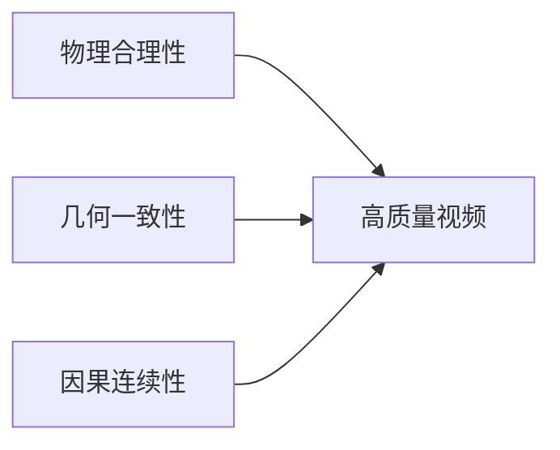

# 📺 第一章：AI视频核心基础知识

> 💡 **本节目的**：系统梳理 AI视频领域的核心概念、关键技术与时事热点，帮助面试者建立完整的知识体系框架。

---

## 📑 目录导航

- [1.视频 vs 图像：视频建模到底多了什么？](#1.视频vs图像：视频建模到底多了什么？)
- [2.视频的时空属性：Temporal / Spatial / Motion](#2.视频的时空属性：Temporal/Spatial/Motion)
- [3.帧、帧率、时长、分辨率与码率的基本概念](#3.帧帧率时长分辨率与码率的基本概念)
- [4.视频任务全景：生成 / 编辑 / 理解的边界与联系](#4.视频任务全景生成--编辑--理解的边界与联系)
- [5.视频中的运动表征：光流、轨迹、帧差与隐式运动](#5.视频中的运动表征光流轨迹帧差与隐式运动)
- [6.视频时序建模的核心难点：长程依赖、一致性与漂移](#6.视频时序建模的核心难点长程依赖一致性与漂移)
- [7.视频表示学习：逐帧表征、3D表征、时空联合表征](#7.视频表示学习、逐帧表征、3d表征、时空联合表征)
- [8.视频中的一致性问题：内容一致性、身份一致性、运动一致性](#8.视频中的一致性问题内容一致性身份一致性运动一致性)
- [9.视频生成中的"世界约束"：物理合理性、几何一致性与因果连续性](#9.视频生成中的世界约束物理合理性几何一致性与因果连续性)

---

<h1 id="1.视频 vs 图像视频建模到底多了什么?">1.视频vs图像视频建模到底多了什么?</h1>

> 🎯 **考察重点**：考察对 **T 维度（时间轴）** 的处理能力

### ❓ 核心问题

## 面试问题1：为什么视频任务通常比图像任务更难？

**难度评分：⭐⭐⭐ (3/5)  |  考察频率：⭐⭐⭐⭐⭐ (5/5)**

视频任务比图像任务更难，核心原因是：**视频不是单帧空间建模，而是时空联合建模。**

相比图像，视频主要多了以下几个难点：

1. **多了时间维度**：模型不仅要看懂当前帧，还要理解前后帧之间的时序关系。
2. **多了运动建模**：视频里存在目标运动、相机运动、遮挡变化等动态信息，建模难度更高。
3. **更强调一致性**：单帧生成得好还不够，还要保证跨帧内容一致、身份一致、运动连续，否则就容易出现闪烁和漂移。
4. **计算和数据成本更高**：视频序列更长、数据量更大，训练和推理都比图像更耗显存和算力。

另外，很多视频任务还涉及**长程依赖**，也就是模型不仅要看相邻几帧，还要记住更早之前出现的人物、场景和动作状态，这会进一步增加建模难度。

所以可以概括为一句话：**图像任务主要解决“这一帧是什么”，而视频任务还要解决“它如何变化、变化是否合理、前后是否一致”。**

## 面试问题2：视频数据在深度学习中的常见 Tensor 表示形状是什么？各维度代表什么？

**难度评分：⭐⭐ (2/5)  |  考察频率：⭐⭐⭐⭐ (4/5)**

视频在深度学习里常见的 Tensor 形状是 **[B, T, C, H, W]** 或 **[B, C, T, H, W]**，不同框架习惯不同，但含义一致：

- **B**：batch size，表示一批样本数
- **T**：时间维度，表示视频帧数
- **C**：通道数，比如 RGB 一般是 3
- **H / W**：帧的高和宽

如果是图像，常见形状通常只有 **[B, C, H, W]**，所以视频本质上就是在图像基础上多了一个 **T 维度**。

这个 T 维度非常关键，因为它不只是“多几帧数据”这么简单，而是意味着模型要额外处理**帧间关系、运动变化和时序依赖**。很多 3D CNN、Video Transformer、视频扩散模型，本质上都是围绕这个时间维度展开建模。

## 面试问题3：什么是"隐空间视频表示"（Video Latent Representation）？

**难度评分：⭐⭐⭐⭐ (4/5)  |  考察频率：⭐⭐⭐⭐ (4/5)**

隐空间视频表示指的是：**先把原始视频压缩映射到一个更低维、更紧凑的特征空间，再在这个空间里做建模、生成或编辑。**

这样做的好处主要有两个：

1. **降低计算成本**：直接在像素空间处理视频太重，latent space 更省显存和算力。
2. **保留高层语义**：隐空间通常保留了内容、结构、运动等关键信息，更适合生成模型学习。

在视频生成里，可以把它理解为：**不是直接生成每个像素，而是先生成视频的紧凑语义表示，再解码回像素视频。**

这和图像生成里先进入 latent space 再建模是一个思路，只不过视频 latent 不仅要表示空间内容，还要尽量保留**时序和运动信息**。因此视频 latent 的设计通常会直接影响生成质量、时序一致性和计算效率。

## 面试问题4：能不能把视频简单看成很多张图片？

**难度评分：⭐⭐ (2/5)  |  考察频率：⭐⭐⭐⭐⭐ (5/5)**

**不能完全这么看。**

视频从数据形式上确实可以看成一组连续帧，但从建模角度看，视频比“很多张图片”多了三件关键事情：

1. **时序关系**：前后帧之间是有关联的，不是独立样本。
2. **运动信息**：视频的核心不是静态内容，而是内容如何变化。
3. **跨帧一致性**：人物、场景、动作要在连续帧中保持连贯。

如果只是把视频拆成很多图像独立处理，往往会出现一个典型问题：**单帧看起来都不错，但拼起来不连贯。** 比如人物身份变化、背景跳动、动作不自然，这本质上都是忽略时序信息造成的。

所以更准确的说法是：**视频可以表示成多张图片的序列，但不能用纯图像思路独立处理每一帧。**

---

<h1 id="2.视频的时空属性 temporal-spatial-motion">2.视频的时空属性 temporal-spatial-motion</h1>

> 🎯 **考察重点**：考察对视频**三维本质（空间 + 时间 + 运动）**的理解

### 🔑 关键概念
- **Spatial（空间）**：单帧内的视觉信息
- **Temporal（时间）**：帧与帧之间的时序关系
- **Motion（运动）**：随时间变化的动态模式

### ❓ 核心问题

## 面试问题1：AI视频里常说的 spatial、temporal、motion 分别指什么？

**难度评分：⭐⭐ (2/5)  |  考察频率：⭐⭐⭐⭐⭐ (5/5)**

## 面试问题2：Temporal 和 Motion 是一回事吗？

**难度评分：⭐⭐⭐ (3/5)  |  考察频率：⭐⭐⭐⭐ (4/5)**

---

<h1 id="3.帧帧率时长分辨率与码率的基本概念">3.帧帧率时长分辨率与码率的基本概念</h1>

> 🎯 **考察重点**：考察对视频**基础参数及其对建模影响**的理解

### 🔑 关键参数
| 参数 | 符号 | 单位 | 影响 |
|-----|------|-----|------|
| 帧率 | FPS | frames/s | 流畅度、数据量 |
| 分辨率 | W×H | pixels | 细节、计算量 |
| 时长 | T | seconds | 序列长度 |
| 码率 | Bitrate | Mbps | 压缩质量 |

### ❓ 核心问题

## 面试问题1：帧率（FPS）对视频建模有什么影响？

**难度评分：⭐⭐⭐ (3/5)  |  考察频率：⭐⭐⭐⭐ (4/5)**

## 面试问题2：分辨率和码率有什么区别？

**难度评分：⭐⭐ (2/5)  |  考察频率：⭐⭐⭐⭐ (4/5)**

## 面试问题3：为什么视频任务里经常要做采样？

**难度评分：⭐⭐⭐ (3/5)  |  考察频率：⭐⭐⭐⭐⭐ (5/5)**

---

<h1 id="4.视频任务全景生成编辑理解的边界与联系">4.视频任务全景生成编辑理解的边界与联系</h1>

> 🎯 **考察重点**：考察对**视频任务分类体系与技术边界**的认知

### 🔑 任务分类
```
┌─────────────────────────────────────┐
│         视频任务全景图              │
├──────────┬──────────┬──────────────┤
│ 视频生成  │ 视频编辑  │  视频理解    │
│ (Generation)│(Editing) │ (Understanding)│
└──────────┴──────────┴──────────────┘
```

### ❓ 核心问题

## 面试问题1：视频生成、视频编辑、视频理解三者有什么区别？

**难度评分：⭐⭐⭐ (3/5)  |  考察频率：⭐⭐⭐⭐⭐ (5/5)**

## 面试问题2：视频编辑为什么通常比图像编辑更难？

**难度评分：⭐⭐⭐⭐ (4/5)  |  考察频率：⭐⭐⭐⭐ (4/5)**

---

<h1 id="5.视频中的运动表征光流轨迹帧差与隐式运动">5.视频中的运动表征光流轨迹帧差与隐式运动</h1>

> 🎯 **考察重点**：考察对运动中**显式与隐式表征方法**的掌握

### 🔑 运动表征对比
| 表征方式 | 类型 | 计算成本 | 应用场景 |
|---------|------|---------|---------|
| 光流 (Optical Flow) | 显式 | 高 | 精细运动分析 |
| 轨迹 (Trajectory) | 显式 | 中 | 长时序跟踪 |
| 帧差 (Frame Difference) | 显式 | 低 | 快速运动检测 |
| 隐式运动 (Implicit) | 隐式 | 中 - 高 | 端到端生成 |

### ❓ 核心问题

## 面试问题1：什么是光流？它反映了什么？在视频算法中起什么作用？

**难度评分：⭐⭐⭐ (3/5)  |  考察频率：⭐⭐⭐⭐⭐ (5/5)**

## 面试问题2：光流、帧差、目标轨迹有什么区别？

**难度评分：⭐⭐⭐⭐ (4/5)  |  考察频率：⭐⭐⭐⭐ (4/5)**

## 面试问题3：现在很多生成模型不显式用光流，为什么还能生成运动？

**难度评分：⭐⭐⭐⭐ (4/5)  |  考察频率：⭐⭐⭐ (3/5)**

## 面试问题4：视频生成中的"闪烁（Flickering）"和"伪影（Artifacts）"通常是由什么引起的？

**难度评分：⭐⭐⭐⭐ (4/5)  |  考察频率：⭐⭐⭐⭐ (4/5)**

---

<h1 id="6.视频时序建模的核心难点长程依赖一致性与漂移">6.视频时序建模的核心难点长程依赖一致性与漂移</h1>

> 🎯 **考察重点**：考察对**时序建模核心挑战与解决方案**的理解

### 🔑 三大难点
1. **长程依赖 (Long-range Dependency)**：远距离帧之间的关联建模
2. **一致性 (Consistency)**：时序上的稳定性保持
3. **漂移 (Drift)**：误差累积导致的偏离

### ❓ 核心问题

## 面试问题1：什么叫视频中的长程依赖？

**难度评分：⭐⭐⭐ (3/5)  |  考察频率：⭐⭐⭐⭐ (4/5)**

## 面试问题2：视频任务里为什么容易出现漂移（drift）？

**难度评分：⭐⭐⭐ (3/5)  |  考察频率：⭐⭐⭐⭐ (4/5)**

## 面试问题3：什么是视频中的时序一致性？

**难度评分：⭐⭐⭐ (3/5)  |  考察频率：⭐⭐⭐⭐⭐ (5/5)**

---

<h1 id="7.视频表示学习、逐帧表征、3d表征、时空联合表征">7.视频表示学习、逐帧表征、3d表征、时空联合表征</h1>

> 🎯 **考察重点**：考察对不同**视频表征范式及其适用场景**的理解

### 🔑 表征方法演进
```
逐帧表征 → 3D表征 → 时空联合表征
(Frame-wise)  (3D CNN)  (Transformer)
```

### ❓ 核心问题

## 面试问题1：视频表示学习和图像表示学习最大的不同是什么？

**难度评分：⭐⭐⭐ (3/5)  |  考察频率：⭐⭐⭐⭐ (4/5)**

## 面试问题2：什么是逐帧建模？什么是时空联合建模？

**难度评分：⭐⭐⭐ (3/5)  |  考察频率：⭐⭐⭐⭐⭐ (5/5)**

## 面试问题3：视频 - 文本对齐（Video-Text Alignment）与图像 - 文本对齐（Image-Text）最大的区别在哪？

**难度评分：⭐⭐⭐⭐ (4/5)  |  考察频率：⭐⭐⭐ (3/5)**

## 面试问题4：什么是"时空 Patch"（Space-Time Patches）？

**难度评分：⭐⭐⭐⭐ (4/5)  |  考察频率：⭐⭐⭐ (3/5)**

---

<h1 id="8.视频中的一致性问题内容一致性身份一致性运动一致性">8.视频中的一致性问题内容一致性身份一致性运动一致性</h1>

> 🎯 **考察重点**：考察对**视频质量核心指标——一致性**的多维度理解

### 🔑 一致性层次
- **内容一致性**：场景、物体、背景的连贯性
- **身份一致性**：人物/对象身份的稳定性
- **运动一致性**：运动规律的合理性

### ❓ 核心问题

## 面试问题1：视频生成或编辑里，一致性通常包括哪些层面？

**难度评分：⭐⭐⭐ (3/5)  |  考察频率：⭐⭐⭐⭐⭐ (5/5)**

## 面试问题2：什么是 flicker？为什么它在视频里很致命？

**难度评分：⭐⭐⭐ (3/5)  |  考察频率：⭐⭐⭐⭐⭐ (5/5)**

---

# 9. 视频生成中的『世界约束』：物理合理性、几何一致性与因果连续性 {#9-视频生成中的世界约束物理合理性几何一致性与因果连续性}

> 🎯 **考察重点**：考察对**视频生成背后世界建模与因果推理**的深度思考

### 🔑 世界约束三要素


### ❓ 核心问题

## 面试问题1：为什么说高质量视频生成不仅是视觉问题，还是"世界建模"问题？

**难度评分：⭐⭐⭐⭐ (4/5)  |  考察频率：⭐⭐⭐ (3/5)**

## 面试问题2：什么叫物理合理性？

**难度评分：⭐⭐⭐ (3/5)  |  考察频率：⭐⭐⭐ (3/5)**

## 面试问题3：什么是几何一致性和因果连续性？

**难度评分：⭐⭐⭐⭐ (4/5)  |  考察频率：⭐⭐⭐ (3/5)**

---

## 📝 总结与展望

### 💎 核心要点回顾
- ✅ 视频建模的本质是**时空联合建模**
- ✅ 一致性是视频质量的**生命线**
- ✅ 运动表征是视频理解的**关键**
- ✅ 世界约束是生成质量的**保障**

### 🚀 前沿趋势
- 🔥 **统一架构**：Diffusion + Transformer 成为主流
- 🔥 **长视频生成**：从秒级向分钟级演进
- 🔥 **可控生成**：精细化控制成为研究热点
- 🔥 **物理感知**：世界模型与因果推理受重视

### 📚 延伸学习
- [AI视频基础 - 模型篇](../AI视频基础/02_视频生成核心基础架构模型.md)
- [深度学习基础 - 注意力机制](../深度学习基础/05_注意力机制.md)
- [大模型基础 - Transformer 架构](../大模型基础/经典模型与架构.md)

---

<div align="center">

**💪 祝面试顺利，offer 拿到手软！**

*Last Updated: 2026-04-03*

</div>
