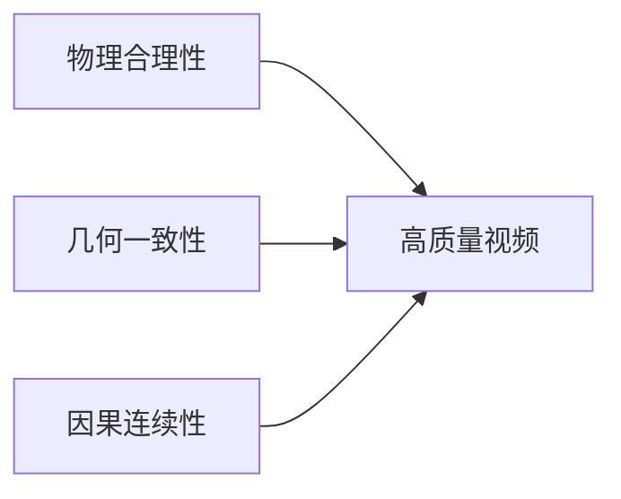

# 📺 第一章：AI视频核心基础知识

> 💡 **本节目的**：系统梳理 AI视频领域的核心概念、关键技术与时事热点，帮助面试者建立完整的知识体系框架。

---

## 📑 目录导航

- [1.视频 vs 图像：视频建模到底多了什么？](#1.视频vs图像：视频建模到底多了什么？)
- [2.视频的时空属性：Temporal / Spatial / Motion](#2.视频的时空属性：Temporal/Spatial/Motion)
- [3.帧、帧率、时长、分辨率与码率的基本概念](#3.帧帧率时长分辨率与码率的基本概念)
- [4.视频任务全景：生成、编辑、理解的边界与联系](#4.视频任务全景：生成、编辑、理解的边界与联系)
- [5.视频中的运动表征：光流、轨迹、帧差与隐式运动](#5.视频中的运动表征光流轨迹帧差与隐式运动)
- [6.视频时序建模的核心难点：长程依赖、一致性与漂移](#6.视频时序建模的核心难点长程依赖一致性与漂移)
- [7.视频表示学习：逐帧表征、3D表征、时空联合表征](#7.视频表示学习、逐帧表征、3d表征、时空联合表征)
- [8.视频中的一致性问题：内容一致性、身份一致性、运动一致性](#8.视频中的一致性问题内容一致性身份一致性运动一致性)
- [9.视频生成中的"世界约束"：物理合理性、几何一致性与因果连续性](#9.视频生成中的世界约束物理合理性几何一致性与因果连续性)

---

<h1 id="1.视频 vs 图像视频建模到底多了什么?">1.视频vs图像视频建模到底多了什么?</h1>

> 🎯 **考察重点**：考察对 **T 维度（时间轴）** 的处理能力

### ❓ 核心问题

## 面试问题1：为什么视频任务通常比图像任务更难？

**难度评分：⭐⭐⭐ (3/5)  |  考察频率：⭐⭐⭐⭐⭐ (5/5)**

视频任务比图像任务更难，核心原因是：**视频不是单帧空间建模，而是时空联合建模。**

相比图像，视频主要多了以下几个难点：

1. **多了时间维度**：模型不仅要看懂当前帧，还要理解前后帧之间的时序关系。
2. **多了运动建模**：视频里存在目标运动、相机运动、遮挡变化等动态信息，建模难度更高。
3. **更强调一致性**：单帧生成得好还不够，还要保证跨帧内容一致、身份一致、运动连续，否则就容易出现闪烁和漂移。
4. **计算和数据成本更高**：视频序列更长、数据量更大，训练和推理都比图像更耗显存和算力。

另外，很多视频任务还涉及**长程依赖**，也就是模型不仅要看相邻几帧，还要记住更早之前出现的人物、场景和动作状态，这会进一步增加建模难度。

所以可以概括为一句话：**图像任务主要解决“这一帧是什么”，而视频任务还要解决“它如何变化、变化是否合理、前后是否一致”。**

## 面试问题2：视频数据在深度学习中的常见 Tensor 表示形状是什么？各维度代表什么？

**难度评分：⭐⭐ (2/5)  |  考察频率：⭐⭐⭐⭐ (4/5)**

视频在深度学习里常见的 Tensor 形状是 **[B, T, C, H, W]** 或 **[B, C, T, H, W]**，不同框架习惯不同，但含义一致：

- **B**：batch size，表示一批样本数
- **T**：时间维度，表示视频帧数
- **C**：通道数，比如 RGB 一般是 3
- **H / W**：帧的高和宽

如果是图像，常见形状通常只有 **[B, C, H, W]**，所以视频本质上就是在图像基础上多了一个 **T 维度**。

这个 T 维度非常关键，因为它不只是“多几帧数据”这么简单，而是意味着模型要额外处理**帧间关系、运动变化和时序依赖**。很多 3D CNN、Video Transformer、视频扩散模型，本质上都是围绕这个时间维度展开建模。

## 面试问题3：什么是"隐空间视频表示"（Video Latent Representation）？

**难度评分：⭐⭐⭐⭐ (4/5)  |  考察频率：⭐⭐⭐⭐ (4/5)**

隐空间视频表示指的是：**先把原始视频压缩映射到一个更低维、更紧凑的特征空间，再在这个空间里做建模、生成或编辑。**

这样做的好处主要有两个：

1. **降低计算成本**：直接在像素空间处理视频太重，latent space 更省显存和算力。
2. **保留高层语义**：隐空间通常保留了内容、结构、运动等关键信息，更适合生成模型学习。

在视频生成里，可以把它理解为：**不是直接生成每个像素，而是先生成视频的紧凑语义表示，再解码回像素视频。**

这和图像生成里先进入 latent space 再建模是一个思路，只不过视频 latent 不仅要表示空间内容，还要尽量保留**时序和运动信息**。因此视频 latent 的设计通常会直接影响生成质量、时序一致性和计算效率。

## 面试问题4：能不能把视频简单看成很多张图片？

**难度评分：⭐⭐ (2/5)  |  考察频率：⭐⭐⭐⭐⭐ (5/5)**

**不能完全这么看。**

视频从数据形式上确实可以看成一组连续帧，但从建模角度看，视频比“很多张图片”多了三件关键事情：

1. **时序关系**：前后帧之间是有关联的，不是独立样本。
2. **运动信息**：视频的核心不是静态内容，而是内容如何变化。
3. **跨帧一致性**：人物、场景、动作要在连续帧中保持连贯。

如果只是把视频拆成很多图像独立处理，往往会出现一个典型问题：**单帧看起来都不错，但拼起来不连贯。** 比如人物身份变化、背景跳动、动作不自然，这本质上都是忽略时序信息造成的。

所以更准确的说法是：**视频可以表示成多张图片的序列，但不能用纯图像思路独立处理每一帧。**

---

<h1 id="2.视频的时空属性 temporal-spatial-motion">2.视频的时空属性 temporal-spatial-motion</h1>

> 🎯 **考察重点**：考察对视频**三维本质（空间 + 时间 + 运动）**的理解

### 🔑 关键概念
- **Spatial（空间）**：单帧内的视觉信息
- **Temporal（时间）**：帧与帧之间的时序关系
- **Motion（运动）**：随时间变化的动态模式

### ❓ 核心问题

## 面试问题1：AI视频里常说的 spatial、temporal、motion 分别指什么？

**难度评分：⭐⭐ (2/5)  |  考察频率：⭐⭐⭐⭐⭐ (5/5)**

这三个词分别对应视频建模里的三个核心维度：

- **Spatial（空间）**：指单帧内部的视觉内容，比如物体外观、纹理、形状、布局和背景信息，本质上和图像建模关注的内容比较接近。
- **Temporal（时间）**：指帧与帧之间的顺序关系和时序依赖，也就是模型要理解前一帧、当前帧、后一帧之间是怎么连续变化的。
- **Motion（运动）**：指视频中随时间发生的动态变化，比如人物移动、物体旋转、镜头推进、表情变化等。

可以简单理解为：**Spatial 解决“这一帧里有什么”，Temporal 解决“前后帧怎么连起来”，Motion 解决“具体发生了什么变化”。**

在 AI 视频任务里，这三者通常是一起建模的，因为高质量视频不仅要每一帧看起来合理，还要保证变化过程自然、连续。

## 面试问题2：Temporal 和 Motion 是一回事吗？

**难度评分：⭐⭐⭐ (3/5)  |  考察频率：⭐⭐⭐⭐ (4/5)**

**不是一回事，但两者密切相关。**

Temporal 更强调的是**时间维度上的关系**，也就是帧与帧之间是否连续、是否有顺序依赖；  
Motion 更强调的是**时间维度上发生的具体变化内容**，也就是“到底动了什么、怎么动的”。

可以这样理解：

- **Temporal** 更偏“关系”和“顺序”
- **Motion** 更偏“变化”和“动态模式”

比如，一个人物从左走到右：

- 人物在连续帧中逐步移动，这体现的是 **motion**
- 这些帧必须按正确顺序连接起来，且前后状态不能跳变，这体现的是 **temporal**

所以，**Motion 是时间维度上的动态变化内容，Temporal 是这些变化所处的时序关系框架。**  
面试里如果要一句话回答，可以说：**Temporal 不等于 Motion，Temporal 更强调时序依赖，Motion 更强调具体运动本身。**

---

<h1 id="3.帧帧率时长分辨率与码率的基本概念">3.帧帧率时长分辨率与码率的基本概念</h1>

> 🎯 **考察重点**：考察对视频**基础参数及其对建模影响**的理解

### 🔑 关键参数
| 参数 | 符号 | 单位 | 影响 |
|-----|------|-----|------|
| 帧率 | FPS | frames/s | 流畅度、数据量 |
| 分辨率 | W×H | pixels | 细节、计算量 |
| 时长 | T | seconds | 序列长度 |
| 码率 | Bitrate | Mbps | 压缩质量 |

### ❓ 核心问题

## 面试问题1：帧率（FPS）对视频建模有什么影响？

**难度评分：⭐⭐⭐ (3/5)  |  考察频率：⭐⭐⭐⭐ (4/5)**

帧率（FPS）表示**每秒包含多少帧图像**，它会直接影响视频的时间分辨率，也就是模型能看到多密的运动过程。

帧率对视频建模主要有几个影响：

1. **影响运动信息密度**：FPS 越高，相邻帧之间变化越小，运动过程更连续，细节更完整；FPS 太低时，动作会更跳，很多中间状态会丢失。
2. **影响建模难度和成本**：FPS 越高，单位时间内帧数越多，输入序列更长，训练和推理的显存、算力开销都会上升。
3. **影响采样策略**：很多视频任务不会直接用原始全部帧，而是按固定间隔采样，这本质上就是在信息保留和计算成本之间做权衡。

所以从面试角度可以总结为：**FPS 决定了视频时间维度上的采样密度，过低会丢运动细节，过高又会带来更大的计算负担。**

## 面试问题2：分辨率和码率有什么区别？

**难度评分：⭐⭐ (2/5)  |  考察频率：⭐⭐⭐⭐ (4/5)**

**分辨率**和**码率**都影响视频质量，但它们不是一回事。

- **分辨率**指的是视频帧的尺寸大小，比如 720p、1080p、4K，本质上描述的是一帧图像有多少像素。
- **码率**指的是单位时间内用于存储或传输视频的数据量，比如 Mbps，本质上反映的是压缩后的信息量多少。

可以这样理解：

- 分辨率决定的是“画面有多大、理论上能承载多少细节”
- 码率决定的是“这些细节最终保留了多少、压缩损失有多大”

所以一个视频即使分辨率很高，如果码率太低，也可能会出现模糊、块效应、压缩伪影；反过来，分辨率不高但码率合理，画面也可能比较干净。

面试里一句话回答就是：**分辨率是空间尺寸，码率是压缩后的信息量，两者都会影响视频质量，但作用层面不同。**

## 面试问题3：为什么视频任务里经常要做采样？

**难度评分：⭐⭐⭐ (3/5)  |  考察频率：⭐⭐⭐⭐⭐ (5/5)**

视频任务里经常要做采样，最核心的原因是：**原始视频帧太多，直接全量处理成本太高，而且很多相邻帧信息是冗余的。**

采样的作用主要有三个：

1. **降低计算成本**：减少输入帧数，降低显存、算力和训练时间开销。
2. **控制时间范围**：通过稀疏采样、均匀采样、关键帧采样等方式，让模型在有限预算内覆盖更长时间段。
3. **减少冗余信息**：很多相邻帧变化很小，如果全部输入，增益不一定大，但成本会显著上升。

当然，采样也有代价：如果采样过稀，就可能丢掉关键动作细节、快速运动信息或者短时事件。

所以本质上，**采样是在“时序信息保留”和“计算效率”之间做平衡。** 这也是视频模型设计里非常常见的工程与算法折中。

---

<h1 id="4.视频任务全景：生成、编辑、理解的边界与联系">4.视频任务全景：生成、编辑、理解的边界与联系</h1>

> 🎯 **考察重点**：考察对**视频任务分类体系与技术边界**的认知

### 🔑 任务分类
```
┌─────────────────────────────────────┐
│         视频任务全景图              │
├──────────┬──────────┬──────────────┤
│ 视频生成  │ 视频编辑  │  视频理解    │
│ (Generation)│(Editing) │ (Understanding)│
└──────────┴──────────┴──────────────┘
```

### ❓ 核心问题

## 面试问题1：视频生成、视频编辑、视频理解三者有什么区别？

**难度评分：⭐⭐⭐ (3/5)  |  考察频率：⭐⭐⭐⭐⭐ (5/5)**

这三类任务都处理视频，但目标不同：

- **视频生成（Generation）**：重点是“从无到有”生成一段新视频，输入通常是文本、图像、音频或其他条件，输出是不存在的全新视频内容。
- **视频编辑（Editing）**：重点是“在原视频基础上做修改”，比如换背景、改动作、改风格、局部替换人物或物体。它不是完全重建，而是要在保留原视频主体信息的前提下完成改动。
- **视频理解（Understanding）**：重点是“让模型看懂视频”，比如动作识别、事件检测、视频问答、时序定位等，本质上是从视频中提取语义信息，而不是生成新内容。

它们的边界可以简单概括为：

- 生成：强调**创作新内容**
- 编辑：强调**保留原内容并定向修改**
- 理解：强调**提取语义和做判断**

但三者底层又有很多共通点，因为都要处理视频里的**空间内容、时间关系、运动模式和跨帧一致性**。所以很多现代视频模型会共享一部分 backbone 或时空建模能力，只是在任务头和目标函数上不同。

面试里一句话回答可以说：**视频生成是造视频，视频编辑是改视频，视频理解是读懂视频；三者任务目标不同，但都依赖时空联合建模能力。**

## 面试问题2：视频编辑为什么通常比图像编辑更难？

**难度评分：⭐⭐⭐⭐ (4/5)  |  考察频率：⭐⭐⭐⭐ (4/5)**

视频编辑通常比图像编辑更难，核心原因是：**图像编辑只需要改好一张图，而视频编辑需要在很多帧上连续地改，并且保证前后都一致。**

主要难点有几个：

1. **时序一致性要求更高**：修改后的内容不能只在某一帧合理，还要在连续帧中保持稳定，否则很容易出现闪烁、跳变和漂移。
2. **既要改动，又要保留原视频信息**：视频编辑通常不是完全重生成，而是要求保留原视频中的人物身份、背景结构、动作节奏、镜头关系，这个约束比图像编辑更多。
3. **运动传播更复杂**：编辑后的区域会随着时间运动、遮挡、形变，模型需要让修改结果跟着运动一起自然变化，而不是每帧独立贴上去。
4. **计算成本更高**：视频编辑要处理多帧内容，显存、算力和推理延迟都明显高于图像编辑。

所以本质上，**视频编辑 = 图像编辑 + 时序一致性约束 + 运动一致性约束**，这也是它通常更难的根本原因。

---

<h1 id="5.视频中的运动表征光流轨迹帧差与隐式运动">5.视频中的运动表征光流轨迹帧差与隐式运动</h1>

> 🎯 **考察重点**：考察对运动中**显式与隐式表征方法**的掌握

### 🔑 运动表征对比
| 表征方式 | 类型 | 计算成本 | 应用场景 |
|---------|------|---------|---------|
| 光流 (Optical Flow) | 显式 | 高 | 精细运动分析 |
| 轨迹 (Trajectory) | 显式 | 中 | 长时序跟踪 |
| 帧差 (Frame Difference) | 显式 | 低 | 快速运动检测 |
| 隐式运动 (Implicit) | 隐式 | 中 - 高 | 端到端生成 |

### ❓ 核心问题

## 面试问题1：什么是光流？它反映了什么？在视频算法中起什么作用？

**难度评分：⭐⭐⭐ (3/5)  |  考察频率：⭐⭐⭐⭐⭐ (5/5)**

光流（Optical Flow）指的是：**图像中像素或局部区域在相邻帧之间的表观运动场。**

它反映的不是物体真实三维速度，而是**像素在图像平面上的二维位移趋势**，因此会受到物体运动、相机运动、视角变化、遮挡和光照变化等因素影响。

在视频算法里，光流的主要作用有几个：

1. **刻画运动信息**：帮助模型显式描述“哪里在动、往哪动、动了多少”。
2. **建立帧间对应关系**：常用于跨帧对齐、特征传播、视频插帧和时序跟踪。
3. **辅助一致性建模**：在视频生成、编辑和超分任务里，可以用来约束前后帧变化更平滑、更连续。

所以面试里可以概括为：**光流是一种显式运动表征，核心作用是描述相邻帧之间的像素运动趋势，并帮助模型进行帧间对齐与时序建模。**

## 面试问题2：光流、帧差、目标轨迹有什么区别？

**难度评分：⭐⭐⭐⭐ (4/5)  |  考察频率：⭐⭐⭐⭐ (4/5)**

这三者都和视频运动有关，但描述层次不同：

- **光流**：描述的是像素级或局部区域级的运动方向和位移，信息最细，但计算成本也最高。
- **帧差**：指相邻帧直接做差，反映的是“哪里变了”，实现简单、速度快，但只能粗略反映变化，不能准确给出运动方向和轨迹。
- **目标轨迹**：描述的是目标在更长时间范围内的位置变化路径，关注的是目标级运动，而不是像素级细节。

可以简单理解为：

- 光流更偏**细粒度运动场**
- 帧差更偏**快速变化检测**
- 轨迹更偏**目标级长期运动过程**

所以如果面试官问区别，一句话可以答：**光流看的是像素怎么动，帧差看的是哪里变了，轨迹看的是目标在长时间里怎么移动。**

## 面试问题3：现在很多生成模型不显式用光流，为什么还能生成运动？

**难度评分：⭐⭐⭐⭐ (4/5)  |  考察频率：⭐⭐⭐ (3/5)**

很多生成模型不显式用光流，仍然能生成运动，核心原因是：**运动信息可以被模型隐式地学到，而不一定非要手工定义成光流这种显式形式。**

原因主要有几点：

1. **大模型具备强表征能力**：Transformer、Diffusion 等模型可以直接从大规模视频数据中学习帧间变化规律。
2. **时空联合建模已经包含运动线索**：模型在关注多帧 token 或 latent 时，实际上已经在学习“哪些内容在变化、变化方向是什么、变化是否连续”。
3. **显式光流不是唯一运动表示**：光流只是运动的一种人工定义方式，模型也可以在隐空间里形成自己的运动表征。

当然，不显式使用光流并不代表运动问题已经完全解决。很多模型虽然能生成运动，但仍然可能出现动作不稳定、局部漂移、闪烁等问题，这说明**隐式学到运动**和**稳定控制运动**仍然是两回事。

所以面试里可以回答：**现代生成模型依靠大规模时空建模能力，可以在隐空间中自动学习运动规律，因此不一定需要显式光流；但显式光流在某些精细控制场景下仍然有价值。**

## 面试问题4：视频生成中的"闪烁（Flickering）"和"伪影（Artifacts）"通常是由什么引起的？

**难度评分：⭐⭐⭐⭐ (4/5)  |  考察频率：⭐⭐⭐⭐ (4/5)**

闪烁和伪影本质上都和**跨帧不稳定**有关，只是表现形式不同。

- **闪烁（Flickering）**：通常指前后帧在颜色、纹理、亮度、边缘或细节上不断抖动，看起来忽明忽暗或忽清忽糊。
- **伪影（Artifacts）**：通常指生成结果里出现不自然结构，比如重复纹理、局部扭曲、边缘破碎、形状异常、块状噪声等。

常见原因主要有：

1. **时序一致性建模不够**：模型每一帧都生成得还行，但前后帧没有很好约束，容易导致闪烁。
2. **运动建模不准确**：对目标运动、遮挡、形变理解不到位，容易在动态区域产生伪影。
3. **生成误差逐帧累积**：尤其在长视频或自回归生成里，前面小误差会被后续放大，形成漂移和异常结构。
4. **压缩或上采样过程带来噪声**：解码、插值、超分或视频压缩也可能放大局部伪影。

所以可以总结为：**闪烁主要体现为时间上的不稳定，伪影主要体现为空间结构上的异常，它们很多时候都源于时序一致性和运动建模不足。**

---

<h1 id="6.视频时序建模的核心难点长程依赖一致性与漂移">6.视频时序建模的核心难点长程依赖一致性与漂移</h1>

> 🎯 **考察重点**：考察对**时序建模核心挑战与解决方案**的理解

### 🔑 三大难点
1. **长程依赖 (Long-range Dependency)**：远距离帧之间的关联建模
2. **一致性 (Consistency)**：时序上的稳定性保持
3. **漂移 (Drift)**：误差累积导致的偏离

### ❓ 核心问题

## 面试问题1：什么叫视频中的长程依赖？

**难度评分：⭐⭐⭐ (3/5)  |  考察频率：⭐⭐⭐⭐ (4/5)**

## 面试问题2：视频任务里为什么容易出现漂移（drift）？

**难度评分：⭐⭐⭐ (3/5)  |  考察频率：⭐⭐⭐⭐ (4/5)**

## 面试问题3：什么是视频中的时序一致性？

**难度评分：⭐⭐⭐ (3/5)  |  考察频率：⭐⭐⭐⭐⭐ (5/5)**

---

<h1 id="7.视频表示学习、逐帧表征、3d表征、时空联合表征">7.视频表示学习、逐帧表征、3d表征、时空联合表征</h1>

> 🎯 **考察重点**：考察对不同**视频表征范式及其适用场景**的理解

### 🔑 表征方法演进
```
逐帧表征 → 3D表征 → 时空联合表征
(Frame-wise)  (3D CNN)  (Transformer)
```

### ❓ 核心问题

## 面试问题1：视频表示学习和图像表示学习最大的不同是什么？

**难度评分：⭐⭐⭐ (3/5)  |  考察频率：⭐⭐⭐⭐ (4/5)**

## 面试问题2：什么是逐帧建模？什么是时空联合建模？

**难度评分：⭐⭐⭐ (3/5)  |  考察频率：⭐⭐⭐⭐⭐ (5/5)**

## 面试问题3：视频 - 文本对齐（Video-Text Alignment）与图像 - 文本对齐（Image-Text）最大的区别在哪？

**难度评分：⭐⭐⭐⭐ (4/5)  |  考察频率：⭐⭐⭐ (3/5)**

## 面试问题4：什么是"时空 Patch"（Space-Time Patches）？

**难度评分：⭐⭐⭐⭐ (4/5)  |  考察频率：⭐⭐⭐ (3/5)**

---

<h1 id="8.视频中的一致性问题内容一致性身份一致性运动一致性">8.视频中的一致性问题内容一致性身份一致性运动一致性</h1>

> 🎯 **考察重点**：考察对**视频质量核心指标——一致性**的多维度理解

### 🔑 一致性层次
- **内容一致性**：场景、物体、背景的连贯性
- **身份一致性**：人物/对象身份的稳定性
- **运动一致性**：运动规律的合理性

### ❓ 核心问题

## 面试问题1：视频生成或编辑里，一致性通常包括哪些层面？

**难度评分：⭐⭐⭐ (3/5)  |  考察频率：⭐⭐⭐⭐⭐ (5/5)**

## 面试问题2：什么是 flicker？为什么它在视频里很致命？

**难度评分：⭐⭐⭐ (3/5)  |  考察频率：⭐⭐⭐⭐⭐ (5/5)**

---

# 9. 视频生成中的『世界约束』：物理合理性、几何一致性与因果连续性 {#9-视频生成中的世界约束物理合理性几何一致性与因果连续性}

> 🎯 **考察重点**：考察对**视频生成背后世界建模与因果推理**的深度思考

### 🔑 世界约束三要素


### ❓ 核心问题

## 面试问题1：为什么说高质量视频生成不仅是视觉问题，还是"世界建模"问题？

**难度评分：⭐⭐⭐⭐ (4/5)  |  考察频率：⭐⭐⭐ (3/5)**

## 面试问题2：什么叫物理合理性？

**难度评分：⭐⭐⭐ (3/5)  |  考察频率：⭐⭐⭐ (3/5)**

## 面试问题3：什么是几何一致性和因果连续性？

**难度评分：⭐⭐⭐⭐ (4/5)  |  考察频率：⭐⭐⭐ (3/5)**

---

## 📝 总结与展望

### 💎 核心要点回顾
- ✅ 视频建模的本质是**时空联合建模**
- ✅ 一致性是视频质量的**生命线**
- ✅ 运动表征是视频理解的**关键**
- ✅ 世界约束是生成质量的**保障**

### 🚀 前沿趋势
- 🔥 **统一架构**：Diffusion + Transformer 成为主流
- 🔥 **长视频生成**：从秒级向分钟级演进
- 🔥 **可控生成**：精细化控制成为研究热点
- 🔥 **物理感知**：世界模型与因果推理受重视

### 📚 延伸学习
- [AI视频基础 - 模型篇](../AI视频基础/02_视频生成核心基础架构模型.md)
- [深度学习基础 - 注意力机制](../深度学习基础/05_注意力机制.md)
- [大模型基础 - Transformer 架构](../大模型基础/经典模型与架构.md)

---

<div align="center">

**💪 祝面试顺利，offer 拿到手软！**

*Last Updated: 2026-04-03*

</div>
