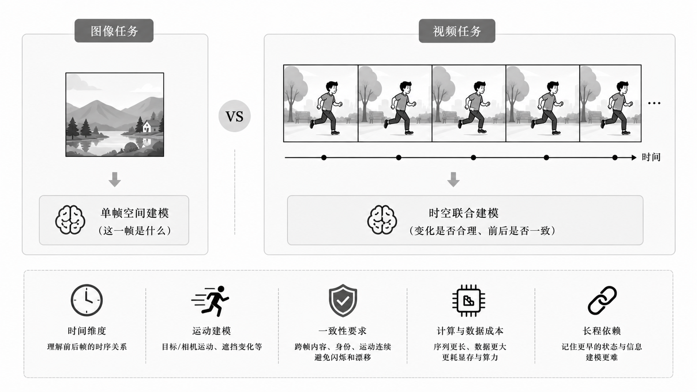
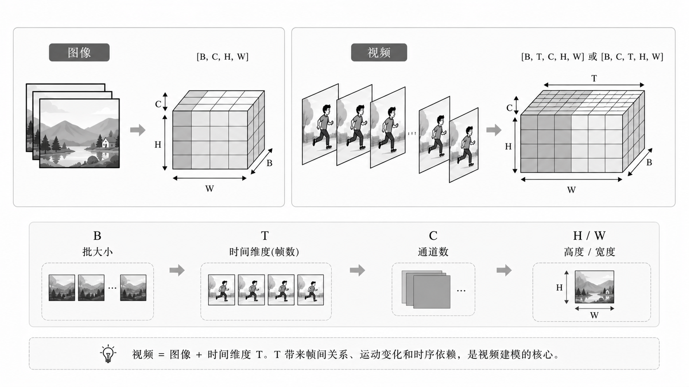
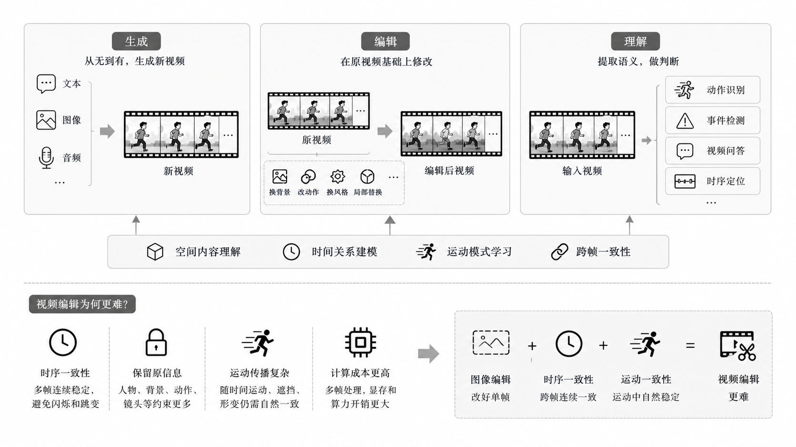
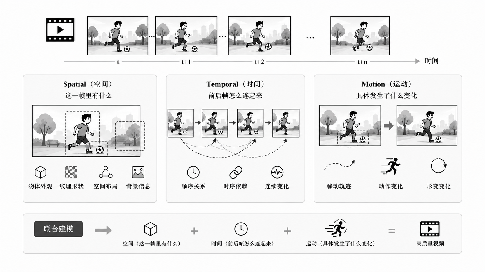
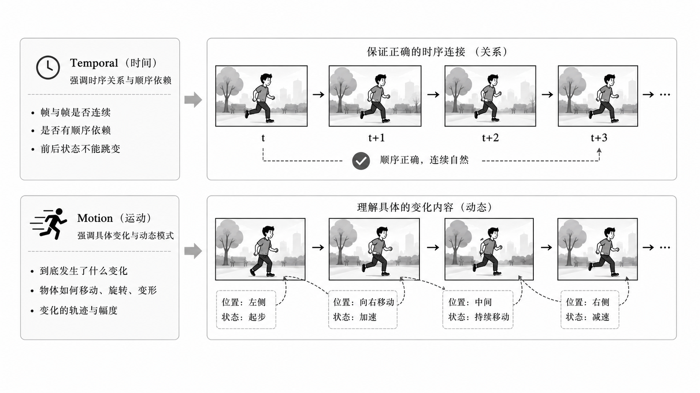
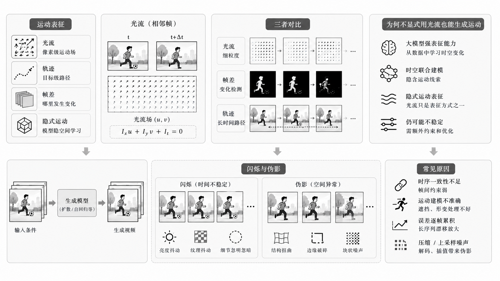
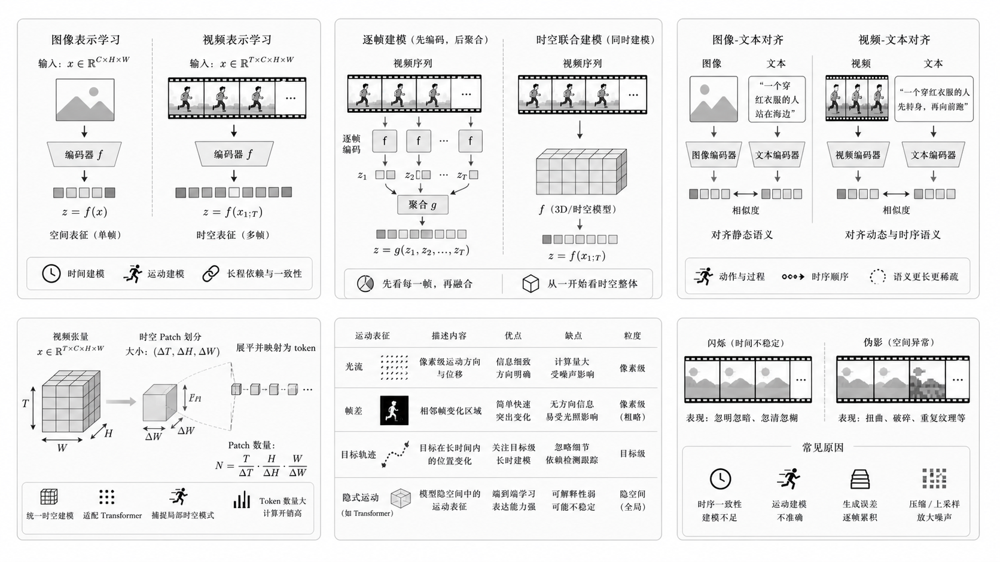
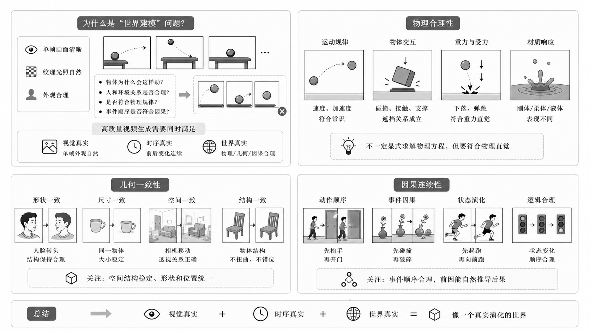

# 4.1 AI 视频核心基础知识

> 本章作为 AI 视频方向的开篇内容，重点建立视频建模的基础坐标系：视频相对图像新增了什么、视频数据如何组织、运动如何表示、时序一致性为什么重要，以及高质量视频为什么需要满足几何、物理与因果约束。后续章节中的模型架构、经典路线、长视频生成、训练优化与统一视频系统，均建立在这些基础概念之上。

---

# 目录导航

[4.1.1 视频 vs 图像：视频建模到底多了什么？](#4.1.1_视频-vs-图像：视频建模到底多了什么？)
  - [4.1.1.1 面试问题：为什么视频任务通常比图像任务更难？](#4.1.1.1_面试问题：为什么视频任务通常比图像任务更难？)
  - [4.1.1.2 面试问题：视频数据在深度学习中的常见 Tensor 表示是什么？](#4.1.1.2_面试问题：视频数据在深度学习中的常见-Tensor-表示是什么？)
  - [4.1.1.3 面试问题：能不能把视频简单看成很多张图片？](#4.1.1.3_面试问题：能不能把视频简单看成很多张图片？)

[4.1.2 视频基本参数：帧、帧率、时长、分辨率、码率与采样](#4.1.2_视频基本参数：帧、帧率、时长、分辨率、码率与采样)
  - [4.1.2.1 面试问题：FPS 对视频建模有什么影响？](#4.1.2.1_面试问题：FPS-对视频建模有什么影响？)
  - [4.1.2.2 面试问题：分辨率和码率有什么区别？](#4.1.2.2_面试问题：分辨率和码率有什么区别？)
  - [4.1.2.3 面试问题：为什么视频任务中经常需要采样？](#4.1.2.3_面试问题：为什么视频任务中经常需要采样？)

[4.1.3 视频任务坐标系：生成、编辑、理解与多模态条件](#4.1.3_视频任务坐标系：生成、编辑、理解与多模态条件)
  - [4.1.3.1 面试问题：视频生成、视频编辑、视频理解三者有什么区别？](#4.1.3.1_面试问题：视频生成、视频编辑、视频理解三者有什么区别？)
  - [4.1.3.2 面试问题：视频编辑为什么通常比图像编辑更难？](#4.1.3.2_面试问题：视频编辑为什么通常比图像编辑更难？)
  - [4.1.3.3 面试问题：为什么视频任务越来越强调多模态条件？](#4.1.3.3_面试问题：为什么视频任务越来越强调多模态条件？)
  - [4.1.3.4 面试问题：视频理解为视频生成、视频编辑、视频 Agent 与统一视频系统提供哪些关键能力？](#4.1.3.4_面试问题：视频理解为视频生成、视频编辑、视频-Agent-与统一视频系统提供哪些关键能力？)
  - [4.1.3.5 面试问题：为什么视频生成和视频编辑常常需要“先理解，再生成或修改”？](#4.1.3.5_面试问题：为什么视频生成和视频编辑常常需要“先理解，再生成或修改”？)
  - [4.1.3.6 面试问题：视频 Agent 如何利用视频理解完成规划、检查与多轮修改？](#4.1.3.6_面试问题：视频-Agent-如何利用视频理解完成规划、检查与多轮修改？)

[4.1.4 视频的时空属性：Spatial、Temporal 与 Motion](#4.1.4_视频的时空属性：Spatial、Temporal-与-Motion)
  - [4.1.4.1 面试问题：Spatial、Temporal、Motion 分别指什么？](#4.1.4.1_面试问题：Spatial、Temporal、Motion-分别指什么？)
  - [4.1.4.2 面试问题：Temporal 和 Motion 是一回事吗？](#4.1.4.2_面试问题：Temporal-和-Motion-是一回事吗？)
  - [4.1.4.3 面试问题：为什么运动建模是视频任务的核心？](#4.1.4.3_面试问题：为什么运动建模是视频任务的核心？)

[4.1.5 运动表征基础：光流、帧差、轨迹与隐式运动](#4.1.5_运动表征基础：光流、帧差、轨迹与隐式运动)
  - [4.1.5.1 面试问题：什么是光流？它在视频算法中起什么作用？](#4.1.5.1_面试问题：什么是光流？它在视频算法中起什么作用？)
  - [4.1.5.2 面试问题：光流、帧差、目标轨迹有什么区别？](#4.1.5.2_面试问题：光流、帧差、目标轨迹有什么区别？)
  - [4.1.5.3 面试问题：很多生成模型不显式使用光流，为什么仍然能生成运动？](#4.1.5.3_面试问题：很多生成模型不显式使用光流，为什么仍然能生成运动？)

[4.1.6 时序建模基础：一致性、长程依赖、漂移与闪烁](#4.1.6_时序建模基础：一致性、长程依赖、漂移与闪烁)
  - [4.1.6.1 面试问题：什么是视频中的时序一致性？](#4.1.6.1_面试问题：什么是视频中的时序一致性？)
  - [4.1.6.2 面试问题：什么是长程依赖？为什么视频中很难建模？](#4.1.6.2_面试问题：什么是长程依赖？为什么视频中很难建模？)
  - [4.1.6.3 面试问题：视频任务里为什么容易出现漂移？](#4.1.6.3_面试问题：视频任务里为什么容易出现漂移？)
  - [4.1.6.4 面试问题：什么是 flicker？为什么它在视频里很致命？](#4.1.6.4_面试问题：什么是-flicker？为什么它在视频里很致命？)

[4.1.7 视频表示学习与质量约束：从时空表征到世界一致性](#4.1.7_视频表示学习与质量约束：从时空表征到世界一致性)
  - [4.1.7.1 面试问题：视频表示学习和图像表示学习最大的区别是什么？](#4.1.7.1_面试问题：视频表示学习和图像表示学习最大的区别是什么？)
  - [4.1.7.2 面试问题：逐帧建模和时空联合建模有什么区别？](#4.1.7.2_面试问题：逐帧建模和时空联合建模有什么区别？)
  - [4.1.7.3 面试问题：Video-Text Alignment 比 Image-Text Alignment 难在哪里？](#4.1.7.3_面试问题：Video-Text-Alignment-比-Image-Text-Alignment-难在哪里？)
  - [4.1.7.4 面试问题：什么是视频生成中的几何一致性、物理合理性与因果连续性？](#4.1.7.4_面试问题：什么是视频生成中的几何一致性、物理合理性与因果连续性？)

---

<h1 id="4.1.1_视频-vs-图像：视频建模到底多了什么？">4.1.1 视频 vs 图像：视频建模到底多了什么？</h1>

> 本节关注视频建模相对图像建模新增的根本变量：时间维度、运动变化和跨帧一致性。它是理解后续 Video VAE、视频扩散、Video Transformer、长视频生成和多模态视频系统的基础。

<h2 id="4.1.1.1_面试问题：为什么视频任务通常比图像任务更难？">4.1.1.1 面试问题：为什么视频任务通常比图像任务更难？</h2>

**难度评分：⭐⭐⭐ (3/5)  |  考察频率：⭐⭐⭐⭐⭐ (5/5)**

视频任务更难的核心原因是：**视频不是单帧空间建模，而是时空联合建模**。图像主要关注一帧中的对象、纹理、布局和语义，视频还必须建模帧与帧之间的动态关系。

视频相对图像新增的核心建模变量如图1-1所示。

<div align="center"></div>

<p align="center">图1-1 视频任务相对图像任务新增的时间维度、运动建模与一致性约束示意图</p>

主要难点可以概括为四点：

1. **时间维度更复杂**：模型不仅要理解当前帧，还要理解前后帧之间的顺序、依赖和状态变化。
2. **运动建模更困难**：视频包含目标运动、相机运动、形变、遮挡和交互，模型需要判断“什么在动、如何动、是否合理”。
3. **一致性约束更严格**：高质量视频要求内容、身份、外观、运动和视觉细节在时间上保持稳定。
4. **计算与数据成本更高**：视频输入通常具有 $T \times H \times W$ 的时空规模，token 数、显存占用和数据处理成本都会显著增加。

因此，图像任务主要回答“这一帧是什么”，视频任务还要回答“它如何变化、变化是否连续、变化是否符合现实约束”。

<h2 id="4.1.1.2_面试问题：视频数据在深度学习中的常见-Tensor-表示是什么？">4.1.1.2 面试问题：视频数据在深度学习中的常见 Tensor 表示是什么？</h2>

**难度评分：⭐⭐ (2/5)  |  考察频率：⭐⭐⭐⭐ (4/5)**

视频在深度学习中常见的 Tensor 表示包括 $[B, T, C, H, W]$ 和 $[B, C, T, H, W]$。其中：

- $B$ 表示 batch size。
- $T$ 表示时间维度，即帧数。
- $C$ 表示通道数，例如 RGB 视频通常为 3。
- $H, W$ 表示单帧的高度和宽度。

视频 Tensor 的组织方式如图1-2所示。

<div align="center"></div>

<p align="center">图1-2 视频数据常见 Tensor 组织形式示意图</p>

与图像 $[B, C, H, W]$ 相比，视频多出的 $T$ 维不是简单的数据堆叠，而是引入了帧间关系、运动模式和时序依赖。3D CNN、Video Transformer、视频扩散模型等方法，都是围绕如何有效建模这个时间维度展开。

在工程实现中，维度顺序会影响算子选择、内存布局和训练效率。例如某些 3D 卷积实现更常使用 $[B, C, T, H, W]$，而部分 Transformer 或数据管线更习惯先以 $[B, T, C, H, W]$ 组织样本。面试时重点不是死记顺序，而是要说明每个维度的含义，以及 $T$ 维带来的建模复杂度。

<h2 id="4.1.1.3_面试问题：能不能把视频简单看成很多张图片？">4.1.1.3 面试问题：能不能把视频简单看成很多张图片？</h2>

**难度评分：⭐⭐ (2/5)  |  考察频率：⭐⭐⭐⭐⭐ (5/5)**

从数据形式上，视频可以表示为连续帧序列；但从建模角度，不能把视频简单理解为独立图像集合。

视频作为连续帧序列的表示如图1-3所示。

<div align="center"></div>

<p align="center">图1-3 视频作为连续帧序列的表示示意图</p>

原因在于，视频中的帧不是独立同分布样本，而是一个随时间演化的过程。相邻帧之间存在对象位置变化、相机变化、遮挡关系、动作阶段和事件顺序。如果把每一帧独立处理，常见问题是单帧质量不错，但连续播放时出现身份变化、背景跳动、纹理闪烁或动作不连续。

更准确的表述是：**视频可以被存储为多张图像的序列，但建模时必须显式或隐式考虑时序依赖和跨帧一致性**。这也是视频模型区别于图像模型的根本出发点。

---

<h1 id="4.1.2_视频基本参数：帧、帧率、时长、分辨率、码率与采样">4.1.2 视频基本参数：帧、帧率、时长、分辨率、码率与采样</h1>

> 本节梳理视频数据最基础的工程参数。它们看似是数据层概念，但会直接影响模型输入规模、运动信息密度、训练成本和评估结论。

<h2 id="4.1.2.1_面试问题：FPS-对视频建模有什么影响？">4.1.2.1 面试问题：FPS 对视频建模有什么影响？</h2>

**难度评分：⭐⭐⭐ (3/5)  |  考察频率：⭐⭐⭐⭐ (4/5)**

FPS 表示每秒包含多少帧，决定视频在时间维度上的采样密度。不同帧率对运动连续性的影响如图1-4所示。

<div align="center"></div>

<p align="center">图1-4 不同帧率下时间采样密度差异示意图</p>

FPS 对视频建模的影响主要体现在三方面：

1. **运动信息密度**：FPS 越高，相邻帧间位移通常越小，运动过程更细；FPS 过低时，快速动作可能出现跳变或关键状态丢失。
2. **计算成本**：在相同时长下，FPS 越高，帧数 $T$ 越大，训练和推理的显存、计算量和 I/O 成本都会上升。
3. **建模目标**：低 FPS 更关注稀疏关键状态，高 FPS 更关注细粒度运动连续性。不同任务对 FPS 的需求并不相同。

因此，FPS 不是越高越好，而是要在动作细节、时间覆盖范围和计算预算之间平衡。面试中可以概括为：**FPS 决定时间采样密度，影响运动可观测性和序列建模成本**。

<h2 id="4.1.2.2_面试问题：分辨率和码率有什么区别？">4.1.2.2 面试问题：分辨率和码率有什么区别？</h2>

**难度评分：⭐⭐ (2/5)  |  考察频率：⭐⭐⭐⭐ (4/5)**

分辨率和码率都会影响视频质量，但二者描述的对象不同。

**分辨率**描述单帧的空间尺寸，例如 720p、1080p 或 4K，本质上决定画面理论上可以承载多少空间细节。

**码率**描述单位时间内用于存储或传输视频的数据量。在相同编码器和压缩配置下，码率越高，通常压缩损失越小，保留的信息越多。

可以将二者理解为：

- 分辨率回答“画面有多大、空间采样有多密”。
- 码率回答“压缩后实际保留了多少信息”。

高分辨率但低码率的视频可能存在明显压缩伪影、块效应或纹理糊化；分辨率较低但码率合理的视频，反而可能更稳定、更干净。对视频模型而言，分辨率影响 token 数和空间细节，码率影响数据质量、压缩伪影和模型学习到的视觉分布。

面试中可以总结为：**分辨率是空间采样规格，码率是压缩后的信息预算；二者共同影响视频质量，但作用层面不同**。

<h2 id="4.1.2.3_面试问题：为什么视频任务中经常需要采样？">4.1.2.3 面试问题：为什么视频任务中经常需要采样？</h2>

**难度评分：⭐⭐⭐ (3/5)  |  考察频率：⭐⭐⭐⭐⭐ (5/5)**

视频任务经常需要采样，核心原因是原始视频帧数多、冗余高，直接全量处理通常成本不可接受。采样本质上是在有限计算预算下，选择最能代表时序信息的一部分帧。

常见采样目标包括：

1. **控制输入规模**：减少 $T$，降低显存、计算和数据读取成本。
2. **覆盖足够时间范围**：通过均匀采样、稀疏采样或关键帧采样，在有限帧数下覆盖更长时段。
3. **减少相邻帧冗余**：连续帧之间往往高度相似，全部使用不一定带来等比例收益。
4. **适配任务需求**：动作识别可能强调关键运动片段，视频生成训练可能需要兼顾短时运动和多样场景。

采样也会带来信息损失。如果采样过稀，快速动作、短时事件、遮挡变化和细粒度运动会被遗漏。因此，采样策略本质上是**时序信息保留、计算效率和任务目标之间的折中**。

---

<h1 id="4.1.3_视频任务坐标系：生成、编辑、理解与多模态条件">4.1.3 视频任务坐标系：生成、编辑、理解与多模态条件</h1>

> 本节从任务目标上建立视频方向的基础坐标系。生成、编辑和理解的目标不同，但底层都依赖时空表征、运动建模和一致性建模。

视频生成、编辑与理解任务的关系如图1-5所示。

<div align="center"></div>

<p align="center">图1-5 视频生成、视频编辑与视频理解任务全景示意图</p>

<h2 id="4.1.3.1_面试问题：视频生成、视频编辑、视频理解三者有什么区别？">4.1.3.1 面试问题：视频生成、视频编辑、视频理解三者有什么区别？</h2>

**难度评分：⭐⭐⭐ (3/5)  |  考察频率：⭐⭐⭐⭐⭐ (5/5)**

三类任务的区别主要在于输入、输出和优化目标。

**视频生成**关注从条件到新视频的生成，例如 Text-to-Video、Image-to-Video 或 Audio-to-Video。它的目标是生成不存在的新内容，重点考察画面质量、运动合理性、文本一致性和时序稳定性。

**视频编辑**关注在给定源视频基础上进行定向修改，例如风格迁移、局部替换、动作修改、背景替换或重绘。它不仅要求修改符合指令，还要求保留未编辑区域和原视频的时序结构。

**视频理解**关注从视频中提取语义或做推理，例如动作识别、事件检测、视频问答、时序定位和多模态检索。它的输出通常是标签、文本、时间片段或判断结果。

三者可以用一句话区分：**生成是创建视频，编辑是约束下修改视频，理解是从视频中抽取语义和判断**。它们的任务目标不同，但共享视频表征、时序建模和多模态对齐等底层能力。

<h2 id="4.1.3.2_面试问题：视频编辑为什么通常比图像编辑更难？">4.1.3.2 面试问题：视频编辑为什么通常比图像编辑更难？</h2>

**难度评分：⭐⭐⭐⭐ (4/5)  |  考察频率：⭐⭐⭐⭐ (4/5)**

视频编辑比图像编辑更难，是因为它不仅要完成空间上的修改，还要保证修改结果在时间上连续稳定。

关键难点包括：

1. **跨帧一致性**：编辑后的目标、纹理、边缘和光照不能在连续帧中抖动。
2. **源视频保持**：未编辑区域应尽量保持原始内容、运动和镜头关系。
3. **运动传播**：编辑区域会随目标运动、遮挡和形变发生变化，不能把每帧当成独立图像处理。
4. **误差累积**：长视频或逐段编辑中，小的空间偏差会沿时间传播并放大。

因此，视频编辑可以理解为**图像编辑 + 时序一致性约束 + 运动一致性约束 + 源视频保持约束**。这也是视频编辑在真实应用中比图像编辑更容易出现闪烁、漂移和局部失真的原因。

<h2 id="4.1.3.3_面试问题：为什么视频任务越来越强调多模态条件？">4.1.3.3 面试问题：为什么视频任务越来越强调多模态条件？</h2>

**难度评分：⭐⭐⭐ (3/5)  |  考察频率：⭐⭐⭐⭐ (4/5)**

视频本身包含丰富的时空信息，而真实应用中的控制需求往往无法只靠单一文本描述完成。因此，视频任务越来越强调多模态条件，包括文本、图像、视频、音频、姿态、深度、边缘、轨迹、相机运动等。

多模态条件的价值主要体现在：

1. **文本提供语义目标**：描述主体、动作、场景和风格。
2. **图像提供外观参考**：约束人物、物体、背景或首帧内容。
3. **结构条件提供空间控制**：例如姿态、深度和边缘可以约束几何结构。
4. **运动条件提供动态控制**：例如轨迹、相机路径和参考视频可以约束变化过程。
5. **音频提供节奏和事件线索**：在视听生成、数字人和音乐视频等任务中尤其重要。

需要注意的是，条件越多并不一定越好。多条件之间可能出现冲突，例如文本要求“向左走”，轨迹条件却指向右侧。现代视频系统的关键问题之一，就是如何在统一条件接口下处理多模态条件的优先级、冲突和对齐关系。

<h2 id="4.1.3.4_面试问题：视频理解为视频生成、视频编辑、视频-Agent-与统一视频系统提供哪些关键能力？">4.1.3.4 面试问题：视频理解为视频生成、视频编辑、视频 Agent 与统一视频系统提供哪些关键能力？</h2>

**难度评分：⭐⭐⭐⭐ (4/5)  |  考察频率：⭐⭐⭐⭐⭐ (5/5)**

视频理解的价值不只在于给视频打标签或回答问题，更在于把原始帧序列转成可供系统决策的**场景状态、事件关系和时间索引**。这使生成、编辑与交互系统知道“视频里有什么、发生了什么、该改哪里、改完是否正确”。

| 系统能力 | 视频理解提供的关键信息 | 典型作用 |
|---|---|---|
| 视频生成 | 主体、场景、动作、镜头和事件语义 | 生成前的脚本解析、条件组织与镜头规划 |
| 视频编辑 | 目标身份、位置、轨迹、遮挡和上下文 | 定位编辑对象，保护非编辑内容，选择修改时段 |
| 视频 Agent | 当前状态、已完成事件、失败原因和用户意图 | 任务分解、工具调用、结果检查与下一步决策 |
| 统一视频系统 | 跨文本、图像、视频、音频的语义对应关系 | 多模态条件对齐、任务路由与跨轮状态记忆 |

可以把它抽象为：理解模块先从视频中提取状态 $s$，生成或编辑模块再在该状态与用户条件 $c$ 的约束下工作：

```math
s = U(x_{1:T}), \qquad y \sim G(x_{1:T}, c, s)
```

这里的 $s$ 不一定是显式符号，也可以是时空 token、对象轨迹、分割区域、镜头摘要或压缩记忆。关键不在具体表示形式，而在于系统不能只“看见像素”，还要能利用视频中的对象、事件和状态关系。

面试中可以总结为：**视频理解是生成、编辑和 Agent 的感知层；它把视频从待处理的帧序列转成可定位、可规划、可验证的时空状态。**

<h2 id="4.1.3.5_面试问题：为什么视频生成和视频编辑常常需要“先理解，再生成或修改”？">4.1.3.5 面试问题：为什么视频生成和视频编辑常常需要“先理解，再生成或修改”？</h2>

**难度评分：⭐⭐⭐⭐ (4/5)  |  考察频率：⭐⭐⭐⭐ (4/5)**

对简单 T2V 来说，模型可以直接从文本条件开始采样；但一旦任务涉及参考视频、局部修改、多主体、跨镜头或多轮指令，系统若不了解当前视频状态，就很难稳定执行操作。

例如用户说“把第三个镜头中穿红衣的人换成蓝色外套，其他人物和镜头运动不要变”，系统至少需要先确定：

1. “第三个镜头”对应哪段时间；
2. 红衣人物是谁，在哪些帧中出现，是否被遮挡；
3. 哪些区域、哪些帧应修改，哪些内容必须保持；
4. 修改后人物身份、动作、光照和镜头运动是否仍然连续。

因此，真实流程通常不是一次黑盒生成，而更接近：

```text
理解源视频与用户指令
-> 定位对象、时间段和约束
-> 组织编辑/生成条件
-> 生成或修改
-> 再理解结果并检查是否符合要求
```

“先理解”并不要求每个系统都使用独立的视频理解模型；在统一模型中，这些能力也可能内化在同一个多模态 backbone 中。工程上真正重要的是：系统必须显式或隐式完成状态解析、目标定位和结果验证，而不能把复杂编辑当作无约束的重新生成。

面试中可以概括为：**理解让生成知道该生成什么，让编辑知道该改什么、该保留什么，也让系统能够验证自己是否完成了用户意图。**

<h2 id="4.1.3.6_面试问题：视频 Agent 如何利用视频理解完成规划、检查与多轮修改？">4.1.3.6 面试问题：视频 Agent 如何利用视频理解完成规划、检查与多轮修改？</h2>

**难度评分：⭐⭐⭐⭐⭐ (5/5)  |  考察频率：⭐⭐⭐⭐ (4/5)**

一次性生成只需把条件映射为视频；视频 Agent 则需要在多轮交互中维护创作状态，并根据结果继续采取行动。视频理解为它提供观察、记忆和反馈能力。

一个稳定的 Agent 闭环可以概括为：

```text
用户目标
-> 理解当前视频、素材和历史指令
-> 拆分为生成 / 编辑 / 续写 / 配音 / 检查等子任务
-> 调用相应模型或工具
-> 理解生成结果，检测偏差
-> 局部 retake、重新规划或向用户确认
```

其中，理解模块至少应支持三类能力：

1. **状态记忆**：记录人物、服装、道具、场景、镜头和已发生事件，避免多轮创作中“忘记前文”。
2. **结果检查**：检查用户要求的对象、动作、关系、文字、音画节奏或编辑目标是否真正出现，发现主体漂移、漏改或边界跳变。
3. **失败归因**：区分问题来自条件理解、编辑定位、生成质量、时序一致性还是工具执行，从而决定重试、局部修复还是修改计划。

这也是统一视频系统不只是“大模型”的原因：它还需要任务路由、状态存储、质量评估和工具调度。第 4.6 章会从统一视频系统与视频 Agent 的角度进一步展开；本节只需记住，视频理解使系统具备从“生成一次”走向“看结果、会修正、能持续创作”的基础。

面试中可以总结为：**视频 Agent 的核心不是连续调用生成模型，而是以视频理解作为观察与反馈，用规划、记忆和局部修复把多轮创作组织成闭环。**

---

<h1 id="4.1.4_视频的时空属性：Spatial、Temporal-与-Motion">4.1.4 视频的时空属性：Spatial、Temporal 与 Motion</h1>

> 本节解释视频建模中最基础的三个维度：空间、时间和运动。三者共同决定视频模型是否真正理解了动态视觉内容。

Spatial、Temporal 与 Motion 的关系如图1-6所示。

<div align="center"></div>

<p align="center">图1-6 视频中 Spatial、Temporal 与 Motion 三个维度关系示意图</p>

<h2 id="4.1.4.1_面试问题：Spatial、Temporal、Motion-分别指什么？">4.1.4.1 面试问题：Spatial、Temporal、Motion 分别指什么？</h2>

**难度评分：⭐⭐ (2/5)  |  考察频率：⭐⭐⭐⭐⭐ (5/5)**

这三个概念分别对应视频建模中的三个基本维度。

**Spatial** 指单帧内部的空间内容，包括对象、纹理、颜色、形状、布局、背景和局部结构。它主要回答“画面里有什么”。

**Temporal** 指帧与帧之间的时间顺序和依赖关系，包括前后状态如何衔接、事件如何展开、哪些信息需要跨时间保留。它主要回答“前后如何连接”。

**Motion** 指视频中随时间发生的变化模式，包括目标运动、相机运动、姿态变化、表情变化、遮挡和形变。它主要回答“内容如何变化”。

三者不能割裂理解。高质量视频既要求单帧空间质量高，也要求前后帧连续，还要求运动过程自然合理。

<h2 id="4.1.4.2_面试问题：Temporal-和-Motion-是一回事吗？">4.1.4.2 面试问题：Temporal 和 Motion 是一回事吗？</h2>

**难度评分：⭐⭐⭐ (3/5)  |  考察频率：⭐⭐⭐⭐ (4/5)**

Temporal 和 Motion 相关，但不是同一个概念。

Temporal 更强调时间维度上的顺序、依赖和连续性；Motion 更强调时间维度中具体发生了什么变化。Temporal 是关系框架，Motion 是动态内容。

Temporal 与 Motion 的区别如图1-7所示。

<div align="center"></div>

<p align="center">图1-7 Temporal 与 Motion 区别示意图</p>

例如，一个人从左向右走：

- 人的位置连续变化，是 Motion。
- 这些帧必须按正确顺序连接，且状态不能跳变，是 Temporal。

因此，Temporal 关注“时间关系是否成立”，Motion 关注“变化内容是否合理”。面试中可以回答：**Motion 是时间维度上的动态变化，Temporal 是组织这些变化的时序依赖结构**。

<h2 id="4.1.4.3_面试问题：为什么运动建模是视频任务的核心？">4.1.4.3 面试问题：为什么运动建模是视频任务的核心？</h2>

**难度评分：⭐⭐⭐ (3/5)  |  考察频率：⭐⭐⭐⭐⭐ (5/5)**

运动建模是视频任务的核心，因为视频区别于图像的主要信息增量就在于动态变化。没有运动建模，视频模型容易退化为逐帧图像模型。

运动建模至少影响四类能力：

1. **动作理解**：识别人的行为、物体交互和事件过程。
2. **视频生成**：生成自然的位移、形变、镜头运动和动作节奏。
3. **视频编辑**：让编辑内容随目标运动稳定传播。
4. **长期一致性**：保持对象状态、相机关系和事件逻辑的连续。

在实际模型中，运动可以通过显式方式表示，例如光流、轨迹和姿态；也可以通过隐式方式学习，例如时空注意力、3D 卷积或视频 latent 中的动态特征。无论形式如何，核心目标都是让模型理解“变化本身”，而不是只生成一组外观相似的静态帧。

---

<h1 id="4.1.5_运动表征基础：光流、帧差、轨迹与隐式运动">4.1.5 运动表征基础：光流、帧差、轨迹与隐式运动</h1>

> 本节讨论运动如何被表示。光流、帧差、轨迹和隐式运动表征并不是互相替代的关系，而是不同粒度、不同假设和不同计算成本下的运动描述方式。

典型运动表征方式如图1-8所示。

<div align="center"></div>

<p align="center">图1-8 光流、轨迹、帧差与隐式运动表征对比示意图</p>

<h2 id="4.1.5.1_面试问题：什么是光流？它在视频算法中起什么作用？">4.1.5.1 面试问题：什么是光流？它在视频算法中起什么作用？</h2>

**难度评分：⭐⭐⭐ (3/5)  |  考察频率：⭐⭐⭐⭐⭐ (5/5)**

光流（Optical Flow）是描述相邻帧之间像素或局部区域表观运动的二维向量场。它通常不等同于真实三维速度，而是物体运动、相机运动、视角变化、遮挡和光照变化投影到图像平面后的结果。

经典光流约束来自亮度一致性假设：

```math
I(x, y, t) = I(x + u \Delta t, y + v \Delta t, t + \Delta t)
```

对其进行一阶近似，可得到光流约束方程：

```math
I_x u + I_y v + I_t = 0
```

其中 $u, v$ 表示像素在 $x, y$ 方向上的位移或速度分量，$I_x, I_y, I_t$ 表示图像在空间和时间上的偏导。

在视频算法中，光流常用于：

1. **运动估计**：描述局部区域如何移动。
2. **帧间对齐**：建立相邻帧之间的对应关系。
3. **特征传播**：将上一帧的特征或结果传播到下一帧。
4. **一致性约束**：在插帧、超分、编辑和生成任务中约束前后帧稳定。

面试中可以概括为：**光流是一种显式的像素级运动表征，核心价值是建立帧间对应关系并辅助时序一致性建模**。

<h2 id="4.1.5.2_面试问题：光流、帧差、目标轨迹有什么区别？">4.1.5.2 面试问题：光流、帧差、目标轨迹有什么区别？</h2>

**难度评分：⭐⭐⭐⭐ (4/5)  |  考察频率：⭐⭐⭐⭐ (4/5)**

三者都描述视频变化，但粒度和信息量不同。

**光流**是像素级或局部区域级运动场，能够描述运动方向和位移，信息细、成本高，对遮挡和光照变化敏感。

**帧差**是相邻帧直接做差，主要反映哪里发生变化。它实现简单、速度快，但通常无法准确给出运动方向，也难以区分物体运动、光照变化和噪声。

**目标轨迹**描述目标级位置随时间变化的路径，关注对象在较长时间范围内如何移动，常用于跟踪、动作分析和长程一致性建模。

一句话区分：**光流回答像素怎么动，帧差回答哪里变了，轨迹回答目标长期如何移动**。在面试中进一步补充它们的适用粒度和局限性，会比只给定义更有说服力。

<h2 id="4.1.5.3_面试问题：很多生成模型不显式使用光流，为什么仍然能生成运动？">4.1.5.3 面试问题：很多生成模型不显式使用光流，为什么仍然能生成运动？</h2>

**难度评分：⭐⭐⭐⭐ (4/5)  |  考察频率：⭐⭐⭐ (3/5)**

因为运动不一定必须以光流这种显式形式进入模型。大规模视频生成模型可以通过时空联合建模，在隐空间中学习运动规律。

主要原因包括：

1. **训练数据包含大量动态样本**：模型可以从视频分布中学习常见动作、镜头运动和物体交互。
2. **时空结构提供运动归纳偏置**：3D 卷积、Temporal Attention、时空 token 等结构可以直接建模跨帧关系。
3. **生成目标包含时间维度**：模型在预测视频 latent 或视频 token 时，需要同时解释空间内容和时间变化。
4. **隐式运动表征更灵活**：模型内部特征不一定对应可解释光流，但可以编码更高层的动作语义、姿态变化和镜头变化。

不过，不显式使用光流并不意味着运动问题已经被完全解决。很多模型仍会出现运动不稳定、局部形变、遮挡错误和身份漂移。更准确的说法是：**现代生成模型可以隐式学习运动，但精确、可控、可解释的运动建模仍然是视频生成的重要难点**。

---

<h1 id="4.1.6_时序建模基础：一致性、长程依赖、漂移与闪烁">4.1.6 时序建模基础：一致性、长程依赖、漂移与闪烁</h1>

> 本节讨论视频质量中最核心的时序问题。一致性、长程依赖、漂移和闪烁是面试中最常出现的基础概念，也是后续长视频生成和视频编辑章节的前置知识。

长程依赖、一致性与漂移的关系如图1-9所示。

<div align="center"></div>

<p align="center">图1-9 视频时序建模中长程依赖、一致性与漂移问题示意图</p>

<h2 id="4.1.6.1_面试问题：什么是视频中的时序一致性？">4.1.6.1 面试问题：什么是视频中的时序一致性？</h2>

**难度评分：⭐⭐⭐ (3/5)  |  考察频率：⭐⭐⭐⭐⭐ (5/5)**

时序一致性指视频在连续帧之间保持稳定、连续和合理，不能出现无意义的突变。它不是单一指标，而是一组跨帧约束。

常见层次包括：

1. **内容一致性**：场景、物体、背景和布局不能无故变化。
2. **身份一致性**：同一人物或对象的关键身份特征应保持稳定。
3. **运动一致性**：轨迹、速度、方向和动作节奏应自然连续。
4. **外观一致性**：颜色、纹理、亮度、边缘和清晰度不应随机抖动。
5. **编辑一致性**：在视频编辑任务中，修改应在相关帧持续生效，未编辑区域应保持稳定。

一致性问题的层次如图1-10所示。

<div align="center"></div>

<p align="center">图1-10 视频一致性层次示意图</p>

如果使用运动补偿约束，时序一致性损失可以抽象写成：

```math
\mathcal{L}_{tc}
= \sum_t
\left\|
\phi(x_{t+1})
- \mathcal{W}\left(\phi(x_t), F_{t \rightarrow t+1}\right)
\right\|_1
```

其中 $\phi(\cdot)$ 表示图像或特征提取器，$\mathcal{W}(\cdot)$ 表示 warp 操作，$F_{t \rightarrow t+1}$ 表示从第 $t$ 帧到第 $t+1$ 帧的运动场。该式表达的核心含义是：前后帧经过运动对齐后，其内容或特征应尽量一致。

面试中可以总结为：**时序一致性要求视频前后帧在内容、身份、运动和视觉属性上保持连续，是区分高质量视频和逐帧图像集合的关键标准**。

<h2 id="4.1.6.2_面试问题：什么是长程依赖？为什么视频中很难建模？">4.1.6.2 面试问题：什么是长程依赖？为什么视频中很难建模？</h2>

**难度评分：⭐⭐⭐ (3/5)  |  考察频率：⭐⭐⭐⭐ (4/5)**

视频中的长程依赖指当前帧的理解或生成，不只依赖附近几帧，还依赖更早或更晚的远距离帧信息。例如人物在开头出现，中间被遮挡，后面再次出现，模型仍需要保持身份、位置关系和事件状态的一致。

长程依赖难建模，主要有三方面原因：

1. **相关帧距离远**：关键上下文可能跨越几十帧甚至更长时间。
2. **状态变化复杂**：对象可能经历遮挡、形变、视角变化、光照变化和交互。
3. **计算成本高**：若直接让所有帧互相关注，注意力复杂度会随 token 数快速增长。

如果视频被切成 $N$ 个时空 token，标准全局注意力复杂度近似为：

```math
\mathcal{O}(N^2)
```

而视频 token 数通常与时间、分辨率和 patch 粒度有关：

```math
N \approx \frac{T}{\Delta T}
\cdot \frac{H}{\Delta H}
\cdot \frac{W}{\Delta W}
```

这解释了为什么长程依赖不仅是建模问题，也是计算问题。后续长视频章节会进一步讨论 chunk、sliding window、memory 和 hierarchical generation 等解决路径。

<h2 id="4.1.6.3_面试问题：视频任务里为什么容易出现漂移？">4.1.6.3 面试问题：视频任务里为什么容易出现漂移？</h2>

**难度评分：⭐⭐⭐ (3/5)  |  考察频率：⭐⭐⭐⭐ (4/5)**

漂移（drift）指视频在时间推进过程中逐渐偏离原始语义、身份、结构或运动轨迹。它常见于视频生成、视频编辑、视频预测和长视频拼接。

在递推生成或逐段生成中，可以将当前输出抽象为：

```math
\hat{x}_t = f(\hat{x}_{t-1}, c_t)
```

其中 $\hat{x}_{t-1}$ 是上一时刻预测结果，$c_t$ 是当前条件。如果上一时刻存在误差，后续帧会在该误差基础上继续生成，误差可能被逐步放大。

漂移常见原因包括：

1. **递推误差累积**：早期帧的小偏差传递到后续帧。
2. **条件约束不足**：文本、参考图或结构条件无法持续约束长时间过程。
3. **身份与状态记忆不足**：模型无法稳定保存人物、物体和场景状态。
4. **运动估计或对齐错误**：局部运动传播不准，导致结构逐渐错位。

因此，漂移的本质是**时序约束不足与误差累积共同作用**。面试回答中应避免只说“模型不稳定”，而要指出它通常来自长期记忆、条件约束、运动传播和递推误差的综合问题。

<h2 id="4.1.6.4_面试问题：什么是-flicker？为什么它在视频里很致命？">4.1.6.4 面试问题：什么是 flicker？为什么它在视频里很致命？</h2>

**难度评分：⭐⭐⭐ (3/5)  |  考察频率：⭐⭐⭐⭐⭐ (5/5)**

Flicker 指连续帧之间亮度、颜色、纹理、边缘或局部细节出现异常抖动。单帧观察时可能不明显，但连续播放时会表现为闪烁、跳变或细节不稳定。

Flicker 在视频中影响很大，原因是人眼对时间上的不连续非常敏感。图像中的轻微纹理误差可能可以接受，但视频播放时同一位置的纹理、光照或边缘反复变化，会立即破坏真实感和沉浸感。

常见来源包括：

1. **逐帧独立生成**：前后帧缺少共享约束。
2. **时序特征不稳定**：模型无法保持局部纹理和边缘连续。
3. **运动对齐错误**：目标运动、遮挡或形变没有被正确建模。
4. **解码或后处理不一致**：VAE 解码、超分、插帧或压缩可能放大局部不稳定。

因此，flicker 不只是视觉噪声，而是时序建模不足的外在表现。面试中可以总结为：**flicker 是跨帧视觉属性的不稳定抖动，是视频生成和编辑中最容易被感知的质量缺陷之一**。

---

<h1 id="4.1.7_视频表示学习与质量约束：从时空表征到世界一致性">4.1.7 视频表示学习与质量约束：从时空表征到世界一致性</h1>

> 本节从表示学习和质量约束两个角度收束本章。视频模型不仅要学习空间内容和时间变化，还要让生成或理解结果满足语义、几何、物理和因果层面的基本一致性。

逐帧表征、3D 表征与时空联合表征的关系如图1-11所示。

<div align="center"></div>

<p align="center">图1-11 逐帧表征、3D 表征与时空联合表征示意图</p>

<h2 id="4.1.7.1_面试问题：视频表示学习和图像表示学习最大的区别是什么？">4.1.7.1 面试问题：视频表示学习和图像表示学习最大的区别是什么？</h2>

**难度评分：⭐⭐⭐ (3/5)  |  考察频率：⭐⭐⭐⭐ (4/5)**

图像表示学习主要学习单帧空间表征，而视频表示学习必须学习时空联合表征。

图像输入通常可表示为：

```math
x \in \mathbb{R}^{C \times H \times W}
```

视频输入通常可表示为：

```math
x_{1:T} \in \mathbb{R}^{T \times C \times H \times W}
```

因此，图像特征可以抽象为：

```math
z = f(x)
```

而视频特征更常写成：

```math
z = f(x_{1:T})
```

其中 $z$ 不仅编码单帧外观，还应编码动作、顺序、状态变化和长程依赖。

视频表示学习的额外挑战包括：

1. **时间依赖**：特征需要反映前后帧关系。
2. **运动模式**：特征需要编码位移、形变、遮挡和相机变化。
3. **事件过程**：特征需要描述动作阶段和事件演化，而不只是静态对象。
4. **一致性约束**：特征应支持身份、场景和运动状态的稳定跟踪。

因此，面试中可以概括为：**图像表征关注空间语义，视频表征关注时空语义；视频表示学习的核心增量是时间、运动和过程建模**。

<h2 id="4.1.7.2_面试问题：逐帧建模和时空联合建模有什么区别？">4.1.7.2 面试问题：逐帧建模和时空联合建模有什么区别？</h2>

**难度评分：⭐⭐⭐ (3/5)  |  考察频率：⭐⭐⭐⭐⭐ (5/5)**

逐帧建模先对每一帧独立提取特征，再在后续阶段融合时间信息。它可以写成：

```math
z_t = f(x_t), \quad t = 1, 2, \ldots, T
```

再通过聚合函数得到视频表示：

```math
z = g(z_1, z_2, \ldots, z_T)
```

这种方法实现简单，容易复用图像 backbone，但早期特征提取阶段缺少帧间交互，细粒度运动和短时动态容易被削弱。

时空联合建模则从一开始就把视频作为整体处理。例如 3D 卷积会同时覆盖时间和空间维度：

```math
y(t, h, w)
= \sum_{\tau}\sum_i\sum_j
W(\tau, i, j)\,
x(t+\tau, h+i, w+j)
```

Video Transformer 则通常将视频切成时空 token，并在 token 间建立空间和时间依赖。时空联合建模更适合捕捉运动、遮挡、动作顺序和跨帧一致性，但计算成本通常更高。

一句话总结：**逐帧建模是先看每一帧再融合，时空联合建模是从一开始就把视频作为时空整体建模**。

<h2 id="4.1.7.3_面试问题：Video-Text-Alignment-比-Image-Text-Alignment-难在哪里？">4.1.7.3 面试问题：Video-Text Alignment 比 Image-Text Alignment 难在哪里？</h2>

**难度评分：⭐⭐⭐⭐ (4/5)  |  考察频率：⭐⭐⭐ (3/5)**

Image-Text Alignment 主要对齐静态语义，例如对象、属性、场景和空间关系。Video-Text Alignment 还必须对齐动作、顺序、过程和事件边界。

例如，“一个人拿起杯子然后喝水”不仅要求识别人、杯子和喝水动作，还要求动作顺序正确：先拿起，再靠近嘴边，再喝。如果顺序错误，即使单帧内容合理，视频语义也不成立。

常见的视频文本对齐损失可以写成对比学习形式：

```math
\mathcal{L}_{align}
= - \log
\frac{\exp(\mathrm{sim}(v, t) / \tau)}
{\sum_j \exp(\mathrm{sim}(v, t_j) / \tau)}
```

其中 $v$ 是视频表示，$t$ 是文本表示，$\tau$ 是温度系数。难点不在损失形式本身，而在于视频表示 $v$ 是否真正编码了动作、时序和事件演化。

因此，Video-Text Alignment 的核心难点包括：

1. **动作语义对齐**：文本中的动词和视频中的运动模式要匹配。
2. **顺序语义对齐**：动作发生的先后顺序不能错。
3. **局部时间对齐**：一句文本可能只对应视频的一段，而不是全部帧。
4. **多粒度对齐**：需要同时对齐对象、动作、事件和全局叙事。

面试中可以总结为：**图文对齐主要是静态语义对齐，视频文本对齐还要处理动态语义、时序顺序和过程语义**。

<h2 id="4.1.7.4_面试问题：什么是视频生成中的几何一致性、物理合理性与因果连续性？">4.1.7.4 面试问题：什么是视频生成中的几何一致性、物理合理性与因果连续性？</h2>

**难度评分：⭐⭐⭐⭐ (4/5)  |  考察频率：⭐⭐⭐ (3/5)**

高质量视频生成不仅要求单帧清晰，还要求动态过程符合基本世界约束。几何一致性、物理合理性和因果连续性是其中最基础的三类约束，如图1-12所示。

<div align="center"></div>

<p align="center">图1-12 视频生成中几何、物理与因果约束示意图</p>

**几何一致性**强调空间结构稳定。人物转头、相机移动或物体旋转时，形状、相对位置、透视关系和遮挡关系应保持合理，不能出现结构错位、比例突变或空间关系混乱。

**物理合理性**强调运动和交互符合基本物理直觉。例如物体不能无故穿透桌面，碰撞应产生合理响应，重力、惯性、接触和支撑关系应大体成立。

**因果连续性**强调事件顺序和逻辑关系合理。例如应先接触物体再推动物体，先击中玻璃再出现破碎，而不是结果先于原因发生。

从面试角度看，这三者可以这样区分：

- 几何一致性回答“空间结构是否稳定”。
- 物理合理性回答“运动和交互是否符合基本规律”。
- 因果连续性回答“事件顺序和状态演化是否合理”。

因此，视频生成不只是生成连续像素，而是在有限模型能力下模拟一个随时间演化的视觉世界。这里不要求模型显式求解完整物理方程，但生成结果至少需要满足人类可感知的几何、物理和因果常识。

---

## 总结

本章的核心结论是：**AI 视频建模的基础不在于“多处理几张图”，而在于对时间、运动、一致性和世界约束的联合建模**。

需要重点掌握的基础判断包括：

- 视频相对图像新增了时间维度、运动变化和跨帧一致性约束。
- FPS、分辨率、码率和采样策略会直接影响模型输入规模、运动信息密度和训练成本。
- 生成、编辑和理解任务目标不同，但共享时空表征、运动建模和多模态对齐能力。
- 光流、帧差、轨迹和隐式运动是不同粒度的运动表征方式。
- 长程依赖、漂移和 flicker 是视频任务中最典型的时序问题。
- 高质量视频需要同时满足视觉质量、时序一致性、几何一致性、物理合理性和因果连续性。

后续章节将分别展开：视频生成模型的核心架构、经典模型路线、长视频与分镜叙事、训练与工程优化，以及统一视频生成、编辑与理解系统的发展趋势。

---

<div align="center">

*Last Updated: 2026-07-03*

</div>
