# 4.1 AI 视频核心基础知识

> 本章作为 AI 视频方向的开篇内容，重点建立视频建模的基础坐标系：视频相对图像新增了什么、视频数据如何组织、运动如何表示、时序一致性为什么重要，以及高质量视频为什么需要满足几何、物理与因果约束。后续章节中的模型架构、经典路线、长视频生成、训练优化与统一视频系统，均建立在这些基础概念之上。

---

# 目录导航

[4.1.1 视频 vs 图像：视频建模到底多了什么？](#4.1.1_视频-vs-图像：视频建模到底多了什么？)
  - [4.1.1.1 面试问题：视频相对图像新增了哪些建模变量？为什么通常更难？](#4.1.1.1_面试问题：视频相对图像新增了哪些建模变量？为什么通常更难？)
  - [4.1.1.2 面试问题：视频 Tensor 如何组织？维度顺序为什么重要？](#4.1.1.2_面试问题：视频-Tensor-如何组织？维度顺序为什么重要？)
  - [4.1.1.3 面试问题：逐帧处理与时空联合建模有什么区别？](#4.1.1.3_面试问题：逐帧处理与时空联合建模有什么区别？)

[4.1.2 视频基本参数：帧、帧率、时长、分辨率、码率与采样](#4.1.2_视频基本参数：帧、帧率、时长、分辨率、码率与采样)
  - [4.1.2.1 面试问题：FPS、采样间隔和输入时长是什么关系？](#4.1.2.1_面试问题：FPS、采样间隔和输入时长是什么关系？)
  - [4.1.2.2 面试问题：分辨率和码率有什么区别？它们如何影响训练数据？](#4.1.2.2_面试问题：分辨率和码率有什么区别？它们如何影响训练数据？)
  - [4.1.2.3 面试问题：固定输入帧数时，视频采样策略应该怎么选？](#4.1.2.3_面试问题：固定输入帧数时，视频采样策略应该怎么选？)

[4.1.3 视频任务坐标系：生成、编辑、理解与多模态条件](#4.1.3_视频任务坐标系：生成、编辑、理解与多模态条件)
  - [4.1.3.1 面试问题：视频生成、视频编辑和视频理解的任务边界是什么？](#4.1.3.1_面试问题：视频生成、视频编辑和视频理解的任务边界是什么？)
  - [4.1.3.2 面试问题：视频编辑相对图像编辑新增了哪些约束？](#4.1.3.2_面试问题：视频编辑相对图像编辑新增了哪些约束？)
  - [4.1.3.3 面试问题：不同模态条件分别解决什么控制问题？条件越多越好吗？](#4.1.3.3_面试问题：不同模态条件分别解决什么控制问题？条件越多越好吗？)
  - [4.1.3.4 面试问题：视频理解如何为视频生成与编辑提供可用的时空状态？](#4.1.3.4_面试问题：视频理解如何为视频生成与编辑提供可用的时空状态？)

[4.1.4 视频的时空属性：Spatial、Temporal 与 Motion](#4.1.4_视频的时空属性：Spatial、Temporal-与-Motion)
  - [4.1.4.1 面试问题：Spatial、Temporal、Motion 分别指什么？](#4.1.4.1_面试问题：Spatial、Temporal、Motion-分别指什么？)
  - [4.1.4.2 面试问题：Temporal 和 Motion 是一回事吗？](#4.1.4.2_面试问题：Temporal-和-Motion-是一回事吗？)
  - [4.1.4.3 面试问题：为什么运动建模是视频任务的核心？](#4.1.4.3_面试问题：为什么运动建模是视频任务的核心？)

[4.1.5 运动表征基础：光流、帧差、轨迹与隐式运动](#4.1.5_运动表征基础：光流、帧差、轨迹与隐式运动)
  - [4.1.5.1 面试问题：什么是光流？它在视频算法中起什么作用？](#4.1.5.1_面试问题：什么是光流？它在视频算法中起什么作用？)
  - [4.1.5.2 面试问题：光流、帧差、目标轨迹有什么区别？](#4.1.5.2_面试问题：光流、帧差、目标轨迹有什么区别？)
  - [4.1.5.3 面试问题：很多生成模型不显式使用光流，为什么仍然能生成运动？](#4.1.5.3_面试问题：很多生成模型不显式使用光流，为什么仍然能生成运动？)

[4.1.6 时序建模基础：一致性、长程依赖、漂移与闪烁](#4.1.6_时序建模基础：一致性、长程依赖、漂移与闪烁)
  - [4.1.6.1 面试问题：什么是视频中的时序一致性？](#4.1.6.1_面试问题：什么是视频中的时序一致性？)
  - [4.1.6.2 面试问题：什么是长程依赖？为什么视频中很难建模？](#4.1.6.2_面试问题：什么是长程依赖？为什么视频中很难建模？)
  - [4.1.6.3 面试问题：视频任务里为什么容易出现漂移？](#4.1.6.3_面试问题：视频任务里为什么容易出现漂移？)
  - [4.1.6.4 面试问题：什么是 flicker？为什么它在视频里很致命？](#4.1.6.4_面试问题：什么是-flicker？为什么它在视频里很致命？)

[4.1.7 视频表示学习与质量约束：从时空表征到世界一致性](#4.1.7_视频表示学习与质量约束：从时空表征到世界一致性)
  - [4.1.7.1 面试问题：视频表示学习和图像表示学习最大的区别是什么？](#4.1.7.1_面试问题：视频表示学习和图像表示学习最大的区别是什么？)
  - [4.1.7.2 面试问题：逐帧建模和时空联合建模有什么区别？](#4.1.7.2_面试问题：逐帧建模和时空联合建模有什么区别？)
  - [4.1.7.3 面试问题：Video-Text Alignment 比 Image-Text Alignment 难在哪里？](#4.1.7.3_面试问题：Video-Text-Alignment-比-Image-Text-Alignment-难在哪里？)
  - [4.1.7.4 面试问题：什么是视频生成中的几何一致性、物理合理性与因果连续性？](#4.1.7.4_面试问题：什么是视频生成中的几何一致性、物理合理性与因果连续性？)

---

<h1 id="4.1.1_视频-vs-图像：视频建模到底多了什么？">4.1.1 视频 vs 图像：视频建模到底多了什么？</h1>

> 本节先建立三层基础：视频相对图像新增了哪些变量，这些变量在 Tensor 中如何组织，以及模型怎样利用时间维。后续的运动表征、时序一致性与视频模型架构都建立在这三层之上。

<h2 id="4.1.1.1_面试问题：视频相对图像新增了哪些建模变量？为什么通常更难？">4.1.1.1 面试问题：视频相对图像新增了哪些建模变量？为什么通常更难？</h2>

**难度评分：⭐⭐⭐ (3/5)  |  考察频率：⭐⭐⭐⭐⭐ (5/5)**

视频相对图像多出的不只是帧数，而是**随时间变化的状态及其跨帧关系**。在相近的分辨率和质量要求下，模型既要生成或理解每一帧，还要解释这些帧为什么以当前顺序发生、对象如何运动，以及前后状态能否连续衔接。

视频相对图像新增的核心建模变量如图1-1所示。

<div align="center">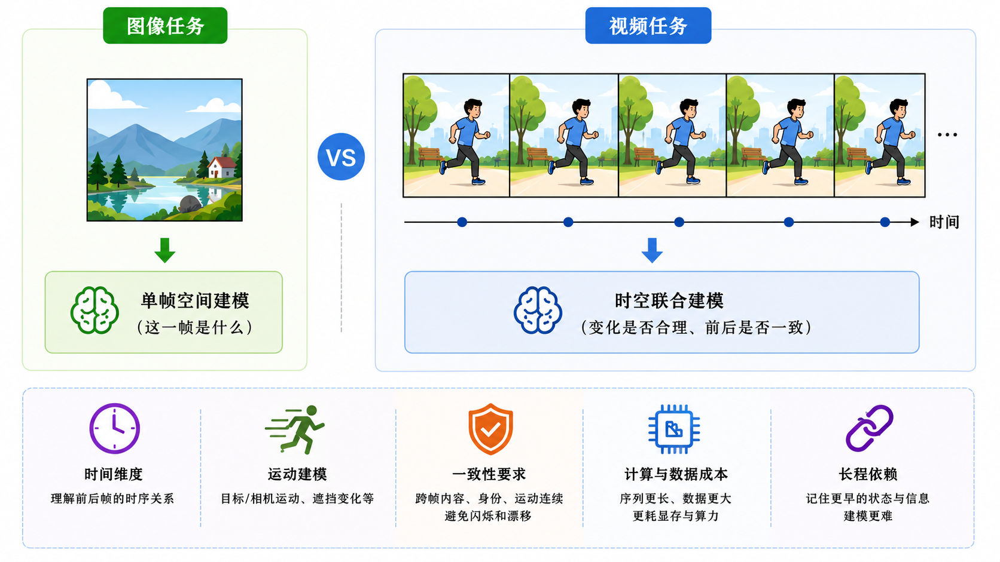</div>

<p align="center">图1-1 视频任务相对图像任务新增的时间维度、运动建模与一致性约束示意图</p>

**第一，模型面对的是动态状态，而不是静态内容。** 同一组画面按不同顺序排列，可能表达完全不同的事件。模型需要识别动作阶段、状态转移和因果先后，而不只是单帧中的对象与布局。

**第二，跨帧对应关系并不稳定。** 目标运动、相机运动、形变、遮挡与再出现会同时发生。模型既要判断“什么在动、怎样动”，也要在可见信息变化时维持主体、场景和状态的一致性。

**第三，时间维会放大数据与计算问题。** 视频输入具有 $T \times H \times W$ 的时空规模，压缩或切分后的 token 数通常也随帧数增长；帧率、镜头切换、压缩质量和文本标注粒度的差异，还会增加训练数据的噪声。具体成本取决于压缩率、注意力方式和采样策略，不能简单理解为固定增加 $T$ 倍。

所以，“视频通常比图像更难”是同等任务目标下的总体判断，并不意味着任意视频任务都比任意图像任务难。真正增加的负担是：**在空间建模之外，同时处理时间顺序、运动变化和跨帧约束。**

> **面试速答**：视频相对图像新增了时间顺序、动态状态和跨帧对应关系。模型不仅要保证单帧正确，还要处理运动、遮挡与状态转移；同时，时空 token 和数据噪声也推高了训练成本。因此难点不在“多了几张图”，而在建模一个连续演化的过程。

参考资料：[Video Diffusion Models](https://arxiv.org/abs/2204.03458)、[ViViT](https://arxiv.org/abs/2103.15691)

<h2 id="4.1.1.2_面试问题：视频-Tensor-如何组织？维度顺序为什么重要？">4.1.1.2 面试问题：视频 Tensor 如何组织？维度顺序为什么重要？</h2>

**难度评分：⭐⭐ (2/5)  |  考察频率：⭐⭐⭐⭐ (4/5)**

视频通常用五维 Tensor 表示，常见布局是 $[B, T, C, H, W]$ 或 $[B, C, T, H, W]$。其中，$B$ 是批量大小，$T$ 是帧数，$C$ 是通道数，$H$、$W$ 是单帧的高和宽。**布局没有统一答案，必须服从后续算子的输入约定。**

两种常见组织方式如图1-2所示。

<div align="center">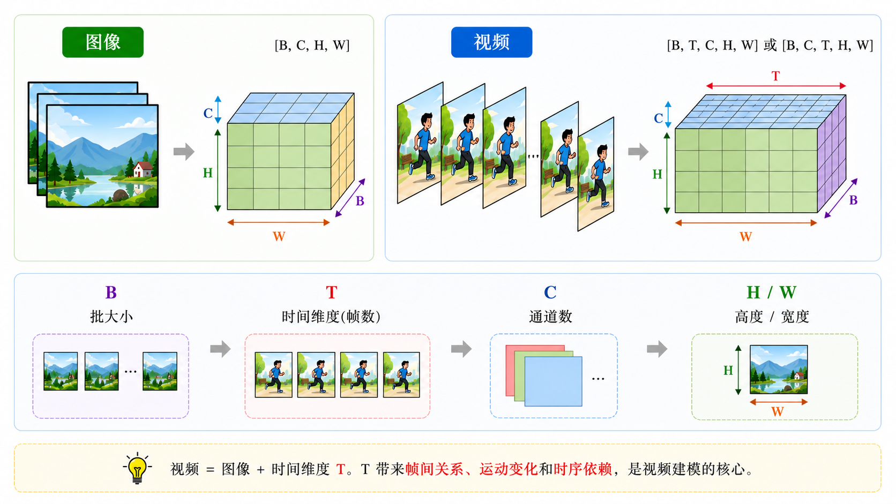</div>

<p align="center">图1-2 视频数据常见 Tensor 组织形式示意图</p>

**两种布局服务于不同接口。** $[B, T, C, H, W]$ 便于按帧读取、增强或送入二维图像主干；以 PyTorch `Conv3d` 为例，算子要求通道在前，对应 $[B, C, T, H, W]$。其他框架或模块可能采用 channels-last，因此工程中应先查接口，而不是凭经验猜维度。

**换维度不等于建模时间。** `permute` 只改变维度顺序；把 $B$ 和 $T$ 合并成 $B \times T$，也只是让二维主干逐帧提取特征。只有后续模块让不同时间位置发生信息交互，模型才真正利用了时序关系。

**工程上最容易错的是还原顺序。** 若逐帧特征在进入时间模块前没有按原来的 $B$、$T$ 正确恢复，帧可能被串到不同样本中；时间位置编码、padding mask 和帧率信息也必须与 $T$ 维同步。此类错误未必立即报错，却会让模型学到错误的跨帧关系。

> **面试速答**：视频常用 $[B,T,C,H,W]$ 或 $[B,C,T,H,W]$，没有脱离算子接口的“标准顺序”。换维度只是数据布局变换，把 $B$、$T$ 合并也只是逐帧计算；进入时间模块前必须恢复正确帧序，并同步位置编码和 mask，否则形状可能正确，时序语义却已经错了。

<h2 id="4.1.1.3_面试问题：逐帧处理与时空联合建模有什么区别？">4.1.1.3 面试问题：逐帧处理与时空联合建模有什么区别？</h2>

**难度评分：⭐⭐⭐ (3/5)  |  考察频率：⭐⭐⭐⭐⭐ (5/5)**

两者的根本区别是：**当前帧的表示或预测，能否依赖其他帧。** 逐帧处理只共享模型参数，各帧之间不交换信息；时空联合建模则显式建立跨帧信息通路。

逐帧处理与跨帧交互的差异如图1-3所示。

<div align="center">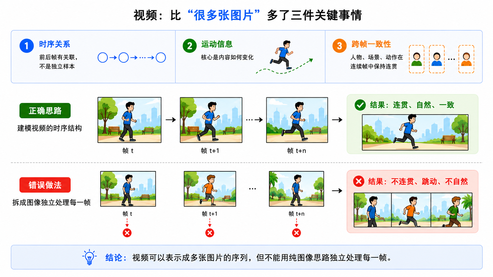</div>

<p align="center">图1-3 逐帧处理与时空联合建模差异示意图</p>

**逐帧处理解决单帧空间问题。** 常见做法是把输入整理为 $[B \times T, C, H, W]$，复用二维 CNN、图像 Transformer 或图像 VAE。它适合提取外观特征、处理逐帧分割，也能充分复用图像预训练权重；但在这一阶段，第 $t$ 帧看不到其他帧，无法独立判断运动方向或保持跨帧状态。

**时空联合建模负责建立跨帧依赖。** 时间卷积、3D 卷积、时间注意力或全时空注意力都可以让不同时间位置交换信息。它们的感受野和计算成本不同，但共同目标都是让模型利用帧序、运动和状态变化，而不是分别处理每一帧。

二者并非只能二选一。实际模型经常先用二维模块提取逐帧空间特征，再插入时间模块；空间与时间分解建模也属于时空模型，只要时间路径确实参与了预测。排查时可以在相同输入上打乱帧序或关闭时间模块，观察特征与输出是否按预期变化。若结果几乎不变，需要进一步检查时间路径是否被旁路、mask 是否错误，或当前任务本身是否对顺序不敏感。

> **面试速答**：逐帧处理只是在所有帧上复用同一个图像模型，当前帧看不到其他帧；时空联合建模则通过时间卷积或注意力等机制建立跨帧依赖。逐帧模块可以是视频模型的一部分，但若整条链路都没有跨帧交互，模型就难以可靠建模运动、帧序和状态连续性。

参考资料：[ViViT](https://arxiv.org/abs/2103.15691)、[Video Diffusion Models](https://arxiv.org/abs/2204.03458)

---

<h1 id="4.1.2_视频基本参数：帧、帧率、时长、分辨率、码率与采样">4.1.2 视频基本参数：帧、帧率、时长、分辨率、码率与采样</h1>

> 本节区分源视频参数、模型输入规格与采样策略。三者相互影响，但不能混为一谈：源视频有自己的帧率和码率，模型实际看到的是经过解码、缩放与时间采样后的帧序列。

<h2 id="4.1.2.1_面试问题：FPS、采样间隔和输入时长是什么关系？">4.1.2.1 面试问题：FPS、采样间隔和输入时长是什么关系？</h2>

**难度评分：⭐⭐⭐ (3/5)  |  考察频率：⭐⭐⭐⭐ (4/5)**

FPS 表示每秒记录或输出多少帧。对模型而言，还要区分**源视频帧率**与**实际采样帧率**：前者描述原始时间网格，后者由解码和采样策略决定，才是模型真正看到的时间分辨率。

**三个量怎样换算**

在恒定帧率视频中，若源帧率为 $f_{src}$，每隔 $s$ 帧取一帧，则采样帧率近似为

$$
f_{sample}=\frac{f_{src}}{s}.
$$

输入 $T$ 帧时，首帧到末帧的时间戳跨度为

$$
\Delta t_{clip}=\frac{T-1}{f_{sample}}.
$$

这里的 $s$ 是采样步长。若把每帧的显示持续时间也计入，clip 的名义时长常写成 $T/f_{sample}$；讨论数据覆盖范围时，更严谨的是说明采用哪一种口径。无论使用哪种口径，固定 $T$ 时，提高采样帧率能看到更细的局部运动，但覆盖时长会缩短；降低采样帧率可以覆盖更长事件，快速动作却更容易漏采。

不同采样帧率下的时间分辨率差异如图1-4所示。

<div align="center">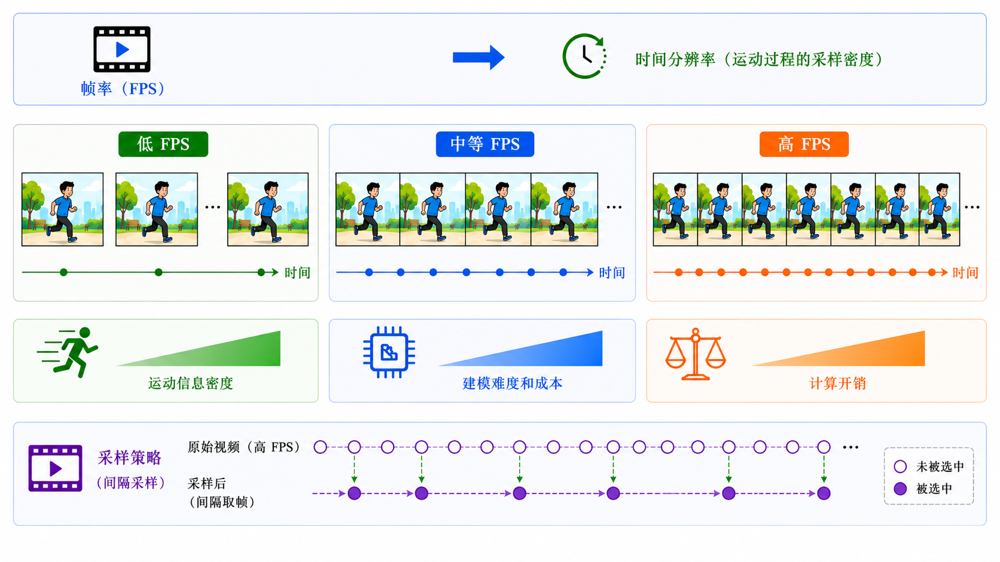</div>

<p align="center">图1-4 不同帧率下时间采样密度差异示意图</p>

**帧率怎样改变模型看到的运动**

帧率会同时改变模型看到的运动幅度和运动速度分布。采样过密时，相邻帧高度相似，计算增加但新增信息有限；采样过疏时，快速运动可能发生时间混叠，看起来像跳变，甚至丢失短时事件。因此，FPS 并非越高越好，需要与动作速度、目标时间范围和 token 预算一起设定。

**什么时候不能只看帧下标**

工程上不能只根据帧下标推算时间。真实数据可能包含可变帧率、丢帧或不规则时间戳；涉及速度、音画同步或跨数据集训练时，应保留时间戳或先归一到明确的目标采样帧率。训练和推理的采样帧率若不一致，相同物理运动会呈现不同的帧间位移，模型容易产生速度偏差。

> **面试速答**：FPS 决定时间采样密度，但模型实际看到的是采样后的帧率。源帧率为 $f_{src}$、每隔 $s$ 帧取一帧时，$f_{sample}\approx f_{src}/s$；固定输入帧数后，采样越密，局部运动越细但覆盖越短。工程上还要处理可变帧率和训练、推理采样不一致的问题。

参考资料：[FFmpeg 帧率定义](https://www.ffmpeg.org/ffmpeg-all.html)、[Torchvision UCF101 数据接口](https://docs.pytorch.org/vision/stable/generated/torchvision.datasets.UCF101.html)

<h2 id="4.1.2.2_面试问题：分辨率和码率有什么区别？它们如何影响训练数据？">4.1.2.2 面试问题：分辨率和码率有什么区别？它们如何影响训练数据？</h2>

**难度评分：⭐⭐ (2/5)  |  考察频率：⭐⭐⭐⭐ (4/5)**

分辨率描述单帧的像素网格，码率描述压缩码流单位时间使用的数据量。两者都会影响观看质量，但作用环节不同，不能用其中一个推断另一个。

二者的关键区别见表1-1。

**表1-1 分辨率与码率的作用边界**

| 参数 | 描述对象 | 对模型输入的直接影响 | 不能单独说明什么 |
| --- | --- | --- | --- |
| 分辨率 | 单帧的宽、高及像素数量 | 解码、缩放后决定空间 Tensor 大小和 token 数 | 不保证纹理清晰，也不能反映压缩损失 |
| 码率 | 压缩码流单位时间的数据量，通常以 bit/s 表示 | 不直接成为 Tensor 维度，但压缩伪影会保留在解码帧中 | 脱离编码器、分辨率、帧率和内容复杂度，不能直接比较画质 |

**码率与画质的关系有前提**

以相同编码器和编码设置为前提，提高码率通常可以减少压缩损失；一旦编码器、帧率或内容发生变化，这个比较就不再成立。例如，运动剧烈、纹理复杂的视频通常需要更多数据才能维持相近质量。因此，“1080p”只说明空间尺寸，“高码率”也不等于画面一定清晰。

**进入训练管线后，压缩痕迹仍然存在**

训练管线通常先将视频解码成像素帧，再做缩放、裁剪和归一化。码率在解码后不再表现为一个输入维度，但块效应、振铃、纹理涂抹等压缩痕迹仍在。若不同数据源的压缩分布差异很大，模型可能把压缩风格当成数据特征；只按分辨率筛选数据，发现不了这类问题。

> **面试速答**：分辨率是单帧的像素网格，直接影响空间 Tensor 和 token 数；码率是压缩码流每秒使用的数据量，不是模型输入维度。码率对画质的影响依赖编码器、分辨率、帧率和内容复杂度，解码后虽然看不到码率这个维度，压缩伪影仍会进入训练数据。

<h2 id="4.1.2.3_面试问题：固定输入帧数时，视频采样策略应该怎么选？">4.1.2.3 面试问题：固定输入帧数时，视频采样策略应该怎么选？</h2>

**难度评分：⭐⭐⭐ (3/5)  |  考察频率：⭐⭐⭐⭐⭐ (5/5)**

固定输入帧数时，先确定模型需要覆盖多长的真实时间，再选择采样间隔。采样策略解决的是**时间覆盖范围与运动分辨率之间的取舍**，不能只以“尽量均匀”作为默认答案。

**不同采样策略适合什么任务**

- **连续或密集采样**适合短时动作、局部运动估计和生成短视频，能保留细粒度变化，但时间覆盖有限。
- **均匀稀疏采样**适合需要概览较长事件的视频理解任务，代价是快速动作和瞬时事件可能被漏掉。
- **随机起点、随机步长或时间抖动**常用于训练增强，使模型接触不同速度和时间位置；评估阶段通常改用确定性采样或多 clip 聚合，保证结果可复现。
- **镜头或事件感知采样**适合长视频和稀有事件。它可以避免一个训练 clip 无意跨越镜头切点，也能提高关键片段被选中的概率，但依赖额外的切镜或事件检测结果。

**如何检查采样是否合理**

实际排查时先看三类分布：采样后 clip 覆盖的秒数、相邻帧时间差，以及 clip 是否跨镜头。若训练视频多为低速、短跨度片段，而推理要求快速运动或长事件，模型可能单帧正常，却在速度、动作阶段或事件顺序上出错。这里讨论的是单个样本怎样取帧；批量中的帧数、分辨率与长宽比分桶属于后续训练效率问题。

> **面试速答**：固定 $T$ 后，采样更密能保留快速运动，采样更疏能覆盖更长事件。短时动作适合连续采样，长事件适合稀疏采样，训练时可随机起点和步长增强速度鲁棒性；同时要检查采样后的时间跨度、帧间隔和跨镜头比例，避免训练与推理的时间分布错位。

---

<h1 id="4.1.3_视频任务坐标系：生成、编辑、理解与多模态条件">4.1.3 视频任务坐标系：生成、编辑、理解与多模态条件</h1>

> 本节从任务边界、编辑约束、条件作用和视频理解四个角度建立基础坐标系。重点是分清任务要解决什么问题，不提前展开条件注入、统一系统和 Video Agent 的具体架构。

视频生成、编辑与理解任务的关系如图1-5所示。

<div align="center">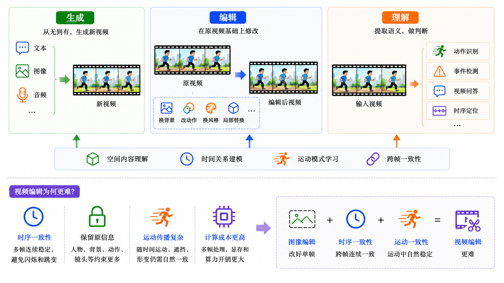</div>

<p align="center">图1-5 视频生成、视频编辑与视频理解任务全景示意图</p>

<h2 id="4.1.3.1_面试问题：视频生成、视频编辑和视频理解的任务边界是什么？">4.1.3.1 面试问题：视频生成、视频编辑和视频理解的任务边界是什么？</h2>

**难度评分：⭐⭐⭐ (3/5)  |  考察频率：⭐⭐⭐⭐⭐ (5/5)**

三类任务应按**主要输入、输出形式和约束目标**划分，不能根据模型名称或使用了哪种条件来判断。图1-5展示了三类任务的基本输入输出关系。

**三类任务分别解决什么问题**

- **视频生成**从文本、图像、音频或视频前缀等条件出发合成新视频，输出的主要内容原本并不存在。评价重点包括条件遵循、单帧质量、运动和时序稳定性。
- **视频编辑**以完整源视频为已知内容，按照指令修改指定对象、区域或时间段，同时尽量保持未授权修改的部分。它同时受到“改对”和“保留住”两类约束。
- **视频理解**以视频为主要输入，输出标签、文本、时间区间、对象轨迹或判断结果。它的目标是提取和推理视频中的语义与时序关系，不以合成新视频为必要条件。

**容易混淆的边界**

I2V 通常仍属于生成，因为输入图像只提供外观或起始状态，模型需要合成后续动态内容。V2V 只是输入接口名称：若任务要求围绕完整源视频定向修改并保持其余内容，更接近编辑；若源视频只作为宽松参考，输出可以整体重写，则更接近条件生成。同一个 backbone 也可能同时支持三类任务，任务边界不由架构是否共享决定。

> **面试速答**：生成是在条件约束下合成新视频；编辑以完整源视频为基础，修改指定内容并保持其余部分；理解则从视频中输出语义、位置、时间或判断。I2V、V2V 只描述输入接口，最终分类还要看源内容是否需要被精确保留，以及输出目标是什么。

参考资料：[Video Diffusion Models](https://arxiv.org/abs/2204.03458)、[TokenFlow](https://arxiv.org/abs/2307.10373)、[ViViT](https://arxiv.org/abs/2103.15691)

<h2 id="4.1.3.2_面试问题：视频编辑相对图像编辑新增了哪些约束？">4.1.3.2 面试问题：视频编辑相对图像编辑新增了哪些约束？</h2>

**难度评分：⭐⭐⭐⭐ (4/5)  |  考察频率：⭐⭐⭐⭐ (4/5)**

视频编辑在单帧修改之外，还要处理**随时间变化的编辑作用域、源视频保持和跨帧连续性**。图1-5下半部分概括了这些新增约束。

**编辑作用域会随运动变化**

图像编辑中的 mask 是固定二维区域，视频中的对象会移动、形变、被遮挡后再次出现。编辑区域必须沿时间传播，并在遮挡关系变化时重新判断可见区域。简单复制同一个 mask，常会留下漏改、边缘抖动或误伤背景。

**修改正确与源视频保持要同时满足**

目标区域既要符合编辑指令，非编辑区域又要维持原有身份、纹理、动作、光照和镜头运动。约束过弱会出现漏改或编辑结果不稳定；约束过强则可能压制合理变化，使结果僵硬，甚至把源视频压缩伪影一并锁住。

**先查重建，再查编辑传播**

工程排查通常先做无编辑或空指令重建，确认源视频能否稳定恢复；再检查动态 mask、对象轨迹和遮挡位置；最后比较编辑区是否生效、非编辑区是否发生非预期变化，以及播放时是否出现闪烁和漂移。若基础重建已经不稳定，直接调大编辑条件通常解决不了问题。

> **面试速答**：视频编辑新增了动态作用域、跨帧传播和源视频保持约束。编辑区域要随对象运动和遮挡变化，目标内容要改对，未编辑内容还要保持稳定。排查时先测无编辑重建，再看 mask 与轨迹，最后分别检查编辑区生效和非编辑区变化。

参考资料：[TokenFlow](https://arxiv.org/abs/2307.10373)

<h2 id="4.1.3.3_面试问题：不同模态条件分别解决什么控制问题？条件越多越好吗？">4.1.3.3 面试问题：不同模态条件分别解决什么控制问题？条件越多越好吗？</h2>

**难度评分：⭐⭐⭐ (3/5)  |  考察频率：⭐⭐⭐⭐ (4/5)**

不同模态条件提供的信息粒度不同：文本适合表达语义，参考图约束外观，姿态和深度约束空间结构，轨迹和相机参数约束运动，音频提供时间事件。条件数量增加并不自动提高可控性，关键是它们能否对齐并在各自作用范围内生效。

原始模态与信息作用并非一一对应。同一段参考视频既能提供外观，也能提供运动；音频既可能携带语义，也可能提供节奏。按条件实际提供的信息划分，作用边界见表1-2。

**表1-2 多模态条件的信息作用与对齐要求**

| 信息作用 | 主要解决的问题 | 常见输入 | 关键对齐要求 |
| --- | --- | --- | --- |
| 语义目标 | 生成或修改什么内容 | 文本、脚本、编辑指令、语音转写 | 主体、属性、动作与事件关系需要绑定正确 |
| 外观参考 | 主体或场景应该长什么样 | 首帧、参考图、参考视频 | 区分全局风格、主体身份与逐像素空间约束 |
| 空间结构 | 内容出现在哪里、保持什么几何关系 | mask、pose、depth、edge | 与目标帧的空间位置和分辨率对齐 |
| 运动与相机 | 对象和视角怎样随时间变化 | trajectory、光流、相机位姿、参考运动 | 与帧序、时间尺度和目标对象对齐 |
| 时间事件 | 事件在何时发生以及节奏如何变化 | 语音、音乐、环境声、时间标记 | 音素、节拍或事件与视频时间轴对齐 |

**条件冲突比条件缺失更难发现**

文本要求主体向左移动，轨迹却指向右侧；参考图要求固定外观，动作条件又要求大幅形变。模型可能偏向其中一路，也可能生成折中但不符合任何条件的结果。音频还需要区分“作为生成条件”和“作为联合输出”，这两个设定不能混为一类。

**用消融和冲突测试判断条件是否生效**

可以固定随机种子，依次置空、替换或扰动单路条件，观察输出是否只在预期的时间和空间范围内变化；再人为构造条件冲突，检查优先级是否稳定。这里只回答不同条件提供什么信息，具体编码和注入接口留到 4.2.1 展开。

> **面试速答**：文本管语义，参考图管外观，姿态和深度管空间结构，轨迹与相机参数管运动，音频管时间事件。条件越多，对齐、冲突和强弱失衡的问题越明显；判断条件是否有效，应做单路消融、错配和冲突测试，而不是只看多条件同时开启的样例。

参考资料：[VideoComposer](https://arxiv.org/abs/2306.02018)、[MotionCtrl](https://arxiv.org/abs/2312.03641)

<h2 id="4.1.3.4_面试问题：视频理解如何为视频生成与编辑提供可用的时空状态？">4.1.3.4 面试问题：视频理解如何为视频生成与编辑提供可用的时空状态？</h2>

**难度评分：⭐⭐⭐⭐ (4/5)  |  考察频率：⭐⭐⭐⭐⭐ (5/5)**

视频理解可以把像素序列转成对象、区域、轨迹、镜头和事件等时空状态。对带源视频的生成与编辑任务，这些状态用于定位条件作用范围、确定保留内容，并检查结果是否满足指令。

**理解模块需要产出什么**

- **对象与区域状态**：主体身份、分割区域、位置、轨迹、遮挡和再出现，用于把编辑指令绑定到正确对象。
- **时间与事件状态**：镜头边界、动作阶段、事件顺序和目标出现区间，用于确定从哪一帧开始、在哪段时间生效。
- **操作约束**：哪些区域允许修改，哪些内容需要保持，以及修改后应该检查哪些属性。

例如，“把第三个镜头中穿红衣的人换成蓝色外套”至少要求定位镜头区间、识别并跟踪目标、处理遮挡，同时保护其他人物和镜头运动。缺少其中任何一项，都可能出现漏改、改错对象或非编辑区域变化。

**理解能力不等于独立理解模型**

对象检测、分割和跟踪可以由独立模块显式完成，也可以由统一 backbone 的时空 token 隐式表示。简单 T2V 没有源视频需要解析，并不要求先运行视频理解模型；复杂 V2V、局部编辑和结果验证才更依赖对当前视频状态的解析。

**如何确认时空状态真的被使用**

可以替换目标对象、修改时间范围或制造短暂遮挡，观察编辑作用域是否随之变化；同时检查非编辑区域和镜头运动是否保持。若指令改变后作用区域不变，或目标遮挡后无法继续编辑，问题通常出在目标绑定、跟踪或时间定位，而不只是生成质量。

> **面试速答**：视频理解把源视频转成对象、区域、轨迹、镜头和事件等时空状态，生成或编辑模块据此判断改什么、何时改、哪些内容要保留。它可以来自独立检测与跟踪模块，也可以内化在统一模型中；简单 T2V 并不要求单独执行视频理解。

参考资料：[SAM 2](https://arxiv.org/abs/2408.00714)、[TokenFlow](https://arxiv.org/abs/2307.10373)

---

<h1 id="4.1.4_视频的时空属性：Spatial、Temporal-与-Motion">4.1.4 视频的时空属性：Spatial、Temporal 与 Motion</h1>

> 本节解释视频建模中最基础的三个维度：空间、时间和运动。三者共同决定视频模型是否真正理解了动态视觉内容。

Spatial、Temporal 与 Motion 的关系如图1-6所示。

<div align="center">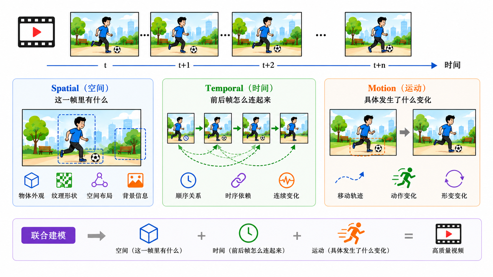</div>

<p align="center">图1-6 视频中 Spatial、Temporal 与 Motion 三个维度关系示意图</p>

<h2 id="4.1.4.1_面试问题：Spatial、Temporal、Motion-分别指什么？">4.1.4.1 面试问题：Spatial、Temporal、Motion 分别指什么？</h2>

**难度评分：⭐⭐ (2/5)  |  考察频率：⭐⭐⭐⭐⭐ (5/5)**

这三个概念分别对应视频建模中的三个基本维度。

**Spatial** 指单帧内部的空间内容，包括对象、纹理、颜色、形状、布局、背景和局部结构。它主要回答“画面里有什么”。

**Temporal** 指帧与帧之间的时间顺序和依赖关系，包括前后状态如何衔接、事件如何展开、哪些信息需要跨时间保留。它主要回答“前后如何连接”。

**Motion** 指视频中随时间发生的变化模式，包括目标运动、相机运动、姿态变化、表情变化、遮挡和形变。它主要回答“内容如何变化”。

三者不能割裂理解。高质量视频既要求单帧空间质量高，也要求前后帧连续，还要求运动过程自然合理。

<h2 id="4.1.4.2_面试问题：Temporal-和-Motion-是一回事吗？">4.1.4.2 面试问题：Temporal 和 Motion 是一回事吗？</h2>

**难度评分：⭐⭐⭐ (3/5)  |  考察频率：⭐⭐⭐⭐ (4/5)**

Temporal 和 Motion 相关，但不是同一个概念。

Temporal 更强调时间维度上的顺序、依赖和连续性；Motion 更强调时间维度中具体发生了什么变化。Temporal 是关系框架，Motion 是动态内容。

Temporal 与 Motion 的区别如图1-7所示。

<div align="center">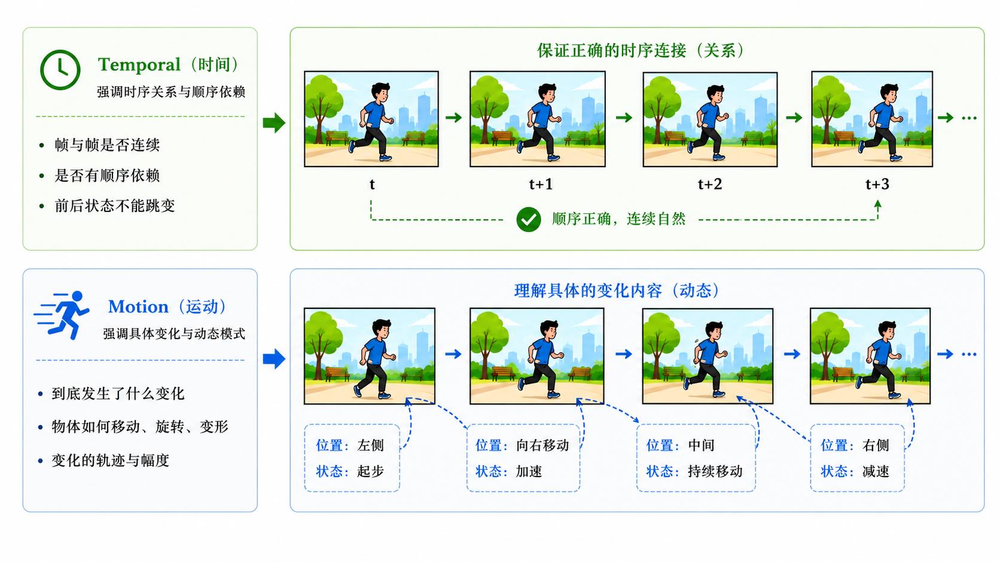</div>

<p align="center">图1-7 Temporal 与 Motion 区别示意图</p>

例如，一个人从左向右走：

- 人的位置连续变化，是 Motion。
- 这些帧必须按正确顺序连接，且状态不能跳变，是 Temporal。

因此，Temporal 关注“时间关系是否成立”，Motion 关注“变化内容是否合理”。面试中可以回答：**Motion 是时间维度上的动态变化，Temporal 是组织这些变化的时序依赖结构**。

<h2 id="4.1.4.3_面试问题：为什么运动建模是视频任务的核心？">4.1.4.3 面试问题：为什么运动建模是视频任务的核心？</h2>

**难度评分：⭐⭐⭐ (3/5)  |  考察频率：⭐⭐⭐⭐⭐ (5/5)**

运动建模是视频任务的核心，因为视频区别于图像的主要信息增量就在于动态变化。没有运动建模，视频模型容易退化为逐帧图像模型。

运动建模至少影响四类能力：

1. **动作理解**：识别人的行为、物体交互和事件过程。
2. **视频生成**：生成自然的位移、形变、镜头运动和动作节奏。
3. **视频编辑**：让编辑内容随目标运动稳定传播。
4. **长期一致性**：保持对象状态、相机关系和事件逻辑的连续。

在实际模型中，运动可以通过显式方式表示，例如光流、轨迹和姿态；也可以通过隐式方式学习，例如时空注意力、3D 卷积或视频 latent 中的动态特征。无论形式如何，核心目标都是让模型理解“变化本身”，而不是只生成一组外观相似的静态帧。

---

<h1 id="4.1.5_运动表征基础：光流、帧差、轨迹与隐式运动">4.1.5 运动表征基础：光流、帧差、轨迹与隐式运动</h1>

> 本节讨论运动如何被表示。光流、帧差、轨迹和隐式运动表征并不是互相替代的关系，而是不同粒度、不同假设和不同计算成本下的运动描述方式。

典型运动表征方式如图1-8所示。

<div align="center">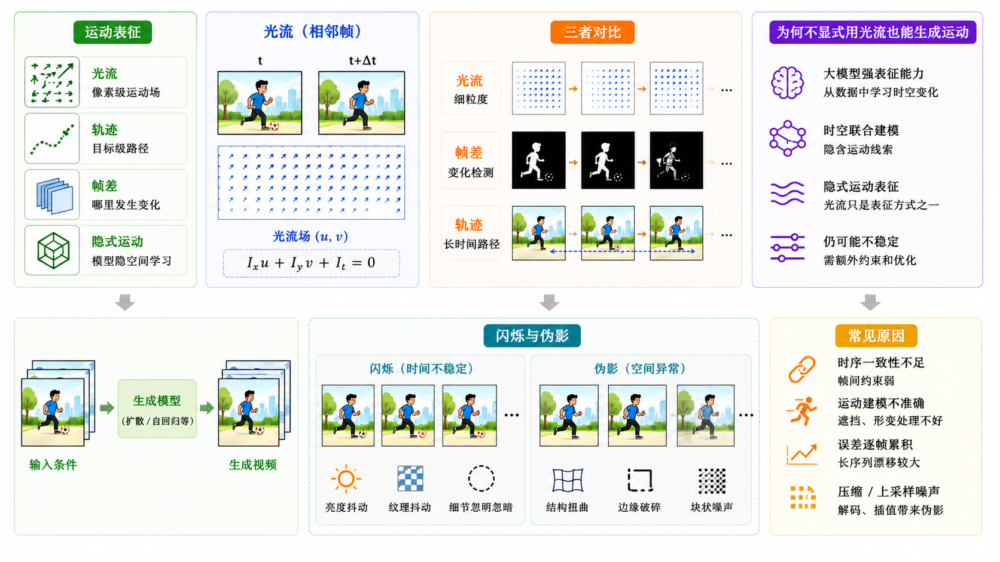</div>

<p align="center">图1-8 光流、轨迹、帧差与隐式运动表征对比示意图</p>

<h2 id="4.1.5.1_面试问题：什么是光流？它在视频算法中起什么作用？">4.1.5.1 面试问题：什么是光流？它在视频算法中起什么作用？</h2>

**难度评分：⭐⭐⭐ (3/5)  |  考察频率：⭐⭐⭐⭐⭐ (5/5)**

光流（Optical Flow）是描述相邻帧之间像素或局部区域表观运动的二维向量场。它通常不等同于真实三维速度，而是物体运动、相机运动、视角变化、遮挡和光照变化投影到图像平面后的结果。

经典光流约束来自亮度一致性假设：

```math
I(x, y, t) = I(x + u \Delta t, y + v \Delta t, t + \Delta t)
```

对其进行一阶近似，可得到光流约束方程：

```math
I_x u + I_y v + I_t = 0
```

其中 $u, v$ 表示像素在 $x, y$ 方向上的位移或速度分量，$I_x, I_y, I_t$ 表示图像在空间和时间上的偏导。

在视频算法中，光流常用于：

1. **运动估计**：描述局部区域如何移动。
2. **帧间对齐**：建立相邻帧之间的对应关系。
3. **特征传播**：将上一帧的特征或结果传播到下一帧。
4. **一致性约束**：在插帧、超分、编辑和生成任务中约束前后帧稳定。

面试中可以概括为：**光流是一种显式的像素级运动表征，核心价值是建立帧间对应关系并辅助时序一致性建模**。

<h2 id="4.1.5.2_面试问题：光流、帧差、目标轨迹有什么区别？">4.1.5.2 面试问题：光流、帧差、目标轨迹有什么区别？</h2>

**难度评分：⭐⭐⭐⭐ (4/5)  |  考察频率：⭐⭐⭐⭐ (4/5)**

三者都描述视频变化，但粒度和信息量不同。

**光流**是像素级或局部区域级运动场，能够描述运动方向和位移，信息细、成本高，对遮挡和光照变化敏感。

**帧差**是相邻帧直接做差，主要反映哪里发生变化。它实现简单、速度快，但通常无法准确给出运动方向，也难以区分物体运动、光照变化和噪声。

**目标轨迹**描述目标级位置随时间变化的路径，关注对象在较长时间范围内如何移动，常用于跟踪、动作分析和长程一致性建模。

一句话区分：**光流回答像素怎么动，帧差回答哪里变了，轨迹回答目标长期如何移动**。在面试中进一步补充它们的适用粒度和局限性，会比只给定义更有说服力。

<h2 id="4.1.5.3_面试问题：很多生成模型不显式使用光流，为什么仍然能生成运动？">4.1.5.3 面试问题：很多生成模型不显式使用光流，为什么仍然能生成运动？</h2>

**难度评分：⭐⭐⭐⭐ (4/5)  |  考察频率：⭐⭐⭐ (3/5)**

因为运动不一定必须以光流这种显式形式进入模型。大规模视频生成模型可以通过时空联合建模，在隐空间中学习运动规律。

主要原因包括：

1. **训练数据包含大量动态样本**：模型可以从视频分布中学习常见动作、镜头运动和物体交互。
2. **时空结构提供运动归纳偏置**：3D 卷积、Temporal Attention、时空 token 等结构可以直接建模跨帧关系。
3. **生成目标包含时间维度**：模型在预测视频 latent 或视频 token 时，需要同时解释空间内容和时间变化。
4. **隐式运动表征更灵活**：模型内部特征不一定对应可解释光流，但可以编码更高层的动作语义、姿态变化和镜头变化。

不过，不显式使用光流并不意味着运动问题已经被完全解决。很多模型仍会出现运动不稳定、局部形变、遮挡错误和身份漂移。更准确的说法是：**现代生成模型可以隐式学习运动，但精确、可控、可解释的运动建模仍然是视频生成的重要难点**。

---

<h1 id="4.1.6_时序建模基础：一致性、长程依赖、漂移与闪烁">4.1.6 时序建模基础：一致性、长程依赖、漂移与闪烁</h1>

> 本节讨论视频质量中最核心的时序问题。一致性、长程依赖、漂移和闪烁是面试中最常出现的基础概念，也是后续长视频生成和视频编辑章节的前置知识。

长程依赖、一致性与漂移的关系如图1-9所示。

<div align="center">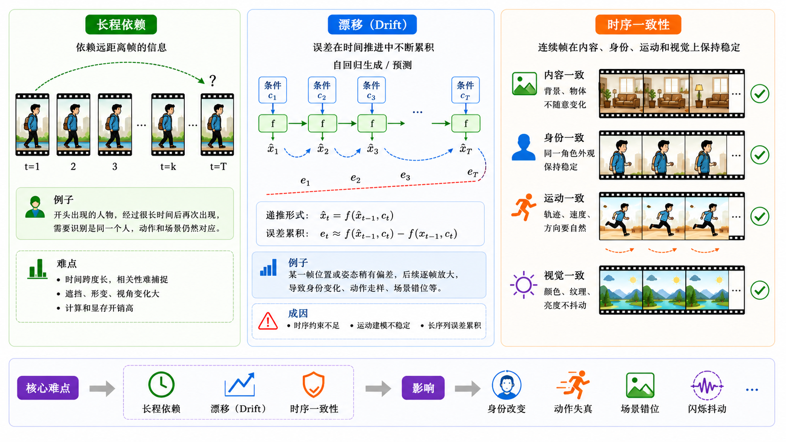</div>

<p align="center">图1-9 视频时序建模中长程依赖、一致性与漂移问题示意图</p>

<h2 id="4.1.6.1_面试问题：什么是视频中的时序一致性？">4.1.6.1 面试问题：什么是视频中的时序一致性？</h2>

**难度评分：⭐⭐⭐ (3/5)  |  考察频率：⭐⭐⭐⭐⭐ (5/5)**

时序一致性指视频在连续帧之间保持稳定、连续和合理，不能出现无意义的突变。它不是单一指标，而是一组跨帧约束。

常见层次包括：

1. **内容一致性**：场景、物体、背景和布局不能无故变化。
2. **身份一致性**：同一人物或对象的关键身份特征应保持稳定。
3. **运动一致性**：轨迹、速度、方向和动作节奏应自然连续。
4. **外观一致性**：颜色、纹理、亮度、边缘和清晰度不应随机抖动。
5. **编辑一致性**：在视频编辑任务中，修改应在相关帧持续生效，未编辑区域应保持稳定。

一致性问题的层次如图1-10所示。

<div align="center">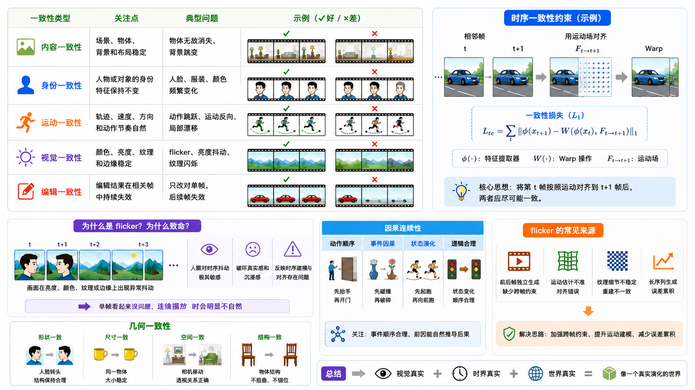</div>

<p align="center">图1-10 视频一致性层次示意图</p>

如果使用运动补偿约束，时序一致性损失可以抽象写成：

```math
\mathcal{L}_{tc}
= \sum_t
\left\|
\phi(x_{t+1})
- \mathcal{W}\left(\phi(x_t), F_{t \rightarrow t+1}\right)
\right\|_1
```

其中 $\phi(\cdot)$ 表示图像或特征提取器，$\mathcal{W}(\cdot)$ 表示 warp 操作，$F_{t \rightarrow t+1}$ 表示从第 $t$ 帧到第 $t+1$ 帧的运动场。该式表达的核心含义是：前后帧经过运动对齐后，其内容或特征应尽量一致。

面试中可以总结为：**时序一致性要求视频前后帧在内容、身份、运动和视觉属性上保持连续，是区分高质量视频和逐帧图像集合的关键标准**。

<h2 id="4.1.6.2_面试问题：什么是长程依赖？为什么视频中很难建模？">4.1.6.2 面试问题：什么是长程依赖？为什么视频中很难建模？</h2>

**难度评分：⭐⭐⭐ (3/5)  |  考察频率：⭐⭐⭐⭐ (4/5)**

视频中的长程依赖指当前帧的理解或生成，不只依赖附近几帧，还依赖更早或更晚的远距离帧信息。例如人物在开头出现，中间被遮挡，后面再次出现，模型仍需要保持身份、位置关系和事件状态的一致。

长程依赖难建模，主要有三方面原因：

1. **相关帧距离远**：关键上下文可能跨越几十帧甚至更长时间。
2. **状态变化复杂**：对象可能经历遮挡、形变、视角变化、光照变化和交互。
3. **计算成本高**：若直接让所有帧互相关注，注意力复杂度会随 token 数快速增长。

如果视频被切成 $N$ 个时空 token，标准全局注意力复杂度近似为：

```math
\mathcal{O}(N^2)
```

而视频 token 数通常与时间、分辨率和 patch 粒度有关：

```math
N \approx \frac{T}{\Delta T}
\cdot \frac{H}{\Delta H}
\cdot \frac{W}{\Delta W}
```

这解释了为什么长程依赖不仅是建模问题，也是计算问题。后续长视频章节会进一步讨论 chunk、sliding window、memory 和 hierarchical generation 等解决路径。

<h2 id="4.1.6.3_面试问题：视频任务里为什么容易出现漂移？">4.1.6.3 面试问题：视频任务里为什么容易出现漂移？</h2>

**难度评分：⭐⭐⭐ (3/5)  |  考察频率：⭐⭐⭐⭐ (4/5)**

漂移（drift）指视频在时间推进过程中逐渐偏离原始语义、身份、结构或运动轨迹。它常见于视频生成、视频编辑、视频预测和长视频拼接。

在递推生成或逐段生成中，可以将当前输出抽象为：

```math
\hat{x}_t = f(\hat{x}_{t-1}, c_t)
```

其中 $\hat{x}_{t-1}$ 是上一时刻预测结果，$c_t$ 是当前条件。如果上一时刻存在误差，后续帧会在该误差基础上继续生成，误差可能被逐步放大。

漂移常见原因包括：

1. **递推误差累积**：早期帧的小偏差传递到后续帧。
2. **条件约束不足**：文本、参考图或结构条件无法持续约束长时间过程。
3. **身份与状态记忆不足**：模型无法稳定保存人物、物体和场景状态。
4. **运动估计或对齐错误**：局部运动传播不准，导致结构逐渐错位。

因此，漂移的本质是**时序约束不足与误差累积共同作用**。面试回答中应避免只说“模型不稳定”，而要指出它通常来自长期记忆、条件约束、运动传播和递推误差的综合问题。

<h2 id="4.1.6.4_面试问题：什么是-flicker？为什么它在视频里很致命？">4.1.6.4 面试问题：什么是 flicker？为什么它在视频里很致命？</h2>

**难度评分：⭐⭐⭐ (3/5)  |  考察频率：⭐⭐⭐⭐⭐ (5/5)**

Flicker 指连续帧之间亮度、颜色、纹理、边缘或局部细节出现异常抖动。单帧观察时可能不明显，但连续播放时会表现为闪烁、跳变或细节不稳定。

Flicker 在视频中影响很大，原因是人眼对时间上的不连续非常敏感。图像中的轻微纹理误差可能可以接受，但视频播放时同一位置的纹理、光照或边缘反复变化，会立即破坏真实感和沉浸感。

常见来源包括：

1. **逐帧独立生成**：前后帧缺少共享约束。
2. **时序特征不稳定**：模型无法保持局部纹理和边缘连续。
3. **运动对齐错误**：目标运动、遮挡或形变没有被正确建模。
4. **解码或后处理不一致**：VAE 解码、超分、插帧或压缩可能放大局部不稳定。

因此，flicker 不只是视觉噪声，而是时序建模不足的外在表现。面试中可以总结为：**flicker 是跨帧视觉属性的不稳定抖动，是视频生成和编辑中最容易被感知的质量缺陷之一**。

---

<h1 id="4.1.7_视频表示学习与质量约束：从时空表征到世界一致性">4.1.7 视频表示学习与质量约束：从时空表征到世界一致性</h1>

> 本节从表示学习和质量约束两个角度收束本章。视频模型不仅要学习空间内容和时间变化，还要让生成或理解结果满足语义、几何、物理和因果层面的基本一致性。

逐帧表征、3D 表征与时空联合表征的关系如图1-11所示。

<div align="center">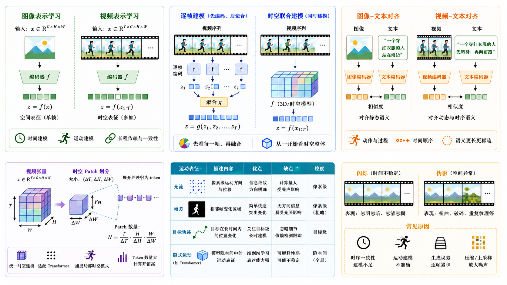</div>

<p align="center">图1-11 逐帧表征、3D 表征与时空联合表征示意图</p>

<h2 id="4.1.7.1_面试问题：视频表示学习和图像表示学习最大的区别是什么？">4.1.7.1 面试问题：视频表示学习和图像表示学习最大的区别是什么？</h2>

**难度评分：⭐⭐⭐ (3/5)  |  考察频率：⭐⭐⭐⭐ (4/5)**

图像表示学习主要学习单帧空间表征，而视频表示学习必须学习时空联合表征。

图像输入通常可表示为：

```math
x \in \mathbb{R}^{C \times H \times W}
```

视频输入通常可表示为：

```math
x_{1:T} \in \mathbb{R}^{T \times C \times H \times W}
```

因此，图像特征可以抽象为：

```math
z = f(x)
```

而视频特征更常写成：

```math
z = f(x_{1:T})
```

其中 $z$ 不仅编码单帧外观，还应编码动作、顺序、状态变化和长程依赖。

视频表示学习的额外挑战包括：

1. **时间依赖**：特征需要反映前后帧关系。
2. **运动模式**：特征需要编码位移、形变、遮挡和相机变化。
3. **事件过程**：特征需要描述动作阶段和事件演化，而不只是静态对象。
4. **一致性约束**：特征应支持身份、场景和运动状态的稳定跟踪。

因此，面试中可以概括为：**图像表征关注空间语义，视频表征关注时空语义；视频表示学习的核心增量是时间、运动和过程建模**。

<h2 id="4.1.7.2_面试问题：逐帧建模和时空联合建模有什么区别？">4.1.7.2 面试问题：逐帧建模和时空联合建模有什么区别？</h2>

**难度评分：⭐⭐⭐ (3/5)  |  考察频率：⭐⭐⭐⭐⭐ (5/5)**

逐帧建模先对每一帧独立提取特征，再在后续阶段融合时间信息。它可以写成：

```math
z_t = f(x_t), \quad t = 1, 2, \ldots, T
```

再通过聚合函数得到视频表示：

```math
z = g(z_1, z_2, \ldots, z_T)
```

这种方法实现简单，容易复用图像 backbone，但早期特征提取阶段缺少帧间交互，细粒度运动和短时动态容易被削弱。

时空联合建模则从一开始就把视频作为整体处理。例如 3D 卷积会同时覆盖时间和空间维度：

```math
y(t, h, w)
= \sum_{\tau}\sum_i\sum_j
W(\tau, i, j)\,
x(t+\tau, h+i, w+j)
```

Video Transformer 则通常将视频切成时空 token，并在 token 间建立空间和时间依赖。时空联合建模更适合捕捉运动、遮挡、动作顺序和跨帧一致性，但计算成本通常更高。

一句话总结：**逐帧建模是先看每一帧再融合，时空联合建模是从一开始就把视频作为时空整体建模**。

<h2 id="4.1.7.3_面试问题：Video-Text-Alignment-比-Image-Text-Alignment-难在哪里？">4.1.7.3 面试问题：Video-Text Alignment 比 Image-Text Alignment 难在哪里？</h2>

**难度评分：⭐⭐⭐⭐ (4/5)  |  考察频率：⭐⭐⭐ (3/5)**

Image-Text Alignment 主要对齐静态语义，例如对象、属性、场景和空间关系。Video-Text Alignment 还必须对齐动作、顺序、过程和事件边界。

例如，“一个人拿起杯子然后喝水”不仅要求识别人、杯子和喝水动作，还要求动作顺序正确：先拿起，再靠近嘴边，再喝。如果顺序错误，即使单帧内容合理，视频语义也不成立。

常见的视频文本对齐损失可以写成对比学习形式：

```math
\mathcal{L}_{align}
= - \log
\frac{\exp(\mathrm{sim}(v, t) / \tau)}
{\sum_j \exp(\mathrm{sim}(v, t_j) / \tau)}
```

其中 $v$ 是视频表示，$t$ 是文本表示，$\tau$ 是温度系数。难点不在损失形式本身，而在于视频表示 $v$ 是否真正编码了动作、时序和事件演化。

因此，Video-Text Alignment 的核心难点包括：

1. **动作语义对齐**：文本中的动词和视频中的运动模式要匹配。
2. **顺序语义对齐**：动作发生的先后顺序不能错。
3. **局部时间对齐**：一句文本可能只对应视频的一段，而不是全部帧。
4. **多粒度对齐**：需要同时对齐对象、动作、事件和全局叙事。

面试中可以总结为：**图文对齐主要是静态语义对齐，视频文本对齐还要处理动态语义、时序顺序和过程语义**。

<h2 id="4.1.7.4_面试问题：什么是视频生成中的几何一致性、物理合理性与因果连续性？">4.1.7.4 面试问题：什么是视频生成中的几何一致性、物理合理性与因果连续性？</h2>

**难度评分：⭐⭐⭐⭐ (4/5)  |  考察频率：⭐⭐⭐ (3/5)**

高质量视频生成不仅要求单帧清晰，还要求动态过程符合基本世界约束。几何一致性、物理合理性和因果连续性是其中最基础的三类约束，如图1-12所示。

<div align="center">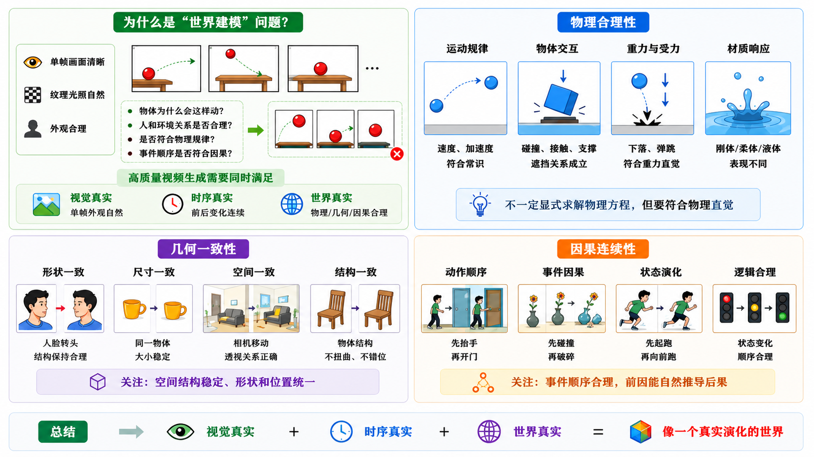</div>

<p align="center">图1-12 视频生成中几何、物理与因果约束示意图</p>

**几何一致性**强调空间结构稳定。人物转头、相机移动或物体旋转时，形状、相对位置、透视关系和遮挡关系应保持合理，不能出现结构错位、比例突变或空间关系混乱。

**物理合理性**强调运动和交互符合基本物理直觉。例如物体不能无故穿透桌面，碰撞应产生合理响应，重力、惯性、接触和支撑关系应大体成立。

**因果连续性**强调事件顺序和逻辑关系合理。例如应先接触物体再推动物体，先击中玻璃再出现破碎，而不是结果先于原因发生。

从面试角度看，这三者可以这样区分：

- 几何一致性回答“空间结构是否稳定”。
- 物理合理性回答“运动和交互是否符合基本规律”。
- 因果连续性回答“事件顺序和状态演化是否合理”。

因此，视频生成不只是生成连续像素，而是在有限模型能力下模拟一个随时间演化的视觉世界。这里不要求模型显式求解完整物理方程，但生成结果至少需要满足人类可感知的几何、物理和因果常识。

---

## 总结

本章的核心结论是：**AI 视频建模的基础不在于“多处理几张图”，而在于对时间、运动、一致性和世界约束的联合建模**。

需要重点掌握的基础判断包括：

- 视频相对图像新增了时间维度、运动变化和跨帧一致性约束。
- FPS、分辨率、码率和采样策略会直接影响模型输入规模、运动信息密度和训练成本。
- 生成、编辑和理解任务目标不同，但共享时空表征、运动建模和多模态对齐能力。
- 光流、帧差、轨迹和隐式运动是不同粒度的运动表征方式。
- 长程依赖、漂移和 flicker 是视频任务中最典型的时序问题。
- 高质量视频需要同时满足视觉质量、时序一致性、几何一致性、物理合理性和因果连续性。

后续章节将分别展开：视频生成模型的核心架构、经典模型路线、长视频与分镜叙事、训练与工程优化，以及统一视频生成、编辑与理解系统的发展趋势。

---

<div align="center">

*Last Updated: 2026-07-03*

</div>
