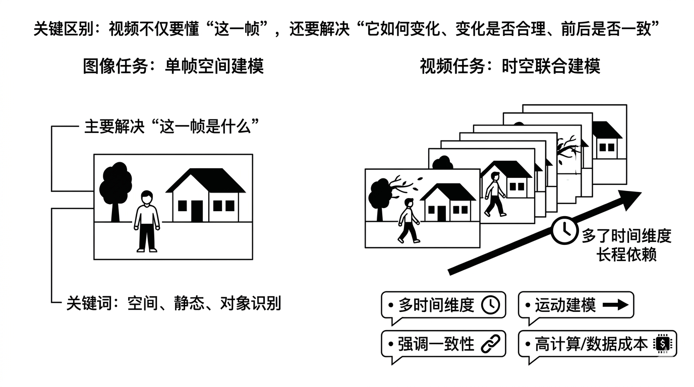
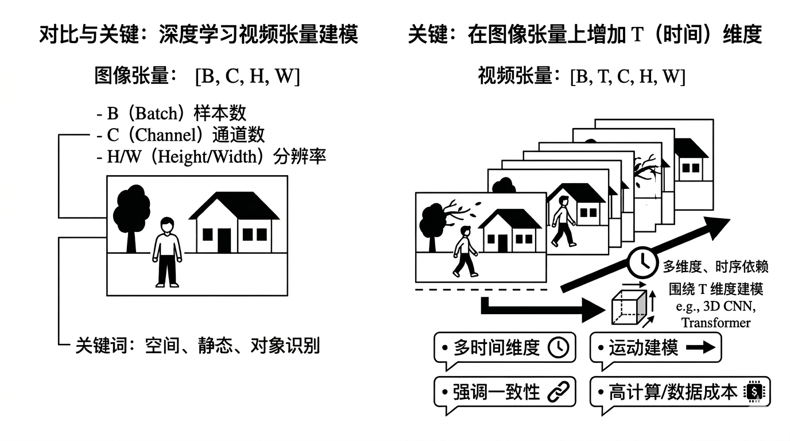
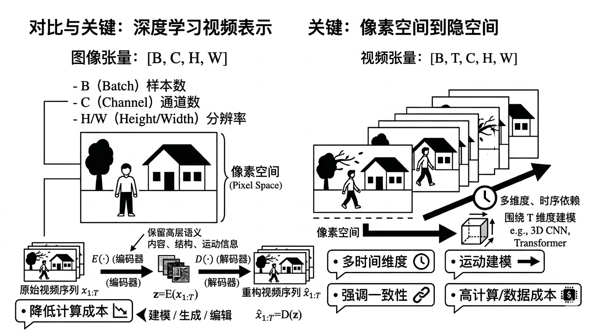
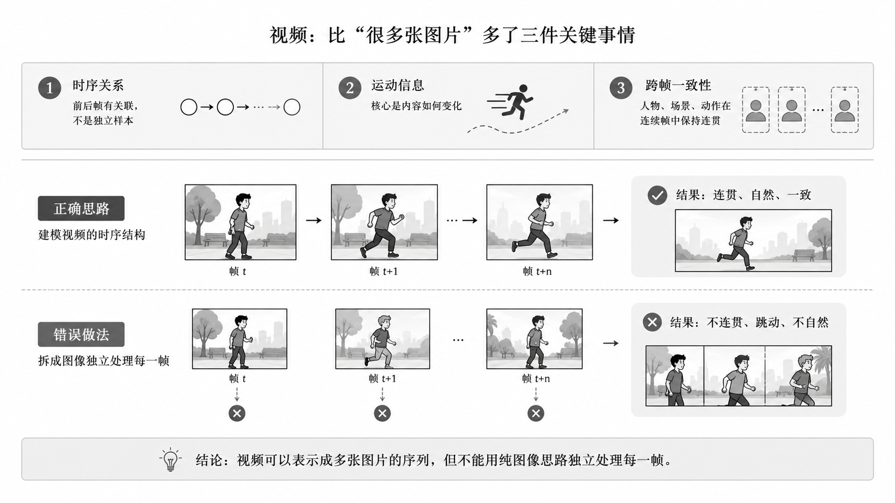
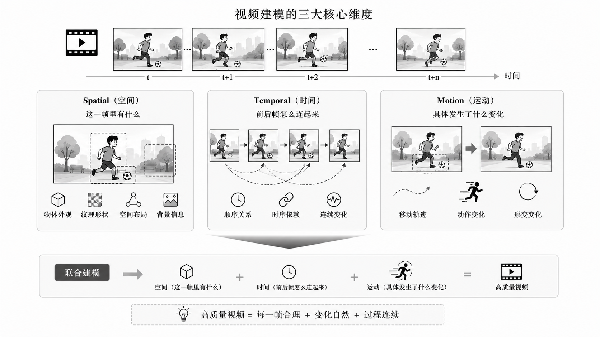
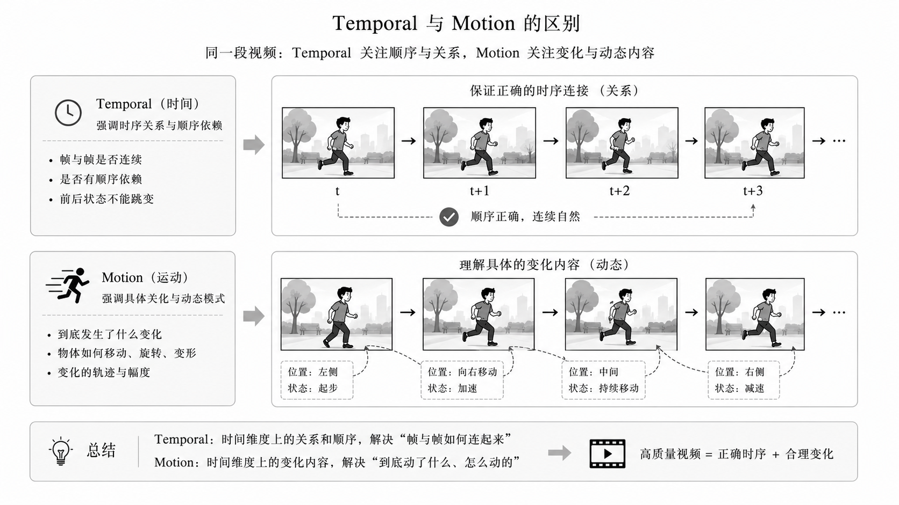
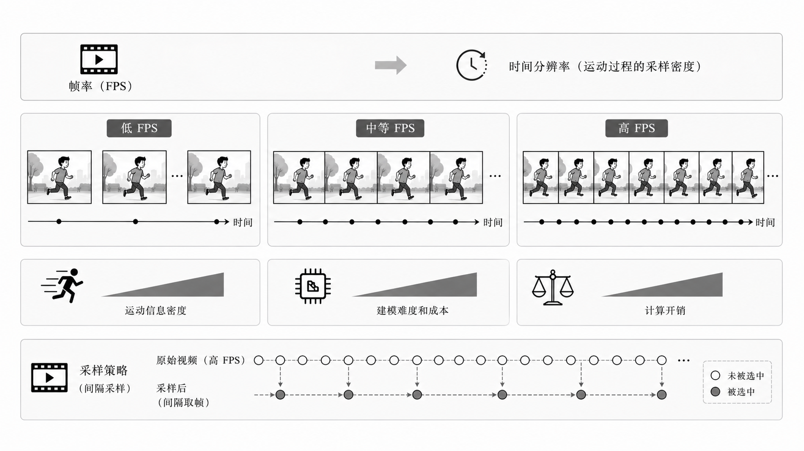

# 📺 第一章：AI 视频核心基础知识

> 💡 **本节目标**：系统梳理 AI 视频领域的核心概念、关键技术与核心趋势，帮助面试者建立完整的知识体系框架。

---

# 目录导航

[1.视频vs图像：视频建模到底多了什么？](#1.视频vs图像：视频建模到底多了什么？)
  - [面试问题：为什么视频任务通常比图像任务更难？](#面试问题：为什么视频任务通常比图像任务更难？)
  - [面试问题：视频数据在深度学习中的常见Tensor表示形状是什么？各维度代表什么？](#面试问题：视频数据在深度学习中的常见Tensor表示形状是什么？各维度代表什么？)
  - [面试问题：什么是"隐空间视频表示"（Video-Latent-Representation）？](#面试问题：什么是"隐空间视频表示"（Video-Latent-Representation）？)
  - [面试问题：能不能把视频简单看成很多张图片？](#面试问题：能不能把视频简单看成很多张图片？)

[2.视频的时空属性：Temporal/Spatial/Motion](#2.视频的时空属性：Temporal/Spatial/Motion)
  - [面试问题：AI视频里常说的spatial、temporal、motion分别指什么？](#面试问题：AI视频里常说的spatial、temporal、motion分别指什么？)
  - [面试问题：Temporal和Motion是一回事吗？](#面试问题：Temporal和Motion是一回事吗？)

[3.帧、帧率、时长、分辨率与码率的基本概念](#3.帧帧率时长分辨率与码率的基本概念)
  - [面试问题：帧率（FPS）对视频建模有什么影响？](#面试问题：帧率（FPS）对视频建模有什么影响？)
  - [面试问题：分辨率和码率有什么区别？](#面试问题：分辨率和码率有什么区别？)
  - [面试问题：为什么视频任务里经常要做采样？](#面试问题：为什么视频任务里经常要做采样？)

[4.视频任务全景：生成、编辑、理解的边界与联系](#4.视频任务全景：生成、编辑、理解的边界与联系)
  - [面试问题：视频生成、视频编辑、视频理解三者有什么区别？](#面试问题：视频生成、视频编辑、视频理解三者有什么区别？)
  - [面试问题：视频编辑为什么通常比图像编辑更难？](#面试问题：视频编辑为什么通常比图像编辑更难？)

[5.视频中的运动表征：光流、轨迹、帧差与隐式运动](#5.视频中的运动表征光流轨迹帧差与隐式运动)
  - [面试问题：什么是光流？它反映了什么？在视频算法中起什么作用？](#面试问题：什么是光流？它反映了什么？在视频算法中起什么作用？)
  - [面试问题：光流、帧差、目标轨迹有什么区别？](#面试问题：光流、帧差、目标轨迹有什么区别？)
  - [面试问题：现在很多生成模型不显式用光流，为什么还能生成运动？](#面试问题：现在很多生成模型不显式用光流，为什么还能生成运动？)
  - [面试问题：视频生成中的"闪烁（Flickering）"和"伪影（Artifacts）"通常是由什么引起的？](#面试问题：视频生成中的"闪烁（Flickering）"和"伪影（Artifacts）"通常是由什么引起的？)

[6.视频时序建模的核心难点：长程依赖、一致性与漂移](#6.视频时序建模的核心难点长程依赖一致性与漂移)
  - [面试问题：什么叫视频中的长程依赖？](#面试问题：什么叫视频中的长程依赖？)
  - [面试问题：视频任务里为什么容易出现漂移（drift）？](#面试问题：视频任务里为什么容易出现漂移（drift）？)
  - [面试问题：什么是视频中的时序一致性？](#面试问题：什么是视频中的时序一致性？)

[7.视频表示学习：逐帧表征、3D表征、时空联合表征](#7.视频表示学习、逐帧表征、3d表征、时空联合表征)
  - [面试问题：视频表示学习和图像表示学习最大的不同是什么？](#面试问题：视频表示学习和图像表示学习最大的不同是什么？)
  - [面试问题：什么是逐帧建模？什么是时空联合建模？](#面试问题：什么是逐帧建模？什么是时空联合建模？)
  - [面试问题：视频-文本对齐（Video-TextAlignment）与图像-文本对齐（Image-Text）最大的区别在哪？](#面试问题：视频-文本对齐（Video-TextAlignment）与图像-文本对齐（Image-Text）最大的区别在哪？)
  - [面试问题：什么是"时空Patch"（Space-TimePatches）？](#面试问题：什么是"时空Patch"（Space-TimePatches）？)

[8.视频中的一致性问题：内容一致性、身份一致性、运动一致性](#8.视频中的一致性问题内容一致性身份一致性运动一致性)
  - [面试问题：视频生成或编辑里，一致性通常包括哪些层面？](#面试问题：视频生成或编辑里，一致性通常包括哪些层面？)
  - [面试问题：什么是flicker？为什么它在视频里很致命？](#面试问题：什么是flicker？为什么它在视频里很致命？)

[9.视频生成中的"世界约束"：物理合理性、几何一致性与因果连续性](#9.视频生成中的世界约束物理合理性几何一致性与因果连续性)
  - [面试问题：为什么说高质量视频生成不仅是视觉问题，还是"世界建模"问题？](#面试问题：为什么说高质量视频生成不仅是视觉问题，还是"世界建模"问题？)
  - [面试问题：什么叫物理合理性？](#面试问题：什么叫物理合理性？)
  - [面试问题：什么是几何一致性和因果连续性？](#面试问题：什么是几何一致性和因果连续性？)

---

<h1 id="1.视频vs图像：视频建模到底多了什么？">1.视频vs图像：视频建模到底多了什么？</h1>

<h2 id="面试问题：为什么视频任务通常比图像任务更难？">面试问题：为什么视频任务通常比图像任务更难？</h2>

**难度评分：⭐⭐⭐ (3/5)  |  考察频率：⭐⭐⭐⭐⭐ (5/5)**

视频任务比图像任务更难，核心原因是：**视频不是单帧空间建模，而是时空联合建模。**

相比图像，视频主要多了以下几个难点：

1. **多了时间维度**：模型不仅要看懂当前帧，还要理解前后帧之间的时序关系。
2. **多了运动建模**：视频里存在目标运动、相机运动、遮挡变化等动态信息，建模难度更高。
3. **更强调一致性**：单帧生成得好还不够，还要保证跨帧内容一致、身份一致、运动连续，否则就容易出现闪烁和漂移。
4. **计算和数据成本更高**：视频序列更长、数据量更大，训练和推理都比图像更耗显存和算力。

另外，很多视频任务还涉及**长程依赖**，也就是模型不仅要看相邻几帧，还要记住更早之前出现的人物、场景和动作状态，这会进一步增加建模难度。

所以可以概括为一句话：**图像任务主要解决“这一帧是什么”，而视频任务还要解决“它如何变化、变化是否合理、前后是否一致”。**

<h2 id="面试问题：视频数据在深度学习中的常见 Tensor 表示形状是什么？各维度代表什么？">面试问题：视频数据在深度学习中的常见 Tensor 表示形状是什么？各维度代表什么？</h2>

**难度评分：⭐⭐ (2/5)  |  考察频率：⭐⭐⭐⭐ (4/5)**

视频在深度学习里常见的 Tensor 形状是 **[B, T, C, H, W]** 或 **[B, C, T, H, W]**，不同框架习惯不同，但含义一致：

- **B**：batch size，表示一批样本数
- **T**：时间维度，表示视频帧数
- **C**：通道数，比如 RGB 一般是 3
- **H / W**：帧的高和宽

如果是图像，常见形状通常只有 **[B, C, H, W]**，所以视频本质上就是在图像基础上多了一个 **T 维度**。

这个 T 维度非常关键，因为它不只是“多几帧数据”这么简单，而是意味着模型要额外处理**帧间关系、运动变化和时序依赖**。很多 3D CNN、Video Transformer、视频扩散模型，本质上都是围绕这个时间维度展开建模。

<h2 id="面试问题：什么是隐空间视频表示（Video-Latent-Representation）？">面试问题：什么是"隐空间视频表示"（Video-Latent-Representation）？</h2>

**难度评分：⭐⭐⭐⭐ (4/5)  |  考察频率：⭐⭐⭐⭐ (4/5)**

隐空间视频表示指的是：**先把原始视频压缩映射到一个更低维、更紧凑的特征空间，再在这个空间里做建模、生成或编辑。**

形式上通常可以写成：

$$
z = E(x_{1:T}), \qquad \hat{x}_{1:T} = D(z)
$$

其中 $E(\cdot)$ 是编码器，$D(\cdot)$ 是解码器，$x_{1:T}$ 是原始视频序列，$z$ 是视频在隐空间中的表示。

这样做的好处主要有两个：

1. **降低计算成本**：直接在像素空间处理视频太重，latent space 更省显存和算力。
2. **保留高层语义**：隐空间通常保留了内容、结构、运动等关键信息，更适合生成模型学习。

在视频生成里，可以把它理解为：**不是直接生成每个像素，而是先生成视频的紧凑语义表示，再解码回像素视频。**

这和图像生成里先进入 latent space 再建模是一个思路，只不过视频 latent 不仅要表示空间内容，还要尽量保留**时序和运动信息**。因此视频 latent 的设计通常会直接影响生成质量、时序一致性和计算效率。

<h2 id="面试问题：能不能把视频简单看成很多张图片？">面试问题：能不能把视频简单看成很多张图片？</h2>

**难度评分：⭐⭐ (2/5)  |  考察频率：⭐⭐⭐⭐⭐ (5/5)**

**不能完全这么看。**

视频从数据形式上确实可以看成一组连续帧，但从建模角度看，视频比“很多张图片”多了三件关键事情：

1. **时序关系**：前后帧之间是有关联的，不是独立样本。
2. **运动信息**：视频的核心不是静态内容，而是内容如何变化。
3. **跨帧一致性**：人物、场景、动作要在连续帧中保持连贯。

如果只是把视频拆成很多图像独立处理，往往会出现一个典型问题：**单帧看起来都不错，但拼起来不连贯。** 比如人物身份变化、背景跳动、动作不自然，这本质上都是忽略时序信息造成的。

所以更准确的说法是：**视频可以表示成多张图片的序列，但不能用纯图像思路独立处理每一帧。**

---

<h1 id="2.视频的时空属性：Temporal/Spatial/Motion">2.视频的时空属性：Temporal/Spatial/Motion</h1>

<h2 id="面试问题：AI视频里常说的 spatial、temporal、motion 分别指什么？">面试问题：AI视频里常说的 spatial、temporal、motion 分别指什么？</h2>

**难度评分：⭐⭐ (2/5)  |  考察频率：⭐⭐⭐⭐⭐ (5/5)**

这三个词分别对应视频建模里的三个核心维度：

- **Spatial（空间）**：指单帧内部的视觉内容，比如物体外观、纹理、形状、布局和背景信息，本质上和图像建模关注的内容比较接近。
- **Temporal（时间）**：指帧与帧之间的顺序关系和时序依赖，也就是模型要理解前一帧、当前帧、后一帧之间是怎么连续变化的。
- **Motion（运动）**：指视频中随时间发生的动态变化，比如人物移动、物体旋转、镜头推进、表情变化等。

可以简单理解为：**Spatial 解决“这一帧里有什么”，Temporal 解决“前后帧怎么连起来”，Motion 解决“具体发生了什么变化”。**

在 AI 视频任务里，这三者通常是一起建模的，因为高质量视频不仅要每一帧看起来合理，还要保证变化过程自然、连续。

<h2 id="面试问题：Temporal 和 Motion 是一回事吗？">面试问题：Temporal 和 Motion 是一回事吗？</h2>

**难度评分：⭐⭐⭐ (3/5)  |  考察频率：⭐⭐⭐⭐ (4/5)**

**不是一回事，但两者密切相关。**

Temporal 更强调的是**时间维度上的关系**，也就是帧与帧之间是否连续、是否有顺序依赖；  
Motion 更强调的是**时间维度上发生的具体变化内容**，也就是“到底动了什么、怎么动的”。

可以这样理解：

- **Temporal** 更偏“关系”和“顺序”
- **Motion** 更偏“变化”和“动态模式”

比如，一个人物从左走到右：

- 人物在连续帧中逐步移动，这体现的是 **motion**
- 这些帧必须按正确顺序连接起来，且前后状态不能跳变，这体现的是 **temporal**

所以，**Motion 是时间维度上的动态变化内容，Temporal 是这些变化所处的时序关系框架。**  
面试里如果要一句话回答，可以说：**Temporal 不等于 Motion，Temporal 更强调时序依赖，Motion 更强调具体运动本身。**

---

<h1 id="3.帧帧率时长分辨率与码率的基本概念">3.帧帧率时长分辨率与码率的基本概念</h1>

<h2 id="面试问题：帧率（FPS）对视频建模有什么影响？">面试问题：帧率（FPS）对视频建模有什么影响？</h2>

**难度评分：⭐⭐⭐ (3/5)  |  考察频率：⭐⭐⭐⭐ (4/5)**

帧率（FPS）表示**每秒包含多少帧图像**，它会直接影响视频的时间分辨率，也就是模型能看到多密的运动过程。

帧率对视频建模主要有几个影响：

1. **影响运动信息密度**：FPS 越高，相邻帧之间变化越小，运动过程更连续，细节更完整；FPS 太低时，动作会更跳，很多中间状态会丢失。
2. **影响建模难度和成本**：FPS 越高，单位时间内帧数越多，输入序列更长，训练和推理的显存、算力开销都会上升。
3. **影响采样策略**：很多视频任务不会直接用原始全部帧，而是按固定间隔采样，这本质上就是在信息保留和计算成本之间做权衡。

所以从面试角度可以总结为：**FPS 决定了视频时间维度上的采样密度，过低会丢运动细节，过高又会带来更大的计算负担。**

<h2 id="面试问题：分辨率和码率有什么区别？">面试问题：分辨率和码率有什么区别？</h2>

**难度评分：⭐⭐ (2/5)  |  考察频率：⭐⭐⭐⭐ (4/5)**

**分辨率**和**码率**都影响视频质量，但它们不是一回事。

- **分辨率**指的是视频帧的尺寸大小，比如 720p、1080p、4K，本质上描述的是一帧图像有多少像素。
- **码率**指的是单位时间内用于存储或传输视频的数据量，比如 Mbps。在**相同编码器、相同压缩设置**下，码率通常越高，压缩损失越小，保留的信息也越多。

可以这样理解：

- 分辨率决定的是“画面有多大、理论上能承载多少细节”
- 码率决定的是“这些细节最终保留了多少、压缩损失有多大”

所以一个视频即使分辨率很高，如果码率太低，也可能会出现模糊、块效应、压缩伪影；反过来，分辨率不高但码率合理，画面也可能比较干净。

面试里一句话回答就是：**分辨率是空间尺寸，码率是压缩后的信息量，两者都会影响视频质量，但作用层面不同。**

<h2 id="面试问题：为什么视频任务里经常要做采样？">面试问题：为什么视频任务里经常要做采样？</h2>

**难度评分：⭐⭐⭐ (3/5)  |  考察频率：⭐⭐⭐⭐⭐ (5/5)**

视频任务里经常要做采样，最核心的原因是：**原始视频帧太多，直接全量处理成本太高，而且很多相邻帧信息是冗余的。**

采样的作用主要有三个：

1. **降低计算成本**：减少输入帧数，降低显存、算力和训练时间开销。
2. **控制时间范围**：通过稀疏采样、均匀采样、关键帧采样等方式，让模型在有限预算内覆盖更长时间段。
3. **减少冗余信息**：很多相邻帧变化很小，如果全部输入，增益不一定大，但成本会显著上升。

当然，采样也有代价：如果采样过稀，就可能丢掉关键动作细节、快速运动信息或者短时事件。

所以本质上，**采样是在“时序信息保留”和“计算效率”之间做平衡。** 这也是视频模型设计里非常常见的工程与算法折中。

---

<h1 id="4.视频任务全景：生成、编辑、理解的边界与联系">4.视频任务全景：生成、编辑、理解的边界与联系</h1>

<h2 id="面试问题：视频生成、视频编辑、视频理解三者有什么区别？">面试问题：视频生成、视频编辑、视频理解三者有什么区别？</h2>

**难度评分：⭐⭐⭐ (3/5)  |  考察频率：⭐⭐⭐⭐⭐ (5/5)**

这三类任务都处理视频，但目标不同：

- **视频生成（Generation）**：重点是“从无到有”生成一段新视频，输入通常是文本、图像、音频或其他条件，输出是不存在的全新视频内容。
- **视频编辑（Editing）**：重点是“在原视频基础上做修改”，比如换背景、改动作、改风格、局部替换人物或物体。它不是完全重建，而是要在保留原视频主体信息的前提下完成改动。
- **视频理解（Understanding）**：重点是“让模型看懂视频”，比如动作识别、事件检测、视频问答、时序定位等，本质上是从视频中提取语义信息，而不是生成新内容。

它们的边界可以简单概括为：

- 生成：强调**创作新内容**
- 编辑：强调**保留原内容并定向修改**
- 理解：强调**提取语义和做判断**

但三者底层又有很多共通点，因为都要处理视频里的**空间内容、时间关系、运动模式和跨帧一致性**。所以很多现代视频模型会共享一部分 backbone 或时空建模能力，只是在任务头和目标函数上不同。

面试里一句话回答可以说：**视频生成是造视频，视频编辑是改视频，视频理解是读懂视频；三者任务目标不同，但都依赖时空联合建模能力。**

<h2 id="面试问题：视频编辑为什么通常比图像编辑更难？">面试问题：视频编辑为什么通常比图像编辑更难？</h2>

**难度评分：⭐⭐⭐⭐ (4/5)  |  考察频率：⭐⭐⭐⭐ (4/5)**

视频编辑通常比图像编辑更难，核心原因是：**图像编辑只需要改好一张图，而视频编辑需要在很多帧上连续地改，并且保证前后都一致。**

主要难点有几个：

1. **时序一致性要求更高**：修改后的内容不能只在某一帧合理，还要在连续帧中保持稳定，否则很容易出现闪烁、跳变和漂移。
2. **既要改动，又要保留原视频信息**：视频编辑通常不是完全重生成，而是要求保留原视频中的人物身份、背景结构、动作节奏、镜头关系，这个约束比图像编辑更多。
3. **运动传播更复杂**：编辑后的区域会随着时间运动、遮挡、形变，模型需要让修改结果跟着运动一起自然变化，而不是每帧独立贴上去。
4. **计算成本更高**：视频编辑要处理多帧内容，显存、算力和推理延迟都明显高于图像编辑。

所以本质上，**视频编辑 = 图像编辑 + 时序一致性约束 + 运动一致性约束**，这也是它通常更难的根本原因。

---

<h1 id="5.视频中的运动表征光流轨迹帧差与隐式运动">5.视频中的运动表征光流轨迹帧差与隐式运动</h1>

<h2 id="面试问题：什么是光流？它反映了什么？在视频算法中起什么作用？">面试问题：什么是光流？它反映了什么？在视频算法中起什么作用？</h2>

**难度评分：⭐⭐⭐ (3/5)  |  考察频率：⭐⭐⭐⭐⭐ (5/5)**

光流（Optical Flow）指的是：**图像中像素或局部区域在相邻帧之间的表观运动场。**

它反映的不是物体真实三维速度，而是**像素在图像平面上的二维位移趋势**，因此会受到物体运动、相机运动、视角变化、遮挡和光照变化等因素影响。

经典光流约束通常来自**亮度一致性假设（brightness constancy assumption）**，即同一个像素点在短时间内亮度近似不变：

$$
I(x, y, t) = I(x + u \Delta t, y + v \Delta t, t + \Delta t)
$$

对它做一阶泰勒展开后，可以得到经典的光流约束方程：

$$
I_x u + I_y v + I_t = 0
$$

其中 $u, v$ 分别是像素在 $x, y$ 方向上的速度分量， $I_x, I_y, I_t$ 分别是图像在空间和时间上的偏导数。

在视频算法里，光流的主要作用有几个：

1. **刻画运动信息**：帮助模型显式描述“哪里在动、往哪动、动了多少”。
2. **建立帧间对应关系**：常用于跨帧对齐、特征传播、视频插帧和时序跟踪。
3. **辅助一致性建模**：在视频生成、编辑和超分任务里，可以用来约束前后帧变化更平滑、更连续。

所以面试里可以概括为：**光流是一种显式运动表征，核心作用是描述相邻帧之间的像素运动趋势，并帮助模型进行帧间对齐与时序建模。**

<h2 id="面试问题：光流、帧差、目标轨迹有什么区别？">面试问题：光流、帧差、目标轨迹有什么区别？</h2>

**难度评分：⭐⭐⭐⭐ (4/5)  |  考察频率：⭐⭐⭐⭐ (4/5)**

这三者都和视频运动有关，但描述层次不同：

- **光流**：描述的是像素级或局部区域级的运动方向和位移，信息最细，但计算成本也最高。
- **帧差**：指相邻帧直接做差，反映的是“哪里变了”，实现简单、速度快，但只能粗略反映变化，不能准确给出运动方向和轨迹。
- **目标轨迹**：描述的是目标在更长时间范围内的位置变化路径，关注的是目标级运动，而不是像素级细节。

可以简单理解为：

- 光流更偏**细粒度运动场**
- 帧差更偏**快速变化检测**
- 轨迹更偏**目标级长期运动过程**

所以如果面试官问区别，一句话可以答：**光流看的是像素怎么动，帧差看的是哪里变了，轨迹看的是目标在长时间里怎么移动。**

<h2 id="面试问题：现在很多生成模型不显式用光流，为什么还能生成运动？">面试问题：现在很多生成模型不显式用光流，为什么还能生成运动？</h2>

**难度评分：⭐⭐⭐⭐ (4/5)  |  考察频率：⭐⭐⭐ (3/5)**

很多生成模型不显式用光流，仍然能生成运动，核心原因是：**运动信息可以被模型隐式地学到，而不一定非要手工定义成光流这种显式形式。**

原因主要有几点：

1. **大模型具备强表征能力**：Transformer、Diffusion 等模型可以直接从大规模视频数据中学习帧间变化规律。
2. **时空联合建模已经包含运动线索**：模型在关注多帧 token 或 latent 时，实际上已经在学习“哪些内容在变化、变化方向是什么、变化是否连续”。
3. **显式光流不是唯一运动表示**：光流只是运动的一种人工定义方式，模型也可以在隐空间里形成自己的运动表征。

当然，不显式使用光流并不代表运动问题已经完全解决。很多模型虽然能生成运动，但仍然可能出现动作不稳定、局部漂移、闪烁等问题，这说明**隐式学到运动**和**稳定控制运动**仍然是两回事。

所以面试里可以回答：**现代生成模型依靠大规模时空建模能力，可以在隐空间中自动学习运动规律，因此不一定需要显式光流；但显式光流在某些精细控制场景下仍然有价值。**

<h2 id="面试问题：视频生成中的&quot;闪烁（Flickering）&quot;和&quot;伪影（Artifacts）&quot;通常是由什么引起的？">面试问题：视频生成中的"闪烁（Flickering）"和"伪影（Artifacts）"通常是由什么引起的？</h2>

**难度评分：⭐⭐⭐⭐ (4/5)  |  考察频率：⭐⭐⭐⭐ (4/5)**

闪烁和伪影本质上都和**跨帧不稳定**有关，只是表现形式不同。

- **闪烁（Flickering）**：通常指前后帧在颜色、纹理、亮度、边缘或细节上不断抖动，看起来忽明忽暗或忽清忽糊。
- **伪影（Artifacts）**：通常指生成结果里出现不自然结构，比如重复纹理、局部扭曲、边缘破碎、形状异常、块状噪声等。

常见原因主要有：

1. **时序一致性建模不够**：模型每一帧都生成得还行，但前后帧没有很好约束，容易导致闪烁。
2. **运动建模不准确**：对目标运动、遮挡、形变理解不到位，容易在动态区域产生伪影。
3. **生成误差逐帧累积**：尤其在长视频或自回归生成里，前面小误差会被后续放大，形成漂移和异常结构。
4. **压缩或上采样过程带来噪声**：解码、插值、超分或视频压缩也可能放大局部伪影。

所以可以总结为：**闪烁主要体现为时间上的不稳定，伪影主要体现为空间结构上的异常，它们很多时候都源于时序一致性和运动建模不足。**

---

<h1 id="6.视频时序建模的核心难点长程依赖一致性与漂移">6.视频时序建模的核心难点长程依赖一致性与漂移</h1>

<h2 id="面试问题：什么叫视频中的长程依赖？">面试问题：什么叫视频中的长程依赖？</h2>

**难度评分：⭐⭐⭐ (3/5)  |  考察频率：⭐⭐⭐⭐ (4/5)**

视频中的长程依赖，指的是：**当前帧的内容或判断，不仅依赖附近几帧，还依赖更早或更晚的远距离帧信息。**

比如一个人物在视频开头出现，过了很多帧后再次出现，模型如果还要识别这是同一个人、动作逻辑是否连续、场景是否前后对应，这就涉及长程依赖。

它难的原因在于：

1. **时间跨度长**：相隔很远的帧之间相关性更难捕捉。
2. **中间会有遮挡、形变、视角变化**：即使是同一个对象，表现也可能差很多。
3. **计算成本高**：如果模型想同时关注很长序列，显存和计算量都会明显上升。

所以面试里可以概括为：**长程依赖就是模型需要记住较远时间范围内的信息，并把它用于当前帧的理解或生成。**

<h2 id="面试问题：视频任务里为什么容易出现漂移（drift）？">面试问题：视频任务里为什么容易出现漂移（drift）？</h2>

**难度评分：⭐⭐⭐ (3/5)  |  考察频率：⭐⭐⭐⭐ (4/5)**

视频任务里容易出现漂移，核心原因是：**前面的小误差会在后续帧中不断累积，最后导致内容越来越偏。**

如果把视频生成或预测写成递推形式：

$$
\hat{x}_t = f(\hat{x}_{t-1}, c_t)
$$

其中 $\hat{x}_{t-1}$ 是上一步的预测结果，$c_t$ 是当前条件，那么一旦前一时刻存在误差 $e_{t-1}$，后续时刻往往会继续放大这个误差，形成：

$$
e_t \approx f(\hat{x}_{t-1}, c_t) - f(x_{t-1}, c_t)
$$

这就是长视频里误差积累和内容逐步跑偏的根源。

这种情况在视频生成、视频预测、视频编辑和自回归建模里都很常见。比如模型在某一帧里把人物位置、姿态或背景细节生成得稍微有点偏，后面如果继续基于这帧往下生成，这个误差就会被一层层传下去，最后变成明显的身份变化、动作走样或场景错位。

漂移常见的成因有：

1. **时序约束不足**：模型没有足够强的跨帧一致性约束。
2. **运动建模不稳定**：对物体运动、遮挡和形变理解不准。
3. **长序列误差累积**：视频越长，小误差越容易放大。

所以可以简单理解为：**drift 就是视频在时间推进过程中逐渐“跑偏”，本质上是误差积累和时序建模不足共同造成的。**

<h2 id="面试问题：什么是视频中的时序一致性？">面试问题：什么是视频中的时序一致性？</h2>

**难度评分：⭐⭐⭐ (3/5)  |  考察频率：⭐⭐⭐⭐⭐ (5/5)**

时序一致性指的是：**视频在连续帧之间要保持合理、稳定、连贯，不能出现无意义的突变。**

它通常体现在几个层面：

1. **内容一致**：人物、物体、背景不能前后乱变。
2. **身份一致**：同一个角色在不同帧中要保持外观和身份稳定。
3. **运动一致**：动作轨迹、速度变化、方向变化要自然。
4. **视觉一致**：颜色、纹理、亮度、边缘不能无故抖动，否则就会出现 flicker。

时序一致性是视频任务和图像任务非常大的区别之一，因为图像只要求单帧好看，而视频要求**每一帧都合理，而且前后还能接得上。**

所以面试里一句话可以说：**时序一致性就是保证视频前后帧在内容、身份、运动和视觉上都连续稳定，是高质量视频建模的核心要求。**

---

<h1 id="7.视频表示学习、逐帧表征、3d表征、时空联合表征">7.视频表示学习、逐帧表征、3d表征、时空联合表征</h1>

<h2 id="面试问题：视频表示学习和图像表示学习最大的不同是什么？">面试问题：视频表示学习和图像表示学习最大的不同是什么？</h2>

**难度评分：⭐⭐⭐ (3/5)  |  考察频率：⭐⭐⭐⭐ (4/5)**

视频表示学习和图像表示学习最大的不同在于：**图像主要学习单帧空间表征，而视频必须学习时空联合表征。**

对于图像，输入通常是一张图片 $x \in \mathbb{R}^{C \times H \times W}$，模型重点学习的是物体外观、纹理、结构和空间关系；  
而对于视频，输入通常是一段序列 $x \in \mathbb{R}^{T \times C \times H \times W}$，模型不仅要理解每一帧的空间内容，还要建模帧间的时间依赖和运动变化。

因此，视频表示学习通常多了三层挑战：

1. **时间建模**：不仅要知道“这一帧是什么”，还要知道“前后帧如何变化”。
2. **运动建模**：要显式或隐式地刻画动作、位移、形变、遮挡和镜头变化。
3. **长程依赖与一致性**：较远帧之间也可能存在强相关，需要保持身份、动作和场景的连贯性。

如果用公式表达，图像表示通常可以写成：

$$
z = f(x)
$$

其中 $x$ 是单张图像，$z$ 是图像特征。  
而视频表示更常写成：

$$
z = f(x_{1:T})
$$

这里 $x_{1:T}$ 表示从第 1 帧到第 $T$ 帧的整段视频，说明特征 $z$ 是对整个时空序列的联合编码，而不是对单帧简单求平均。

所以面试里一句话可以概括为：**图像表示学习关注空间表征，视频表示学习关注时空表征；视频比图像多出来的核心是时间依赖、运动模式和跨帧一致性。**

<h2 id="面试问题：什么是逐帧建模？什么是时空联合建模？">面试问题：什么是逐帧建模？什么是时空联合建模？</h2>

**难度评分：⭐⭐⭐ (3/5)  |  考察频率：⭐⭐⭐⭐⭐ (5/5)**

**逐帧建模（Frame-wise Modeling）** 指的是：先把视频拆成一帧一帧的图像，对每一帧单独提特征，再在后面做简单聚合。  
典型思路是：

$$
z_t = f(x_t), \quad t = 1,2,\dots,T
$$

然后再对所有帧特征做平均池化、RNN 聚合或者 Transformer 聚合：

$$
z = g(z_1, z_2, \dots, z_T)
$$

这种方法的优点是实现简单、可以直接复用成熟的图像 backbone；缺点是前期没有显式建模时空交互，容易忽略细粒度运动信息。

**时空联合建模（Spatio-Temporal Joint Modeling）** 指的是：模型在特征提取阶段就同时处理空间和时间维度，让时空信息一起参与编码。  
例如 3D CNN 会直接在 $(T, H, W)$ 上做三维卷积，Video Transformer 会在 space-time token 上一起做 attention。

以 3D 卷积为例，其卷积核会同时覆盖时间和空间维度，形式上可以写成：

$$
y(t, h, w) = \sum_{\tau}\sum_{i}\sum_{j} W(\tau, i, j)\, x(t+\tau, h+i, w+j)
$$

这说明输出特征在计算时会同时聚合邻近时间片和邻近空间区域的信息，这也是 3D 表征相比逐帧表征更“原生视频化”的原因。

如果用一个更抽象的形式表示：

$$
z = f(x_{1:T})
$$

这里的 $f$ 不再是“先逐帧编码、后聚合”的两阶段结构，而是从一开始就把多帧当成一个整体来建模。

两者的核心区别可以总结为：

- 逐帧建模：**先看每一帧，再想办法融合**
- 时空联合建模：**从一开始就把视频当成时空整体**

所以面试里常见回答是：**逐帧建模偏“图像思路迁移”，时空联合建模偏“原生视频建模”，后者通常更适合捕捉运动和长时序关系。**

<h2 id="面试问题：视频 - 文本对齐（Video-Text Alignment）与图像 - 文本对齐（Image-Text）最大的区别在哪？">面试问题：视频 - 文本对齐（Video-Text Alignment）与图像 - 文本对齐（Image-Text）最大的区别在哪？</h2>

**难度评分：⭐⭐⭐⭐ (4/5)  |  考察频率：⭐⭐⭐ (3/5)**

视频 - 文本对齐和图像 - 文本对齐的核心区别在于：**图像只需要对齐静态语义，视频还需要对齐动态语义和时序语义。**

对于图像 - 文本对齐，文本通常描述的是单帧中的对象、属性和场景，例如“一个穿红衣服的人站在海边”；  
而视频 - 文本对齐除了这些静态信息，还经常涉及动作、顺序、状态变化和事件过程，例如“一个穿红衣服的人先转身，再向前跑”。

这意味着视频 - 文本对齐比图像 - 文本对齐更难，主要因为：

1. **文本里有动作和过程描述**：不仅要对齐“是什么”，还要对齐“怎么变化”。
2. **时序顺序不能错**：动作顺序一旦错了，语义就可能完全变掉。
3. **视频语义更长、更稀疏**：一段文本可能只对应视频里的部分帧或某个阶段，而不是每一帧都等价。

很多对齐方法本质上还是在做相似度学习，例如：

$$
\mathcal{L}_{align} = - \log \frac{\exp(\text{sim}(v, t) / \tau)}{\sum_j \exp(\text{sim}(v, t_j) / \tau)}
$$

其中 $v$ 是视频表示，$t$ 是文本表示，$\tau$ 是温度系数。  
和图像 - 文本对齐相比，难点不在这个损失形式本身，而在于**视频表示 $v$ 如何真正编码动作、顺序和事件演化**。

所以一句话总结就是：**Image-Text 对齐更多是静态语义对齐，Video-Text 对齐还要处理动作、时序和过程语义，因此更复杂。**

<h2 id="面试问题：什么是&quot;时空 Patch&quot;（Space-Time Patches）？">面试问题：什么是"时空 Patch"（Space-Time Patches）？</h2>

**难度评分：⭐⭐⭐⭐ (4/5)  |  考察频率：⭐⭐⭐ (3/5)**

时空 Patch 可以理解为：**不是只在单帧图像上切 patch，而是在视频的时间和空间维度上一起切分成小块。**

在图像 Transformer 中，一张图片通常会被切成若干二维 patch；  
而在视频 Transformer 中，输入是视频张量 $x \in \mathbb{R}^{T \times C \times H \times W}$，模型会在时间和空间上同时分块，例如切成大小为：

$$
(\Delta T, \Delta H, \Delta W)
$$

的三维小块，每一个小块就是一个 **space-time patch**。

如果视频总长度和空间尺寸分别是 $T, H, W$，那么 patch 数量大致为：

$$
N = \frac{T}{\Delta T} \cdot \frac{H}{\Delta H} \cdot \frac{W}{\Delta W}
$$

然后每个 patch 会被展平并映射成一个 token，送入 Transformer 进行时空建模。

它的好处是：

1. **统一建模空间和时间**：token 天然同时带有空间和时间信息。
2. **适配 Transformer 架构**：可以把视频表示成一串时空 token。
3. **更容易捕捉局部时空模式**：例如局部运动、短时动作、区域变化等。

当然，时空 patch 的数量通常比图像 patch 更多，所以 token 长度会迅速增长，这也是视频 Transformer 计算量大的一个重要原因。

所以面试里可以总结为：**时空 Patch 就是视频版的 patch token，只不过它不是二维图像块，而是三维的时间-空间小块，是视频 Transformer 建模的基础单元。**

---

<h1 id="8.视频中的一致性问题内容一致性身份一致性运动一致性">8.视频中的一致性问题内容一致性身份一致性运动一致性</h1>

<h2 id="面试问题：视频生成或编辑里，一致性通常包括哪些层面？">面试问题：视频生成或编辑里，一致性通常包括哪些层面？</h2>

**难度评分：⭐⭐⭐ (3/5)  |  考察频率：⭐⭐⭐⭐⭐ (5/5)**

在视频生成或编辑里，一致性通常不是单一概念，而是一个多层次约束，至少包括以下几个方面：

1. **内容一致性（Content Consistency）**  
   指场景、物体、背景、布局等内容在前后帧中保持连贯，不能无故出现、消失或结构突变。

2. **身份一致性（Identity Consistency）**  
   主要针对人物、动物或特定对象，要求它们在不同帧中保持相同身份特征，比如人脸、服装、体型、颜色和关键属性不能频繁变化。

3. **运动一致性（Motion Consistency）**  
   指运动轨迹、速度、方向和动作节奏要合理，前后帧之间的变化应符合自然运动规律，不能突然跳跃、反向或失真。

4. **时序一致性（Temporal Consistency）**  
   这是更高层的整体约束，强调视频帧与帧之间要连续稳定，不能出现闪烁、抖动、漂移和不自然的过渡。

5. **视觉一致性（Appearance Consistency）**  
   指颜色、亮度、纹理、边缘、清晰度等视觉属性要稳定，否则即使语义正确，视频看起来也会很“假”。

如果是视频编辑任务，还经常额外强调一种：

6. **编辑一致性（Edit Consistency）**  
   指用户要求修改的内容要在所有相关帧中持续生效，而且要和原视频其他未编辑部分保持协调，不能只改对某一帧。

在很多方法里，一致性还会通过显式约束来优化。例如，如果用光流或运动场 $F_{t \rightarrow t+1}$ 把第 $t$ 帧特征 warp 到第 $t+1$ 帧，那么常见的时序一致性损失可以写成：

$$
\mathcal{L}_{tc} = \sum_t \left\| \phi(x_{t+1}) - \mathcal{W}(\phi(x_t), F_{t \rightarrow t+1}) \right\|_1
$$

其中 $\phi(\cdot)$ 表示图像或特征提取器，$\mathcal{W}(\cdot)$ 表示 warp 操作。这个式子表达的含义是：前后帧在运动补偿后应该尽可能一致。

所以从面试角度可以总结为：**视频一致性至少包括内容、身份、运动、时序和视觉几个层面，本质上是在保证视频“前后是同一个世界、同一个对象、同一个连续过程”。**

<h2 id="面试问题：什么是 flicker？为什么它在视频里很致命？">面试问题：什么是 flicker？为什么它在视频里很致命？</h2>

**难度评分：⭐⭐⭐ (3/5)  |  考察频率：⭐⭐⭐⭐⭐ (5/5)**

**Flicker** 一般指视频在连续帧之间出现的亮度、颜色、纹理、边缘或细节的异常抖动现象。  
单看某一帧可能没问题，但连续播放时会感觉画面忽明忽暗、忽清忽糊，或者局部区域不断闪动。

它在视频里很致命，原因主要有三个：

1. **人眼对时序抖动非常敏感**  
   单帧上的轻微误差在图像任务里可能不明显，但一旦放到视频里连续播放，就会被人眼迅速感知出来。

2. **会破坏视频的真实感和沉浸感**  
   flicker 直接说明前后帧没有很好对齐，会让人觉得画面“不稳定”“不像真实世界”，这是视频生成质量下降最直观的表现之一。

3. **往往意味着底层时序建模有问题**  
   flicker 通常不是单一视觉噪声，而是时序一致性不足、运动建模不稳定、帧间特征传播不可靠等问题的外在表现。

它的常见来源包括：

- 前后帧独立生成，缺少跨帧约束
- 运动估计不准，导致对齐错误
- 纹理细节在不同帧中被不稳定地重建
- 长序列生成中误差累积

所以面试里可以一句话概括：**flicker 是视频帧间视觉属性的不稳定抖动，它之所以致命，是因为视频质量最怕“不连续”，而人眼对这种时序不稳定极其敏感。**

---

<h1 id="9.视频生成中的『世界约束』：物理合理性、几何一致性与因果连续性">9.视频生成中的『世界约束』：物理合理性、几何一致性与因果连续性</h1>

<h2 id="面试问题：为什么说高质量视频生成不仅是视觉问题，还是&quot;世界建模&quot;问题？">面试问题：为什么说高质量视频生成不仅是视觉问题，还是"世界建模"问题？</h2>

**难度评分：⭐⭐⭐⭐ (4/5)  |  考察频率：⭐⭐⭐ (3/5)**

之所以说高质量视频生成不仅是视觉问题，还是“世界建模”问题，是因为：**视频不仅要生成每一帧看起来像真的，还要让整个动态过程符合现实世界的运行规律。**

如果只是解决视觉问题，模型可能做到：

- 单帧画面清晰
- 纹理和光照看起来不错
- 人物、场景、物体外观比较自然

但这还不够。因为视频是连续变化的过程，模型还必须回答：

- 物体为什么会这样动？
- 人和环境之间的关系是否合理？
- 前后动作是否符合物理规律？
- 事件顺序是否符合因果逻辑？

举个例子，一个球从桌上掉下来，如果视频只在视觉上“像球”，但球先向上飘一下再落下，或者球穿过桌面，这说明它在视觉上可能没问题，但在“世界规律”上是错的。

所以高质量视频生成通常需要同时满足三类约束：

1. **视觉真实**：单帧外观自然
2. **时序真实**：前后变化连续稳定
3. **世界真实**：物理、几何、因果关系合理

从这个角度看，视频生成不只是生成像素，更是在生成一个随时间演化的“小世界”。  
所以面试里可以总结为：**图像生成更像“画一张逼真的图”，而视频生成更像“模拟一个真实世界在时间中的演化过程”。**

<h2 id="面试问题：什么叫物理合理性？">面试问题：什么叫物理合理性？</h2>

**难度评分：⭐⭐⭐ (3/5)  |  考察频率：⭐⭐⭐ (3/5)**

物理合理性指的是：**视频中的运动、交互和变化过程要符合基本物理规律，而不是只看起来像在动。**

它通常包括几个常见方面：

1. **运动规律合理**：速度、加速度、惯性变化不能明显违背常识。
2. **物体交互合理**：碰撞、接触、支撑、遮挡等关系要成立，比如杯子不能悬空不掉，人物不能无故穿墙。
3. **重力和受力合理**：抛物、下落、弹跳等现象要符合常见物理直觉。
4. **材质响应合理**：刚体、柔体、液体的运动方式应该不同，不能全部表现得一样。

需要注意的是，物理合理性不一定要求模型真的显式求解物理方程，而是要求生成结果**至少符合人类对现实世界的物理直觉**。

所以面试里一句话可以说：**物理合理性就是视频中的动作和交互不能违背基本物理常识，它是高质量视频生成从“像”到“真”的关键一步。**

<h2 id="面试问题：什么是几何一致性和因果连续性？">面试问题：什么是几何一致性和因果连续性？</h2>

**难度评分：⭐⭐⭐⭐ (4/5)  |  考察频率：⭐⭐⭐ (3/5)**

这两个概念都属于高质量视频生成里的“世界约束”，但关注点不同。

### 1. 几何一致性（Geometric Consistency）
几何一致性强调的是：**场景的空间结构、物体形状、相对位置和视角变化要前后统一。**

比如：

- 人脸转头时，五官结构要保持合理
- 相机移动后，场景透视关系要跟着正确变化
- 同一个物体在不同帧里不能忽大忽小、忽长忽短、结构错位

所以几何一致性本质上关注的是**空间结构不能崩**。

### 2. 因果连续性（Causal Coherence / Causal Continuity）
因果连续性强调的是：**事件的发生顺序和前后逻辑要合理，前面的状态能够自然推导出后面的结果。**

比如：

- 人先抬手，再打开门，而不是门先开了人再抬手
- 玻璃先被击中，再破碎，而不是先碎后碰
- 人物起跑之后才向前移动，而不是还没发力就已经冲出去

所以因果连续性本质上关注的是**事件链条不能乱**。

两者的区别可以简单概括为：

- **几何一致性**：关注空间结构是否稳定
- **因果连续性**：关注事件逻辑是否成立

如果再进一步总结：

- 几何一致性回答“这个世界的空间结构对不对”
- 因果连续性回答“这个世界里事情发生的顺序和逻辑对不对”

所以面试里可以用一句话收束：**几何一致性解决“形和空间别乱”，因果连续性解决“事和顺序别乱”，两者共同决定视频是否像一个真实演化的世界。**

---

## 📝 总结与展望

### 💎 核心要点回顾
- ✅ 视频建模的本质是**时空联合建模**
- ✅ 一致性是视频质量的**生命线**
- ✅ 运动表征是视频理解的**关键**
- ✅ 世界约束是生成质量的**保障**

### 🚀 前沿趋势
- 🔥 **统一架构**：Diffusion + Transformer 成为主流
- 🔥 **长视频生成**：从秒级向分钟级演进
- 🔥 **可控生成**：精细化控制成为研究热点
- 🔥 **物理感知**：世界模型与因果推理受重视

### 📚 延伸学习
- [AI视频基础 - 模型篇](../AI视频基础/02_视频生成核心基础架构模型.md)
- [深度学习基础 - 注意力机制](../深度学习基础/05_注意力机制.md)
- [大模型基础 - Transformer 架构](../大模型基础/经典模型与架构.md)

---

**💪 祝面试顺利，offer 拿到手软！**

*Last Updated: 2026-04-26*

