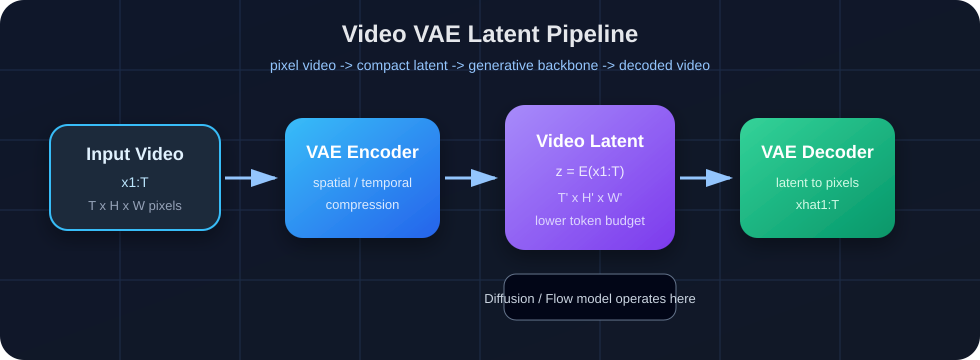
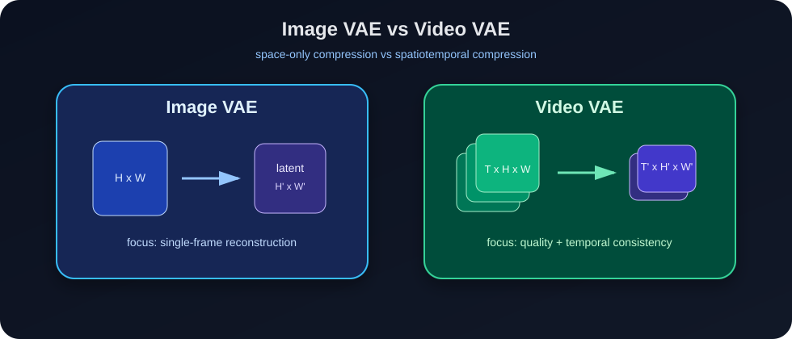
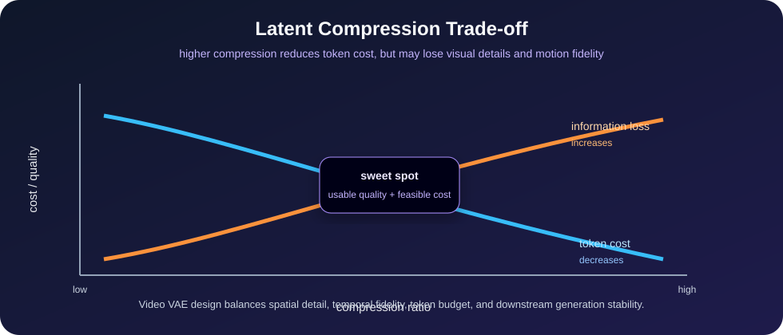

# 4.2 AI 视频核心基础架构模型

> 本章聚焦 AI 视频生成模型的底层架构：条件编码、视频压缩表示、生成目标、主干网络、时空建模和端到端系统数据流。这里不展开具体模型家族，也不讨论训练工程细节；目标是建立多年后仍然不过时的架构级理解。

---

# 目录导航

[4.2.1 条件编码与多模态条件注入：文本、图像、视频与结构控制如何进入模型](#4.2.1_条件编码与多模态条件注入：文本、图像、视频与结构控制如何进入模型)
  - [4.2.1.1 面试问题：视频生成模型为什么需要条件表示？一定要使用独立条件编码器吗？](#4.2.1.1_面试问题：视频生成模型为什么需要条件表示？一定要使用独立条件编码器吗？)
  - [4.2.1.2 面试问题：T5、CLIP 文本编码器与视觉条件编码路径分别保留什么信息？](#4.2.1.2_面试问题：T5、CLIP-文本编码器与视觉条件编码路径分别保留什么信息？)
  - [4.2.1.3 面试问题：如何选择 Cross-Attention、AdaLN、拼接与残差控制分支？](#4.2.1.3_面试问题：如何选择-Cross-Attention、AdaLN、拼接与残差控制分支？)

[4.2.2 Video VAE 与潜空间建模：为什么视频生成通常不直接在像素空间完成](#4.2.2_Video-VAE-与潜空间建模：为什么视频生成通常不直接在像素空间完成)
  - [4.2.2.1 面试问题：为什么现代视频生成模型通常在 latent space 中建模？](#4.2.2.1_面试问题：为什么现代视频生成模型通常在-latent-space-中建模？)
  - [4.2.2.2 面试问题：Video VAE 和 Image VAE 的核心区别是什么？](#4.2.2.2_面试问题：Video-VAE-和-Image-VAE-的核心区别是什么？)
  - [4.2.2.3 面试问题：视频 latent 压缩率如何影响质量、速度和时序一致性？](#4.2.2.3_面试问题：视频-latent-压缩率如何影响质量、速度和时序一致性？)

[4.2.3 视频生成目标：Diffusion、Flow Matching 与采样过程](#4.2.3_视频生成目标：Diffusion、Flow-Matching-与采样过程)
  - [4.2.3.1 面试问题：视频扩散模型的核心建模思想是什么？](#4.2.3.1_面试问题：视频扩散模型的核心建模思想是什么？)
  - [4.2.3.2 面试问题：Diffusion 和 Flow Matching 在生成目标上有什么区别？](#4.2.3.2_面试问题：Diffusion-和-Flow-Matching-在生成目标上有什么区别？)
  - [4.2.3.3 面试问题：噪声调度器、采样器和 CFG 在生成链路中分别负责什么？](#4.2.3.3_面试问题：噪声调度器、采样器和-CFG-在生成链路中分别负责什么？)

[4.2.4 生成主干网络：U-Net、DiT 与 Video Transformer](#4.2.4_生成主干网络：U-Net、DiT-与-Video-Transformer)
  - [4.2.4.1 面试问题：U-Net 为什么适合早期扩散模型？它的架构优势是什么？](#4.2.4.1_面试问题：U-Net-为什么适合早期扩散模型？它的架构优势是什么？)
  - [4.2.4.2 面试问题：为什么视频生成逐渐转向 DiT / Transformer 主干？](#4.2.4.2_面试问题：为什么视频生成逐渐转向-DiT-/-Transformer-主干？)
  - [4.2.4.3 面试问题：U-Net、DiT 和 Video Transformer 的核心差异是什么？](#4.2.4.3_面试问题：U-Net、DiT-和-Video-Transformer-的核心差异是什么？)

[4.2.5 时空建模模块：Temporal Layer、3D Conv、时空注意力与位置编码](#4.2.5_时空建模模块：Temporal-Layer、3D-Conv、时空注意力与位置编码)
  - [4.2.5.1 面试问题：为什么不能把图像生成主干简单复制到每一帧？](#4.2.5.1_面试问题：为什么不能把图像生成主干简单复制到每一帧？)
  - [4.2.5.2 面试问题：Temporal Conv、Temporal Attention 和 Full Spatiotemporal Attention 各解决什么问题？](#4.2.5.2_面试问题：Temporal-Conv、Temporal-Attention-和-Full-Spatiotemporal-Attention-各解决什么问题？)
  - [4.2.5.3 面试问题：为什么视频 Transformer 需要时空位置编码？3D RoPE 的作用是什么？](#4.2.5.3_面试问题：为什么视频-Transformer-需要时空位置编码？3D-RoPE-的作用是什么？)

[4.2.6 AI 视频生成系统架构总览：从条件输入到视频输出](#4.2.6_AI-视频生成系统架构总览：从条件输入到视频输出)
  - [4.2.6.1 面试问题：一个典型 AI 视频生成系统的端到端流程是什么？](#4.2.6.1_面试问题：一个典型-AI-视频生成系统的端到端流程是什么？)
  - [4.2.6.2 面试问题：视频生成系统的核心组件如何协同工作？](#4.2.6.2_面试问题：视频生成系统的核心组件如何协同工作？)
  - [4.2.6.3 面试问题：从架构角度看，视频生成系统最核心的设计权衡是什么？](#4.2.6.3_面试问题：从架构角度看，视频生成系统最核心的设计权衡是什么？)

---

<h1 id="4.2.1_条件编码与多模态条件注入：文本、图像、视频与结构控制如何进入模型">4.2.1 条件编码与多模态条件注入：文本、图像、视频与结构控制如何进入模型</h1>

> 条件系统要解决两个接口问题：先把文本、参考图、首帧、源视频、音频、mask、pose、depth、trajectory 等输入变成合适的表示，再把这些表示注入生成主干。编码路径决定模型保留了什么信息，注入位置决定这些信息能影响哪些时空 token。

<h2 id="4.2.1.1_面试问题：视频生成模型为什么需要条件表示？一定要使用独立条件编码器吗？">4.2.1.1 面试问题：视频生成模型为什么需要条件表示？一定要使用独立条件编码器吗？</h2>

**难度评分：⭐⭐⭐ (3/5)  |  考察频率：⭐⭐⭐⭐⭐ (5/5)**

模型需要的是**条件表示**，并不要求每种条件都配一个独立的大编码器。生成主干处理 noisy video latent 或时空 token，外部输入只有经过分词、投影、压缩或特征提取，才能在维度、粒度和位置关系上与主干接口匹配。

常见条件大致有三种表示形态：

- 文本、音频和语义参考通常编码成长度可变的 token 序列，供视频 token 按需读取。
- 首帧、源视频、mask、depth、pose 等带明确位置的条件，通常保留二维或三维网格，经过 VAE、卷积网络或 patch projection 后与视频 latent 对齐。
- 时间步、帧率、宽高比、类别等全局信息，常直接映射为一个向量或少量 embedding。

独立编码器的主要价值是复用预训练语义或感知先验，并把高维原始输入压缩为稳定特征。例如，文本编码器提供语言表示，视觉编码器提供参考图语义，音频编码器提供语音或声学特征。但 mask 可以直接与 noisy latent 拼接，时间步可以由模型内部的 embedding 层处理，首帧也可能先经过同一个 VAE 再作为空间对齐 latent 输入。这些情况都不需要独立的预训练编码器。

几类条件路径及其输出粒度如图2-1所示。

> **配图占位（图2-1）**：展示三条条件路径。语义序列条件经文本/音频/视觉语义编码器得到条件 token；首帧、源视频、mask、pose、depth 经 VAE、卷积或 patch projection 得到与视频 latent 对齐的时空特征；时间步、帧率和宽高比经 embedding/MLP 得到全局向量。三条路径分别连接到 Cross-Attention、拼接/残差注入和 AdaLN，并标出“独立预训练编码器并非必需”。

<p align="center">图2-1 视频生成中三类条件表示及其典型注入接口</p>

工程上最容易忽略的是“接入了条件”不等于“模型使用了条件”。可以固定随机种子，分别做条件置空、错配和局部扰动，观察输出是否按预期变化；若替换参考图后主体几乎不变，问题可能出在编码器输出、投影层尺度、注入位置或训练数据，而不一定是生成主干容量不足。

> **面试速答**：视频模型必须把外部输入转成与主干兼容的条件表示，但不一定需要独立编码器。语义条件常用预训练编码器，空间对齐条件可走 VAE、卷积或直接投影，全局标量可用 embedding；判断设计是否有效，要看表示粒度、注入接口和条件消融结果。

<h2 id="4.2.1.2_面试问题：T5、CLIP-文本编码器与视觉条件编码路径分别保留什么信息？">4.2.1.2 面试问题：T5、CLIP 文本编码器与视觉条件编码路径分别保留什么信息？</h2>

**难度评分：⭐⭐⭐⭐ (4/5)  |  考察频率：⭐⭐⭐⭐ (4/5)**

这几条路径的差异来自训练目标和输出粒度，不能简单概括成“T5 管语言，CLIP 管画面”。表2-1列出了各类表示实际保留的信息。

<p align="center">表2-1 文本与视觉条件编码路径的训练信号、信息粒度和使用边界</p>

| 编码路径 | 主要训练信号 | 常见输出 | 更容易保留的信息 | 主要边界 |
| --- | --- | --- | --- | --- |
| T5 类文本编码器 | 文本到文本的语言建模或去噪目标 | 文本 token 序列 | 词义、句法和组合关系；长文本能力取决于具体模型及上下文长度 | 没有天然的图像像素对齐，视觉概念仍依赖视频训练阶段学习 |
| CLIP 文本编码器 | 图文对比学习 | 文本 token 或 pooled embedding | 与图像数据对齐的视觉概念和类别语义 | 对细粒度属性绑定、数量和复杂关系的表达不一定稳定 |
| CLIP/自监督视觉编码器 | 图文对比或视觉表征学习 | 图像 patch token 或全局向量 | 主体类别、风格和高层参考语义 | 全局特征会弱化精确位置与像素细节，单靠它难以锁定首帧结构 |
| VAE latent / 空间编码分支 | 重建或带控制条件的生成目标 | 与视频网格对齐的 latent/feature map | 颜色、布局、轮廓和局部位置 | 语义抽象能力有限，且信息上限受压缩率和编码器结构约束 |

首帧 I2V 能体现最后两条路径的区别。视觉语义编码器可以告诉模型“参考图里是什么、整体外观如何”，但未必保留每个位置的像素结构；把首帧经 VAE 编码后拼到视频 latent，空间约束更强，却可能让模型过度复制首帧、运动不足。很多系统同时保留语义特征和空间对齐 latent，原因就在这里。

多编码器也有代价。不同特征的维度、范数和 token 长度不一致，简单拼接可能让其中一路占主导；编码器全部冻结时，条件空间与视频训练分布也可能存在偏差。工程上应分别做单路条件消融和冲突测试，不能只看多条件同时开启时的最终样例。

> **面试速答**：T5 类编码器主要提供语言组合表示，CLIP 文本编码器提供图文对齐语义，视觉编码器提供参考图的高层语义，VAE latent 或空间分支保留更精确的布局和外观。它们不能简单互换；选择取决于任务需要语义一致、主体参考，还是首帧级空间约束。

<h2 id="4.2.1.3_面试问题：如何选择-Cross-Attention、AdaLN、拼接与残差控制分支？">4.2.1.3 面试问题：如何选择 Cross-Attention、AdaLN、拼接与残差控制分支？</h2>

**难度评分：⭐⭐⭐⭐ (4/5)  |  考察频率：⭐⭐⭐⭐⭐ (5/5)**

选择注入方式时先看条件的**粒度和对齐关系**，再看模态名称。长度可变的语义 token、单个全局向量、与视频网格对齐的 dense map，需要的接口不同。

Cross-Attention 和 AdaLN 的差别可以直接从算子看出来：

```math
\begin{aligned}
y_{\mathrm{attn}} &= \mathrm{softmax}\left(\frac{Q_xK_c^\top}{\sqrt{d}}\right)V_c, \\
y_{\mathrm{mod}} &= \gamma(c) \odot \mathrm{LN}(x) + \beta(c).
\end{aligned}
```

其中， $Q_x$ 来自视频 token， $K_c$ 和 $V_c$ 来自条件 token； $\gamma(c)$ 与 $\beta(c)$ 是条件生成的通道调制参数。前者允许不同视频 token 读取不同条件 token，适合文本、音频或参考图语义，但计算量会随两侧 token 数增长。后者用少量全局参数调制整层特征，适合时间步、类别、风格或 pooled text embedding，成本低，却难表达精确的局部位置。

另外两类路径处理空间对齐条件：

- **拼接。** 将 mask、首帧 latent、源视频 latent 或结构图与 noisy latent 在通道维拼接，或者把条件 token 接入视频 token 序列。通道拼接要求网格对齐，控制直接，但会改变输入层；token 拼接更灵活，同时增加注意力长度，模型也需要学会区分条件 token 和待生成 token。
- **残差控制分支。** 额外分支先编码 pose、depth、edge、trajectory 等 dense control，再把多尺度残差注入主干。它能在冻结或少量改动主干时增加结构控制，但带来额外显存和计算。这里的 Adapter/ControlNet 描述的是附加分支，分支输出仍要通过残差、注意力或调制进入主干，因此它不与前三种算子严格同级。

Reference Attention 通常也是 attention 路径的一个变体：参考 token 作为 key/value，或与生成 token 共同参与注意力，不应再单列成完全独立的注入范式。常见条件路径及位置关系见图2-2。

<div align="center">
  
  <p>图2-2 多模态条件的表示粒度与典型注入位置</p>
</div>

排查条件控制失效时，先确认条件是否具有正确的时间和空间对齐，再检查投影后的特征范数、注意力响应或残差幅度，最后做条件置空和错配实验。仅提高 guidance scale 可能放大语义条件，无法修复错位的 mask、首帧 latent 或轨迹。

> **面试速答**：Cross-Attention 适合长度可变的语义 token，AdaLN 适合全局向量，拼接适合与视频网格对齐的条件，残差控制分支适合多尺度 dense control。Adapter 是条件分支，不是与 attention、调制并列的单一注入算子；真正的选择依据是粒度、对齐方式、注入位置和计算预算。

相关原始资料：

- [T5: Exploring the Limits of Transfer Learning with a Unified Text-to-Text Transformer](https://arxiv.org/abs/1910.10683)
- [CLIP: Learning Transferable Visual Models From Natural Language Supervision](https://arxiv.org/abs/2103.00020)
- [DiT: Scalable Diffusion Models with Transformers](https://arxiv.org/abs/2212.09748)
- [ControlNet: Adding Conditional Control to Text-to-Image Diffusion Models](https://arxiv.org/abs/2302.05543)

---

<h1 id="4.2.2_Video-VAE-与潜空间建模：为什么视频生成通常不直接在像素空间完成">4.2.2 Video VAE 与潜空间建模：为什么视频生成通常不直接在像素空间完成</h1>

> 现代视频生成系统通常不会直接在像素空间完成生成，而是先把视频压缩到 latent space，再在 latent 中建模。Video VAE 决定了计算成本、细节上限和时间一致性上限。

<h2 id="4.2.2.1_面试问题：为什么现代视频生成模型通常在-latent-space-中建模？">4.2.2.1 面试问题：为什么现代视频生成模型通常在 latent space 中建模？</h2>

**难度评分：⭐⭐⭐ (3/5)  |  考察频率：⭐⭐⭐⭐⭐ (5/5)**

视频像素空间维度很高。若视频为 $T \times H \times W$，直接在像素空间建模会带来巨大的显存和计算成本。latent space 的核心作用是压缩空间和时间维度，让生成主干处理更少、更抽象的时空 token。

视频编码过程可以写成：

```math
z = E(x_{1:T}),\quad \hat{x}_{1:T}=D(z)
```

其中 $E$ 是 Video VAE 编码器，$D$ 是解码器，$z$ 是视频 latent。生成模型通常在 $z$ 上进行去噪或流场建模，而不是直接处理 $x_{1:T}$。

如果 VAE 在时间和空间上分别有压缩率 $r_t,r_h,r_w$，latent token 数近似为：

```math
N_{\text{latent}}\approx \frac{T}{r_t}\times \frac{H}{r_h}\times \frac{W}{r_w}
```

latent 建模的优势是显著降低计算成本，并让主干集中学习语义、结构和运动；代价是压缩会丢失部分细节，VAE 的重建质量会限制最终生成上限。

从系统链路看，Video VAE 将像素视频压缩到 latent space，生成主干主要在 latent 中完成建模，再由解码器还原到视频像素空间，具体如图2-3所示。

<div align="center">
  
  <p>图2-3 Video VAE 将像素视频压缩到 latent space 并解码回视频的流程示意图</p>
</div>

面试中可以概括为：**latent space 是视频生成的计算压缩层；它用一定信息损失换取可训练、可推理的时空建模成本。**

<h2 id="4.2.2.2_面试问题：Video-VAE-和-Image-VAE-的核心区别是什么？">4.2.2.2 面试问题：Video VAE 和 Image VAE 的核心区别是什么？</h2>

**难度评分：⭐⭐⭐⭐ (4/5)  |  考察频率：⭐⭐⭐⭐⭐ (5/5)**

Image VAE 只需要压缩单帧空间信息；Video VAE 需要同时压缩空间信息和时间信息。它不仅要保证每帧重建清晰，还要保证跨帧连续、运动不抖、主体不漂移。

两者区别可以概括为：

| 维度 | Image VAE | Video VAE |
|---|---|---|
| 输入 | 单张图像 | 视频序列 |
| 压缩维度 | 空间维度 | 空间维度 + 可选时间维度 |
| 主要目标 | 单帧重建质量 | 单帧质量 + 时序连续性 |
| 常见风险 | 纹理损失、颜色偏移 | 纹理损失、时间抖动、运动丢失 |
| 架构选择 | 2D Conv | 2D Conv + Temporal Conv / 3D Conv / Causal Conv |

Video VAE 还涉及 causal 与 non-causal 的区别。Causal Video VAE 只依赖当前和历史帧，适合流式或长视频递推；non-causal Video VAE 可以同时看前后帧，重建质量可能更好，但不适合严格流式场景。

Image VAE 与 Video VAE 的核心区别在于压缩对象从单帧空间结构扩展为时空序列，具体如图2-4所示。

<div align="center">
  
  <p>图2-4 Image VAE 与 Video VAE 在压缩对象和建模目标上的差异示意图</p>
</div>

面试中可以总结为：**Image VAE 解决空间压缩，Video VAE 解决时空压缩；Video VAE 的难点不只是压得小，而是压缩后仍然保留运动和跨帧一致性。**

<h2 id="4.2.2.3_面试问题：视频-latent-压缩率如何影响质量、速度和时序一致性？">4.2.2.3 面试问题：视频 latent 压缩率如何影响质量、速度和时序一致性？</h2>

**难度评分：⭐⭐⭐⭐ (4/5)  |  考察频率：⭐⭐⭐⭐ (4/5)**

视频 latent 压缩率决定生成主干面对多少 token，也决定 VAE 能保留多少视觉和运动信息。压缩率越高，训练和推理越快；但压缩过强会损失细节和短时运动。

核心权衡如下：

| 压缩率 | 优势 | 风险 |
|---|---|---|
| 低压缩 | 细节保留更好，重建质量高 | token 多，训练和推理成本高 |
| 高压缩 | token 少，主干建模成本低 | 纹理、身份、快速运动可能丢失 |
| 时间压缩 | 长视频成本下降 | 短时动作和音画同步更难保留 |
| 空间压缩 | 分辨率成本下降 | 小物体、文字、人脸细节容易损失 |

需要注意，VAE 的好坏不能只看重建误差。对生成模型而言，latent 还必须有利于扩散或 flow 主干学习。如果 latent 分布不平滑、时序信息不稳定，生成模型会更难训练。

视频 latent 压缩率的设计，本质是在 token 成本、视觉细节、运动保真和下游生成稳定性之间寻找平衡点，具体如图2-5所示。

<div align="center">
  
  <p>图2-5 视频 latent 压缩率在 token 成本、信息损失与生成质量之间的权衡示意图</p>
</div>

面试中可以概括为：**Video VAE 压缩率是视频生成系统的第一层工程取舍：压得越小越快，但压掉的信息很难由后续主干完全恢复。**

---

<h1 id="4.2.3_视频生成目标：Diffusion、Flow-Matching-与采样过程">4.2.3 视频生成目标：Diffusion、Flow Matching 与采样过程</h1>

> 视频生成主干需要一个生成目标来学习从噪声到视频 latent 的映射。Diffusion 和 Flow Matching 是当前最常见的两类建模范式，本节只讨论架构级思想，不展开训练工程细节。

<h2 id="4.2.3.1_面试问题：视频扩散模型的核心建模思想是什么？">4.2.3.1 面试问题：视频扩散模型的核心建模思想是什么？</h2>

**难度评分：⭐⭐⭐ (3/5)  |  考察频率：⭐⭐⭐⭐⭐ (5/5)**

视频扩散模型的核心思想是：先把真实视频 latent 逐步加噪成近似高斯噪声，再训练模型从 noisy latent 中逐步恢复视频 latent。

前向加噪可以写成：

```math
q(z_t\mid z_0)=\mathcal{N}(\sqrt{\bar{\alpha}_t}z_0,(1-\bar{\alpha}_t)I)
```

其中 $z_0$ 是真实视频 latent，$z_t$ 是第 $t$ 个噪声级别下的 noisy latent。训练时模型通常预测噪声、干净样本或 velocity：

```math
\epsilon_\theta(z_t,t,c)
```

在视频场景中，$z_t$ 不是单张图像 latent，而是包含时间维度的时空 latent。模型必须在去噪过程中同时恢复空间内容、运动连续性和跨帧一致性。

面试中可以概括为：**视频扩散模型不是逐帧去噪，而是在时空 latent 上学习从噪声到连续视频的生成过程。**

<h2 id="4.2.3.2_面试问题：Diffusion-和-Flow-Matching-在生成目标上有什么区别？">4.2.3.2 面试问题：Diffusion 和 Flow Matching 在生成目标上有什么区别？</h2>

**难度评分：⭐⭐⭐⭐ (4/5)  |  考察频率：⭐⭐⭐⭐ (4/5)**

Diffusion 通常学习去噪过程。典型噪声预测目标可以写成：

```math
\mathcal{L}_{\text{diff}}
=\mathbb{E}_{z_0,\epsilon,t}
\left[\lVert \epsilon-\epsilon_\theta(z_t,t,c)\rVert^2\right]
```

Flow Matching 则学习从噪声分布到数据分布的速度场：

```math
\mathcal{L}_{\text{fm}}
=\mathbb{E}_{z_t,t}
\left[\lVert v_\theta(z_t,t,c)-u_t(z_t)\rVert^2\right]
```

直观理解：Diffusion 更强调“如何逐步去噪”，Flow Matching 更强调“如何沿连续路径从噪声流向数据”。二者都可以用于视频生成，差异体现在训练目标、采样路径、采样步数和数值稳定性上。

面试中需要克制表述：**Flow Matching 不是简单替代 Diffusion，而是另一类生成路径建模方式。选择哪种目标，要看数据规模、主干结构、采样器和部署约束。**

<h2 id="4.2.3.3_面试问题：噪声调度器、采样器和-CFG-在生成链路中分别负责什么？">4.2.3.3 面试问题：噪声调度器、采样器和 CFG 在生成链路中分别负责什么？</h2>

**难度评分：⭐⭐⭐⭐ (4/5)  |  考察频率：⭐⭐⭐⭐⭐ (5/5)**

噪声调度器、采样器和 CFG 是生成链路中的三个不同角色。

| 组件 | 作用 |
|---|---|
| 噪声调度器 | 定义噪声强度随时间如何变化 |
| 采样器 | 决定从噪声到样本的数值求解路径 |
| CFG | 调节条件生成和无条件生成之间的偏移 |

CFG 的常见形式为：

```math
\hat{\epsilon}
=\epsilon_\theta(z_t,t,\varnothing)
+s(\epsilon_\theta(z_t,t,c)-\epsilon_\theta(z_t,t,\varnothing))
```

其中 $s$ 是 guidance scale。较大的 $s$ 通常增强文本遵循，但可能降低多样性，引入过饱和、运动僵硬或伪影。

在视频中，CFG 不只影响单帧语义，还会影响运动幅度和时序稳定性。过强条件引导可能让视频“更像 prompt”，但也可能造成动作不自然或跨帧不稳定。

面试中可以总结为：**scheduler 定义噪声路径，sampler 执行数值生成，CFG 控制条件强度；三者共同决定视频质量、速度和可控性。**

---

<h1 id="4.2.4_生成主干网络：U-Net、DiT-与-Video-Transformer">4.2.4 生成主干网络：U-Net、DiT 与 Video Transformer</h1>

> 生成主干决定模型如何处理 noisy video latent。U-Net 和 Transformer 分别代表不同架构路线：前者强调多尺度卷积和局部归纳偏置，后者强调 token 化、全局建模和可扩展性。

<h2 id="4.2.4.1_面试问题：U-Net-为什么适合早期扩散模型？它的架构优势是什么？">4.2.4.1 面试问题：U-Net 为什么适合早期扩散模型？它的架构优势是什么？</h2>

**难度评分：⭐⭐⭐ (3/5)  |  考察频率：⭐⭐⭐⭐ (4/5)**

U-Net 适合早期扩散模型，主要因为它具备多尺度特征建模和强局部归纳偏置。扩散去噪需要同时恢复全局结构和局部细节，U-Net 的 encoder-decoder 结构天然适合这一目标。

U-Net 的关键特点包括：

1. **多尺度结构**：低分辨率层建模全局语义，高分辨率层恢复细节。
2. **skip connection**：保留浅层空间信息，有利于细节重建。
3. **卷积归纳偏置**：对局部纹理、边缘和空间连续性友好。
4. **易接入条件**：可以在不同层插入 cross-attention、time embedding 或 control branch。

在视频生成中，U-Net 可以通过 temporal conv、temporal attention 或 motion module 扩展到时间维度。但其扩展性通常受限于卷积结构和多尺度设计，面对超长时空 token 时不如 Transformer 灵活。

面试中可以概括为：**U-Net 的优势是局部细节和多尺度重建强，适合扩散去噪；局限是长时序和大规模 token 建模扩展性不足。**

<h2 id="4.2.4.2_面试问题：为什么视频生成逐渐转向-DiT-/-Transformer-主干？">4.2.4.2 面试问题：为什么视频生成逐渐转向 DiT / Transformer 主干？</h2>

**难度评分：⭐⭐⭐⭐ (4/5)  |  考察频率：⭐⭐⭐⭐⭐ (5/5)**

视频生成逐渐转向 DiT / Transformer，核心原因是视频天然可以表示为大规模时空 token 序列，而 Transformer 更适合统一处理 token、条件和长上下文。

视频 latent 可以切成时空 patch：

```math
N=\frac{T'}{\Delta T}\cdot\frac{H'}{\Delta H}\cdot\frac{W'}{\Delta W}
```

DiT 将 diffusion backbone 从卷积 U-Net 转为 Transformer block，使模型能够在 token 层面进行全局或分解式时空建模。相比 U-Net，Transformer 的优势在于：

1. **可扩展性更强**：更适合参数规模和数据规模扩展。
2. **统一 token 表示**：视频、文本、图像、音频和结构条件更容易接入。
3. **长程依赖建模更自然**：attention 可以跨时间和空间建模。
4. **与多模态大模型范式更一致**：便于统一生成、编辑和理解任务。

代价是 attention 成本高，对 token budget、位置编码和并行训练要求更高。

面试中可以总结为：**DiT / Transformer 代表视频生成从卷积去噪器走向可扩展时空 token 建模器。**

<h2 id="4.2.4.3_面试问题：U-Net、DiT-和-Video-Transformer-的核心差异是什么？">4.2.4.3 面试问题：U-Net、DiT 和 Video Transformer 的核心差异是什么？</h2>

**难度评分：⭐⭐⭐⭐ (4/5)  |  考察频率：⭐⭐⭐⭐⭐ (5/5)**

三者的差异可以从表示形式、归纳偏置和扩展性理解。

| 主干 | 表示方式 | 优势 | 局限 |
|---|---|---|---|
| U-Net | 多尺度 feature map | 局部细节、多尺度重建强 | 长程建模和统一多模态扩展较弱 |
| DiT | latent patch token | 可扩展、适合 diffusion transformer | attention 成本高 |
| Video Transformer | 时空 token 序列 | 原生时空建模、多模态统一方便 | 需要高效 attention 和位置编码 |

U-Net 更像图像扩散时代的强去噪器，DiT 更像将扩散过程放入 Transformer token 框架，Video Transformer 则泛指面向视频时空 token 的 Transformer 主干。

面试中可以概括为：**U-Net 强在局部和多尺度，DiT 强在扩展和统一 token 建模，Video Transformer 强在原生时空序列建模。**

---

<h1 id="4.2.5_时空建模模块：Temporal-Layer、3D-Conv、时空注意力与位置编码">4.2.5 时空建模模块：Temporal Layer、3D Conv、时空注意力与位置编码</h1>

> 视频模型区别于图像模型的关键，不只是输入多了帧，而是主干必须显式或隐式建模时间关系、运动变化和跨帧一致性。

<h2 id="4.2.5.1_面试问题：为什么不能把图像生成主干简单复制到每一帧？">4.2.5.1 面试问题：为什么不能把图像生成主干简单复制到每一帧？</h2>

**难度评分：⭐⭐⭐ (3/5)  |  考察频率：⭐⭐⭐⭐⭐ (5/5)**

如果把图像生成模型独立应用到每一帧，本质上是在建模：

```math
\prod_{t=1}^{T}p(x_t\mid c)
```

这种形式忽略了帧间依赖。结果可能是每一帧单独看都合理，但连起来会出现闪烁、身份变化、背景漂移和动作不连续。

真正的视频生成需要建模联合分布：

```math
p(x_{1:T}\mid c)
```

这要求模型理解同一主体如何跨帧保持一致、动作如何连续发生、相机和物体运动如何共同影响画面。

面试中可以概括为：**视频不是独立图像序列；图像主干必须增加时间建模能力，才能从“逐帧好看”变成“视频连贯”。**

<h2 id="4.2.5.2_面试问题：Temporal-Conv、Temporal-Attention-和-Full-Spatiotemporal-Attention-各解决什么问题？">4.2.5.2 面试问题：Temporal Conv、Temporal Attention 和 Full Spatiotemporal Attention 各解决什么问题？</h2>

**难度评分：⭐⭐⭐⭐ (4/5)  |  考察频率：⭐⭐⭐⭐⭐ (5/5)**

三类模块都是为了引入时间建模，但计算成本和建模范围不同。

| 模块 | 核心思想 | 优势 | 局限 |
|---|---|---|---|
| Temporal Conv | 沿时间维做局部卷积 | 成本低，适合局部运动 | 长程依赖弱 |
| Temporal Attention | 同一空间位置或 token 跨时间 attention | 建模跨帧关系 | 对空间-时间耦合不足 |
| Full Spatiotemporal Attention | 所有时空 token 共同 attention | 建模能力强，全局一致性好 | 成本最高 |

Temporal Conv 更像局部运动平滑器，Temporal Attention 能让同一位置或相关 token 跨帧交互，Full Spatiotemporal Attention 则允许任意空间和时间位置直接交互。

实际视频模型常用 factorized attention 降低成本，例如先做 spatial attention，再做 temporal attention：

```text
spatial attention -> temporal attention
```

面试中可以总结为：**Temporal Conv 便宜但局部，Temporal Attention 平衡成本和时间建模，Full Spatiotemporal Attention 最强但最贵。**

<h2 id="4.2.5.3_面试问题：为什么视频-Transformer-需要时空位置编码？3D-RoPE-的作用是什么？">4.2.5.3 面试问题：为什么视频 Transformer 需要时空位置编码？3D RoPE 的作用是什么？</h2>

**难度评分：⭐⭐⭐⭐ (4/5)  |  考察频率：⭐⭐⭐⭐ (4/5)**

Transformer 本身对 token 顺序不敏感。视频 token 不仅有空间位置，还有时间位置，因此模型必须知道每个 token 来自哪一帧、哪个空间区域。

视频 token 的位置可以表示为：

```math
(t,h,w)
```

如果没有时空位置编码，模型很难区分“同一个物体在不同时间的位置变化”和“不同空间区域的不同物体”。

3D RoPE 可以理解为把旋转位置编码扩展到时间、高度和宽度三个维度，使 attention 在计算 token 关系时包含相对时空位置信息。它的价值在于：

1. 提供时间顺序信息。
2. 提供空间相对位置关系。
3. 有利于不同分辨率或帧数下的外推。
4. 帮助模型区分时间位移和空间位移。

面试中可以概括为：**视频 Transformer 需要时空位置编码来理解 token 的时间和空间坐标；3D RoPE 是让 attention 感知相对时空关系的一种常见方式。**

---

<h1 id="4.2.6_AI-视频生成系统架构总览：从条件输入到视频输出">4.2.6 AI 视频生成系统架构总览：从条件输入到视频输出</h1>

> 一个视频生成系统不是单个网络，而是条件编码器、Video VAE、生成主干、采样器、条件控制模块和解码器组成的端到端链路。

<h2 id="4.2.6.1_面试问题：一个典型-AI-视频生成系统的端到端流程是什么？">4.2.6.1 面试问题：一个典型 AI 视频生成系统的端到端流程是什么？</h2>

**难度评分：⭐⭐⭐ (3/5)  |  考察频率：⭐⭐⭐⭐⭐ (5/5)**

典型视频生成系统可以概括为：

```text
text / image / video / audio / control condition
-> condition encoders
-> noisy video latent initialization
-> denoising / flow generation backbone
-> latent video
-> Video VAE decoder
-> output video
```

如果是 T2V，条件主要来自文本；如果是 I2V，条件包括参考图或首帧；如果是 V2V，条件还包括源视频 latent、mask 或结构控制。不同任务的差异主要体现在条件输入和约束方式上，核心生成链路相对稳定。

面试中可以概括为：**视频生成系统的主链路是条件编码、latent 初始化、时空生成主干、采样和 VAE 解码。**

<h2 id="4.2.6.2_面试问题：视频生成系统的核心组件如何协同工作？">4.2.6.2 面试问题：视频生成系统的核心组件如何协同工作？</h2>

**难度评分：⭐⭐⭐⭐ (4/5)  |  考察频率：⭐⭐⭐⭐⭐ (5/5)**

核心组件的协同关系如下：

| 组件 | 负责内容 |
|---|---|
| Condition Encoder | 把文本、图像、音频、结构信号转成条件表示 |
| Video VAE Encoder / Decoder | 在像素视频和 latent video 之间转换 |
| Generation Backbone | 在 noisy latent 上进行去噪或流场预测 |
| Temporal Module / Attention | 建模运动和跨帧一致性 |
| Scheduler / Sampler | 控制从噪声到视频 latent 的生成路径 |
| Control Module | 注入 pose、depth、mask、trajectory、reference 等条件 |

这些组件不是独立堆叠，而是共同决定视频质量。条件编码器影响 prompt following，VAE 影响细节和压缩效率，主干影响时空建模能力，采样器影响速度和质量，控制模块影响可控性。

面试中可以总结为：**视频生成系统的质量不是某个模块单独决定，而是条件、压缩、主干、时空建模和采样共同作用的结果。**

<h2 id="4.2.6.3_面试问题：从架构角度看，视频生成系统最核心的设计权衡是什么？">4.2.6.3 面试问题：从架构角度看，视频生成系统最核心的设计权衡是什么？</h2>

**难度评分：⭐⭐⭐⭐ (4/5)  |  考察频率：⭐⭐⭐⭐⭐ (5/5)**

视频生成系统的核心设计权衡可以概括为五组关系：

| 权衡 | 说明 |
|---|---|
| 压缩率 vs 细节保真 | latent 越小越快，但细节和运动可能丢失 |
| 全局注意力 vs 计算成本 | 全时空建模强，但 token 成本高 |
| 条件强度 vs 生成自由度 | 条件越强越可控，但可能降低自然度 |
| 主干规模 vs 推理延迟 | 模型越大能力越强，但部署更贵 |
| 统一架构 vs 专用模块 | 统一性强但任务干扰更难处理 |

这些权衡决定了不同视频系统的架构选择。研究模型可能更重视生成质量和扩展性，工业系统还必须考虑速度、稳定性、成本和可控性。

面试中可以概括为：**视频生成架构的核心不是选择某个单一模块，而是在压缩、时空建模、条件控制、模型规模和系统成本之间做平衡。**
