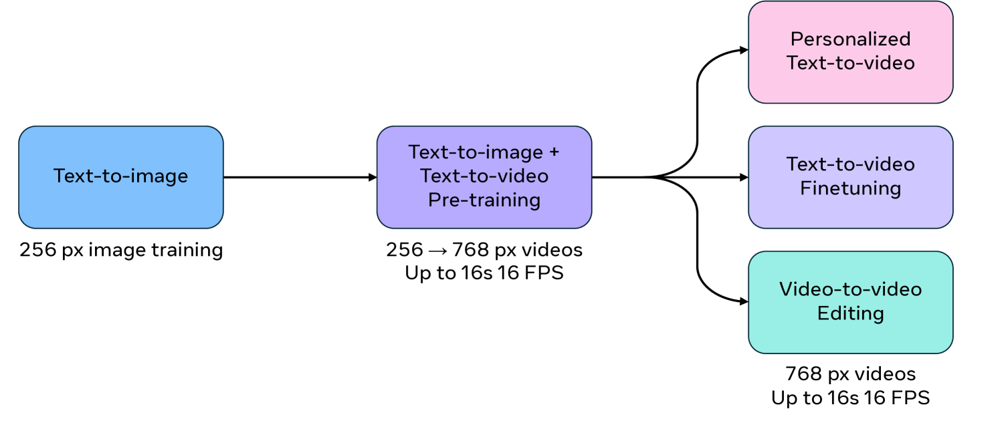
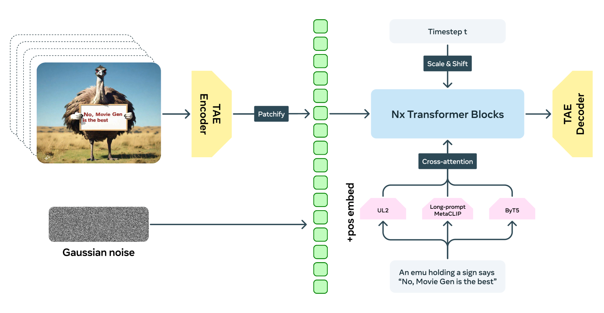
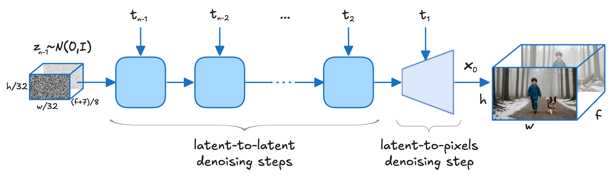
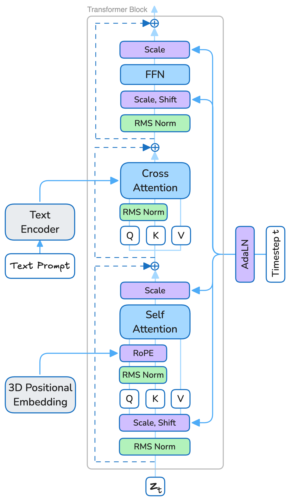
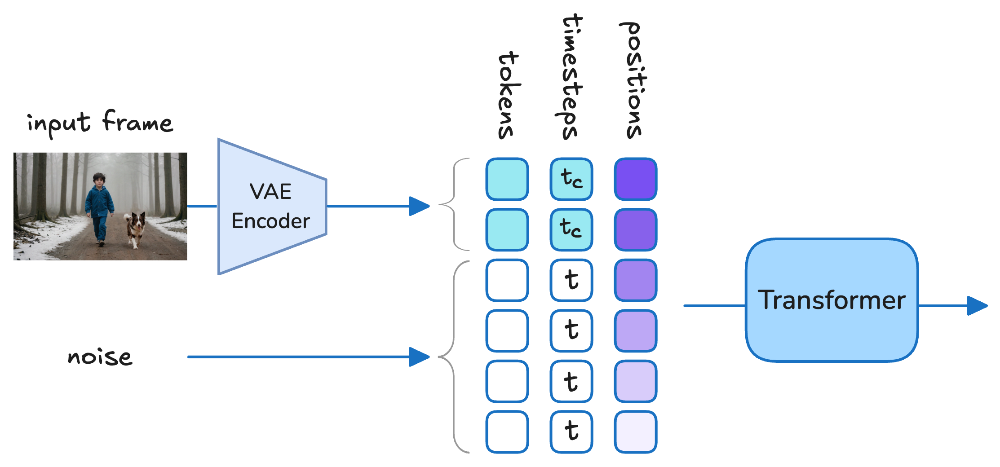
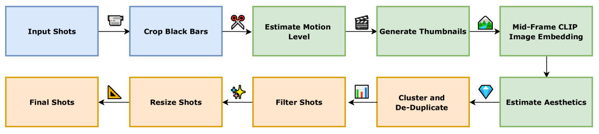

# 4.3 视频生成与编辑技术路线
> 💡 **本节目标**：系统梳理视频生成与编辑的任务范式、技术路线、代表模型和工业系统演进。重点是理解从图像模型视频化、原生视频基础模型到统一多模态生成与编辑系统的关键变化。

---

# 目录导航

[4.3.1 视频生成模型的任务坐标系：T2V、I2V、V2V 与统一多模态生成](#4.3.1_视频生成模型的任务坐标系：T2V、I2V、V2V-与统一多模态生成)
  - [4.3.1.1 面试问题：视频生成模型通常按输入输出范式如何分类？](#4.3.1.1_面试问题：视频生成模型通常按输入输出范式如何分类？)
  - [4.3.1.2 面试问题：视频续写、关键帧条件生成、视频修复与视频编辑的任务边界如何划分？](#4.3.1.2_面试问题：视频续写、关键帧条件生成、视频修复与视频编辑的任务边界如何划分？)
  - [4.3.1.3 面试问题：为什么接入一种输入条件，不等于模型真正具备对应的任务能力？](#4.3.1.3_面试问题：为什么接入一种输入条件，不等于模型真正具备对应的任务能力？)

[4.3.2 从图像扩散到视频扩散：经典技术路线如何演进](#4.3.2_从图像扩散到视频扩散：经典技术路线如何演进)
  - [4.3.2.1 面试问题：分析一条视频生成技术路线时，应该抓住哪些决定性设计？](#4.3.2.1_面试问题：分析一条视频生成技术路线时，应该抓住哪些决定性设计？)
  - [4.3.2.2 面试问题：图像模型视频化与原生时空建模的核心取舍是什么？](#4.3.2.2_面试问题：图像模型视频化与原生时空建模的核心取舍是什么？)

[4.3.3 图像先验复用与视频基座训练：AnimateDiff、MotionLoRA、SVD 与 I2VGen-XL](#4.3.3_图像先验复用与视频基座训练：AnimateDiff、MotionLoRA、SVD-与-I2VGen-XL)
  - [4.3.3.1 面试问题：AnimateDiff 的 Motion Module 如何插入图像扩散模型？](#4.3.3.1_面试问题：AnimateDiff-的-Motion-Module-如何插入图像扩散模型？)
  - [4.3.3.2 面试问题：为什么 AnimateDiff 的运动模块可以迁移到个性化 T2I 模型？](#4.3.3.2_面试问题：为什么-AnimateDiff-的运动模块可以迁移到个性化-T2I-模型？)
  - [4.3.3.3 面试问题：MotionLoRA / MotionDirector 解决的本质问题是什么？](#4.3.3.3_面试问题：MotionLoRA---MotionDirector-解决的本质问题是什么？)
  - [4.3.3.4 面试问题：AnimateDiff 与 SVD 在图像先验复用和视频训练上有何差异？](#4.3.3.4_面试问题：AnimateDiff-与-SVD-在图像先验复用和视频训练上有何差异？)
  - [4.3.3.5 面试问题：I2VGen-XL 的 cascaded diffusion 为什么适合 I2V？](#4.3.3.5_面试问题：I2VGen-XL-的-cascaded-diffusion-为什么适合-I2V？)
  - [4.3.3.6 面试问题：I2V 模型如何注入图像条件？为什么首帧对齐不等于全程保持？](#4.3.3.6_面试问题：I2V-模型如何注入图像条件？为什么首帧对齐不等于全程保持？)

[4.3.4 闭源前沿模型路线：Sora、Veo 与 Movie Gen](#4.3.4_闭源前沿模型路线：Sora、Veo-与-Movie-Gen)
  - [4.3.4.1 面试问题：Sora 如何把不同视觉数据统一成可扩展的视频生成表示？](#4.3.4.1_面试问题：Sora-如何把不同视觉数据统一成可扩展的视频生成表示？)
  - [4.3.4.2 面试问题：为什么 spacetime patches 和 Diffusion Transformer 是 Sora 路线的关键？](#4.3.4.2_面试问题：为什么-spacetime-patches-和-Diffusion-Transformer-是-Sora-路线的关键？)
  - [4.3.4.3 面试问题：如何从模型能力和局限理解 Sora 的 world simulator 叙事？](#4.3.4.3_面试问题：如何从模型能力和局限理解-Sora-的-world-simulator-叙事？)
  - [4.3.4.4 面试问题：Veo 的原生音视频生成和物理真实感说明了什么技术方向？](#4.3.4.4_面试问题：Veo-的原生音视频生成和物理真实感说明了什么技术方向？)
  - [4.3.4.5 面试问题：Veo 的多控制接口为什么体现了视频生成系统化趋势？](#4.3.4.5_面试问题：Veo-的多控制接口为什么体现了视频生成系统化趋势？)
  - [4.3.4.6 面试问题：Movie Gen 为什么是 media foundation model，而不是单一 T2V 模型？](#4.3.4.6_面试问题：Movie-Gen-为什么是-media-foundation-model，而不是单一-T2V-模型？)
  - [4.3.4.7 面试问题：Movie Gen 的大规模 Transformer 和长上下文设计说明了什么？](#4.3.4.7_面试问题：Movie-Gen-的大规模-Transformer-和长上下文设计说明了什么？)
  - [4.3.4.8 面试问题：闭源前沿视频模型在底层技术上有哪些共同趋势？](#4.3.4.8_面试问题：闭源前沿视频模型在底层技术上有哪些共同趋势？)

[4.3.5 开放视频基础模型路线：Open-Sora、HunyuanVideo、Wan、Step-Video 与 CogVideoX](#4.3.5_开放视频基础模型路线：Open-Sora、HunyuanVideo、Wan、Step-Video-与-CogVideoX)
  - [4.3.5.1 面试问题：Open-Sora 路线如何把闭源前沿模型拆解成可复现的开放训练管线？](#4.3.5.1_面试问题：Open-Sora-路线如何把闭源前沿模型拆解成可复现的开放训练管线？)
  - [4.3.5.2 面试问题：Open-Sora / Open-Sora-Plan 中的 Video VAE、WFVAE 与稀疏时空去噪器分别解决什么问题？](#4.3.5.2_面试问题：Open-Sora---Open-Sora-Plan-中的-Video-VAE、WFVAE-与稀疏时空去噪器分别解决什么问题？)
  - [4.3.5.3 面试问题：HunyuanVideo 为什么强调 systematic framework，而不是单一模型结构？](#4.3.5.3_面试问题：HunyuanVideo-为什么强调-systematic-framework，而不是单一模型结构？)
  - [4.3.5.4 面试问题：HunyuanVideo 的大规模开放视频基础模型路线，核心架构与训练策略是什么？](#4.3.5.4_面试问题：HunyuanVideo-的大规模开放视频基础模型路线，核心架构与训练策略是什么？)
  - [4.3.5.5 面试问题：Wan 为什么更适合被理解为开放视频模型家族，而不是单个 T2V 模型？](#4.3.5.5_面试问题：Wan-为什么更适合被理解为开放视频模型家族，而不是单个-T2V-模型？)
  - [4.3.5.6 面试问题：Wan 的 VAE、DiT、预训练与评测体系说明了什么底层路线？](#4.3.5.6_面试问题：Wan-的-VAE、DiT、预训练与评测体系说明了什么底层路线？)
  - [4.3.5.7 面试问题：Step-Video-T2V 的 30B DiT、深压缩 Video-VAE 与 Flow Matching 说明了什么？](#4.3.5.7_面试问题：Step-Video-T2V-的-30B-DiT、深压缩-Video-VAE-与-Flow-Matching-说明了什么？)
  - [4.3.5.8 面试问题：Step-Video-TI2V 如何从 T2V 基座扩展到文本驱动的 I2V？](#4.3.5.8_面试问题：Step-Video-TI2V-如何从-T2V-基座扩展到文本驱动的-I2V？)
  - [4.3.5.9 面试问题：CogVideoX 的 3D Causal VAE 与 Expert Transformer 解决了哪些关键问题？](#4.3.5.9_面试问题：CogVideoX-的-3D-Causal-VAE-与-Expert-Transformer-解决了哪些关键问题？)
  - [4.3.5.10 面试问题：CogVideoX 的 progressive training、multi-resolution frame pack 与数据管线有什么面试价值？](#4.3.5.10_面试问题：CogVideoX-的-progressive-training、multi-resolution-frame-pack-与数据管线有什么面试价值？)

[4.3.6 工业级视频生成路线：Seedance、Kling 与 LTX-Video](#4.3.6_工业级视频生成路线：Seedance、Kling-与-LTX-Video)
  - [4.3.6.1 面试问题：Seedance 1.0 如何在视频基座中同时优化质量、速度与多镜头一致性？](#4.3.6.1_面试问题：Seedance-1.0-如何在视频基座中同时优化质量、速度与多镜头一致性？)
  - [4.3.6.2 面试问题：Seedance 的音视频联合生成为什么不是简单的“视频后配音”？](#4.3.6.2_面试问题：Seedance-的音视频联合生成为什么不是简单的“视频后配音”？)
  - [4.3.6.3 面试问题：Kling-Omni 为什么代表统一视频生成、编辑与推理系统路线？](#4.3.6.3_面试问题：Kling-Omni-为什么代表统一视频生成、编辑与推理系统路线？)
  - [4.3.6.4 面试问题：Kling 路线中的 3D VAE、DiT 与多模态表示分别承担什么角色？](#4.3.6.4_面试问题：Kling-路线中的-3D-VAE、DiT-与多模态表示分别承担什么角色？)
  - [4.3.6.5 面试问题：LTX-Video 为什么是实时视频 latent diffusion 的代表路线？](#4.3.6.5_面试问题：LTX-Video-为什么是实时视频-latent-diffusion-的代表路线？)
  - [4.3.6.6 面试问题：LTX-Video 的高压缩 Video-VAE 与 full spatiotemporal attention 如何形成工程取舍？](#4.3.6.6_面试问题：LTX-Video-的高压缩-Video-VAE-与-full-spatiotemporal-attention-如何形成工程取舍？)
  - [4.3.6.7 面试问题：工业级视频模型为什么必须重视后训练、蒸馏与系统优化？](#4.3.6.7_面试问题：工业级视频模型为什么必须重视后训练、蒸馏与系统优化？)
  - [4.3.6.8 面试问题：工业级视频生成路线与开放 foundation model 路线的核心区别是什么？](#4.3.6.8_面试问题：工业级视频生成路线与开放-foundation-model-路线的核心区别是什么？)

[4.3.7 视频编辑模型路线：从 V2V 重建到统一多模态编辑](#4.3.7_视频编辑模型路线：从-V2V-重建到统一多模态编辑)
  - [4.3.7.1 面试问题：视频编辑模型从传统 V2V 到统一多模态编辑，技术路线发生了什么变化？](#4.3.7.1_面试问题：视频编辑模型从传统-V2V-到统一多模态编辑，技术路线发生了什么变化？)
  - [4.3.7.2 面试问题：为什么源视频重建、编辑定位与非编辑内容保持是视频编辑模型的三个基础能力？](#4.3.7.2_面试问题：为什么源视频重建、编辑定位与非编辑内容保持是视频编辑模型的三个基础能力？)
  - [4.3.7.3 面试问题：基于 inversion、attention 与 mask 的编辑路线分别解决什么问题，各自有什么时序局限？](#4.3.7.3_面试问题：基于-inversion、attention-与-mask-的编辑路线分别解决什么问题，各自有什么时序局限？)
  - [4.3.7.4 面试问题：为什么视频编辑需要把局部修改、跨帧传播与边界连续性联合建模？](#4.3.7.4_面试问题：为什么视频编辑需要把局部修改、跨帧传播与边界连续性联合建模？)
  - [4.3.7.5 面试问题：为什么 Seedance、Kling、LTX 等工业模型正在把生成、参考、编辑与续写收敛到统一系统？](#4.3.7.5_面试问题：为什么-Seedance、Kling、LTX-等工业模型正在把生成、参考、编辑与续写收敛到统一系统？)


---

<h1 id="4.3.1_视频生成模型的任务坐标系：T2V、I2V、V2V-与统一多模态生成">4.3.1 视频生成模型的任务坐标系：T2V、I2V、V2V 与统一多模态生成</h1>

> 先把任务坐标摆清楚。看到一个视频模型时，先判断它是在从零生成、参考图驱动、源视频编辑，还是在做多模态统一生成。

<h2 id="4.3.1.1_面试问题：视频生成模型通常按输入输出范式如何分类？">4.3.1.1 面试问题：视频生成模型通常按输入输出范式如何分类？</h2>

**难度评分：⭐⭐⭐ (3/5)  |  考察频率：⭐⭐⭐⭐⭐ (5/5)**

按源视觉信息划分，最常见的是 T2V、I2V 和 V2V。分类时要说清输入已经给了什么、模型还要补全什么，以及输出必须保留哪些约束，三者的任务边界如表3-1所示。

<p align="center">表3-1 T2V、I2V 与 V2V 的输入输出范式</p>

| 范式 | 主要输入 | 模型需要补全什么 | 主要约束 |
| --- | --- | --- | --- |
| **T2V** | 文本 prompt | 主体、场景、构图、运动和镜头 | 文本语义、事件顺序与时序一致性 |
| **I2V** | 单张条件图，常见为首帧或参考图 | 帧间运动、遮挡后的内容和画外区域 | 首帧结构，或参考主体、外观与场景 |
| **V2V** | 源视频，通常再加编辑指令或 mask | 被修改的外观、语义、局部内容或运动 | 原始时序骨架和非编辑内容 |

I2V 内部还要区分时间对齐的首帧与任意参考图：首帧直接规定 $t = 0$ 的画面，参考图通常只提供主体、外观或场景信息。如果同时给出首尾帧或多个时间锚点，更适合归入下一题讨论的关键帧条件生成。

Subject-to-Video、Audio-driven、Pose Control 描述额外控制，Joint Audio-Video 描述输出模态，Unified Multimodal Generation 描述系统如何组织这些能力。它们与 T2V、I2V、V2V 不在同一条分类轴上。例如，给定人物参考图和动作轨迹生成视频，主范式属于 I2V，同时带有主体和轨迹控制。

条件多不等于任务简单。生成空间虽然缩小了，保持约束和条件冲突反而更难处理。分类时先确定源视觉信息，再补充控制条件和输出形式，任务边界就清楚了。

> **面试速答**：T2V、I2V 和 V2V 的主分类依据是源视觉信息分别为无、图像和视频；主体、姿态、音频等属于附加控制，不能与三种主范式混为同级类别。

<h2 id="4.3.1.2_面试问题：视频续写、关键帧条件生成、视频修复与视频编辑的任务边界如何划分？">4.3.1.2 面试问题：视频续写、关键帧条件生成、视频修复与视频编辑的任务边界如何划分？</h2>

**难度评分：⭐⭐⭐⭐ (4/5)  |  考察频率：⭐⭐⭐ (3/5)**

区分这四类任务，可以先问两个问题：输入中哪些时空位置可信，模型又被允许在哪些位置生成或改写。把视频表示成 latent/token 时空网格后，可用 $M_{\mathrm{obs}}$ 标记可信输入区域，用 $M_{\mathrm{write}}$ 标记允许写入区域；对于编辑任务，$c_{\mathrm{edit}}$ 再规定目标区域要发生什么变化。$M_{\mathrm{write}}$ 可以是显式时空 mask，也可以由指令隐式推断。这些变量在四类任务中的对应关系如表3-2所示。

<p align="center">表3-2 视频续写、关键帧条件生成、视频修复与视频编辑的任务边界</p>

| 任务 | 可信输入区域 $M_{\mathrm{obs}}$ | 允许写入区域 $M_{\mathrm{write}}$ | 底层目标与典型失败 |
| --- | --- | --- | --- |
| **视频续写** | $t \leq t_0$ 的前缀帧 | $t > t_0$ 的未来帧 | 时间外推；容易在首个生成帧跳变，随后发生主体或事件状态漂移 |
| **关键帧条件生成** | $t \in \mathcal{K}$ 的首尾帧或多个关键帧 | 相邻时间锚点之间的帧 | 双向时间约束；容易出现端点对不上或中间运动路径失真 |
| **视频修复** | 缺失 mask 外的有效 token | 缺失或损坏的时空区域 | 时空补全；容易出现边界接缝、运动轨迹中断或遮挡关系错误 |
| **视频编辑** | 完整源视频 | 显式 mask 或由指令定位的对象与时空区域 | 受约束变换；典型问题是编辑不足、过度编辑和非编辑区域漂移 |

续写、关键帧条件生成和修复中，$M_{\mathrm{write}}$ 通常覆盖未观测或已损坏的 token，学习目标是根据可观测上下文补全目标区域。训练时可用时间前缀、稀疏关键帧和时空缺口等 mask 模式构造条件与目标。

编辑的关键区别是 $M_{\mathrm{obs}}$ 与 $M_{\mathrm{write}}$ 可以重叠：该区域在源视频中完全可观测，但被指令授权改写。这类能力通常还需要源视频、编辑指令与目标视频对齐的训练样本；如果只用 masked reconstruction 目标，模型更容易学会复制和补全，很难学到指令要求的语义改写。

> **面试速答**：续写生成未来，关键帧条件生成补全时间锚点之间的内容，修复填补缺失区域，编辑则重写源视频中已知但被授权修改的区域。编辑与前三者最关键的区别，是已观测区域和可改写区域可以重叠。

<h2 id="4.3.1.3_面试问题：为什么接入一种输入条件，不等于模型真正具备对应的任务能力？">4.3.1.3 面试问题：为什么接入一种输入条件，不等于模型真正具备对应的任务能力？</h2>

**难度评分：⭐⭐⭐⭐ (4/5)  |  考察频率：⭐⭐⭐ (3/5)**

能够把条件传入模型，只能说明接口存在。真正的任务能力要求模型学到由该条件控制的生成分布：更换条件时，目标属性应按预期变化，变化范围也要受到约束。

- **条件表示**：编码结果必须保留任务需要的信息。参考图编码器如果只保留“人”或“狗”这类高层语义，却丢掉身份细节，模型最多生成语义相似的主体。
- **条件注入**：条件要在合适的网络层、去噪阶段和时空区域持续生效。注入过弱会被主干忽略，作用范围过大又可能带动无关区域一起变化。
- **训练信号**：数据和学习目标要建立条件与输出之间的对应关系。主体保持需要“同一主体、不同姿态和视角”一类变化样本；只有静态同构样本时，模型容易复制参考图，难以同时保持身份并生成运动。
- **反事实验证**：固定同一组随机种子和其他条件，只替换、移除或打乱待测条件。目标属性应随条件变化，无关区域则应尽量保持稳定。

如果目标属性几乎不变，条件可能没有被模型利用；如果无关区域同步大幅变化，条件作用域没有控制好。整体画质分数无法替代这类条件消融。

> **面试速答**：输入接口只解决“条件能不能送进去”；任务能力还取决于条件信息是否被保留、是否在正确范围内生效、训练数据是否提供对应监督，以及替换条件后输出是否按预期响应。

<h1 id="4.3.2_从图像扩散到视频扩散：经典技术路线如何演进">4.3.2 从图像扩散到视频扩散：经典技术路线如何演进</h1>

> VAE、LDM、DiT、时序建模和条件注入已经在 4.2 中介绍。本节从模型路线角度出发，分析这些模块如何组合成不同的视频生成系统。

<h2 id="4.3.2.1_面试问题：分析一条视频生成技术路线时，应该抓住哪些决定性设计？">4.3.2.1 面试问题：分析一条视频生成技术路线时，应该抓住哪些决定性设计？</h2>

**难度评分：⭐⭐⭐⭐ (4/5)  |  考察频率：⭐⭐⭐⭐ (4/5)**

分析技术路线时，沿视频在系统中的实际数据流往下看，比记模型名称更可靠：训练视频先被压缩成 latent 或 token；生成时，主干在采样循环中反复预测噪声或速度，外部条件通过特定路径参与每一步预测，最终得到的干净表示再由解码器还原成视频。

这条分析链路如图3-1所示。

> **配图占位（图3-1）**：区分训练与生成两条链路。训练侧展示“视频 → Video VAE / Tokenizer → 干净时空表示”；生成侧展示“噪声表示 → 采样循环（时间步、条件注入、生成主干）→ 干净时空表示 → 视频解码”，并标出表示损失、时序断裂、条件失效和长视频漂移对应的排查环节。

<p align="center">图3-1 视频生成技术路线的核心链路与故障定位</p>

- **视频表示**：看空间、时间压缩率，以及重建质量。压缩过强会提前丢掉小物体、快速运动和短时事件；压缩过弱则会让 token 数量和显存开销迅速增加。重建视频本身已经模糊或运动断裂时，先检查 Video VAE / tokenizer。
- **时空主干**：看不同帧之间如何交换信息，以及时序感受野能覆盖多长。2D 主干外挂 temporal layer、分解注意力、局部窗口和全时空注意力的主要差别，就在这里。单帧质量正常但动作不连贯时，优先检查时间通路、训练 clip 的长度分布和帧率。
- **条件路径**：看参考图、文本、轨迹或源视频在什么网络层、去噪阶段和时空区域生效。条件没有被遵循，可能是表示丢失、注入太弱，也可能是训练数据没有建立稳定的条件—结果对应关系。
- **训练与推理匹配**：看视频长度、帧率、分辨率和任务分布。训练只见过短 clip 的模型，即使推理接口允许输入更长序列，也可能在长时间范围内出现状态漂移。

> **面试速答**：沿数据流看四件事：视频如何压缩、跨帧依赖在哪里建立、条件在哪里生效、训练分布能否覆盖推理设定。这样既能读懂架构，也能判断故障首先该查哪一层。

<h2 id="4.3.2.2_面试问题：图像模型视频化与原生时空建模的核心取舍是什么？">4.3.2.2 面试问题：图像模型视频化与原生时空建模的核心取舍是什么？</h2>

**难度评分：⭐⭐⭐⭐⭐ (5/5)  |  考察频率：⭐⭐⭐⭐ (4/5)**

核心取舍是复用成熟的图像先验，还是让视频表示和生成主干更早地在视频数据上联合学习时空分布。

两条路线的主要差异见表3-3。

<p align="center">表3-3 图像模型视频化与原生时空建模的主要取舍</p>

| 比较维度 | 图像模型视频化 | 原生时空建模 |
| --- | --- | --- |
| **初始化与训练** | 复用 T2I 权重，新增或扩展时间结构，再用视频数据训练 | 直接以视频时空分布为主要学习对象，也可以用图像权重初始化 |
| **时序建模** | 时间能力附加在已有图像特征之上 | 空间外观、运动、遮挡和镜头变化在统一目标中学习 |
| **主要优势** | 图像先验强，视频数据和算力要求较低，容易兼容个性化模型 | 时序感受野和模型容量更容易扩展，复杂运动建模上限更高 |
| **主要瓶颈** | 时间建模受静态图像特征空间限制，长程状态容易漂移 | 依赖更多高质量视频，时空 token 带来更高的计算和训练稳定性压力 |
| **适用场景** | 短视频、低成本适配、个性化生成 | 大规模视频基础模型、长视频和复杂运动生成 |

这里有两个容易混淆的点：

- **两条路线可以混合。** 常见做法是从图像权重初始化，再进行图像—视频联合预训练和视频任务微调。路线差别在视频训练占多大比重、时间结构多早进入学习过程，而不只在初始化权重来自哪里。
- **DiT 与原生视频训练不是同一层概念。** DiT 描述生成主干，原生时空建模描述数据、表示和训练方式。Video DiT 可以继承图像模型，3D U-Net 也可以在视频数据上原生训练。

实际选型要看目标和资源。短视频、个性化适配或算力有限时，图像模型视频化更划算；目标是复杂运动、长上下文和基础模型扩展性时，需要加大原生视频训练的比重。

> **面试速答**：图像模型视频化用较低成本换取成熟的图像先验，但时间能力容易受原有特征空间限制；原生时空建模训练代价更高，复杂运动和长程依赖的上限也更高。实际系统经常采用两者混合路线。

<h1 id="4.3.3_图像先验复用与视频基座训练：AnimateDiff、MotionLoRA、SVD-与-I2VGen-XL">4.3.3 图像先验复用与视频基座训练：AnimateDiff、MotionLoRA、SVD 与 I2VGen-XL</h1>

> 这些方法都利用了图像生成先验，但复用方式并不相同：AnimateDiff 把时间能力做成可插拔模块，MotionLoRA 和 MotionDirector 进一步定制运动，SVD 通过完整的视频预训练得到视频基座，I2VGen-XL 则用级联模型拆开内容保持与质量提升。

<h2 id="4.3.3.1_面试问题：AnimateDiff-的-Motion-Module-如何插入图像扩散模型？">4.3.3.1 面试问题：AnimateDiff 的 Motion Module 如何插入图像扩散模型？</h2>

**难度评分：⭐⭐⭐⭐ (4/5)  |  考察频率：⭐⭐⭐⭐⭐ (5/5)**

AnimateDiff 保留预训练 T2I 模型的 VAE、文本编码器和空间 U-Net，在 U-Net 的多个分辨率层插入 Motion Module。空间块仍按帧处理纹理、构图和文本语义；Motion Module 将同一空间位置在不同帧上的特征组织成时间序列，再用时间 Transformer 建立帧间依赖。整体结构如图3-2所示。

> **配图占位（图3-2）**：展示 Motion Module 训练阶段冻结的 T2I VAE、文本编码器和空间 U-Net，以及插入多个 U-Net 层级的可训练 Motion Module；补充特征从逐帧空间处理切换为沿时间维注意力，再还原回空间特征的过程。

<p align="center">图3-2 AnimateDiff 的 Motion Module 插入位置与时空特征流</p>

在论文的 Motion Module 训练阶段，原有图像生成参数被冻结，只用视频数据更新新增模块。这样做有两个直接结果：图像主干已有的画质和文本对齐能力不容易被视频训练破坏；新增参数则集中学习帧间变化。Motion Module 学到的是特征如何随时间演化，并不显式估计光流，也不能保证每个像素都有严格对应关系。

这类设计的瓶颈也很明确。时间模块看到的是图像主干已经提取过的特征，复杂遮挡、快速形变和长程状态仍受原始空间表示、训练片段长度和视频数据分布限制。出现“单帧好看但动作断裂”时，先检查时间模块和训练 clip；单帧本身已经失真时，问题通常不只在 Motion Module。

> **面试速答**：AnimateDiff 冻结已有 T2I 主干，在 U-Net 多个层级插入沿时间维工作的 Motion Module。空间块保留图像生成先验，新增模块只学习跨帧依赖，因此训练成本低，也便于作为插件迁移。

参考资料：[AnimateDiff 原论文](https://arxiv.org/abs/2307.04725)

<h2 id="4.3.3.2_面试问题：为什么-AnimateDiff-的运动模块可以迁移到个性化-T2I-模型？">4.3.3.2 面试问题：为什么 AnimateDiff 的运动模块可以迁移到个性化 T2I 模型？</h2>

**难度评分：⭐⭐⭐⭐ (4/5)  |  考察频率：⭐⭐⭐⭐ (4/5)**

这种迁移有明确前提：个性化模型来自同一个基础 T2I，并保留兼容的 U-Net 结构和中间特征空间。DreamBooth、LoRA 或风格微调主要改变主体和外观表达，只要没有把特征分布推得太远，Motion Module 仍能在原来的插入位置读取相近语义的空间特征。

底层假设是外观与运动可以部分解耦：图像主干决定每帧大致长什么样，Motion Module 学习这些特征如何跨帧变化。这里的“部分”很重要，运动和外观并非真正独立。训练视频中的主体、场景、镜头运动会共同影响时间特征，迁移后仍可能出现身份漂移或动作不适配。

实际应用时主要检查：

- **结构是否兼容**：基础模型版本、U-Net 层级、通道数和插入位置必须匹配。
- **个性化改动是否过重**：大幅合并权重或深度微调可能改变中间特征，导致运动模块失效或破坏画质。
- **目标运动是否超出训练分布**：通用短视频运动先验不等于复杂动作、长镜头和强遮挡都能稳定迁移。

> **面试速答**：Motion Module 能迁移，是因为同源个性化模型仍共享兼容的 U-Net 和特征坐标系。它复用的是跨帧变化规律，不是某个主体的外观；模型不同源或个性化改动过重时，这个前提会失效。

参考资料：[AnimateDiff 原论文](https://arxiv.org/abs/2307.04725)

<h2 id="4.3.3.3_面试问题：MotionLoRA---MotionDirector-解决的本质问题是什么？">4.3.3.3 面试问题：MotionLoRA / MotionDirector 解决的本质问题是什么？</h2>

**难度评分：⭐⭐⭐⭐ (4/5)  |  考察频率：⭐⭐⭐⭐ (4/5)**

两者都做运动定制，但解决的问题不同。

- **MotionLoRA 解决适配成本**：在已有 Motion Module 上学习低秩增量，用少量参数适配新的运动模式，例如平移、缩放等镜头运动。交付物是可加载、替换或组合的轻量运动权重。
- **MotionDirector 解决运动与外观纠缠**：直接用少量视频训练 LoRA 时，模型可能把“谁在动”和“怎么动”一起记住。MotionDirector 用双路径 LoRA 分开承载外观与运动，并通过 appearance-debiased temporal loss 减少外观对时间学习目标的干扰。

工程上不能只看训练参数量。若把“某只玩具熊举重”的运动迁移给汽车，结果仍带有玩具熊的颜色或形状，说明运动权重泄漏了训练外观；如果主体保持正常但动作幅度不足，则要继续检查训练片段是否对齐、目标运动是否稳定出现，以及镜头运动和物体运动是否被混在一起。

MotionDirector 的解耦也不是严格的物理分解。训练样本过少、背景固定或主体与动作高度绑定时，模型仍可能借助外观线索拟合运动。

> **面试速答**：MotionLoRA 用低秩更新降低运动定制成本；MotionDirector 进一步处理运动权重携带训练主体外观的问题。前者强调参数效率，后者强调运动跨主体迁移时的解耦质量。

参考资料：[AnimateDiff / MotionLoRA](https://arxiv.org/abs/2307.04725)、[MotionDirector](https://arxiv.org/abs/2310.08465)

<h2 id="4.3.3.4_面试问题：AnimateDiff-与-SVD-在图像先验复用和视频训练上有何差异？">4.3.3.4 面试问题：AnimateDiff 与 SVD 在图像先验复用和视频训练上有何差异？</h2>

**难度评分：⭐⭐⭐⭐ (4/5)  |  考察频率：⭐⭐⭐⭐⭐ (5/5)**

两者都从图像扩散模型获得空间先验，也都会增加时间层。真正的分界在训练范围和最终沉淀的资产：AnimateDiff 主要得到可插拔运动模块，SVD 则通过大规模视频训练得到可继续适配的视频基座。具体差异见表3-4。

<p align="center">表3-4 AnimateDiff 与 SVD 的图像先验复用和视频训练差异</p>

| 比较维度 | AnimateDiff | Stable Video Diffusion |
| --- | --- | --- |
| **图像先验复用** | 冻结同源 T2I 主干，在其中插入 Motion Module | 从图像预训练模型出发，扩展为视频 LDM |
| **视频训练范围** | 主要更新新增的运动参数 | 经历视频预训练和高质量视频微调，系统性学习视频分布 |
| **核心产出** | 可迁移到同源个性化模型的运动插件 | 可继续适配 I2V、多视角和镜头运动 LoRA 的视频基座 |
| **数据与成本** | 相对较低，适合模块化改造 | 更依赖大规模视频数据、清洗管线和训练资源 |
| **主要风险** | 时间能力受冻结图像特征和短 clip 训练限制 | 成本更高，效果高度依赖视频数据质量与训练阶段设计 |

SVD 论文中的三阶段训练很关键：先获得图像生成能力，再做大规模视频预训练，最后用高质量视频微调。视频预训练负责建立可迁移的运动表示，高质量微调负责收紧视觉质量。I2V 是在这个视频基座上继续适配的下游任务，不应把图像条件本身写成“运动先验”。

选型时看目标资产。需要把一套运动能力快速装到多个同源个性化模型上，AnimateDiff 更合适；需要继续开发 I2V、多视角或其他视频任务，SVD 式视频基座更有扩展空间。

> **面试速答**：AnimateDiff 冻结图像主干，重点训练可插拔 Motion Module；SVD 同样复用图像预训练，但继续进行大规模视频预训练和高质量微调，最终得到可支持多种下游任务的视频基座。

参考资料：[AnimateDiff](https://arxiv.org/abs/2307.04725)、[Stable Video Diffusion](https://arxiv.org/abs/2311.15127)

<h2 id="4.3.3.5_面试问题：I2VGen-XL-的-cascaded-diffusion-为什么适合-I2V？">4.3.3.5 面试问题：I2VGen-XL 的 cascaded diffusion 为什么适合 I2V？</h2>

**难度评分：⭐⭐⭐⭐ (4/5)  |  考察频率：⭐⭐⭐⭐ (4/5)**

I2V 同时要求语义和输入图像一致，还要保证视频清晰、细节连续。I2VGen-XL 没有把这些目标全部压给一个高分辨率去噪器，而是采用基础生成与细化两阶段级联，流程如图3-3所示。

> **配图占位（图3-3）**：展示 I2VGen-XL 的两阶段流程。Base Stage 接收输入图像及层级图像特征，生成语义连贯、保持输入内容的基础视频；Refinement Stage 接收基础视频与简短文本，增强细节并提升到 1280×720。标明第一阶段错误会传递到第二阶段。

<p align="center">图3-3 I2VGen-XL 的两阶段级联生成流程</p>

- **基础阶段先确定内容与整体视频结构**：两个层级图像编码器提供互补的图像条件，使生成结果保持输入内容并维持语义连贯。这里不能简单概括成“专门负责运动”，运动只是基础视频结构的一部分。
- **细化阶段提升质量**：在基础视频上补充细节，并结合额外的简短文本提高分辨率和视觉质量。它主要做条件增强的视频细化，不负责重新决定主体身份或完整运动轨迹。

级联的价值是把语义一致性与高分辨率细节的优化压力分开，但代价是误差会跨阶段传播。基础阶段若已经出现身份错误、运动断裂或构图漂移，细化阶段通常只会把错误变清晰。因此排障时应先检查基础视频，再判断细化模型是否引入纹理闪烁或条件偏移。

> **面试速答**：I2VGen-XL 用基础阶段保证语义连贯和输入内容保持，再由细化阶段补细节、升分辨率。它降低了单阶段同时处理语义与画质的难度，但基础阶段的结构性错误也会传给后级。

参考资料：[I2VGen-XL 原论文](https://arxiv.org/abs/2311.04145)

<h2 id="4.3.3.6_面试问题：I2V-模型如何注入图像条件？为什么首帧对齐不等于全程保持？">4.3.3.6 面试问题：I2V 模型如何注入图像条件？为什么首帧对齐不等于全程保持？</h2>

**难度评分：⭐⭐⭐⭐ (4/5)  |  考察频率：⭐⭐⭐⭐⭐ (5/5)**

图像条件有两种常见语义，回答时要先区分：首帧是与 $t = 0$ 对齐的时空锚点，任意参考图则主要提供主体、外观或场景信息。两者可以共用视觉编码器，但约束强度和注入位置并不相同。

常见注入路径包括：

- **对齐 latent 拼接**：把首帧编码到与视频相同的 latent 空间，在首个时间位置或沿时间维复制后与噪声视频拼接。它保留空间结构较直接，但后续帧是否保持仍取决于主干的时间传播能力。
- **视觉 token 交叉注意力**：用图像编码器提取全局或局部 token，让视频特征在去噪过程中读取图像条件。它适合主体和外观语义，细粒度文字、纹理和几何不一定能完整保留。
- **多尺度参考特征注入**：让后续帧访问首帧或参考图的多层特征，增强局部外观保持。注入过强时，模型容易复制输入或压低运动幅度。

pose、depth、trajectory 和 flow 解决的是“怎么动”或“结构怎么变”，与图像条件提供的“保持什么”正交，不能替代图像条件本身。

首帧对齐只保证起点。工程上可以直接复制或固定第1帧像素，但第2帧开始仍由生成模型预测。运动会带来形变、遮挡和画外区域，后续帧不存在与首帧逐像素对应的标准答案。常见失败主要有三类：首帧到首个生成帧跳变，身份或高频细节随时间漂移，以及参考约束过强导致视频近似静止。

排查时先分开看：第1帧是否真的按输入写入；第1帧与第2帧是否连续；主体相似度和背景结构随时间如何变化；提高图像 guidance 后，保持度与运动幅度是否此消彼长。只检查首帧重建误差，无法证明模型具备整段 I2V 保持能力。

> **面试速答**：首帧可通过对齐 latent 直接锚定，任意参考图更多通过视觉 token 或多尺度特征提供外观条件。锁住第1帧像素并不难，难的是让身份和结构在运动、遮挡与新内容生成中持续保持，同时不过度压制运动。

参考资料：[Stable Video Diffusion](https://arxiv.org/abs/2311.15127)、[I2VGen-XL](https://arxiv.org/abs/2311.04145)

<h1 id="4.3.4_闭源前沿模型路线：Sora、Veo-与-Movie-Gen">4.3.4 闭源前沿模型路线：Sora、Veo 与 Movie Gen</h1>

> 本节关注闭源前沿模型。由于完整训练细节并未开源，分析时不应过度推断实现细节，而应基于官方明确披露的表示方式、主干范式、条件接口、音视频能力和系统边界进行判断。

<h2 id="4.3.4.1_面试问题：Sora-如何把不同视觉数据统一成可扩展的视频生成表示？">4.3.4.1 面试问题：Sora 如何把不同视觉数据统一成可扩展的视频生成表示？</h2>

**难度评分：⭐⭐⭐⭐ (4/5)  |  考察频率：⭐⭐⭐⭐⭐ (5/5)**

从架构角度看，Sora 的关键不只是生成视频时长更长，而是将不同类型的视觉数据统一到可扩展表示框架中。OpenAI 技术报告中明确提到，Sora 先将视觉数据压缩到 latent space，再把压缩后的表示切分成 **spacetime patches**，最后使用 diffusion transformer 在这些 patch 上建模。

这一流程可以概括为：

```text
raw video / image
        -> visual compression network
        -> latent representation
        -> spacetime patches
        -> diffusion transformer
        -> generated visual data
```

这个设计的核心价值在于统一。图像可以看成单帧视频，短视频、长视频、不同分辨率、不同长宽比的视频都可以被表示为一组时空 patch token。模型不再必须把所有数据裁剪到完全固定的尺寸和时长，而是可以在更自然的数据形态上训练。

如果用符号表示，可以把压缩后的视频 latent 写成：

```math
z = E(x_{1:T})
```

然后将 $z$ 切分成一组时空 patch：

```math
\{p_i\}_{i=1}^{N} = \mathrm{Patchify}(z)
```

其中 $N$ 与视频时长、空间分辨率和 patch 大小相关。视频越长、分辨率越高，token 数越多，计算成本也越高。因此，Sora 的表示路线本质上将视频生成问题转化为大规模时空 token 建模问题。

面试回答可概括为：**Sora 的底层思想是先压缩视觉数据，再将其切分为 spacetime patches，使图像和视频进入统一 token 空间；由此模型可以沿 Transformer scaling 路线处理不同分辨率、时长和长宽比的视觉数据。**

<h2 id="4.3.4.2_面试问题：为什么-spacetime-patches-和-Diffusion-Transformer-是-Sora-路线的关键？">4.3.4.2 面试问题：为什么 spacetime patches 和 Diffusion Transformer 是 Sora 路线的关键？</h2>

**难度评分：⭐⭐⭐⭐⭐ (5/5)  |  考察频率：⭐⭐⭐⭐⭐ (5/5)**

spacetime patches 解决的是“视频如何表示”，Diffusion Transformer 解决的是“如何在这种表示上做生成建模”。二者结合之后，Sora 路线就不再是传统的逐帧生成或 2D U-Net 加时序模块，而是更接近大规模 token 序列生成。

这种设计有三个关键意义。

第一，**它把视频生成转成统一的时空 token 建模问题**。  
传统视频模型往往分别处理空间卷积、时间卷积、帧间 attention 和多种采样策略；Sora 的表达更统一，将视频压缩为 latent patch token 后，用 Transformer 直接建模这些 token 之间的依赖关系。

第二，**它更适合 scaling**。  
Transformer 的优势在于结构统一、可扩展性强、工程生态成熟。一旦图像和视频都变成 token 序列，就可以沿着类似 LLM、ViT、DiT 的方向扩展数据、模型规模和计算量。

第三，**它支持多种视觉任务统一化**。  
Sora 技术报告展示了 text-to-video、image-to-video、video extension、video interpolation、video editing 等能力。它们表面上是不同任务，但从 token 空间看，都可以被理解成在给定不同条件的情况下生成或补全一组视觉 token。

从扩散建模角度看，Sora 的去噪过程可以抽象为：

```math
\epsilon_\theta(p_t, t, c)
```

其中 $p_t$ 是加噪后的 spacetime patch 表示，$t$ 是扩散时间步，$c$ 是文本、图像或其他条件。重点不在公式细节，而在于模型处理的是时空 patch token，而不是单帧像素。

面试回答可概括为：**spacetime patches 使视频具备统一 token 表示，Diffusion Transformer 使模型能够在该 token 空间中进行大规模生成建模；二者结合构成了 Sora 路线区别于传统视频扩散模型的核心。**

<h2 id="4.3.4.3_面试问题：如何从模型能力和局限理解-Sora-的-world-simulator-叙事？">4.3.4.3 面试问题：如何从模型能力和局限理解 Sora 的 world simulator 叙事？</h2>

**难度评分：⭐⭐⭐⭐ (4/5)  |  考察频率：⭐⭐⭐⭐ (4/5)**

Sora 的 world simulator 叙事需要从能力和局限两方面理解。它不是严格意义上的物理仿真器，而是通过大规模视频生成训练学习部分世界动态规律的生成模型。

从能力侧看，OpenAI 技术报告强调 Sora 展示出几类重要现象：

1. **长程一致性**：较长视频中能够在一定程度上保持主体、场景和动作连续。
2. **object permanence**：遮挡后物体仍可能保持存在，而不是完全丢失。
3. **3D consistency**：动态相机运动下，人物和场景元素在三维空间中具有一定一致性。
4. **世界状态变化**：模型能表现部分动作对环境状态的影响。

这些能力说明，当模型在大规模视频数据上学习时，可能从数据中吸收部分空间、运动、遮挡和因果关系先验。也就是说，它不是显式写入物理规则，而是通过生成建模隐式学习世界动态。

从局限侧看，Sora 技术报告也明确承认了不少问题：

1. **基础物理仍会出错**：例如物体破碎、碰撞、状态变化并不总是符合真实物理。
2. **长视频仍可能失去一致性**：时间变长后，物体、结构和动作逻辑仍可能漂移。
3. **因果关系并不可靠**：模型能生成看似合理的视频，但不等于具备可验证、可干预的因果世界模型。

因此，更严谨的说法是：**Sora 展示了大规模视频生成模型向 world model 靠近的迹象，但它仍是生成式世界先验，而不是严格物理模拟器或可验证世界模型。**

引用来源：
- OpenAI《Video generation models as world simulators》：提出 visual compression、spacetime patches、diffusion transformer、object permanence、3D consistency、world simulator 路线。https://openai.com/index/video-generation-models-as-world-simulators/

<h2 id="4.3.4.4_面试问题：Veo-的原生音视频生成和物理真实感说明了什么技术方向？">4.3.4.4 面试问题：Veo 的原生音视频生成和物理真实感说明了什么技术方向？</h2>

**难度评分：⭐⭐⭐⭐ (4/5)  |  考察频率：⭐⭐⭐ (3/5)**

Veo 的公开资料没有像 Sora 报告那样披露完整训练架构，因此不应过度推断其内部实现。但从官方明确强调的能力看，Veo 代表了两个重要技术方向：**原生音视频生成** 和 **更强物理真实感建模**。

第一，**原生音视频生成意味着音频不再只是后处理模块**。  
传统视频生成系统常见做法是先生成画面，再配音、配乐或做 Foley sound。Veo 官方页强调 native audio，说明其目标是让声音和画面在生成链路中更紧密耦合，包括环境声、人物动作声、节奏、语义和视频事件之间的同步。

如果从条件建模角度理解，纯视频生成通常关注：

```math
p(x_{1:T} \mid c)
```

而原生音视频生成更接近：

```math
p(x_{1:T}, a_{1:T'} \mid c)
```

其中 $x_{1:T}$ 是视频，$a_{1:T'}$ 是音频序列。关键难点在于二者必须在时间、事件和语义上对齐。

第二，**物理真实感说明视频模型开始被要求建模更稳定的世界动态**。  
Veo 官方页强调 visually realistic physics，这说明评价重点不只是单帧清晰度，而包括运动是否符合物理直觉、物体交互是否自然、镜头运动是否稳定、动作和环境响应是否一致。

因此，Veo 路线最重要的技术信号是：**视频生成系统正在从“只生成画面”走向“联合生成声画，并提高动态世界真实感”。**

<h2 id="4.3.4.5_面试问题：Veo-的多控制接口为什么体现了视频生成系统化趋势？">4.3.4.5 面试问题：Veo 的多控制接口为什么体现了视频生成系统化趋势？</h2>

**难度评分：⭐⭐⭐ (3/5)  |  考察频率：⭐⭐⭐ (3/5)**

Veo 另一个值得关注的点在于，它不仅展示 text-to-video，还展示了多种创作控制能力，例如：

- I2V
- first and last frame
- object insertion
- scene extension
- ingredients to video

这些能力从架构角度看，对应的是更复杂的条件接口。普通 T2V 只需要文本条件，而上述能力要求模型同时处理不同类型的约束：

| 能力 | 对应的技术约束 |
|---|---|
| I2V | 参考图外观保持与运动补全 |
| first and last frame | 首尾状态约束与中间过程生成 |
| object insertion | 局部区域编辑与背景一致性 |
| scene extension | 时序延展与长程一致性 |
| ingredients to video | 多对象、多概念组合与空间关系控制 |

这说明 Veo 更接近多条件视频创作系统，而不是单一 T2V 模型。其背后的关键趋势是：模型需要将文本、图像、视频片段、局部编辑区域、音频和镜头约束统一接入同一生成链路。

面试回答可概括为：**Veo 的多控制接口表明，前沿视频模型正在从单 prompt 生成器演化为多条件、可编辑、可延展的创作系统；系统能力的关键不只是生成质量，还包括条件约束能否被稳定执行。**

引用来源：
- Google DeepMind《Veo 3.1》官方模型页：明确强调 native audio、visually realistic physics、I2V、scene extension、first and last frame、object insertion 等能力。https://deepmind.google/models/veo/

<h2 id="4.3.4.6_面试问题：Movie-Gen-为什么是-media-foundation-model，而不是单一-T2V-模型？">4.3.4.6 面试问题：Movie Gen 为什么是 media foundation model，而不是单一 T2V 模型？</h2>

**难度评分：⭐⭐⭐ (3/5)  |  考察频率：⭐⭐⭐ (3/5)**

Movie Gen 的定位较为明确：Meta 将其称为 **“a cast of media foundation models”**，而不是单一 text-to-video 模型。这意味着 Movie Gen 的核心不是只完成 T2V，而是将视频、音频、编辑和个性化纳入统一媒体生成系统。

从公开资料看，Movie Gen 覆盖的能力包括：

1. **text-to-video**：根据文本生成高清视频。
2. **personalized video**：基于用户图像生成包含特定人物的视频。
3. **instruction-based video editing**：根据指令编辑已有视频。
4. **video-to-audio**：根据视频生成同步音频。
5. **text-to-audio**：根据文本生成音频。

Movie Gen 的训练流程体现了从 T2I 预训练、联合图像/视频预训练到高质量视频微调和后训练的分阶段路线，如图3-4所示。

<div align="center">
  
  <p>图3-4 Movie Gen Video 的分阶段训练流程示意图</p>
</div>

这些任务的共同点是，它们都属于 media generation，但条件和输出形式不同。若只用单一 T2V 视角理解 Movie Gen，会漏掉它最重要的方法论：**将视频生成、音频生成、个性化和编辑组织成一个媒体基础模型家族。**

可以用一个更通用的条件生成形式来理解：

```math
p(y_{\text{media}} \mid c_{\text{text}}, c_{\text{image}}, c_{\text{video}}, c_{\text{audio}}, c_{\text{instruction}})
```

其中 $y_{\text{media}}$ 可以是视频、音频或编辑后的视频。该表达的重点是任务统一，而不是单个输出模态。

面试回答可概括为：**Movie Gen 不是单一视频模型，而是一组媒体基础模型，目标是将视频生成、同步音频、视频编辑和个性化生成纳入统一 media generation 框架。**

<h2 id="4.3.4.7_面试问题：Movie-Gen-的大规模-Transformer-和长上下文设计说明了什么？">4.3.4.7 面试问题：Movie Gen 的大规模 Transformer 和长上下文设计说明了什么？</h2>

**难度评分：⭐⭐⭐⭐ (4/5)  |  考察频率：⭐⭐⭐ (3/5)**

Movie Gen 论文中的一个关键信号是，其 largest video generation model 是 30B 参数 Transformer，并能够处理 73K video tokens 的长上下文。这表明其采用了大规模 Transformer 化和长上下文建模路线。

这条路线背后有三个含义。

第一，**视频生成越来越依赖长上下文 token 建模**。  
视频比图像多时间维度，token 数量随帧数和分辨率迅速增长。能够处理 73K video tokens，说明模型设计必须考虑长序列注意力、计算效率和时空依赖建模。

第二，**模型能力越来越依赖规模化训练**。  
30B Transformer 说明 Movie Gen 不是轻量插件路线，而是沿 foundation model scaling 方向推进。它试图用更大模型容量承载视频、音频、编辑和个性化等多种媒体任务。

第三，**媒体任务需要统一表示和任务接口**。  
如果一个系统同时做 T2V、V2A、T2A、editing 和 personalization，那么不同模态必须被组织到相对统一的表示和条件接口中，否则系统会变成多个孤立模型的拼接。

Movie Gen 的联合图像与视频生成 pipeline 展示了 TAE 压缩、文本条件编码、生成主干和解码输出之间的关系，如图3-5所示。

<div align="center">
  
  <p>图3-5 Movie Gen 的联合图像与视频生成流程示意图</p>
</div>

因此，Movie Gen 的架构信号可以概括为：**用大规模 Transformer 和长视频 token 上下文，承载多任务媒体生成能力；它的目标不是短视频单点生成，而是可扩展的 media foundation model。**

引用来源：
- Meta《Movie Gen: A Cast of Media Foundation Models》官方论文页：明确强调 1080p、synchronized audio、instruction-based editing、personalized videos、video-to-audio、text-to-audio。https://ai.meta.com/research/publications/movie-gen-a-cast-of-media-foundation-models/
- arXiv 论文版本：Movie Gen: A Cast of Media Foundation Models，包含 30B video generation model、73K video tokens 等技术描述。https://arxiv.org/abs/2410.13720

<h2 id="4.3.4.8_面试问题：闭源前沿视频模型在底层技术上有哪些共同趋势？">4.3.4.8 面试问题：闭源前沿视频模型在底层技术上有哪些共同趋势？</h2>

**难度评分：⭐⭐⭐⭐ (4/5)  |  考察频率：⭐⭐⭐⭐ (4/5)**

Sora、Veo 和 Movie Gen 的公开细节不同，但从底层技术趋势看，可以归纳出几个共同方向。

第一，**视觉表示正在走向压缩 latent 与 token 化**。  
Sora 明确使用 visual compression 和 spacetime patches，Movie Gen 也强调大量 video tokens，说明前沿模型基本都在避免直接在像素空间生成，而是先把视频变成可扩展的 latent/token 表示。

第二，**主干网络正在走向大规模 Transformer 化**。  
Sora 使用 diffusion transformer，Movie Gen 明确采用 30B Transformer。闭源模型虽然公开细节有限，但从能力和披露信息看，前沿视频生成正在越来越接近“视频 token + 大规模 transformer”的范式。

第三，**音视频一体化成为重要方向**。  
Veo 强调 native audio，Movie Gen 支持 synchronized audio、video-to-audio 和 text-to-audio。这说明未来视频模型如果只生成无声画面，会越来越难覆盖完整创作需求。

第四，**条件接口从文本扩展到多模态控制**。  
I2V、首尾帧、object insertion、scene extension、personalization、instruction editing 等能力说明，模型必须支持更复杂的条件组合，而不是只接受一段文本 prompt。

第五，**world prior 与物理真实感成为核心竞争点**。  
Sora 的 world simulator 叙事、Veo 的 visually realistic physics，都说明视频模型正在被要求具备更稳定的空间、运动、遮挡和因果先验。

需要注意的是，这些趋势应克制理解。闭源模型没有完整开放训练数据、模型结构和损失设计，因此面试时不应将官方能力展示直接等同于完整架构细节。更稳妥的说法是：**闭源前沿模型共同指向压缩时空表示、大规模 Transformer、原生音视频、多条件控制和更强世界先验等底层路线。**

引用来源：
- OpenAI《Video generation models as world simulators》：提出 visual compression、spacetime patches、diffusion transformer、object permanence、3D consistency、world simulator 路线。https://openai.com/index/video-generation-models-as-world-simulators/
- Google DeepMind《Veo 3.1》官方模型页：明确强调 native audio、visually realistic physics、I2V、scene extension、first and last frame、object insertion 等能力。https://deepmind.google/models/veo/
- Meta《Movie Gen: A Cast of Media Foundation Models》官方论文页：明确强调 1080p、synchronized audio、instruction-based editing、personalized videos、video-to-audio、text-to-audio。https://ai.meta.com/research/publications/movie-gen-a-cast-of-media-foundation-models/
- arXiv 论文版本：Movie Gen: A Cast of Media Foundation Models，包含 30B video generation model、73K video tokens 等技术描述。https://arxiv.org/abs/2410.13720

<h1 id="4.3.5_开放视频基础模型路线：Open-Sora、HunyuanVideo、Wan、Step-Video-与-CogVideoX">4.3.5 开放视频基础模型路线：Open-Sora、HunyuanVideo、Wan、Step-Video 与 CogVideoX</h1>

> 本节关注开放视频基础模型。相比闭源模型，开放路线更适合从可复现架构角度拆解：视频压缩器、时空主干、条件注入、训练数据、系统优化、推理成本和开源生态。

<h2 id="4.3.5.1_面试问题：Open-Sora-路线如何把闭源前沿模型拆解成可复现的开放训练管线？">4.3.5.1 面试问题：Open-Sora 路线如何把闭源前沿模型拆解成可复现的开放训练管线？</h2>

**难度评分：⭐⭐⭐⭐ (4/5)  |  考察频率：⭐⭐⭐⭐ (4/5)**

Open-Sora 的核心意义不在于复用 “Sora” 这一名称，而在于把闭源前沿视频模型背后的关键问题拆解为可实现、可验证的开放工程链路。面试中可以将其理解为开放视频基础模型的参考 pipeline：

```text
raw videos -> data filtering / captioning -> video VAE / tokenizer -> spacetime latent tokens
           -> STDiT / video diffusion transformer -> training system -> inference / sampling
```

这条路线的技术重点有三层：

1. **视频表示层**  
   原始视频维度较高，需要先通过 Video VAE 或 tokenizer 压缩到 latent space。若输入视频为 $x_{1:T}$，压缩过程可抽象为：

```math
z = E(x_{1:T}), \quad \hat{x}_{1:T} = D(z)
```

   其中 $E$ 是视频编码器，$D$ 是视频解码器。压缩器的重建质量、时序一致性和压缩率会直接影响生成模型上限。

2. **时空去噪层**  
   Open-Sora 系列通常围绕时空 latent tokens 构建扩散或 flow-based 去噪主干，本质是学习条件分布 $p(x_{1:T} \mid c)$，其中 $c$ 可以是文本、图像或其他控制条件。

3. **训练系统层**  
   开放视频模型的难点不只在模型结构，还包括数据清洗、caption 质量、多分辨率训练、显存优化、并行策略和推理加速。Open-Sora 2.0 强调以相对可控成本训练商业级视频生成模型，表明开放路线已经从“模型复现”推进到“训练系统复现”。

因此，Open-Sora 更适合作为开放视频 foundation model 的工程样本：它把 closed frontier 的抽象技术趋势，拆解成社区可以迭代的 tokenizer、DiT、数据和系统模块。

<h2 id="4.3.5.2_面试问题：Open-Sora---Open-Sora-Plan-中的-Video-VAE、WFVAE-与稀疏时空去噪器分别解决什么问题？">4.3.5.2 面试问题：Open-Sora / Open-Sora-Plan 中的 Video VAE、WFVAE 与稀疏时空去噪器分别解决什么问题？</h2>

**难度评分：⭐⭐⭐⭐ (4/5)  |  考察频率：⭐⭐⭐⭐ (4/5)**

这类开放路线的底层矛盾是：视频 token 数随帧数、分辨率和通道数快速增长，若直接对原始视频建模，计算成本很难承受。因此，Video VAE、WFVAE 和稀疏时空去噪器分别对应三个层面的降本增效。

1. **Video VAE：降低生成主干的输入维度**  
   Video VAE 将高维像素视频压缩为低维 latent video，使后续 DiT 不必直接处理像素空间。它不仅要保留空间纹理，还要保持时间连续性，因此比图像 VAE 更关注 temporal consistency。

2. **WFVAE：面向长视频的因果压缩与流式建模**  
   Open-Sora-Plan 中的 WFVAE 更强调面向长视频生成的时序压缩与因果设计。它的价值在于减少长视频 latent 序列长度，同时降低未来帧信息泄漏风险，使模型更适合长序列生成和分块推理。

3. **稀疏时空去噪器：降低 attention 的二次复杂度**  
   标准全局 attention 的复杂度约为：

```math
\mathcal{O}(N^2), \quad N = T \times H \times W
```

   当 $T$、$H$、$W$ 同时增大时，完整时空 attention 很快不可承受。因此开放路线常采用空间窗口、时间窗口、分解式 attention、稀疏 attention 或 frame packing 等策略，在建模能力和计算成本之间折中。

面试回答可概括为：**Video VAE 解决高维视频表示压缩问题，WFVAE 解决长视频压缩与因果建模问题，稀疏时空去噪器解决 token 数过多导致的 attention 成本问题。**

引用来源：
- 《Open-Sora 2.0: Training a Commercial-Level Video Generation Model in $200k》：强调低成本商业级视频生成训练与系统优化。https://arxiv.org/abs/2503.09642
- Open-Sora 官方仓库：公开训练、推理和模型实现。https://github.com/hpcaitech/Open-Sora
- Open-Sora-Plan 官方仓库：包含 WFVAE、长视频生成与开放训练路线。https://github.com/PKU-YuanGroup/Open-Sora-Plan

<h2 id="4.3.5.3_面试问题：HunyuanVideo-为什么强调-systematic-framework，而不是单一模型结构？">4.3.5.3 面试问题：HunyuanVideo 为什么强调 systematic framework，而不是单一模型结构？</h2>

**难度评分：⭐⭐⭐ (3/5)  |  考察频率：⭐⭐⭐⭐ (4/5)**

HunyuanVideo 的论文题目直接使用 “A Systematic Framework For Large Video Generative Models”，这表明它的重点不是提出某个孤立模块，而是回答大规模视频生成系统如何被完整组织起来。

一个大规模视频 foundation model 通常至少包含四个系统层面：

1. **数据层**  
   包括视频数据收集、清洗、去重、质量筛选、文本 caption、分辨率与时长组织。视频生成对数据质量极其敏感，低质量 caption 或混乱的视频片段会直接降低文本对齐和运动合理性。

2. **表示层**  
   包括视频 VAE / latent representation。表示层决定了主干模型看到的是像素、latent patch，还是更抽象的时空 token。

3. **生成主干层**  
   包括大规模 DiT、时空 attention、文本条件注入和扩散 / flow 训练目标。主干负责学习视频分布、运动模式和条件对齐。

4. **训练与后训练层**  
   包括预训练、分辨率扩展、指令对齐、偏好优化、推理采样和安全控制。这些部分决定模型能否从研究模型走向可用系统。

因此，HunyuanVideo 的代表性不在于单点技巧，而在于提供开放语境下构建大规模视频基础模型的系统框架视角。

<h2 id="4.3.5.4_面试问题：HunyuanVideo-的大规模开放视频基础模型路线，核心架构与训练策略是什么？">4.3.5.4 面试问题：HunyuanVideo 的大规模开放视频基础模型路线，核心架构与训练策略是什么？</h2>

**难度评分：⭐⭐⭐⭐ (4/5)  |  考察频率：⭐⭐⭐ (3/5)**

HunyuanVideo 可以从“开放大模型视频基座”的角度理解，其核心架构主要包括：

1. **大规模视频生成主干**  
   HunyuanVideo 明确强调超过 13B 参数的视频生成基础模型。对于视频任务而言，参数规模的意义不只是提升画质，也关系到模型能否同时表示场景、运动、镜头、物体关系和文本语义。

2. **文本-视频条件对齐**  
   视频生成不是单纯图像生成的逐帧扩展。模型需要把文本中的动作、主体、场景、镜头关系映射到一段连续视频中，因此文本编码器、cross-attention / 条件调制和训练 caption 质量都很关键。

3. **系统化训练流程**  
   大规模视频模型通常需要从较低分辨率、较短时长逐步扩展到更高分辨率和更长时长。这样的 progressive training 有助于降低训练不稳定性，并让模型先学习基础运动分布，再学习高频细节。

4. **平台化扩展能力**  
   HunyuanVideo 后续分支覆盖 I2V、Avatar、Custom 等方向，说明其价值不只是一个 T2V 模型，而是可作为多任务视频生成基座继续扩展。

面试回答可概括为：**HunyuanVideo 是以大规模开放视频生成主干为中心，围绕数据、文本对齐、时空生成和后续任务扩展构建的系统化 framework。**

引用来源：
- 《HunyuanVideo: A Systematic Framework For Large Video Generative Models》：以 systematic framework 定义自身，并强调超过 13B 参数的开放视频基础模型。https://arxiv.org/abs/2412.03603
- HunyuanVideo 官方仓库：公开基础模型与 I2V、Avatar、Custom 等后续分支。https://github.com/Tencent/HunyuanVideo

<h2 id="4.3.5.5_面试问题：Wan-为什么更适合被理解为开放视频模型家族，而不是单个-T2V-模型？">4.3.5.5 面试问题：Wan 为什么更适合被理解为开放视频模型家族，而不是单个 T2V 模型？</h2>

**难度评分：⭐⭐⭐ (3/5)  |  考察频率：⭐⭐⭐ (3/5)**

Wan 的关键定位不是单一 T2V 模型，而是开放视频生成模型家族。它同时强调多参数规模、多任务能力和可部署性，因此可以视为开放 video generation suite。

具体可以从三个方面理解：

1. **参数规模分层**  
   Wan 同时提供 1.3B 和 14B 等不同规模模型。小模型侧重效率和消费级硬件可达性，大模型侧重质量上限。这种分层使它可以覆盖研究、部署和应用探索的不同成本区间。

2. **任务形态分层**  
   Wan 不只覆盖 T2V，还扩展到 I2V、视频编辑、个性化生成等任务。这说明它的底层目标是复用统一视频生成能力，再通过条件接口和任务适配进入不同应用场景。

3. **开放生态分层**  
   代码、模型权重和任务接口共同开放，降低了社区复现、微调和二次开发门槛。对于面试而言，这比单纯讨论 benchmark 数字更能体现其方法论意义。

因此，Wan 的路线定位并不是构建单个高性能 T2V 模型，而是构建一套覆盖不同参数规模、任务形态与部署成本的视频生成模型家族。

<h2 id="4.3.5.6_面试问题：Wan-的-VAE、DiT、预训练与评测体系说明了什么底层路线？">4.3.5.6 面试问题：Wan 的 VAE、DiT、预训练与评测体系说明了什么底层路线？</h2>

**难度评分：⭐⭐⭐⭐ (4/5)  |  考察频率：⭐⭐⭐ (3/5)**

Wan 的底层路线可以概括为：以高效视频表示为基础，以可扩展 DiT 为生成主干，以大规模数据预训练和自动化评测支撑多任务扩展。

1. **VAE / tokenizer 是效率基础**  
   视频 VAE 的目标是把 $x_{1:T}$ 压缩成较短 latent 序列 $z$，在尽量保留运动和细节的同时降低主干计算量。若压缩率不足，DiT 的 token 数过高；若压缩过强，则会损失细节和运动连续性。

2. **DiT 是扩展性基础**  
   Transformer 主干更适合吸收大规模数据和多任务条件。对于视频，DiT 的关键不是简单扩大参数，而是如何处理时空 token、条件注入和长序列计算。

3. **预训练决定基础能力边界**  
   T2V、I2V、编辑和个性化生成的共同基础，是模型先在大规模视频分布上学习通用运动、场景转换和语义对齐，再通过任务条件进行适配。

4. **评测体系决定可迭代性**  
   Wan 论文强调多任务和综合评测，这对于开放模型尤其重要。没有稳定评测体系，模型家族很难判断不同规模、不同任务和不同采样策略之间的真实收益。

Wan 的技术路线可概括为：**用高效视频压缩器降低建模成本，用 DiT 承载可扩展生成能力，用多任务预训练和评测体系支撑开放模型家族迭代。**

引用来源：
- 《Wan: Open and Advanced Large-Scale Video Generative Models》：强调 comprehensive and open suite、1.3B / 14B、多任务能力和 consumer-grade efficiency。https://arxiv.org/abs/2503.20314
- Wan2.1 官方仓库：公开整套模型家族与多任务能力。https://github.com/Wan-Video/Wan2.1

<h2 id="4.3.5.7_面试问题：Step-Video-T2V-的-30B-DiT、深压缩-Video-VAE-与-Flow-Matching-说明了什么？">4.3.5.7 面试问题：Step-Video-T2V 的 30B DiT、深压缩 Video-VAE 与 Flow Matching 说明了什么？</h2>

**难度评分：⭐⭐⭐⭐ (4/5)  |  考察频率：⭐⭐⭐ (3/5)**

Step-Video-T2V 的代表性在于，它较明确地展示了超大规模视频 foundation model 的三类核心设计：大主干、深压缩表示和连续时间生成目标。

1. **30B DiT：视频生成进入超大规模 Transformer 路线**  
   30B 参数规模说明模型目标不只是生成短视频样例，而是用更大容量承载复杂场景、长程运动和文本语义对齐。对于视频任务，容量不足时常见问题是主体漂移、动作不完整和复杂 prompt 对齐失败。

2. **深压缩 Video-VAE：控制长视频 token 成本**  
   Step-Video-T2V 报告中提到 `16x16` 空间压缩和 `8x` 时间压缩。若原始视频 token 规模近似为 $T \times H \times W$，压缩后 token 数可大幅下降：

```math
N_{\text{latent}} \approx \frac{T}{8} \times \frac{H}{16} \times \frac{W}{16}
```

   这类深压缩是长视频生成的必要条件，否则 30B 主干的训练和推理成本会迅速失控。

3. **Flow Matching：用速度场学习连续生成路径**  
   Flow Matching 不直接预测离散扩散步中的噪声，而是学习从噪声分布到数据分布的连续速度场，可抽象为：

```math
\frac{d x_t}{d t} = v_\theta(x_t, t, c)
```

   其中 $v_\theta$ 是模型预测的速度场，$c$ 是文本等条件。相比传统 DDPM 形式，flow-based 训练常被用于提升采样效率和大模型训练稳定性。

因此，Step-Video-T2V 的技术信号是：开放视频模型正在向超大规模 DiT、深压缩视频表示和 flow-based 生成目标结合的方向发展。

<h2 id="4.3.5.8_面试问题：Step-Video-TI2V-如何从-T2V-基座扩展到文本驱动的-I2V？">4.3.5.8 面试问题：Step-Video-TI2V 如何从 T2V 基座扩展到文本驱动的 I2V？</h2>

**难度评分：⭐⭐⭐⭐ (4/5)  |  考察频率：⭐⭐⭐ (3/5)**

Step-Video-TI2V 可以看作在 T2V 视频基座上加入图像条件，使模型同时满足文本语义和参考图约束。其核心问题不是简单生成参考图的动态版本，而是如何在生成过程中同时保持：

1. **首帧或参考图一致性**  
   参考图提供主体外观、构图和风格先验。模型需要避免生成过程中主体身份、服饰、颜色和场景布局发生漂移。

2. **文本驱动的运动与语义控制**  
   文本条件决定动作、镜头、场景变化和事件演化。若文本条件太弱，视频只是静态图轻微扰动；若文本条件过强，又可能破坏参考图一致性。

3. **图像条件与视频 latent 的融合方式**  
   常见做法包括将参考图编码为 latent token，通过 cross-attention、condition adapter 或首帧约束注入视频生成主干。可抽象为：

```math
\hat{x}_{1:T} = G_\theta(c_{\text{text}}, c_{\text{image}}, \epsilon)
```

   其中 $c_{\text{text}}$ 提供语义和运动目标，$c_{\text{image}}$ 提供外观和结构约束，$\epsilon$ 是采样噪声。

从面试角度看，Step-Video-T2V 与 Step-Video-TI2V 共同说明大规模视频基座的可扩展性：模型先学习通用视频分布，再通过增加条件通道进入 I2V 等更强控制任务。

引用来源：
- 《Step-Video-T2V Technical Report: The Practice, Challenges, and Future of Video Foundation Model》：报告 30B 参数、204 帧生成、16x16x8 Video-VAE、双语编码器和 Video-DPO。https://arxiv.org/abs/2502.10248
- 《Step-Video-TI2V Technical Report: A State-of-the-Art Text-Driven Image-to-Video Generation Model》：讨论文本驱动 I2V 扩展。https://arxiv.org/abs/2503.11251

<h2 id="4.3.5.9_面试问题：CogVideoX-的-3D-Causal-VAE-与-Expert-Transformer-解决了哪些关键问题？">4.3.5.9 面试问题：CogVideoX 的 3D Causal VAE 与 Expert Transformer 解决了哪些关键问题？</h2>

**难度评分：⭐⭐⭐⭐ (4/5)  |  考察频率：⭐⭐⭐⭐ (4/5)**

CogVideoX 的架构价值主要体现在两个组件：3D Causal VAE 和 Expert Transformer。前者解决视频表示压缩问题，后者解决文本-视频深融合问题。

1. **3D Causal VAE：同时压缩空间和时间**  
   相比逐帧图像 VAE，3D VAE 会在时间维和空间维上联合建模，更适合保留运动连续性。`causal` 设计则强调当前 latent 不依赖未来帧信息，适合流式或自回归式时序生成语境。

2. **为什么不直接使用 2D VAE？**
   2D VAE 按帧压缩，容易忽略帧间动态结构。视频生成中的闪烁、纹理跳变和主体漂移，很大程度上都与时序表示不稳定有关。3D Causal VAE 的目的就是让压缩器本身具备时间建模能力。

3. **Expert Transformer：增强文本-视频融合能力**  
   CogVideoX 论文强调 Expert Transformer，其核心思想是通过专家化结构和 adaptive normalization 强化文本条件与视频 latent 的交互，使模型能够更好地处理复杂 prompt、运动描述和视频语义对齐。

4. **架构整体关系**  
   可以把 CogVideoX 简化为：

```text
video -> 3D causal VAE -> latent video tokens -> Expert Transformer denoiser -> decoded video
text  -> text encoder ----^
```

因此，CogVideoX 的技术策略不是单一模块，而是“时序一致的视频压缩器 + 强条件融合 Transformer”的组合。

<h2 id="4.3.5.10_面试问题：CogVideoX-的-progressive-training、multi-resolution-frame-pack-与数据管线有什么面试价值？">4.3.5.10 面试问题：CogVideoX 的 progressive training、multi-resolution frame pack 与数据管线有什么面试价值？</h2>

**难度评分：⭐⭐⭐⭐ (4/5)  |  考察频率：⭐⭐⭐⭐ (4/5)**

CogVideoX 适合写入面试面经，原因不仅在于其开源程度和社区传播度较高，也在于它展示了开放视频模型从“架构设计”走向“训练工程”的完整路径。

1. **progressive training：降低大规模视频训练难度**  
   视频模型直接从高分辨率、长时长开始训练往往不稳定。progressive training 通常先学习低分辨率或短片段中的基础运动分布，再逐步扩展到更高分辨率和更长视频，有助于稳定训练并提高样本效率。

2. **multi-resolution frame pack：兼容不同分辨率和帧数**  
   视频数据天然存在分辨率、宽高比和时长差异。frame pack 的价值在于把不同规格样本更高效地组织进训练 batch，降低 padding 浪费，提高训练吞吐。

3. **caption 与数据管线：决定文本-视频对齐上限**  
   视频 caption 不只是描述画面，还要描述动作、主体关系、镜头变化和事件过程。若 caption 质量低，模型很难学到 prompt 与动态视频之间的稳定映射。

4. **开放生态价值**  
   CogVideoX 的 3D Causal VAE、生成模型和相关 caption 组件较完整地开放，使其成为社区理解、复现和二次开发视频 DiT 路线的重要样本。

面试回答可概括为：**CogVideoX 的价值在于，它将视频 DiT 路线中的表示压缩、专家化条件融合、渐进训练、多分辨率组织和数据 caption 管线，以较完整的开放形式呈现出来。**

引用来源：
- 《CogVideoX: Text-to-Video Diffusion Models with An Expert Transformer》：强调 3D VAE、Expert Transformer、progressive training、multi-resolution frame pack 与数据处理管线。https://arxiv.org/abs/2408.06072
- CogVideo 官方仓库：公开 CogVideoX、3D Causal VAE 和视频 caption 模型。https://github.com/THUDM/CogVideo

---

<h1 id="4.3.6_工业级视频生成路线：Seedance、Kling-与-LTX-Video">4.3.6 工业级视频生成路线：Seedance、Kling 与 LTX-Video</h1>

> 本节关注工业级视频生成系统。分析这类系统时，不能只讨论模型效果，还需要关注低时延、高吞吐、多条件控制、音视频同步、后训练对齐和产品工作流。公开技术细节有限时，应优先基于论文和官方报告中的明确披露进行分析，避免过度推断闭源实现。

<h2 id="4.3.6.1_面试问题：Seedance-1.0-如何在视频基座中同时优化质量、速度与多镜头一致性？">4.3.6.1 面试问题：Seedance 1.0 如何在视频基座中同时优化质量、速度与多镜头一致性？</h2>

**难度评分：⭐⭐⭐⭐ (4/5)  |  考察频率：⭐⭐⭐ (3/5)**

Seedance 1.0 的代表性在于，它把视频生成从单纯追求视觉质量，推进到质量、速度、稳定性和多镜头叙事共同优化。工业级视频模型面对的目标函数通常不是单一指标，而更接近：

```math
\max \; Q_{\text{visual}} + Q_{\text{motion}} + Q_{\text{alignment}} + Q_{\text{consistency}} - C_{\text{latency}} - C_{\text{compute}}
```

其中 $Q_{\text{visual}}$ 表示视觉质量，$Q_{\text{motion}}$ 表示运动流畅性，$Q_{\text{alignment}}$ 表示文本或条件对齐，$Q_{\text{consistency}}$ 表示主体、场景和多镜头一致性，$C_{\text{latency}}$ 与 $C_{\text{compute}}$ 表示推理延迟和算力成本。

从架构与系统角度，Seedance 1.0 值得关注三点：

1. **视频基座不只建模单片段运动，还要建模镜头级组织**  
   多镜头叙事要求模型在不同 shot 之间保持主体、场景、风格和事件连续性。这比单段短视频生成更难，因为模型需要同时处理局部运动和全局故事状态。

2. **速度成为模型设计目标，而不是后处理优化项**  
   工业系统需要高并发和快速反馈，因此训练、采样、模型规模、VAE 压缩率和推理优化必须联合设计。只追求单次生成质量而忽略推理成本，很难进入真实产品链路。

3. **结构稳定性和时空流畅性同等重要**  
   视频生成的失败不一定表现为单帧画质差，更常见的是结构漂移、动作不连续、光影闪烁和主体一致性破坏。因此工业模型会把 spatiotemporal fluidity、structural stability 和 prompt alignment 放在同一评价框架下。

因此，Seedance 1.0 可被理解为面向工业部署的视频生成基座：它不是只优化画面质量，而是在时空一致性、叙事组织、速度和系统成本之间进行综合权衡。

<h2 id="4.3.6.2_面试问题：Seedance-的音视频联合生成为什么不是简单的“视频后配音”？">4.3.6.2 面试问题：Seedance 的音视频联合生成为什么不是简单的“视频后配音”？</h2>

**难度评分：⭐⭐⭐⭐ (4/5)  |  考察频率：⭐⭐⭐ (3/5)**

音视频联合生成的核心不是先生成视频、再由另一个模型补充音频，而是让视觉事件和声音事件在语义、时间和物理层面共同对齐。可以将目标抽象为：

```math
p(x_{1:T}, a_{1:T'} \mid c_{\text{text}}, c_{\text{image}}, c_{\text{audio}}, c_{\text{video}})
```

其中 $x_{1:T}$ 是视频序列，$a_{1:T'}$ 是音频序列，条件可以来自文本、图像、音频或视频参考。

这类模型的难点主要有三类：

1. **时间同步**  
   声音事件需要与画面事件对齐，例如脚步、敲击、爆炸、口型、环境声和镜头节奏。如果音频只是后处理生成，容易出现声画不同步。

2. **语义一致**  
   音频不仅要“有声音”，还要符合场景语义。例如雨天、街道、演奏、机械运动、人物说话等场景需要对应不同声音类别和声学质感。

3. **联合控制**  
   工业创作中用户可能同时给出图像参考、视频参考、音频参考和文本指令。模型需要在统一条件空间中处理这些输入，而不是把每种模态交给孤立模块。

因此，Seedance 的音视频联合路线体现的底层趋势是：视频生成系统正在从视觉生成器，演化为同时建模画面、声音、动作和镜头控制的多模态生成系统。

引用来源：
- 《Seedance 1.0: Exploring the Boundaries of Video Generation Models》：强调高质量快速生成、时空流畅性、结构稳定性、多镜头叙事一致性与主体一致性。https://seed.bytedance.com/en/public_papers/seedance-1-0-exploring-the-boundaries-of-video-generation-models
- ByteDance Seed 官方页《Seedance 2.0》：强调 audio-video joint generation、多参考输入和导演级控制能力。https://seed.bytedance.com/en/seedance2_0

<h2 id="4.3.6.3_面试问题：Kling-Omni-为什么代表统一视频生成、编辑与推理系统路线？">4.3.6.3 面试问题：Kling-Omni 为什么代表统一视频生成、编辑与推理系统路线？</h2>

**难度评分：⭐⭐⭐ (3/5)  |  考察频率：⭐⭐⭐⭐ (4/5)**

Kling-Omni 值得放在工业级路线中讨论，是因为它将视频生成、视频编辑、视频理解和多模态推理纳入统一框架，而不是将每项能力拆分为独立工具。

在传统视频生成系统中，常见链路是：

```text
T2V model -> editing model -> audio model -> post-processing -> manual correction
```

而统一视频智能系统希望变成：

```text
multimodal instruction -> unified video model -> generation / editing / reasoning / audio-visual output
```

这背后有三个核心思想：

1. **统一任务表示**  
   文本生成视频、图像生成视频、视频编辑、主体替换、局部修改和多轮交互，本质上都可以看作条件视频生成问题。统一系统的目标是把这些任务组织到同一套条件接口和模型能力中。

2. **生成与理解耦合**  
   如果模型只会生成，不理解输入视频中的主体、动作和场景关系，就很难进行精确编辑、续写和多轮修改。因此工业系统会越来越强调 video understanding 与 generation/editing 的协同。

3. **多模态推理进入创作链路**  
   用户指令常常不是简单 prompt，而是包含意图、约束和上下文的任务描述。模型需要理解“改哪里、保留什么、生成什么、如何与前后镜头一致”。

因此，Kling-Omni 的面试价值在于：它代表视频模型从“单次生成模型”走向“统一多模态视频创作与理解系统”的方向。

<h2 id="4.3.6.4_面试问题：Kling-路线中的-3D-VAE、DiT-与多模态表示分别承担什么角色？">4.3.6.4 面试问题：Kling 路线中的 3D VAE、DiT 与多模态表示分别承担什么角色？</h2>

**难度评分：⭐⭐⭐⭐ (4/5)  |  考察频率：⭐⭐⭐ (3/5)**

从公开技术报告可见，Kling 相关路线同样遵循现代视频生成模型的基本结构：先压缩视频表示，再用大规模时空主干建模，最后通过多模态条件完成生成、编辑或理解任务。

可以抽象为：

```text
video / image / audio / text -> multimodal encoder
video -> 3D VAE -> latent video tokens -> DiT / video backbone -> generated or edited video
```

各组件的角色如下：

1. **3D VAE：负责视频压缩与时序表示**  
   3D VAE 在空间和时间维度上联合编码视频，使生成主干在 latent space 中工作。它决定了视频细节、运动连续性和压缩效率之间的平衡。

2. **DiT / video backbone：负责时空生成建模**  
   DiT 适合处理大规模时空 tokens 和多模态条件。相比传统 U-Net，Transformer 主干更容易沿参数规模、数据规模和上下文长度扩展。

3. **多模态表示：负责统一输入条件**  
   工业系统中的输入不止文本，还包括图像、视频片段、音频、主体参考和编辑指令。多模态表示层的作用是把这些条件映射到模型可使用的统一语义空间。

4. **任务头或条件接口：负责区分生成、编辑和推理**  
   统一系统不是所有任务都用同一个 prompt 直接完成，而通常需要不同任务条件、mask、reference、instruction 或 temporal constraint 的组合。

面试中应强调：Kling 路线的关键不只是“视频生成效果强”，而是如何将 3D 视频表示、可扩展生成主干和多模态条件接口组合成更完整的视频智能系统。

引用来源：
- 《Kling-Omni Technical Report》：讨论统一多模态视频生成、编辑与推理路线。https://arxiv.org/abs/2512.16776
- Kling 官方主页：展示文本、图像、视频等多模态创作能力。https://klingai.com/

<h2 id="4.3.6.5_面试问题：LTX-Video-为什么是实时视频-latent-diffusion-的代表路线？">4.3.6.5 面试问题：LTX-Video 为什么是实时视频 latent diffusion 的代表路线？</h2>

**难度评分：⭐⭐⭐ (3/5)  |  考察频率：⭐⭐ (2/5)**

LTX-Video 的代表性在于，它把“实时性”作为核心技术目标，而不是只追求离线生成质量。它的论文题目是 **Realtime Video Latent Diffusion**，这意味着它关注的是在可接受延迟下完成稳定视频生成。

实时视频生成的核心约束可以写成：

```math
\min \; C_{\text{latency}} + C_{\text{memory}} + C_{\text{sampling}}
\quad \text{s.t.} \quad Q_{\text{visual}}, Q_{\text{motion}}, Q_{\text{control}} \geq \tau
```

也就是在视觉质量、运动质量和可控性不低于阈值 $\tau$ 的前提下，尽量降低延迟、显存和采样成本。

LTX-Video 的底层思路主要包括：

1. **在 latent space 中生成，而不是像素空间生成**  
   latent diffusion 可以显著降低主干计算量，是实时或近实时视频生成的前提。

2. **压缩器、去噪器和采样器联合优化**  
   实时性不是单靠模型小就能获得，还需要视频 VAE 压缩率、主干复杂度、采样步数和 scheduler 共同优化。

3. **面向交互式工作流**  
   低延迟使模型更适合迭代创作、预览、局部修改和实时反馈，而不是只用于离线渲染。

LTX-Video 的 holistic denoising strategy 将多步 latent-to-latent 去噪与最后一步 latent-to-pixels 去噪结合起来，如图3-6所示。

<div align="center">
  
  <p>图3-6 LTX-Video 的 holistic denoising strategy 示意图</p>
</div>

因此，LTX-Video 的价值不在于替代所有大规模视频模型，而在于代表了一条面向低时延、交互式产品场景的视频生成路线。

<h2 id="4.3.6.6_面试问题：LTX-Video-的高压缩-Video-VAE-与-full-spatiotemporal-attention-如何形成工程取舍？">4.3.6.6 面试问题：LTX-Video 的高压缩 Video-VAE 与 full spatiotemporal attention 如何形成工程取舍？</h2>

**难度评分：⭐⭐⭐⭐ (4/5)  |  考察频率：⭐⭐ (2/5)**

LTX-Video 的一个重要启发是：如果视频表示足够高效，主干模型就可以在更小的 token 空间中使用更强的时空建模方式。换言之，它不是简单削弱模型，而是通过压缩器将计算预算重新分配给关键建模环节。

设原始视频规模近似为 $T \times H \times W$，如果 VAE 在时间和空间上进行压缩，则 latent token 数可近似写为：

```math
N_{\text{latent}} \approx \frac{T}{r_t} \times \frac{H}{r_h} \times \frac{W}{r_w}
```

其中 $r_t$、$r_h$、$r_w$ 分别是时间和空间压缩率。压缩率越高，去噪主干面对的 token 数越少，推理速度越有可能提升。

LTX-Video 的 3D Transformer block 展示了其在压缩 latent token 空间中进行时空建模的具体结构，如图3-7所示。

<div align="center">
  
  <p>图3-7 LTX-Video 的 3D Transformer block 架构示意图</p>
</div>

但高压缩也带来风险：

1. **压缩过强可能损失细节**  
   VAE 如果丢失纹理、边缘、身份特征或小尺度运动，后续 DiT 很难完全恢复。

2. **full spatiotemporal attention 提升全局一致性，但成本高**  
   全时空 attention 可以直接建模跨帧、跨区域关系，有利于运动连续性和主体一致性；但复杂度随 token 数二次增长。

3. **高压缩与全时空 attention 是相互配合的工程取舍**  
   通过压缩减少 $N_{\text{latent}}$，再在较短 latent 序列上使用更强 attention，能够在低延迟和时空一致性之间取得更合理的平衡。

在 I2V 场景中，LTX-Video 还通过首帧条件 token 与不同扩散时间步的设置实现参考图约束，如图3-8所示。

<div align="center">
  
  <p>图3-8 LTX-Video 的 Image-to-Video 首帧条件注入流程示意图</p>
</div>

因此，LTX-Video 的核心不是单纯提升速度，而是通过高效视频表示、时空主干和采样流程协同设计，将实时性纳入模型架构目标。

引用来源：
- 《LTX-Video: Realtime Video Latent Diffusion》：以 realtime video latent diffusion 定义路线，强调低延迟视频生成。https://arxiv.org/abs/2501.00103
- LTX-Video 官方仓库：公开模型与推理工程实现。https://github.com/Lightricks/LTX-Video

<h2 id="4.3.6.7_面试问题：工业级视频模型为什么必须重视后训练、蒸馏与系统优化？">4.3.6.7 面试问题：工业级视频模型为什么必须重视后训练、蒸馏与系统优化？</h2>

**难度评分：⭐⭐⭐⭐ (4/5)  |  考察频率：⭐⭐⭐⭐ (4/5)**

工业级视频生成模型不能只依赖预训练。预训练决定基础分布能力，但产品可用性往往由后训练、蒸馏和系统优化共同决定。

1. **后训练提升指令遵循与偏好对齐**  
   用户真正关心的是模型是否稳定遵循 prompt、是否减少明显伪影、是否符合审美和安全要求。SFT、偏好优化、RLHF / DPO 等方法可以把基础模型调整到更符合产品需求的输出分布。

2. **蒸馏降低采样步数和推理成本**  
   视频模型的推理成本远高于图像模型。若采样步数过多，产品交互体验会明显下降。蒸馏可以把多步生成能力压缩到更少步数中，降低延迟和成本。

3. **系统优化决定吞吐与稳定性**  
   包括并行推理、KV cache、算子优化、显存复用、batching、scheduler 设计和多分辨率策略。工业部署中，吞吐和稳定性往往与模型结构同等重要。

4. **评测闭环支撑持续迭代**  
   工业模型需要在线反馈、人工评估、自动指标和安全评估共同构成闭环，否则难以判断每次迭代是否真正提升用户体验。

除模型结构外，数据处理与质量筛选也会直接影响工业级视频模型的稳定性。LTX-Video 的数据处理流程如图3-9所示。

<div align="center">
  
  <p>图3-9 LTX-Video 的数据处理流程示意图</p>
</div>

因此，工业级视频模型的核心竞争力不只是预训练基座，还包括后训练对齐、采样蒸馏、推理系统和产品反馈闭环。

<h2 id="4.3.6.8_面试问题：工业级视频生成路线与开放-foundation-model-路线的核心区别是什么？">4.3.6.8 面试问题：工业级视频生成路线与开放 foundation model 路线的核心区别是什么？</h2>

**难度评分：⭐⭐⭐ (3/5)  |  考察频率：⭐⭐⭐⭐ (4/5)**

开放 foundation model 路线和工业级视频生成路线并不是对立关系，而是关注点不同。

开放 foundation model 更关注：

1. 模型结构是否可复现
2. 训练流程是否透明
3. tokenizer、DiT、数据管线是否便于社区研究
4. 权重、代码和评测是否开放

工业级路线更关注：

1. 生成质量是否稳定
2. 推理速度和成本是否可接受
3. 是否支持多模态输入、编辑、音视频同步和镜头控制
4. 是否能够进入真实创作工作流
5. 是否能通过后训练和反馈持续提升体验

可以将两类路线的目标差异概括为：

```math
\text{Open Foundation Model} \approx \text{reproducibility} + \text{architecture clarity} + \text{community extensibility}
```

```math
\text{Industrial Video System} \approx \text{quality} + \text{latency} + \text{controllability} + \text{workflow integration}
```

因此，4.3.6 的核心不是继续罗列模型名称，而是理解工业系统如何将生成、编辑、音频、控制、推理效率和产品链路组织成一个可持续迭代的视频创作平台。

---

<h1 id="4.3.7_视频编辑模型路线：从-V2V-重建到统一多模态编辑">4.3.7 视频编辑模型路线：从 V2V 重建到统一多模态编辑</h1>

> 视频编辑的长期核心矛盾是：**目标内容必须按指令改变，未指定内容又必须保持，且这一约束要在时间轴上持续成立。** 模型、接口和产品形态会变化，但“重建源状态—定位编辑目标—保持非编辑上下文—保证跨帧连续”始终是编辑系统的基本问题。

<h2 id="4.3.7.1_面试问题：视频编辑模型从传统-V2V-到统一多模态编辑，技术路线发生了什么变化？">4.3.7.1 面试问题：视频编辑模型从传统 V2V 到统一多模态编辑，技术路线发生了什么变化？</h2>

**难度评分：⭐⭐⭐⭐ (4/5)  |  考察频率：⭐⭐⭐⭐ (4/5)**

视频编辑路线的演进，不是简单增加几个编辑按钮，而是系统对源视频、编辑意图和时空上下文的利用越来越完整：

```text
逐帧 V2V / 风格迁移
-> 图像扩散模型的视频化编辑
-> 原生时空模型上的局部、参考与结构控制
-> 生成、编辑、续写、参考融合的统一多模态系统
```

早期 V2V 往往逐帧变换，再用光流或平滑降低抖动，易实现却难保证身份、纹理和遮挡一致。随后，Video-P2P、FateZero、TokenFlow 等路线复用图像扩散先验，通过 inversion、attention 控制和跨帧特征传播，让“源视频保持”与“文本编辑”能够同时发生。其局限是重建、语义编辑与时序保持常由多个技巧拼接，复杂运动和长视频容易失稳。

原生视频模型进一步把源视频、mask、参考图、姿态、深度、轨迹或首尾帧作为时空条件，在 video latent 或时空 token 上联合建模。统一系统则把不同任务理解为不同条件组合：同一个条件接口可执行从零生成、局部修改、重风格化或片段续写。

```math
y_{1:T} \sim p_\theta(y_{1:T}\mid x_{1:T}^{\text{source}}, c_{\text{edit}}, c_{\text{keep}}, c_{\text{control}})
```

其中，$c_{\text{edit}}$ 指定改变内容，$c_{\text{keep}}$ 指定必须保持的内容。不同方法的根本差异，是这些条件如何表示、注入和跨帧传播。

面试中可以总结为：**视频编辑从逐帧变换走向对源视频状态、编辑意图和时空上下文的联合建模。**

<h2 id="4.3.7.2_面试问题：为什么源视频重建、编辑定位与非编辑内容保持是视频编辑模型的三个基础能力？">4.3.7.2 面试问题：为什么源视频重建、编辑定位与非编辑内容保持是视频编辑模型的三个基础能力？</h2>

**难度评分：⭐⭐⭐⭐⭐ (5/5)  |  考察频率：⭐⭐⭐⭐⭐ (5/5)**

三项能力分别回答“从哪里开始改”“改哪里”“其余部分如何不被破坏”。缺少任一项，编辑都会退化为不可控的重新生成。

| 基础能力 | 要解决的问题 | 缺失时的典型失败 |
|---|---|---|
| 源视频重建 | 将源视频映射为可复现的 latent、token 或条件状态 | 起始外观、动作和镜头结构已漂移 |
| 编辑定位 | 找到目标对象、区域和时间段，并理解轨迹与遮挡 | 改错人、漏改、修改范围漂移 |
| 非编辑内容保持 | 约束无关主体、背景、镜头和动作 | 背景重绘、身份变化、相机运动重置 |

可以把编辑理解为带时空范围的双目标优化：

```math
\mathcal{L}_{\text{edit}} = \lambda_e\mathcal{L}_{\text{follow}}(\Omega_{\text{edit}})
+ \lambda_k\mathcal{L}_{\text{preserve}}(\Omega_{\text{keep}})
+ \lambda_t\mathcal{L}_{\text{temporal}}
```

$\Omega_{\text{edit}}$ 与 $\Omega_{\text{keep}}$ 不只是二维区域，也包含时间范围、对象身份和上下文关系。编辑强度过弱会“改不动”，保持约束过弱会“误伤”，时序约束不足则会闪烁或边界跳变。

工程上应拆开验收：先检查源视频重建，再检查对象/时段定位，最后检查未编辑内容保持。大量失败实际来自粗糙 mask、错误跟踪、漏掉镜头切分或源视频压缩，而不一定是生成主干不够强。

面试中可以总结为：**重建提供锚点，定位决定作用范围，保持约束决定编辑是否可用；编辑质量由可编辑性和可保持性共同决定。**

<h2 id="4.3.7.3_面试问题：基于-inversion、attention-与-mask-的编辑路线分别解决什么问题，各自有什么时序局限？">4.3.7.3 面试问题：基于 inversion、attention 与 mask 的编辑路线分别解决什么问题，各自有什么时序局限？</h2>

**难度评分：⭐⭐⭐⭐⭐ (5/5)  |  考察频率：⭐⭐⭐⭐ (4/5)**

三者是互补机制：inversion 解决“从源视频状态出发”，attention 解决“按语义改变”，mask/grounding 解决“修改作用在哪个对象、区域和时段”。

| 路线 | 核心作用 | 典型时序局限 |
|---|---|---|
| Inversion / reconstruction | 把真实视频还原到可编辑状态，提供外观与布局锚点 | 逐帧 inversion 易不一致，优化慢，重建误差会被放大 |
| Attention control | 利用文本 token 与时空特征的对应关系施加语义编辑 | 注意力不等于精确分割；遮挡、形变和多对象时易串改或语义泄漏 |
| Mask / grounding / structure | 显式限制对象、区域、时间段或几何结构 | mask 必须随运动传播；边缘、遮挡、切镜易失效，硬边界会有拼接感 |

Video-P2P 使用近似 inversion 与 cross-attention 控制兼顾重建和编辑；FateZero 保存 inversion 中的注意力并引入时空注意力；TokenFlow 强调在扩散特征空间传播跨帧对应关系，说明每帧“编辑得对”不等于整个视频一致。

工程上通常组合使用：源视频重建 + 文本/参考语义控制 + 动态 mask 或对象轨迹 + 跨帧上下文。对高速运动、频繁遮挡或跨镜头对象，单靠首帧 mask 或单层 attention 往往不足，仍需检测、跟踪、分镜和记忆模块协同。

面试中可以总结为：**inversion 提供源锚点，attention 提供语义改变，mask 提供空间范围；视频编辑的难点是让三者在时间轴上共同成立。**

<h2 id="4.3.7.4_面试问题：为什么视频编辑需要把局部修改、跨帧传播与边界连续性联合建模？">4.3.7.4 面试问题：为什么视频编辑需要把局部修改、跨帧传播与边界连续性联合建模？</h2>

**难度评分：⭐⭐⭐⭐⭐ (5/5)  |  考察频率：⭐⭐⭐⭐⭐ (5/5)**

局部编辑不是静态二维区域问题。目标会移动、旋转、形变、被遮挡或离开画面；修改还会影响阴影、反射、接触关系和相邻帧运动。因此只在某一帧或一个 crop 内改对，不代表整段视频可用。

至少要同时处理三层连续性：

1. **对象连续性**：同一对象在不同帧中应持续被识别为同一编辑目标，身份与属性随运动传播。
2. **时空边界连续性**：编辑区与未编辑区的纹理、光照、遮挡和运动要衔接；编辑片段首尾要与前后帧平滑连接。
3. **长程状态连续性**：多轮编辑、分 chunk 处理或跨镜头复现时，要记住此前的人物、道具、场景和已执行编辑。

实用流程通常是：

```text
镜头切分 / 目标检测与跟踪
-> 传播时空 mask、轨迹、姿态等控制信号
-> 在带上下文的局部窗口内编辑
-> 用重叠帧、参考帧或记忆状态对齐窗口边界
-> 检查身份、边界闪烁、漏改和误伤，再局部 retake
```

“逐帧编辑后再平滑”只能缓解表面 flicker，不能解决对象和状态错配。稳定系统需要让生成器访问相邻帧、参考状态或时空对应关系，并在数据与回归集中覆盖遮挡、快速运动、镜头切换和多主体交互。

面试中可以概括为：**局部修改决定改哪里，跨帧传播决定同一目标如何持续被改，边界连续性决定结果能否无缝进入原视频。**

<h2 id="4.3.7.5_面试问题：为什么-Seedance、Kling、LTX-等工业模型正在把生成、参考、编辑与续写收敛到统一系统？">4.3.7.5 面试问题：为什么 Seedance、Kling、LTX 等工业模型正在把生成、参考、编辑与续写收敛到统一系统？</h2>

**难度评分：⭐⭐⭐⭐ (4/5)  |  考察频率：⭐⭐⭐⭐⭐ (5/5)**

真实创作不是互不相关的 T2V、I2V、V2V 按钮集合，而是一条连续链路：先生成镜头，再加入参考主体，修改局部内容，延长片段，并依据结果继续调整。若每一步由独立模型完成，人物、场景、条件语义和编辑状态会在模型切换时丢失或被重新解释。

统一系统收敛主要因为：

1. **共享时空表示**：生成、参考、编辑和续写都要理解主体、场景、动作、镜头和时间关系。
2. **统一条件接口**：文本、图像、视频、音频、mask、主体和结构控制可被组织为兼容条件，按组合决定生成、修改、保持或延展。
3. **连续创作状态**：系统可保存人物身份、道具、风格、镜头和历史指令，使多轮操作在同一项目状态上继续。
4. **工程效率**：编码、缓存、调度、评估和安全治理可以复用，用户也不必在多套模型间手工搬运素材。

VACE 将参考、编辑和 mask 等输入组织为统一 Video Condition Unit，并支持 R2V、V2V 与 masked V2V，说明“按条件组织任务”是一条可复现的统一路线。工业系统把它延展到完整工作流：Seedance 公开支持文本、图像、音频和视频混合参考、定向编辑与续写；Kling O1 / Kling-Omni 公开覆盖参考、内容增删、重风格化和镜头延展；LTX 的 Video-to-Video / Retake 则强调片段级重生成与周边时序上下文保持。公开资料不足以证明它们采用相同内部实现，因此应讨论能力边界，而不要臆测具体网络细节。

但统一不等于所有任务自动更好。条件可能冲突，生成、保持和编辑目标也会互相干扰；高精度局部修改仍可能需要专用 mask、跟踪、分镜或人工确认。长期合理的理解是：**统一系统负责共享表示、接口和状态管理，专用控制模块负责高风险、强约束的编辑细节。**

面试中可以总结为：**工业模型走向统一，是因为创作本质上是连续的多模态状态变换；统一的价值在于复用表示、保持上下文并减少工作流断裂。**

可参考的代表路线：

- Video-P2P: Video Editing with Cross-attention Control：https://arxiv.org/abs/2303.04761
- FateZero: Fusing Attentions for Zero-shot Text-based Video Editing：https://arxiv.org/abs/2303.09535
- TokenFlow: Consistent Diffusion Features for Consistent Video Editing：https://arxiv.org/abs/2307.10373
- VACE: All-in-One Video Creation and Editing：https://arxiv.org/abs/2503.07598
- Seedance 2.0 官方发布说明：https://seed.bytedance.com/blog/seedance-2-0-official-launch
- Kling O1 官方发布说明：https://ir.kuaishou.com/node/11101/pdf
- LTX Video-to-Video 官方能力页：https://ltx.io/model/capabilities/video-to-video-model

## 📝 总结

### 💎 核心要点回顾

本章不应被理解为模型名称清单，而应围绕以下技术演进主线建立认知：

```text
图像模型视频化 -> 视频基础模型 -> 统一多模态生成与编辑 -> 长视频/分镜叙事系统
```

第一阶段是 **从图像生成到短视频生成**。图像扩散模型已经具备高质量单帧生成能力，此时核心问题是如何补充时间维度建模。AnimateDiff、Motion Module、MotionLoRA、部分 I2V 路线都可以放在这一阶段理解。关键词是图像先验复用、运动模块和低成本视频化。

第二阶段是 **从短视频生成到视频基础模型**。模型不能只完成图像动画化，还需要学习视频分布、时序一致性和运动先验。Stable Video Diffusion、I2VGen-XL、CogVideoX、Open-Sora、HunyuanVideo、Wan 等路线都体现了这一点。关键词是 Video VAE、Latent Video Diffusion、Video DiT、数据流水线和 video tokenizer。

第三阶段是 **从单条件生成到统一多模态生成与编辑**。真实创作通常不是单一文本 prompt 驱动，模型需要同时处理文本、图像、视频、音频、主体、动作、镜头等条件，并在源视频状态上完成修改、保持与续写。Sora、Veo、Movie Gen、Seedance、Kling 等路线都体现了这一方向。关键词是统一条件建模、音视频联合、受约束编辑、媒体基础模型和创作系统。

第四阶段是 **从单段生成到长视频和分镜叙事系统**。模型不仅需要生成短片段视频，还要处理长程一致性、跨镜头主体稳定、故事级连贯和可控镜头组织。这部分与 4.4 直接衔接。

### 🚀 模型比较维度

比较不同视频生成模型时，不宜只讨论“谁的效果更好”。面试中更稳妥的做法是拆解其任务能力、表示方式、主干架构、控制能力和部署约束，避免被演示样例的表面效果影响判断。

可以优先看以下维度：

1. **任务能力**：支持 T2V、I2V、V2V、Subject-to-Video、Audio-to-Video、视频编辑还是统一多模态生成。
2. **视频表示**：使用图像 VAE、Video VAE、3D VAE、Causal VAE，还是更统一的 video tokenizer / spacetime patches。
3. **主干架构**：是 2D U-Net + temporal module、Video U-Net、3D U-Net、Video Transformer，还是 DiT / Video DiT。
4. **条件控制**：是否支持文本、图像、音频、视频、身份、姿态、轨迹、镜头、分镜等多条件输入。
5. **时序与一致性**：能否维持身份、场景、运动、风格和故事层面的长期稳定。
6. **长视频能力**：是否支持 causal、chunk、sliding-window、hierarchical 或 storyboard/memory 等长视频策略。
7. **效率与部署**：生成速度、采样步数、显存、吞吐、低时延交互能力和产品可用性。
8. **开放程度与生态**：是否开源权重、训练代码、数据处理管线、VAE、推理框架和社区插件。

### 📚 延伸学习

本章主要解决“代表模型路线如何理解”的问题。4.4 可以视为本章的进一步展开：长视频、分镜叙事、多参考一致性和音视频联合长生成，都是视频生成从单段模型走向复杂创作系统时必须处理的问题。
