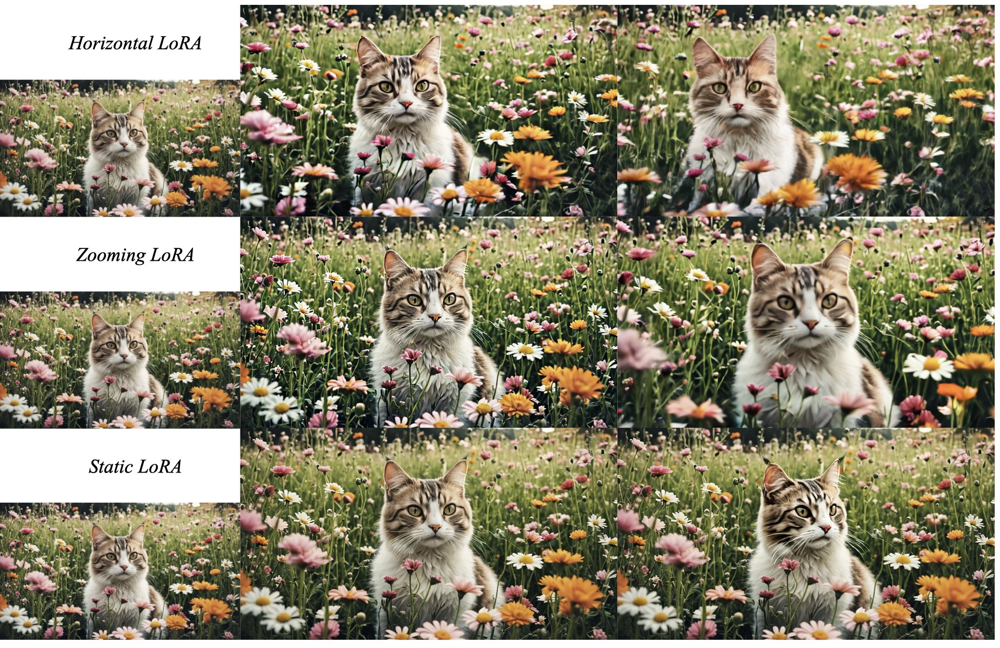
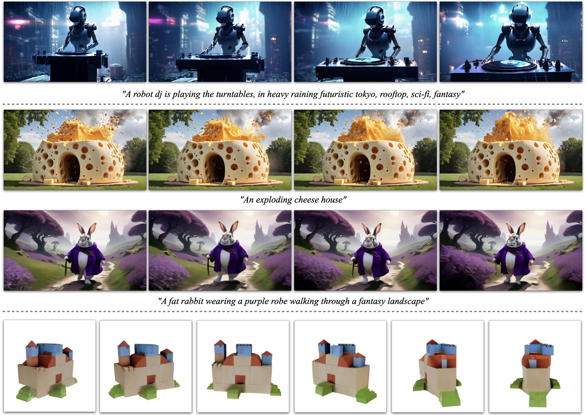
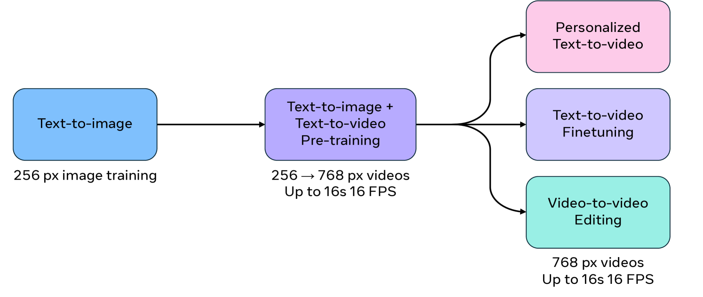
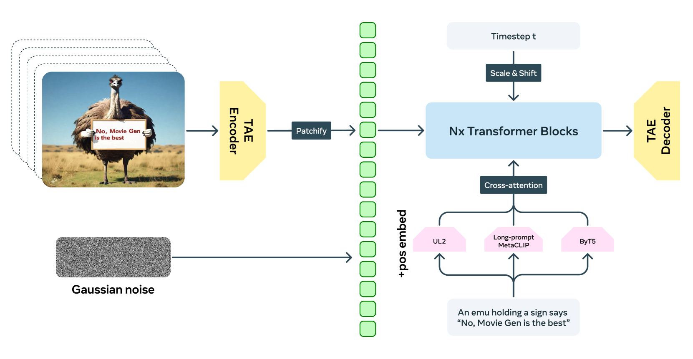
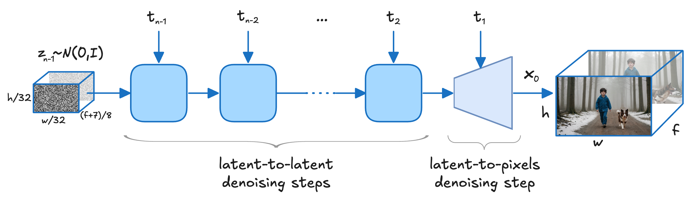
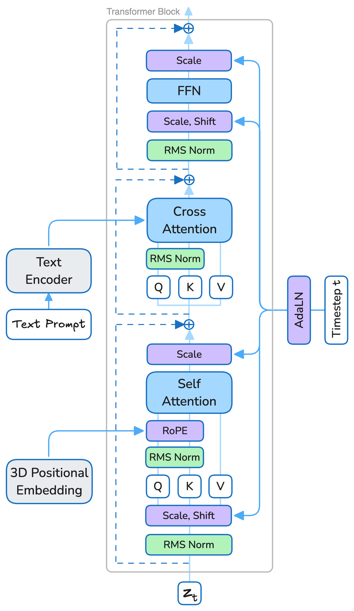
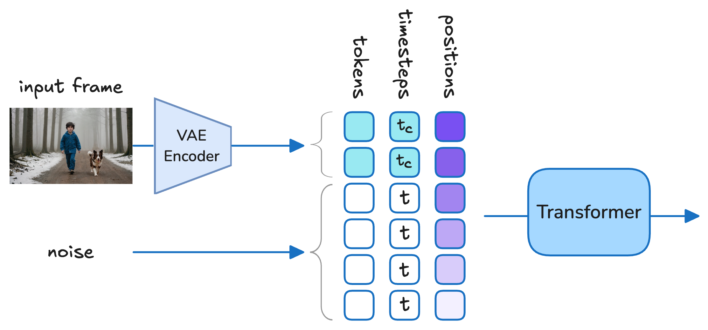
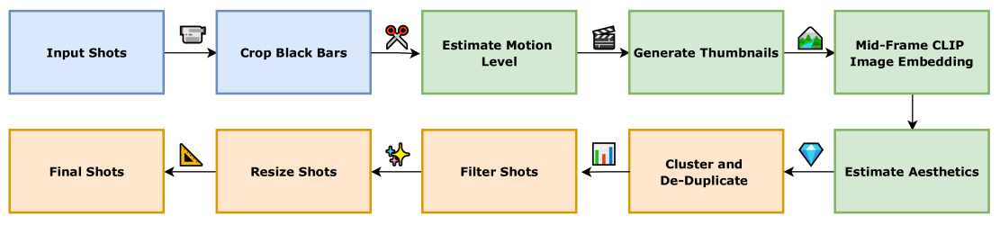

# 4.3 视频生成经典模型路线与代表架构

> 💡 **本节目标**：系统梳理视频生成领域的经典模型路线、代表架构与模型演进逻辑，帮助面试者从“任务范式—技术路线—代表模型—工业系统”四个层次建立完整认知。

---

# 目录导航

[4.3.1 视频生成模型的任务坐标系：T2V、I2V、V2V 与统一多模态生成](#4.3.1_视频生成模型的任务坐标系：T2V、I2V、V2V-与统一多模态生成)
  - [4.3.1.1 面试问题：视频生成模型通常按输入输出范式如何分类？](#4.3.1.1_面试问题：视频生成模型通常按输入输出范式如何分类？)
  - [4.3.1.2 面试问题：T2V、I2V、V2V、Subject-to-Video 的核心差异是什么？](#4.3.1.2_面试问题：T2V、I2V、V2V、Subject-to-Video-的核心差异是什么？)
  - [4.3.1.3 面试问题：为什么视频生成正在从单条件任务走向统一多模态生成？](#4.3.1.3_面试问题：为什么视频生成正在从单条件任务走向统一多模态生成？)

[4.3.2 从图像扩散到视频扩散：经典技术路线如何演进](#4.3.2_从图像扩散到视频扩散：经典技术路线如何演进)
  - [4.3.2.1 面试问题：理解视频生成模型路线时，应该抓住哪些架构关键词？](#4.3.2.1_面试问题：理解视频生成模型路线时，应该抓住哪些架构关键词？)
  - [4.3.2.2 面试问题：从 2D 图像扩散迁移到原生 Video DiT，技术路线发生了什么变化？](#4.3.2.2_面试问题：从-2D-图像扩散迁移到原生-Video-DiT，技术路线发生了什么变化？)

[4.3.3 轻量视频化路线：AnimateDiff、MotionLoRA、SVD 与 I2VGen-XL](#4.3.3_轻量视频化路线：AnimateDiff、MotionLoRA、SVD-与-I2VGen-XL)
  - [4.3.3.1 面试问题：AnimateDiff 的 Motion Module 如何插入图像扩散模型？](#4.3.3.1_面试问题：AnimateDiff-的-Motion-Module-如何插入图像扩散模型？)
  - [4.3.3.2 面试问题：为什么 AnimateDiff 的运动模块可以迁移到个性化 T2I 模型？](#4.3.3.2_面试问题：为什么-AnimateDiff-的运动模块可以迁移到个性化-T2I-模型？)
  - [4.3.3.3 面试问题：MotionLoRA / MotionDirector 解决的本质问题是什么？](#4.3.3.3_面试问题：MotionLoRA---MotionDirector-解决的本质问题是什么？)
  - [4.3.3.4 面试问题：SVD 相比 AnimateDiff 的路线差异是什么？](#4.3.3.4_面试问题：SVD-相比-AnimateDiff-的路线差异是什么？)
  - [4.3.3.5 面试问题：I2VGen-XL 的 cascaded diffusion 为什么适合 I2V？](#4.3.3.5_面试问题：I2VGen-XL-的-cascaded-diffusion-为什么适合-I2V？)
  - [4.3.3.6 面试问题：I2V 模型如何注入参考图条件？为什么首帧锁定仍然困难？](#4.3.3.6_面试问题：I2V-模型如何注入参考图条件？为什么首帧锁定仍然困难？)

[4.3.4 闭源前沿模型路线：Sora、Veo 与 Movie Gen](#4.3.4_闭源前沿模型路线：Sora、Veo-与-Movie-Gen)
  - [4.3.4.1 面试问题：Sora 如何把不同视觉数据统一成可扩展的视频生成表示？](#4.3.4.1_面试问题：Sora-如何把不同视觉数据统一成可扩展的视频生成表示？)
  - [4.3.4.2 面试问题：为什么 spacetime patches 和 Diffusion Transformer 是 Sora 路线的关键？](#4.3.4.2_面试问题：为什么-spacetime-patches-和-Diffusion-Transformer-是-Sora-路线的关键？)
  - [4.3.4.3 面试问题：如何从模型能力和局限理解 Sora 的 world simulator 叙事？](#4.3.4.3_面试问题：如何从模型能力和局限理解-Sora-的-world-simulator-叙事？)
  - [4.3.4.4 面试问题：Veo 的原生音视频生成和物理真实感说明了什么技术方向？](#4.3.4.4_面试问题：Veo-的原生音视频生成和物理真实感说明了什么技术方向？)
  - [4.3.4.5 面试问题：Veo 的多控制接口为什么体现了视频生成系统化趋势？](#4.3.4.5_面试问题：Veo-的多控制接口为什么体现了视频生成系统化趋势？)
  - [4.3.4.6 面试问题：Movie Gen 为什么是 media foundation model，而不是单一 T2V 模型？](#4.3.4.6_面试问题：Movie-Gen-为什么是-media-foundation-model，而不是单一-T2V-模型？)
  - [4.3.4.7 面试问题：Movie Gen 的大规模 Transformer 和长上下文设计说明了什么？](#4.3.4.7_面试问题：Movie-Gen-的大规模-Transformer-和长上下文设计说明了什么？)
  - [4.3.4.8 面试问题：闭源前沿视频模型在底层技术上有哪些共同趋势？](#4.3.4.8_面试问题：闭源前沿视频模型在底层技术上有哪些共同趋势？)

[4.3.5 开放视频基础模型路线：Open-Sora、HunyuanVideo、Wan、Step-Video 与 CogVideoX](#4.3.5_开放视频基础模型路线：Open-Sora、HunyuanVideo、Wan、Step-Video-与-CogVideoX)
  - [4.3.5.1 面试问题：Open-Sora 路线如何把闭源前沿模型拆解成可复现的开放训练管线？](#4.3.5.1_面试问题：Open-Sora-路线如何把闭源前沿模型拆解成可复现的开放训练管线？)
  - [4.3.5.2 面试问题：Open-Sora / Open-Sora-Plan 中的 Video VAE、WFVAE 与稀疏时空去噪器分别解决什么问题？](#4.3.5.2_面试问题：Open-Sora---Open-Sora-Plan-中的-Video-VAE、WFVAE-与稀疏时空去噪器分别解决什么问题？)
  - [4.3.5.3 面试问题：HunyuanVideo 为什么强调 systematic framework，而不是单一模型结构？](#4.3.5.3_面试问题：HunyuanVideo-为什么强调-systematic-framework，而不是单一模型结构？)
  - [4.3.5.4 面试问题：HunyuanVideo 的大规模开放视频基础模型路线，核心架构与训练策略是什么？](#4.3.5.4_面试问题：HunyuanVideo-的大规模开放视频基础模型路线，核心架构与训练策略是什么？)
  - [4.3.5.5 面试问题：Wan 为什么更适合被理解为开放视频模型家族，而不是单个 T2V 模型？](#4.3.5.5_面试问题：Wan-为什么更适合被理解为开放视频模型家族，而不是单个-T2V-模型？)
  - [4.3.5.6 面试问题：Wan 的 VAE、DiT、预训练与评测体系说明了什么底层路线？](#4.3.5.6_面试问题：Wan-的-VAE、DiT、预训练与评测体系说明了什么底层路线？)
  - [4.3.5.7 面试问题：Step-Video-T2V 的 30B DiT、深压缩 Video-VAE 与 Flow Matching 说明了什么？](#4.3.5.7_面试问题：Step-Video-T2V-的-30B-DiT、深压缩-Video-VAE-与-Flow-Matching-说明了什么？)
  - [4.3.5.8 面试问题：Step-Video-TI2V 如何从 T2V 基座扩展到文本驱动的 I2V？](#4.3.5.8_面试问题：Step-Video-TI2V-如何从-T2V-基座扩展到文本驱动的-I2V？)
  - [4.3.5.9 面试问题：CogVideoX 的 3D Causal VAE 与 Expert Transformer 解决了哪些关键问题？](#4.3.5.9_面试问题：CogVideoX-的-3D-Causal-VAE-与-Expert-Transformer-解决了哪些关键问题？)
  - [4.3.5.10 面试问题：CogVideoX 的 progressive training、multi-resolution frame pack 与数据管线有什么面试价值？](#4.3.5.10_面试问题：CogVideoX-的-progressive-training、multi-resolution-frame-pack-与数据管线有什么面试价值？)

[4.3.6 工业级视频生成路线：Seedance、Kling 与 LTX-Video](#4.3.6_工业级视频生成路线：Seedance、Kling-与-LTX-Video)
  - [4.3.6.1 面试问题：Seedance 1.0 如何在视频基座中同时优化质量、速度与多镜头一致性？](#4.3.6.1_面试问题：Seedance-1.0-如何在视频基座中同时优化质量、速度与多镜头一致性？)
  - [4.3.6.2 面试问题：Seedance 的音视频联合生成为什么不是简单的“视频后配音”？](#4.3.6.2_面试问题：Seedance-的音视频联合生成为什么不是简单的“视频后配音”？)
  - [4.3.6.3 面试问题：Kling-Omni 为什么代表统一视频生成、编辑与推理系统路线？](#4.3.6.3_面试问题：Kling-Omni-为什么代表统一视频生成、编辑与推理系统路线？)
  - [4.3.6.4 面试问题：Kling 路线中的 3D VAE、DiT 与多模态表示分别承担什么角色？](#4.3.6.4_面试问题：Kling-路线中的-3D-VAE、DiT-与多模态表示分别承担什么角色？)
  - [4.3.6.5 面试问题：LTX-Video 为什么是实时视频 latent diffusion 的代表路线？](#4.3.6.5_面试问题：LTX-Video-为什么是实时视频-latent-diffusion-的代表路线？)
  - [4.3.6.6 面试问题：LTX-Video 的高压缩 Video-VAE 与 full spatiotemporal attention 如何形成工程取舍？](#4.3.6.6_面试问题：LTX-Video-的高压缩-Video-VAE-与-full-spatiotemporal-attention-如何形成工程取舍？)
  - [4.3.6.7 面试问题：工业级视频模型为什么必须重视后训练、蒸馏与系统优化？](#4.3.6.7_面试问题：工业级视频模型为什么必须重视后训练、蒸馏与系统优化？)
  - [4.3.6.8 面试问题：工业级视频生成路线与开放 foundation model 路线的核心区别是什么？](#4.3.6.8_面试问题：工业级视频生成路线与开放-foundation-model-路线的核心区别是什么？)

[4.3.7 视频编辑模型路线：从 V2V 重建到统一多模态编辑](#4.3.7_视频编辑模型路线：从-V2V-重建到统一多模态编辑)
  - [4.3.7.1 面试问题：视频编辑模型从传统 V2V 到统一多模态编辑，技术路线发生了什么变化？](#4.3.7.1_面试问题：视频编辑模型从传统-V2V-到统一多模态编辑，技术路线发生了什么变化？)
  - [4.3.7.2 面试问题：为什么源视频重建、编辑定位与非编辑内容保持是视频编辑模型的三个基础能力？](#4.3.7.2_面试问题：为什么源视频重建、编辑定位与非编辑内容保持是视频编辑模型的三个基础能力？)
  - [4.3.7.3 面试问题：基于 inversion、attention 与 mask 的编辑路线分别解决什么问题，各自有什么时序局限？](#4.3.7.3_面试问题：基于-inversion、attention-与-mask-的编辑路线分别解决什么问题，各自有什么时序局限？)
  - [4.3.7.4 面试问题：为什么视频编辑需要把局部修改、跨帧传播与边界连续性联合建模？](#4.3.7.4_面试问题：为什么视频编辑需要把局部修改、跨帧传播与边界连续性联合建模？)
  - [4.3.7.5 面试问题：为什么 Seedance、Kling、LTX 等工业模型正在把生成、参考、编辑与续写收敛到统一系统？](#4.3.7.5_面试问题：为什么-Seedance、Kling、LTX-等工业模型正在把生成、参考、编辑与续写收敛到统一系统？)


---

<h1 id="4.3.1_视频生成模型的任务坐标系：T2V、I2V、V2V-与统一多模态生成">4.3.1 视频生成模型的任务坐标系：T2V、I2V、V2V 与统一多模态生成</h1>

> 先把任务坐标摆清楚。看到一个视频模型时，先判断它是在从零生成、参考图驱动、源视频编辑，还是在做多模态统一生成。

<h2 id="4.3.1.1_面试问题：视频生成模型通常按输入输出范式如何分类？">4.3.1.1 面试问题：视频生成模型通常按输入输出范式如何分类？</h2>

**难度评分：⭐⭐⭐ (3/5)  |  考察频率：⭐⭐⭐⭐⭐ (5/5)**

视频生成模型通常可以按“输入条件是什么、输出视频如何受约束”来分类。这个分类比单纯按模型名字记忆更重要，因为不同输入输出范式决定了模型要解决的核心矛盾。

最常见的范式包括：

1. **Text-to-Video（T2V）**：输入文本 prompt，输出与文本语义一致的视频。它关注的是文本语义如何转化为动态时空内容。
2. **Image-to-Video（I2V）**：输入首帧或参考图，输出后续视频。它关注的是在已知外观和构图约束下补全合理运动。
3. **Video-to-Video（V2V）**：输入源视频和编辑条件，输出修改后的视频。它关注的是在保留源视频时空骨架的前提下做风格、语义或局部内容变换。
4. **Subject-to-Video / Character-to-Video**：输入主体参考信息，输出包含同一主体的视频。它关注的是身份、外观和主体特征能否跨帧稳定。
5. **Audio-driven / Audio-Video Generation**：输入音频或同时生成音视频，输出与声音节奏、语义、口型或事件同步的视频。它关注的是跨模态时间对齐。
6. **Unified Multimodal Generation**：同时接收文本、图像、音频、视频、主体、动作等条件，统一生成或编辑视频。它关注的是多条件之间如何协调。

可以用一个统一形式理解这些任务：

```math
p(x_{1:T} \mid c_1, c_2, \ldots, c_n)
```

其中 $x_{1:T}$ 是输出视频，$c_i$ 可以是文本、图像、视频、音频、身份特征、姿态、轨迹或其他控制信号。任务之间的差异，主要就落在三个地方：给了哪些条件，条件有多强，模型还有多少自由发挥空间。

面试回答时，可将其概括为：**T2V 关注文本语义到动态画面的映射，I2V 关注静态图像的合理运动补全，V2V 关注源视频结构约束下的稳定改写，Subject-to-Video 关注主体身份的一致性保持；统一多模态生成则关注多类条件在同一生成系统中的协同建模。**

<h2 id="4.3.1.2_面试问题：T2V、I2V、V2V、Subject-to-Video-的核心差异是什么？">4.3.1.2 面试问题：T2V、I2V、V2V、Subject-to-Video 的核心差异是什么？</h2>

**难度评分：⭐⭐⭐⭐ (4/5)  |  考察频率：⭐⭐⭐⭐⭐ (5/5)**

这几个任务都属于视频生成，但它们的难点并不一样。最容易混淆的地方是：它们都可能使用扩散模型、Video VAE、DiT 或 U-Net 主干，但任务约束不同，模型能力侧重点也不同。

| 任务范式 | 输入条件 | 输出目标 | 核心难点 | 面试重点 |
|---|---|---|---|---|
| T2V | 文本 prompt | 从零生成视频 | 语义对齐、运动合理性、时序一致性 | 文本语义如何变成动态过程 |
| I2V | 首帧/参考图 + 可选文本 | 让静态图动起来 | 首帧锁定、运动补全、局部漂移 | 内容已知，运动待补全 |
| V2V | 源视频 + 编辑条件 | 受控修改源视频 | 保留时空结构、避免闪烁、局部编辑一致性 | 不是从零生成，而是约束变换 |
| Subject-to-Video | 主体参考图/身份特征 | 生成同一主体的视频 | 跨帧身份稳定、多姿态泛化、参考融合 | 生成“同一个对象”，不是随机相似对象 |

T2V 的自由度最大，模型需要自己决定主体、场景、构图和运动；I2V 的视觉锚点更强，但难点变成“如何不破坏参考图”；V2V 的约束最强，它需要尊重源视频的时空结构；Subject-to-Video 则把“同一主体是否稳定”推到核心位置。

因此，比较这些任务时不应仅停留在“输入条件不同”。更准确的表述是：**条件越弱，模型需要承担越多内容补全；条件越强，模型越需要保持约束一致性。** T2V 的难点是语义到运动的映射，I2V 的难点是运动补全，V2V 的难点是结构保持，Subject-to-Video 的难点是身份稳定。

<h2 id="4.3.1.3_面试问题：为什么视频生成正在从单条件任务走向统一多模态生成？">4.3.1.3 面试问题：为什么视频生成正在从单条件任务走向统一多模态生成？</h2>

**难度评分：⭐⭐⭐⭐ (4/5)  |  考察频率：⭐⭐⭐⭐ (4/5)**

视频生成走向统一多模态生成，根本原因在于真实创作通常不是单一 prompt 驱动。用户往往既需要指定文本语义，又需要保留参考图主体，同时还可能需要控制镜头运动、动作节奏、声音事件和视频风格。

早期模型往往按任务拆开：T2V 做文生视频，I2V 做图生视频，V2V 做视频编辑，Audio-driven 模型做口型或动作驱动。但这种拆分会带来两个问题：

1. **能力割裂**：不同任务需要不同模型或插件，生成、编辑、延长、配音、主体保持很难形成一个连续工作流。
2. **条件冲突难处理**：文本、图像、音频、视频参考和身份条件如果各自独立注入，模型很容易出现语义服从了但主体漂移，主体保住了但动作不对，声音对齐了但镜头逻辑断裂。

因此，前沿模型逐渐走向统一条件建模：

```math
p(x_{1:T}, a \mid c_{text}, c_{image}, c_{video}, c_{audio}, c_{id}, c_{motion})
```

该公式的重点不在形式复杂度，而在于说明多条件之间存在约束耦合。参考图约束主体外观，文本约束动作语义，音频约束节奏，视频参考约束镜头风格，身份特征约束跨帧稳定性；模型需要在这些条件之间建立一致的生成解。

综合 Sora、Veo、Movie Gen、Seedance、Kling 等路线可以看到同一趋势：**视频生成正在从单 prompt 条件采样，演化为多条件生成与编辑系统。**

<h1 id="4.3.2_从图像扩散到视频扩散：经典技术路线如何演进">4.3.2 从图像扩散到视频扩散：经典技术路线如何演进</h1>

> VAE、LDM、DiT、时序建模和条件注入已经在 4.2 中介绍。本节从模型路线角度出发，分析这些模块如何组合成不同的视频生成系统。

<h2 id="4.3.2.1_面试问题：理解视频生成模型路线时，应该抓住哪些架构关键词？">4.3.2.1 面试问题：理解视频生成模型路线时，应该抓住哪些架构关键词？</h2>

**难度评分：⭐⭐⭐⭐ (4/5)  |  考察频率：⭐⭐⭐⭐⭐ (5/5)**

理解视频生成模型路线时，不应仅记忆模型名称。模型名称会随时间变化，但底层架构问题相对稳定。

第一是 **Video VAE / Video Tokenizer**。它决定视频如何从像素空间压缩到 latent space，也决定后续主干网络看到的 token 数量、运动信息和重建质量。视频 VAE 不只是图像 VAE 的多帧版本，它还要处理 temporal downsampling、causal encoding、跨帧连续性和长视频可扩展性。

第二是 **Latent Video Diffusion**。主流模型通常不直接在像素空间生成视频，而是在压缩后的 latent space 中去噪。这样可以降低训练和推理成本，也更容易叠加时序建模、条件注入和多阶段采样。

第三是 **时空主干网络**。早期路线常见 2D U-Net + Temporal Module，后来逐渐转向 Video U-Net、3D U-Net、Video Transformer、DiT / Video DiT。它们的差异，主要体现在如何处理空间细节、时间依赖、长程一致性和扩展性。

第四是 **条件注入机制**。文本、图像、音频、身份、姿态、轨迹、参考视频等条件，通常通过 cross-attention、AdaLN、FiLM、adapter、reference attention、ControlNet 类分支或多模态 token 融合进入主干。视频任务的关键难点在于条件需要跨时间持续生效。

第五是 **长视频与高效推理策略**。Causal、Chunk、Sliding-Window、Hierarchical、少步采样、蒸馏、分块解码、稀疏注意力等方法，都是为了让模型从短片段生成扩展到更长、更稳定、更可部署的视频系统。

分析一个视频生成模型时，可以优先关注以下问题：视频如何压缩，主干如何构建，条件如何注入，时间依赖如何建模，长视频如何推理。掌握这些维度后，模型路线就不再只是名称记忆。

<h2 id="4.3.2.2_面试问题：从-2D-图像扩散迁移到原生-Video-DiT，技术路线发生了什么变化？">4.3.2.2 面试问题：从 2D 图像扩散迁移到原生 Video DiT，技术路线发生了什么变化？</h2>

**难度评分：⭐⭐⭐⭐⭐ (5/5)  |  考察频率：⭐⭐⭐⭐ (4/5)**

视频生成模型的技术路线可以按一条主线理解：早期尽量复用图像生成能力，随后逐步转向原生时空建模。用这条主线串联 AnimateDiff、Stable Video Diffusion、Open-Sora、Sora、HunyuanVideo、Wan、CogVideoX，比单纯按发布时间记忆更有助于把握方法演进。

早期轻量路线的核心思想是：**在已有图像扩散模型基础上补充时间维度建模能力。** AnimateDiff 是典型代表。它在已有 T2I backbone 中插入 Motion Module，使模型在保留图像先验的同时学习跨帧运动。这类路线训练成本较低、迁移便利，但上限容易受原始 2D 主干限制。

随后，视频扩散路线开始更加重视 **Video VAE + Latent Video Diffusion**。Stable Video Diffusion、I2VGen-XL 等模型表明，I2V 或短视频生成不能仅依赖逐帧生成，而需要底层视频基座模型学习稳定的 motion representation。

再往后，大规模模型逐渐转向 **Video Transformer / Video DiT**。这类方法把视频表示成时空 token 或 spacetime patches，让模型在统一 token 空间里处理空间、时间和条件信息。Sora、Open-Sora、HunyuanVideo、CogVideoX 等路线都可以放进这个趋势里理解。

这条演进线可以概括为：

```text
2D 图像扩散 + Motion Module
        -> Latent Video Diffusion / Video VAE
        -> Video Transformer / Video DiT
        -> 统一多模态视频基础模型
```

这条演进线背后的核心变化是：**视频不再被视为多张图像的简单组合，而是被建模为连续时空对象。** 因此，后续模型会频繁涉及 spacetime patches、3D VAE、causal VAE、video tokenizer、long-context attention、多模态条件融合和音视频联合生成。

<h1 id="4.3.3_轻量视频化路线：AnimateDiff、MotionLoRA、SVD-与-I2VGen-XL">4.3.3 轻量视频化路线：AnimateDiff、MotionLoRA、SVD 与 I2VGen-XL</h1>

> 本节关注“图像模型视频化”路线。重点不在于记忆模型名称，而在于理解 Motion Module、运动先验迁移、视频基座模型、I2V 条件注入和分阶段生成等底层机制。

<h2 id="4.3.3.1_面试问题：AnimateDiff-的-Motion-Module-如何插入图像扩散模型？">4.3.3.1 面试问题：AnimateDiff 的 Motion Module 如何插入图像扩散模型？</h2>

**难度评分：⭐⭐⭐⭐ (4/5)  |  考察频率：⭐⭐⭐⭐⭐ (5/5)**

AnimateDiff 的核心不是重新训练一个完整的视频扩散模型，而是在已有 Text-to-Image diffusion backbone 中插入可学习的 **Motion Module**，让原本只处理单帧图像的模型获得跨帧建模能力。

更具体地说，原始图像扩散模型的 U-Net 已经具备较强的空间生成能力，包括纹理、构图、主体外观和文本对齐。AnimateDiff 的设计目标是在尽量保留这些能力的前提下复用原有图像生成主干，只在部分网络块中插入时间建模模块。该模块通常沿时间维度处理多帧特征，使模型能够建模不同帧之间的关系。

可以把视频 latent 特征理解为：

```math
z \in \mathbb{R}^{B \times T \times C \times H \times W}
```

其中 $T$ 是帧数。普通图像 U-Net 主要处理 $C \times H \times W$ 的空间特征，而 Motion Module 的作用，就是在同一空间位置或相邻特征区域上，沿 $T$ 维度建立帧间依赖。这样模型既能保留原有图像模型的空间先验，又能学习视频中的运动变化。

从机制上看，这类 Motion Module 通常承担三件事：

1. **跨帧信息交换**：让相邻帧或多帧之间共享运动信息，避免逐帧独立生成。
2. **运动先验学习**：从视频数据中学习常见运动模式，例如相机移动、主体位移和局部形变。
3. **空间先验保护**：尽量保持原始 T2I 模型已经学到的图像质量和文本对齐能力。

因此，AnimateDiff 代表一种典型的 **2D 强图像先验 + 轻量时间模块** 路线。它不同于后续原生 Video DiT：后者从一开始就将视频建模为时空 token 序列，而 AnimateDiff 更侧重在强图像模型上补充时间建模支路。

面试回答可概括为：**AnimateDiff 的关键不是重新设计整个视频生成器，而是将时间建模做成可插拔 Motion Module，插入已有图像扩散模型中；原模型继续负责空间质量和语义对齐，Motion Module 负责跨帧运动建模。**

引用来源：
- 《AnimateDiff: Animate Your Personalized Text-to-Image Diffusion Models without Specific Tuning》：论文明确提出 plug-and-play motion module，可训练一次后插入同源个性化 T2I 模型中。https://arxiv.org/abs/2307.04725

<h2 id="4.3.3.2_面试问题：为什么-AnimateDiff-的运动模块可以迁移到个性化-T2I-模型？">4.3.3.2 面试问题：为什么 AnimateDiff 的运动模块可以迁移到个性化 T2I 模型？</h2>

**难度评分：⭐⭐⭐⭐ (4/5)  |  考察频率：⭐⭐⭐⭐ (4/5)**

AnimateDiff 的一个关键设计目标，是让运动模块可以迁移到同源的个性化图像模型中。这里的“同源”非常关键：如果多个个性化 T2I 模型来自相同或相近的基础扩散模型，它们的中间特征空间、U-Net 结构和去噪动态通常保持较强一致性。此时，Motion Module 学到的跨帧运动先验就有机会在这些模型之间迁移。

这背后的核心假设是：**外观生成能力和运动建模能力可以在一定程度上分离**。图像模型负责生成“这一帧长什么样”，运动模块负责建模“多帧之间如何变化”。如果 motion prior 学到的是相机推进、主体转身、局部形变等相对通用的时间模式，它就不必绑定某一个具体角色或风格。

这个机制对个性化模型尤其重要。DreamBooth、LoRA 或其他 T2I personalization 方法通常会改变模型的主体、风格或概念表达，但不一定提供视频数据。如果每个个性化模型都要重新训练视频版本，成本会非常高。AnimateDiff 的思路是把 motion prior 训练成可复用模块，使个性化图像模型可以在较低成本下获得短视频生成能力。

需要注意的是，这种迁移并非无条件成立，通常依赖以下前提：

1. **基础模型同源或结构兼容**：Motion Module 插入的位置和特征维度必须匹配。
2. **运动先验足够通用**：模块学到的应是时间变化模式，而不是训练视频中的特定外观。
3. **空间生成能力不能被破坏**：运动模块加入后，不能显著损害个性化模型原本的主体一致性和风格表达。

因此，AnimateDiff 能够低成本视频化的底层原因不是“少量视频训练即可完成视频生成”，而是将问题拆分为两个相对独立的部分：**图像主干保留空间生成能力，Motion Module 学习可迁移的时间先验。**

面试里可以这样收束：**AnimateDiff 的迁移性来自同源图像扩散模型共享相近特征空间，以及运动模块主要学习跨帧变化而不是单帧外观；这使它可以把通用 motion prior 插到不同个性化 T2I 模型中。**

引用来源：
- 《AnimateDiff: Animate Your Personalized Text-to-Image Diffusion Models without Specific Tuning》：论文强调 Motion Module 可在同源个性化 T2I 模型之间复用，核心是学习 transferable motion prior。https://arxiv.org/abs/2307.04725

<h2 id="4.3.3.3_面试问题：MotionLoRA---MotionDirector-解决的本质问题是什么？">4.3.3.3 面试问题：MotionLoRA / MotionDirector 解决的本质问题是什么？</h2>

**难度评分：⭐⭐⭐⭐ (4/5)  |  考察频率：⭐⭐⭐⭐ (4/5)**

MotionLoRA 和 MotionDirector 关注的不是“模型是否能够生成视频”，而是更具体的问题：**运动模式是否能够被低成本、可迁移、可控地定制。**

AnimateDiff 已经证明了通用运动模块可以插入图像扩散模型，但真实应用经常需要特定运动，例如固定镜头语言、角色动作、相机平移、广告模板运动或某种风格化动态效果。为每一种运动都重新训练完整 motion module 并不现实，因此 MotionLoRA 把运动适配做成低秩增量更新，让新运动模式以较低参数成本注入模型。

LoRA 的基本思想可以理解为：不直接学习完整权重更新 $\Delta W$，而是用低秩分解近似：

```math
\Delta W \approx A B,\quad \mathrm{rank}(A B) \ll \mathrm{rank}(W)
```

这样做的好处是训练参数少、存储成本低、适合小样本运动定制，也便于不同 motion pattern 的管理和组合。

但视频运动定制存在一个比图像 LoRA 更困难的问题：**motion 和 appearance 容易纠缠**。例如训练样本是“某个玩具熊在跳舞”，模型可能同时记住“玩具熊外观”和“跳舞动作”。迁移到其他主体时，模型可能不只迁移动作，还会引入原样本外观，导致主体不稳定或动作泛化失败。

MotionDirector 进一步强调这个问题，提出 dual-path LoRA 和 appearance-debiased temporal loss，目标是把 appearance learning 和 motion learning 尽量解耦。它关注的不是普通 LoRA 式的外观概念注入，而是让模型学到可迁移的时序变化模式。

因此，这条路线的本质可以概括为：

1. **AnimateDiff**：学习通用 motion prior。
2. **MotionLoRA**：用低秩增量适配特定 motion pattern。
3. **MotionDirector**：进一步处理 motion 与 appearance 的解耦，使运动更容易跨主体迁移。

Stable Video Diffusion 论文中的 Camera Motion LoRA 示例可以辅助理解“同一条件帧 + 不同运动适配模块”带来的运动差异，如图3-1所示。

<div align="center">
  
  <p>图3-1 Stable Video Diffusion 中 Camera Motion LoRA 对同一条件帧施加不同相机运动的示意图</p>
</div>

若面试中被问到这类方法，不宜仅回答“用 LoRA 降低训练成本”。更准确的回答是：**MotionLoRA / MotionDirector 的核心，是将视频生成中的运动能力从整体模型中解耦出来，形成可低成本定制、可迁移、并尽量与外观解耦的运动控制层。**

引用来源：
- 《AnimateDiff: Animate Your Personalized Text-to-Image Diffusion Models without Specific Tuning》：论文中提出 MotionLoRA，用低成本适配新的 motion pattern。https://arxiv.org/abs/2307.04725
- 《MotionDirector: Motion Customization of Text-to-Video Diffusion Models》：进一步强调通过 dual-path LoRA 解耦 appearance 与 motion。https://arxiv.org/abs/2310.08465

<h2 id="4.3.3.4_面试问题：SVD-相比-AnimateDiff-的路线差异是什么？">4.3.3.4 面试问题：SVD 相比 AnimateDiff 的路线差异是什么？</h2>

**难度评分：⭐⭐⭐⭐ (4/5)  |  考察频率：⭐⭐⭐⭐⭐ (5/5)**

Stable Video Diffusion（SVD）和 AnimateDiff 都可以用于 I2V 或短视频生成，但二者代表的技术路线并不相同。

**AnimateDiff 属于“图像模型视频化”路线**。它的出发点是已有 T2I 模型具备较强空间生成能力，因此通过插入 Motion Module 补充时间建模能力。它强调复用图像先验、降低训练成本和提升模块迁移性。

**SVD 属于“视频基座模型”路线**。SVD 论文强调先训练较强的 latent video diffusion base model，再将其用于 image-to-video 等下游任务。它关注的不只是静态图像动画化，而是让模型在大规模视频数据上学习 motion representation、时序一致性和视频分布。

两条路线可以这样对比：

| 维度 | AnimateDiff | Stable Video Diffusion |
|---|---|---|
| 基本思路 | 在 T2I 模型中插入 Motion Module | 训练 latent video diffusion base model |
| 主要优势 | 低成本、可插拔、易迁移到个性化模型 | 视频先验更强，更适合作为 I2V 基座 |
| 核心能力 | 给图像模型补时间维度 | 学习视频分布与 motion representation |
| 典型问题 | 受原始图像主干限制，长时一致性有限 | 训练数据、训练成本和视频质量要求更高 |

SVD 论文中的样例进一步展示了视频基座模型在 T2V、I2V 和多视角生成等任务上的扩展性，如图3-2所示。

<div align="center">
  
  <p>图3-2 Stable Video Diffusion 在 T2V、I2V 与多视角生成任务上的样例</p>
</div>

从条件形式看，SVD 的 I2V 生成更接近：

```math
\epsilon_\theta(z_t, t, c_{\text{image}}, c_{\text{motion}})
```

其中 $c_{\text{image}}$ 提供首帧或参考图条件，$c_{\text{motion}}$ 可理解为模型从视频预训练中学到的运动先验。关键在于，图像条件主要约束外观和内容，视频基座本身仍需具备足够强的运动生成能力。

因此，SVD 与 AnimateDiff 的差异不只是模型名称不同，而是技术路线不同：**AnimateDiff 强调用轻量 Motion Module 改造图像模型，SVD 强调通过视频预训练得到视频生成基座，再服务 I2V 等下游任务。**

引用来源：
- 《Stable Video Diffusion: Scaling Latent Video Diffusion Models to Large Datasets》：论文强调从图像预训练到视频预训练，再到 high-quality video finetuning，并将 I2V 作为重要下游能力。https://arxiv.org/abs/2311.15127
- 《AnimateDiff: Animate Your Personalized Text-to-Image Diffusion Models without Specific Tuning》：代表在 T2I 主干中插入 Motion Module 的轻量视频化路线。https://arxiv.org/abs/2307.04725

<h2 id="4.3.3.5_面试问题：I2VGen-XL-的-cascaded-diffusion-为什么适合-I2V？">4.3.3.5 面试问题：I2VGen-XL 的 cascaded diffusion 为什么适合 I2V？</h2>

**难度评分：⭐⭐⭐⭐ (4/5)  |  考察频率：⭐⭐⭐⭐ (4/5)**

I2VGen-XL 的重要性在于，它把 I2V 问题拆成了更清晰的阶段，而不是试图让一个模型同时完成所有目标。

I2V 的核心矛盾是：输入图像已经给定了外观、主体和构图，但输出视频还需要补全运动、时间变化和高质量细节。若把这些目标全部压到一个阶段里，模型容易出现两类问题：要么过度保守，只产生轻微抖动；要么运动变强，但参考图内容被破坏。

I2VGen-XL 的 cascaded diffusion 设计，就是把这些目标拆开处理。论文中采用 two-stage cascaded design，可以概括为：

1. **Base stage**：更关注语义一致、主体保持和粗粒度运动生成。  
   这一阶段的核心目标是让视频“内容上对”和“动起来”，避免一开始就被高分辨率细节牵制。

2. **Refinement stage**：更关注分辨率、纹理和视觉质量提升。  
   这一阶段在已有视频结构基础上补充细节，使输出更清晰、更稳定。

这种分阶段设计适合 I2V，因为 I2V 同时需要满足三个目标：

1. **参考图内容不能丢**：主体、构图、身份和风格要保持。
2. **运动幅度需要充分**：否则容易退化为静态图的轻微扰动。
3. **细节不能崩**：高分辨率输出中人脸、手部、纹理边缘容易漂移。

如果用一个形式化表达，可以把 I2VGen-XL 的思想理解成先生成粗视频结构，再进行细节增强：

```math
p(x^{\mathrm{high}}_{1:T} \mid I, c)
= p(x^{\mathrm{high}}_{1:T} \mid x^{\mathrm{base}}_{1:T}, I, c)\,
  p(x^{\mathrm{base}}_{1:T} \mid I, c)
```

其中 $I$ 是参考图，$c$ 是文本或其他条件，$x^{\mathrm{base}}_{1:T}$ 表示基础阶段的视频结果，$x^{\mathrm{high}}_{1:T}$ 表示高质量输出。该表达不要求模型严格按概率分解实现，但有助于理解 cascaded diffusion 的核心逻辑：**先解决内容和运动，再解决细节和清晰度。**

面试回答可概括为：**I2VGen-XL 的 cascaded diffusion 适合 I2V，是因为它将内容保持、运动补全和视觉细节增强拆分到不同阶段处理，降低了单阶段模型同时满足多重约束的难度。**

引用来源：
- 《I2VGen-XL: High-Quality Image-to-Video Synthesis via Cascaded Diffusion Models》：论文强调利用静态图像作为关键引导，并采用 two-stage cascaded design 分别处理内容保留和细节提升。https://arxiv.org/abs/2311.04145

<h2 id="4.3.3.6_面试问题：I2V-模型如何注入参考图条件？为什么首帧锁定仍然困难？">4.3.3.6 面试问题：I2V 模型如何注入参考图条件？为什么首帧锁定仍然困难？</h2>

**难度评分：⭐⭐⭐⭐ (4/5)  |  考察频率：⭐⭐⭐⭐⭐ (5/5)**

I2V 的任务可以写成：

```math
p(x_{2:T} \mid x_1, c)
```

其中 $x_1$ 是首帧或参考图，$c$ 是文本、运动提示或其他控制条件。该公式形式较简洁，但难点在于：参考图不能只影响第一帧，而需要在整个时间轴上持续约束主体、场景和风格。

常见的参考图注入方式包括：

1. **Latent concat / channel concat**  
   将参考图编码到 latent space，与噪声视频 latent 拼接或对齐后输入去噪网络。这种方式直接、稳定，但如果条件传播不足，后续帧仍可能漂移。

2. **Image encoder + cross-attention**  
   用 CLIP image encoder、视觉编码器或专门 image adapter 提取参考图特征，再通过 cross-attention 注入视频主干。它更适合语义和外观对齐，但细粒度几何和局部纹理不一定完全保住。

3. **Reference attention / feature injection**  
   在生成过程中让后续帧访问参考图或首帧特征，用来维持主体外观、局部纹理和风格一致性。这类方法对角色一致性和产品图动画化特别重要。

4. **结构控制信号**  
   通过 depth、pose、edge、mask、flow、trajectory 等额外条件约束运动或几何结构，减少“参考图保住了但动得不合理”的问题。

即便有这些条件注入方式，首帧锁定仍然困难，原因主要有三点。

第一，**运动补全天然是一对多问题**。同一张图可以对应很多合理运动，模型必须在保持参考图的同时选择一种动态演化路径。运动幅度过小会像静态图抖动，运动幅度过大又容易破坏原始外观。

第二，**局部细节很难跨帧严格保持**。人脸、手部、头发、衣物边缘、文字、Logo 等区域具有高频细节，扩散模型在逐步去噪时容易产生轻微变化，累积之后就表现为 local drift。

第三，**参考条件和生成自由度存在冲突**。I2V 既要“像参考图”，又要“生成新运动”。如果参考约束过强，视频缺少动态；如果生成自由度过高，主体、背景或局部纹理就容易偏离。

因此，I2V 的关键不是简单地“将图像输入模型”，而是解决参考图信息如何跨时间传播的问题。成熟的 I2V 系统通常需要同时依赖视频基座、参考特征注入、运动先验和时序一致性约束。

面试回答可概括为：**I2V 的参考图注入方式较多，但首帧锁定仍然困难，因为模型必须在内容保持和运动生成之间平衡；核心难点是让参考图约束持续作用于整段视频，而不是仅影响第一帧。**

引用来源：
- 《Stable Video Diffusion: Scaling Latent Video Diffusion Models to Large Datasets》：论文强调强视频基座模型、video pretraining 与 high-quality finetuning 对 I2V 下游能力的重要性。https://arxiv.org/abs/2311.15127
- 《I2VGen-XL: High-Quality Image-to-Video Synthesis via Cascaded Diffusion Models》：论文强调静态图像条件和分阶段扩散对 I2V 质量的重要性。https://arxiv.org/abs/2311.04145

<h1 id="4.3.4_闭源前沿模型路线：Sora、Veo-与-Movie-Gen">4.3.4 闭源前沿模型路线：Sora、Veo 与 Movie Gen</h1>

> 本节关注闭源前沿模型。由于完整训练细节并未开源，分析时不应过度推断实现细节，而应基于官方明确披露的表示方式、主干范式、条件接口、音视频能力和系统边界进行判断。

<h2 id="4.3.4.1_面试问题：Sora-如何把不同视觉数据统一成可扩展的视频生成表示？">4.3.4.1 面试问题：Sora 如何把不同视觉数据统一成可扩展的视频生成表示？</h2>

**难度评分：⭐⭐⭐⭐ (4/5)  |  考察频率：⭐⭐⭐⭐⭐ (5/5)**

从架构角度看，Sora 的关键不只是生成视频时长更长，而是将不同类型的视觉数据统一到可扩展表示框架中。OpenAI 技术报告中明确提到，Sora 先将视觉数据压缩到 latent space，再把压缩后的表示切分成 **spacetime patches**，最后使用 diffusion transformer 在这些 patch 上建模。

这一流程可以概括为：

```text
raw video / image
        -> visual compression network
        -> latent representation
        -> spacetime patches
        -> diffusion transformer
        -> generated visual data
```

这个设计的核心价值在于统一。图像可以看成单帧视频，短视频、长视频、不同分辨率、不同长宽比的视频都可以被表示为一组时空 patch token。模型不再必须把所有数据裁剪到完全固定的尺寸和时长，而是可以在更自然的数据形态上训练。

如果用符号表示，可以把压缩后的视频 latent 写成：

```math
z = E(x_{1:T})
```

然后将 $z$ 切分成一组时空 patch：

```math
\{p_i\}_{i=1}^{N} = \mathrm{Patchify}(z)
```

其中 $N$ 与视频时长、空间分辨率和 patch 大小相关。视频越长、分辨率越高，token 数越多，计算成本也越高。因此，Sora 的表示路线本质上将视频生成问题转化为大规模时空 token 建模问题。

面试回答可概括为：**Sora 的底层思想是先压缩视觉数据，再将其切分为 spacetime patches，使图像和视频进入统一 token 空间；由此模型可以沿 Transformer scaling 路线处理不同分辨率、时长和长宽比的视觉数据。**

<h2 id="4.3.4.2_面试问题：为什么-spacetime-patches-和-Diffusion-Transformer-是-Sora-路线的关键？">4.3.4.2 面试问题：为什么 spacetime patches 和 Diffusion Transformer 是 Sora 路线的关键？</h2>

**难度评分：⭐⭐⭐⭐⭐ (5/5)  |  考察频率：⭐⭐⭐⭐⭐ (5/5)**

spacetime patches 解决的是“视频如何表示”，Diffusion Transformer 解决的是“如何在这种表示上做生成建模”。二者结合之后，Sora 路线就不再是传统的逐帧生成或 2D U-Net 加时序模块，而是更接近大规模 token 序列生成。

这种设计有三个关键意义。

第一，**它把视频生成转成统一的时空 token 建模问题**。  
传统视频模型往往分别处理空间卷积、时间卷积、帧间 attention 和多种采样策略；Sora 的表达更统一，将视频压缩为 latent patch token 后，用 Transformer 直接建模这些 token 之间的依赖关系。

第二，**它更适合 scaling**。  
Transformer 的优势在于结构统一、可扩展性强、工程生态成熟。一旦图像和视频都变成 token 序列，就可以沿着类似 LLM、ViT、DiT 的方向扩展数据、模型规模和计算量。

第三，**它支持多种视觉任务统一化**。  
Sora 技术报告展示了 text-to-video、image-to-video、video extension、video interpolation、video editing 等能力。它们表面上是不同任务，但从 token 空间看，都可以被理解成在给定不同条件的情况下生成或补全一组视觉 token。

从扩散建模角度看，Sora 的去噪过程可以抽象为：

```math
\epsilon_\theta(p_t, t, c)
```

其中 $p_t$ 是加噪后的 spacetime patch 表示，$t$ 是扩散时间步，$c$ 是文本、图像或其他条件。重点不在公式细节，而在于模型处理的是时空 patch token，而不是单帧像素。

面试回答可概括为：**spacetime patches 使视频具备统一 token 表示，Diffusion Transformer 使模型能够在该 token 空间中进行大规模生成建模；二者结合构成了 Sora 路线区别于传统视频扩散模型的核心。**

<h2 id="4.3.4.3_面试问题：如何从模型能力和局限理解-Sora-的-world-simulator-叙事？">4.3.4.3 面试问题：如何从模型能力和局限理解 Sora 的 world simulator 叙事？</h2>

**难度评分：⭐⭐⭐⭐ (4/5)  |  考察频率：⭐⭐⭐⭐ (4/5)**

Sora 的 world simulator 叙事需要从能力和局限两方面理解。它不是严格意义上的物理仿真器，而是通过大规模视频生成训练学习部分世界动态规律的生成模型。

从能力侧看，OpenAI 技术报告强调 Sora 展示出几类重要现象：

1. **长程一致性**：较长视频中能够在一定程度上保持主体、场景和动作连续。
2. **object permanence**：遮挡后物体仍可能保持存在，而不是完全丢失。
3. **3D consistency**：动态相机运动下，人物和场景元素在三维空间中具有一定一致性。
4. **世界状态变化**：模型能表现部分动作对环境状态的影响。

这些能力说明，当模型在大规模视频数据上学习时，可能从数据中吸收部分空间、运动、遮挡和因果关系先验。也就是说，它不是显式写入物理规则，而是通过生成建模隐式学习世界动态。

从局限侧看，Sora 技术报告也明确承认了不少问题：

1. **基础物理仍会出错**：例如物体破碎、碰撞、状态变化并不总是符合真实物理。
2. **长视频仍可能失去一致性**：时间变长后，物体、结构和动作逻辑仍可能漂移。
3. **因果关系并不可靠**：模型能生成看似合理的视频，但不等于具备可验证、可干预的因果世界模型。

因此，更严谨的说法是：**Sora 展示了大规模视频生成模型向 world model 靠近的迹象，但它仍是生成式世界先验，而不是严格物理模拟器或可验证世界模型。**

引用来源：
- OpenAI《Video generation models as world simulators》：提出 visual compression、spacetime patches、diffusion transformer、object permanence、3D consistency、world simulator 路线。https://openai.com/index/video-generation-models-as-world-simulators/

<h2 id="4.3.4.4_面试问题：Veo-的原生音视频生成和物理真实感说明了什么技术方向？">4.3.4.4 面试问题：Veo 的原生音视频生成和物理真实感说明了什么技术方向？</h2>

**难度评分：⭐⭐⭐⭐ (4/5)  |  考察频率：⭐⭐⭐ (3/5)**

Veo 的公开资料没有像 Sora 报告那样披露完整训练架构，因此不应过度推断其内部实现。但从官方明确强调的能力看，Veo 代表了两个重要技术方向：**原生音视频生成** 和 **更强物理真实感建模**。

第一，**原生音视频生成意味着音频不再只是后处理模块**。  
传统视频生成系统常见做法是先生成画面，再配音、配乐或做 Foley sound。Veo 官方页强调 native audio，说明其目标是让声音和画面在生成链路中更紧密耦合，包括环境声、人物动作声、节奏、语义和视频事件之间的同步。

如果从条件建模角度理解，纯视频生成通常关注：

```math
p(x_{1:T} \mid c)
```

而原生音视频生成更接近：

```math
p(x_{1:T}, a_{1:T'} \mid c)
```

其中 $x_{1:T}$ 是视频，$a_{1:T'}$ 是音频序列。关键难点在于二者必须在时间、事件和语义上对齐。

第二，**物理真实感说明视频模型开始被要求建模更稳定的世界动态**。  
Veo 官方页强调 visually realistic physics，这说明评价重点不只是单帧清晰度，而包括运动是否符合物理直觉、物体交互是否自然、镜头运动是否稳定、动作和环境响应是否一致。

因此，Veo 路线最重要的技术信号是：**视频生成系统正在从“只生成画面”走向“联合生成声画，并提高动态世界真实感”。**

<h2 id="4.3.4.5_面试问题：Veo-的多控制接口为什么体现了视频生成系统化趋势？">4.3.4.5 面试问题：Veo 的多控制接口为什么体现了视频生成系统化趋势？</h2>

**难度评分：⭐⭐⭐ (3/5)  |  考察频率：⭐⭐⭐ (3/5)**

Veo 另一个值得关注的点在于，它不仅展示 text-to-video，还展示了多种创作控制能力，例如：

- I2V
- first and last frame
- object insertion
- scene extension
- ingredients to video

这些能力从架构角度看，对应的是更复杂的条件接口。普通 T2V 只需要文本条件，而上述能力要求模型同时处理不同类型的约束：

| 能力 | 对应的技术约束 |
|---|---|
| I2V | 参考图外观保持与运动补全 |
| first and last frame | 首尾状态约束与中间过程生成 |
| object insertion | 局部区域编辑与背景一致性 |
| scene extension | 时序延展与长程一致性 |
| ingredients to video | 多对象、多概念组合与空间关系控制 |

这说明 Veo 更接近多条件视频创作系统，而不是单一 T2V 模型。其背后的关键趋势是：模型需要将文本、图像、视频片段、局部编辑区域、音频和镜头约束统一接入同一生成链路。

面试回答可概括为：**Veo 的多控制接口表明，前沿视频模型正在从单 prompt 生成器演化为多条件、可编辑、可延展的创作系统；系统能力的关键不只是生成质量，还包括条件约束能否被稳定执行。**

引用来源：
- Google DeepMind《Veo 3.1》官方模型页：明确强调 native audio、visually realistic physics、I2V、scene extension、first and last frame、object insertion 等能力。https://deepmind.google/models/veo/

<h2 id="4.3.4.6_面试问题：Movie-Gen-为什么是-media-foundation-model，而不是单一-T2V-模型？">4.3.4.6 面试问题：Movie Gen 为什么是 media foundation model，而不是单一 T2V 模型？</h2>

**难度评分：⭐⭐⭐ (3/5)  |  考察频率：⭐⭐⭐ (3/5)**

Movie Gen 的定位较为明确：Meta 将其称为 **“a cast of media foundation models”**，而不是单一 text-to-video 模型。这意味着 Movie Gen 的核心不是只完成 T2V，而是将视频、音频、编辑和个性化纳入统一媒体生成系统。

从公开资料看，Movie Gen 覆盖的能力包括：

1. **text-to-video**：根据文本生成高清视频。
2. **personalized video**：基于用户图像生成包含特定人物的视频。
3. **instruction-based video editing**：根据指令编辑已有视频。
4. **video-to-audio**：根据视频生成同步音频。
5. **text-to-audio**：根据文本生成音频。

Movie Gen 的训练流程体现了从 T2I 预训练、联合图像/视频预训练到高质量视频微调和后训练的分阶段路线，如图3-3所示。

<div align="center">
  
  <p>图3-3 Movie Gen Video 的分阶段训练流程示意图</p>
</div>

这些任务的共同点是，它们都属于 media generation，但条件和输出形式不同。若只用单一 T2V 视角理解 Movie Gen，会漏掉它最重要的方法论：**将视频生成、音频生成、个性化和编辑组织成一个媒体基础模型家族。**

可以用一个更通用的条件生成形式来理解：

```math
p(y_{\text{media}} \mid c_{\text{text}}, c_{\text{image}}, c_{\text{video}}, c_{\text{audio}}, c_{\text{instruction}})
```

其中 $y_{\text{media}}$ 可以是视频、音频或编辑后的视频。该表达的重点是任务统一，而不是单个输出模态。

面试回答可概括为：**Movie Gen 不是单一视频模型，而是一组媒体基础模型，目标是将视频生成、同步音频、视频编辑和个性化生成纳入统一 media generation 框架。**

<h2 id="4.3.4.7_面试问题：Movie-Gen-的大规模-Transformer-和长上下文设计说明了什么？">4.3.4.7 面试问题：Movie Gen 的大规模 Transformer 和长上下文设计说明了什么？</h2>

**难度评分：⭐⭐⭐⭐ (4/5)  |  考察频率：⭐⭐⭐ (3/5)**

Movie Gen 论文中的一个关键信号是，其 largest video generation model 是 30B 参数 Transformer，并能够处理 73K video tokens 的长上下文。这表明其采用了大规模 Transformer 化和长上下文建模路线。

这条路线背后有三个含义。

第一，**视频生成越来越依赖长上下文 token 建模**。  
视频比图像多时间维度，token 数量随帧数和分辨率迅速增长。能够处理 73K video tokens，说明模型设计必须考虑长序列注意力、计算效率和时空依赖建模。

第二，**模型能力越来越依赖规模化训练**。  
30B Transformer 说明 Movie Gen 不是轻量插件路线，而是沿 foundation model scaling 方向推进。它试图用更大模型容量承载视频、音频、编辑和个性化等多种媒体任务。

第三，**媒体任务需要统一表示和任务接口**。  
如果一个系统同时做 T2V、V2A、T2A、editing 和 personalization，那么不同模态必须被组织到相对统一的表示和条件接口中，否则系统会变成多个孤立模型的拼接。

Movie Gen 的联合图像与视频生成 pipeline 展示了 TAE 压缩、文本条件编码、生成主干和解码输出之间的关系，如图3-4所示。

<div align="center">
  
  <p>图3-4 Movie Gen 的联合图像与视频生成流程示意图</p>
</div>

因此，Movie Gen 的架构信号可以概括为：**用大规模 Transformer 和长视频 token 上下文，承载多任务媒体生成能力；它的目标不是短视频单点生成，而是可扩展的 media foundation model。**

引用来源：
- Meta《Movie Gen: A Cast of Media Foundation Models》官方论文页：明确强调 1080p、synchronized audio、instruction-based editing、personalized videos、video-to-audio、text-to-audio。https://ai.meta.com/research/publications/movie-gen-a-cast-of-media-foundation-models/
- arXiv 论文版本：Movie Gen: A Cast of Media Foundation Models，包含 30B video generation model、73K video tokens 等技术描述。https://arxiv.org/abs/2410.13720

<h2 id="4.3.4.8_面试问题：闭源前沿视频模型在底层技术上有哪些共同趋势？">4.3.4.8 面试问题：闭源前沿视频模型在底层技术上有哪些共同趋势？</h2>

**难度评分：⭐⭐⭐⭐ (4/5)  |  考察频率：⭐⭐⭐⭐ (4/5)**

Sora、Veo 和 Movie Gen 的公开细节不同，但从底层技术趋势看，可以归纳出几个共同方向。

第一，**视觉表示正在走向压缩 latent 与 token 化**。  
Sora 明确使用 visual compression 和 spacetime patches，Movie Gen 也强调大量 video tokens，说明前沿模型基本都在避免直接在像素空间生成，而是先把视频变成可扩展的 latent/token 表示。

第二，**主干网络正在走向大规模 Transformer 化**。  
Sora 使用 diffusion transformer，Movie Gen 明确采用 30B Transformer。闭源模型虽然公开细节有限，但从能力和披露信息看，前沿视频生成正在越来越接近“视频 token + 大规模 transformer”的范式。

第三，**音视频一体化成为重要方向**。  
Veo 强调 native audio，Movie Gen 支持 synchronized audio、video-to-audio 和 text-to-audio。这说明未来视频模型如果只生成无声画面，会越来越难覆盖完整创作需求。

第四，**条件接口从文本扩展到多模态控制**。  
I2V、首尾帧、object insertion、scene extension、personalization、instruction editing 等能力说明，模型必须支持更复杂的条件组合，而不是只接受一段文本 prompt。

第五，**world prior 与物理真实感成为核心竞争点**。  
Sora 的 world simulator 叙事、Veo 的 visually realistic physics，都说明视频模型正在被要求具备更稳定的空间、运动、遮挡和因果先验。

需要注意的是，这些趋势应克制理解。闭源模型没有完整开放训练数据、模型结构和损失设计，因此面试时不应将官方能力展示直接等同于完整架构细节。更稳妥的说法是：**闭源前沿模型共同指向压缩时空表示、大规模 Transformer、原生音视频、多条件控制和更强世界先验等底层路线。**

引用来源：
- OpenAI《Video generation models as world simulators》：提出 visual compression、spacetime patches、diffusion transformer、object permanence、3D consistency、world simulator 路线。https://openai.com/index/video-generation-models-as-world-simulators/
- Google DeepMind《Veo 3.1》官方模型页：明确强调 native audio、visually realistic physics、I2V、scene extension、first and last frame、object insertion 等能力。https://deepmind.google/models/veo/
- Meta《Movie Gen: A Cast of Media Foundation Models》官方论文页：明确强调 1080p、synchronized audio、instruction-based editing、personalized videos、video-to-audio、text-to-audio。https://ai.meta.com/research/publications/movie-gen-a-cast-of-media-foundation-models/
- arXiv 论文版本：Movie Gen: A Cast of Media Foundation Models，包含 30B video generation model、73K video tokens 等技术描述。https://arxiv.org/abs/2410.13720

<h1 id="4.3.5_开放视频基础模型路线：Open-Sora、HunyuanVideo、Wan、Step-Video-与-CogVideoX">4.3.5 开放视频基础模型路线：Open-Sora、HunyuanVideo、Wan、Step-Video 与 CogVideoX</h1>

> 本节关注开放视频基础模型。相比闭源模型，开放路线更适合从可复现架构角度拆解：视频压缩器、时空主干、条件注入、训练数据、系统优化、推理成本和开源生态。

<h2 id="4.3.5.1_面试问题：Open-Sora-路线如何把闭源前沿模型拆解成可复现的开放训练管线？">4.3.5.1 面试问题：Open-Sora 路线如何把闭源前沿模型拆解成可复现的开放训练管线？</h2>

**难度评分：⭐⭐⭐⭐ (4/5)  |  考察频率：⭐⭐⭐⭐ (4/5)**

Open-Sora 的核心意义不在于复用 “Sora” 这一名称，而在于把闭源前沿视频模型背后的关键问题拆解为可实现、可验证的开放工程链路。面试中可以将其理解为开放视频基础模型的参考 pipeline：

```text
raw videos -> data filtering / captioning -> video VAE / tokenizer -> spacetime latent tokens
           -> STDiT / video diffusion transformer -> training system -> inference / sampling
```

这条路线的技术重点有三层：

1. **视频表示层**  
   原始视频维度较高，需要先通过 Video VAE 或 tokenizer 压缩到 latent space。若输入视频为 $x_{1:T}$，压缩过程可抽象为：

```math
z = E(x_{1:T}), \quad \hat{x}_{1:T} = D(z)
```

   其中 $E$ 是视频编码器，$D$ 是视频解码器。压缩器的重建质量、时序一致性和压缩率会直接影响生成模型上限。

2. **时空去噪层**  
   Open-Sora 系列通常围绕时空 latent tokens 构建扩散或 flow-based 去噪主干，本质是学习条件分布 $p(x_{1:T} \mid c)$，其中 $c$ 可以是文本、图像或其他控制条件。

3. **训练系统层**  
   开放视频模型的难点不只在模型结构，还包括数据清洗、caption 质量、多分辨率训练、显存优化、并行策略和推理加速。Open-Sora 2.0 强调以相对可控成本训练商业级视频生成模型，表明开放路线已经从“模型复现”推进到“训练系统复现”。

因此，Open-Sora 更适合作为开放视频 foundation model 的工程样本：它把 closed frontier 的抽象技术趋势，拆解成社区可以迭代的 tokenizer、DiT、数据和系统模块。

<h2 id="4.3.5.2_面试问题：Open-Sora---Open-Sora-Plan-中的-Video-VAE、WFVAE-与稀疏时空去噪器分别解决什么问题？">4.3.5.2 面试问题：Open-Sora / Open-Sora-Plan 中的 Video VAE、WFVAE 与稀疏时空去噪器分别解决什么问题？</h2>

**难度评分：⭐⭐⭐⭐ (4/5)  |  考察频率：⭐⭐⭐⭐ (4/5)**

这类开放路线的底层矛盾是：视频 token 数随帧数、分辨率和通道数快速增长，若直接对原始视频建模，计算成本很难承受。因此，Video VAE、WFVAE 和稀疏时空去噪器分别对应三个层面的降本增效。

1. **Video VAE：降低生成主干的输入维度**  
   Video VAE 将高维像素视频压缩为低维 latent video，使后续 DiT 不必直接处理像素空间。它不仅要保留空间纹理，还要保持时间连续性，因此比图像 VAE 更关注 temporal consistency。

2. **WFVAE：面向长视频的因果压缩与流式建模**  
   Open-Sora-Plan 中的 WFVAE 更强调面向长视频生成的时序压缩与因果设计。它的价值在于减少长视频 latent 序列长度，同时降低未来帧信息泄漏风险，使模型更适合长序列生成和分块推理。

3. **稀疏时空去噪器：降低 attention 的二次复杂度**  
   标准全局 attention 的复杂度约为：

```math
\mathcal{O}(N^2), \quad N = T \times H \times W
```

   当 $T$、$H$、$W$ 同时增大时，完整时空 attention 很快不可承受。因此开放路线常采用空间窗口、时间窗口、分解式 attention、稀疏 attention 或 frame packing 等策略，在建模能力和计算成本之间折中。

面试回答可概括为：**Video VAE 解决高维视频表示压缩问题，WFVAE 解决长视频压缩与因果建模问题，稀疏时空去噪器解决 token 数过多导致的 attention 成本问题。**

引用来源：
- 《Open-Sora 2.0: Training a Commercial-Level Video Generation Model in $200k》：强调低成本商业级视频生成训练与系统优化。https://arxiv.org/abs/2503.09642
- Open-Sora 官方仓库：公开训练、推理和模型实现。https://github.com/hpcaitech/Open-Sora
- Open-Sora-Plan 官方仓库：包含 WFVAE、长视频生成与开放训练路线。https://github.com/PKU-YuanGroup/Open-Sora-Plan

<h2 id="4.3.5.3_面试问题：HunyuanVideo-为什么强调-systematic-framework，而不是单一模型结构？">4.3.5.3 面试问题：HunyuanVideo 为什么强调 systematic framework，而不是单一模型结构？</h2>

**难度评分：⭐⭐⭐ (3/5)  |  考察频率：⭐⭐⭐⭐ (4/5)**

HunyuanVideo 的论文题目直接使用 “A Systematic Framework For Large Video Generative Models”，这表明它的重点不是提出某个孤立模块，而是回答大规模视频生成系统如何被完整组织起来。

一个大规模视频 foundation model 通常至少包含四个系统层面：

1. **数据层**  
   包括视频数据收集、清洗、去重、质量筛选、文本 caption、分辨率与时长组织。视频生成对数据质量极其敏感，低质量 caption 或混乱的视频片段会直接降低文本对齐和运动合理性。

2. **表示层**  
   包括视频 VAE / latent representation。表示层决定了主干模型看到的是像素、latent patch，还是更抽象的时空 token。

3. **生成主干层**  
   包括大规模 DiT、时空 attention、文本条件注入和扩散 / flow 训练目标。主干负责学习视频分布、运动模式和条件对齐。

4. **训练与后训练层**  
   包括预训练、分辨率扩展、指令对齐、偏好优化、推理采样和安全控制。这些部分决定模型能否从研究模型走向可用系统。

因此，HunyuanVideo 的代表性不在于单点技巧，而在于提供开放语境下构建大规模视频基础模型的系统框架视角。

<h2 id="4.3.5.4_面试问题：HunyuanVideo-的大规模开放视频基础模型路线，核心架构与训练策略是什么？">4.3.5.4 面试问题：HunyuanVideo 的大规模开放视频基础模型路线，核心架构与训练策略是什么？</h2>

**难度评分：⭐⭐⭐⭐ (4/5)  |  考察频率：⭐⭐⭐ (3/5)**

HunyuanVideo 可以从“开放大模型视频基座”的角度理解，其核心架构主要包括：

1. **大规模视频生成主干**  
   HunyuanVideo 明确强调超过 13B 参数的视频生成基础模型。对于视频任务而言，参数规模的意义不只是提升画质，也关系到模型能否同时表示场景、运动、镜头、物体关系和文本语义。

2. **文本-视频条件对齐**  
   视频生成不是单纯图像生成的逐帧扩展。模型需要把文本中的动作、主体、场景、镜头关系映射到一段连续视频中，因此文本编码器、cross-attention / 条件调制和训练 caption 质量都很关键。

3. **系统化训练流程**  
   大规模视频模型通常需要从较低分辨率、较短时长逐步扩展到更高分辨率和更长时长。这样的 progressive training 有助于降低训练不稳定性，并让模型先学习基础运动分布，再学习高频细节。

4. **平台化扩展能力**  
   HunyuanVideo 后续分支覆盖 I2V、Avatar、Custom 等方向，说明其价值不只是一个 T2V 模型，而是可作为多任务视频生成基座继续扩展。

面试回答可概括为：**HunyuanVideo 是以大规模开放视频生成主干为中心，围绕数据、文本对齐、时空生成和后续任务扩展构建的系统化 framework。**

引用来源：
- 《HunyuanVideo: A Systematic Framework For Large Video Generative Models》：以 systematic framework 定义自身，并强调超过 13B 参数的开放视频基础模型。https://arxiv.org/abs/2412.03603
- HunyuanVideo 官方仓库：公开基础模型与 I2V、Avatar、Custom 等后续分支。https://github.com/Tencent/HunyuanVideo

<h2 id="4.3.5.5_面试问题：Wan-为什么更适合被理解为开放视频模型家族，而不是单个-T2V-模型？">4.3.5.5 面试问题：Wan 为什么更适合被理解为开放视频模型家族，而不是单个 T2V 模型？</h2>

**难度评分：⭐⭐⭐ (3/5)  |  考察频率：⭐⭐⭐ (3/5)**

Wan 的关键定位不是单一 T2V 模型，而是开放视频生成模型家族。它同时强调多参数规模、多任务能力和可部署性，因此可以视为开放 video generation suite。

具体可以从三个方面理解：

1. **参数规模分层**  
   Wan 同时提供 1.3B 和 14B 等不同规模模型。小模型侧重效率和消费级硬件可达性，大模型侧重质量上限。这种分层使它可以覆盖研究、部署和应用探索的不同成本区间。

2. **任务形态分层**  
   Wan 不只覆盖 T2V，还扩展到 I2V、视频编辑、个性化生成等任务。这说明它的底层目标是复用统一视频生成能力，再通过条件接口和任务适配进入不同应用场景。

3. **开放生态分层**  
   代码、模型权重和任务接口共同开放，降低了社区复现、微调和二次开发门槛。对于面试而言，这比单纯讨论 benchmark 数字更能体现其方法论意义。

因此，Wan 的路线定位并不是构建单个高性能 T2V 模型，而是构建一套覆盖不同参数规模、任务形态与部署成本的视频生成模型家族。

<h2 id="4.3.5.6_面试问题：Wan-的-VAE、DiT、预训练与评测体系说明了什么底层路线？">4.3.5.6 面试问题：Wan 的 VAE、DiT、预训练与评测体系说明了什么底层路线？</h2>

**难度评分：⭐⭐⭐⭐ (4/5)  |  考察频率：⭐⭐⭐ (3/5)**

Wan 的底层路线可以概括为：以高效视频表示为基础，以可扩展 DiT 为生成主干，以大规模数据预训练和自动化评测支撑多任务扩展。

1. **VAE / tokenizer 是效率基础**  
   视频 VAE 的目标是把 $x_{1:T}$ 压缩成较短 latent 序列 $z$，在尽量保留运动和细节的同时降低主干计算量。若压缩率不足，DiT 的 token 数过高；若压缩过强，则会损失细节和运动连续性。

2. **DiT 是扩展性基础**  
   Transformer 主干更适合吸收大规模数据和多任务条件。对于视频，DiT 的关键不是简单扩大参数，而是如何处理时空 token、条件注入和长序列计算。

3. **预训练决定基础能力边界**  
   T2V、I2V、编辑和个性化生成的共同基础，是模型先在大规模视频分布上学习通用运动、场景转换和语义对齐，再通过任务条件进行适配。

4. **评测体系决定可迭代性**  
   Wan 论文强调多任务和综合评测，这对于开放模型尤其重要。没有稳定评测体系，模型家族很难判断不同规模、不同任务和不同采样策略之间的真实收益。

Wan 的技术路线可概括为：**用高效视频压缩器降低建模成本，用 DiT 承载可扩展生成能力，用多任务预训练和评测体系支撑开放模型家族迭代。**

引用来源：
- 《Wan: Open and Advanced Large-Scale Video Generative Models》：强调 comprehensive and open suite、1.3B / 14B、多任务能力和 consumer-grade efficiency。https://arxiv.org/abs/2503.20314
- Wan2.1 官方仓库：公开整套模型家族与多任务能力。https://github.com/Wan-Video/Wan2.1

<h2 id="4.3.5.7_面试问题：Step-Video-T2V-的-30B-DiT、深压缩-Video-VAE-与-Flow-Matching-说明了什么？">4.3.5.7 面试问题：Step-Video-T2V 的 30B DiT、深压缩 Video-VAE 与 Flow Matching 说明了什么？</h2>

**难度评分：⭐⭐⭐⭐ (4/5)  |  考察频率：⭐⭐⭐ (3/5)**

Step-Video-T2V 的代表性在于，它较明确地展示了超大规模视频 foundation model 的三类核心设计：大主干、深压缩表示和连续时间生成目标。

1. **30B DiT：视频生成进入超大规模 Transformer 路线**  
   30B 参数规模说明模型目标不只是生成短视频样例，而是用更大容量承载复杂场景、长程运动和文本语义对齐。对于视频任务，容量不足时常见问题是主体漂移、动作不完整和复杂 prompt 对齐失败。

2. **深压缩 Video-VAE：控制长视频 token 成本**  
   Step-Video-T2V 报告中提到 `16x16` 空间压缩和 `8x` 时间压缩。若原始视频 token 规模近似为 $T \times H \times W$，压缩后 token 数可大幅下降：

```math
N_{\text{latent}} \approx \frac{T}{8} \times \frac{H}{16} \times \frac{W}{16}
```

   这类深压缩是长视频生成的必要条件，否则 30B 主干的训练和推理成本会迅速失控。

3. **Flow Matching：用速度场学习连续生成路径**  
   Flow Matching 不直接预测离散扩散步中的噪声，而是学习从噪声分布到数据分布的连续速度场，可抽象为：

```math
\frac{d x_t}{d t} = v_\theta(x_t, t, c)
```

   其中 $v_\theta$ 是模型预测的速度场，$c$ 是文本等条件。相比传统 DDPM 形式，flow-based 训练常被用于提升采样效率和大模型训练稳定性。

因此，Step-Video-T2V 的技术信号是：开放视频模型正在向超大规模 DiT、深压缩视频表示和 flow-based 生成目标结合的方向发展。

<h2 id="4.3.5.8_面试问题：Step-Video-TI2V-如何从-T2V-基座扩展到文本驱动的-I2V？">4.3.5.8 面试问题：Step-Video-TI2V 如何从 T2V 基座扩展到文本驱动的 I2V？</h2>

**难度评分：⭐⭐⭐⭐ (4/5)  |  考察频率：⭐⭐⭐ (3/5)**

Step-Video-TI2V 可以看作在 T2V 视频基座上加入图像条件，使模型同时满足文本语义和参考图约束。其核心问题不是简单生成参考图的动态版本，而是如何在生成过程中同时保持：

1. **首帧或参考图一致性**  
   参考图提供主体外观、构图和风格先验。模型需要避免生成过程中主体身份、服饰、颜色和场景布局发生漂移。

2. **文本驱动的运动与语义控制**  
   文本条件决定动作、镜头、场景变化和事件演化。若文本条件太弱，视频只是静态图轻微扰动；若文本条件过强，又可能破坏参考图一致性。

3. **图像条件与视频 latent 的融合方式**  
   常见做法包括将参考图编码为 latent token，通过 cross-attention、condition adapter 或首帧约束注入视频生成主干。可抽象为：

```math
\hat{x}_{1:T} = G_\theta(c_{\text{text}}, c_{\text{image}}, \epsilon)
```

   其中 $c_{\text{text}}$ 提供语义和运动目标，$c_{\text{image}}$ 提供外观和结构约束，$\epsilon$ 是采样噪声。

从面试角度看，Step-Video-T2V 与 Step-Video-TI2V 共同说明大规模视频基座的可扩展性：模型先学习通用视频分布，再通过增加条件通道进入 I2V 等更强控制任务。

引用来源：
- 《Step-Video-T2V Technical Report: The Practice, Challenges, and Future of Video Foundation Model》：报告 30B 参数、204 帧生成、16x16x8 Video-VAE、双语编码器和 Video-DPO。https://arxiv.org/abs/2502.10248
- 《Step-Video-TI2V Technical Report: A State-of-the-Art Text-Driven Image-to-Video Generation Model》：讨论文本驱动 I2V 扩展。https://arxiv.org/abs/2503.11251

<h2 id="4.3.5.9_面试问题：CogVideoX-的-3D-Causal-VAE-与-Expert-Transformer-解决了哪些关键问题？">4.3.5.9 面试问题：CogVideoX 的 3D Causal VAE 与 Expert Transformer 解决了哪些关键问题？</h2>

**难度评分：⭐⭐⭐⭐ (4/5)  |  考察频率：⭐⭐⭐⭐ (4/5)**

CogVideoX 的架构价值主要体现在两个组件：3D Causal VAE 和 Expert Transformer。前者解决视频表示压缩问题，后者解决文本-视频深融合问题。

1. **3D Causal VAE：同时压缩空间和时间**  
   相比逐帧图像 VAE，3D VAE 会在时间维和空间维上联合建模，更适合保留运动连续性。`causal` 设计则强调当前 latent 不依赖未来帧信息，适合流式或自回归式时序生成语境。

2. **为什么不直接使用 2D VAE？**
   2D VAE 按帧压缩，容易忽略帧间动态结构。视频生成中的闪烁、纹理跳变和主体漂移，很大程度上都与时序表示不稳定有关。3D Causal VAE 的目的就是让压缩器本身具备时间建模能力。

3. **Expert Transformer：增强文本-视频融合能力**  
   CogVideoX 论文强调 Expert Transformer，其核心思想是通过专家化结构和 adaptive normalization 强化文本条件与视频 latent 的交互，使模型能够更好地处理复杂 prompt、运动描述和视频语义对齐。

4. **架构整体关系**  
   可以把 CogVideoX 简化为：

```text
video -> 3D causal VAE -> latent video tokens -> Expert Transformer denoiser -> decoded video
text  -> text encoder ----^
```

因此，CogVideoX 的技术策略不是单一模块，而是“时序一致的视频压缩器 + 强条件融合 Transformer”的组合。

<h2 id="4.3.5.10_面试问题：CogVideoX-的-progressive-training、multi-resolution-frame-pack-与数据管线有什么面试价值？">4.3.5.10 面试问题：CogVideoX 的 progressive training、multi-resolution frame pack 与数据管线有什么面试价值？</h2>

**难度评分：⭐⭐⭐⭐ (4/5)  |  考察频率：⭐⭐⭐⭐ (4/5)**

CogVideoX 适合写入面试面经，原因不仅在于其开源程度和社区传播度较高，也在于它展示了开放视频模型从“架构设计”走向“训练工程”的完整路径。

1. **progressive training：降低大规模视频训练难度**  
   视频模型直接从高分辨率、长时长开始训练往往不稳定。progressive training 通常先学习低分辨率或短片段中的基础运动分布，再逐步扩展到更高分辨率和更长视频，有助于稳定训练并提高样本效率。

2. **multi-resolution frame pack：兼容不同分辨率和帧数**  
   视频数据天然存在分辨率、宽高比和时长差异。frame pack 的价值在于把不同规格样本更高效地组织进训练 batch，降低 padding 浪费，提高训练吞吐。

3. **caption 与数据管线：决定文本-视频对齐上限**  
   视频 caption 不只是描述画面，还要描述动作、主体关系、镜头变化和事件过程。若 caption 质量低，模型很难学到 prompt 与动态视频之间的稳定映射。

4. **开放生态价值**  
   CogVideoX 的 3D Causal VAE、生成模型和相关 caption 组件较完整地开放，使其成为社区理解、复现和二次开发视频 DiT 路线的重要样本。

面试回答可概括为：**CogVideoX 的价值在于，它将视频 DiT 路线中的表示压缩、专家化条件融合、渐进训练、多分辨率组织和数据 caption 管线，以较完整的开放形式呈现出来。**

引用来源：
- 《CogVideoX: Text-to-Video Diffusion Models with An Expert Transformer》：强调 3D VAE、Expert Transformer、progressive training、multi-resolution frame pack 与数据处理管线。https://arxiv.org/abs/2408.06072
- CogVideo 官方仓库：公开 CogVideoX、3D Causal VAE 和视频 caption 模型。https://github.com/THUDM/CogVideo

---

<h1 id="4.3.6_工业级视频生成路线：Seedance、Kling-与-LTX-Video">4.3.6 工业级视频生成路线：Seedance、Kling 与 LTX-Video</h1>

> 本节关注工业级视频生成系统。分析这类系统时，不能只讨论模型效果，还需要关注低时延、高吞吐、多条件控制、音视频同步、后训练对齐和产品工作流。公开技术细节有限时，应优先基于论文和官方报告中的明确披露进行分析，避免过度推断闭源实现。

<h2 id="4.3.6.1_面试问题：Seedance-1.0-如何在视频基座中同时优化质量、速度与多镜头一致性？">4.3.6.1 面试问题：Seedance 1.0 如何在视频基座中同时优化质量、速度与多镜头一致性？</h2>

**难度评分：⭐⭐⭐⭐ (4/5)  |  考察频率：⭐⭐⭐ (3/5)**

Seedance 1.0 的代表性在于，它把视频生成从单纯追求视觉质量，推进到质量、速度、稳定性和多镜头叙事共同优化。工业级视频模型面对的目标函数通常不是单一指标，而更接近：

```math
\max \; Q_{\text{visual}} + Q_{\text{motion}} + Q_{\text{alignment}} + Q_{\text{consistency}} - C_{\text{latency}} - C_{\text{compute}}
```

其中 $Q_{\text{visual}}$ 表示视觉质量，$Q_{\text{motion}}$ 表示运动流畅性，$Q_{\text{alignment}}$ 表示文本或条件对齐，$Q_{\text{consistency}}$ 表示主体、场景和多镜头一致性，$C_{\text{latency}}$ 与 $C_{\text{compute}}$ 表示推理延迟和算力成本。

从架构与系统角度，Seedance 1.0 值得关注三点：

1. **视频基座不只建模单片段运动，还要建模镜头级组织**  
   多镜头叙事要求模型在不同 shot 之间保持主体、场景、风格和事件连续性。这比单段短视频生成更难，因为模型需要同时处理局部运动和全局故事状态。

2. **速度成为模型设计目标，而不是后处理优化项**  
   工业系统需要高并发和快速反馈，因此训练、采样、模型规模、VAE 压缩率和推理优化必须联合设计。只追求单次生成质量而忽略推理成本，很难进入真实产品链路。

3. **结构稳定性和时空流畅性同等重要**  
   视频生成的失败不一定表现为单帧画质差，更常见的是结构漂移、动作不连续、光影闪烁和主体一致性破坏。因此工业模型会把 spatiotemporal fluidity、structural stability 和 prompt alignment 放在同一评价框架下。

因此，Seedance 1.0 可被理解为面向工业部署的视频生成基座：它不是只优化画面质量，而是在时空一致性、叙事组织、速度和系统成本之间进行综合权衡。

<h2 id="4.3.6.2_面试问题：Seedance-的音视频联合生成为什么不是简单的“视频后配音”？">4.3.6.2 面试问题：Seedance 的音视频联合生成为什么不是简单的“视频后配音”？</h2>

**难度评分：⭐⭐⭐⭐ (4/5)  |  考察频率：⭐⭐⭐ (3/5)**

音视频联合生成的核心不是先生成视频、再由另一个模型补充音频，而是让视觉事件和声音事件在语义、时间和物理层面共同对齐。可以将目标抽象为：

```math
p(x_{1:T}, a_{1:T'} \mid c_{\text{text}}, c_{\text{image}}, c_{\text{audio}}, c_{\text{video}})
```

其中 $x_{1:T}$ 是视频序列，$a_{1:T'}$ 是音频序列，条件可以来自文本、图像、音频或视频参考。

这类模型的难点主要有三类：

1. **时间同步**  
   声音事件需要与画面事件对齐，例如脚步、敲击、爆炸、口型、环境声和镜头节奏。如果音频只是后处理生成，容易出现声画不同步。

2. **语义一致**  
   音频不仅要“有声音”，还要符合场景语义。例如雨天、街道、演奏、机械运动、人物说话等场景需要对应不同声音类别和声学质感。

3. **联合控制**  
   工业创作中用户可能同时给出图像参考、视频参考、音频参考和文本指令。模型需要在统一条件空间中处理这些输入，而不是把每种模态交给孤立模块。

因此，Seedance 的音视频联合路线体现的底层趋势是：视频生成系统正在从视觉生成器，演化为同时建模画面、声音、动作和镜头控制的多模态生成系统。

引用来源：
- 《Seedance 1.0: Exploring the Boundaries of Video Generation Models》：强调高质量快速生成、时空流畅性、结构稳定性、多镜头叙事一致性与主体一致性。https://seed.bytedance.com/en/public_papers/seedance-1-0-exploring-the-boundaries-of-video-generation-models
- ByteDance Seed 官方页《Seedance 2.0》：强调 audio-video joint generation、多参考输入和导演级控制能力。https://seed.bytedance.com/en/seedance2_0

<h2 id="4.3.6.3_面试问题：Kling-Omni-为什么代表统一视频生成、编辑与推理系统路线？">4.3.6.3 面试问题：Kling-Omni 为什么代表统一视频生成、编辑与推理系统路线？</h2>

**难度评分：⭐⭐⭐ (3/5)  |  考察频率：⭐⭐⭐⭐ (4/5)**

Kling-Omni 值得放在工业级路线中讨论，是因为它将视频生成、视频编辑、视频理解和多模态推理纳入统一框架，而不是将每项能力拆分为独立工具。

在传统视频生成系统中，常见链路是：

```text
T2V model -> editing model -> audio model -> post-processing -> manual correction
```

而统一视频智能系统希望变成：

```text
multimodal instruction -> unified video model -> generation / editing / reasoning / audio-visual output
```

这背后有三个核心思想：

1. **统一任务表示**  
   文本生成视频、图像生成视频、视频编辑、主体替换、局部修改和多轮交互，本质上都可以看作条件视频生成问题。统一系统的目标是把这些任务组织到同一套条件接口和模型能力中。

2. **生成与理解耦合**  
   如果模型只会生成，不理解输入视频中的主体、动作和场景关系，就很难进行精确编辑、续写和多轮修改。因此工业系统会越来越强调 video understanding 与 generation/editing 的协同。

3. **多模态推理进入创作链路**  
   用户指令常常不是简单 prompt，而是包含意图、约束和上下文的任务描述。模型需要理解“改哪里、保留什么、生成什么、如何与前后镜头一致”。

因此，Kling-Omni 的面试价值在于：它代表视频模型从“单次生成模型”走向“统一多模态视频创作与理解系统”的方向。

<h2 id="4.3.6.4_面试问题：Kling-路线中的-3D-VAE、DiT-与多模态表示分别承担什么角色？">4.3.6.4 面试问题：Kling 路线中的 3D VAE、DiT 与多模态表示分别承担什么角色？</h2>

**难度评分：⭐⭐⭐⭐ (4/5)  |  考察频率：⭐⭐⭐ (3/5)**

从公开技术报告可见，Kling 相关路线同样遵循现代视频生成模型的基本结构：先压缩视频表示，再用大规模时空主干建模，最后通过多模态条件完成生成、编辑或理解任务。

可以抽象为：

```text
video / image / audio / text -> multimodal encoder
video -> 3D VAE -> latent video tokens -> DiT / video backbone -> generated or edited video
```

各组件的角色如下：

1. **3D VAE：负责视频压缩与时序表示**  
   3D VAE 在空间和时间维度上联合编码视频，使生成主干在 latent space 中工作。它决定了视频细节、运动连续性和压缩效率之间的平衡。

2. **DiT / video backbone：负责时空生成建模**  
   DiT 适合处理大规模时空 tokens 和多模态条件。相比传统 U-Net，Transformer 主干更容易沿参数规模、数据规模和上下文长度扩展。

3. **多模态表示：负责统一输入条件**  
   工业系统中的输入不止文本，还包括图像、视频片段、音频、主体参考和编辑指令。多模态表示层的作用是把这些条件映射到模型可使用的统一语义空间。

4. **任务头或条件接口：负责区分生成、编辑和推理**  
   统一系统不是所有任务都用同一个 prompt 直接完成，而通常需要不同任务条件、mask、reference、instruction 或 temporal constraint 的组合。

面试中应强调：Kling 路线的关键不只是“视频生成效果强”，而是如何将 3D 视频表示、可扩展生成主干和多模态条件接口组合成更完整的视频智能系统。

引用来源：
- 《Kling-Omni Technical Report》：讨论统一多模态视频生成、编辑与推理路线。https://arxiv.org/abs/2512.16776
- Kling 官方主页：展示文本、图像、视频等多模态创作能力。https://klingai.com/

<h2 id="4.3.6.5_面试问题：LTX-Video-为什么是实时视频-latent-diffusion-的代表路线？">4.3.6.5 面试问题：LTX-Video 为什么是实时视频 latent diffusion 的代表路线？</h2>

**难度评分：⭐⭐⭐ (3/5)  |  考察频率：⭐⭐ (2/5)**

LTX-Video 的代表性在于，它把“实时性”作为核心技术目标，而不是只追求离线生成质量。它的论文题目是 **Realtime Video Latent Diffusion**，这意味着它关注的是在可接受延迟下完成稳定视频生成。

实时视频生成的核心约束可以写成：

```math
\min \; C_{\text{latency}} + C_{\text{memory}} + C_{\text{sampling}}
\quad \text{s.t.} \quad Q_{\text{visual}}, Q_{\text{motion}}, Q_{\text{control}} \geq \tau
```

也就是在视觉质量、运动质量和可控性不低于阈值 $\tau$ 的前提下，尽量降低延迟、显存和采样成本。

LTX-Video 的底层思路主要包括：

1. **在 latent space 中生成，而不是像素空间生成**  
   latent diffusion 可以显著降低主干计算量，是实时或近实时视频生成的前提。

2. **压缩器、去噪器和采样器联合优化**  
   实时性不是单靠模型小就能获得，还需要视频 VAE 压缩率、主干复杂度、采样步数和 scheduler 共同优化。

3. **面向交互式工作流**  
   低延迟使模型更适合迭代创作、预览、局部修改和实时反馈，而不是只用于离线渲染。

LTX-Video 的 holistic denoising strategy 将多步 latent-to-latent 去噪与最后一步 latent-to-pixels 去噪结合起来，如图3-5所示。

<div align="center">
  
  <p>图3-5 LTX-Video 的 holistic denoising strategy 示意图</p>
</div>

因此，LTX-Video 的价值不在于替代所有大规模视频模型，而在于代表了一条面向低时延、交互式产品场景的视频生成路线。

<h2 id="4.3.6.6_面试问题：LTX-Video-的高压缩-Video-VAE-与-full-spatiotemporal-attention-如何形成工程取舍？">4.3.6.6 面试问题：LTX-Video 的高压缩 Video-VAE 与 full spatiotemporal attention 如何形成工程取舍？</h2>

**难度评分：⭐⭐⭐⭐ (4/5)  |  考察频率：⭐⭐ (2/5)**

LTX-Video 的一个重要启发是：如果视频表示足够高效，主干模型就可以在更小的 token 空间中使用更强的时空建模方式。换言之，它不是简单削弱模型，而是通过压缩器将计算预算重新分配给关键建模环节。

设原始视频规模近似为 $T \times H \times W$，如果 VAE 在时间和空间上进行压缩，则 latent token 数可近似写为：

```math
N_{\text{latent}} \approx \frac{T}{r_t} \times \frac{H}{r_h} \times \frac{W}{r_w}
```

其中 $r_t$、$r_h$、$r_w$ 分别是时间和空间压缩率。压缩率越高，去噪主干面对的 token 数越少，推理速度越有可能提升。

LTX-Video 的 3D Transformer block 展示了其在压缩 latent token 空间中进行时空建模的具体结构，如图3-6所示。

<div align="center">
  
  <p>图3-6 LTX-Video 的 3D Transformer block 架构示意图</p>
</div>

但高压缩也带来风险：

1. **压缩过强可能损失细节**  
   VAE 如果丢失纹理、边缘、身份特征或小尺度运动，后续 DiT 很难完全恢复。

2. **full spatiotemporal attention 提升全局一致性，但成本高**  
   全时空 attention 可以直接建模跨帧、跨区域关系，有利于运动连续性和主体一致性；但复杂度随 token 数二次增长。

3. **高压缩与全时空 attention 是相互配合的工程取舍**  
   通过压缩减少 $N_{\text{latent}}$，再在较短 latent 序列上使用更强 attention，能够在低延迟和时空一致性之间取得更合理的平衡。

在 I2V 场景中，LTX-Video 还通过首帧条件 token 与不同扩散时间步的设置实现参考图约束，如图3-7所示。

<div align="center">
  
  <p>图3-7 LTX-Video 的 Image-to-Video 首帧条件注入流程示意图</p>
</div>

因此，LTX-Video 的核心不是单纯提升速度，而是通过高效视频表示、时空主干和采样流程协同设计，将实时性纳入模型架构目标。

引用来源：
- 《LTX-Video: Realtime Video Latent Diffusion》：以 realtime video latent diffusion 定义路线，强调低延迟视频生成。https://arxiv.org/abs/2501.00103
- LTX-Video 官方仓库：公开模型与推理工程实现。https://github.com/Lightricks/LTX-Video

<h2 id="4.3.6.7_面试问题：工业级视频模型为什么必须重视后训练、蒸馏与系统优化？">4.3.6.7 面试问题：工业级视频模型为什么必须重视后训练、蒸馏与系统优化？</h2>

**难度评分：⭐⭐⭐⭐ (4/5)  |  考察频率：⭐⭐⭐⭐ (4/5)**

工业级视频生成模型不能只依赖预训练。预训练决定基础分布能力，但产品可用性往往由后训练、蒸馏和系统优化共同决定。

1. **后训练提升指令遵循与偏好对齐**  
   用户真正关心的是模型是否稳定遵循 prompt、是否减少明显伪影、是否符合审美和安全要求。SFT、偏好优化、RLHF / DPO 等方法可以把基础模型调整到更符合产品需求的输出分布。

2. **蒸馏降低采样步数和推理成本**  
   视频模型的推理成本远高于图像模型。若采样步数过多，产品交互体验会明显下降。蒸馏可以把多步生成能力压缩到更少步数中，降低延迟和成本。

3. **系统优化决定吞吐与稳定性**  
   包括并行推理、KV cache、算子优化、显存复用、batching、scheduler 设计和多分辨率策略。工业部署中，吞吐和稳定性往往与模型结构同等重要。

4. **评测闭环支撑持续迭代**  
   工业模型需要在线反馈、人工评估、自动指标和安全评估共同构成闭环，否则难以判断每次迭代是否真正提升用户体验。

除模型结构外，数据处理与质量筛选也会直接影响工业级视频模型的稳定性。LTX-Video 的数据处理流程如图3-8所示。

<div align="center">
  
  <p>图3-8 LTX-Video 的数据处理流程示意图</p>
</div>

因此，工业级视频模型的核心竞争力不只是预训练基座，还包括后训练对齐、采样蒸馏、推理系统和产品反馈闭环。

<h2 id="4.3.6.8_面试问题：工业级视频生成路线与开放-foundation-model-路线的核心区别是什么？">4.3.6.8 面试问题：工业级视频生成路线与开放 foundation model 路线的核心区别是什么？</h2>

**难度评分：⭐⭐⭐ (3/5)  |  考察频率：⭐⭐⭐⭐ (4/5)**

开放 foundation model 路线和工业级视频生成路线并不是对立关系，而是关注点不同。

开放 foundation model 更关注：

1. 模型结构是否可复现
2. 训练流程是否透明
3. tokenizer、DiT、数据管线是否便于社区研究
4. 权重、代码和评测是否开放

工业级路线更关注：

1. 生成质量是否稳定
2. 推理速度和成本是否可接受
3. 是否支持多模态输入、编辑、音视频同步和镜头控制
4. 是否能够进入真实创作工作流
5. 是否能通过后训练和反馈持续提升体验

可以将两类路线的目标差异概括为：

```math
\text{Open Foundation Model} \approx \text{reproducibility} + \text{architecture clarity} + \text{community extensibility}
```

```math
\text{Industrial Video System} \approx \text{quality} + \text{latency} + \text{controllability} + \text{workflow integration}
```

因此，4.3.6 的核心不是继续罗列模型名称，而是理解工业系统如何将生成、编辑、音频、控制、推理效率和产品链路组织成一个可持续迭代的视频创作平台。

---

<h1 id="4.3.7_视频编辑模型路线：从-V2V-重建到统一多模态编辑">4.3.7 视频编辑模型路线：从 V2V 重建到统一多模态编辑</h1>

<h2 id="4.3.7.1_面试问题：视频编辑模型从传统-V2V-到统一多模态编辑，技术路线发生了什么变化？">4.3.7.1 面试问题：视频编辑模型从传统 V2V 到统一多模态编辑，技术路线发生了什么变化？</h2>

<h2 id="4.3.7.2_面试问题：为什么源视频重建、编辑定位与非编辑内容保持是视频编辑模型的三个基础能力？">4.3.7.2 面试问题：为什么源视频重建、编辑定位与非编辑内容保持是视频编辑模型的三个基础能力？</h2>

<h2 id="4.3.7.3_面试问题：基于-inversion、attention-与-mask-的编辑路线分别解决什么问题，各自有什么时序局限？">4.3.7.3 面试问题：基于 inversion、attention 与 mask 的编辑路线分别解决什么问题，各自有什么时序局限？</h2>

<h2 id="4.3.7.4_面试问题：为什么视频编辑需要把局部修改、跨帧传播与边界连续性联合建模？">4.3.7.4 面试问题：为什么视频编辑需要把局部修改、跨帧传播与边界连续性联合建模？</h2>

<h2 id="4.3.7.5_面试问题：为什么-Seedance、Kling、LTX-等工业模型正在把生成、参考、编辑与续写收敛到统一系统？">4.3.7.5 面试问题：为什么 Seedance、Kling、LTX 等工业模型正在把生成、参考、编辑与续写收敛到统一系统？</h2>

## 📝 总结

### 💎 核心要点回顾

本章不应被理解为模型名称清单，而应围绕以下技术演进主线建立认知：

```text
图像模型视频化 -> 视频基础模型 -> 统一多模态生成 -> 长视频/分镜叙事系统
```

第一阶段是 **从图像生成到短视频生成**。图像扩散模型已经具备高质量单帧生成能力，此时核心问题是如何补充时间维度建模。AnimateDiff、Motion Module、MotionLoRA、部分 I2V 路线都可以放在这一阶段理解。关键词是图像先验复用、运动模块和低成本视频化。

第二阶段是 **从短视频生成到视频基础模型**。模型不能只完成图像动画化，还需要学习视频分布、时序一致性和运动先验。Stable Video Diffusion、I2VGen-XL、CogVideoX、Open-Sora、HunyuanVideo、Wan 等路线都体现了这一点。关键词是 Video VAE、Latent Video Diffusion、Video DiT、数据流水线和 video tokenizer。

第三阶段是 **从单条件生成到统一多模态生成**。真实创作通常不是单一文本 prompt 驱动，模型需要同时处理文本、图像、视频、音频、主体、动作、镜头等条件。Sora、Veo、Movie Gen、Seedance、Kling 等路线都体现了这一方向。关键词是统一条件建模、音视频联合、媒体基础模型和创作系统。

第四阶段是 **从单段生成到长视频和分镜叙事系统**。模型不仅需要生成短片段视频，还要处理长程一致性、跨镜头主体稳定、故事级连贯和可控镜头组织。这部分与 4.4 直接衔接。

### 🚀 模型比较维度

比较不同视频生成模型时，不宜只讨论“谁的效果更好”。面试中更稳妥的做法是拆解其任务能力、表示方式、主干架构、控制能力和部署约束，避免被演示样例的表面效果影响判断。

可以优先看以下维度：

1. **任务能力**：支持 T2V、I2V、V2V、Subject-to-Video、Audio-to-Video、视频编辑还是统一多模态生成。
2. **视频表示**：使用图像 VAE、Video VAE、3D VAE、Causal VAE，还是更统一的 video tokenizer / spacetime patches。
3. **主干架构**：是 2D U-Net + temporal module、Video U-Net、3D U-Net、Video Transformer，还是 DiT / Video DiT。
4. **条件控制**：是否支持文本、图像、音频、视频、身份、姿态、轨迹、镜头、分镜等多条件输入。
5. **时序与一致性**：能否维持身份、场景、运动、风格和故事层面的长期稳定。
6. **长视频能力**：是否支持 causal、chunk、sliding-window、hierarchical 或 storyboard/memory 等长视频策略。
7. **效率与部署**：生成速度、采样步数、显存、吞吐、低时延交互能力和产品可用性。
8. **开放程度与生态**：是否开源权重、训练代码、数据处理管线、VAE、推理框架和社区插件。

### 📚 延伸学习

本章主要解决“代表模型路线如何理解”的问题。4.4 可以视为本章的进一步展开：长视频、分镜叙事、多参考一致性和音视频联合长生成，都是视频生成从单段模型走向复杂创作系统时必须处理的问题。
