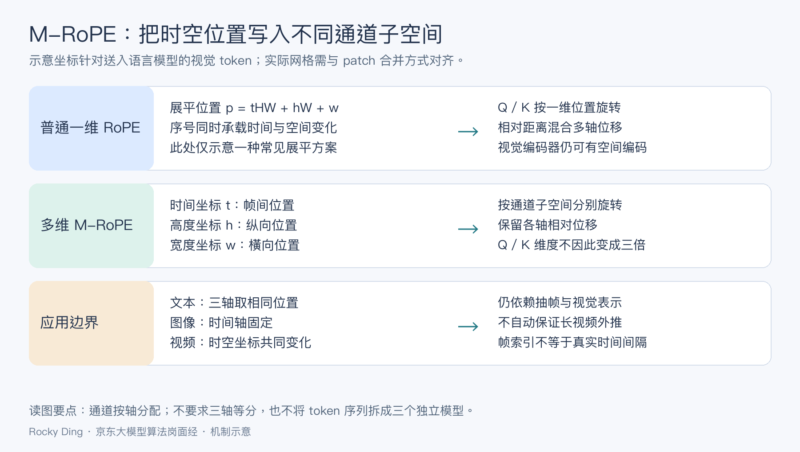
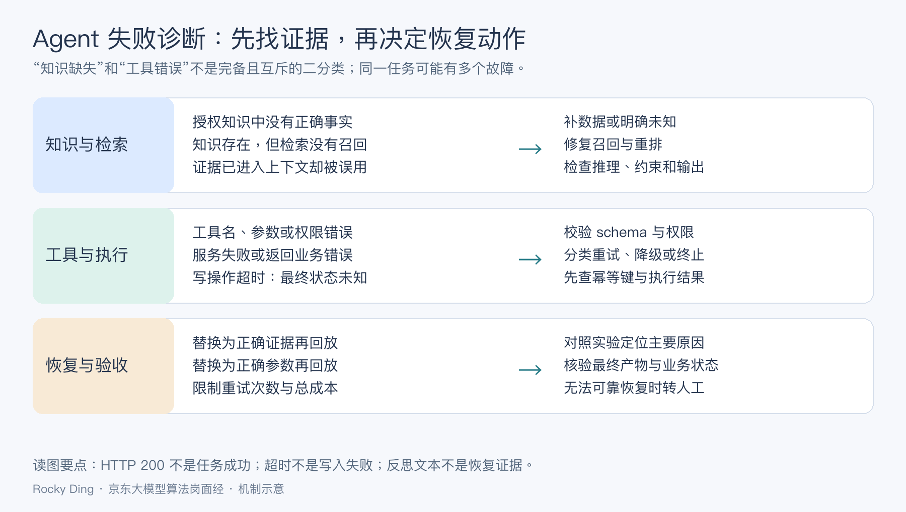
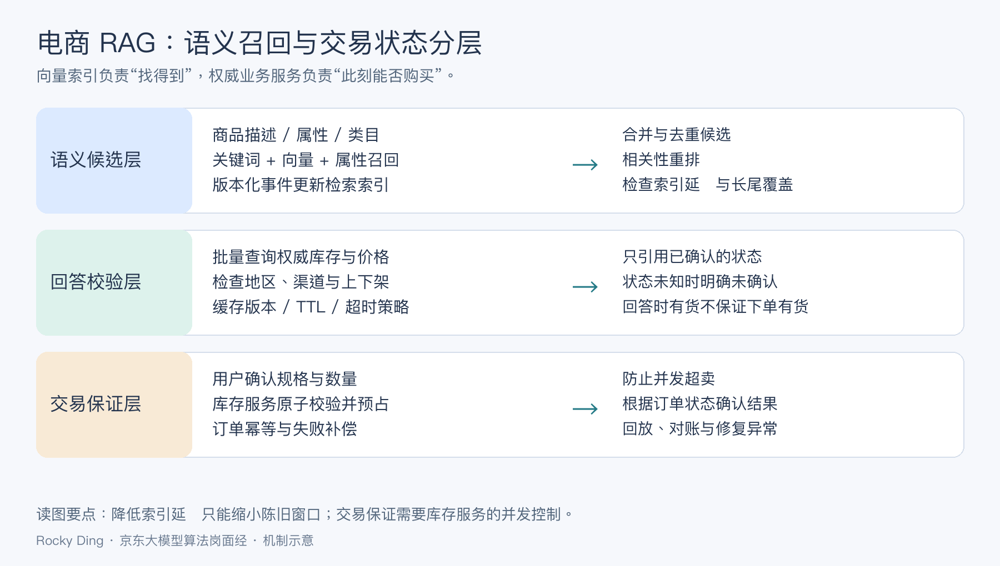

# 京东高频面试题

> 用于持续沉淀京东零售、物流、搜索推荐、广告和大模型应用相关面试题。

## 待补充方向

本文件作为该公司面试题的持续更新入口。后续可按照“岗位/面试轮次/问题/答案/手撕代码/复盘要点”的格式补充内容。

建议优先补充以下方向：

- 大模型、AIGC、多模态、Agent 或推荐搜索相关岗位面经。

- 公司核心业务场景中的算法工程问题。

- 高频手撕代码、系统设计、训练/推理/部署工程题。

## 目录

- [2025-12-11 至 2026-02-05 京东大模型算法岗面经汇总](#jd-damodel-20251211-20260205)

<a id="jd-damodel-20251211-20260205"></a>
## 2025-12-11 至 2026-02-05 京东大模型算法岗面经汇总

## 目录

- [面经汇总](#jd-damodel-20251211-20260205)
  - [面经 01（2026-02-05）](#jd-damodel-20251211-20260205-p1)
    - [追问了M-RoPE比原来的ROPE有什么改进?有什么优点?](#jd-damodel-20251211-20260205-p1-q1)
    - [原来的ROPE在升级成M-ROPE之前，它是怎么处理视频的?具体来说，对于每一个每一帧或者说每一个patch，是怎么处理的?](#jd-damodel-20251211-20260205-p1-q2)
    - [项目:既然是一个垂类的一个场景，为什么要去用通用场景下的VLM来做?为什么不用已经具有领域知识的一些模型?](#jd-damodel-20251211-20260205-p1-q3)
    - [项目:为什么你的VLM是输出点的坐标，而不输出bbox呢，bbox按道理比点的坐标具有更多的图像信息吧?](#jd-damodel-20251211-20260205-p1-q4)
    - [10讲一下SAM2分割模型的原理](#jd-damodel-20251211-20260205-p1-q5)
    - [13 项目:数据是用算法生成的，你们怎么判断这一批数据是好的还是不好的呢?](#jd-damodel-20251211-20260205-p1-q6)
  - [面经 02（2026-02-04）](#jd-damodel-20251211-20260205-p2)
    - [看了今年哪些生成式推荐论文](#jd-damodel-20251211-20260205-p2-q1)
    - [拷打简历项目](#jd-damodel-20251211-20260205-p2-q2)
    - [RoPE和ALiBi两种相对位置编码的原理](#jd-damodel-20251211-20260205-p2-q3)
    - [SwiGLU原理，比relu好在哪](#jd-damodel-20251211-20260205-p2-q4)
    - [attention常规八股(根号dk，时间复杂度，为什么要分多头)](#jd-damodel-20251211-20260205-p2-q5)
    - [用过哪些大模型微调方式，LoRA微调原理](#jd-damodel-20251211-20260205-p2-q6)
    - [了解模型蒸馏吗](#jd-damodel-20251211-20260205-p2-q7)
    - [了解目前主流多模态模型吗，扩散模型公式怎么推导的](#jd-damodel-20251211-20260205-p2-q8)
    - [手撕: lc53 最大子数组和改为求出这个子数组](#jd-damodel-20251211-20260205-p2-q9)
  - [面经 03（2026-02-04）](#jd-damodel-20251211-20260205-p3)
    - [为什么要用agent解决这个场景](#jd-damodel-20251211-20260205-p3-q1)
    - [什么是agent](#jd-damodel-20251211-20260205-p3-q2)
    - [你在里面做了哪些工作](#jd-damodel-20251211-20260205-p3-q3)
    - [为什么要SFT](#jd-damodel-20251211-20260205-p3-q4)
    - [训练前后区别在哪举一个具体的例子](#jd-damodel-20251211-20260205-p3-q5)
    - [数据怎么构建的](#jd-damodel-20251211-20260205-p3-q6)
    - [什么平台上训练的训练多久学习率多少为什么是这个学习率](#jd-damodel-20251211-20260205-p3-q7)
    - [什么是语言模型](#jd-damodel-20251211-20260205-p3-q8)
    - [cnn能不能做语言模型](#jd-damodel-20251211-20260205-p3-q9)
    - [现在大模型是什么架构](#jd-damodel-20251211-20260205-p3-q10)
    - [写出伪代码用abc 预测第四个token 告诉了我特征维度头个数](#jd-damodel-20251211-20260205-p3-q11)
    - [分头是怎么分的怎么拼接](#jd-damodel-20251211-20260205-p3-q12)
    - [场景题：做一个意图识别的分类任务，类别特别多怎么做](#jd-damodel-20251211-20260205-p3-q13)
  - [面经 04（2026-02-03）](#jd-damodel-20251211-20260205-p4)
    - [常见的大模型，或者说VLM这块的模型，了解过哪些？](#jd-damodel-20251211-20260205-p4-q1)
    - [追问道了M-RoPE比原来的RoPE有什么改进？有什么优点？](#jd-damodel-20251211-20260205-p4-q2)
    - [原来的RoPE在升级成M-RoPE之前，它是怎么处理视频的？具体来说，对于每一个每一帧或者说每一个patch，是怎么处理的？](#jd-damodel-20251211-20260205-p4-q3)
    - [算法题：lc70 爬楼梯（送分，3分钟写出滚动数组优化）](#jd-damodel-20251211-20260205-p4-q4)
  - [面经 05（2026-01-27）](#jd-damodel-20251211-20260205-p5)
    - [读了两道代码代码题，一道是有关于变量提升的，一道是关于箭头函数的this指向](#jd-damodel-20251211-20260205-p5-q1)
    - [变量提升代码题看错了括号结束位置，答错了，通过询问什么是变量提升，除了var还有什么变量提升方法的方式引导我回答出正确答案](#jd-damodel-20251211-20260205-p5-q2)
    - [vue2和vue3的响应式有什么区别（defineProperty是属性级响应式，proxy是对象级](#jd-damodel-20251211-20260205-p5-q3)
    - [使用ai有没有什么总结出来的提示词技巧](#jd-damodel-20251211-20260205-p5-q4)
    - [询问专业课有哪些内容](#jd-damodel-20251211-20260205-p5-q5)
    - [什么是随机森林算法](#jd-damodel-20251211-20260205-p5-q6)
    - [什么是过拟合，过拟合如何解决](#jd-damodel-20251211-20260205-p5-q7)
    - [聊聊大模型以及大模型应用（我简历有提到大模型应用，这个回答的不是很好，条理不够清晰，主要谈了使用感受而不是技术](#jd-damodel-20251211-20260205-p5-q8)
    - [项目是怎么跟AI结合的，简单介绍项目](#jd-damodel-20251211-20260205-p5-q9)
    - [技术栈是什么（VUE，但是秋招都在要求react，所以有自学](#jd-damodel-20251211-20260205-p5-q10)
    - [对比一下react和vue](#jd-damodel-20251211-20260205-p5-q11)
    - [vue中reactive和ref的区别](#jd-damodel-20251211-20260205-p5-q12)
    - [setup函数是做什么，参数有哪些](#jd-damodel-20251211-20260205-p5-q13)
    - [如何理解vue的响应式](#jd-damodel-20251211-20260205-p5-q14)
    - [虚拟dom是什么](#jd-damodel-20251211-20260205-p5-q15)
    - [coding一道并解释代码](#jd-damodel-20251211-20260205-p5-q16)
    - [在解释代码的时候有串联到前面提到的reactive和ref的区别与各自的特点](#jd-damodel-20251211-20260205-p5-q17)
    - [数据可视化这个部分主要使用的技术是什么？](#jd-damodel-20251211-20260205-p5-q18)
    - [部门对于候选人的综合素质和技术有哪些要求？](#jd-damodel-20251211-20260205-p5-q19)
    - [能接受长期在北京发展吗](#jd-damodel-20251211-20260205-p5-q20)
    - [研究生和本科期间压力最大的一次是什么（相关追问](#jd-damodel-20251211-20260205-p5-q21)
    - [实习期间的工作时间，实习期间遇到过冲突吗，怎么解决的](#jd-damodel-20251211-20260205-p5-q22)
    - [能够回忆起来的最近一次冲突是什么](#jd-damodel-20251211-20260205-p5-q23)
    - [希望第一份工作带给你什么](#jd-damodel-20251211-20260205-p5-q24)
    - [对于京东的感觉，和其他购物平台有什么区别，给京东APP的建议](#jd-damodel-20251211-20260205-p5-q25)
    - [还有其他的offer吗](#jd-damodel-20251211-20260205-p5-q26)
    - [希望什么样的工作节奏](#jd-damodel-20251211-20260205-p5-q27)
    - [你个人能提供三个什么价值](#jd-damodel-20251211-20260205-p5-q28)
    - [你个人在未来发展有那三个方面需要改进](#jd-damodel-20251211-20260205-p5-q29)
  - [面经 06（2025-12-27）](#jd-damodel-20251211-20260205-p6)
    - [讲一下实习工作](#jd-damodel-20251211-20260205-p6-q1)
    - [使用的数据集](#jd-damodel-20251211-20260205-p6-q2)
    - [使用了多少张卡？SFT 训练多久？](#jd-damodel-20251211-20260205-p6-q3)
    - [增加了串行流程后为什么还能提速？](#jd-damodel-20251211-20260205-p6-q4)
    - [讲一下对多模态大模型发展的看法](#jd-damodel-20251211-20260205-p6-q5)
    - [讲一下什么场景下用 SFT，什么场景下用 RL](#jd-damodel-20251211-20260205-p6-q6)
    - [SFT 的数据集是越大越好吗？会存在 scaling law 吗？](#jd-damodel-20251211-20260205-p6-q7)
    - [为什么使用强化学习会存在训练不稳定问题？为什么业界还在用？](#jd-damodel-20251211-20260205-p6-q8)
  - [面经 07（2025-12-27）](#jd-damodel-20251211-20260205-p7)
    - [项目中的OCR怎么做的，为什么用大模型做](#jd-damodel-20251211-20260205-p7-q1)
    - [后训练的数据规模有多少？数据集是自己构建的吗](#jd-damodel-20251211-20260205-p7-q2)
    - [数据清洗采用了什么策略](#jd-damodel-20251211-20260205-p7-q3)
    - [OCR如何处理复杂表格](#jd-damodel-20251211-20260205-p7-q4)
    - [微调前后准确率对比](#jd-damodel-20251211-20260205-p7-q5)
    - [Badcase有哪些，占比怎么样](#jd-damodel-20251211-20260205-p7-q6)
    - [为什么用GRPO不用DPO](#jd-damodel-20251211-20260205-p7-q7)
    - [什么任务适合DPO](#jd-damodel-20251211-20260205-p7-q8)
    - [模型微调用的是全参微调还是lora微调，为什么这么选](#jd-damodel-20251211-20260205-p7-q9)
    - [Lora微调的阿尔法和rank是怎么选择的，对模型的影响分别是怎么样的](#jd-damodel-20251211-20260205-p7-q10)
    - [GRPO奖励怎么设计的](#jd-damodel-20251211-20260205-p7-q11)
    - [是否做过消融实验](#jd-damodel-20251211-20260205-p7-q12)
    - [讲讲react思想](#jd-damodel-20251211-20260205-p7-q13)
    - [讲讲agent中的反思模块逻辑](#jd-damodel-20251211-20260205-p7-q14)
    - [Agent中数据是怎么交互的](#jd-damodel-20251211-20260205-p7-q15)
  - [面经 08（2025-12-12）](#jd-damodel-20251211-20260205-p8)
    - [LoRA 和 Prefix Tuning的区别?在什么场景下选择 LoRA?](#jd-damodel-20251211-20260205-p8-q1)
    - [如果要用 LORA 做电商推荐场景的微调，你会怎么设计数据和标签?](#jd-damodel-20251211-20260205-p8-q2)
    - [GRPO 和 PPO 的区别在哪?GRPO 的优化目标函数怎么写?](#jd-damodel-20251211-20260205-p8-q3)
    - [搜索中 RAG的向量检索会受到长尾商品影响，你会如何缓解?](#jd-damodel-20251211-20260205-p8-q4)
    - [如果商品知识库实时更新，你怎么保证 RAG的召回结果和库存一致?](#jd-damodel-20251211-20260205-p8-q5)
    - [Reflection 机制里,如何判断一个 Agent 的失败是由知识缺失还是工具调用错误引起的?](#jd-damodel-20251211-20260205-p8-q6)
    - [Toolformer 中通过自监督学习生成 tool call 数据,这个训练范式和 RLHF 的差别在哪里?为什么它更容易泛化?](#jd-damodel-20251211-20260205-p8-q7)
    - [语义歧义(如“苹果”既是品牌也是水果)在搜索链路中通常怎么建模?多义词消解和上下文建模的核心方法分别是什么?](#jd-damodel-20251211-20260205-p8-q8)
    - [算法题:实现 LRU](#jd-damodel-20251211-20260205-p8-q9)
  - [面经 09（2025-12-11）](#jd-damodel-20251211-20260205-p9)
    - [语义理解相关：在搜索链路里，像“苹果”这种既代表品牌又代表水果的语义歧义情况，通常是如何进行建模的？另外，多义词消解和上下文建模的核心方法分别是什么？](#jd-damodel-20251211-20260205-p9-q1)
    - [Toolformer 与 RLHF 对比：Toolformer 采用自监督学习来生成 tool call 数据，这种训练范式和 RLHF 存在哪些差别？并且，为什么 Toolformer 更容易实现泛化呢？](#jd-damodel-20251211-20260205-p9-q2)
    - [Reflection 机制判断问题：在 Reflection 机制中，我们该如何判断一个 Agent 执行失败是由于知识缺失，还是工具调用错误导致的呢？](#jd-damodel-20251211-20260205-p9-q3)
    - [RAG 与库存一致性：假如商品知识库是实时更新的，那么要怎样保证 RAG 的召回结果和库存信息保持一致呢？](#jd-damodel-20251211-20260205-p9-q4)
    - [RAG 长尾商品问题：在搜索场景中，RAG 的向量检索容易受到长尾商品的影响，](#jd-damodel-20251211-20260205-p9-q5)

---

<a id="jd-damodel-20251211-20260205-p1"></a>
## 面经 01（2026-02-05）

岗位：京东大模型算法岗

<a id="jd-damodel-20251211-20260205-p1-q1"></a>
### 追问了M-RoPE比原来的ROPE有什么改进?有什么优点?

**回答：**

M-RoPE 的改进在于把一维位置推广到多模态所需的时间与二维空间坐标。以 Qwen2-VL 为例，旋转位置编码的通道维度分成对应时间、高度、宽度的部分，分别使用 token 的 $`(t,h,w)`$ 坐标旋转 query 和 key。文本三个坐标取相同位置，退化为普通一维 RoPE；单张图像的时间坐标相同，空间坐标随 patch 位置变化；视频则还区分时间位置。

普通 RoPE 有 $`\langle R_mq,R_nk\rangle=q^TR_{n-m}k`$，所以内积依赖相对位移。M-RoPE 在不同通道子空间保留不同轴的相对位移，帮助模型区分横向邻近、纵向邻近和跨帧关联，并适配不同分辨率、帧数。

它不是让模型只看位置就理解运动，也不自动保证任意长度外推。视觉编码、时间采样和训练覆盖仍决定效果；Qwen2-VL 的帧索引设计与后续模型按真实时间对齐的改进需要区分。

**实现时最容易混淆的是坐标与通道。** 每个视觉 token 仍对应一个隐藏向量，时间、高度、宽度分别使用其中不同的旋转通道对，不是把隐藏维度直接扩大三倍。坐标网格需要与视觉 token 合并、裁剪和 padding 后的布局一致；错误地沿用原图 patch 坐标，会让模型看到的内容与位置错位。



图 1：M-RoPE 的核心是把不同轴的相对位移显式写入对应通道。不同版本的轴分配、频率排列和时间尺度需要分别检查，不能只根据名称判断位置编码等价。

<a id="jd-damodel-20251211-20260205-p1-q2"></a>
### 原来的ROPE在升级成M-ROPE之前，它是怎么处理视频的?具体来说，对于每一个每一帧或者说每一个patch，是怎么处理的?

**回答：**

**一维 RoPE 本身不定义视频处理流程。** 视频如何抽帧、如何切 patch、是否压缩视觉 token，由具体视觉编码器和连接模块决定；不能把所有早期视频模型统一说成一种架构。

一种常见方案是先抽取 $`T`$ 帧，每帧编码成 $`H\times W`$ 个视觉 token，按帧序、行序、列序展平，送入语言模型时分配一维位置。例如 $`p=tHW+hW+w`$，再加上前面文本的偏移。在该方案下，同列相邻行与相邻帧相同位置都被压缩成一维距离，不能像三轴编码那样直接区分空间与时间。

但视觉编码器内部仍可能有二维位置编码，视频也可能经过时间池化、交叉注意力或专门的时间编码；因此“一维 RoPE”不代表整个模型完全没有空间信息。面试时应先确认讨论的是视觉编码器内部位置，还是视觉 token 进入语言模型后的 RoPE，再展开 patch 和帧索引。

<a id="jd-damodel-20251211-20260205-p1-q3"></a>
### 项目:既然是一个垂类的一个场景，为什么要去用通用场景下的VLM来做?为什么不用已经具有领域知识的一些模型?

**回答：**

通用 VLM 的优势是预训练数据规模大、视觉语言对齐和工具生态成熟，能够作为可迁移的基线；垂类模型的优势是领域术语、版式和边界样本更贴合。选择应通过同一评测集比较：领域准确率、长尾覆盖、泛化能力、微调成本、推理时延和维护风险。

合理路径通常是先用通用模型建立基线，再用授权的领域数据做参数高效适配或检索增强；只有当领域数据、部署约束和收益足以覆盖训练维护成本时，才自建专用模型。

进一步把“领域模型”拆开：它可能是专用分类器、检测器，也可能是做过领域继续预训练或指令微调的 VLM，三者并非同一类对手。对结构固定、标签有限的任务，专用模型常有明确的延迟与部署优势；对开放指令、跨版式和多个相关任务，通用 VLM 的迁移能力更有价值。

比较时固定输入分辨率、领域数据、输出协议和测试切片。除了平均分，还要看新品类、未见模板、遮挡小字、异常指令，以及低置信度时能否可靠转交专用模块。若通用 VLM 只负责定位，后续检测或分割由领域模型完成，也应按整个组合系统验收。

<a id="jd-damodel-20251211-20260205-p1-q4"></a>
### 项目:为什么你的VLM是输出点的坐标，而不输出bbox呢，bbox按道理比点的坐标具有更多的图像信息吧?

**回答：**

点坐标只表达目标中心或关键点，输出维度和标注成本较低，适合点击提示、计数或后续以点为条件的分割；bbox 提供左上、右下边界，包含更多空间范围，但对边界质量、遮挡和标注一致性要求更高。

不能只按信息量判断优劣，要看下游任务。若下游是 SAM 类点提示分割，点坐标可能更稳定；若需要尺寸、排序或裁剪，bbox 更合适。也可以输出点并用分割模型细化，或多任务联合预测 bbox 与点，通过消融比较最终任务指标。

若方案是“VLM 给点，SAM 2 出掩码”，点的质量要用最终目标分割结果衡量。点落在框中心不等于落在目标内部：细长物体、环形物体和遮挡场景都可能失败。可以训练输出目标内部点、增加正负点或在低置信场景退回框提示。

坐标协议必须明确：是原图像素、缩放图像素，还是归一化坐标；缩放、裁剪和 letterbox padding 如何反变换。bbox 只是空间范围，框内可能有多个对象和大量背景，也不等同于更丰富的目标语义。一个有说服力的消融是比较点、框、点加框在同一标注与推理预算下的提示有效率、目标选择正确率和掩码 IoU。

<a id="jd-damodel-20251211-20260205-p1-q5"></a>
### 10讲一下SAM2分割模型的原理

**回答：**

SAM 2 将可提示图像分割扩展为可提示视频分割。其图像编码器提取多尺度视觉特征；提示编码器把点、框或掩码转换成表示；掩码解码器结合这些表示生成目标掩码及质量预测。没有视频历史时，它也可以执行单图分割。

视频部分的关键是**记忆注意力与记忆编码器**。处理当前帧时，记忆注意力读取之前帧保存的空间特征和对象信息；预测出的掩码与图像特征再经记忆编码器形成后续可读取的记忆。这样可把用户在某帧上的提示传播到其他帧，而不必逐帧重新标注。

遮挡、目标重现、相似目标和早期错误都可能造成漂移。可在关键帧补充正负点击、修正掩码并重新传播；评测既看区域重叠也看边界与时序稳定性，同时统计交互次数和速度。记忆机制有助于追踪，但不等于永久准确的目标身份识别。

<a id="jd-damodel-20251211-20260205-p1-q6"></a>
### 13 项目:数据是用算法生成的，你们怎么判断这一批数据是好的还是不好的呢?

**回答：**

算法生成数据要建立自动规则、模型复核和人工抽检三层质量门。先检查格式、字段完整性、标签范围、重复率和生成程序日志；再用独立模型或规则检查视觉事实、文本一致性和任务约束；最后按风险分层抽样人工复核，并保留拒绝原因。

质量评估不能只看平均通过率，应报告按模板、难度、类别和生成批次切分的准确率、覆盖率、重复率和错误类型。抽样要避免只挑容易样本，验收集应与训练集隔离。

更严格的做法是先按“生成模板 × 目标类别 × 难度”分层抽样，再用独立人工标签评估各层准确性；模型复核不能与生成器共享同一种系统性错误而无人校准。自动通过率只反映规则是否接受，不能直接当成标签正确率。

按生成批次保留数据版本和拒绝原因，并做下游实验：同预算真实数据基线、加入合成数据、去除某一合成类型。观察长尾收益与通用能力退化。置信区间与样本量也要说明：抽检几十条没有发现错误，不足以证明百万条样本全部可靠。

<a id="jd-damodel-20251211-20260205-p2"></a>
## 面经 02（2026-02-04）

岗位：京东大模型算法岗

<a id="jd-damodel-20251211-20260205-p2-q1"></a>
### 看了今年哪些生成式推荐论文

**回答：**

这道题的“今年”对应面试时点 2026-02-04。回答应只列出自己真正读过且该时点已公开的论文；不能把后来发布的成果说成当时已读。可用两篇此前已公开的代表工作构建比较框架：

| 工作 | 主要生成或建模对象 | 值得展开的机制 |
| --- | --- | --- |
| TIGER，2023，Recommender Systems with Generative Retrieval | 商品的离散语义 ID 序列 | 用残差量化自编码器构造语义 ID，再根据用户历史自回归生成下一商品 ID |
| HSTU，2024，Actions Speak Louder than Words | 大规模用户行为序列 | 面向推荐的序列建模架构、长序列效率及模型与数据规模扩展 |

TIGER 的讨论重点是语义 ID 的碰撞、商品更新、合法 ID 解码和长尾覆盖；HSTU 的重点是行为序列建模与训练推理效率。它们的预测目标和系统设计不同，不能都简化成“聊天模型直接生成商品”。

这两项是历史基线，不冒充 2026 年新论文。如果没有核实当年新论文，可以明确说明重点阅读了这些基线，并据此比较近期工作的生成目标、训练样本、Recall/NDCG、在线收益和推理成本。

<a id="jd-damodel-20251211-20260205-p2-q2"></a>
### 拷打简历项目

**回答：**

按“业务目标—个人负责边界—数据—模型或系统—关键取舍—评测—失败案例”讲一个闭环。明确哪些工作是自己设计、实现、调试和验证的，给出可复现实验设置与指标；没有实际数据就说明评估方案，不虚构提升比例。追问时优先解释一个 badcase 如何定位、修复和回归。

<a id="jd-damodel-20251211-20260205-p2-q3"></a>
### RoPE和ALiBi两种相对位置编码的原理

**回答：**

RoPE 对 query 和 key 的二维通道对施加与位置相关的旋转。令 $`R_p`$ 为位置 $`p`$ 的旋转矩阵，则：

```math
q'_m=R_mq_m,\quad k'_n=R_nk_n,\quad (q'_m)^Tk'_n=q_m^TR_{n-m}k_n
```

相对位移因此进入注意力内积，通常不对 value 做同样的位置旋转。ALiBi 则直接给注意力分数增加距离惩罚。对因果注意力中 $`j\leq i`$ 的位置，第 $`h`$ 个头可写为：

```math
s^{(h)}_{ij}=\frac{(q_i^{(h)})^Tk_j^{(h)}}{\sqrt{d_h}}-m_h(i-j)
```

斜率 $`m_h`$ 按预定规则设置，不同头偏向不同距离尺度。RoPE 通过旋转影响相似度，ALiBi 通过线性距离偏置引入近邻先验。两者都不需要学习一张固定长度的位置嵌入表，但超长上下文质量仍需实测；支持更长输入并不等于保持原精度。

<a id="jd-damodel-20251211-20260205-p2-q4"></a>
### SwiGLU原理，比relu好在哪

**回答：**

SwiGLU 是带 SiLU 激活的门控前馈结构。忽略偏置，完整 FFN 可写为：

```math
\mathrm{FFN}(x)=\left[\mathrm{SiLU}(xW_g)\odot(xW_u)\right]W_d,\quad
\mathrm{SiLU}(z)=z\sigma(z)
```

其中一个分支产生平滑门控，另一个携带待筛选特征，逐元素相乘后投影回隐藏维度。ReLU FFN 通常是 $`\max(0,xW_u)W_d`$，负区间梯度为零；SiLU 在负区间保留部分变化，乘法门控又增加了输入相关的特征选择能力。

经验上它常改善语言模型质量与优化表现，但不能说任何任务都优于 ReLU。SwiGLU 有三个主要矩阵，传统 FFN 有两个；若希望参数量近似相同，经典 $`4d`$ 的 FFN 隐层宽度可对照约 $`8d/3`$ 的门控隐层宽度。公平比较需控制参数、计算量、训练数据与步数。

<a id="jd-damodel-20251211-20260205-p2-q5"></a>
### attention常规八股(根号dk，时间复杂度，为什么要分多头)

**回答：**

对单个头，注意力为 $`\mathrm{softmax}(QK^T/\sqrt{d_k}+M)V`$。若 query/key 各维近似独立、均值零且方差一，其点积方差约为 $`d_k`$；除以 $`\sqrt{d_k}`$ 将尺度稳定在常数量级，降低 softmax 饱和风险。这是解释缩放的近似假设，不是训练后向量分布永远满足的定律。

设长度为 $`n`$、总隐藏维度为 $`d`$、头数为 $`h`$、每头维度为 $`d/h`$。所有头的注意力乘法总时间为 $`O(n^2d)`$，显式存储注意力矩阵需 $`O(hn^2)`$ 空间；QKV 和输出投影还需要 $`O(nd^2)`$ 时间。FlashAttention 通过分块重算避免把完整矩阵写入显存，主要改变显存与 IO 开销，不把精确注意力的二次算术量直接变成线性。

多头允许不同投影子空间学习不同关联。固定总维度时，增加头数会降低每头维度，不等于无限增加表达能力。自回归解码使用 KV cache 时，单个新 token 的注意力核心成本约为 $`O(nd)`$，应与整段 prefill 区分。

<a id="jd-damodel-20251211-20260205-p2-q6"></a>
### 用过哪些大模型微调方式，LoRA微调原理

**回答：**

可先区分全参微调、参数高效微调与训练目标。全参微调更新模型全部选定参数；LoRA、Adapter、Prefix/Prompt Tuning 限制可训练部分；SFT、DPO 等描述目标与数据组织，可以与部分参数高效方法组合。

LoRA 对线性权重采用：

```math
W'=W+\frac{\alpha}{r}BA,\quad B\in\mathbb R^{d_{out}\times r},\quad A\in\mathbb R^{r\times d_{in}}
```

冻结 $`W`$ 后，仅训练 $`r(d_{in}+d_{out})`$ 个增量参数，减少梯度与优化器状态开销。它仍需要主模型前向和部分反向激活，不能认为显存按可训练参数比例等比下降。部署时可在适用条件下把增量合并进权重，或保留多个适配器动态切换。

回答使用经验时，只列实际做过的方式，进一步说明 target modules、rank、学习率、数据量和验证集收益；没做过的方式应作为原理理解。

<a id="jd-damodel-20251211-20260205-p2-q7"></a>
### 了解模型蒸馏吗

**回答：**

知识蒸馏用教师提供额外监督，使学生学习输出分布、隐藏特征或完成任务的行为。对同一词表的 logits 蒸馏，常见目标是：

```math
\mathcal L=(1-\lambda)\mathrm{CE}(y,p_S)+\lambda T^2\mathrm{KL}(p_T^{(T)}\Vert p_S^{(T)})
```

这里上下标 $`T`$ 分别表示教师和温度，$`p^{(T)}=\mathrm{softmax}(z/T)`$；软分布提供了类别间相对相似度。也可以使用中间层特征匹配，或让教师生成解答、工具轨迹供学生做序列级训练。后者不一定能取得教师 logits，不应与分布蒸馏混称同一过程。

教师错误会被继承，因此需要答案校验、难度与领域覆盖、训练测试隔离。学生与教师分词不同还需解决对齐，不能直接逐 token 做 KL。最终比较相同任务下的质量、时延、吞吐和内存，单看参数量缩小不足以证明部署收益。

<a id="jd-damodel-20251211-20260205-p2-q8"></a>
### 了解目前主流多模态模型吗，扩散模型公式怎么推导的

**回答：**

多模态模型可先举公开结构：CLIP 学图文对比表示，LLaVA 用视觉编码器、投影连接器和语言模型完成视觉问答，Qwen2-VL 使用动态分辨率与多维位置编码支持图像和视频理解，Stable Diffusion 一类模型在潜空间做条件生成。理解、检索和生成任务不同，不能只按“大模型”归为同一结构。

以 DDPM 为例，设 $`\alpha_t=1-\beta_t`$、$`\bar\alpha_t=\prod_{s=1}^{t}\alpha_s`$，前向一步加噪为：

```math
q(x_t\mid x_{t-1})=\mathcal N(\sqrt{\alpha_t}x_{t-1},\beta_tI)
```

递推代入后，各步独立高斯噪声的加权和仍是高斯，其方差累积为 $`1-\bar\alpha_t`$，因此：

```math
x_t=\sqrt{\bar\alpha_t}x_0+\sqrt{1-\bar\alpha_t}\epsilon,\quad\epsilon\sim\mathcal N(0,I)
```

训练反向模型时最大化数据似然的变分下界。中间时间步可分解为真实后验 $`q(x_{t-1}\mid x_t,x_0)`$ 与 $`p_\theta(x_{t-1}\mid x_t)`$ 之间的 KL；给定 $`x_0`$ 的后验是可解析高斯，其方差为 $`\tilde\beta_t=\beta_t(1-\bar\alpha_{t-1})/(1-\bar\alpha_t)`$。注意这不是说边缘反向分布天然就是单个高斯。

用噪声网络参数化反向均值：

```math
\mu_\theta(x_t,t)=\frac{1}{\sqrt{\alpha_t}}\left(x_t-\frac{\beta_t}{\sqrt{1-\bar\alpha_t}}\epsilon_\theta(x_t,t)\right)
```

在选择固定方差等条件下，相应 KL 可转成加权噪声预测误差；常用简化训练目标省略时间权重：

```math
\mathcal L_{simple}=\mathbb E_{x_0,t,\epsilon}\left[\|\epsilon-\epsilon_\theta(x_t,t,c)\|_2^2\right]
```

因此要区分完整 ELBO 和常用简化损失。采样用预测均值与调度方差逐步去噪；DDIM、流匹配与不同预测参数化有自己的推导，不能把这套 DDPM 公式当成所有生成模型的统一训练目标。

<a id="jd-damodel-20251211-20260205-p2-q9"></a>
### 手撕: lc53 最大子数组和改为求出这个子数组

**回答：**

Kadane 算法在维护最大和的同时记录区间。设 `end` 是以当前位置结尾的最大和；若从当前元素重启更大，就更新起点，否则延续。全局最优另存起止下标，避免把“以末尾结束”误当成全局最优。以下约定非空输入；和相同时优先较早起点，再优先较早终点，返回左闭右开区间。

```python
def max_subarray(a):
    if not a:
        raise ValueError("empty input")
    end = best = a[0]
    start = best_l = best_r = 0
    for i in range(1, len(a)):
        x = a[i]
        if end + x < x:
            end, start = x, i
        else:
            end += x
        if end > best:
            best, best_l, best_r = end, start, i
    return best, best_l, best_r + 1
```

示例 `[-2,1,-3,4,-1,2,1,-5,4]` 返回 `(6,3,7)`，子数组是 `a[3:7]=[4,-1,2,1]`。全负数组 `[-5,-2,-8]` 返回单元素 `[-2]`。初始化为首元素可防止错误返回空数组。

扫描时间 $`O(n)`$、额外工作空间 $`O(1)`$。如需实际数组，调用方取切片 `a[left:right]`，这一步有 $`O(k)`$ 的输出复制成本；实现遍历也避免使用 `a[1:]` 产生隐含的线性空间。

<a id="jd-damodel-20251211-20260205-p3"></a>
## 面经 03（2026-02-04）

岗位：京东大模型算法岗

<a id="jd-damodel-20251211-20260205-p3-q1"></a>
### 为什么要用agent解决这个场景

**回答：**

先判断场景是否存在运行时才能确定的步骤：用户请求开放、需要多次查数据或调用工具，且下一步依赖上一步结果时，Agent 有价值。若只是固定字段抽取或确定顺序的审批，用分类器加工作流更容易验收。

可以比较三条基线：固定工作流、单次模型调用、受约束 Agent。保持模型和工具一致，统计端到端完成率、重试、延迟、成本与人工接管。只有动态决策收益覆盖复杂度时，才能说明“为什么用”。

例如售后查询可能需要先识别订单，再根据物流状态决定查询轨迹或售后规则；查询部分可动态编排，退款等写操作仍由业务权限和确认机制控制。这里是设计示例，个人项目应替换为实际经历。

<a id="jd-damodel-20251211-20260205-p3-q2"></a>
### 什么是agent

**回答：**

Agent 是围绕目标执行“观察—决策—行动—反馈”的系统：模型提出下一步，运行时校验权限和参数，工具作用于外部环境，结果再进入后续决策。它适合步骤不确定、需要检索或调用外部能力的任务；固定流程优先用工作流或状态机。

生产实现要限制步数、时间、费用和工具权限，记录任务状态与证据，为写操作配置幂等和结果核对。反思模块可以根据错误类型、工具返回和验收规则选择重试、修正、重规划或人工接管，不能只让模型重新生成一段解释。

<a id="jd-damodel-20251211-20260205-p3-q3"></a>
### 你在里面做了哪些工作

**回答：**

把团队成果拆成自己负责的可验证模块：例如工具 schema 与适配器、任务状态管理、SFT 数据管线、评测集、模型服务或界面。说清输入输出、接口责任、代码范围，以及谁负责其他模块。

推荐表达：“我独立负责【模块】，针对【具体故障】设计了【改动】，用【测试集或实验】比较【指标】。上线或实验中仍存在【限制】，下一步计划是【措施】。”没有测量数据时说明已实现功能和验证范围，不编造提升数值。

最好准备一个失败案例：怎样从日志定位到参数生成、执行超时或数据泄漏，为什么替代方案不适合，以及如何做回归。它比笼统说‘参与了整个 Agent’更能证明贡献。

<a id="jd-damodel-20251211-20260205-p3-q4"></a>
### 为什么要SFT

**回答：**

当基座已具备必要知识与能力，但在领域术语、结构化输出、工具选择或多轮行为上持续不稳定时，SFT 用示范数据调整条件输出分布，可能比持续堆长提示更稳定、更省 token。

先尝试提示与工具 schema 改进并建立基线。动态商品库存等知识应由检索或业务系统提供，不适合靠 SFT 记住。训练需要高质量输入—目标配对与损失掩码，评测时同时检查任务成功、格式合法、幻觉和原能力退化。

只有固定评测证明收益，才值得增加数据维护和模型版本成本。SFT 不保证模型自动获得训练数据中未体现的推理或权限能力。

<a id="jd-damodel-20251211-20260205-p3-q5"></a>
### 训练前后区别在哪举一个具体的例子

**回答：**

可以用“退货意图识别与工具参数生成”做示例，但不要将示例当成个人项目的实测结果。输入为‘这双鞋尺码不合适，想退货’，训练前模型可能只给泛泛建议；训练后预期识别为退货意图，发现缺订单 ID 就追问，而不是编造订单号或直接调用退款工具。

比较时固定模型基线、解码参数、工具集合和测试请求，记录意图准确率、必填参数缺失识别率、无依据字段比例及实际任务成功率。可给出成对案例：一个被修复的失败、一个仍未解决的边界。

真正的“区别”要来自未参与训练的样本。仅展示训练集上的漂亮输出，或同时换提示词、数据与模型，无法把收益归因于 SFT。

<a id="jd-damodel-20251211-20260205-p3-q6"></a>
### 数据怎么构建的

**回答：**

数据构建先定义任务契约、输入模态、目标输出和验收规则，再收集或生成样本。清洗包括格式与路径检查、去重、敏感信息处理、标签范围验证、模型辅助筛查和人工抽检；高风险错误应保留拒绝原因。

训练、验证、测试按用户、商品、视频或模板分组隔离，防止同源泄漏。数据规模要结合有效样本比例、覆盖长尾和边际收益评估，不能只追求数量。

Agent 训练样本还要保存工具可见列表、参数 schema、执行观察、最终结果，以及缺参数追问、工具失败和提前终止等轨迹。仅保留成功对话，会把“遇到异常怎么办”留成分布空白。工具返回内容作为上下文保留，通常不应被当作模型生成目标；具体损失掩码按训练任务说明。

划分数据时先按同源实体聚类再划分集合，随后做跨集合近重复检查。真实未来订单、未来库存和未来用户行为不能进入历史输入。最后输出数据卡：各任务样本数、有效 token 数、过滤比例、错误类型与版本，使训练收益能追溯到具体数据改动。

<a id="jd-damodel-20251211-20260205-p3-q7"></a>
### 什么平台上训练的训练多久学习率多少为什么是这个学习率

**回答：**

回答必须使用真实配置：模型规模、卡型与数量、有效 batch、梯度累积、序列长度、训练步数、学习率调度和验证频率。学习率由可训练参数规模、有效 batch、优化器和数据量共同决定，应通过小范围试验与 loss/任务指标选择，而不是背一个固定值。

训练时记录吞吐、显存、梯度是否溢出、验证集曲线和 checkpoint；训练时间要说明是墙钟时间还是 GPU 小时。

把配置串成可检查的计算链：设每个数据并行副本的 micro-batch 为 $`b`$，数据并行副本数为 $`D`$，梯度累积次数为 $`a`$，则每次优化器更新的全局样本数为 $`B=bDa`$。固定长度近似下，每步 token 数约为 $`BL`$；开启 packing 后应使用实际非 padding token 计数。总卡数可能还含张量并行、流水线并行，不能直接代入 $`D`$。

学习率选择应报告探索范围和选择标准，例如短跑排除梯度爆炸与明显欠拟合，再比较完整训练的验证指标；不能把 LoRA 的学习率直接搬到全参训练。显存不足、梯度累积变化、训练总步数变化后，要重新检查 warmup 与调度长度。比较平台效率时同时报告训练吞吐、验证与保存开销，以及从提交到结束的墙钟时间。

<a id="jd-damodel-20251211-20260205-p3-q8"></a>
### 什么是语言模型

**回答：**

语言模型学习序列概率 $`p(x_{1:n})=\prod_t p(x_t|x_{\lt t})`$，训练时预测目标 token，推理时依据已生成前缀逐步采样或贪心解码。现代大模型多以 Transformer 为主干，注意力负责跨 token 交互，前馈层完成非线性变换。

CNN 可以通过因果卷积或扩张卷积建模语言，但感受野、长距离依赖和并行方式受限；理论上能做，当前通用大模型通常选择 Transformer 或其变体。

<a id="jd-damodel-20251211-20260205-p3-q9"></a>
### cnn能不能做语言模型

**回答：**

可以。语言模型定义的是序列概率或条件概率，不限定主干必须是 Transformer。因果 CNN 只卷积当前位置及左侧历史，再用输出分布预测下一个 token，就能构成自回归语言模型；训练时所有位置可并行计算。

普通 stride 为 1、核宽 $`k`$ 的 $`L`$ 层卷积，感受野约为 $`1+L(k-1)`$；采用扩张卷积可更快扩大覆盖。未来位置必须用因果 padding 或掩码隔离，否则训练时会泄漏答案。

局限是长距离关系依赖固定感受野与卷积结构，不像注意力能直接按内容连接远处 token。CNN 能做语言模型，与它是不是当前通用大模型的主流方案，是两个问题。

<a id="jd-damodel-20251211-20260205-p3-q10"></a>
### 现在大模型是什么架构

**回答：**

常见自回归大语言模型采用 decoder-only Transformer：嵌入层、多层因果自注意力与 FFN、归一化和残差连接，最后投影到词表。训练用 teacher forcing 做 next-token prediction，生成时逐 token 更新 KV cache。

具体实现可以是 dense 或 MoE，可以采用 MHA、GQA、MLA 等注意力变体，也可能用状态空间模型或混合主干。应把骨干架构、参数稀疏性、注意力机制和训练目标分开讨论，不能把‘MoE’说成一种完全不同的语言建模目标。

VLM 常再接视觉编码器和连接器。架构只能说明信息如何流动，最终能力还取决于训练数据、目标、规模和后训练，不能仅凭模型名称推断所有内部细节。

<a id="jd-damodel-20251211-20260205-p3-q11"></a>
### 写出伪代码用abc 预测第四个token 告诉了我特征维度头个数

**回答：**

先确认 `a,b,c` 指三个已分词 token。若每个字母未必对应一个 token，应先使用模型 tokenizer。设批大小 $`B=1`$、长度 $`L=3`$、隐藏维度 $`d`$、头数 $`h`$，要求 $`d\bmod h=0`$，每头维度 $`d_h=d/h`$。

以下是一层标准 MHA 的推理伪代码，省略 dropout，位置函数对 Q/K 施加 RoPE。输入可见三项，最后一个位置的 logits 预测第四个 token：

```text
H = embed([id_a, id_b, id_c])             # [1, 3, d]
for block in blocks:
    X = norm1(H)
    Q, K, V = X @ Wq, X @ Wk, X @ Wv    # 各 [1, 3, d]
    Q = reshape(Q, [1,3,h,dh]).transpose(1,2)
    K = reshape(K, [1,3,h,dh]).transpose(1,2)
    V = reshape(V, [1,3,h,dh]).transpose(1,2)
    Q, K = apply_rope(Q, K, positions=[0,1,2])
    S = Q @ transpose_last_two(K) / sqrt(dh)
    S = mask_future_positions_with_minus_inf(S)
    C = softmax(S, axis=-1) @ V          # [1,h,3,dh]
    C = C.transpose(1,2).reshape([1,3,d])
    H = H + C @ Wo
    H = H + FFN(norm2(H))
logits = final_norm(H)[:, -1, :] @ W_vocab
next_id = argmax(logits, axis=-1)        # 或按解码策略采样
```

softmax 对 key 位置维归一化，不能沿头维归一化。训练时使用移位标签并对所有有效位置计算损失；这里推理只取最后位置。若继续生成，在下一步读入新 token 并复用各层 KV cache。

<a id="jd-damodel-20251211-20260205-p3-q12"></a>
### 分头是怎么分的怎么拼接

**回答：**

标准 MHA 通常先把完整隐藏表示乘上 Q/K/V 投影矩阵，再把投影结果的最后一维拆成多个头。输入 $`[B,L,d]`$ 变为 $`[B,L,h,d_h]`$，转置得到 $`[B,h,L,d_h]`$；每个头在自己的特征子空间中计算 $`L\times L`$ 注意力。

得到每头输出后，先转回 $`[B,L,h,d_h]`$，再拼成 $`[B,L,d]`$，最后乘输出矩阵 $`W_O`$ 融合头间信息。不是把序列切成 h 段，也不是对各头直接求和。

例如 $`d=768,h=12`$，每头维度为 64，每个头都能看全部允许的上下文。GQA/MQA 的 key/value 头数可少于 query 头数，需要额外的分组共享关系，不能照搬相同头数的 reshape。

<a id="jd-damodel-20251211-20260205-p3-q13"></a>
### 场景题：做一个意图识别的分类任务，类别特别多怎么做

**回答：**

先做领域、粗粒度意图和实体抽取，再在候选子树内分类；类别描述、示例和层级标签进入检索或分类器。大量长尾类别可用两阶段召回—重排、参数高效微调、原型/语义匹配，并设置未知类和澄清策略。

评测按宏平均 F1、长尾召回、混淆矩阵、拒识率和线上成本分层，不只看总体准确率；新增类别要版本化标签和回归集。

**工程上先确认是否单标签。** 一次请求可能同时要求查询物流和申请售后，强行压成一个类别会制造标注矛盾；层级分类、多标签预测和动作编排需要不同的训练目标。类别定义相互重叠时，先修正标签体系，并保留“其他/未知/需要澄清”。

类别达到成千上万时，可把每个标签的定义、正例与易混淆反例编码入索引，召回 top-k 候选，再让小分类器或交叉编码器精排。最终分类器只能从合法标签集合输出，先验约束和权限过滤也要参与。召回阶段遗漏正确类别后，重排无法挽回，因此应单独报告候选 Recall@k。

已知类分数高不代表输入一定属于已知类。用未见意图、相近意图和分布外样本校准拒识阈值，结合第一、第二候选分差与业务风险决定是否追问。评测同时看宏平均 F1、长尾类召回、未知类误接收，以及不同拒识率下的已接收样本错误率。分层路由还会传播上游错误，必要时保留多个父类候选。

<a id="jd-damodel-20251211-20260205-p4"></a>
## 面经 04（2026-02-03）

岗位：京东大模型算法岗

<a id="jd-damodel-20251211-20260205-p4-q1"></a>
### 常见的大模型，或者说VLM这块的模型，了解过哪些？

**回答：**

回答时按面试日期 2026-02-03 之前已公开且自己了解的模型举例。语言模型可以谈 Qwen、Llama、DeepSeek 系列中的具体公开版本；视觉语言模型可以选 CLIP、BLIP-2、LLaVA、Qwen2-VL 等，解释各自任务与结构，而不是声称掌握整个系列的内部实现。

CLIP 以图文对比学习获得可检索表示；BLIP-2 用 Q-Former 连接视觉表示与语言模型；LLaVA 通过连接器把视觉特征送入语言模型并做视觉指令训练；Qwen2-VL 强调动态分辨率与 M-RoPE。它们在检索、问答、OCR、视频和空间定位方面的侧重点不同。

选一个真正做过评测的模型，说明视觉 token 数、分辨率预算、输入格式、部署显存以及失败样本。公开机制可以讨论；没有核实的产品性能排名或闭源结构不要当作事实。

<a id="jd-damodel-20251211-20260205-p4-q2"></a>
### 追问道了M-RoPE比原来的RoPE有什么改进？有什么优点？

**回答：**

M-RoPE 的改进在于把一维位置推广到多模态所需的时间与二维空间坐标。以 Qwen2-VL 为例，旋转位置编码的通道维度分成对应时间、高度、宽度的部分，分别使用 token 的 $`(t,h,w)`$ 坐标旋转 query 和 key。文本三个坐标取相同位置，退化为普通一维 RoPE；单张图像的时间坐标相同，空间坐标随 patch 位置变化；视频则还区分时间位置。

普通 RoPE 有 $`\langle R_mq,R_nk\rangle=q^TR_{n-m}k`$，所以内积依赖相对位移。M-RoPE 在不同通道子空间保留不同轴的相对位移，帮助模型区分横向邻近、纵向邻近和跨帧关联，并适配不同分辨率、帧数。

它不是让模型只看位置就理解运动，也不自动保证任意长度外推。视觉编码、时间采样和训练覆盖仍决定效果；Qwen2-VL 的帧索引设计与后续模型按真实时间对齐的改进需要区分。

<a id="jd-damodel-20251211-20260205-p4-q3"></a>
### 原来的RoPE在升级成M-RoPE之前，它是怎么处理视频的？具体来说，对于每一个每一帧或者说每一个patch，是怎么处理的？

**回答：**

**一维 RoPE 本身不定义视频处理流程。** 视频如何抽帧、如何切 patch、是否压缩视觉 token，由具体视觉编码器和连接模块决定；不能把所有早期视频模型统一说成一种架构。

一种常见方案是先抽取 $`T`$ 帧，每帧编码成 $`H\times W`$ 个视觉 token，按帧序、行序、列序展平，送入语言模型时分配一维位置。例如 $`p=tHW+hW+w`$，再加上前面文本的偏移。在该方案下，同列相邻行与相邻帧相同位置都被压缩成一维距离，不能像三轴编码那样直接区分空间与时间。

但视觉编码器内部仍可能有二维位置编码，视频也可能经过时间池化、交叉注意力或专门的时间编码；因此“一维 RoPE”不代表整个模型完全没有空间信息。面试时应先确认讨论的是视觉编码器内部位置，还是视觉 token 进入语言模型后的 RoPE，再展开 patch 和帧索引。

<a id="jd-damodel-20251211-20260205-p4-q4"></a>
### 算法题：lc70 爬楼梯（送分，3分钟写出滚动数组优化）

**回答：**

若一次可爬 1 或 2 阶，到达第 $`n`$ 阶的最后一步来自第 $`n-1`$ 或 $`n-2`$ 阶，两种情况不相交，所以 $`f(n)=f(n-1)+f(n-2)`$。取 $`f(0)=1,f(1)=1`$，其中零阶的一种方式表示不行动。

```python
def climb_stairs(n):
    if not isinstance(n, int) or isinstance(n, bool) or n < 0:
        raise ValueError("n must be a nonnegative integer")
    prev, curr = 1, 1
    for _ in range(2, n + 1):
        prev, curr = curr, prev + curr
    return curr
```

`n=1,2,3,5` 分别返回 `1,2,3,8`。每轮只依赖两个旧状态，因此无需长度为 n 的数组。常规固定成本整数模型下时间 $`O(n)`$、额外状态 $`O(1)`$；如果 n 极大，精确整数位数和加法成本随 n 增长，需要另算位复杂度，也可按需求使用快速倍增或矩阵方法。

<a id="jd-damodel-20251211-20260205-p5"></a>
## 面经 05（2026-01-27）

岗位：京东大模型算法岗

<a id="jd-damodel-20251211-20260205-p5-q1"></a>
### 读了两道代码代码题，一道是有关于变量提升的，一道是关于箭头函数的this指向

**回答：**

没有给出两道完整代码，不能复原具体输出。可以分别建立判断规则：先画作用域与声明初始化时间，再判断普通函数的调用方式或箭头函数的词法捕获。

`var` 绑定创建后先初始化为 undefined，赋值仍在执行到该语句时发生；`let/const` 初始化前处于暂时性死区。箭头函数没有自己的 this，沿定义时的外层作用域取得 this；普通函数作为 `obj.fn()` 调用时通常取得 obj。

```javascript
console.log(a); // undefined
var a = 3;
function outer() {
  return () => this.value;
}
const read = outer.call({value: 7});
console.log(read.call({value: 9})); // 7
```

该例是用于说明机制的独立示例。箭头函数捕获 outer 的 this，后续 call 不能替换；在模块顶层、严格模式、构造调用或事件回调中，还需确认各自执行环境。

<a id="jd-damodel-20251211-20260205-p5-q2"></a>
### 变量提升代码题看错了括号结束位置，答错了，通过询问什么是变量提升，除了var还有什么变量提升方法的方式引导我回答出正确答案

**回答：**

这里的首要教训是先确定大括号和作用域，再讨论提升。函数声明通常在作用域执行前完成绑定和初始化；`var` 创建并初始化为 undefined；`let/const/class` 在初始化前不可访问。函数表达式是否可调用，要看保存它的变量是否已经赋值。

例如 `var f = function(){}` 的变量声明提升，不代表函数表达式的赋值也提前执行；在赋值前调用 f 会失败。`const f = () => {}` 初始化前则触发暂时性死区。

块级函数在严格模式和传统非严格脚本中还可能涉及不同规则，应先问运行环境。拿到具体代码后标注每个绑定所属作用域、创建时间和初始化时间，再逐行模拟，不能靠‘所有声明都挪到最上面’机械改写。

<a id="jd-damodel-20251211-20260205-p5-q3"></a>
### vue2和vue3的响应式有什么区别（defineProperty是属性级响应式，proxy是对象级

**回答：**

Vue 2 通过 `Object.defineProperty` 为被观察对象的现有属性安装 getter/setter，并递归处理嵌套值；数组则重写部分变更方法。它难以自动侦测新增或删除属性，以及直接设置数组下标或 length 等操作，常需 `Vue.set`、`splice` 等方式。

Vue 3 主要用 Proxy 代理对象，通过 get、set、deleteProperty、迭代相关拦截收集和触发依赖，也对 Map/Set 提供适配。它仍按具体 target/key 等信息追踪依赖，因此‘Proxy 是对象级’只说明拦截入口，不代表修改任意属性就无差别更新整棵组件树。

原始值无法直接被 Proxy 代理，ref 用对象的 value 属性封装响应式值。两代框架都需要更新调度；依赖触发不意味着 DOM 已经同步更新，读取更新后的 DOM 通常使用 nextTick。

<a id="jd-damodel-20251211-20260205-p5-q4"></a>
### 使用ai有没有什么总结出来的提示词技巧

**回答：**

有效提示词不是固定咒语，而是把任务契约写清：角色与目标、输入范围、输出 schema、示例、约束、失败处理和验收标准。复杂任务让模型先输出结构化计划或调用参数，再由程序校验，不把权限和业务规则只写在提示词里。

用固定测试集比较改动前后成功率、格式错误、幻觉和成本；把失败样本分类后改提示词，避免只凭偶然成功案例优化。

<a id="jd-damodel-20251211-20260205-p5-q5"></a>
### 询问专业课有哪些内容

**回答：**

先按实际专业列三到四门与岗位相关的课程，每门补充一个掌握点和应用例子。例如数据结构对应复杂度与缓存设计，计算机网络对应 HTTP、超时和重试，数据库对应索引与事务，机器学习对应过拟合和评估划分。

若是前端方向，可补充浏览器、JavaScript 和软件工程；若是人工智能方向，可补充概率统计、优化与深度学习。不要把尚未修过的课程当作真实经历，也不要只报课程名而无法回答一个基本问题。

<a id="jd-damodel-20251211-20260205-p5-q6"></a>
### 什么是随机森林算法

**回答：**

随机森林对多棵决策树做 bootstrap 抽样，并在每个节点随机抽取部分特征，再通过分类投票或回归平均降低方差。树之间的随机性降低相关性，集成后通常比单树更稳健。

关键超参包括树数、最大深度、叶节点最小样本和特征采样比例；要用 OOB 误差或交叉验证评估，并注意类别不平衡、特征泄漏和解释性边界。

<a id="jd-damodel-20251211-20260205-p5-q7"></a>
### 什么是过拟合，过拟合如何解决

**回答：**

过拟合是模型拟合了训练样本中的噪声或偶然模式，训练误差低而验证误差高。可从增加有效数据、数据增强、正则化、降低模型复杂度、早停、交叉验证和去除泄漏特征处理；大模型场景还要检查训练—测试近重复和提示模板泄漏。

<a id="jd-damodel-20251211-20260205-p5-q8"></a>
### 聊聊大模型以及大模型应用（我简历有提到大模型应用，这个回答的不是很好，条理不够清晰，主要谈了使用感受而不是技术

**回答：**

可以用三层框架回答：模型层说明自回归语言建模、上下文与多模态输入；应用层说明提示、RAG、结构化输出和工具调用；工程层说明权限、状态、评测、成本与回退。

例如知识问答先检索授权文档，再让模型依据证据回答；图表助手把自然语言转换成受约束的查询，执行后用真实结果绘图；Agent 则允许根据中间结果选择下一动作。模型的文本输出不等于事实或业务执行，仍需引用校验和结果验收。

讲个人体验时，应补上技术判断：输入和数据如何处理、为什么选该方案、何时会失败、用什么指标衡量。这样才能把‘好用或不好用’转成可讨论的系统能力。

<a id="jd-damodel-20251211-20260205-p5-q9"></a>
### 项目是怎么跟AI结合的，简单介绍项目

**回答：**

从原业务中的具体痛点开始，说明 AI 加入的位置。例如一个数据看板可以增加自然语言查询：前端收集问题与筛选条件，后端检索 schema 并生成受约束查询，执行服务做只读校验，结果回传图表。这是设计示例，个人项目按真实实现替换。

前端负责状态展示、流式响应、取消、错误恢复和用户确认，模型密钥与数据库权限留在后端。需要记录请求 ID、结果版本、超时和最终校验，防止用户快速切换查询时显示过期结果。

最后比较人工步骤减少多少、正确率与延迟如何、有哪些失败类型。仅在页面放一个聊天框，不足以说明模型与业务建立了可靠连接。

<a id="jd-damodel-20251211-20260205-p5-q10"></a>
### 技术栈是什么（VUE，但是秋招都在要求react，所以有自学

**回答：**

先说实际生产使用的技术栈与承担范围，再说明 React 自学进度。可以按 Vue 版本、TypeScript、状态管理、路由、请求封装、构建工具、测试和图表模块组织；只列真正使用过的工具。

迁移到 React 时，复用的是组件划分、数据流、浏览器与工程化知识，需重点理解不可变状态更新、hooks 闭包与依赖、组件重渲染和副作用清理。做一个可运行的小功能，比较两种框架的状态与生命周期，比宣称已经精通新框架更可信。

不能从题干中的招聘感受推出所有岗位都要求 React；具体以目标团队技术栈和招聘要求为准。

<a id="jd-damodel-20251211-20260205-p5-q11"></a>
### 对比一下react和vue

**回答：**

Vue 提供较完整的响应式与模板/单文件组件约定，React 更偏 UI 库，以函数组件、props 和显式状态更新为核心，生态中常通过 hooks、路由和状态库组合。比较应落到项目：团队生态、渲染方式、状态边界、TypeScript、性能诊断和迁移成本，而非简单判断谁更快。

<a id="jd-damodel-20251211-20260205-p5-q12"></a>
### vue中reactive和ref的区别

**回答：**

`reactive` 接受对象并返回响应式代理，适合对象内部的字段变更；`ref` 返回带 value 属性的容器，可保存原始值或对象，适合整体替换。常规 ref 保存对象时也会做深层响应式转换，`shallowRef` 则保留较浅的跟踪语义。

`const state=reactive({count:0})` 后修改 `state.count` 会触发跟踪它的依赖；`const {count}=state` 得到的是当时的数字值，失去关联，需要 `toRef/toRefs`。ref 通过 `count.value++` 修改，在合适的模板上下文中自动解包，但数组和原生集合内的 ref 不应假定都会自动解包。

reactive 代理被新的普通对象替换时，原先依赖关系不会自动迁移。要经常整体替换数据可以用 ref，并清楚区分代理对象身份和原对象身份。

<a id="jd-damodel-20251211-20260205-p5-q13"></a>
### setup函数是做什么，参数有哪些

**回答：**

`setup(props, context)` 是组合式 API 的入口，执行时还没有可供 Options API 方式访问的完整组件实例，不能使用 this 读取组件状态。它可返回供模板使用的绑定，也可返回渲染函数。

props 是只读的响应式输入，不应直接赋值修改；普通 setup 中直接解构原始属性可能失去响应式联系，可以保留 props 访问或使用 toRefs。context 常用字段包括 attrs、slots、emit 和 expose：透传属性、插槽、发事件和显式控制父组件可访问内容。

逻辑可以组织成 composable 函数，生命周期与清理通过对应 API 注册。`<script setup>` 是编译语法，顶层绑定自动暴露给模板，不能把它和运行时 setup 函数的所有规则混成一套。

<a id="jd-damodel-20251211-20260205-p5-q14"></a>
### 如何理解vue的响应式

**回答：**

响应式的核心是读取时追踪依赖，写入时通知依赖，再由调度器安排重新计算或组件更新。以 Vue 3 为例，effect 运行时读取 `state.count`，Proxy 的 get 记录当前 effect 与该 target/key 的关系；后续 set 检测到有效变化时触发相关 effect。

computed 在依赖变化后失效并按需要重新计算，适合表达派生值；watch/watchEffect 用于副作用，需处理异步请求竞态与清理。修改响应式状态后 DOM 更新通常是批处理，可用 nextTick 等待刷新。

变量解构、使用原始对象绕过代理、错误替换对象身份，都会导致预期外行为。响应式解决更新传播，不自动解决循环依赖、大量深度监听或高频图表重绘的性能问题。

<a id="jd-damodel-20251211-20260205-p5-q15"></a>
### 虚拟dom是什么

**回答：**

虚拟 DOM 用 JavaScript 对象描述元素类型、属性、子节点等结构。状态变化后，渲染产生新描述，框架通过协调或 diff 判断复用、更新、移动和销毁哪些真实节点，再提交 DOM 操作。

列表 key 表达稳定身份。使用数组下标作 key，在插入和重排时可能错误复用带状态组件；随机 key 又会造成反复重建。Vue 编译器还可提供静态提升、patch flags 等优化，React 的协调和调度有自身设计。

虚拟 DOM 的价值是声明式描述与统一更新机制，不保证全局最少 DOM 修改，也不保证总比直接 DOM 操作更快。小型确定更新可直接操作更省开销，大列表则需窗口化等独立优化。

<a id="jd-damodel-20251211-20260205-p5-q16"></a>
### coding一道并解释代码

**回答：**

题目没有给出 coding 的具体输入、输出或代码，无法还原唯一算法与现场执行结果。应先澄清数据类型、规模、是否可修改输入、异常约定和期望复杂度，再进行实现。

解释代码时围绕状态不变量和关键分支：每个变量保存什么，循环前后满足什么条件，为什么不会遗漏或重复。若是前端功能，再解释事件触发、状态变更、异步取消、卸载清理和 DOM 更新时机。

验证至少覆盖正常流程、空输入、极值与重复操作。没有具体题面时，不能随意指定一道算法题并声称它就是现场手撕内容。

<a id="jd-damodel-20251211-20260205-p5-q17"></a>
### 在解释代码的时候有串联到前面提到的reactive和ref的区别与各自的特点

**回答：**

可以用实际变量连接前面的原理：若查询结果需要整体替换，`const items=ref([])` 后赋值 `items.value=newItems`；若是同一表单对象中的字段变化，`const form=reactive({keyword:''})` 后修改 `form.keyword`。

需要解构表单字段时使用 toRefs 保留连接，而不是取出一个普通字符串。若图表库实例或大型不可变结果无需深层代理，可评估 shallowRef，并显式管理更新。

代码解释应说明为什么选择这种状态边界、谁拥有它、何时清理，以及模板或计算属性如何读取。不要把 ref 说成只能保存基本类型，也不要把 reactive 说成不能嵌套对象。

<a id="jd-damodel-20251211-20260205-p5-q18"></a>
### 数据可视化这个部分主要使用的技术是什么？

**回答：**

先区分图表类型和数据流：ECharts 等声明式图表适合业务仪表盘，D3 适合高度定制的 SVG/Canvas 可视化。工程上处理数据清洗、坐标与单位、响应式 resize、增量更新、空态和大数据抽样；图表结论应保留筛选条件与时间范围，避免视觉误导。

<a id="jd-damodel-20251211-20260205-p5-q19"></a>
### 部门对于候选人的综合素质和技术有哪些要求？

**回答：**

这是向面试官确认团队要求的反问。可以问：“这个岗位前三个月最重要的交付是什么？更看重前端工程、算法基础还是 AI 应用落地？新人通常怎样接受代码评审和业务反馈？”

根据对方回答，追问评价标准、协作对象和学习支持，例如功能稳定性、性能、模型效果、实验规范或客户问题闭环。随后用一项真实经历说明自己的匹配点。

团队具体要求应由面试官或正式职位说明确认，不能把通用能力清单写成对该部门已经核实的结论。

<a id="jd-damodel-20251211-20260205-p5-q20"></a>
### 能接受长期在北京发展吗

**回答：**

据实回答首选城市、可接受范围和现实约束。例如：“我愿意考虑长期在北京发展，主要看工作方向与成长空间；目前需要确认住宿、通勤和毕业安排。”如果尚未确定，也可以说明可接受的时间范围与决定因素。

地点承诺影响实际入职稳定性。无需为迎合面试官承诺永久定居，应表达清楚当前意愿和能够履行的安排。

<a id="jd-damodel-20251211-20260205-p5-q21"></a>
### 研究生和本科期间压力最大的一次是什么（相关追问

**回答：**

选一个真实且能体现方法的高压场景，按背景、压力来源、优先级、行动和结果讲述。可以是论文与项目截止期冲突，但要说明你如何拆解任务、识别关键依赖、寻求帮助和及时同步风险。

追问时准备具体时间线、失败的尝试以及如果重来会如何调整。重点是压力下的判断和恢复能力，不是熬夜时长；不要使用虚构的危机或夸大的个人功劳。

<a id="jd-damodel-20251211-20260205-p5-q22"></a>
### 实习期间的工作时间，实习期间遇到过冲突吗，怎么解决的

**回答：**

先如实说明实习的工作时段、到岗天数和例外情况，再选一个协作冲突说明处理过程。把冲突描述为目标、资源或信息不一致，例如交付日期与测试覆盖的矛盾，不评价同事情绪或人格。

可按“确认共同目标—列出事实和约束—比较方案—明确责任与时间—复盘”展开。若最终需要负责人决策，说明你提供了哪些依据，避免把所有冲突都描绘成自己说服了别人。

<a id="jd-damodel-20251211-20260205-p5-q23"></a>
### 能够回忆起来的最近一次冲突是什么

**回答：**

选最近一次确实发生的分歧，明确你和对方分别担心什么。例如接口字段变更引发兼容问题，你可以展示如何确认影响范围、约定版本和回滚方案、安排验证。

回答应包含自己做得不足的部分，以及冲突是否真正解决。谈事实、决策和后续协作，避免披露敏感信息或将冲突归咎于他人能力。

<a id="jd-damodel-20251211-20260205-p5-q24"></a>
### 希望第一份工作带给你什么

**回答：**

可以把期望分成三个具体目标：在真实业务中交付完整模块，通过反馈建立工程与专业判断，形成稳定协作和复盘习惯。结合岗位说明自己希望从功能实现逐步成长到需求拆解、质量评估或系统设计。

也应表达贡献意识：愿意承担可验收任务、主动暴露风险、持续改进。不要只谈平台名气或‘有人教’，而应说明自己如何利用资源产生结果。

<a id="jd-damodel-20251211-20260205-p5-q25"></a>
### 对于京东的感觉，和其他购物平台有什么区别，给京东APP的建议

**回答：**

以自己实际使用过的购物流程回答，例如搜索、商品比较、履约信息或售后体验。可以从商品供给、价格、内容种草、配送承诺和服务信息对比不同平台，但这些结论需要限定品类、地区与观察时间，不能做未经验证的绝对排名。

提出一个可落地建议，例如在比较商品时清楚呈现规格差异与履约条件。说明目标用户、痛点、改动和指标：减少重复查询、提高比较完成率或降低误购；同时监控退货率和投诉等负向指标。

建议通过用户访谈、行为分析和小范围实验验证。面试中的产品观察不能替代对平台真实转化数据的分析。

<a id="jd-damodel-20251211-20260205-p5-q26"></a>
### 还有其他的offer吗

**回答：**

诚实说明当前阶段：已取得正式 offer、等待结果、或仍在面试。可以概括方向与决策时间，不必披露保密条款或不愿透露的公司细节。

如果确实有截止日期，说明日期并询问能否协调流程；没有其他 offer 就直接回答，不用虚构竞争压力。选择依据可围绕岗位内容、成长、地点和团队沟通展开。

<a id="jd-damodel-20251211-20260205-p5-q27"></a>
### 希望什么样的工作节奏

**回答：**

说明自己适应的工作方式和可接受的交付安排，例如目标明确、优先级透明、阶段性评审和及时反馈。可以接受必要的集中交付，但希望通过计划、自动化和风险沟通避免长期无效返工。

同时了解团队日常排期、值班与上线节奏，判断是否匹配。不要用‘任何节奏都能接受’代替真实约束，也不要在没有了解团队情况时下判断。

<a id="jd-damodel-20251211-20260205-p5-q28"></a>
### 你个人能提供三个什么价值

**回答：**

三个价值要与岗位匹配，并各配证据。可选择：把模糊需求拆成可交付模块；用测试和数据定位问题；在算法、后端、前端之间清晰协作。

例如分别讲一项独立交付、一次通过实验修复故障、一次接口或需求协商。用“我做了什么—产生什么可观察结果”表达，避免只说学习快、责任心强、沟通好。没有相关经历时，选自己确实能证明的能力。

<a id="jd-damodel-20251211-20260205-p5-q29"></a>
### 你个人在未来发展有那三个方面需要改进

**回答：**

选择真实、可改进且有行动计划的三个方面。例如：系统设计经验不足，通过读生产代码和承担服务模块提升；业务指标理解有限，通过跟踪用户流程与实验学习；表达过细，通过先结论后证据和限时讲解训练。

每一点都说明目前影响、正在做的行动和验收方式。不要把‘过于追求完美’当作万能答案，也不要无依据地自我否定核心能力。

<a id="jd-damodel-20251211-20260205-p6"></a>
## 面经 06（2025-12-27）

岗位：京东大模型算法岗

<a id="jd-damodel-20251211-20260205-p6-q1"></a>
### 讲一下实习工作

**回答：**

按“业务目标—个人负责边界—数据—模型或系统—关键取舍—评测—失败案例”讲一个闭环。明确哪些工作是自己设计、实现、调试和验证的，给出可复现实验设置与指标；没有实际数据就说明评估方案，不虚构提升比例。追问时优先解释一个 badcase 如何定位、修复和回归。

<a id="jd-damodel-20251211-20260205-p6-q2"></a>
### 使用的数据集

**回答：**

报告真实数据集名称或内部数据类型、版本、授权、任务定义、样本与 token 规模、训练验证划分，以及自己构建的部分。图片或视频数据还需说明分辨率、帧采样、标注方式与目标输出。

没有公开名称的内部数据可用不泄密的描述，例如‘经授权的商品图文与结构化字段样本’，但不能编一个公共数据集代替。训练规模应以清洗后有效样本为准，解释重复率、长尾和困难样本比例。

最后说明评测集为何能反映业务，特别是同商品、同视频或近重复材料是否跨集合泄漏。

<a id="jd-damodel-20251211-20260205-p6-q3"></a>
### 使用了多少张卡？SFT 训练多久？

**回答：**

硬件与耗时只能按真实实验回答，题干没有提供具体数值。应报告卡型、卡数、显存、数据规模、有效序列长度、可训练模块、精度、分布式策略、全局 batch 和步数。

固定 batch 时，全局 batch 约等于每卡微批大小乘数据并行副本数再乘梯度累积步数；注意张量并行的设备数不等于数据并行副本数。训练步数可用样本数、epoch 与全局 batch 估算，packing 或按 token 训练时还需对应实际实现。

训练墙钟时间包含加载、计算、验证与 checkpoint；卡时通常是卡数乘墙钟时间。若拿不出日志，就给估算方法与范围，不凭模型大小猜一个精确小时数。

<a id="jd-damodel-20251211-20260205-p6-q4"></a>
### 增加了串行流程后为什么还能提速？

**回答：**

新增串行阶段本身不会让其余计算凭空变快；总时延降低必须来自其他环节节省。可把改动前后写为：

```math
T_{new}=T_{extra}+T_{remaining,new},\quad
T_{new}<T_{old}\iff T_{extra}<T_{old}-T_{remaining,new}
```

例如先做轻量路由后，大量简单请求不再调用昂贵模型；先裁剪相关区域，后续视觉 token 变少；先做校验，减少无效调用与重试。新流程虽然阶段更多，执行的总工作可能更少。

要区分单请求延迟、平均延迟、吞吐和尾延迟。在同模型、硬件、并发、输入分布与缓存条件下打点，报告新增阶段耗时和被节省的部分。若只是测试负载变低或缓存更热，不能归因于新增串行流程。

<a id="jd-damodel-20251211-20260205-p6-q5"></a>
### 讲一下对多模态大模型发展的看法

**回答：**

多模态模型正从“看图回答”走向统一表示、视频时序理解、空间定位、生成编辑和工具执行。真正的瓶颈仍在数据配对与质量、长视频成本、幻觉、可控性和任务级评测。工程上要将模型能力与检索、工作流、权限和产物验收结合，不能用单一 VQA 指标代表可用性。

可以按三个技术瓶颈展开。第一是表示：小字、细粒度空间关系和时间事件能否保留在有限视觉 token 中；第二是对齐：语言中的对象、动作和约束能否绑定到正确区域与时间段；第三是执行：模型给出的坐标、结构化字段或工具参数，能否被外部系统准确使用。

Rocky认为，算法岗更有积累价值的能力，是把失败样本追到具体环节。例如表格错列先检查布局和视觉分辨率，长视频事件错序先检查抽帧与时间编码，库存幻觉先检查业务数据连接；这些问题不能全部归因于模型参数不足。评测需要覆盖输入扰动、跨版式与长尾任务，并把每次请求的延迟和成本算进去。

<a id="jd-damodel-20251211-20260205-p6-q6"></a>
### 讲一下什么场景下用 SFT，什么场景下用 RL

**回答：**

SFT 适合有可信示范答案或轨迹的任务：格式遵循、领域表达、工具参数生成和基本交互行为。它直接学习示范分布，成本与稳定性通常更容易控制，但上限受示范质量和覆盖限制。

RL 适合能够对模型采样结果提供有效反馈的任务，例如程序是否通过测试、数学答案是否正确、工具任务是否实际完成。模型可以探索不同输出并优化奖励，不要求每个输入都有唯一示范；代价是采样、奖励计算与策略训练复杂，可能出现奖励投机。

二者常组合：先 SFT 建立可用行为，再用 RL 优化可验证目标。主观偏好有高质量离线比较对时，也可考虑 DPO 等方法。动态知识缺失优先改善检索和数据，不能认为 RL 会自动补足知识库。

<a id="jd-damodel-20251211-20260205-p6-q7"></a>
### SFT 的数据集是越大越好吗？会存在 scaling law 吗？

**回答：**

不是越大越好。有效收益取决于质量、覆盖、重复率、任务混合、难度与模型当前能力。大量错误或同质样本可能把有限计算花在重复模式上，甚至造成格式偏置和通用能力退化。

Scaling law 是在特定模型、数据分布和训练配置下观察到的经验规律，不能直接把预训练的幂律套到 SFT 样本数。后训练更容易受标签质量、分布匹配和目标饱和限制，不保证存在跨任务通用的指数。

可做多个规模子集实验，保持抽样分布和训练协议明确，分别比较固定 epoch 与固定计算预算，报告验证损失、任务成功、长尾能力和退化。检查增加数据带来的是覆盖提升还是仅增加重复，依据边际收益决定继续扩量还是提升质量。

<a id="jd-damodel-20251211-20260205-p6-q8"></a>
### 为什么使用强化学习会存在训练不稳定问题？为什么业界还在用？

**回答：**

语言模型 RL 不稳定主要来自：策略更新改变采样分布；序列很长导致奖励稀疏与信用分配困难；奖励模型或规则存在噪声、漏洞；优势估计方差较大；旧策略样本与新策略偏离；KL、学习率和长度处理相互影响。高奖励也可能只是更会利用奖励漏洞。

常见控制手段包括 SFT 初始化、较小更新、PPO clipping、适当 KL 约束、奖励尺度处理、批次和样本多样性控制，以及独立任务验证。检查梯度、熵、输出长度、KL、组内奖励分布和真实成功率，不能只看 reward 曲线。

仍然使用 RL，是因为它能利用结果反馈优化难以逐步标注的策略，例如可验证推理和工具任务。收益需要超过采样与基础设施成本；没有可靠奖励和验收时，更多训练可能放大问题。

<a id="jd-damodel-20251211-20260205-p7"></a>
## 面经 07（2025-12-27）

岗位：京东大模型算法岗

<a id="jd-damodel-20251211-20260205-p7-q1"></a>
### 项目中的OCR怎么做的，为什么用大模型做

**回答：**

OCR 先做版面分析和文字检测，再识别字符并恢复阅读顺序；复杂表格还需识别行列、合并单元格、跨页和单元格关系。大模型适合处理语义纠错、复杂版面和表格结构推理，但不应替代所有确定性检测，应保留坐标、置信度和原图证据。

评测同时看字符错误率、字段/表格结构准确率、坐标 IoU、长尾版式和端到端业务字段正确率。

先建立传统 OCR 加规则或版面模型的基线，再判断大模型是否解决了基线真实存在的问题。若任务只是高质量印刷文本识别，VLM 可能增加成本并引入幻觉；若需要跨单元格关系、复杂表头和语义字段映射，VLM 才更可能产生净收益。

可采用混合链路：确定性 OCR 保留字符与位置，VLM 负责字段映射和疑难结构，规则检查金额合计、日期范围与 schema。端到端 VLM 也应保留图像区域到字段的对应关系；自报置信度不是校准后的概率。若系统无法给出可信位置，应明确能力边界，不能伪造坐标作为审计证据。

<a id="jd-damodel-20251211-20260205-p7-q2"></a>
### 后训练的数据规模有多少？数据集是自己构建的吗

**回答：**

分开报告数据来源、清洗前规模、清洗后规模、唯一样本数、token 或图像规模，以及训练/验证/测试比例。自己构建的数据进一步说明标注或合成流程、审查方式和个人承担的环节。

题干未给数字，应根据真实清单和实验日志填写，不能回答成行业通用的固定量。OCR 场景还应区分页数、图片数、文本行数和字段数，这些单位不能直接相加比较。

用类别、版式、语言、分辨率和困难样本覆盖说明数据是否够用，再展示规模或质量消融。样本多不等于有效监督多。

<a id="jd-damodel-20251211-20260205-p7-q3"></a>
### 数据清洗采用了什么策略

**回答：**

数据构建先定义任务契约、输入模态、目标输出和验收规则，再收集或生成样本。清洗包括格式与路径检查、去重、敏感信息处理、标签范围验证、模型辅助筛查和人工抽检；高风险错误应保留拒绝原因。

训练、验证、测试按用户、商品、视频或模板分组隔离，防止同源泄漏。数据规模要结合有效样本比例、覆盖长尾和边际收益评估，不能只追求数量。

OCR 场景需把“文件坏了”和“内容难识别”区分开。损坏文件、错配标签、空白页、重复页可以过滤；低分辨率、小字和复杂表格可能正是线上关键难例，不能仅凭模型分数低全部删除。先检测图像与标签对应、旋转方向、尺寸、字符编码和结构字段，再进行难度分桶。

标签清洗尤其要防止数字被语言模型擅自修正。例如金额“1,008.50”不能因上下文猜测变成“1,080.50”；保留原始字符串、规范化字符串和修正理由，数值变更由原图核验。表格标签还要验证行列跨度、重叠单元格与缺失字段。

每次清洗按错误类型记录保留与剔除数量，并抽检被剔除的数据，防止规则误杀长尾。用相同训练预算比较清洗前后，分别检查字符、字段、结构和困难版式的变化，才能说明策略有效。

<a id="jd-damodel-20251211-20260205-p7-q4"></a>
### OCR如何处理复杂表格

**回答：**

复杂表格 OCR 至少包含文字识别、表格结构恢复和语义映射三项任务。先定位表格区域，检测文字与单元格，再推断行列、跨行跨列、表头和阅读顺序，最后把文字填入结构化单元格。

无框线、嵌套表头、跨页、旋转与图片内小字需要结合版面模型、线条规则、分辨率处理和上下文。VLM 可以辅助恢复语义结构，但应保存原文、坐标和置信度，数值不能凭语言常识补全；低置信或关键金额字段需要回看原图或人工复核。

评测把字符错误与结构错误拆开，例如单元格内容准确率、行列/合并关系正确率、TEDS 等结构指标及业务字段正确率。仅比较输出 Markdown 是否好看，会漏掉错列、漏格和数值幻觉。

<a id="jd-damodel-20251211-20260205-p7-q5"></a>
### 微调前后准确率对比

**回答：**

用同一独立测试集、相同预处理和解码配置比较微调前后。先定义准确率的单位：按字符、行、字段、整页还是最终任务；严格匹配和归一化匹配也要区分。OCR 中数字、单位、标点或表格位置的错误具有不同业务影响。

给出正确数与总数、绝对百分点变化、分组结果和不确定性；如果没有实际实验数据，就说明评估协议而不编数。对同一批样本做配对错误分析，检查哪些类型改善、哪些退化。

同时报告时延与资源变化，并把训练集、开发集和最终测试集分开。不断根据同一测试集修正模型后，它就不再是未见的验收集。

<a id="jd-damodel-20251211-20260205-p7-q6"></a>
### Badcase有哪些，占比怎么样

**回答：**

建立可操作的错误分类：小字模糊、文字识别错、版面顺序错、表格错列、数值幻觉、字段缺失、格式非法、工具失败。每类保存样本、期望结果、实际结果与复现条件。

占比要明确分母：占所有测试请求、占失败请求，还是多标签错误事件比例。一个样本可能同时有多个错误，需要说明是否互斥；不要把多标签比例相加后强行解释为 100%。

按频次与业务损失排序，优先修复高影响问题，通过困难回归集复测。没有实际统计时，给分类与计算方法，不能声称某类占比为固定百分数。

<a id="jd-damodel-20251211-20260205-p7-q7"></a>
### 为什么用GRPO不用DPO

**回答：**

如果任务可自动核验结果，且希望模型在线探索多种解法，GRPO 可以对同一输入采样多个输出，按组内奖励形成相对优势，不需要独立价值网络。它适合可验证答案、可执行工具轨迹等场景，但采样成本较高，组内奖励全相同时学习信号可能很弱。

DPO 更适合已经有可信 chosen/rejected 比较对的离线偏好优化，训练管线通常更简单；它不要求显式奖励模型，但数据覆盖与偏好一致性限制收益。

‘为什么用 GRPO’应通过等预算对照说明：反馈是否可靠、离线偏好对是否不足、在线采样能否探索到更好策略，以及真实任务增益是否覆盖成本。不能说 GRPO 必然优于 DPO，也不能仅因某个热门模型采用它而选型。

<a id="jd-damodel-20251211-20260205-p7-q8"></a>
### 什么任务适合DPO

**回答：**

DPO 适合能为同一输入构造质量稳定的偏好对的任务，例如回答风格、指令遵循、人工比较更容易的摘要和对话，以及有明确相对优劣的工具回答。常见目标为：

```math
\mathcal L_{DPO}=-\mathbb E\log\sigma\left(\beta\left[\log\frac{\pi_\theta(y_w\mid x)}{\pi_{ref}(y_w\mid x)}-\log\frac{\pi_\theta(y_l\mid x)}{\pi_{ref}(y_l\mid x)}\right]\right)
```

它让策略相对参考模型更偏好 $`y_w`$ 而非 $`y_l`$。目标直接作用于偏好对，不单独拟合奖励模型；但这不意味着不需要质量判断。

偏好含噪声、只按长度选优或与真实目标不一致时会产生偏差。对需要持续与环境交互、探索新轨迹的任务，单纯离线偏好对可能覆盖不足；可以改善数据或比较在线方法。

<a id="jd-damodel-20251211-20260205-p7-q9"></a>
### 模型微调用的是全参微调还是lora微调，为什么这么选

**回答：**

先报告真实选择，再讲依据。LoRA 只学习选定层的低秩增量，优化器与梯度开销小，适合资源有限、多任务适配和快速迭代；全参微调允许更广泛地改变表示，但需要更多显存、计算和足量高质量数据，也更容易改变原能力。

多模态模型还要区分视觉编码器、连接器与语言主干。可先训练连接器或语言侧 LoRA，再根据失败类型决定是否扩大适配层或解冻视觉部分，不必只有全参和全部冻结两个极端。

在相同测试集比较质量、成本、遗忘和部署方式。低秩适配没有解决的错误可能来自数据或视觉分辨率，不能直接把它归结为 rank 不够。

<a id="jd-damodel-20251211-20260205-p7-q10"></a>
### Lora微调的阿尔法和rank是怎么选择的，对模型的影响分别是怎么样的

**回答：**

在常见 LoRA 参数化 $`\Delta W=(\alpha/r)BA`$ 中，rank $`r`$ 控制可表示增量的秩与参数量，alpha 控制显式缩放。增大 r 会增加表达容量、训练参数和计算，但也改变优化行为；增大 alpha 会放大当前低秩增量，可能加快适配也可能造成不稳定或遗忘。

不能认为‘固定 alpha/r 就完全等价’，因为矩阵尺寸、初始化、梯度与学习率仍不同。还需确认实现是否使用标准 alpha/r 或其他缩放变体，如基于平方根 rank 的规则。

选型先固定 target modules、数据、学习率与训练预算，再试少量 rank/scale 配置，检查验证任务、通用能力和显存；随后联合微调学习率。没有跨模型通用的最佳数值，实际回答应提供实验依据。

<a id="jd-damodel-20251211-20260205-p7-q11"></a>
### GRPO奖励怎么设计的

**回答：**

先定义真正要优化的终局结果，再加辅助项。例如 OCR 可以由字符或字段正确性、表格结构、合法输出格式组成奖励；Agent 则可依据工具是否执行成功、产物是否满足约束，以及调用成本给信号。

权重与尺度必须明确，防止格式奖励压过内容正确性。对权限违规、伪造结果等硬约束应在运行环境直接拦截，不能只依靠一个可被其他正奖励抵消的惩罚项。奖励检查器与最终验收集要独立，避免模型针对已知漏洞投机。

GRPO 还需观察同一输入多个采样的奖励方差。全对或全错组可能缺少相对信号，可调整任务难度、采样和奖励分辨率，并检查长度偏置。逐项消融奖励，报告奖励上升是否同时带来未见任务成功率上升。

<a id="jd-damodel-20251211-20260205-p7-q12"></a>
### 是否做过消融实验

**回答：**

如果确实做过，选一个清晰实验矩阵：基座、只改数据、只加 LoRA、数据加 LoRA、再增加 RL 或反思模块。为了判断各因素作用，应明确共享哪些配置，避免同时换数据集、模型规模和解码方式。

对训练方法比较可报告固定训练预算与固定推理预算两种视角；对反思模块要把多调用成本计入。多随机种子或重复采样有助于判断小幅提升是否稳定。

没有做过时如实说，并给出计划：锁定独立测试集、预注册主要指标、逐项移除组件、分析交互效应与失败切片。计划不能当作已完成实验。

<a id="jd-damodel-20251211-20260205-p7-q13"></a>
### 讲讲react思想

**回答：**

结合相邻的 Agent 题，这里的 react 优先理解为 **ReAct（Reasoning and Acting）**；如果面试官指前端 React，应先澄清。ReAct 将决策与行动交替：依据目标和当前观察选择工具，执行后读取结果，再决定下一动作或结束。

例如查商品是否可购买，先检索商品，再读取库存与配送条件，最后生成有依据的结论。它区别于一次性输出全部计划的方式，中间新信息可以改变后续步骤。

工程实现可用结构化 action、参数和 observation，不要求暴露模型隐藏思维链。运行时控制权限、最大步数、超时和预算，并独立验证目标是否完成；否则容易循环调用或把工具返回当成高优先级指令。

<a id="jd-damodel-20251211-20260205-p7-q14"></a>
### 讲讲agent中的反思模块逻辑

**回答：**

反思模块应消费执行记录与验证证据，输出可执行的修正决策。输入包括目标约束、当前状态、调用参数、工具返回、失败分类和剩余预算；输出可以是补充检索、修正参数、换工具、有限重规划、询问用户或终止。

例如超时后不能确认写入结果，应先核对幂等键对应任务；检索无证据时补检索；输出违背已知约束时修正计划并重新验收。不是所有失败都应该再次调用语言模型。

设置反思次数、总步骤和成本上限，对同状态同动作的重复检测循环。评测反思后的净恢复率、错误修复率和额外延迟，而不是反思文本写得是否像在自我批评。



图 2：失败诊断沿知识、检索、推理和执行分层，恢复动作由可观测证据触发。写操作状态未知时，先核对业务结果；重复生成相同工具调用可能把一次超时放大成重复订单。

<a id="jd-damodel-20251211-20260205-p7-q15"></a>
### Agent中数据是怎么交互的

**回答：**

Agent 中的数据通常沿“用户请求—任务状态—模型上下文—工具调用—执行结果—验收”流动。模型输出结构化工具名与参数，由运行时做 schema 和业务校验；工具返回结构化状态、数据或对象引用，运行时再选择必要信息进入下一轮上下文。

会话 ID、单次调用 ID、业务任务 ID、资产版本和幂等键承担不同职责。大文件保存在对象存储，消息传授权引用；长任务保存可靠检查点，不能只依赖聊天摘要恢复执行。

多组件通过同步 RPC、事件或消息队列协作，需定义超时、重试、去重、顺序和版本协议。工具结果是数据，不能自动提升成系统指令；敏感数据按用户与租户隔离，日志保留足够诊断信息并控制访问。

<a id="jd-damodel-20251211-20260205-p8"></a>
## 面经 08（2025-12-12）

岗位：京东大模型算法岗

<a id="jd-damodel-20251211-20260205-p8-q1"></a>
### LoRA 和 Prefix Tuning的区别?在什么场景下选择 LoRA?

**回答：**

LoRA 在选定权重上学习低秩增量；Prefix Tuning 冻结主干，为注意力加入可训练的连续前缀表示，常表现为各层的虚拟 key/value。后者不同于只在输入嵌入层添加 soft prompt，不能把所有软提示方法混为同一种实现。

| 维度 | LoRA | Prefix Tuning |
| --- | --- | --- |
| 修改对象 | 线性权重的低秩增量 | 注意力读取的前缀表示 |
| 推理影响 | 可在适用条件下合并权重 | 增加前缀计算或缓存占用 |
| 容量参数 | rank、目标模块与层 | 前缀长度及参数化方式 |
| 选择依据 | 适配效果、部署与多适配器管理 | 冻结主干、软提示接口及任务效果 |

需要改变领域行为、结构化输出或工具选择，且模型与部署支持权重适配时，LoRA 常是实用起点。最终按相同数据、预算与评测选择，参数更少并不必然更好。

<a id="jd-damodel-20251211-20260205-p8-q2"></a>
### 如果要用 LORA 做电商推荐场景的微调，你会怎么设计数据和标签?

**回答：**

首先明确任务是生成候选商品、重排、点击预测还是推荐解释。以生成下一商品语义 ID 为例，输入包含截止当前时刻的用户行为、请求上下文与允许候选范围，标签是未来目标商品的合法 ID 序列；解释任务则要求理由受真实商品属性和行为证据支持。

日志需区分曝光、点击、加购和购买。未曝光商品不能简单当负例；负采样可用曝光未点击、同类难负例等，并考虑位置与选择偏差。按时间以及用户或商品相关性设计划分，禁止把未来行为、未来库存或测试商品答案泄漏进输入。

点击或购买标签不等于一个‘理想对话回答’。若做分类或排序损失，应明确模型输出头与目标；若做 SFT，则明确序列目标与损失掩码。LoRA 只决定参数如何适配，不替代数据和目标设计。

最终做合法 ID 约束和库存复核，离线比较 Recall/NDCG、覆盖与长尾切片，线上通过受控实验评估转化、退货、用户体验和延迟，而非只看训练 loss。

<a id="jd-damodel-20251211-20260205-p8-q3"></a>
### GRPO 和 PPO 的区别在哪?GRPO 的优化目标函数怎么写?

**回答：**

PPO 通常用价值网络估计优势，配合重要性比率裁剪限制更新；GRPO 对同一问题从旧策略采样一组回答，用组内奖励的相对高低构造优势，省去独立 critic。省去 critic 不代表没有 rollout 成本或参考策略。

对问题 $`q`$ 采样 $`G`$ 条回答 $`o_i`$，一种原始 GRPO 形式的结果级优势是：

```math
\hat A_i=\frac{r_i-\mathrm{mean}(r_1,\ldots,r_G)}{\mathrm{std}(r_1,\ldots,r_G)+\delta}
```

令 token 级概率比率 $`\rho_{i,t}=\pi_\theta(o_{i,t}\mid q,o_{i,\lt t})/\pi_{old}(o_{i,t}\mid q,o_{i,\lt t})`$。一个常见的原始目标表达为：

```math
J(\theta)=\mathbb E\left[\frac1G\sum_{i=1}^G\frac1{|o_i|}\sum_{t=1}^{|o_i|}\left(\min\left(\rho_{i,t}\hat A_i,\mathrm{clip}(\rho_{i,t},1-\epsilon,1+\epsilon)\hat A_i\right)-\beta D_{i,t}\right)\right]
```

其中 $`D_{i,t}`$ 是当前策略相对参考策略 KL 的估计，$`\beta`$ 控制约束；$`\pi_{old}`$ 是采样策略，$`\pi_{ref}`$ 是参考策略，两者角色不同。若用过程奖励，token 优势构造会变化；后续 GRPO 变体对长度归一化、KL 和组内标准化也可能不同，应明确实现版本。

组内奖励相同会缺少相对信号，标准差很小时要数值保护；长度归一化和奖励稀疏也会引入偏置。比较 PPO/GRPO 应同时报告任务成功、采样预算、训练稳定性与总成本。

<a id="jd-damodel-20251211-20260205-p8-q4"></a>
### 搜索中 RAG的向量检索会受到长尾商品影响，你会如何缓解?

**回答：**

用混合召回降低纯向量检索对长尾的偏置：BM25/关键词、类目与属性过滤、热门与长尾配额、语义向量和交叉编码器重排组合。对低频商品增强描述、属性和图谱特征，按类别和频次分层评测 Recall、曝光公平、转化与误召回。

先定位长尾损失发生在哪一层。用精确向量检索对照 ANN，判断是 embedding 区分度不足还是近似索引遗漏；再检查正确商品能否进入重排候选，以及是否被点击先验或热门特征压低。只有先定位，才能决定改表征、索引参数还是排序目标。

冷启动商品可利用标题、规格、品牌、类目、图片与属性构建内容表示；型号、容量等精确信息用词法检索和结构化过滤补足。训练难负例时保留真实购买条件，避免把同系列但不兼容的配件当等价正例。对频次与类目分层采样可以缓解热门梯度主导，但不能凭空增加缺失的商品事实。

热门与长尾配额属于候选多样性策略，不是无条件公平保证。应同时看长尾 Recall@k、NDCG、相关商品覆盖、可售率和业务收益；对低相关商品增加曝光可能损害用户体验。

<a id="jd-damodel-20251211-20260205-p8-q5"></a>
### 如果商品知识库实时更新，你怎么保证 RAG的召回结果和库存一致?

**回答：**

语义检索索引通常是最终一致的，不能单靠‘实时更新向量库’保证库存强一致。商品介绍与语义表示进入检索索引，库存、上下架、区域可售和价格由权威业务服务管理。

召回候选后批量检查当前售卖状态，重排与回答基于校验后的结果；变更事件携带版本，消费者幂等更新、处理乱序，并通过定期对账修复丢失事件。缓存失效、TTL 和读取版本共同控制陈旧窗口。

即使回答生成时有货，下单前仍可能被其他用户买走。真正的交易保证要在库存服务通过原子扣减、预占或相应事务完成，不能靠检索时的一次检查。服务不可用时明确库存未确认，避免把旧描述当成购买承诺。



图 3：索引更新、回答校验与交易预占承担不同职责。可定义索引延迟分位数、售罄商品误推荐率、权威查询失败率和预占失败率，分别衡量数据新鲜度与交易正确性。

具体接口应绑定 SKU、地区、仓库或渠道以及查询时间，避免把不同履约范围的库存混用。若召回后可售过滤使候选不足，可分批追加召回并设上限；不要为了凑数量重新放回已确认不可售的商品。

<a id="jd-damodel-20251211-20260205-p8-q6"></a>
### Reflection 机制里,如何判断一个 Agent 的失败是由知识缺失还是工具调用错误引起的?

**回答：**

要依据轨迹证据诊断，不能只让模型自报原因。先检查授权数据中是否存在正确知识，以及检索是否把它找出来：知识不存在是覆盖问题，知识存在但漏召回是检索问题，已召回却误用是理解或推理问题。

工具侧检查是否选择正确接口、schema 与参数是否合法、业务权限是否满足、服务是否超时或返回错误。HTTP 成功还需检查结果内容与目标是否一致；写入超时则可能是状态未知，不能立即重试。

可以做替换实验：人工给正确证据后是否恢复，给正确工具参数后是否恢复，回放工具结果是否仍失败。多因素可能同时存在，按证据记录主因和次因；分别采取补知识、改检索、修参数、恢复服务或重规划。

<a id="jd-damodel-20251211-20260205-p8-q7"></a>
### Toolformer 中通过自监督学习生成 tool call 数据,这个训练范式和 RLHF 的差别在哪里?为什么它更容易泛化?

**回答：**

Toolformer 先用少量示范提示语言模型提出潜在 API 调用，把候选实际执行后的结果插入文本，再比较是否降低后续文本的语言建模损失，筛选有帮助的调用。随后用增强文本继续训练，使模型学习何时调用、参数如何写、怎样使用返回信息。

传统 RLHF 通常先收集人类偏好、训练奖励模型，再做策略优化；也存在直接偏好优化等替代方式。两者的监督来源和优化目标不同：Toolformer 利用外部工具结果对预测的帮助筛选训练数据，RLHF 以偏好或奖励引导输出行为。

**‘Toolformer 更容易泛化’不是无条件成立的结论。** 工具提供可组合外部能力，训练也保留自然语言上下文，可能有助于跨任务使用已学工具；但新 API、参数 schema、权限、错误恢复和新领域仍可能超出分布。泛化应固定工具与任务划分，通过未见任务和未见工具测试分别验证，不能从方法名直接推出优于 RLHF。

<a id="jd-damodel-20251211-20260205-p8-q8"></a>
### 语义歧义(如“苹果”既是品牌也是水果)在搜索链路中通常怎么建模?多义词消解和上下文建模的核心方法分别是什么?

**回答：**

多义词消解要结合查询上下文、用户历史、类目、实体词典和候选文档做实体链接或意图分类；上下文建模则通过 Transformer、会话特征、点击行为和检索结果表示当前语境。实际搜索可先召回品牌/水果等多个候选，再用交叉编码器与业务约束重排，并允许用户澄清。按不同语义切片评测，不要只看总体 CTR。

多义词消解可建模为给定查询和上下文的实体或意图后验，例如“苹果 15 手机壳”与“苹果 五斤”的候选分布应明显不同。先做实体候选生成，结合文本、会话目标和类目兼容性打分；只输入“苹果”且证据不足时，可以保留品牌和水果两路结果，再根据交互澄清。

用户历史是有噪声且需授权的辅助信号，不能让过去买手机永久覆盖当前买水果的显式意图。上下文特征要带时间窗口，当前查询中明确的数量、单位和规格通常比远期行为更直接。将“苹果”拆词或增加向量维度，并不会自动完成消歧。

评测构造同词不同义、意图切换、无历史用户和罕见义项等切片，报告实体链接或意图准确率、候选召回与最终排序指标。整体 CTR 容易被主流义项和曝光位置主导，不能单独证明多义词处理正确。

<a id="jd-damodel-20251211-20260205-p8-q9"></a>
### 算法题:实现 LRU

**回答：**

用哈希表把 key 映射到双向链表节点，链表头表示最近使用、尾表示最久未使用。get 命中或 put 更新时移到头部，超过容量则删除尾节点及其哈希条目。哨兵节点让头尾操作无需大量特判。

```python
class _Node:
    def __init__(self, key=None, value=None):
        self.key, self.value = key, value
        self.prev = self.next = None

class LRUCache:
    def __init__(self, capacity):
        if capacity < 0:
            raise ValueError("negative capacity")
        self.capacity = capacity
        self.nodes = {}
        self.head, self.tail = _Node(), _Node()
        self.head.next = self.tail
        self.tail.prev = self.head

    def _unlink(self, node):
        node.prev.next = node.next
        node.next.prev = node.prev

    def _front(self, node):
        node.prev, node.next = self.head, self.head.next
        self.head.next.prev = node
        self.head.next = node

    def get(self, key):
        node = self.nodes.get(key)
        if node is None:
            return -1
        self._unlink(node)
        self._front(node)
        return node.value

    def put(self, key, value):
        node = self.nodes.get(key)
        if node is not None:
            node.value = value
            self._unlink(node)
            self._front(node)
            return
        if self.capacity == 0:
            return
        node = _Node(key, value)
        self.nodes[key] = node
        self._front(node)
        if len(self.nodes) > self.capacity:
            victim = self.tail.prev
            self._unlink(victim)
            del self.nodes[victim.key]
```

容量为 2 时，依次 put(1,1)、put(2,2)、get(1)、put(3,3)，应淘汰 2。更新已有键不增加容量，容量为零不保留任何项。哈希操作期望常数成本时 get/put 均为期望 $`O(1)`$，空间 $`O(capacity)`$。

线上缓存还需考虑并发锁、容量按条目还是字节、TTL 和缓存穿透；上述代码只实现单线程的题目语义，未提供这些额外能力。

<a id="jd-damodel-20251211-20260205-p9"></a>
## 面经 09（2025-12-11）

岗位：京东大模型算法岗

<a id="jd-damodel-20251211-20260205-p9-q1"></a>
### 语义理解相关：在搜索链路里，像“苹果”这种既代表品牌又代表水果的语义歧义情况，通常是如何进行建模的？另外，多义词消解和上下文建模的核心方法分别是什么？

**回答：**

多义词消解要结合查询上下文、用户历史、类目、实体词典和候选文档做实体链接或意图分类；上下文建模则通过 Transformer、会话特征、点击行为和检索结果表示当前语境。实际搜索可先召回品牌/水果等多个候选，再用交叉编码器与业务约束重排，并允许用户澄清。按不同语义切片评测，不要只看总体 CTR。

<a id="jd-damodel-20251211-20260205-p9-q2"></a>
### Toolformer 与 RLHF 对比：Toolformer 采用自监督学习来生成 tool call 数据，这种训练范式和 RLHF 存在哪些差别？并且，为什么 Toolformer 更容易实现泛化呢？

**回答：**

Toolformer 先用少量示范提示语言模型提出潜在 API 调用，把候选实际执行后的结果插入文本，再比较是否降低后续文本的语言建模损失，筛选有帮助的调用。随后用增强文本继续训练，使模型学习何时调用、参数如何写、怎样使用返回信息。

传统 RLHF 通常先收集人类偏好、训练奖励模型，再做策略优化；也存在直接偏好优化等替代方式。两者的监督来源和优化目标不同：Toolformer 利用外部工具结果对预测的帮助筛选训练数据，RLHF 以偏好或奖励引导输出行为。

**‘Toolformer 更容易泛化’不是无条件成立的结论。** 工具提供可组合外部能力，训练也保留自然语言上下文，可能有助于跨任务使用已学工具；但新 API、参数 schema、权限、错误恢复和新领域仍可能超出分布。泛化应固定工具与任务划分，通过未见任务和未见工具测试分别验证，不能从方法名直接推出优于 RLHF。

<a id="jd-damodel-20251211-20260205-p9-q3"></a>
### Reflection 机制判断问题：在 Reflection 机制中，我们该如何判断一个 Agent 执行失败是由于知识缺失，还是工具调用错误导致的呢？

**回答：**

要依据轨迹证据诊断，不能只让模型自报原因。先检查授权数据中是否存在正确知识，以及检索是否把它找出来：知识不存在是覆盖问题，知识存在但漏召回是检索问题，已召回却误用是理解或推理问题。

工具侧检查是否选择正确接口、schema 与参数是否合法、业务权限是否满足、服务是否超时或返回错误。HTTP 成功还需检查结果内容与目标是否一致；写入超时则可能是状态未知，不能立即重试。

可以做替换实验：人工给正确证据后是否恢复，给正确工具参数后是否恢复，回放工具结果是否仍失败。多因素可能同时存在，按证据记录主因和次因；分别采取补知识、改检索、修参数、恢复服务或重规划。

<a id="jd-damodel-20251211-20260205-p9-q4"></a>
### RAG 与库存一致性：假如商品知识库是实时更新的，那么要怎样保证 RAG 的召回结果和库存信息保持一致呢？

**回答：**

语义检索索引通常是最终一致的，不能单靠‘实时更新向量库’保证库存强一致。商品介绍与语义表示进入检索索引，库存、上下架、区域可售和价格由权威业务服务管理。

召回候选后批量检查当前售卖状态，重排与回答基于校验后的结果；变更事件携带版本，消费者幂等更新、处理乱序，并通过定期对账修复丢失事件。缓存失效、TTL 和读取版本共同控制陈旧窗口。

即使回答生成时有货，下单前仍可能被其他用户买走。真正的交易保证要在库存服务通过原子扣减、预占或相应事务完成，不能靠检索时的一次检查。服务不可用时明确库存未确认，避免把旧描述当成购买承诺。

<a id="jd-damodel-20251211-20260205-p9-q5"></a>
### RAG 长尾商品问题：在搜索场景中，RAG 的向量检索容易受到长尾商品的影响，

**回答：**

这条题干在“影响，”处结束，没有完整给出问题要求，不能补造后半句。对已明确的“RAG 向量检索与长尾商品”主题，可以给出以下分析；如果关注点另有侧重，应先补全约束再选方案。

长尾商品可能因描述少、训练曝光低、语义过于接近热门商品而漏召回，也可能因属性缺失被错误召回。先按商品频次与类目切分统计 Recall@k、候选覆盖和误召回，区分数据缺失、向量表示、索引近似误差和重排偏置。

可结合关键词与属性精确检索、语义召回、目录约束和难负例训练，提高可行候选覆盖。探索流量或长尾配额需要业务依据，不能只为平均曝光而牺牲相关性。最终还要经过库存、权限和时效校验。
