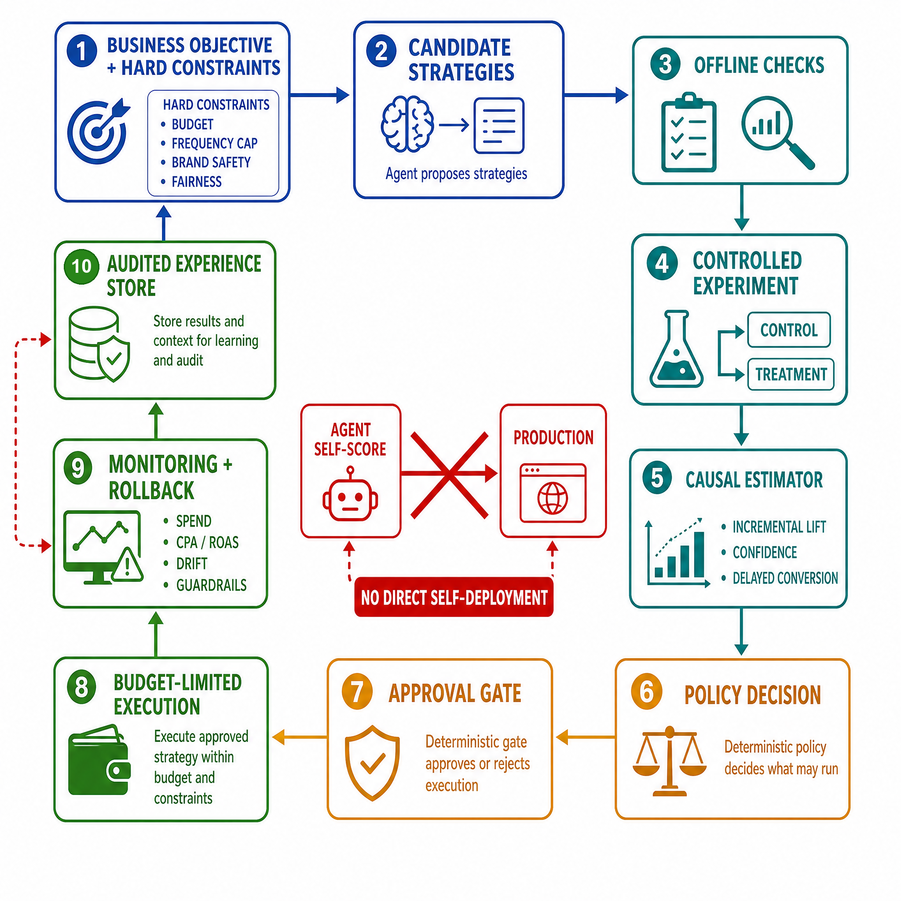

# 小红书高频面试题

> 用于持续沉淀内容社区推荐、搜索、广告、图文/视频理解、AIGC 内容生态相关面试题。

## 待补充方向

本文件作为该公司面试题的持续更新入口。后续可按照“岗位/面试轮次/问题/答案/手撕代码/复盘要点”的格式补充内容。

建议优先补充以下方向：

- 大模型、AIGC、多模态、Agent 或推荐搜索相关岗位面经。
- 公司核心业务场景中的算法工程问题。
- 高频手撕代码、系统设计、训练/推理/部署工程题。

## 目录

- [2026-09-22_小红书_大模型算法面经](#xiaohongshu-llm-20260922)
  - [笔试（机考）](#xiaohongshu-llm-20260922-round-1)
    - [1. 给一批笔记互动数据，按加权热度倒排再去重，输出前 N。](#xiaohongshu-llm-20260922-q1)
    - [2. 图文匹配题，判断一条评论属于哪篇笔记，给特征思路。](#xiaohongshu-llm-20260922-q2)
    - [3. 一个生成式排序，要求按时间衰减，怎么设计打分？](#xiaohongshu-llm-20260922-q3)
    - [4. 多模态特征怎么融合，早期融合还是晚期？](#xiaohongshu-llm-20260922-q4)
    - [5. 机考别急着写，题干里藏的边界先圈出来。](#xiaohongshu-llm-20260922-q5)
  - [一面](#xiaohongshu-llm-20260922-round-2)
    - [6. 多模态模型遇到图文不一致的样本，训练和上线分别怎么处理？](#xiaohongshu-llm-20260922-q6)
    - [7. 做内容理解时类别太多标注不够，你怎么办？](#xiaohongshu-llm-20260922-q7)
    - [8. 长文本分类，截断和摘要你选哪个，为什么？](#xiaohongshu-llm-20260922-q8)
    - [9. LoRA 讲讲，和全量微调你怎么选？](#xiaohongshu-llm-20260922-q9)
    - [10. 显存炸了你有哪几招救？](#xiaohongshu-llm-20260922-q10)
    - [11. 你训过最大的模型多大，分布式怎么搭的？](#xiaohongshu-llm-20260922-q11)
    - [12. 过拟合你怎么发现，又怎么治？](#xiaohongshu-llm-20260922-q12)
    - [13. 评测指标除了准确率你还看什么？](#xiaohongshu-llm-20260922-q13)
    - [14. 模型上线后被人反馈"答非所问"，你怎么查？](#xiaohongshu-llm-20260922-q14)
    - [15. 数据漂移你怎么监测？](#xiaohongshu-llm-20260922-q15)
  - [二面](#xiaohongshu-llm-20260922-round-3)
    - [16. 推荐模型上线后核心指标掉了，你从哪几个环节定位？](#xiaohongshu-llm-20260922-q16)
    - [17. 召回和排序分别怎么优化，先动哪头？](#xiaohongshu-llm-20260922-q17)
    - [18. 冷启动你有什么办法，新用户新内容都算。](#xiaohongshu-llm-20260922-q18)
    - [19. AB 实验你怎么设计，指标冲突听谁的？](#xiaohongshu-llm-20260922-q19)
    - [20. 特征穿越是什么，你怎么防？](#xiaohongshu-llm-20260922-q20)
    - [21. 离线训练和在线服务特征不一致，怎么对齐？](#xiaohongshu-llm-20260922-q21)
    - [22. 生成内容质量怎么评估，人工和自动两条线怎么搭？](#xiaohongshu-llm-20260922-q22)
    - [23. 多目标排序你怎么融合，权重谁定？](#xiaohongshu-llm-20260922-q23)
    - [24. 你做过最失败的一次模型迭代是什么？](#xiaohongshu-llm-20260922-q24)
  - [HR 面与反问](#xiaohongshu-llm-20260922-round-4)
    - [25. 你为什么想来我们这，对业务了解多少？](#xiaohongshu-llm-20260922-q25)
    - [26. 你期望的团队氛围是什么样的？](#xiaohongshu-llm-20260922-q26)
    - [27. 反问：这个组的模型迭代节奏多快，有没有评测基建？](#xiaohongshu-llm-20260922-q27)
    - [28. 反问：算法和工程在这边怎么协作？](#xiaohongshu-llm-20260922-q28)
    - [29. 同时接三个需求你先做什么？](#xiaohongshu-llm-20260922-q29)
  - [手撕](#xiaohongshu-llm-20260922-round-5)
    - [30. 【手撕】手写链表两两交换节点，注意别把指针弄断，并说清空链表、单节点这两个边界。](#xiaohongshu-llm-20260922-q30)

- [小红书Agent开发一面面经（2026-08-12）](#xiaohongshu-agent-dev-20260812)
  - [1. 自我介绍一下。](#xiaohongshu-agent-dev-20260812-q1)
  - [2. 介绍一下你这个___实习关注指标是什么？](#xiaohongshu-agent-dev-20260812-q2)
  - [3-12. 全都是实习相关问题，涉及Agent就狂追问，问了问数字指标，还有业务上下游，代码框架。](#xiaohongshu-agent-dev-20260812-q3)
  - [13. 说一下你这个项目Agent用在哪里。](#xiaohongshu-agent-dev-20260812-q4)
  - [14. OpenManus 是用的什么框架？](#xiaohongshu-agent-dev-20260812-q5)
  - [15. 讲一下你怎么理解Harness？](#xiaohongshu-agent-dev-20260812-q6)
  - [16. 多 Agent 并发有什么性能问题？](#xiaohongshu-agent-dev-20260812-q7)
  - [17. 你平时怎么控制 Agent 并发量？](#xiaohongshu-agent-dev-20260812-q8)
  - [18. 讲一下长时记忆和短时记忆的底层实现方式？](#xiaohongshu-agent-dev-20260812-q9)
  - [19. 讲一下 ReAct 的流程？](#xiaohongshu-agent-dev-20260812-q10)
  - [20. Planner、Executor、Critic 分别怎么做的。](#xiaohongshu-agent-dev-20260812-q11)
  - [21. Critic什么意思？为什么不用ReAct？](#xiaohongshu-agent-dev-20260812-q12)
  - [22. 上下文怎么做的？你是拆分的嘛？](#xiaohongshu-agent-dev-20260812-q13)
  - [25. 讲一下Redis的数据结构。](#xiaohongshu-agent-dev-20260812-q14)
  - [26. 每种的底层机理了解嘛？](#xiaohongshu-agent-dev-20260812-q15)
  - [27. 讲一下java的类加载机制](#xiaohongshu-agent-dev-20260812-q16)
  - [28. 场景题:  我们想要通过Agent实现对于广告投放的自我迭代，能够自我判别出哪种广告投放方式最优并执行，讲一下你的看法。](#xiaohongshu-agent-dev-20260812-q17)
  - [反问: 什么时候二面，有什么可以提高的地方。](#xiaohongshu-agent-dev-20260812-q18)
- [小红书 AI 全栈开发二面面经](#xiaohongshu-ai-fullstack-20260702)
  - [先来一个自我介绍](#xiaohongshu-ai-fullstack-20260702-q1)
  - [1. 你现在还在实习吗？](#xiaohongshu-ai-fullstack-20260702-q2)
  - [2. 实习是到期离职还是其他原因？](#xiaohongshu-ai-fullstack-20260702-q3)
  - [3. 在做视频剪辑Agent项目遇到的最大挑战是什么？](#xiaohongshu-ai-fullstack-20260702-q4)
  - [4. 项目里LangChain做了哪些工具调用，有没有实现memory相关功能，还是只做prompt编排？](#xiaohongshu-ai-fullstack-20260702-q5)
  - [5. 你如何保证每次调用大模型的稳定性？](#xiaohongshu-ai-fullstack-20260702-q6)
  - [6. 从文案到剪辑脚本再到成片完整流程是什么样的？](#xiaohongshu-ai-fullstack-20260702-q7)
  - [7. 视频成片质量好坏你们有对应的评测体系吗？](#xiaohongshu-ai-fullstack-20260702-q8)
  - [8. 单个视频耗时从三十分钟缩短到五分钟，你做了哪些优化？](#xiaohongshu-ai-fullstack-20260702-q9)
  - [9. 在项目里怎么保证音画同步、画面分辨率一致、字幕完整？](#xiaohongshu-ai-fullstack-20260702-q10)
  - [10. 项目选用GPT-5.5，有没有尝试其他大模型，选择它的考量是什么？](#xiaohongshu-ai-fullstack-20260702-q11)
  - [11. 模型输出效果评测是固定自动化benchmark还是依靠人工主观判断？](#xiaohongshu-ai-fullstack-20260702-q12)
  - [12. 简单介绍下视频生成Agent完整项目？](#xiaohongshu-ai-fullstack-20260702-q13)
  - [13. 两段实习感受有什么不同？](#xiaohongshu-ai-fullstack-20260702-q14)
  - [14. 两段实习你更喜欢哪一种工作模式？](#xiaohongshu-ai-fullstack-20260702-q15)
  - [15. 你最近有没有关注AI行业相关动态，印象最深的内容是什么？](#xiaohongshu-ai-fullstack-20260702-q16)
  - [16. LangGraph的核心关键点是什么？](#xiaohongshu-ai-fullstack-20260702-q17)
  - [17. 你做的知识库体系和Vicky这类工具本质区别是什么？](#xiaohongshu-ai-fullstack-20260702-q18)
  - [18. 你的知识库内容是不是基于spec文档做归纳总结生成的？](#xiaohongshu-ai-fullstack-20260702-q19)
  - [19. 你设计的可验证知识库，打算通过什么方案完成验证？](#xiaohongshu-ai-fullstack-20260702-q20)
  - [20. 多模态业务和纯文本大模型业务有什么区别？](#xiaohongshu-ai-fullstack-20260702-q21)
  - [21. 选择LangGraph框架是否完全取决于业务场景？](#xiaohongshu-ai-fullstack-20260702-q22)
  - [1. 团队落地AI产品时，怎么平衡大模型推理延迟与成本？](#xiaohongshu-ai-fullstack-20260702-q23)
  - [2. 复杂任务链的超时熔断，团队偏向规则硬控制还是动态模型智能降级？](#xiaohongshu-ai-fullstack-20260702-q24)
  - [3. 做多模态实时交互，架构会选LangGraph还是轻量流式编排？](#xiaohongshu-ai-fullstack-20260702-q25)
- [小红书大模型算法岗一面面经（2026-07-28）](#xiaohongshu-llm-algo-20260728)
  - [1. 介绍项目业务背景、完整业务链路，线上Query、Item数据量级](#xiaohongshu-llm-algo-20260728-q1)
  - [2. 说明测试集搭建方案，AUC评估逻辑，模型效果提升判定标准](#xiaohongshu-llm-algo-20260728-q2)
  - [3. 阐述MSE收敛但排序效果下滑问题的发现、定位全过程](#xiaohongshu-llm-algo-20260728-q3)
  - [4. 改用BCE+InfoNCE联合损失的原因，两项损失各自带来的效果增益](#xiaohongshu-llm-algo-20260728-q4)
  - [5. 基于原生NTP任务Qwen模型，如何适配下游检索监督训练](#xiaohongshu-llm-algo-20260728-q5)
  - [6. 检索打分选用余弦相似度，不直接使用模型logits的理由](#xiaohongshu-llm-algo-20260728-q6)
  - [7. vLLM FP16均值池化出现溢出、NaN问题的排查与修复方案](#xiaohongshu-llm-algo-20260728-q7)
  - [1. 搜索、推荐任务在建模逻辑、标签设计上的核心差异](#xiaohongshu-llm-algo-20260728-q8)
  - [2. 搜索场景Query独有特性，User-Query-Item三者建模方案](#xiaohongshu-llm-algo-20260728-q9)
  - [3. 选择LoRA微调而非全量微调的原因](#xiaohongshu-llm-algo-20260728-q10)
  - [4. LoRA底层原理、Rank选取依据、A/B矩阵初始化细节](#xiaohongshu-llm-algo-20260728-q11)
  - [5. InfoNCE假负样本带来的负面影响，对应的缓解手段](#xiaohongshu-llm-algo-20260728-q12)
  - [6. 写出BCE损失公式，分析软标签能否直接参与训练](#xiaohongshu-llm-algo-20260728-q13)
  - [7. 手写InfoNCE矩阵表达式，讲解代码实现思路](#xiaohongshu-llm-algo-20260728-q14)
  - [1. 现场编写快速排序算法，讲解实现思路](#xiaohongshu-llm-algo-20260728-q15)

<a id="xiaohongshu-ai-fullstack-20260702"></a>
### 小红书 AI 全栈开发二面面经

#### 一面

<a id="xiaohongshu-ai-fullstack-20260702-q1"></a>
##### 先来一个自我介绍

**回答：**

自我介绍要把“AI 全栈开发”讲成一条完整能力链，而不是把前端、后端、大模型、Agent 名词堆在一起。一个稳的结构是：我主要做 AI 应用和 Agent 工程，前端能把交互体验和多媒体工作台落出来，后端能把任务编排、工具调用、队列、存储和可观测性搭起来，大模型侧能做 prompt、RAG、LangChain/LangGraph 工作流、评测与稳定性治理。

可以这样表达：我过去的项目主线是视频剪辑 Agent。它不是简单调用一次大模型，而是把“用户需求理解 -> 文案生成 -> 脚本拆解 -> 素材检索 -> 镜头编排 -> 字幕/音频/画面合成 -> 质量评测 -> 人工可编辑”做成一条可追踪的链路。我在其中更关注三件事：第一，如何把非确定性的大模型输出变成可控的结构化中间产物；第二，如何把多媒体处理链路从分钟级优化到可接受的交互延迟；第三，如何用评测和日志把 Agent 的失败点定位出来。

最后要落到岗位匹配：小红书这样的内容社区，AI 全栈开发不是纯模型岗，也不是传统 CRUD，而是要理解内容生产、视频/图文多模态、创作者工具、工程稳定性和用户体验。我的优势是能在产品体验、工程系统和模型能力之间做连接。

<a id="xiaohongshu-ai-fullstack-20260702-q2"></a>
##### 1. 你现在还在实习吗？

**回答：**

这个问题表面是在确认状态，本质是在判断候选人的到岗时间、稳定性、时间投入和当前项目真实性。回答要清楚，不要含糊。

如果还在实习，可以说：我目前还在实习，主要负责 AI 应用/Agent 相关模块，日常工作包括需求拆解、工具调用链路开发、模型调用稳定性治理和前后端联调。目前实习安排是到某个时间节点结束，后续可以按团队要求协调到岗。当前实习对我帮助比较大，因为它让我从 demo 思维切到工程落地思维：模型输出不是终点，可观测、可回滚、可评测、可协作才是线上系统的基本要求。

如果已经结束，则强调结束原因和沉淀：上一段实习已经结束，结束原因是项目周期/实习期限到期，不是因为工作不适配。实习期间我主要沉淀了 Agent 工作流、AI Coding、视频生成链路和工程稳定性方面的经验。

<a id="xiaohongshu-ai-fullstack-20260702-q3"></a>
##### 2. 实习是到期离职还是其他原因？

**回答：**

回答重点是坦诚、稳定、职业化。面试官不是只问事实，而是在判断你是否可靠、是否和团队发生过明显冲突、是否能完成承诺周期。

比较好的回答是：是到期/项目阶段性结束后离开的。实习期间我完成了约定模块，也做了交接文档和必要的代码整理。离开不是因为业务不适配，而是因为实习周期和后续求职节奏安排。对我来说，这段经历最大的收获是意识到 AI 项目最难的不是把模型接上，而是把模型接入一条可验证、可维护、可协作的工程链路。

如果确实有主动离职原因，也要转成职业表达：比如希望寻找更贴近 AI Agent、多模态内容生产或全栈 AI 工具方向的岗位，而不是说“工作没意思”“mentor 不行”。

<a id="xiaohongshu-ai-fullstack-20260702-q4"></a>
##### 3. 在做视频剪辑Agent项目遇到的最大挑战是什么？

**回答：**

最大挑战不是“调用模型生成脚本”，而是把一个开放式创作任务拆成稳定、可验证、可恢复的工程流程。视频剪辑 Agent 涉及文本理解、素材检索、镜头规划、时间轴对齐、字幕生成、音频处理、画面渲染和质量评估，任何一个环节出错都会让最终成片不可用。

我会把挑战拆成三层。第一层是任务结构化。用户说“帮我剪一个小红书风格的视频”，这不是一个确定指令，需要先抽取主题、目标受众、视频时长、节奏、镜头风格、口播/字幕比例、素材约束，再生成可执行的剪辑脚本。这里必须让大模型输出结构化 JSON 或 DSL，而不是自由文本。

第二层是多模态一致性。文案、镜头、字幕、配音、BGM、转场必须在时间轴上对齐。文本生成模型只懂语义，不天然理解帧率、时长、采样率、分辨率、字幕安全区，所以需要工程规则和媒体处理工具做约束。

第三层是稳定性与可恢复。Agent 链路长，模型调用、素材下载、转码、ASR/TTS、渲染都可能失败。我的做法是把流程拆成可重试节点，每个节点有输入输出 schema、超时、重试、降级和日志 trace。真正的挑战是把创意工作流变成“非确定性生成 + 确定性校验 + 可回滚执行”的系统。

<a id="xiaohongshu-ai-fullstack-20260702-q5"></a>
##### 4. 项目里LangChain做了哪些工具调用，有没有实现memory相关功能，还是只做prompt编排？

**回答：**

如果只说“用了 LangChain 写 prompt”，会显得项目停留在 demo。更好的回答要区分 prompt 编排、tool calling、memory 和 workflow orchestration。

在视频剪辑 Agent 里，LangChain 可以承担三类工作。第一是工具调用，把模型输出连接到确定性工具，例如素材检索工具、脚本结构化工具、字幕生成工具、TTS 工具、视频转码工具、时间轴校验工具、封面生成工具。模型负责判断下一步调用什么工具和传什么参数，工具负责真实执行。

第二是中间状态管理。比如把用户需求、脚本版本、素材候选、镜头列表、字幕片段、音频时长、渲染结果都作为结构化状态保存，而不是散落在 prompt 里。这部分如果链路复杂，用 LangGraph 的 StateGraph 会比单纯 LangChain chain 更清晰。

第三是 memory。这里要分短期 memory 和长期 memory。短期 memory 保存当前任务上下文，例如用户修改意见、已选素材、前一次生成失败原因；长期 memory 保存创作者偏好，例如常用风格、字幕样式、视频节奏、品牌词和禁用词。Memory 不能无脑把对话塞回 prompt，而要有写入策略、检索策略、过期策略和冲突处理。

所以我的回答是：项目不是只做 prompt 编排，而是把 LangChain/LangGraph 用作工具调用和状态编排层；memory 做了任务级短期记忆，长期偏好记忆可以按用户画像和风格模板继续扩展。

<a id="xiaohongshu-ai-fullstack-20260702-q6"></a>
##### 5. 你如何保证每次调用大模型的稳定性？

**回答：**

大模型稳定性不能只靠“调低 temperature”。要从输入、输出、执行、评测和降级五个层面治理。

输入层要做 prompt 模板化和上下文裁剪。不同任务使用固定模板，明确角色、约束、输出格式、禁止事项和示例。上下文不能无限堆，要只保留和当前节点有关的信息，避免噪声干扰。

输出层要做结构化约束。比如要求模型输出 JSON Schema、函数调用参数或 DSL，并在拿到结果后做 schema validation。如果字段缺失、类型错误、时间轴不合法，就进入修复 prompt 或回退逻辑。

执行层要做超时、重试、幂等和熔断。模型 API 会受网络、限流、供应商波动影响，所以每次调用要有 request id、timeout、retry with backoff、fallback model、缓存和日志 trace。对于视频生成链路，重试必须节点级幂等，不能重复扣费或重复写脏数据。

评测层要做自动化检查。比如文案是否命中禁用词，镜头总时长是否等于目标时长，字幕是否为空，TTS 时长是否和字幕匹配，输出 JSON 是否可解析。模型输出不能直接进入生产链路，必须经过确定性校验。

降级层要准备备选方案。主模型失败时切到备选模型；复杂生成失败时退化成模板化脚本；素材检索不足时提示用户补充；最终答案置信度低时进入人工确认。稳定性本质是把模型的不确定性关在工程边界里。

<a id="xiaohongshu-ai-fullstack-20260702-q7"></a>
##### 6. 从文案到剪辑脚本再到成片完整流程是什么样的？

**回答：**

完整流程可以拆成“语义规划层、资产准备层、时间轴编排层、媒体渲染层、质量评估层”。

第一步是需求理解。解析用户输入，确定主题、目标平台、视频时长、风格、受众、口播/字幕比例、素材来源和禁用约束。

第二步是文案生成。模型生成主标题、开头 hook、分段脚本、行动召唤和字幕草稿。这里最好输出结构化内容，例如每段包含 `scene_goal`、`voiceover`、`visual_hint`、`duration`。

第三步是剪辑脚本生成。把文案拆成镜头列表，每个镜头包括时长、画面描述、素材关键词、字幕文本、配音文本、转场方式、BGM 节奏点。剪辑脚本必须是可执行的时间轴，而不是自然语言描述。

第四步是素材检索和生成。根据镜头描述检索本地素材库、云素材库或调用图像/视频生成模型补齐素材。素材要记录分辨率、比例、版权、时长、标签和适配镜头。

第五步是时间轴合成。对素材做裁剪、缩放、补帧、转码，生成字幕，合成 TTS 或配音，加入 BGM 和转场，形成 timeline。

第六步是渲染和导出。用 FFmpeg/MoviePy/服务端渲染引擎输出目标格式，例如 1080p、30fps、H.264、AAC。

第七步是质量评估和修复。检查音画同步、字幕完整性、黑帧、分辨率、时长、敏感词、脚本一致性。如果不通过，回到对应节点修复，而不是整条链路重跑。

<a id="xiaohongshu-ai-fullstack-20260702-q8"></a>
##### 7. 视频成片质量好坏你们有对应的评测体系吗？

**回答：**

视频成片评测不能只靠“看起来还行”。比较好的体系是自动指标、模型评审和人工评审结合。

自动指标负责底线质量。例如分辨率是否符合要求、帧率是否稳定、是否有黑帧/静音、音画是否同步、字幕是否完整、字幕是否超出安全区、总时长是否符合目标、转码是否成功、素材是否缺失。

模型评审负责语义和内容一致性。例如用 VLM/多模态模型判断画面是否和脚本文案匹配，字幕是否覆盖关键信息，视频是否存在明显违和镜头，封面和标题是否与内容一致。也可以让 LLM 根据 rubric 评估 hook 吸引力、节奏、信息密度、平台风格一致性。

人工评审负责主观体验和业务判断。比如小红书风格是否自然、是否像营销硬广、是否有真实感、是否符合品牌调性。这类指标很难完全自动化。

最终可以建立一个分层评分表：技术可用性、语义一致性、平台风格、用户吸引力、合规安全、可编辑性。线上再结合点击率、完播率、互动率、用户二次编辑率、生成后发布率等真实指标。技术评测解决“能不能用”，业务指标解决“值不值得用”。

<a id="xiaohongshu-ai-fullstack-20260702-q9"></a>
##### 8. 单个视频耗时从三十分钟缩短到五分钟，你做了哪些优化？

**回答：**

耗时优化要先拆分链路，而不是泛泛说“并行”。视频生成链路通常包括模型生成、素材检索、TTS/ASR、视频处理、渲染导出和上传。要先做 trace，把每个节点耗时打出来，再针对瓶颈优化。

第一类是并行化。文案生成后，素材检索、TTS、字幕预处理、封面生成可以并行；多个镜头的素材处理也可以并行。不要把所有步骤串成一条同步链。

第二类是缓存。对常见风格模板、BGM、字体、转场、TTS 片段、素材检索结果、模型中间结果做缓存。尤其是用户反复改同一视频时，只重算变更节点，不重跑全链路。

第三类是增量渲染。把视频拆成片段，修改某个镜头时只重新渲染对应 segment，再做 concat，而不是整片从头渲染。

第四类是模型调用优化。短任务用小模型或本地模型，复杂规划用强模型；结构化输出减少反复修复；开启流式输出改善体感延迟；对失败节点做局部 retry。

第五类是媒体工程优化。FFmpeg 参数预设、硬件编码、统一素材格式、避免反复转码、预生成代理文件、减少不必要的分辨率转换。

如果从 30 分钟降到 5 分钟，我会强调这是系统性优化：通过 trace 定位瓶颈，通过 DAG 并行和节点缓存减少等待，通过增量渲染减少重复计算，通过模型分层降低调用成本。

<a id="xiaohongshu-ai-fullstack-20260702-q10"></a>
##### 9. 在项目里怎么保证音画同步、画面分辨率一致、字幕完整？

**回答：**

这类问题考的是多媒体工程基本功。音画同步、分辨率一致、字幕完整不能交给模型自由发挥，必须由确定性媒体处理链路保证。

音画同步上，要建立统一时间轴。所有素材都转换到统一 fps 和 timebase，音频统一采样率，例如 48kHz。字幕、配音和镜头片段都绑定 start/end timestamp。合成前检查每段 voiceover 时长是否小于或等于镜头时长，不匹配时可以调整语速、延长镜头、裁剪停顿或重新生成字幕。

分辨率一致上，要统一输出规格，例如 1080x1920 或 1920x1080。输入素材先做 normalize，按目标比例 crop/pad/scale，保留安全区。不同素材的 SAR/DAR、旋转元信息、色彩空间也要处理，否则导出后可能变形或黑边异常。

字幕完整上，字幕从脚本或 ASR 生成后要经过 SRT/ASS 校验：时间戳不重叠、不越界、文本非空、每行长度合适、样式在安全区内。渲染后还可以抽帧或用 OCR 检查字幕是否真的出现在画面上。

工程上可以用 FFmpeg/ffprobe 做媒体元信息校验，用 timeline schema 保证每个轨道合法，用自动化测试覆盖常见异常。模型负责生成意图，媒体一致性要靠确定性 pipeline。

<a id="xiaohongshu-ai-fullstack-20260702-q11"></a>
##### 10. 项目选用GPT-5.5，有没有尝试其他大模型，选择它的考量是什么？

**回答：**

这类问题要避免把某个模型神化。模型选择要回到任务需求：视频剪辑 Agent 更看重复杂指令遵循、结构化输出稳定性、长上下文处理、多轮修复能力、工具调用能力、中文内容风格和成本延迟。

可以这样回答：我们不只看单次回答效果，而是用同一批视频生成任务对多个模型做对比，包括强模型、轻量模型和国内模型。评估维度包括 JSON 可解析率、脚本可执行率、镜头规划合理性、文案吸引力、工具调用参数正确率、失败后自修复能力、平均延迟和单次成本。

选择 GPT-5.5 的原因如果成立，应是它在复杂任务规划、长上下文、多步骤推理和结构化输出上更稳定，能减少后续修复成本。视频 Agent 里最贵的不是一次模型调用，而是错误输出导致的链路重跑、渲染失败和人工返工。如果强模型让脚本一次通过率显著提高，总成本反而可能更低。

但工程上不应该所有节点都用同一个强模型。可以采用模型分层：强模型负责总规划和复杂修复，小模型负责分类、标签抽取、格式转换、简单改写，本地模型负责低风险任务。最终选型要以评测数据和业务成本为准。

<a id="xiaohongshu-ai-fullstack-20260702-q12"></a>
##### 11. 模型输出效果评测是固定自动化benchmark还是依靠人工主观判断？

**回答：**

两者都需要，但作用不同。固定自动化 benchmark 解决一致性、回归和规模化评估；人工主观判断解决审美、平台风格和创意质量。

自动化 benchmark 可以设计成一组固定任务集，包括不同类型的视频需求、不同素材条件、不同风格要求和异常输入。指标包括结构化输出合法率、工具调用成功率、脚本覆盖率、事实一致性、违规内容率、平均延迟、成本、自动质量分等。每次 prompt、模型或工具链改动后跑一遍，防止回归。

人工评审则要有 rubric，而不是随便看。比如从创意吸引力、内容完整性、平台风格、镜头节奏、字幕可读性、商业可用性、违和感等维度打分。最好双人标注，计算一致性，沉淀高质量 badcase。

更成熟的做法是三层评测：自动规则做底线过滤，模型评审做规模化语义判断，人工评审做高价值样本和争议样本复核。线上再看真实指标，例如完播率、点击率、发布率、用户编辑次数。AI 内容生成的评测不是一个 benchmark 能解决的，而是离线评测、人工质检和线上反馈的闭环。

<a id="xiaohongshu-ai-fullstack-20260702-q13"></a>
##### 12. 简单介绍下视频生成Agent完整项目？

**回答：**

这个项目可以讲成一个面向创作者的自动视频生产 Agent。用户输入主题、目标平台、视频风格、时长和素材约束，系统自动生成文案、拆解剪辑脚本、检索或生成素材、编排时间轴、生成字幕和配音，最后渲染出可编辑的视频草稿。

架构上分为五层。第一层是交互层，负责收集用户需求、展示脚本和成片、支持人工修改。第二层是 Agent 编排层，用 LangGraph/工作流引擎管理状态和节点流转。第三层是模型能力层，包括 LLM 文案生成、VLM 画面理解、TTS、ASR、embedding/rerank。第四层是工具层，包括素材检索、媒体转码、字幕渲染、FFmpeg 合成、封面生成。第五层是评测与观测层，记录每个节点输入输出、耗时、错误、质量分和用户反馈。

核心难点是把创作任务变成可执行 DAG。大模型生成的是意图和结构化计划，真正执行靠确定性工具。每个节点都有 schema、校验、重试和降级。比如脚本生成失败就重试修复 JSON，素材不足就扩大检索或生成替代素材，渲染失败就定位具体片段。

项目价值不是“自动生成一个视频”这么简单，而是把视频生产从人工串行流程变成可追踪、可评估、可编辑的智能生产线。

<a id="xiaohongshu-ai-fullstack-20260702-q14"></a>
##### 13. 两段实习感受有什么不同？

**回答：**

回答要体现复盘能力，而不是比较公司好坏。可以从业务阶段、团队协作、技术深度和个人成长四个角度讲。

例如：第一段实习更偏基础工程和业务熟悉，我主要学习如何在真实团队里写可维护代码、做需求沟通、处理线上问题。第二段实习更偏 AI 应用和 Agent 落地，我开始接触模型不确定性、工具调用、评测体系和多模块协作。

最大的不同是，传统工程更多是确定性系统，输入输出边界更清晰；AI 应用是概率系统和确定性系统的混合，模型输出可能漂移，评测也更复杂。因此第二段实习让我更重视 schema、trace、自动化评测、灰度和人工兜底。

最后可以收束：两段经历对我都是补充。第一段让我形成工程规范，第二段让我理解 AI 原生应用的复杂性。AI 全栈开发需要这两种能力同时存在。

<a id="xiaohongshu-ai-fullstack-20260702-q15"></a>
##### 14. 两段实习你更喜欢哪一种工作模式？

**回答：**

不要简单说“更喜欢轻松的”或“更喜欢 AI”。可以回答更喜欢目标清晰、反馈快速、能把技术和业务结果闭环的工作模式。

我更喜欢第二类偏 AI 应用落地的模式，因为它的不确定性更高，但也更能锻炼系统思维。一个 Agent 功能不是写完接口就结束，而是要看模型输出是否稳定、工具调用是否成功、用户是否真的愿意用、成本是否可控。这要求我同时考虑产品、模型、工程和评测。

但我也很看重第一类传统工程模式带来的规范性，比如需求评审、代码 review、测试、上线流程、监控告警。这些是 AI 应用能稳定落地的底座。

所以最理想的工作模式是：业务目标明确，技术探索空间足够，团队有工程纪律，能通过数据和用户反馈快速迭代。

<a id="xiaohongshu-ai-fullstack-20260702-q16"></a>
##### 15. 你最近有没有关注AI行业相关动态，印象最深的内容是什么？

**回答：**

这个问题不是考新闻背诵，而是看你能不能把行业变化转成工程判断。可以围绕 Agent、AI Coding、多模态和长上下文讲。

我最近最关注的是 AI Coding 和 Agent 从“辅助生成代码”走向“可执行工作流”。早期 AI 工具更像 autocomplete 或 chat assistant，现在越来越多系统开始具备读仓库、检索代码、修改文件、运行测试、调用工具、生成 PR 的闭环能力。这背后的关键不是模型单点提升，而是上下文工程、工具调用、权限控制、评测和可观测性的系统化。

第二个趋势是多模态生成和理解开始进入内容生产链路。对小红书这种内容平台来说，AI 不只是生成文案，还会影响选题、脚本、封面、图文排版、视频剪辑、评论运营和商业化素材生产。未来的内容工具会更像“创作者 copilot + 自动化制作流水线”。

我的判断是，下一阶段竞争不只是模型参数，而是模型能力如何嵌入真实工作流：谁能把模型输出变成可验证、可编辑、可协作、低成本的生产系统，谁更有价值。

<a id="xiaohongshu-ai-fullstack-20260702-q17"></a>
##### 16. LangGraph的核心关键点是什么？

**回答：**

LangGraph 的核心是把 Agent 从“线性 chain”提升为“有状态图”。它用 graph 来表达任务流，用 state 来承载中间状态，用 node 表示执行步骤，用 edge 表示流转条件，适合多步骤、可分支、可循环、可恢复的 Agent 任务。

关键点有四个。第一是 State。LangGraph 不是每步只传一段文本，而是维护结构化状态，例如用户需求、当前计划、工具结果、错误信息、候选素材、评测结果。

第二是 Node。每个 node 是一个可执行单元，可以是 LLM 调用、工具调用、检索、校验、人工确认或媒体处理。

第三是 Edge 和 Conditional Edge。它可以根据状态决定下一步走哪里，例如工具成功进入下一节点，失败进入 retry 或 fallback，质量不达标回到修复节点。

第四是循环和 checkpoint。Agent 常常需要 plan-act-observe-replan，LangGraph 能表达这种循环，并通过 checkpoint 保存状态，支持中断恢复、调试和人工介入。

它适合复杂 Agent，不适合所有任务。简单问答用普通 chain 就够了；多步骤、有状态、需要重试和分支的任务，LangGraph 更清晰。

<a id="xiaohongshu-ai-fullstack-20260702-q18"></a>
##### 17. 你做的知识库体系和Vicky这类工具本质区别是什么？

**回答：**

如果 Vicky 指通用知识库/AI 助手类工具，可以从定位、数据结构、验证能力和业务集成来区分。

通用知识库工具通常强调快速导入文档、检索问答和对话体验，适合个人或团队做知识查询。但项目里的知识库体系如果服务视频生成 Agent，本质上不是“问答工具”，而是 Agent 的可执行知识底座。

区别主要有四点。第一，知识结构不同。通用工具通常按文档 chunk 存储，而业务知识库会把 spec、素材标签、风格模板、镜头规则、字幕规范、品牌约束、禁用词、工具说明结构化。

第二，使用方式不同。通用工具主要回答问题；我们的知识库要参与决策和执行，例如选择剪辑模板、约束字幕样式、验证脚本是否符合规范。

第三，验证要求不同。普通知识库回答错了可以让用户追问；Agent 知识库如果错了，会导致工具调用错误、渲染失败或内容违规。因此需要引用、版本、权限、置信度和可验证规则。

第四，系统集成不同。业务知识库要和工作流、工具链、评测系统、日志系统连接，成为生产链路的一部分。总结来说，通用工具是 knowledge assistant，项目知识库更像 workflow-grounded knowledge system。

<a id="xiaohongshu-ai-fullstack-20260702-q19"></a>
##### 18. 你的知识库内容是不是基于spec文档做归纳总结生成的？

**回答：**

可以回答：一部分是，但不能只靠归纳总结。Spec 文档是知识库的重要来源，因为它包含业务规则、接口说明、产品约束和流程定义。但如果直接把 spec 丢进向量库，效果通常不稳定：文档长、结构复杂、版本变化快，模型容易断章取义。

更好的做法是分层处理。第一层保留原始 spec，作为可追溯证据。第二层抽取结构化规则，例如字段定义、接口约束、流程步骤、异常情况、示例。第三层生成面向 Agent 的操作手册，例如什么时候调用哪个工具、参数怎么填、失败怎么处理。第四层建立验证规则，例如 schema、正则、状态机或单元测试。

所以知识库内容既包括基于 spec 的归纳总结，也包括人工确认的规则、线上 badcase、工具说明、风格模板和评测样例。归纳总结负责提高可读性，原文引用负责可追溯，结构化规则负责可执行，验证集负责可信度。

<a id="xiaohongshu-ai-fullstack-20260702-q20"></a>
##### 19. 你设计的可验证知识库，打算通过什么方案完成验证？

**回答：**

可验证知识库的目标不是“看起来回答对”，而是能证明它的检索、引用和执行建议是可靠的。可以从离线验证、在线验证和人工闭环三层做。

离线层先构建 golden set。把真实问题、标准答案、证据文档位置、允许引用的段落标出来。评估检索时看 recall@k、MRR、nDCG、证据命中率；评估生成时看答案正确性、引用一致性、拒答准确率。

规则层做确定性校验。对结构化知识，例如接口参数、字幕规范、视频比例、工具调用 schema，可以用程序校验，而不是让模型自由判断。凡是能写成规则的，就不要交给模型猜。

在线层做 trace 和 badcase 回流。每次 Agent 使用知识库时记录 query、召回 chunk、rerank 分数、引用、最终动作和用户反馈。失败样本进入标注池，更新知识库、prompt、切分策略和评测集。

人工层处理争议和高风险内容。比如品牌规范、合规内容、商业素材使用等，需要人工审核或双人标注。

最终形成闭环：知识入库要有来源和版本，知识使用要有引用和 trace，知识效果要有评测，知识错误要能回滚和修复。这才叫可验证。

<a id="xiaohongshu-ai-fullstack-20260702-q21"></a>
##### 20. 多模态业务和纯文本大模型业务有什么区别？

**回答：**

纯文本大模型业务主要处理 token 序列，输入输出边界相对简单。多模态业务同时处理文本、图像、视频、音频，难点会从“语言生成”扩展到“跨模态对齐、时间同步、媒体工程和体验评测”。

第一，数据结构不同。文本是离散 token，视频是帧序列，音频是 waveform，图像是像素矩阵。多模态系统要处理分辨率、帧率、采样率、时间戳、编码格式等工程问题。

第二，对齐更难。视频剪辑里文案、字幕、配音、画面、BGM 必须在时间轴上对齐；纯文本问答没有这种强时间约束。

第三，评测更复杂。文本可以看事实一致性、格式正确性；多模态还要看画面质量、音画同步、字幕可读性、审美、节奏、平台风格。

第四，成本更高。视频和音频处理涉及 GPU、转码、存储、带宽和长任务队列，延迟也更敏感。

第五，交互方式不同。多模态业务常常需要可编辑中间结果，例如脚本、分镜、时间轴，而不是一次性输出最终答案。

所以多模态业务更像“模型能力 + 媒体工程 + 工作流系统”，纯文本业务更像“语言理解 + 知识检索 + 文本生成”。

<a id="xiaohongshu-ai-fullstack-20260702-q22"></a>
##### 21. 选择LangGraph框架是否完全取决于业务场景？

**回答：**

是的，框架选择应该由业务场景决定，但不能只看“复杂不复杂”，还要看状态管理、分支循环、可靠性和团队维护成本。

如果任务是简单问答、单次 RAG、固定 prompt 改写，用 LangChain chain 或普通函数编排就够了。引入 LangGraph 反而会增加复杂度。

如果任务具备多步骤状态、条件分支、循环修复、工具调用、人工确认、失败重试、checkpoint 恢复，LangGraph 就更合适。例如视频生成 Agent：脚本生成后要检索素材，素材不足要回退，字幕不合格要修复，渲染失败要重试，这种流程天然适合图编排。

但实时多模态流处理未必适合 LangGraph。比如音视频帧级处理、低延迟互动、连续流式推理，更适合轻量事件流或专门的流处理框架。LangGraph 更适合语义层工作流，不适合毫秒级媒体流调度。

所以我的判断是：LangGraph 适合“有状态、可回滚、可观测的 Agent 工作流”；轻量编排适合“高频、低延迟、流式数据处理”。实际项目可以分层组合。

#### 反问环节

<a id="xiaohongshu-ai-fullstack-20260702-q23"></a>
##### 1. 团队落地AI产品时，怎么平衡大模型推理延迟与成本？

**回答：**

这是一个很好的反问，因为它直指 AI 产品能否规模化。一个成熟团队通常不会只靠单一强模型，而会做模型分层和链路拆分。

可期待的回答包括：简单任务走小模型或规则，复杂规划走强模型；高频请求做缓存；可异步的任务进入队列；长任务拆成可流式返回的阶段；对用户可见链路优化首 token 延迟；对成本敏感节点做 batch、量化或本地化部署；通过 observability 看每个节点的 token、延迟、失败率和业务收益。

你也可以继续追问：团队目前更关注首响延迟、总完成时间还是单位生成成本？是否有模型路由策略？是否允许降级生成？这些能帮你判断团队是否真的在做 AI 工程，而不是 demo。

<a id="xiaohongshu-ai-fullstack-20260702-q24"></a>
##### 2. 复杂任务链的超时熔断，团队偏向规则硬控制还是动态模型智能降级？

**回答：**

这个反问考察的是团队对 Agent 可靠性的理解。复杂任务链一定要有规则硬控制，因为超时、重试次数、预算、权限、安全边界不能完全交给模型决定。模型可以参与降级策略建议，但最后执行必须由确定性控制面约束。

理想架构是规则兜底 + 智能降级。规则层定义最大执行时间、最大成本、最大工具调用次数、失败重试上限、不可越权操作。智能层根据失败原因选择降级路径，例如换模型、缩短上下文、改用模板、跳过非关键节点、请求用户补充信息。

你可以观察团队回答是否提到 trace、节点级超时、幂等、补偿、fallback、人工接管。如果没有这些，说明 Agent 可能还停留在实验阶段。

<a id="xiaohongshu-ai-fullstack-20260702-q25"></a>
##### 3. 做多模态实时交互，架构会选LangGraph还是轻量流式编排？

**回答：**

这道反问很专业。合理答案通常是分层：语义层可以用 LangGraph，实时流处理层更适合轻量流式编排。

LangGraph 擅长表达任务状态、分支、循环、工具调用和 checkpoint，但它不是为音视频帧级低延迟处理设计的。多模态实时交互涉及 ASR 流、视频帧、VAD、TTS、VLM 推理、音画同步和背压控制，需要更贴近流处理的机制，例如 AsyncIterator、消息队列、Reactive Streams、Ring Buffer、GPU pipeline 或自研事件总线。

比较成熟的架构是：底层用轻量流式框架处理音频、视频、字幕、模型推理流；上层用 LangGraph 管理语义决策，例如意图识别、任务规划、工具调用和异常恢复。两层通过事件 schema 连接。这样既能保证实时性，又能保留 Agent 工作流的可观测和可恢复。


<a id="xiaohongshu-llm-algo-20260728"></a>
### 小红书大模型算法岗一面面经（2026-07-28）

#### 一、项目深挖

<a id="xiaohongshu-llm-algo-20260728-q1"></a>
##### 1. 介绍项目业务背景、完整业务链路，线上Query、Item数据量级

**回答：**

回答这道题不能只说“做了一个双塔模型”，要把业务目标、数据对象、离线训练、在线召回/排序和指标闭环串起来。完整项目最终要解决的是：在可接受的延迟和成本内，把用户当前意图与合适的 Item 排在前面。

业务链路可以抽象为：

$$
\text{Query/User}
\rightarrow \text{意图理解与特征构建}
\rightarrow \text{候选召回}
\rightarrow \text{精排/重排}
\rightarrow \text{过滤与规则}
\rightarrow \text{展示}
\rightarrow \text{行为日志回流}
$$

离线侧从曝光、点击、停留、收藏、评论、转化和负反馈日志中构造样本，完成去重、脱敏、时间切分、负样本构造和特征加工；训练后将 Item 向量离线生成并写入 ANN 索引。在线收到 Query 后，先做规范化、纠错、意图识别和 Query 编码，再从向量索引、倒排索引或其他召回源取得候选，之后由精排模型结合 Query、User、Item 和上下文特征打分，最后做去重、质量过滤、业务规则和分页。

Query 与 Item 的量级要分别报告，不要把训练样本数与线上实体数混为一谈。至少准备 Item 库规模、日新增 Item、日活跃 Query、训练样本量、线上 QPS/P99、初召候选数和最终展示数。敏感数字可以回答数量级，但不能编造。

数据规模还要与设计决策对应：Item 数量决定索引、分片和更新策略；Query 长尾决定纠错、改写和语义召回的重要性；QPS/P99 决定缓存、批量编码、量化和多级召回；Item 更新频率决定增量索引和一致性方案。项目介绍的本质不是报大数字，而是说明规模如何约束模型与系统。

<a id="xiaohongshu-llm-algo-20260728-q2"></a>
##### 2. 说明测试集搭建方案，AUC评估逻辑，模型效果提升判定标准

**回答：**

测试集要回答三个问题：在什么分布上评估、标签是否可信、离线提升是否具有统计和业务意义。不能随机切一份数据就称为测试集。

我会优先按时间切分，避免未来行为泄露；按 Query、User、Item 做去重或隔离，防止近重复样本跨集合。测试样本覆盖头部、腰部、长尾 Query，热门与冷启动 Item，明确意图、歧义意图以及正反馈、弱反馈和无反馈。负样本不能只有随机负例，还要有曝光未点击、同 Query 被跳过 Item 和模型易混淆的 hard negative，并记录采样来源。

AUC 表示随机抽取一个正样本和一个负样本时，模型把正样本打分更高的概率：

$$
\operatorname{AUC}=P\left(s(x^+)>s(x^-)\right)
$$

AUC 本质上是排序概率，不依赖固定阈值，对分数的单调变换不敏感。但它不等于 Top-K 检索效果，也不体现位置权重、召回覆盖和延迟。搜索还要看 Recall@K、MRR、nDCG、HitRate、无结果率、首屏命中；推荐还要结合 CTR、停留、转化、负反馈和长期价值。

效果提升不能只看 AUC 多了 0.001。应固定测试集、特征快照和评测脚本，比较核心指标、分桶指标、坏例和置信区间，必要时用 bootstrap 或配对检验。上线前做离线回放和 shadow，线上通过随机分流 A/B 观察主指标、护栏指标、P99、成本和异常率。

没有线上实验时，只能说“离线指标在预设阈值和多个分桶上稳定提升”，不能把离线 AUC 直接等同于业务收益。

<a id="xiaohongshu-llm-algo-20260728-q3"></a>
##### 3. 阐述MSE收敛但排序效果下滑问题的发现、定位全过程

**回答：**

MSE 收敛而排序效果下降，首先说明训练目标与业务目标不一致，或者训练/评估分布发生了变化。MSE 优化点值误差：

$$
\mathcal{L}_{MSE}=\frac{1}{N}\sum_{i=1}^{N}(y_i-\hat y_i)^2
$$

它关注数值平均误差，排序指标关注样本相对顺序。模型把大量预测压到均值附近，可能让 MSE 下降，却不能把真正相关的 Item 排在前面。标签噪声、类别不平衡、热门样本主导、曝光偏差、数据泄露、特征失效、分布漂移和推理预处理不一致也会产生类似现象。

定位分四层：

1. 检查 MSE、AUC、nDCG 的样本范围、权重、过滤和分桶，确认没有把 Query 内排序错算成全局分类。
2. 比较新旧模型分数方差、正负分布、校准曲线、分位数和 Query 内分数差距，检查 score collapse、极端值或全同分。
3. 找 Query 内正样本被负样本超过的逆序对，分析语义、特征、hard negative、标签和索引问题，同时检查训练/测试实体与时间重合。
4. 对比训练、导出、量化和线上服务，检查 tokenizer、池化、归一化、特征顺序、模型版本与 ANN metric。

修复不能只调学习率。可以把 MSE 与 BCE、pairwise loss 或 InfoNCE 联合，让模型学习绝对相关性和相对区分性；重做 hard negative、曝光去偏和假负样本治理，并对 Query 频段、Item 新鲜度和业务场景分桶评估。每项修改都做消融，明确收益来自损失、数据、特征还是服务链路。

本质上，训练 loss 只是优化代理，排序指标和业务指标才是目标。loss 下降不能自动证明模型变好。

<a id="xiaohongshu-llm-algo-20260728-q4"></a>
##### 4. 改用BCE+InfoNCE联合损失的原因，两项损失各自带来的效果增益

**回答：**

BCE 和 InfoNCE 解决两个层面的问题。BCE 是点式目标，判断一个 Query-Item 对本身的相关概率；InfoNCE 是对比目标，让正样本在候选集合中排到负样本前面。

$$
\mathcal{L}_{BCE}
=-\left[y\log\sigma(z)+(1-y)\log(1-\sigma(z))\right]
$$

$$
\mathcal{L}_{InfoNCE}
=-\log
\frac{\exp(\operatorname{sim}(q,i^+)/\tau)}
{\sum_{j=1}^{K}\exp(\operatorname{sim}(q,i_j)/\tau)}
$$

联合目标通常为：

$$
\mathcal{L}
=\lambda\mathcal{L}_{BCE}
+(1-\lambda)\mathcal{L}_{InfoNCE}
$$

BCE 的增益通常体现在分数校准、绝对相关性判断和业务标签拟合；InfoNCE 通常改善 Embedding 空间分离、召回排序和长尾语义匹配。但没有消融实验不能声称某一项带来固定增益。应设置 BCE-only、InfoNCE-only、联合损失和不同 $\lambda$ 的实验，比较 AUC、Recall@K、nDCG、分桶和线上指标。

联合训练还要处理 loss 尺度不同、温度 $\tau$、批内假负样本和点击偏差。真正的理由不是“多加一个 loss 更强”，而是两种监督是否提供互补信号，并且稳定性和成本是否可接受。

<a id="xiaohongshu-llm-algo-20260728-q5"></a>
##### 5. 基于原生NTP任务Qwen模型，如何适配下游检索监督训练

**回答：**

原生 NTP 训练的是条件语言建模能力，不等于已经具备可直接用于向量检索的 Query-Item 表示。适配时可以复用 Qwen Transformer 主干，在 Query 和 Item 两侧共享或部分共享参数，取有效 token 的最后隐状态、特殊 pooling token 或 attention pooling，再经过投影头得到向量：

$$
e_q=f_\theta(q),\qquad e_i=g_\theta(i)
$$

训练构造正样本 $(q,i^+)$ 和负样本 $i^-$，使用余弦/点积相似度配合 InfoNCE、Multiple Negatives Ranking Loss 或 pairwise loss。批内 Item 可作为负样本，同时加入经过曝光约束和语义过滤的 hard negative。训练后 Query 与 Item 必须使用一致的 tokenizer、池化、归一化和向量库 metric；Item 向量离线入库，Query 向量在线计算。

如果需要保留生成能力，可以采用多任务目标：

$$
\mathcal{L}
=\lambda_{NTP}\mathcal{L}_{NTP}
+\lambda_{retrieval}\mathcal{L}_{retrieval}
$$

交叉编码精排则把 Query 和 Item 拼接输入模型，获得更充分的语义交互，但无法提前计算所有 Item 向量，在线成本更高。池化时不能取 padding 位置，也不能忽略 attention mask；不同长度要按有效 token 做 masked mean 或使用明确 EOS 表示。

本质上，这是把生成式语言表示迁移到可检索的度量空间，同时用检索监督塑造“相似样本靠近、难负样本分离”的几何结构。

<a id="xiaohongshu-llm-algo-20260728-q6"></a>
##### 6. 检索打分选用余弦相似度，不直接使用模型logits的理由

**回答：**

生成模型 logits 和检索相似度不在同一语义空间。Qwen logits 通常是词表大小的向量：

$$
\mathbf{z}_t=W_oh_t+b
$$

它表示上下文 $h_t$ 下下一个 token 的条件分布，受 prompt、位置、tokenizer、回答长度和词表影响。两个 Item 的词表 logits 不能天然作为稳定的 Query-Item 距离。

余弦相似度作用于经过同一表示学习目标训练的固定向量：

$$
\operatorname{cos}(q,i)
=\frac{q^\mathsf{T}i}{\lVert q\rVert_2\lVert i\rVert_2}
$$

它允许 Query 与 Item 独立编码，Item 向量离线建立 ANN 索引；归一化后尺度更稳定，固定维度也便于缓存、量化和分片。

如果用生成模型 logits 对每个候选 Item 判断相关性，本质上是 Cross-Encoder：需要把 Query 和 Item 一起送入模型，精度可能更高，但每个候选都要做昂贵前向，不能承担大规模初召。常见分层方案是双塔向量初召，Cross-Encoder 或 log-prob 精排。

余弦也不是天然正确，必须确认 Query/Item 向量由匹配目标训练，入库与查询使用一致的归一化和 metric，并用 Recall@K、nDCG、延迟和线上指标验证。

<a id="xiaohongshu-llm-algo-20260728-q7"></a>
##### 7. vLLM FP16均值池化出现溢出、NaN问题的排查与修复方案

**回答：**

先区分 hidden 在池化前已经 NaN，还是池化归约阶段产生 NaN。FP16 最大有限值约为 65504，长序列中先用半精度求和可能溢出，即使最终平均值正常；有效 token 数为 0 或全 padding 则会产生 0/0。

排查顺序是：

1. 在模型输出、mask、pooling sum、除法、归一化和最终 embedding 后分别检查 isfinite、最大绝对值、有效长度和 dtype，定位第一处非有限值。
2. 核对 padding mask 语义、valid_count 和不同长度样本的统计；全 mask 行不能直接做 Softmax 或平均。
3. 用 batch size 1、短序列和 eager 路径复现，再与 vLLM fused kernel、量化/非量化路径对比，检查导出模型、权重 dtype、KV Cache 和 pooling 接口。
4. 如果 hidden 已异常，继续查 attention logits、mask 中的 -inf、位置编码、权重加载、输入归一化和模型本身的数值范围。

修复时将 hidden、累加和归一化显式转为 FP32，并保护分母：

$$
h=\frac{\sum_t m_t x_t}{\max\left(\sum_t m_t,1\right)}
$$

具体做法是用有效 mask 做 FP32 sum，除以 valid_count.clamp_min(1)，再在 FP32 中做 L2 norm 和 normalize，最后按向量库接口决定是否转回 FP16。全 padding 应返回错误、跳过或带状态的零向量，不能默默当成正常 embedding。

BF16 指数范围更宽，可能缓解溢出，但不是不定位根因的万能修复；随意 clamp 也可能掩盖模型异常。修复后要回归空输入、超长输入、全 padding、极端值、不同 batch 和真实请求，检查 NaN 率、向量范数、召回和吞吐。

#### 二、理论八股

<a id="xiaohongshu-llm-algo-20260728-q8"></a>
##### 1. 搜索、推荐任务在建模逻辑、标签设计上的核心差异

**回答：**

搜索是 Query 驱动的需求满足，推荐是 User/场景驱动的内容发现。

| 维度 | 搜索 | 推荐 |
|---|---|---|
| 触发方式 | 用户主动输入 Query，意图通常更明确 | 系统主动提供内容，意图隐式 |
| 核心目标 | Query-Item 相关性、满足度、结果完整性 | 长期兴趣、消费深度、留存与多样性 |
| 标签 | Query-Item 点击、停留、收藏、转化、人工相关性 | 曝光后的点击、观看时长、完播、互动、留存、负反馈 |
| 样本偏差 | 位置、召回源、Query 改写和无结果偏差 | 曝光策略、位置偏差、反馈回流和热门偏差 |
| 指标 | Recall@K、MRR、nDCG、无结果率、首屏命中 | CTR、观看时长、完播率、转化、留存、多样性 |

搜索强调“这个 Item 是否回答当前 Query”，要建模 Query-Item 交互、实体、时间和过滤条件；推荐除了相关性，还要建模兴趣、曝光频率、新鲜度、探索利用和生态约束。搜索可以满足明确需求，推荐则要探索用户尚未表达的偏好。

点击不能直接当成无偏真相关。搜索点击受位置、标题和摘要影响，推荐点击受封面、曝光策略和疲劳影响；应结合停留、跳过、负反馈、转化、人工标注和反事实校正。两者可共享底层表示和基础设施，但训练目标、采样、指标和线上策略不能简单视为同一问题。

<a id="xiaohongshu-llm-algo-20260728-q9"></a>
##### 2. 搜索场景Query独有特性，User-Query-Item三者建模方案

**回答：**

搜索 Query 通常比推荐场景信号更短，但信息密度更高。一个 Query 可能同时包含实体、属性、时间、地点、价格、排序偏好和过滤条件，也可能存在错别字、口语表达、歧义、新词和极长尾。它表达的是用户此刻的显式任务，不一定等于用户的长期兴趣。

建模上可以拆成三层：

1. **Query-Item 相关性。** 用 Query Encoder 和 Item Encoder 生成向量做双塔召回，同时保留倒排、规则和结构化过滤，覆盖精确词匹配、实体约束与语义匹配。
2. **User-Query 意图关系。** 从用户近期搜索、点击、收藏、停留和跳过行为提取短期序列，判断当前 Query 与历史兴趣是否一致，必要时做 Query 改写、意图分类和个性化召回。
3. **User-Query-Item 交互精排。** 在候选规模可控后，将用户画像、Query 解析结果、Item 内容、交叉特征和上下文一起输入 Cross-Encoder 或排序模型。

可以用一个概念化的分解表示最终分数：

$$
s(u,q,i)=s_{q,i}+s_{u,q}+s_{u,i}+\phi(u,q,i)
$$

其中 $s_{q,i}$ 是显式相关性，$s_{u,q}$ 是用户与当前意图的关系，$s_{u,i}$ 是用户长期偏好，$\phi$ 表示三者交叉特征。线上策略不能让长期偏好覆盖 Query 的明确约束。例如用户长期喜欢美食内容，但搜索“北京朝阳区今天的羽毛球馆”，地点、时间和实体约束应优先满足。

工程上还要把 Query 的硬约束与软偏好分开：硬约束进入过滤或高权重特征，软偏好进入排序；对新词、冷启动和无历史用户保留倒排、热门、内容质量和语义兜底。最终用分 Query 类型的 Recall@K、nDCG、无结果率和线上满意度验证，而不是只看整体平均指标。

<a id="xiaohongshu-llm-algo-20260728-q10"></a>
##### 3. 选择LoRA微调而非全量微调的原因

**回答：**

LoRA 的核心是冻结基座权重，只训练一个低秩增量。对线性层，可以写成：

```math
y=W_0x+\frac{\alpha}{r}BAx,\qquad
A\in\mathbb{R}^{r\times d_{\mathrm{in}}},\quad
B\in\mathbb{R}^{d_{\mathrm{out}}\times r}
```

可训练参数由单矩阵的 $d_{\mathrm{out}}d_{\mathrm{in}}$ 变为 $r(d_{\mathrm{in}}+d_{\mathrm{out}})$。常见初始化是 A 随机、B 为零，初始增量为零，起点保持基座输出；两者同时初始化为零会导致这两个矩阵的梯度都为零。这里的低秩是假设任务更新能在较小子空间内表达，并不意味着基座矩阵本身低秩。

<div align="center">

| 比较项 | LoRA | 全量微调 |
|---|---|---|
| 训练自由度 | 受 rank、目标模块和层选择约束 | 可更新全部参数 |
| 状态显存 | 显著减少可训练梯度与优化器状态 | 通常更高，常需分片 |
| 数据与任务 | 适合低成本验证、多任务适配和多版本管理 | 适合充分数据下更广泛的能力调整 |
| 上线形态 | 可保留适配器，也可条件允许时合并 | 通常部署独立完整权重 |

</div>

决策上，先明确业务差异、数据规模、遗忘风险和预算，建立同数据、可比较算力预算的实验。LoRA 若在关键长尾桶已满足要求，不必为了参数更多而全量训练；若扩大 rank 和目标层仍欠拟合，再评估部分解冻或全量微调。全量微调也不保证效果更好，数据噪声和过拟合可能让它更差。

QLoRA 进一步量化冻结基座，降低权重存储成本，同时训练低秩适配器；它不是所有前反向都用 4 bit。PEFT 还提供 rsLoRA、DoRA 等配置：rsLoRA 调整 rank 缩放，DoRA 区分幅值与方向，它们都需要实测，不能凭方法更新就断言收益。

尤其要明确：**LoRA 主要减少可训练状态，不会自动消除基座权重、激活和长序列注意力的成本。** 合并适配器可消除独立低秩分支，但量化权重的反量化、重合并与再量化可能改变数值精度，导出后应重跑评测。

<a id="xiaohongshu-llm-algo-20260728-q11"></a>
##### 4. LoRA底层原理、Rank选取依据、A/B矩阵初始化细节

**回答：**

LoRA 将权重更新约束在低秩子空间：

$$
\Delta W=\frac{\alpha}{r}BA
$$

前向时可以把 $W_0x$ 与 $BAx$ 相加，训练时冻结 $W_0$，只更新 $A$ 和 $B$。$r$ 决定可表达的更新秩：增大 $r$ 会提高适配容量，但增加参数量、显存、通信和过拟合风险；减小 $r$ 成本低，但可能无法表达任务所需的变化。

Rank 不应凭经验固定。应在固定数据切分和训练预算下做小规模网格实验，并按模块、层深和任务类型观察验证集指标、长尾效果、稳定性与推理成本。可以先用较小 rank 快速筛选，再对敏感层增大 rank；不要只根据训练 loss 选择，因为更大的 rank 可能只是记住噪声。

常见初始化是 $A$ 随机初始化、$B$ 全零初始化，因此初始时：

$$
\Delta W_0=B_0A_0=0
$$

模型一开始等价于底座模型，训练过程再逐渐引入任务更新。不能让 $A$、$B$ 同时为零，否则两者的梯度会同时失去有效更新信号。缩放因子 $\alpha/r$ 用于控制增量幅度；LoRA dropout 可以降低过拟合，目标模块决定适配能力和成本，量化底座时要注意反量化计算、累加精度以及是否在合并权重时使用 FP32。

部署时可以保留 Adapter 动态加载，也可以把 $BA$ 合并回权重以减少额外算子。合并应校验 dtype、量化误差和多 Adapter 兼容性；训练、导出和线上推理的 tokenizer、池化、归一化也必须保持一致。

<a id="xiaohongshu-llm-algo-20260728-q12"></a>
##### 5. InfoNCE假负样本带来的负面影响，对应的缓解手段

**回答：**

InfoNCE 通常把同一 batch 中其他 Item 当作负样本：

$$
\mathcal{L}_i=-\log\frac{\exp(s(q_i,i_i^+)/\tau)}{\sum_j\exp(s(q_i,i_j)/\tau)}
$$

但同一个 Item 可能同时满足多个 Query，或 batch 中存在语义相近、业务上也相关的 Item。把它们强行当负样本就是假负样本，会错误地把真实相关内容推远，破坏 embedding 空间，尤其伤害多兴趣、长尾、同主题、多正样本和 Recall@K。

我会先按样本 ID、内容实体、Query 意图和时间窗口做去重，再使用曝光、点击、收藏、人工相关性或教师模型构造负样本 mask。一个 Query 有多个正例时用 multi-positive InfoNCE，让多个正例进入分子或正例集合，而不是只保留一个对角线正例。对高度相似但标签不确定的样本可以降权、忽略或单独作为软负例。

此外可以做分层负采样：随机负例提供覆盖，模型高分但明确不相关的 hard negative 提供区分能力，潜在正例则屏蔽；用 cross-encoder、规则和人工抽检识别假负样本。更复杂的场景可使用 debiased contrastive learning 或教师分布蒸馏，但核心仍是降低错误监督。

不能为了消除假负样本而删除所有 hard negative，否则模型会失去边界学习。应通过消融比较负样本策略对 Recall@K、nDCG、长尾分桶、训练稳定性和线上负反馈的影响。

<a id="xiaohongshu-llm-algo-20260728-q13"></a>
##### 6. 写出BCE损失公式，分析软标签能否直接参与训练

**回答：**

二分类交叉熵为：

$$
\mathcal{L}_{BCE}=-\left[y\log p+(1-y)\log(1-p)\right]
$$

其中 $y\in\{0,1\}$ 是标签，$p=\sigma(z)$ 是正类概率。工程实现优先使用 `BCEWithLogitsLoss`，把 sigmoid 和 BCE 合并计算，避免概率接近 0 或 1 时的数值不稳定。

软标签 $y\in[0,1]$ 可以直接参与 BCE，因为公式本身只要求目标落在概率区间内；它可以表达教师模型置信度、人工标注的平均意见或由点击/停留/转化融合出的相关概率。但“能计算”不等于“语义正确”：软标签必须有概率或期望意义，不能把任意分数未经校准地塞进去。

例如教师分数应先做温度校准、Platt scaling 或分桶校准；不同数据源的标签尺度要统一。样本权重 `weight` 表示该样本对目标的可信度或重要程度，不能误当成软标签。还要处理类别不平衡、曝光偏差、标签泄露和同一 Query 内的相对排序需求，必要时引入 `pos_weight`、sample weight、pairwise loss 或 InfoNCE。

软标签的收益要通过硬标签和软标签对照、校准误差、AUC/nDCG、分桶效果及线上实验验证。若软标签只是把噪声平滑了，可能降低梯度尖锐度，却不一定提升排序。

<a id="xiaohongshu-llm-algo-20260728-q14"></a>
##### 7. 手写InfoNCE矩阵表达式，讲解代码实现思路

**回答：**

设一个 batch 有 $B$ 对 Query-Item，经过编码并归一化得到：

$$
Q,K\in\mathbb{R}^{B\times d},\qquad
S=\frac{QK^\mathsf{T}}{\tau}\in\mathbb{R}^{B\times B}
$$

矩阵 $S_{ij}$ 是第 $i$ 个 Query 与第 $j$ 个 Item 的相似度，第 $i$ 行的正确标签是 $i$，因此行方向的交叉熵就是 Query-to-Item InfoNCE：

$$
\mathcal{L}_{q\rightarrow i}=\operatorname{CE}(S, [0,1,\ldots,B-1])
$$

代码实现的关键步骤是 `F.normalize` 得到单位向量，矩阵乘法得到全部配对分数，除以温度 `tau`，直接把对角线索引作为 `cross_entropy` 的 target。不要先手动 Softmax，因为交叉熵内部会做稳定的 `log_softmax`。

```
import torch
import torch.nn.functional as F

q = F.normalize(query_emb, dim=-1)
k = F.normalize(item_emb, dim=-1)
logits = q @ k.transpose(0, 1) / tau
labels = torch.arange(logits.size(0), device=logits.device)
loss_qi = F.cross_entropy(logits, labels)
loss = loss_qi
```

如果 Query-to-Item 和 Item-to-Query 都重要，可以计算转置矩阵上的对称损失并取平均。分布式训练时用 `all_gather` 收集其他卡的 Item 向量扩大负样本池，但必须处理梯度策略、全局样本 ID 对齐、重复样本和跨卡假负样本。多正例任务要用正例 mask 改写分母/分子，而不是机械地把对角线当成唯一正例。

温度越小，分布越尖锐，区分能力和梯度都更强，但对噪声、假负样本和数值稳定性更敏感；温度与 batch size、向量归一化和负样本质量应联合调参。

#### 三、代码手撕

<a id="xiaohongshu-llm-algo-20260728-q15"></a>
##### 1. 现场编写快速排序算法，讲解实现思路

**回答：**

我会采用三路快排，把数组划分为“小于 pivot、等于 pivot、大于 pivot”三段。三路划分对重复值很多的输入更稳健，且在遇到大于 pivot 的元素时，换回来的元素还没有检查，所以 `cur` 不能立即增加。

```
def quick_sort(nums):
    def sort(left, right):
        if left >= right:
            return

        pivot = nums[(left + right) // 2]
        lt, cur, gt = left, left, right

        while cur <= gt:
            if nums[cur] < pivot:
                nums[lt], nums[cur] = nums[cur], nums[lt]
                lt += 1
                cur += 1
            elif nums[cur] > pivot:
                nums[cur], nums[gt] = nums[gt], nums[cur]
                gt -= 1
            else:
                cur += 1

        sort(left, lt - 1)
        sort(gt + 1, right)

    sort(0, len(nums) - 1)
    return nums
```

循环结束时，`[left, lt)` 小于 pivot，`[lt, gt]` 等于 pivot，`(gt, right]` 大于 pivot，再递归处理两侧。平均时间复杂度是 $O(n\log n)$，最坏为 $O(n^2)$；平均递归栈为 $O(\log n)$，最坏为 $O(n)$，这里是在原数组上原地排序，额外空间主要来自递归栈。

需要测试空数组、单元素、已排序、逆序、全相同、重复值、负数和极端长度。生产代码还可以用随机 pivot、较小区间切换插入排序、尾递归消除或显式栈降低最坏栈深；如果必须保证最坏时间复杂度，则应考虑堆排序或 introsort。

<a id="xiaohongshu-agent-dev-20260812"></a>
### 小红书Agent开发一面面经（2026-08-12）

#### 一面

<a id="xiaohongshu-agent-dev-20260812-q1"></a>
##### 1. 自我介绍一下。

**回答：**

自我介绍要服务于后续追问，而不是把简历从头念一遍。建议在 60～90 秒内建立“经历主线 -> 代表项目 -> 个人贡献 -> 岗位匹配”的闭环，并且所有项目、职责和指标都必须是真实的。

一个可替换的结构是：

1. **一句话定位。** 说明学历或工作阶段、主技术栈，以及当前最相关的方向，例如 Java 后端、Agent 应用工程和大模型基础设施。
2. **选择一段实习和一个项目。** 每段只讲业务问题、个人负责模块、关键机制和验证结果。不要把团队成果全部说成自己的，也不要把离线实验说成线上收益。
3. **提炼能力主线。** 例如后端经验让自己熟悉并发、缓存、数据库、可观测和稳定性；Agent 项目让自己掌握上下文、工具调用、记忆、编排和评测。两者是连续积累，不是临时追热点。
4. **落到岗位。** 说明为什么适合内容社区或广告场景：既理解概率模型的不确定性，也能把权限、状态、实验和业务指标做成可控制的工程闭环。

可以这样收尾：“我对 Agent 的理解不是在模型外面套一层 Prompt，而是把模型、工具、状态、验证和真实业务系统组织起来。我希望继续做 Agent 开发，因为这个方向正好需要我已有的后端工程能力，同时也要求对模型行为、评测和业务指标建立更深入的判断。”

<a id="xiaohongshu-agent-dev-20260812-q2"></a>
##### 2. 介绍一下你这个___实习关注指标是什么？

**回答：**

题目中的空白必须按真实实习业务补全。回答时不要只报一个结果指标，而要说明指标树、口径、观测窗口和自己的影响链路。

我会把指标分成五层：

| 层次 | 要回答的问题 | Agent/业务示例 |
| --- | --- | --- |
| 北极星指标 | 项目最终创造什么价值 | 任务完成率、采纳率、发布率、增量收入或人工时长降低 |
| 质量指标 | 输出是否正确且可用 | 工具选择/参数正确率、事实忠实度、人工通过率、错误副作用率 |
| 效率指标 | 单位任务消耗多少资源 | P50/P95 延迟、Token、模型费用、工具调用次数、单位成功成本 |
| 系统指标 | 服务是否稳定 | 可用性、超时率、429/5xx、队列等待、恢复率、缓存命中率 |
| 安全护栏 | 是否越权或伤害业务 | 越权率、敏感数据泄漏、预算超限、投诉率、回滚率 |

还要说明口径。例如“任务成功”是模型说完成，还是数据库最终状态、测试和人工验收都通过；转化率看点击后 1 天还是 7 天；指标提升是否来自随机对照实验，还是仅仅与历史同期相比。对多指标项目，应先定义主指标，再用质量、安全和成本做 guardrail，不能只优化一个漂亮数字。

最后落到个人贡献：“我负责的是哪一段链路，改动如何影响中间指标，中间指标为何能传导到业务结果，使用什么实验或回放证明。”如果项目没有线上 A/B，就坦诚给出离线样本数、基线、置信区间和当前局限，不编造业务收益。

<a id="xiaohongshu-agent-dev-20260812-q3"></a>
##### 3-12. 全都是实习相关问题，涉及Agent就狂追问，问了问数字指标，还有业务上下游，代码框架。

**回答：**

这一条将第 3～12 题概括为连续的实习追问，没有展开十道独立问题，因此应直接回答项目深挖的组织方法，而不补造题目。可以提前把同一段实习整理成一张“可追问地图”，保证每一层都能回到真实证据。

建议准备六个层次：

1. **业务上下游：** 谁提出请求、输入数据来自哪里、Agent 输出给哪个系统、失败会影响谁、人工在哪个环节接管。
2. **系统架构：** 接入、任务状态、Context Builder、模型、RAG/Memory、工具、消息队列、数据库、缓存、评测和监控如何连接。
3. **Agent 决策：** 为什么使用 Workflow、ReAct 或 Planner-Executor；哪些步骤由模型决策，哪些规则必须由代码控制。
4. **代码边界：** 自己负责哪些包、接口、状态结构和工具；使用了哪些开源组件；为什么改造默认实现；关键异常路径如何测试。
5. **数字指标：** 数据量、并发、P95、Token、成本、任务成功率、工具正确率、恢复率以及实验置信度。每个数字都要知道计算公式和数据来源。
6. **失败案例：** 最难的 bad case、定位证据、根因、替代方案、最终结果和仍未解决的边界。

回答项目追问时采用“先结论、再机制、后证据”的三段式。例如先说瓶颈是工具结果不确定导致重复副作用，再解释超时、幂等和状态回读机制，最后给 trace、故障注入或线上指标。这样既不会想到什么说什么，也能让面试官清楚地区分团队架构、个人贡献和真实效果。

<a id="xiaohongshu-agent-dev-20260812-q4"></a>
##### 13. 说一下你这个项目Agent用在哪里。

**回答：**

这道题考察的不是“项目里有没有 Agent”这个标签，而是 Agent 是否放在真正需要动态决策的位置。回答时应说明业务入口、决策边界、工具、状态和最终验收。

可以按真实项目组织为：用户或上游系统先提交目标；任务层保存当前目标、约束和进度；Context Builder 选择必要的历史、知识和工具；模型根据当前状态决定下一动作；工具执行后把真实 Observation 写回；验证器根据业务状态决定完成、重试、重规划或人工接管。

关键是讲清**哪里不用 Agent**。鉴权、预算、状态迁移、金额计算、数据写入校验和合规规则应由确定性代码负责；步骤固定的链路使用 Workflow；只有任务路径依赖外部观察、工具结果或开放式语义判断时，才让模型参与决策。

最后补上可验证结果：Agent 替代了哪段人工流程，成功标准是什么，失败如何回滚，采用什么基线比较。如果项目只是对话问答、单次 RAG 或固定 Prompt 链，也应如实描述，不要为了迎合题目把所有大模型应用都叫 Agent。

<a id="xiaohongshu-agent-dev-20260812-q5"></a>
##### 14. OpenManus 是用的什么框架？

**回答：**

以当前公开仓库代码为准，OpenManus **不是基于 LangChain 或 LangGraph 搭出来的套壳项目**，而是一套 Python 自研的轻量 Agent/Flow 框架。

它的核心继承链是 `BaseAgent -> ReActAgent -> ToolCallAgent -> Manus`：

- `BaseAgent` 管理运行循环、状态和消息；
- `ReActAgent` 抽象 `think()` 与 `act()`；
- `ToolCallAgent` 使用 OpenAI 兼容的工具调用接口选择并执行工具，把 Observation 写回 Memory；
- `Manus` 组装 Python 执行、浏览器、文本编辑、询问用户、终止以及 MCP 工具，并设置最大步骤和 Observation 长度。

多 Agent/长任务部分位于独立的 `flow` 层。`PlanningFlow` 使用 PlanningTool 创建步骤、维护步骤状态，再按步骤类型选择 Executor 执行；官方 README 仍把 `run_flow.py` 标为不稳定的多 Agent 版本，所以不能把它描述成成熟完备的生产级分布式编排系统。

依赖层面主要使用 Pydantic 做数据模型和配置，OpenAI SDK 做模型兼容调用，Tenacity 做重试，Browser-Use/Playwright 做浏览器操作，MCP SDK 接外部工具，并包含 FastAPI、Docker、Crawl4AI 等工程依赖。OpenManus 团队成员来自 MetaGPT 社区，但“作者来自 MetaGPT”不等于“运行时基于 MetaGPT”。

面试中最好给出一句结论：OpenManus 的主线是自研 ReAct + Tool Calling Agent，外加 PlanningFlow、MCP、浏览器和沙箱能力；回答框架问题要看代码继承与依赖，而不是只看项目作者背景。

<a id="xiaohongshu-agent-dev-20260812-q6"></a>
##### 15. 讲一下你怎么理解Harness？

**回答：**

Harness 是模型外部的运行与治理环境，决定 Agent 看见什么上下文、能调用哪些工具、动作如何执行、状态如何持久化、失败怎样恢复以及结果如何验证。模型负责给出概率性的下一步决策，Harness 把这种决策约束在真实软件系统可以接受的边界内。

一个完整 Harness 通常包括：

- Context Builder：系统规则、任务状态、近期历史、Memory/RAG 和工具的选择与压缩；
- Tool Runtime：schema、权限、沙箱、超时、幂等、限流和副作用确认；
- State/Checkpoint：目标、计划、步骤、artifact、错误和审批状态；
- Control Loop：Workflow、ReAct、Planner-Executor、最大步数、预算和终止条件；
- Reliability/Safety：重试、熔断、降级、回滚、人工接管、注入防护和密钥隔离；
- Trace/Eval：模型与 Prompt 版本、工具轨迹、最终状态、成本、延迟、判分和回归门禁。

需要区分两个常见语境：Runtime Harness 负责线上运行和控制，Eval Harness 负责构造任务/环境、回放轨迹、评分和版本比较。二者可以共享 trace、沙箱和验证器，但不是同一个概念。

Harness 提升复杂任务能力，不是让模型参数突然变强，而是把长任务外化为可见状态，把真实工具结果反馈给模型，把错误限制在可恢复步骤里，并用验证器替代“模型自称完成”。同一个模型放进不同 Harness，任务完成率、成本和安全性可以有显著差异。

<a id="xiaohongshu-agent-dev-20260812-q7"></a>
##### 16. 多 Agent 并发有什么性能问题？

**回答：**

多 Agent 并发不是简单把多个协程一起启动。它会同时放大模型、工具、状态和协调四类瓶颈。

1. **模型网关瓶颈。** Fan-out 会快速消耗 RPM/TPM，并触发 429；每个子 Agent 重复携带系统 Prompt、工具 schema 和公共上下文，Token 与费用近似随分支数增长。
2. **尾延迟放大。** 汇总节点通常等待最慢分支。并发分支越多，出现一个慢模型、慢工具或重试的概率越高，最终 P95/P99 可能反而上升。
3. **下游资源争用。** 浏览器、数据库连接池、Redis、向量库、文件句柄和第三方 API 都有容量上限；上游无限并发只会把等待转移到下游队列。
4. **共享状态竞争。** 多个 Agent 同时修改计划、Memory、文件或业务记录会产生丢失更新、重复副作用和顺序不一致，需要版本、锁、幂等与单写者策略。
5. **重复探索和上下文膨胀。** 子 Agent 可能检索同一资料、调用同一工具；汇总全部轨迹会挤占上下文并增加信息冲突。
6. **协调故障。** 可能出现互相等待、循环交接、部分成功、取消传播失败，以及 Supervisor 成为串行瓶颈。

因此要比较的不是单 Agent 与多 Agent 的“智能感”，而是单位成功任务成本、临界路径延迟、工具负载、重复工作率和最终质量。任务不可并行、共享状态强耦合或结果聚合困难时，多 Agent 往往比单 Agent + 工具更差。

<a id="xiaohongshu-agent-dev-20260812-q8"></a>
##### 17. 你平时怎么控制 Agent 并发量？

**回答：**

我会采用分层并发预算，而不是只设置一个全局线程数。

入口层先做鉴权、配额和 admission control；任务进入有界队列，队列满时明确拒绝、降级或延迟执行，不能无限堆积。运行时按 `tenant -> user -> task -> model/tool` 设置并发上限：模型调用受 RPM/TPM 和成本预算约束，浏览器/代码沙箱按实例池约束，数据库和第三方 API 按连接池及对方限额约束。

实现上常用：

- `Semaphore` 限制同时执行的模型或工具调用；
- Token Bucket/Leaky Bucket 控制一段时间内的请求速率；
- Bulkhead 为不同租户、工具和任务类型隔离资源；
- 有界队列与 backpressure 防止生产速度长期高于消费速度；
- 对同一业务实体使用幂等键、版本号或单写者，避免并发副作用；
- 并行分支设置总 deadline、最大 fan-out、取消传播和 partial result 策略。

并发值应通过压测和线上反馈校准。可以根据 429、工具错误率、队列等待和 P95 动态降低上限，稳定后缓慢探测增加，并设置滞回避免振荡。还应合并相同检索、缓存公共上下文，并只向聚合器传结构化结论和证据引用。

本质上，并发控制不是追求“同时跑更多 Agent”，而是在模型配额、下游容量、延迟和成本约束下，让每个成功任务消耗可预测。

<a id="xiaohongshu-agent-dev-20260812-q9"></a>
##### 18. 讲一下长时记忆和短时记忆的底层实现方式？

**回答：**

短时记忆维持当前任务连续性，长时记忆支撑跨会话复用。二者底层都不等于“把聊天记录放进向量库”，而是不同生命周期的数据系统。

**短时/工作记忆**通常由三部分组成：最近若干轮原始消息；结构化任务状态，如目标、计划、已完成步骤、工具结果和待确认项；较早历史的摘要与事件引用。状态可放在进程内、Redis、关系数据库或 Workflow checkpoint store 中，每次模型调用前由 Context Builder 按 Token 预算投影进 Prompt。KV Cache 只是推理加速缓存，不是 Agent Memory。

**长时记忆**通常按类型分库存储：用户稳定偏好和身份事实适合关系表/画像 KV；具体历史事件适合 append-only event log；自然语言经验适合向量 + 全文混合索引；实体关系复杂时才考虑图数据库。每条记录至少带 `tenant/user/project scope`、来源、时间、置信度、有效期、权限和原始事件引用。

生命周期是：候选提取 -> 重要性/敏感性过滤 -> 去重与结构化 -> 写入 -> 按需检索 -> 相关性/时效/权限重排 -> 注入 -> 冲突更新或遗忘。当前用户明确表达优先于旧偏好，业务主库实时状态优先于历史摘要，低置信模型推断不能覆盖用户事实。

长期记忆的质量要看召回后是否提高任务成功率、减少重复询问，同时监控错误记忆引用、跨用户串线和隐私删除能力。记忆的目标不是保存最多，而是在正确作用域内保留可纠正、可追溯、未来仍有价值的状态。

<a id="xiaohongshu-agent-dev-20260812-q10"></a>
##### 19. 讲一下 ReAct 的流程？

**回答：**

ReAct 是 Reasoning and Acting 的组合，核心是让模型根据当前状态选择 Action，再用真实环境返回的 Observation 修正下一步决策：

$$
s_t \xrightarrow{\text{reason/decide}} a_t
\xrightarrow{\text{tool or env}} o_{t+1}
\xrightarrow{\text{state update}} s_{t+1}
$$

工程流程通常是：

1. 解析目标、约束、可用工具、预算和停止条件；
2. 模型基于当前上下文决定直接回答还是产生结构化工具调用；
3. Harness 做权限、schema、参数、预算和副作用检查；
4. 工具执行，返回被裁剪、标注来源的 Observation；
5. 更新消息、任务状态和 action history；
6. 验证是否完成，未完成则进入下一轮，失败则重试、重规划或人工接管。

ReAct 的优势是外部 grounding：模型不必只靠参数知识猜测，可以搜索、读取文件或查询业务状态。局限是局部贪心、工具循环、长 Observation 挤压上下文，以及每一步串行等待带来的成本和延迟。

生产实现不会只写一个无限 `while`。要设置最大步数、总 Token/deadline、重复动作检测、工具错误分类、状态 checkpoint 和独立终止验证；高风险 Action 前还需要 policy gate。ReAct 是一种控制模式，不自动等于可靠 Agent。

<a id="xiaohongshu-agent-dev-20260812-q11"></a>
##### 20. Planner、Executor、Critic 分别怎么做的。

**回答：**

三者分别负责“拆什么、怎么做、做得是否合格”，但不一定必须是三个独立模型或三个 Agent。

**Planner** 把目标转成有依赖关系的步骤，输出每一步的输入、期望产物、可用工具、完成条件和风险。计划应写入外部状态并版本化；环境变化或步骤失败时做局部重规划，而不是每轮重写全部计划。

**Executor** 只执行当前 ready step。它可以在步骤内部使用 ReAct：选择工具、执行、读取 Observation，并生成结构化 artifact。Executor 受权限、超时、幂等和资源预算约束，不能自行修改业务硬规则。

**Critic** 根据 rubric、测试、业务状态和证据评价计划或执行结果，输出 `pass / revise / replan / escalate` 以及可定位的问题。确定性检查应优先使用规则、单测、schema 和数据库状态；只有主观质量或长尾语义才交给 LLM Critic。

典型状态迁移是：

$$
\text{Plan} \rightarrow \text{Execute Step} \rightarrow \text{Verify/Critic}
\rightarrow \{\text{next},\text{revise},\text{replan},\text{human},\text{done}\}
$$

要避免 Critic 无限打回：设置最大修订次数、失败升级条件和成本预算；对 LLM Critic 做盲评、位置随机化、标尺校准和人工抽检。系统完成的依据应是外部验收条件，而不是 Critic 的一句“看起来不错”。

<a id="xiaohongshu-agent-dev-20260812-q12"></a>
##### 21. Critic什么意思？为什么不用ReAct？

**回答：**

Critic 是评估器或审查角色，用来判断当前计划、步骤产物或最终结果是否满足 rubric、事实、测试和业务约束，并给出修订、重规划或停止信号。它可以是规则、单元测试、奖励模型、LLM Judge 或人工，并不天然等于一个独立大模型 Agent。

“Critic”和“ReAct”不在同一维度，因此并不互斥：ReAct 描述的是执行过程中 Thought/Action/Observation 的局部循环；Critic 描述的是质量反馈机制。常见组合是 Planner 生成全局计划，Executor 在每个步骤内部用 ReAct 调工具，Critic 在阶段边界验收结果。

不采用**纯 ReAct**的理由通常有：长任务需要全局依赖和里程碑，ReAct 容易局部贪心；工具调用串行导致高延迟；Observation 持续累积；模型可能重复尝试；完成条件和质量标准不容易仅靠下一步推理保证。对于步骤明确的业务，Workflow + Validator 更稳定；对于开放探索，ReAct 更合适。

同样，Critic 也不是越多越好。若结果可由测试或业务状态确定，就优先确定性验证；LLM Critic 会有偏好、位置和自洽偏差，自己评自己尤其容易放过错误。正确回答不是“Critic 替代 ReAct”，而是根据任务把规划、执行和验证放在合适边界，并说明为什么。

<a id="xiaohongshu-agent-dev-20260812-q13"></a>
##### 22. 上下文怎么做的？你是拆分的嘛？

**回答：**

上下文应该拆分，但底层模型最终看到的仍是一段 Token 序列。所谓拆分，是工程侧按来源、生命周期、权限和优先级管理信息，再由 Context Builder 为当前步骤组装最小充分上下文。

我会分成六个区：

1. **Policy：** System 指令、权限、安全和输出契约，固定高优先级，不参与普通摘要。
2. **Task State：** 当前目标、计划、步骤、变量、已完成事项和待审批项，结构化存储。
3. **Recent Context：** 最近交互和当前步骤的原始工具结果。
4. **Compressed History：** 已完成阶段的结构化摘要，保留事件和 artifact 引用。
5. **Retrieved Context：** 按需召回的长期记忆、RAG 文档和代码片段，经过权限、时效、冲突与 Rerank。
6. **Tool Context：** 当前候选工具的最小 schema；工具很多时渐进披露，而不是每轮发送全部定义。

每类设置独立 Token 预算，并为模型输出预留空间：

$$
B_{policy}+B_{state}+B_{recent}+B_{summary}+B_{retrieval}+B_{tools}+B_{output}
\le B_{window}
$$

多 Agent 场景还要做上下文隔离：子 Agent 只接收自己的任务、必要证据和产物契约，返回结构化结果与引用；Supervisor 不汇总全部内部对话。原始事件保存在外部存储，摘要丢失信息时可回读或重建。上下文工程的核心不是“切几段 Prompt”，而是让当前决策获得足够证据，同时避免无关历史、越权数据和重复工具信息。

<a id="xiaohongshu-agent-dev-20260812-q14"></a>
##### 25. 讲一下Redis的数据结构。

**回答：**

Redis 对外提供的是数据类型，对内会根据元素数量、长度和版本选择不同编码。回答时先讲抽象语义，再讲底层实现，避免把某一种编码说成永远不变。

| 数据类型 | 核心语义 | 常见场景 |
| --- | --- | --- |
| String | 二进制安全字节序列，支持整数和位操作 | 缓存、计数器、分布式锁状态、Bitmap |
| Hash | field-value 映射 | 对象属性、用户画像、配置 |
| List | 有序可重复序列，两端操作高效 | 队列、时间线；可靠消息优先考虑 Stream |
| Set | 无序去重集合 | 标签、共同关注、去重与交并差 |
| Sorted Set | member 唯一、按 score 排序 | 排行榜、延时任务、范围检索、GEO 底座 |
| Stream | append-only 消息流，支持 Consumer Group | 事件流、任务分发、待确认消息 |
| Bitmap/Bitfield | 基于 String 的位级操作 | 签到、活跃状态、布尔特征 |
| HyperLogLog | 近似基数统计 | UV、去重规模估计 |
| Geospatial | 经纬度写入 Sorted Set 并做空间查询 | 附近的人/店、距离查询 |

此外还有 Redis Stack 提供的 JSON、Search、Time Series 等模块能力，但不能与 Redis 核心内置类型混为一谈。

选型看访问模式：需要字段级更新用 Hash，需要唯一集合用 Set，需要排序范围用 ZSet，需要可靠消费与 pending/ack 用 Stream。生产中还要考虑 key 大小、BigKey/HotKey、过期、内存淘汰、持久化和集群 slot；数据结构选对不代表系统就自动可靠。

<a id="xiaohongshu-agent-dev-20260812-q15"></a>
##### 26. 每种的底层机理了解嘛？

**回答：**

了解，但要加一句版本边界：Redis 的内部编码会演进，阈值也可配置，不能把旧版 ziplist 等实现当成所有版本的固定答案。可以用 `OBJECT ENCODING key` 观察当前对象编码。

- **String：** 使用 SDS 保存二进制安全字符串，根据值和长度采用整数、嵌入式或普通字符串编码。SDS 记录长度和容量，避免每次扫描 `\0`，并支持预分配。
- **Hash：** 小对象通常使用 listpack 紧凑顺序存储；超过元素数或长度阈值后转为 dict/hashtable，字段查找平均 $O(1)$，但内存开销增加。
- **List：** 现代实现通常是 quicklist，即由双向链表组织多个 listpack 节点，在两端操作、局部压缩和内存之间折中。
- **Set：** 全部是整数且规模较小时可用 intset，保持有序紧凑数组；否则使用 hashtable，成员查找平均 $O(1)$。
- **Sorted Set：** 小集合可用 listpack；大集合通常使用 skiplist + dict。dict 做 member 到 score 的快速查找，skiplist 支持按 score 排序和范围查询，复杂度约 $O(\log N)$。
- **Stream：** 条目按单调 ID 组织在 radix tree 中，叶节点使用 listpack 紧凑存储；Consumer Group 维护 last-delivered-id 和 Pending Entries List，用于 ack、重投和消费者追踪。
- **Bitmap/Bitfield：** 底层仍是 String/SDS，把 offset 映射到字节和 bit；空间效率高，但极大偏移会扩展字符串。
- **HyperLogLog：** 使用稀疏/稠密寄存器和概率估计，在固定小内存下估算基数，结果有统计误差而不是精确计数。
- **GEO：** 将经纬度编码成 geohash 风格 score 存入 Sorted Set，再做邻域候选和精确距离过滤。

还应知道 dict 的渐进式 rehash、过期字典与惰性/主动删除，以及 listpack 为防级联更新替代旧 ziplist 的背景。底层机制最终服务于复杂度、内存和访问模式，面试回答不能只背编码名称。

<a id="xiaohongshu-agent-dev-20260812-q16"></a>
##### 27. 讲一下java的类加载机制

**回答：**

Java 类的生命周期通常描述为：加载（Loading）-> 链接（Linking：验证、准备、解析）-> 初始化（Initialization）-> 使用 -> 卸载。解析可以在规范允许范围内延迟，所以不要把所有 JVM 实现说成完全相同的同步顺序。

1. **加载：** 类加载器根据二进制名寻找字节流，JVM 解析 class 文件，在方法区/元空间建立运行时表示，并创建对应的 `java.lang.Class` 对象。
2. **验证：** 检查文件格式、元数据、字节码和符号引用，保证类型与控制流满足 JVM 约束。
3. **准备：** 为类的静态字段分配存储并设置默认值；带 `ConstantValue` 属性的编译期常量可在该阶段赋值。普通静态赋值语句尚未执行。
4. **解析：** 将运行时常量池中的类、字段、方法等符号引用转换为直接引用，可以惰性发生。
5. **初始化：** 执行 `<clinit>`，即静态字段赋值与静态代码块合并后的类初始化方法。JVM 保证同一类只初始化一次并进行同步；初始化子类前通常先初始化父类。

主动使用通常包括 `new`、调用静态方法、访问非编译期常量静态字段、反射和初始化子类。仅引用编译期常量或创建该类型数组通常不会触发初始化。

类身份由“二进制类名 + 定义它的类加载器”共同决定。常见父级委派先向父加载器请求，避免核心类重复定义；插件、容器和模块系统可能使用子优先或隔离加载器。类卸载通常要求定义它的 ClassLoader 及其类对象均不可达，实际回收时机由 JVM 决定。

<a id="xiaohongshu-agent-dev-20260812-q17"></a>
##### 28. 场景题:  我们想要通过Agent实现对于广告投放的自我迭代，能够自我判别出哪种广告投放方式最优并执行，讲一下你的看法。

**回答：**

我不会让 Agent 根据自己的自然语言评价直接修改生产投放。广告优化涉及预算、归因、延迟转化、用户干扰和合规，正确架构应是“Agent 提候选，实验与因果评估判优，策略引擎决定能否执行”。

第一步先定义目标和硬约束。主目标可能是增量转化、利润或长期价值；CPA、ROAS 只能在统一归因窗口和成本口径下比较。护栏包括预算、频控、品牌安全、用户体验、公平性和素材合规。多目标可以采用约束优化，而不是把所有指标随意加权成一个 LLM 分数。

第二步建立可审计的数据与实验层。记录广告、受众、素材、出价、曝光、点击、转化、成本、时间和策略版本；候选策略先经过规则、离线回放和小流量随机对照。核心比较应看增量效果：

$$
\Delta = \mathbb{E}[Y\mid T=1]-\mathbb{E}[Y\mid T=0]
$$

而不是把历史高转化人群误认为策略带来的提升。延迟转化、样本比例失衡、跨广告干扰和归因污染都要进入实验设计。

第三步再做在线分配。稳定阶段可用 A/B；需要在探索和利用间动态分配时，可使用 UCB、Thompson Sampling 或受约束 Contextual Bandit，但必须有最小样本、置信/后验标准、最大预算步长和不可探索人群。离线 RL 只有在行为策略日志、覆盖度和反事实评估可信时才值得使用。



第四步设置执行控制面：Agent 只能输出结构化策略提案；Policy Engine 检查预算、频控、权限和实验状态；高风险变更人工审批；上线采用小流量 canary，实时监控 spend、CPA/ROAS、投诉和漂移，触发 kill switch 后回滚到已验证策略。Memory 只沉淀带实验 ID、样本量、置信度和适用范围的经验，不能把 Critic 的主观结论直接写成“最佳策略”。

Rocky认为，这个场景的本质不是让 Agent 自我进化，而是把候选生成、因果实验、约束决策和安全执行组成闭环。模型负责扩大策略搜索空间，统计实验负责判断增量价值，确定性系统负责控制真实资金和用户影响。

<a id="xiaohongshu-agent-dev-20260812-q18"></a>
##### 反问: 什么时候二面，有什么可以提高的地方。

**回答：**

可以问，但表达要更职业化，并把流程问题与能力反馈分开。

流程问题可以问：“想了解一下后续面试大致有几轮、预计推进节奏如何，我也方便安排时间。”不要把“什么时候二面”问成默认自己已经通过。

能力反馈可以问：“结合今天的交流，您认为我在 Agent 工程、后端基础或项目表达上，哪一部分最需要继续补强？”如果面试官给出具体建议，可以追问团队真实工作中这项能力如何使用，但不要当场争辩。

还可以补一个高价值业务问题：“这个岗位当前最核心的 Agent 场景和成功标准是什么？团队更关注任务成功率、广告/内容业务增量，还是研发效率？”这能帮助候选人判断岗位，而不只是获得面试技巧。

反问控制在 2～3 个，并根据对方回答继续追问。目标是确认岗位问题、团队评价标准和下一步流程，而不是把准备好的清单全部念完。

---

<a id="xiaohongshu-llm-20260922"></a>
## 2026-09-22_小红书_大模型算法面经

<a id="xiaohongshu-llm-20260922-round-1"></a>
**笔试（机考）**

<a id="xiaohongshu-llm-20260922-q1"></a>
### 1. 给一批笔记互动数据，按加权热度倒排再去重，输出前 N。

**回答：**

先确定数据语义：每条记录是一篇笔记的互动快照，还是一条独立互动事件？去重键是笔记 ID，还是内容指纹？如果是同一篇笔记的多次快照，不能直接累加累计点赞数；如果是独立事件，则需要先按事件 ID 去重，再按笔记聚合。下面按题目字面实现：对输入快照计算热度，降序排序，同一笔记保留排序后第一次出现的记录，最终返回 N 篇不同笔记。

设点赞、收藏、评论、分享的权重由题目给定，热度为：

```math
H_i=w_lL_i+w_fF_i+w_cC_i+w_sS_i
```

权重不能擅自写成某个“行业标准”。若题目未规定并列规则，可以说明采用原输入顺序保证稳定性。特别注意：不能先截取前 N 条再去重，否则会漏掉后面本应补入的不同笔记。

```python
from math import isfinite

def top_notes(records, n, weights):
    if type(n) is not int or n < 0:
        raise ValueError("n must be a nonnegative integer")
    if n == 0:
        return []
    if not weights:
        raise ValueError("weights must not be empty")

    def valid_number(value):
        try:
            return (type(value) in (int, float)
                    and isfinite(value) and value >= 0)
        except OverflowError:
            return False

    if not all(valid_number(w) for w in weights.values()):
        raise ValueError("invalid weight")

    scored = []
    for pos, row in enumerate(records):
        if not isinstance(row.get("note_id"), str) or not row["note_id"]:
            raise ValueError("note_id must be a nonempty string")
        values = [row.get(key, 0) for key in weights]
        if not all(valid_number(v) for v in values):
            raise ValueError("invalid interaction count")
        score = sum(w * v for w, v in zip(weights.values(), values))
        if not isfinite(score):
            raise ValueError("nonfinite score")
        scored.append((score, pos, row))

    scored.sort(key=lambda item: (-item[0], item[1]))
    seen, result = set(), []
    for _, _, row in scored:
        if row["note_id"] in seen:
            continue
        seen.add(row["note_id"])
        result.append(row)
        if len(result) == n:
            break
    return result
```

输入 M 条记录时，时间复杂度为 O(M log M)，额外空间为 O(M)。空输入返回空列表；N 大于不同笔记数时返回全部可用结果。代码约定缺失互动字段为 0，负数、布尔值与非有限数为非法输入；实际机考应服从题目的输入约束。

若数据量很大，在“同 ID 保留最高分、并列保留最早输入”的规则下，可以先用哈希表为每个 ID 保留最优记录，再用大小为 N 的小顶堆取 TopN，达到 O(M + U log N)，其中 U 为不同 ID 数、1 ≤ N ≤ U。这一等价变换依赖保留规则；若要求保留最新快照，必须先按时间选快照再评分。

<a id="xiaohongshu-llm-20260922-q2"></a>
### 2. 图文匹配题，判断一条评论属于哪篇笔记，给特征思路。

**回答：**

这是评论与候选笔记的关联匹配。首先确认是否允许使用真实线程 ID：如果线上本来就有准确的父笔记 ID，直接做关系查询最可靠；如果它正是待预测标签，就不能把它或其派生字段作为输入，否则会形成标签泄漏。

可以分三层构造特征。**文本语义层**编码评论、笔记标题、正文、话题和 OCR 文本，计算语义相似度，同时识别实体、商品、地点、数量与否定关系。**视觉层**提取图片整体和局部区域表征，处理“这双鞋”“左边那个人”等指代。**上下文层**在授权且预测时可用的范围内，引入发布时间差、可见对话上下文、语言与兴趣类别；不能使用评论发布后的互动结果来帮助预测。

系统上采用“召回 + 精排”。第一阶段用关键词和双塔向量检索从大量笔记中召回候选；第二阶段让交叉编码器或多模态模型共同读取评论与候选笔记，判断细粒度关联。CLIP 类对比学习可以提供图文语义起点，但通用图文相似度不等于“评论归属”的概率，仍需任务数据适配。

训练正样本来自可靠归属关系；负样本同时包含随机负例与同主题、同商品、相近时间的困难负例。对“好看”“求链接”这类通用评论，多个候选都可能合理，应允许不确定、拒答或返回候选集合，避免强行唯一匹配。

评价召回 Recall@K、精排 MRR/Top1、拒答后的覆盖率与错误率，并按短评论、跨模态指代、长尾商品分桶。若目标是泛化到新笔记，按笔记及时间划分集合，避免同一笔记的近重复评论跨训练集和测试集。

<a id="xiaohongshu-llm-20260922-q3"></a>
### 3. 一个生成式排序，要求按时间衰减，怎么设计打分？

**回答：**

先澄清“生成式排序”的具体含义：它可能是模型生成候选物品 ID，也可能是生成式模型为候选输出相关性评分。无论哪种形式，都需要把语义相关性、行为价值与时效性分开定义，避免把模型文本回答的自信程度直接当排序分。

若模型给出可比较的物品概率，可以定义：

```math
S(u,i,t)=\log p_\theta(i\mid h_u,c)-\lambda\max(0,t-t_i)+\beta Q_i
```

其中 $h_u$ 是用户在请求时可见的历史，$c$ 为请求上下文，$t_i$ 是物品发布时间，$Q_i$ 是经过校准的质量信号。时间单位必须与 $\lambda$ 对应。在不考虑质量项时，这等价于概率乘以指数衰减：

```math
p_\theta(i\mid h_u,c)\exp(-\lambda\Delta t),\qquad
\lambda=\frac{\ln 2}{T_{1/2}}
```

半衰期应按场景验证。新闻资讯强调新鲜度，知识教程具有更长寿命，不能共用一个激进衰减参数。时间戳异常应监控，公式里的截断只是不让未来时间获得额外奖励。已有模型若把时间充分建模，再叠加强衰减可能造成重复惩罚，需要消融。

对自回归生成的多 token 物品 ID，其序列 log-probability 为各 token 条件 log-probability 之和；ID 长度和编码结构不同会带来比较偏差。优先使用一致的物品编码或单独校准；长度归一化是启发式，归一化之后不能继续称为严格概率。还需用合法 ID 约束、可服务物品过滤和去重保证候选有效。

HSTU 等生成式推荐方法体现了序列建模路线，但“使用生成式模型”不自动解决曝光偏差、时间泄漏和业务多目标。上线应联合看用户满意度、长尾覆盖、新内容发现、长期留存及延迟，不能只看新内容占比。

<a id="xiaohongshu-llm-20260922-q4"></a>
### 4. 多模态特征怎么融合，早期融合还是晚期？

**回答：**

选择取决于跨模态交互强度、缺失情况和服务预算。早期融合让不同模态较早共同参与建模，晚期融合组合各模态独立输出的分数或决策，中间融合则先编码再用交叉注意力等模块交互。面试中要先说明命名口径：把独立编码后的特征拼接叫“早期融合”属于相对决策层而言的说法，不等于原始像素与文本直接拼接。

<div align="center">

| 方案 | 核心机制 | 适用情况与代价 |
|---|---|---|
| 早期/联合 token 建模 | 较早学习图像、文本、音频之间的关系 | 交互能力强，对数据对齐与计算预算要求高 |
| 中间融合 | 独立编码后使用拼接、门控或交叉注意力 | 兼顾复用与细粒度交互，常用于精排和内容理解 |
| 晚期融合 | 校准后合并各模态分数 | 易缓存、易降级，但难表达复杂的局部对应关系 |

</div>

内容社区可以在召回阶段使用独立编码器和向量索引，在精排阶段使用更强交互模型。对于“文字说红色，图中实际是蓝色”这类矛盾，只有独立语义分数相加往往不够，需显式对齐实体、属性或区域。

缺失模态要有 mask 和训练覆盖，可用 modality dropout 模拟图像不可用、OCR 错误等情况；门控还应考虑质量信号，防止某一强势模态长期压制其他模态。评测必须包括单模态基线、模态缺失、模态冲突及额外延迟，证明融合收益来自有效信息，而非数据泄漏或更大参数量。

<a id="xiaohongshu-llm-20260922-q5"></a>
### 5. 机考别急着写，题干里藏的边界先圈出来。

**回答：**

这条提醒可以落实为编码前的约束检查：输入代表什么、输出是什么、允许怎样修改数据、规模多大，以及结果如何判定。先拿最小样例手工走一遍，比实现完成后推翻算法更省时间。

对热度排序，圈出空输入、N=0、N 超过候选数、重复 ID、同分规则、负数与溢出、先去重还是先聚合。对图文匹配，确认是否允许多个正确答案、是否存在无匹配、哪些特征在预测时可用。对链表，确认空链表、奇数长度、能否只交换值、是否可能有环。

复杂度也属于题目约束。若输入可达千万级，就要考虑内存、流式聚合和堆；若要求原地交换节点，就不能用复制整条链表的方法回避指针操作。最后用正常样例、极小样例、重复样例和反例检验不变量，而不是只运行题目给出的一个例子。

<a id="xiaohongshu-llm-20260922-round-2"></a>
**一面**

<a id="xiaohongshu-llm-20260922-q6"></a>
### 6. 多模态模型遇到图文不一致的样本，训练和上线分别怎么处理？

**回答：**

图文不一致不一定是脏数据。它可能来自采集错配，也可能是讽刺、对比、商品局部展示，或者任务本身要求识别的误导内容。先定义任务标签：如果做跨模态检索，错配通常应作为负例；如果做内容审核，图文冲突可能正是有价值的正例，直接删掉会损害能力。

训练侧先做数据溯源与抽样审查，识别机械拼接、下载错图和标签误标。对不确定样本使用分层复核、样本权重或单独的噪声建模；构造只改变一个关键属性的困难负样本，训练实体、OCR、属性与区域级对齐，而不只是全局相似度。对真实矛盾样本保留“是否一致”及具体矛盾证据，避免让模型学到“文字永远比图片可信”。

上线侧分别提取图像事实、文本主张和可验证关系，再判定一致、冲突、信息不足。商品颜色、数量、包装版本等关键事实可通过 OCR、检测器与规则复核。低置信度时减少自动执行、请求补充或转人工，不应让模型编造一套解释把冲突抹平。

评测要分正常配对、采集错配、隐含关联、讽刺和恶意误导，分别统计误报漏报。对高风险业务，不一致分数只是一个信号，最终动作还受证据完整性、风险级别与授权策略约束。

<a id="xiaohongshu-llm-20260922-q7"></a>
### 7. 做内容理解时类别太多标注不够，你怎么办？

**回答：**

先治理标签体系，再增加模型复杂度。检查它是单标签还是多标签，类别是否互斥，层级关系是否合理，同义类是否重复，标注员能否依据一致规则区分相邻类别。类别定义混乱时，增加样本也会把冲突放大。

可以建立“粗类 -> 细类”的层级分类，让共享表征利用跨类别知识；用文本类别描述做零样本或少样本初始化，必要时训练检索式标签匹配。LLM 生成弱标签能提高起步速度，但需要高质量人工金标集、抽样审查和噪声估计，不能把生成标签原样当真值。

有限标注预算优先覆盖业务高风险类、长尾类和模型易混淆区域。主动学习不能只挑熵最高的样本，否则容易集中到异常和噪声；应结合不确定性、代表性、类别覆盖与样本成本。伪标签按类别设置可靠性门槛，保留低置信度未标注样本，防止头部类别吞掉长尾。

训练可使用类别重采样、损失重加权和适度的数据增强，但要检查校准变化与过拟合。长尾指标看 macro-F1、各类召回及高风险类漏报；部署增加未知类或拒识出口，并持续发现新簇。真正的目标是降低单位标注成本下的业务错误，不是让模型机械地覆盖更多标签名称。

<a id="xiaohongshu-llm-20260922-q8"></a>
### 8. 长文本分类，截断和摘要你选哪个，为什么？

**回答：**

先看决定标签的证据分布。若标题和开头通常足够，截断是低成本且容易复现的基线；若关键证据可能出现在后半段，单纯截断会产生系统性盲区。摘要能压缩信息，却可能遗漏稀有实体、否定词和少量决定性句子，也可能生成原文没有的事实。

因此不能在未评测时直接二选一。建立头部截断、首尾拼接、滑动窗口分类、抽取式证据压缩以及长上下文模型等基线。滑窗后用最大值、attention pooling 或层级网络聚合；当标签由“任一危险句出现”决定时，平均池化可能稀释关键信号。摘要路线优先保留可回指的原文证据，并让摘要目标服务于分类任务。

如果使用生成式摘要器，训练、验证和线上应使用相同版本及输入口径；不能用真实类别指导测试集摘要再评分类，否则等于把答案注入输入。也不能仅凭通用摘要指标挑模型，必须测摘要之后的分类性能和证据召回。

最终按文档长度、证据位置、多标签和稀有类别分桶，比较漏报、成本与 p95 延迟。长上下文能装下全文，也不等于模型一定利用了全文。对低风险场景可先做便宜截断，对可能含关键遗漏的样本再升级为分块或长上下文处理。

<a id="xiaohongshu-llm-20260922-q9"></a>
### 9. LoRA 讲讲，和全量微调你怎么选？

**回答：**

本题的完整回答见[选择 LoRA 微调而非全量微调的原因](#xiaohongshu-llm-algo-20260728-q10)，涵盖低秩参数化、初始化、训练与部署成本、QLoRA/rsLoRA/DoRA 和实验选型。

<a id="xiaohongshu-llm-20260922-q10"></a>
### 10. 显存炸了你有哪几招救？

**回答：**

先找 OOM 发生阶段：加载权重、第一次前向、反向、优化器更新，还是生成时 KV Cache 增长。记录 batch、序列长度、图像分辨率、allocated/reserved 显存及峰值，结合 profiler 或显存快照定位；不同阶段不能套同一组参数。

训练峰值可概括为权重、梯度、优化器状态、激活和临时通信/算子缓冲之和。作为估算示例，若权重和梯度各 2 字节、FP32 主权重 4 字节、Adam 两个状态共 8 字节，则模型状态约 16 字节/参数，尚未包含激活；真实实现可能没有独立主权重或采用其他 dtype，不能当成固定公式。

<div align="center">

| 压力位置 | 优先措施 | 需要承担的代价 |
|---|---|---|
| 激活与长序列 | 缩小微批次、梯度检查点、合理截断/分桶、FlashAttention 类算子 | 重计算、更多步骤或输入信息损失 |
| 权重与训练状态 | LoRA/QLoRA、FSDP/ZeRO、优化器状态量化、CPU offload | 精度、通信带宽与吞吐折中 |
| 推理 KV Cache | 控制并发 token 预算、输出长度、KV 量化和缓存调度 | 延迟、可接纳并发和精度变化 |
| 非预期占用 | 释放保留计算图的引用、正确推理模式、排查碎片与缓存 | 需要定位，不能靠反复重启掩盖 |

</div>

梯度累积通过更小微批次保持有效 batch，但不会减少固定模型状态；FSDP/ZeRO 也不能把激活峰值自动均分。FlashAttention 减少注意力中间矩阵的显存与读写，标准全注意力的计算量仍随长度近似二次增长。

`empty_cache()` 只能释放分配器中未被张量使用的缓存，无法释放仍被引用的张量。推理要用 `inference_mode()` 等关闭梯度，并限制同时在途的总 token，而非只限制请求数。优化后重新测质量、吞吐和 p99，防止“能跑”变成“非常慢且效果退化”。

<a id="xiaohongshu-llm-20260922-q11"></a>
### 11. 你训过最大的模型多大，分布式怎么搭的？

**回答：**

这道题应真实报告个人经历，不能把公开训练方案讲成自己做过。可以按“模型规模与架构 -> 实际训练方式 -> 数据与硬件 -> 并行策略 -> 监控与结果 -> 个人负责范围”回答。若只做过适配器微调，就明确说明基座总参数量和实际可训练参数量，不要说成从零预训练。

例如用真实数据填入：“我实际训练的是［模型/参数量］，做［全量微调或 LoRA］，处理［数据与序列长度］，使用［GPU 型号、数量与节点数］。我负责［明确模块］，记录 tokens/s、峰值显存、验证集效果和断点恢复结果。”没有多机经验时可说明已完成的单机实验与理解的扩展方案。

技术上，DDP 在各卡复制模型，通过不同数据批次提升吞吐，不能解决单卡装不下完整模型状态的问题。FSDP 或 ZeRO 把不同训练状态分片，按需通信；张量并行拆层内计算，流水线并行拆网络层，适合更大规模，但要承担通信和流水线空泡。应根据单卡容量、机内互联、跨机带宽与序列长度选组合，而不是默认“卡多就全开”。

以 PyTorch FSDP2 为例，使用 `fully_shard` 对子模块及根模型分片，参数用 DTensor 表达；计算前聚合所需参数，反向中对梯度做 reduce-scatter，优化器维护分片状态。通常先做分片再构造优化器，配合分布式 checkpoint。代码与混合精度策略必须以实际 PyTorch 版本为准。

还需解释数据如何跨 rank 划分、随机种子如何管理、变长序列如何按 token 归一化损失、故障恢复如何避免样本漏读或重复。**分布式训练的能力证明，应同时包含正确性、性能和可恢复性。**

<a id="xiaohongshu-llm-20260922-q12"></a>
### 12. 过拟合你怎么发现，又怎么治？

**回答：**

典型信号是训练损失继续下降，但独立验证集指标停止改善或恶化，且差距超过随机波动。先排除数据泄漏、划分偏差、标签噪声、预处理不一致与验证集过小：它们会造成看似过拟合或掩盖真实过拟合。训练和验证任务目标不一致时，也不能仅凭损失差判断。

内容数据应按时间、作者、近重复内容等维度设计划分，具体取决于目标泛化场景；不能一边把同一篇笔记的改写放训练集，一边把原文放测试集。多随机种子、学习曲线和分桶评测能区分模型记住头部样本与真正学到通用规律。

干预顺序可以是：清洗错误与重复数据，补充高价值长尾样本；早停、减小训练轮次与学习率；使用合适的 weight decay、dropout 和语义保持的数据增强；再减少模型自由度、LoRA rank 或解冻层数。标签平滑可能改变概率校准，重采样可能改变有效类别先验，调整后需重新验证阈值。

不能把所有问题都归因于模型太大。若训练和验证都差，更可能是欠拟合、目标错误或数据缺信息；若验证好但线上差，要检查分布漂移、特征不一致和服务策略。每次只改变少数可解释因素，保存基线及回滚版本，避免用反复看测试集的方式“调出”一个失真的好成绩。

<a id="xiaohongshu-llm-20260922-q13"></a>
### 13. 评测指标除了准确率你还看什么？

**回答：**

指标要跟随决策后果。类别极不均衡时，把所有样本判成多数类也可能有很高准确率；分类、检索、生成和推荐不能共用一个总分替代分析。

<div align="center">

| 场景 | 主要指标 | 容易忽略的解释边界 |
|---|---|---|
| 分类/审核 | Precision、Recall、macro/micro-F1、PR-AUC、混淆矩阵 | 高风险类需单独约束漏报，PR-AUC 随正例比例变化 |
| 检索/排序 | Recall@K、MRR、NDCG@K、分用户 AUC | 无相关项查询、单类别用户的统计口径应明确 |
| 概率输出 | Log loss、Brier score、可靠性图和 ECE | 排序好不等于概率准，ECE 受分桶方式影响 |
| 生成内容 | 事实正确、指令遵循、完整性、安全性、人工偏好 | 文本相似度和模型评审分都不能直接代表事实正确 |
| 在线系统 | 满意度、留存、负反馈、p95/p99 延迟、单次成本 | 离线提升不构成线上因果收益证明 |

</div>

NDCG 通过位置折扣衡量相关内容是否靠前：

```math
\mathrm{DCG}@K=\sum_{j=1}^{K}\frac{2^{r_j}-1}{\log_2(j+1)},\qquad
\mathrm{NDCG}@K=\frac{\mathrm{DCG}@K}{\mathrm{IDCG}@K}
```

相关性等级的定义必须固定，IDCG 为零时明确约定跳过还是记为零。还应按新老用户、内容类型、长尾和模态质量分桶，并给出置信区间；相关样本按用户或文档聚类重采样，不能假装每次曝光都独立。

最终建立一个主目标、一组不可突破的护栏和辅助诊断指标。指标越多不等于评测越成熟，关键是知道哪种失败会被哪个指标发现，以及它会触发什么动作。

<a id="xiaohongshu-llm-20260922-q14"></a>
### 14. 模型上线后被人反馈"答非所问"，你怎么查？

**回答：**

先把用户感受转换成可复现的错误类型：意图识别错、主体或时间指代错、检索不到证据、上下文截断、工具结果错、生成忽略约束，还是展示层映射了别人的回答。不能一上来就微调模型。

在必要授权和脱敏条件下，按 trace ID 还原输入、对话状态、检索候选、重排分数、模板版本、模型版本、工具参数与返回值、截断位置和最终输出。重点检查缓存键是否包含用户/权限/上下文版本，是否有跨请求状态污染，是否把工具报错当成正常证据。

再做组件替换实验：提供人工确认的正确意图、正确检索材料或正确工具结果，观察问题在哪一层消失。若补充正确证据仍答错，关注生成与约束执行；若人工证据能修复，优先修召回、重排或知识时效。对于多模态，还要检查 OCR、图片顺序、裁剪和视觉输入是否实际送达。

把失败样本归成可维护的回归集，按严重性与覆盖面排优先级；修复后进行离线验证、影子流量和小流量灰度。对事实不足的请求提供澄清或拒答，比稳定地产生不相关内容更有价值。评估修复时同时观察误拒绝和正常任务质量，防止规则过严使系统失去可用性。

<a id="xiaohongshu-llm-20260922-q15"></a>
### 15. 数据漂移你怎么监测？

**回答：**

先区分输入分布变化、标签比例变化和输入到标签关系变化。输入漂移是 $P(X)$ 改变；标签漂移通常指 $P(Y)$ 改变并附带类条件分布相对稳定的假设；概念漂移涉及 $P(Y\mid X)$ 改变。它们可能同时出现，仅观察特征直方图无法证明模型质量下降。

数据层监控缺失率、异常值、类别覆盖、文本长度、图片质量、embedding 分布以及数据新鲜度。数值特征可用 KS 检验、Wasserstein 距离，离散特征可用频率差和 JS 散度；高维特征可用固定投影或两样本分类器。统计显著性受样本量影响，阈值应结合业务效应量和误报成本。

模型层监控分数分布、拒答率、置信度、召回覆盖和分桶性能。没有及时标签时，这些是预警代理，不能替代真实效果；对延迟到达的收藏、投诉、留存等标签，要按成熟窗口回填，并通过抽样人工评测弥补盲区。

比较基线应匹配星期、时段、节假日和流量入口，避免把季节性当故障。embedding 模型升级后，其分布坐标系已改变，应建立新基线或双跑对照。告警后先区分数据管道问题、产品流量变化和模型失配，再决定修管道、调阈值、补标或重训；不能看到漂移就自动上线重训模型。

<a id="xiaohongshu-llm-20260922-round-3"></a>
**二面**

<a id="xiaohongshu-llm-20260922-q16"></a>
### 16. 推荐模型上线后核心指标掉了，你从哪几个环节定位？

**回答：**

先确认是真实退化还是测量异常：埋点是否完整、分母定义是否变化、实验是否分流失衡、标签是否尚未成熟、同期是否有运营或供给变化。若负反馈、安全或严重稳定性指标触线，应先回滚或缩流量，再持续定位。

按请求链路逐层对照：流量进入与画像 -> 多路召回 -> 过滤与去重 -> 特征服务 -> 粗排/精排 -> 重排规则 -> 缓存与展示 -> 反馈回传。记录各层数量、延迟、错误、默认值率和分布。候选从上千条异常降到几十条，优先查召回及过滤；模型输出正常但展示异常，查重排与缓存，而非继续训练。

模型侧核对权重、tokenizer、特征版本、归一化、量化、导出算子与训练目标。用同一批可重放请求对照新旧链路，分别固定候选集和排序器，定位是候选覆盖变差还是排序偏移。离线回放可帮助定位，但由于没有反事实用户行为，不能当成线上因果效果。

最后按用户活跃度、入口、主题、新内容、设备和时间分桶，检查总体指标是否受流量构成变化影响。若点击上涨但收藏和满意度下降，可能是目标设计偏向吸引点击；若延迟增加导致超时降级，实际问题是服务预算。结论必须对应可执行修复与可证伪实验。

<a id="xiaohongshu-llm-20260922-q17"></a>
### 17. 召回和排序分别怎么优化，先动哪头？

**回答：**

召回负责在大库中保留足够多的潜在好内容，排序负责在已召回内容中安排位置。候选里根本没有正确内容，再强的排序器也无法补救；但召回已覆盖而排序错位时，继续扩召回只会增加成本与噪声。

先做漏斗和上限分析：看各召回通道 Recall@K、独有覆盖、去重后增益与延迟；对现有候选集做理想排序或人工评估，估计排序仍有多少改善空间。真实标签有曝光偏差，“未互动”不能自动判负；需要随机探索样本、人工判定或适当的反事实估计辅助分析。

召回侧可结合协同过滤、双塔、关键词与多模态检索，改进困难负采样、新物品表征、索引更新和 ANN 检索参数；同时关注过滤前后差异。排序侧改进特征可用性、目标与损失、序列建模、校准和多目标建模，再通过蒸馏或模型压缩满足服务预算。

例如长尾笔记未进入候选，先补召回；相关内容已在候选但被高点击低质量内容挤走，先调目标与排序；单次请求等待过久导致返回兜底结果，先修延迟。多阶段系统中应以单位延迟和单位成本带来的最终增益决定资源分配，而不是默认某个模型阶段更“高级”。

<a id="xiaohongshu-llm-20260922-q18"></a>
### 18. 冷启动你有什么办法，新用户新内容都算。

**回答：**

新用户缺少行为历史，新内容缺少曝光反馈，这是两个不同的信息缺口。共同原则是利用已有内容信息建立先验，再通过受控探索获得新证据，避免把“没有观察到”理解为“不受欢迎”。

新用户可利用自愿选择的兴趣、当前搜索或会话行为、入口与语言等必要上下文，结合多样化优质候选快速学习偏好。不要把敏感属性或未经授权的跨域数据当默认特征。随着点击、停留、收藏和负反馈积累，应快速更新短期兴趣，并防止少量偶然点击把用户锁死在单一主题。

新内容依靠文本、图像、作者可信度与主题表征获得初始召回位置，先通过质量底线，再给出有预算的探索曝光。不同内容类型采用不同反馈成熟窗口；发布几分钟没有收藏，不能和曝光充分的老内容直接比较累计互动量。

可用上下文 bandit、UCB 或 Thompson sampling 在价值与不确定性之间分配探索，但奖励延迟、位置偏差和内容间竞争会影响估计。需要记录曝光概率，建立探索流量边界和反作弊检测。离线 IPS 等评估也要求行为策略有支持覆盖，极小 propensity 会带来高方差。

最终同时看新用户留存与负反馈、新内容获得有效曝光的时间、优质内容发现率、创作者覆盖和老用户体验。冷启动不是给所有新内容无限保量，而是在质量与生态约束下高效减少不确定性。

<a id="xiaohongshu-llm-20260922-q19"></a>
### 19. AB 实验你怎么设计，指标冲突听谁的？

**回答：**

先明确可证伪假设、实验对象、主指标、护栏、最小可检测效应和停止规则，再开始分流。通常按稳定用户 ID 随机分桶并保持组别，统计分析与随机化单元一致；推荐内容供给会相互影响时，需要评估网络干扰，考虑集群随机化或 switchback，而不是默认普通用户级实验一定无偏。

样本量由基线波动、期望效应、显著性水平和检验功效共同决定。先检查埋点和 A/A，实验过程中监控 sample ratio mismatch、跨组污染、曝光不完整与延迟标签。按完整业务周期观察，固定时点检验不要反复看普通 p 值并随时宣布胜利；需要随时监控时使用适当的序贯方法。

对于同一用户多次访问，应按用户聚合或使用聚类稳健分析。比率指标的分子分母可能同时变化，应使用合适的 delta method 或按随机化单元 bootstrap。CUPED 等方法可以用实验前变量降低方差，不能把受实验影响的后验变量随意拿来校正。

指标冲突由预先定义的决策原则处理：主指标必须体现产品长期价值，安全、严重负反馈、延迟等护栏不可随意交换；点击与收藏或留存冲突时，拆分人群、观察成熟窗口并核对机制。如果目标本身确实冲突，由业务、产品、算法共同确认可接受的权衡，记录决策依据，不能挑一个上涨指标就宣告成功。

除统计显著性，还要看收益量级、置信区间、实现成本和持续性。小流量提升未必能外推全量，尤其涉及创作者供给、竞价或社区反馈的策略，需要分阶段放量验证。

<a id="xiaohongshu-llm-20260922-q20"></a>
### 20. 特征穿越是什么，你怎么防？

**回答：**

特征穿越是在训练或评估中使用了预测时不可能获得的信息。例如预测用户是否点击时使用点击后的停留时长，预测笔记曝光价值时使用曝光后累计收藏，或者用今天修正过的画像回填昨天的样本。结果是离线成绩很好，线上无法复现。

正确性至少要约束两个时间：事件何时发生，以及特征何时真正可用。对请求时刻 t，合法特征通常应满足：

```math
t_{\mathrm{event}}\le t,\qquad t_{\mathrm{available}}\le t
```

某个行为发生在 10:00，但 10:10 才写入在线特征，不能把它用于重建 10:05 的请求。聚合窗口要相对样本时间向前截取，处理同时间事件顺序、迟到数据、时区和回填版本；标签可以使用未来观察窗口，特征不能跟着用未来信息。

训练集构建应使用 point-in-time join、带版本的历史快照或真实请求特征日志。Feast 当前文档也区分事件时间和创建时间过滤：仅按事件时间回看，未必排除后续回填修正；使用相应过滤选项前，还要确认存储支持，以及创建时间确实表示线上可用时间。工具名称不能替代数据语义审计。

目标编码、归一化统计量、词表和负采样也可能泄漏。先划分训练与验证，再在训练部分拟合统计；有监督的目标编码需要折外或严格时间处理。建立自动检查：特征时间不得晚于请求、同实体历史不可越界，并抽样重放真实线上请求验证。

<a id="xiaohongshu-llm-20260922-q21"></a>
### 21. 离线训练和在线服务特征不一致，怎么对齐？

**回答：**

先把“不一致”拆成定义不同、时间不同、版本不同和数据缺失。比如离线按天统计、线上按滑动 24 小时统计；离线缺失填 0、线上填 -1；离线 tokenizer 和线上不是同一版本。这些都会让同一模型面对不同输入分布。

为每个特征建立契约：实体键、dtype、单位、时间窗口、时区、可用时间、空值规则、枚举版本和过期策略。尽量共享转换实现，或者从同一声明式定义生成批处理与流处理；使用同一个特征平台有帮助，但不能自动消除不同执行引擎的语义差异。

上线请求抽样记录实际输入值及版本，离线按相同请求时刻重算，逐字段比较缺失率、误差、分布和延迟。离散特征通常要求严格一致，浮点聚合使用可解释容差；已知迟到数据应作为时间一致性问题单独统计，不能简单忽略。

模型、特征 schema、embedding 模型、词表、预处理和服务镜像应组成可回滚的版本包。新版本先影子运行，兼容期间双写双读或适当回填；发布时避免先上新模型却仍喂旧特征。监控在线新鲜度、默认值占比、缓存命中与缺失特征告警，确保对齐持续发生。

验收不仅看字段是否相同，还要比较模型中间输出与最终分数。如果同输入仍不同，继续排查量化、算子、数值精度和导出图。这样才能把训练到服务的一致性检查覆盖到最后一层。

<a id="xiaohongshu-llm-20260922-q22"></a>
### 22. 生成内容质量怎么评估，人工和自动两条线怎么搭？

**回答：**

先定义质量维度及不可接受错误。内容生成通常包括指令遵循、事实正确、完整性、表达、风格与安全；图像或视频还要加入主体一致性、局部可控、视觉缺陷、音画同步等维度。不能让一个综合分掩盖严重事实错误或关键约束失败。

自动线分为确定性校验、任务指标和模型评审。确定性检查负责格式、长度、实体保留、禁用条件和媒体规格；有参考答案的任务可看精确匹配、语义相似与事实支持，但 BLEU/ROUGE 等表面重合度不能证明真实性。LLM-as-a-judge 可做维度评分或成对偏好，但需校准位置偏差、冗长偏好与自偏好，固定版本并以人工样本检验一致性。

人工线采用清晰 rubric、盲评和随机化顺序，覆盖普通、高风险、长尾与对抗样本。部分样本双人标注，分歧交由仲裁，统计一致性并用分歧反向完善规则。评审者需要看到必要证据，不能仅凭语言流畅判断正确。

两条线通过固定金标集与持续回流集连接：自动评估用于快速回归，人工用于发现盲区、核查阈值和评估新能力。评测器本身也要防止被候选文本中的指令诱导，把生成内容当待评数据而非执行指令。

上线用成对实验或产品 A/B 验证编辑率、任务完成率、满意度与负反馈。分享或点击可能来自争议内容，不能直接当质量真值；复杂目标应报告各维度、最差桶和成本，保留可追溯的失败样本。

<a id="xiaohongshu-llm-20260922-q23"></a>
### 23. 多目标排序你怎么融合，权重谁定？

**回答：**

先确定目标的语义与依赖关系。点击、收藏、转化、停留和负反馈对应不同价值，量纲与取值范围也不同。若模型预测的是“点击后转化概率”，曝光转化概率需结合点击概率；不能把条件概率直接当作无条件转化率相加。

一个可解释基线是在统一预期效用口径下融合：

```math
S(u,i)=\sum_{k=1}^{K}w_k\hat v_k(u,i)
```

其中 $\hat v_k$ 是校准后的期望价值，可包含负反馈的负效用。若直接加不同量纲的原始分数，权重会同时承担价值判断与尺度校正，模型升级后很容易失效。也可使用乘法或分段效用，但零值、量纲和可解释性问题需要额外处理。

更明确的业务形式是约束优化：

```math
\max_\pi\ \mathbb{E}_{\pi}[U]
\quad\mathrm{s.t.}\quad
\mathbb{E}_{\pi}[C_j]\le b_j
```

例如在负反馈和延迟不超过边界的前提下提升长期满意度。单条物品打分还不能满足列表多样性、作者曝光和相似内容去重，需要列表级重排；某些安全底线应直接约束候选资格，而非只赋一个可被高点击抵消的惩罚项。

权重由业务目标、产品取舍与实验结果共同决定，算法负责校准、敏感性分析、Pareto 权衡和稳定实现。多任务网络的训练损失权重，与线上价值融合权重是不同参数，不能混为一谈。动态权重也要在边界内个性化，避免长期反馈把系统推向单一刺激目标。

<a id="xiaohongshu-llm-20260922-q24"></a>
### 24. 你做过最失败的一次模型迭代是什么？

**回答：**

用真实案例讲清楚错误假设及修复过程，比虚构一个漂亮的失败故事更有说服力。建议按“目标与基线 -> 当时的假设 -> 做了什么 -> 哪些证据证明失败 -> 自己承担什么责任 -> 如何止损 -> 沉淀了什么机制”回答。

可套用的表达框架是：“那次我希望改善［真实指标］，判断瓶颈在［真实假设］，于是修改了［模型/数据/目标］。离线［指标及分桶］发生了变化，但在［影子验证/灰度/回归集］中出现［真实问题］。我负责排查的部分是［范围］，最终发现［证据支持的原因］，随后［回滚或修复］。”所有数据和经历都需来自实际项目。

例如“离线 AUC 上涨但线上满意度下降”可以作为分析题：可能是数据穿越、曝光偏差、校准变化、长尾退化或延迟增加，不能仅凭结果就断言目标错了。应说明如何通过时间重放、分桶、组件替换或实验逐个排除，并报告最终证据。

复盘重点是可复用改进：补齐上线护栏、建立时间一致性检查、设置分桶验收、缩小发布批次、明确回滚负责人。不要把失败完全归咎于产品、数据或同事；同时也不必把所有问题都揽成个人失误，应准确表达自己的决策与协作范围。

<a id="xiaohongshu-llm-20260922-round-4"></a>
**HR 面与反问**

<a id="xiaohongshu-llm-20260922-q25"></a>
### 25. 你为什么想来我们这，对业务了解多少？

**回答：**

从产品理解、岗位问题与真实能力匹配三层回答。小红书作为内容社区，用户既会主动搜索问题与经验，也会在信息流中发现图文和视频；内容理解、搜索推荐、创作者供给和可信体验彼此影响。不要在不了解具体团队时断言其内部模型架构、指标或组织安排。

可以这样组织：“我对内容社区感兴趣，因为图文语义、用户意图和推荐反馈会直接影响内容是否被准确理解、是否被需要它的人看到。我希望参与［与招聘描述一致的方向］，自己的［真实项目］在［多模态/检索/训练部署］方面有相关经验，也希望进一步学习从离线效果到线上用户价值的验证方法。”

准备时亲自体验不同入口，挑一个具体问题，例如长尾搜索、新内容发现或图文不一致，描述观察与可能机制，并说明这只是外部产品观察。再结合岗位要求解释能承担什么、仍需补齐什么。兴趣、能力和工作内容能互相对应，比笼统赞美平台更可信。

<a id="xiaohongshu-llm-20260922-q26"></a>
### 26. 你期望的团队氛围是什么样的？

**回答：**

把抽象偏好转为可观察的协作方式。例如：“我希望目标和验收标准清楚，技术讨论能基于实验和事实，不同观点可以充分表达；遇到不确定任务时能及时反馈风险，出问题先定位与恢复，再复盘责任和流程。”

算法团队还需要允许合理试错，但试错应有预算、时间边界与可复现记录。可以补充对 code review、实验评审、文档和导师反馈的期待，同时说明自己会如何贡献：提前对齐假设、同步阻塞、留下交接材料，尊重工程和产品约束。

若有工作节奏或实习安排的真实限制，应坦诚表达，不必为了显得投入而承诺无法做到的工作方式。团队氛围的匹配是双向选择，可以用具体追问核实“开放沟通”和“重视成长”在日常如何体现。

<a id="xiaohongshu-llm-20260922-q27"></a>
### 27. 反问：这个组的模型迭代节奏多快，有没有评测基建？

**回答：**

这是向面试官获取信息的问题，不能代替对方编造团队答案。可以把它展开成对迭代质量的追问：“一次模型改动通常经历哪些阶段？离线回归、人工评测、影子流量、A/B 和全量发布分别有什么门槛？”

再根据回答了解评测集如何更新、困难样本如何沉淀、模型和数据版本能否追溯、失败是否有回滚机制，以及实习生能负责哪些环节。迭代周期短不必然成熟；如果高频发布却没有稳定指标，结果可能无法归因。反之，高风险任务的审核较慢也可能是合理约束。

判断重点是团队是否形成“提出假设 -> 可复现实验 -> 风险受控上线 -> 反馈修正”的循环，而非只比较训练频率。反问保持开放与尊重，根据面试官回答追问一两个关键点即可。

<a id="xiaohongshu-llm-20260922-q28"></a>
### 28. 反问：算法和工程在这边怎么协作？

**回答：**

可以询问一条模型需求从提出到上线的责任分工：谁定义数据和指标，谁维护特征与训练，谁负责服务接口、容量、灰度和故障回滚。进一步了解算法同学是否参与线上问题定位，以及工程约束在立项时还是上线前才进入讨论。

成熟协作通常会明确模型输入输出契约、特征 schema、版本兼容、延迟预算、监控与验收负责人；这是一组判断标准，不是对具体团队现状的断言。若对方提到模型交付给工程后经常效果不一致，可以追问是否有同输入重放和联合验收机制。

也可以说明自己的偏好：“我希望对训练到服务的结果负责，愿意参与联调和回归；遇到成本、延迟与效果冲突时，希望共同基于业务约束做取舍。”表达合作意愿的同时，确认岗位实际边界和可获得的指导。

<a id="xiaohongshu-llm-20260922-q29"></a>
### 29. 同时接三个需求你先做什么？

**回答：**

先确认是否存在生产故障、安全风险或不可延期的外部承诺，这类需求通常需要优先止损。其他需求比较用户价值、覆盖范围、截止时间、依赖、实现成本与不确定性，并与负责人对齐优先级，而不是按谁催得最急排序。

一个可操作流程是：先用短时间澄清三个需求的目标与验收标准；识别能复用的公共工作及关键路径；对高不确定需求安排小实验，避免直接投入完整开发；将可延期部分拆成后续版本。可借用 RICE 等评分辅助讨论，但不要把主观输入算出的分数当客观真理。

随后给出明确排期、交付边界与风险，保证在途任务数量受控。若资源只能完成其中两个，应及时提出取舍、减范围或协作方案，而非对三个都承诺原期限。优先级发生变化时同步影响并保存决策依据，减少隐性切换带来的成本。

<a id="xiaohongshu-llm-20260922-round-5"></a>
**手撕**

<a id="xiaohongshu-llm-20260922-q30"></a>
### 30. 【手撕】手写链表两两交换节点，注意别把指针弄断，并说清空链表、单节点这两个边界。

**回答：**

题目要求交换节点连接关系，不是只交换节点值。使用哑节点 dummy 统一处理头节点变更；prev 始终指向下一组待交换节点的前驱。若当前结构是 `prev -> first -> second -> rest`，保存 rest 后依次改成 `prev -> second -> first -> rest`，最后让 prev 移到 first。

```python
class ListNode:
    def __init__(self, val=0, next=None):
        self.val = val
        self.next = next

def swap_pairs(head):
    dummy = ListNode(next=head)
    prev = dummy
    while prev.next is not None and prev.next.next is not None:
        first = prev.next
        second = first.next
        rest = second.next

        first.next = rest
        second.next = first
        prev.next = second
        prev = first
    return dummy.next
```

循环不变量是：prev 之前的所有完整二元组已经交换，prev.next 开始的后缀仍保持原顺序。每轮只修改当前两个节点及前驱的连接，不创建替代节点，也不丢失剩余后缀；循环结束时后缀不足两个节点，因此无需交换。

输入 `1 -> 2 -> 3 -> 4 -> 5`，输出 `2 -> 1 -> 4 -> 3 -> 5`。空链表返回 `None`；单节点直接返回原节点；奇数长度最后一个节点保留；重复值不影响正确性，因为交换的是节点身份。假设输入是有限无环单链表，若可能有环，需先检测并定义处理策略。

时间复杂度 O(n)，额外空间 O(1)。验证时除了比较值序列，还要确认节点对象一个不少、没有新环、最后一个奇数节点未变，且连续交换两次可以恢复原始节点顺序。这样才能防止“值看起来对了，但指针结构已经错了”的隐藏错误。
