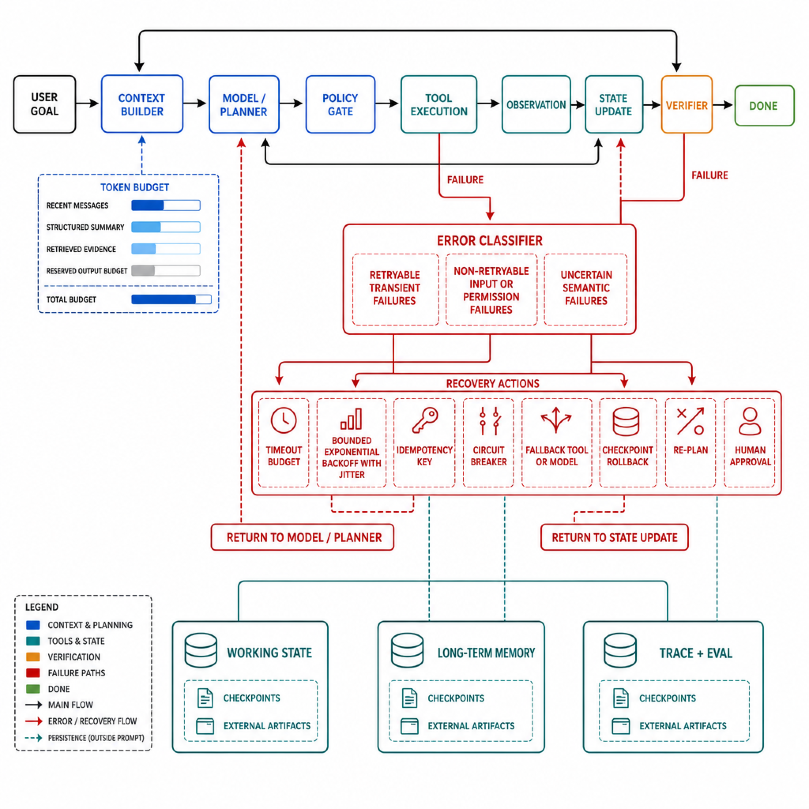

# 影石创新高频面试题

> 用于持续沉淀影石创新 AI、Agent、影像智能与软件工程相关面试题。

## 目录
- [影石创新AI Agent一面面经](#insta360-agent-20260809)
  - [1.简单介绍一下自己的经历，以及为什么选择AI Agent方向？](#insta360-agent-20260809-q1)
  - [2.平时开发过程中主要使用哪些AI Coding工具？比如Claude Code这类工具，通常有哪些使用习惯？](#insta360-agent-20260809-q2)
  - [3.如何理解Spec Coding和Harness？你认为Harness为什么能够提升Agent完成复杂任务的能力？](#insta360-agent-20260809-q3)
  - [4.如果让你从零开始设计一个Agent系统，你认为需要包含哪些关键模块？](#insta360-agent-20260809-q4)
  - [5.Agent在执行任务时，如果调用外部工具或API出现超时、异常等情况，一般应该如何设计容错机制？](#insta360-agent-20260809-q5)
  - [6.是否考虑过让大模型参与错误分析和自动恢复？这种方案有什么优缺点？](#insta360-agent-20260809-q6)
  - [7.Agent中的短期记忆和长期记忆分别有什么作用？通常会如何实现？](#insta360-agent-20260809-q7)
  - [8.在Agent开发过程中，上下文为什么需要进行压缩？压缩后可能导致信息缺失，应该如何解决？](#insta360-agent-20260809-q8)
  - [9.Prompt优化除了添加规则约束之外，还有哪些常见的方法？你在实际使用中有哪些经验？](#insta360-agent-20260809-q9)
  - [10.当模型出现幻觉问题时，一般有哪些解决思路？](#insta360-agent-20260809-q10)
  - [11.如果Token消耗突然增加，你会如何定位原因并进行优化？](#insta360-agent-20260809-q11)
  - [12.你有没有设计过Agent Skill？一个Skill从设计到上线通常需要考虑哪些因素？如何判断效果好坏？](#insta360-agent-20260809-q12)
  - [13.介绍一下之前做过的相关项目，这个项目是完全自主开发，还是基于已有开源方案进行改造？](#insta360-agent-20260809-q13)
  - [14.在项目过程中遇到过哪些比较困难的问题？你主要负责哪些部分？最后取得了什么结果？](#insta360-agent-20260809-q14)
  - [15.Java线程池的核心参数有哪些？线程提交任务后的执行流程是怎样的？](#insta360-agent-20260809-q15)
  - [16.如果让你重新设计一个线程池，你会重点考虑哪些问题？](#insta360-agent-20260809-q16)
  - [17.JVM加载一个class文件的完整过程是什么？](#insta360-agent-20260809-q17)
  - [18.MySQL中的undo log、redo log和binlog分别解决什么问题？它们之间有什么区别？](#insta360-agent-20260809-q18)
  - [19.什么是MySQL两阶段提交？为什么需要这个机制？](#insta360-agent-20260809-q19)
  - [20.算法题：合并两个有序数组](#insta360-agent-20260809-q20)
  - [21.反问环节](#insta360-agent-20260809-q21)

<a id="insta360-agent-20260809"></a>
### 影石创新AI Agent一面面经

#### 一面

<a id="insta360-agent-20260809-q1"></a>
##### 1.简单介绍一下自己的经历，以及为什么选择AI Agent方向？

**回答：**

这道题不能背一段与简历脱节的模板。高质量回答应在 60～90 秒内形成“经历主线 -> 能力证据 -> 方向选择 -> 岗位匹配”的闭环。

可以按下面的结构组织，但必须替换成自己的真实信息：

1. **一句话定位。** 说明学历或工作年限、主技术栈，以及当前最能代表自己的方向。例如：“我主要做 Java 后端与大模型应用工程，最近一段经历集中在检索增强和工具型 Agent。”
2. **选择两段最相关的证据。** 不按时间流水账复述简历，而是讲清“业务问题、个人职责、关键机制、验证结果”。如果项目只做到离线验证，就明确说离线指标；不要把课程项目包装成生产系统。
3. **解释为什么是 Agent。** 有说服力的原因通常是：传统后端擅长确定性流程和系统可靠性，LLM 擅长理解非结构化意图与动态决策，Agent 工程的价值在于用 Harness 把模型、工具、状态和验证组织起来，完成仅靠单次生成无法完成的长链任务。
4. **落到岗位。** 说明自己能带来的具体能力，例如工具/API 设计、状态机、检索与记忆、Java 并发、可观测性、评测和故障恢复，而不是只说“看好 AI 前景”。

一个可直接改写的结尾是：“我选择 AI Agent，并不是因为它是新名词，而是因为它把模型能力与真实软件系统连接起来。我的后端工程经验能解决权限、状态、并发和可靠性问题，已有的大模型项目经验又让我理解上下文、工具调用和评测，因此这个方向与我的能力积累是连续的。”

<a id="insta360-agent-20260809-q2"></a>
##### 2.平时开发过程中主要使用哪些AI Coding工具？比如Claude Code这类工具，通常有哪些使用习惯？

**回答：**

回答时不必罗列产品，重点是说明自己如何把 AI Coding 纳入可验证的软件工程流程。工具可以按真实使用情况举例，例如 Claude Code、Codex、Cursor、GitHub Copilot 或 IDE 内置助手，但不要声称使用过自己没有实际接触的产品。

我的习惯会分成五步：

1. **先给契约。** 明确目标、输入输出、现有模块、非目标、性能/兼容约束和验收命令；复杂任务先写 Spec 或让模型复述需求，确认理解一致。
2. **先读仓库再改代码。** 要求 Agent 检查目录、接口、调用链、测试和项目规范，先提交改动计划。避免在不了解上下文时直接生成整块实现。
3. **控制改动粒度。** 一次只处理一个可验证任务，优先小 diff；核心权限、资金、数据一致性和并发逻辑由人主导，模型负责候选实现、测试补全和重复劳动。
4. **让工具闭环。** 允许 Agent 搜索代码、运行编译、lint、单测和集成测试，但设置目录、网络、命令与写操作权限；所有外部副作用都要确认。
5. **最终审查证据。** 我会看 Git diff、失败日志、测试结果、依赖变化、异常路径和资源释放，不以模型说“完成了”作为完成标准。

AI Coding 的本质不是替人打字，而是缩短“意图 -> 代码候选 -> 自动验证 -> 可审查变更”的闭环。真正成熟的习惯是让模型获得刚好足够的上下文与工具，同时让测试、权限和版本控制保留最终决定权。

<a id="insta360-agent-20260809-q3"></a>
##### 3.如何理解Spec Coding和Harness？你认为Harness为什么能够提升Agent完成复杂任务的能力？

**回答：**

**Spec Coding** 是先把模糊意图沉淀为可执行、可验证的规格，再由人和 Agent 围绕规格实现。Spec 不只是需求文档，至少应包含目标、非目标、接口与数据契约、不变量、边界场景、验收测试和风险约束。它解决的是“要做对什么”。

**Harness** 是模型外部的运行与治理环境，负责上下文组装、工具发现、权限、执行沙箱、任务状态、checkpoint、超时重试、验证、trace、成本预算和人工接管。它解决的是“模型如何在真实环境中持续行动，并且让每一步可控、可恢复、可评估”。模型是概率决策内核，Harness 更接近 Agent 的运行时与控制系统。

二者的关系是：Spec 为任务提供目标函数和验收条件，Harness 把这些条件落实为运行约束和反馈。复杂任务之所以受益于 Harness，主要有五个原因：

- 把大目标拆成有状态的多步循环，模型每次只基于当前状态选择下一动作；
- 将代码搜索、编译、测试、浏览器或业务 API 的真实结果反馈给模型，减少纯语言猜测；
- 用权限、schema、状态机和预算约束动作空间，降低越权、死循环和无效调用；
- 通过 checkpoint、幂等、重试和回滚，让长任务能从局部失败恢复；
- 记录完整轨迹并用最终状态、测试、安全和成本判分，支持回归优化。

因此，同一个模型放进不同 Harness，复杂任务成功率可能差很多。Rocky认为，Spec 决定“终点和护栏”，Harness 决定“道路、仪表盘和故障恢复”；二者共同把一次性代码生成升级为可交付的软件工程。

<a id="insta360-agent-20260809-q4"></a>
##### 4.如果让你从零开始设计一个Agent系统，你认为需要包含哪些关键模块？

**回答：**

我会先问清任务是否真的需要 Agent。固定、低风险、步骤确定的业务优先使用 Workflow；只有任务路径依赖动态观察、工具反馈或开放环境时，才引入 Agent 决策循环。

从零设计时可以分成八层：

1. **接入与身份层：** 用户、租户、会话、鉴权、配额、输入校验和风险等级。
2. **任务与状态层：** 目标、计划、已完成步骤、待办、artifact 引用、checkpoint 和终止条件。状态应外置，不能只存在模型上下文里。
3. **Context Builder：** 组装系统规则、当前工作状态、近期对话、按需长期记忆、RAG 证据和候选工具，并管理 Token 预算。
4. **模型与编排层：** 意图路由、规划、结构化输出、模型选择、Workflow/状态机/Agent loop，以及最大步数和重规划策略。
5. **工具层：** 工具注册、JSON Schema、权限、超时、幂等、速率限制、结果裁剪、沙箱与副作用确认。
6. **知识与记忆层：** 文档检索、用户/项目长期记忆、事件日志、写入门控、冲突更新、过期与删除。
7. **可靠性与安全层：** 验证器、重试/熔断/降级、回滚、人工审批、Prompt Injection 防护、密钥隔离和审计。
8. **可观测与评测层：** trace、模型/Prompt/工具版本、Token、延迟、任务成功率、工具正确率、恢复率、安全违规率和回归门禁。

运行时可以抽象为：

$$
s_t \xrightarrow{\pi_\theta(\cdot\mid c_t)} a_t
\xrightarrow{\text{tool/env}} o_{t+1}
\xrightarrow{\text{validate/update}} s_{t+1}
$$

其中 $c_t$ 是 Context Builder 从完整状态中投影出的当前上下文。终止不能只靠模型输出“完成”，还要检查任务目标、业务状态、测试或验证器。架构的关键不是模块越多越好，而是每个概率决策后都有外部证据，每个副作用前都有确定性约束，每个长任务都有可恢复状态。

<a id="insta360-agent-20260809-q5"></a>
##### 5.Agent在执行任务时，如果调用外部工具或API出现超时、异常等情况，一般应该如何设计容错机制？

**回答：**

容错的第一步不是重试，而是**分类**。至少区分瞬时故障（超时、限流、5xx）、永久故障（参数错误、权限不足、资源不存在）、业务冲突（状态已变化）、响应不确定（请求可能已执行但客户端没收到结果）和语义失败（工具成功返回，但结果不满足任务）。不同类型不能使用同一策略。

工程上我会这样设计：

- 为整项任务设置总 deadline，再向每次模型和工具调用分配子预算，防止局部重试耗尽全局时间；
- 只对明确可重试错误采用**有上限的指数退避加 jitter**，尊重服务端 `Retry-After`；
- 写操作使用幂等键、业务唯一约束或状态机 CAS；结果不确定时先查询状态，不能直接重放副作用；
- 连续失败触发熔断，半开探测后恢复；必要时切换备用工具、模型或降级路径；
- 每一步执行前后写 checkpoint，记录输入、工具版本、调用 ID、状态差异和 artifact，支持恢复、补偿或人工接管；
- 参数错误、权限不足等永久故障不自动重试，而是回到模型重规划、向用户补充信息或请求授权；
- 对不可逆、高风险动作设置人工确认，恢复逻辑本身也要经过权限与安全校验。



评测不能只看“最终成功”。还要看恢复成功率、重复副作用率、平均重试次数、P95/P99 延迟、熔断次数和人工接管率，并通过工具超时、429、5xx、脏响应、重复回包和状态库故障做故障注入。容错的目标不是隐藏错误，而是把错误转化为可分类、可限制、可恢复的状态迁移。

<a id="insta360-agent-20260809-q6"></a>
##### 6.是否考虑过让大模型参与错误分析和自动恢复？这种方案有什么优缺点？

**回答：**

可以，但应该采用“**确定性控制面 + 模型语义诊断**”，不能让模型既当故障分析者又无条件执行自己的恢复方案。

适合让大模型参与的环节包括：从非结构化日志和工具返回中提取错误摘要；结合当前目标、调用轨迹和文档判断可能原因；生成候选修复步骤；在工具能力变化时做重规划；把复杂故障解释给用户或值班人员。它的优势是能处理长日志、异构错误和没有完整错误码的长尾语义问题，比固定规则覆盖面更广。

风险也很明确：模型可能误诊、忽略关键上下文、生成不存在的参数；恢复 Prompt 和日志可能包含注入内容；多次自我修复会形成循环并增加 Token 与延迟；模型若能直接调用高权限工具，还可能扩大故障半径。

因此我会设置以下边界：

1. 错误码分类、重试次数、deadline、权限、幂等、熔断和回滚由代码控制。
2. 模型只输出符合 schema 的诊断与候选动作，执行前由 policy engine 和 precondition 校验。
3. 低风险、可逆、可验证操作可自动执行；数据删除、付款、发布等高风险操作必须人工审批。
4. 每次恢复后运行独立验证器；连续失败、置信不足或预算耗尽时停止并升级人工。
5. 在离线 Harness 中回放真实故障，评估恢复成功率、误恢复率、重复副作用和平均恢复成本。

一句话总结：大模型适合扩大错误理解和重规划能力，确定性系统负责限制它能做什么。自动恢复的上限由可验证性决定，而不是由模型“看起来多聪明”决定。

<a id="insta360-agent-20260809-q7"></a>
##### 7.Agent中的短期记忆和长期记忆分别有什么作用？通常会如何实现？

**回答：**

短期记忆服务于**当前任务连续性**，长期记忆服务于**跨会话复用**。划分标准不是存储介质，而是生命周期、作用域和是否值得在未来任务中继续使用。

| 类型 | 典型内容 | 生命周期 | 常见实现 |
| --- | --- | --- | --- |
| 短期/工作记忆 | 当前目标、计划、最近对话、已完成步骤、工具结果、待确认事项 | 一次任务或会话 | Workflow state、Redis/数据库会话表、checkpoint、近期窗口与结构化摘要 |
| 长期记忆 | 稳定偏好、身份事实、项目约定、历史决策、经过验证的经验 | 跨会话 | 关系数据库/画像表、事件日志、向量或全文索引；按用户、租户、项目隔离 |

短期状态应以结构化字段为主，Prompt 只是状态的一个投影视图。长任务中保留原始事件和 artifact 引用，在阶段边界生成摘要；即使上下文压缩，任务状态仍能恢复。KV Cache 是推理加速状态，不等于 Agent Memory。

长期记忆需要完整生命周期：候选提取 -> 重要性与敏感性过滤 -> 结构化写入 -> 按需检索 -> 冲突更新 -> 衰减/过期/删除。每条记忆应带 `scope`、来源、时间、置信度、有效期和权限。当前用户明确指令优先于旧偏好，业务主库实时状态优先于历史摘要，模型推断不能覆盖用户明确事实。

不是每轮都注入全部记忆。Context Builder 只召回与当前目标相关且通过权限、时效和冲突检查的少量内容。好的 Memory 系统不是“记得越多越好”，而是能在正确的任务、正确的时间，以可追溯的方式取回正确状态。

<a id="insta360-agent-20260809-q8"></a>
##### 8.在Agent开发过程中，上下文为什么需要进行压缩？压缩后可能导致信息缺失，应该如何解决？

**回答：**

上下文压缩不仅因为窗口有限，还因为长上下文会增加成本与延迟、稀释注意力，并让重复日志、过期状态和失败轨迹干扰当前决策。增长最快的内容往往是工具 schema、搜索结果、代码和日志，而不只是聊天轮数。

一次调用的预算可以写成：

$$
B_{\text{system}}+B_{\text{tools}}+B_{\text{state}}+
B_{\text{history}}+B_{\text{retrieval}}+B_{\text{query}}+
B_{\text{reserved output}} \le B_{\text{window}}
$$

解决信息缺失的关键不是写一个更长的摘要，而是采用“**分层状态 + 可逆引用 + 按需展开**”：

- 系统规则、权限、当前目标、硬约束和输出契约固定保留，不交给有损摘要决定；
- 最近交互和未完成步骤保留原文，已完成阶段压缩为 `goal / decisions / completed / open / artifacts / risks` 等结构化字段；
- 原始消息、工具结果和大文件保存在外部事件/对象存储中，摘要记录事件 ID 与 artifact 句柄，需要时精确回读；
- 对关键实体、数字、否定条件、截止时间和审批状态做确定性抽取与一致性校验；
- 按 Token 软水位、阶段完成、工具返回突增或目标切换触发压缩，不按固定轮数机械总结；
- 使用“增量摘要 + 周期性从原始事件重建”，避免摘要的摘要不断累积误差。

评测应构造必须依赖早期约束的长任务，比较简单截断、滑动窗口、结构化摘要和检索式压缩的任务成功率、关键信息保留率、Token、延迟与恢复能力。Rocky认为，上下文压缩的本质不是删字，而是把不可管理的对话流水升级为可恢复、可验证的任务状态。

<a id="insta360-agent-20260809-q9"></a>
##### 9.Prompt优化除了添加规则约束之外，还有哪些常见的方法？你在实际使用中有哪些经验？

**回答：**

Prompt 优化不应等同于不断追加“必须、不要、严禁”。规则越多越可能互相冲突，也会抬高 Token 成本。更有效的方法包括：

1. **重写任务定义。** 明确目标、受众、输入边界、成功标准和非目标，减少模型猜测。
2. **提供输出契约。** 使用 JSON Schema、字段类型、枚举、单位和失败语义；机器消费场景优先约束解码与解析校验，而不是只靠自然语言格式要求。
3. **选择高质量示例。** Few-shot 覆盖正常、边界、拒答和反例；示例应解释判定边界，不能只堆同质样本。
4. **分解任务。** 将抽取、检索、判断、生成和核验拆成可独立验证的阶段；稳定步骤用 Workflow，开放步骤再交给 Agent。
5. **优化上下文。** 去重、排序、标注来源与时间，检索真正相关的证据；很多所谓 Prompt 问题，本质是上下文缺失或污染。
6. **加入工具和验证器。** 对事实、计算、权限和业务状态调用真实工具；生成后用规则、单测、引用校验或独立评估器检查。
7. **做模型和参数适配。** 根据任务选择模型、温度、最大输出和推理预算；高随机性创作和低随机性结构化抽取不能使用同一配置。

我的实践是先建立 30～100 条代表性样本和错误分类，再做单变量迭代：记录 Prompt/模型/工具版本，比较任务成功率、结构化解析率、事实忠实度、Token 和延迟。线上 bad case 必须回流到回归集。没有固定评测集时，Prompt “变长了”通常只意味着更难维护，并不能证明更好。

<a id="insta360-agent-20260809-q10"></a>
##### 10.当模型出现幻觉问题时，一般有哪些解决思路？

**回答：**

幻觉的本质是模型按条件概率生成合理 Token，而不是从一个自带真实性保证的数据库读取答案。治理前应先分类：知识事实幻觉、引用不忠实、工具调用幻觉、结构化输出错误和执行状态幻觉，不能用同一个 Prompt 处理。

完整方案通常分五层：

- **知识层：** 对私域或时效知识使用 RAG、搜索或权威业务 API，保留来源、版本和时间；证据不足时允许拒答。
- **检索层：** 做查询改写、混合召回、metadata/权限过滤、Rerank、去重和冲突检测。召回错误会把模型变成“忠实地回答错误证据”。
- **生成层：** 要求区分证据、推断和未知；逐项引用；结构化任务使用 schema 或 constrained decoding，降低自由生成空间。
- **验证层：** 将答案拆成原子事实，用规则、数据库、第二次检索、NLI 或独立 Judge 核验；高风险动作由确定性规则或人工批准。
- **系统层：** 工具白名单、参数校验、状态回读、最大步数、权限和审计，防止文本幻觉转化为真实副作用。

评测至少分开看 answer correctness、faithfulness、citation correctness/completeness、拒答准确率、工具选择与参数正确率。微调可以改善领域表达、格式和行为偏好，但不能自动赋予实时事实，也不能替代外部证据。真正可靠的系统不是强迫模型每次回答，而是有证据时回答、证据不足时明确不确定、执行动作前重新验证真实状态。

<a id="insta360-agent-20260809-q11"></a>
##### 11.如果Token消耗突然增加，你会如何定位原因并进行优化？

**回答：**

先把 Token 当作可观测资源，而不是凭感觉“缩短 Prompt”。我会按 `trace_id / user / task / model / prompt_version / tool / step` 记录输入、缓存命中、推理、输出和工具相关 Token，并与请求量、任务成功率、延迟和费用一起看。

定位顺序如下：

1. **确认增长构成。** 是单请求 Token 增加、请求量增加、Agent 步数增加，还是模型价格/计费口径变化；区分 input、cached input、reasoning 和 output。
2. **比较版本差异。** 检查最近的 Prompt、工具 schema、RAG Top-K、记忆注入、摘要策略、模型路由和重试配置。
3. **查看轨迹分布。** 统计消息类别占比、工具定义长度、检索片段长度、工具返回体、无效步骤数、循环率、重试率和上下文压缩触发率。
4. **定位异常样本。** 对 P95/P99 Token 的任务回放，常见根因是全量工具 schema、重复历史、检索重复、大日志未裁剪、模型陷入循环、失败重试重新携带全部上下文或摘要失效。

优化时先减少无效信息：工具渐进披露、按意图加载 schema；RAG 去重并按 token budget 截断；大文件和日志外置，只传摘要与句柄；长期记忆按需召回；长任务按阶段 checkpoint；设置最大步骤、总 Token 和重试预算。稳定前缀可使用 Prompt caching，简单路由/抽取可切换小模型。

但不能只追求 Token 下降。每项优化都要比较任务成功率、关键信息保留率、P95 延迟和单位成功任务成本：

$$
\text{Cost per Success}=\frac{\text{Total Model Cost}}{\text{Successful Tasks}}
$$

如果 Token 降低 30% 却让重试和人工接管翻倍，它不是有效优化。

<a id="insta360-agent-20260809-q12"></a>
##### 12.你有没有设计过Agent Skill？一个Skill从设计到上线通常需要考虑哪些因素？如何判断效果好坏？

**回答：**

如果真实项目中没有从零设计过 Skill，应该坦诚说明，并讲清自己做过的最接近工作和完整设计方案。Skill 可以理解为围绕一类任务封装的可发现、可执行、可验证能力包，通常包含元数据、触发条件、工作流指令、脚本/模板/资源以及验收规则。它不等于 Tool：Tool 暴露原子动作，Skill 组织“何时、按什么步骤、调用哪些动作、如何验收”。

从设计到上线我会关注七个方面：

1. **任务边界：** 解决什么、不解决什么，输入输出与前置条件是什么；边界过宽会让触发和评测失真。
2. **可发现性：** 名称、描述、触发样本和反例是否让路由器正确选中；详细资料采用渐进式加载，避免每轮灌入全部内容。
3. **执行契约：** 步骤、分支、停止条件、失败兜底、工具 schema、幂等性和 artifact 规范。
4. **安全权限：** 最小权限、密钥隔离、敏感数据处理、写操作确认、沙箱和审计。
5. **可维护性：** 版本、依赖、兼容范围、Owner、变更日志、弃用策略以及与其他 Skill 的组合/冲突。
6. **测试评测：** 正常、边界、歧义、恶意输入、工具异常和版本回归；上线前在隔离环境运行。
7. **发布运营：** 灰度、监控、回滚、失败样本回流和文档同步。

效果要分层判断：路由层看 Skill 触发 precision/recall 和误触发率；执行层看任务成功率、工具参数正确率、平均步骤、恢复率和副作用；效率层看 Token、延迟、成本和人工介入率；安全层看越权和敏感信息事件。还应与“无 Skill 基线”做 A/B 或离线配对回放。一个 Skill 的价值不在于文档写得多，而在于它能否稳定提高单位成本下的任务完成质量。

<a id="insta360-agent-20260809-q13"></a>
##### 13.介绍一下之前做过的相关项目，这个项目是完全自主开发，还是基于已有开源方案进行改造？

**回答：**

这道题必须按真实项目回答，不能套用不存在的项目或指标。建议使用“问题 -> 架构 -> 个人贡献 -> 开源边界 -> 验证结果”的结构。

先用一句话定义项目，例如：“这是一个面向内部技术文档与研发流程的 Agent，目标是让用户通过自然语言完成检索、分析和受控工具操作。”然后讲核心链路：请求经过鉴权和任务路由，Context Builder 组装工作状态、RAG 证据与候选工具，模型输出结构化动作，工具层执行并写回 Observation，验证器判断完成、重试或人工接管。

接着把“自主开发”和“开源改造”拆到模块级，而不是二选一：

- 可以基于成熟模型 SDK、向量库、编排框架或开源检索组件；
- 自主部分可能是业务工具、权限系统、状态/checkpoint、上下文组装、检索策略、评测集、容错与监控；
- 对开源项目做了哪些实质改造，要说清原因和代码边界，例如替换默认 Memory、增加租户隔离、实现幂等工具执行、接入内部鉴权或建立离线 Harness。

最后给证据：数据规模、评测集构成、任务成功率、检索 Recall@K、人工耗时、P95 延迟或单位成功成本。没有线上数据就说“目前做到离线/灰度”，并说明下一步验证。使用开源不是减分项；真正考察的是能否理解依赖边界、解释关键设计，并对最终行为负责。

<a id="insta360-agent-20260809-q14"></a>
##### 14.在项目过程中遇到过哪些比较困难的问题？你主要负责哪些部分？最后取得了什么结果？

**回答：**

不要回答“时间紧、沟通难”这种无法体现技术判断的泛化困难。应选择一个自己真正主导、能解释根因和权衡的 bad case，并使用“现象 -> 证据 -> 根因 -> 方案 -> 对照结果 -> 剩余边界”的结构。

例如可以讲工具重复执行问题，但前提是项目中确实发生过：Agent 调用写 API 超时后自动重试，服务端其实已经完成操作，造成重复副作用。排查时通过 trace 将模型动作、request ID、服务端日志和业务状态对齐，确认根因不是模型“幻觉”，而是客户端不知道第一次调用结果、写接口又缺少幂等契约。

如果由自己负责，可以说明具体工作：为任务建立全局 deadline；给写工具增加 `idempotency_key` 和业务唯一约束；把错误分成可重试、永久和结果不确定；结果不确定时先查询状态；在关键步骤写 checkpoint；补充超时、重复回包和服务重启的故障注入测试。结果必须使用真实数据，例如重复操作由多少降到多少、恢复率提升多少、P95 延迟增加多少。没有精确指标时可以陈述“在 N 条回归样本中不再复现”，不要编造百分比。

面试官还会追问为什么不用消息队列、事务或简单重试，所以要说明适用边界和代价。好的项目回答不只证明“问题解决了”，还证明候选人知道问题为什么发生、自己的责任边界在哪里，以及方案在哪些条件下仍可能失败。

<a id="insta360-agent-20260809-q15"></a>
##### 15.Java线程池的核心参数有哪些？线程提交任务后的执行流程是怎样的？

**回答：**

`ThreadPoolExecutor` 的构造函数有七个核心参数：

| 参数 | 作用 |
| --- | --- |
| `corePoolSize` | 核心工作线程数；默认也按需创建，可用 `prestart...` 预启动 |
| `maximumPoolSize` | 工作线程数上限 |
| `keepAliveTime` | 超出核心数的空闲线程存活时间；允许时也可作用于核心线程 |
| `unit` | 存活时间单位 |
| `workQueue` | 等待执行任务的阻塞队列 |
| `threadFactory` | 创建线程，设置命名、优先级、异常处理等 |
| `handler` | 线程数与队列都饱和时的拒绝策略 |

`execute(command)` 的主流程是：

1. 当前工作线程数小于 `corePoolSize` 时，尝试创建核心 worker 并直接把任务作为该 worker 的首个任务。
2. 否则，若线程池仍处于 `RUNNING`，尝试将任务放入 `workQueue`。
3. 入队成功后要**二次检查**线程池状态：若此时已关闭，则尝试移除并拒绝；若没有任何 worker，则补一个空任务 worker 来消费队列。
4. 若入队失败，再尝试创建非核心 worker；只有总 worker 数小于 `maximumPoolSize` 且状态允许时才成功。
5. 创建失败则执行 `RejectedExecutionHandler`。

这说明执行顺序是“核心线程 -> 队列 -> 非核心线程 -> 拒绝”，并不是先把线程扩到最大。队列类型会改变行为：无界队列通常使 `maximumPoolSize` 失去扩容作用；`SynchronousQueue` 不存任务，倾向直接交接并快速扩线程；有界队列能提供背压，但需要结合拒绝策略设计。

还应理解线程池状态 `RUNNING -> SHUTDOWN/STOP -> TIDYING -> TERMINATED`。`shutdown()` 不再接收新任务但会处理队列，`shutdownNow()` 尝试中断 worker 并返回未开始任务；中断是协作机制，任务必须正确响应。

<a id="insta360-agent-20260809-q16"></a>
##### 16.如果让你重新设计一个线程池，你会重点考虑哪些问题？

**回答：**

重新设计线程池时，我不会先拍脑袋选线程数，而是从工作负载、队列、生命周期和可观测性四个方面建立契约。

1. **工作负载隔离。** CPU 密集、阻塞 I/O、长任务、短任务和高优先级任务不应混用同一池，否则会头阻塞。CPU 密集型线程数通常接近可用核数；I/O 型要根据等待/计算比和下游容量估算，并用压测校准。
2. **有界资源与背压。** 队列必须有容量与等待时限，任务带 deadline；拒绝策略应与业务语义一致，例如快速失败、调用方执行、降级或持久化，不能默认静默丢弃。
3. **公平与调度。** 选择 FIFO、优先级、按租户配额或 work stealing；使用优先级时防止低优先级饥饿。不同租户需要并发隔离和配额。
4. **任务语义。** 明确取消、中断、超时、幂等、重试和异常传播。线程池不应自动重试非幂等任务，也不能吞掉 `Future` 中的异常。
5. **线程管理。** 可配置命名、上下文传播、清理 ThreadLocal、未捕获异常处理和优雅关闭；防止类加载器和 ThreadLocal 泄漏。
6. **动态与稳定性。** 动态调整核心数/上限需基于队列时延、利用率和下游反馈，并设置滞回，避免频繁抖动；下游限流优先于盲目扩线程。
7. **可观测性。** 监控 active/pool/queue size、提交/完成/拒绝数、队列等待时间、执行时间、超时与异常，并按任务类型打标签。

验收时要做突发流量、慢下游、任务异常、取消、关闭和内存压力测试。线程池的目标不是“让所有任务尽快进来”，而是在有限 CPU、内存和下游容量下维持可预测的延迟与失败语义。

<a id="insta360-agent-20260809-q17"></a>
##### 17.JVM加载一个class文件的完整过程是什么？

**回答：**

JVM 对类的生命周期通常描述为：**加载（Loading）-> 链接（Linking：验证、准备、解析）-> 初始化（Initialization）-> 使用 -> 卸载**。其中解析在规范允许的范围内可以延迟执行，所以不要把所有实现细节说成绝对同步顺序。

1. **加载：** 类加载器根据二进制名定位字节流，JVM 解析 class 文件并在方法区/元空间建立运行时表示，同时创建对应的 `java.lang.Class` 对象。来源可以是文件、JAR、网络或运行时生成的字节码。
2. **验证：** 检查文件格式、元数据、字节码和符号引用是否合法，保证类型安全与控制流约束。验证通过不代表业务代码安全。
3. **准备：** 为类的 `static` 字段分配存储并设置 JVM 规定的默认值；带 `ConstantValue` 属性的编译期常量可在该阶段赋值。普通静态赋值语句不是在这里执行。
4. **解析：** 将运行时常量池中的符号引用转换为直接引用，涉及类/接口、字段、方法、方法句柄等；可以采用惰性解析。
5. **初始化：** 执行类初始化方法 `<clinit>`，其内容由静态字段赋值和静态代码块按源码顺序合并。JVM 保证同一个类加载器定义的类只初始化一次，并进行同步；初始化子类前先初始化父类，但接口初始化规则不同。

主动使用通常包括 `new`、访问非编译期常量静态字段、调用静态方法、反射和初始化子类等；仅引用编译期常量或创建该类型数组通常不会触发初始化。

类身份由“二进制类名 + 定义它的类加载器”共同决定。常见父级委派用于避免核心类被重复定义，但模块化、插件、容器会使用更复杂的委派策略。类卸载通常要求其定义类加载器不可达且相关类对象不再可达，实际何时回收由 JVM 决定。

<a id="insta360-agent-20260809-q18"></a>
##### 18.MySQL中的undo log、redo log和binlog分别解决什么问题？它们之间有什么区别？

**回答：**

三者都叫日志，但层次、内容和用途不同：

| 日志 | 所属层次 | 核心作用 | 典型内容与生命周期 |
| --- | --- | --- | --- |
| `undo log` | InnoDB | 事务回滚与 MVCC 旧版本读取 | 记录足以恢复旧值的信息；版本不再被活跃 ReadView 需要后由 purge 清理 |
| `redo log` | InnoDB | WAL 与崩溃恢复，保证已提交修改可重做 | 物理/页级的重做信息；循环或归档式管理，写入 log buffer 后按策略刷盘 |
| `binlog` | MySQL Server 层 | 复制、基于时间点恢复、审计/CDC | 记录逻辑变更事件，按文件追加和轮转，支持 statement/row/mixed 等格式 |

更新一行时，InnoDB 会生成 undo 以保留旧版本，在 buffer pool 修改数据页并产生 redo；数据页可以稍后刷盘，因为 redo 先行持久化后能在崩溃时重放。事务提交还会写 binlog，使副本和增量恢复能够重现逻辑变更。

需要纠正常见简化：原子性不能只归结为 undo，持久性也不能只看 redo。事务正确性由 undo、redo、锁/MVCC、刷盘策略、约束和恢复协议共同实现。`innodb_flush_log_at_trx_commit` 与 `sync_binlog` 的配置会影响掉电时的持久性边界。

redo 与 binlog 的差异最关键：redo 是 InnoDB 自己的恢复日志，关注数据页如何恢复；binlog 是 Server 层的逻辑变更序列，关注如何复制或重放事务。为了避免二者在崩溃后一个有事务、另一个没有，MySQL 使用内部两阶段提交协调它们。

<a id="insta360-agent-20260809-q19"></a>
##### 19.什么是MySQL两阶段提交？为什么需要这个机制？

**回答：**

这里的“两阶段提交”通常指 MySQL Server 层 binlog 与 InnoDB redo log 之间的内部提交协调，不应直接等同于跨多个业务数据库的 XA 两阶段提交。

简化流程如下：

1. InnoDB 完成事务修改，将对应 redo 写成 `prepare` 状态，并按持久化策略刷盘。
2. Server 层把事务事件写入 binlog，并按 `sync_binlog` 策略持久化。
3. binlog 成功后，InnoDB 把 redo 中的事务标记为 `commit`。最后这个提交标记即使因崩溃没有及时刷盘，也可以在恢复时依据 binlog 判定。

为什么需要它？如果简单按顺序写两个独立日志，中间宕机会产生不一致：redo 已提交但 binlog 没有，主库恢复后有这笔数据，副本和时间点恢复却看不到；binlog 已写但 redo 未提交，则副本可能重放一笔主库恢复后不存在的事务。

崩溃恢复时，InnoDB 对明确 commit 的事务提交，对未 prepare 完成的事务回滚；对处于 prepare 的事务，MySQL 根据该事务的 XID 是否存在于完整 binlog 中决定提交还是回滚。这样把 binlog 是否完整写入作为最终提交依据，使存储引擎恢复状态与复制日志保持一致。

工程边界还受刷盘配置和硬件保证影响：`innodb_flush_log_at_trx_commit=1` 与 `sync_binlog=1` 提供最强的每事务持久化语义，但会增加 fsync 成本；组提交可合并多事务刷盘以提高吞吐。两阶段提交解决的是两个日志的一致性，不替代业务层跨服务分布式事务。

<a id="insta360-agent-20260809-q20"></a>
##### 20.算法题：合并两个有序数组

**回答：**

题目未给出函数签名时要先确认：是生成新数组，还是类似 LeetCode 88，要求把 `nums2` 原地合并到尾部预留了空间的 `nums1`。下面按常见的原地版本回答。

如果从前向后写，`nums1` 中尚未比较的元素会被覆盖。正确做法是从两个有效区间的末尾开始比较，把较大值写到 `nums1` 最后；这样写入位置始终位于未处理元素之后。

```java
public static void merge(int[] nums1, int m, int[] nums2, int n) {
    int i = m - 1;
    int j = n - 1;
    int write = m + n - 1;

    while (j >= 0) {
        if (i >= 0 && nums1[i] > nums2[j]) {
            nums1[write--] = nums1[i--];
        } else {
            nums1[write--] = nums2[j--];
        }
    }
}
```

循环只需要保证 `nums2` 尚有元素：如果 `nums1` 先用完，继续把 `nums2` 写入；如果 `nums2` 先用完，`nums1` 剩余元素本来就在正确位置。相等时选择任一侧都能得到有序结果；上面的写法先放 `nums2[j]`。

时间复杂度是 $O(m+n)$，额外空间是 $O(1)$。边界测试包括 `m=0`、`n=0`、全部元素来自一侧、重复值、负数，以及确认 `nums1.length >= m+n`。如果输入数组没有预留空间或要求不修改输入，则改为新建长度 $m+n$ 的数组并从前向后双指针合并，空间复杂度变为 $O(m+n)$。

<a id="insta360-agent-20260809-q21"></a>
##### 21.反问环节

**回答：**

反问不是礼貌性收尾，而是确认岗位真实问题、团队工程成熟度和候选人是否匹配。优先问面试官能基于亲身经验回答的问题，避免只问官网信息。

可以从下面选择 2～3 个：

- 这个岗位当前最核心的 Agent 场景是什么？成功标准更偏任务完成率、效率提升，还是新产品能力？
- 当前系统中最大的瓶颈更偏模型能力、上下文/检索、工具可靠性，还是评测数据？团队最近一次重要技术取舍是什么？
- Agent 与现有后端、算法和产品团队如何分工？新人入职后前三个月最可能负责哪一类模块？
- 团队如何做离线 Eval、线上 trace、灰度和回归门禁？线上 bad case 如何转化为评测样本？
- 对这个岗位而言，Java 后端能力与大模型应用能力的预期比例如何？优秀同学半年后通常能独立承担什么？
- 结合今天的交流，您认为我当前最需要补强的能力是什么？

不要一次问十个问题，也不要在技术面首先追问薪资、加班等更适合 HR 确认的事项。听完回答后可以基于其中一个细节追问，这比逐条念准备好的问题更能体现理解和判断。反问的目标不是“显得懂 Agent”，而是获得足够信息判断自己能否在这个团队解决真实问题。
