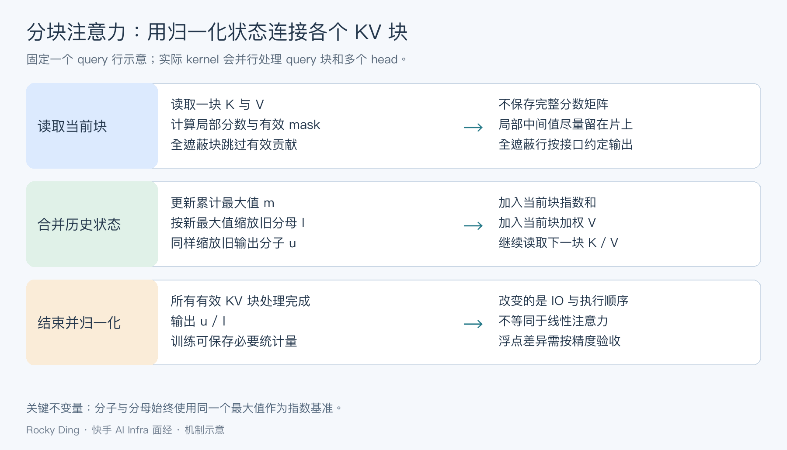
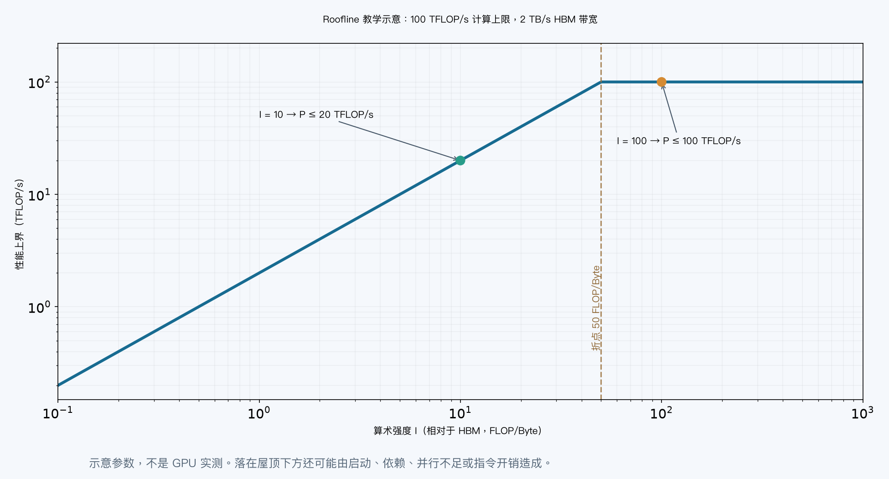
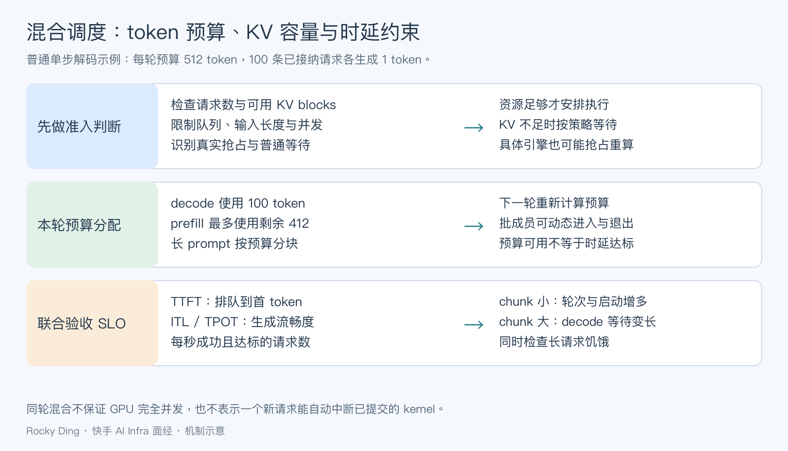
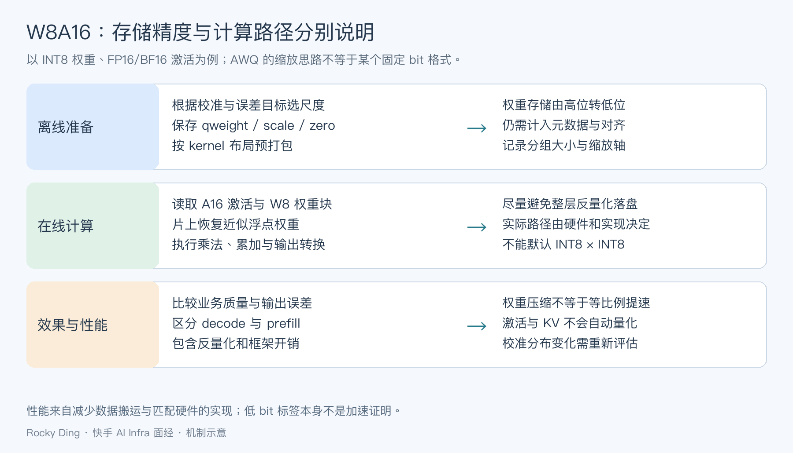

# 快手高频面试题

> 覆盖快手推荐、多模态、短视频理解、LLM 对齐和工程优化相关面试题。

## 已收录面试题

<h2 id="3.快手推荐算法面试题7道">3.快手推荐算法面试题7道</h2>

### 问题1：为什么 self-attention 可以堆叠多层，有什么作用？
   Self-attention 能够捕捉输入序列中的长距离依赖关系，通过堆叠多层 self-attention，模型可以学习序列中更深层次的模式和依赖关系。
   多层 self-attention 就像神经网络中的多个隐藏层一样，使模型能够学习和表示更复杂的函数。

### 问题2：多头有什么作用？如果想让不同头之间有交互，可以怎么做？
   多头注意力（Multi-head attention）的设计是为了让模型同时学习到输入序列的不同表示。每个“头”都有自己的参数，可以学习到不同的注意力分布，
   这样可以让模型同时关注不同的特征或信息。至于不同头之间的交互，这通常在所有头的输出被拼接和线性转换之后自然实现。如果你希望在这之前增加交互，
   你可能需要设计新的结构或者机制。

### 问题3：讲一讲多目标优化，MMoE 怎么设计？如果权重为 1,0,0 这样全部集中在某一个专家上该怎么办？
   多目标优化是指优化多个目标函数，通常需要在不同目标间找到一个权衡。多门专家混合网络（MMoE, Multi-gate Mixture-of-Experts）
   是一种处理多目标优化的方法，其中每个目标都由一个专家网络来处理，而门网络则决定每个专家对最终输出的贡献。如果权重全部集中在某一个专家上，
   那么模型的输出就完全由那个专家决定。这可能在某些情况下是合理的，但在大多数情况下，你可能希望各个专家都能对输出有所贡献，
   这需要通过训练和调整权重来实现。

### 问题4：介绍一下神经网络的优化器有哪些。
   常见的神经网络优化器有：
   - 梯度下降（GD）
   - 随机梯度下降（SGD）
   - 带动量的随机梯度下降（Momentum SGD）
   - Adagrad
   - RMSProp
   - Adam
   - Adadelta
   - Nadam 等

### 问题5：介绍一下推荐算法的链路流程。
   推荐系统通常包括以下步骤：
   - 数据收集（用户行为、物品信息等）
   - 特征工程
   - 模型选择和训练
   - 推荐列表生成
   - 排序等

### 问题6：介绍一下神经网络的初始化方法。
   常见的神经网络初始化方法有：
   - 零初始化（所有权重设为 0）
   - 随机初始化（权重随机设定，如高斯初始化或均匀分布初始化）
   - Xavier/Glorot 初始化（权重初始化为均值为 0，方差为 $\( \frac{1}{n} \)$ 的正态分布或均匀分布，其中 $\( n \)$ 为输入神经元的数量）
   - He 初始化（类似于 Xavier，但方差为 $\( \frac{2}{n} \)$，适用于 ReLU 激活函数）

### 问题7：讲一讲推荐算法序列建模的模型。
   推荐算法中的序列建模通常使用序列模型来捕捉用户行为的时间依赖性。常见的序列模型有：
   - RNN（如 LSTM 和 GRU）
   - 序列到序列模型（Seq2Seq）
   - 注意力模型（如 Transformer）
   - 预训练模型（如 BERT、GPT 等）

   这些模型可以处理用户行为序列，学习用户的历史行为对他们未来行为的影响，并据此进行推荐。

<h2 id="7.快手多模态算法岗面试题7道">7.快手多模态算法岗面试题7道</h2>

<h3 id="问题1：PPO 和 DPO 有什么区别？">问题1：PPO 和 DPO 有什么区别？</h3>

### PPO (Proximal Policy Optimization)
PPO 是一种强化学习算法，它通过策略优化方法实现稳定训练。PPO 的核心是限制策略更新的幅度，以避免策略的剧烈变化，从而减少策略崩溃的风险。
它通过剪裁损失函数，确保策略变化在一个较小的范围内。PPO 引入了近端目标函数，利用优势函数更新策略，以兼顾策略的探索和收敛。

### DPO (Direct Policy Optimization)
DPO 是一种较新的算法，旨在简化强化学习中的策略优化问题。它通过直接最小化目标函数来优化策略，而不是通过PPO的对数比率和剪裁损失函数。
DPO 采用了更直接的优化方式，简化了策略更新过程。

### 主要区别
- **策略更新**: PPO 通过限制策略变化幅度来实现稳定训练，而 DPO 直接优化目标函数。
- **稳定性和效率**: PPO 通常更稳定，但训练效率可能较低；DPO 更高效，但可能牺牲一些稳定性。

<h3 id="问题2：DPO训练可能遇到的问题">问题2：DPO训练可能遇到的问题</h3>

- **梯度爆炸或消失**: DPO 直接优化策略目标函数，可能导致策略更新过快或过剧，引发梯度爆炸或消失问题。
- **收敛性问题**: 缺少限制策略更新的机制，可能导致训练过程中的不稳定或策略崩溃。
- **探索与利用的平衡**: DPO 可能过早地利用已有策略，导致探索不足，从而无法找到全局最优解。

<h3 id="问题3：位置编码介绍及ROPE（相对位置编码）的优势">问题3：位置编码介绍及ROPE（相对位置编码）的优势</h3>

Transformer 需要位置编码以捕捉序列中的位置信息，因为其缺乏循环结构。位置编码分为：
- **绝对位置编码 (APE)**: 为每个位置赋予固定的唯一标识。
- **相对位置编码 (ROPE)**: 动态捕捉序列中的相对位置信息，提供更好的外推能力。在处理长度变化的序列时，ROPE 相比 APE 表现更优，
因其不依赖于绝对位置，能更好地处理序列中元素之间的相对关系。

<h3 id="问题4：Transformer 的结构整体介绍一下">问题4：Transformer 的结构整体介绍一下</h3>

Transformer 是一种基于自注意力机制的深度学习模型，广泛应用于自然语言处理任务中。其核心结构包括：

- **Encoder和Decoder**: Encoder 负责对输入序列进行编码，生成一组高维特征表示；Decoder 则根据这些表示和目标序列进行解码，生成最终输出。
- **多头自注意力机制 (Multi-Head Self-Attention)**: 通过多个注意力头并行处理序列数据，捕捉不同位置之间的依赖关系。
- **前馈神经网络 (Feed-Forward Network, FFN)**: 在注意力层后面，通过两层全连接网络对每个位置进行独立的非线性变换。
- **残差连接和LayerNorm**: 通过残差连接和LayerNorm，避免梯度消失问题，同时加快模型的收敛速度。

<h3 id="问题5：BatchNorm与LayerNorm的区别及Transformer的选择">问题5：BatchNorm与LayerNorm的区别及Transformer的选择</h3>

- **BatchNorm**: 主要用于卷积神经网络，通过标准化每个维度来减少内部协变量偏移。
- **LayerNorm**: 主要用于序列模型，如RNN和Transformer，对整个层进行标准化，独立于mini-batch。

<h3 id="问题6：PostNorm与PreNorm的优缺点">问题6：PostNorm与PreNorm的优缺点</h3>

- **PostNorm**: 在注意力层和前馈网络后进行归一化，有助于后期训练效果，但前期训练可能不稳定。
- **PreNorm**: 在注意力层和前馈网络前进行归一化，增强模型初期稳定性，但可能影响深层网络的表现能力。

<h3 id="问题7：PostNorm与PreNorm都需要warm up吗？">问题7：PostNorm与PreNorm都需要warm up吗？</h3>

- **Warm-up**: 用于缓解训练初期梯度过大或过小的问题，帮助模型平稳过渡到正常训练。
- **PreNorm**: 通常不需要warm-up，因为归一化使得初期梯度更新稳定。
- **PostNorm**: 通常需要warm-up，因为初期训练时梯度可能不稳定，warm-up能有效缓解这个问题。

## 目录

- [2026-09-28_快手 AI Infra 一面面经](#kuaishou-ai-infra-20260928-0511386c)

- [1. 快手大模型应用开发算法岗三面面经](#batch4-p1)
  - [1.自我介绍](#batch4-p1-q1)
  - [2.Rerank的Top-k数量怎么确定？](#batch4-p1-q2)
  - [3.平时vibe coding吗？做过什么项目？](#batch4-p1-q3)
  - [4.讲一下你项目里的Prompt一般怎么写？](#batch4-p1-q4)
  - [5.了解ToT或者GoT吗？讲一下](#batch4-p1-q5)
  - [6.如果工具调用超时或返回空值，你如何设计Prompt让Agent反馈用户？](#batch4-p1-q6)
  - [7.讲一下Agent中的短期记忆和长期记忆分别怎样存储？](#batch4-p1-q7)
  - [8.向量数据库检索出来的历史信息，如果语义相关但时间太久，能直接用吗？](#batch4-p1-q8)
  - [9.对于RAG，既然向量检索已经计算了相似度，为什么还要用引入交叉编码器进行重排？](#batch4-p1-q9)
  - [10.平时vibe coding吗？做过什么项目？](#batch4-p1-q10)
  - [11.长文档切片的粒度你一般怎么选择？](#batch4-p1-q11)
  - [12.如何评估Rerank的有效性？有什么指标吗？](#batch4-p1-q12)
  - [13.手撕：一道原创题，忘记题目了，但是不难](#batch4-p1-q13)
  - [14.反问](#batch4-p1-q14)
- [2. 快手 AI应用 大模型 算法岗面经](#batch4-p2)
  - [1.自我介绍](#batch4-p2-q1)
  - [2.讲一下你项目里的Prompt一般怎么写？](#batch4-p2-q2)
  - [3.平时vibe coding吗？做过什么项目？](#batch4-p2-q3)
  - [4.向量数据库检索出来的历史信息，如果语义相关但时间太久，能直接用吗？](#batch4-p2-q4)
  - [5.了解ToT或者GoT吗？讲一下](#batch4-p2-q5)
  - [6.如果工具调用超时或返回空值，你如何设计Prompt让Agent反馈用户？](#batch4-p2-q6)
  - [7.讲一下Agent中的短期记忆和长期记忆分别怎样存储？](#batch4-p2-q7)
  - [8.Rerank的Top-k数量怎么确定？](#batch4-p2-q8)
  - [9.对于RAG，既然向量检索已经计算了相似度，为什么还要用引入交叉编码器进行重排？](#batch4-p2-q9)
  - [10.如何评估Rerank的有效性？有什么指标吗？](#batch4-p2-q10)
  - [11.长文档切片的粒度你一般怎么选择？](#batch4-p2-q11)

<a id="batch4-p1"></a>
### 1. 快手大模型应用开发算法岗三面面经

#### 面试问题汇总

<a id="batch4-p1-q1"></a>
##### 1.自我介绍

**回答：**
自我介绍要围绕岗位相关性展开：先用一句话说明研究/实习方向，再讲最能代表大模型算法能力的项目，最后落到自己负责的数据、训练、评估、推理或业务落地模块。不要泛泛罗列技术名词，要讲出问题背景、技术方案、指标结果和失败复盘。

<a id="batch4-p1-q2"></a>
##### 2.Rerank的Top-k数量怎么确定？

**回答：**
RAG 的关键链路是切片、向量化、召回、rerank、上下文组装和带引用生成。稀疏检索适合关键词、实体和精确匹配，稠密检索适合语义泛化，实际常用 hybrid retrieval。Rerank 用更强的交叉编码匹配弥补向量召回排序不准。HyDE 先生成假想答案再检索，适合模糊问题，但要用 rerank 和引用校验防止生成内容带偏检索。

<a id="batch4-p1-q3"></a>
##### 3.平时vibe coding吗？做过什么项目？

**回答：**
项目深挖要按“业务目标-数据-模型-训练/推理-评估-上线约束”回答。核心不是说用了哪个模型，而是说明为什么这样设计、替代方案是什么、关键指标如何定义、失败 case 如何处理、改动是否通过消融或线上指标验证。大模型算法岗尤其要准备 reward、数据质量、评估集、推理成本和鲁棒性细节。

<a id="batch4-p1-q4"></a>
##### 4.讲一下你项目里的Prompt一般怎么写？

**回答：**
项目深挖要按“业务目标-数据-模型-训练/推理-评估-上线约束”回答。核心不是说用了哪个模型，而是说明为什么这样设计、替代方案是什么、关键指标如何定义、失败 case 如何处理、改动是否通过消融或线上指标验证。大模型算法岗尤其要准备 reward、数据质量、评估集、推理成本和鲁棒性细节。

<a id="batch4-p1-q5"></a>
##### 5.了解ToT或者GoT吗？讲一下

**回答：**
这类问题要先回答核心定义，再讲为什么需要它、如何实现、适用边界和工程风险。面试中不要只背概念，要结合大模型算法岗常见场景：数据构建、训练稳定性、推理成本、评估体系、线上鲁棒性和业务指标，给出可落地的判断。

<a id="batch4-p1-q6"></a>
##### 6.如果工具调用超时或返回空值，你如何设计Prompt让Agent反馈用户？

**回答：**
Agent 系统要拆成任务规划、工具调用、环境观察、记忆管理、反思修正和停止条件。核心难点是多步轨迹的可靠性：工具是否该调用、参数是否正确、观察是否被正确利用、失败后能否恢复。反思机制本质是对中间轨迹或最终答案做自检/外部评估，但不能无限循环，必须有预算、置信度和失败兜底。

<a id="batch4-p1-q7"></a>
##### 7.讲一下Agent中的短期记忆和长期记忆分别怎样存储？

**回答：**
Agent 系统要拆成任务规划、工具调用、环境观察、记忆管理、反思修正和停止条件。核心难点是多步轨迹的可靠性：工具是否该调用、参数是否正确、观察是否被正确利用、失败后能否恢复。反思机制本质是对中间轨迹或最终答案做自检/外部评估，但不能无限循环，必须有预算、置信度和失败兜底。

<a id="batch4-p1-q8"></a>
##### 8.向量数据库检索出来的历史信息，如果语义相关但时间太久，能直接用吗？

**回答：**
RAG 的关键链路是切片、向量化、召回、rerank、上下文组装和带引用生成。稀疏检索适合关键词、实体和精确匹配，稠密检索适合语义泛化，实际常用 hybrid retrieval。Rerank 用更强的交叉编码匹配弥补向量召回排序不准。HyDE 先生成假想答案再检索，适合模糊问题，但要用 rerank 和引用校验防止生成内容带偏检索。

<a id="batch4-p1-q9"></a>
##### 9.对于RAG，既然向量检索已经计算了相似度，为什么还要用引入交叉编码器进行重排？

**回答：**
RAG 的关键链路是切片、向量化、召回、rerank、上下文组装和带引用生成。稀疏检索适合关键词、实体和精确匹配，稠密检索适合语义泛化，实际常用 hybrid retrieval。Rerank 用更强的交叉编码匹配弥补向量召回排序不准。HyDE 先生成假想答案再检索，适合模糊问题，但要用 rerank 和引用校验防止生成内容带偏检索。

<a id="batch4-p1-q10"></a>
##### 10.平时vibe coding吗？做过什么项目？

**回答：**
项目深挖要按“业务目标-数据-模型-训练/推理-评估-上线约束”回答。核心不是说用了哪个模型，而是说明为什么这样设计、替代方案是什么、关键指标如何定义、失败 case 如何处理、改动是否通过消融或线上指标验证。大模型算法岗尤其要准备 reward、数据质量、评估集、推理成本和鲁棒性细节。

<a id="batch4-p1-q11"></a>
##### 11.长文档切片的粒度你一般怎么选择？

**回答：**
这类问题要先回答核心定义，再讲为什么需要它、如何实现、适用边界和工程风险。面试中不要只背概念，要结合大模型算法岗常见场景：数据构建、训练稳定性、推理成本、评估体系、线上鲁棒性和业务指标，给出可落地的判断。

<a id="batch4-p1-q12"></a>
##### 12.如何评估Rerank的有效性？有什么指标吗？

**回答：**
RAG 的关键链路是切片、向量化、召回、rerank、上下文组装和带引用生成。稀疏检索适合关键词、实体和精确匹配，稠密检索适合语义泛化，实际常用 hybrid retrieval。Rerank 用更强的交叉编码匹配弥补向量召回排序不准。HyDE 先生成假想答案再检索，适合模糊问题，但要用 rerank 和引用校验防止生成内容带偏检索。

<a id="batch4-p1-q13"></a>
##### 13.手撕：一道原创题，忘记题目了，但是不难

**回答：**
手撕题要先明确输入输出和复杂度，再写稳健实现。链表题注意 dummy/head、空指针和边界；第 K 大可用大小为 K 的最小堆或 quickselect；shuffle 要用 Fisher-Yates，保证每个排列等概率；k-means 要说明初始化、分配、更新、收敛条件和空簇处理。面试中代码可简洁，但复杂度、边界和测试样例必须讲清楚。

<a id="batch4-p1-q14"></a>
##### 14.反问

**回答：**
这类问题要先回答核心定义，再讲为什么需要它、如何实现、适用边界和工程风险。面试中不要只背概念，要结合大模型算法岗常见场景：数据构建、训练稳定性、推理成本、评估体系、线上鲁棒性和业务指标，给出可落地的判断。

<a id="batch4-p2"></a>
### 2. 快手 AI应用 大模型 算法岗面经

#### 面试问题汇总

<a id="batch4-p2-q1"></a>
##### 1.自我介绍

**回答：**
自我介绍要围绕岗位相关性展开：先用一句话说明研究/实习方向，再讲最能代表大模型算法能力的项目，最后落到自己负责的数据、训练、评估、推理或业务落地模块。不要泛泛罗列技术名词，要讲出问题背景、技术方案、指标结果和失败复盘。

<a id="batch4-p2-q2"></a>
##### 2.讲一下你项目里的Prompt一般怎么写？

**回答：**
项目深挖要按“业务目标-数据-模型-训练/推理-评估-上线约束”回答。核心不是说用了哪个模型，而是说明为什么这样设计、替代方案是什么、关键指标如何定义、失败 case 如何处理、改动是否通过消融或线上指标验证。大模型算法岗尤其要准备 reward、数据质量、评估集、推理成本和鲁棒性细节。

<a id="batch4-p2-q3"></a>
##### 3.平时vibe coding吗？做过什么项目？

**回答：**
项目深挖要按“业务目标-数据-模型-训练/推理-评估-上线约束”回答。核心不是说用了哪个模型，而是说明为什么这样设计、替代方案是什么、关键指标如何定义、失败 case 如何处理、改动是否通过消融或线上指标验证。大模型算法岗尤其要准备 reward、数据质量、评估集、推理成本和鲁棒性细节。

<a id="batch4-p2-q4"></a>
##### 4.向量数据库检索出来的历史信息，如果语义相关但时间太久，能直接用吗？

**回答：**
RAG 的关键链路是切片、向量化、召回、rerank、上下文组装和带引用生成。稀疏检索适合关键词、实体和精确匹配，稠密检索适合语义泛化，实际常用 hybrid retrieval。Rerank 用更强的交叉编码匹配弥补向量召回排序不准。HyDE 先生成假想答案再检索，适合模糊问题，但要用 rerank 和引用校验防止生成内容带偏检索。

<a id="batch4-p2-q5"></a>
##### 5.了解ToT或者GoT吗？讲一下

**回答：**
这类问题要先回答核心定义，再讲为什么需要它、如何实现、适用边界和工程风险。面试中不要只背概念，要结合大模型算法岗常见场景：数据构建、训练稳定性、推理成本、评估体系、线上鲁棒性和业务指标，给出可落地的判断。

<a id="batch4-p2-q6"></a>
##### 6.如果工具调用超时或返回空值，你如何设计Prompt让Agent反馈用户？

**回答：**
Agent 系统要拆成任务规划、工具调用、环境观察、记忆管理、反思修正和停止条件。核心难点是多步轨迹的可靠性：工具是否该调用、参数是否正确、观察是否被正确利用、失败后能否恢复。反思机制本质是对中间轨迹或最终答案做自检/外部评估，但不能无限循环，必须有预算、置信度和失败兜底。

<a id="batch4-p2-q7"></a>
##### 7.讲一下Agent中的短期记忆和长期记忆分别怎样存储？

**回答：**
Agent 系统要拆成任务规划、工具调用、环境观察、记忆管理、反思修正和停止条件。核心难点是多步轨迹的可靠性：工具是否该调用、参数是否正确、观察是否被正确利用、失败后能否恢复。反思机制本质是对中间轨迹或最终答案做自检/外部评估，但不能无限循环，必须有预算、置信度和失败兜底。

<a id="batch4-p2-q8"></a>
##### 8.Rerank的Top-k数量怎么确定？

**回答：**
RAG 的关键链路是切片、向量化、召回、rerank、上下文组装和带引用生成。稀疏检索适合关键词、实体和精确匹配，稠密检索适合语义泛化，实际常用 hybrid retrieval。Rerank 用更强的交叉编码匹配弥补向量召回排序不准。HyDE 先生成假想答案再检索，适合模糊问题，但要用 rerank 和引用校验防止生成内容带偏检索。

<a id="batch4-p2-q9"></a>
##### 9.对于RAG，既然向量检索已经计算了相似度，为什么还要用引入交叉编码器进行重排？

**回答：**
RAG 的关键链路是切片、向量化、召回、rerank、上下文组装和带引用生成。稀疏检索适合关键词、实体和精确匹配，稠密检索适合语义泛化，实际常用 hybrid retrieval。Rerank 用更强的交叉编码匹配弥补向量召回排序不准。HyDE 先生成假想答案再检索，适合模糊问题，但要用 rerank 和引用校验防止生成内容带偏检索。

<a id="batch4-p2-q10"></a>
##### 10.如何评估Rerank的有效性？有什么指标吗？

**回答：**
RAG 的关键链路是切片、向量化、召回、rerank、上下文组装和带引用生成。稀疏检索适合关键词、实体和精确匹配，稠密检索适合语义泛化，实际常用 hybrid retrieval。Rerank 用更强的交叉编码匹配弥补向量召回排序不准。HyDE 先生成假想答案再检索，适合模糊问题，但要用 rerank 和引用校验防止生成内容带偏检索。

<a id="batch4-p2-q11"></a>
##### 11.长文档切片的粒度你一般怎么选择？

**回答：**
这类问题要先回答核心定义，再讲为什么需要它、如何实现、适用边界和工程风险。面试中不要只背概念，要结合大模型算法岗常见场景：数据构建、训练稳定性、推理成本、评估体系、线上鲁棒性和业务指标，给出可落地的判断。


<a id="kuaishou-ai-infra-20260928-0511386c"></a>
## 2026-09-28_快手 AI Infra 一面面经

## 目录

- [一面](#kuaishou-ai-infra-20260928-0511386c-round1)
- [1. 高性能Attention重构具体做了哪些工作](#kuaishou-ai-infra-20260928-0511386c-q01)
- [2. 部署过什么模型、参数量多大](#kuaishou-ai-infra-20260928-0511386c-q02)
- [3. 在项目中承担什么角色](#kuaishou-ai-infra-20260928-0511386c-q03)
- [4. 使用的底层框架是什么](#kuaishou-ai-infra-20260928-0511386c-q04)
- [5. C++相关理解](#kuaishou-ai-infra-20260928-0511386c-q05)
- [6. 是否部署过小模型？低时延怎么做，重点问prefill阶段](#kuaishou-ai-infra-20260928-0511386c-q06)
- [7. 是否用过Triton写kernel？解决了什么问题](#kuaishou-ai-infra-20260928-0511386c-q07)
- [8. GPU架构基础：SM、Warp相关理解](#kuaishou-ai-infra-20260928-0511386c-q08)
- [9. Attention算子主要优化点](#kuaishou-ai-infra-20260928-0511386c-q09)
- [10. 是否用过profile性能分析工具](#kuaishou-ai-infra-20260928-0511386c-q10)
- [11. 如何判断算子存在问题](#kuaishou-ai-infra-20260928-0511386c-q11)
- [12. 如何根据profile结果做算子优化](#kuaishou-ai-infra-20260928-0511386c-q12)
- [13. 是否了解Roofline屋顶线模型](#kuaishou-ai-infra-20260928-0511386c-q13)
- [14. 算子优化常见两类瓶颈是什么](#kuaishou-ai-infra-20260928-0511386c-q14)
- [15. 新请求prefill会不会踢掉正在运行的decode请求](#kuaishou-ai-infra-20260928-0511386c-q15)
- [16. prefill与decode能否混合调度](#kuaishou-ai-infra-20260928-0511386c-q16)
- [17. 是否了解线性注意力](#kuaishou-ai-infra-20260928-0511386c-q17)
- [18. 意向方向：训练还是推理](#kuaishou-ai-infra-20260928-0511386c-q18)
- [19. 量化了解吗，AWQ原理](#kuaishou-ai-infra-20260928-0511386c-q19)
- [20. W8A16在forward中执行流程](#kuaishou-ai-infra-20260928-0511386c-q20)
- [21.手撕算法:三数之和（两数之和变种）](#kuaishou-ai-infra-20260928-0511386c-q21)

<a id="kuaishou-ai-infra-20260928-0511386c-round1"></a>
## 一面

<a id="kuaishou-ai-infra-20260928-0511386c-q01"></a>
### 1. 高性能Attention重构具体做了哪些工作

**回答：**

回答应围绕一次真实优化讲清“原来慢在哪里、改了什么、为什么有效、如何验收”。可以先列出工作负载：GPU 型号，模型与 attention 类型，batch、query/KV 长度、head 数、head dimension、dtype，以及是否 causal、是否包含 KV cache。只说“用了 FlashAttention”不足以说明自己做了重构。

典型工作可以分为四层，按实际参与范围选择展开：

| 层次 | 可实施的改动 | 要证明的收益 |
| --- | --- | --- |
| 计算与访存 | 分块计算、在线 softmax、融合缩放与 mask | 减少 HBM 往返和中间张量 |
| 并行与布局 | 选择 tile、warp 数和流水级数，优化 Q/K/V 布局 | 减少访存不合并、同步等待与资源浪费 |
| 形状与阶段 | 区分长序列 prefill、单 token decode、变长 batch | 避免一种 kernel 配置覆盖所有形状 |
| 框架接入 | 算子注册、dispatch、回退分支与回归测试 | 真实模型调用到新实现，且质量和兼容性不退化 |

例如朴素实现会把 $`QK^T`$ 和 softmax 结果存入全局显存，而分块融合实现只保留局部块和归一化统计，降低 IO。这个例子解释的是机制，不能当作自己已经完成的项目经历。

验证先与可信参考实现比较输出；训练算子还需比较梯度。覆盖非整块长度、不同 stride、padding、causal mask、GQA 和极端数值，再测冷启动与稳态、单算子与端到端。最终报告固定条件下的延迟分布、吞吐、峰值显存和误差，而非只报一个最好形状的加速比。

**把“重构”说具体，还应交代保留的语义。** dropout、causal 对齐、padding mask、非连续 stride、GQA 头映射和输出 dtype 都属于接口契约。例如 query 长度与 KV 长度不相等时，三角 mask 是左上对齐还是右下对齐，会直接改变可见 token；不同库默认约定可能不同，不能只在正方形 attention 上对齐一次输出就验收。

如果做训练路径，前向少存一个矩阵不等于反向免费。需要说明保存了哪些归一化统计、哪些量在 backward 重算，dropout 的随机数是否可复现，以及额外计算换来了多少激活显存节省。对于真实服务，要把新 kernel 的 shape 选择规则和回退条件写进集成测试。

<a id="kuaishou-ai-infra-20260928-0511386c-q02"></a>
### 2. 部署过什么模型、参数量多大

**回答：**

据实说明自己部署过的具体模型及版本、参数规模、结构、精度和服务方式。稠密模型要给总参数量；MoE 还应区分总参数与每 token 激活参数，不能用激活参数估算全部常驻权重。

可用下面的口述框架：“我实际部署的是【模型版本】，总参数【规模】，采用【BF16/FP16/具体量化格式】，在【卡型、卡数】上使用【推理引擎及版本】。主要输入长度【范围】，并发【范围】，工作包括【自己的职责】，以【TTFT、TPOT、吞吐与质量】验收。”未独立部署过则说明参与或实验范围。

显存预算至少包含权重、KV cache、激活/临时 workspace 和框架预留。仅作数量级估算，7B 稠密模型的 16 位权重大约是 $`7\times10^9\times2=14\times10^9`$ 字节，约 13.0 GiB；这不是完整服务的显存占用。量化还需计入 scale、zero point、打包和对齐开销。

对常见标准注意力，未考虑并行切分与特殊压缩时，KV cache 字节量近似为：

```math
M_{KV}=2L\left(\sum_{i=1}^{B}S_i\right)H_{KV}d_hb
```

其中 2 对应 K/V，$`L`$ 为层数，$`S_i`$ 为请求已缓存 token 数，$`H_{KV}`$ 为 KV 头数，$`d_h`$ 为头维度，$`b`$ 为每元素字节数。GQA、MLA、滑窗和混合架构要按真实状态布局重算。部署经验应能落到这个预算和实际测量的差异。

<a id="kuaishou-ai-infra-20260928-0511386c-q03"></a>
### 3. 在项目中承担什么角色

**回答：**

将个人贡献与团队产出分开。AI Infra 项目中常见职责包括 kernel 实现、模型适配、量化部署、调度/KV 管理、压测与性能分析；明确自己拥有哪一段接口及验收责任。

建议用一个具体交付说明：“我负责【模块】，输入是【张量或请求】，输出是【结果或性能报告】。在【某种负载】下发现【瓶颈】，通过【改动】解决，使用【回归与指标】验证；模型结构或集群运维由【其他角色】负责。”所有数字都应来自真实日志。

准备一次自己做错或推翻假设的例子，例如以为 kernel 慢，实际是同步拷贝；以为量化一定提速，实际反量化开销抵消了收益。能说明如何依据证据调整方案，比把全链路都写成个人成果更可信。

<a id="kuaishou-ai-infra-20260928-0511386c-q04"></a>
### 4. 使用的底层框架是什么

**回答：**

“底层框架”应按层次回答，避免把所有工具并列成一种东西。一个常见推理调用链是：

```text
服务接口与调度器
    → 模型执行器 / 计算图
    → 算子分派与融合
    → CUDA / Triton kernel、cuBLAS 等库
    → GPU 驱动与硬件
```

PyTorch 提供张量、算子和自动求导等抽象；vLLM 一类推理引擎负责请求调度、KV 管理和模型执行；Triton 是编写、编译 GPU kernel 的语言与工具链；CUDA 包含设备编程与运行时生态。FlashAttention 是特定注意力算法及实现家族，不能等同于整个服务框架。

回答自己使用了哪层、怎样接入、什么时候落到自定义 kernel、什么时候回退到通用实现，并给出版本和编译环境。若声称改了底层，应能顺着调用链定位到实际执行的 kernel，而不仅是改一个配置开关。

<a id="kuaishou-ai-infra-20260928-0511386c-q05"></a>
### 5. C++相关理解

**回答：**

题目范围较宽，可先聚焦与 AI Infra 最相关的 C++：资源生命周期、内存布局、并发、接口与 GPU 异步执行。不要把回答变成语法清单。

RAII 用对象生命周期管理内存、锁、文件或流等资源；需要独占所有权时优先明确的值语义或 unique_ptr，共享所有权才考虑 shared_ptr。移动语义可避免不必要复制，但是否真的移动以及移动成本取决于类型实现；`std::move` 本身只是转换表达式类别。

性能方面要理解连续存储、缓存局部性、对齐、临时对象和分配成本。传递 tensor view 或原始指针时，明确谁持有底层内存、stride 是否满足假设、何时失效。模板可做编译期分派，运行时形状则需要检查和合理 fallback。

并发上区分互斥、原子操作与内存可见性。无锁不保证更快，也不自动避免 ABA 或生命周期问题。GPU kernel 异步提交后，宿主函数返回不代表设备已完成；缓冲区释放、复用和跨 stream 访问必须满足事件与同步依赖。

面试可用一次越界、悬空引用或 CPU/GPU 生命周期错误说明定位过程。声称“零拷贝”时，要说清究竟省掉哪次复制，不能把异步复制误叫零拷贝。

<a id="kuaishou-ai-infra-20260928-0511386c-q06"></a>
### 6. 是否部署过小模型？低时延怎么做，重点问prefill阶段

**回答：**

先据实回答是否部署过小模型。小模型参数较少时，单次计算可能很短，CPU 调度、tokenization、kernel launch、同步和数据搬运的占比更容易上升；参数少并不保证短尾延迟。

prefill 会并行处理输入 token、计算各层表示并写入 KV cache。首 token 延迟 TTFT 应从请求到达开始分解：排队、预处理、prefill、采样及返回；服务端若将流式网络耗时另算，要明确口径。

优化时先按输入长度和并发分桶。短输入、低并发可检查算子融合、CUDA Graph、固定缓冲区、CPU 热路径和不必要同步；CUDA Graph 通常需要处理形状与地址约束，不能对所有动态请求直接套用。长输入则更关注 GEMM、attention IO、KV 写入、padding 浪费和分块策略。

共享前缀可使用前缀缓存，但复用必须满足 token、模型、适配器、位置及相关输入一致，不能按语义相似复用 KV。量化需要专用高效 kernel；短小计算下反量化成本可能超过带宽收益。

chunked prefill 主要用于限制长 prompt 对 decode 的干扰，可能提高新请求完成整个 prefill 所需的轮次数，不保证其单请求 TTFT 最低。调优应在 TTFT、TPOT 和吞吐之间按 SLO 选择，固定输入长度、输出长度和到达率报告 p50/p95/p99。

还可以用矩阵乘解释为什么“小模型 + 短 prompt”经常不接近峰值。若线性层为 $`A_{M\times K}W_{K\times N}`$，且每个输入、权重只从 HBM 读一次、输出写一次，元素均为 b 字节，则理想化算术强度约为：

```math
I_{ideal}=\frac{2MKN}{b(MK+KN+MN)}
```

当 M 很小且权重项 KN 占主导，近似为 $`2M/b`$；扩大 batch 或有效输入 token 数能摊薄权重读取，但等待凑 batch 也可能增加首 token 延迟。这是一次矩阵乘的估算，缓存复用、张量并行、量化元数据、反量化与真实内存事务都可能改变它。

压测需区分按固定到达率发请求与“上一个完成后才发下一个”。后者可能在系统变慢时自动降低压力，掩盖过载排队。小模型低时延优化应先把排队和 CPU 热路径单独测出，再判断是否值得继续手写 GPU kernel。

<a id="kuaishou-ai-infra-20260928-0511386c-q07"></a>
### 7. 是否用过Triton写kernel？解决了什么问题

**回答：**

如果确实用过，应说清具体 kernel、张量形状、数据类型、基线、瓶颈和收益；如果只是跟过教程，可明确说自己掌握到实验层面。不能把阅读 fused attention 教程写成独立生产经验。

Triton 通常用 program 实例处理一块张量，通过块级 load/store、向量运算和归约表达 GPU 计算，再由编译器映射到线程与指令。它降低手写 CUDA 的部分复杂度，但仍要理解访存、寄存器压力、布局和并行规模。

例如融合 RMSNorm 或 softmax，可减少多个小 kernel 的启动与中间结果读写；attention 可用分块和在线归一化减少大中间矩阵。流程是先写 PyTorch 等参考版本，再处理边界 mask、stride、累加精度，最后调整 block size、warp 数和 pipeline stages。

测试包括非整块长度、不同布局、极端输入与必要的梯度校验。性能测试排除 JIT 编译、完成 warmup，使用正确的设备计时并比较多个形状。小 kernel 提速不一定带来服务收益，还需确认真实图执行采用了它且没有新增转换或同步。

以 RMSNorm 为例，数学上可写为 $`y_i=x_i\gamma_i/\sqrt{\frac{1}{d}\sum_jx_j^2+\epsilon}`$。融合 kernel 可在一次读取后完成平方和归约、缩放与写回，避免多次中间张量落盘。但隐藏维度较小、行数不足时，归约与启动成本可能更重要；维度很大时，又可能出现寄存器压力和分块归约问题。

Triton 的 `num_warps`、tile 和 `num_stages` 需要联合调优：增加 stages 可能增加片上缓冲占用，增加 warps 可能改变归约与驻留关系。缓存 autotune 结果时，要把真正影响执行路径的 shape、dtype、布局和设备差异纳入分派条件；测试 mask 正确后再扩大搜索范围，防止把越界访问引起的偶然快当成最优配置。

<a id="kuaishou-ai-infra-20260928-0511386c-q08"></a>
### 8. GPU架构基础：SM、Warp相关理解

**回答：**

SM（Streaming Multiprocessor）是 NVIDIA GPU 执行线程块的主要计算单元，包含 warp 调度、寄存器、共享内存及不同类型执行单元等资源，具体结构随架构变化。一个普通 CUDA thread block 的线程共同驻留于一个 SM；block cluster 等扩展机制另有协作规则。

在 NVIDIA CUDA 中，一个 warp 通常由 32 个线程组成。调度器按 warp 发射指令，线程以 SIMT 方式执行；分支分歧会让不同活动掩码路径分开处理，降低有效利用率。独立线程调度并不意味着 warp 发射机制消失，也不能代替正确同步。

| 资源或机制 | 对 kernel 的影响 |
| --- | --- |
| 寄存器 | 保存线程局部状态；过量使用会限制驻留或触发 spill |
| Shared memory | 线程块内复用和协作；需关注同步与 bank conflict |
| HBM 与缓存 | 容量、带宽和访问延迟影响全局数据流 |
| 内存合并访问 | 同一 warp 的访问尽量形成高效事务，减少无效搬运 |
| Tensor Core | 加速支持的数据类型与矩阵操作，受布局和形状约束 |

occupancy 是活动 warp 数相对硬件上限的比例，受寄存器、shared memory、线程块大小等限制。较高 occupancy 可以帮助隐藏延迟，但不是越高越快；增加驻留若牺牲数据复用或增加指令，反而可能更慢。

同样，`nvidia-smi` 的 GPU 利用率不等于 SM occupancy，也不等于 Tensor Core FLOPs 利用率，性能诊断需使用更细的计数器。

<a id="kuaishou-ai-infra-20260928-0511386c-q09"></a>
### 9. Attention算子主要优化点

**回答：**

先固定计算语义，再优化数据搬运和硬件映射。标准 attention 为 $`O=\mathrm{softmax}(QK^T/\sqrt{d_h}+M)V`$；朴素实现显式保存分数和概率矩阵，会产生大量 $`N^2`$ 中间数据。FlashAttention 通过 tiling 与在线 softmax 实现同一注意力计算，降低显存 IO；浮点运算顺序改变可能造成数值差异，但它不是通过丢弃注意力项做近似。

对固定 query 块，设已有累计最大值 $`m`$、指数和 $`\ell`$、未归一化输出 $`u`$。读入一块分数 $`s`$ 与相应 V 后，在线更新：

```math
m'=\max(m,\max_j s_j),\quad a=\exp(m-m'),\quad p_j=\exp(s_j-m')
```

```math
\ell'=a\ell+\sum_jp_j,\qquad u'=au+\sum_jp_jv_j,\qquad O=u/\ell
```

最大值变化时同时缩放旧分母和旧分子，才与完整 softmax 一致。mask 的位置不应贡献指数和；完全被 mask 的行需要按接口契约处理，避免直接计算负无穷相减产生 NaN。

优化包括 Q/K/V 的合并访存与复用、合适 tile、矩阵单元利用、异步拷贝和流水、减少非矩阵指令与同步、支持变长输入和 GQA。更大 tile 可能减少读写，也可能因寄存器与共享内存占用降低并行度，必须测量。

prefill 通常有较大的 query 维度，矩阵计算并行度高；decode 的 query 长度小，常需读大量历史 KV，关注缓存读带宽、KV 分块及必要的并行归约。具体瓶颈仍随长度、batch、头数和硬件变化。标准稠密注意力核心的二次算术规模并没有因为不落盘中间矩阵就变成线性。

将在线 softmax 当作循环不变量，更容易说明正确性：处理过的全部有效分数都以同一个累计最大值 m 为指数基准，分母保存其指数和，分子保存指数加权的 V。换基准时，两者乘相同因子，最终比值保持不变。初始化时 $`\ell=0,u=0`$；没有有效分数的块应显式跳过，不能让第一次全遮蔽块产生 $`\exp(-\infty-(-\infty))`$。



图 1：分块之间传递归一化状态，不必将完整注意力矩阵写回 HBM。图中只表达数学数据流，不规定具体 GPU 的 warp 分工或片上缓冲布局。

GQA 的优化也要区分逻辑共享与物理复用：多个 query 头对应同一个 KV 头，确实降低了 KV 的逻辑存储量；若 kernel 为每个 query 头重复从 HBM 读取相同 KV，实际带宽收益就会打折。相反，跨头复用又可能增加寄存器或共享内存压力，应同时检查 bytes、occupancy 与总耗时。

<a id="kuaishou-ai-infra-20260928-0511386c-q10"></a>
### 10. 是否用过profile性能分析工具

**回答：**

只陈述实际使用过的工具，按它们回答的问题分类：PyTorch Profiler 可关联框架算子、CPU/GPU 活动和内存；Nsight Systems 适合看端到端时间线、CUDA API、kernel、拷贝与 CPU 线程；Nsight Compute 则深入单个 kernel 的吞吐、访存、指令、资源和 stall。

推荐先在接近真实负载下采集短时间线，用 NVTX 等标记 tokenization、prefill、decode、采样和通信；定位热点后再对少数代表 kernel 收集计数器。直接对整个服务开最重的计数器采样可能显著扰动时序。

计时要处理 CUDA 异步执行：CPU 的函数调用耗时不代表 kernel 时长，可以用 CUDA events 或正确同步的 benchmark。区分 JIT、autotune、权重加载等冷启动与稳态，固定 warmup、输入、并发和测量区间。

Nsight Compute 的 replay、同步等开销使其采集时间不宜直接当成线上 p99；它用于解释原因，最终收益应回到独立压测确认。

**服务指标需把单个间隔与平均值分开。** 对生成 n 个 token 的请求，一种常见平均 TPOT 定义为 $`(T_{last}-T_{first})/(n-1)`$，仅在 $`n>1`$ 时有意义；ITL 则通常保留相邻 token 的逐次间隔。平均 TPOT 很好也可能掩盖一次明显停顿，因此要同时看间隔尾部分布，并说明网络刷新或服务端缓冲是否把多个 token 合并发送。

用 CUDA events 测同一 stream 上的一段工作时，需确保前后事件覆盖了目标操作，读取时间前等待结束事件完成。多 stream、通信与 CPU 调度的关键路径不能靠一对事件完整解释，应结合时间线和端到端时钟。正式对比时关闭重型 profiler，避免采集扰动成为“优化收益”。

<a id="kuaishou-ai-infra-20260928-0511386c-q11"></a>
### 11. 如何判断算子存在问题

**回答：**

判断算子“有问题”先区分正确性与性能。正确性检查 shape、dtype、布局、mask、输出误差、NaN/Inf，训练路径还检查梯度；未定义行为或越界应先修复，不能拿错误结果的速度做比较。

性能问题要建立可比基线：同样输入与输出语义、硬件、精度、是否含拷贝、是否 warmup。再看该算子是否处于请求关键路径、占端到端时间多少，以及相邻转换和同步是否才是真正瓶颈。

异常现象包括某些 shape 延迟突增、吞吐远低于可达上限、HBM 流量过多、寄存器 spill、block 数不足或同步等待。‘耗时最长’不等于实现有缺陷，它也可能本来计算量最大；‘GPU 利用率低’也不能单独证明某个算子有错。

把问题转为可证伪假设，例如“输出转置产生一次额外 HBM 读写”或“长 head dimension 导致 spill”。用 trace、计数器和替代实现验证，最后根据关键路径占比判断优化价值。

<a id="kuaishou-ai-infra-20260928-0511386c-q12"></a>
### 12. 如何根据profile结果做算子优化

**回答：**

从 profile 中建立假设，再做最小改动验证。不要一看到带宽低就机械提高 block size；带宽低也可能是并行不足、依赖链或访问不合并。

| 证据组合 | 待验证原因 | 可能的改动 |
| --- | --- | --- |
| 大量中间读写，HBM 接近可达上限 | 内存流量主导 | 融合、分块复用、降低中间存储精度 |
| Tensor Core 利用差且矩阵工作占主导 | 形状、布局或分派不适配 | 调整 tile、数据布局和库/内核选择 |
| 寄存器多、local memory 流量增大 | spill 或驻留受限 | 减少 live state、调整展开与 tile |
| 大量短 kernel 之间出现空隙 | launch、CPU 调度或同步 | 融合、CUDA Graph、减少不必要同步 |
| 有效访存字节少、事务多 | 非合并或重复访问 | 改数据布局与索引，复用已加载块 |

stall 指标用于提供线索，不能把某个 stall 百分比高直接当作唯一根因；计数器语义和瓶颈之间需要结合指令与访存行为解释。通信瓶颈还要另看 NCCL、拓扑与并行划分。

每次改动运行同一正确性集与代表形状集，记录速度回退和新增开销。若原热点只占总时长的比例 $`f`$，将其加速 $`s`$ 倍后的理想整体加速上界为 $`1/((1-f)+f/s)`$；还需考虑并发和关键路径变化，不能直接把单算子倍数当成服务倍数。

可建立一个最小实验记录表：输入 shape/dtype/stride、GPU 与软件版本、算法分派、实测字节量、指令/计算量、耗时及误差。一次仅改变一个主要因素，再覆盖代表形状；一个长序列形状的最优 tile 可能让短序列明显退化。

例如 Amdahl 公式中取 $`f=0.3,s=2`$，理想整体加速只有约 $`1.176`$ 倍，端到端时长降低 15%。它们是同一结果的两种口径，不能把“算子提速 2 倍”写成“请求时延降低一半”。若算子与其他工作有重叠，还要重新确认被缩短的部分是否位于关键路径。

<a id="kuaishou-ai-infra-20260928-0511386c-q13"></a>
### 13. 是否了解Roofline屋顶线模型

**回答：**

Roofline 用算术强度连接计算与内存两个上限。算术强度 $`I`$ 是相对于指定存储层的计算量与数据传输量之比，单位 FLOP/Byte；性能上界可以近似写成：

```math
P\leq\min(P_{max},\ BW\cdot I),\qquad I_{ridge}=P_{max}/BW
```

$`P_{max}`$ 是选定精度与计算路径的峰值或可达计算能力，BW 是相应层级的可达带宽。折点左侧更可能受带宽约束，右侧更可能受计算能力约束；HBM、L2 等层级有各自的算术强度与带宽，不能混用分母。

教学示例：假设计算上限 100 TFLOP/s、HBM 带宽 2 TB/s，则折点为 50 FLOP/Byte。强度为 10 时带宽上界约 20 TFLOP/s；强度为 100 时上界为 100 TFLOP/s。它们只是示意数值，不能当作某张 GPU 的实测规格。

若实际性能远低于对应屋顶，可能是并行度、依赖、指令吞吐、同步、形状或启动开销，而不只是硬件峰值限制。计算 FLOPs 时明确一次 FMA 是否按 2 FLOP 计，比较 BF16 Tensor Core 与 FP32 标量峰值也会得到不同结论。

Roofline 提供优化方向：降低字节搬运可向更高强度移动，提高矩阵单元利用可接近计算上限。它不是精确延迟预测器，尤其小 kernel 和复杂服务还要单独建模 launch、排队、通信与尾延迟。



图 2：两处圆点表示教学参数下的性能上界，不是测量结果。超过折点后，即使继续提高算术强度，仍然受所选计算路径的上限约束。

算术强度需要与比较的带宽处于同一层级：若权重驻留 L2，按“整层权重每次都来自 HBM”的估算可能夸大 HBM 字节数；若存在重复加载、spill 或非合并事务，逻辑 tensor 大小又可能低估真实流量。可同时建立理论最小流量和计数器测得流量两条证据，解释差距。

不同 kernel 还可能受归约、指数函数或整数地址计算限制。即使主公式含矩阵乘，也不能直接拿整颗 GPU 的低精度 Tensor Core 峰值解释所有指令。Roofline 是上界模型，接近某条屋顶不代表端到端服务已经达到最佳 SLO。

<a id="kuaishou-ai-infra-20260928-0511386c-q14"></a>
### 14. 算子优化常见两类瓶颈是什么

**回答：**

经典分类是 compute-bound 与 memory-bound。前者主要受计算单元吞吐或指令执行能力限制，后者主要受某一级存储的数据搬运限制；带宽不足与内存访问延迟无法被隐藏也要进一步区分。

判断需要看算术强度、实测吞吐、流量、缓存命中、并行度和 stall，而非只凭算子名字。相同 GEMM 在大 batch 与极小 batch 下可能处于不同区域；同一 attention 的 prefill 与 decode 也不必有相同瓶颈。

计算受限时关注 Tensor Core/向量化、形状适配、减少冗余指令；内存受限时关注合并访问、缓存复用、融合和数据量。融合也可能增加寄存器压力，所以需要评估新的资源平衡。

这两类并不穷尽服务问题。kernel launch、同步、通信、CPU 排队、串行依赖及并行度不足可能让计算和带宽都不饱和，此时强行二选一会误导优化。

<a id="kuaishou-ai-infra-20260928-0511386c-q15"></a>
### 15. 新请求prefill会不会踢掉正在运行的decode请求

**回答：**

**新请求进入 prefill 不必然驱逐正在 decode 的请求。** 先区分软件调度、KV 空间分配与 GPU kernel 执行三层行为，面试中的“踢掉”可能分别指等待一轮、真正抢占或释放缓存。

若 token 预算和 KV 空间足够，调度器可以把 decode token 与部分 prefill token 放进同一轮；也可能先服务一类请求，让另一类等下一轮。等待执行不等于原 KV 已经丢失。

当 KV blocks 不足时，引擎可选择延后新请求、拒绝或限制准入，或者按其策略抢占已有请求并释放资源。恢复方式可能是重新计算、交换等，取决于具体版本和配置，不能假定所有引擎都支持相同策略。被抢占会增加时延，频繁发生通常意味着容量或并发配置不合理。

在 GPU 层，新请求到达应用队列也不会自动中断已提交 kernel。即使软件计划一轮 decode 优先，一个已在执行的大 prefill kernel 仍可能使 decode 等待。具体硬件执行和 stream 行为要与调度器逻辑分开看。

诊断时查看等待/运行队列、每轮 token 预算、KV 可用块、抢占和重计算计数，再对齐请求的 TPOT。只看到某一轮未输出 token，不能断言该请求已被驱逐。

这里的“抢占”通常是推理引擎的请求级资源决策，不要直接等同于操作系统对 GPU 上下文的抢占。还要分别记录三件事：本轮是否得到执行机会、KV 是否仍驻留、恢复是否需要额外重算。第一件事发生，并不必然导致后两件事。

分页 KV 管理降低了大块连续分配和碎片的问题，但物理 KV 总容量仍有限；不能因为采用 PagedAttention 就认为无需准入控制。排查高并发抖动时，先看是否容量驱动的反复抢占，再看是否长 prefill 干扰，二者需要不同的修复方式。

<a id="kuaishou-ai-infra-20260928-0511386c-q16"></a>
### 16. prefill与decode能否混合调度

**回答：**

可以，常见方案是在 continuous batching 中将正在运行请求的 decode 与新请求的分块 prefill 一起安排。continuous batching 表示批成员可随迭代变化；chunked prefill 表示把长 prompt 拆成多轮处理，两者相关但并非同一概念。

例如一轮 token 预算为 512，100 条已接纳请求各需一个 decode token，剩余 412 可用于一个或多个 prefill chunk，前提是 KV 空间、请求数和其他约束允许。这个例子针对普通单步解码，推测解码等机制的 token 计数需另按实现计算。

调度流程可以表示为：

```text
已接纳请求 → 预留 decode 预算 → 用剩余预算处理 prefill chunk
                             → 执行本轮 → 更新 KV 与请求状态
新到达请求 → 准入与排队 ──────┘
```

vLLM 的部分已文档化配置采用 decode 优先、剩余预算填充 prefill 的策略，具体默认值与实现要以运行版本为准。混合调度不意味着一定由同一个 fused kernel 同时处理两阶段，也不保证两种计算在 GPU 上完全重叠。

chunk 较小通常有助于缩短 decode 被单轮 prefill 阻挡的时间，但会增加调度与启动开销；较大 chunk 可能改善 prefill 效率与吞吐，却恶化 TPOT。评测时固定到达率、输入/输出长度分布，联合比较 TTFT、TPOT、吞吐、SLO 达标率及长请求是否饥饿。

prefill/decode 分离部署是另一种架构选择，它还需要传输 KV 并考虑网络与副本资源分配，不能与同实例混合调度混称一个优化。



图 3：token 预算是资源约束，不是固定毫秒预算。不同上下文长度、模型结构与 KV 访问规模，会让同样的 token 数产生不同的迭代耗时。

若所有 decode 已耗尽本轮预算，新请求可能持续等待；可根据系统目标调整并发上限、chunk 大小、优先级和公平性。最后看 goodput，例如单位时间内同时满足质量、TTFT 与逐 token 时延要求的完成请求数，而不只看输出 token/s。测试长度分布和 SLO 阈值必须固定，否则不同配置的“吞吐提升”可能不可比。

<a id="kuaishou-ai-infra-20260928-0511386c-q17"></a>
### 17. 是否了解线性注意力

**回答：**

线性注意力通常指通过核特征映射等方式重写注意力，避免显式计算长度平方的注意力矩阵。以一种归一化核注意力为例：

```math
y_i=\frac{\phi(q_i)^T\left(\sum_{j\leq i}\phi(k_j)v_j^T\right)}{\phi(q_i)^T\left(\sum_{j\leq i}\phi(k_j)\right)+\varepsilon}
```

令 $`S_i=S_{i-1}+\phi(k_i)v_i^T`$、$`z_i=z_{i-1}+\phi(k_i)`$，因果推理可递推状态而不保存所有历史 KV。若特征维度为 r、value 维度为 $`d_v`$，状态规模为 $`O(rd_v+r)`$，处理 n 个 token 的相关运算约为 $`O(nrd_v)`$；“线性”针对 n，不能省略特征维度成本。

这里的 $`\phi`$ 要满足所用方法的核与数值要求，例如使用非负特征保证归一化更可控。不是任意两个投影就能与 softmax attention 完全等价；不同线性注意力、门控或 delta-rule 变体的状态更新也不同。

优势是长序列状态和推理开销可控，局限是有限状态压缩历史后，精确检索、稀有细节与训练稳定性可能受影响。需要模型训练配合，不能在已训练的 softmax 模型里随意替换后默认质量不变。

FlashAttention 优化标准注意力的 IO 和实现，线性注意力通常改变表达形式及复杂度；两者解决的层次不同。混合架构可以在部分层保留标准注意力，以权衡效率和记忆能力。

**递推状态恒定针对的是序列长度。** 状态本身仍可能有 $`r\times d_v`$ 个元素，并且要逐层、逐头保存。短上下文下，这个状态不一定比标准 KV cache 更小；只有结合 head 数、层数、数值精度与上下文长度，才能确定内存交叉点。

教学验证可以先选非负特征映射：直接计算所有因果核相似度形成显式矩阵，再与递推 S、z 的结果比较。两者一致只证明当前核注意力递推实现正确，不能证明它与 softmax attention 数值或模型质量等价。块并行训练、门控衰减和 delta-rule 更新也要分别推导，不能用这一个递推式概括所有线性注意力。

<a id="kuaishou-ai-infra-20260928-0511386c-q18"></a>
### 18. 意向方向：训练还是推理

**回答：**

结合真实经历给出偏好与依据。例如更喜欢推理，可以说明自己对线上延迟、调度、KV 管理和算子部署更感兴趣，已有相关实验；偏向训练，则说明对分布式并行、通信、显存优化、容错和训练吞吐更有经验。

训练侧重点通常包括有效 token 吞吐、训练稳定性、显存、通信与恢复成本；推理侧更关注质量不退化前提下的 TTFT、TPOT、并发、SLO 和单请求成本。两者共享 GPU、编译和数值基础，但关键负载不同。

可以说明希望先在某个方向形成完整交付能力，再拓展另一方向。不要为了显得全面虚构双向生产经验，也不要把训练简单等同于“算力大”、推理等同于“模型小”。

<a id="kuaishou-ai-infra-20260928-0511386c-q19"></a>
### 19. 量化了解吗，AWQ原理

**回答：**

量化把连续或高精度表示映射到有限离散值。需要区分权重与激活量化、对称与非对称、per-tensor/per-channel/group-wise、PTQ 与 QAT；bit 数相同，误差和执行性能也可能很不同。

AWQ（Activation-aware Weight Quantization）是一种利用校准激活信息的低比特权重量化方法，常用于 W4A16 场景。关键观察是：某些输入通道上的激活对输出误差更敏感，保护相应权重通道的量化精度可以显著改善效果。它不是简单把最大的权重挑出来，也不必把所谓关键权重永久单独存成 FP16。

若线性层按 $`Y=XW`$ 记，令 S 为输入通道上的正对角缩放矩阵，浮点条件下有：

```math
XW=(XS^{-1})(SW)
```

AWQ 用校准数据引导通道缩放及相关搜索，再量化缩放后的权重，近似输出为：

```math
\hat Y=(XS^{-1})\,\mathcal Q(SW)
```

这里 $`\mathcal Q`$ 表示量化再按实际格式解释的近似权重；采用 PyTorch 的转置权重存储时，需要相应调整轴。缩放在未量化时是等价变换，但量化具有非线性，改变尺度可以重新分配误差。工程上应尽可能把补偿融入相邻层或 kernel，避免额外开销。

校准集应代表实际输入、长度和领域，评估困惑度及业务任务，不可只测量化前后权重误差。收益受 group size、bit 数、异常值、模型结构和 kernel 支持影响。AWQ 解决的是量化误差与可部署性问题；真正加速还需要匹配硬件和布局的低比特计算实现。

为什么缩放有效，却不是越大越好？量化后的误差可写成：

```math
E=XW-\hat Y=(XS^{-1})\left(SW-\mathcal Q(SW)\right)
```

放大某个输入通道对应的权重，同时缩小激活，可以改变该通道量化扰动传到输出的幅度；但同一量化 group 共用尺度，一个通道过大也可能增大整个 group 的量化步长，损害其他通道。因而需要利用校准激活及输出误差选择缩放，而非简单把所有异常通道无限放大。

“不做反向传播优化权重”也不等于“不比较重建误差”。公开实现会搜索缩放候选，并比较量化前后的模块输出误差；这与用梯度迭代重构权重是不同过程。若将尺度吸收到相邻归一化或线性层，还要核对分支与所有消费者是否获得一致补偿，不能跨非线性或残差连接随意移动缩放。

<a id="kuaishou-ai-infra-20260928-0511386c-q20"></a>
### 20. W8A16在forward中执行流程

**回答：**

W8A16 表示权重用 8 位表示、激活用 16 位表示，但这个名字还不足以决定完整算术路径。面试中通常指 INT8 权重配 FP16/BF16 激活的 weight-only 量化；若指 FP8 权重，需另确认格式、缩放与硬件支持。

以 INT8 仿射权重为例，离线准备量化权重 $`q`$、scale s 和可选 zero point z，并按 kernel 需要预打包。运行时对当前计算块恢复近似权重：

```math
\hat w=s(q-z),\qquad Y\approx X\hat W
```

典型高效流程是加载 A16 激活与 W8 权重块，在寄存器或片上存储中融合反量化，再执行所支持的矩阵计算和累加，最后做输出转换、bias 等 epilogue。许多实现使用 FP16/BF16 乘法及 FP32 累加，实际累加精度和 Tensor Core 路径需查看实现。

```text
离线：浮点权重 → 校准/量化 → qweight + scales (+ zeros) → 预打包
在线：A16 输入 + W8 权重块 → 融合反量化 → 矩阵乘与累加 → 输出
```

朴素方案也可先把整层权重反量化成 A16 再调用 GEMM，但会产生完整临时权重和额外读写，可能损失带宽收益。高效实现尽量按块融合；不同硬件也可能提供不同混合精度路径，因此不能仅凭 W8A16 断言使用 INT8×INT8 Tensor Core。

W8A16 没有把激活也量化为 INT8，不应套用 W8A8 的激活量化—整数乘法—重标定流程。scale 的粒度还会影响内循环：按输出通道缩放与按输入分组缩放的合并方式不同。

权重压缩可帮助小 batch、权重带宽主导的 decode，但反量化、布局转换和 kernel 启动也有成本；大 batch prefill 可能更偏计算受限，不保证更快。W8A16 也没有自动量化 KV cache，需要单独配置和评测。

采用输入维分组时，对输出列 n 的结果可写成：

```math
y_n=\sum_g s_{g,n}\sum_{k\in g}x_k(q_{k,n}-z_{g,n})
```

不同 group 的尺度不同，通常不能把它们全部移到完整矩阵乘之后只做一次统一缩放；逐输出通道尺度又有不同的可融合方式。这正是“都叫 W8A16，但 kernel 不一样”的一个原因。



图 4：压缩格式、反量化位置和乘加路径分别决定存储、流量与计算成本。图示是常见 weight-only 路径，不宣称所有硬件必须以相同步骤执行。

举例，若每 128 个权重保存一个 FP16 scale，INT8 数据加 scale 约占 $`128+2=130`$ 字节，而 BF16 原权重是 256 字节，压缩比约为 1.969；还没有计入 zero point、padding、打包与其他元数据。实际服务显存还包含激活、KV 与 workspace，整机显存下降比例通常不同于权重压缩比。

<a id="kuaishou-ai-infra-20260928-0511386c-q21"></a>
### 21.手撕算法:三数之和（两数之和变种）

**回答：**

先确认标准三数之和语义：给定整数数组，找出三个不同下标、数值和为 0 的所有不重复三元组；结果按数值去重，不是按下标枚举所有组合。例如 `[0,0,0,0]` 只返回 `[0,0,0]`。

先排序，再固定一个数 `a[i]`，把剩余问题转成有序区间内两数之和。用左右指针 l、r：和太小就右移 l，和太大就左移 r，命中后同时移动并跳过相同值。排序保证移动方向不会漏掉可行解。

```python
def three_sum(nums):
    a = sorted(nums)  # 保留调用者输入
    n = len(a)
    result = []
    for i in range(n - 2):
        if i > 0 and a[i] == a[i - 1]:
            continue
        if a[i] > 0:
            break
        left, right = i + 1, n - 1
        while left < right:
            total = a[i] + a[left] + a[right]
            if total < 0:
                left += 1
            elif total > 0:
                right -= 1
            else:
                result.append([a[i], a[left], a[right]])
                left += 1
                right -= 1
                while left < right and a[left] == a[left - 1]:
                    left += 1
                while left < right and a[right] == a[right + 1]:
                    right -= 1
    return result
```

固定 i 后，若当前和小于零，左端元素与任何不大于当前右端的元素相配都会更小，故可以安全丢弃该左端；和大于零时对称成立。外层跳过重复固定值，命中后跳过重复左右值，既保留合法的相同数值组合，也避免重复输出。

| 输入 | 期望结果 | 检查点 |
| --- | --- | --- |
| `[-1,0,1,2,-1,-4]` | `[[-1,-1,2],[-1,0,1]]` | 多解与固定值去重 |
| `[0,0,0,0]` | `[[0,0,0]]` | 重复值但不同下标 |
| `[-2,0,0,2,2]` | `[[-2,0,2]]` | 左右指针去重 |
| `[]`、`[1,2]` | `[]` | 不足三个元素 |
| `[1,2,3]`、`[-3,-2,-1]` | `[]` | 无解 |

排序 $`O(n\log n)`$，固定每个 i 后双指针总移动 $`O(n)`$，总体 $`O(n^2)`$。此 Python 实现通过 sorted 复制输入，除结果外额外空间为 $`O(n)`$，不能宣称整个实现为 $`O(1)`$；输出另占 $`O(k)`$。C++ 等固定宽度整数实现需使用足够宽的求和类型以免溢出。
