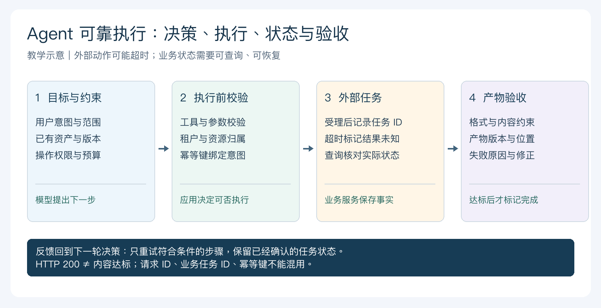
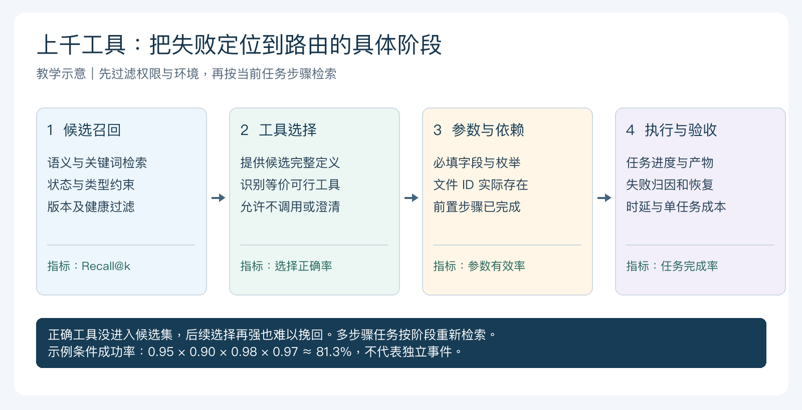
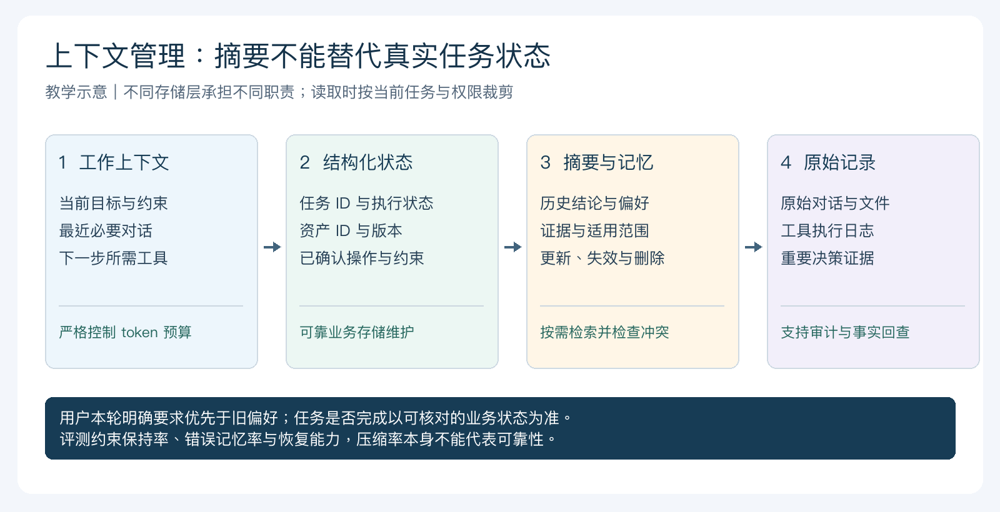
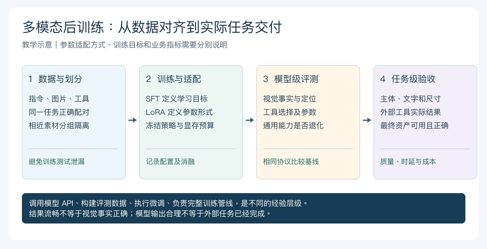

# 百度高频面试题

> 覆盖百度搜索、文心一言、自动驾驶、NLP、多模态与手撕代码相关面试题。

## 已收录面试题

<h2 id="2.实现Self_Attention（百度实习一面）">2.实现Self_Attention（百度实习一面）</h2>

    import torch
    import torch.nn as nn
    import torch.nn.functional as F

    class SelfAttention(nn.Module):
    def __init__(self, embed_size, heads):
        super(SelfAttention, self).__init__()
        self.embed_size = embed_size
        self.heads = heads
        self.head_dim = embed_size // heads

        assert self.head_dim * heads == embed_size, "Embed size needs to be divisible by heads"

        self.values = nn.Linear(self.head_dim, self.head_dim, bias=False)
        self.keys = nn.Linear(self.head_dim, self.head_dim, bias=False)
        self.queries = nn.Linear(self.head_dim, self.head_dim, bias=False)
        self.fc_out = nn.Linear(heads * self.head_dim, embed_size)

    def forward(self, values, keys, query, mask):
        N = query.shape[0]
        value_len, key_len, query_len = values.shape[1], keys.shape[1], query.shape[1]

        # Split the embedding into self.heads different pieces
        values = values.reshape(N, value_len, self.heads, self.head_dim)
        keys = keys.reshape(N, key_len, self.heads, self.head_dim)
        queries = query.reshape(N, query_len, self.heads, self.head_dim)

        values = self.values(values)
        keys = self.keys(keys)
        queries = self.queries(queries)

        energy = torch.einsum("nqhd,nkhd->nhqk", [queries, keys])
        if mask is not None:
            energy = energy.masked_fill(mask == 0, float("-1e20"))

        attention = torch.softmax(energy / (self.embed_size ** (1 / 2)), dim=3)
        out = torch.einsum("nhql,nlhd->nqhd", [attention, values]).reshape(N, query_len, self.heads * self.head_dim)
        out = self.fc_out(out)
        return out

    # Example usage:
    embed_size = 256
    heads = 8
    attention_layer = SelfAttention(embed_size, heads)

    # Dummy data
    N, value_len, key_len, query_len = 3, 50, 40, 30
    value = torch.rand((N, value_len, embed_size))
    key = torch.rand((N, key_len, embed_size))
    query = torch.rand((N, query_len, embed_size))
    mask = None  # Optional mask for padded tokens

    # Forward pass
    out = attention_layer(value, key, query, mask)
    print(out.shape)  # Should be (N, query_len, embed_size)

## 目录

- [2026-09-22 至 2026-09-24 百度 AIGC 多模态智能体算法工程师一面、二面面经](#baidu-aigc-multimodal-agent-20260922-20260924)
- [百度 2026-09-10 多模态大模型一面](#baidu-multimodal-20260910)
  - [1. 1.项目深挖](#baidu-multimodal-20260910-q1)
  - [2. 2.ppo和grpo的区别](#baidu-multimodal-20260910-q2)
  - [3. 3.为什么要做dpo](#baidu-multimodal-20260910-q3)
  - [4. 4.持续学习方法的分类](#baidu-multimodal-20260910-q4)
  - [5. 5.场景题：用8张a100的机器做7B vl模型的grpo训练如何训练加速，推理加速](#baidu-multimodal-20260910-q5)
  - [6. 6.模型训练加速有什么方法](#baidu-multimodal-20260910-q6)
  - [7. 7.deepspeed的三个阶段](#baidu-multimodal-20260910-q7)
  - [8. 8.多头注意力的变体有什么](#baidu-multimodal-20260910-q8)
  - [9. 9.verl等框架都如何进行加速的](#baidu-multimodal-20260910-q9)
  - [10. 手撕：MHA](#baidu-multimodal-20260910-q10)
  - [11. 查找两个正序数组的中位数](#baidu-multimodal-20260910-q11)

- [1. 百度大模型算法日常实习一面 1h](#batch3-p1)
  - [1.实习拷打](#batch3-p1-q1)
  - [2.项目细节](#batch3-p1-q2)
  - [1.基模的可用性，是否进行效果验证和对比](#batch3-p1-q3)
  - [2.意图分类，难意图如何处理](#batch3-p1-q4)
  - [3.数据划分比例 ， epoch几个，多少个稳定](#batch3-p1-q5)
  - [4.构建数据参数，一次性还是迭代处理数据](#batch3-p1-q6)
  - [1.为什么选择qwen系列，qwen系列模型的发展 ，RoPE，外推，Attention（GQA和MLA）](#batch3-p1-q7)
  - [2.ppo dpo grpo，做没做过](#batch3-p1-q8)
  - [3.用什么大模型做什么事情，使用场景](#batch3-p1-q9)
  - [手撕：lc300 最大递增子序列](#batch3-p1-q10)
- [2. 多模态算法-百度-日常实习面经](#batch3-p2)
  - [1.实习深挖](#batch3-p2-q1)
  - [2.介绍LLM项目的背景、动机、想要达成的目标、为什么做?](#batch3-p2-q2)
  - [3.详细介绍自己使用的技术，遇到的问题，如何解决的?](#batch3-p2-q3)
  - [4.使用LoRA微调，在用LoRA时有没有遇到模型不收敛或指令输出格式损失不符合预期?](#batch3-p2-q4)
  - [5.LoRAalpha特别强/特别弱会有什么情况?LoRA增量训练遇到灾难性遗忘如何解决?](#batch3-p2-q5)
  - [6.评测模型性能好坏的指标?有没有什么量化指标?怎么评估输入和输出的?](#batch3-p2-q6)
  - [7.DPOSample偏好尝试不同reward或其他层面的偏好对齐，选择的依据](#batch3-p2-q7)
  - [8.有没有微调过多模态大模型?](#batch3-p2-q8)
  - [9.Prompt Engineering项目有没有做过?](#batch3-p2-q9)
  - [10.手撕非 Leetcode hot100](#batch3-p2-q10)
- [3. 百度日常实习多模态llm算法二面 1h](#batch3-p3)
  - [1.实习拷打](#batch3-p3-q1)
  - [2.项目中的背景挑战困难测评](#batch3-p3-q2)
  - [3.对于训练完的模型如果做比较完整的测评要从哪些方面考虑业务场景如何测试](#batch3-p3-q3)
  - [4.DPO实现原理](#batch3-p3-q4)
  - [5.DPO过程的卡点](#batch3-p3-q5)
  - [6.实习项目深挖版本调优](#batch3-p3-q6)
  - [7.agent原理](#batch3-p3-q7)
  - [8.skills和mcp的区别](#batch3-p3-q8)
  - [9.模型上线之后结果不太理想从哪些方面分析情况](#batch3-p3-q9)
  - [10.手撕hot100](#batch3-p3-q10)

<a id="batch3-p1"></a>
### 1. 百度大模型算法日常实习一面 1h

#### 面试问题汇总

<a id="batch3-p1-q1"></a>
##### 1.实习拷打

**回答：**
项目深挖要按“业务目标-数据-模型-训练/推理-评估-上线约束”回答。核心不是说用了哪个模型，而是说明为什么这样设计、替代方案是什么、关键指标如何定义、失败 case 如何处理、改动是否通过消融或线上指标验证。大模型算法岗尤其要准备 reward、数据质量、评估集、推理成本和鲁棒性细节。

<a id="batch3-p1-q2"></a>
##### 2.项目细节

**回答：**
项目深挖要按“业务目标-数据-模型-训练/推理-评估-上线约束”回答。核心不是说用了哪个模型，而是说明为什么这样设计、替代方案是什么、关键指标如何定义、失败 case 如何处理、改动是否通过消融或线上指标验证。大模型算法岗尤其要准备 reward、数据质量、评估集、推理成本和鲁棒性细节。

<a id="batch3-p1-q3"></a>
##### 1.基模的可用性，是否进行效果验证和对比

**回答：**
这类问题要先回答核心定义，再讲为什么需要它、如何实现、适用边界和工程风险。面试中不要只背概念，要结合大模型算法岗常见场景：数据构建、训练稳定性、推理成本、评估体系、线上鲁棒性和业务指标，给出可落地的判断。

<a id="batch3-p1-q4"></a>
##### 2.意图分类，难意图如何处理

**回答：**
这类问题要先回答核心定义，再讲为什么需要它、如何实现、适用边界和工程风险。面试中不要只背概念，要结合大模型算法岗常见场景：数据构建、训练稳定性、推理成本、评估体系、线上鲁棒性和业务指标，给出可落地的判断。

<a id="batch3-p1-q5"></a>
##### 3.数据划分比例 ， epoch几个，多少个稳定

**回答：**
这类问题要先回答核心定义，再讲为什么需要它、如何实现、适用边界和工程风险。面试中不要只背概念，要结合大模型算法岗常见场景：数据构建、训练稳定性、推理成本、评估体系、线上鲁棒性和业务指标，给出可落地的判断。

<a id="batch3-p1-q6"></a>
##### 4.构建数据参数，一次性还是迭代处理数据

**回答：**
这类问题要先回答核心定义，再讲为什么需要它、如何实现、适用边界和工程风险。面试中不要只背概念，要结合大模型算法岗常见场景：数据构建、训练稳定性、推理成本、评估体系、线上鲁棒性和业务指标，给出可落地的判断。

<a id="batch3-p1-q7"></a>
##### 1.为什么选择qwen系列，qwen系列模型的发展 ，RoPE，外推，Attention（GQA和MLA）

**回答：**
KV cache 复用历史 token 的 key/value，避免自回归解码时反复计算历史上下文，是提升推理吞吐和降低延迟的核心机制。瓶颈在显存，长上下文和高并发会让 KV 占用迅速增加。MLA/MQA/GQA 等方法都在表达能力与 KV cache 成本之间做折中，其中 MLA 通过 latent 表示压缩 KV 状态以降低缓存开销。

<a id="batch3-p1-q8"></a>
##### 2.ppo dpo grpo，做没做过

**回答：**
PPO 通过 clipped policy objective 控制策略更新幅度，通常配合 reward model、reference model 和 critic；critic 通过回归 return/value target 来估计优势。DPO 直接用 chosen/rejected 偏好对优化策略，不显式训练 reward model 和 critic，工程更简单但受离线数据覆盖限制。GRPO 用同一 prompt 的多条采样做组内相对优势估计，减少 critic 成本，适合大模型 RL，但依赖 reward 区分度和采样质量。

<a id="batch3-p1-q9"></a>
##### 3.用什么大模型做什么事情，使用场景

**回答：**
这类问题要先回答核心定义，再讲为什么需要它、如何实现、适用边界和工程风险。面试中不要只背概念，要结合大模型算法岗常见场景：数据构建、训练稳定性、推理成本、评估体系、线上鲁棒性和业务指标，给出可落地的判断。

<a id="batch3-p1-q10"></a>
##### 手撕：lc300 最大递增子序列

**回答：**
手撕题要先明确输入输出和复杂度，再写稳健实现。链表题注意 dummy/head、空指针和边界；第 K 大可用大小为 K 的最小堆或 quickselect；shuffle 要用 Fisher-Yates，保证每个排列等概率；k-means 要说明初始化、分配、更新、收敛条件和空簇处理。面试中代码可简洁，但复杂度、边界和测试样例必须讲清楚。

<a id="batch3-p2"></a>
### 2. 多模态算法-百度-日常实习面经

#### 面试问题汇总

<a id="batch3-p2-q1"></a>
##### 1.实习深挖

**回答：**
项目深挖要按“业务目标-数据-模型-训练/推理-评估-上线约束”回答。核心不是说用了哪个模型，而是说明为什么这样设计、替代方案是什么、关键指标如何定义、失败 case 如何处理、改动是否通过消融或线上指标验证。大模型算法岗尤其要准备 reward、数据质量、评估集、推理成本和鲁棒性细节。

<a id="batch3-p2-q2"></a>
##### 2.介绍LLM项目的背景、动机、想要达成的目标、为什么做?

**回答：**
项目深挖要按“业务目标-数据-模型-训练/推理-评估-上线约束”回答。核心不是说用了哪个模型，而是说明为什么这样设计、替代方案是什么、关键指标如何定义、失败 case 如何处理、改动是否通过消融或线上指标验证。大模型算法岗尤其要准备 reward、数据质量、评估集、推理成本和鲁棒性细节。

<a id="batch3-p2-q3"></a>
##### 3.详细介绍自己使用的技术，遇到的问题，如何解决的?

**回答：**
这类问题要先回答核心定义，再讲为什么需要它、如何实现、适用边界和工程风险。面试中不要只背概念，要结合大模型算法岗常见场景：数据构建、训练稳定性、推理成本、评估体系、线上鲁棒性和业务指标，给出可落地的判断。

<a id="batch3-p2-q4"></a>
##### 4.使用LoRA微调，在用LoRA时有没有遇到模型不收敛或指令输出格式损失不符合预期?

**回答：**
LoRA 冻结原模型权重，只训练低秩增量矩阵 ΔW=BA，从而降低显存和训练成本。适合数据量有限、需要快速适配垂直任务或多租户部署的场景。r 越大表达能力越强，但参数、显存和过拟合风险也越高；选择时要结合任务复杂度、数据量、target modules、alpha 和 dropout 一起调。

<a id="batch3-p2-q5"></a>
##### 5.LoRAalpha特别强/特别弱会有什么情况?LoRA增量训练遇到灾难性遗忘如何解决?

**回答：**
LoRA 冻结原模型权重，只训练低秩增量矩阵 ΔW=BA，从而降低显存和训练成本。适合数据量有限、需要快速适配垂直任务或多租户部署的场景。r 越大表达能力越强，但参数、显存和过拟合风险也越高；选择时要结合任务复杂度、数据量、target modules、alpha 和 dropout 一起调。

<a id="batch3-p2-q6"></a>
##### 6.评测模型性能好坏的指标?有没有什么量化指标?怎么评估输入和输出的?

**回答：**
大模型评估要分离任务效果、事实一致性、安全性、稳定性和线上成本。幻觉治理不能只靠 prompt，应结合检索证据、引用约束、置信度阈值、答案事实校验、拒答策略和人工抽检。AIGC 文本可用人工 pairwise、LLM-as-judge、规则指标和业务指标共同评估，并注意 judge 偏差和长度偏置。

<a id="batch3-p2-q7"></a>
##### 7.DPOSample偏好尝试不同reward或其他层面的偏好对齐，选择的依据

**回答：**
PPO 通过 clipped policy objective 控制策略更新幅度，通常配合 reward model、reference model 和 critic；critic 通过回归 return/value target 来估计优势。DPO 直接用 chosen/rejected 偏好对优化策略，不显式训练 reward model 和 critic，工程更简单但受离线数据覆盖限制。GRPO 用同一 prompt 的多条采样做组内相对优势估计，减少 critic 成本，适合大模型 RL，但依赖 reward 区分度和采样质量。

<a id="batch3-p2-q8"></a>
##### 8.有没有微调过多模态大模型?

**回答：**
多模态大模型通常由视觉编码器、投影/对齐层、语言模型和跨模态训练目标组成。视觉 token 过多会增加上下文和注意力成本，可通过 patch merge、token pruning、query-based compressor、动态分辨率或区域选择压缩。ViT 把图像切成 patch token 送入 Transformer；Swin 用窗口注意力和 shifted window 降低高分辨率计算量并建立层次特征。

<a id="batch3-p2-q9"></a>
##### 9.Prompt Engineering项目有没有做过?

**回答：**
项目深挖要按“业务目标-数据-模型-训练/推理-评估-上线约束”回答。核心不是说用了哪个模型，而是说明为什么这样设计、替代方案是什么、关键指标如何定义、失败 case 如何处理、改动是否通过消融或线上指标验证。大模型算法岗尤其要准备 reward、数据质量、评估集、推理成本和鲁棒性细节。

<a id="batch3-p2-q10"></a>
##### 10.手撕非 Leetcode hot100

**回答：**
手撕题要先明确输入输出和复杂度，再写稳健实现。链表题注意 dummy/head、空指针和边界；第 K 大可用大小为 K 的最小堆或 quickselect；shuffle 要用 Fisher-Yates，保证每个排列等概率；k-means 要说明初始化、分配、更新、收敛条件和空簇处理。面试中代码可简洁，但复杂度、边界和测试样例必须讲清楚。

<a id="batch3-p3"></a>
### 3. 百度日常实习多模态llm算法二面 1h

#### 面试问题汇总

<a id="batch3-p3-q1"></a>
##### 1.实习拷打

**回答：**
项目深挖要按“业务目标-数据-模型-训练/推理-评估-上线约束”回答。核心不是说用了哪个模型，而是说明为什么这样设计、替代方案是什么、关键指标如何定义、失败 case 如何处理、改动是否通过消融或线上指标验证。大模型算法岗尤其要准备 reward、数据质量、评估集、推理成本和鲁棒性细节。

<a id="batch3-p3-q2"></a>
##### 2.项目中的背景挑战困难测评

**回答：**
项目深挖要按“业务目标-数据-模型-训练/推理-评估-上线约束”回答。核心不是说用了哪个模型，而是说明为什么这样设计、替代方案是什么、关键指标如何定义、失败 case 如何处理、改动是否通过消融或线上指标验证。大模型算法岗尤其要准备 reward、数据质量、评估集、推理成本和鲁棒性细节。

<a id="batch3-p3-q3"></a>
##### 3.对于训练完的模型如果做比较完整的测评要从哪些方面考虑业务场景如何测试

**回答：**
这类问题要先回答核心定义，再讲为什么需要它、如何实现、适用边界和工程风险。面试中不要只背概念，要结合大模型算法岗常见场景：数据构建、训练稳定性、推理成本、评估体系、线上鲁棒性和业务指标，给出可落地的判断。

<a id="batch3-p3-q4"></a>
##### 4.DPO实现原理

**回答：**
PPO 通过 clipped policy objective 控制策略更新幅度，通常配合 reward model、reference model 和 critic；critic 通过回归 return/value target 来估计优势。DPO 直接用 chosen/rejected 偏好对优化策略，不显式训练 reward model 和 critic，工程更简单但受离线数据覆盖限制。GRPO 用同一 prompt 的多条采样做组内相对优势估计，减少 critic 成本，适合大模型 RL，但依赖 reward 区分度和采样质量。

<a id="batch3-p3-q5"></a>
##### 5.DPO过程的卡点

**回答：**
PPO 通过 clipped policy objective 控制策略更新幅度，通常配合 reward model、reference model 和 critic；critic 通过回归 return/value target 来估计优势。DPO 直接用 chosen/rejected 偏好对优化策略，不显式训练 reward model 和 critic，工程更简单但受离线数据覆盖限制。GRPO 用同一 prompt 的多条采样做组内相对优势估计，减少 critic 成本，适合大模型 RL，但依赖 reward 区分度和采样质量。

<a id="batch3-p3-q6"></a>
##### 6.实习项目深挖版本调优

**回答：**
项目深挖要按“业务目标-数据-模型-训练/推理-评估-上线约束”回答。核心不是说用了哪个模型，而是说明为什么这样设计、替代方案是什么、关键指标如何定义、失败 case 如何处理、改动是否通过消融或线上指标验证。大模型算法岗尤其要准备 reward、数据质量、评估集、推理成本和鲁棒性细节。

<a id="batch3-p3-q7"></a>
##### 7.agent原理

**回答：**
Agent 可以视为由模型提出动作、运行时授权执行、工具反馈环境观察的任务系统。任务状态包含目标、硬性约束、证据、在途动作和剩余预算；模型输出不能直接决定是否越权、是否完成，也不能自行重置预算。

固定流程优先使用确定性工作流；环境未知时可用 ReAct 式动态探索，长任务可以用结构化计划与检查点。需要为外部写入设置幂等键、结果核对和事务约束，为重试与重规划设置独立但统一受总预算限制的上限。反思结果仍须验证，不能凭“模型自认正确”结束。

具体状态、循环检测与恢复设计可结合[避免循环调用的 Agent 状态机](#baidu-agent-20260922-r2-q8)进一步展开。

<a id="batch3-p3-q8"></a>
##### 8.skills和mcp的区别

**回答：**
Skill 通常组织完成某类任务所需的方法、步骤、脚本或资源，具体含义取决于宿主平台；MCP 则约定模型应用与外部能力之间的连接、能力发现和调用方式。Tool 是可执行的动作接口，可以经 MCP 暴露，也可以由应用直接接入。三者处于不同层次，可以组合使用。

例如“制作商品宣传图”可以是一项 Skill，规定素材检查、生成、编辑和验收流程；“创建图片生成任务”“查询生成进度”是 Tool；MCP 为兼容宿主提供发现与调用这些工具的协议。Skill 不自动提供执行权限，MCP 也不会自动完成任务规划或保证调用正确，应用仍需校验参数、权限、状态与最终结果。

关于零散功能的组织方式，见[Skill 与 Tool 的边界](#baidu-aigc-multimodal-agent-20260922-20260924-r2-q3-3)；关于协议层的具体机制，见[MCP 与普通 API 的差异](#baidu-aigc-multimodal-agent-20260922-20260924-r2-q5-1)。

<a id="batch3-p3-q9"></a>
##### 9.模型上线之后结果不太理想从哪些方面分析情况

**回答：**
先统一离线与线上成功条件，区分答案错误、工具失败、超时、拒答和成本超限。对相同请求回放，固定模型、Prompt、工具、数据快照与预处理版本，再判断是分布变化、评测泄漏、部署配置还是依赖服务导致差异。

建立固定保留集、困难回归集和按真实分布抽样的线上集合，按用户、文档或时间分组避免近重复泄漏；训练回流数据与验收数据分离。每次改动通过消融和灰度评估任务成功率、覆盖率、分类别误差、尾延迟与成功任务成本，不只优化一个总体准确率。

完整排查路径见[离线准确率高但线上效果差](#baidu-agent-20260922-r2-q10)。

<a id="batch3-p3-q10"></a>
##### 10.手撕hot100

**回答：**
手撕题要先明确输入输出和复杂度，再写稳健实现。链表题注意 dummy/head、空指针和边界；第 K 大可用大小为 K 的最小堆或 quickselect；shuffle 要用 Fisher-Yates，保证每个排列等概率；k-means 要说明初始化、分配、更新、收敛条件和空簇处理。面试中代码可简洁，但复杂度、边界和测试样例必须讲清楚。

<a id="baidu-multimodal-20260910"></a>
### 百度 2026-09-10 多模态大模型一面

#### 面试问题汇总

<a id="baidu-multimodal-20260910-q1"></a>
##### 1. 1.项目深挖

**回答：**

项目深挖不能只按技术栈报菜名，应沿着“业务目标 -> 数据与任务定义 -> 模型方案 -> 训练/推理 -> 评测 -> 上线约束”形成一条可验证的主线。先说明系统为谁解决什么问题、原流程的瓶颈是什么，再说明为什么选择当前模型和训练方法，以及自己真正负责的模块。

一个完整的项目回答至少包含以下内容：

1. **任务定义。** 输入输出是什么，属于分类、生成、检索、视觉问答、工具调用还是多阶段任务；成功与失败如何判定。
2. **数据构建。** 数据来源、清洗规则、标注协议、训练/验证/测试划分、去重和困难样本覆盖。多模态项目还要说明图文对是否对齐、图片质量、OCR 文本和长宽比分布。
3. **技术决策。** 为什么选择某个基座模型、视觉编码器、连接器、LoRA/全量微调、DPO/GRPO 或 RAG；替代方案是什么，取舍依据是效果、显存、延迟、成本还是合规。
4. **工程闭环。** 训练配置、并行方式、混合精度、checkpoint、推理服务、批处理、缓存、超时和故障恢复如何设计。
5. **效果证据。** 报告基线、数据集、样本量、指标定义、消融实验和线上口径。准确率、任务成功率、P95 延迟和成本等数字必须能追溯到实验或日志，不能把估计值包装成线上结果。

如果是 Agent 或多模态 Agent，建议把一次任务描述为：

$$
\text{Input}\rightarrow\text{Perception}\rightarrow\text{Plan}
\rightarrow\text{Tool/Model Action}\rightarrow\text{Observation}
\rightarrow\text{Verification}\rightarrow\text{Final Result}
$$

重点讲清模型负责生成候选决策，代码负责权限、schema、状态、预算和副作用控制。面试官继续追问时，可以具体展开一个最难的 badcase：它发生在哪一层，如何定位，尝试过哪些方案，最终用什么对照实验证明修复有效。这样项目深挖回答的是设计判断和工程归因，而不是框架名称。

## 训练目标与持续学习

<a id="baidu-multimodal-20260910-q2"></a>
##### 2. 2.ppo和grpo的区别

**回答：**

PPO 和 GRPO 都属于基于策略优化的强化学习方法，但关键差异在于优势估计和是否需要独立的 Critic/Value Model。

PPO 通常维护当前策略 $\pi_\theta$、冻结参考策略 $\pi_{ref}$、奖励模型以及价值模型。对采样轨迹计算回报和优势 $A_t$，然后用裁剪目标限制策略更新幅度：

$$
L^{CLIP}(\theta)=
\mathbb{E}_t\left[
\min\left(r_t(\theta)A_t,
\operatorname{clip}(r_t(\theta),1-\epsilon,1+\epsilon)A_t\right)
\right]
$$

其中

$$
r_t(\theta)=\frac{\pi_\theta(a_t|s_t)}{\pi_{old}(a_t|s_t)}.
$$

PPO 的优势是优势估计较细，可以利用 token 级或时间步级 value；代价是需要训练和维护 Critic，显存、通信和训练稳定性成本较高。对语言模型还要加入相对参考模型的 KL 约束，防止策略偏离 SFT 能力过快。

GRPO 的典型做法是对同一个 prompt 采样一组回答，得到组内奖励 $r_{i,1},\ldots,r_{i,G}$，用组内均值和标准差构造相对优势：

$$
A_{i,j}=\frac{r_{i,j}-\operatorname{mean}(r_i)}
{\operatorname{std}(r_i)+\epsilon}.
$$

它不依赖单独的 Critic，而是用同一问题的组内相对表现近似优势，因此降低了 value model 的显存与拟合成本，特别适合数学、代码、结构化工具调用等有可验证 reward 的任务。代价是每个 prompt 需要生成多个 response，Rollout 成本高；如果一组回答奖励几乎相同，优势信号接近 0；奖励模型或规则不可靠时，组内排序会把错误偏好放大。

两者都不是“天然稳定”或“只适合某种模型”。实际选择要看 reward 是否可验证、Rollout 吞吐、Critic 成本、轨迹长度和任务方差。工程上还要监控 KL、clip fraction、奖励分布、组内方差、长度偏置、熵、任务成功率和通用能力。对于工具调用或多模态任务，reward 最好拆成格式合法、工具正确、任务完成、事实一致和安全等信号，不能只用一个模糊的模型评分。

<a id="baidu-multimodal-20260910-q3"></a>
##### 3. 3.为什么要做dpo

**回答：**

DPO 的动机是：很多场景能够收集“同一个 prompt 下回答 A 比回答 B 好”的偏好数据，但直接做 PPO 需要在线 rollout、Reward Model、Value Model 和复杂的稳定性控制。DPO 从 KL 正则化 RLHF 的最优策略形式出发，消去显式奖励模型，直接用偏好对训练策略。

数据为 $(x,y_w,y_l)$，其中 $y_w$ 是 chosen，$y_l$ 是 rejected。DPO 的核心目标是：

$$
\mathcal{L}_{DPO}(\theta)=
-\log\sigma\left(\beta\left[
\log\frac{\pi_\theta(y_w|x)}{\pi_{ref}(y_w|x)}
-\log\frac{\pi_\theta(y_l|x)}{\pi_{ref}(y_l|x)}
\right]\right).
$$

训练时使用策略模型和冻结参考模型对 chosen/rejected 做 teacher forcing，只累计 completion token 的对数概率，不把 prompt、padding 或错误的 mask 算进回答概率。DPO 的核心是提高策略相对于参考模型对 chosen 的偏好，同时降低对 rejected 的相对偏好；$\beta$ 控制偏离参考模型的尺度。

做 DPO 的主要价值有三点：

1. 不需要显式训练 Reward Model 和 Critic，训练链路更短、调参更直接；
2. 不需要每轮与真实环境在线交互，成本和工程复杂度较低；
3. 对风格、帮助性、格式、拒答和偏好排序等离线偏好任务比较实用。

但 DPO 不是免费午餐。它受偏好数据覆盖、标注一致性、chosen/rejected 质量和参考模型能力限制；如果数据存在长度偏好、位置偏好或标注者偏差，模型会学习这些伪相关；如果任务需要多步工具交互或环境反馈，静态回答偏好未必能教会正确的行动策略。实践中应同时评估偏好准确率、事实性、安全性、长度分布、KL 漂移、通用能力和真实任务成功率，并根据问题选择 DPO、IPO、KTO、ORPO 或在线 RL，而不是把 DPO 当作所有对齐问题的默认答案。

<a id="baidu-multimodal-20260910-q4"></a>
##### 4. 4.持续学习方法的分类

**回答：**

持续学习是让模型在数据分布、任务或知识不断变化时吸收新信息，同时尽量不破坏旧能力。它与简单地周期性重新训练不同，核心矛盾是“适应新分布”和“避免灾难性遗忘”。可以按记忆、参数更新和模型结构分为几类：

1. **基于回放（Replay-based）。** 保存历史样本、原型、特征或生成式旧样本，在训练新数据时混合回放。优点是直接约束旧任务，缺点是存储、隐私、采样比例和数据时效需要管理。企业场景中常用脱敏 replay buffer 和困难样本优先回放。
2. **基于正则化（Regularization-based）。** 用参数重要性约束新任务不要大幅改变对旧任务重要的参数，例如 EWC；也可以用旧模型 logits、表示或输出分布做蒸馏。优点是模型结构不变，缺点是重要性估计可能失真，任务差异大时会限制新能力。
3. **基于参数隔离或适配器。** 为不同领域、租户或时间段维护 LoRA/Adapter、Prompt 参数或专家模块，推理时选择或融合对应模块。它降低了旧知识被覆盖的风险，但会带来适配器管理、路由、组合冲突和部署内存成本。
4. **基于架构扩展。** 增加新专家、新头或新模块，把新能力放到独立参数空间。容量更灵活，但需要解决路由、负载均衡、版本治理和模型规模膨胀。
5. **基于检索与外部记忆。** 不立即修改模型参数，而是把新知识写入文档库、向量库、数据库或结构化记忆，通过 RAG/工具在推理时取回。它更新快、可追溯，适合时效性知识；但不能替代模型对新行为模式的学习，仍要处理召回、权限、冲突和过期。
6. **周期性重训或增量预训练。** 定期合并新旧数据进行 continued pretraining、SFT 或偏好优化。质量上限较高，但计算成本大，数据混合、版本回滚和遗忘评估不可省略。

选型要先判断变化的是知识、行为、任务还是输入分布：知识更新优先考虑检索；格式和行为变化可以考虑 SFT/Adapter/DPO；需要学习可验证长链路策略才考虑 RL；数据分布变化则要做回放、重加权和漂移监控。每次更新都要在新域、旧域、对抗集和安全集上做回归，使用旧能力保留率、增量收益、遗忘量、成本和延迟联合决策。

## 训练与推理加速

<a id="baidu-multimodal-20260910-q5"></a>
##### 5. 5.场景题：用8张a100的机器做7B vl模型的grpo训练如何训练加速，推理加速

**回答：**

这道题应先明确瓶颈。GRPO 对每个 prompt 需要生成一组回答，再计算 reward、优势和策略梯度；对 7B VL 模型，视觉编码、长图像 token、生成阶段 KV Cache 和训练阶段显存/通信都可能成为瓶颈。通常先用 profiler 测量 Rollout、视觉编码、训练 forward/backward、reward、All-Reduce/All-to-All 和 GPU 空闲时间，再决定优化顺序。

#### 推理与 Rollout 加速

1. 使用支持批处理和 KV Cache 管理的推理引擎，例如 vLLM 或 SGLang；PagedAttention 主要解决 KV Cache 的分页管理和碎片问题，Continuous Batching 让不同请求动态加入/退出，提高 GPU 利用率。
2. 根据模型结构选择 Tensor Parallel 或其他并行策略，确保视觉编码器、语言模型和生成服务的切分方式与 A100 的显存和互联拓扑匹配。不能只写“上 TP”，还要观察通信比例和小 batch 下的收益。
3. 限制无效生成：设置合理的 `max_new_tokens`、停止条件、结构化输出约束和长度预算；对明显重复或格式非法的轨迹尽早终止。减少 group size 可以降低 Rollout 量，但会改变组内优势估计的方差，必须用任务成功率和训练稳定性验证，不能只追求吞吐。
4. 复用同一 prompt 的视觉特征和前缀 KV Cache，避免每个 group response 重复计算完全相同的图像编码与 prompt 前缀。缓存必须按模型版本、图像处理配置、租户和输入哈希隔离。
5. 采用 BF16 推理、FlashAttention/FlashInfer 等 fused kernel，在 A100 上结合 CUDA Graph、算子融合和合适的 batch size；对长图像可以使用动态分辨率、patch merge 或视觉 token 压缩，但要验证视觉理解质量。
6. 将 rollout、reward 计算和训练解耦或流水化。可采用部分 GPU 做 Rollout、部分 GPU 做训练，也可在同一组 GPU 上做时间片复用；关键是减少“训练等 rollout、rollout 等训练”的空转。异步策略必须处理策略版本、过期样本和 off-policy 程度，不能无条件混用旧策略生成的样本。

#### 训练加速

1. 使用 BF16、FlashAttention、fused optimizer 和通信计算 overlap；TF32 主要影响 FP32 矩阵乘法路径，不能把它当作 BF16 的替代品。
2. 用 FSDP 或 DeepSpeed ZeRO 分片参数、梯度和优化器状态，结合 gradient accumulation 获得足够的有效 batch。Gradient Checkpointing 用额外重计算换显存，适合长序列，但会增加计算时间，应通过 profiler 判断收益。
3. 做 sequence packing 或长度分桶，减少 padding；多模态 batch 还需按图片 token 数、文本长度和生成长度分桶，否则一个超长样本会拖慢整批。
4. 控制全局 batch、mini-batch、group size、生成长度和 reward 计算频率，避免为了增大 batch 造成显存溢出或通信饱和。GRPO 的有效样本量不能只看 prompt 数，还要看每个 prompt 的 response 数和有效 token 数。
5. 用 NCCL 拓扑、梯度桶大小、通信 overlap、持久化 worker 和预分配显存降低同步开销；保存 checkpoint 时异步写盘，避免训练线程长时间阻塞。

#### 验收方式

优化前后至少记录：tokens/s、有效 response/s、端到端 step time、GPU 利用率、显存峰值、通信占比、reward 计算时间、训练吞吐、任务成功率、KL、组内 reward 方差和单样本成本。对于 8 张 A100，没有完整模型配置、图像尺寸、序列长度、并行策略和 group size 时，不能直接承诺某个固定加速倍数。正确的回答是先定位瓶颈，再做单变量消融，确认吞吐提升没有以视觉质量、训练稳定性或策略新鲜度为代价。

<a id="baidu-multimodal-20260910-q6"></a>
##### 6. 6.模型训练加速有什么方法

**回答：**

训练加速可以按“减少计算量、减少显存、减少通信、提高流水线利用率、减少无效数据”五个方向组织。

1. **精度与算子。** 使用 BF16/FP16 混合精度、TF32 的适用路径、FlashAttention、fused activation、fused optimizer、CUDA Graph 和 kernel fusion。混合精度要配合 loss scaling 或框架的数值稳定策略，并监控溢出、梯度范数和 loss 是否异常。
2. **显存优化。** Gradient Checkpointing、Activation Offload、参数/梯度/优化器分片、KV 或中间激活重用。Checkpointing 不是无成本加速，它通过重算降低显存，通常是用显存换算力。
3. **并行训练。** Data Parallel 复制模型处理不同 batch；Tensor Parallel 切分层内矩阵；Pipeline Parallel 按层切分并用 micro-batch 填充流水线；Sequence Parallel 减少长序列激活压力；MoE 还需要 Expert Parallel 和 All-to-All。混合并行要结合模型尺寸、序列长度、GPU 互联和 batch 形态选择。
4. **通信优化。** 梯度桶化、通信计算重叠、梯度累积减少同步频率、合理设置 NCCL、拓扑感知的设备映射和分层通信。多卡加速不等于线性加速，通信时间、负载不均衡和 pipeline bubble 都要纳入分析。
5. **数据与序列。** 清洗重复和无效样本、packing、长度分桶、动态 batch、异步预取、缓存 tokenizer/视觉特征、减少 padding。数据读取和 CPU 预处理跟不上时，GPU 再快也会空转。
6. **训练策略。** 选择合适的 global batch、学习率调度、梯度累积、参数高效微调、冻结部分模块和 curriculum。若只需领域适配，LoRA/QLoRA 可能比全量训练更经济；但它不是普适的速度提升，目标模块、量化反量化和小 batch kernel 效率都要实测。
7. **系统与工程。** 使用高效 checkpoint、断点续训、异步日志、持久化进程、预分配内存和 profiler；通过 Nsight Systems、PyTorch Profiler、训练框架 trace 分辨计算、内存、通信、I/O 和同步瓶颈。

一个有说服力的优化闭环是：先建立固定 batch 和数据版本的基线，记录 step time 分解；每次只改一个变量；同时报告吞吐、峰值显存、数值稳定性和验证集效果；最后在目标硬件和真实数据分布上复测。不能只报单卡 FLOPS 或 GPU 利用率，因为无效 token 增多时 GPU 利用率可能上升，任务质量却下降。

<a id="baidu-multimodal-20260910-q7"></a>
##### 7. 7.deepspeed的三个阶段

**回答：**

这里通常指 DeepSpeed ZeRO 的三个阶段。它们都利用数据并行，但逐步减少每张 GPU 必须完整保存的训练状态：

| 阶段 | 分片对象 | 每张 GPU 仍保留 |
| --- | --- | --- |
| ZeRO-1 | 优化器状态 | 完整模型参数与完整梯度 |
| ZeRO-2 | 优化器状态、梯度 | 完整模型参数 |
| ZeRO-3 | 优化器状态、梯度、模型参数 | 当前计算所需的参数分片或临时聚合 |

设参数量为 $P$，混合精度训练还需保存参数、梯度和优化器状态，朴素数据并行中每卡都复制这些内容；ZeRO 通过在 $D$ 张卡之间分片，使理想状态下每卡的持久化状态规模近似按 $1/D$ 缩减，但实际还会有通信 buffer、临时 all-gather、激活和框架开销。

ZeRO-1 通信和实现风险较低，适合优化器状态占比很大的训练；ZeRO-2 进一步节省梯度显存；ZeRO-3 最省显存，可训练更大的模型，但参数在层计算前后需要聚合和释放，通信、配置复杂度和小 batch 性能代价更高。ZeRO-Infinity 还可以把部分状态卸载到 CPU/NVMe，但会受 PCIe、内存带宽和 I/O 影响。

需要区分 ZeRO 与 Tensor Parallel、Pipeline Parallel：ZeRO 主要分片数据并行中的训练状态，TP/PP 主要切分模型计算和层；它们可以组合。选择时要综合模型大小、序列长度、GPU 数量、互联带宽、checkpoint 需求和吞吐目标，而不是默认 ZeRO-3 一定最好。

## 注意力与框架工程

<a id="baidu-multimodal-20260910-q8"></a>
##### 8. 8.多头注意力的变体有什么

**回答：**

标准 Multi-Head Attention（MHA）为每个 Query 头配置独立的 Key/Value 头。设 Query 头数为 $H_q$，Key/Value 头数为 $H_{kv}$：

- **MHA：** $H_q=H_{kv}$。表达能力完整，但自回归推理需要缓存最多的 K/V，显存和带宽开销大。
- **MQA：** $H_{kv}=1$。所有 Query 头共享一组 K/V，KV Cache 显著缩小，解码更快，但过度共享可能损失质量。
- **GQA：** $1<H_{kv}<H_q$。多个 Query 头分组共享一个 K/V 头，是质量、缓存和带宽之间常见的折中。每个 KV 头对应 $H_q/H_{kv}$ 个 Query 头。
- **MQA/GQA 的 KV 头扩展：** 计算时把较少的 K/V 头按组广播给 Query 头，数学上仍是缩放点积注意力，主要变化在参数组织和缓存布局。
- **MLA（Multi-head Latent Attention）：** 不直接缓存完整的每头 K/V，而是缓存低维 latent 表示，并在需要时结合 Query 投影重建注意力所需信息，从而在长上下文和高并发下进一步降低 KV Cache 压力。它不是简单把 GQA 的 KV 头数设为更小，具体结构还涉及低秩投影和位置编码设计。
- **局部/滑动窗口注意力：** 每个 token 只关注局部窗口，降低长序列计算量，但会牺牲远距离直接交互，需要全局 token、稀疏连接或层间传播补足。
- **稀疏、块稀疏和线性注意力：** 通过限制连接模式或改变计算形式减少 $O(S^2)$ 成本，适合特定长度和任务分布，但需要硬件 kernel、质量和训练稳定性共同验证。

注意力变体的本质是同时改变三件事：表示能力、每 token 的 KV 状态大小和矩阵乘法/访存模式。自回归解码的主要瓶颈往往不是 QKV 投影本身，而是每一步读取历史 K/V 的显存带宽，因此降低 KV Cache 可以带来明显收益；但在短序列、大 batch 或 prefill 阶段，计算和并行度的权衡可能不同。回答时要区分 prefill 与 decode，不能笼统说“所有场景 GQA 都更快”。

<a id="baidu-multimodal-20260910-q9"></a>
##### 9. 9.verl等框架都如何进行加速的

**回答：**

以 verl 这类 LLM/Agent 强化学习框架为例，加速重点不是一个神奇算子，而是把 Rollout、Reward、训练更新和数据调度组织成高吞吐系统。不同版本和配置的实现会变化，因此应按公开能力和实际配置说明，不应随意承诺固定版本或倍数。

主要机制包括：

1. **Hybrid Engine。** 在训练与生成之间复用或切换模型权重，减少重复加载和 GPU 空闲。可以采用 colocated 方式在同一批 GPU 上调度，也可以把 Rollout 与 Trainer 分离到不同 GPU 资源池；前者节省资源，后者更容易隔离吞吐，但需要处理权重同步和资源利用率。
2. **高效 Rollout。** 对接 vLLM、SGLang 等推理后端，利用 Continuous Batching、Paged KV Cache、prefix caching、张量并行和高效采样；对 GRPO 通过批量生成同一 prompt 的多条 response，提高生成阶段的 GPU 利用率。
3. **训练后端优化。** 对接 FSDP、Megatron 或其他分布式训练后端，使用参数/梯度/优化器分片、混合精度、梯度累积、sequence packing、激活重计算和通信计算 overlap。
4. **异步与流水化。** Rollout、Reward、数据传输和训练可以流水并行，减少阶段间互相等待。异步训练要记录 policy version，控制样本陈旧度，必要时丢弃过旧轨迹，避免吞吐提升却破坏训练目标。
5. **数据与长度管理。** 按 prompt 长度、response 长度、图片 token 数分桶，动态 batch，减少 padding；设置最大生成长度和停止条件，避免把大量计算浪费在无效轨迹上。
6. **通信和内存。** 预分配 buffer、减少 CPU-GPU 拷贝、使用 pinned memory、优化 NCCL 拓扑和通信 bucket；模型权重、KV Cache、奖励结果和训练 batch 的生命周期要明确，避免显存碎片。
7. **可观测性。** 分别统计生成 tokens/s、训练 tokens/s、reward 延迟、权重同步时间、GPU 空闲比例、通信占比、样本陈旧度、有效 batch 和端到端 step time。只有找到具体瓶颈，才能判断某项优化是否真正有效。

对 8 张 A100 的小规模集群，常见优先级是先确认 rollout 是否主导耗时，再选择 colocate 或 disaggregate；随后按模型大小和序列长度选择 FSDP/Megatron、TP/DP 和 checkpoint；最后优化 kernel、packing 和通信。任何“减少 group size”“训练推理解耦”都需要与 reward 方差、样本新鲜度、最终任务质量一起验证。

## 手撕题

<a id="baidu-multimodal-20260910-q10"></a>
##### 10. 手撕：MHA

**回答：**

设输入 `query`、`key`、`value` 的形状分别为 `[B, Lq, D]`、`[B, Lk, D]`、`[B, Lv, D]`，在标准注意力中要求 `Lk == Lv`。头数为 `H`，每头维度为 `Dh = D / H`。计算过程为：

$$
Q=XW_Q,\quad K=XW_K,\quad V=XW_V,
$$

$$
\operatorname{Attention}(Q,K,V)=
\operatorname{softmax}\left(\frac{QK^{\mathsf T}}{\sqrt{D_h}}+M\right)V.
$$

下面实现支持 Self-Attention 和 Cross-Attention，`mask=True` 表示允许关注，mask 可广播到 `[B, H, Lq, Lk]`。因果 mask 只适用于 Self-Attention 或明确给出对应的 query/key 位置关系。

```python
import math
from typing import Optional

import torch
from torch import Tensor, nn


class MultiHeadAttention(nn.Module):
    def __init__(self, d_model: int, num_heads: int, dropout: float = 0.0):
        super().__init__()
        if d_model <= 0 or d_model % num_heads != 0:
            raise ValueError("d_model must be divisible by num_heads")
        self.d_model = d_model
        self.num_heads = num_heads
        self.head_dim = d_model // num_heads
        self.q_proj = nn.Linear(d_model, d_model)
        self.k_proj = nn.Linear(d_model, d_model)
        self.v_proj = nn.Linear(d_model, d_model)
        self.out_proj = nn.Linear(d_model, d_model)
        self.dropout = nn.Dropout(dropout)

    def forward(
        self,
        query: Tensor,
        key: Tensor,
        value: Tensor,
        mask: Optional[Tensor] = None,
        causal: bool = False,
    ) -> Tensor:
        batch, query_len, _ = query.shape
        _, key_len, _ = key.shape
        if value.shape[:2] != (batch, key_len):
            raise ValueError("key and value must have the same batch and length")

        q = self.q_proj(query).view(batch, query_len, self.num_heads, self.head_dim)
        k = self.k_proj(key).view(batch, key_len, self.num_heads, self.head_dim)
        v = self.v_proj(value).view(batch, key_len, self.num_heads, self.head_dim)
        q = q.transpose(1, 2)  # [B, H, Lq, Dh]
        k = k.transpose(1, 2)  # [B, H, Lk, Dh]
        v = v.transpose(1, 2)  # [B, H, Lk, Dh]

        scores = torch.matmul(q, k.transpose(-2, -1)) / math.sqrt(self.head_dim)
        if causal:
            if query_len != key_len:
                raise ValueError("this simple causal mask expects self-attention")
            causal_mask = torch.ones(
                query_len, key_len, dtype=torch.bool, device=query.device
            ).tril()
            scores = scores.masked_fill(~causal_mask, torch.finfo(scores.dtype).min)
        if mask is not None:
            scores = scores.masked_fill(~mask.to(torch.bool), torch.finfo(scores.dtype).min)

        # Float32 softmax is more stable for low-precision training.
        weights = torch.softmax(scores.float(), dim=-1).to(scores.dtype)
        weights = self.dropout(weights)
        output = torch.matmul(weights, v)
        output = output.transpose(1, 2).contiguous().view(batch, query_len, self.d_model)
        return self.out_proj(output)
```

复杂度为 $O(BHL_qL_kD_h)$，即 $O(BL_qL_kD)$ 的注意力矩阵计算，注意力权重额外占用 $O(BHL_qL_k)$ 空间。面试中还要主动指出：缩放因子应使用 `sqrt(head_dim)` 而不是 `sqrt(d_model)`；转置后合并维度前要 `contiguous()`；mask 的语义、dtype 和广播形状要明确；现代实现可用 `torch.nn.functional.scaled_dot_product_attention` 或 FlashAttention，但不能因此省略数学和张量形状。

<a id="baidu-multimodal-20260910-q11"></a>
##### 11. 查找两个正序数组的中位数

**回答：**

设两个正序数组分别为 `A` 和 `B`，长度为 `m`、`n`。目标是在不真正合并数组的情况下找到第 `(m+n+1)/2` 小和第 `(m+n+2)/2` 小的元素。最优方法是在较短数组上二分切分位置。

选择切分 `i` 个元素来自 `A`，则需要 `j = half - i` 个元素来自 `B`。合法切分要求：

$$
A[i-1]\le B[j]\quad\text{且}\quad B[j-1]\le A[i].
$$

其中越界左值视为 $-\infty$，越界右值视为 $+\infty$。找到合法切分后，左半部分最大值为 $\max(A[i-1],B[j-1])$，右半部分最小值为 $\min(A[i],B[j])$。总长度为奇数时取左最大值，为偶数时取左右平均值。

```python
from typing import List


def find_median_sorted_arrays(a: List[int], b: List[int]) -> float:
    if len(a) > len(b):
        a, b = b, a
    m, n = len(a), len(b)
    if m + n == 0:
        raise ValueError("both arrays cannot be empty")

    left, right = 0, m
    half = (m + n + 1) // 2
    neg_inf = float("-inf")
    pos_inf = float("inf")

    while left <= right:
        i = (left + right) // 2
        j = half - i
        a_left = neg_inf if i == 0 else a[i - 1]
        a_right = pos_inf if i == m else a[i]
        b_left = neg_inf if j == 0 else b[j - 1]
        b_right = pos_inf if j == n else b[j]

        if a_left > b_right:
            right = i - 1
        elif b_left > a_right:
            left = i + 1
        else:
            left_max = max(a_left, b_left)
            if (m + n) % 2 == 1:
                return float(left_max)
            right_min = min(a_right, b_right)
            return (left_max + right_min) / 2.0

    raise ValueError("input arrays are not sorted")
```

二分发生在较短数组上，因此时间复杂度为 $O(\log\min(m,n))$，额外空间复杂度为 $O(1)$。边界包括一个数组为空、两个数组都为空、重复元素、负数和总长度为偶数。不能只用双指针合并到中点后宣称最优，那样时间复杂度是 $O(m+n)$；如果面试官只要求普通实现，双指针可接受，但应说明这是线性方案。

<a id="baidu-agent-20260922"></a>
## 2026-09-22 百度 智能体算法 一面、二面、三面

智能体算法岗位的能力边界，已经延伸到模型、业务规则和执行系统的连接处。模型决定下一步值得尝试什么，运行时决定这个动作能否执行，评测体系判断任务是否真正完成。**一个可上线的 Agent，需要把概率性的模型输出，接入有权限、有预算、有证据、可恢复的执行闭环。**

这组三轮问答可以沿着一条主线理解：一面考察承载 Agent 的后端基础，二面关注任务闭环与多模态评测，三面进一步讨论失败恢复、模型路由与资源治理。Rocky 更看重的能力，是能否解释每项设计解决了什么问题、增加了什么代价，以及如何证明它在真实流量下有效。

## 目录

- [2026-09-22 百度 智能体算法 一面、二面、三面](#baidu-agent-20260922)
- [一面](#baidu-agent-20260922-r1)
- [一面 · 1. 先做一下自我介绍，你最近主要关注哪类技术问题](#baidu-agent-20260922-r1-q1)
- [一面 · 2. JVM 中对象从创建到回收大致经历了哪些阶段？](#baidu-agent-20260922-r1-q2)
- [一面 · 3. 线上出现频繁 Full GC 时，你会怎样定位？](#baidu-agent-20260922-r1-q3)
- [一面 · 4. Java 中如何设计一个不会产生大量锁竞争的任务调度器？](#baidu-agent-20260922-r1-q4)
- [一面 · 5. Java 内存模型中的 happens-before 规则解决了什么问题？](#baidu-agent-20260922-r1-q5)
- [一面 · 6. 如果一个接口同时受到 CPU 和数据库 IO 的限制，你会怎样拆解瓶颈？](#baidu-agent-20260922-r1-q6)
- [一面 · 7. MySQL 的 B+Tree 索引为什么适合范围查询？](#baidu-agent-20260922-r1-q7)
- [一面 · 8. 联合索引 (tenant_id, status, created_at) 在哪些情况下无法充分利用？](#baidu-agent-20260922-r1-q8)
- [一面 · 9. 在高并发写入场景下，MySQL 的间隙锁可能造成什么问题？](#baidu-agent-20260922-r1-q9)
- [一面 · 10. Redis 的持久化机制应该如何选择？](#baidu-agent-20260922-r1-q10)
- [一面 · 11. Redis 分布式锁怎样避免锁被误删？](#baidu-agent-20260922-r1-q11)
- [二面](#baidu-agent-20260922-r2)
- [二面 · 1. 请先做一下自我介绍，聊聊你实习期承担过的工作。](#baidu-agent-20260922-r2-q1)
- [二面 · 2. 懂不懂Go,如果让你转Go能接受吗](#baidu-agent-20260922-r2-q2)
- [二面 · 3. 介绍下项目，如何设计从数据接入到结论生成的整体架构？](#baidu-agent-20260922-r2-q3)
- [二面 · 4. 如果 Agent 在调用工具时出现参数类型正确但业务含义错误，如何发现并阻止？](#baidu-agent-20260922-r2-q4)
- [二面 · 5. 如果工具调用一直没有达到成功条件，任务不断重试并最终卡死，你会如何处理？](#baidu-agent-20260922-r2-q5)
- [二面 · 6. CoT、ReAct、Plan-and-Execute 在工程实现上有什么区别？如何选择？](#baidu-agent-20260922-r2-q6)
- [二面 · 7. 在长上下文对话中，模型过早遗忘用户最初的硬性要求，你会怎样解决？](#baidu-agent-20260922-r2-q7)
- [二面 · 8. 如何设计一个能够避免循环调用的 Agent 状态机？](#baidu-agent-20260922-r2-q8)
- [二面 · 9. 如何判断一个图片理解 Agent 的评测指标是否足够完整？](#baidu-agent-20260922-r2-q9)
- [二面 · 10. 如果评测集上的准确率很高，但线上效果很差，你会怎样排查？](#baidu-agent-20260922-r2-q10)
- [二面 · 11. 如果用户说“只修改图片左上角的文字”，怎样避免模型改动其他区域？](#baidu-agent-20260922-r2-q11)
- [三面](#baidu-agent-20260922-r3)
- [三面 · 1. 请先做一下自我介绍](#baidu-agent-20260922-r3-q1)
- [三面 · 2. 基于 LangChain 开发 Agent 时，如果工具调用连续失败，如何设计一套不会失控的容错机制？](#baidu-agent-20260922-r3-q2)
- [三面 · 3. 如何设计 Qwen、视觉语言模型和轻量模型之间的动态路由策略？](#baidu-agent-20260922-r3-q3)
- [三面 · 4. 置信度阈值应该如何定义？为什么不能直接使用模型输出的概率？](#baidu-agent-20260922-r3-q4)
- [三面 · 5. 如果 Prompt 中给了明确的输出格式，但模型仍然经常生成非法 JSON，如何处理？](#baidu-agent-20260922-r3-q5)
- [三面 · 6. 图片审核系统在面对超大图片、切片图片和多模态并发请求时，主要会出现哪些问题？](#baidu-agent-20260922-r3-q6)

## 面试问答

<a id="baidu-agent-20260922-r1"></a>
### 一面

<a id="baidu-agent-20260922-r1-q1"></a>
#### 1. 先做一下自我介绍，你最近主要关注哪类技术问题

**回答：**

自我介绍应建立“个人能力与岗位需求”的对应关系。可以按照背景、实际负责的项目、解决过的问题、最近关注的方向来组织，用一到两分钟讲清楚。以下是需要替换成真实经历的模板，不能把示例当作自己的业绩：

“我目前是［学校／专业／工作背景］，主要做［算法或开发方向］。最近参与的［项目名称］面向［用户与业务场景］，我负责［明确模块］，其中最有代表性的问题是［具体瓶颈］。我通过［方案］，在［测试集／流量与资源条件］下，把［指标］从［基线］改善到［结果］，同时控制了［成本或风险］。

“近期我关注 Agent 的可靠执行：模型输出如何转为可校验的工具参数，工具超时后如何判断是否已经执行，以及如何通过任务级评测定位失败。我也在补齐并发、数据库和可观测性，因为这些能力直接影响智能体的线上稳定性。”

**值得展开的技术问题应当有证据。** 例如，能展示一条失败轨迹，解释问题发生在检索、规划、参数、权限还是外部服务，再说明修复前后的对照结果。没有线上数据，就说明使用离线回放或模拟压测，不编造 QPS、成功率和业务收益。

<a id="baidu-agent-20260922-r1-q2"></a>
#### 2. JVM 中对象从创建到回收大致经历了哪些阶段？

**回答：**

以 HotSpot 中普通 `new` 对象为例，可以沿着“类的准备、分配、初始化、使用、可达性变化、回收”理解。类加载与解析并非每创建一个对象都重新执行；`new` 涉及的类在需要时完成加载、链接，并在首次主动使用前完成类初始化。类初始化执行静态初始化逻辑，与每个对象的构造方法不同。

1. **分配内存。** 常见路径先尝试线程本地分配缓冲区 TLAB，减少共享堆分配竞争；大对象、TLAB 不足或不同收集器会进入其他分配路径。具体使用指针碰撞还是空闲空间管理，取决于堆组织方式。
2. **建立初始状态。** 实例字段先获得零值，运行时设置对象头等信息；随后执行实例初始化和构造逻辑。零值初始化不等于执行了业务构造方法。
3. **使用与发布。** 对象被线程、集合或其他对象引用。跨线程传递仍需安全发布，不能认为“构造完了”就天然对另一线程可见。避免在构造函数中让 `this` 提前逸出。
4. **判断存活。** GC 从线程栈、静态字段等根集合出发分析可达性，并处理强、软、弱、虚引用等不同语义。循环引用本身不会阻止可达性分析回收。
5. **回收或移动。** 收集器释放不可达对象占据的空间，可能伴随复制、整理和引用更新。对象何时回收没有应用层的及时性保证。

并非所有对象都实际完成一次堆分配：JIT 的逃逸分析和标量替换可能消除分配，但这不意味着“所有不逃逸对象都直接放到栈上”。晋升老年代也不是所有对象必经的阶段，具体取决于收集器和存活情况。

`finalize()` 已被弃用并标记为待移除，不能用于可靠释放资源。文件、连接、锁应采用 `try-with-resources`、显式关闭或 `finally` 等确定性路径；Cleaner 也只是兜底，不能承诺及时执行。

<a id="baidu-agent-20260922-r1-q3"></a>
#### 3. 线上出现频繁 Full GC 时，你会怎样定位？

**回答：**

先确认“Full GC”在当前 JDK 和收集器中的实际含义，再判断是分配压力、存活对象增长、显式触发，还是收集器无法及时完成回收。G1 的 Mixed GC 不等同于 Full GC，不能仅凭监控面板名称下结论。

第一步记录 JDK、收集器、堆配置、容器内存上限、GC 原因及暂停时长，关联请求流量、发布和定时任务。重点观察 GC 前后堆占用，尤其是回收后的存活集趋势：回收后仍持续增长，才更支持泄漏或缓存持续积累；占用能大幅下降但很快再次填满，更像分配速率过高或堆配置不匹配。

```bash
jcmd <pid> VM.version
jcmd <pid> VM.flags
jcmd <pid> GC.heap_info
jstat -gcutil <pid> 1000 10
```

JDK 9 及以后的 HotSpot 可以预先配置统一 GC 日志，例如 `-Xlog:gc*,safepoint:file=gc.log:time,uptime,level,tags`，并设置合理轮转。`jstat` 的列与解释需要结合收集器，不能替代 GC 原因日志。

| 现象 | 优先假设 | 下一步证据 |
| --- | --- | --- |
| GC 后存活集持续增加 | 无界缓存、集合持有、ThreadLocal、类加载器泄漏 | 对象占用趋势、支配树、GC Roots 引用链 |
| 回收后下降明显但触发很快 | 高分配速率、大批处理、堆偏小 | JFR 分配采样、对象大小分布、流量变化 |
| G1 evacuation failure 或大对象压力 | 预留空间不足、humongous 分配等 | Region 与 GC 原因日志 |
| 堆并未接近上限仍触发 | `System.gc()`、元空间压力等 | 触发原因、类加载统计 |
| RSS 很高但 Java 堆正常 | 直接内存、线程栈、原生库等 | NMT、进程内存、容器事件 |

直方图和堆转储是后续证据工具，`jmap -histo:live` 等操作可能触发 GC 或长暂停，不能在故障高峰无评估地执行。`VM.native_memory` 需要提前启用 NMT，且 NMT 不覆盖所有第三方原生分配。

先通过限流、缩小批量、隔离异常实例或回滚止血，再针对根因修复。**增大堆只有在存活集、分配速率和暂停目标共同支持时才成立**；否则只是延迟故障，并可能增加暂停或容器 OOM 风险。

<a id="baidu-agent-20260922-r1-q4"></a>
#### 4. Java 中如何设计一个不会产生大量锁竞争的任务调度器？

**回答：**

先明确约束：任务是否要求全局顺序、同一租户顺序、优先级、公平性和至少一次执行。锁竞争常常源于大量线程同时修改同一个队列或状态表，优化重点是减少共享写入，以及缩短必须串行的临界区。

可以采用“接入与准入控制 → 分片队列 → 执行器 → 结果持久化”的架构。按 `tenant_id` 或业务键稳定分片，让同一键进入同一队列；生产者只提交任务，消费者批量取出任务，耗时计算和网络调用放在锁外。分片只能保持分片内顺序，不能同时免费获得全局严格优先级。单一热点租户仍可能成为瓶颈，需要租户配额和公平调度。

CPU 密集型任务使用受限的计算并行度；阻塞 IO 任务可以用独立线程池或适合该 JDK 的虚拟线程，但数据库连接、外部接口和内存仍要通过信号量或并发上限保护。工作窃取适合可拆分计算，不宜把大量不可控阻塞 IO 直接塞进公共 ForkJoinPool。

队列必须有容量与超时约束。在稳定系统中，Little 定律给出：

$$
L=\lambda W
$$

其中 $L$ 是平均在途任务数，$\lambda$ 是平均到达率，$W$ 是平均逗留时间。这是容量估算起点，突发流量仍需压测与余量。`CallerRunsPolicy` 能形成背压，但会占用提交线程，若提交线程是事件循环或承担低延迟请求，就可能放大故障，不能直接套用。

对于不能丢失的任务，采用持久化任务表或消息队列，配合领取租约、幂等键、重试队列和死信处理；内存线程池无法保证进程崩溃后的可靠执行。最后用锁等待、队列长度、排队 p95/p99、吞吐、失败率及租户公平性验证设计。**更少的锁只是手段，稳定完成任务才是目标。**

<a id="baidu-agent-20260922-r1-q5"></a>
#### 5. Java 内存模型中的 happens-before 规则解决了什么问题？

**回答：**

happens-before 是 Java 内存模型定义的可见性与顺序保证关系。若操作 A happens-before 操作 B，A 的相关效果必须按规范对 B 可见；编译器和处理器仍可重排，只要不破坏这些可观察保证。它不是墙上时钟意义上的“先执行”，也不自动把一组操作变成原子事务。

关键规则包括线程内程序顺序、同一监视器的解锁与后续加锁、同一 `volatile` 变量的写与后续读、线程 `start()` 与被启动线程的操作，以及线程中的操作与其他线程成功 `join()` 返回之间的关系。关系具有传递性，因此一次正确同步可以安全发布此前写入的普通字段。

```java
class Holder {
    int value;
    volatile boolean ready;
}

// Thread A
holder.value = 42;
holder.ready = true;

// Thread B
if (holder.ready) {
    System.out.println(holder.value);
}
```

在 `holder` 本身已安全共享、`ready` 从初始 `false` 被 A 一次性写为 `true`、且 `value` 没有其他竞争写入的条件下，B 观察到 `ready == true` 时应看到 `value == 42`。链路是普通字段写入 → volatile 写 → volatile 读 → 普通字段读取。

但 `volatile int count` 上的 `count++` 仍包含读取、加一、写回，不具备整体原子性，需要原子类或锁。`Thread.sleep()` 不建立线程间 happens-before；“等一会儿应该就能看到”没有规范保证。多个字段的联合不变量也不能靠分别声明 `volatile` 自动保持。

<a id="baidu-agent-20260922-r1-q6"></a>
#### 6. 如果一个接口同时受到 CPU 和数据库 IO 的限制，你会怎样拆解瓶颈？

**回答：**

把请求拆成可测量的阶段，区分“正在工作”和“排队等待”。应用 CPU 时间、线程池排队、连接池等待、数据库执行、结果传输、序列化，都应该有独立观测。对于串行链路，可近似写成：

$$
T_{\mathrm{request}}=T_{\mathrm{queue}}+T_{\mathrm{cpu}}+T_{\mathrm{pool}}+T_{\mathrm{db}}+T_{\mathrm{network}}
$$

存在并行查询时，端到端耗时由关键路径决定，不能把所有 span 的时长相加。也不能把不同请求各阶段的 p99 相加当作整条链路的 p99。

先用分布式追踪定位慢请求，再用 CPU profile、线程状态、容器 CPU throttling、连接池等待、慢查询和执行计划相互印证。CPU 高不一定是业务计算重，也可能是 GC、锁自旋、序列化或不合理重试；数据库 span 长，也可能主要花在等待连接而不是执行 SQL。

处理上分三步：减少无效工作，例如批量查询、避免 N+1、减少重复序列化；改善单位请求效率，例如合适索引、投影必要字段、预计算或有失效策略的缓存；最后调整并发和资源配额。SQL 优化应同时看扫描行数、返回行数、锁等待与实际执行耗时。

用固定流量模型做阶梯压测，观察吞吐何时停止增长、排队何时陡升。应用扩容可能把压力转移到数据库，连接池扩容也可能增加锁争用和随机 IO。**瓶颈治理要看端到端容量与尾延迟，不能把某个组件利用率下降当成整体优化成功。**

<a id="baidu-agent-20260922-r1-q7"></a>
#### 7. MySQL 的 B+Tree 索引为什么适合范围查询？

**回答：**

B+Tree 把索引项按键有序组织，内部节点负责导航，叶子页保存索引记录，叶子页之间可顺序遍历。范围查询先定位下界，再扫描后续叶子记录，直到到达上界，从而复用相邻键的有序性，避免对每条结果重新从根查找。

InnoDB 的索引按页管理，较高扇出使树高通常较低。典型范围扫描的代价可理解为一次树下降，加上覆盖目标区间的叶子页访问；缓存、页分裂、记录宽度和磁盘布局都会影响实际 IO。逻辑相邻的叶子页不保证物理磁盘连续，不能把“链表连接”直接等同于完全顺序磁盘读。

聚簇索引的叶子记录包含整行数据；二级索引叶子记录包含二级键和主键等信息，查询非覆盖字段时通常需要回表。范围命中比例大、二级索引回表多时，优化器仍可能选择全表扫描。

哈希结构擅长等值定位，但不天然支持有序区间；B+Tree 同时服务等值、范围、部分排序和联合索引前缀访问。是否避免排序，还要看 `ORDER BY`、前导列条件和扫描方向是否匹配。**适合范围查询的原因是有序页结构与范围扫描能力，不是“建了索引就一定更快”。**

<a id="baidu-agent-20260922-r1-q8"></a>
#### 8. 联合索引 (tenant_id, status, created_at) 在哪些情况下无法充分利用？

**回答：**

这个索引按三列的字典序排列：先按租户，再按状态，最后按创建时间。要分别判断它能否缩小扫描区间、能否在索引层过滤、能否覆盖查询，以及能否提供所需顺序。“后面的列没用于区间定位”不等于“后面的列完全没用”。

| 查询形态 | 典型行为与边界 |
| --- | --- |
| `tenant_id = ? AND status = ? AND created_at >= ?` | 等值前缀后接时间范围，适合构造窄扫描区间 |
| `status = ? AND created_at >= ?` | 缺少租户前缀，通常无法直接定位连续小区间；部分符合条件的查询可能采用 skip scan，不能依赖它兜底 |
| `tenant_id = ? AND created_at >= ?` | 可按租户定位，但时间条件通常跨多个状态分组；可能扫描租户较大区间后过滤 |
| `tenant_id = ? AND status > ? AND created_at = ?` | `status` 的范围通常限制继续用时间列收窄连续区间；时间列仍可能用于索引条件下推 |
| `tenant_id = ? ORDER BY created_at` | 多个状态内分别有序，不保证租户下所有记录按时间全局有序，可能需要额外排序 |

`status IN (...)` 可以被优化为多个等值分支，不能简单归入“范围后面都失效”。多列范围端点的细节也应以执行计划为准。其他常见问题包括对索引列使用不匹配的函数表达式、某些隐式类型或字符集转换、低选择性导致大量回表、统计信息与真实分布偏差。

对于字符列，`LIKE 'abc%'` 有机会转为前缀范围，`LIKE '%abc'` 或 `'%abc%'` 通常无法用普通 B+Tree 定位起始范围，前者不能被泛称为“前缀匹配失效”。覆盖索引扫描仍可能发生。

用 `EXPLAIN` 或在可控环境使用会实际执行查询的 `EXPLAIN ANALYZE`，检查访问类型、使用的键部分、实际扫描和返回行数、`Using index condition`、回表及排序开销。根据租户规模、状态分布和查询负载决定是否增加 `(tenant_id, created_at)`，同时计算索引维护的写入成本。

<a id="baidu-agent-20260922-r1-q9"></a>
#### 9. 在高并发写入场景下，MySQL 的间隙锁可能造成什么问题？

**回答：**

InnoDB 间隙锁作用于索引记录之间的间隙，主要抑制向该区间插入记录。默认可重复读隔离级别下，部分锁定读和写操作会使用 next-key locking，即记录锁与间隙锁的组合，以保护搜索范围。普通一致性快照读通常通过 MVCC 工作，不应笼统说“范围 SELECT 都会加间隙锁”。

例如事务执行 `SELECT ... WHERE tenant_id = 10 AND created_at >= ? FOR UPDATE`，具体锁范围由实际使用的索引、扫描边界和记录分布共同决定，不是 SQL 文本中的逻辑条件自动映射为精确最小锁范围。没有合适索引或扫描范围过大，可能阻塞大量本来希望并发执行的插入。

高并发下主要出现锁等待、事务超时、队列堆积与死锁。不同事务持有的纯间隙锁可以兼容，但插入时申请的插入意向锁仍可能被阻塞；“双方都先锁住空区间，再尝试插入”就可能形成等待环。死锁不是只有更新同一行才会出现。

处理顺序是：查看 `performance_schema.data_locks`、`data_lock_waits` 和死锁记录；把等待映射到 SQL、索引与事务；缩短事务并缩小扫描范围，统一访问顺序，避免在持锁期间调用外部服务。唯一索引上满足条件的完整唯一键等值查找可减少间隙锁使用，但查找不存在的键及部分唯一键条件需要单独分析。

READ COMMITTED 会减少搜索扫描中的间隙锁，但外键和重复键检查等场景仍有例外，且业务可观察语义改变。必须先验证业务不变量。死锁受害事务需要回滚并进行有限、带随机退避的整事务重试，同时保证业务幂等。

<a id="baidu-agent-20260922-r1-q10"></a>
#### 10. Redis 的持久化机制应该如何选择？

**回答：**

先定义允许丢失多少数据，即 RPO，以及服务多久必须恢复，即 RTO，再选择持久化策略。Redis 是可丢弃缓存、会话存储还是任务协调状态，答案会不同。

| 机制 | 核心行为 | 主要代价与边界 |
| --- | --- | --- |
| RDB | 保存某个时间点的数据快照 | 文件便于备份，恢复通常较快；快照之后的写入可能丢失 |
| AOF | 记录重建数据所需的写操作 | `always`、`everysec` 等刷盘策略在耐久性与延迟之间取舍 |
| RDB 与 AOF 结合 | 快照与增量日志配合恢复 | 需要核对混合持久化配置、AOF 重写与恢复流程 |

`appendfsync everysec` 通常把故障数据丢失窗口控制在约一秒量级，但这不是所有磁盘阻塞、操作系统和故障条件下的硬性上限；`always` 更强调刷盘耐久性，也带来更高写入成本。RDB 后台保存与 AOF 重写都可能产生 fork、写时复制和磁盘 IO 压力，需要为峰值内存留出余量。

较新的 Redis 使用多段 AOF 组织方式，备份与恢复必须保留完整文件集合和清单，不能只拷贝一个想象中的 `appendonly.aof`。同时启用 AOF/RDB 时，启动通常优先使用更完整的 AOF 路径恢复，仍应按部署版本演练。

可重建缓存可以弱化持久化，但要解决重启后的回源洪峰；不可轻易重建的状态则应加强持久化、备份与恢复测试。异步复制和自动故障转移不等于强一致耐久存储，主节点已确认写入也可能在切换中丢失。**持久化、复制、备份和业务幂等是不同保障，必须一起设计。**

<a id="baidu-agent-20260922-r1-q11"></a>
#### 11. Redis 分布式锁怎样避免锁被误删？

**回答：**

加锁时使用每次获取都不同的随机 token，并通过单条 `SET key token NX PX ttl` 原子设置排他条件和过期时间。释放时必须在 Redis 端原子地比较 token 并删除，不能在客户端先 `GET` 再 `DEL`：这两个请求之间锁可能过期并被别人重新获取。

```lua
-- KEYS[1]: lock key; ARGV[1]: token of this acquisition
if redis.call('GET', KEYS[1]) == ARGV[1] then
    return redis.call('DEL', KEYS[1])
end
return 0
```

在支持该命令的 Redis 8.4 及以后版本，也可以使用原生比较删除 `DELEX key IFEQ token`；实际部署需确认服务端版本与客户端支持。Lua 方案适合需要兼容较早版本的场景。

原子比较删除解决的是“A 的旧锁过期后，A 误删 B 新锁”。它没有解决“A 的租约过期后仍继续写业务数据”。例如 A 长时间暂停，B 已取得新锁并更新数据，A 恢复后依然可能把 B 的结果覆盖。

更强的保护是 **fencing token**：每次授予锁时生成单调递增的世代号，受保护的数据库或服务记录已经接受的最大世代，拒绝旧世代写入。这个检查必须与业务写入原子执行，不能只在 Agent 内存里比较。生成世代号的机制也必须满足实际故障模型下的单调性，不能忽略 Redis 异步复制回滚计数的风险。

续约也应原子校验持有者，但续约失败、网络分区和进程暂停仍需要明确的停止写入策略。对于跨服务关键一致性，优先考虑数据库条件更新、唯一约束或有合适一致性保证的协调服务。**正确解锁保护锁的所有权；fencing 或事务约束保护业务结果，两者不能混为一谈。**

<a id="baidu-agent-20260922-r2"></a>
### 二面

<a id="baidu-agent-20260922-r2-q1"></a>
#### 1. 请先做一下自我介绍，聊聊你实习期承担过的工作。

**回答：**

这一问要讲清楚自己的责任范围和交付，而不只是介绍整个团队做了什么。可以把真实经历组织成“业务链路 → 个人负责模块 → 一个关键难题 → 方案与验证 → 尚未解决的边界”。

例如：“我在［团队］实习期间参与［项目］，主要负责［模块］，上游接收［数据／请求］，下游输出［结果］。当时的基线存在［问题］，我通过［排查证据］定位到［原因］，实现了［改动］。验证采用［固定测试集／影子流量／灰度］，核心指标是［成功率、p95 时延、成本等］，结果为［真实数据］。另外，我负责了［监控／失败恢复／回归测试］，目前的限制是［真实限制］。”

如果做的是 Agent，最好能展开一次真实工具调用：为什么调用、参数如何产生、权限在哪里检查、超时如何恢复、最后如何判断任务完成。如果只是接入模型 API，就如实说接入与评测；如果没有训练模型，不把 Prompt 或 RAG 优化写成大模型训练。

**技术深度来自自己能解释并验证的决策。** 面试官追问指标提升时，应能说明基线、样本量、分布、随机性与资源预算；没有足够证据的收益，保留为观察，不扩大成结论。

<a id="baidu-agent-20260922-r2-q2"></a>
#### 2. 懂不懂Go,如果让你转Go能接受吗

**回答：**

先如实说明熟悉程度，再给出转语言的依据和学习方案。可以回答：“我目前最熟悉［真实语言］，对 Go 的掌握到［实际程度］。如果岗位主要使用 Go，我愿意转，计划先交付一个带超时取消、并发控制、日志和测试的真实服务，再逐步熟悉项目里的工程规范。”没有实际使用经验，就不要声称写过生产 Go 服务。

从工程上看，语言迁移重点在运行时和生态。Go 的 goroutine 由运行时调度到操作系统线程，创建成本较低，但仍消耗栈、堆与调度资源；channel 是通信和同步手段，mutex 同样合理，不能认为“用了 channel 就没有数据竞争”。需要理解 `context` 取消传播、错误返回、接口、切片共享底层数组、map 并发限制和逃逸行为。

对 Python，应区分传统带 GIL 的 CPython 与可选的 free-threaded 构建及其扩展兼容性。传统 CPython 的线程不擅长并行执行纯 Python CPU 密集计算，但网络 IO、释放 GIL 的数值库、异步 IO 和多进程各有适用场景。Go 的并发便利也不意味着模型推理本身更快，真正推理通常由底层运行时和 GPU 服务承担。

在 Agent 系统里，Python 常用于算法实验、数据与模型生态，Go 可以承接网关、工具执行、并发服务和基础设施；具体按团队已有技术栈和接口边界选择。可以用 `go test -race`、基准测试和 `pprof` 检验并发正确性与性能，而不是以语言名称判断工程水平。

<a id="baidu-agent-20260922-r2-q3"></a>
#### 3. 介绍下项目，如何设计从数据接入到结论生成的整体架构？

**回答：**

项目介绍应基于真实经历。下面以“企业数据分析 Agent”为设计示例：输入业务问题，读取授权数据，执行可复现分析，输出带证据的结论。**核心是让每条结论能够追溯到数据、计算与权限上下文。**

| 层次 | 核心职责 | 必须保留的对象 |
| --- | --- | --- |
| 数据接入 | 数据库、文档、图片与 API 接入，校验质量和访问范围 | 数据版本、时间戳、租户、访问控制 |
| 任务解析 | 提取目标、指标、实体、时间范围和禁止事项 | 结构化任务契约、待澄清项 |
| 检索与规划 | 选择数据源、生成依赖步骤，检查成本和权限 | 查询计划、工具白名单、执行预算 |
| 执行 | 执行只读查询、OCR、统计或受控工具 | 参数、幂等键、调用状态、结果证据 |
| 校验 | 检查指标口径、单位、数据完整性和跨步骤一致性 | 规则结果、缺失字段、冲突证据 |
| 结论生成 | 依据已验证证据组织答案 | 结论与证据映射、限制和不确定性 |

结构化指标优先通过确定性查询和计算获得，避免模型凭文本猜数；非结构化文档再采用检索、OCR 或视觉理解。SQL 工具要限制访问表、租户、行数、时长与只读权限，不能只依靠 Prompt 中“请勿修改数据”。

控制面管理任务状态、权限、预算和重试；数据面承载查询、模型和工具。异步任务应保存检查点，外部写入需要幂等与恢复查询，不能把“恢复对话历史”等同于“恢复执行事务”。每次运行记录模型、Prompt、工具与数据版本，方便复现。

结论校验至少检查三件事：数字能否重算、描述是否被证据支持、观察到的相关性是否被误写成因果。上线指标覆盖任务成功率、结论支持率、无权限访问拦截、尾延迟和单次成功任务成本。先建立可解释的基线，再决定是否真的需要多 Agent 协作。

<a id="baidu-agent-20260922-r2-q4"></a>
#### 4. 如果 Agent 在调用工具时出现参数类型正确但业务含义错误，如何发现并阻止？

**回答：**

JSON Schema 能限制类型、枚举和结构，也能表达部分静态值域，但无法自动知道当前订单归谁、操作人是否有权限、状态是否允许迁移。这类错误必须在模型之外设置**语义验证与执行授权关卡**。

第一层解析和协议校验：拒绝未知字段、非法枚举、缺失参数、超过范围的值，以及单位不明确的金额。第二层业务校验：读取权威状态，检查租户归属、资源版本、金额单位、合法状态迁移和时间范围。第三层授权：由服务端身份绑定权限，不信任模型自己填写的 `tenant_id`、`is_admin` 或审批结果。

高风险动作先生成具体预览，审批必须绑定操作内容、资源版本、有效期和请求主体。仅仅存在一个 `approval_id` 字符串，并不代表审批有效；参数变化后不能沿用旧审批。工具返回文本和检索文档属于数据，不能因其写着“管理员已批准”就提升权限。

还要避免检查与执行之间的竞态。比如校验时订单可取消，执行前已经发货，应在事务中再次确认，或者通过条件更新验证版本与状态：

```sql
UPDATE orders
SET status = 'CANCELLED', version = version + 1
WHERE tenant_id = :trusted_tenant
  AND order_id = :order_id
  AND version = :expected_version
  AND status = 'PENDING';
```

该语句假设取消 `PENDING` 订单符合业务规则；仍须先校验身份、审批与业务幂等。影响行数为零表示条件未满足，要查明是状态冲突、版本变化还是资源不存在，不能让模型反复尝试不同订单号。

对模型解释出的业务意图也要验证。即使所有参数都合法，取消 A 订单与用户要求修改 B 订单仍然不一致。最终需将候选动作与用户任务契约对照；存在关键歧义时澄清，不猜测执行。

<a id="baidu-agent-20260922-r2-q5"></a>
#### 5. 如果工具调用一直没有达到成功条件，任务不断重试并最终卡死，你会如何处理？

**回答：**

先把“任务成功”定义为外部可验证的后置条件，再区分瞬时故障、参数错误、执行结果未知和规划无进展。不能让模型通过不断说“再试一次”延长任务，也不能用“状态没变”一个条件直接否决所有重试。

| 失败类型 | 处理方式 |
| --- | --- |
| 只读请求限流、暂时不可用 | 有界重试，遵守 `Retry-After`，指数退避加随机抖动 |
| 参数缺失或不符合约束 | 返回结构化错误，有限次数修正参数并重新校验 |
| 权限拒绝、明确不允许的业务操作 | 终止该动作，必要时等待正规授权 |
| 写操作超时，是否提交未知 | 先按幂等键查询执行状态，不立即重复写入 |
| 工具成功但任务仍无进展 | 检查计划假设和证据，有限重规划或澄清 |

任务运行时维护总体 deadline、调用次数、模型 token、费用、重规划次数和在途调用。预算要跨工具与模型统一累计，不能每次换工具就重置。指数退避可采用 full jitter：

$$
\Delta t_k\sim U\!\left(0,\min(t_{\max},t_0 2^k)\right)
$$

其中 $k$ 是本轮重试序号。等待时间与下一次调用都必须落在剩余 deadline 内，取消应传播到可取消的底层请求。客户端停止等待不代表外部操作已经停止，应继续核对副作用状态。

“没有状态变化”要按任务解释：读取服务暂时 503 后状态未变，仍允许预算内重试；数据库异步任务正在运行，需要退避轮询；同一个模型反复输出相同无效参数，才更像无进展循环。动作指纹应结合工具、规范化参数、任务状态版本和证据变化判断。

超过预算后输出已完成步骤、确定失败项、状态未知项和恢复入口。**能明确终止并保留现场的失败，比伪装成持续工作的死循环更可控。**

<a id="baidu-agent-20260922-r2-q6"></a>
#### 6. CoT、ReAct、Plan-and-Execute 在工程实现上有什么区别？如何选择？

**回答：**

三者处于不同层次：CoT 是与分步推理相关的方法，ReAct 是推理与环境交互交替的模式，Plan-and-Execute 是将计划与执行职责分开的架构。它们可以组合，不是严格互斥的三个框架。

| 方法 | 运行方式 | 适用任务 | 主要边界 |
| --- | --- | --- | --- |
| CoT | 模型内部或单次生成中进行中间推理 | 有足够输入的一次性分析 | 不等于执行协议，文本解释不保证忠实反映真实计算 |
| ReAct | 观察结果后选择下一动作，逐步与环境交互 | 信息未知、需动态探索与查询 | 调用轮次、错误累积、成本和循环风险 |
| Plan-and-Execute | 生成结构化计划，执行器完成步骤，必要时重规划 | 长流程、有依赖、可并行与可恢复任务 | 计划可能过时，需要反馈、检查点和重规划 |

生产系统应依赖显式计划、工具参数、观察结果和验证状态，不要求输出模型隐藏推理过程，也不把自由文本思考当作授权依据。ReAct 可以通过结构化 tool call 实现，不需要在用户界面暴露内部思维链。

固定业务流程优先用工作流或状态机；开放式信息收集采用受预算约束的 ReAct；步骤较多的分析任务采用依赖图计划与执行，局部节点可以再使用 ReAct。高风险操作统一进入执行门禁，与使用哪种推理方式无关。

选择时固定模型、工具和预算，比较任务成功率、无效调用率、恢复能力、p95 延迟和单次成功成本。**架构越复杂，不代表智能越强；需要证明额外的规划与交互确实减少了业务失败。**

<a id="baidu-agent-20260922-r2-q7"></a>
#### 7. 在长上下文对话中，模型过早遗忘用户最初的硬性要求，你会怎样解决？

**回答：**

将用户硬性要求从聊天文本提升为持久化、版本化的任务状态。上下文窗口是供模型计算的工作区，不适合作为唯一的事实数据库。长窗口能容纳更多 token，但不能保证模型在所有位置都稳定遵守约束。

任务状态至少保存目标、禁止事项、权限范围、输出要求、关键实体和约束版本。金额、时区、资源 ID、禁止写入等字段以结构化值保存，附带来源消息标识；普通历史对话可以摘要，不能让摘要覆盖这些字段。用户后续更改约束时，保存修订并检查冲突，不能永远把旧要求当作不可更新规则。

每次构造上下文，按预算注入任务契约、当前状态、相关证据和近期结果，并预留输出与工具返回空间。历史工具结果可以外置，保留摘要与稳定引用，需要时按权限重新读取。检索出的“记忆”仍是数据，不应伪装成系统指令。

更重要的是在执行器再次检查约束。例如用户要求“只分析，不修改库存”，即使模型错误提出更新库存，工具权限仍只读；要求只编辑指定区域，输出端也要做区域一致性验证。约束在提示词和执行层双重落地，才不会完全依赖模型注意力。

验证时构造多轮长对话、摘要切换、无关干扰和约束修订场景，统计硬约束违例率、关键实体保留率、错误沿用旧约束的比例和任务成功率。长期记忆还应支持过期、用户删除与租户隔离，避免把一次性的敏感要求扩散到其他任务。

<a id="baidu-agent-20260922-r2-q8"></a>
#### 8. 如何设计一个能够避免循环调用的 Agent 状态机？

**回答：**

由运行时控制合法迁移，模型仅提出候选动作。可以设计如下路径，其中每个箭头都带有守卫条件和预算检查：

```text
INIT -> PLAN -> VALIDATE_ACTION -> EXECUTE -> VERIFY_RESULT
                      |                         |
                      v                         v
               WAIT_APPROVAL              DONE / REPLAN
                      |                         |
                      +----> VALIDATE_ACTION <--+

任何活动状态 -> FAILED / CANCELLED / DEADLINE_EXCEEDED
执行结果未知 -> RECONCILE -> VERIFY_RESULT
```

状态中保存任务契约、计划版本、已完成步骤、证据版本、在途动作、幂等键、错误分类与剩余预算。检查点应落在可恢复位置；恢复后先核对在途工具的真实状态，防止进程崩溃把已经完成的外部写入再执行一次。

循环检测至少有三层：相同状态版本下的同参数无效重复；多个动作之间的往返循环；计划不断改写但成功条件距离没有改善。动作指纹用于告警与拦截，不能把所有重复查询视为非法，因为轮询和瞬时故障恢复本来就需要重复。

真正保证运行在资源意义上有界的是步数、时间、调用和费用预算，每个回到计划或执行的循环都必须消耗预算，不能在重规划时补回。每个外部调用有有限超时，等待审批有明确挂起与恢复状态，终止状态不得自动重新进入执行。

这能保证本地编排不无限执行，不能承诺任何任务都成功，也不能保证失联的远端操作已经取消。用故障注入验证重复参数、A/B 往返、工具永不返回、重启恢复和审批后状态变化，才算验证了状态机，而不只是画了一张流程图。

<a id="baidu-agent-20260922-r2-q9"></a>
#### 9. 如何判断一个图片理解 Agent 的评测指标是否足够完整？

**回答：**

先明确任务是图片问答、OCR、定位、审核还是编辑，再建立“感知 → 推理与工具 → 最终任务 → 成本与风险”的分层指标。分类准确率只能描述其中一小部分能力，不能代表整个 Agent 的可用性。

| 层次 | 指标示例 | 容易漏掉的问题 |
| --- | --- | --- |
| 感知识别 | OCR 字符错误率、检测 AP、区域 IoU | 小字、旋转、低清、跨语言与遮挡 |
| 回答与证据 | 任务正确率、事实支持率、对象幻觉率 | 看不清仍肯定回答、证据与结论错配 |
| 工具轨迹 | 工具选择、参数正确率、恢复成功率 | 反复调用、坐标转换错误、执行越界 |
| 编辑约束 | 目标编辑成功、区域外差异、文字识别结果 | 非目标对象变形、文字残留、多轮漂移 |
| 审核决策 | 分类别 precision/recall、误放与误拦率 | 低频高风险类别被总体准确率掩盖 |
| 线上运行 | p95/p99 延迟、失败率、人工接管、成功任务成本 | 队列等待、超大图和并发显存不足 |

例如高风险内容只占 1%，一个全部判正常的系统也能达到 99% 准确率，却没有审核价值。需按类别、尺寸、语言、来源设备和困难样本切片，报告置信区间，并检查高风险类别的漏检。

图片编辑中的像素一致性、感知相似度和语义约束分别回答不同问题：PSNR/SSIM 高不代表没有改错关键文字，语义相似也不保证区域外像素未变。对于严格局部编辑，区域外应做直接差异检查；对于重新编码的输出，还要把编码误差与模型改动分开。

人工或模型评审应有明确 rubric、盲评和冲突复核。模型裁判可以扩展覆盖面，但要用人工标注评估偏差；相同图像或同源近重复不能跨训练集和测试集泄漏。**完整性意味着覆盖真实失败模式，并将指标与业务损失关联，而不是把指标列表写得很长。**

<a id="baidu-agent-20260922-r2-q10"></a>
#### 10. 如果评测集上的准确率很高，但线上效果很差，你会怎样排查？

**回答：**

先对齐测量对象：离线评测的是最终任务还是单步模型，线上“差”表现为答错、拒答、超时、越权还是成本过高。离线把工具结果直接喂给模型，线上却要求自己检索和调用工具，两者即使都叫准确率，也不具可比性。

第一步做同请求回放，固定模型、Prompt、路由、工具版本、预处理和检索快照，比较离线与线上轨迹。这样可以区分模型本身、部署差异和外部依赖。重点检查图片缩放与 EXIF 方向、token 截断、量化、解码参数、超时预算、缓存键、工具数据时效与后处理。

第二步检查数据分布：线上是否多了低分辨率、长指令、罕见类别、多轮修改、恶意输入或边界请求。评测集是否来自容易样本，是否存在模板重复、答案泄漏、人工纠正后才评测，是否忽略超时和拒绝样本。拒答比例变化时，单看“已回答样本准确率”可能误判。

第三步建立有权重的线上抽样集、固定保留集与困难回归集。按用户、文档或时间分组切分，避免同源样本泄漏。人工标签要保留分歧和标注规范；训练回流集与最终验收集分开，不能不断用测试失败样本训练，再宣称原测试集提升证明泛化。

最后做消融与灰度，分别替换检索、模型、工具和路由，定位收益来源。对于新策略，还要观察被旧策略拒绝的请求，否则选择偏差会掩盖真实质量。报告任务成功率、覆盖率、分组表现、成本和尾延迟，必要时先回滚。**上线效果差首先是可观测性和评测契约问题，不能直接归结为“模型不够大”。**

<a id="baidu-agent-20260922-r2-q11"></a>
#### 11. 如果用户说“只修改图片左上角的文字”，怎样避免模型改动其他区域？

**回答：**

把“左上角的文字”转成确认后的空间区域，再通过局部生成、显式合成和结果验证实现硬约束。单靠 Prompt 中强调“其他地方不要改”，无法提供严格保障。

先统一 EXIF 方向、像素尺寸与颜色空间，使用 OCR/检测获得文字多边形，映射到原图坐标。如果左上角存在多段文字或用户没有说明替换成什么，要先澄清。批准的编辑范围要覆盖旧文字及必要的边缘，不能因为修补困难就默默扩大到其他内容。

让局部编辑模型生成候选图 $I_{\mathrm{gen}}$，随后将候选结果只合成到批准 mask 内：

$$
I_{\mathrm{out}}=M\odot I_{\mathrm{gen}}+(1-M)\odot I_{\mathrm{orig}}
$$

其中 $M\in\{0,1\}^{H\times W}$，对 RGB 等通道广播。二值 mask 外直接取原图，因此可以保证工作像素空间中未改动；若做羽化，羽化带也必须位于事先批准的可编辑区域内。模型内部即使改动了整图，最终合成仍能丢弃区域外改动。

```python
import numpy as np

def composite_edit(original, generated, allowed_mask):
    if original.ndim != 3 or original.shape != generated.shape:
        raise ValueError('Image shape mismatch')
    if original.dtype != generated.dtype:
        raise ValueError('Image dtype mismatch')
    if allowed_mask.shape != original.shape[:2]:
        raise ValueError('Mask shape mismatch')
    if allowed_mask.dtype != np.bool_:
        raise ValueError('Mask must be boolean')
    return np.where(allowed_mask[..., None], generated, original)
```

输出后检查目标文字 OCR、拼写与布局，验证非目标文字和对象未变，并计算 mask 外最大绝对像素差。严格要求像素不变时，使用无损输出并在重新解码后复验；JPEG 重新编码可能改变全图像素，不能将内存中的一致性直接推广到最终 JPEG 文件。

若只是替换文字，可以优先考虑 OCR 定位、背景修复和确定性字体排版，通常比整图生成更易控制字形和内容。多轮编辑保存原图与每轮 mask，明确相对于上一版还是原始版本的不变约束，避免逐轮漂移。

<a id="baidu-agent-20260922-r3"></a>
### 三面

<a id="baidu-agent-20260922-r3-q1"></a>
#### 1. 请先做一下自我介绍

**回答：**

三面的自我介绍可以更强调技术判断和完整责任，但仍以真实经历为基础。建议沿着“我擅长什么 → 我独立做成了什么 → 我如何判断方案有效 → 我希望承担什么工作”展开。

可据实改写的模板是：“我的主要方向是［方向］，在［项目］里负责过从［输入］到［最终交付］的完整链路。一个比较关键的决策是［具体取舍］：我们面对［约束］，我比较了［方案 A/B］，最后依据［实验或业务证据］选择［方案］。除了效果，我也负责［可靠性、成本或交付］，当前还在解决［真实局限］。

“我希望继续做能把模型能力变成可用系统的工作，尤其关注 Agent 的工具执行可靠性、多模态任务评测和推理服务效率。这些方向都需要同时理解算法边界与工程约束。”

准备一例主动放弃复杂方案的经历会很有价值：例如固定流程用确定性状态机即可，为什么没有引入多个 Agent；或者小模型在本业务已经够用，如何通过误差和成本分析决定不升级。不要虚构“我主导了”或“提升了多少”，团队贡献、个人贡献和设计建议必须分清。

<a id="baidu-agent-20260922-r3-q2"></a>
#### 2. 基于 LangChain 开发 Agent 时，如果工具调用连续失败，如何设计一套不会失控的容错机制？

**回答：**

把容错分为工具适配层、编排层和业务提交层。LangChain 可以组织模型和工具调用，LangGraph 一类状态编排可以提供检查点与恢复能力，但框架本身不自动保证业务幂等、总预算或外部事务一致性。

**工具适配层**设置连接超时、读取超时和每次调用 deadline，返回结构化错误码。对网络抖动、限流或暂时不可用，按操作是否可重试进行退避；对参数错误，交给模型有限次数修正；对权限拒绝，不让模型通过变换参数绕过策略。404 是否可以重试要结合数据最终一致性等业务契约，不能只看 HTTP 码。

**编排层**保存任务状态、证据、预算与在途调用。重试由一层统筹，避免 SDK 重试、工具重试和 Agent 重规划相乘。比如三层各最多尝试三次，极端情况下会放大到 27 次下游请求。按依赖设置熔断与并发隔离，预算超限进入明确终止或人工接管状态。LangGraph 的递归／步数限制是兜底，不是主要业务停止条件。

**业务提交层**处理副作用：同一业务动作在重试和恢复中使用同一个幂等键，参数变化视为新动作并重新授权。请求发送后超时，先查询操作状态；幂等记录与业务更新应在服务端原子完成。仅在本地写入“已执行”后再调用远端，会产生漏执行；远端成功后才写本地状态，又会出现重复窗口。

可以把决策规则明确为：

```text
cancelled or budget exhausted -> terminate
write outcome unknown        -> reconcile by idempotency key
permission denied            -> fail or await valid authorization
invalid arguments            -> bounded repair + validation
safe transient failure       -> bounded retry with backoff
repeated invalid trajectory  -> bounded replan or escalate
verified postcondition       -> finish
```

检查点记录了图执行进度，并不等于外部系统执行了“恰好一次”。恢复时必须核对副作用。在实现中使用与锁定版本相符的工具包装器、middleware 或图节点重试策略，避免把旧教程里的 API 名称当作跨版本通用接口。验收用故障注入覆盖请求前失败、执行后回包丢失、限流、进程重启与预算耗尽，同时检查请求放大率和重复写入数。

<a id="baidu-agent-20260922-r3-q3"></a>
#### 3. 如何设计 Qwen、视觉语言模型和轻量模型之间的动态路由策略？

**回答：**

先澄清分类维度：Qwen 是模型家族，家族内可以包含视觉语言模型和轻量模型，所以三者不是互斥类别。路由系统应维护具体模型与部署版本的**能力注册表**，描述模态、上下文长度、工具调用与结构化输出支持、测得质量、延迟、成本和可用状态。

第一步做硬约束过滤。输入包含图片且任务必须依赖视觉信息，就不能降级到纯文本模型后假装已经看图；数据驻留、最大上下文、工具协议和租户权限也必须满足。OCR 转文本可以是显式降级方案，但只能覆盖文字理解，不能等价替代空间关系或图像内容理解。

第二步在可行模型集合中进行成本与质量选择。一个简化目标是：

$$
m^{*}(x)=\arg\min_{m\in\mathcal{F}(x)}
\left[\alpha\widehat{E}_m(x)+\beta\widehat{L}_m(x)+\gamma\widehat{C}_m(x)\right]
$$

其中 $\mathcal{F}(x)$ 是满足硬约束的模型集合，$\widehat{E}$ 表示估计错误损失，$\widehat{L}$ 表示含排队在内的时延，$\widehat{C}$ 表示成本。权重需按量纲和业务代价校准，高风险限制最好作为硬约束，而不是允许被成本权重抵消。

简单抽取、标准问答等经验证的小模型强项可以优先走轻量模型；视觉任务进入具有相应能力的 VLM；长链路推理按实测难度和质量需求升级。高风险任务即使交给更强模型，依旧需要规则校验、权限门禁或人工审批，不能把“大模型”当作授权机制。

采用级联时，小模型结果要经过可用的验证器或校准分数判断是否接受；不能用意图分类置信度替代答案正确率。考虑“先小后大”的总成本、最长时延和不必要升级率；严格时延场景可能适合直接路由。模型过载时仅在质量下限允许的候选中切换，必要时排队、拒绝或人工处理。

离线比较同一任务在各候选模型下的表现，线上先影子评估、再小流量灰度，持续监控选择偏差和分布漂移。模型名称、API 别名、上下文上限与视觉 token 策略随版本变化，应固化部署版本和实际压测结果，不把一个静态模型名列表写成永久路由策略。

<a id="baidu-agent-20260922-r3-q4"></a>
#### 4. 置信度阈值应该如何定义？为什么不能直接使用模型输出的概率？

**回答：**

先定义事件：我们希望估计的是“整个任务满足验收条件”的概率，还是“这张图片属于高风险类别”的概率。大模型下一 token 概率描述的是给定上下文后的文本预测，不等于事实正确率；模型自己输出的 `confidence: 0.95` 也只是一个未经校准的声明。多个 token 概率相乘还会受答案长度、表达方式等因素影响。

若是固定类别分类器，可以在独立校准集上用温度缩放校准 logits：

$$
p_k(x;T)=\frac{\exp(z_k(x)/T)}{\sum_j\exp(z_j(x)/T)},\qquad T>0
$$

温度 $T$ 应通过校准数据上的负对数似然等目标拟合，而不是随意设置。温度缩放通常不改变类别排序，也不能补回模型缺失的判别能力。生成式任务没有天然的固定类别 logits 时，可以基于验证器、检索支持、工具状态等特征训练任务级正确性评分，再做 Platt scaling、isotonic regression 等校准。

阈值由决策成本确定。以二分类为例，令 $p=P(y=1\mid x)$，假定正确决策代价为零，误报成本为 $C_{\mathrm{FP}}$，漏报成本为 $C_{\mathrm{FN}}$。判正与判负的期望损失分别为：

$$
R(1\mid x)=C_{\mathrm{FP}}(1-p),\qquad
R(0\mid x)=C_{\mathrm{FN}}p
$$

因此在这些假设下，判正阈值为：

$$
p>\frac{C_{\mathrm{FP}}}{C_{\mathrm{FP}}+C_{\mathrm{FN}}}
$$

对于“自动接受还是人工复核”，若错误接受代价是 $C_e$、理想化的复核代价是 $C_h$，且 $0<C_h<C_e$，则接受的简化条件为 $p_{\mathrm{correct}}\ge 1-C_h/C_e$。实际复核也会出错并有容量限制，需要纳入完整损失模型。

验证阈值时一起报告 reliability diagram、NLL/Brier、分组校准误差，以及风险—覆盖率、precision/recall 和人工接管率。ECE 会受分箱方式影响，不能单独充当质量指标。校准集、阈值选择集与最终测试集应合理隔离；分布漂移后历史阈值需要重估，高风险决策还可使用风险置信上界进行保守控制。

<a id="baidu-agent-20260922-r3-q5"></a>
#### 5. 如果 Prompt 中给了明确的输出格式，但模型仍然经常生成非法 JSON，如何处理？

**回答：**

将问题分成语法、Schema 和业务三层。合法 JSON 不代表符合字段契约，字段契约正确也不代表内容可信。优先使用部署模型与服务端确实支持的结构化输出或约束解码，再做应用端严格验证，不能只在 Prompt 里反复强调“必须是 JSON”。

对于支持原生结构化输出的模型，可使用 provider 原生策略；否则使用 tool calling 或工具策略，并处理解析与 Schema 校验错误。LangChain 当前的结构化输出路径区分 `ProviderStrategy` 与 `ToolStrategy`，但是否支持完整 Schema、能否和其他工具同时使用，仍取决于具体模型、提供方和锁定版本。JSON mode、tool calling 与严格 Schema 约束不是等价承诺。

约束解码也可能遇到输出截断、拒绝或流式未完成，所以应在完整结果到达且结束状态合法后再解析。不要用正则截取首尾大括号，不要用 `eval`，也不要在部分 JSON 到达时就执行有副作用的操作。

下面用标准库演示一个限定为 `intent` 和 `confidence` 两个字段的严格应用契约，特意拒绝重复键、非有限数和把布尔值当数字的情况：

```python
import json
import math

def parse_result(text):
    if not isinstance(text, str) or len(text.encode('utf-8')) > 16384:
        raise ValueError('Invalid input or payload too large')

    def reject_constant(value):
        raise ValueError('Non-finite JSON number')

    def unique_object(pairs):
        result = {}
        for key, value in pairs:
            if key in result:
                raise ValueError('Duplicate key')
            result[key] = value
        return result

    try:
        data = json.loads(text, parse_constant=reject_constant,
                          object_pairs_hook=unique_object)
    except (json.JSONDecodeError, RecursionError) as exc:
        raise ValueError('Invalid JSON') from exc

    if type(data) is not dict or set(data) != {'intent', 'confidence'}:
        raise ValueError('Unexpected fields')
    if type(data['intent']) is not str:
        raise ValueError('Intent must be a string')
    if data['intent'] not in {'QUERY', 'EDIT', 'CLARIFY'}:
        raise ValueError('Unknown intent')
    score = data['confidence']
    if type(score) not in (int, float) or not 0 <= score <= 1:
        raise ValueError('Confidence out of range')
    if not math.isfinite(score):
        raise ValueError('Confidence must be finite')
    return data
```

该代码只验证数据契约，不会让模型自报的 confidence 自动变得可信；应由经过验证的评分或校准系统支撑。金额、租户、审批等另有服务端语义校验。生产端还应在网络接入层限制消息体，并限制嵌套深度和解析资源。

若失败，最多进行预算内的定向格式修复，修复后重新校验，并检查业务字段是否改变。缺少关键字段时不能编造默认金额、订单号或审批结果；应澄清或失败返回。高风险操作始终要求通过独立的授权与业务验证。

<a id="baidu-agent-20260922-r3-q6"></a>
#### 6. 图片审核系统在面对超大图片、切片图片和多模态并发请求时，主要会出现哪些问题？

**回答：**

它同时考验视觉信息保留、空间坐标一致性与资源调度。压缩文件很小不代表解码后很小：需要在接入阶段限制文件字节数、像素总量、长宽比、帧数和解码资源，校验实际格式，处理 EXIF 方向，并防止超大解压尺寸耗尽内存。

直接把大图缩小会丢失小字与小目标；全量高分辨率切片会增加视觉 token、预处理和模型推理成本。常用做法是低分辨率全局视图加高分辨率局部切片。但如果高风险小目标在低分辨率中完全消失，仅按全局模型的疑似区域裁剪仍会漏检，必须结合规则网格、覆盖保证或针对小目标的检测策略。

对于宽高 $W,H$、切片边长 $s$、相邻重叠宽度 $o$ 的规则切片，设 $0\le o<s$，可估计：

$$
N_x=\max\!\left(1,1+\left\lceil\frac{W-s}{s-o}\right\rceil\right),\quad
N_y=\max\!\left(1,1+\left\lceil\frac{H-s}{s-o}\right\rceil\right),\quad
N=N_xN_y
$$

切片数量还不等于视觉 token 数，不同模型的 patch、动态分辨率、压缩与处理器策略不同，需要按实际模型计算预算。过多重叠会提高成本，并放大重复检测与局部误报问题。

每个切片应携带图像 ID、裁剪原点、缩放比例和版本；输出框先映射回原图，再做适合任务的去重或合并。检测框可用 NMS 等方案，OCR 要考虑阅读顺序，审核标签则需要全局和局部证据联合判定。不能把所有切片分数直接平均：局部高风险内容可能被大量正常背景稀释；全部取最大值也可能随切片数增加而放大误报，需要按整图重新校准。

多模态并发下，按请求数限流通常不够。一张巨图或几十个切片可能比多条文本请求昂贵得多。应按像素、切片数、视觉 token、输出预算和显存估计做准入控制，把解码、预处理、模型 prefill 和 decode 的资源分别观测，并对大图设置独立队列或公平调度，避免队头阻塞。

显存占用不只有模型权重，还包括视觉编码器中间结果、批次激活、KV cache 和运行时工作区。采用兼容的动态批处理、分辨率预算、背压、超时取消与 OOM 降级；降级不能静默丢弃切片后仍输出“审核通过”，应标记处理不完整并进入补充审核。

验收应报告按图像尺寸、切片数和并发度分层的漏检、误报、完整处理率、p95/p99 延迟、峰值显存及单张成本。**审核系统的质量下限，取决于高风险内容是否得到完整检查，以及资源不足时能否明确失败。**

<a id="baidu-aigc-multimodal-agent-20260922-20260924"></a>
## 2026-09-22 至 2026-09-24 百度 AIGC 多模态智能体算法工程师一面、二面面经

## 目录

- [一面、二面面经](#baidu-aigc-multimodal-agent-20260922-20260924)
- [一面（2026-09-22）](#baidu-aigc-multimodal-agent-20260922-20260924-r1)
    - [1. 个人背景与实习经历](#baidu-aigc-multimodal-agent-20260922-20260924-r1-q1)
    - [2. 介绍实习](#baidu-aigc-multimodal-agent-20260922-20260924-r1-q2)
    - [3. 年级与实习起点](#baidu-aigc-multimodal-agent-20260922-20260924-r1-q3)
    - [4. Agent 宿主与框架选型](#baidu-aigc-multimodal-agent-20260922-20260924-r1-q4)
        - [4.1 使用成熟产品当宿主还是自己搭框架](#baidu-aigc-multimodal-agent-20260922-20260924-r1-q4-1)
        - [4.2 是否只依赖 AI Coding 工具完成实现](#baidu-aigc-multimodal-agent-20260922-20260924-r1-q4-2)
    - [5. 手撕：最大连续子数组乘积，额外空间 O(1)](#baidu-aigc-multimodal-agent-20260922-20260924-r1-q5)
        - [5.1 明确题目：数组含正负数，求最大连续子数组乘积，额外空间 O(1)](#baidu-aigc-multimodal-agent-20260922-20260924-r1-q5-1)
        - [5.2 如何处理负数导致最大值与最小值互换](#baidu-aigc-multimodal-agent-20260922-20260924-r1-q5-2)
        - [5.3 如何用动态规划维护最大、最小状态](#baidu-aigc-multimodal-agent-20260922-20260924-r1-q5-3)
        - [5.4 为什么两个状态可以一遍遍历完成](#baidu-aigc-multimodal-agent-20260922-20260924-r1-q5-4)
        - [5.5 代码实现与样例验证](#baidu-aigc-multimodal-agent-20260922-20260924-r1-q5-5)
        - [5.6 修复实现中的状态转移问题](#baidu-aigc-multimodal-agent-20260922-20260924-r1-q5-6)
        - [5.7 如何把数组状态压缩到 O(1) 额外空间](#baidu-aigc-multimodal-agent-20260922-20260924-r1-q5-7)
    - [6. 反问团队业务与素材用途](#baidu-aigc-multimodal-agent-20260922-20260924-r1-q6)
        - [6.1 团队主要负责哪些业务](#baidu-aigc-multimodal-agent-20260922-20260924-r1-q6-1)
        - [6.2 生产的素材用于哪些 To B 或 To C 场景](#baidu-aigc-multimodal-agent-20260922-20260924-r1-q6-2)
    - [7. 实习时间与课程安排](#baidu-aigc-multimodal-agent-20260922-20260924-r1-q7)
        - [7.1 大三是否有时间实习](#baidu-aigc-multimodal-agent-20260922-20260924-r1-q7-1)
        - [7.2 课程与期末考试如何安排](#baidu-aigc-multimodal-agent-20260922-20260924-r1-q7-2)
    - [8. 工作城市偏好](#baidu-aigc-multimodal-agent-20260922-20260924-r1-q8)
    - [9. 反问后续面试流程](#baidu-aigc-multimodal-agent-20260922-20260924-r1-q9)
- [二面（2026-09-24）](#baidu-aigc-multimodal-agent-20260922-20260924-r2)
    - [1. 个人背景与实习经历](#baidu-aigc-multimodal-agent-20260922-20260924-r2-q1)
    - [2. 介绍实习](#baidu-aigc-multimodal-agent-20260922-20260924-r2-q2)
    - [3. Agent 理解、问题处理与 Tool 定位](#baidu-aigc-multimodal-agent-20260922-20260924-r2-q3)
        - [3.1 如何理解 Agent，开发中会遇到哪些问题](#baidu-aigc-multimodal-agent-20260922-20260924-r2-q3-1)
        - [3.2 前端手动入口和 Agent Chat 入口如何分工](#baidu-aigc-multimodal-agent-20260922-20260924-r2-q3-2)
        - [3.3 散功能属于 Skill 还是 Tool](#baidu-aigc-multimodal-agent-20260922-20260924-r2-q3-3)
    - [4. 大规模工具的识别与路由](#baidu-aigc-multimodal-agent-20260922-20260924-r2-q4)
        - [4.1 当前约十个工具时如何识别正确 Tool](#baidu-aigc-multimodal-agent-20260922-20260924-r2-q4-1)
        - [4.2 扩展到几百或几千个工具时如何保证命中率](#baidu-aigc-multimodal-agent-20260922-20260924-r2-q4-2)
    - [5. MCP 与普通 API 的差异](#baidu-aigc-multimodal-agent-20260922-20260924-r2-q5)
        - [5.1 MCP 与普通 API 调用有什么区别](#baidu-aigc-multimodal-agent-20260922-20260924-r2-q5-1)
        - [5.2 为什么 Agent 生态开始广泛使用 MCP](#baidu-aigc-multimodal-agent-20260922-20260924-r2-q5-2)
    - [6. 长上下文与记忆管理](#baidu-aigc-multimodal-agent-20260922-20260924-r2-q6)
        - [6.1 持续对话导致上下文变长时如何处理](#baidu-aigc-multimodal-agent-20260922-20260924-r2-q6-1)
        - [6.2 短期上下文和长期摘要如何分层](#baidu-aigc-multimodal-agent-20260922-20260924-r2-q6-2)
    - [7. 多模态与模型后训练经验](#baidu-aigc-multimodal-agent-20260922-20260924-r2-q7)
    - [8. 当前实习状态](#baidu-aigc-multimodal-agent-20260922-20260924-r2-q8)
    - [9. 到岗时间](#baidu-aigc-multimodal-agent-20260922-20260924-r2-q9)
    - [10. 实习地点偏好](#baidu-aigc-multimodal-agent-20260922-20260924-r2-q10)
    - [11. Coding：滑动窗口最大值](#baidu-aigc-multimodal-agent-20260922-20260924-r2-q11)
    - [12. Coding：和为 K 的连续子数组个数](#baidu-aigc-multimodal-agent-20260922-20260924-r2-q12)
        - [12.1 如何求和为 K 的连续子数组个数](#baidu-aigc-multimodal-agent-20260922-20260924-r2-q12-1)
        - [12.2 如何从枚举前缀和优化到哈希表](#baidu-aigc-multimodal-agent-20260922-20260924-r2-q12-2)
        - [12.3 现场实现是否通过检查](#baidu-aigc-multimodal-agent-20260922-20260924-r2-q12-3)
    - [13. Java 与 Go 的使用情况](#baidu-aigc-multimodal-agent-20260922-20260924-r2-q13)
    - [14. Go Channel](#baidu-aigc-multimodal-agent-20260922-20260924-r2-q14)
    - [15. ArrayList 与 LinkedList](#baidu-aigc-multimodal-agent-20260922-20260924-r2-q15)
        - [15.1 ArrayList 和 LinkedList 的底层结构有什么区别](#baidu-aigc-multimodal-agent-20260922-20260924-r2-q15-1)
        - [15.2 二者查询复杂度和适用场景有什么差异](#baidu-aigc-multimodal-agent-20260922-20260924-r2-q15-2)
    - [16. 反问环节](#baidu-aigc-multimodal-agent-20260922-20260924-r2-q16)

---

<a id="baidu-aigc-multimodal-agent-20260922-20260924-r1"></a>
## 一面

面试日期：2026-09-22

<a id="baidu-aigc-multimodal-agent-20260922-20260924-r1-q1"></a>
### 1. 个人背景与实习经历

**回答：**

个人背景介绍要让面试官快速判断三件事：你具备什么基础、真正做过什么、与当前岗位有什么关联。推荐采用“背景—实习职责—代表成果—岗位匹配”四段式，控制在一到两分钟。

可以按真实经历组织：“我目前就读于【学校、专业、年级】，主要方向是【实际方向】。在【公司或项目】中，我负责【明确模块】，围绕【业务问题】实现了【具体方案】。我通过【测试集、线上实验或用户反馈】验证了【结果】，并解决过【一个关键失败案例】。这段经历让我对工具调用、任务编排和服务稳定性有比较完整的认识，也希望进一步参与多模态内容理解与生成。”

**讲清个人贡献比堆叠技术名词更重要。** 把“团队实现了什么”和“自己设计、开发、验证了什么”分开。没有测量数据时，应说明评估方式与局限，不填造成功率、用户量或时延。

<a id="baidu-aigc-multimodal-agent-20260922-20260924-r1-q2"></a>
### 2. 介绍实习

**回答：**

介绍实习可以围绕一个有完整闭环的任务展开：业务目标是什么，旧方案为什么不能满足需求，你负责哪个环节，做了哪些取舍，最后如何验收。

以“自然语言驱动素材处理”为讲解示例：用户给出需求，系统抽取约束，检索可用工具，执行图片分析或素材生成，展示结果并接受修改。应进一步解释工具参数如何校验、文件如何传递、异步任务如何查询状态，以及模型选错工具时如何发现和恢复。这只是组织思路的示例，只有亲自做过的部分才能作为实习经历陈述。

评价结果至少覆盖任务完成率、错误类型、端到端时延和单次任务成本。若上线样本有限，可以用固定离线任务集比较改动前后的表现，并注明测试集大小、人工判分标准和失败分布。面试官追问时，应能具体讲清一次故障定位过程，而不只是展示成功案例。

<a id="baidu-aigc-multimodal-agent-20260922-20260924-r1-q3"></a>
### 3. 年级与实习起点

**回答：**

这道题关注时间线的真实性以及学习、实习之间的连续性。按时间顺序说清当前年级、预计毕业时间、首次实习起止日期、每周实际投入和主要职责即可。

推荐表达：“我目前是【年级】，预计【时间】毕业，从【年月】开始在【团队】实习，主要负责【模块】。前期通过【课程、项目或研究】积累基础，实习中逐步承担了【职责变化】。”课程项目、科研经历和企业实习应分别描述，不能把参与开源或个人练习包装成企业任职。若时间存在重叠，主动解释是远程兼职、假期实习还是学校允许的联合安排。

<a id="baidu-aigc-multimodal-agent-20260922-20260924-r1-q4"></a>
### 4. Agent 宿主与框架选型

**回答：**

框架选型首先取决于任务约束。需要明确系统是内部助手、生产业务入口，还是面向用户的多模态工作台，再评估宿主能否支持所需模型、工具接入、状态持久化、权限隔离、人工确认、观测和部署方式。

**宿主提供运行环境，框架提供开发抽象，业务代码定义具体能力。** 使用现成宿主并不等于没有工程工作，自建框架也不代表能力更强。回答应展示自己为什么采用某种组合，以及它在哪些需求下会失效。

<a id="baidu-aigc-multimodal-agent-20260922-20260924-r1-q4-1"></a>
### 4.1 使用成熟产品当宿主还是自己搭框架

**回答：**

若目标是快速验证交互或开发内部低风险工具，成熟宿主通常能复用对话界面、模型连接、工具发现与基础会话能力。但要实际核对它是否支持业务所需的权限、附件、多轮状态和部署环境，不能把产品宣传当作已具备的能力。

若需要严格多租户隔离、长任务恢复、复杂审批、定制交互或稳定的服务接口，则可能需要自行掌控编排层。推荐保留清晰边界：模型适配器负责模型差异，工具层承载业务能力，编排层维护状态机，界面只展示任务与确认结果。

可以用一组代表性任务比较现成方案与自建方案的接入成本、任务完成率、故障恢复难度和持续维护成本。优先复用可靠组件，对确实阻碍业务的部分做定制；避免为了“自研”重复实现协议、鉴权和调度。

**把选型落到可替换的边界。** 宿主负责用户交互与会话入口，编排层保存任务状态，工具适配层调用模型或业务服务。即使第一版使用成熟宿主，也应把长期任务 ID、资产版本和权限规则保存在业务系统中。以后更换模型或宿主时，可以复用同一任务服务，并用固定测试集检查行为是否退化。

一个有效的选型实验，是让两个方案执行同一组任务，并注入工具超时、服务重启、模型输出非法参数三类故障。重点比较能否恢复到正确状态、是否发生重复写入，以及人工需要介入多少次。开发速度与长期维护成本应一起衡量。

<a id="baidu-aigc-multimodal-agent-20260922-20260924-r1-q4-2"></a>
### 4.2 是否只依赖 AI Coding 工具完成实现

**回答：**

AI Coding 工具可以辅助生成样板代码、补充测试、检索接口和提出重构方案，但实现责任仍在开发者。面试中应能在没有工具帮助时解释关键调用链、数据结构、状态变化与失败处理。

可从一个具体例子证明独立判断能力：“工具给出的实现对单次成功调用有效，但没有处理超时后实际已成功的情况。我增加了幂等键和状态查询，避免重试造成重复任务，并用故障注入验证。”这类例子必须来自真实实践。

合理流程是先自行确定接口契约和验收标准，再让工具辅助实现，随后进行代码审查、边界测试和集成验证。生成代码能够运行，不代表并发、权限、资源释放和异常语义都正确。

<a id="baidu-aigc-multimodal-agent-20260922-20260924-r1-q5"></a>
### 5. 手撕：最大连续子数组乘积，额外空间 O(1)

**回答：**

核心是维护“以当前位置结尾”的最大乘积和最小乘积。负数会改变大小关系，因此只记录最大值不够。每读入一个元素，既可以从该元素重新开始，也可以延长上一位置的最大或最小乘积子数组。

这一题的完整推导、实现与验证分别展开在后续追问中。最终算法只扫描一次数组，在固定宽度数值模型下时间复杂度为 $O(n)$，额外空间为 $O(1)$。

<a id="baidu-aigc-multimodal-agent-20260922-20260924-r1-q5-1"></a>
### 5.1 明确题目：数组含正负数，求最大连续子数组乘积，额外空间 O(1)

**回答：**

先确认求的是**非空、连续子数组**的最大乘积，而不是任意子序列，也不是最大连续子数组和。数组可能含正数、负数和零；答案可以是负数，例如只有一个元素 `[-3]`。

需要澄清输入是否保证非空、元素是否为整数、结果是否保证落在目标整数类型范围内。下面采用“非空整数数组，返回精确乘积”的接口；空数组显式报错。Java、Go 或 C++ 实现应依据题目范围选择整数类型，不能在没有约束时假定乘积不会溢出。

例如 `[2,3,-2,4]` 的答案为 `6`，来自 `[2,3]`；`[-2,3,-4]` 的答案为 `24`，来自整个数组；`[-2,0,-1]` 的答案为 `0`。

<a id="baidu-aigc-multimodal-agent-20260922-20260924-r1-q5-2"></a>
### 5.2 如何处理负数导致最大值与最小值互换

**回答：**

若当前元素为负数，上一位置的较小乘积乘上它，可能变成较大乘积。例如 `[-2,3,-4]`：处理到 `3` 时，以它结尾的最大乘积为 `3`，最小乘积为 `-6`；再乘 `-4`，`-6` 变成 `24`，而 `3` 变成 `-12`。

因此不能在中途丢弃“很负”的状态，它可能在之后遇到负数时成为最优解。遇到零时，两种延长乘积都变成零；下一步又可以选择从当前元素重新开始，所以转移本身已经处理了零，不需要手工切分数组。

“负数使最大、最小互换”是帮助理解的说法。真正实现时仍需把“只取当前元素”加入候选，因为最优子数组未必延续前面的元素。

<a id="baidu-aigc-multimodal-agent-20260922-20260924-r1-q5-3"></a>
### 5.3 如何用动态规划维护最大、最小状态

**回答：**

设 $`M_i`$ 为所有以位置 $i$ 结尾的非空连续子数组中的最大乘积，$`m_i`$ 为相应的最小乘积，当前元素为 $`x_i`$。状态转移为：

```math
M_i=\max\left(x_i,\ x_i M_{i-1},\ x_i m_{i-1}\right)
```

```math
m_i=\min\left(x_i,\ x_i M_{i-1},\ x_i m_{i-1}\right)
```

初始化为 $`M_0=m_0=x_0`$，全局答案为 $`\max_i M_i`$。这三个候选是完备的：一个以 $i$ 结尾的连续子数组，要么只包含 $`x_i`$，要么是在某个以 $i-1$ 结尾的子数组后追加 $`x_i`$。乘上固定正数时保序，乘上固定负数时反序，乘零时全部归零，因此旧状态的两个极值足以覆盖新极值。

**局部状态与全局答案必须分开。** `M_i` 强制子数组在当前位置结束，全局最优则可能早已出现。

例如 `[-2, 3, -4, -1]` 的状态演进如下。表中最大、最小值都使用上一行的旧状态计算。

<div align="center">

| 当前元素 | 以当前位置结尾的最大乘积 | 以当前位置结尾的最小乘积 | 全局最大乘积 |
| --- | ---: | ---: | ---: |
| -2 | -2 | -2 | -2 |
| 3 | 3 | -6 | 3 |
| -4 | 24 | -12 | 24 |
| -1 | 12 | -24 | 24 |

</div>

这张表同时验证两个边界：全局最优可以在末尾之前出现；较小的负状态必须保留，但不能误读为最终答案。

<a id="baidu-aigc-multimodal-agent-20260922-20260924-r1-q5-4"></a>
### 5.4 为什么两个状态可以一遍遍历完成

**回答：**

因为两个新状态只依赖上一位置的两个旧状态，不依赖更早的完整历史。循环不变量是：处理完下标 $i$ 后，`max_end` 和 `min_end` 分别准确描述以 $i$ 结尾的最大、最小乘积，`best` 描述截至 $i$ 的全局最大乘积。

初始化满足不变量；每轮枚举“重新开始”和“延长旧子数组”两种情况，保持不变量；循环结束后，`best` 就是所有可能结束位置中的最大值。每个位置进行常数次数的乘法与比较，因此只需要一遍遍历。

这里的常规 $O(n)$ 时间分析把整数乘法当作常数操作。如果不限制整数位数，Python 大整数的乘法和存储开销会随结果位长增长，严格的位复杂度不能直接写成固定常数。

<a id="baidu-aigc-multimodal-agent-20260922-20260924-r1-q5-5"></a>
### 5.5 代码实现与样例验证

**回答：**

下面代码使用临时变量保留旧状态，避免覆盖依赖；按下标遍历，避免 `nums[1:]` 额外复制数组。

```python
def max_product(nums):
    if not nums:
        raise ValueError("nums must be non-empty")
    max_end = min_end = best = nums[0]
    for i in range(1, len(nums)):
        x = nums[i]
        old_max, old_min = max_end, min_end
        max_end = max(x, x * old_max, x * old_min)
        min_end = min(x, x * old_max, x * old_min)
        best = max(best, max_end)
    return best
```

<div align="center">

| 输入 | 输出 | 验证重点 |
| --- | --- | --- |
| `[2, 3, -2, 4]` | `6` | 全局答案不一定在末尾结束 |
| `[-2, 3, -4]` | `24` | 最小状态经负数变成最大状态 |
| `[-2, 0, -1]` | `0` | 零截断连续乘积 |
| `[-3]` | `-3` | 非空子数组，答案可以为负 |
| `[-2, -3, -4]` | `12` | 最优解可以舍弃负数前缀 |

</div>

常规整数运算模型下时间复杂度为 $O(n)$、额外空间为 $O(1)$。Python 返回精确大整数；若题目不保证乘积范围，额外空间恒定指的是状态数量恒定，不代表大整数占用的位数恒定。

<a id="baidu-aigc-multimodal-agent-20260922-20260924-r1-q5-6"></a>
### 5.6 修复实现中的状态转移问题

**回答：**

最常见错误是先覆盖最大状态，再用“新最大状态”计算最小状态，导致本轮元素被重复乘入。例如错误代码：

```python
max_end = max(x, x * max_end, x * min_end)
min_end = min(x, x * max_end, x * min_end)  # 已混入新 max_end
```

在 `[-2,3,-4]` 上，最后一轮正确状态应为最大 `24`、最小 `-12`；上述写法却可能得到最小 `-96`。此时当前答案碰巧正确，但若再接一个 `-1`，错误状态就会把答案放大为 `96`，而正确答案仍为 `24`。

修复方法是先保存 `old_max`、`old_min`，让两个新状态都只读旧值；也可以先完整计算右侧候选，再统一赋值。定位时逐轮打印“当前元素、旧最大、旧最小、新最大、新最小、全局答案”，并用短数组暴力枚举所有连续子数组交叉验证，避免只看最终样例是否通过。

<a id="baidu-aigc-multimodal-agent-20260922-20260924-r1-q5-7"></a>
### 5.7 如何把数组状态压缩到 O(1) 额外空间

**回答：**

若最初使用两个长度为 $n$ 的数组记录最大、最小状态，空间压缩的依据是依赖关系：第 $i$ 轮只读取第 $i-1$ 轮的数据。历史状态完成使命后可以丢弃，保留 `max_end`、`min_end` 和 `best` 即可。

临时变量不会改变渐进空间复杂度，反而能清楚保证状态转移正确。需要同时检查遍历方式：Python 的 `for x in nums[1:]:` 会新建切片，使整体额外空间变成 $O(n)$，即使动态规划状态只有三个变量。

如果要求同时返回最优子数组区间，可为最大、最小状态再维护起点，并在刷新全局答案时保存起止下标，仍只需要常数数量的状态。若要求输出所有最优区间，则输出规模本身可能不再是常数。

<a id="baidu-aigc-multimodal-agent-20260922-20260924-r1-q6"></a>
### 6. 反问团队业务与素材用途

**回答：**

反问的目的，是理解团队如何把模型能力变成可交付的素材和产品，以及实习生会参与哪一段。可以沿“业务对象—输入—生成或编辑流程—质量验收—实际交付”提问。

下面的追问是面试时可使用的问题框架，不代表已经确认该团队的实际业务。对方回答后，再结合自己的经历说明最能贡献的环节，避免直接把岗位名称解读成具体产品、模型或客户。

<a id="baidu-aigc-multimodal-agent-20260922-20260924-r1-q6-1"></a>
### 6.1 团队主要负责哪些业务

**回答：**

可以问：“团队目前主要解决素材理解、生成、编辑，还是把这些能力编排成智能体？最典型的一个用户任务是什么？算法、后端和产品之间如何划分职责？”

继续追问近期最需要解决的问题：是输出质量不稳定、可控性不足、模型成本高，还是工具链执行失败。相比泛泛询问“用什么模型”，这些问题更容易判断岗位的工作重心，以及成果会以模型指标、任务完成率还是业务效果来验收。

若团队同时覆盖多个方向，可以请求介绍实习生预计负责的最小完整模块，以及代码、数据、训练资源和导师反馈的支持方式。

<a id="baidu-aigc-multimodal-agent-20260922-20260924-r1-q6-2"></a>
### 6.2 生产的素材用于哪些 To B 或 To C 场景

**回答：**

可以问：“这些素材最终进入哪些产品或客户流程？To B 与 To C 的输入方式、批量规模、交付格式和质量要求有什么区别？”

作为理解框架，To B 场景可能更强调品牌一致性、模板约束、批量生产、客户权限和交付稳定性；To C 场景可能更关注交互体验、创作多样性、响应时间和低成本试错。这些只是常见差异，实际需求仍以团队说明为准。

对于多模态生成，还值得确认素材授权、人物形象使用、内容质量检查和人工审核如何进入生产流程，以及失败输出是否能够低成本修改。问清交付标准，才能判断模型指标与业务价值之间的联系。

<a id="baidu-aigc-multimodal-agent-20260922-20260924-r1-q7"></a>
### 7. 实习时间与课程安排

**回答：**

这类问题需要给出可执行的安排。回答中区分确定可到岗的日期、每周可投入天数、能够连续实习的时长，以及选课或考试尚未确定的部分。

可以提前准备课程表和学期关键日期，在真实约束下说明如何处理冲突。不要用“学校没有问题”“随时都可以”代替实际安排，也不要在没有获得同意时承诺远程办公或临时请假。

<a id="baidu-aigc-multimodal-agent-20260922-20260924-r1-q7-1"></a>
### 7.1 大三是否有时间实习

**回答：**

可以据实回答：“我目前大三，已确认的必修课集中在【时间】，每周能够稳定到岗【天数】，预计可以持续【月数】。仍需要确认的是【具体事项】，我会在【日期】前核实。”

重点不是年级本身，而是投入是否连续、学校安排是否允许、团队是否能够据此排期。若只能进行阶段性实习，应明确开始与结束时间，并说明是否与岗位最低时长要求匹配。

<a id="baidu-aigc-multimodal-agent-20260922-20260924-r1-q7-2"></a>
### 7.2 课程与期末考试如何安排

**回答：**

先列出固定课程、实验、考试与毕业相关事项，再给出计划：“平时按【安排】工作，已知考试集中在【时间段】；我会提前同步时间，与导师和团队确认请假或调休方式，并在离开前完成任务交接。”

真正有说服力的是可提前沟通、可追踪的计划。涉及课程调整、远程办公或考试假期的安排，需要以学校和团队已确认的规则为准，不能为了通过面试作出无法履行的承诺。

<a id="baidu-aigc-multimodal-agent-20260922-20260924-r1-q8"></a>
### 8. 工作城市偏好

**回答：**

明确说明首选城市、可接受范围、到岗所需时间和影响决定的现实因素。例如：“首选【城市】，也可以考虑【城市】；如果需要搬迁，完成住宿与学校手续大约需要【时间】。”

若地点偏好与业务方向之间存在取舍，可以解释优先级，但不要为了显得灵活而承诺所有城市。住宿、通勤和异地课程安排会影响实习稳定性，应在确定意向时与招聘方核实。

<a id="baidu-aigc-multimodal-agent-20260922-20260924-r1-q9"></a>
### 9. 反问后续面试流程

**回答：**

可以问：“后续大约还有哪些面试环节？技术面更侧重模型算法、工程实现还是业务设计？预计何时会有反馈，我可以通过什么渠道了解进度？”

如果存在其他招聘流程或时间约束，可以如实说明截止时间，请对方判断是否能够协调。流程、轮次和反馈日期以招聘方实际通知为准，不能根据其他候选人的经历推断本次已经进入某个环节。

<a id="baidu-aigc-multimodal-agent-20260922-20260924-r2"></a>
## 二面

面试日期：2026-09-24

<a id="baidu-aigc-multimodal-agent-20260922-20260924-r2-q1"></a>
### 1. 个人背景与实习经历

**回答：**

二面自我介绍应与一面的事实保持一致，同时突出一个能够展开讨论的技术主线。例如：如何把用户意图转成受约束的工具调用，再通过状态管理和评估让执行结果可靠。

推荐结构是“背景与职责—最有代表性的工作—一次关键取舍—与岗位的关联”。在介绍项目时明确自己负责设计、实现、测试还是协作接入；如果主要做应用层开发，应如实说明，并把模型训练作为学习方向或有限实践，而不是扩大为已承担的职责。

准备好回答“为什么这样设计”“还有什么方案”“失败时怎么办”“结果怎么衡量”。二面通常更容易通过这些追问判断理解深度，单纯重复技术栈列表不足以支撑后续讨论。

<a id="baidu-aigc-multimodal-agent-20260922-20260924-r2-q2"></a>
### 2. 介绍实习

**回答：**

这次介绍可以重点讲一次端到端请求的生命周期：入口收到什么输入，后端如何保存任务，模型如何决定下一步，工具如何执行，结果如何校验，失败后如何恢复，以及用户如何拿到最终产物。

以实际项目为依据，指出最关键的一个限制。例如工具数量增加后选错接口、长对话遗忘用户约束，或生成任务耗时超过 HTTP 请求超时。随后解释方案、替代方案和证据：为什么工具检索优于全部塞入提示词，为什么异步任务需要任务 ID，为什么只评估工具名称命中率仍不够。

**实习介绍应能落到具体请求、具体状态和具体失败样本。** 若某项方案只是面试后的改进思考，可以说“目前的不足是……如果继续迭代，我会……”，不要把尚未实现的设计写成已上线成果。

<a id="baidu-aigc-multimodal-agent-20260922-20260924-r2-q3"></a>
### 3. Agent 理解、问题处理与 Tool 定位

**回答：**

Agent 可以理解为围绕目标持续执行“观察—决策—行动—反馈”的系统：模型根据当前上下文选择下一步，外部工具执行动作，工具结果进入后续决策，并由运行环境限制权限、步数和资源。

需要区分模型本身与整个系统。模型可能提出调用建议，真正的授权、参数校验和执行由应用完成。业务中也可以让固定工作流负责关键步骤，只在需要理解与选择的位置使用模型，不必把所有流程都交给自由规划。

<a id="baidu-aigc-multimodal-agent-20260922-20260924-r2-q3-1"></a>
### 3.1 如何理解 Agent，开发中会遇到哪些问题

**回答：**

Agent 与单次问答的区别，在于它能根据中间结果选择行动并改变外部状态。一个典型循环是：接收目标和约束，形成下一步动作，校验后调用工具，读取结果，决定继续、请求用户补充或结束。

开发中的问题可分为四类：理解错误导致目标偏移；工具名称、参数或顺序选择错误；外部系统超时、限流或部分成功；多轮任务状态丢失、重复执行或预算失控。它们需要不同处理，不能统一靠“让模型再试一次”。

工程上给工具建立明确的输入输出契约，用状态机记录执行过程，为可重试动作配置幂等机制和退避策略，为长任务设置最大步骤、成本与截止时间。把外部文本和工具输出视为待验证数据，避免其中的指令改变系统权限。最终衡量用户目标是否完成，同时记录失败阶段、时延、成本和人工接管率。

**最难的故障往往是执行结果未知。** 例如模型调用“生成素材”后客户端超时，服务器实际上已经创建了任务。此时立即重试可能重复扣费、重复生成；单纯返回“失败”又可能让用户重复提交。可以按下面的状态语义处理：

<div align="center">

| 观察到的情况 | 系统应记录的状态 | 后续动作 |
| --- | --- | --- |
| 参数在执行前校验失败 | rejected | 修正输入，不调用业务服务 |
| 服务返回任务 ID | submitted / running | 保存 ID，查询或订阅进度 |
| 写请求超时，无法确认是否受理 | unknown | 用幂等键或业务查询核对结果 |
| 工具响应成功但产物不符合约束 | validation_failed | 保留产物与原因，进入修正步骤 |
| 产物满足格式、内容和交付约束 | completed | 保存产物版本及验收结果 |

</div>

幂等键需要绑定租户、业务操作和用户这一次意图，并记录请求参数摘要。同一个键携带不同参数应报冲突；用户主动要求“再生成一版”则属于新操作。服务端还需要原子去重或唯一约束，客户端仅生成一个字符串不构成幂等保证。数据库提交和外部调用分离时，可以使用事务 outbox、状态核对及补偿机制，但不能据此声称跨所有外部服务严格 exactly-once。

<div align="center">



</div>

图中把“工具调用成功”与“任务验收通过”分开，是因为 HTTP 200 只能说明某次请求在接口层成功。素材是否包含指定人物、是否保持正确尺寸、是否写入正确工作区，需要进一步校验。**Rocky认为，讲项目时能说明这种状态边界，比只列出使用过的框架更能体现工程判断。**

<a id="baidu-aigc-multimodal-agent-20260922-20260924-r2-q3-2"></a>
### 3.2 前端手动入口和 Agent Chat 入口如何分工

**回答：**

两种入口适合解决不同交互问题。手动入口适用于确定参数、批量操作、精细调整和快速重复；Chat 入口适用于意图还不够结构化、跨多个功能组合、需要解释与迭代的任务。

**两种入口应复用同一套业务能力与状态。** 表单提交明确参数，Agent 将语言需求转换成参数，二者都经过同样的权限检查、参数校验、配额管理和任务服务，避免出现“聊天入口可以绕过限制”的分叉。

例如用户在 Chat 中说“把这组图片裁成封面并保留人物”，Agent 提出执行计划，界面展示图片范围和裁剪约束，用户可手动调整后提交。任务进度、版本和结果在同一工作区可见。对于删除、付费或对外发布等操作，应按业务要求展示具体对象与后果再确认。

<a id="baidu-aigc-multimodal-agent-20260922-20260924-r2-q3-3"></a>
### 3.3 散功能属于 Skill 还是 Tool

**回答：**

先确认当前系统如何定义 Skill。不同平台对这个词的含义并不统一，它可能指可复用的操作说明、工作流程，也可能包含脚本和资源，不能仅凭名称判断能力边界。

通常可以把 Tool 视为可调用的动作接口：输入有明确 schema，输出有明确语义，例如“读取图片尺寸”“创建生成任务”“查询任务状态”。Skill 则更接近完成一类任务的方法集合，例如“制作商品宣传图”，包含适用条件、步骤、工具选择和质量检查规则。

因此，零散但职责单一的功能通常适合先封装成 Tool；多个动作形成可复用的完整流程时，再组织成 Skill。Skill 可能调用多个 Tool，也可能只提供指导。不要把一段很长的提示词叫作 Skill，就认为它已经具备可靠执行、权限或状态管理能力。

<a id="baidu-aigc-multimodal-agent-20260922-20260924-r2-q4"></a>
### 4. 大规模工具的识别与路由

**回答：**

工具路由要分别解决“有没有找到合适候选”“是否选对工具”“参数是否正确”“执行后是否完成目标”。工具规模扩大后，通常需要先用便宜、确定性的筛选缩小候选，再由模型结合上下文选择动作。

有效的路由输入包括用户意图、当前任务阶段、已有资源、权限和工具健康状态。只根据本轮的一句话做关键词匹配，会忽略“继续编辑上一张图”这类依赖状态的请求。

<a id="baidu-aigc-multimodal-agent-20260922-20260924-r2-q4-1"></a>
### 4.1 当前约十个工具时如何识别正确 Tool

**回答：**

约十个工具且描述较短时，可以在模型支持的工具调用接口中提供完整候选集。每个工具需要清晰的动作名、适用条件、参数 schema、必填字段、枚举范围和副作用描述。相邻工具的差异要写成“什么情况下选它”，而不只是重复接口名。

例如“创建图片生成任务”和“查询生成进度”必须区分创建动作与查询动作：已有任务 ID 且用户询问进度时，应优先查询。若用户缺少必要输入，应先追问，不让模型捏造文件 ID 或生成参数。

应用接到工具调用建议后仍应验证工具是否在允许列表、参数是否合法、资源是否归当前用户。用典型任务、相似工具混淆、无需调用工具和恶意输入组成测试集，分别统计工具选择准确率、参数正确率与最终完成率。十个工具也可能很复杂，数量只是粗略参考。

<a id="baidu-aigc-multimodal-agent-20260922-20260924-r2-q4-2"></a>
### 4.2 扩展到几百或几千个工具时如何保证命中率

**回答：**

几百或几千个工具时，不适合默认把全部定义塞进上下文。常用方案是分层筛选：先按租户权限、环境、可用性和任务领域过滤，再根据语义与关键词召回候选，必要时重排，最后把少量完整 schema 交给模型决策。

工具索引应包含名称、能力描述、输入输出类型、调用示例、适用与不适用条件、版本和依赖关系。查询可综合用户请求、当前步骤和已有产物。混合检索有助于同时覆盖语义意图与准确的接口名称，但效果仍需用实际任务集验证。

召回层主要看 Recall@k；决策层看选中率、参数正确率、拒绝不适用工具的能力；执行层看任务完成率、时延和成本。若正确工具没有进入候选集，后续模型无法凭空选择它，因此必须单独评估候选召回。

命中率不能保证为 100%。低置信度时可以扩大候选、澄清意图或交由人工处理；多步骤任务应按阶段重新检索。还应使用工具版本与健康状态更新索引，避免模型选到已下线或不适用的接口。

**先定位漏斗中的损失，再换模型。** 设 $R$ 表示召回了至少一个可完成当前步骤的工具，$S$ 表示在此条件下选对工具，$A$ 表示参数及前置条件有效，$E$ 表示执行并验收成功。对于必须通过这四阶段完成的单步任务，成功概率可以分解为：

```math
P(R\cap S\cap A\cap E)=P(R)P(S\mid R)P(A\mid R,S)P(E\mid R,S,A)
```

这是条件概率链式法则，不是假设四阶段相互独立。若存在人工兜底或另一条完成路径，应分别统计路径，再汇总端到端完成率。以示意数据 0.95、0.90、0.98、0.97 计算，这条路径的成功率约为 81.3%；这些数字只用于说明误差累积，不是某个产品的实测指标。

工具检索还需要识别“最终能力”和“前置工具”。用户要求编辑图片，但没有授权文件句柄时，下一步可能先查询资产。只检索最终编辑接口会遗漏必要步骤。可以在索引中保存 `requires/produces` 类型、权限范围与副作用，按当前可用状态决定下一步，避免在不知道素材 ID 时直接生成调用参数。

<div align="center">



</div>

若一个任务有多个等价工具，Recall@k 的标注也要区分“召回任一可行工具”和“覆盖完整可行集合”，不能把合理替代工具判错。评测集合应按真实业务任务分组划分，包含同名工具、旧版本、无权限工具、无需调用的请求和多步骤依赖；用模型自报的“我很有信心”代替校准后的路由置信度，不能支持上线阈值。

<a id="baidu-aigc-multimodal-agent-20260922-20260924-r2-q5"></a>
### 5. MCP 与普通 API 的差异

**回答：**

MCP 是连接模型应用与外部能力的一套协议约定。普通 API 可以提供同样的业务功能；差异在于是否统一了能力发现、消息结构、会话生命周期和调用方式。

MCP 解决的是互操作问题。它本身不是规划算法，也不会自动保证工具选择正确、业务权限合理或执行结果可信。

<a id="baidu-aigc-multimodal-agent-20260922-20260924-r2-q5-1"></a>
### 5.1 MCP 与普通 API 调用有什么区别

**回答：**

普通 API 往往由业务系统自行定义路径、字段、鉴权和文档；模型应用接入时需要编写适配代码，并向模型提供工具描述。MCP 在这些业务能力之上约定了一套面向模型应用的交互形式。

典型架构中，Host 是承载模型与交互的应用，Client 是其连接某个 MCP Server 的协议组件，Server 暴露 Tools、Resources 或 Prompts 等能力。具体支持哪些能力，需要在初始化时协商，不能假定所有服务器都实现全部特性。

<div align="center">

| 维度 | 普通业务 API | MCP |
| --- | --- | --- |
| 接入描述 | 常见为接口文档或 OpenAPI 等规范 | 约定能力发现及对应消息结构 |
| 工具发现 | 由业务自行设计 | 可通过 `tools/list` 列举工具及输入 schema |
| 工具调用 | 按具体接口协议调用 | 可通过 `tools/call` 发起工具调用 |
| 传输 | HTTP、RPC 等多种形式 | 以所实现协议版本支持的传输为准，如 stdio、Streamable HTTP |
| 业务实现 | 数据库或实际服务 | 可以包装现有 API，也可以直接实现能力 |

</div>

MCP 使用 JSON-RPC 2.0 消息，并不等于“HTTP 接口加一层提示词”。接入方仍要处理鉴权、错误、超时和资源生命周期；远程 HTTP 与本地进程连接也不能套用同一套安全假设。

从调用生命周期看，模型建议使用某个工具后，Host 先进行权限与参数检查，再由对应 Client 把请求发给 Server，Server 可能继续调用已有业务 API。Server 返回内容后，Host 需要关联请求、解释错误并把可信的结果送回模型。MCP 协议的请求 ID 用于匹配响应，业务任务 ID 用于查询长期任务，业务幂等键用于去重，这三个标识承担不同职责。

协议层错误与工具执行错误也应区分。以 MCP 2025-06-18 的 Tools 规范为例，工具执行错误可以在调用结果里用 `isError` 表达，并提供模型能够处理的说明；工具不存在等协议问题通过相应协议错误返回。`readOnlyHint`、`destructiveHint` 等 annotations 是提示信息，不能代替服务端鉴权，也不能把不可信 Server 的声明直接当作授权依据。版本升级时应重新核对兼容性，不能把一个版本的行为概括为永久保证。

<a id="baidu-aigc-multimodal-agent-20260922-20260924-r2-q5-2"></a>
### 5.2 为什么 Agent 生态开始广泛使用 MCP

**回答：**

可以从采用动因回答：当模型应用与外部系统数量都增加时，统一连接协议能够降低重复编写适配器的成本，让同一能力更容易被多个兼容的宿主复用。能力发现和结构化 schema 也有助于减少手工维护接口描述的负担。

这里不需要把“广泛使用”量化为未经核实的市场占有率。其价值主要在于互操作和生态复用，而不是天然带来更高的推理质量。最终收益仍取决于协议兼容性、服务器质量、权限设计与运维成本。

小型系统如果只有几个固定接口，直接接 API 可能更简单；需要连接多种宿主、复用外部工具或统一插件接入时，MCP 的收益更明显。工具描述、返回内容和第三方服务器都需要建立信任边界，标准化连接不会自动消除提示注入或越权风险。

<a id="baidu-aigc-multimodal-agent-20260922-20260924-r2-q6"></a>
### 6. 长上下文与记忆管理

**回答：**

上下文管理的目标是保留完成当前任务所需的有效信息，而不是无差别保存所有历史。短期工作上下文、可恢复的任务状态、长期记忆和原始证据应分开管理。

窗口更大只能缓解容量问题，不能自动解决信息冲突、错误累积、无关内容干扰和调用成本。设计时应同时控制 token 数、状态准确性和历史可追溯性。

<a id="baidu-aigc-multimodal-agent-20260922-20260924-r2-q6-1"></a>
### 6.1 持续对话导致上下文变长时如何处理

**回答：**

首先按内容类型处理：当前用户目标、约束和未完成事项优先保留；最近必要对话采用滑动窗口；冗长工具输出保存到外部存储，只在上下文放摘要、对象 ID 和证据指针；更早历史通过摘要和按需检索恢复。

压缩前需要设置明确的 token 预算，并为模型回答和下一次工具结果预留空间。可写成预算关系：

```math
B_{\mathrm{system}}+B_{\mathrm{task}}+B_{\mathrm{recent}}+B_{\mathrm{memory}}+B_{\mathrm{tools}}+B_{\mathrm{reserve}}\leq B_{\mathrm{context}}
```

摘要优先保留用户约束、已确认事实、已完成动作、当前任务状态和待解决问题。金额、日期、文件 ID、任务 ID 等关键字段应尽量结构化存储，避免摘要改写造成精度损失。工具调用与其返回结果也需要按模型接口规则成对保留，不能随意截断。

压缩不是删除任务状态。对话可以摘要，但“哪个任务已创建、是否确认过、上一步是否成功”必须由可靠存储维护。对于关键决策，应能够回查原记录，避免反复“摘要的摘要”逐渐引入虚假事实。

<a id="baidu-aigc-multimodal-agent-20260922-20260924-r2-q6-2"></a>
### 6.2 短期上下文和长期摘要如何分层

**回答：**

可以采用下面的分层方式：

<div align="center">

| 层次 | 保存内容 | 使用方式 |
| --- | --- | --- |
| 当前工作上下文 | 本轮请求、最近相关消息、当前计划 | 直接提供给模型，严格控制长度 |
| 结构化任务状态 | 任务 ID、文件 ID、步骤状态、用户已确认约束 | 应用维护，模型按需读取 |
| 会话摘要 | 历史结论、未决事项、重要纠正 | 定期压缩，保留可回查的记录关联 |
| 长期记忆 | 经允许保存的偏好、稳定事实、可复用经验 | 按用户、任务与权限检索后注入 |
| 原始记录 | 原对话、文件、工具执行记录 | 作为复核依据，不默认全部进入提示词 |

</div>

长期摘要只是一种表示方式，不等于长期记忆系统。后者还要处理写入时机、证据、置信度、更新、过期和删除。用户明确纠正的事实要覆盖旧版本，推测不能无标记地当作事实保存，不同用户的数据必须隔离。

评估时可以测量跨轮约束保持率、关键事实检索准确率、错误记忆率、过期事实使用率，以及在相同预算下的任务完成率。压缩率高但经常忘记约束，不是好的记忆方案。

可以用“继续修改上一张图”检验设计。短期上下文记录当前修改目标，任务数据库记录真实的 `asset_id`、版本和执行状态，摘要保存用户为何作出这个选择；读取历史时，先查当前任务状态，再按需检索旧对话。若摘要说任务已完成，但数据库记录仍在运行，就应查询实际执行状态，不能让模型用摘要覆盖真实业务记录。

长期记忆至少需要关联用户范围、事实类型、证据指针、更新时间、适用范围和有效期。来自用户明确声明的“偏好竖版封面”和模型推测的“可能喜欢竖版”不能同权写入；当前任务要求横版时，也应由本轮明确约束优先。历史记录用于审计，失效偏好不应继续作为当前有效指令注入。

<div align="center">



</div>

评测可以固定一组需要跨轮完成的任务，分别测不压缩、只摘要、摘要加结构化状态、摘要加状态加检索四种配置。控制模型、输入任务与输出预算后，再比较约束保持率、错误恢复率和成本；不能因为提示词变短，就断言整个系统更可靠。

<a id="baidu-aigc-multimodal-agent-20260922-20260924-r2-q7"></a>
### 7. 多模态与模型后训练经验

**回答：**

先明确自己的经验层级：调用多模态模型 API、构建数据与评测、做模型微调、参与完整训练管线，是不同层次的工作。如果主要负责应用工程，可以直接说明“我主要做过模型接入和任务评估，还没有独立负责大规模后训练”，再展开实际掌握的部分。

多模态系统一般包括模态编码、表示对齐或连接模块、语言模型以及必要的生成或动作模块。图片分辨率、视频抽帧、时序信息和音频切片会影响输入开销与能力表现。理解模型与生成模型承担的功能也不完全相同，不能把所有多模态任务都归为图像生成。

后训练可从目标讲起：SFT 使用经过审核的指令与目标回答，训练模型按要求完成任务；偏好优化通过偏好样本或奖励信号调整输出选择。以 SFT 为例，常见目标是条件序列负对数似然：

```math
\mathcal{L}_{\mathrm{SFT}}=-\sum_t\log p_\theta(y_t\mid x,y_{\lt t})
```

其中 $x$ 可包含文字、图像或其他模态，损失掩码由训练任务决定。LoRA 是参数高效适配方式，不是与 SFT 并列的训练目标；它可以用于 SFT，也可以参与其他适配训练。DPO 等偏好方法与基于奖励的强化学习也有不同的数据和优化要求，不能混为一谈。

如果真正做过微调，应能说明数据规模与授权、训练验证划分、冻结模块、学习率和批大小、显存预算、对照基线、消融及退化。多模态智能体的评测还应覆盖视觉理解正确性、空间或时序定位、工具参数有效性和最终任务完成率；只看文本回答流畅度不够。

如果面试官继续追问后训练，应把“改哪些参数”“用什么监督”“怎么判断有效”分开回答。以常见低秩适配为例：

```math
W'=W+\frac{\alpha}{r}BA,\qquad B\in\mathbb{R}^{d_{\mathrm{out}}\times r},\quad A\in\mathbb{R}^{r\times d_{\mathrm{in}}}
```

这里 $r$ 是低秩维度，$\alpha$ 是缩放系数。LoRA 决定可训练参数的形式，SFT 决定学习目标；低秩适配不会自动节省所有激活显存，也不会自动解决训练数据错误。对视觉编码器、连接模块和语言主干的冻结策略，应根据分布偏移、数据规模和显存预算选择，并用消融验证。单纯把 LoRA rank 调大，不足以解释多模态效果改善。

<div align="center">

| 环节 | 必须讲清的内容 | 常见失误 |
| --- | --- | --- |
| 数据构建 | 指令、图片或视频、工具参数与最终产物的对应关系 | 图片路径失效，或回答引用了另一张图 |
| 数据划分 | 按用户、素材或相近内容分组隔离训练与测试 | 同一素材的裁剪版本同时进入训练和测试 |
| 训练目标 | 哪些 token 或模块参与损失，是否存在截断 | assistant 目标被截断，或把不应监督的位置计入损失 |
| 对照实验 | 原模型、提示改进、数据改进、微调的增量收益 | 同时换模型、数据和评测集后归因于 LoRA |
| 任务验收 | 视觉事实、定位、工具参数、执行结果与成本 | 文本很流畅，就认为任务已经完成 |

</div>

<div align="center">



</div>

对于“根据参考图生成符合品牌要求的封面”这类示例任务，应分别检查参考图理解、人物或主体保持、文字准确性、尺寸格式、工具执行结果和最终资产版本。理解模型与生成模型可以由工具链协作，也可能由统一模型承担；选哪条路线取决于约束与实测结果，不能直接从岗位名称推断团队采用了哪种架构。

<a id="baidu-aigc-multimodal-agent-20260922-20260924-r2-q8"></a>
### 8. 当前实习状态

**回答：**

据实说明当前是否在岗、实习合同或约定的结束日期、交接进度，以及是否需要学校或现团队确认。可用表达：“我目前在【团队】实习，预计【日期】结束，正在负责【工作】。如果进入后续流程，我需要【时长】完成交接，并会先确认相关安排。”

若仍在岗，应避免承诺相互冲突的全职时间；若已经结束，直接说明结束日期和目前状态。回答清楚即可，不需要披露现团队未公开的业务、代码或人员信息。

<a id="baidu-aigc-multimodal-agent-20260922-20260924-r2-q9"></a>
### 9. 到岗时间

**回答：**

给出最早可实现的到岗日期，并列出必要前置条件，例如完成交接、考试、搬迁或手续。可以说：“目前确认最早可在【日期】到岗；如果【事项】提前完成，可能再提前【天数】，我会在【日期】前给出最终确认。”

“理想时间”和“能够承诺的时间”应分开。招聘方需要可用于排期的信息，明确的不确定项比笼统承诺“随时到岗”更可靠。

<a id="baidu-aigc-multimodal-agent-20260922-20260924-r2-q10"></a>
### 10. 实习地点偏好

**回答：**

与一面保持一致，说明首选地点、可接受的替代地点以及搬迁准备周期。如果偏好发生变化，解释真实原因，例如学校安排或住宿条件已经明确。

也可以确认团队的日常协作地点、是否需要固定现场出勤、实习生工位与设备如何安排。不要默认岗位允许远程或异地办公，应以正式沟通结果为准。

<a id="baidu-aigc-multimodal-agent-20260922-20260924-r2-q11"></a>
### 11. Coding：滑动窗口最大值

**回答：**

维护一个保存下标的单调双端队列，使对应值从队首到队尾严格递减。队首始终是当前窗口的最大值；下标用于识别元素是否已经滑出窗口。

处理新元素 `nums[i]` 时，先移除下标不在窗口内的队首，再移除队尾所有不大于新元素的候选，最后把 `i` 入队。被新元素淘汰的旧元素既不更大，又更早过期，所以不可能在未来包含新元素的窗口中重新成为更优候选。

```python
from collections import deque

def sliding_window_max(nums, k):
    if not 1 <= k <= len(nums):
        raise ValueError("require 1 <= k <= len(nums)")
    q = deque()
    result = []
    for i, x in enumerate(nums):
        while q and q[0] <= i - k:
            q.popleft()
        while q and nums[q[-1]] <= x:
            q.pop()
        q.append(i)
        if i >= k - 1:
            result.append(nums[q[0]])
    return result
```

示例 `[1,3,-1,-3,5,3,6,7]`、`k=3` 返回 `[3,3,5,5,6,7]`。需要额外检查 `k=1`、`k=n`、重复值、全负数，以及递增和递减输入。相同值保留较新的下标，可延长候选有效期；若采用另一种相等值处理策略，也必须保证过期判断正确。

每个下标最多入队一次、出队一次，因此总时间为 $O(n)$，不是每轮都需要 $O(k)$。队列额外空间为 $O(k)$；输出本身另占 $O(n-k+1)$。这里明确将空数组或非法窗口大小视为错误，实际实现应与题目接口约定一致。

可以用 `[1,3,3,-1,5]`、`k=3` 逐步检查队列。处理第二个 `3` 时，旧 `3` 会被淘汰，保留较新下标；第一个窗口的答案仍为 `3`。读入 `5` 后，队尾的 `-1` 和 `3` 都被淘汰，后续答案为 `5`。单轮可能弹出多个元素，但总弹出次数不超过入队次数，这才是线性复杂度的依据。

<a id="baidu-aigc-multimodal-agent-20260922-20260924-r2-q12"></a>
### 12. Coding：和为 K 的连续子数组个数

**回答：**

这题的关键不是维护一个不断扩缩的数值窗口，而是把区间和转化为两个前缀和之差，再统计所需历史前缀出现过多少次。数组允许负数时，普通按大小收缩的滑动窗口缺少单调性，不能直接套用。

后续追问依次给出数学关系、从枚举到哈希计数的优化，以及实现与验证。

<a id="baidu-aigc-multimodal-agent-20260922-20260924-r2-q12-1"></a>
### 12.1 如何求和为 K 的连续子数组个数

**回答：**

定义 $`P_0=0`$，$`P_j`$ 为前 $j$ 个元素之和，即 $`P_j=\sum_{i=0}^{j-1}a_i`$。左闭右开区间 $[l,r)$ 的和为 $`P_r-P_l`$，所以问题等价于统计：

```math
P_r-P_l=K\quad\Longleftrightarrow\quad P_l=P_r-K,\qquad 0\leq l<r\leq n
```

最直接的方法枚举每个非空区间：固定左端点，向右扩展并累加，时间复杂度为 $O(n^2)$，额外空间为 $O(1)$；如果先构建前缀和数组，每次区间求和可降到 $O(1)$，但区间数量仍是二次规模。

要注意题目求的是区间**个数**，不同起止位置即使数值内容相同也分别计数；例如 `[0,0]`、`K=0` 有三个非空连续子数组。

<a id="baidu-aigc-multimodal-agent-20260922-20260924-r2-q12-2"></a>
### 12.2 如何从枚举前缀和优化到哈希表

**回答：**

从左到右扫描右边界，用哈希表 `freq` 记录此前每个前缀和出现的次数。当前前缀和为 `prefix` 时，所有值为 `prefix-K` 的旧前缀都能与它组成合法非空区间，因此将 `freq[prefix-K]` 加入答案。

必须先查询再登记当前前缀，否则当 `K=0` 时，会错误地把当前前缀与自己配对，计入空区间。初始 `freq[0]=1` 表示数组之前的空前缀，使从下标零开始的合法区间也能被计数。

```python
def count_subarrays_sum_k(nums, k):
    freq = {0: 1}
    prefix = 0
    count = 0
    for x in nums:
        prefix += x
        count += freq.get(prefix - k, 0)
        freq[prefix] = freq.get(prefix, 0) + 1
    return count
```

哈希表保存的是出现次数，不能只用集合判断存在性。例如 `[0,0,0]`、`K=0`，每一步新增的合法区间分别为 1、2、3，总数为 6。

在哈希操作均摊常数时间、整数运算固定成本的假设下，时间复杂度为期望 $O(n)$，额外空间为 $O(n)$。Java 或 Go 实现需要依据范围选择前缀和与计数类型；计数最多达到 $n(n+1)/2$，可能超过 32 位整数。

<a id="baidu-aigc-multimodal-agent-20260922-20260924-r2-q12-3"></a>
### 12.3 现场实现是否通过检查

**回答：**

不能在没有现场运行记录的情况下断言当时已经通过。面试中应以编译、执行和样例结果为依据，说明已检查的范围；对于这里给出的实现，可通过下面的边界样例与独立暴力枚举建立正确性证据。

<div align="center">

| 输入与 K | 期望个数 | 检查点 |
| --- | --- | --- |
| `[1,1,1]`，`K=2` | `2` | 重叠区间分别计数 |
| `[1,-1,0]`，`K=0` | `3` | 负数与重复前缀和 |
| `[0,0,0]`，`K=0` | `6` | 保存频次且先查询后更新 |
| `[-1,-1,1]`，`K=-1` | `3` | 负目标值 |
| `[]`，`K=0` | `0` | 不统计空区间 |

</div>

验证时用两层循环枚举全部非空区间并累加，作为独立参照，再对大量短数组与多个正负目标值比对结果。还要检查工程实现中的整数溢出和输入读取。有限样例不能替代证明，但能有效暴露初始化、更新顺序和重复计数错误。

<a id="baidu-aigc-multimodal-agent-20260922-20260924-r2-q13"></a>
### 13. Java 与 Go 的使用情况

**回答：**

按真实使用深度回答：在哪类服务中使用 Java，在哪些模块中使用 Go，自己承担了设计、开发、调试还是仅做过练习。可以比较开发、测试、并发控制、性能排查和部署经验，避免只罗列语法差异。

Java 常见于 JVM 生态的业务服务，Go 常用于网络服务和基础设施工具，但这些是常见使用场景，并不是语言能力边界。并发层面，Go 的 goroutine 与 channel、Java 的线程、线程池以及特定版本的虚拟线程等，提供不同的编程抽象；选型仍需结合依赖生态、团队能力、运行环境和实际性能测量。

如果 Go 经验较少，可以明确说“Java 是主要开发语言，Go 已掌握基础并发模型并实现过【真实项目或练习】，尚未承担大规模生产调优”。准确描述熟练度比宣称“两个都精通”更能承受追问。

<a id="baidu-aigc-multimodal-agent-20260922-20260924-r2-q14"></a>
### 14. Go Channel

**回答：**

Channel 是 Go 中有类型的通信机制，可在 goroutine 之间传递值并建立同步关系。`make(chan T)` 创建无缓冲 channel，发送需要与接收配对；`make(chan T, n)` 创建容量为 `n` 的缓冲 channel，未满时发送可继续，非空时接收可继续。

<div align="center">

| 状态 | 发送 | 接收 | 关闭 |
| --- | --- | --- | --- |
| nil channel | 一直阻塞 | 一直阻塞 | panic |
| 已关闭 channel | panic | 先读完缓冲值，再立即返回零值与 `ok=false` | 再关闭会 panic |
| 打开的无缓冲 channel | 等待接收配对 | 等待发送配对 | 唤醒等待接收；等待发送会 panic |
| 打开的有缓冲 channel | 满时阻塞 | 空时阻塞 | 不丢弃已缓冲的数据 |

</div>

两值接收 `v, ok := <-ch` 中，只有 channel 已关闭且缓冲耗尽时，`ok` 才为 false。`for v := range ch` 会持续接收直到该条件成立；若发送方忘记关闭，消费者可能永久等待。

通常由明确负责发送生命周期的一方关闭 channel。多发送者场景应由协调者等待所有发送结束后关闭，接收者不应随意关闭仍有人发送的通道。关闭用于表达“不会再有新值”，不是释放 channel 的必要动作。

`select` 在可执行的通信分支中选择一个；有多个就绪分支时不能依赖源码顺序作为优先级。nil channel 对应分支不会就绪，已关闭且耗尽的 channel 接收则持续就绪，若在循环中不退出或禁用该分支，可能形成忙循环。带 `default` 的循环也可能空转。

Channel 通信具有 Go 内存模型定义的同步语义，但传递指针不会自动保护被指向对象的后续并发修改。工程中仍需明确所有权，利用 `context`、超时和有界队列处理取消与背压，并避免 goroutine 因永久等待而泄漏。

补充一个容易混淆的同步边界：发送方在发送前写入的数据，通过匹配的接收可以建立 Go 内存模型规定的可见性关系；但发送指针后继续修改对象，仍可能与接收者读取发生数据竞争。无缓冲 channel 也不意味着“接收方整个业务处理完成后，发送方才继续”，它只保证通信配对所要求的同步，需要业务完成确认时应增加明确的 ack 或其他同步机制。

多生产者场景通常由协调者等待所有生产者退出后关闭结果 channel；生产者的阻塞发送和消费者的阻塞接收都应考虑取消路径。即使 `select` 同时包含 `ctx.Done()`，取消与发送都就绪时也不能保证取消分支优先。已经发生的外部写入不会因 context 取消而自动回滚。

<a id="baidu-aigc-multimodal-agent-20260922-20260924-r2-q15"></a>
### 15. ArrayList 与 LinkedList

**回答：**

两者都实现 Java 的 `List` 接口，但底层表示不同，导致访问、修改与内存成本不同。比较时必须说清操作的前提：按下标查找位置，和已经持有可操作的迭代器位置，并不是同一种成本。

实际项目应根据主要操作序列选型，而不是背诵“数组适合查找、链表适合增删”后直接下结论。

<a id="baidu-aigc-multimodal-agent-20260922-20260924-r2-q15-1"></a>
### 15.1 ArrayList 和 LinkedList 的底层结构有什么区别

**回答：**

`ArrayList` 主要用可扩容的对象引用数组保存元素。数组槽位连续，能够根据下标定位引用；元素对象本身不一定连续存放。容量不足时会分配更大的数组并复制引用，具体增长策略属于实现细节，不应作为接口保证。

`LinkedList` 采用双向链表，每个节点包含元素引用以及前后节点链接。已定位节点处调整链接可以很快，但按下标访问必须遍历；实现可根据位置选择从头或尾开始。

链表通常需要为每个元素额外分配节点，增加链接字段、对象头、内存分配和垃圾回收负担；数组结构通常有更好的缓存局部性。两者都允许重复元素，且都不是默认线程安全容器。

<a id="baidu-aigc-multimodal-agent-20260922-20260924-r2-q15-2"></a>
### 15.2 二者查询复杂度和适用场景有什么差异

**回答：**

<div align="center">

| 操作 | ArrayList | LinkedList |
| --- | --- | --- |
| 按下标 `get/set` | $O(1)$ | 最坏 $O(n)$ |
| 按值查找 `contains/indexOf` | 最坏 $O(n)$ | 最坏 $O(n)$ |
| 尾部追加 | 均摊 $O(1)$，扩容时 $O(n)$ | $O(1)$ |
| 按下标在中间插入、删除 | 最坏 $O(n)$，需移动后续引用 | 最坏 $O(n)$，先遍历定位 |
| 已通过 ListIterator 定位后插入、删除 | 通常仍需移动引用 | 更新链接为 $O(1)$ |
| 头部插入、删除 | $O(n)$ | $O(1)$ |

</div>

一般列表读写优先考虑 `ArrayList`，因为随机访问和顺序扫描成本较低。不要对 `LinkedList` 使用反复 `get(i)` 的下标循环完成遍历，否则可能把一次遍历变成 $O(n^2)$；应使用迭代器或增强 `for`。

需要频繁双端操作时，也应评估 `ArrayDeque`，不必自动选择链表。它通常具备良好的局部性，但不允许 null 元素，也不提供 `List` 的按下标访问接口。只有当操作模式确实适合链表，例如借助迭代器在当前位置反复修改时，才有充分理由承担节点开销。

多线程访问需要额外同步或选择适当并发容器；迭代器的 fail-fast 行为主要用于尽早发现错误，不能当成线程安全保证。

<a id="baidu-aigc-multimodal-agent-20260922-20260924-r2-q16"></a>
### 16. 反问环节

**回答：**

反问可以集中在任务、协作与成长三个方面：

1. “这个岗位近期最重要的交付是什么？是模型训练评测、素材生成效果，还是智能体执行链路的可靠性？”
2. “多模态能力与 Agent 工具链如何分工？实习生是否能参与数据、训练、评测和上线中的完整闭环？”
3. “团队怎样判断一次生成或智能体任务成功？目前最主要的失败类型是什么？”
4. “新人进入团队后的第一个任务通常如何定义，导师反馈和代码评审如何安排？”
5. “后续流程和预计反馈时间是什么？”

根据剩余时间选择两到三个最关心的问题，并围绕对方回答继续追问。避免把尚未确认的团队技术路线或产品方向写成既定事实，也不要只问技术名词而忽略实习任务的实际边界。
