# 目录

## 第一章 基础知识

- [1.LLM中的"token"具体指什么？](#1.LLM中的"token"具体指什么？)
- [2.模型命名中的"7B"，"INT4"等参数含义是什么？？](#2.模型命名中的"7B"，"INT4"等参数含义是什么？)
- [3.LLM主要有哪些类型？](#3.LLM主要有哪些类型？)
- [4.为何当前主流大模型多采用Decoder-only架构？](#4.为何当前主流大模型多采用Decoder-only架构？)
- [5.混合专家模型（MOE）的原理和作用是什么？](#5.混合专家模型（MOE）的原理和作用是什么？)
- [6.什么是大模型的"涌现能力"？](#6.什么是大模型的"涌现能力"？)
- [7.LLM会产生哪些偏见，什么原因以及如何减轻？](#7.LLM会产生哪些偏见，什么原因以及如何减轻？)
- [8.什么是大模型的幻觉，什么原因以及如何减轻？](#8.什么是大模型的幻觉，什么原因以及如何减轻？)
- [9.怎么基本使用大模型？prompt engineering？模型微调？预训练？](#9.怎么基本使用大模型？promptengineering？模型微调？预训练？)
- [10.什么是大模型智能体（Agent）？](#10.什么是大模型智能体（Agent）？)
- [11.智能体有哪些协议标准？](#11.智能体有哪些协议标准？)
- [12.如何评估大模型的性能？常用基准测试有哪些？](#12.如何评估大模型的性能？常用基准测试有哪些？)
---

# 第一章 基础知识

<h2 id="1.LLM中的"token"具体指什么？">1.LLM中的"token"具体指什么？</h2>

1. **基本定义**

在**纯文本大语言模型**中，Token是文本在模型中的离散化表示，是模型理解和生成语言的**最小单位**。

2. **扩展到多模态的“token”**

在**多模态模型**中，”Token”成为跨模态信息的**统一表示单元**，使Transformer架构能够统一处理**文本、图像、音频**等多种输入。

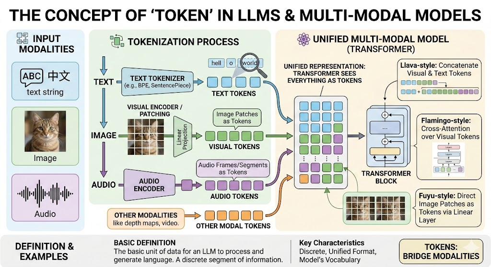

- **文本Token**：与传统LLM相同，是分词后的文本单元；

- **视觉Token**： 图像被分割成多个图像块，每个图像块通过线性投影或视觉编码器转换为一个视觉Token；

- **音频Token**：音频信号经过编码后形成的离散表示；
- **其他模态Token**：：视频、深度图等均可离散化后转换为Token序列。

3. **示例**

**文本Token**：”我爱天安门“ -----> [“我”，”爱“，”北京“，”天安门“]（按词划分）/ [”我“，”爱“，”北“，”京“，”天“，”安“，”门“]（按字切分）

<h2 id="2.模型命名中的"7B"，"INT4"等参数含义是什么？">2.模型命名中的"7B"，"INT4"等参数含义是什么？</h2>

### 1. "7B" - 规模参数

1. **基本定义**

在大语言模型命名中，7B、13B、540B等数字表示**模型的参数量**，其中“B”指“billion”（十亿）。

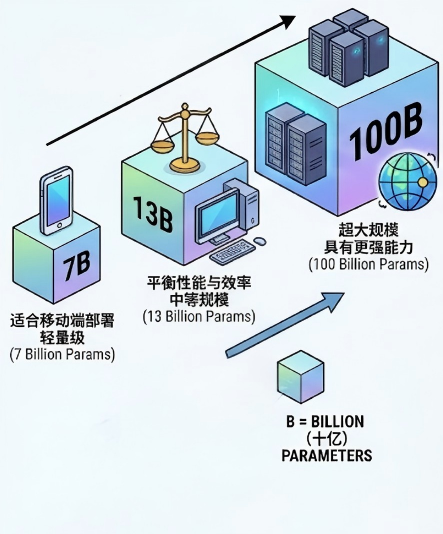

- **核心规律**：参数量越大的模型，通常具有更强的语言理解和生成能力，但也需要更多计算资源。

2. **扩展到多模态模型**

在多模态大模型中，**参数规模的表示方式保持一致**，但参数构成更加复杂（以视觉，文本为例）：

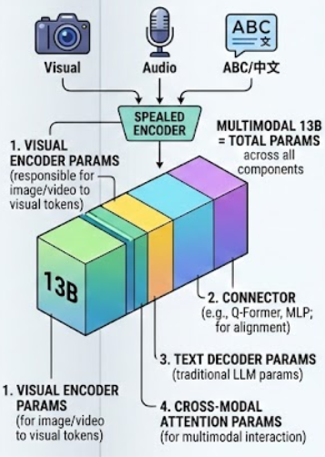

- 视觉编码器参数：负责将图像/视频转换为视觉Token；

- 连接器参数：如Q-Former、MLP等模块，用于对齐多模态表示；

- 文本解码器参数：传统的语言模型参数；

- 跨模态注意力参数：专门处理多模态交互的注意力机制。

3. **示例**

- 纯文本模型：LLaMA-7B（仅含文本解码器70亿参数）；

- 多模态模型：LLaVA-13B（包含视觉编码器+连接器+文本解码器，总计约130亿参数）；

- MoE多模态模型：DeepSeek-V3总参数量达671B，但每个Token仅激活37B参数。

- **注意事项**：评估大模型时，需区分总参数量与有效任务参数。

### 2. "INT4" - 量化精度参数

1. **基本定义**

在模型命名中，“INT4”、“INT8”、“FP16”等后缀指示了**模型权重和激活值所使用的数值精度格式**。

- **核心规律**：位数越低，模型体积越小，推理速度通常越快，但精度损失的风险也越大。

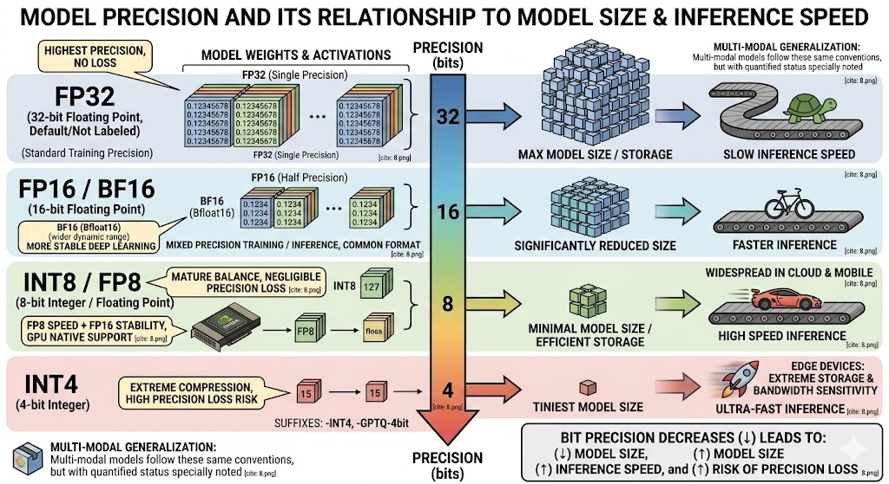

2. **扩展到多模态**

量化技术同样适用于多模态大模型，其命名通常继承其基础模型的约定，但会特别说明量化状态。

3. **示例**

| 精度格式 | 全称 | 位数 | 特点与用途 | 典型模型后缀示例 |
|----|------|------|------------|:----------------:|
| INT4 | 4位整数 | 4 bits | 极致的压缩，模型体积最小，但精度损失风险最高。适用于对存储和带宽极度敏感的边缘设备。 | -INT4, -GPTQ-4bit |
| INT8 | 8位整数 | 8 bits | 成熟的平衡点，在多数任务上精度损失可忽略，推理速度显著提升。广泛应用在云端和移动端部署。 | -INT8, -8bit |
| FP8 | 8位浮点数 | 8 bits | 兼顾INT8的速度和FP16的稳定性。NVIDIA H系列GPU原生支持，适合训练和推理。 | -FP8 |
| FP16 / BF16 | 16位浮点数 | 16 bits | 半精度，是混合精度训练和推理的常用格式。BF16（Bfloat16）范围更大，更适合深度学习。 | -FP16, -BF16 |
| FP32 | 32位浮点数 | 32 bits | 单精度，原始训练精度，精度最高，但计算和存储成本也最高。 | （通常为默认，不标注） |

<h2 id="3.LLM主要有哪些类型？">3.LLM主要有哪些类型？</h2>

大语言模型（LLM）可以从**架构、模态、规模、功能**等多个维度进行分类。

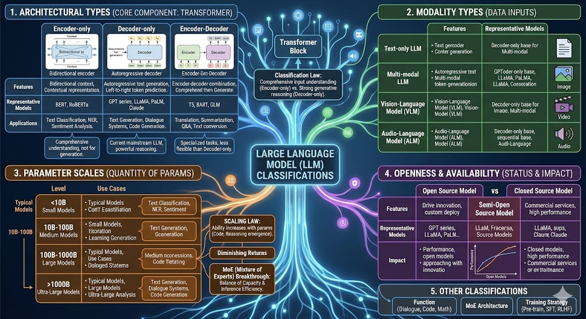

### 1.按架构类型分类

这是**最核心**的分类方式，基于核心组件（Transformer）的使用方式划分：

| 类型                     | 核心特点                                                                 | 代表模型               | 主要应用                           |
|--------------------------|--------------------------------------------------------------------------|------------------------|------------------------------------|
| Encoder-only（仅编码器） | 只使用Transformer的编码器，双向理解文本，生成上下文表示                     | BERT、RoBERTa、DeBERTa | 文本分类、命名实体识别、情感分析     |
| Decoder-only（仅解码器） | 只使用Transformer的解码器，自回归生成文本，从左到右逐个预测Token           | GPT系列、LLaMA、PaLM、Claude | 文本生成、对话系统、代码生成       |
| Encoder-Decoder（编码器-解码器） | 同时包含编码器和解码器，先编码理解输入，再解码生成输出                   | T5、BART、GLM          | 翻译、摘要、问答、文本转换         |

- **Encoder-only**：适合需要全面理解输入文本的任务，如分类、实体识别，但不适合生成任务。

- **Decoder-only**：已成为当前主流的大语言模型架构，通过大规模预训练展现出强大的生成和推理能力。

- **Encoder-Decoder**：在特定任务（如翻译、摘要）上表现优异，但在通用语言理解和生成上不如Decoder-only模型灵活。

### 2.按模态类型分类

| 类型 | 处理模态 | 核心特点 | 代表模型 |
|------|----------|----------|----------|
| 纯文本模型 | 仅处理文本 | 专注于语言理解和生成，技术成熟 | GPT-4、LLaMA、Claude |
| 多模态模型 | 文本+图像/视频/音频 | 能理解和生成多种模态内容 | GPT-4V、Gemini、LLaVA、Flamingo |
| 视觉语言模型 | 文本+图像 | 多模态模型的子集，专注于图文交互 | LLaVA、BLIP-2、Qwen-VL |
| 音频语言模型 | 文本+音频 | 处理语音识别、语音生成等 | Whisper、AudioPaLM |

- **多模态模型**通常以Decoder-only文本模型为骨干，前端添加视觉编码器、连接器等组件。视觉语言模型是多模态模型中最成熟的一类。

### 3.按参数规模分类

| 类型 | 参数量范围 | 典型模型 | 适用场景 |
|------|------------|----------|----------|
| 小型模型 | <10B | Qwen2.5-1.5B | 移动端部署、边缘计算、轻量级应用 |
| 中等模型 | 10B-100B | LLaMA-2-13B | 企业级应用、云服务、中等复杂度任务 |
| 大型模型 | 100B-1000B | DeepSeek-V3（671B） | 复杂推理、创意生成、高精度任务 |
| 超大规模模型 | >1000B | GPT-4（传闻1.8T）、 | 前沿研究、复杂系统、综合性AI平台 |

- **规模定律**：模型能力随参数量增加而显著提升，尤其是涌现能力（如推理、代码生成）通常在达到一定规模后出现。

- **边际效应**：超过一定规模后，性能提升的边际成本增加。

**MoE架构突破**：混合专家（MoE）架构如DeepSeek-V3（671B总参数，每Token激活37B）实现了“大容量、高效推理”的平衡。

### 4.按开源状态分类

| 类型 | 特点 | 代表模型 | 影响力 |
|------|------|----------|--------|
| 开源模型 | 公开权重、架构、训练方法 | LLaMA系列、Qwen、ChatGLM | 推动技术普及、社区创新、成本降低 |
| 闭源模型 | 仅提供API，不公开细节 | GPT系列、Claude、Gemini | 商业化服务、技术壁垒、质量控制 |
| 半开源模型 | 公开部分权重或提供有限访问 | 早期GPT（部分开源） | 平衡商业利益与技术共享 |

- **开源优势**：可定制、可私有化部署、透明度高、社区驱动创新。
- **闭源优势**：通常能力更强、服务稳定、集成简便、商业支持完善。
- **当前趋势**：开源模型能力快速逼近闭源模型。

### 5.其他分类方式

还存在很多其他的分类方式，比如按照功能特性分为通用对话，代码生成，数学推理等模型；按照技术架构分为混合专家等模型；按照训练策略分为预训练，指令微调和对齐等模型。

<h2 id="4.为何当前主流大模型多采用Decoder-only架构？">4.为何当前主流大模型多采用Decoder-only架构？</h2>

1. **建模能力与表达上限更高**

- Decoder的因果注意力是严格的下三角满秩矩阵，表征空间更丰富，建模能力更强。

- 本身打破Transformer的位置不变性，具有隐式位置编码功能。

- 仅凭上文预测下一个Token是信息受限的更难任务，迫使模型深入理解上文，学习更通用的语言模式。

2. **训练与推理效率**

- Prompt信息能更直接作用于Decoder每一层，在Few-shot任务上微调信号更强。

- 在同等参数量和计算成本下，Decoder-only将所有参数集中于解码器，生成能力更强。

3. **工程生态的“马太效应”**

- GPT系列的成功确立了Decoder-only的事实标准。

- 主流多模态模型（GPT-4V、LLaVA）均在Decoder-only语言模型上嫁接视觉编码器，统一处理图文信息。

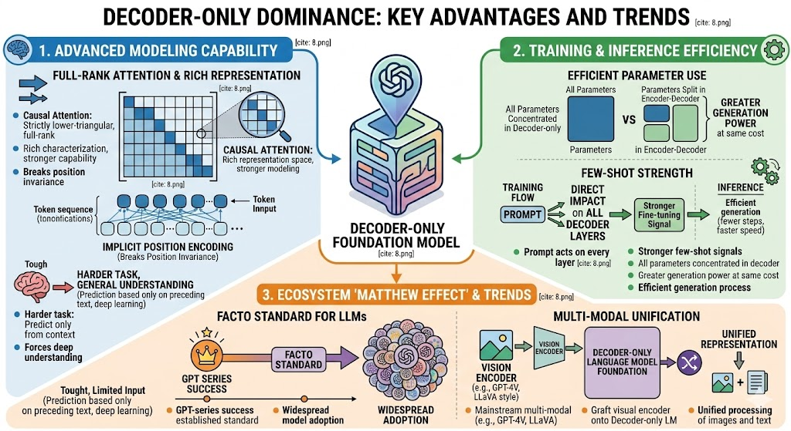

<h2 id="5.混合专家模型（MOE）的原理和作用是什么">5.混合专家模型（MOE）的原理和作用是什么</h2>

混合专家模型（Mixture of Experts，MoE）是一种**稀疏门控**的深度学习架构，它通过**动态路由机制**将**不同输入**分配给**不同的“专家”子模型**处理，在大幅增加模型总参数量的同时，几乎不增加计算成本，是实现超大规模语言模型的关键技术之一。

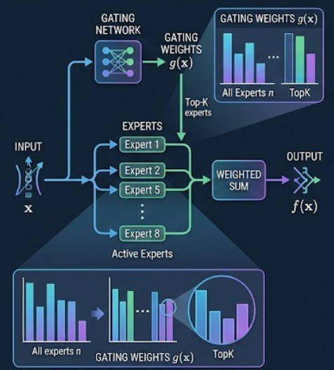

1. **核心原理：门控路由与条件计算**

MoE模型由两个核心组件构成：

- **专家网络**：一组相对独立的子模型，每个专家负责处理特定类型的输入模式。

- **门控网络**：根据当前输入特征，动态决定哪些专家被激活以及它们的权重分配。

2. **概念公式**

给定输入 \( x \)，MoE层的输出为：

$$
f(x) = \sum_{i=1}^{n} \underbrace{g_i(x)}_{\text{门控权重}} \cdot \underbrace{h_{\theta_i}(x)}_{\text{专家输出}}
$$

其中：
- \( n \) 为专家总数；

- \( $h_{\theta_i}(x)$ \) 是第 \( i \) 个专家的输出；

- \( $g_i(x)$  \)是 Softmax 门控函数，表示输入 \( x \) 应分配给第 \( i \) 个专家的概率。

在实践中，并不使用所有专家，而是**仅激活权重最高的前k个专家**（通常k=1或2）：

$$
f(x) = \sum_{i \in \text{TopK}(g(x))} g_i(x) \cdot h_{\theta_i}(x)
$$

这种**"条件计算"**特性意味着：

- **总参数量巨大**：专家数量可多达数百/数千个；

- **计算量几乎恒定**：每个输入仅激活少量专家（如2个）。

3. **核心价值**

- **原理本质**：通过稀疏门控实现条件计算，动态路由输入到最合适的专家子网络。

- **核心作用**：解耦参数量与计算量，使构建**万亿参数级模型**成为可能，同时保持可行训练和推理成本。

- **额外收益**：促进**模型内部专业化分工**，提升不同领域任务的处理质量。

- **未来方向**：MoE已成为超大规模基础模型的标配架构，结合多模态、长上下文、强化学习等方向持续演进。

<h2 id="6.什么是大模型的"涌现能力"？">6.什么是大模型的"涌现能力"？</h2>

1. **基本定义**

**涌现能力**指的是当**模型的规模**（参数量、数据量、计算量）和**复杂度**达到某个临界点时，突然出现的一系列在较小模型中完全观察不到的**新能力**。这些能力并非通过直接编程或特定任务训练获得，而是模型在大量数据和复杂训练过程中自然“涌现”出来的。

- **突然出现**：能力表现随模型规模增长呈非线性、阶跃式提升，而非平滑渐变；

- **不可预测性**：在小规模模型上完全无法预见到这些能力的存在；

- **泛化性**：涌现的能力往往具有跨任务、跨领域的通用性。

2. **典型涌现能力表现**

- **上下文学习**

	表现：仅通过提供几个示例（Few-shot）甚至不提供示例（Zero-shot），模型就能理解任务并给出正确答案。
	示例：给定“法国→巴黎，日本→东京，德国→？”模型能输出“柏林”。
	
- **指令遵循**
	
	表现：能够理解并执行自然语言指令，而无需特定任务训练。
	示例：“请用鲁迅的风格写一首关于秋天的诗” → 模型生成符合要求的诗歌。

- **多语言处理与跨语言泛化**

	表现：仅用英语数据预训练的模型，能处理未见过的语言的翻译、问答等任务。
	机制：不同语言在嵌入空间中形成了共享的语义表征。
	
3. **总结**

| 维度 | 说明 |
|------|------|
| 本质 | 模型规模达到临界点时的非线性能力跃迁 |
| 表现 | 上下文学习、指令遵循、逐步推理、多语言处理等通用智能行为 |
| 产生条件 | 足够大的参数量、数据量、计算量 + 合适的架构与训练 |
| 关键特征 | 突然性、不可预测性、泛化性 |
| 理论地位 | 理解智能如何从简单组件中产生的核心科学问题 |
| 实践意义 | 大模型价值的核心体现，推动AI向通用化发展 |

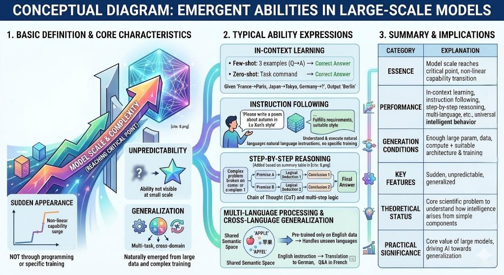

<h2 id="7.LLM会产生哪些偏见，什么原因以及如何减轻？">7.LLM会产生哪些偏见，什么原因以及如何减轻？</h2>

### 1. LLM会产生哪些偏见？

大语言模型（LLM）的**偏见**是指模型在其生成、决策或表征中系统性地倾向于某些群体、观点或文化，而对其他群体、观点或文化产生**不公正的贬低或忽略**。这些偏见主要源于模型从人类产生的数据中学习到的统计规律，并可能在部署后对社会公平、伦理和安全产生深远影响。

**大模型偏见现状**：现在这些偏见在主流大模型中**已不再 “普遍公然存在”**，但远未彻底消失。

- 管控最严、改善最明显：性别、种族、民族、宗教、明显仇恨类；

- 相对更容易残留：年龄、地域、文化、社会经济、语言口音这类更日常、更模糊的刻板印象。

### 2. 产生偏见的主要原因有哪些？

- **训练数据的偏差（核心根源）**：互联网文本本身包含了人类社会的各种偏见，模型通过统计学习不可避免地吸收这些模式；数据中含有的历史歧视同样被模型学习并延续；少数群体、边缘文化、非主流观点在训练数据中被低估或忽视。

- **模型架构和训练方法的放大效应**：过度追求准确性、流畅性等指标，可能以牺牲公平性为代价。

- **人类标注者的偏见**：在监督学习、强化学习从人类反馈（RLHF）等环节中，标注者的主观偏见会直接注入训练信号。

#### 3. 如何减轻偏见？

| 环节 | 关键措施 | 目标 |
| :--- | :--- | :--- |
| 数据 | 多样化采集、去偏预处理、平衡采样 | 切断偏见源头 |
| 训练 | 偏见检测、对抗训练、公平性约束 | 防止偏见固化与放大 |
| 评估 | 多维基准测试、公平性指标、审计报告 | 量化偏见，明确改进方向 |
| 部署 | 实时监控、用户反馈、持续迭代 | 动态适应，及时纠偏 |
| 治理 | 伦理审查、多元团队、行业标准 | 建立制度性保障 |

<h2 id="8.什么是大模型的幻觉，什么原因以及如何减轻？">8.什么是大模型的幻觉，什么原因以及如何减轻？</h2>

### 1. 什么是大模型的幻觉？

**幻觉**指的是模型生成**看似合理、流畅，但实际上与事实不符、缺乏依据或完全虚构的内容**。幻觉是LLM基于概率建模本质的**固有缺陷**，无法完全根除，但可以通过**系统工程方法显著减轻**。

**大模型幻觉现状**：已显著改善但未根除，呈现 "场景分化、模型分层、类型差异" 的特点 —— 日常简单问答基本可靠，复杂专业场景仍需警惕。

- **关键特征**：

    表面合理性：输出在语法、句式和局部逻辑上连贯流畅，极具欺骗性。
    事实错误：内容在事实性、准确性、一致性上存在缺陷。
    虚构捏造：可能生成不存在的事件、人物、数据或引用。
    
- **常见表现形式**：

    事实性幻觉：生成错误的历史日期、科学数据、人物生平。
    引用幻觉：虚构不存在的论文、书籍、网址作为信息来源。
    逻辑幻觉：在推理过程中引入未经前提支持的结论。
    指令幻觉：未能遵循用户指令，自行添加或省略要求的内容。
    
### 2.幻觉产生的主要原因有哪些？

- **训练数据的质量问题（核心根源）**：海量互联网训练数据中不可避免地包含错误信息、矛盾陈述和虚假内容；训练数据是历史快照，无法涵盖最新发生的事件和知识更新；某些领域或主题的数据不足，模型被迫“猜测”或泛化过度。

- **模型训练目标，架构，推理和提示的局限性**：模型倾向于生成统计上常见、语法流畅的延续，即使内容不真实（训练目标）。所有知识都编码在模型权重中，存在容量限制和记忆误差（架构）。每一步的微小错误会在后续生成中被放大（推理）。用户输入不清晰时，模型可能“脑补”出错误内容（提示）。

### 3. 如何减轻幻觉？

| 干预阶段 | 核心策略 | 目标 |
| :--- | :--- | :--- |
| 训练前 | 高质量数据源、严格清洗、去噪去重 | 减少错误知识输入 |
| 训练中 | 事实性SFT、RLHF、多任务学习 | 强化"真实性"目标 |
| 推理中 | RAG、约束解码、不确定性量化 | 实时约束与验证 |
| 输出后 | 事实验证、一致性检查、人工审核 | 最终质量把关 |
| 使用中 | 用户教育、反馈机制、透明解释 | 生态共建与风险缓释 |

<h2 id="9.怎么基本使用大模型？promptengineering？模型微调？预训练？">9.怎么基本使用大模型？prompt engineering？模型微调？预训练？</h2>

使用大语言模型主要有三种基本方法，它们构成了从**即用型到定制型**的技术谱系。理解这三种方法及其适用场景，是有效使用大模型的关键基础。

### 1. **Prompt engineering（提示工程）**

1. **定义**

通过**精心设计输入提示词**，引导大模型生成期望输出的技术。它**不改变**模型权重，完全依赖模型的**原始能力**。

2. **核心技术与方法**

| 技术 | 核心原理 | 适用场景 |
| :--- | :--- | :--- |
| 指令工程 | 明确告诉模型要做什么，格式如“请用中文总结以下内容：” | 通用任务，如总结、翻译、改写 |
| 少样本提示 | 提供少量示例，让模型学习任务模式 | 格式转换、文本分类等结构化任务 |
| 思维链提示 | 要求模型展示推理步骤（“让我们一步步思考”） | 复杂推理、数学问题解决 |
| 系统提示 | 设定模型的角色和行为准则（“你是一个专业的翻译”） | 需要特定身份或风格的任务 |
| 提示词压缩 | 精简提示词长度，减少计算负担同时保持效果 | 处理长文本时的效率优化 |

3. **优势与局限**：

优势：零训练成本、即时可用、高度灵活、无技术门槛
局限：效果依赖模型原生能力、难以应对复杂/专业任务、存在提示词攻击风险

### 2. **Fune-tuning（模型微调）**

1. **定义**

在预训练模型基础上，使用**特定领域的数据集**继续训练，使模型适应该领域**特定任务**的技术。它会**修改模型权重**，使其获得领域专长。

2. **核心技术与方法**

| 微调类型 | 技术特点 | 资源需求 | 适用场景 |
| :--- | :--- | :--- | :--- |
| 监督微调（SFT） | 使用高质量标注数据调整模型输出 | 中等规模数据（千-万级样本） | 通用任务性能提升、指令遵循能力增强 |
| 参数高效微调（LoRA、Adapter） | 只训练少量新增参数，原始参数冻结 | 数据量少，计算资源有限 | 快速领域适应、资源受限环境 |
| 全参数微调 | 更新模型所有参数 | 大规模数据、充足计算资源 | 深度领域定制、性能极致优化 |

3. **优势与局限**

	优势：实现任务专业化和性能跃升，利用私有数据创造壁垒；
	局限：灾难性遗忘，计算资源与成本门槛。

### 3. **Pre-training（预训练）**

1. **定义**

预训练是从**零开始训练**一个大模型的过程。使用海量无标注文本数据（通常千亿至万亿Token），通过自监督学习构建模型的基础语言能力。

2. **预训练的核心要素**

| 要素 | 要求与挑战 | 关键考虑 |
| :--- | :--- | :--- |
| 数据规模 | 千亿至万亿Token的高质量文本 | 数据清洗、去重、格式统一 |
| 计算资源 | 数千张GPU持续训练数周至数月 | 分布式训练优化、故障恢复 |
| 架构设计 | 决定模型容量和效率 | 参数量、层数、注意力头数 |
| 训练算法 | 优化器选择、学习率调度、梯度处理 | 稳定性、收敛速度、性能上限 |
| 成本投入 | 数百万至上千万美元计算成本 | ROI分析、预算规划 |

3. **谁需要预训练**？

- 科技巨头：如OpenAI、Google、Meta等，打造基础模型；

- 国家/地区级项目：构建自主可控的AI基础设施；

- 特定语言/文化：为资源不足的语言构建专门模型；

- 研究机构：探索新的模型架构和训练方法。
  
4. **预训练成本过高**，更实际的个人/组织选择是什么？

- 使用开源预训练模型（如Llama、Qwen、DeepSeek等）；

- 基于现有模型进行微调；

- 专注于应用层开发，而非基础模型构建。
	
### 4. **如何选择合适的方法？**

| 考虑维度 | 提示工程 | 模型微调 | 预训练 |
| :--- | :--- | :--- | :--- |
| 技术门槛 | 低（无需编程） | 中（需要ML知识） | 极高（需要顶尖团队） |
| 数据需求 | 零或少量示例 | 百至万级标注样本 | 千亿级无标注数据 |
| 计算成本 | 仅推理成本 | 中等训练成本 | 数百万美元级 |
| 开发周期 | 分钟至小时 | 天至周 | 月至年 |
| 效果上限 | 受限于基础模型 | 可超越基础模型 | 定义模型天花板 |
| 灵活性 | 即时调整 | 调整需重新训练 | 几乎无法调整 |

<h2 id="10.什么是大模型智能体（Agent）？">10.什么是大模型智能体（Agent）？</h2>

1. **定义**

大模型智能体是一个以大语言模型为核心决策引擎，能够自主感知、规划、执行和反思以完成复杂目标的人工智能系统。

| 维度 | 智能体 |
| :--- | :--- |
| 感知输入 | 文本 + 图像 + 音频 + 视频 + 传感器数据 |
| 环境理解 | 直接“看到”和“听到”真实环境 |
| 规划/行动 | 文本/语音回复 + 图像生成 + 工具调用 |
| 记忆反思 | 多模态记忆（图像记忆、声音记忆等） |

2. **核心特征**

- 自主性：能独立设定目标并执行；

- 工具使用：能调用外部API、数据库、计算工具等；

- 多步推理：能规划复杂任务并分步执行；

- 环境交互：能感知环境状态并作出相应调整；

- 学习反思：能从执行结果中学习改进策略。

3. **工作流程**

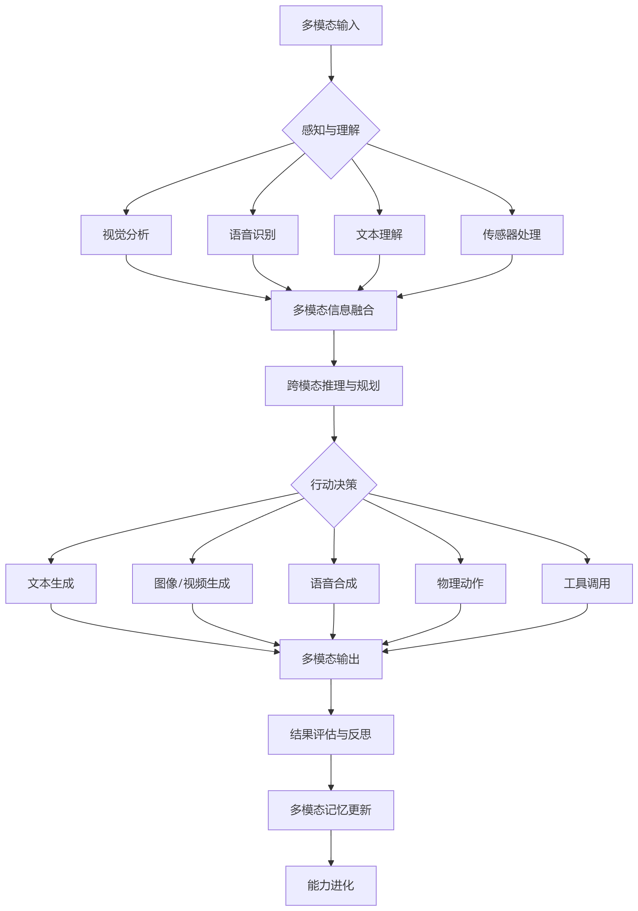

4. **示例**

- **感知**：

    摄像头输入：识别道路、车辆、行人、交通标志
    雷达/LiDAR数据：测量距离和速度
    GPS信息：确定位置和导航路线
    语音指令：接收驾驶员指令
    
- **理解**：

    关联视觉信号与语义信息（“红灯”意味着“停车”）
    结合地图数据与实时视觉信息
    理解驾驶员的语音意图

- **规划**：

    生成驾驶路径（空间规划）
    预测其他交通参与者的行为
    规划避障策略

- **行动**：

    控制方向盘、油门、刹车（物理动作）
    语音提示驾驶员（音频输出）
    显示屏展示导航信息（视觉输出）

- **记忆与反思**：

    分析驾驶决策的效果
    从成功/失败案例中学习
    更新驾驶策略模型

<h2 id="11.智能体有哪些协议标准？">11.智能体有哪些协议标准？</h2>

智能体协议标准体系已经形成清晰的层次结构，以 **MCP/A2A** 为核心，构建了完整的智能体通信与协作基础设施。

### 1.MCP协议（Model Context Protocol，模型上下文协议）

- **推出方**：Anthropic

- **定位**：AI 的“USB-C 端口”

- **核心功能**：

    统一大模型与外部工具、数据源的接口标准
    支持动态工具发现与注册
    提供标准化的工具描述格式（JSON Schema）
    
- **解决的问题**：单智能体能力增强，让模型能够无缝连接外部资源

### 2.A2A协议（Agent-to-Agent Protocol，智能体间协议）

- **推出方**：Google（现由 Linux Foundation 托管）

- **定位**：智能体间的“TCP/IP 协议”

- **核心组件**：

    Agent Card：智能体“名片”，描述能力、接口、权限
    任务对象：标准化的任务描述格式
    工件：智能体间交换的结果数据

- **解决的问题**：跨平台、跨厂商智能体协作，实现真正的多智能体系统

### 3.MCP 与 A2A 的关键区别

| 维度 | MCP | A2A |
| :--- | :--- | :--- |
| 关注点 | 单智能体能力增强 | 多智能体协作 |
| 通信对象 | 模型 ↔ 工具/数据源 | 智能体 ↔ 智能体 |
| 主要功能 | 工具调用、数据访问 | 任务分配、结果交换、状态同步 |
| 类比 | USB-C 接口（连接外设） | TCP/IP 协议（网络通信） |

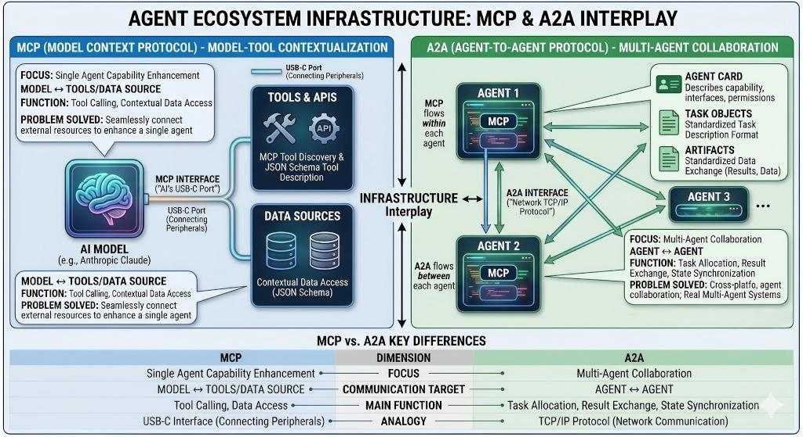

### 4.示例

1. 企业业务流程自动化

在企业级应用中，智能体通过 MCP 协议无缝连接核心业务系统，实现对内部数据与资源的统一访问与操作；各部门的专属智能体则通过 A2A 协议进行高效协作，共同完成跨部门的复杂业务流程。

2. 科研协作平台

不同研究机构的智能体通过 A2A协议相互交换数据与研究发现，同时利用 MCP协议直接控制实验设备，以执行具体的操作与实验任务。

<h2 id="12.如何评估大模型的性能？常用基准测试有哪些？">12.如何评估大模型的性能？常用基准测试有哪些？</h2>

### 1.如何评估大模型的性能？

大模型性能评估是一个系统性的工程，涉及多个维度和不同层次的测试方法。以下是常见的评估维度。

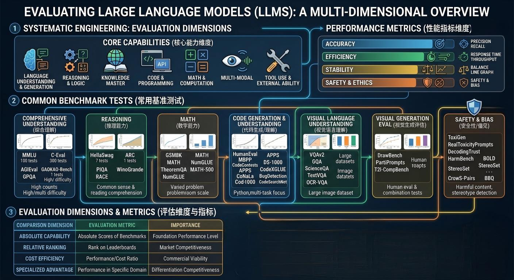

1.  **核心能力维度**

语言理解与生成能力（上下文理解，风格适应），推理与逻辑能力（归纳，符号，常识推理），知识掌握程度（事实，领域知识），代码与编程能力（代码生成，理解，优化），数学与计算能力（算术运算，证明，统计与概率等），多模态能力（视觉，音频和跨模态处理），工具使用与外部能力（工具调用，文件处理）

2. **性能指标维度**

准确性指标（精确率，准确率，召回率），效率指标（响应时间，吞吐量），稳定性指标（一致性，鲁棒性），安全与伦理指标（有害内容检测，偏见检测）

### 2.常用的基准测试有哪些？

根据上述常见的评估维度，以下是常见的基准。

1. 综合理解测试

| 测试名称 | 评估重点 | 题目数量 | 难度 |
| :--- | :--- | :--- | :--- |
| MMLU（Massive Multitask Language Understanding） | 57个学科的综合理解 | 15,908 | 高中到专业 |
| C-Eval | 中文多学科综合能力 | 13,948 | 基础到高级 |
| AGIEval | 中文综合推理与理解 | 8,162 | 多难度层次 |
| GAOKAO-Bench | 高考模拟题 | 2,500+ | 中国高考水平 |
| GPQA（Graduate-Level Google-Proof Q&A） | 博士水平专业知识 | 448 | 专家级 |

2. 推理能力测试

| 测试名称 | 评估重点 | 特点 |
| :--- | :--- | :--- |
| HellaSwag | 常识推理 | 基于情境的常识选择 |
| ARC（AI2 Reasoning Challenge） | 科学推理 | 需要科学知识的推理 |
| PIQA（Physical Interaction QA） | 物理常识 | 日常物理交互理解 |
| WinoGrande | 常识推理 | 代词消解和常识判断 |
| RACE | 阅读理解推理 | 英语考试阅读理解题 |

3. 数学能力测试

| 测试名称 | 评估重点 | 题目类型 |
| :--- | :--- | :--- |
| GSM8K | 小学数学应用题 | 8.5K道小学数学题 |
| MATH | 高中数学 | 竞赛级别数学题 |
| TheoremQA | 数学定理证明 | 数学定理证明和应用 |
| NumGLUE | 数值推理 | 数字相关推理问题 |
| MATH-500 | 中文数学题 | 中国数学竞赛题 |

4. 代码生成测试

| 测试名称 | 评估重点 | 编程语言 |
| :--- | :--- | :--- |
| HumanEval | 函数级代码生成 | Python |
| MBPP（Mostly Basic Python Problems） | 基础编程问题 | Python |
| CodeContests | 竞赛编程题 | 多种语言 |
| APPS（Automated Programming Progress Standard） | 应用级编程 | Python |
| DS-1000 | 数据科学代码生成 | Python（数据科学） |

5. 代码理解测试

| 测试名称 | 评估重点 | 特点 |
| :--- | :--- | :--- |
| CodeXGLUE | 多任务代码理解 | 13个代码相关任务 |
| CoNaLa | 代码注释生成 | 根据代码生成注释 |
| BugDetection | 代码缺陷检测 | 识别代码中的bug |
| CodeSearchNet | 代码搜索 | 根据描述查找代码 |

6. 视觉语言理解

| 测试名称 | 评估重点 | 数据规模 |
| :--- | :--- | :--- |
| VQAv2（Visual Question Answering） | 图像问答 | 265,016张图片 |
| GQA（Graph Question Answering） | 场景图推理 | 113,000张图片 |
| ScienceQA | 科学图像问答 | 21,208个问题 |
| TextVQA | 图像中的文本理解 | 28,408张图片 |
| OCR-VQA | 文档图像理解 | 1,000,000+问题 |

7. 视觉生成评估

| 测试名称 | 评估重点 | 评估方法 |
| :--- | :--- | :--- |
| DrawBench | 文本到图像生成 | 人类评估+自动评估 |
| PartiPrompts | 复杂提示生成 | 2000+复杂提示 |
| T2I-CompBench | 组合性图像生成 | 对象、属性、关系组合 |

8. 安全性测试

| 测试名称 | 评估重点 | 测试方法 |
| :--- | :--- | :--- |
| ToxiGen | 有害内容生成 | 自动检测有害言论 |
| RealToxicityPrompts | 毒性内容生成 | 真实有害提示测试 |
| DecodingTrust | 综合可信度评估 | 多维度安全测试 |
| HarmBench | 有害行为评估 | 系统性有害行为测试 |

9. 偏见检测

| 测试名称 | 评估重点 | 偏见维度 |
| :--- | :--- | :--- |
| BOLD（Bias in Open-ended Language Generation） | 生成文本偏见 | 性别、种族、宗教等 |
| StereoSet | 刻板印象检测 | 文化刻板印象 |
| CrowS-Pairs | 社会偏见 | 9类社会偏见 |
| BBQ（Bias Benchmark for QA） | 问答中的偏见 | 上下文中的偏见 |

### 3. 评估模型的意义

## 7. 评估维度与指标

| 对比维度 | 评估指标 | 重要性 |
| :--- | :--- | :--- |
| 绝对能力 | 各基准的绝对分数 | 基础性能水平 |
| 相对排名 | 在排行榜中的位置 | 市场竞争力 |
| 成本效率 | 性能/成本比 | 商业可行性 |
| 专项优势 | 特定领域的表现 | 差异化竞争力 |

