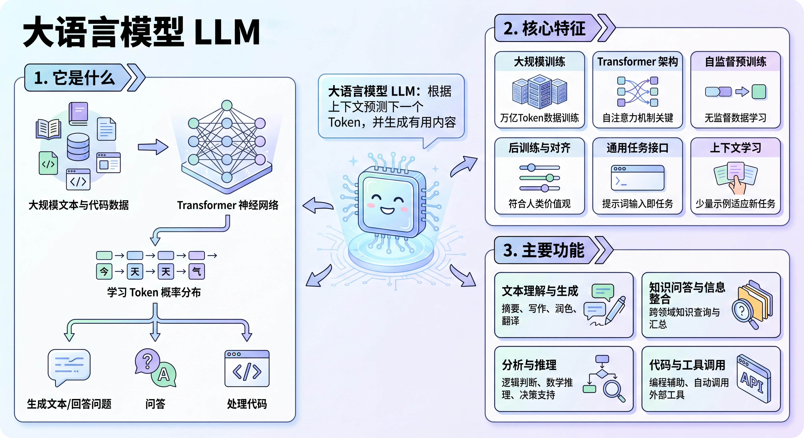
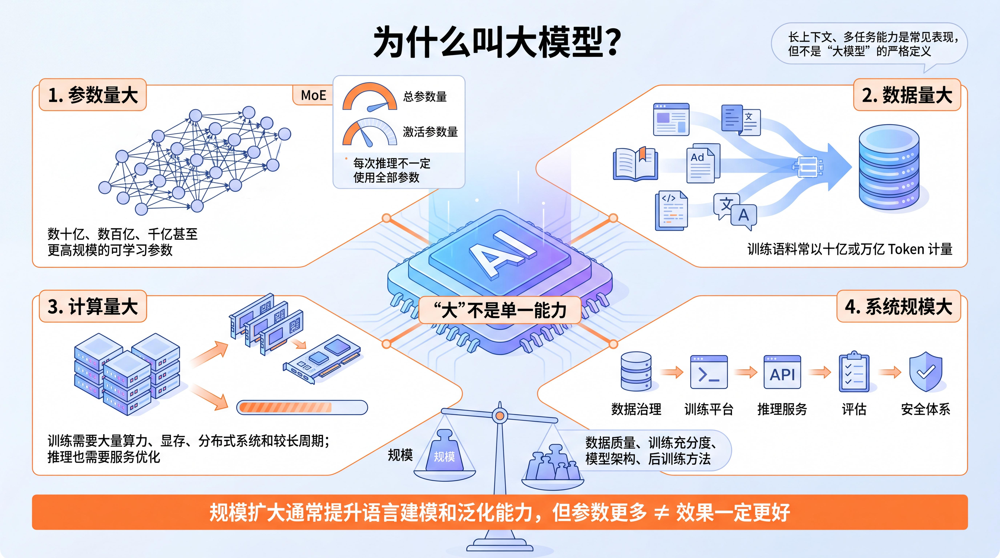
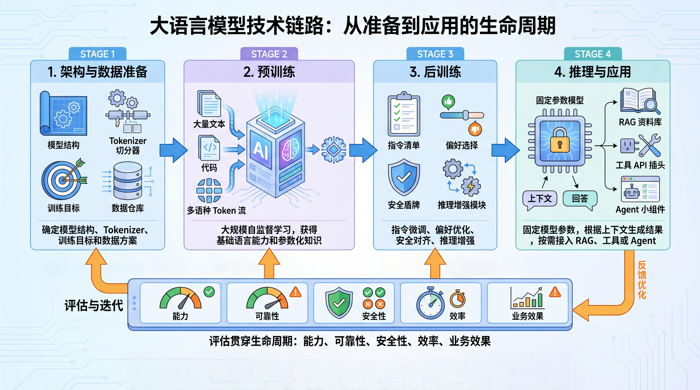
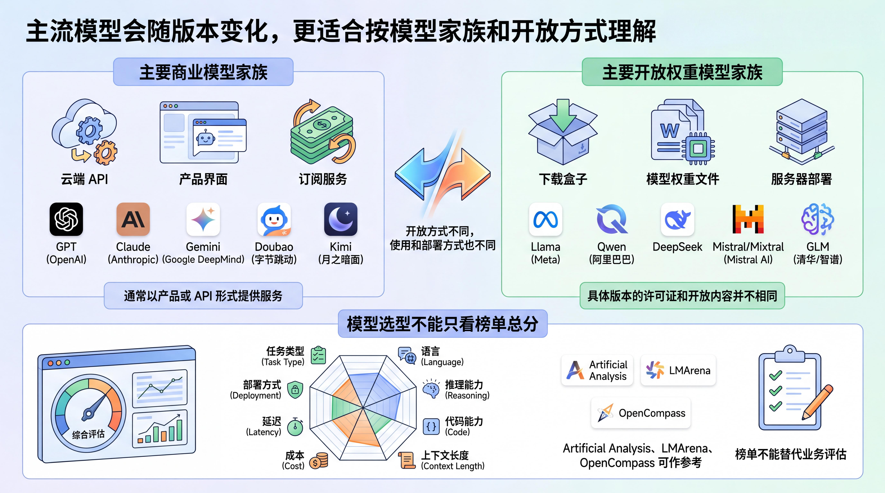
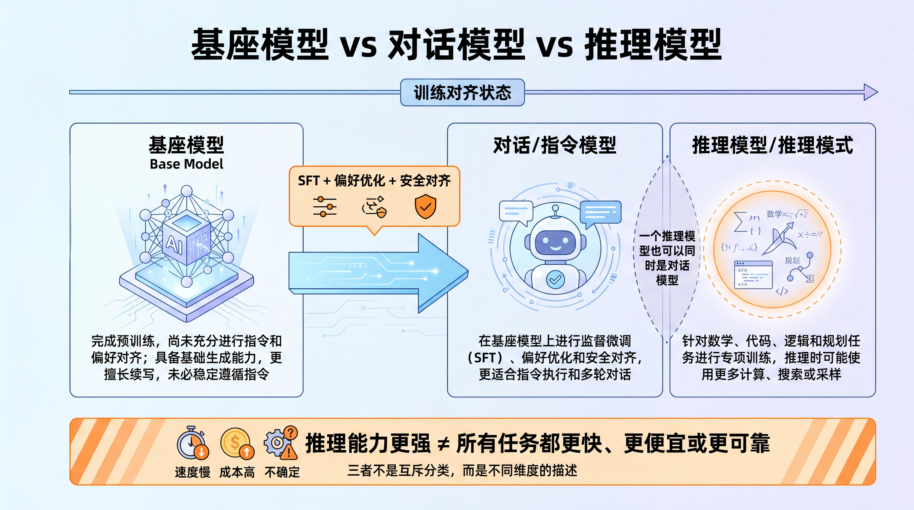
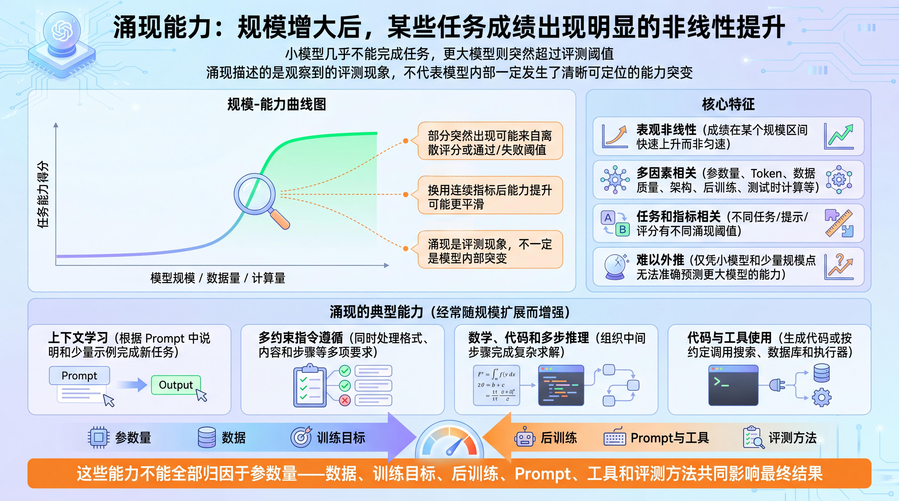
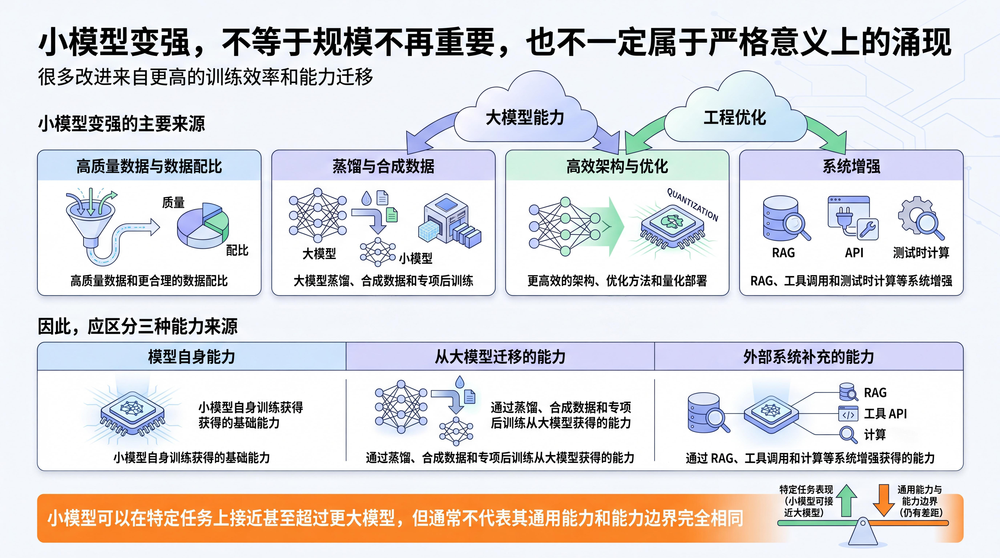
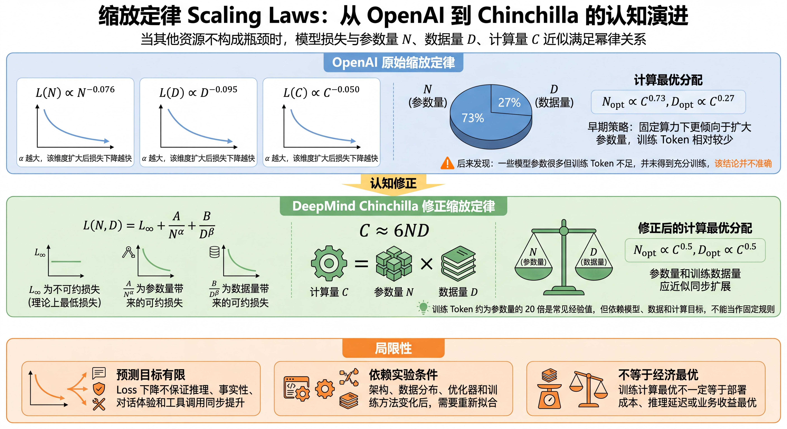
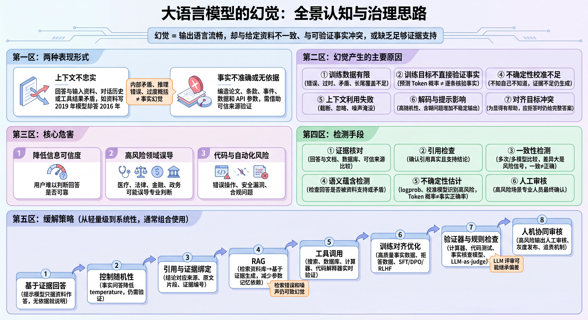

# 目录导航

- [基础概念与概述](<#基础概念与概述>)
- [1.大语言模型的基础概念与概述有哪些？](<#1.大语言模型的基础概念与概述有哪些？>)
  - [面试问题：什么是大语言模型？其核心特征和功能是什么？](<#面试问题：什么是大语言模型？其核心特征和功能是什么？>)
  - [面试问题：词元（Token）是什么？为什么是大语言模型的基石概念？](<#面试问题：词元（Token）是什么？为什么是大语言模型的基石概念？>)
  - [面试问题：为什么称为“大”模型？“大”体现在哪些维度？](<#面试问题：为什么称为“大”模型？“大”体现在哪些维度？>)
  - [面试问题：大语言模型与传统自然语言处理（NLP）模型的核心区别是什么？](<#面试问题：大语言模型与传统自然语言处理（NLP）模型的核心区别是什么？>)
  - [面试问题：大语言模型的生命周期包括哪些主要阶段？各阶段的核心目标是什么？](<#面试问题：大语言模型的生命周期包括哪些主要阶段？各阶段的核心目标是什么？>)
- [2.大语言模型有哪些主流模型？什么是开源模型？什么是基座模型？](<#2.大语言模型有哪些主流模型？什么是开源模型？什么是基座模型？>)
  - [面试问题：当前主流的大语言模型有哪些？](<#面试问题：当前主流的大语言模型有哪些？>)
  - [面试问题：什么是闭源/开源大模型？什么是通用/垂直大模型？](<#面试问题：什么是闭源/开源大模型？什么是通用/垂直大模型？>)
  - [面试问题：什么是基座模型？什么是对话模型？什么是推理模型？](<#面试问题：什么是基座模型？什么是对话模型？什么是推理模型？>)
  - [面试问题：大语言模型有哪些主流使用方式？](<#面试问题：大语言模型有哪些主流使用方式？>)
- [3.什么是大语言模型的涌现特性与缩放定律？](<#3.什么是大语言模型的涌现特性与缩放定律？>)
  - [面试问题：什么是大模型的“涌现能力”？](<#面试问题：什么是大模型的“涌现能力”？>)
  - [面试问题：为什么小模型也能表现出较强能力？这是否等同于涌现？](<#面试问题：为什么小模型也能表现出较强能力？这是否等同于涌现？>)
  - [面试问题：什么是大模型的缩放定律？](<#面试问题：什么是大模型的缩放定律？>)
  - [面试问题：缩放定律对模型规模的扩展有何指导意义？](<#面试问题：缩放定律对模型规模的扩展有何指导意义？>)
- [4.大语言模型存在哪些内在的局限性？](<#4.大语言模型存在哪些内在的局限性？>)
  - [面试问题：什么是“幻觉”？其产生的主要原因有哪些？](<#面试问题：什么是“幻觉”？其产生的主要原因有哪些？>)
  - [面试问题：大模型的知识为什么存在截止日期？如何获取实时信息？](<#面试问题：大模型的知识为什么存在截止日期？如何获取实时信息？>)
  - [面试问题：为什么大语言模型的对齐与安全风险难以完全消除？主要局限有哪些？](<#面试问题：为什么大语言模型的对齐与安全风险难以完全消除？主要局限有哪些？>)
  - [面试问题：大语言模型在哪些复杂任务上表现仍不理想？](<#面试问题：大语言模型在哪些复杂任务上表现仍不理想？>)
---
<h1 id="基础概念与概述">基础概念与概述</h1>

<h1 id="1.大语言模型的基础概念与概述有哪些？">1.大语言模型的基础概念与概述有哪些？</h1>

<h2 id="面试问题：什么是大语言模型？其核心特征和功能是什么？">面试问题：什么是大语言模型？其核心特征和功能是什么？</h2>

**难度评分：⭐ (1/5) | 考察频率：⭐⭐⭐⭐⭐ (5/5)**

##### 1. 什么是大语言模型？

**大语言模型（Large Language Model, LLM）** 是在大规模文本、代码等数据上训练的神经语言模型，主流实现通常采用 Transformer 架构。它学习 Token 序列的概率分布，并根据上下文预测后续 Token，因此可以生成文本、回答问题、处理代码和适配多种语言任务。

##### 2. 核心特征和功能有哪些？

a. **主要特征**

- **大规模训练**：通常使用大量参数、训练数据和计算资源，以学习复杂的语言模式和知识表示。

- **Transformer 架构**：通过注意力机制建模 Token 之间的关系，是当前生成式 LLM 的主流架构。

- **自监督预训练**：从大规模未逐条标注的数据中构造训练信号，例如预测下一个 Token。

- **后训练与对齐**：通过 SFT、RLHF、DPO 等方法改善指令遵循、对话体验、安全性和任务表现。

- **通用任务接口**：同一个模型可以通过 Prompt、上下文和示例完成问答、摘要、翻译、分类和代码生成等任务。

- **上下文学习**：模型可以根据请求中的任务说明和少量示例临时调整输出，而不必更新参数。

> **注**：Transformer 的注意力机制、位置编码、前馈网络和残差结构将在第 02 章展开；预训练与后训练分别在第 03、04 章展开。

b. **主要功能**

- **文本理解与生成**：完成问答、摘要、翻译、改写、分类和信息抽取。

- **知识问答与信息整合**：利用参数化知识或结合 RAG 整理外部资料。

- **分析与推理**：处理数学、逻辑、代码和规划任务，但复杂任务仍需要验证器、检索或外部工具提高可靠性。

- **代码与工具调用**：生成、解释和修改代码，并按照约定格式调用搜索、数据库、API 或执行环境。

<h2 id="面试问题：词元（Token）是什么？为什么是大语言模型的基石概念？">面试问题：词元（Token）是什么？为什么是大语言模型的基石概念？</h2>

**难度评分：⭐ (1/5) | 考察频率：⭐⭐⭐⭐⭐ (5/5)**

##### 1. 什么是词元（Token）？

**词元（Token）** 是大语言模型处理文本的基本离散单位。模型通常不能直接处理原始字符串，而是先通过 **分词器（Tokenizer）** 将文本切分成 token，再将 token 映射为 **Token ID**，最后转换为 **嵌入向量（Embedding）** 参与模型计算。

Token 的切分方式取决于分词器，没有统一规则。常见算法包括 **BPE、WordPiece 和 Unigram**；SentencePiece 是常用的分词工具，tiktoken 是一种 Tokenizer 实现。一个 Token 可能对应一个字、一个词、一个子词、一个符号，也可能包含空格或标点。

例如：

- “人工智能”可能被切分为“人工”和“智能”两个 token；
- 英文中的词缀、空格、标点也可能成为 token 的一部分。

##### 2. 为什么词元是大语言模型的基石概念？

Token 是大语言模型输入、计算、上下文管理和商业计费的基础单位。

- **模型运算基础**：文本先转换为 Token ID，再经过 Embedding 变成向量，才能进入模型计算。

- **资源与性能单位**：训练数据规模、上下文长度、推理计算量、延迟和显存占用都与 Token 数有关。

- **API 计费单位**：多数大模型服务分别统计输入和输出 Token，并据此计费或限流。

##### 3. 什么是上下文窗口？与词元有什么关联？

**上下文窗口（Context Window）** 是模型一次推理能够处理的最大 Token 序列长度。不同模型或 API 对输入和输出 Token 的计算方式可能不同，需要查看具体文档。

- **决定容量上限**：窗口越大，一次请求可以容纳的文本、代码、多轮对话或文档内容越多。

- **影响成本与延迟**：更长的输入通常增加 Prefill 计算、响应时间和调用费用等。

- **不等于有效理解长度**：标称窗口表示“能放多少”，不保证模型能稳定找到并使用所有信息。长距离检索、跨段推理和中间位置的信息利用仍可能退化。

>  **注**：prefill - 一次性处理完整输入。
>  **注**：实际应用常结合分块、RAG、摘要和上下文压缩，在准确率、成本和延迟之间取舍。

<h2 id="面试问题：为什么称为“大”模型？“大”体现在哪些维度？">面试问题：为什么称为“大”模型？“大”体现在哪些维度？</h2>

**难度评分：⭐ (1/5) | 考察频率：⭐⭐⭐⭐ (4/5)**

“大”首先指训练规模显著扩大，主要体现在参数量、训练数据和计算量。长上下文和多任务能力是现代大模型常见的能力表现，但不是“大模型”的严格定义。

##### 1. 主要规模维度

- **参数量大**：大模型通常包含数十亿、数百亿、千亿甚至更高规模的可学习参数。对于 MoE 模型，还需要区分 **总参数量** 和每次推理实际使用的 **激活参数量**。

- **数据量大**：训练语料可能包含网页、书籍、论文、代码和多语种数据，规模常以十亿或万亿 Token 计量。

- **计算量大**：训练需要大量加速卡、分布式系统和较长训练周期，推理也需要显存、算力和服务优化。

- **系统规模大**：除了模型本身，还涉及数据治理、训练平台、推理服务、评估和安全体系。

规模扩大通常会提升语言建模和泛化能力，但参数更多并不自动意味着效果更好。训练是否充分、数据质量、模型架构和后训练方法同样重要。

<h2 id="面试问题：大语言模型与传统自然语言处理（NLP）模型的核心区别是什么？">面试问题：大语言模型与传统自然语言处理（NLP）模型的核心区别是什么？</h2>

**难度评分：⭐ (1/5) | 考察频率：⭐⭐⭐⭐⭐ (5/5)**

大语言模型仍属于 NLP 技术体系。这里的“传统 NLP 模型”主要指规则、统计学习和面向单一任务训练的模型。二者的差异是典型趋势，不是绝对边界。

- **训练方式**：传统任务模型通常依赖特定任务的标注数据；LLM 先进行大规模自监督预训练，再通过后训练适配指令和人类偏好。

- **任务适配**：传统方案常为分类、分词、命名实体识别等任务分别训练模型；LLM 可以通过 Prompt、上下文示例、RAG 或微调适配多种任务。

- **输出形式**：传统模型常输出标签、分数或序列标注；生成式 LLM 以 Token 序列为统一接口，也可以输出代码、结构化数据和工具参数。

- **能力与成本**：任务模型通常更轻、更稳定，适合边界明确的场景；LLM 的通用性更强，但计算成本、输出不确定性和治理难度也更高。

> **注**：LLM 不是传统 NLP 的简单替代品。任务稳定、数据充足且成本敏感时，专用模型仍可能更合适。

<h2 id="面试问题：大语言模型的生命周期包括哪些主要阶段？各阶段的核心目标是什么？">面试问题：大语言模型的生命周期包括哪些主要阶段？各阶段的核心目标是什么？</h2>

**难度评分：⭐⭐ (2/5) | 考察频率：⭐⭐⭐⭐ (4/5)**

大语言模型的技术链路可以概括为以下阶段：

- **架构与数据准备**：确定模型结构、Tokenizer、训练目标和数据方案。
- **预训练**：通过大规模自监督学习获得基础语言能力和参数化知识。
- **后训练**：通过指令微调、偏好优化、安全对齐和推理增强调整模型行为。
- **推理与应用**：固定模型参数，根据上下文生成结果，并按需接入 RAG、工具或 Agent。
- **评估与迭代**：在训练、部署和应用阶段持续检查能力、可靠性、安全性、效率和业务效果。

通过迭代的反馈和更新，实现模型性能的逐步提升和飞跃。

<h1 id="2.大语言模型有哪些主流模型？什么是开源模型？什么是基座模型？">2.大语言模型有哪些主流模型？什么是开源模型？什么是基座模型？</h1>

<h2 id="面试问题：当前主流的大语言模型有哪些？">面试问题：当前主流的大语言模型有哪些？</h2>

**难度评分：⭐ (1/5) | 考察频率：⭐⭐⭐⭐ (4/5)**

“主流模型”会随版本迭代而变化，更适合按模型家族和开放方式理解，而不是把地域与开放程度混为同一分类。

- **主要商业模型家族**：GPT（OpenAI）、Claude（Anthropic）、Gemini（Google DeepMind）、Doubao（字节跳动）、Kimi（月之暗面）等，通常以产品或 API 形式提供服务。
- **主要开放权重模型家族**：Llama（Meta）、Qwen（阿里巴巴）、DeepSeek、Mistral/Mixtral（Mistral AI）、GLM 等。具体版本的许可证和开放内容并不相同。

模型选型不能只看榜单总分，还要结合任务类型、语言、推理与代码能力、上下文长度、成本、延迟、部署方式和安全要求。

> **注**：Artificial Analysis、LMArena、OpenCompass 等榜单可以作为参考，但不能替代业务评估。

<h2 id="面试问题：什么是闭源/开源大模型？什么是通用/垂直大模型？">面试问题：什么是闭源/开源大模型？什么是通用/垂直大模型？</h2>

**难度评分：⭐ (1/5) | 考察频率：⭐⭐⭐⭐ (4/5)**

##### 1. 什么是闭源/开源大模型？

这组概念按照模型的开放程度分类。更严谨的说法是区分 **闭源模型、开放权重模型和开放程度更完整的开源模型**。

| 分类 | 核心定义 | 代表模型 | 核心特点 |
| :--- | :--- | :--- | :--- |
| 闭源大模型 | 不开放模型权重，通常通过 API、在线平台或企业服务提供能力 | GPT、Claude、Gemini 等 | 开箱即用、服务成熟、综合能力强；但本地部署、深度定制和底层可控性较弱 |
| 开放权重模型 | 开放模型权重，允许用户下载、部署和微调，但许可证可能限制商用或再分发 | Llama、Qwen、DeepSeek、GLM、Mistral 等部分模型 | 可本地部署、可微调、数据可控性更强；但需要算力、工程能力和安全治理 |
| 开源模型 | 除权重外，还开放较完整的代码、训练方法或数据说明，并采用相应许可证 | 需根据具体项目判断 | 透明度和可改造性更高，但开放范围和复现条件仍可能不同 |

> **注**：很多被称为“开源大模型”的模型实际上只开放权重。能否商用、修改或再分发，应以具体版本的许可证为准。

##### 2. 什么是通用/垂直大模型？

按照 **能力覆盖范围和应用场景**，大模型可以分为通用大模型和垂直大模型。

| 分类 | 核心定义 | 代表模型 | 核心特点 |
| :--- | :--- | :--- | :--- |
| 通用大模型 | 面向多领域、多任务训练，具备较强的通用理解、生成、推理和泛化能力 | GPT、Claude、Gemini、Qwen、GLM、DeepSeek 等通用系列 | 能力覆盖广，适合作为底座模型；但在高专业度场景中通常需要 RAG、微调或工具增强 |
| 垂直或专项模型 | 面向特定行业或任务优化，可能结合领域数据、继续预训练、微调、RAG 和工具链 | 代码、医疗、法律、金融、工业等模型 | 在目标场景中更贴合需求，但能力边界取决于底座模型和系统方案 |

代码模型通常属于任务专项模型；医疗、法律、金融等则更接近行业垂直模型。二者都可能由通用模型继续训练或系统增强得到。

##### 3. 其他常见的分类标准有哪些？

除了开放程度和能力范围，还可以从模型结构、输入模态和部署方式分类。这些维度彼此独立，同一个模型可以同时属于多个类别。

- **按参数规模分类**：可粗略区分小型、中型和大型模型，但没有统一阈值。对 MoE 模型还要区分总参数量与激活参数量。

- **按模型结构分类**：可分为 Encoder-only、Encoder-Decoder、Decoder-only，也可区分稠密模型和 MoE 模型。主流生成式 LLM 多采用 Decoder-only。

- **按输入模态分类**：可分为纯文本模型和支持图像、音频、视频等输入的多模态模型。

- **按部署方式分类**：可分为云端 API、托管服务、自建部署和端侧部署。

<h2 id="面试问题：什么是基座模型？什么是对话模型？什么是推理模型？">面试问题：什么是基座模型？什么是对话模型？什么是推理模型？</h2>

**难度评分：⭐ (1/5) | 考察频率：⭐⭐⭐⭐ (4/5)**

基座模型、对话模型和推理模型不是三个互斥类别。前两者主要描述训练与对齐状态，“推理模型”主要描述能力优化方向；一个推理模型也可以同时是对话模型。

- **对话或指令模型**：在基座模型上进行 SFT、偏好优化和安全对齐，使模型更适合指令执行和多轮对话。

- **推理模型或推理模式**：针对数学、代码、逻辑和规划任务进行专项训练，并可能在推理时使用更多计算、搜索或采样。推理能力更强不代表所有任务都更快、更便宜或更可靠。

| 阶段 | 目标 | 数据 | 代表产物 |
| :--- | :--- | :--- | :--- |
| **预训练** | 学习语言规律、知识表示和基础生成能力 | 海量无标注文本、代码、数学和多语种数据等 | 基座模型，如 DeepSeek-Base、Qwen-Base |
| **指令微调（后训练）** | 适配指令格式、任务要求和对话场景 | 高质量指令数据、问答数据、任务数据 | 对话模型、指令模型、垂直模型 |
| **偏好与安全对齐（后训练）** | 改善回答偏好、拒答边界和安全行为 | 人类或 AI 偏好数据、安全数据 | 对齐后的指令或对话模型 |
| **推理增强（后训练）** | 提升数学、代码、逻辑、多步规划等复杂推理能力 | 推理数据、代码数据、数学数据、可验证任务反馈 | 推理模型、Thinking 模型 |

> **注**：预训练奠定基础能力，后训练调整模型行为和能力分布；最终效果还取决于推理配置、外部工具和应用系统。后续小节会详细拆分预训练、微调与对齐。

<h2 id="面试问题：大语言模型有哪些主流使用方式？">面试问题：大语言模型有哪些主流使用方式？</h2>

**难度评分：⭐ (1/5) | 考察频率：⭐⭐⭐⭐ (4/5)**

##### 1. 访问与部署方式

- **直接使用产品**：通过网页、App 或桌面端完成问答、写作、总结和代码辅助。
- **调用 API**：把模型接入产品、业务系统或自动化流程。
- **自建部署**：在本地服务器、私有云或端侧运行开放权重模型，换取更强的数据控制和定制能力，同时承担算力与运维成本。

##### 2. 应用增强方式

- **Prompt 和上下文示例**：快速约束任务、格式和回答方式。
- **RAG**：接入私有、实时、可追溯的外部知识。
- **工具调用与 Agent**：访问搜索、数据库、代码执行器或业务系统，完成多步骤任务。
- **微调或继续预训练**：长期调整模型行为、领域表达或能力分布，成本和风险高于 Prompt 与 RAG。

实际系统常组合多种方式，例如：企业问答可以使用 API、RAG 和权限控制；需要执行订单或查询库存时，再增加工具调用或工作流。

> **注**：具体方案将在第 04、05 章展开。

<h1 id="3.什么是大语言模型的涌现特性与缩放定律？">3.什么是大语言模型的涌现特性与缩放定律？</h1>

<h2 id="面试问题：什么是大模型的“涌现能力”？">面试问题：什么是大模型的“涌现能力”？</h2>

**难度评分：⭐⭐ (2/5) | 考察频率：⭐⭐⭐⭐ (4/5)**

**涌现能力（Emergent Abilities）** 通常指模型规模、数据量或计算量增加后，某些任务成绩在特定区间出现明显的非线性提升：小模型几乎不能完成任务，更大模型则突然超过评测阈值。

这一现象需要谨慎解释。部分“突然出现”可能来自离散评分、通过/失败阈值或评测精度不足；换用连续指标后，能力提升有时会表现得更平滑。因此，涌现描述的是观察到的评测现象，不代表模型内部一定发生了清晰可定位的能力突变。

##### 1. 核心特征

- **表观非线性**：部分任务成绩会在某个规模区间快速上升，而不是匀速改善。

- **多因素相关**：参数量、训练 Token、数据质量、架构、后训练和测试时计算都可能影响表现。

- **任务和指标相关**：不同任务、提示方式和评分方法可能得到不同的“涌现阈值”。

- **难以外推**：仅凭小模型和少量规模点，通常无法准确预测更大模型的具体能力。

##### 2. 典型能力

- **上下文学习**：根据 Prompt 中的说明和少量示例完成新任务。

- **多约束指令遵循**：同时处理格式、内容和步骤等多项要求。

- **数学、代码和多步推理**：在部分任务中组织中间步骤并完成复杂求解。

- **代码与工具使用**：生成代码或按照约定格式调用搜索、数据库和执行器。

这些能力经常与规模扩展同时增强，但不能全部归因于参数量。数据、训练目标、后训练、Prompt、工具和评测方法都会影响最终结果。

<h2 id="面试问题：为什么小模型也能表现出较强能力？这是否等同于涌现？">面试问题：为什么小模型也能表现出较强能力？这是否等同于涌现？</h2>

**难度评分：⭐⭐ (2/5) | 考察频率：⭐⭐⭐⭐ (4/5)**

小模型变强不等于规模不再重要，也不一定属于严格意义上的涌现。很多改进来自更高的训练效率和能力迁移：

- 高质量数据和更合理的数据配比；
- 大模型蒸馏、合成数据和专项后训练；
- 更高效的架构、优化方法和量化部署；
- RAG、工具调用和测试时计算等系统增强。

因此，应区分“模型自身能力”“从大模型迁移得到的能力”和“外部系统补充的能力”。小模型可以在特定任务上接近甚至超过更大模型，但通常不代表其通用能力和能力边界完全相同。

<h2 id="面试问题：什么是大模型的缩放定律？">面试问题：什么是大模型的缩放定律？</h2>

**难度评分：⭐⭐⭐ (3/5) | 考察频率：⭐⭐⭐⭐ (4/5)**

**缩放定律（Scaling Law）** 描述在模型架构、训练方法和数据分布基本稳定时，预训练损失如何随 **参数量 $N$、训练数据量 $D$ 和计算量 $C$** 增加而变化。实验中，这些关系常可近似为幂律：规模继续增加仍能降低损失，但收益逐渐变小。

缩放定律主要预测预训练 Loss 和计算最优配比。（不能直接等同于推理能力、事实准确性或产品体验，下游效果还受数据质量、架构、后训练、推理策略和评测方法影响。）

##### 1. OpenAI 原始缩放定律

《Scaling Laws for Neural Language Models》指出，当其他资源不构成瓶颈时，模型损失与参数量、数据量和计算量分别近似满足幂律关系。

- **参数量缩放**

$$
L(N) \propto N^{-\alpha_N}
$$

- **数据量缩放**

$$
L(D) \propto D^{-\alpha_D}
$$

- **计算量缩放**

$$
L(C) \propto C^{-\alpha_C}
$$

其中：

- $N$ 表示模型参数量；
- $D$ 表示训练数据量，通常以 token 数计量；
- $C$ 表示训练计算量，通常以 FLOPs 计量；
- $L$ 表示验证集交叉熵损失；
- $\alpha$ 表示幂律指数，反映对应变量扩大后 Loss 下降的速度。 $\alpha_N = 0.076$，$\alpha_D = 0.095$，$\alpha_C = 0.050$

早期研究在固定计算预算下更倾向于扩大参数量，给出的计算最优关系可近似表示为：

$$
N_{opt} \propto C^{0.73}, D_{opt} \propto C^{0.27}
$$

> **注**：这一结论影响了早期的大模型扩展策略，但后来发现，由于一些模型参数很多、训练 Token 不足，并未得到充分训练，得出的结论并不准确。

##### 2. DeepMind Chinchilla 修正缩放定律

《Training Compute-Optimal Large Language Models》提出 Chinchilla Scaling Law，重新估计了参数量与训练数据量的计算最优配比。核心结论是：固定算力下不能只增加参数，还要提供足够的训练 Token。

其损失函数可简化理解为：

$$
L(N, D) = L_{\infty} + \frac{A}{N^{\alpha}} + \frac{B}{D^{\beta}}
$$

其中：

- $L_{\infty}$ 表示不可约损失，即理论上的最低损失，$L_{\infty} = 1.69$ ；
- $N$ 表示模型参数量；
- $D$ 表示训练 token 数；
- $A$、$B$、$\alpha$、$\beta$ 是通过实验拟合得到的常数。$A = 406.4$、$B = 410.7$、$\alpha = 0.34$、$\beta = 0.28$ 

在计算量近似满足：

$$
C \approx 6ND
$$

的情况下，Chinchilla 给出的计算最优结论是：

$$
N_{opt} \propto C^{0.5}, D_{opt} \propto C^{0.5}
$$

也就是说，在该研究的实验条件下，模型参数量和训练数据量应近似同步扩展（增长比例），比如：算力增加100倍，数据和参数量应该近似增加10倍。

“训练 Token 约为参数量的 20 倍”是常见的 Chinchilla 经验值，但它依赖模型、数据和计算目标，不能当作所有训练任务的固定规则。

##### 3. 局限性

- **预测目标有限**：Loss 下降不保证推理、事实性、对话体验和工具调用同步提升。

- **依赖实验条件**：架构、数据分布、优化器和训练方法变化后，需要重新拟合。

- **不等于经济最优**：训练计算最优不一定等于部署成本、推理延迟或业务收益最优。

<h2 id="面试问题：缩放定律对模型规模的扩展有何指导意义？">面试问题：缩放定律对模型规模的扩展有何指导意义？</h2>

**难度评分：⭐⭐ (2/5) | 考察频率：⭐⭐⭐ (3/5)**

缩放定律的核心价值是帮助分配训练预算，而不是证明“模型越大越好”。在固定算力下，需要共同考虑参数量、训练 Token、数据质量和训练充分度。

工程上可以先用小规模实验拟合趋势，再估算更大训练任务的损失和成本；也可以用它识别模型是否欠训练、何时出现边际收益递减，以及高质量数据或硬件效率是否已经成为瓶颈。最终决策仍要结合下游评估和推理成本。

<h1 id="4.大语言模型存在哪些内在的局限性？">4.大语言模型存在哪些内在的局限性？</h1>

<h2 id="面试问题：什么是“幻觉”？其产生的主要原因有哪些？">面试问题：什么是“幻觉”？其产生的主要原因有哪些？</h2>

**难度评分：⭐⭐ (2/5) | 考察频率：⭐⭐⭐⭐⭐ (5/5)**

##### 1. 什么是“幻觉”？

大语言模型的 **幻觉（Hallucination）** 是指输出虽然语言流畅，却与给定资料不一致、与可验证事实冲突，或缺乏足够证据支持。

可以从两个角度理解：

- **上下文不忠实**：回答与输入资料、对话历史或工具结果矛盾。例如资料写公司成立于 2019 年，模型却回答 2016 年。

- **事实不准确或无依据**：回答与外部事实冲突，或编造论文、条款、事件、数据和 API 参数，需要借助可信来源验证。

内部矛盾和推理不成立都属于广义可靠性问题，但事实幻觉特指“生成内容与外部事实或给定资料不一致”；如果问题主要是自洽性、逻辑推导或证据边界不成立，就应归为一致性错误、推理错误或过度概括，而不是事实幻觉。

##### 2. 幻觉产生的主要原因有哪些？

幻觉通常由训练数据、生成机制、上下文和应用系统共同造成：

- **训练数据有限**：数据可能错误、过时、互相矛盾，或对长尾和专业领域覆盖不足。

- **训练目标不直接验证事实**：下一 Token 预测优化的是语言概率，不是逐条核验事实。

- **参数化知识难以溯源**：知识分布在模型参数中，缺少显式出处，也不便频繁更新。

- **不确定性校准不足**：模型可能无法准确判断“自己是否知道”，在证据不足时仍继续生成。

- **上下文利用失败**：关键信息可能被截断、忽略或被噪声淹没。

- **解码与提示影响**：较高随机性、含糊问题或错误前提可能增加不稳定输出，但降低 temperature 也不能保证事实正确。

- **对齐目标冲突**：模型为了显得有帮助，可能在应当拒答或表达不确定时仍给出完整答案。

##### 3. 幻觉的核心危害有哪些？

幻觉会降低信息可信度。在医疗、法律、金融和政务等高风险领域，它可能误导专业判断；在代码、工具调用和自动化执行场景中，还可能导致错误操作、安全漏洞或合规问题。

##### 4. 幻觉的检测手段和缓解策略有哪些？

a. **幻觉的检测手段**

- **证据核对**：将回答与文档原文、数据库、计算结果或可信来源比较。

- **引用检查**：确认引用真实存在，并且确实支持对应结论。

- **一致性检测**：多次生成或使用不同模型比较。答案差异大是风险信号。（答案一致也不能证明事实正确，因为模型可能产生相关性错误。）

- **语义蕴含检测**：检查回答是否被给定资料支持，是否存在矛盾。

- **不确定性估计**：使用 logprob、校准模型或分类器识别高风险回答。Token 概率不等于事实正确率，只能作为辅助信号。

- **人工审核**：在医疗、法律、金融、政务等高风险场景中，仍需要专业人员进行最终确认。

b. **幻觉的缓解策略**

- **检索增强生成（Retrieval-Augmented Generation，RAG）**：先检索资料，再要求模型基于证据回答。RAG 可以减少对参数记忆的依赖，（检索错误、上下文噪声和错误引用仍可能产生幻觉。）

- **要求基于证据回答**：提示模型“只根据给定资料回答”“找不到依据就说明无法确定”，降低无依据编造。

- **引用与证据绑定**：让结论对应具体来源、原文片段或证据编号。

- **工具调用与实时检索**：对实时信息、数据库查询、计算、代码执行等任务，让模型调用搜索、数据库、计算器、代码解释器等工具。

- **控制解码随机性**：事实问答可适当降低 temperature，但仍需证据验证。

- **训练与对齐优化**：使用高质量事实数据、拒答数据和偏好数据，并结合 SFT、DPO 或 RLHF，改善事实性和不确定性表达。

- **验证器和规则检查**：使用计算器、代码测试、规则、事实核查模型或 LLM-as-a-judge 复核。（LLM 评审也可能继承偏差，不能作为唯一真值来源。）

- **人机协同审核**：对高风险输出设置人工审核、灰度发布和追责机制，避免模型直接自动决策。

> 注：本节只需要掌握幻觉治理的基础思路。具体如何设计评估标签、统计幻觉率、定位错误来源和验证治理方案，会在后续第 06 章“模型评估”中展开。

<h2 id="面试问题：大模型的知识为什么存在截止日期？如何获取实时信息？">面试问题：大模型的知识为什么存在截止日期？如何获取实时信息？</h2>

**难度评分：⭐⭐ (2/5) | 考察频率：⭐⭐⭐⭐ (4/5)**

##### 1. 什么是知识截止日期？

**知识截止日期（Knowledge Cutoff）** 是模型提供方对参数化知识时间范围的近似说明，不是精确边界。该日期是为了说明模型掌握信息的范围。

##### 2. 为什么会产生知识截止日期？

大模型通过预训练和后训练吸收数据中的模式与知识。训练完成后，参数不会随着现实世界自动变化，因此新闻、政策、价格、论文和软件版本等信息会逐渐过时。

##### 3. 如何获取实时信息？

有两类更新路线：推理时查询外部信息，以及重新训练或更新模型参数。

a. **推理时接入外部信息**

- **联网搜索**：调用搜索引擎或浏览器工具，获取新闻、网页、公告、论文等最新信息，再让模型基于搜索结果回答。

- **检索增强生成（RAG）**：从企业知识库、向量数据库、文档库、官网资料、产品手册等外部知识源中检索相关内容，再提供给模型生成答案。

- **数据库/API 调用**：通过函数调用或工具调用访问实时数据库、业务系统、订单系统、库存系统、天气接口、金融行情接口等，获取结构化实时数据。

- **知识库同步**：更新文档和索引，不必频繁重新训练模型。

b. **训练时更新模型参数**

- **继续训练**：用新的领域数据或时间段数据继续训练，适合长期能力和领域分布调整。

- **指令或领域微调**：主要用于任务行为和领域表达适配，不适合作为频繁更新精确事实的手段。

对于实时、频繁变化且需要来源追溯的信息，搜索、RAG 和数据库通常比修改模型参数更合适。

<h2 id="面试问题：为什么大语言模型的对齐与安全风险难以完全消除？主要局限有哪些？">面试问题：为什么大语言模型的对齐与安全风险难以完全消除？主要局限有哪些？</h2>

**难度评分：⭐⭐⭐ (3/5) | 考察频率：⭐⭐⭐ (3/5)**

对齐的目标是让模型更符合人类意图、社会规范和安全要求。后训练可以显著降低风险，但开放环境中的输入几乎无法穷举，不同用户和场景的价值判断也不完全一致，因此很难证明模型在所有情况下都安全可靠。

- **数据偏见与覆盖不均**：训练数据包含社会偏见，也可能忽略少数语言、群体和长尾场景。

- **对齐目标不唯一**：不同文化、行业和用户对“正确、安全、有帮助”的标准可能冲突。

- **迎合与真实性冲突**：偏好优化可能让模型更讨用户喜欢，却也可能附和错误前提或观点。

- **安全与可用性权衡**：约束过强会导致正常问题被拒答，约束过松则增加有害输出风险。

- **越狱与提示注入**：攻击者可能利用角色扮演、指令冲突或外部文档中的恶意内容绕过约束。接入工具后还会增加越权调用和数据泄露风险。

- **能力组合风险**：模型可以组合已有知识生成训练数据中没有直接出现的方案。

- **不可解释与难以穷举测试**：红队、自动评测和安全基准只能覆盖部分输入，发现不了所有长尾风险。

- **分布外与长尾输入**：罕见语言、专业术语、超长上下文和新型攻击可能超出训练与测试覆盖范围。

<h2 id="面试问题：大语言模型在哪些复杂任务上表现仍不理想？">面试问题：大语言模型在哪些复杂任务上表现仍不理想？</h2>

**难度评分：⭐⭐ (2/5) | 考察频率：⭐⭐⭐⭐ (4/5)**

大语言模型可以完成许多问答、写作和代码任务，但在要求精确、可验证和长时间稳定执行的场景中仍容易出错。

- **精确数学与形式推理**：可能用错公式、漏掉约束，或生成看似合理但无法验证的证明。

- **因果与反事实推理**：模型容易把语言中的相关关系当成因果关系。

- **长链推理与规划**：早期错误会沿后续步骤传播，需要工具、检查点和外部反馈控制误差。

- **上下文学习稳定性**：Prompt 表述、示例顺序和上下文噪声可能明显改变输出。

- **事实与实时知识**：参数化知识可能过时、不完整或混淆相似事实。

- **长文档与多轮一致性**：模型可能遗漏中间信息、混淆来源或忘记早期约束。

- **工具调用与任务执行**：可能选错工具、编造参数、误用权限或错误理解执行结果。

- **高风险专业决策**：医疗、法律、金融和政务要求高准确率、可追溯和责任主体，模型输出应经过专业审核。
