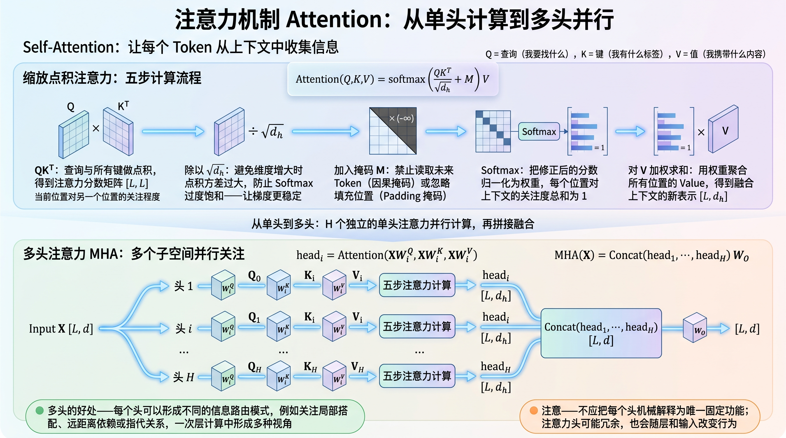
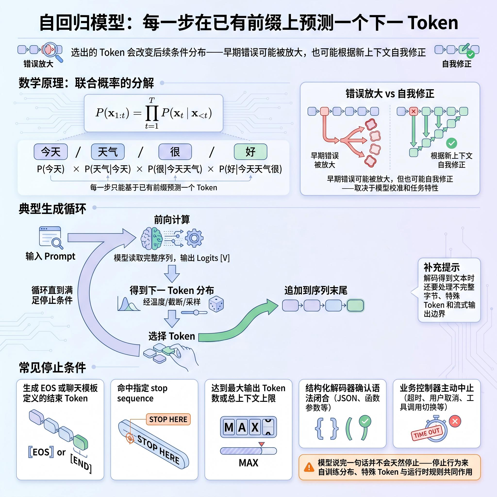
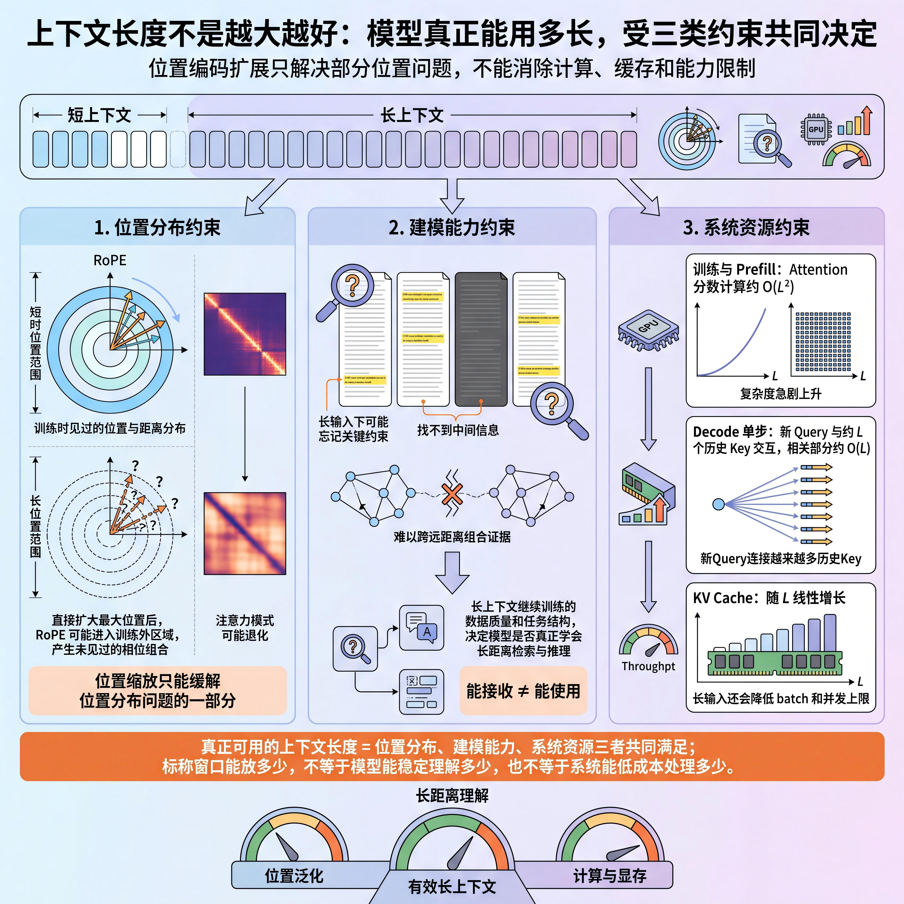

<a id="architecture-overview"></a>
# 模型架构与工作原理

## 目录导航

- [模型架构与工作原理](#architecture-overview)
- [5. 输入表示：文本如何变成 Token ID？](#architecture-section-5)
  - [面试问题：Tokenizer、Token、Token ID 和词表是什么关系？](#architecture-section-5-question-01)
  - [面试问题：BPE、WordPiece 和 Unigram 分词算法有什么区别？](#architecture-section-5-question-02)
  - [面试问题：词表大小、分词粒度和多语言能力如何相互影响？](#architecture-section-5-question-03)

- [6. 向量表示：Token ID 如何变成模型可以计算的向量？](#architecture-section-6)
  - [面试问题：Token Embedding、上下文化表示和句向量有什么区别？](#architecture-section-6-question-01)
  - [面试问题：位置编码为什么不可缺少？绝对位置编码、RoPE 和 ALiBi 有什么区别？](#architecture-section-6-question-02)
  - [面试问题：一批文本进入 Transformer 前，张量形状如何变化？](#architecture-section-6-question-03)

- [7. 总体架构：Transformer 有哪些形态？为什么生成式 LLM 多采用 Decoder-only？](#architecture-section-7)
  - [面试问题：Encoder-only、Encoder-Decoder 和 Decoder-only 的本质区别是什么？](#architecture-section-7-question-01)
  - [面试问题：为什么 Decoder-only 成为通用生成式大模型的主流架构？](#architecture-section-7-question-02)
  - [面试问题：一个 Decoder-only 模型的完整前向过程是什么？](#architecture-section-7-question-03)

- [8. 注意力机制：模型如何让不同 Token 交换信息？](#architecture-section-8)
  - [面试问题：大语言模型怎么使用注意力机制？](#architecture-section-8-question-01)
  - [面试问题：因果掩码如何兼顾并行训练和自回归生成？](#architecture-section-8-question-02)
  - [面试问题：MHA、MQA 和 GQA 有什么区别？为什么 GQA 能降低 K/V 头数？](#architecture-section-8-question-03)

- [9. Transformer Block：Attention、FFN、残差连接和归一化如何协作？](#architecture-section-9)
  - [面试问题：在大语言模型中，Attention，FFN，残差连接和归一化各自解决什么问题？](#architecture-section-9-question-01)
  - [面试问题：为什么堆叠很多层以后，模型能够形成复杂能力？](#architecture-section-9-question-02)

- [10. 输出生成：隐藏状态如何变成下一个 Token？](#architecture-section-10)
  - [面试问题：LM Head、Logits、Softmax 和概率分布是什么关系？](#architecture-section-10-question-01)
  - [面试问题：贪心、Temperature、Top-K、Top-P 和 Beam Search 如何选择？](#architecture-section-10-question-02)
  - [面试问题：模型为什么要逐 Token 生成？生成何时停止？](#architecture-section-10-question-03)

- [11. 稀疏架构：MoE 如何扩大模型容量？](#architecture-section-11)
  - [面试问题：MoE 与稠密模型的本质区别是什么？](#architecture-section-11-question-01)
  - [面试问题：Router、Top-K 路由和负载均衡如何工作？](#architecture-section-11-question-02)
  - [面试问题：MoE 为什么更难训练和扩展？](#architecture-section-11-question-03)

- [12. 长上下文：模型如何表示训练长度之外的位置？](#architecture-section-12)
  - [面试问题：上下文窗口为什么不能靠修改一个配置项无限扩展？](#architecture-section-12-question-01)
  - [面试问题：PI、NTK-aware、YaRN 和 LongRoPE 的核心思路有什么区别？](#architecture-section-12-question-02)
  - [面试问题：标称上下文长度为什么不等于有效上下文长度？](#architecture-section-12-question-03)

- [13. 高效注意力：如何降低长序列计算与访存开销？](#architecture-section-13)
  - [面试问题：FlashAttention 为什么更快？它是否改变了注意力结果？](#architecture-section-13-question-01)
  - [面试问题：滑动窗口、稀疏注意力和 Ring Attention 分别解决什么问题？](#architecture-section-13-question-02)
  - [面试问题：QK-Norm 解决什么问题？它与 FlashAttention 是同一类优化吗？](#architecture-section-13-question-03)

- [14. 架构估算：如何从配置文件读懂模型规模与训练成本？](#architecture-section-14)
  - [面试问题：如何根据模型配置估算参数量？](#architecture-section-14-question-01)
  - [面试问题：参数量、训练 FLOPs 和训练显存为什么不能画等号？](#architecture-section-14-question-02)
---


<a id="architecture-section-5"></a>
## 5. 输入表示：文本如何变成词元编号(Token ID)？

<a id="architecture-section-5-question-01"></a>
### 面试问题：分词器 (Tokenizer)、词元(Token)、词元编号(Token ID)和词表(Vocabulary)是什么关系？

**难度评分：⭐ (1/5) | 考察频率：⭐⭐⭐⭐⭐ (5/5)**

模型不能直接接收字符串。**Tokenizer** 按既定规则把字符串编码为 **Token** 序列，再借助 **Vocabulary** 把每个 Token 映射成整数 **Token ID**。模型真正接收的是 Token ID，嵌入（Embedding）层再用这些 ID 查表得到向量。

四者的关系可以写成：

```text
文本 --> Tokenizer --> Token 序列 --> Vocabulary --> Token ID 序列 --> Embedding 查表 --> 连续向量序列
```

#### 1. 四个概念分别是什么？

- **Token**：模型处理序列时使用的离散单位。它可能是一个汉字、子词、单词、标点、空格的一部分或若干字节，并不等同于自然语言中的“词”。
- **Vocabulary**：Token 到整数 ID 的有限映射表，还包含开始、结束、填充、对话角色等特殊 Token。
- **Tokenizer**：一套完整的编码与解码流程，通常包含文本归一化、预分词、子词切分、ID 映射和特殊 Token 处理。词表只是 Tokenizer 的一部分。
- **Token ID**：Token 在词表中的整数编号。ID 本身没有大小或距离意义，ID 为 100 和 101 不表示语义相近。

#### 2. 编码流程是怎样的？

一个典型流程包括：

1. **归一化**：按模型规则处理统一码（Unicode）、空白或大小写。并非所有 Tokenizer 都做相同归一化，过度归一化还可能丢失信息。
2. **预分词**：按空格、标点、字节边界或正则规则得到初步片段。
3. **子词切分**：用字节对编码（BPE）、词片（WordPiece）、一元文法（Unigram）等模型把片段拆成词表内 Token。
4. **ID 映射**：查询词表，把 Token 转换为整数。
5. **模板与特殊 Token**：按基座模型约定加入起始符（BOS）、结束符（EOS）、角色边界或工具调用标记。

**解码过程**是把 Token ID 序列恢复成原始文本，但它不是机械地把每个 Token 对应的字符串直接拼接起来。这主要是因为分词器在切词的时候，会故意在 Token 里塞进一些“控制信息”，比如前导空格、特殊符号或者字节片段，解码时必须按照同一套规则把它们“消解”掉。

<a id="architecture-section-5-question-02"></a>
### 面试问题：字节对编码（BPE）、词片（WordPiece）、一元文法（Unigram）分词算法有什么区别？

**难度评分：⭐⭐⭐ (3/5) | 考察频率：⭐⭐⭐⭐ (4/5)**

#### 1. 为什么主流模型采用子词分词？

词级分词的词表容易膨胀，并且难以覆盖新词；字符或字节级分词几乎没有未登录问题，但序列会变长。**子词分词是在词表大小与序列长度之间取平衡**：高频片段保留为较长Token，低频词拆成更小单位。

#### 2. 三种算法的核心差异是什么？

| 算法 | 训练起点 | 主要操作 | 选择标准 | 编码时的典型方式 |
|---|---|---|---|---|
| BPE | 字符或字节等基础符号 | 反复合并相邻符号对 | 通常按相邻对频率 | 按已学习的合并规则切分 |
| WordPiece | 较小基础词表 | 反复加入有价值的合并项 | 倾向选择能改善语料似然的组合 | 常使用最长匹配 |
| Unigram | 较大的候选子词集合 | 反复删除贡献较小的候选 | 概率模型下的语料似然 | 寻找高概率切分路径 |

> **注**：BPE包括字符级 BPE （Unicode 字符）和 Byte-level BPE（单个字节）。

<a id="architecture-section-5-question-03"></a>
### 面试问题：词表大小、分词粒度和多语言能力如何相互影响？

**难度评分：⭐⭐⭐ (3/5) | 考察频率：⭐⭐⭐⭐ (4/5)**

#### 1. 词表更大带来什么？

词表更大通常能让常见词、汉字组合、代码片段和专业术语用更少 Token 表示，从而缩短序列。但它也会扩大输入 Embedding 和输出语言头（LM Head）：

```math
P_{\text{embedding}} = V \times d_{\text{model}}
```

其中 $`V`$ 是词表大小，$`d_{\text{model}}`$ 是隐藏维度。如果输入 Embedding 与 LM Head 不共享权重，这部分参数还会出现两份。

词表增大还会让每一步输出的对数几率（Logits）维度变大，软最大化（Softmax）与候选处理成本上升，并可能让低频 Token 得不到充分训练。

#### 2. 词表更小又会怎样？

词表较小可以减少 Embedding 和 LM Head 参数，提高低频单位的训练覆盖，但文本会被切得更碎：

- 序列更长，占用更多上下文位置；
- 注意力（Attention）的长序列计算与运行期内存开销增加；
- 一个完整概念需要跨更多 Token 组合；

因此，**词表大小不是越大越好，而是序列压缩率、参数规模、语言覆盖和数据量之间的折中**。

#### 3. 多语言 Tokenizer 的难点

多语言共用词表能共享数字、标点、词根和跨语言片段，但高资源语言可能占据大部分词表容量，使低资源语言被过度切分。合理设计需要考虑：

- 训练语料的语言配比，而不只是原始数量；
- 不同文字系统的覆盖率（你的词表能"直接表示"多少个系统里的字符？）和 Token 压缩率（对于每种文字系统，同样的语义内容需要多少个 Token 来表达？）；
- 是否采用字节级基础单元保证无损回退；
- 词表扩充需要啊继续训练新增 Embedding 和 LM Head 参数。

#### 4. 未登录词（ OOV ）问题是否已经消失？

在字节级覆盖或字节回退（byte fallback）的 Tokenizer 中，几乎任何字符串都可以被编码，因此传统 OOV 问题大幅缓解。但“能编码”不等于“编码得好”：生僻字符、乱码、罕见专业词可能被拆成很长的字节序列，模型仍然难以理解，而且成本更高。

<a id="architecture-section-6"></a>
## 6. 向量表示：词元编号（Token ID）如何变成模型可以计算的向量？

<a id="architecture-section-6-question-01"></a>
### 面试问题：词元嵌入（Token Embedding）、上下文化表示和句向量有什么区别？

**难度评分：⭐⭐ (2/5) | 考察频率：⭐⭐⭐⭐⭐ (5/5)**

#### 1. Token Embedding 是什么？

设词表大小为 $`V`$，隐藏维度为 $`d`$，模型维护一个可训练矩阵：

```math
E \in \mathbb{R}^{V \times d}
```

Token ID $`i`$ 的输入向量就是第 $`i`$ 行 $`E_i`$。实现上是一次查表。

Token Embedding 是**静态起点**：在同一个模型中，同一个 Token ID 查到的初始向量相同。

#### 2. 上下文化隐藏状态是什么？

Token Embedding 经过多层 Attention 和前馈层（FFN）后，得到隐藏状态 $`h_i^{(l)}`$。它依赖当前 Token、上下文以及层数。同一个“苹果”出现在“苹果公司发布产品”和“吃了一个苹果”中，初始 Token Embedding 相同或相近，但高层隐藏状态会因上下文而不同。

因此，更准确的说法是：

- Embedding 层提供每个 Token 的初始可学习表示；
- 变换器（Transformer）层把它变成上下文化表示；
- 模型的大部分语言知识和计算能力分布在整个参数系统中，不能简单归因于 Embedding 表。

#### 3. 句向量又是什么？

句向量或文本 Embedding 是对整段文本得到的固定长度表示，常用于语义检索、聚类和相似度计算。来自专门训练的编码器（Encoder），也可能对 Token 隐藏状态做池化。整段文本被压缩成一个固定长度的向量（比如 768 维或 1024 维），和文本长度无关。

| 概念 | 粒度 | 是否依赖上下文 | 典型用途 |
|---|---|---|---|
| Token Embedding | 单个 Token 的初始表示 | 否 | 生成模型的输入查表 |
| 上下文化隐藏状态 | 当前序列中的 Token | 是 | 下一 Token 预测、内部特征计算 |
| 句向量 / 文本 Embedding | 整句或整段文本 | 是 | 检索、聚类、相似度 |

> "注"： “每个向量维度对应一个明确语义属性”通常不成立。语义往往以分布式、叠加的方式编码在多个方向和层中。经典的“国王 - 男人 + 女人 ≈ 女王”说明某些静态词向量存在近似线性结构，不应被当作所有 LLM 表示的普遍定律。

<a id="architecture-section-6-question-02"></a>
### 面试问题：位置编码为什么不可缺少？绝对位置编码、旋转位置编码（RoPE）和 线性偏置注意力（ALiBi）有什么区别？

**难度评分：⭐⭐⭐ (3/5) | 考察频率：⭐⭐⭐⭐⭐ (5/5)**

#### 1. 为什么只做 Token Embedding 不够？

自注意力（Self-Attention）的核心计算只比较向量内容。如果没有位置信息，它对输入排列缺少足够区分能力，“我打他”和“他打我”包含相似 Token 集合，却有不同语义。位置机制要告诉模型：**Token 在哪里，以及两个 Token 相距多远**。

#### 2. 有哪些常见的Embedding方案？

| 方案 | 注入位置 | 核心思想 | 主要特点 |
|---|---|---|---|
| 绝对位置 Embedding | 通常与 Token Embedding 相加 | 每个位置有一个向量或确定函数值 | 直观；学习式方案常受训练长度限制 |
| RoPE | 旋转 Q、K 的成对维度 | 用与位置相关的旋转使点积体现相对位移 | 兼顾绝对位置注入与相对关系，生成式 LLM 常用 |
| ALiBi | Attention Logits | 按距离加入线性负偏置 | 不增加位置向量，偏好近邻，外推形式简单 |

**绝对位置编码** 可以是固定正弦函数，也可以是可学习位置向量。它直接表示“这是第几个位置”，但可学习表通常不能自然处理表外位置。

**RoPE** 不需要把位置向量直接加到输入上，而是对每个注意力头的 Q、K 做位置相关旋转。旋转后的点积会显式依赖相对位置差，因此适合自注意力。注意：采用 RoPE 时，“词嵌入加位置嵌入”并不是准确描述。

**ALiBi** 在注意力得分中加入与距离成比例的偏置。距离越远，惩罚通常越大。它参数少、实现直接，但归纳偏置与 RoPE 不同。

#### 3. RoPE 为什么与长上下文问题紧密相关？

对第 $`j`$ 个频率维度，可把旋转角理解为：

```math
\phi_{m,j} = m\theta_j
```

$`m`$ 是位置，$`\theta_j`$ 是该维度的角频率。模型只在有限位置范围内训练，直接把 $`m`$ 扩到很大，会让它遇到训练中未见过的相位组合和相对距离分布。

<a id="architecture-section-6-question-03"></a>
### 面试问题：一批文本进入变换器架构（Transformer）前，张量形状如何变化？

**难度评分：⭐⭐⭐ (3/5) | 考察频率：⭐⭐⭐⭐ (4/5)**

设批大小为 $`B`$，序列长度为 $`L`$，隐藏维度为 $`d`$，词表大小为 $`V`$：

1. 原始文本经过 Tokenizer，得到 `input_ids`，形状为 $`[B,L]`$。
2. 不同长度样本通常需要填充或打包，并生成有效位置掩码。
3. Embedding 查表后得到 $`X \in \mathbb{R}^{B\times L\times d}`$。
4. 位置机制向 $`X`$ 或后续的 Q、K 注入位置信息。
5. 经过 $`N`$ 个 Transformer后，张量主体形状仍是 $`[B,L,d]`$。
6. LM Head 映射到词表空间，得到 $`[B,L,V]`$ 的 Logits。推理时通常只需要最后一个有效位置的 $`[B,V]`$；训练时则会对多个位置计算下一 Token 损失。

如果多头数为 $`H`$，单头维度为 $`d_h`$，通常有 $`d=H d_h`$。Q 的常见形状可重排为 $`[B,H,L,d_h]`$。

> **注**：填充掩码（padding mask）解决“哪些位置是填充”，因果掩码（causal mask）解决“哪些未来位置不可见”，二者目的不同，实际计算中可以合并应用。

<a id="architecture-section-7"></a>
## 7. 总体架构：变换器（Transformer）有哪些形态？为什么生成式 LLM多采用仅解码器（Decoder-only）？

<a id="architecture-section-7-question-01"></a>
### 面试问题：仅编码器（Encoder-only）、编码器-解码器（Encoder-Decoder）和 仅解码器（Decoder-only）的本质区别是什么？

**难度评分：⭐⭐ (2/5) | 考察频率：⭐⭐⭐⭐⭐ (5/5)**

三种架构都建立在 Transformer 组件之上，核心差异是**信息可见范围、训练目标和输入输出组织方式**，不是简单的“谁先进、谁被淘汰”。

| 架构 | 主要注意力方式 | 典型训练目标 | 优势 | 典型任务 |
|---|---|---|---|---|
| Encoder-only | 双向 Self-Attention | 掩码语言建模等 | 擅长获得整段输入的双向表示 | 分类、检索、命名实体识别（NER）、文本编码 |
| Encoder-Decoder | Encoder 双向；Decoder 因果注意力并对 Encoder 做交叉注意力（Cross-Attention） | 条件序列生成 | 输入表示与输出生成职责清晰 | 翻译、摘要、文本到文本 |
| Decoder-only | 因果 Self-Attention | 下一 Token 预测 | 用统一序列接口完成条件生成 | 对话、代码、续写、通用助手 |

#### 1. Encoder-only

每个 Token 可以同时看到左右上下文，因此很适合做理解和表示学习。它并非“不能产生任何文本”，而是标准架构没有用于自回归生成的因果解码器；若要生成，通常需要额外解码结构或不同训练方式。

#### 2. Encoder-Decoder

Encoder 一次性编码输入，Decoder 在生成每一步时通过 Cross-Attention 读取编码结果。**Encoder 输出可以缓存，不需要每生成一个 Token 就重新运行整个 Encoder。**它在输入和输出边界明确的条件生成任务中仍然有价值。

#### 3. Decoder-only

把指令、示例、资料和已有输出统一串成一个序列，用因果掩码做下一 Token 预测。它既可以续写，也可以通过聊天模板表现为问答、分类、抽取或工具调用。

<a id="architecture-section-7-question-02"></a>
### 面试问题：为什么 Decoder-only 成为通用生成式大模型的主流架构？

**难度评分：⭐⭐⭐ (3/5) | 考察频率：⭐⭐⭐⭐⭐ (5/5)**

Decoder-only 的主流地位来自多项工程与建模因素共同作用，而不是因为其他架构“没有理解能力”或“没有涌现能力”。

- **目标统一**：预训练和生成都围绕 $`P(x_t\mid x_{<t})`$，训练目标与推理方式一致。
- **接口统一**：指令、示例、上下文、工具结果和答案都能表示为 Token 序列，不需要为每个任务增加专用输出头。
- **训练信号密集**：在标准下一词元预测（next-token prediction）中，序列中的大量位置都可构造预测目标，易于扩展到海量未标注文本。
- **上下文学习自然**：任务说明和少量示例直接成为条件前缀，模型无需更新参数就可以调整当前输出。
- **工程接口统一**：因果 Attention 以单一序列接口表达续写、问答和条件生成，便于将不同任务归结为同一训练目标。


> **注**：Decoder-only 用一个因果语言建模目标统一了预训练、上下文学习和开放式生成，结构简单、数据利用方便，因此成为通用生成式 LLM 的主流；但 Encoder 和 Encoder-Decoder 并未被淘汰，它们在表示学习和条件生成中仍有优势。

<a id="architecture-section-7-question-03"></a>
### 面试问题：一个 Decoder-only 模型的完整前向过程是什么？

**难度评分：⭐⭐⭐ (3/5) | 考察频率：⭐⭐⭐⭐⭐ (5/5)**

给定 Token ID 序列 $`x_{1:L}`$，一次前向传播可以分成五步：

1. **查 Embedding**：$`X_0=E[x_{1:L}]`$，得到 $`[L,d]`$ 的输入向量。
2. **注入位置**：绝对位置或者RoPE相对位置等。
3. **堆叠块（Block）**：每层先让 Token 通过 Self-Attention 读取可见上下文，再通过 FFN 做逐位置非线性变换，并用残差与归一化维持信息和数值稳定。
4. **最终归一化与 LM Head**：把最后一层隐藏状态映射到 $`V`$ 维词表空间，得到 Logits。
5. **选择 Token**：对最后一个有效位置的 Logits 应用温度、截断和采样，得到下一个 Token ID。

用前置归一化（Pre-Norm）结构写一个简化 Block：

```math
U_l=X_l+\text{Attention}(\text{Norm}(X_l))
```

```math
X_{l+1}=U_l+\text{FFN}(\text{Norm}(U_l))
```

堆叠 $`N`$ 层后：

```math
Z=\text{Norm}(X_N),\qquad \text{Logits}=ZW_{\text{lm}}^{\mathsf T}
```

这里的“一次前向”只得到当前条件下的下一 Token 分布。要生成完整回答，需要把选中的 Token 追加到上下文并反复执行。

> **注**：键值缓存（KV Cache）的推理机制与部署权衡见推理部署篇。

<a id="architecture-section-8"></a>
## 8. 注意力机制：模型如何让不同词元（Token）交换信息？

<a id="architecture-section-8-question-01"></a>
### 面试问题：大语言模型怎么使用注意力机制？

**难度评分：⭐⭐⭐ (3/5) | 考察频率：⭐⭐⭐⭐⭐ (5/5)**



```math
\text{Attention}(Q,K,V)
=\text{softmax}\left(\frac{QK^{\mathsf T}}{\sqrt{d_h}}+M\right)V
```

计算过程可以拆成：

1. $`QK^{\mathsf T}`$ 计算查询和各键的相似度；
2. 除以 $`\sqrt{d_h}`$，避免维度增大时点积方差过大、Softmax 过度饱和；
3. 加入掩码 $`M`$，禁止读取未来 Token 或 padding；
4. Softmax 把分数归一化成权重；
5. 对 V 加权求和，得到结合上下文的新表示。

多头注意力把隐藏维度划分为多个子空间，每个头有独立投影：

```math
\text{head}_i=\text{Attention}(XW_i^Q,XW_i^K,XW_i^V)
```

```math
\text{MHA}(X)=\text{Concat}(\text{head}_1,\ldots,\text{head}_H)W_O
```

这样可以在一次层计算中形成多种信息路由模式，例如关注局部搭配、远距离依赖或指代关系。但不应把每个头机械解释为唯一固定功能；注意力头可能冗余，也会随层和输入改变行为。

<a id="architecture-section-8-question-02"></a>
### 面试问题：因果掩码如何兼顾并行训练和自回归生成？

**难度评分：⭐⭐⭐ (3/5) | 考察频率：⭐⭐⭐⭐⭐ (5/5)**

因果掩码是一个上三角不可见约束。对位置 $`t`$，只允许读取位置 $`j\le t`$：

```math
M_{t,j}=
\begin{cases}
0,&j\le t\\
-\infty,&j>t
\end{cases}
```

加到 Attention Logits 后，未来位置经 Softmax 的权重变为 0。

#### 1. 为什么训练可以并行？

训练时整段正确序列已经存在。虽然位置 $`t`$ 不能看 $`t+1`$，但所有位置的 Q、K、V 和掩码矩阵可以在一次矩阵运算中同时计算。因此，**依赖关系是因果的，不代表 GPU 必须逐 Token 串行训练**。

例如输入：

```text
[BOS] 我 喜欢 AI
```

模型可以在一次前向中同时构造：

- `[BOS]` 的状态预测“我”；
- “我”的状态预测“喜欢”；
- “喜欢”的状态预测“AI”。

#### 2. 为什么推理仍然串行？

生成时下一个 Token 尚不存在，必须先选出 $`x_t`$，才能把它作为条件生成 $`x_{t+1}`$。单条序列的自回归生成在时间维度上具有不可消除的依赖，因此不能像训练时那样在全部位置上并行预测。

#### 3. Causal Mask 与 Padding Mask 的区别

- Causal Mask 防止当前位置看到未来真实 Token，维护自回归条件。
- Padding Mask 防止模型读取为了对齐 batch 人工填充的位置。

二者可以同时存在，但解决的问题不同。

<a id="architecture-section-8-question-03"></a>
### 面试问题：多头注意力（MHA）、多查询注意力（MQA）和分组查询注意力（GQA）有什么区别？为什么 GQA 能降低键值头数？

**难度评分：⭐⭐⭐⭐ (4/5) | 考察频率：⭐⭐⭐⭐⭐ (5/5)**

三者的 Q 头数通常相同，区别在于有多少组 K/V 头：

| 结构 | Query 头数 | KV 头数 | 优势 | 代价 |
|---|---:|---:|---|---|
| MHA | $`H`$ | $`H`$ | 表达容量充分 | K/V 表示最独立 |
| MQA | $`H`$ | $`1`$ | K/V 投影最少 | 共享过强，可能损失质量 |
| GQA | $`H`$ | $`1<H_{kv}<H`$ | 在质量与效率间折中 | 仍需选择合适分组 |

在 **MHA** 中，每个 Query 头有自己的 K、V 头。在 **MQA** 中，所有 Query 头共享同一组 K、V。在 **GQA** 中，若干 Query 头共享一组 K、V。

把 K/V 头数从 $`H`$ 降到 $`H_{kv}`$，K/V 投影的主要参数量会按约 $`H_{kv}/H`$ 缩小；GQA 用介于 MHA 与 MQA 之间的 $`H_{kv}`$ 保留更多 K/V 表示差异。K/V 头数还会影响生成阶段的状态与带宽，这一部署权衡见推理部署篇。

需要注意：

- GQA/MQA 减少的是 K/V 投影与表示副本，不会让整个 Attention 计算按相同比例下降；Q 头仍要与历史 K 做匹配。
- 这是一项**模型架构选择**。不能只在部署时改头数而不调整权重。
- “多头越多越好”同样不成立，头数、单头维度、KV 共享和硬件效率需要联合设计。

<a id="architecture-section-9"></a>
## 9. 变换器块（Transformer Block）：注意力（Attention）、前馈层（FFN）、残差连接和归一化如何协作？

<a id="architecture-section-9-question-01"></a>
### 面试问题：在大语言模型中，注意力（Attention），前馈层（FFN），残差连接和归一化各自解决什么问题？

**难度评分：⭐⭐⭐ (3/5) | 考察频率：⭐⭐⭐⭐⭐ (5/5)**

#### 1. 注意力（Attention）机制和前馈层（FNN）有什么用？

- **Attention** 负责 Token 之间的信息交换：当前位置从哪些可见位置读取什么信息。
- **FFN** 对每个位置独立应用同一组非线性变换：把取回的信息与当前位置特征重新组合。

可以用一句不失真的直观比喻：**Attention 负责“通信”，FFN 负责“加工”**。不过模型知识并非只存于 FFN，Attention 投影、Embedding、归一化和残差路径也参与表示。

#### 2. 大语言模型常用的FFN结构是什么？

现代生成式模型常采用 SwiGLU 等门控结构：

```math
\text{SwiGLU}(x)
=\left(\text{SiLU}(xW_{gate})\odot xW_{up}\right)W_{down}
```

一个分支产生门控，另一个分支产生候选特征，逐元素相乘后降维。它通常比简单 ReLU/GELU FFN 有更好的参数效率，但具体中间维度会为控制参数量和硬件对齐而调整，不能机械套用“固定扩大 4 倍”。

忽略偏置，普通 FFN 每层约有 $`2dd_{ff}`$ 个参数，SwiGLU 类结构约有 $`3dd_{ff}`$ 个参数。Attention 线性投影在 MHA 下约有 $`4d^2`$ 个参数。当 $`d_{ff}`$ 较大时，FFN 往往是主要参数与计算来源。MoE 正是把部分层的单个 FFN 替换成多个可路由专家。

#### 3. 残差连接和层归一化有什么用？

- 残差连接提供一条直接的信息与梯度通道，让子层学习“在原表示上增加什么”，而不是每层都重新构造全部表示。它缓解深层网络优化困难，但不能严格表述为“保证深层模型一定不比浅层模型差”。

- 层归一化将每层输出的激活值强制拉回零均值、单位方差的稳定范围，防止数值在深层网络中逐层放大或衰减。

#### 4. 四者如何协作？

Attention 擅长动态路由，FFN 提供非线性容量，残差与归一化保证深层可优化。这四部分共同构成 Block 的闭环。

<a id="architecture-section-9-question-02"></a>
### 面试问题：为什么堆叠很多层以后，模型能够形成复杂能力？

**难度评分：⭐⭐⭐ (3/5) | 考察频率：⭐⭐⭐ (3/5)**

每个 Block 都执行两类操作：跨位置通信与逐位置非线性变换。多层堆叠后，一个 Token 可以反复读取、变换并重新分发信息，逐步形成更抽象的上下文表示。

可以把层级计算理解为：

- 较低层更容易保留词形、局部搭配和位置等基础信号；
- 中间层组合句法、实体关系和上下文模式；
- 较高层形成更贴近当前预测目标的抽象特征。

这是常见的经验性概括，不是每一层都有固定职责。模型能力来自**架构、参数规模、训练数据和优化目标共同作用**。堆叠层数只增加容量；如果数据不足、训练不稳定或目标不合适，并不会自动获得推理和知识能力。

另一个关键点是残差流。每层不是把上一层“清空重写”，而是在共享表示上叠加更新。因此信息可以跨很多层保留，也可以由不同子层逐步修改。

<a id="architecture-section-10"></a>
## 10. 输出生成：隐藏状态如何变成下一个 Token？

<a id="architecture-section-10-question-01"></a>
### 面试问题：语言头（LM Head）、对数几率（Logits）、软最大化（Softmax）和概率分布是什么关系？

**难度评分：⭐⭐ (2/5) | 考察频率：⭐⭐⭐⭐⭐ (5/5)**

#### 1. LM Head 做什么？

Transformer 最后一层输出隐藏状态 $`h_t\in\mathbb{R}^d`$。LM Head 用线性投影把它映射到词表空间：

```math
z_t=W_{\text{lm}}h_t+b,\qquad z_t\in\mathbb{R}^V
```

$`z_t`$ 中每个元素对应一个 Token 的原始分数，即 **Logit**。Logit 可以为任意实数。

> **注**：有些模型令 $`W_{\text{lm}}`$ 与输入 Embedding 矩阵共享权重，称为 **weight tying**；也有模型不共享。是否带偏置同样取决于实现，因此不能说“所有现代模型都使用无偏置且共享权重的 LM Head”。

#### 2. Softmax 做什么？

```math
p(x_{t+1}=i\mid x_{\le t})
=\frac{\exp(z_{t,i})}{\sum_{j=1}^{V}\exp(z_{t,j})}
```

Softmax 把 $`V`$ 个 Logit 归一化为和为 1 的条件分布。工程实现会使用减去最大 Logit 等数值稳定技巧。

#### 3. 训练和推理如何使用这组输出？

- **训练时**：多个位置的 Logits 与真实下一个 Token 计算交叉熵，梯度再更新整个模型。
- **推理时**：只取每个请求最后一个有效位置的 Logits，经过约束、温度和截断，再选出一个 Token。

#### 4. 概率高是否表示事实正确？

不表示。它只说明在模型学到的分布和当前上下文下，这个 Token 相对更可能出现。语言模型目标优化的是序列似然，不是外部世界的事实校验器，这也是第 01 章所述幻觉的根源之一。

<a id="architecture-section-10-question-02"></a>
### 面试问题：贪心、温度（Temperature）、Top-K、（核采样）Top-P 和（束搜索）Beam Search 如何选择？

**难度评分：⭐⭐⭐ (3/5) | 考察频率：⭐⭐⭐⭐⭐ (5/5)**

#### 1. 先区分“变换分布”和“选择 Token”

- Temperature、Top-K、Top-P 用于改变或截断候选分布；
- Greedy、Sampling、Beam Search 是选择路径的方式；
- 实际系统经常组合使用，例如先调 Temperature，再做 Top-P，最后随机采样。

#### 2. Temperature

```math
p_i(T)=\frac{\exp(z_i/T)}{\sum_j\exp(z_j/T)}
```

- $`0<T<1`$：分布更尖锐，结果更保守；
- $`T>1`$：分布更平坦，多样性更高；
- 工程接口常把 $`T=0`$ 特殊处理为贪心，而公式本身在 $`T=0`$ 时没有定义。

#### 3. 常见策略对比

| 策略 | 核心机制 | 优势 | 主要风险 | 常见场景 |
|---|---|---|---|---|
| Greedy | 每步选最高概率 Token | 快、可复现 | 局部最优、可能重复 | 结构化抽取、低随机任务 |
| Top-K | 只保留概率最高的 $`K`$ 个 | 去掉长尾噪声 | 固定 $`K`$ 不适应分布形状 | 与采样组合 |
| Top-P | 保留累计概率达到 $`P`$ 的最小集合 | 候选集随分布变化 | 参数过大仍可能引入低质候选 | 对话、开放生成 |
| Beam Search | 同时保留若干高分序列 | 适合追求整体序列似然 | 成本高，开放生成中可能单调 | 翻译、受约束序列任务 |

Top-P 并非“没有缺点”或所有模型的统一默认。采样参数也没有跨模型通用的最佳值；模型校准、后训练方式和任务目标不同，最佳配置应通过评估确定。

#### 4. 还需要哪些生成控制？

- 重复惩罚、频率惩罚或存在惩罚；
- 词表约束或 JSON grammar；
- 最小/最大输出长度；
- stop strings 与 EOS；
- 固定随机种子，但并行计算和服务实现仍可能带来非确定性。

> **选择原则**：事实问答与结构化输出优先稳定和可验证，不应靠高温度“提升能力”；创意任务可以增加多样性；代码和数学任务常结合多次采样与外部验证器，而不是只押注一次贪心结果。

<a id="architecture-section-10-question-03"></a>
### 面试问题：模型为什么要逐 Token 生成？生成何时停止？

**难度评分：⭐⭐ (2/5) | 考察频率：⭐⭐⭐⭐ (4/5)**



自回归模型把联合概率分解为：

```math
P(x_{1:T})=\prod_{t=1}^{T}P(x_t\mid x_{<t})
```

因此，每一步只能在已有前缀上预测一个下一 Token。选出的 Token 会改变后续条件分布：早期选错一个 Token，错误可能在后续被放大；反过来，模型也可能根据新上下文自我修正。

典型生成循环：

```text
输入 Prompt → 前向计算 → 得到下一 Token 分布
→ 选择 Token → 追加到序列作为下一步条件
→ 再次前向计算 → …… → 满足停止条件
```

常见停止条件包括：

- 生成 EOS 或聊天模板定义的结束 Token；
- 命中一个或多个 stop sequence；
- 达到最大输出 Token 数或总上下文上限；
- 结构化解码器确认 JSON、函数参数等语法已经闭合；
- 业务控制器主动中止，例如超时、用户取消或工具调用切换。

解码得到文本时还要处理不完整字节、特殊 Token 和流式输出边界。模型“说完一句话”并不会天然停止，停止行为来自训练分布、特殊 Token 与运行时规则共同作用。

<a id="architecture-section-11"></a>
## 11. 稀疏架构：混合专家（MoE）如何扩大模型容量？

<a id="architecture-section-11-question-01"></a>
### 面试问题：混合专家（MoE）与稠密模型的本质区别是什么？

**难度评分：⭐⭐⭐ (3/5) | 考察频率：⭐⭐⭐⭐⭐ (5/5)**

#### 1. 稠密与稀疏激活

在稠密 Transformer 中，每个 Token 都经过同一套 FFN 参数。MoE 通常把某些层的单个 FFN 替换成多个专家 FFN，再由路由（Router）为每个 Token 选择少量专家。

设有 $`N`$ 个专家，每个 Token 激活 $`K`$ 个，$`K\ll N`$：

```math
y=\sum_{i\in\text{TopK}(g(x))}p_i(x)E_i(x)
```

$`g(x)`$ 是 Router Logits，$`p_i(x)`$ 是被选专家的归一化权重，$`E_i`$ 是第 $`i`$ 个专家。

#### 2. MoE 解耦了什么？

MoE 在一定程度上解耦了：

- **总参数量**：所有专家与共享层参数之和；
- **每 Token 激活参数量**：共享层加上本次选中的专家；
- **每 Token 计算量**：主要与激活专家数和专家宽度相关。

所以比较模型时必须说明是总参数还是激活参数。一个总参数更大的 MoE，单 Token FLOPs 可能接近小得多的稠密模型。

#### 3. 没有解耦什么？

MoE 不是“计算不变地无限扩容”：

- 所有专家权重仍要存储，并分布在设备内存中；
- Token 路由会产生调度和跨设备通信；
- Router、共享层、Attention 仍然是稠密计算；
- 专家越多，训练数据覆盖、负载均衡和容错越难；

> **注**：MoE 用条件计算扩大参数容量，每个 Token 只经过少数专家，因此总参数量远大于激活参数量；优势是单位计算下获得更大容量，代价是路由、负载均衡、通信、存储和系统复杂度。

<a id="architecture-section-11-question-02"></a>
### 面试问题：路由（Router）、Top-K 路由和负载均衡如何工作？

**难度评分：⭐⭐⭐⭐ (4/5) | 考察频率：⭐⭐⭐⭐ (4/5)**

#### 1. Router 的基本过程

对 Token 表示 $`x`$，Router 通常先做线性投影：

```math
r=xW_r\in\mathbb{R}^{N}
```

再选择 Logit 最高的 $`K`$ 个专家，并在被选集合上归一化：

```math
p_i=\frac{\exp(r_i)}{\sum_{j\in S_K}\exp(r_j)},\quad i\in S_K
```

随后系统把 Token 按专家重排，发送到对应设备计算，再按原顺序聚合输出。

#### 2. 为什么会发生路由失衡？

如果某些专家在早期略占优势，Router 会不断把更多 Token 发给它们，使这些专家得到更多训练，形成正反馈。结果可能是：

- 热门专家过载，冷门专家欠训练；
- 超过专家容量的 Token 被丢弃或绕行；
- 多个专家学到近似功能，参数容量没有被有效利用；
- 跨设备流量不均，最慢专家拖住整个 step。

#### 3. 常见缓解方法

- **辅助负载均衡损失**：同时约束路由概率与实际分配频率；
- **容量因子**：为每个专家预留高于平均值的容量，但会增加内存或填充；
- **Router z-loss、噪声或温度控制**：避免 Router Logits 过大或过早固化；
- **无辅助损失的偏置调节**：根据近期负载动态修正专家得分，减少辅助损失对主任务的干扰；
- **共享专家**：让通用模式由始终激活的专家处理，路由专家专注差异化模式。

负载完全均匀也不一定最优，因为真实数据分布并不均匀。目标是在专家专业化、设备利用率和任务质量之间平衡。

<a id="architecture-section-11-question-03"></a>
### 面试问题：混合专家（MoE）为什么更难训练和扩展？

**难度评分：⭐⭐⭐⭐ (4/5) | 考察频率：⭐⭐⭐⭐ (4/5)**

| 难点 | 根因 | 直接后果 | 常见方向 |
|---|---|---|---|
| All-to-All 通信 | Token 要发往不同设备上的专家 | 通信可能盖过专家计算 | 专家并行、通信计算重叠、拓扑感知放置 |
| 负载不均 | 输入相关路由天然有偏 | 热点、尾延迟、Token 丢弃 | 辅助损失、容量控制、动态偏置 |
| 小批量（batch） 低效率 | 单个专家收到的 Token 太少 | 通用矩阵乘法过小，GPU 利用率低 | Token 重排、micro-batch 聚合 |
| 显存与存储 | 总参数仍然很大 | 单卡放不下，冷专家也要可访问 | 专家切分、分层存储 |
| 训练稳定性 | Router 与专家共同学习 | 路由抖动、专家欠训练 | Router 正则、监控、合理初始化 |
| 容错复杂 | 专家跨大量设备分布 | 单设备故障影响路由链路 | Checkpoint 分片、冗余和恢复设计 |

MoE 的收益高度依赖系统实现。理论上激活浮点运算次数（FLOPs）较低，不代表实际训练吞吐一定更高；小 batch 或网络较慢时，All-to-All 和负载不均可能抵消条件计算的收益。

训练成本估算应使用**每 Token 激活参数**做一级近似，再额外考虑 Router 与 All-to-All 开销；第 03 章将继续讨论训练 FLOPs 和专家并行。

<a id="architecture-section-12"></a>
## 12. 长上下文：模型如何表示训练长度之外的位置？

<a id="architecture-section-12-question-01"></a>
### 面试问题：上下文窗口为什么不能靠修改一个配置项无限扩展？

**难度评分：⭐⭐⭐ (3/5) | 考察频率：⭐⭐⭐⭐⭐ (5/5)**



上下文长度同时受三类约束：

#### 1. 位置分布约束

模型只在有限长度和距离分布上训练。直接把最大位置改大，会让位置编码进入训练外区域。对 RoPE 来说，不同维度的旋转频率会产生未见过的相位组合，Attention 模式可能退化。

#### 2. 建模能力约束

“能接收”不等于“能使用”。模型可能找不到中间信息、无法跨很远位置组合证据，或在长输入下忘记关键约束。长上下文继续训练的数据质量和任务结构，会影响模型是否真正学会长距离检索与推理。

#### 3. 系统资源约束

对标准密集 Self-Attention：

- 训练时的 Attention 分数计算随长度近似 $`O(L^2)`$；
- 自回归生成的新 Query 仍需与约 $`L`$ 个历史 Key 交互，单步相关部分近似 $`O(L)`$；
- 长输入会提高运行期序列状态的内存需求，并限制可用 batch 大小。

所以位置缩放只解决第一类问题的一部分，不能消除 Attention 计算、运行期内存和模型能力限制。

<a id="architecture-section-12-question-02"></a>
### 面试问题：位置内插（PI）、NTK感知（NTK-aware）、YaRN 和 LongRoPE 的核心思路有什么区别？

**难度评分：⭐⭐⭐⭐ (4/5) | 考察频率：⭐⭐⭐⭐ (4/5)**

这些方法都围绕 RoPE 的频率与位置映射展开，但调节粒度不同。

| 方法 | 核心思路 | 主要优点 | 主要代价或风险 |
|---|---|---|---|
| PI | 把位置整体压缩回训练范围 | 简单、改动小 | 所有频率一同压缩，局部位置分辨率可能下降 |
| NTK-aware| 调整 RoPE base，使不同维度获得不同程度的缩放 | 比统一插值更兼顾高低频 | 扩展倍率大时仍可能不稳定，具体实现存在变体 |
| YaRN | 按波长区间对频率分段插值，并配合注意力尺度修正 | 更细致地平衡局部与远程关系 | 超参数和实现更复杂，仍需评估或继续训练 |
| LongRoPE | 搜索非均匀维度缩放，并可配合渐进式扩展 | 能针对目标长度寻找更合适映射 | 搜索和校准成本较高，不等于无需长文本训练 |

#### 1. PI

如果目标长度是训练长度的 $`s`$ 倍，PI 使用近似 $`m'=m/s`$ 的位置，使新窗口映射回模型见过的范围。优点是容易实现；缺点是短距离也被压缩。

#### 2. NTK-aware

它不对所有频率做完全相同的处理，而是通过调整 RoPE base等方式进行频率相关缩放。直观上，高频分量更关注局部位置，低频分量承担长距离表示，差异化缩放比统一压缩更灵活。

#### 3. YaRN

YaRN 根据不同维度的波长与训练窗口关系，把维度分成保留、插值和过渡区域，并修正 Attention 尺度。它强调的不是一个单独公式，而是**频率分段 + 平滑过渡 + 尺度校正**的组合。

#### 4. LongRoPE

LongRoPE 进一步搜索各 RoPE 维度的非均匀缩放因子，而不是完全依赖手工统一函数。搜索得到的位置映射仍需结合目标模型、扩展倍率和数据验证。

> **注**：不要声称某个位置缩放方法可以“无损扩展”或“实现无限上下文”。外推倍率越大，越需要长上下文继续训练，并同时解决 Attention、运行期内存和评估问题。

<a id="architecture-section-12-question-03"></a>
### 面试问题：标称上下文长度为什么不等于有效上下文长度？

**难度评分：⭐⭐⭐ (3/5) | 考察频率：⭐⭐⭐⭐⭐ (5/5)**

**标称上下文长度**表示接口或模型允许放入多少 Token；**有效上下文长度**表示在给定任务和质量门槛下，模型能稳定利用多长的信息。二者之间可能有很大差距。

造成差距的原因包括：

- 位置外推后局部或远距离注意力退化；
- 训练中缺少足够长、结构足够复杂的数据；
- 模型能做单点检索，却不会跨段组合证据；
- 出现 lost in the middle，对中间位置利用较差；
- 上下文中噪声、冲突和无关内容增多；
- 长输入带来截断、模板和输出预算竞争。

验证时至少要同时看：

- 不同长度和不同插入位置下的信息召回；
- 单点检索与多证据推理；
- 真实长文档问答、摘要和长代码任务；
- 短上下文能力是否回退；
- 长输入的计算、内存与成本。

>  **注**：第 06 章会系统介绍一些评估集和方法。本章只需记住：**位置能编码、模型能利用、系统能承载，是三个不同门槛。**

<a id="architecture-section-13"></a>
## 13. 高效注意力：如何降低长序列计算与访存开销？

<a id="architecture-section-13-question-01"></a>
### 面试问题：快速注意力（FlashAttention）为什么更快？它是否改变了注意力结果？

**难度评分：⭐⭐⭐⭐ (4/5) | 考察频率：⭐⭐⭐⭐⭐ (5/5)**

#### 1. 标准实现慢在哪里？

朴素 Attention 会显式生成 $`L\times L`$ 的分数矩阵和 Softmax 中间结果，并在 GPU 高带宽显存（HBM）与片上存储之间多次读写。长序列下，中间矩阵既占显存，又产生大量读写（IO）。

#### 2. FlashAttention 的核心

FlashAttention 是 **IO-aware 的精确注意力实现**。它把 Q、K、V 分块加载到更快的片上存储中，利用 online softmax 维护分块最大值、归一化因子和输出累积值，避免完整 Attention 矩阵落到 HBM。

```text
标准实现：QK^T → 写回大矩阵 → Softmax → 再写回 → 与 V 相乘
FlashAttention：分块读 Q/K/V → 片上完成分数、Softmax 和输出累积 → 写最终结果
```

#### 3. 它改变了什么，没有改变什么？

- **没有改变 Attention 的数学定义**：在允许的数值误差范围内，输出与标准密集注意力等价，不是稀疏近似。
- **通常不改变 $`O(L^2)`$ 理论计算阶数**：核心收益是减少中间存储和 HBM 访问，提高实际吞吐。
- **显著降低激活显存**：因此能支持更长序列或更大 batch。

FlashAttention-2 主要改进工作划分、并行度和非矩阵乘运算比例；FlashAttention-3 进一步利用新一代 GPU 的异步执行、专用矩阵指令和低精度能力。具体加速比取决于 GPU、数据类型、头维度、序列长度和实现版本，不能写成对所有硬件固定成立的倍数。

<a id="architecture-section-13-question-02"></a>
### 面试问题：滑动窗口、稀疏注意力和 Ring Attention 分别解决什么问题？

**难度评分：⭐⭐⭐⭐ (4/5) | 考察频率：⭐⭐⭐ (3/5)**

这三类方法经常都被归入“长上下文优化”，但它们改变的对象不同。

| 方法 | 是否改变可见连接 | 主要目标 | 主要代价 |
|---|---|---|---|
| 滑动窗口 Attention | 是，只看局部窗口 | 降低长序列计算与状态读取 | 单层无法直接读取远处 Token |
| 稀疏 Attention | 是，只保留选定连接 | 用结构化或动态稀疏近似全局 Attention | 可能漏掉关键远距离关系，硬件实现更复杂 |
| Ring Attention | 通常不改变全局 Attention 语义 | 把长序列 Attention 分布到多设备 | 增加设备间通信和调度复杂度 |

#### 1. 滑动窗口

每个 Token 只关注附近 $`w`$ 个位置，Attention 相关计算从全局平方关系降低为约 $`O(Lw)`$。堆叠多层后信息可以逐步传播，但远距离依赖的路径变长。实际模型常把局部层与少量全局层组合。

#### 2. 稀疏 Attention

可以采用固定模式，如局部窗口加全局 Token；也可以根据输入动态选择重要块。它真正减少了参与计算的 Token 对，因此与 FlashAttention 的“数学等价、执行更高效”不同。

#### 3. 环形注意力（Ring Attention）

把序列块分散到多设备，K/V 块沿环形拓扑传递，各设备边接收边计算局部块，最终得到全局结果。它主要解决单设备无法容纳超长序列的问题，并不免费消除总计算，还会受到互联带宽影响。

<a id="architecture-section-13-question-03"></a>
### 面试问题：QK-Norm 解决什么问题？它与 FlashAttention 是同一类优化吗？

**难度评分：⭐⭐⭐⭐ (4/5) | 考察频率：⭐⭐⭐⭐ (4/5)**

不是同一类优化。

- **QK-Norm** 关注数值尺度与训练稳定性；
- **FlashAttention** 关注 Attention 的内存访问与执行效率。

#### 1. 为什么 Q、K 尺度会成为问题？

如果 Q、K 范数持续增大，点积 Logits 会变得很大，Softmax 可能过度尖锐，梯度和训练稳定性受到影响。长上下文增加候选 Key 数量，也会让极端 Logit 更值得关注。

#### 2. QK-Norm 怎样做？

QK-Norm 在计算点积前对 Q、K 分别归一化，再按模型设计进行缩放：

```math
\tilde Q=\text{Norm}(Q),\qquad \tilde K=\text{Norm}(K)
```

```math
S=\frac{\tilde Q\tilde K^{\mathsf T}}{\tau}
```

它限制向量尺度对 Logit 的影响，但不能笼统说“严格把所有 Logit 限制在 $`[-1,1]`$”：后续缩放、可学习增益、RoPE 和具体 Norm 定义都会影响范围。

#### 3. 如何看待 QK-Clip？

QK-Clip 一类方法通过监控或约束 Q/K 投影，使 Attention Logits 不超过目标尺度。它与 QK-Norm 都服务于稳定性，但干预位置不同。是否适配 MLA 等结构取决于具体实现，不能把某个研究方案描述成所有长序列训练的通用必选项。

训练中的损失尖峰（loss spike）、梯度裁剪、优化器和混合精度会在第 03 章展开。本节只建立边界：**数学稳定性优化、算子实现优化、稀疏结构优化，是三条不同轴线。**

<a id="architecture-section-14"></a>
## 14. 架构估算：如何从配置文件读懂模型规模与训练成本？

<a id="architecture-section-14-question-01"></a>
### 面试问题：如何根据模型配置估算参数量？

**难度评分：⭐⭐⭐⭐ (4/5) | 考察频率：⭐⭐⭐⭐⭐ (5/5)**

设词表大小 $`V`$、隐藏维度 $`d`$、层数 $`N`$、Query 头数 $`H`$、KV 头数 $`H_{kv}`$、单头维度 $`d_h`$、FFN 中间维度 $`d_{ff}`$。忽略偏置与 Norm 的小量参数：

#### 1. Embedding 与 LM Head

```math
P_{emb}=Vd
```

若 LM Head 与 Embedding 共享权重，不再增加一份主体参数；不共享则再加约 $`Vd`$。

#### 2. Attention 投影

Q 投影输出维度通常为 $`Hd_h`$，K/V 为 $`H_{kv}d_h`$，输出投影回 $`d`$：

```math
P_{attn}
\approx d(Hd_h)+2d(H_{kv}d_h)+(Hd_h)d
```

常见 $`Hd_h=d`$ 时：

```math
P_{attn}\approx2d^2+2dH_{kv}d_h
```

MHA 中 $`H_{kv}=H`$，于是约为 $`4d^2`$；GQA/MQA 会减少 K/V 投影参数。

#### 3. FFN

普通两层 FFN：

```math
P_{ffn}\approx2dd_{ff}
```

SwiGLU 三投影结构：

```math
P_{ffn}\approx3dd_{ff}
```

#### 4. 稠密模型总量

```math
P_{total}\approx P_{emb}+P_{lm}
+N(P_{attn}+P_{ffn})
```

再加 Norm、偏置等小量参数即可。这个公式足以做面试中的数量级估算。

#### 5. MoE 模型

若每个 MoE 层有 $`E`$ 个专家，单专家参数约 $`P_{expert}`$，则**总参数**包含 $`E P_{expert}`$，而**每 Token 激活参数**只包含 $`K P_{expert}`$，再加共享 Attention、共享专家和其他稠密参数。必须分别报告两者。

<a id="architecture-section-14-question-02"></a>
### 面试问题：参数量、训练浮点运算次数（FLOPs）和训练显存为什么不能画等号？

**难度评分：⭐⭐⭐⭐ (4/5) | 考察频率：⭐⭐⭐⭐⭐ (5/5)**

它们相关，但描述的是不同资源，不能由一个指标直接推出另一个指标。

| 指标 | 回答的问题 | 还受什么影响 |
|---|---|---|
| 参数量 | 模型有多少可学习权重 | 稠密/稀疏、共享权重、词表 |
| 训练 FLOPs | 完成给定 Token 预算需要多少浮点运算 | 序列长度、激活专家、Attention 模式、重算 |
| 训练峰值显存 | 单个 rank 训练时要同时保留多少状态 | 权重精度、梯度、优化器状态、激活、通信 buffer |
| 训练时间 | 给定集群多久完成训练 | MFU、通信重叠、数据管线、故障恢复 |

几个典型反例：

- 两个模型参数量相同，词表、层宽、层数不同，训练激活和矩阵形状可以完全不同。
- MoE 总参数很大，但单 Token 只激活少数专家；训练 FLOPs 不按总参数等比例增长，专家通信与负载均衡却可能成为吞吐瓶颈。
- GQA 只减少部分 K/V 投影参数，主干 Attention 和 FFN 的计算仍需单独估算。
- FlashAttention 不改变参数量，也通常不显著减少理论 FLOPs，却能减少 IO 和激活显存，从而提高训练吞吐。
- 激活检查点（Activation checkpointing）能降低激活峰值，却以重算增加实际训练 FLOPs。

因此，不能用“参数小 50%”直接推出“训练快 2 倍”。面试中应先按 $`6ND`$ 估训练计算量，再按参数、梯度、优化器状态、激活和临时缓冲区（buffer）分解每进程（rank）峰值显存，最后用模型算力利用率（MFU）和通信特征分析（profile）判断实际训练时间；推理延迟与缓存管理见推理部署篇。
