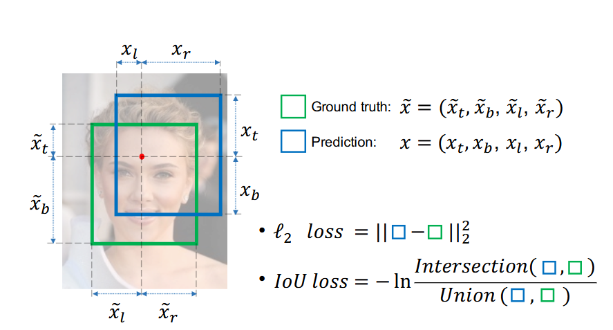

 # 目录

## 机器学习基础
- [1.介绍一下机器学习，以及常见的机器学习方式有哪些？](#1.介绍一下机器学习，以及常见的机器学习方式有哪些？)
- [2.介绍一下损失函数，常用的损失函数都有哪些？](#2.介绍一下损失函数，常用的损失函数都有哪些？)
- [3.介绍一下梯度下降算法，常用的梯度下降算法都有哪些？](#3.介绍一下梯度下降算法，常用的梯度下降算法都有哪些？)
- [4.介绍一下模型融合的核心原理？](#4.介绍一下模型融合的核心原理？)

# 机器学习基础

<h2 id="1.介绍一下机器学习，以及常见的机器学习方式有哪些？">1.介绍一下机器学习，以及常见的机器学习方式有哪些？</h2>

## 面试问题：机器学习定义是什么？常见的机器学习方式有哪些？

**难度评分：⭐⭐ (2/5)  |  考察频率：⭐⭐⭐⭐ (4/5)**

机器学习（Machine Learning）是人工智能的一个子领域，早在1950年阿兰·图灵（Alan Turing）提出了图灵测试，探讨了机器是否能够表现出智能行为。在1952年Arthur Samuel 在IBM工作期间开发了一个具有学习能力的西洋跳棋程序，这个程序可以在不断对弈中提高自己的水平，Arthur Samuel也因此正式提出了“机器学习”的概念。

机器学习不依赖人为编写的固定规则，而是让计算机从大量数据中学习规律、模式或特征，进而对未知数据或任务做出预测、决策或分类的技术。其核心目标是通过优化模型参数，让模型在新数据上的表现（如预测准确率、误差降低程度）达到最优，广泛应用于图像识别、自然语言处理、推荐系统等领域。

机器学习的学习方式可以分为 监督学习(supervised learning)、无监督学习(unsupervised learning)，半监督学习(semi-supervised learning)、弱监督学习(weakly supervised learning)、强化学习（Reinforcement Learning）、自监督学习（Self-Supervised Learning）、联邦学习（Federated Learning） 等。

|学习方式|定义|目标|应用场景|经典算法/常见方法|
|---|---|---|---|---|
|监督学习（Supervised Learning）|一种机器学习方法，模型在训练过程中使用带有标签的数据（每个输入数据均对应唯一输出标签），通过学习输入与输出的关联完成训练。|掌握输入到输出的映射关系，能够对全新输入数据进行准确预测。|分类（如垃圾邮件检测）、回归（如房价预测）等。|分类算法：逻辑回归、支持向量机（SVM）、决策树、随机森林、k-近邻（k-NN）、神经网络等；回归算法：线性回归、岭回归、Lasso回归、支持向量回归（SVR）等。|
|无监督学习（Unsupervised Learning）|一种机器学习方法，模型训练仅使用未标记数据（仅有输入数据，无对应输出标签），无需人工标注即可完成训练。|挖掘数据内部隐藏的结构、规律和模式，常见方向包括聚类、降维等。|客户细分、市场分析、降维和特征提取等。|聚类算法：k-均值（k-Means）、层次聚类、高斯混合模型（GMM）、DBSCAN等；降维算法：主成分分析（PCA）、t-SNE、线性判别分析（LDA）、独立成分分析（ICA）等。|
|半监督学习（Semi-Supervised Learning）|结合监督学习与无监督学习的特点，使用少量标记数据和大量未标记数据协同进行模型训练。|借助大量未标记数据补充信息，提升模型的泛化能力和预测准确性。|标记数据获取成本高、难度大的场景，如医学图像分析等。|半监督支持向量机、图神经网络等。|
|弱监督学习（Weak Supervision）|模型训练过程中使用的数据标签存在不可靠性，包括标注错误、多重标记、标记不充分、局部标记、标签含噪声等情况（如相对于分割标签，分类标签属于弱标签）。|在标签不可靠的情况下，仍能完成模型训练并保证一定的学习效果。|数据标注困难、标注成本高的各类场景。|噪声建模、数据编程等。|
|强化学习（Reinforcement Learning）|一种通过交互学习的机器学习方法，智能体通过与环境持续交互，根据交互反馈调整行为策略，最终实现目标。|学习在特定环境中采取最优行动，以最大化长期累积奖励。|游戏AI、机器人控制、自动驾驶、推荐系统等。|Q学习、深度Q网络（DQN）、策略梯度方法、Actor-Critic方法等。|
|自监督学习（Self-Supervised Learning）|一种无需人工标注标签的学习方法，利用数据自身的内部结构和关联信息，自动生成标签（自标签），进而完成模型训练。|借助自动生成的自标签，充分利用大规模未标记数据，提升模型的学习能力。|自然语言处理（如BERT、GPT）、计算机视觉（如SimCLR、BYOL）等。|对比学习、生成对抗网络（GAN）的部分变体等。|
|联邦学习（Federated Learning）|一种分布式机器学习方法，多个节点（数据源）在不共享原始数据的前提下，协同完成模型训练，兼顾数据利用与隐私保护。|在保护数据隐私的基础上，整合多个数据源的信息，训练出性能更优的模型。|跨设备学习、数据隐私保护相关场景（如跨机构数据协作）。|联邦平均算法（Federated Averaging）、加密计算等。|

机器学习技术目前已经在AIGC、传统深度学习、自动驾驶三个领域全面落地，发展出Stable Diffusion、ChatGPT、Sora、Transformers、YOLO、GAN、U-Net、ResNet、随机森林、支持向量机、决策树、逻辑回归、感知机等实用算法，开始帮助人类完成各种各样的脑力任务。

需要注意的是，学习方式并非相互独立，在实际应用中，可根据场景需求灵活结合多种学习方式，提升模型性能与适用性。

## 面试问题：常见的聚类算法有哪些，介绍其中一种的原理？

**难度评分：⭐⭐ (2/5) | 考察频率：⭐⭐⭐⭐⭐ (5/5)**

常见的聚类算法主要包括：

- **K-Means 聚类** ：需要预先指定簇的数量 K，通过迭代优化将数据划分为 K 个簇，目标是使簇内样本相似度尽可能高、簇间相似度尽可能低。

- **层次聚类** ：采用“自底向上聚合”或“自顶向下分裂”的策略，逐步构建数据的层次聚类树（树状图），无需提前指定簇数，便于直观观察聚类层级关系。

- **DBSCAN 密度聚类** ：基于样本密度进行划分，无需预先设定簇数，能够发现任意形状的簇，并自动识别并剔除噪声点，对不规则分布数据适应性较强。

- **高斯混合模型（GMM）** ：假设数据由多个高斯分布混合生成，通过概率模型拟合数据分布，输出**软聚类结果**，即每个样本属于不同簇的概率，适合重叠分布的数据。

- **谱聚类** ：基于图论思想，将数据点看作图中的节点，通过计算拉普拉斯矩阵特征向量进行降维后聚类，擅长处理非凸、复杂结构的数据簇。

- **PCA（常与聚类配合使用）** ：严格来说属于降维方法，通过线性变换将高维数据映射到低维空间，保留核心信息、去除冗余，常作为聚类前的预处理步骤，提升聚类效果。

### **K-Means 聚类** 介绍：
K-Means由James MacQueen在1967年首次提出，凭借原理简洁、计算高效、适配性强的优势，成为无监督学习中最经典、应用最广泛的聚类算法。

- 算法原理：

在 K-Means 算法中，"簇"是数据点的集合，这些数据点彼此之间比与其他簇的数据点更相似。"质心"是簇内所有点的平均位置，代表了簇的中心。它的核心任务非常简单：将给定的数据集划分为K个互斥的簇（Cluster），使得同一簇内的数据点尽可能相似，不同簇间的数据点尽可能不同。其本质是“迭代式优化聚类中心，最小化簇内样本的相似度差异”，通过反复调整簇中心的位置，直到簇内样本足够集中、簇间样本足够分散。

- 数学基础：

假设簇划分为 $(C_1,C_2,...C_k)$ ，则我们的目标是最小化平方误差 $E$ ：

 $E = \sum_{i=1}^{k} \sum_{x \in C_i} \left\| x - \mu_i \right\|_2^2$ 

 其中 $\mu_i$ 是簇 $C_i$ 的均值向量，有时也称为质心，表达式为：
 
 $\mu_i = \frac{1}{|C_i|} \sum_{x \in C_i} x$ 

 该公式是**K-Means聚类算法**的核心目标函数，用于衡量聚类结果的紧致性：平方误差 $E$ 越小，代表簇内样本越紧密围绕各自的质心，聚类效果越好。

- 实现流程：

（1）**确定K值** ：选择合适的K值，一般来说，我们会根据对数据的先验经验选择一个合适的k值，如果没有什么先验知识，则可以通过交叉验证选择一个合适的k值。

（2）**随机初始化K个簇中心** ：在确定了k的个数后，我们需要选择k个初始化的质心。k个初始化的质心的位置选择对最后的聚类结果和运行时间都有很大的影响，因此需要选择合适的k个质心，最好这些质心不能太近。质心是每个簇的“代表点”，后续样本将根据与质心的距离分配到对应簇。

（3）**样本分配（按距离归簇）** ：计算每个样本与K个簇中心的距离（通常使用欧氏距离），将样本分配到距离最近的簇中。

（4）**更新簇中心**：所有样本分配完成后，对每个簇内的所有样本，计算其特征的平均值，将该平均值作为新的簇中心。

（5）**判断收敛**：对比更新前后的簇中心位置。若所有簇中心的变化量小于预设阈值（如 $10^{-4}$），或迭代次数达到最大限制（如300次），则算法终止；否则，返回步骤3，重新进行样本分配和簇中心更新。

优缺点分析：

- 优缺点介绍：
K-Means聚类算法具有显著优势，其算法简单易懂、易于实现，计算效率较高，即便面对大规模数据集也能较快收敛，且聚类结果直观明了，便于进行数据可视化呈现和业务层面的解读；但同时也存在一定局限性，该算法需要预先指定簇数K，这对业务理解能力有一定要求，且缺乏明确的理论指导来确定最优K值，此外它对初始簇中心的选择较为敏感，不同的初始值可能导致截然不同的聚类结果，使得算法容易陷入局部最优解，同时它对噪声和异常值也较为敏感，异常点会对簇中心的计算产生较大干扰，而且其假设簇为球形且大小相似的前提，在许多实际场景中并不成立。

- 优化方向与改进方法
针对K-Means的固有缺陷，研究人员提出了多种改进和优化策略，针对初始化进行优化的K-Means++、针对K值选择进行优化的肘部法则与轮廓系数、可以动态调整聚类数量的ISODATA算法、处理非线性可分数据的Kernel K-Means、距离计算优化的elkan K-Means以及针对大样优化的Mini Batch K-Means。

K-Means在AIGC领域以向量量化为核心，支撑了VQ-VAE、VQ-GAN及Stable Diffusion的离散表示学习，并通过码本重排优化显著提升生成效率；在传统深度学习中，它既用于DeepCluster等无监督视觉特征学习，又作为YOLO系列模型优化锚框尺寸的关键工具，提高了目标检测精度；在自动驾驶领域，K-Means则广泛用于LiDAR和雷达点云的实时聚类分割，辅助小目标检测、多传感器融合及目标跟踪，成为感知系统中高效且基础的处理模块。

<h2 id="2.介绍一下损失函数，常用的损失函数都有哪些？">2.介绍一下损失函数，常用的损失函数都有哪些？</h2>

# 面试问题：介绍一下损失函数，代价函数以及目标函数。

**难度评分：⭐⭐ (2/5)  |  考察频率：⭐⭐⭐ (3/5)**

**损失函数（Loss function）**：用于定义单个训练样本预测值与真实值之间的误差；

**代价函数（Cost function）**：用于定义单个批次（ batch）或整个训练集训练样本预测值与真实值之间的误差，代价函数是所有样本损失的平均值或总和，是模型真正要优化的目标。

**目标函数（Objective function）**：泛指任意可以被优化的函数。

在机器学习中，损失函数是代价函数的一部分，而代价函数则是目标函数的一种类型。深度学习面试和工程里，大家对损失函数和代价函数基本不严格区分。

## 面试问题：介绍一下损失函数，常用的损失函数都有哪些？

**难度评分：⭐⭐⭐ (3/5) | 考察频率：⭐⭐⭐⭐⭐ (5/5)**

损失函数（Loss Function）是深度学习中用于衡量模型预测值与真实标签之间差异的函数，其核心作用是为梯度下降提供优化方向，通过不断最小化损失值，让模型输出逐步逼近真实结果。一个任务选择合适的损失函数，直接决定模型能否收敛以及最终效果好坏。
常用损失函数按任务类型可以分为回归损失、分类损失两大类：
  **回归任务常用损失**

- （1） L1 Loss

介绍：L1 Loss 是回归任务中最常用的损失函数之一，全称 L1 Norm Loss，也叫平均绝对误差（MAE, Mean Absolute Error）。它衡量的是预测值与真实值之间距离的平均误差幅度，作用范围为0到正无穷。

 **公式**：

**L1 Loss** 衡量预测值与真实值之间**绝对差**的大小。对单个样本，常写作：

$$
\mathcal{L}_{1}(y, \hat{y}) = \left| y - \hat{y} \right|
$$

其中  $$\(y\)$$ 为真实标签， $$\(\hat{y}\) $$  为模型预测。

对批量数据，通常对样本求**平均**，得到 **MAE（Mean Absolute Error，平均绝对误差）**：

$$
\mathcal{L}_{\text{MAE}} = \frac{1}{n} \sum_{i=1}^{n} \left| y_i - \hat{y}_i \right|
$$

多输出时（如向量回归），可先对每个维度取绝对误差再对维度求平均，再对 batch 平均，具体取决于任务约定。

**优缺点**：

L1 Loss的优点在于对异常值具有较强的鲁棒性，其计算的是预测值与真实值之间绝对距离的相关损失，大误差不会像L2 Loss那样被平方放大，因此模型不容易被异常值（outliers）带偏；同时它的解更具稀疏性，配合L1正则化（即Lasso）能够轻松产生稀疏权重，且物理意义十分直观，本质就是预测值与真实值的平均误差大小。

L1 Loss的缺点主要体现在优化过程中，其在预测值与真实值相等（即0点）处不可导，导致优化效果不如L2 Loss稳定；此外，它的梯度始终保持恒定，即便在接近最优解时，模型仍会进行大步更新，难以收敛到极小值，而且在训练初期，其震荡幅度通常也会比L2 Loss更大。而对于较小的损失值，其梯度也同其他区间损失值的梯度一样大，所以不利于网络的学习。

- **（2）L2 Loss**

**介绍**：L2 Loss 全称 **L2 Norm Loss**（平方损失）。对批量样本取平均时，常称为 **MSE（Mean Squared Error，均方误差）**。它度量的是预测值与真实值之差的**平方**，对大误差惩罚更重。

**公式**：

**L2 Loss** 用预测与真值的**平方差**衡量误差。对单个样本，常写作：

$$
\mathcal{L}_{2}(y, \hat{y}) = \left( y - \hat{y} \right)^2
$$

其中 \(y\) 为真实标签， $$\(\hat{y}\)$$  为模型预测。

对批量数据，通常对样本求**平均**，得到 **MSE**：

$$
\mathcal{L}_{\text{MSE}} = \frac{1}{n} \sum_{i=1}^{n} \left( y_i - \hat{y}_i \right)^2
$$

**优缺点**：

L2 Loss 的优点收敛速度快，能够对梯度给予合适的惩罚权重，而不是“一视同仁”，使梯度更新的方向可以更加精确。其缺点是对异常值更敏感：大误差会被**平方放大**，少数离群点可能明显拉高损失并主导梯度，使模型容易被 outliers 拉偏，鲁棒性较差。

L1 范数对应 MAE 损失、L2 范数对应 MSE 损失，二者适用场景不同：若异常值对业务有重要意义，可选用 MSE；若异常值仅为噪声数据，则更适合 MAE。同时从收敛效率考虑，多数卷积神经网络（CNN）普遍采用 L2 损失。但在极端数据分布下（如 95% 样本真实值为 1000、仅 5% 为 10），两种损失均存在明显缺陷：MAE 对离群点不敏感、拟合趋向中位数，会使模型几乎全部预测为 1000；MSE 对异常值极度敏感，反而会让模型整体偏向预测少数类的 10，导致两种常规回归损失都不适用。

- **（3）Smooth L1 Loss**

**介绍**：Smooth L1 Loss 是一种结合了 L1 Loss 和 L2 Loss 优点的损失函数，常用于回归任务，特别是目标检测中的边框回归（如 Fast R-CNN）。它在误差较小时采用平方损失（平滑、可导），在误差较大时采用线性损失（对异常值不敏感），从而避免 L2 Loss 对离群点过度惩罚的问题，同时克服 L1 Loss 在零点不可导的缺陷。作用范围为 \(0\) 到正无穷。可以发现Smooth L1在训练初期输入数值较大时能够较为稳定在某一个数值，而在后期趋向于收敛时也能够加速梯度的回传，很好的解决了前面两者所存在的问题。

**公式**：

**Smooth L1 Loss** 对单个样本通常定义为分段函数。设误差 $$\(d = y - \hat{y}\)$$ ，则：

$$
\mathcal{L}_{\text{smooth L1}}(y, \hat{y}) = 
\begin{cases}
0.5 \, d^2 / \beta, & \text{if } |d| < \beta \\
|d| - 0.5 \beta, & \text{otherwise}
\end{cases}
$$

其中 $$\(\beta\)$$ 为平滑阈值，常用 $$\(\beta = 1\)$$ 。此时简化为：

$$
\mathcal{L}_{\text{smooth L1}}(y, \hat{y}) = 
\begin{cases}
0.5 \, (y - \hat{y})^2, & \text{if } |y - \hat{y}| < 1 \\
|y - \hat{y}| - 0.5, & \text{otherwise}
\end{cases}
$$

对批量数据，通常对样本求**平均**，得到 **Mean Smooth L1 Loss**：

$$
\mathcal{L}_{\text{MSL1}} = \frac{1}{n} \sum_{i=1}^{n} \mathcal{L}_{\text{smooth L1}}(y_i, \hat{y}_i)
$$

多输出时（如向量回归），可先对每个维度按上述公式计算损失，再对维度求平均，最后对 batch 平均，具体取决于任务约定。

- **（4）IoU Loss**

**介绍**：IoU Loss 是目标检测中常用的边界框回归损失函数，全称 Intersection over Union Loss。它基于预测框与真实框的交并比（IoU）来衡量两者之间的重叠程度，取值范围为 [0, 1]。由于 IoU 本身对尺度不敏感且能直接反映定位精度，IoU Loss 将 IoU 值转换为损失（通常为 1 − IoU），使模型能够优化边界框的位置和形状。

**公式**：  
对单个样本（一对预测框 $$\(B_p\)$$ 与真实框 $$\(B_{gt}\)$$ ），先计算交并比：

$$
\text{IoU} = \frac{|B_p \cap B_{gt}|}{|B_p \cup B_{gt}|}
$$

其中 $$\(|\cdot|\)$$ 表示区域面积。IoU Loss 的常见定义为：

$$
\mathcal{L}_{\text{IoU}} = 1 - \text{IoU}
$$

该损失值范围为 [0, 1]，当两框完全重合时 IoU = 1，损失为 0；当无重叠时 IoU = 0，损失为 1。

对批量数据（含 $$\(n\)$$ 个样本），通常对每个样本的损失取平均：

$$
\mathcal{L}_{\text{IoU-batch}} = \frac{1}{n} \sum_{i=1}^{n} (1 - \text{IoU}_i)
$$

在多输出场景（如同时预测多个目标框），可分别计算每个目标框的 IoU Loss 后按样本平均，或根据任务设定（如仅对正样本计算）。此外，存在改进变体如 GIoU Loss、DIoU Loss、CIoU Loss 等，用于解决原始 IoU Loss 在无重叠时梯度消失等问题。

