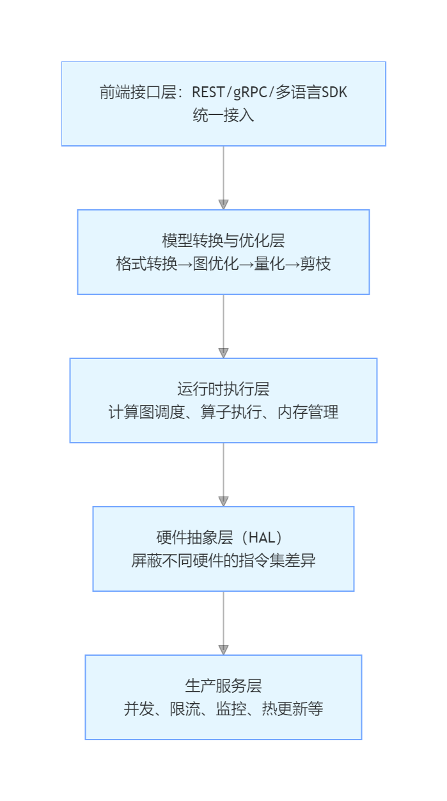

# 目录

[1.什么是推理框架，它有哪些核心功能？](#1.什么是推理框架，它有哪些核心功能？)
  - [面试问题：讲一下你对推理框架的理解](#面试问题-讲一下你对推理框架的理解)
  - [面试问题：推理框架通常包含哪些模块？](#面试问题-推理框架通常包含哪些模块？)
  - [面试问题：请简要描述图优化、算子库、内存管理与运行时调度分别解决什么问题？](#面试问题-请简要描述图优化、算子库、内存管理与运行时调度分别解决什么问题？)

[2.主流推理框架有哪些分类？如何进行选型？](#2.主流推理框架有哪些分类？如何进行选型？)
  - [面试问题：传统深度学习推理框架有哪些？适用场景与选型依据是什么？](#面试问题-传统深度学习推理框架有哪些？适用场景与选型依据是什么？)
  - [面试问题：移动端/边缘端推理框架有哪些？部署限制与选型考量是什么？](#面试问题-移动端/边缘端推理框架有哪些？部署限制与选型考量是什么？)
  - [面试问题：大模型推理框架有哪些？其核心优化技术与选型标准是什么？](#面试问题-大模型推理框架有哪些？其核心优化技术与选型标准是什么？)

[3.推理框架与训练框架的核心差异是什么？](#3.推理框架与训练框架的核心差异是什么？)

[4.为什么要进行推理加速？主要应用场景有哪些？](#4.为什么要进行推理加速？主要应用场景有哪些？)

[5.影响模型推理速度的关键因素有哪些？](#5.影响模型推理速度的关键因素有哪些？)

[6.请概述模型压缩技术及其分类。](#6.请概述模型压缩技术及其分类。)

[7.剪枝技术中的结构化剪枝与非结构化剪枝有何区别？](#7.剪枝技术中的结构化剪枝与非结构化剪枝有何区别？)

[8.请详细介绍一下蒸馏技术](#8.请详细介绍一下蒸馏技术)

[9.请详细介绍一下量化技术](#9.请详细介绍一下量化技术)

[10.计算优化中的算子融合与内核优化分别指什么？](#10.计算优化中的算子融合与内核优化分别指什么？)

[11.内存优化有哪些常用技术？](#11.内存优化有哪些常用技术？)

[12.什么是访存瓶颈和计算强度？](#12.什么是访存瓶颈和计算强度？)

[13.批处理（Batching）如何影响推理吞吐量？](#13.批处理（Batching）如何影响推理吞吐量？)

[14.模型编译与即时编译（JIT）在推理中起什么作用？](#14.模型编译与即时编译（JIT）在推理中起什么作用？)

[15.CPU、GPU、NPU推理各有什么特点？](#15.CPU、GPU、NPU推理各有什么特点？)

[16.为什么会用Docker容器进行模型部署？在使用过程中会遇到哪些问题？](#16.为什么会用Docker容器进行模型部署？在使用过程中会遇到哪些问题？)

---

<h1 id="1.什么是推理框架，它有哪些核心功能？">1.什么是推理框架，它有哪些核心功能？</h1>

<h2 id="面试问题-讲一下你对推理框架的理解">面试问题：讲一下你对推理框架的理解</h2>

**难度评分：⭐⭐⭐ (3/5)  |  考察频率：⭐⭐⭐⭐⭐ (5/5)**

### 一、推理框架的定义
推理框架是**落地部署训练好的AI模型到生产环境的框架**，推理框架的目的：**在精度损失可控的前提下，最大化推理吞吐量、最小化延迟、降低硬件成本，同时保证生产服务的稳定性和可维护性**。

### 二、推理框架的作用
1. **性能极致化**：通过图优化、量化、算子融合等技术，将训练模型的推理速度提升数倍甚至数十倍
2. **硬件屏蔽与跨平台**：统一接口，支持CPU/GPU/NPU/TPU/端侧芯片等多种硬件，一次开发多端部署
3. **生产级能力封装**：原生提供并发处理、请求队列、负载均衡、限流熔断、监控告警、日志追踪、模型热更新等生产必备能力
4. **模型全生命周期管理**：支持模型格式转换、版本管理、A/B测试、灰度发布、动态扩缩容

### 三、推理框架的组成
推理框架通常包含以下几大核心模块：
1. **前端接口层**：统一接入，支持REST/gRPC/多语言SDK
2. **模型转换与优化层**：格式转换→图优化→量化→剪枝
3. **运行时执行层**：计算图调度、算子执行、内存管理以及大模型推理中的 KV Cache 管理与动态批调度
4. **硬件抽象层（HAL）**：屏蔽不同硬件的指令集差异
5. **生产服务层**：并发、限流、监控、热更新等

<h2 id="面试问题-推理框架通常包含哪些模块？">面试问题：推理框架通常包含哪些模块？</h2>

**难度评分：⭐⭐⭐⭐ (4/5)  |  考察频率：⭐⭐⭐⭐ (4/5)**

推理框架通常包含以下9个模块：
### 一、模型加载与解析模块
**将不同训练框架导出的模型文件加载到内存，并解析为推理框架内部统一的中间表示（IR）。**
- 支持多种模型格式：ONNX、PyTorch TorchScript、TensorFlow SavedModel、TensorRT Engine、GGUF等
- 模型反序列化：读取权重、计算图结构、算子属性和元数据
- 格式转换：将外部模型格式转换为框架内部IR，消除训练框架差异
- 模型验证：检查计算图的完整性和算子兼容性

### 二、计算图优化模块
**对原始计算图进行多层次、多维度的优化，大幅提升推理性能。**
- **图级优化**：算子融合（Conv+BN+ReLU）、常量折叠、死代码消除、公共子表达式消除
- **算子级优化**：算子替换（用更快的算子实现替换）、算子重排（优化内存访问模式）
- **布局优化**：NCHW转NHWC、通道重排以适配硬件特性
- **控制流优化**：循环展开、条件分支简化
- **高级优化**：算子自动调优（Auto-Tuning）、动态形状优化、张量并行/流水线并行规划

## 三、执行引擎模块
**根据优化后的计算图，调度算子在指定硬件上执行。**
- **执行模式**：
  - 图执行模式：一次性编译整个计算图，执行效率高
  - 即时执行（Eager）模式：逐算子执行，灵活性高
  - 混合执行模式：结合两者优势
- **调度器**：负责算子的执行顺序、任务分发和依赖管理
- **异步执行**：支持计算与数据传输重叠，隐藏IO延迟
- **批处理调度**：自动合并多个推理请求为一个批次，提升吞吐量

### 四、内存管理模块
**高效管理推理过程中的内存分配与释放，最小化内存占用和内存碎片。**
- **内存池**：预分配大块内存，避免频繁的系统调用
- **张量复用**：在计算图中生命周期不重叠的张量共享同一块内存
- **内存规划**：提前计算所有张量的内存需求和偏移量，一次性分配
- **显存管理**：针对GPU的显存分配、释放和传输优化（如CUDA Unified Memory）
- **内存碎片整理**：定期整理内存碎片，提高内存利用率

### 五、硬件抽象与设备管理模块
**屏蔽不同硬件的差异，提供统一的编程接口。**
- **硬件抽象层（HAL）**：定义统一的算子接口和设备接口
- **多设备支持**：CPU、GPU（NVIDIA/AMD/Intel）、NPU、TPU、FPGA等
- **设备管理**：设备检测、初始化、资源分配和释放
- **跨设备通信**：支持多卡之间的数据传输和同步
- **异构计算**：自动将不同算子调度到最合适的硬件上执行

### 六、算子库模块
**提供针对不同硬件高度优化的算子实现。**
- **基础算子库**：卷积、矩阵乘法、激活函数、池化等常用算子
- **硬件加速算子**：针对特定硬件指令集优化的算子（如AVX-512、CUDA Core、Tensor Core）
- **自定义算子支持**：允许用户扩展框架不支持的算子
- **算子版本管理**：支持同一算子的不同实现版本，根据硬件自动选择最优版本

### 七、量化与压缩模块
**将高精度模型（FP32）转换为低精度模型（FP16、INT8、INT4），在精度损失可接受的前提下大幅提升推理速度和降低内存占用。**
- **量化校准**：收集激活值的统计信息，确定量化参数
- **量化感知训练（QAT）**：在训练过程中引入量化误差，提高量化后模型的精度
- **权重量化**：仅量化模型权重
- **激活量化**：同时量化权重和激活值
- **混合精度推理**：不同层使用不同精度，平衡精度和性能

### 八、输入输出预处理/后处理模块
**将原始输入数据转换为模型可接受的格式，并将模型输出转换为业务可理解的结果。**
- **预处理**：图像解码、缩放、裁剪、归一化、数据类型转换
- **后处理**：结果解码（如目标检测的NMS）、阈值过滤、坐标转换
- **批处理支持**：支持批量数据的预处理和后处理
- **硬件加速**：将预处理/后处理操作卸载到GPU等硬件上执行

### 九、部署与服务化模块
**将推理模型封装为可部署的服务，提供对外接口。**
- **API接口**：RESTful API、gRPC API等
- **服务管理**：服务启动、停止、监控和日志
- **负载均衡**：将请求分发到多个推理实例
- **弹性伸缩**：根据请求量自动调整实例数量
- **安全认证**：支持API密钥、Token等认证方式

<h2 id="面试问题-请简要描述图优化、算子库、内存管理与运行时调度分别解决什么问题？">面试问题：请简要描述图优化、算子库、内存管理与运行时调度分别解决什么问题？</h2>

**难度评分：⭐⭐⭐⭐⭐ (5/5)  |  考察频率：⭐⭐⭐ (3/5)**     

### 一、图优化模块：解决**计算冗余与计算结构低效**的问题
训练框架（PyTorch/TensorFlow）导出的原始计算图**完全是为训练过程设计的**，优先考虑的是**灵活性、可调试性和梯度计算的便利性**，而非推理效率。原始图中存在大量：
- 为反向传播保留的无用节点
- 多个独立的小算子（如卷积、批归一化、激活函数分开实现）
- 可以在编译期计算的常量表达式
- 重复计算的公共子表达式
- 不合理的算子执行顺序和数据布局
图优化通过一系列**保持计算语义等价**的图变换，在不改变模型输出结果的前提下，对计算图进行重构，达到**减少计算量、减少内存访问次数、提升硬件并行度**的目的。

### 二、算子库模块：解决**通用代码无法充分利用硬件加速能力**的问题
经过图优化得到了最优的计算逻辑，如果算子本身的实现效率低下，仍然无法发挥硬件的全部性能。通用编程语言（C++/Python）编写的算子：
- 无法利用硬件的特殊指令集（如AVX-512、CUDA Core、Tensor Core）
- 无法针对硬件的内存层次结构（寄存器、共享内存、L1/L2缓存、全局内存）进行优化
- 无法充分挖掘硬件的并行计算能力
算子库针对不同硬件的**指令集架构、内存层次结构和计算单元特性**，通过**指令集优化、多线程优化、内存访问优化、共享内存优化、内存合并访问、指令重排**等技术，提供高度优化的算子实现，让每个计算周期都能得到充分利用。

### 三、内存管理模块：解决**内存开销大、分配释放频繁、显存不足**的问题
深度学习推理需要大量内存来存储：
- 模型权重（大模型可达几十GB甚至上百GB）
- 中间计算结果（张量）
- 输入输出数据
内存管理模块通过**内存池、显存池、张量复用、内存碎片整理、统一内存（Unified Memory）、显存交换、显存压缩**等技术，以及大模型中的**PagedAttention、量化内存管理、模型并行内存管理**等技术，对推理过程中的内存进行精细化管理，达到**最小化内存占用、消除内存碎片、降低分配开销**的目的。

### 四、运行时调度模块：解决**硬件利用率低、请求响应慢、吞吐量低**的问题
如果调度不当，硬件资源则无法得到充分利用。常见的调度问题包括：
- 算子执行顺序不合理，导致数据依赖等待
- 计算与数据传输串行执行，硬件空闲时间长
- 传统的静态批处理无法应对动态的请求到达模式
- 多模型、多任务之间的资源竞争
注：在大模型推理场景中，传统的静态批处理会导致GPU利用率只有**10%-20%**。
运行时调度主要可以分为两个层面：**算子级调度**和**请求级调度**。
- **算子级调度**：**管理算子的执行顺序、任务分发、依赖关系，以及多个推理请求的批处理和资源分配**，最大化硬件资源的利用率，同时最小化请求的响应延迟。
- **请求级调度**：**管理多个推理请求的批处理和资源分配**，确保每个推理请求都能及时得到执行，同时最小化请求的响应延迟。

<h1 id="2.主流推理框架有哪些分类？如何进行选型？">2.主流推理框架有哪些分类？如何进行选型？</h1>

<h2 id="面试问题-传统深度学习推理框架有哪些？适用场景与选型依据是什么？">面试问题：传统深度学习推理框架有哪些？适用场景与选型依据是什么？</h2>

**难度评分：⭐⭐⭐⭐ (4/5)  |  考察频率：⭐⭐⭐⭐ (4/5)**

- **传统深度学习推理框架**：主要面向**云端服务器**，硬件资源相对充足，目标是**最大化吞吐量和算力利用率**，服务于CV、NLP、推荐系统等传统AI任务

### 一、主流传统推理框架
**NVIDIA TensorRT**：由NVVIDIA开发，专为NVIDIA GPU设计，性能卓越，但仅支持NVIDIA GPU，闭源调试难，自定义算子支持弱。

**ONNX Runtime (ORT)**：由微软开发，支持所有主流训练框架，跨全平台硬件，可扩展优化器架构，开源社区活跃，但GPU性能比TensorRT低10%-20%。

**Intel OpenVINO**：由Intel开发，针对Intel全系列硬件深度优化，工具链最完善，工业边缘场景优化最好，但对NVIDIA GPU支持有限。

### 二、选型依据
1. **硬件平台（首要决定因素）**
   - NVIDIA GPU：首选TensorRT，次选ONNX Runtime
   - Intel全系列硬件：首选OpenVINO，次选ONNX Runtime
   - 需要支持多种硬件：首选ONNX Runtime

2. **性能要求**
   - 极致性能：TensorRT、OpenVINO
   - 平衡性能与易用性：ONNX Runtime

3. **模型与开发效率**
   - 快速原型验证：首选ONNX Runtime

<h2 id="面试问题-移动端/边缘端推理框架有哪些？部署限制与选型考量是什么？">面试问题：移动端/边缘端推理框架有哪些？部署限制与选型考量是什么？</h2>

**难度评分：⭐⭐⭐⭐ (4/5)  |  考察频率：⭐⭐⭐⭐ (4/5)**

- **移动端/边缘端推理框架**：主要面向**手机、嵌入式设备、物联网设备**，硬件资源极端受限，目标是**在算力、内存、功耗、包体多重约束下实现可用的实时推理性能**

### 一、主流移动端/边缘端推理框架
**腾讯 NCNN**：由腾讯优图开发，专为移动端/嵌入式设备设计，体积小、性能高、易用性好，但算子覆盖不够全面。
**阿里巴巴 MNN**：由阿里巴巴开发，高性能跨平台端侧框架，支持移动端/嵌入式设备、PC、Linux，算子覆盖全面，支持GPU/NPU加速，但包体略大于NCNN。
**Apple Core ML**：由苹果开发，苹果生态专属框架，针对A系列芯片深度优化，性能最优，与iOS系统无缝集成，但仅支持苹果设备。
**ONNX Runtime Mobile**：由微软开发，支持移动端/嵌入式设备，但性能一般，算子覆盖不够全面。

### 二、移动端/边缘端部署的限制（与云端最大不同）
1. **算力限制**：移动端CPU算力仅为服务器的1/100-1/1000，GPU算力为1/100-1/500
2. **内存限制**：移动端可用内存4GB-16GB且需共享，嵌入式设备通常128MB-2GB
3. **功耗限制**：依赖电池供电，单次推理功耗一般要求不超过1W，过热会导致降频
4. **包体限制**：AI相关代码和模型总大小通常要求不超过50MB，严格场景不超过10MB
5. **实时性要求**：大多数应用要求推理延迟不超过100ms，视频分析不超过30ms

### 三、选型考量（优先级从高到低）
1. **硬件平台（首要决定因素）**
   - 苹果A系列芯片：首选Core ML
   - ARM通用嵌入式设备：NCNN
   - 需要跨平台支持：MNN

2. **资源限制**
   - 包体大小：NCNN > MNN > ONNX Runtime Mobile
   - 内存占用：NCNN > MNN > ONNX Runtime Mobile
   - 功耗限制：优先选择支持NPU/DSP加速的框架

3. **性能要求**
   - 极致性能：Core ML(苹果)、MNN

<h2 id="面试问题-大模型推理框架有哪些？其核心优化技术与选型标准是什么？">面试问题：大模型推理框架有哪些？其核心优化技术与选型标准是什么？</h2>

**难度评分：⭐⭐⭐⭐ (4/5)  |  考察频率：⭐⭐⭐⭐ (4/5)**

大模型推理框架与传统推理框架的**本质差异在于解决的核心问题完全不同**：
- 传统推理框架主要解决**静态计算图的高效执行**问题，瓶颈是计算能力
- 大模型推理框架主要解决**自回归解码模式下的内存管理和请求调度**问题，瓶颈是**内存带宽和KV缓存利用率**

大模型的独特特点（参数量巨大、自回归解码、KV缓存随序列长度线性增长、动态序列长度）导致传统框架的优化技术几乎失效，催生了以PagedAttention和连续批处理为代表的新一代优化技术。

### 一、主流大模型推理框架
#### 1. vLLM（最主流开源框架）
由UC Berkeley + LMSYS，高吞吐量、低延迟的通用大语言模型推理引擎
- **优势**：
  - 提出了**PagedAttention**技术，显存利用率从传统的20%-30%提升到90%以上
  - 原生支持**连续批处理**，吞吐量比传统框架高10-20倍
  - 易用性极高，一行代码即可启动服务
  - 支持几乎所有主流开源大模型
  - 支持INT8/INT4/FP8量化、LoRA、多轮对话、工具调用
- **劣势**：
  - 对NVIDIA GPU以外的硬件支持有限
  - 极致性能略逊于TensorRT-LLM

### 2. NVIDIA TensorRT-LLM（性能天花板）
由NVIDIA开发的NVIDIA GPU专属的极致性能大模型推理引擎
- **优势**：
  - 基于TensorRT的深度图优化和算子库，性能**行业第一**
  - 深度支持NVIDIA最新硬件（H100/H200）和FP8精度
  - 支持张量并行、流水线并行、多实例推理
  - 支持INT4/INT8/FP8量化，量化精度损失控制最好
- **劣势**：
  - 仅支持NVIDIA GPU，硬件锁定严重
  - 部署复杂度高，调试困难
  - 模型支持不如vLLM全面

### 3. SGLang（新兴性能王者）
由LMSYS（vLLM原团队核心成员）开发的面向结构化生成的新一代大模型推理框架
- **优势**：
  - 发明了**RadixAttention**技术，在多轮对话和工具调用场景下性能比vLLM高30%-50%
  - 支持**结构化提示词编译**，大幅提升复杂生成任务的速度
  - 原生支持推测解码、Medusa解码等高级解码技术
  - 性能全面超越vLLM，特别是在长上下文和多轮对话场景
- **劣势**：
  - 相对较新，生态不如vLLM完善
  - 文档和社区支持还在建设中

### 二、大模型推理框架主要优化技术
### 1. 内存管理优化
**解决的问题**：大模型推理中，KV缓存占用了大部分显存，传统的连续内存分配方式导致显存碎片化严重，利用率极低（仅20%-30%）。

- **PagedAttention（vLLM核心）**：
  - 原理：将KV缓存分割成固定大小的"页"（通常2KB-16KB），每个页可以存储不同序列的KV数据
  - 通过页表来管理这些页，实现了KV缓存的高效复用和动态增长
  - 效果：显存利用率提升到90%以上，支持同时服务更多请求

- **RadixAttention（SGLang核心）**：
  - 原理：在PagedAttention的基础上，自动识别并复用不同请求之间的公共前缀KV缓存
  - 特别适合多轮对话和工具调用场景，这些场景中存在大量重复的系统提示词和历史对话
  - 效果：在多轮对话场景下性能比vLLM高30%-50%

- **KV缓存量化**：
  - 将KV缓存从FP16量化为INT8或INT4，内存占用降低2-4倍
  - 几乎不影响模型精度，是大模型推理的必备技术

### 2. 运行时调度优化
**解决的问题**：传统的静态批处理无法应对大模型自回归解码的动态特性，导致GPU利用率极低（仅10%-20%）。

- **连续批处理（Continuous Batching）**：
  - 原理：不需要等待一个批次的所有请求都完成，而是在每个解码步骤，将新到达的请求插入到当前批次中，将已经完成的请求从批次中移除
  - 效果：吞吐量提升10-20倍，同时保持较低的延迟

- **分块调度**：
  - 将长序列的推理分成多个块，逐个处理，避免一次性占用过多显存
  - 支持超长上下文推理（100K+ tokens）

- **请求优先级调度**：
  - 支持不同优先级的请求，高优先级请求可以抢占低优先级请求的资源
  - 适合混合负载场景

### 3. 计算优化
- **算子融合**：将多个连续的小算子（如Attention中的多个矩阵乘法和激活函数）合并为一个大算子，减少内存访问开销
- **Tensor Core优化**：利用NVIDIA GPU的Tensor Core单元，实现FP16/FP8/INT8的混合精度计算，理论算力是CUDA Core的4-8倍
- **FlashAttention**：优化自注意力机制的内存访问模式，将注意力计算的复杂度从O(n²)降低到O(n)，同时减少内存占用

### 4. 解码优化
**解决的问题**：自回归解码每次只能生成一个token，导致GPU利用率低，延迟高。

- **推测解码（Speculative Decoding）**：
  - 原理：用一个小的"草稿模型"先生成多个token（通常4-8个），然后用大模型一次性验证这些token
  - 效果：解码速度提升2-3倍，几乎不影响模型精度

- **Medusa解码**：
  - 原理：在大模型顶部添加多个小的"头"，每个头预测未来的多个token
  - 不需要额外的草稿模型，部署更简单
  - 效果：解码速度提升2-3倍

### 5. 并行计算优化
- **张量并行**：将单个算子的计算任务分布到多个GPU上并行执行，适合大模型的单层计算
- **流水线并行**：将模型分成多个阶段，分布到多个GPU上，每个GPU负责一个阶段的计算，适合超大模型
- **序列并行**：将输入序列分成多个部分，分布到多个GPU上并行计算，适合超长上下文推理

## 三、大模型推理框架选型标准
### 1. 性能要求（首要因素）
- **极致吞吐量要求**：首选SGLang，次选vLLM，最后选TensorRT-LLM
- **极致延迟要求**：首选TensorRT-LLM，次选vLLM
- **多轮对话/工具调用场景**：首选SGLang，次选vLLM

### 2. 硬件平台
- **NVIDIA GPU**：所有框架都支持，优先选择vLLM或SGLang
- **H100/H200高端GPU**：首选TensorRT-LLM（充分利用FP8性能）
- **AMD GPU**：首选vLLM（支持ROCm）

### 四、主流框架对比
| 框架 | 性能 | 易用性 | 模型支持 | 硬件支持 | 生态完善度 | 典型适用场景 |
|------|------|--------|----------|----------|------------|--------------|
| SGLang | ★★★★★ | ★★★★☆ | ★★★★☆ | NVIDIA | ★★★☆☆ | 多轮对话、工具调用、高性能场景 |
| TensorRT-LLM | ★★★★★ | ★★☆☆☆ | ★★★☆☆ | NVIDIA | ★★★★☆ | 极致性能要求、H100集群部署 |
| vLLM | ★★★★☆ | ★★★★★ | ★★★★★ | NVIDIA/AMD | ★★★★★ | 通用场景、高吞吐量服务 |

