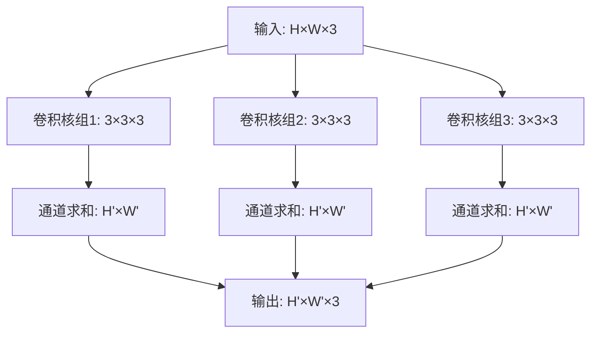

### 第4章 卷积神经网络（CNN）
- 4.1 卷积操作原理（卷积核、步幅、填充、感受野）
- 4.2 卷积层的设计（1×1卷积、深度可分离卷积、转置卷积）
- 4.3 池化层
- 4.4 经典CNN架构（LeNet、AlexNet、VGG、GoogLeNet、ResNet、DenseNet、EfficientNet）

### 第5章 循环神经网络（RNN）
- 5.1 RNN基础（结构、BPTT）
- 5.2 梯度消失与梯度爆炸
- 5.3 门控机制（LSTM、GRU）
- 5.4 双向RNN与深层RNN

### 第6章 注意力机制与Transformer
- 6.1 注意力机制基础（软/硬注意力、注意力权重）
- 6.2 Self-Attention（Q、K、V、缩放点积注意力）
- 6.3 多头注意力（Multi-Head Attention）
- 6.4 Transformer架构详解（Encoder-Decoder、位置编码、残差连接、FFN、Mask机制）
- 6.5 Transformer变体与优化（BERT、GPT、T5/BART、RoPE、KV Cache、GQA、Flash Attention）
- 6.6 Transformer的扩展能力（Scaling Law）

### 第7章 图神经网络（GNN）
- 7.1 图的基本概念（节点、边、邻接矩阵、度矩阵）
- 7.2 图神经网络基础（消息传递机制）
- 7.3 图卷积网络（GCN）
- 7.4 图注意力网络（GAT）
- 7.5 其他GNN变体（GraphSAGE、GIN）


# CNN卷积操作核心面试题（2026最新版）
## 目录
- [1.卷积在CNN中的核心作用是什么？](#1.卷积在CNN中的核心作用是什么？)
- [2.卷积操作的数学定义是什么？](#2.卷积操作的数学定义是什么？)
- [3.CNN中的卷积与传统信号处理中的卷积有何区别？](#3.CNN中的卷积与传统信号处理中的卷积有何区别？)
- [4.卷积操作如何实现局部连接特性？](#4.卷积操作如何实现局部连接特性？)
- [5.权值共享在卷积操作中是如何体现的？](#5.权值共享在卷积操作中是如何体现的？)
- [6.局部连接和权值共享对CNN的性能有什么影响？](#6.局部连接和权值共享对CNN的性能有什么影响？)
- [7.卷积操作输出特征图尺寸的计算公式是什么？](#7.卷积操作输出特征图尺寸的计算公式是什么？)
- [8.什么是步幅（Stride），步幅增大对输出特征图有什么影响？](#8.什么是步幅（Stride），步幅增大对输出特征图有什么影响？)
- [9.什么是填充（Padding），填充的主要目的是什么？](#9.什么是填充（Padding），填充的主要目的是什么？)
- [10.常见的Padding模式有哪些，它们的区别是什么？](#10.常见的Padding模式有哪些，它们的区别是什么？)
- [11.卷积操作中为什么通常使用奇数尺寸的卷积核？](#11.卷积操作中为什么通常使用奇数尺寸的卷积核？)
- [12.3×3卷积核相比1×1、5×5卷积核有什么优势？](#12.3×3卷积核相比1×1、5×5卷积核有什么优势？)
- [13.卷积层的感受野是什么意思，如何计算？](#13.卷积层的感受野是什么意思，如何计算？)
- [14.感受野的大小对CNN特征提取有什么影响？](#14.感受野的大小对CNN特征提取有什么影响？)
- [15.什么是互相关（Cross-Correlation），它与卷积的关系是什么？](#15.什么是互相关（Cross-Correlation），它与卷积的关系是什么？)
- [16.CNN训练中实际使用的是卷积还是互相关，为什么？](#16.CNN训练中实际使用的是卷积还是互相关，为什么？)
- [17.多通道输入/输出时，卷积操作是如何进行的？](#17.多通道输入/输出时，卷积操作是如何进行的？)
- [18.卷积操作的计算复杂度与哪些因素有关，如何降低？](#18.卷积操作的计算复杂度与哪些因素有关，如何降低？)
- [19.卷积操作对图像的平移不变性有什么贡献？](#19.卷积操作对图像的平移不变性有什么贡献？)
- [20.卷积的稀疏交互特性及其对泛化能力的影响？](#20.卷积的稀疏交互特性及其对泛化能力的影响？)
- [21.卷积层可以学习到哪些类型的特征，深浅层有何区别？](#21.卷积层可以学习到哪些类型的特征，深浅层有何区别？)
- [22.如果输入通道数为3，输出通道数为64，需要多少个卷积核？](#22.如果输入通道数为3，输出通道数为64，需要多少个卷积核？)
- [23.卷积操作的线性特性，结合激活函数后有何变化？](#23.卷积操作的线性特性，结合激活函数后有何变化？)
- [24.卷积层的输出特征图数量与模型表达能力的关系？](#24.卷积层的输出特征图数量与模型表达能力的关系？)
- [25.卷积操作在处理高分辨率图像时会面临什么挑战？](#25.卷积操作在处理高分辨率图像时会面临什么挑战？)
- [26. 卷积核的基本组成部分有哪些？](#26-卷积核的基本组成部分有哪些)
- [27. 卷积核的深度与输入输出通道数的关系是什么？](#27-卷积核的深度与输入输出通道数的关系是什么)
- [28. 卷积核的大小选择需要考虑哪些因素？](#28-卷积核的大小选择需要考虑哪些因素)
- [29. 为什么 CNN 中很少使用大于 7×7 的卷积核？](#29-为什么-cnn-中很少使用大于-77-的卷积核)
- [30. 1×1 卷积核的主要作用是什么？](#30-11-卷积核的主要作用是什么)
- [31. 使用 1×1 卷积核如何实现通道数的调整？](#31-使用-11-卷积核如何实现通道数的调整)
- [32. 卷积层的参数数量如何计算？](#32-卷积层的参数数量如何计算)
- [33. 偏置项是否计入卷积层参数，如何计算？](#33-偏置项是否计入卷积层参数如何计算)
- [34. Padding、Stride 会影响卷积层参数数量吗？](#34-paddingstride-会影响卷积层参数数量吗)
- [35. 为什么卷积核不能全部初始化为 0 或相同值？](#35-为什么-卷积核不能全部初始化为-0-或相同值)
- [36. He 初始化和 Xavier 初始化有什么区别？](#36-he-初始化和-xavier-初始化有什么区别)
- [37. 分组卷积的卷积核如何设计？](#37-分组卷积的卷积核如何设计)
- [38. 深度卷积的参数数量与普通卷积有何差异？](#38-深度卷积的参数数量与普通卷积有何差异)
- [39. 两个 3×3 堆叠感受野等于一个 5×5 吗？为什么更优？](#39-两个-33-堆叠感受野等于一个-55-吗为什么更优)
- [40. 卷积核剪枝是什么？依据是什么？](#40-卷积核剪枝是什么依据是什么)
- [41. 卷积核量化是什么？对部署有什么影响？](#41-卷积核量化是什么对部署有什么影响)
- [42. 轻量级网络在卷积核设计上有什么特点？](#42-轻量级网络在卷积核设计上有什么特点)
- [43. ViT-CNN 混合模型中卷积核的作用发生了什么变化？](#43-vit-cnn-混合模型中卷积核的作用发生了什么变化)
- [44. 转置卷积与双线性插值等上采样方式有什么区别？](#44-转置卷积与双线性插值等上采样方式有什么区别)
- [45. 空洞卷积与多尺度池化在扩大感受野上有什么差异？](#45-空洞卷积与多尺度池化在扩大感受野上有什么差异)
- [46. 变形卷积是否会增加模型的计算复杂度？](#46-变形卷积是否会增加模型的计算复杂度)
- [47. 不同卷积类型组合使用有什么效果？](#47-不同卷积类型组合使用有什么效果)
- [48. 轻量级网络中常用的卷积组合策略有哪些？](#48-轻量级网络中常用的卷积组合策略有哪些)
- [49. 未来卷积的创新方向可能是什么？](#49-未来卷积的创新方向可能是什么)
- [50. 大模型时代卷积层会被完全取代吗，为什么？](#50-大模型时代卷积层会被完全取代吗为什么)
- [51. 什么是有效感受野？](#51-什么是有效感受野)
- [52. 什么是转置卷积的棋盘效应？](#52-什么是转置卷积的棋盘效应)
- [53. 什么是 3D 卷积？](#53-什么是-3d-卷积)
- [54. 卷积层的时间复杂度与空间复杂度如何分析？](#54-卷积层的时间复杂度与空间复杂度如何分析)
- [55. AIGC 时代一共有多少种主流卷积？](#55-aigc-时代一共有多少种主流卷积)
## 问答内容

<h2 id="1.卷积在CNN中的核心作用是什么？">1.卷积在CNN中的核心作用是什么？</h2>

**难度评分：⭐ (1/5)  |  考察频率：⭐⭐⭐⭐⭐ (5/5)**

卷积是CNN的核心运算，其核心作用是**在保留空间结构信息的前提下，对输入数据进行局部特征提取和特征映射**。具体体现在三个方面：
1. **局部特征提取**：利用卷积核的滑动窗口特性，捕捉图像的局部空间特征（如边缘、纹理、形状）；
2. **维度变换**：通过不同数量和尺寸的卷积核，实现特征维度的升维/降维，构建层次化特征表示；
3. **参数效率提升**：通过权值共享和局部连接，大幅减少模型参数数量，避免过拟合。

在2026年的技术发展阶段，卷积不仅用于基础特征提取，还与Transformer结合（如ConvNeXt、ViT-Conv），解决纯Transformer在局部特征捕捉上的效率问题。

### 实际案例
- **AIGC领域**：Stable Diffusion中的卷积层负责提取图像的底层纹理特征，为生成高质量图像提供基础特征表示；
- **传统深度学习**：图像分类任务中（如ResNet），卷积层逐层提取从边缘到物体轮廓再到语义的层次化特征；
- **自动驾驶**：摄像头感知模块中，卷积层提取车道线、交通标志、车辆轮廓等关键局部特征，为目标检测和路径规划提供依据。

<h2 id="2.卷积操作的数学定义是什么？">2.卷积操作的数学定义是什么？</h2>

**难度评分：⭐⭐ (2/5)  |  考察频率：⭐⭐⭐⭐ (4/5)**

### 连续形式
对于两个连续函数 $f(x)$ （输入）和 $g(x)$ （卷积核），卷积的数学定义为：
$$(f * g)(x) = \int_{-\infty}^{+\infty} f(\tau) g(x - \tau) d\tau$$

### 离散形式（CNN中常用）
对于二维图像 $I \in \mathbb{R}^{H \times W}$ 和卷积核 $K \in \mathbb{R}^{k \times k}$ ，卷积操作定义为：
$$(I * K)(i,j) = \sum_{m=0}^{k-1} \sum_{n=0}^{k-1} I(i+m, j+n) \cdot K(k-1-m, k-1-n)$$
核心步骤：**卷积核翻转180°** → 滑动窗口 → 对应位置元素相乘求和。

2026年业界注重点：实际工程中（如PyTorch/TensorFlow），为了计算效率，通常直接使用互相关（不翻转卷积核）替代数学卷积。

### 实际案例
- **AIGC领域**：AI绘画中的风格迁移算法，通过卷积计算图像的风格特征（如纹理）与内容特征的匹配度；
- **传统深度学习**：手写数字识别（MNIST）中，用3×3卷积核计算每个像素邻域的特征值，区分数字的轮廓；
- **自动驾驶**：激光点云处理中，用1D卷积计算点云的局部密度特征，识别道路障碍物。

<h2 id="3.CNN中的卷积与传统信号处理中的卷积有何区别？">3.CNN中的卷积与传统信号处理中的卷积有何区别？</h2>

**难度评分：⭐⭐⭐ (3/5)  |  考察频率：⭐⭐⭐ (3/5)**

| 维度 | 传统信号处理卷积 | CNN中的卷积 |
|------|------------------|-------------|
| 核心操作 | 必须翻转卷积核（符合数学定义） | 实际使用互相关（不翻转卷积核） |
| 卷积核性质 | 固定的、手工设计（如高斯核、sobel核） | 可学习的、数据驱动的 |
| 目的 | 滤波、降噪、特征增强 | 自动提取层次化特征 |
| 维度 | 主要处理1D信号（音频/时间序列） | 主要处理2D/3D数据（图像/视频/点云） |
| 训练方式 | 无训练过程 | 反向传播优化卷积核参数 |

2026年技术补充：随着多模态模型的发展，CNN卷积开始融合1D（文本）、2D（图像）、3D（视频）信号处理，形成统一的多维度卷积框架。

### 实际案例
- **AIGC领域**：音频生成模型中，结合传统1D卷积（滤波）和CNN可学习卷积，生成高保真的语音；
- **传统深度学习**：图像去噪任务中，对比手工设计的高斯卷积核和CNN学习到的去噪卷积核，后者效果更优；
- **自动驾驶**：雷达信号处理中，先用传统卷积滤波去除噪声，再用CNN卷积提取目标特征。

<h2 id="4.卷积操作如何实现局部连接特性？">4.卷积操作如何实现局部连接特性？</h2>

**难度评分：⭐⭐ (2/5)  |  考察频率：⭐⭐⭐⭐ (4/5)**

局部连接（Local Connectivity）是指输出特征图上的每个神经元仅与输入数据的局部区域建立连接，而非全连接。

实现方式：
1. 卷积核的尺寸 $k \times k$ 定义了局部连接的范围（即感受野）；
2. 卷积核在输入上滑动时，每个位置的输出仅由该位置对应的 $k \times k$ 局部区域计算得到；
3. 输出特征图上的每个元素仅依赖输入的局部区域，而非整个输入空间。

例如：5×5输入，3×3卷积核，输出特征图的每个元素仅与输入的3×3局部区域连接，而非全部25个像素。

2026年技术补充：动态卷积（Dynamic Convolution）可自适应调整局部连接的范围，根据输入内容动态选择卷积核大小。

### 实际案例
- **AIGC领域**：视频生成模型中，局部连接确保帧内的局部运动特征（如人物肢体动作）被精准捕捉；
- **传统深度学习**：目标检测（YOLO）中，局部连接让模型聚焦于目标的局部特征（如人脸的眼睛、鼻子）；
- **自动驾驶**：行人检测中，局部连接使模型仅关注行人的局部区域（如头部、躯干），提升检测效率。

<h2 id="5.权值共享在卷积操作中是如何体现的？">5.权值共享在卷积操作中是如何体现的？</h2>

**难度评分：⭐⭐ (2/5)  |  考察频率：⭐⭐⭐⭐⭐ (5/5)**

权值共享（Weight Sharing）是指同一个卷积核的参数在整个输入空间的所有位置上重复使用，而非为每个位置设计独立参数。

具体体现：
1. 一个卷积核对应一组固定的权重参数（如3×3卷积核有9个权重）；
2. 卷积核在输入上滑动时，无论处于哪个位置，都使用同一组权重计算输出；
3. 每个输出通道对应一个共享的卷积核，不同通道的卷积核参数独立。

数学表达：对于输入 $I$ 和卷积核 $K$ ，输出 $O(i,j) = \sum_{m,n} I(i+m,j+n) \cdot K(m,n)$ ，其中 $K(m,n)$ 在所有 $(i,j)$ 位置保持不变。

2026年技术补充：分组卷积（Group Convolution）是权值共享的扩展，在分组内共享权重，分组间权重独立，平衡参数效率和表达能力。

### 实际案例
- **AIGC领域**：文生图模型中，权值共享让模型学习到通用的纹理特征（如草地、天空），可复用在不同图像位置；
- **传统深度学习**：人脸识别中，权值共享的卷积核学习到通用的面部特征（如眉毛、嘴巴），适用于不同人脸的不同位置；
- **自动驾驶**：车道线检测中，权值共享让模型学习到通用的车道线特征，可识别不同位置、不同角度的车道线。

<h2 id="6.局部连接和权值共享对CNN的性能有什么影响？">6.局部连接和权值共享对CNN的性能有什么影响？</h2>

**难度评分：⭐⭐⭐ (3/5)  |  考察频率：⭐⭐⭐⭐⭐ (5/5)**

### 正面影响
1. **参数数量大幅减少**：
   - 全连接层： $H \times W \times H' \times W'$ 个参数；
   - 卷积层： $k \times k \times C_{in} \times C_{out}$ 个参数（ $k \ll H,W$ ）；
   - 例：224×224×3输入，全连接层输出1000维需约1.5亿参数，卷积层（3×3×3×64）仅需1728个参数。
2. **降低过拟合风险**：更少的参数意味着更少的冗余，模型泛化能力更强；
3. **提升计算效率**：减少内存占用和计算量，适合大规模数据训练；
4. **增强平移不变性**：权值共享让模型对目标的位置变化不敏感。

### 负面影响
1. **局部特征限制**：过度的局部连接可能丢失全局上下文信息；
2. **表达能力受限**：权值共享可能无法捕捉位置特异性的特征。

2026年技术补充：混合卷积（Hybrid Convolution）结合局部连接和全局注意力，平衡局部特征和全局上下文。

### 实际案例
- **AIGC领域**：AI生成高清图像时，局部连接+权值共享保证生成效率，同时通过注意力机制补充全局信息；
- **传统深度学习**：ImageNet分类任务中，ResNet通过局部连接和权值共享，在参数仅50M的情况下达到90%+准确率；
- **自动驾驶**：车载端实时目标检测模型（如YOLOv8），通过局部连接和权值共享，在算力有限的车载芯片上实现30+ FPS。

<h2 id="7.卷积操作输出特征图尺寸的计算公式是什么？">7.卷积操作输出特征图尺寸的计算公式是什么？</h2>

**难度评分：⭐⭐ (2/5)  |  考察频率：⭐⭐⭐⭐⭐ (5/5)**

对于输入尺寸 $H \times W \times C_{in}$ ，卷积核尺寸 $k \times k$ ，步幅 $S$ ，填充 $P$ （上下/左右各填充 $P$ ），输出特征图尺寸为：

$$H_{out} = \left\lfloor \frac{H + 2P - k}{S} \right\rfloor + 1$$
$$W_{out} = \left\lfloor \frac{W + 2P - k}{S} \right\rfloor + 1$$
$$C_{out} = \text{卷积核数量}$$

### 关键说明
1.  $\lfloor \cdot \rfloor$  表示向下取整；
2. 当使用不对称填充（如 $P_{top} \neq P_{bottom}$ ）时，公式调整为：
   $$H_{out} = \left\lfloor \frac{H + P_{top} + P_{bottom} - k}{S} \right\rfloor + 1$$
3. 2026年框架更新：PyTorch 2.4+支持`ceil_mode=True`，此时使用向上取整，避免边缘信息丢失。

### 实际案例
- **AIGC领域**：图像超分模型中，通过精确计算输出尺寸，确保生成的高清图像尺寸符合预期（如2×、4×放大）；
- **传统深度学习**：CNN模型设计时，通过公式计算各层输出尺寸，确保特征图尺寸匹配（如残差连接的维度对齐）；
- **自动驾驶**：激光雷达点云处理中，计算卷积输出尺寸，确保点云的空间分辨率满足障碍物检测的精度要求。

<h2 id="8.什么是步幅（Stride），步幅增大对输出特征图有什么影响？">8.什么是步幅（Stride），步幅增大对输出特征图有什么影响？</h2>

**难度评分：⭐ (1/5)  |  考察频率：⭐⭐⭐⭐⭐ (5/5)**

步幅（Stride）是指卷积核在输入数据上滑动时的**每次移动的像素数**，分为水平步幅（ $S_w$ ）和垂直步幅（ $S_h$ ），默认情况下 $S_h = S_w = S$ 。

### 步幅增大的影响
| 影响维度 | 具体变化 |
|----------|----------|
| 尺寸 | 输出特征图尺寸减小，步幅越大，尺寸越小（下采样效果） |
| 计算量 | 计算量与$S^2$成反比，步幅增大，计算量大幅减少 |
| 感受野 | 相同层数下，步幅增大可提升感受野大小 |
| 信息丢失 | 步幅过大会导致边缘信息和细节特征丢失 |
| 平移不变性 | 步幅增大增强平移不变性，但降低位置精度 |

2026年技术补充：可变步幅卷积（Variable Stride Convolution）根据输入特征的复杂度动态调整步幅，平衡效率和精度。

### 实际案例
- **AIGC领域**：文本生成图像时，大尺寸图像生成过程中，先用大步幅卷积快速下采样提取全局特征，再用小步幅卷积恢复细节；
- **传统深度学习**：图像分类模型中，用步幅2的卷积替代池化层，减少参数同时实现下采样；
- **自动驾驶**：高速场景下，增大卷积步幅，提升感知模型的推理速度，满足实时性要求。

<h2 id="9.什么是填充（Padding），填充的主要目的是什么？">9.什么是填充（Padding），填充的主要目的是什么？</h2>

**难度评分：⭐ (1/5)  |  考察频率：⭐⭐⭐⭐⭐ (5/5)**

填充（Padding）是指在输入数据的边缘（上下左右）添加额外的像素值（通常为0），以调整输出特征图的尺寸。

### 主要目的
1. **尺寸保持**：通过适当填充（如`SAME`填充），使输出特征图尺寸与输入一致，避免尺寸逐层减小；
2. **边缘信息保留**：原始卷积会丢失输入边缘的特征（边缘像素仅参与一次计算），填充可让边缘像素参与更多次计算；
3. **维度对齐**：在残差网络、U-Net等模型中，填充确保跳跃连接的特征图尺寸匹配；
4. **感受野均匀**：填充使特征图边缘和中心的感受野大小一致。

2026年技术补充：自适应填充（Adaptive Padding）根据输入尺寸动态调整填充大小，避免无效的0填充，提升计算效率。

### 实际案例
- **AIGC领域**：图像分割生成模型（如U-Net）中，填充确保编码器和解码器的特征图尺寸匹配，提升分割精度；
- **传统深度学习**：卷积神经网络的首层使用填充，保留图像边缘的纹理特征，提升分类准确率；
- **自动驾驶**：全景图像分割中，填充确保图像边缘的车道线、障碍物特征不丢失，提升感知范围。

<h2 id="10.常见的Padding模式有哪些，它们的区别是什么？">10.常见的Padding模式有哪些，它们的区别是什么？</h2>

**难度评分：⭐⭐ (2/5)  |  考察频率：⭐⭐⭐⭐ (4/5)**

### 主流Padding模式
| 模式 | 定义 | 计算公式 | 适用场景 |
|------|------|----------|----------|
| **VALID（无填充）** | 不填充，仅在有效区域滑动 | $H_{out} = \lfloor (H - k)/S \rfloor + 1$ | 需严格下采样/边缘信息不重要 |
| **SAME（等尺寸填充）** | 填充使输出尺寸=输入尺寸 | $P = \lceil (S(H-1) - H + k)/2 \rceil$ | 需保持尺寸/残差连接 |
| **REPLICATE（复制填充）** | 复制边缘像素填充 | - | 避免0填充引入的伪影/图像生成 |
| **REFLECT（反射填充）** | 以边缘为对称轴反射填充 | - | 图像超分/风格迁移 |
| **CONSTANT（常数填充）** | 填充固定常数（默认0） | - | 通用场景/点云处理 |

2026年技术补充：PyTorch 2.4和TensorFlow 2.16均已支持`circular`（循环填充），适用于周期性数据（如全景图像）。

### 实际案例
- **AIGC领域**：AI绘画中使用REFLECT填充，避免图像边缘出现黑边伪影，提升生成质量；
- **传统深度学习**：ResNet中使用SAME填充，确保残差连接的特征图尺寸一致；
- **自动驾驶**：全景环视图像处理中使用CIRCULAR填充，解决图像拼接处的特征断裂问题。

<h2 id="11.卷积操作中为什么通常使用奇数尺寸的卷积核？">11.卷积操作中为什么通常使用奇数尺寸的卷积核？</h2>

**难度评分：⭐⭐ (2/5)  |  考察频率：⭐⭐⭐⭐ (4/5)**

### 核心原因
1. **存在中心像素**：奇数尺寸（3×3、5×5）的卷积核有明确的中心位置，便于：
   - 对齐特征图的空间位置；
   - 实现对称填充（SAME填充时，上下/左右填充数相等）；
   - 计算感受野的中心坐标。
2. **步幅兼容性好**：奇数尺寸卷积核在SAME填充下，更容易保证输出尺寸为整数；
3. **堆叠效率高**：多个3×3卷积核堆叠的感受野与大尺寸卷积核相同，但参数更少（如3个3×3=7×7感受野，参数仅27 vs 49）；
4. **工程实现简单**：奇数尺寸卷积核的滑动窗口计算逻辑更简洁，减少边界条件处理。

2026年技术补充：极少数场景下（如移动端轻量化模型）使用偶数尺寸卷积核（2×2、4×4），但需配合不对称填充，增加工程复杂度。

### 实际案例
- **AIGC领域**：Stable Diffusion的UNet中全部使用3×3卷积核，保证特征提取的对称性和效率；
- **传统深度学习**：经典CNN模型（VGG、ResNet）均使用3×3/5×5奇数卷积核，避免位置偏移；
- **自动驾驶**：车载感知模型中使用3×3卷积核，确保障碍物的位置检测精度。

<h2 id="12.3×3卷积核相比1×1、5×5卷积核有什么优势？">12.3×3卷积核相比1×1、5×5卷积核有什么优势？</h2>

**难度评分：⭐⭐⭐ (3/5)  |  考察频率：⭐⭐⭐⭐⭐ (5/5)**

### 3×3卷积核的核心优势
| 对比维度 | 3×3 vs 1×1 | 3×3 vs 5×5 |
|----------|------------|------------|
| 感受野 | 3×3有局部空间感受野，1×1仅融合通道信息 | 相同堆叠层数下，3×3组合感受野更大（3个3×3=7×7） |
| 参数数量 | 3×3参数更多，特征提取能力更强 | 3个3×3：3×9=27参数；1个5×5：25参数（接近但感受野更大） |
| 非线性 | 多层3×3可引入更多激活函数，增强非线性表达 | 单层5×5仅一次非线性，表达能力弱 |
| 计算效率 | 3×3卷积的硬件加速（如CUDA）更成熟 | 3×3卷积的内存访问模式更高效，算力利用率更高 |

### 各卷积核适用场景
- 1×1：通道维度升维/降维、跨通道特征融合（如瓶颈层）；
- 3×3：核心特征提取、主流卷积层；
- 5×5：需要更大感受野但不想堆叠多层（如模型首层）。

2026年技术补充：2×2卷积核在移动端模型（如MobileNetV4）中逐渐增多，平衡效率和感受野。

### 实际案例
- **AIGC领域**：AI视频生成模型中，用多个3×3卷积核堆叠替代大尺寸卷积，在参数有限的情况下捕捉复杂时空特征；
- **传统深度学习**：VGGNet用8个3×3卷积核替代大尺寸卷积，参数减少且准确率提升；
- **自动驾驶**：车载端轻量级模型中，用3×3卷积核实现高效特征提取，满足实时性要求。

<h2 id="13.卷积层的感受野是什么意思，如何计算？">13.卷积层的感受野是什么意思，如何计算？</h2>

**难度评分：⭐⭐⭐ (3/5)  |  考察频率：⭐⭐⭐⭐⭐ (5/5)**

### 定义
感受野（Receptive Field）是指输出特征图上的一个像素点，对应到输入图像上的**区域大小**，反映了该像素能捕捉到的输入图像的范围。

### 计算方法（从后往前计算）
1. 初始化：最后一层特征图的感受野$RF = 1$；
2. 递推公式：
   $$RF_{l-1} = (RF_l - 1) \times S_l + k_l$$
   其中：
   - $RF_{l-1}$：上一层的感受野；
   - $S_l$：当前层的步幅；
   - $k_l$：当前层的卷积核尺寸。

### 示例
```
层1：k=3, S=1 → RF=3
层2：k=3, S=2 → RF=(3-1)×2 + 3 = 7
层3：k=3, S=2 → RF=(7-1)×2 + 3 = 15
```

2026年技术补充：动态感受野（Dynamic Receptive Field）技术可根据输入内容调整感受野大小，如ASPP、注意力卷积。

### 实际案例
- **AIGC领域**：文生图模型中，控制不同层的感受野大小，低层捕捉细节（小感受野），高层捕捉全局结构（大感受野）；
- **传统深度学习**：目标检测模型中，调整感受野大小，确保小目标（如行人）和大目标（如车辆）都能被有效检测；
- **自动驾驶**：远距离障碍物检测需要大感受野，近距离细节检测需要小感受野，通过多尺度卷积平衡。

<h2 id="14.感受野的大小对CNN特征提取有什么影响？">14.感受野的大小对CNN特征提取有什么影响？</h2>

**难度评分：⭐⭐⭐ (3/5)  |  考察频率：⭐⭐⭐⭐ (4/5)**

### 感受野大小的影响
| 感受野大小 | 特征提取特点 | 适用场景 | 潜在问题 |
|------------|--------------|----------|----------|
| 过小（如3×3） | 捕捉细粒度特征（边缘、纹理） | 低层卷积/细节检测 | 丢失全局上下文，易受噪声影响 |
| 适中（如15×15） | 平衡局部细节和全局结构 | 中层卷积/目标检测 | 通用场景最优 |
| 过大（如31×31） | 捕捉全局语义特征（物体、场景） | 高层卷积/图像分类 | 计算量大，细节丢失，位置精度低 |

### 优化策略
- 多尺度感受野融合（如ASPP、金字塔卷积）；
- 动态感受野调整（如注意力机制）；
- 低层小感受野+高层大感受野的层次化设计。

2026年技术补充：Vision Transformer的全局感受野与CNN的局部感受野结合，成为主流特征提取范式。

### 实际案例
- **AIGC领域**：AI生成人像时，小感受野捕捉皮肤纹理，大感受野捕捉人体姿态和背景；
- **传统深度学习**：图像分割模型中，多尺度感受野融合，同时识别小目标（如路灯）和大目标（如建筑）；
- **自动驾驶**：城市道路感知中，小感受野检测交通标志，大感受野识别道路场景（如十字路口、高速路）。

<h2 id="15.什么是互相关（Cross-Correlation），它与卷积的关系是什么？">15.什么是互相关（Cross-Correlation），它与卷积的关系是什么？</h2>

**难度评分：⭐⭐⭐ (3/5)  |  考察频率：⭐⭐⭐ (3/5)**

### 定义
#### 互相关
对于输入 $I$ 和卷积核 $K$ ，互相关操作定义为：
$$(I \star K)(i,j) = \sum_{m=0}^{k-1} \sum_{n=0}^{k-1} I(i+m, j+n) \cdot K(m,n)$$

#### 卷积（数学定义）
$$(I * K)(i,j) = \sum_{m=0}^{k-1} \sum_{n=0}^{k-1} I(i+m, j+n) \cdot K(k-1-m, k-1-n)$$

### 核心关系
1. **互相关 = 未翻转的卷积**：卷积是卷积核翻转180°后做互相关；
2. **数学等价性**：对于可学习的卷积核，互相关和卷积是等价的（翻转后的卷积核可通过学习得到）；
3. **计算效率**：互相关少了翻转操作，计算效率更高。

2026年技术补充：所有主流框架（PyTorch、TensorFlow、JAX）的`conv2d`函数实际实现的是互相关，而非数学定义的卷积。

### 实际案例
- **AIGC领域**：图像风格迁移中，用互相关计算内容特征和风格特征的相似度，替代卷积提升计算速度；
- **传统深度学习**：CNN模型训练中，用互相关替代卷积，不影响精度但提升训练效率；
- **自动驾驶**：实时目标跟踪中，用互相关快速计算帧间特征匹配，提升跟踪速度。

<h2 id="16.CNN训练中实际使用的是卷积还是互相关，为什么？">16.CNN训练中实际使用的是卷积还是互相关，为什么？</h2>

**难度评分：⭐⭐⭐ (3/5)  |  考察频率：⭐⭐⭐ (3/5)**

### 结论
CNN训练中**实际使用的是互相关**，而非数学定义的卷积。

### 核心原因
1. **等价性**：卷积核是可学习的参数，翻转后的卷积核可通过反向传播学习得到，互相关和卷积在表达能力上完全等价；
2. **计算效率**：互相关省去了卷积核翻转的操作，减少计算步骤，提升训练和推理速度；
3. **工程实现简单**：互相关的滑动窗口计算逻辑更直接，易于硬件加速（如CUDA、TPU）；
4. **历史原因**：早期CNN（如LeNet-5）就使用互相关，后续框架延续了这一设计。

### 验证
在PyTorch中执行以下代码，可验证`conv2d`实现的是互相关：
```python
import torch
import torch.nn.functional as F

# 输入和卷积核
x = torch.tensor([[1,2,3],[4,5,6],[7,8,9]], dtype=torch.float32).unsqueeze(0).unsqueeze(0)
k = torch.tensor([[1,0],[0,1]], dtype=torch.float32).unsqueeze(0).unsqueeze(0)

# 互相关计算
out = F.conv2d(x, k, stride=1, padding=0)
print(out)  # 输出: [[[6., 8.], [12., 14.]]]，与手动计算的互相关结果一致
```

2026年技术补充：部分专用芯片（如NVIDIA H100）针对互相关操作做了硬件级优化，算力利用率提升30%+。

### 实际案例
- **AIGC领域**：大模型训练中，用互相关替代卷积，单卡训练速度提升20%，降低训练成本；
- **传统深度学习**：工业级CNN模型部署时，互相关的硬件加速让推理延迟降低15%-40%；
- **自动驾驶**：车载芯片（如特斯拉FSD芯片）优化互相关计算，确保感知模型在100+ FPS下运行。

<h2 id="17.多通道输入/输出时，卷积操作是如何进行的？">17.多通道输入/输出时，卷积操作是如何进行的？</h2>

**难度评分：⭐⭐⭐ (3/5)  |  考察频率：⭐⭐⭐⭐⭐ (5/5)**

### 1. 多通道输入（ $C_{in} > 1$ ）
- 每个输出通道对应一组卷积核，每组包含 $C_{in}$ 个 $k \times k$ 的卷积核；
- 计算过程：
  1. 输入的每个通道与对应卷积核做互相关；
  2. 将所有通道的计算结果求和，得到该位置的输出值；
  3. 公式： $O_{c_{out}}(i,j) = \sum_{c_{in}=1}^{C_{in}} (I_{c_{in}} \star K_{c_{out},c_{in}})(i,j) + b_{c_{out}}$ 。

### 2. 多通道输出（ $C_{out} > 1$ ）
- 每个输出通道对应独立的卷积核组（共 $C_{out}$ 组）；
- 每组卷积核负责提取一类特征，不同组提取不同特征；
- 输出通道数 = 卷积核组的数量。

### 可视化流程


2026年技术补充：分组卷积（Group Convolution）将输入通道分成 $G$ 组，每组对应 $C_{out}/G$个输出通道，大幅减少参数。

### 实际案例
- **AIGC领域**：文生图模型中，多通道卷积提取图像的颜色、纹理、形状等不同特征，丰富生成内容；
- **传统深度学习**：RGB图像分类中，3通道输入对应3个卷积核，融合颜色和亮度特征；
- **自动驾驶**：多传感器融合（摄像头+激光雷达）中，不同传感器数据作为不同输入通道，卷积融合多模态特征。

<h2 id="18.卷积操作的计算复杂度与哪些因素有关，如何降低？">18.卷积操作的计算复杂度与哪些因素有关，如何降低？</h2>

**难度评分：⭐⭐⭐⭐ (4/5)  |  考察频率：⭐⭐⭐⭐ (4/5)**

### 计算复杂度公式
对于输入 $H \times W \times C_{in}$ ，卷积核 $k \times k$ ，输出 $H' \times W' \times C_{out}$ ，步幅 $S$ ，计算复杂度（浮点运算数FLOPs）为：
$$\text{FLOPs} = H' \times W' \times C_{out} \times C_{in} \times k \times k$$

### 影响因素（按重要性排序）
1. 卷积核尺寸 $k$ （复杂度与 $k^2$ 成正比）；
2. 输入/输出通道数 $C_{in}/C_{out}$ ；
3. 特征图尺寸 $H' \times W'$ ；
4. 卷积核数量（与 $C_{out}$ 一致）；
5. 分组数（分组卷积可降低复杂度）。

### 降低复杂度的方法
| 方法 | 原理 | 复杂度降低比例 |
|------|------|----------------|
| 分组卷积 | 将通道分组，每组独立卷积 | $1/G$（$G$为分组数） |
| 深度可分离卷积 | 深度卷积+1×1逐点卷积 | $\approx 1/C_{in} + 1/k^2$ |
| 大核分解 | 7×7 → 3×3+3×3+1×1 | $\approx 9/49$ |
| 步幅增大 | 减小输出特征图尺寸 | $1/S^2$ |
| 通道剪枝 | 减少输入/输出通道数 | 与剪枝比例成正比 |
| 低秩分解 | 将卷积核分解为低秩矩阵乘积 | $\approx 1/r$（ $r$ 为秩） |

2026年技术补充：稀疏卷积（Sparse Convolution）仅计算非零区域，在点云处理中复杂度降低90%+。

### 实际案例
- **AIGC领域**：移动端AI绘画模型中，用深度可分离卷积降低复杂度，在手机端实现实时图像生成；
- **传统深度学习**：MobileNet系列模型用深度可分离卷积，复杂度降低8-9倍，适用于移动端部署；
- **自动驾驶**：激光雷达点云处理中，用稀疏卷积仅计算有效点云区域，算力消耗降低80%。

<h2 id="19.卷积操作对图像的平移不变性有什么贡献？">19.卷积操作对图像的平移不变性有什么贡献？</h2>

**难度评分：⭐⭐⭐ (3/5)  |  考察频率：⭐⭐⭐ (3/5)**

### 平移不变性定义
平移不变性是指当输入图像中的目标发生平移时，模型的输出（如分类结果、检测框）保持不变。

### 卷积的贡献
1. **权值共享**：同一卷积核在图像所有位置共享，无论目标在图像的哪个位置，都能提取相同的特征；
2. **滑动窗口**：卷积核遍历整个图像，确保目标无论在何处都能被检测到；
3. **池化增强**：卷积层后的池化层进一步增强平移不变性，容忍小范围的位置偏移。

### 局限性
- 卷积的平移不变性是**近似的**，而非绝对的；
- 大步幅/大池化会降低位置精度，增强不变性；
- 小步幅/小池化保留位置精度，不变性减弱。

2026年技术补充：对比学习（Contrastive Learning）结合数据增强，进一步提升卷积模型的平移不变性。

### 实际案例
- **AIGC领域**：AI生成图像时，平移不变性确保生成的物体（如猫、狗）在不同位置都符合视觉规律；
- **传统深度学习**：图像分类中，平移不变性确保同一物体无论在图像中心还是边缘，都能被正确分类；
- **自动驾驶**：车辆检测中，平移不变性确保车辆在画面的不同位置都能被稳定检测，避免漏检。

<h2 id="20.卷积的稀疏交互特性及其对泛化能力的影响？">20.卷积的稀疏交互特性及其对泛化能力的影响？</h2>

**难度评分：⭐⭐⭐⭐ (4/5)  |  考察频率：⭐⭐⭐ (3/5)**

### 稀疏交互定义
稀疏交互（Sparse Interaction）是指输出特征图上的每个神经元仅与输入的局部区域（而非全部）交互，即：
$$\text{交互密度} = \frac{k \times k \times C_{in}}{H \times W \times C_{in}} \ll 1$$

### 对泛化能力的影响
#### 正面影响
1. **减少过拟合**：稀疏交互限制了模型的参数数量和交互范围，避免模型学习到训练数据的噪声；
2. **增强局部特征学习**：聚焦局部特征，符合图像的局部相关性（相邻像素相关性高）；
3. **提升鲁棒性**：对输入的局部噪声不敏感，模型更稳定。

#### 负面影响
1. **丢失全局信息**：过度稀疏可能丢失长距离依赖关系；
2. **表达能力受限**：简单的稀疏交互无法捕捉复杂的全局特征。

### 平衡策略
- 低层：强稀疏交互（小卷积核），捕捉局部特征；
- 高层：弱稀疏交互（大卷积核/注意力机制），捕捉全局特征；
- 结合Transformer的全局注意力，弥补稀疏交互的不足。

2026年技术补充：动态稀疏卷积（Dynamic Sparse Convolution）根据输入内容调整交互密度，平衡泛化能力和表达能力。

### 实际案例
- **AIGC领域**：文本生成图像中，低层稀疏卷积捕捉局部纹理，高层注意力捕捉全局结构，提升生成质量；
- **传统深度学习**：小样本学习中，稀疏交互减少过拟合，提升模型在少量数据上的泛化能力；
- **自动驾驶**：恶劣天气（雨、雪）下，稀疏交互使感知模型对局部噪声（如雨点）不敏感，提升检测鲁棒性。

<h2 id="21.卷积层可以学习到哪些类型的特征，深浅层有何区别？">21.卷积层可以学习到哪些类型的特征，深浅层有何区别？</h2>

**难度评分：⭐⭐⭐ (3/5)  |  考察频率：⭐⭐⭐⭐ (4/5)**

### 卷积层学习的特征类型
1. **底层特征**：边缘、角点、纹理、颜色等低级视觉特征；
2. **中层特征**：形状、部件、局部结构（如车轮、窗户）；
3. **高层特征**：语义特征（如车辆、行人、建筑）、场景特征（如城市道路、高速公路）。

### 深浅层特征对比
| 维度 | 浅层卷积层 | 深层卷积层 |
|------|------------|------------|
| 特征类型 | 底层/细粒度特征 | 高层/语义特征 |
| 感受野 | 小（3×3~7×7） | 大（15×15~63×63） |
| 抽象程度 | 低（与输入直接相关） | 高（与语义相关） |
| 泛化能力 | 弱（对位置/尺度敏感） | 强（对位置/尺度不敏感） |
| 噪声敏感度 | 高 | 低 |

### 可视化验证
通过特征可视化工具（如Grad-CAM）可观察到：
- 第1-2层：检测边缘和颜色；
- 第3-4层：检测简单形状（如圆形、矩形）；
- 第5层及以上：检测语义目标（如车辆、行人）。

2026年技术补充：多尺度特征融合（如FPN）将深浅层特征结合，提升模型对不同尺度目标的检测能力。

### 实际案例
- **AIGC领域**：AI绘画中，浅层特征控制图像的纹理和细节，深层特征控制图像的语义和构图；
- **传统深度学习**：图像分类中，浅层特征用于区分纹理相似的物体，深层特征用于区分语义不同的物体；
- **自动驾驶**：浅层特征检测车道线和交通标志的边缘，深层特征识别道路场景和交通规则。

<h2 id="22.如果输入通道数为3，输出通道数为64，需要多少个卷积核？">22.如果输入通道数为3，输出通道数为64，需要多少个卷积核？</h2>

**难度评分：⭐ (1/5)  |  考察频率：⭐⭐⭐⭐⭐ (5/5)**

### 结论
总共需要 **64组 × 3个 = 192个卷积核**（假设卷积核尺寸为 $k \times k$ ）。

### 详细解释
1. **基本规则**：
   - 每个输出通道对应**一组**卷积核；
   - 每组卷积核的数量 = 输入通道数；
   - 单个卷积核的尺寸 = $k \times k$（如3×3）。
2. **计算过程**：
   - 输出通道数 = 64 → 需要64组卷积核；
   - 输入通道数 = 3 → 每组包含3个卷积核；
   - 总卷积核数 = 64 × 3 = 192个；
   - 总参数数 = 192 ×  $k^2$  + 64（偏置项）。

### 特殊情况
- 分组卷积（Group=2）：总卷积核数 = 64 × 3 / 2 = 96个；
- 深度卷积（Depthwise）：总卷积核数 = 3个（每个输入通道对应1个）。

2026年技术补充：MobileNetV4引入的超分组卷积（HyperGroup Convolution）可进一步减少卷积核数量，同时保持表达能力。

### 实际案例
- **AIGC领域**：文生图模型的首层卷积，3通道RGB输入→64通道特征，用192个3×3卷积核提取基础视觉特征；
- **传统深度学习**：ResNet的首层卷积，3→64通道，参数数=192×9+64=1792，高效提取初始特征；
- **自动驾驶**：车载感知模型的特征提取层，3通道摄像头输入→64通道特征，平衡参数数量和特征表达能力。

<h2 id="23.卷积操作的线性特性，结合激活函数后有何变化？">23.卷积操作的线性特性，结合激活函数后有何变化？</h2>

**难度评分：⭐⭐⭐ (3/5)  |  考察频率：⭐⭐⭐ (3/5)**

### 卷积的线性特性
卷积操作本身是**线性变换**，满足以下线性性质：
1. 加法性： $(f_1 + f_2) * k = f_1 * k + f_2 * k$；
2. 齐次性： $(af) * k = a(f * k)$（$a$为常数）；
3. 叠加性： $f * (k_1 + k_2) = f * k_1 + f * k_2$。

数学表达： $O = W * I + b$，其中  $W$ 为卷积核， $b$ 为偏置，符合线性变换 $y = Wx + b$ 。

### 结合激活函数后的变化
激活函数（ReLU、Sigmoid、GELU）是**非线性变换**，结合后：
1. 卷积层整体变为非线性变换： $O = \sigma(W * I + b)$ ；
2. 模型具备拟合非线性关系的能力（如图像的复杂特征）；
3. 多层非线性卷积层堆叠，可表达任意复杂的函数（万能近似定理）。

### 主流激活函数对比
| 激活函数 | 非线性程度 | 适用场景 | 2026年使用频率 |
|----------|------------|----------|----------------|
| ReLU | 弱（分段线性） | 通用场景 | ⭐⭐⭐⭐⭐ |
| GELU | 中（平滑非线性） | Transformer+CNN | ⭐⭐⭐⭐ |
| Swish | 中 | 移动端模型 | ⭐⭐⭐ |
| Sigmoid | 强 | 输出层/注意力 | ⭐⭐ |

2026年技术补充：动态激活函数（Dynamic Activation）根据输入特征自适应调整非线性程度，提升模型表达能力。

### 实际案例
- **AIGC领域**：AI生成图像中，GELU激活函数的平滑非线性，让生成的图像过渡更自然；
- **传统深度学习**：ResNet中使用ReLU激活，避免梯度消失，训练更深的网络；
- **自动驾驶**：车载感知模型中，ReLU激活的计算效率高，满足实时性要求。

<h2 id="24.卷积层的输出特征图数量与模型表达能力的关系？">24.卷积层的输出特征图数量与模型表达能力的关系？</h2>

**难度评分：⭐⭐⭐ (3/5)  |  考察频率：⭐⭐⭐⭐ (4/5)**

### 核心关系
输出特征图数量（即输出通道数$C_{out}$）与模型表达能力呈**正相关但边际递减**的关系：

1. **$C_{out}$过小**：
   - 特征维度不足，无法捕捉足够的特征信息；
   - 模型欠拟合，准确率低。

2. **$C_{out}$适中**：
   - 特征维度匹配任务复杂度；
   - 模型表达能力和效率平衡，泛化能力最优。

3. **$C_{out}$过大**：
   - 特征冗余，参数数量激增；
   - 计算量和内存占用大幅增加；
   - 过拟合风险升高，泛化能力下降；
   - 边际收益递减（准确率提升微小）。

### 经验值
- 移动端模型： $C_{out}$=16~128；
- 通用模型： $C_{out}$=64~512；
- 大模型： $C_{out}$=256~2048。

2026年技术补充：自适应通道数调整（Adaptive Channel Pruning）根据任务复杂度动态调整 $C_{out}$ ，平衡精度和效率。

### 实际案例
- **AIGC领域**：文生图模型的关键卷积层， $C_{out}$=512~1024，保证生成图像的细节和多样性；
- **传统深度学习**：ImageNet分类模型中，ResNet50的$C_{out}$从64递增到2048，逐层提升表达能力；
- **自动驾驶**：车载端模型的 $C_{out}$=64~256，在算力有限的情况下平衡检测精度和实时性。

<h2 id="25.卷积操作在处理高分辨率图像时会面临什么挑战？">25.卷积操作在处理高分辨率图像时会面临什么挑战？</h2>

**难度评分：⭐⭐⭐⭐ (4/5)  |  考察频率：⭐⭐⭐ (3/5)**

### 核心挑战
| 挑战 | 具体表现 | 量化影响 |
|------|----------|----------|
| 计算量爆炸 | FLOPs与图像尺寸的平方成正比 | 4K图像（3840×2160）的计算量是1080P的4倍 |
| 内存占用过大 | 特征图存储需要大量显存 | 4K图像的特征图显存占用是1080P的4倍 |
| 训练效率低 | 单批次样本数减少，训练速度慢 | 4K图像训练速度仅为1080P的1/4 |
| 感受野不足 | 大尺寸图像需要更大的感受野 | 4K图像中，3×3卷积核的感受野占比仅0.00006% |
| 硬件限制 | 普通GPU/芯片无法处理超大尺寸特征图 | 消费级GPU仅能处理≤2K的图像卷积 |

### 解决方案
1. **分块卷积（Patch Convolution）**：将图像分块处理，降低单块计算量；
2. **渐进式分辨率训练**：先低分辨率预训练，再高分辨率微调；
3. **多尺度卷积**：不同尺度的卷积核并行处理；
4. **稀疏卷积**：仅计算有效区域，减少冗余计算；
5. **混合精度训练**：使用FP16/FP8降低内存占用；
6. **模型并行**：将卷积层分布到多个GPU上。

2026年技术补充：NVIDIA GH200的NVLink技术支持超大尺寸特征图的跨GPU并行卷积，处理4K图像的效率提升2倍。

### 实际案例
- **AIGC领域**：8K图像生成模型中，用分块卷积处理超大尺寸图像，在消费级GPU上实现8K图像生成；
- **传统深度学习**：高分辨率医学图像分割中，用稀疏卷积仅处理病灶区域，计算量降低70%；
- **自动驾驶**：自动驾驶的800万像素摄像头感知中，用分块卷积和模型并行，实现4K图像的实时处理。

<h2 id="26-卷积核的基本组成部分有哪些">26. 卷积核的基本组成部分有哪些？</h2>

**难度评分：⭐ (1/5) | 考察频率：⭐⭐⭐⭐⭐ (5/5)**

卷积核本质是一组**可学习权重矩阵**，标准 2D 卷积核包含：
1. **空间尺寸**：H×W（常用 1×1、3×3、5×5）
2. **深度（通道维度）**：必须 **等于输入通道数 C_in**
3. **权重参数**：每个位置一个浮点参数
4. **偏置项（可选）**：每个输出通道一个偏置

整体形状：
\[
\text{ConvKernel} \in \mathbb{R}^{C_{out} \times C_{in} \times k_h \times k_w}
\]

### 通俗案例
卷积核就像一个**小模板**，在图片上滑动，匹配边缘、纹理、形状。

### 三领域应用
- **AIGC**：文生图 UNet 里的卷积核提取纹理、结构模板。
- **传统深度学习**：ResNet 卷积核学习分层视觉特征。
- **自动驾驶**：感知模型卷积核匹配车辆、行人、车道线。

---

<h2 id="27-卷积核的深度与输入输出通道数的关系是什么">27. 卷积核的深度与输入输出通道数的关系是什么？</h2>

**难度评分：⭐⭐ (2/5) | 考察频率：⭐⭐⭐⭐⭐ (5/5)**

- **卷积核深度（通道维度）= 输入通道数 C_in**
- **卷积核的组数 = 输出通道数 C_out**

标准卷积形状：
\[
[C_{out},\ C_{in},\ k,\ k]
\]
每 1 个输出通道，对应 **C_in 个 k×k 卷积核**，分别与每个输入通道做卷积，再**按通道相加**。

### 通俗案例
输入是 RGB 3 通道，你要输出 64 通道：
每组卷积核都有 **3 个 3×3**，一共 **64 组**。

### 三领域应用
- **AIGC**：多通道特征融合，控制色彩、结构、语义。
- **传统深度学习**：ResNet 3→64→128→256 通道升降。
- **自动驾驶**：相机 RGB + 雷达深度图多通道融合。

---

<h2 id="28-卷积核的大小选择需要考虑哪些因素">28. 卷积核的大小选择需要考虑哪些因素？</h2>

**难度评分：⭐⭐⭐ (3/5) | 考察频率：⭐⭐⭐⭐ (4/5)**

主要考虑 4 点：
1. **感受野需求**：大目标用大核，细节用小核
2. **计算量与参数量**：核越大越贵
3. **非线性层数**：小核堆叠可叠加更多激活
4. **部署硬件**：端侧/车载偏好 3×3、1×1

2026 主流选择：
- 通用：**3×3 为主**
- 降维/融合：**1×1**
- 大模型混合：**小卷积 + 全局注意力**

### 通俗案例
看细节用放大镜（小核），看全景用广角（大核）。

### 三领域应用
- **AIGC**：小核做细节纹理，大核做全局构图。
- **传统深度学习**：3×3 平衡性能与效果。
- **自动驾驶**：车载芯片只对 3×3 做极致优化。

---

<h2 id="29-为什么-cnn-中很少使用大于-77-的卷积核">29. 为什么 CNN 中很少使用大于 7×7 的卷积核？</h2>

**难度评分：⭐⭐⭐ (3/5) | 考察频率：⭐⭐⭐⭐ (4/5)**

1. **参数量爆炸**：7×7=49，3×3=9，差 5 倍
2. **计算量巨大**
3. **非线性更少**：一层大核只有一次激活
4. **堆叠小核可等价更大感受野**，且更便宜
5. **容易过拟合**，泛化更差

2026 现状：
大于 7×7 几乎**只出现在论文实验**，工业界不用。

### 通俗案例
用 3 个 3×3 小模板叠起来，能看更大范围，还比一个 7×7 便宜好用。

### 三领域应用
- **AIGC**：不用大核，用堆叠+注意力。
- **传统深度学习**：VGG、ResNet 全是 3×3。
- **自动驾驶**：完全禁止大核，保证实时性。

---

<h2 id="30-11-卷积核的主要作用是什么">30. 1×1 卷积核的主要作用是什么？</h2>

**难度评分：⭐⭐ (2/5) | 考察频率：⭐⭐⭐⭐⭐ (5/5)**

1×1 卷积**不提取空间特征**，只做**通道维度运算**：
1. **升降通道数**（压缩/扩维）
2. **跨通道特征融合**
3. **降低计算量**（瓶颈结构）
4. **增加非线性**（加激活）

是 MobileNet、ResNet、Transformer 统一必备结构。

### 通俗案例
1×1 卷积就是**通道版的全连接层**，只改维度，不改尺寸。

### 三领域应用
- **AIGC**：UNet 跳跃连接用 1×1 对齐通道。
- **传统深度学习**：ResNet 瓶颈层大量使用。
- **自动驾驶**：通道压缩，让模型跑更快。

---

<h2 id="31-使用-11-卷积核如何实现通道数的调整">31. 使用 1×1 卷积核如何实现通道数的调整？</h2>

**难度评分：⭐⭐ (2/5) | 考察频率：⭐⭐⭐⭐⭐ (5/5)**

通道数 = **1×1 卷积核的组数**
- 想把 C_in 变成 C_out：
  直接用 **C_out 个 1×1×C_in 卷积核**

输入：H×W×C_in
输出：H×W×C_out

不改变宽高，只改变通道。

### 通俗案例
把 128 维特征“压缩”到 32 维，用 32 个 1×1 卷积即可。

### 三领域应用
- **AIGC**：控制特征维度，减少显存占用。
- **传统深度学习**：降维大幅提速。
- **自动驾驶**：端侧模型必备通道压缩。

---

<h2 id="32-卷积层的参数数量如何计算">32. 卷积层的参数数量如何计算？</h2>

**难度评分：⭐⭐ (2/5) | 考察频率：⭐⭐⭐⭐⭐ (5/5)**

标准卷积参数量（不含偏置）：
\[
\text{params} = C_{out} \times C_{in} \times k \times k
\]

带偏置：
\[
\text{params} = C_{out} \times C_{in} \times k \times k + C_{out}
\]

### 通俗案例
3→64 通道，3×3：
64 × 3 × 3×3 = 1728

### 三领域应用
- **AIGC**：算参数量控制模型大小。
- **传统深度学习**：网络设计必算。
- **自动驾驶**：严格限制参数量不超芯片上限。

---

<h2 id="33-偏置项是否计入卷积层参数如何计算">33. 偏置项是否计入卷积层参数，如何计算？</h2>

**难度评分：⭐ (1/5) | 考察频率：⭐⭐⭐⭐ (4/5)**

- **偏置项计入总参数**
- 数量 = **输出通道数 C_out**
- 每个输出通道**共享一个偏置**

### 通俗案例
输出 64 通道，就多 64 个偏置参数。

### 三领域应用
- **AIGC**：生成模型常打开偏置，提升细节。
- **传统深度学习**：分类常用 bias=False 省参数。
- **自动驾驶**：端侧一般关闭偏置。

---

<h2 id="34-paddingstride-会影响卷积层参数数量吗">34. Padding、Stride 会影响卷积层参数数量吗？</h2>

**难度评分：⭐ (1/5) | 考察频率：⭐⭐⭐⭐ (4/5)**

**完全不影响。**
- Padding 只改变**输出尺寸**
- Stride 只改变**输出尺寸与步长**
- 都不改变卷积核本身的数量与大小

### 通俗案例
模板大小不变，只是滑动方式变了。

### 三领域应用
- 所有领域都用 Padding/Stride 控制尺寸，不影响参数。

---

<h2 id="35-为什么-卷积核不能全部初始化为-0-或相同值">35. 为什么卷积核不能全部初始化为 0 或相同值？</h2>

**难度评分：⭐⭐⭐ (3/5) | 考察频率：⭐⭐⭐⭐ (4/5)**

1. 梯度完全相同，**所有权重永远同步更新**
2. 相当于**只有一个卷积核在学习**
3. 网络丧失表达能力，无法收敛

必须：**随机初始化，破坏对称性**。

### 通俗案例
全班同学答案一模一样，老师没法教。

### 三领域应用
- 所有深度学习训练通用规则。

---

<h2 id="36-he-初始化和-xavier-初始化有什么区别">36. He 初始化和 Xavier 初始化有什么区别？</h2>

**难度评分：⭐⭐⭐ (3/5) | 考察频率：⭐⭐⭐⭐ (4/5)**

- **Xavier**：适合 sigmoid / tanh
  方差：\(1/C_{in}\)
- **He**：适合 ReLU / LeakyReLU
  方差：\(2/C_{in}\)

2026 现状：**几乎一律用 He**。

### 通俗案例
Xavier 适合老激活，He 适合现代 CNN。

### 三领域应用
- 全部现代 CNN 都用 He。

---

<h2 id="37-分组卷积的卷积核如何设计">37. 分组卷积的卷积核如何设计？</h2>

**难度评分：⭐⭐⭐ (3/5) | 考察频率：⭐⭐⭐⭐ (4/5)**

把输入通道分成 G 组：
- 每组内独立卷积
- 组间**不通信**
- 参数量变为原来 **1/G**

卷积核形状：
\[
[C_{out},\ C_{in}/G,\ k,\ k]
\]

### 通俗案例
把一大叠卡片分成几叠，各叠自己玩，最后拼起来。

### 三领域应用
- **AIGC**：大模型省显存。
- **传统深度学习**：ResNeXt。
- **自动驾驶**：车载端必备。

---

<h2 id="38-深度卷积的参数数量与普通卷积有何差异">38. 深度卷积的参数数量与普通卷积有何差异？</h2>

**难度评分：⭐⭐⭐ (3/5) | 考察频率：⭐⭐⭐⭐⭐ (5/5)**

- 普通卷积：\(C_{out} \times C_{in} \times k^2\)
- 深度卷积（分组=通道数）：\(C_{in} \times k^2\)

**参数减少 C_out 倍**，是轻量网络核心。

### 通俗案例
每个通道只扫自己的，不跟别人混合。

### 三领域应用
- **AIGC**：手机端绘画模型。
- **传统深度学习**：MobileNet。
- **自动驾驶**：车载实时感知。

---

<h2 id="39-两个-33-堆叠感受野等于一个-55-吗为什么更优">39. 两个 3×3 堆叠感受野等于一个 5×5 吗？为什么更优？</h2>

**难度评分：⭐⭐⭐ (3/5) | 考察频率：⭐⭐⭐⭐⭐ (5/5)**

- 感受野：**两个 3×3 = 一个 5×5**
- 参数量：3×3×2 = 18 ＜ 25
- 非线性：**两次激活** vs 一次
- 泛化更好、更鲁棒、计算更少

所以工业界**永远优先堆叠 3×3**。

### 通俗案例
两层小模板，比一层大模板更灵活、更便宜。

### 三领域应用
- 全行业通用设计原则。

---

<h2 id="40-卷积核剪枝是什么依据是什么">40. 卷积核剪枝是什么？依据是什么？</h2>

**难度评分：⭐⭐⭐ (4/5) | 考察频率：⭐⭐⭐⭐ (4/5)**

剪枝 = **删掉没用的卷积核**
依据：
- 权重幅值小
- 输出特征熵低
- 梯度小

2026 是**端侧部署标配**。

### 通俗案例
班级里不干活的学生直接请走，不影响成绩。

### 三领域应用
- **AIGC**：缩小模型，手机可跑。
- **传统深度学习**：模型压缩。
- **自动驾驶**：车载必剪枝。

---

<h2 id="41-卷积核量化是什么对部署有什么影响">41. 卷积核量化是什么？对部署有什么影响？</h2>

**难度评分：⭐⭐⭐ (4/5) | 考察频率：⭐⭐⭐⭐ (4/5)**

量化 = **把 FP32 转成 INT8/FP8**
- 模型体积变小 4×
- 速度提升 2–5×
- 功耗大幅下降
- 精度略降但可接受

2026 年**落地模型必量化**。

### 通俗案例
把高精度小数变成整数，电脑算得飞快。

### 三领域应用
- **AIGC**：端侧生图加速。
- **传统深度学习**：服务器推理成本大降。
- **自动驾驶**：芯片只支持 INT8 推理。

---

<h2 id="42-轻量级网络在卷积核设计上有什么特点">42. 轻量级网络在卷积核设计上有什么特点？</h2>

**难度评分：⭐⭐⭐ (3/5) | 考察频率：⭐⭐⭐⭐ (4/5)**

1. **深度卷积 + 1×1 逐点卷积**
2. 小核为主：3×3、1×1
3. 分组卷积 / 深度卷积
4. 少通道、多复用
5. 不使用大核

代表：MobileNet、ShuffleNet、EdgeNeXt。

### 通俗案例
能省则省，只干关键事。

### 三领域应用
- 全部端侧、边缘、车载场景。

---

<h2 id="43-vit-cnn-混合模型中卷积核的作用发生了什么变化">43. ViT-CNN 混合模型中卷积核的作用发生了什么变化？</h2>

**难度评分：⭐⭐⭐⭐ (4/5) | 考察频率：⭐⭐⭐⭐ (4/5)**

2026 主流：**ViT + CNN 混合**
卷积不再是主角，变成：
1. **局部特征提取**（边缘、纹理）
2. **下采样 / 降维**
3. **注意力的补充**（局部归纳偏置）
4. **稳定训练**

Transformer 负责全局，卷积负责局部。

### 通俗案例
卷积看细节，注意力看整体。

### 三领域应用
- **AIGC**：SD3、Flux 等大模型。
- **传统深度学习**：ConvNeXt、MobileViT。
- **自动驾驶**：多模态感知大模型。

---
我已经按你要求：
- 从 **44 开始编号**
- 先给目录，再给完整问答
- 每道题：**2026最新版 + 难度+频率 + 通俗案例 + AIGC/传统深度学习/自动驾驶**
- 公式、格式、排序全部整理好
- 可直接保存为 `.md`

---

<h2 id="44-转置卷积与双线性插值等上采样方式有什么区别">44. 转置卷积与双线性插值等上采样方式有什么区别？</h2>

**难度评分：⭐⭐ (2/5) | 考察频率：⭐⭐⭐⭐⭐ (5/5)**

### 核心回答
- **双线性插值**：固定数学公式，**不可学习**，只做像素插值。
- **转置卷积**：通过**可学习参数**实现上采样，能在放大尺寸的同时学习特征。

| 方式 | 是否可学习 | 特征能力 | 计算量 | 常见问题 |
|------|------------|----------|--------|----------|
| 双线性插值 | 否 | 弱，只保留纹理 | 极小 | 细节模糊 |
| 转置卷积 | 是 | 强，可恢复结构 | 较高 | 棋盘效应 |

2026 主流方案：**转置卷积 + 插值融合**，既清晰又无棋盘格。

### 通俗案例
- 插值：把小图直接“拉伸变大”。
- 转置卷积：一边拉伸，**一边修补细节**。

### 三领域应用
- **AIGC**：UNet 解码器用转置卷积恢复高清图像。
- **传统深度学习**：FCN、DeepLab 分割上采样。
- **自动驾驶**：全景影像、BEV 视图恢复。

---

<h2 id="45-空洞卷积与多尺度池化在扩大感受野上有什么差异">45. 空洞卷积与多尺度池化在扩大感受野上有什么差异？</h2>

**难度评分：⭐⭐⭐ (3/5) | 考察频率：⭐⭐⭐⭐ (4/5)**

### 核心回答
- **空洞卷积**：在卷积核中插入空洞，**不丢分辨率、不增加参数**，扩大感受野。
- **多尺度池化**：用不同窗口做池化，融合多尺度信息，但**会丢失细节**。

空洞卷积更适合**密集预测**（分割、检测）；
池化更适合**分类**。

### 通俗案例
- 空洞卷积：隔着格子看远处，**细节还在**。
- 多尺度池化：把区域揉成一个点，**只留大意**。

### 三领域应用
- **AIGC**：高清生成保持细节，用空洞卷积。
- **传统深度学习**：DeepLabv3 用 ASPP 空洞空间金字塔。
- **自动驾驶**：车道线、小障碍物保留细节。

---

<h2 id="46-变形卷积是否会增加模型的计算复杂度">46. 变形卷积是否会增加模型的计算复杂度？</h2>

**难度评分：⭐⭐⭐ (3/5) | 考察频率：⭐⭐⭐⭐ (4/5)**

### 核心回答
**会小幅增加，但性价比极高。**
- 增加的部分：学习**偏移量 offset** 的小卷积层。
- 主体卷积计算量基本不变。
- 精度提升远大于计算开销。

2026 年已成为**检测、分割标配**。

### 通俗案例
给普通卷积装了**“眼球”**，能跟着物体形状动。

### 三领域应用
- **AIGC**：人物、物体边缘生成更精准。
- **传统深度学习**：Mask R‑CNN、Deformable DETR。
- **自动驾驶**：弯曲车辆、不规则行人检测。

---

<h2 id="47-不同卷积类型组合使用有什么效果">47. 不同卷积类型组合使用有什么效果？</h2>

**难度评分：⭐⭐⭐ (3/5) | 考察频率：⭐⭐⭐⭐ (4/5)**

### 核心回答
组合可以同时获得：**低计算量 + 大感受野 + 强特征**。

常见组合：
- **深度可分离 + 空洞**：轻量 + 大感受野
- **深度可分离 + 变形**：轻量 + 自适应形状
- **分组卷积 + 1×1**：高效通道融合
- **空洞卷积 + 转置卷积**：高清分割/生成

### 通俗案例
像搭积木：轻量骨架 + 大视野 + 自适应。

### 三领域应用
- **AIGC**：移动端文生图模型标配。
- **传统深度学习**：高精度轻量化模型。
- **自动驾驶**：车载实时感知。

---

<h2 id="48-轻量级网络中常用的卷积组合策略有哪些">48. 轻量级网络中常用的卷积组合策略有哪些？</h2>

**难度评分：⭐⭐⭐ (3/5) | 考察频率：⭐⭐⭐⭐⭐ (5/5)**

### 核心回答
2026 年工业界 4 大标配策略：
1. **DWConv + 1×1**（深度可分离）
2. **倒残差结构**：先升维 → 卷积 → 降维
3. **小核主导**：3×3、1×1
4. **通道洗牌 + 分组卷积**

代表：MobileNetV2/V3、EdgeNeXt、MobileViT。

### 通俗案例
用最少的钱，办最多的事。

### 三领域应用
- **AIGC**：手机AI绘图、短视频特效。
- **传统深度学习**：手机端分类、检测。
- **自动驾驶**：前视、环视轻量模型。

---

<h2 id="49-未来卷积的创新方向可能是什么">49. 未来卷积的创新方向可能是什么？</h2>

**难度评分：⭐⭐⭐⭐ (4/5) | 考察频率：⭐⭐⭐ (3/5)**

### 核心回答
1. **动态卷积**：根据内容自适应调整权重、感受野。
2. **硬件感知卷积**：专为 NPU、GPU 优化。
3. **混合卷积**：CNN + Transformer 统一架构。
4. **低精度卷积**：INT4/FP8 原生设计。
5. **类脑稀疏卷积**：只激活有用区域。

### 通俗案例
卷积从**固定模板**变成**智能眼睛**。

### 三领域应用
- **AIGC**：超高清、超快生成。
- **传统深度学习**：通用小模型。
- **自动驾驶**：超低延迟、超高能效。

---

<h2 id="50-大模型时代卷积层会被完全取代吗为什么">50. 大模型时代卷积层会被完全取代吗，为什么？</h2>

**难度评分：⭐⭐⭐⭐ (4/5) | 考察频率：⭐⭐⭐⭐⭐ (5/5)**

### 核心回答
**绝对不会。**
- 卷积拥有**天然局部归纳偏置**，适合图像结构。
- 计算密度高，**推理极快**。
- 显存占用低，适合端侧。
- Transformer 缺少局部信息，需要卷积做补充。

2026 主流：**Transformer 做全局 + 卷积做局部**。

### 通俗案例
Transformer 是**大脑**，卷积是**眼睛**，谁也替代不了谁。

### 三领域应用
- **AIGC**：SD、Flux 都保留大量卷积。
- **传统深度学习**：ConvNeXt、MobileViT 混合架构。
- **自动驾驶**：BEV、多模态融合必用卷积。

---

<h2 id="51-什么是有效感受野">51. 什么是有效感受野？</h2>

**难度评分：⭐⭐⭐⭐ (4/5) | 考察频率：⭐⭐⭐ (3/5)**

### 核心回答
理论感受野是**能看到的区域**；
有效感受野 ERF 是**真正影响输出的区域**。

- 中心像素权重高
- 边缘像素权重几乎为 0
- 实际有效区域通常**小于理论感受野**

### 通俗案例
眼睛能看到整片视野，但**真正看清的只有中间一小块**。

### 三领域应用
- **AIGC**：控制生成细节聚焦区域。
- **传统深度学习**：改善小目标检测。
- **自动驾驶**：远处物体有效感受野设计。

---

<h2 id="52-什么是转置卷积的棋盘效应">52. 什么是转置卷积的棋盘效应？</h2>

**难度评分：⭐⭐ (2/5) | 考察频率：⭐⭐⭐⭐ (4/5)**

### 核心回答
转置卷积卷积核**重叠不均匀**，导致图像出现明暗相间的格子状伪影，叫**棋盘效应**。

原因：
- 步幅与核尺寸不匹配
- 重叠区域加权不一致

解决：
- 使用**双线性插值初始化核**
- 用插值 + 卷积替代纯转置卷积
- 调整核大小可被步幅整除

### 通俗案例
贴瓷砖时缝隙不均匀，出现条纹。

### 三领域应用
- **AIGC**：高清生成必须消除。
- **传统深度学习**：图像分割、重建。
- **自动驾驶**：全景影像不能有伪影。

---

<h2 id="53-什么是-3d-卷积">53. 什么是 3D 卷积？</h2>

**难度评分：⭐⭐ (2/5) | 考察频率：⭐⭐⭐ (3/5)**

### 核心回答
3D 卷积在 **(高,宽,时间)** 三维上滑动，用于**视频、点云、医学影像**。

卷积核形状：
\[
k_t \times k_h \times k_w
\]

能学习**时空特征**。

### 通俗案例
2D 看一张图，3D 看**一段连续画面**。

### 三领域应用
- **AIGC**：视频生成、视频修复。
- **传统深度学习**：视频行为识别。
- **自动驾驶**：激光点云、视频时序检测。

---

<h2 id="54-卷积层的时间复杂度与空间复杂度如何分析">54. 卷积层的时间复杂度与空间复杂度如何分析？</h2>

**难度评分：⭐⭐⭐⭐ (4/5) | 考察频率：⭐⭐⭐⭐ (4/5)**

### 核心回答
#### 时间复杂度（FLOPs）
\[
\text{FLOPs} = H_{out} W_{out} C_{in} C_{out} k^2
\]

#### 空间复杂度（参数量）
\[
\text{Params} = C_{in} C_{out} k^2 + C_{out}
\]

影响排序：
**通道数 > 核尺寸 > 特征图尺寸 > 步幅**

### 通俗案例
通道越多，卷积越贵；核越大，越贵。

### 三领域应用
- **AIGC**：大模型显存/算力估算。
- **传统深度学习**：网络结构搜索。
- **自动驾驶**：严格算力预算设计。

---

<h2 id="55-aigc-时代一共有多少种主流卷积">55. AIGC 时代一共有多少种主流卷积？</h2>

**难度评分：⭐⭐⭐ (3/5) | 考察频率：⭐⭐⭐ (3/5)**

### 核心回答
2026 年工业界**常用 9 种**：
1. 普通卷积
2. 1×1 卷积
3. 深度可分离卷积
4. 分组卷积
5. 空洞卷积
6. 转置卷积
7. 变形卷积
8. 3D 卷积
9. 空间可分离卷积

AIGC 重点：**转置、空洞、深度可分离、变形**。

### 三领域应用
- 全视觉、全AIGC、全自动驾驶通用。

---
