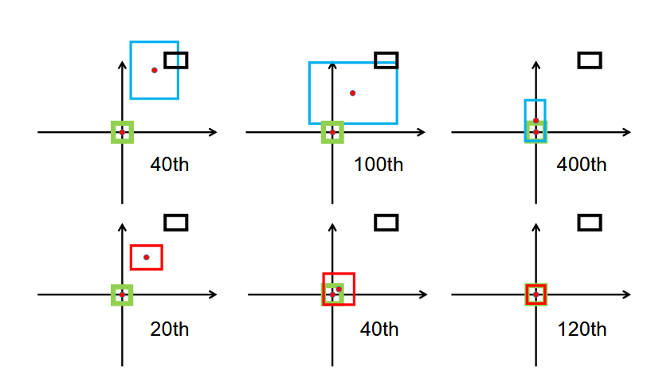

 # 目录

## 机器学习基础

[1.介绍一下机器学习](#1.介绍一下机器学习)
  - [面试问题：机器学习定义是什么？常见的机器学习方式有哪些？](#面试问题-机器学习定义是什么？常见的机器学习方式有哪些？)

[2.介绍一下聚类算法](#2.介绍一下聚类算法)
  - [面试问题：常见的聚类算法有哪些，介绍其中一种的原理](#面试问题-常见的聚类算法有哪些，介绍其中一种的原理)

[3.介绍一下损失函数](#3.介绍一下损失函数)
  - [面试问题：什么是损失函数，常用的损失函数都有哪些？](#面试问题-什么是损失函数，常用的损失函数都有哪些？)

[4.介绍一下梯度下降算法](#4.介绍一下梯度下降算法)
  - [面试问题：介绍一下梯度下降算法，常用的梯度下降算法都有哪些？](#面试问题-介绍一下梯度下降算法，常用的梯度下降算法都有哪些？)
  - [面试问题：为什么梯度下降要使用小批量而不是整个数据集？](#面试问题-为什么梯度下降要使用小批量而不是整个数据集？)
  - [面试问题：Adam 和 SGD 各有什么优缺点？在什么情况下选择 SGD？](#面试问题-Adam和SGD各有什么优缺点？在什么情况下选择SGD？)
  - [面试问题：AdamW 相比 Adam 做了什么改进？为什么现在更常用 AdamW？](#面试问题-AdamW相比Adam做了什么改进？为什么现在更常用AdamW？)
  - [面试问题：在AIGC时代常用的梯度下降算法有哪些？](#面试问题-在AIGC时代常用的梯度下降算法有哪些？)

[5.介绍一下模型融合](#5.介绍一下模型融合)
  - [面试问题：介绍一下模型融合的核心原理？](#面试问题-介绍一下模型融合的核心原理？)

# 机器学习基础

<h1 id="1.介绍一下机器学习">1.介绍一下机器学习</h1>

<h2 id="面试问题-机器学习定义是什么？常见的机器学习方式有哪些？">面试问题：机器学习定义是什么？常见的机器学习方式有哪些？</h2>

**难度评分：⭐⭐ (2/5)  |  考察频率：⭐⭐⭐⭐ (4/5)**

机器学习（Machine Learning）是人工智能的一个子领域，不依赖人为编写的固定规则，而是让计算机从大量数据中学习规律、模式或特征，进而对未知数据或任务做出预测、决策或分类的技术。其核心目标是通过优化模型参数，让模型在新数据上的表现（如预测准确率、误差降低程度）达到最优，广泛应用于图像识别、自然语言处理、推荐系统等领域。

机器学习的学习方式可以分为 监督学习(supervised learning)、无监督学习(unsupervised learning)，半监督学习(semi-supervised learning)、弱监督学习(weakly supervised learning)、强化学习（Reinforcement Learning）、自监督学习（Self-Supervised Learning）、联邦学习（Federated Learning） 等。
机器学习技术目前已经在AIGC、传统深度学习、自动驾驶三个领域全面落地，发展出Stable Diffusion、ChatGPT、Sora、Transformers、YOLO、GAN、U-Net、ResNet、随机森林、支持向量机、决策树、逻辑回归、感知机等实用算法，开始帮助人类完成各种各样的脑力任务。
需要注意的是，学习方式并非相互独立，在实际应用中，可根据场景需求灵活结合多种学习方式，提升模型性能与适用性。

<h2 id="2.介绍一下聚类算法">2.介绍一下聚类算法</h2>
<h2 id="面试问题-常见的聚类算法有哪些，介绍其中一种的原理">面试问题：常见的聚类算法有哪些，介绍其中一种的原理</h2>

**难度评分：⭐⭐ (2/5) | 考察频率：⭐⭐⭐⭐⭐ (5/5)**

常见的聚类算法主要包括：

- **K-Means 聚类** ：需要预先指定簇的数量 K，通过迭代优化将数据划分为 K 个簇，目标是使簇内样本相似度尽可能高、簇间相似度尽可能低。

- **层次聚类** ：采用“自底向上聚合”或“自顶向下分裂”的策略，逐步构建数据的层次聚类树（树状图），无需提前指定簇数，便于直观观察聚类层级关系。

- **DBSCAN 密度聚类** ：基于样本密度进行划分，无需预先设定簇数，能够发现任意形状的簇，并自动识别并剔除噪声点，对不规则分布数据适应性较强。

- **高斯混合模型（GMM）** ：假设数据由多个高斯分布混合生成，通过概率模型拟合数据分布，输出**软聚类结果**，即每个样本属于不同簇的概率，适合重叠分布的数据。

- **谱聚类** ：基于图论思想，将数据点看作图中的节点，通过计算拉普拉斯矩阵特征向量进行降维后聚类，擅长处理非凸、复杂结构的数据簇。

- **PCA（常与聚类配合使用）** ：严格来说属于降维方法，通过线性变换将高维数据映射到低维空间，保留核心信息、去除冗余，常作为聚类前的预处理步骤，提升聚类效果。

### **K-Means 聚类** 介绍：
K-Means由James MacQueen在1967年首次提出，凭借原理简洁、计算高效、适配性强的优势，成为无监督学习中最经典、应用最广泛的聚类算法。

- 算法原理：

在 K-Means 算法中，"簇"是数据点的集合，这些数据点彼此之间比与其他簇的数据点更相似。"质心"是簇内所有点的平均位置，代表了簇的中心。它的核心任务非常简单：将给定的数据集划分为K个互斥的簇（Cluster），使得同一簇内的数据点尽可能相似，不同簇间的数据点尽可能不同。其本质是“迭代式优化聚类中心，最小化簇内样本的相似度差异”，通过反复调整簇中心的位置，直到簇内样本足够集中、簇间样本足够分散。

- 数学基础：

假设簇划分为 $(C_1,C_2,...C_k)$ ，则我们的目标是最小化平方误差 $E$ ：

 $E = \sum_{i=1}^{k} \sum_{x \in C_i} \left\| x - \mu_i \right\|_2^2$ 

 其中 $\mu_i$ 是簇 $C_i$ 的均值向量，有时也称为质心，表达式为：
 
 $\mu_i = \frac{1}{|C_i|} \sum_{x \in C_i} x$ 

 该公式是**K-Means聚类算法**的核心目标函数，用于衡量聚类结果的紧致性：平方误差 $E$ 越小，代表簇内样本越紧密围绕各自的质心，聚类效果越好。

- 实现流程：

（1）**确定K值** ：选择合适的K值，一般来说，我们会根据对数据的先验经验选择一个合适的k值，如果没有什么先验知识，则可以通过交叉验证选择一个合适的k值。

（2）**随机初始化K个簇中心** ：在确定了k的个数后，我们需要选择k个初始化的质心。k个初始化的质心的位置选择对最后的聚类结果和运行时间都有很大的影响，因此需要选择合适的k个质心，最好这些质心不能太近。质心是每个簇的“代表点”，后续样本将根据与质心的距离分配到对应簇。

（3）**样本分配（按距离归簇）** ：计算每个样本与K个簇中心的距离（通常使用欧氏距离），将样本分配到距离最近的簇中。

（4）**更新簇中心**：所有样本分配完成后，对每个簇内的所有样本，计算其特征的平均值，将该平均值作为新的簇中心。

（5）**判断收敛**：对比更新前后的簇中心位置。若所有簇中心的变化量小于预设阈值（如 $10^{-4}$），或迭代次数达到最大限制（如300次），则算法终止；否则，返回步骤3，重新进行样本分配和簇中心更新。

优缺点分析：

- 优缺点介绍：
K-Means聚类算法具有显著优势，其算法简单易懂、易于实现，计算效率较高，即便面对大规模数据集也能较快收敛，且聚类结果直观明了，便于进行数据可视化呈现和业务层面的解读；但同时也存在一定局限性，该算法需要预先指定簇数K，这对业务理解能力有一定要求，且缺乏明确的理论指导来确定最优K值，此外它对初始簇中心的选择较为敏感，不同的初始值可能导致截然不同的聚类结果，使得算法容易陷入局部最优解，同时它对噪声和异常值也较为敏感，异常点会对簇中心的计算产生较大干扰，而且其假设簇为球形且大小相似的前提，在许多实际场景中并不成立。

- 优化方向与改进方法
针对K-Means的固有缺陷，研究人员提出了多种改进和优化策略，针对初始化进行优化的K-Means++、针对K值选择进行优化的肘部法则与轮廓系数、可以动态调整聚类数量的ISODATA算法、处理非线性可分数据的Kernel K-Means、距离计算优化的elkan K-Means以及针对大样优化的Mini Batch K-Means。

K-Means在AIGC领域以向量量化为核心，支撑了VQ-VAE、VQ-GAN及Stable Diffusion的离散表示学习，并通过码本重排优化显著提升生成效率；在传统深度学习中，它既用于DeepCluster等无监督视觉特征学习，又作为YOLO系列模型优化锚框尺寸的关键工具，提高了目标检测精度；在自动驾驶领域，K-Means则广泛用于LiDAR和雷达点云的实时聚类分割，辅助小目标检测、多传感器融合及目标跟踪，成为感知系统中高效且基础的处理模块。

<h2 id="3.介绍一下损失函数">3.介绍一下损失函数</h2>

<h2 id="面试问题-什么是损失函数，常用的损失函数都有哪些？">面试问题：什么是损失函数，常用的损失函数都有哪些？</h2>

**难度评分：⭐⭐⭐ (3/5) | 考察频率：⭐⭐⭐⭐⭐ (5/5)**

在机器学习中，通常我们把定义单个训练样本预测值与真实值之间的误差称为**损失函数（Loss function）**，将定义单个批次（ batch）或整个训练集训练样本预测值与真实值之间的误差称为**代价函数（Cost function）**深度学习面试和工程里，大家对损失函数和代价函数基本不严格区分。

常用损失函数按任务类型可以分为回归损失、分类损失两大类：
  **回归任务常用损失**

- （1） L1 Loss

介绍：L1 Loss 是回归任务中最常用的损失函数之一，全称 L1 Norm Loss，也叫平均绝对误差（MAE, Mean Absolute Error）。它衡量的是预测值与真实值之间距离的平均误差幅度，作用范围为0到正无穷。

 **公式**：

**L1 Loss** 衡量预测值与真实值之间**绝对差**的大小。对单个样本，常写作：

$$
\mathcal{L}_{1}(y, \hat{y}) = \left| y - \hat{y} \right|
$$

其中  $$\(y\)$$ 为真实标签， $$\(\hat{y}\) $$  为模型预测。

对批量数据，通常对样本求**平均**，得到 **MAE（Mean Absolute Error，平均绝对误差）**：

$$
\mathcal{L}_{\text{MAE}} = \frac{1}{n} \sum_{i=1}^{n} \left| y_i - \hat{y}_i \right|
$$

多输出时（如向量回归），可先对每个维度取绝对误差再对维度求平均，再对 batch 平均，具体取决于任务约定。

**优缺点**：

L1 Loss的优点在于对异常值具有较强的鲁棒性，其计算的是预测值与真实值之间绝对距离的相关损失，大误差不会像L2 Loss那样被平方放大，因此模型不容易被异常值（outliers）带偏；同时它的解更具稀疏性，配合L1正则化（即Lasso）能够轻松产生稀疏权重，且物理意义十分直观，本质就是预测值与真实值的平均误差大小。

L1 Loss的缺点主要体现在优化过程中，其在预测值与真实值相等（即0点）处不可导，导致优化效果不如L2 Loss稳定；此外，它的梯度始终保持恒定，即便在接近最优解时，模型仍会进行大步更新，难以收敛到极小值，而且在训练初期，其震荡幅度通常也会比L2 Loss更大。而对于较小的损失值，其梯度也同其他区间损失值的梯度一样大，所以不利于网络的学习。

- **（2）L2 Loss**

**介绍**：L2 Loss 全称 **L2 Norm Loss**（平方损失）。对批量样本取平均时，常称为 **MSE（Mean Squared Error，均方误差）**。它度量的是预测值与真实值之差的**平方**，对大误差惩罚更重。

**公式**：

**L2 Loss** 用预测与真值的**平方差**衡量误差。对单个样本，常写作：

$$
\mathcal{L}_{2}(y, \hat{y}) = \left( y - \hat{y} \right)^2
$$

其中 \(y\) 为真实标签， $$\(\hat{y}\)$$  为模型预测。

对批量数据，通常对样本求**平均**，得到 **MSE**：

$$
\mathcal{L}_{\text{MSE}} = \frac{1}{n} \sum_{i=1}^{n} \left( y_i - \hat{y}_i \right)^2
$$

**优缺点**：

L2 Loss 的优点收敛速度快，能够对梯度给予合适的惩罚权重，而不是“一视同仁”，使梯度更新的方向可以更加精确。其缺点是对异常值更敏感：大误差会被**平方放大**，少数离群点可能明显拉高损失并主导梯度，使模型容易被 outliers 拉偏，鲁棒性较差。

L1 范数对应 MAE 损失、L2 范数对应 MSE 损失，二者适用场景不同：若异常值对业务有重要意义，可选用 MSE；若异常值仅为噪声数据，则更适合 MAE。同时从收敛效率考虑，多数卷积神经网络（CNN）普遍采用 L2 损失。但在极端数据分布下（如 95% 样本真实值为 1000、仅 5% 为 10），两种损失均存在明显缺陷：MAE 对离群点不敏感、拟合趋向中位数，会使模型几乎全部预测为 1000；MSE 对异常值极度敏感，反而会让模型整体偏向预测少数类的 10，导致两种常规回归损失都不适用。

- **（3）Smooth L1 Loss**

**介绍**：Smooth L1 Loss 是一种结合了 L1 Loss 和 L2 Loss 优点的损失函数，常用于回归任务，特别是目标检测中的边框回归（如 Fast R-CNN）。它在误差较小时采用平方损失（平滑、可导），在误差较大时采用线性损失（对异常值不敏感），从而避免 L2 Loss 对离群点过度惩罚的问题，同时克服 L1 Loss 在零点不可导的缺陷。作用范围为 \(0\) 到正无穷。可以发现Smooth L1在训练初期输入数值较大时能够较为稳定在某一个数值，而在后期趋向于收敛时也能够加速梯度的回传，很好的解决了前面两者所存在的问题。

**公式**：

**Smooth L1 Loss** 对单个样本通常定义为分段函数。设误差 $$\(d = y - \hat{y}\)$$ ，则：

$$
\mathcal{L}_{\text{smooth L1}}(y, \hat{y}) = 
\begin{cases}
0.5 \, d^2 / \beta, & \text{if } |d| < \beta \\
|d| - 0.5 \beta, & \text{otherwise}
\end{cases}
$$

其中 $$\(\beta\)$$ 为平滑阈值，常用 $$\(\beta = 1\)$$ 。此时简化为：

$$
\mathcal{L}_{\text{smooth L1}}(y, \hat{y}) = 
\begin{cases}
0.5 \, (y - \hat{y})^2, & \text{if } |y - \hat{y}| < 1 \\
|y - \hat{y}| - 0.5, & \text{otherwise}
\end{cases}
$$

对批量数据，通常对样本求**平均**，得到 **Mean Smooth L1 Loss**：

$$
\mathcal{L}_{\text{MSL1}} = \frac{1}{n} \sum_{i=1}^{n} \mathcal{L}_{\text{smooth L1}}(y_i, \hat{y}_i)
$$

多输出时（如向量回归），可先对每个维度按上述公式计算损失，再对维度求平均，最后对 batch 平均，具体取决于任务约定。

- **（4）IoU Loss**

**论文**：IoU Loss 出自旷视 2016 年论文 《UnitBox: An Advanced Object Detection Network》，**arXiv链接**：https://arxiv.org/pdf/1608.01471.pdf

**介绍**：IoU Loss 是目标检测中常用的边界框回归损失函数，全称 Intersection over Union Loss。它基于预测框与真实框的交并比（IoU）来衡量两者之间的重叠程度，取值范围为 [0, 1]。由于 IoU 本身对尺度不敏感且能直接反映定位精度，IoU Loss 将 IoU 值转换为损失（通常为 1 − IoU），使模型能够优化边界框的位置和形状。

**公式**：  
对单个样本（一对预测框 $$\(B_p\)$$ 与真实框 $$\(B_{gt}\)$$ ），先计算交并比：

$$
\text{IoU} = \frac{|B_p \cap B_{gt}|}{|B_p \cup B_{gt}|}
$$

其中 $$\(|\cdot|\)$$ 表示区域面积。IoU Loss 的常见定义为：

$$
\mathcal{L}_{\text{IoU}} = 1 - \text{IoU}
$$

该损失值范围为 [0, 1]，当两框完全重合时 IoU = 1，损失为 0；当无重叠时 IoU = 0，损失为 1。

对批量数据（含 $$\(n\)$$ 个样本），通常对每个样本的损失取平均：

$$
\mathcal{L}_{\text{IoU-batch}} = \frac{1}{n} \sum_{i=1}^{n} (1 - \text{IoU}_i)
$$

在多输出场景（如同时预测多个目标框），可先分别计算每个目标框的 IoU Loss，再按样本取平均；也可根据任务设定，仅对正样本计算损失。
IoU Loss 首次提出直接以 IoU 作为框回归的优化目标。但当预测框与真实框完全无重叠时，二者交集为 0，此时 IoU 损失恒为 0，无法反映两个边框之间的实际距离与重叠关系。同时，损失为 0 会导致梯度无法有效反向传播与参数更新，出现梯度消失问题，使得网络失去明确的优化方向。
此外，IoU 对不同对齐方式的边框缺乏区分能力，在多种空间位置关系下可能得到相同的 IoU 值，无法指导边框更精细地对齐。

- **（5）GIoU Loss**

**论文**：GIoU Loss 由斯坦福学者于2019年（CVPR）首次提出，题目 《Generalized Intersection over Union: A Metric and A Loss for Bounding Box Regression》，**arXiv链接**：https://arxiv.org/abs/1902.09630.pdf

**介绍**：GIoU Loss 是目标检测中边界框回归任务常用的损失函数，全称 Generalized Intersection over Union Loss（广义交并比损失）。它解决了 IoU Loss 在两个边界框无重叠时梯度消失的问题，通过引入包含两个框的最小闭包区域来提供非零梯度。GIoU 的取值范围为 \([-1, 1]\)，对应的 GIoU Loss 取值范围为 \([0, 2]\)。

**公式**：  
对单个预测框 \(B_p\) 与真实框 \(B_{gt}\)，先计算 IoU，再计算包含两者的最小凸闭包（最小外接矩形）\(C\)，则 GIoU 定义为：

$$
\text{GIoU} = \text{IoU} - \frac{|C \setminus (B_p \cup B_{gt})|}{|C|}
$$

其中 $$\|C \setminus (B_p \cup B_{gt})|\$$ 表示闭包 C 中不属于两个框并集的面积。单个样本的 GIoU Loss 为：

$$
\mathcal{L}_{\text{GIoU}} = 1 - \text{GIoU}
$$

对批量数据，通常对样本求平均：

$$
\mathcal{L}_{\text{GIoU-batch}} = \frac{1}{n} \sum_{i=1}^{n} (1 - \text{GIoU}_i)
$$

多输出时（如同时预测多个目标），可先对每个目标的 GIoU Loss 求平均，再对 batch 平均，具体取决于任务约定。GIoU Loss引入最小外接矩形，虽然解决了 IoU Loss 在无重叠时梯度消失的问题，但仍有明显不足：当预测框完全包含真实框（或反之）时，GIoU 退化为 IoU，无法进一步优化相对位置；在无重叠区域时，它倾向于先扩大预测框以增大闭包面积，而非直接调整对齐，导致收敛速度较慢；此外，它对框之间的相对方向不敏感，难以区分不同对齐方式带来的定位差异；极端情况（如框退化为点或线）下还可能存在数值稳定性问题。

- **（6）DIoU Loss**

**论文**：题目 《Distance-IoU Loss: Faster and Better Learning for Bounding Box Regression》，**arXiv链接**：https://arxiv.org/abs/1911.08287.pdf

**介绍**：DIoU Loss 全称 Distance-IoU Loss（距离交并比损失）。它针对 GIoU Loss 在框包含情况下退化为 IoU 且收敛慢的问题，在 IoU 基础上直接最小化预测框与真实框中心点之间的归一化距离。DIoU Loss 在无重叠或包含情形下均能提供有效梯度，且收敛速度更快。DIoU 的取值范围为 \([-1, 1]\)（实际通常为正），对应的 DIoU Loss 取值范围为 \([0, 2]\)。

**公式**：  
对单个预测框  $$\(B_p\)$$  与真实框  $$\(B_{gt}\)$$，先计算 IoU，再计算两框中心点之间的欧氏距离 $$\(d\)$$，以及包含两框的最小闭包（最小外接矩形）的对角线长度  $$\(c\)$$，则 DIoU 定义为：

$$
\text{DIoU} = \text{IoU} - \frac{d^2}{c^2}
$$

 其中

$$\(d=\rho(\mathbf{b}_p,\mathbf{b}_{gt})\)$$

表示中心点坐标的欧氏距离

$$\(c\)$$

为闭包对角线的长度。单个样本的 DIoU Loss 为：

$$
\mathcal{L}_{\text{DIoU}} = 1 - \text{DIoU}
$$

对批量数据，通常对样本求平均：

$$
\mathcal{L}_{\text{DIoU-batch}} = \frac{1}{n} \sum_{i=1}^{n} (1 - \text{DIoU}_i)
$$

DIoU Loss 相较于 IoU Loss 和 GIoU Loss 的主要改进在于：它直接最小化预测框与真实框中心点之间的归一化欧氏距离，从而在框完全包含或无重叠时都能提供有效梯度，解决了 GIoU 在包含情形下退化为 IoU 而无法进一步优化的缺陷；同时收敛速度更快，无需像 GIoU 那样先扩大框再对齐。然而，DIoU Loss 仍存在不足：它没有考虑预测框与真实框的宽高比（长宽比）一致性，即使中心点完全对齐且 IoU 相同，宽高比不匹配时损失无法反映这一差异，可能导致定位精度受限；此外，在某些复杂场景（如细长目标或非对称遮挡）中，单纯依赖中心距离仍可能收敛到次优解。后续的 CIoU Loss 在此基础上加入了宽高比惩罚项进一步改进。

- **（7）CIoU Loss**

**介绍**：CIoU Loss 全称 Complete IoU Loss（完整交并比损失）。它在 DIoU Loss 的基础上，额外引入了预测框与真实框之间**宽高比的一致性惩罚**，使得回归优化更加完整，不仅考虑重叠面积和中心点距离，还考虑形状的相似性。CIoU Loss 在大多数检测任务中相比 GIoU 和 DIoU 能获得更高的定位精度。CIoU 的取值范围为 \([-1, 1]\)，对应的 CIoU Loss 取值范围为 \([0, 2]\)。

**公式**：  
对单个预测框  $$\(B_p\)$$ 与真实框  $$\(B_{gt}\)$$，先计算 IoU，再计算中心点欧氏距离  $$\(d\)$$ 与闭包对角线长度 \(c\)，以及宽高比惩罚项。定义宽高比一致性参数：

$$
v = \frac{4}{\pi^2} \left( \arctan\frac{w^{gt}}{h^{gt}} - \arctan\frac{w}{h} \right)^2
$$

其中 \(w, h\) 和 \(w^{gt}, h^{gt}\) 分别为预测框和真实框的宽、高。再定义权衡参数 $$\(\alpha\)$$：

$$
\alpha = \frac{v}{(1 - \text{IoU}) + v}
$$

则 CIoU 定义为：

$$
\text{CIoU} = \text{IoU} - \frac{d^2}{c^2} - \alpha v
$$

单个样本的 CIoU Loss 为：

$$
\mathcal{L}_{\text{CIoU}} = 1 - \text{CIoU} = 1 - \text{IoU} + \frac{d^2}{c^2} + \alpha v
$$

对批量数据，通常对样本求平均：

$$
\mathcal{L}_{\text{CIoU-batch}} = \frac{1}{n} \sum_{i=1}^{n} (1 - \text{CIoU}_i)
$$

多输出时（如同时预测多个目标），可先对每个目标的 CIoU Loss 求平均，再对 batch 平均，具体取决于任务约定。

CIoU Loss 相较于 IoU、GIoU 和 DIoU 的核心改进在于：它在 DIoU 的中心点距离惩罚项基础上，引入了宽高比一致性惩罚项 αvαv，使得损失函数同时优化重叠面积、中心点距离和形状相似性，从而显著提升了边界框回归的精度，尤其适用于长宽比差异较大的目标。然而，CIoU 仍存在一些缺点：宽高比项使用 arctan⁡arctan 计算，复杂度较高，增加训练开销；它仅惩罚宽高比而非具体的宽度和高度，因此当预测框与真实框的宽高比值相同但绝对尺寸不同时（例如等比例缩放），惩罚项可能失效；此外，在某些极端情况（如框的宽或高为0）下仍可能出现数值不稳定；

<h1 id="4.介绍一下梯度下降算法">4.介绍一下梯度下降算法</h1>

<h2 id="面试问题-介绍一下梯度下降算法，常用的梯度下降算法都有哪些？">面试问题：介绍一下梯度下降算法，常用的梯度下降算法都有哪些？</h2>

**难度评分：⭐⭐ \(2/5\) \| 考察频率：⭐⭐⭐⭐⭐ \(5/5\)**

### 核心回答

梯度下降是一种迭代优化算法，通过沿着损失函数**负梯度方向**不断更新参数，以最小化目标损失函数。其核心数学公式为：

$\theta_{t+1} = \theta_t - \eta \cdot \nabla_\theta J(\theta_t)$

其中  $\eta$ 为学习率，$\nabla_\theta J(\theta_t)$  为损失函数关于参数  $\theta$ 的梯度。

### 常用梯度下降算法分类

1. **按批量大小划分**

    - 批量梯度下降 \(BGD\)：使用**全部训练样本**计算梯度

    - 随机梯度下降 \(SGD\)：每次使用**单个样本**计算梯度

    - 小批量梯度下降 \(Mini\-batch SGD\)：每次使用**一小批样本**计算梯度（最常用）

2. **按优化策略划分**

    - 动量类：Momentum、Nesterov Accelerated Gradient \(NAG\)

    - 自适应学习率类：AdaGrad、RMSprop、Adam、AdamW

    - 二阶近似类：L\-BFGS（小数据集适用）

<h2 id="面试问题-为什么梯度下降要使用小批量而不是整个数据集？">面试问题：为什么梯度下降要使用小批量而不是整个数据集？</h2>

**难度评分：⭐⭐ \(2/5\) \| 考察频率：⭐⭐⭐⭐ \(4/5\)**

### 核心回答

小批量梯度下降是**训练效率与收敛稳定性的最佳平衡点**，相比批量梯度下降 \(BGD\) 有以下关键优势：

1. **计算效率大幅提升**

    - 避免了每次迭代都遍历整个数据集，尤其适合 AIGC 领域的**百万 / 十亿级样本**

    - 充分利用 GPU 的并行计算能力，小批量数据可一次性加载到 GPU 显存中

2. **收敛速度更快**

    - 小批量梯度虽然存在噪声，但**更新频率更高**，能更快到达最优解附近

    - 梯度噪声有助于跳出局部最小值，提高泛化能力

3. **内存占用显著降低**

    - 无需一次性加载整个数据集到内存 / 显存，解决了 AIGC 大模型训练中的**显存瓶颈**问题

4. **训练过程更灵活**

    - 可随时监控训练进度并调整超参数

    - 支持在线学习和增量学习
  
 
<h2 id="面试问题-Adam和SGD各有什么优缺点？在什么情况下选择SGD？">面试问题：Adam和SGD各有什么优缺点？在什么情况下选择 SGD？</h2>

**难度评分：⭐⭐⭐ \(3/5\) \| 考察频率：⭐⭐⭐⭐⭐ \(5/5\)**

#### Adam 优缺点

**优点**：

- 自适应学习率：为每个参数维护独立的学习率，自动调整更新幅度

- 收敛速度快：结合了动量和 RMSprop 的优势，在大多数任务上收敛迅速

- 超参数鲁棒性好：默认参数在多数场景下表现良好

- 工程实现简单，计算开销小

**缺点**：

- 泛化能力通常弱于调优后的 SGD

- 可能出现**学习率衰减过快**导致的早停问题

- 存在**权重衰减与 L2 正则化不等价**的问题（已被 AdamW 解决）

- 对学习率和批量大小较为敏感

#### SGD 优缺点

**优点**：

- 理论基础扎实，收敛性有严格证明

- 调优得当的情况下**泛化能力更强**，能找到更平坦的最优解

- 计算开销最小，内存占用最低

- 对硬件要求低，易于分布式训练

**缺点**：

- 收敛速度慢，需要精心调整学习率调度

- 对超参数（学习率、动量）非常敏感

- 容易陷入局部最小值

- 训练过程不稳定，损失曲线波动大

#### 选择 SGD 的场景

1. **追求极致泛化性能**：如 ImageNet 分类、目标检测等计算机视觉任务

2. **大规模分布式训练**：SGD 通信开销小，适合数据并行训练

3. **训练数据量极大**：如大语言模型预训练的后期阶段

4. **需要严格的理论保证**：学术研究中验证新方法时

5. **资源受限**：显存不足或计算能力有限的场景

<h2 id="面试问题-AdamW相比Adam做了什么改进？为什么现在更常用AdamW？">面试问题：AdamW 相比Adam做了什么改进？为什么现在更常用AdamW？</h2>

**难度评分：⭐⭐⭐ \(3/5\) \| 考察频率：⭐⭐⭐⭐⭐ \(5/5\)**

### 核心回答

#### AdamW 的核心改进

AdamW 解决了 Adam 中**权重衰减与 L2 正则化不等价**的关键问题。

在标准 Adam 中，L2 正则化的实现方式是将权重平方项加入损失函数：

$J_{reg}(\theta) = J(\theta) + \frac{\lambda}{2} |\theta|_2^2$

其梯度为：

$\nabla_\theta J_{reg}(\theta) = \nabla_\theta J(\theta) + \lambda \theta$

但在 Adam 的自适应学习率机制下，梯度会被二阶矩估计 $v_t$ 归一化：

$\theta_{t+1} = \theta_t - \eta \cdot \frac{m_t}{\sqrt{v_t} + \epsilon} - \eta \cdot \frac{\lambda \theta_t}{\sqrt{v_t} + \epsilon}$

这导致 L2 正则化的效果被学习率和二阶矩估计**稀释**，无法达到预期的正则化效果。

AdamW 将权重衰减与梯度更新**解耦**，直接在参数更新步骤中加入权重衰减项：

$\theta_{t+1} = \theta_t - \eta \cdot \frac{m_t}{\sqrt{v_t} + \epsilon} - \eta \cdot \lambda \theta_t$

#### 为什么现在更常用 AdamW

1. **正则化效果更稳定**：权重衰减不再受自适应学习率的影响

2. **泛化能力显著提升**：在大多数任务上优于原始 Adam

3. **超参数更易调优**：权重衰减系数 $\lambda$ 与学习率 $\eta$ 解耦

4. **AIGC 大模型训练的标准选择**：

    - 几乎所有现代大语言模型（GPT 系列、LLaMA 系列、Qwen 系列）都使用 AdamW

    - 扩散模型（Stable Diffusion）也普遍采用 AdamW 作为优化器

5. **实现简单**：仅需修改 Adam 的参数更新步骤，计算开销几乎不变

<h2 id="面试问题-在AIGC时代常用的梯度下降算法有哪些？">面试问题：在AIGC时代常用的梯度下降算法有哪些？</h2>

**难度评分：⭐⭐⭐ \(3/5\) \| 考察频率：⭐⭐⭐⭐ \(4/5\)**

### 核心回答

AIGC 时代的优化器选择主要围绕**大模型训练效率、显存占用和泛化能力**展开，常用算法包括：

1. **AdamW**（绝对主流）

    - 应用场景：大语言模型预训练、扩散模型训练、多模态模型训练

    - 优势：收敛快、泛化好、实现简单、超参数鲁棒

    - 代表实现：PyTorch 的`torch.optim.AdamW`、Hugging Face 的`AdamW`

2. **Lion**（EvoLved Sign Momentum）

    - 核心思想：仅使用动量的符号进行参数更新

    - 数学公式：$\theta_{t+1} = \theta_t - \eta \cdot \text{sign}(\beta_1 m_t + (1-\beta_1) g_t)$

    - 优势：显存占用比 AdamW 低 30%，训练速度更快，泛化能力相当

    - 应用：Google 的 Gemini、部分开源大模型训练

3. **Sophia**（Second\-order Clipped Stochastic Optimization）

    - 核心思想：使用 Hessian 对角估计进行自适应学习率调整

    - 优势：比 AdamW 收敛更快，训练步数更少，泛化能力更好

    - 应用：大语言模型训练，尤其适合 7B 以上规模的模型

4. **分布式 SGD**

    - 应用场景：超大规模模型（如 GPT\-4）的预训练后期

    - 优势：通信开销小，泛化能力强，适合数据并行训练

    - 变种：ZeRO 优化的分布式 SGD、混合精度 SGD

5. **8\-bit/4\-bit 优化器**

    - 核心思想：将优化器状态（动量、二阶矩）量化为 8 位或 4 位

    - 代表：bitsandbytes 库的`AdamW8bit`、`Lion8bit`

    - 优势：显存占用降低 50%\-75%，几乎不损失性能

    - 应用：消费级 GPU 上的大模型微调（LoRA、QLoRA）
 
<h1 id="5.介绍一下模型融合">5.介绍一下模型融合</h1>

<h2 id="面试问题-介绍一下模型融合的核心原理？">面试问题：介绍一下模型融合的核心原理？</h2>

**难度评分：⭐⭐ \(2/5\) \| 考察频率：⭐⭐⭐ \(3/5\)**

模型融合的核心原理是**通过组合多个不同模型的预测结果，降低整体预测误差，提高泛化能力**。其理论基础是**偏差 \- 方差分解**和**大数定律**。

#### 偏差 \- 方差分解视角

模型的总误差可以分解为：

$\text{Error} = \text{Bias}^2 + \text{Variance} + \text{Irreducible Error}$

- 单个模型通常存在较高的方差（对训练数据敏感）

- 融合多个独立模型可以**显著降低方差**，同时保持较低的偏差

- 当模型之间的预测误差不相关时，融合效果最佳

#### 核心假设

1. **多样性假设**：参与融合的模型之间存在显著差异

2. **准确性假设**：每个模型的性能都优于随机猜测

3. **独立性假设**：模型之间的预测误差尽可能不相关

#### AIGC 领域常用的模型融合方法

1. **加权平均融合**：对不同模型的输出进行加权求和

2. **集成解码**：多个模型共享同一个解码器，同时生成结果

3. **专家混合 \(MoE\)**：将多个专家模型集成到一个大模型中，动态选择专家

4. **投票融合**：分类任务中使用多数投票或加权投票

5. **堆叠融合 \(Stacking\)**：使用元模型学习如何组合多个基模型的预测

