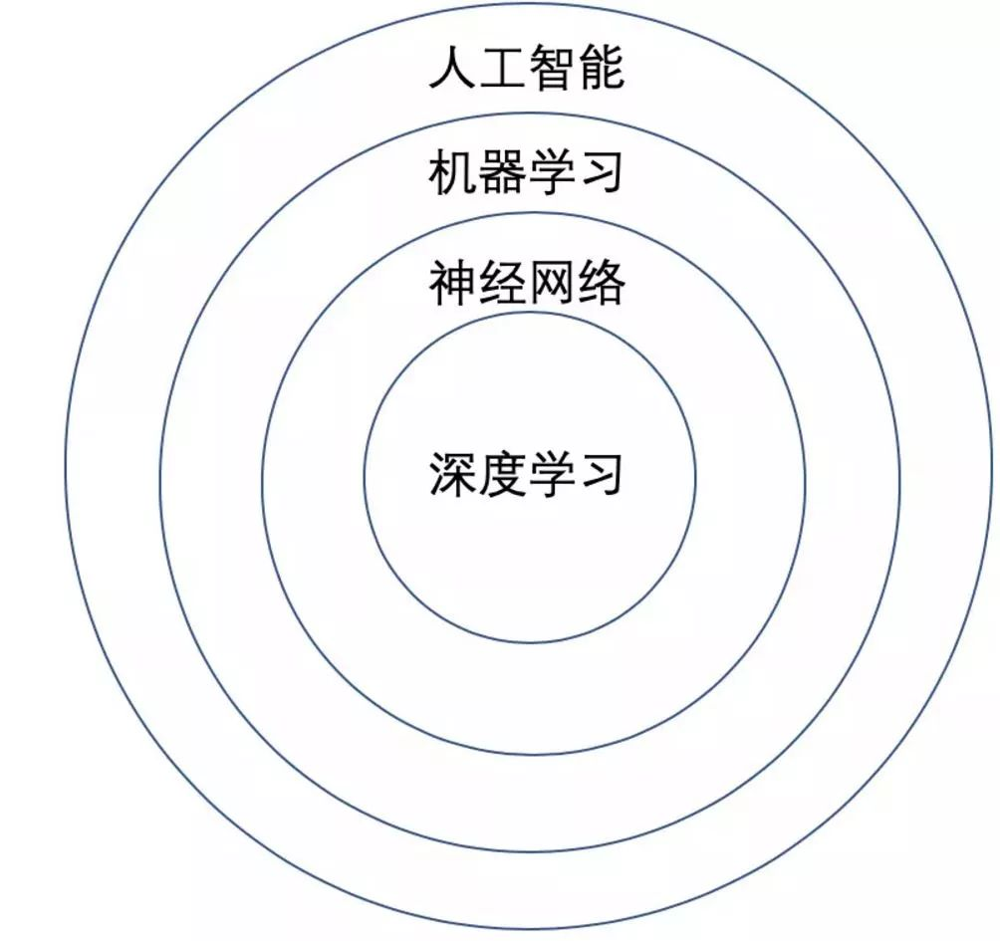
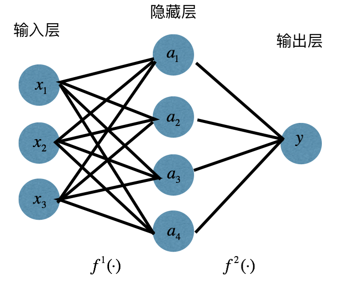

# 目录
## 深度学习基础

[1.介绍一下深度学习](#q2-1)
- [面试问题：什么是深度学习，它和机器学习的核心区别是什么？](#q2-1-1)
- [面试问题：深度学习解决了机器学习的哪些核心痛点？](#q2-1-2)
- [面试问题：深度学习是如何处理非线性问题的？](#q2-1-3)

[2.介绍一下神经网络的工作原理](#q2-2)
- [面试问题：为什么单层感知机无法解决异或问题？多层神经网络是通过什么机制解决这一问题的？](#q2-2-1)
- [面试问题：神经网络的基本组成单元是什么？请从单个神经元开始，描述完整神经网络的前向传播计算流程](#q2-2-2)
- [面试问题：一个标准的深度神经网络由哪些核心模块组成？每个模块的核心功能是什么？](#q2-2-3)
- [面试问题：浅层神经网络和深度神经网络的本质差异是什么？为什么「深而窄」的网络通常比「浅而宽」的网络效果更好？](#q2-2-4)

[3.介绍一下反向传播的工作原理](#q2-3)
- [面试问题：什么是反向传播算法？它的核心原理和数学基础是什么？](#q2-3-1)
- [面试问题：计算图在反向传播中起到什么作用？前向传播和反向传播分别在计算图中完成什么操作？](#q2-3-2)
- [面试问题：从原理层面描述神经网络训练一个 batch 数据的完整流程](#q2-3-3)

[4.介绍一下深度学习模型的核心能力基础概念](#q2-4)
- [面试问题：分别解释模型的表达能力、拟合能力、泛化能力的定义，三者之间是什么关系？](#q2-4-1)
- [面试问题：从原理层面看，模型的表达能力由哪些核心因素决定？](#q2-4-2)

[5.介绍一下深度学习的常见模型分类](#q2-5)
- [面试问题：判别式模型与生成式模型的本质区别是什么？分别列举深度学习中的经典算法与适用场景。](#q2-5-1)
- [面试问题：按训练范式划分，深度学习有哪些核心学习方式？各自的特点与适用场景是什么？](#q2-5-2)
- [面试问题：自监督学习的核心思想是什么？为什么它成为大模型预训练的主流范式？](#q2-5-3)
- [面试问题：常见的深度学习网络架构有哪几类？各自的核心特点与适用场景是什么？](#q2-5-4)

# 深度学习基础概念

<h1 id="q2-1">1.介绍一下深度学习</h1>

<h2 id="q2-1-1">面试问题：什么是深度学习，它和机器学习的核心区别是什么？</h2>

**难度评分：⭐⭐ (2/5)  |  考察频率：⭐⭐⭐⭐ (4/5)**

深度学习是机器学习的重要分支，隶属于机器学习技术体系，其核心载体是多层（深层）人工神经网络，通过堆叠多层非线性变换单元模拟人脑的层级化信息处理机制，自动从原始数据中学习分层的特征表示，最终实现从输入到输出的端到端映射。

两者最本质的差异是特征提取的责任主体从人类工程师转移到了模型本身，具体可从四个维度系统对比：

- 特征工程：机器学习高度依赖人工特征工程，模型效果上限由人工设计的特征质量决定，常需手动构建、筛选特征，例如 SIFT、TF-IDF 等。深度学习依托多层非线性运算，自动学习分层特征表达，大幅降低了人工设计特征的工作量。
    
- 数据规模与硬件需求：机器学习在小数据集上也能取得良好效果，仅依靠 CPU 即可完成训练，耗时较短。深度学习的性能优势需要海量标注数据作为支撑，训练过程高度依赖 GPU、TPU 等高性能并行计算设备，算力与时间成本更高。
    
- 模型结构与可解释性：机器学习模型（逻辑回归、决策树、支持向量机等）结构简洁，逻辑清晰，可解释性强。深度学习模型参数量庞大，部分大模型参数可达千亿级别，内部逻辑难以拆解，属于典型的 “黑盒模型”。
    
- 适用场景：机器学习更适配结构化表格数据，广泛应用于风控、传统推荐等浅层任务。深度学习则擅长处理图像、语音、文本等非结构化数据，在生成式任务、通用大模型领域占据主导，当下 AIGC 相关应用也基本以深度学习为核心。

传统机器学习的逻辑是「人提炼规律，模型做计算」，而深度学习的逻辑是「模型自主从数据中提炼规律」；二者并非替代关系，而是适配不同场景、不同阶段的技术方案。

  <!-- width 宽度，height高度，单位px/百分比 -->
  

<h2 id="q2-1-2">面试问题：深度学习解决了机器学习的哪些核心痛点？</h2>

**难度评分：⭐⭐ (2/5)  |  考察频率：⭐⭐⭐⭐ (4/5)**

深度学习针对性解决了传统机器学习的四大核心痛点：
**人工特征工程依赖强、天花板低**的痛点——传统机器学习的效果高度依赖人工设计的特征，开发成本高且受人类认知限制存在性能上限，深度学习通过多层非线性网络自动学习分层特征表示，实现端到端训练，彻底摆脱了对人工特征设计的强依赖；
**非结构化高维数据处理能力缺失**的痛点——传统方法仅适配结构化表格数据，无法有效处理图像、文本、语音等高维非结构化数据，深度学习依托CNN、Transformer等适配数据特性的专属架构，可直接从原始非结构化数据中提取深层语义，填补了这一核心能力盲区；
**复杂模式拟合能力不足**的痛点——传统浅层模型非线性表达能力有限，难以胜任多因素强耦合的复杂智能任务，深度学习凭借深层网络的超强拟合能力，可建模任意复杂度的映射关系，支撑起围棋决策、蛋白质结构预测等高难度任务；
**任务迁移成本高、知识复用性差**的痛点——传统方案与单一任务深度绑定，新任务需重新设计特征、训练专属模型，深度学习形成了“大规模预训练+下游微调”的通用开发范式，通用知识可跨任务复用，大幅降低了新场景的开发成本与标注数据需求。

<h2 id="q2-1-3">面试问题：深度学习是如何处理非线性问题的？</h2>

**难度评分：⭐⭐(2/5) | 考察频率：⭐⭐⭐⭐⭐(5/5)**

1、为什么线性模型无法有效处理非线性问题

线性模型的数学表达式为y=Wᵀx+b，本质是对输入特征做**参数线性的加权求和**，其表达能力存在本质上限：

（1）决策边界只能是线性超平面

线性模型只能学习输入与输出的线性映射关系，分类任务中无法处理线性不可分的数据（经典如异或 XOR 问题），回归任务也无法拟合非线性函数关系，对非线性分布数据天然欠拟合。

（2）无法自动建模特征的高阶非线性交互

线性模型中每个特征权重独立，只能刻画特征对结果的独立线性贡献，无法表达特征交叉、耦合等非线性组合关系；若要适配非线性，只能人工构造多项式、交叉特征，极度依赖先验知识，且特征数量随阶数指数增长，极易触发维度灾难。

（3）拟合能力存在硬上限

无论如何优化参数，线性模型的表达空间始终局限在线性变换范围内，对于图像、文本等存在复杂非线性规律的真实数据，偏差（Bias）极高，无法逼近真实映射关系。

2、深度学习解决非线性问题的核心结构与机制

深度学习从基础表达能力、层级化建模、场景化结构三个层面，系统性解决非线性建模问题：

（1）根本前提：非线性激活函数

这是深度网络突破线性表达上限的核心：

- 若无激活函数，无论堆叠多少层全连接，最终都等价于一层线性变换（线性变换的复合仍是线性变换），和线性模型没有本质区别。
   
- 在每一层输出后加入 ReLU、GELU、Tanh 等非线性激活函数，让每层特征都经过非线性映射，使整个网络具备拟合任意复杂非线性函数的基础能力。

（2）效率核心：深度层级化结构

基于非线性激活的深度堆叠，实现了高效的非线性特征抽象：

- 理论保障（通用近似定理）：只要隐层宽度足够，单隐层神经网络就能逼近任意闭区间上的连续函数；而深度网络可通过层级化变换，用远少于浅层网络的参数，拟合更复杂的非线性关系，参数效率指数级提升。
    
- 层级化特征抽象：网络逐层对特征做非线性组合，底层学习简单基础特征（如图像边缘、文本子词），中层学习部件特征，高层学习抽象语义特征，天然适配真实数据的层级化非线性结构。
    
- 残差连接等配套结构：解决深层网络梯度消失问题，让网络可以做得更深，进一步提升复杂非线性关系的拟合能力。

（3）场景适配：专项网络的归纳偏置
   
通过引入符合数据规律的结构假设，针对性建模不同类型的非线性模式：

- CNN（卷积神经网络）：通过局部感受野、权值共享、池化结构，建模图像空间维度的局部非线性关联，层级化提取视觉特征，高效捕捉空间域的非线性模式。
   
- Transformer / 自注意力：动态计算 token 间的关联权重，建模序列数据中长距离的非线性语义依赖，捕捉特征间动态、高阶的非线性交互。
   
- RNN/LSTM：通过循环状态传递，建模时序数据的非线性动态依赖，处理序列中的非线性时序变化规律。

<h1 id="q2-2">1.介绍一下神经网络的工作原理</h1>

<h2 id="q2-2-1">面试问题：为什么单层感知机无法解决异或问题？多层神经网络是通过什么机制解决这一问题的？</h2>

**难度评分：⭐⭐ (2/5)  |  考察频率：⭐⭐⭐⭐ (4/5)**

（1）单层感知机无法解决异或问题的核心原因

单层感知机本质上是一个**线性二分类器**，其数学表达式为 $y = \text{sign}(w_1x_1 + w_2x_2 + b)$，在二维空间中的决策边界是一条直线（高维空间为超平面），**仅能处理线性可分的数据集**。

而异或（XOR）问题是典型的线性不可分问题：
异或的真值对应二维平面的 4 个样本点：类别 0 为 $(0,0)$、$(1,1)$，类别 1 为 $(0,1)$、$(1,0)$。两类样本分别分布在两条对角线上，**不存在任何一条直线能将两类样本完全分开**，因此仅能输出线性决策边界的单层感知机，永远无法正确分类异或问题。

（2）多层神经网络的解决机制

多层神经网络通过 隐藏层 + 非线性激活函数的组合，实现输入空间的非线性特征变换，从根源上打破了线性分类的限制，核心逻辑如下：

- **非线性空间映射**：隐藏层的每个神经元会先对输入做线性加权，再通过 sigmoid、ReLU 等**非线性激活函数**输出。这一步相当于把原始的低维输入空间，非线性地映射到一个更高维的特征空间中。

    > 关键：如果没有非线性激活函数，即使堆叠再多隐藏层，整体也等价于一个单层线性网络，依然无法处理线性不可分问题。

- **转化为线性可分问题**：经过隐藏层的非线性变换后，原本在原始空间中线性不可分的异或样本，在新的高维特征空间中会变为**线性可分**的状态。

- **输出层完成分类**：输出层相当于一个单层感知机，在变换后的特征空间中学习一个线性决策边界，即可完成异或问题的正确分类。

**直观举例**：经典的两层异或网络中，隐藏层的两个神经元可分别学习到 “与”“或” 两种线性特征，经过非线性激活后，输出层只需对这两个特征做一次线性组合，就能正确区分异或的两类结果。

<h2 id="q2-2-2">面试问题：神经网络的基本组成单元是什么？请从单个神经元开始，描述完整神经网络的前向传播计算流程</h2>

**难度评分：⭐⭐ (2/5) | 考察频率：⭐⭐⭐⭐⭐ (5/5)**

（1）神经网络的基本组成单元

神经网络的最小组成单元是**人工神经元（感知机）**，核心计算分为两步：

- **线性加权求和**：对输入特征   $x$ 与对应权重 $w$ 做内积，叠加偏置项 $b$，得到线性结果：

 $z = \sum_{i=1}^n w_i x_i + b = w^T x + b$

- **非线性激活**：将线性结果输入激活函数 $f(\cdot)$（如 ReLU、Sigmoid）做非线性变换，得到神经元最终输出 $a = f(z)$，为网络引入非线性表达能力。

（2）神经网络前向传播完整流程

前向传播是数据从输入层正向流动、经隐藏层逐层计算，最终从输出层得到预测结果的过程，核心是「线性加权 + 非线性激活」的逐层递进，步骤如下：

- **输入层**：接收原始输入特征 $X$，不做运算，直接传递给第一层隐藏层，记 $A^{[0]} = X$。

- **隐藏层逐层计算**：对第 $l$ 层隐藏层，以上一层输出  $A^{[l-1]}$ 为输入，依次完成线性变换与激活：

 $Z^{[l]} = W^{[l]} \cdot A^{[l-1]} + b^{[l]}, \quad A^{[l]} = f(Z^{[l]})$
其中  $W^{[l]}$、 $b^{[l]}$ 为第  $l$ 层的可学习权重与偏置， $f$ 为当前层激活函数。

- **输出层计算**：以最后一层隐藏层的输出为输入，根据任务类型做最终变换（分类任务加 Softmax、回归任务用恒等映射），输出最终预测结果  $\hat{Y}$。

神经网络前向传播和神经元参考示意图如下图所示：

  <!-- width 宽度，height高度，单位px/百分比 -->
  

> 这是一个**单隐藏层的全连接前馈神经网络**，整体分为输入层、隐藏层、输出层，信息只能从左向右单向传递，相邻层神经元两两互连、同层神经元无连接。
> ## 1\. 输入层
> 包含 3 个神经元 $x_1、x_2、x_3$ ，仅负责接收原始输入特征，不做加权、激活运算，直接把特征传递给后方的隐藏层。
> ## 2\. 隐藏层
> 包含 4 个神经元$a_1、a_2、a_3、a_4$，使用激活函数 $f^1(\cdot)$：
> 1. 每个神经元和输入层全部 3 个神经元全连接，先完成线性加权求和叠加偏置：
>  $z_i = w_{1i}x_1 + w_{2i}x_2 + w_{3i}x_3 + b_i$
> 2. 再通过非线性激活函数得到该神经元输出：
>  $a_i = f^1(z_i)$
> 这一步可以把原始线性不可分的特征做非线性变换，让后续可分。
> ## 3\. 输出层
> 包含 1 个输出神经元$y$，使用激活函数$f^2(\cdot)$：
> 1. 接收隐藏层全部 4 个神经元的输出，再次做线性加权叠加偏置：
>  $z_y = w_1a_1 + w_2a_2 + w_3a_3 + w_4a_4 + b_y$
> 2. 经激活函数输出最终预测结果：
>  $y = f^2(z_y)$

<h2 id="q2-2-3">面试问题：一个标准的深度神经网络由哪些核心模块组成？每个模块的核心功能是什么？</h2>

难度评分：⭐⭐ (3/5) | 考察频率：⭐⭐⭐⭐ (4/5)

神经网络是借鉴人脑神经元联结机制设计的计算模型，由大量基础运算单元（神经元）互联构成，可学习输入与输出之间的复杂映射关系，其本质是带可学习参数的可微非线性函数逼近器。

深度学习技术体系以神经元（感知机）、网络层、激活函数、损失函数与优化器为核心基础组件。进入 AIGC 时代后，这些底层核心原理与基础组件体系得到了完整延续：行业以 Transformer 架构为核心主干，将残差连接、层归一化、自注意力机制、位置编码等技术整合为通用标准模块；同时针对生成类任务新增了扩散模型采样器等专属功能组件，并在生成对抗网络（GAN）等传统生成模型的设计思路上持续迭代演进。

<h2 id="q2-2-4">面试问题：浅层神经网络和深度神经网络的本质差异是什么？为什么深而窄的网络通常比浅而宽的网络效果更好？</h2>

难度评分：⭐⭐⭐ (3/5) | 考察频率：⭐⭐⭐⭐ (4/5)

1、浅层与深度神经网络的本质差异

二者的核心区别并非单纯的层数多少，而是特征抽象的层级性与非线性拟合的参数效率：

- 特征表达逻辑不同：浅层网络仅完成 1-2 级特征变换，属于扁平的单级映射，无法形成分层语义；深度网络通过多层堆叠，实现「底层基础特征→中层部件特征→高层语义特征」的递进式抽象，更匹配真实数据的内在层级结构。
 拟合效率天差地别：浅层网络要拟合复杂非线性函数，神经元数量需呈指数级增长；深度网络通过层级特征组合，仅需多项式级的参数量即可实现同等拟合能力，参数利用效率远高于浅层网络。

2、深而窄的网络效果更优的核心原因

- 参数效率更高：依据万能近似定理，单层网络理论上可拟合任意函数，但需要极多神经元；深而窄的网络通过层级复用特征，以极少的参数量就能拟合复杂规律，无参数冗余问题。
- 适配数据的层级本质：图像、文本、语音等真实数据天然具备层级结构，深度网络的逐层抽象可精准匹配该结构，学习到数据的本质规律；浅而宽的扁平网络仅能捕捉表层关联，难以建模深层语义逻辑。
- 泛化迁移能力更强：深度网络学到的分层基础特征具备通用性，可跨任务迁移复用；浅而宽的网络更易拟合数据噪声，过拟合风险更高，在未知数据上的泛化表现更差。

<h1 id="q2-3">3.介绍一下反向传播的工作原理</h1>

<h2 id="q2-3-1">面试问题：什么是反向传播算法？它的核心原理和数学基础是什么？</h2>

<h2 id="q2-3-2">面试问题：计算图在反向传播中起到什么作用？前向传播和反向传播分别在计算图中完成什么操作？</h2>

<h2 id="q2-3-3">面试问题：从原理层面描述神经网络训练一个 batch 数据的完整流程</h2>

<h1 id="3.模型泛化能力、拟合能力、表达能力分别是什么？三者有什么关系？">3.模型泛化能力、拟合能力、表达能力分别是什么？三者有什么关系？</h1>

**难度评分：⭐⭐⭐ \(3/5\)  \|  考察频率：⭐⭐⭐⭐ \(4/5\)**

表达能力：指模型理论上可拟合的函数空间规模与丰富度，决定了模型学习能力的绝对上限，仅由模型自身固有属性决定，核心影响因素包括参数量、网络深度与宽度、架构设计（如注意力机制）、激活函数选型等。

拟合能力：模型在训练数据集上的实际学习效果，体现其对训练数据内在规律的捕捉程度，一般通过训练误差量化。拟合能力隶属于表达能力范畴，会受训练时长、优化器、数据规模与质量、学习率调度等训练环节因素制约。

泛化能力：模型在未见过的测试集、真实场景新数据上的表现，也就是模型举一反三的能力，常用测试误差、泛化误差作为评价指标。它是 AI 模型的核心目标，在 AIGC 领域，更是直接决定生成内容的通用性、逻辑性、鲁棒性与商业价值。

**三者核心关联**：

表达能力是拟合能力的前提。若模型表达能力偏弱（如简单线性模型），即便扩充训练数据，也难以充分拟合数据规律，引发欠拟合，最终在训练集、测试集上表现均不佳；反之，表达能力冗余过高，则容易出现过拟合—— 模型会强行记忆训练数据中的细节、噪声与局部特征，导致在陌生数据上表现滑坡。

泛化能力则需要模型表达能力、数据分布与训练策略三者相互适配。理想状态下，模型表达能力恰好匹配数据真实分布，且不会拟合训练噪声，便能同时兼顾优秀的拟合效果与泛化效果。实际应用中，我们往往需要在 “保证充足表达能力以拟合数据” 和 “约束模型复杂度以规避过拟合” 之间寻找最优平衡。

传统机器学习遵循偏差 - 方差权衡规律：模型表达能力越强，越容易完美拟合训练集，但泛化能力会随之降低。进入大模型时代后，双下降（Double Descent） 现象打破了这一认知：在参数远超训练样本量的过参数化区间，即便训练损失已降至最低，继续扩大模型规模、增加训练数据，测试误差仍会再度下降，泛化能力持续增强，这一现象也被称作 “现代过拟合悖论”。
相较于传统模型，AIGC 对泛化能力的评价维度更加多元，除了经典的分布外（OOD）识别准确率，还包含幻觉发生率、长文本逻辑连贯性、跨领域迁移能力、指令遵循能力等。当下大模型正是依托双下降特性，通过规模化扩展（Scaling），在维持极低训练损失的同时，不断拔高泛化水平。

<h1 id="4.什么是维度灾难？在深度学习中如何缓解？">4.什么是维度灾难？在深度学习中如何缓解？</h1>

**难度评分：⭐⭐⭐ (3/5) | 考察频率：⭐⭐⭐⭐ (4/5)**

**1、传统深度学习**

维度灾难（Curse of Dimensionality）由贝尔曼提出，指随着数据特征维度升高，高维空间呈现反直觉的几何特性，最终导致样本稀疏、距离度量失效、算法性能下降、计算与存储成本指数级上升的现象。
维度灾难核心本质是有限样本在高维空间中极度稀疏，无法支撑稳定的统计学习。

（1）核心表现

- 样本稀疏：固定样本量下，数据密度随维度指数衰减，统计估计偏差大、可靠性低。
        
- 距离失效：高维空间中任意两点的距离差异趋近于 0，KNN、K-Means 等依赖距离的算法直接失效。
        
- 计算爆炸：模型参数量、计算量随维度线性 / 指数增长，资源开销急剧上升。
        
- 过拟合加剧：高维空间极易学到噪声的虚假关联，模型训练效果好但泛化能力极差。

（2）深度学习通用缓解方案

- 降维压缩：通过主程序分析法PCA、线性区分析分析法LDA等将高维数据映射到低维流形，去除冗余特征。
        
- 归纳偏置（结构优化）：利用数据固有结构设计模型，是最核心的缓解手段。
        
- 图像：CNN 的局部感受野、权值共享、池化下采样，大幅压缩参数量。
        
- 序列：Transformer 注意力机制，动态筛选关键信息，稀疏化交互。
        
- 正则化约束：L1/L2 正则、Dropout、批量归一化、早停，抑制高维下的过拟合。
        
- 数据与预训练：数据增强扩充样本、自监督预训练学习通用低维表示，缓解样本稀疏。

**2、AIGC 领域的维度灾难**

维度灾难是制约 AIGC 生成分辨率、序列长度、多模态对齐效果的底层核心瓶颈。从像素空间到潜空间的降维、从单步生成到多阶段生成的拆解、从全量注意力到稀疏注意力的优化，AIGC 的技术迭代始终围绕「利用数据内在低维流形，规避高维空间的指数级代价」展开，未来的技术突破也将持续沿着这个方向推进。

（1）典型现象

- 像素级建模困难：原始图像 / 视频维度达百万级，真实数据仅占稀疏低维流形，早期 GAN 训练不稳定、极易出现模式崩溃。
        
- 长序列计算爆炸：自注意力复杂度为 O (n²)，长文本、长视频场景下显存与算力呈平方级增长，同时长程依赖失效、上下文遗忘。
        
- 高分辨率质量退化：分辨率提升后，结构错误（肢体畸形、透视混乱）增多，生成质量下降，算力成本指数上升。
        
- 多模态对齐困难：文本、视觉高维空间叠加，联合分布更稀疏，易出现文不对图、语义漂移、细粒度概念无法落地。

（2）核心解决方案
        
- 潜空间建模：通过 VAE 将百万级像素压缩到低维潜空间，仅在潜空间完成生成（代表：潜扩散模型 LDM/Stable Diffusion），维度降低数十倍，大幅降本提效。
        
- 渐进式 / 级联生成：将高维任务拆解为多阶段低维子任务，从低分辨率粗粒度内容开始逐级补全细节（代表：ProGAN、级联扩散模型、视频关键帧 + 插帧）。
        
- 稀疏化注意力：通过滑动窗口注意力、时空分解注意力（视频场景）、FlashAttention 等，将 O (n²) 复杂度降至近线性，缓解长序列维度爆炸。
        
- 条件先验约束：注入 CLIP 文本语义、ControlNet 结构条件，大幅缩小高维搜索空间，提升生成的准确性与结构稳定性。
        
- 建模范式优化：用扩散模型替代原生 GAN，将一步高维分布拟合拆解为数千步简单去噪，降低高维建模难度，解决模式崩溃问题。
        
- 预训练 + 低秩适配：大规模图文预训练填充通用视觉流形；LoRA 低秩微调，大幅降低高维大模型的微调成本与过拟合风险。

