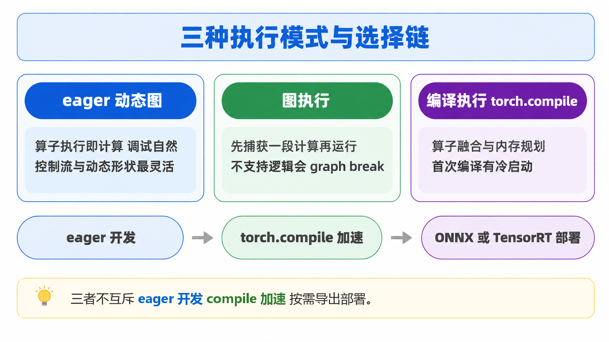
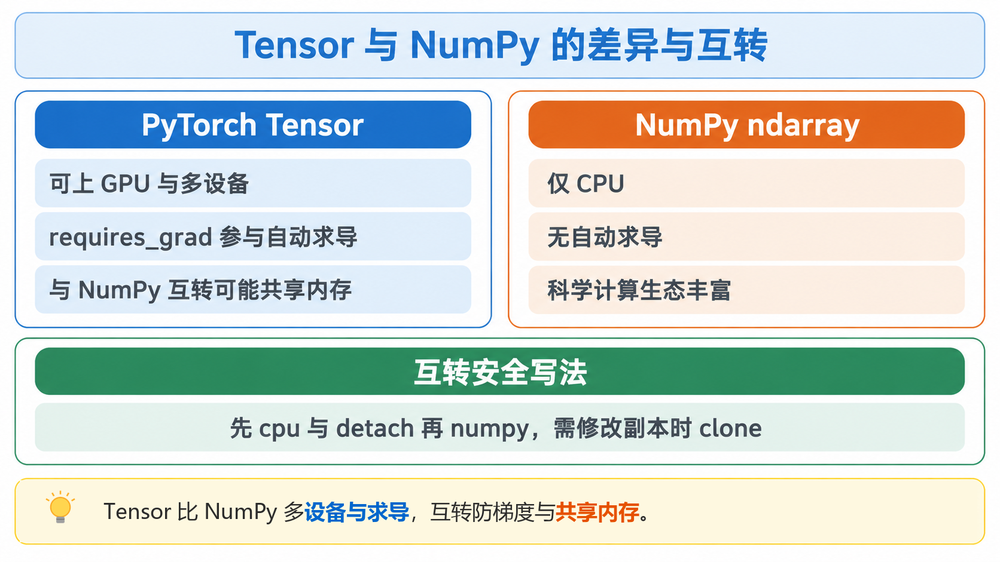
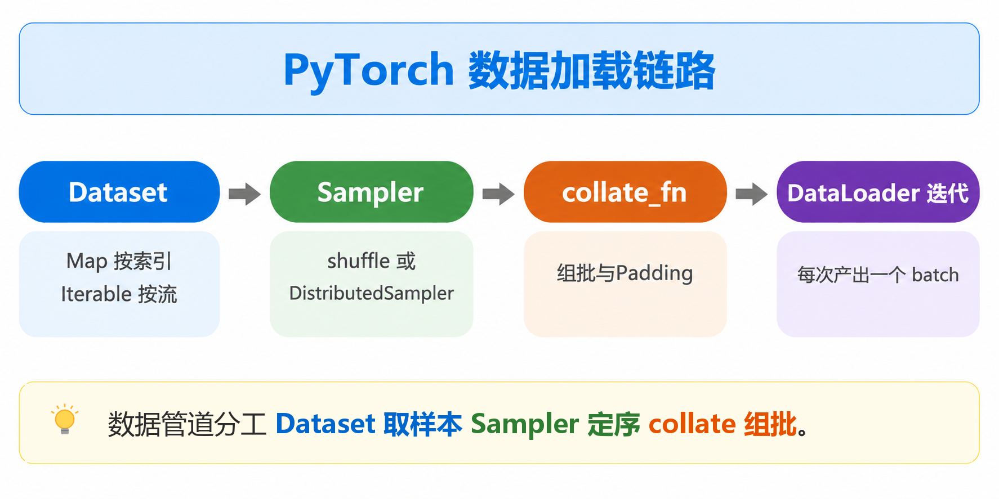
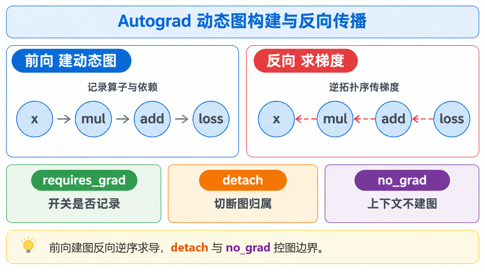
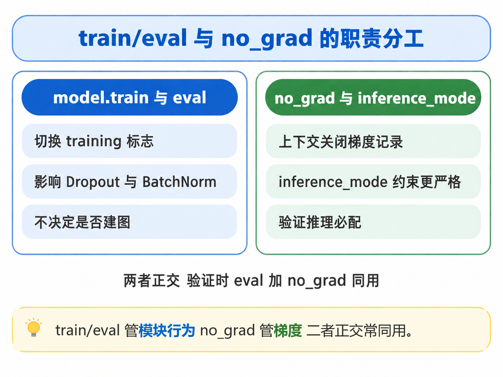
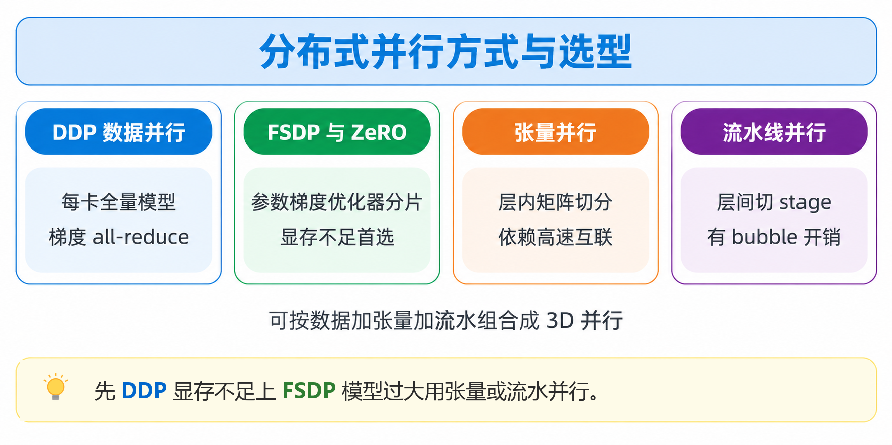
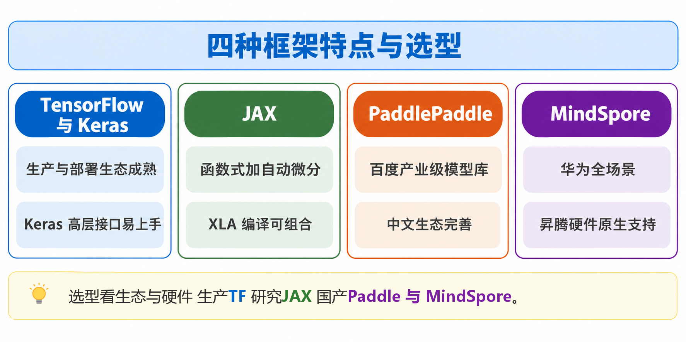
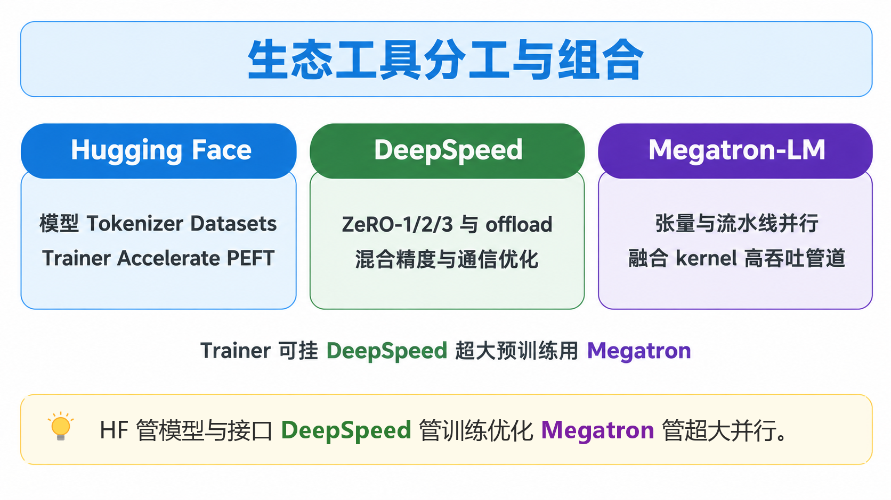

# 目录

## 1.5 深度学习框架与工具

本章面向深度学习算法工程师面试，先讲清 PyTorch 的执行模型、Tensor、数据管道、自动求导、训练/评估模式和分布式训练，再补齐 TensorFlow/Keras、JAX、PaddlePaddle、MindSpore 等框架，以及 Hugging Face、DeepSpeed、Megatron-LM等生态工具。

[1. PyTorch 核心底层与工程常用知识点汇总](#p5-1)

- [面试问题：动态图、图执行与编译执行有什么区别？PyTorch 中应如何选择 eager、torch.compile 与模型导出？](#p5-1-1)
- [面试问题：PyTorch Tensor 的核心特性有哪些？它与 NumPy 数组的本质差异和互转注意事项是什么？](#p5-1-2)
- [面试问题：PyTorch 的数据加载链路是什么？Dataset、DataLoader、Sampler 与 collate_fn 如何分工？](#p5-1-3)
- [面试问题：Autograd 如何构建动态计算图并完成反向传播？requires_grad、detach、no_grad 有什么区别？](#p5-1-4)
- [面试问题：model.train()、model.eval()、torch.no_grad() 和 torch.inference_mode() 有什么区别？](#p5-1-5)
- [面试问题：PyTorch 分布式训练有哪些并行方式？DDP、FSDP/ZeRO、张量并行和流水线并行如何选？](#p5-1-6)

[2. PyTorch 以外的深度学习框架与生态工具概览](#p5-2)

- [面试问题：TensorFlow/Keras、JAX、PaddlePaddle 与 MindSpore 分别有什么特点，如何选择？](#p5-2-1)
- [面试问题：Hugging Face、DeepSpeed 与 Megatron-LM 分别解决什么问题，如何配合使用？](#p5-2-2)

<h1 id="p5-1">1. PyTorch 核心底层与工程常用知识点汇总</h1>

<h2 id="p5-1-1">面试问题：动态图、图执行与编译执行有什么区别？PyTorch 中应如何选择 eager、torch.compile 与模型导出？</h2>

**难度评分：⭐⭐⭐（3/5）| 考察频率：⭐⭐⭐⭐⭐（5/5）** 

 动态图（eager）是在 Python 执行到算子时立即计算；图执行是先捕获一段计算再运行；编译执行则是在捕获的基础上进一步做算子融合、内存规划和硬件特化。三者不是互斥的框架标签，现代 PyTorch 通常采用 eager 开发、`torch.compile` 加速，按需导出到 ONNX/TensorRT 部署。

### 1、概念与区别

| 维度 | eager / 动态执行 | 图执行或编译执行 |
|---|---|---|
| 执行时机 | Python 运行到一个算子就立即执行 | 先追踪、捕获或导出计算，再由图运行时/编译器执行 |
| 控制流 | 任意 Python `if/for` 都能运行，数据相关分支最自然 | 可捕获的控制流可编译；不支持的 Python 逻辑会产生 graph break、回退或重编译 |
| 输入形状 | 天然适合可变长度和动态分支 | 不是只能固定形状，但动态形状可能增加 guard、重编译和优化成本 |
| 调试 | 可用普通 Python 调试器检查中间 Tensor | 需结合编译日志、图解释和 profiler，定位问题的成本更高 |
| 性能 | 算子逐个调度，可能有 Python 调度和 kernel launch 开销 | 有机会做融合、消除中间读写、规划内存并调用硬件专用内核 |
| 启动与部署 | 无编译冷启动，直接作为 Python 程序运行 | 首次编译有开销；导出的图/引擎更易接入 C++ 或专用推理服务 |

“静态图”在面试中常被用作图执行的简称，但严格说还应区分：

（1）Tracing（追踪）只记录一次样例输入走过的算子，数据相关控制流可能被错误固化。

（2）Symbolic/AOT capture（符号捕获/提前导出）** 尝试保留更多图结构和输入约束。

（3）Compilation（编译）将捕获到的图交给 Inductor、XLA 或 TensorRT 等后端生成优化后的代码/引擎。

### 2、PyTorch 中的选择


（1）eager ：研究、快速迭代、复杂 Python 逻辑和自定义算子优先使用。先用它建立正确性基线。

（2）`torch.compile` ：模型结构相对稳定、希望提升训练或推理吞吐时使用。它是“捕获可编译区域 + 后端编译”的混合方案，不承诺把整个 Python 程序变成一张完整静态图。

```python
model = MyModel().cuda()
model = torch.compile(model, mode="max-autotune")  # 先正确性，再用真实负载压测
```
（3）`torch.export`/ONNX/TensorRT ：需要跨语言、跨进程或在固定硬件上部署时使用。导出是部署边界，必须验证算子覆盖、动态维度和数值一致性。

（4）`torch.compile` 遇到不支持的代码可能 graph break；输入形状或控制流变化可能触发重新编译。工程上应观察编译耗时、稳态吞吐、显存、P50/P99 延迟和回退次数，而不能只看一次运行时间。推理服务还要把预热（warm-up）和编译缓存纳入发布流程。

### 3、常见误区

（1）PyTorch 并非“只有动态图”，PyTorch 2.x 已具备图捕获和编译能力；TensorFlow 2 也并非“只有静态图”。

（2）ONNX 是模型交换格式，不是动态图或静态图本身；ONNX Runtime、TensorRT 才是执行模型的运行时。

（3）图执行不必然更快。小模型、动态输入或 graph break 较多时，编译开销可能抵消优化收益，必须基准测试。

eager、图执行与编译执行三种模式的区别与选择链如图5-1所示：
<div align="center">
  
</div>
<div align="center">图5-1 三种执行模式与选择链</div>

<h2 id="p5-1-2">面试问题：PyTorch Tensor 的核心特性有哪些？它与 NumPy 数组的本质差异和互转注意事项是什么？</h2>

**难度评分：⭐⭐⭐（3/5）| 考察频率：⭐⭐⭐⭐⭐（5/5）** 

 Tensor 是带有形状、步长、数据类型、设备、存储布局和自动求导信息的多维数组抽象；NumPy `ndarray` 主要面向 CPU 数值计算。二者可以互操作，但设备、数据类型、梯度和是否共享内存必须明确。

### 1、Tensor 的核心特性

（1）形状与布局 ：`shape` 描述各维大小，`stride` 描述步进；`view`/`reshape`、转置和切片可能生成共享存储的 view，而不是复制。
（2）设备 ：通过 `.device` 标识 CPU、CUDA 或其他后端，可用 `.to(device)` 移动；同一算子通常要求参与运算的 Tensor 在兼容设备上。
（3）数据类型 ：支持 `float32`、`float16`、`bfloat16`、`float64`、整数和布尔等，混合精度时要留意累加精度和算子支持。
（4）自动微分：`requires_grad=True` 的 Tensor 在梯度模式下参与运算时，会被 Autograd 记录。
（5）广播与向量化 ：遵循 NumPy 风格广播规则，提供线性代数、索引、散射、稀疏/量化相关操作。
（6）存储与别名：多个 Tensor 可能共享同一底层 storage；原地操作会影响所有别名，并可能破坏反向传播所需的中间值。
（7）生态集成：可直接作为 `nn.Module`、优化器、AMP、DDP/FSDP 等组件的数据载体，但分布式通信能力来自这些组件，不是 Tensor 单独提供的。

### 2、、Tensor 与 NumPy 的关键差异

| 对比项 | PyTorch Tensor | NumPy `ndarray` |
|---|---|---|
| 计算设备 | CPU、CUDA 及已支持的加速器 | 主要是 CPU |
| 自动求导 | 原生 Autograd、可构建计算图 | 不提供 PyTorch 式反向图 |
| 模型训练 | 与 `nn.Module`、优化器、AMP、分布式训练整合 | 需要自行实现训练基础设施 |
| 异步性 | CUDA 算子通常异步执行，需同步后再精确计时 | CPU 运算通常同步 |
| 内存共享 | 可与 NumPy 零拷贝互转，但有条件 | 受 CPU 内存和 dtype 限制 |

### 3、互转与常见坑

```python
a = np.asarray([1, 2, 3], dtype=np.float32)
t_shared = torch.from_numpy(a)       # CPU Tensor，与 a 共享内存
t_copy = torch.tensor(a)             # 通常复制数据

# GPU 或 requires_grad Tensor 转 NumPy 的安全写法
arr = t.detach().cpu().numpy()
```

- `torch.from_numpy(a)` 和 `a` 之间通常共享存储；修改一方会影响另一方。数组需是 CPU、支持的 dtype 和合适的内存布局。
- `tensor.numpy()` 通常要求 Tensor 在 CPU、未追踪梯度且不包含不兼容的 conjugate/negative bit；不满足时使用 `detach().cpu().numpy()`，必要时再 `.copy()` 隔离内存。
- `torch.as_tensor` 会尽量复用内存，`torch.tensor` 更明确地创建副本。读取只读 NumPy 数组后不要通过共享 Tensor 原地修改。
- Tensor 和 NumPy 的 dtype 不一定相同（例如 Python 整数常推断为 `int64`）；送入模型前显式 `.to(dtype=..., device=...)`。
- `view` 需要兼容 stride；不确定是否连续时使用 `.reshape()`，或先 `.contiguous()`，并意识到这可能产生复制。

Tensor 与 NumPy 的本质差异及互转安全要点如图5-2所示：
<div align="center">
  
</div>
<div align="center">图5-2 Tensor 与 NumPy 的差异与互转</div>

<h2 id="p5-1-3">面试问题：PyTorch 的数据加载链路是什么？Dataset、DataLoader、Sampler 与 collate_fn 如何分工？</h2>

**难度评分：⭐⭐⭐（3/5）| 考察频率：⭐⭐⭐⭐⭐（5/5）** 

PyTorch的数据加载链路由Dataset、Sampler、DataLoader与collate_fn四个核心组件协同完成：Dataset负责定义单个样本的读取与预处理逻辑，分为支持按索引随机访问的Map-style Dataset和适配流式、超大规模数据的IterableDataset两类；Sampler负责生成样本索引的选取规则与遍历顺序；DataLoader作为整体调度器，承担批次组织、多进程读取管理、数据预取与内存优化等工作；collate_fn则负责将取出的单个样本拼接组装成统一的batch。完整的迭代流程是Sampler产生索引序列，由worker进程调用Dataset读取样本，再经collate_fn拼接为批次，后续可配合锁页内存等优化送入模型训练；工程实践中需根据数据形态选择对应Dataset，合理设置num_workers、pin_memory等参数，分布式训练优先使用DistributedSampler并通过set_epoch保证各epoch打乱顺序不同，排查问题时可先以单worker验证链路正确性再逐步扩容。

Dataset、Sampler、collate_fn 与 DataLoader 的数据加载链路分工如图5-3所示：
<div align="center">
  
</div>
<div align="center">图5-3 PyTorch 数据加载链路</div>

<h2 id="p5-1-4">面试问题：Autograd 如何构建动态计算图并完成反向传播？requires_grad、detach、no_grad 有什么区别？</h2>

**难度评分：⭐⭐⭐⭐（4/5）| 考察频率：⭐⭐⭐⭐⭐（5/5）** 

PyTorch的Autograd通过动态构建有向无环计算图完成自动微分：每次前向传播都会实时生成一张全新的计算图，其中设置了`requires_grad=True`的叶子张量是梯度追踪的起点，每一步运算产生的中间张量都会携带`grad_fn`，指向对应的反向函数并保存反向传播所需的依赖信息；调用`backward()`后，Autograd从输出张量出发沿计算图逆向遍历，依据链式法则逐层计算局部梯度，并将最终梯度累加至叶子张量的`.grad`属性中，默认反向传播结束后会释放整张计算图。三者的核心区别在于：`requires_grad`是张量的固有属性，决定该张量是否参与梯度追踪，常用于冻结模型骨干参数；`detach()`会返回一个与原张量共享数据存储但脱离当前计算图的张量，彻底阻断梯度反传路径；`torch.no_grad()`是上下文管理器，仅作用于其包裹的代码段，禁用该范围内的计算图记录，不会改变张量本身的属性与模型的训练/评估状态，而`inference_mode`是比`no_grad()`更极致的推理优化模式，性能开销更低，但生成的张量无法再接入后续梯度计算。
 
Autograd 前向建图与反向求梯度及三个控图操作如图5-4所示：
<div align="center">
  
</div>
<div align="center">图5-4 Autograd 动态图构建与反向传播</div>

<h2 id="p5-1-5">面试问题：model.train()、model.eval()、torch.no_grad() 和 torch.inference_mode() 有什么区别？</h2>

**难度评分：⭐⭐⭐（3/5）| 考察频率：⭐⭐⭐⭐⭐（5/5）** 

 `train()/eval()`切换模块行为；`no_grad()/inference_mode()`控制是否记录梯度。评估通常需要二者同时使用：`model.eval()` 保证 Dropout/BatchNorm 行为正确，`torch.inference_mode()`（或 `no_grad()`）节省推理开销。

| API | 改变什么 | 是否构图 | 典型用途 |
|---|---|---|---|
| `model.train(True)` | 将模型及子模块的 `training` 设为 `True` | 不决定，默认仍可构图 | 训练 |
| `model.eval()` / `train(False)` | 将 `training` 设为 `False` | 不决定，默认仍可构图 | 验证、测试、推理 |
| `torch.no_grad()` | 上下文内关闭梯度记录 | 不构图 | 验证、推理、冻结模块的前向 |
| `torch.inference_mode()` | 关闭梯度并进一步省略版本计数等 autograd 元数据 | 不构图，限制更严格 | 纯推理服务和离线特征提取 |

- **Dropout** ：训练时随机丢弃并做缩放，评估时关闭随机丢弃。
- **BatchNorm** ：训练时使用当前 batch 统计量并更新 running mean/variance；评估时使用累计统计量。
- 某些 RNN 模块的 dropout 等自定义层也可能读取 `self.training`。
- **LayerNorm、GroupNorm**  通常没有 running statistics，训练和评估行为相同；不能笼统地说所有归一化层都会变化。自定义模块是否变化取决于实现。

推荐写法:

```python
# 训练
model.train()
for inputs, labels in train_loader:
    optimizer.zero_grad(set_to_none=True)
    loss = criterion(model(inputs), labels)
    loss.backward()
    optimizer.step()

# 验证/测试
model.eval()
with torch.inference_mode():
    for inputs, labels in val_loader:
        logits = model(inputs)
        # 计算 loss 和指标
```

model.train/eval 与 no_grad/inference_mode 的职责分工如图5-5所示：
<div align="center">
  
</div>
<div align="center">图5-5 train/eval 与 no_grad 的职责分工</div>

<h2 id="p5-1-6">面试问题：PyTorch 分布式训练有哪些并行方式？DDP、FSDP/ZeRO、张量并行和流水线并行如何选？</h2>

**难度评分：⭐⭐⭐⭐（4/5）| 考察频率：⭐⭐⭐⭐⭐（5/5）** 

 模型能完整放入单卡时优先 DDP 做数据并行；模型/优化器状态放不下时使用 FSDP 或 ZeRO 分片；单层就放不下或需要扩展到超大模型时，再叠加张量并行、流水线并行，形成 2D/3D 并行。`DataParallel` 适合临时原型，不是生产首选。

### 1. 数据并行

#### `nn.DataParallel`（DP）

单进程多线程：每次 forward 临时复制模型、切分输入，在主卡汇总梯度。代码简单但有主卡聚合瓶颈、Python/GIL 和复制开销，不支持多节点，生产训练通常迁移到 DDP。

#### `DistributedDataParallel`（DDP）

DDP 通常“一卡一进程”，每个进程持有完整模型和优化器，在本地 batch 上前向/反向；反向过程中通过通信后端对梯度做 collective（常见实现是 AllReduce，但具体算法由后端和拓扑选择），各进程随后独立执行相同的参数更新。

```python
# train.py 的核心结构（省略异常处理）
dist.init_process_group("nccl")
local_rank = int(os.environ["LOCAL_RANK"])
torch.cuda.set_device(local_rank)
model = DDP(model.to(local_rank), device_ids=[local_rank])
sampler = DistributedSampler(dataset, shuffle=True)
loader = DataLoader(dataset, sampler=sampler, batch_size=per_gpu_bs)
```

用 `torchrun --nproc_per_node=4 train.py` 启动；每个 epoch 调 `sampler.set_epoch(epoch)`。GPU 通信优先 NCCL，CPU 或特定环境使用 Gloo；多节点还要正确配置 rendezvous 地址、端口、防火墙和网络带宽。

### 2. 参数/梯度/优化器状态分片

- ** FSDP（FullyShardedDataParallel）** ：对参数、梯度和优化器状态做分片，forward/backward 需要时 all-gather 参数，完成后再释放或重新分片，显著降低显存，适合单卡放不下完整状态但仍可按层计算的模型。
- ** DeepSpeed ZeRO** ：ZeRO-1 分片优化器状态，ZeRO-2 再分片梯度，ZeRO-3 连参数也分片；还可结合 CPU/NVMe offload。FSDP 与 ZeRO 的思想相近，具体选型看生态、检查点和运维习惯，避免重复叠加两个分片封装。

### 3. 模型并行

- **张量并行（TP）** ：把线性层、注意力投影等矩阵按列/行切分，多卡协同完成一个层。通信频繁，要求高速互联，适合单层或单个 Transformer block 就很大的模型。
- **流水线并行（PP）** ：按层切成多个 stage，输入再拆成 micro-batch；可提高大模型可训练性，但有 pipeline bubble、stage 负载不均和调度复杂度。PyTorch 新版提供 `torch.distributed.pipelining`，第三方框架也有成熟实现。
- **数据并行 + TP + PP** ：在不同维度组合成 3D 并行；Megatron-LM、DeepSpeed 等提供相应实现。还可能加入 sequence/context parallel，应根据序列长度和互联拓扑设计。

### 选择与工程检查

| 场景 | 首选方案 | 主要代价 |
|---|---|---|
| 单卡可放下模型，多卡提吞吐 | DDP | 每卡都有完整模型，显存不节省 |
| 参数可分层加载，但优化器状态占满显存 | ZeRO-1/2 或 FSDP | collective 通信与配置复杂度增加 |
| 完整模型参数本身放不下单卡 | FSDP/ZeRO-3 + 必要的 TP/PP | all-gather、检查点和调度复杂 |
| 超长序列/超大模型 | TP + PP + DP（必要时 sequence/context parallel） | 对网络拓扑、micro-batch 和负载均衡敏感 |

全局 batch 的定义是 `每卡 batch × GPU 数 × gradient accumulation steps`；学习率是否线性放大要结合优化器、训练步数、warmup 和验证结果，不能机械地按卡数相乘。还要检查随机种子、梯度同步、混合精度、checkpoint（保存 rank-0 或分片格式）、故障恢复和通信/计算重叠。


DDP、FSDP/ZeRO、张量并行与流水线并行四种分布式并行方式与选型如图5-6所示：
<div align="center">
  
</div>
<div align="center">图5-6 分布式并行方式与选型</div>

<h1 id="p5-2">2. PyTorch 以外的深度学习框架与生态工具概览</h1>

<h2 id="p5-2-1">面试问题：TensorFlow/Keras、JAX、PaddlePaddle 与 MindSpore 分别有什么特点，如何选择？</h2>

**难度评分：⭐⭐⭐（3/5）| 考察频率：⭐⭐⭐⭐（4/5）** 

TensorFlow/Keras、JAX、PaddlePaddle、MindSpore四款深度学习框架各有明确的技术侧重与生态定位，选型核心是匹配硬件底座、业务场景与团队技术栈，而非单纯以动态图/静态图作为唯一评判标准。

TensorFlow搭配Keras的核心优势是成熟完整的工业级生产链路：tf.data高性能数据管道、tf.distribute分布式方案、SavedModel标准格式，叠加TFLite端侧部署、TF Serving线上服务，形成从训练到部署的全流程闭环；Keras则提供简洁的高层API，大幅降低建模门槛。它最适合企业级生产落地、移动端与边缘端部署，以及已有TensorFlow技术沉淀的团队；需要注意eager调试模式与tf.function静态图模式切换时，容易出现重编译、算子不兼容、函数签名不匹配等问题。

JAX是典型的函数式数组计算框架，核心亮点是基于XLA的编译加速与灵活的原子化变换：原生支持jit即时编译、grad自动微分、vmap自动向量化、pmap多设备并行等能力，可自由组合实现极致性能，在TPU硬件上表现尤为突出，适合科学计算、大规模分布式预训练与前沿算法研究。但它严格遵循函数式编程约束，要求代码无副作用、显式管理随机数种子与状态，同时训练生态的封装完整性弱于PyTorch。

PaddlePaddle主打动静统一的开发体验，动态图开发灵活高效，静态图部署性能优异，同时配套了丰富的产业级套件与完善的中文生态，在国内CV、OCR、NLP等垂直场景的落地方案成熟，深度适配国产硬件与产业平台，适合工业级项目快速落地。从PyTorch向其迁移时，需要重点核对算子实现差异、权重格式、数据管道逻辑以及第三方库的覆盖程度。

MindSpore主打面向图编译与自动并行能力，深度适配昇腾等国产算力硬件，针对全场景AI训练与推理做了专项优化，主要适用于基于国产算力的企业级训练与推理部署场景。选型前需要确认目标硬件的适配版本、算子支持丰富度以及社区组件是否满足项目需求。

具体选型建议遵循四层判断逻辑：一是先锚定硬件底座与目标部署后端，明确算力类型与对应的推理引擎；二是核对核心能力匹配度，包括关键算子支持、混合精度与量化能力、分布式训练方案以及检查点机制；三是用真实业务模型做小规模基准测试，验证收敛速度、训练吞吐、显存占用、编译耗时、推理P99延迟以及故障恢复能力；四是评估团队维护成本与生态复用价值，若已有大量PyTorch或HuggingFace代码资产，需充分衡量迁移收益是否能覆盖代码转换与效果验证的成本。

整体而言，快速搭建高层模型可以优先选择Keras；如果需要对训练循环、并行策略、显存优化做精细控制，更推荐使用PyTorch、JAX或者TensorFlow底层API；国产算力场景下则优先评估PaddlePaddle与MindSpore。

TensorFlow/Keras、JAX、PaddlePaddle 与 MindSpore 四种框架的特点与选型如图5-7所示：
<div align="center">
  
</div>
<div align="center">图5-7 四种框架特点与选型</div>

<h2 id="p5-2-2">面试问题：Hugging Face、DeepSpeed 与 Megatron-LM 分别解决什么问题，如何配合使用？</h2>

**难度评分：⭐⭐⭐⭐（4/5）| 考察频率：⭐⭐⭐⭐⭐（5/5）** 

Hugging Face、DeepSpeed与Megatron-LM在大模型训练体系中定位互补，分别解决模型生态复用、分布式系统效率、超大规模模型并行训练三类核心问题。

Hugging Face是通用的模型开发基座：Transformers库提供标准化的预训练模型、Tokenizer与Trainer训练接口，搭配Datasets、PEFT、Accelerate等组件，覆盖数据处理、参数高效微调、多卡分布式启动全链路，核心价值是大幅降低模型复用与工程落地的门槛。

DeepSpeed聚焦训练侧的显存与效率优化：核心能力是ZeRO系列显存分片技术，同时支持CPU/NVMe参数卸载、混合精度训练、梯度累积、Checkpoint优化等特性，既可封装原生PyTorch模型，也能无缝对接Hugging Face的Trainer与Accelerate，主要解决大模型微调的显存瓶颈与分布式训练的系统效率问题。

Megatron-LM是Transformer超大模型预训练的专用高性能框架：深度实现了张量并行、流水线并行、序列并行等细粒度模型并行策略，融合定制化高性能算子与高吞吐数据管道，对模型定义、数据格式、Checkpoint格式有更强的约束，主打百亿千亿级模型预训练的极致吞吐。

三者的配合按训练场景分层适配：
中小模型微调以Hugging Face全栈生态为主，单机多卡搭配DDP即可满足需求；大模型全参数微调基于Transformers的模型实现，接入DeepSpeed ZeRO-3显存分片，结合BF16混合精度、梯度检查点压缩显存开销；超大模型预训练以Megatron-LM为核心实现模型并行，搭配DeepSpeed（或Megatron-DeepSpeed）提供ZeRO优化与系统级增强，数据和Tokenizer可复用Hugging Face生态资产并做格式转换；推理阶段则将训练好的权重导出到vLLM、TensorRT-LLM等专用推理引擎，不会直接沿用训练框架承载线上流量。

Hugging Face、DeepSpeed 与 Megatron-LM 生态工具的分工与组合如图5-8所示：
<div align="center">
  
</div>
<div align="center">图5-8 生态工具分工与组合</div>
