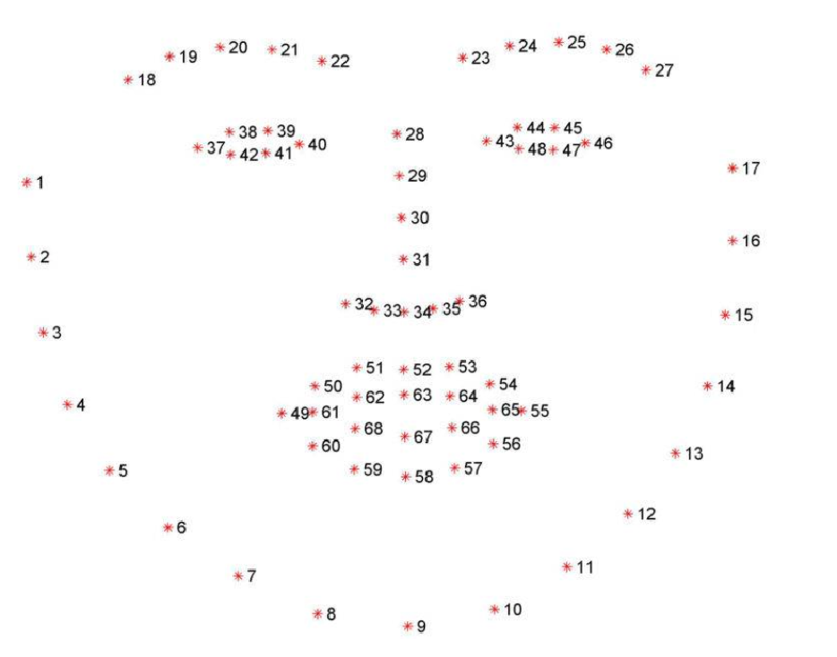

# 目录

[1. 人脸识别的判别学习基础](#q-001)
  - [面试问题：为什么传统 Softmax 不足以解决人脸识别？](#q-002)
  - [面试问题：分类能力和判别能力有什么区别？](#q-003)
  - [面试问题：L-Softmax、SphereFace、CosFace 和 ArcFace 如何逐步引入间隔？](#q-004)
  - [面试问题：CurricularFace 和 AdaFace 为什么要根据样本难度或图像质量自适应？](#q-005)

[2. 人脸任务与识别系统工程](#q-006)
  - [面试问题：AI 领域的人脸主流任务如何分类？](#q-007)
  - [面试问题：InsightFace 系列技术解决了什么问题？](#q-008)
  - [面试问题：一个工业级人脸识别系统的完整 pipeline 是什么？](#q-009)
  - [面试问题：1:1、1:N、N:N、静态识别和动态识别有什么区别？](#q-010)
  - [面试问题：影响人脸图像质量的因素有哪些，如何做质量门控？](#q-011)
  - [面试问题：人脸 embedding 的相似度如何计算和校准？](#q-012)

[3. 人脸分析：关键点、解析与属性](#q-013)
  - [面试问题：什么是人脸关键点检测，它如何服务于对齐和表情驱动？](#q-014)
  - [面试问题：什么是人脸解析（Face Parsing）？](#q-015)
  - [面试问题：人脸属性分析如何建模，哪些属性不应直接作为业务结论？](#q-016)
  - [面试问题：人脸美颜技术的原理和工程边界是什么？](#q-017)

[4. 人脸身份建模与 AIGC 编辑](#q-018)
  - [面试问题：为什么 ArcFace 在人脸识别和 AIGC 身份保持中长期高频？](#q-019)
  - [面试问题：ArcFace embedding 如何作为生成模型的身份损失？](#q-020)
  - [面试问题：AIGC 数字人、换脸和肖像编辑如何保持身份一致？](#q-021)
  - [面试问题：InstantID、IP-Adapter FaceID、PhotoMaker 的共同思想是什么？](#q-022)

[5. 人脸安全、评估与 Agent 边界](#q-023)
  - [面试问题：活体检测和 DeepFake 检测有什么区别？](#q-024)
  - [面试问题：AI Agent 调用人脸模型时有哪些安全风险？](#q-025)
  - [面试问题：人脸模型和 AIGC 身份保持常用哪些评估指标？](#q-026)

---

<h1 id="q-001">1. 人脸识别的判别学习基础</h1>

<h2 id="q-002">面试问题：为什么传统 Softmax 不足以解决人脸识别？</h2>

**难度评分：⭐⭐ (2/5)  |  考察频率：⭐⭐⭐⭐⭐ (5/5)**

传统 Softmax 是闭集分类目标：训练时类别集合固定，模型学习的是“输入属于哪个已知类别”。人脸识别面对的是开放集合，测试时会出现训练集没有见过的新身份，因此不能只依赖分类头的类别编号。

训练阶段仍然可以用带分类头的 Softmax 监督 backbone，但部署时通常丢弃分类头，只保留归一化后的 embedding，通过距离或相似度完成验证、识别和检索。ArcFace、CosFace 等损失的作用，就是让这个 embedding 空间具有更清晰的类内紧凑和类间分离结构。

面试中可以这样收束：**Softmax 可以作为训练监督，但开放集身份判断需要可迁移的度量表示和拒识机制。**

<h2 id="q-003">面试问题：分类能力和判别能力有什么区别？</h2>

**难度评分：⭐⭐⭐ (3/5)  |  考察频率：⭐⭐⭐⭐ (4/5)**

分类能力关注决策边界能否把训练类别分开；判别能力还要求同一身份的样本在表示空间中足够近、不同身份的样本有足够大的安全间隔。只要样本落在正确边界一侧，普通分类损失就可能认为已经成功，但这并不保证边界附近的两张脸在开放集比较时可靠。

人脸度量学习更关心如下关系：类间最小距离应大于类内最大距离。姿态、年龄、光照、遮挡和摄像头差异会造成类内变化，因此训练目标必须显式压缩类内分布并扩大类间间隔。这个判断也解释了为什么人脸识别模型通常采用归一化特征、角度 margin 和严格的验证集阈值，而不是直接使用分类准确率。

<h2 id="q-004">面试问题：L-Softmax、SphereFace、CosFace 和 ArcFace 如何逐步引入间隔？</h2>

**难度评分：⭐⭐⭐⭐ (4/5)  |  考察频率：⭐⭐⭐⭐⭐ (5/5)**

这条演进主线都在改造 Softmax 的真实类别 logit，使正确类别必须拥有更大的角度优势：

| 方法 | 关键改动 | 几何含义 | 工程取舍 |
|---|---|---|---|
| L-Softmax | 将正类角度乘以 $m$ | 乘性角度间隔，优化较难 | 需要分段函数和渐进式训练 |
| SphereFace | 归一化权重，再使用乘性角度间隔 | 把比较放到超球面上 | 对角度和收敛较敏感 |
| CosFace | 在余弦空间减去加性 margin | 类间余弦间隔恒定 | 形式简单、部署友好 |
| ArcFace | 在角度空间加入 $m$ | 对应超球面上的弧长间隔 | 几何解释清晰、成为常用基线 |

以 ArcFace 为例，真实类别 logit 从 $`s\cos\theta_y`$ 变为 $`s\cos(\theta_y+m)`$。$`s`$ 是缩放系数，$`m`$ 是角度 margin。不同方法的共同目标不是记住某个固定阈值，而是让 embedding 在未见身份上仍具有稳定的角度可分性。

<h2 id="q-005">面试问题：CurricularFace 和 AdaFace 为什么要根据样本难度或图像质量自适应？</h2>

**难度评分：⭐⭐⭐⭐ (4/5)  |  考察频率：⭐⭐⭐⭐ (4/5)**

固定 margin 对所有样本一视同仁会遇到两个问题：训练早期过早强调困难样本会影响收敛；低清、遮挡或标注错误的样本可能只是噪声，却被误认为“最值得优化”。

- **CurricularFace** 维护一个随训练进度变化的 curriculum，前期降低困难负样本的影响，模型稳定后逐步提高困难样本权重；同一阶段内，越接近决策边界的负样本权重越高。
- **AdaFace** 使用特征范数作为图像质量的代理信号。高质量样本通常能支持更大的判别 margin，低质量样本则采用更保守的约束，避免把噪声和不可辨识样本强行拉到错误方向。

工程上还应显式记录质量分布、标签噪声和长尾身份，不能把“困难”简单等同于“有价值”。

<h1 id="q-006">2. 人脸任务与识别系统工程</h1>

<h2 id="q-007">面试问题：AI 领域的人脸主流任务如何分类？</h2>

**难度评分：⭐⭐⭐ (3/5)  |  考察频率：⭐⭐⭐⭐⭐ (5/5)**

可以按“定位、身份、结构、属性、生成、安全”六类理解，而不是背一串模型名：

| 类别 | 代表任务 | 输出或用途 |
|---|---|---|
| 定位与跟踪 | 人脸检测、视频跟踪 | 人脸框、轨迹、置信度 |
| 身份建模 | 验证、1:N 识别、检索、跨年龄识别 | embedding、身份决策、候选排序 |
| 结构理解 | 关键点、头姿、3D 重建、Face Parsing | 坐标、姿态、像素级 mask、几何参数 |
| 属性与状态 | 年龄段、表情、眼睛开合、口罩/眼镜等 | 分类、回归或时序状态 |
| 生成与编辑 | 人脸生成、换脸、虚拟化妆、数字人驱动 | 身份条件化图像或视频 |
| 安全与质量 | 活体、DeepFake、质量评估 | 风险分数、质量分数、拒绝或复核 |

同一系统往往组合多类任务。例如驾驶员监控需要检测、跟踪、关键点、头姿和疲劳状态；AIGC 人像编辑需要检测、对齐、解析、身份 embedding、生成和安全审核。任务分类决定数据标注、模型接口和评估指标，不能用一个“人脸准确率”概括全部效果。

<h2 id="q-008">面试问题：InsightFace 系列技术解决了什么问题？</h2>

**难度评分：⭐⭐⭐ (3/5)  |  考察频率：⭐⭐⭐⭐⭐ (5/5)**

InsightFace 更适合被理解为一套人脸分析与识别生态，而不是某一个模型。它把检测、关键点、对齐、身份特征提取、相似度计算和部分属性/换脸能力组织成可复用模块，典型模型路线包括 RetinaFace、SCRFD 等检测器，以及基于角度 margin 训练的识别 backbone。

典型调用链是：检测器输出人脸框和关键点，按模板做相似变换，对齐图像送入识别网络得到 embedding，再由业务层完成验证、检索或身份保持评估。部署时可根据端侧算力选择轻量模型或高精度模型，并通过 ONNX Runtime 等推理后端进行加速；具体模型大小、阈值和延迟必须以目标版本和硬件实测为准，不能把某个示例配置当成通用结论。

在 AIGC 中，InsightFace 的价值还包括提供身份特征、换脸前后的一致性度量和人脸安全检测基础，但它不等于完整的生成模型，也不应把第三方插件的工作流描述成 InsightFace 的统一原理。

<h2 id="q-009">面试问题：一个工业级人脸识别系统的完整 pipeline 是什么？</h2>

**难度评分：⭐⭐⭐ (3/5)  |  考察频率：⭐⭐⭐⭐⭐ (5/5)**

```text
图像/视频输入
  -> 人脸检测
  -> 关键点定位与对齐
  -> 图像质量评估
  -> 特征提取与归一化
  -> 相似度计算或向量检索
  -> 阈值判断、开集拒识或候选排序
  -> 活体/设备/行为风控
  -> 日志、复核与持续评估
```

检测解决“脸在哪里”，关键点和对齐解决“输入是否处在模型假设的坐标系”，质量门控解决“这张脸是否值得比较”，embedding 模型解决“如何表示身份”，检索和阈值策略解决“如何做业务决策”。任一环节的分布变化都可能造成最终误拒或误受。

对视频系统还要增加跟踪、跨帧聚合和时序稳定性；对 AIGC 系统则要增加身份保持、姿态/表情控制和生成结果审核。系统设计应把模型置信度、质量分数和拒识原因输出给上层，而不是只返回一个布尔值。

<h2 id="q-010">面试问题：1:1、1:N、N:N、静态识别和动态识别有什么区别？</h2>

**难度评分：⭐⭐⭐ (3/5)  |  考察频率：⭐⭐⭐⭐⭐ (5/5)**

| 场景 | 定义 | 典型应用 | 关键工程问题 |
|---|---|---|---|
| 1:1 验证 | 当前人脸与指定模板是否同一人 | 手机解锁、身份核验 | 阈值、安全等级、误拒 |
| 1:N 识别 | 在身份底库中寻找当前人脸 | 门禁、考勤 | 检索速度、库规模、开集拒识 |
| N:N 识别 | 一张图或一段视频中的多人同时与底库匹配 | 群体门禁、视频归档 | 批处理吞吐、跟踪、多人遮挡 |
| 静态识别 | 受控采集，姿态和距离相对稳定 | 自拍核验 | 采集约束较强、实现较容易 |
| 动态识别 | 运动中抓拍，存在模糊、侧脸和光照变化 | 无感通行、驾驶员监控 | 质量波动、时序聚合、误报控制 |

三者都依赖 embedding，但不能共用未经校准的阈值。1:N 和 N:N 还要设置“最高分低于阈值则拒识”的开集分支，不能把所有输入强行分配给库内身份。

<h2 id="q-011">面试问题：影响人脸图像质量的因素有哪些，如何做质量门控？</h2>

**难度评分：⭐⭐⭐ (3/5)  |  考察频率：⭐⭐⭐⭐⭐ (5/5)**

常见因素包括人脸像素尺寸与有效分辨率、曝光和逆光、运动/失焦模糊、压缩噪声、遮挡、姿态角度、表情变化、裁剪边界以及摄像头与训练域的差异。人脸过小会损失身份细节，过曝或欠曝会改变纹理，侧脸和口罩会让可见身份信息减少；动态场景还要关注快门、拖影和连续帧稳定性。

质量门控通常由人脸尺寸、清晰度、亮度、姿态、遮挡、关键点置信度和检测置信度组成。低质量样本可以拒绝、请求重新采集，或在视频中等待更好帧，而不是盲目增强后继续比较。阈值应在目标设备和业务验证集上校准，并按不同身份群体、姿态和光照子集分层报告，避免用单一平均值掩盖失败模式。

<h2 id="q-012">面试问题：人脸 embedding 的相似度如何计算和校准？</h2>

**难度评分：⭐⭐⭐ (3/5)  |  考察频率：⭐⭐⭐⭐⭐ (5/5)**

最常用的是对 L2 归一化 embedding 计算余弦相似度：

```math
s(x,y)=\frac{x^{\mathsf T}y}{\lVert x\rVert_2\lVert y\rVert_2}
```

归一化后，余弦相似度与欧氏距离单调对应，便于向量索引和阈值部署。欧氏距离适合未归一化或需要直接度量幅值的场景；汉明距离通常用于二值哈希，不是主流深度人脸 embedding 的默认选择。

“相似度大于 0.6 就是同一人”不是通用事实。应在与线上相近的正负对验证集上绘制 ROC，按目标 FAR 选择阈值，并报告 TAR@FAR、FRR、EER；1:N 检索还要考虑库规模、Top-k 和开集拒识。阈值还应随设备、采集流程和风险等级重新校准。

<h1 id="q-013">3. 人脸分析：关键点、解析与属性</h1>

<h2 id="q-014">面试问题：什么是人脸关键点检测，它如何服务于对齐和表情驱动？</h2>

**难度评分：⭐⭐⭐ (3/5)  |  考察频率：⭐⭐⭐⭐⭐ (5/5)**

关键点检测定位眼角、鼻尖、嘴角、眉毛和脸部轮廓等显著位置，输出二维坐标、置信度，有时还输出三维或可见性信息。5 点关键点常用于快速身份对齐，68/106 点更适合表情、网格和局部编辑。

常见预测方式包括直接坐标回归、Heatmap 峰值定位、检测与关键点多任务学习。Heatmap 对空间不确定性更友好，坐标回归更轻量；工程上要根据分辨率、延迟、姿态范围和遮挡情况选择。关键点经过相似变换可以把双眼、鼻尖和嘴角映射到标准模板，降低姿态差异；在数字人和视频驱动中，关键点位移还可转为头姿、表情或网格控制信号。



<h2 id="q-015">面试问题：什么是人脸解析（Face Parsing）？</h2>

**难度评分：⭐⭐⭐ (3/5)  |  考察频率：⭐⭐⭐⭐ (4/5)**

Face Parsing 是面向人脸的像素级语义分割：输入 RGB 人脸图像，输出与图像对齐的类别 mask，例如背景、皮肤、头发、眉毛、眼睛、鼻子、嘴唇和牙齿等区域。它回答的是“每个像素属于哪一类”，区别于检测的框、关键点的坐标和识别的身份 embedding。

典型流程是检测与对齐后送入编码器-解码器或高分辨率分割网络，最后通过 Softmax 得到每个像素的类别概率。FCN、U-Net、DeepLab、HRNet 和实时场景常用的轻量化分割网络都可以作为结构基础。训练通常组合像素级交叉熵、类别加权和 Dice 等损失，以缓解背景占比过大和眼睛/嘴唇等小区域不平衡；后处理可进行边界细化、孔洞修复和多尺度融合。

它是美颜、虚拟化妆、换脸融合、AR 贴纸和局部身份保护的中间表示。质量评估除了 mIoU，还要单独检查细小区域边界和不同姿态/遮挡子集，避免平均分割指标掩盖“嘴唇边缘漏分”这类产品问题。

<h2 id="q-016">面试问题：人脸属性分析如何建模，哪些属性不应直接作为业务结论？</h2>

**难度评分：⭐⭐⭐ (3/5)  |  考察频率：⭐⭐⭐⭐ (4/5)**

属性分析从对齐人脸中预测离散标签、连续数值或时序状态。常见做法是共享 backbone 加多个任务头：分类属性使用交叉熵或 focal loss，年龄等连续量使用回归损失，眼睛开合、嘴巴张合和头姿可以作为状态或几何回归任务。多任务学习共享低层特征，同时通过任务权重、缺失标签掩码和不确定性建模防止某一任务主导训练。

在 AIGC 中，属性模型可作为条件控制或生成后检查，例如检查是否戴眼镜、是否微笑、姿态是否符合要求；在驾驶员监控中，它可以辅助判断闭眼、打哈欠和视线偏离，但应结合时序而非单帧结论。

年龄段、性别表达、肤色或所谓“种族”等标签受数据偏差、文化语境和隐私法规影响，不应未经授权直接推断身份、信用、情绪或能力。面试回答应同时说明标注定义、置信区间、子群公平性、人工复核和用途限制，而不是把高敏感属性当作通用商业能力。

<h2 id="q-017">面试问题：人脸美颜技术的原理和工程边界是什么？</h2>

**难度评分：⭐⭐⭐⭐ (4/5)  |  考察频率：⭐⭐⭐⭐ (4/5)**

美颜不是单一滤镜，而是“定位—分区—几何变形—局部增强—融合”的组合：

1. 用检测和关键点估计眼睛、鼻子、下巴等结构，用 Face Parsing 得到皮肤、嘴唇、眼睛和头发 mask。
2. 对瘦脸、大眼、下巴和五官比例使用局部径向变形、TPS 或网格变形，并对位移场做平滑约束。
3. 对皮肤进行保边去噪、色彩和光照调整；对眼睛、嘴唇和妆容使用局部颜色或纹理增强。
4. 在 mask 边界进行羽化、泊松融合或生成式修复，保持头发、眼镜、牙齿和背景的连续性。

生成式增强可以改善低清和复杂光照，但也可能凭空改变身份细节。工程上要限制形变幅度，保留可逆参数和原图，检查跨帧一致性，并让用户明确知道哪些效果属于生成式修改。

<h1 id="q-018">4. 人脸身份建模与 AIGC 编辑</h1>

<h2 id="q-019">面试问题：为什么 ArcFace 在人脸识别和 AIGC 身份保持中长期高频？</h2>

**难度评分：⭐⭐⭐⭐ (4/5)  |  考察频率：⭐⭐⭐⭐⭐ (5/5)**

ArcFace 把身份判别转化为超球面上的角度 margin 学习。其典型损失为：

```math
L=-\log\frac{e^{s\cos(\theta_y+m)}}{e^{s\cos(\theta_y+m)}+\sum_{j\ne y}e^{s\cos\theta_j}}
```

$`s`$ 是缩放系数，$`m`$ 是角度 margin，$`\theta_y`$ 是样本 embedding 与真实类别权重的夹角。它的价值在于几何解释直接、类内更紧凑、类间更分离，推理时可以用归一化 embedding 做余弦比较。InsightFace 生态把这类身份表示沉淀为可复用的检测、识别和评估组件，因此在门禁、检索、数字人和肖像一致性评估中都很常见。

它不是“越高相似度越好”的万能指标：姿态、年龄、遮挡、肤色和生成风格都会影响 embedding，阈值和身份损失必须结合业务验证集、质量门控与人工偏好一起判断。

<h2 id="q-020">面试问题：ArcFace embedding 如何作为生成模型的身份损失？</h2>

**难度评分：⭐⭐⭐⭐ (4/5)  |  考察频率：⭐⭐⭐⭐ (4/5)**

冻结一个预训练人脸识别网络 $f$，分别提取参考人脸和生成结果的人脸 embedding，常见身份损失为：

```math
L_{id}=1-\cos\big(f(x_{ref}),f(x_{gen})\big)
```

它可以与重建、感知、关键点、分割、对抗或扩散噪声损失联合使用，约束生成结果保留身份，同时允许文本、姿态、服装和风格发生变化。视频生成还要对多帧身份相似度和时序波动进行约束。

身份损失依赖可靠的人脸检测和对齐；过强会牺牲表情自然度、姿态多样性和画面质量。对未授权人物进行身份复刻可能造成隐私、冒名和肖像权风险，因此训练、推理和评估都需要授权检查与内容安全策略。

<h2 id="q-021">面试问题：AIGC 数字人、换脸和肖像编辑如何保持身份一致？</h2>

**难度评分：⭐⭐⭐⭐ (4/5)  |  考察频率：⭐⭐⭐⭐⭐ (5/5)**

身份保持通常需要同时约束身份、几何、局部区域和时间：

- 用 ArcFace/InsightFace embedding 约束全局身份；
- 用关键点、头姿或 3DMM 控制表情与姿态，减少五官漂移；
- 用 Face Parsing mask 限定编辑区域，保护背景和非目标区域；
- 用参考图适配器或身份 token 注入生成模型条件；
- 对视频使用跟踪、光流、时序 attention 和跨帧身份损失，减少闪烁；
- 在融合阶段匹配光照、色彩、边界和景深，避免“贴脸”效果。

典型链路是“参考图提取身份—驱动视频或文本提供姿态/场景—生成模型合成—检测、身份、时序和安全评估”。身份一致性不能脱离自然度、可控性、授权和可解释的失败回退来评价。

<h2 id="q-022">面试问题：InstantID、IP-Adapter FaceID、PhotoMaker 的共同思想是什么？</h2>

**难度评分：⭐⭐⭐⭐ (4/5)  |  考察频率：⭐⭐⭐⭐⭐ (5/5)**

它们都属于身份条件化生成：先从一张或多张参考人脸提取身份表示，再通过 adapter、cross-attention 或专用条件分支注入扩散模型，同时用文本控制场景、服装、风格和动作，从而避免为每个用户重新训练完整模型。

| 方向 | 条件注入侧重点 | 主要取舍 |
|---|---|---|
| InstantID | 单张人脸身份特征结合关键点/姿态条件 | 使用方便，但依赖参考图质量和对齐 |
| IP-Adapter FaceID | 将 FaceID embedding 作为图像提示分支 | 文本与身份权重需要平衡 |
| PhotoMaker | 多张身份图与文本特征融合 | 多参考通常更稳，但受训练分布和风格影响 |

共同趋势是把识别模型从“判别器”扩展为“生成控制器”。选型时要看身份相似度、姿态和风格可控性、推理成本、数据授权以及对视频时序的支持，而不是只比较单张样图。

<h1 id="q-023">5. 人脸安全、评估与 Agent 边界</h1>

<h2 id="q-024">面试问题：活体检测和 DeepFake 检测有什么区别？</h2>

**难度评分：⭐⭐⭐ (3/5)  |  考察频率：⭐⭐⭐⭐⭐ (5/5)**

活体检测关注“采集对象是否是真实活体”，主要防御照片、屏幕翻拍、面具、3D 头模和视频回放，可使用 RGB 纹理、红外/深度、rPPG 或交互式挑战。DeepFake 检测关注“图像或视频是否被生成、换脸、驱动或篡改”，会观察局部纹理、频域线索、融合边缘、时序闪烁、口型同步和生成指纹。

两者不是互斥关系：高质量换脸可能通过简单活体动作，真实视频也可能被后期篡改。高风险系统应组合活体、DeepFake、设备可信、行为风控、内容水印和人工复核，并持续用新攻击样本做跨域测试。

<h2 id="q-025">面试问题：AI Agent 调用人脸模型时有哪些安全风险？</h2>

**难度评分：⭐⭐⭐⭐ (4/5)  |  考察频率：⭐⭐⭐⭐⭐ (5/5)**

人脸是高敏感生物特征，Agent 不应把模型分数直接当作无条件事实。风险包括低清、遮挡、跨年龄和跨域导致的误识别，数据分布造成的群体偏差，未经授权的检索与身份关联，换脸和冒名滥用，以及 Agent 批量抓取、聚类和扩散身份数据造成的自动化放大。

工程边界应包括：

- 对身份确认采用多因素或人工复核，不以单一相似度作最终高风险决策；
- 对人脸图像、embedding 和日志加密，设置最小权限、用途绑定、留存期限和审计；
- 工具调用增加速率限制、目标域白名单、授权证明和高风险操作确认；
- 生成式人脸任务加入肖像/授权校验、内容审核、水印和可追溯记录；
- 向上层返回置信度、质量分数和拒识原因，避免过度确定的自然语言结论。

<h2 id="q-026">面试问题：人脸模型和 AIGC 身份保持常用哪些评估指标？</h2>

**难度评分：⭐⭐⭐ (3/5)  |  考察频率：⭐⭐⭐⭐⭐ (5/5)**

指标必须与任务对应：

| 任务 | 指标 | 需要补充的切片 |
|---|---|---|
| 检测 | Precision、Recall、AP、漏检率 | 小脸、遮挡、侧脸、不同光照 |
| 关键点 | NME、可见点误差、姿态误差 | 大姿态、遮挡、不同分辨率 |
| Face Parsing | mIoU、像素准确率、边界 F-score | 眼睛、嘴唇、头发等小区域 |
| 属性/状态 | Accuracy、F1、MAE、校准误差 | 子群公平性、时序稳定性 |
| 1:1 验证 | FAR、FRR、TAR@FAR、EER、ROC | 设备、年龄、姿态、质量分层 |
| 1:N/检索 | Rank-1、Rank-k、TPIR@FPIR、mAP、Recall@K | 库规模、开集拒识、长尾身份 |
| AIGC 身份保持 | embedding 相似度、检测成功率、跨帧一致性 | 姿态、表情、风格、自然度、授权安全 |

阈值和指标必须在目标业务分布上校准；离线平均分不能替代线上误受、误拒、延迟、成本、人工复核率和安全事件等系统指标。最终报告应同时给出质量分层和失败案例，才能判断模型是否真的可用。
