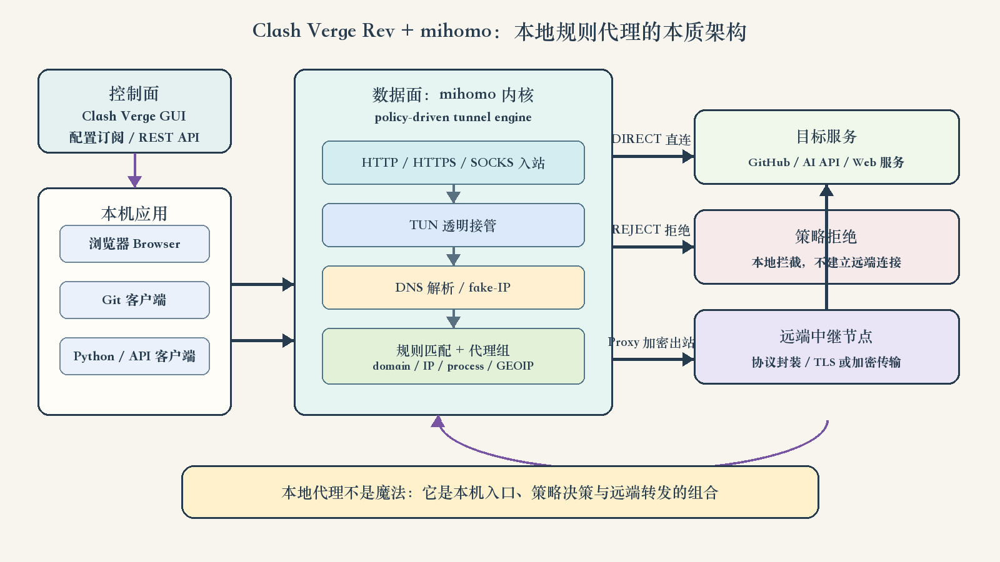

# 目录

[1.如何从本质上理解 Clash Verge、代理、隧道与 VPN？](#q-001)
  - [面试问题：Clash Verge Rev 的本质架构是什么？GUI、mihomo 内核、代理节点分别负责什么？](#q-002)
  - [面试问题：系统代理与 TUN 模式如何接管流量？二者有什么本质区别？](#q-003)
  - [面试问题：HTTP 代理、HTTPS 代理、HTTP CONNECT 与 SOCKS5 如何转发请求？TLS 在哪里终止？](#q-004)
  - [面试问题：Clash 类规则代理如何处理 DNS？fake-IP、DNS 泄漏和污染分别是什么？](#q-005)
  - [面试问题：规则匹配、代理组与远端节点如何共同决定一条连接的去向？](#q-006)
  - [面试问题：本地代理连接失败时，如何按分层思路定位端口、配置、DNS、规则、节点和目标站问题？](#q-007)
  - [面试问题：为什么代理不等于匿名、加密或安全？如何划分信任边界？](#q-008)
  - [面试问题：正向代理、反向代理、VPN、NAT 和 SSH 隧道有什么区别？](#q-009)

---

<h1 id="q-001">1.如何从本质上理解 Clash Verge、代理、隧道与 VPN？</h1>

<h2 id="q-002">面试问题：Clash Verge Rev 的本质架构是什么？GUI、mihomo 内核、代理节点分别负责什么？</h2>

**难度评分：⭐⭐⭐ (3/5)  |  考察频率：⭐⭐⭐⭐ (4/5)**

### 核心判断

Clash Verge Rev 不是“VPN 协议”本身，也不是一个能够凭空改变网络的按钮。它本质上是一个基于 Tauri 的桌面控制界面，负责配置管理、状态展示、系统集成和生命周期管理；真正处理连接、DNS、规则与出站选择的是其内置的 mihomo 内核；真正把流量转发到目标网络的，通常是远端代理节点。

因此，这类客户端最好拆成三层理解：

1. **控制面**：GUI、订阅、配置合并、策略切换、日志与 REST API。它决定“希望系统怎样工作”。
2. **数据面**：本地 mihomo 内核监听代理端口或虚拟网卡，解析入站连接，执行 DNS 与规则匹配，再建立相应出站连接。它决定“每一个包或连接实际怎样走”。
3. **传输与出口面**：直连互联网，或使用 Shadowsocks、Trojan、VMess、VLESS、Hysteria、TUIC 等协议与远端节点通信。它决定“最终从哪个网络出口到达目标”。

下图把这三层放进同一条因果链。控制面只下发意图，数据面才处理流量；规则结果可以是 `DIRECT`、`REJECT` 或某个代理组，并不是所有请求都会经过同一个远端节点。

<div align="center">



</div>

### 一条 HTTPS 请求实际经历了什么

以 Git 访问 GitHub 为例，一条典型链路可以抽象为：

```text
Git 进程
  -> 本地 HTTP/SOCKS 代理端口，或被 TUN 虚拟网卡接管
  -> mihomo 获取目标域名、IP、端口、进程等上下文
  -> DNS 与规则引擎决定 DIRECT / REJECT / 代理组
  -> 选择具体远端节点并建立出站连接
  -> 目标 GitHub 服务
  -> 响应沿连接反向返回
```

这里至少存在两条 TCP 连接：应用到本地代理的连接，以及本地内核到目标或远端节点的连接。使用远端节点时，还可能叠加一个代理协议的加密会话。把它错误地看成一条“端到端直连”，就很难解释为什么本地端口、规则、节点和目标站会分别产生不同错误。

### 跨周期价值

Clash Verge 的界面和版本会变化，但“控制面与数据面分离、入站接管、策略决策、出站转发、可观测性”这套框架不会轻易过时。它同样适用于服务网格、API Gateway、零信任访问代理、云网络网关和 Agent 出站沙箱。

**面试中可以用一句话收束：Clash Verge 是控制面，mihomo 是本地数据面，代理节点是远端转发面；代理的本质不是换一个 IP，而是对连接建立、策略选择与出口路径进行重新编排。**

<h2 id="q-003">面试问题：系统代理与 TUN 模式如何接管流量？二者有什么本质区别？</h2>

**难度评分：⭐⭐⭐⭐ (4/5)  |  考察频率：⭐⭐⭐⭐ (4/5)**

### 系统代理：让“支持代理的应用”主动连接本地监听端口

系统代理通常向操作系统写入一个 HTTP、HTTPS 或 SOCKS 代理地址，例如 `127.0.0.1:7897`。支持系统代理的应用读取该设置后，不再直接连接目标站，而是主动连接这个本地端口，并通过 HTTP 代理或 SOCKS 协议告诉内核自己的目标。

它的优势是路径清晰、开销较小、调试容易；局限是应用必须尊重系统代理设置。某些命令行工具、游戏、容器、硬编码直连程序或 UDP 流量可能绕过它。环境变量 `HTTP_PROXY`、`HTTPS_PROXY`、`ALL_PROXY` 与 Git 的 `http.proxy` 也属于应用层显式配置，它们和桌面的“系统代理开关”并不天然同步。

### TUN：把内核看到的 IP 包交给用户态网络栈

TUN 是三层虚拟网络接口。操作系统通过路由表把选中的 IP 包送入 TUN，mihomo 等用户态程序从虚拟接口读取这些包，恢复连接语义，再通过直连或代理出站发送。Linux 内核文档对其边界描述很清楚：TUN 处理 IP 帧，TAP 处理以太网帧。

TUN 的价值是透明接管：即使应用完全不知道代理的存在，只要路由命中 TUN，流量仍可被处理。代价是系统权限、路由、DNS、MTU、IPv6、UDP 和环路规避都更复杂，也更容易与公司 VPN、虚拟机、容器网络或其他虚拟网卡冲突。

两种模式的核心区别如下。

<div align="center">

| 维度 | 系统代理 / 显式代理 | TUN / 透明接管 |
|---|---|---|
| 接管层级 | 应用层主动使用代理协议 | 网络层通过路由接管 IP 包 |
| 应用配合 | 需要应用支持或单独配置 | 通常不需要应用感知 |
| UDP 覆盖 | 取决于应用和代理协议 | 更适合统一接管，但实现更复杂 |
| 目标信息 | HTTP/SOCKS 可直接携带域名 | 可能只看到目标 IP，需要 DNS 映射或嗅探辅助 |
| 运维复杂度 | 低，故障边界清晰 | 高，涉及路由、虚拟网卡、权限、MTU 与 DNS |
| 典型盲区 | 不遵循系统代理的程序 | 排除路由、局域网、虚拟网卡冲突和回环流量 |

</div>

`mixed-port` 只表示同一个本地端口可以识别多种显式代理协议，它并不等于 TUN，也不会自动接管所有程序。反过来，开启 TUN 也不意味着系统代理配置不再存在；两个入口可能同时启用，但必须避免重复接管与代理内核自身流量形成环路。

**面试中可以用一句话收束：系统代理改变的是应用的连接目标，TUN 改变的是操作系统的路由结果；前者显式、简单，后者透明、覆盖广，但系统工程复杂度更高。**

<h2 id="q-004">面试问题：HTTP 代理、HTTPS 代理、HTTP CONNECT 与 SOCKS5 如何转发请求？TLS 在哪里终止？</h2>

**难度评分：⭐⭐⭐⭐ (4/5)  |  考察频率：⭐⭐⭐⭐⭐ (5/5)**

### HTTP 与 HTTPS 代理最容易被误解的地方

配置中的 `HTTPS_PROXY=http://127.0.0.1:7897` 并不矛盾。左侧的 `HTTPS_PROXY` 表示“用于 HTTPS 目标请求的代理设置”，右侧的 `http://` 表示“客户端如何与代理端口对话”。访问 HTTPS 目标时，客户端通常先向 HTTP 代理发送：

```http
CONNECT github.com:443 HTTP/1.1
Host: github.com:443
```

代理建立到目标的 TCP 连接并返回成功后，这条连接切换为双向字节隧道。随后客户端才在隧道内与 `github.com` 进行 TLS 握手。按照 HTTP 语义规范，`CONNECT` 的成功响应会把连接切换到 tunnel mode；普通转发代理若不主动做 TLS 中间人解密，就看不到加密后的 HTTP 路径、请求体和响应体。

因此需要区分两个概念：

- **HTTPS over HTTP proxy**：应用到代理使用 HTTP `CONNECT`，TLS 仍在应用与目标站之间终止。
- **HTTPS proxy**：应用到代理本身也使用 TLS，再在其中请求建立隧道。这保护的是“客户端到代理”这一跳，但部署更少见。

### SOCKS5 是更通用的传输层中间层

RFC 1928 把 SOCKS5 定义为位于应用层与传输层之间的 shim layer。客户端先协商认证方式，再发送 `CONNECT`、`BIND` 或 `UDP ASSOCIATE` 请求，并可携带 IPv4、IPv6 或域名目标。SOCKS5 不理解 HTTP 业务语义，因此能为 SSH、数据库连接及其他 TCP 应用提供通用转发。

`socks5://` 与 `socks5h://` 的差别常出现在命令行工具中：前者一般由本地应用先解析域名再把 IP 交给代理，后者把域名交给 SOCKS 代理侧解析。后者有助于保持域名规则上下文并减少本地 DNS 泄漏，但具体行为仍取决于客户端实现。

### TLS 与代理协议的加密不是同一层

一次代理访问可能同时存在两种加密：

1. 应用与目标站之间的 TLS，保护 HTTPS 内容与目标身份验证。
2. 本地内核与远端代理节点之间的代理协议加密或 TLS 封装，保护这一段传输并隐藏原始流量形态的一部分。

两者不能互相替代。如果最终访问的是明文 HTTP，即使代理节点链路加密，远端节点到目标站之间仍可能是明文；如果客户端安装并信任了中间人 CA，代理也可能终止 TLS 并检查内容。判断安全性时必须问清楚：哪一段被加密、证书由谁验证、TLS 在哪里终止。

**面试中可以用一句话收束：HTTP CONNECT 建立的是字节隧道，SOCKS5提供的是通用目标转发，而 TLS 保护哪一段连接取决于其真正的终止点。**

<h2 id="q-005">面试问题：Clash 类规则代理如何处理 DNS？fake-IP、DNS 泄漏和污染分别是什么？</h2>

**难度评分：⭐⭐⭐⭐ (4/5)  |  考察频率：⭐⭐⭐⭐ (4/5)**

### DNS 不是代理之外的附属步骤，而是策略输入

域名请求在真正建立连接前通常要变成 IP。若应用先使用本地系统 DNS 得到 IP，代理内核可能只看到一个地址，丢失域名规则所需的上下文；若 DNS 返回了被污染、错误地区或不可达的地址，即使代理节点正常，连接也可能失败。

Clash 类内核通常内置 DNS 服务，可选择普通 UDP/TCP DNS、DoT 或 DoH 上游。RFC 8484 定义的 DoH 把 DNS 查询响应映射到 HTTPS 交换，主要收益是防止路径上的明文窥探与篡改，但它不会自动证明解析结果适合当前业务，也不会消除 DoH 服务商的可见性。

### redir-host 与 fake-IP 的思路

- **redir-host 类思路**：先得到真实 IP，再用域名与 IP 映射辅助规则和转发。语义直观，但域名恢复、缓存和多 IP 场景可能复杂。
- **fake-IP 类思路**：内核先给应用返回一个保留地址池中的“占位 IP”，同时保存 `域名 <-> fake-IP` 映射。应用随后连接这个占位地址时，内核可以恢复原始域名，再按域名规则选择出站并在合适一侧完成真实解析。

fake-IP 的本质不是伪造公网身份，而是延迟真实解析并保留域名语义。它可能与局域网域名、硬编码 IP 校验、某些游戏或局域网发现协议冲突，因此需要旁路域名清单或针对性回退。

### 三类高频问题要分开

1. **DNS 污染或劫持**：查询响应被路径中间设备伪造、篡改或错误重定向，得到错误地址。
2. **DNS 泄漏**：本应由受控路径解析的域名却交给了本地 ISP、企业 DNS 或其他非预期解析器，暴露访问意图或产生分流错误。
3. **DNS 回环依赖**：代理访问 DoH 上游本身又需要先通过同一套未建立的 DNS 或代理路径解析，形成启动死锁。工程上需要 bootstrap DNS、IP 直连或明确的解析器依赖顺序。

DNS 诊断不能只看 `ping`。应分别验证系统解析器、代理内置解析器、规则命中的域名、最终连接使用的 IP，以及 DNS 请求究竟走直连还是代理。

**面试中可以用一句话收束：DNS 决定的不只是“域名对应哪个 IP”，还决定代理规则有没有足够上下文；fake-IP 的核心价值是保留域名语义并把真实解析延迟到策略决策之后。**

<h2 id="q-006">面试问题：规则匹配、代理组与远端节点如何共同决定一条连接的去向？</h2>

**难度评分：⭐⭐⭐⭐ (4/5)  |  考察频率：⭐⭐⭐⭐ (4/5)**

### 规则引擎是有顺序的决策系统

规则代理通常从连接元数据中抽取域名、目标 IP、端口、进程、网络类型和地理数据库标签，然后自上而下匹配规则。常见动作包括：

- `DIRECT`：本机直接连接目标。
- `REJECT`：本地拒绝连接，不再访问远端。
- 指向代理组：由代理组进一步选择具体节点。
- `MATCH`：作为兜底规则接收此前未命中的流量。

这不是“规则越多越高级”。规则越多，冲突、过期、误分流和匹配成本越难控制。真正有跨周期价值的是：按业务边界组织规则，保留可解释的优先级，为最终兜底策略负责。

### 代理组是策略，不是节点列表的别名

一个代理组可以实现手动选择、延迟测试、故障转移、负载均衡或多级嵌套。以故障转移为例，健康检查只能证明某个探测 URL 在某一时刻可访问，不能保证所有目标站、所有协议和长连接都正常；延迟最低也不等于吞吐最高、丢包最低或最稳定。

因此，一条连接的结果是以下因素共同作用：

```text
入站元数据
  -> DNS 与域名上下文
  -> 首条命中规则
  -> 代理组策略
  -> 具体节点健康与协议握手
  -> 目标站响应
```

如果日志显示 `DIRECT`，更换代理节点不会解决问题；如果规则已选择代理组，但节点握手失败，修改系统代理端口也不会解决问题。分层日志的意义就在于明确失败发生在哪一个决策阶段。

### 规则系统与 AI 基础设施的关系

在 AI 工程中，模型 API、GitHub、Hugging Face、对象存储和企业内网往往需要不同出口策略。可维护的做法是按数据敏感度、合规边界、时延、成本和可用性定义策略组，并通过日志验证命中，而不是把所有流量永久设为“全局代理”。同样的思想也适用于 Agent 工具调用的域名白名单与出站策略。

**面试中可以用一句话收束：规则决定去哪个策略，代理组决定策略内选哪个节点；第一条命中、健康检查语义和兜底动作共同决定最终路径。**

<h2 id="q-007">面试问题：本地代理连接失败时，如何按分层思路定位端口、配置、DNS、规则、节点和目标站问题？</h2>

**难度评分：⭐⭐⭐⭐ (4/5)  |  考察频率：⭐⭐⭐⭐⭐ (5/5)**

### 先读错误对象，再决定检查哪一层

代理排障最常见的低效方式是不断切换节点。高效方法是先问：错误中的主机和端口是谁？失败发生在 DNS、TCP、代理握手、TLS 还是 HTTP 业务层？

例如：

```text
Failed to connect to 127.0.0.1 port 7890: Connection refused
```

这里失败对象是本机回环地址，不是 GitHub，也不是远端节点。`Connection refused` 通常表示该地址可达，但没有进程监听这个端口，或监听协议/地址不匹配。若当前代理实际监听 `7897`，而 Git 仍保存 `7890`，根因是客户端配置漂移。此时换远端节点没有意义，因为请求根本尚未进入代理内核。

### 七层排查顺序

<div align="center">

| 层级 | 要回答的问题 | 只读验证示例 | 典型现象 |
|---|---|---|---|
| 1. 客户端配置 | 应用实际读到哪个代理？ | `git config --show-origin --get-regexp '.*proxy.*'`、检查代理环境变量 | 仍引用旧端口、不同工具行为不一致 |
| 2. 本地监听 | 地址、端口和协议是否有人监听？ | `nc -zv 127.0.0.1 7897`、`lsof -nP -iTCP:7897 -sTCP:LISTEN` | `connection refused` |
| 3. 代理握手 | HTTP/SOCKS 协议是否与端口匹配？ | `curl --proxy http://127.0.0.1:7897 https://example.com` | 握手乱码、认证失败、CONNECT 失败 |
| 4. DNS | 域名在哪里解析，结果是否正确？ | `dig`、代理日志、对比本地与远端解析 | 域名失败、误分流、错误 IP |
| 5. 规则 | 请求命中了 DIRECT、REJECT 还是代理组？ | 查看连接日志中的规则与出站 | 节点正常但请求走了直连或拒绝 |
| 6. 节点 | 到节点的网络和协议握手是否成功？ | 内核日志、健康检查、多个已知目标交叉验证 | 超时、认证或协议握手失败 |
| 7. 目标业务 | 目标站是否可用、鉴权是否正确？ | HTTP 状态码、TLS 证书、API 错误体 | `401`、`403`、`421`、`429`、`5xx` |

</div>

### HTTP 状态码不等于网络失败

能收到 `401`、`403`、`404`、`421` 或 `429`，通常说明 DNS、TCP、代理隧道与 TLS 至少已经走到目标服务或其网关。此时应分析路径、Host/SNI、认证、配额和业务语义，而不是笼统宣称“VPN 不可用”。反过来，`connection refused`、连接超时、TLS alert 与 HTTP `5xx` 也不能混为一类。

### 可重复的最小验证矩阵

排查时至少选择三类目标：公网 IP 查询服务、稳定的静态网站、实际业务 API。这样可以分辨“代理整体不可用”“特定域名规则错误”“特定服务拒绝请求”。对于 Git，可用 `git ls-remote --heads origin` 做只读传输检查；它能验证网络和远端读取，但不能证明当前分支一定有推送权限。

任何修改前都应先用 `--show-origin` 或等价手段找到配置来源，因为系统代理、Shell 环境变量、Git 全局配置、仓库配置、应用内配置可能同时存在。修复要对准实际生效层，而不是继续叠加配置。

**面试中可以用一句话收束：先定位失败对象和协议阶段，再沿“客户端配置 -> 本地监听 -> 代理握手 -> DNS -> 规则 -> 节点 -> 目标业务”逐层收敛；错误文本本身就是最短路径。**

<h2 id="q-008">面试问题：为什么代理不等于匿名、加密或安全？如何划分信任边界？</h2>

**难度评分：⭐⭐⭐⭐ (4/5)  |  考察频率：⭐⭐⭐⭐ (4/5)**

### 代理改变路径，但不自动建立完整安全属性

“使用代理”只说明连接经过了一个中间转发点。它不自动保证以下任何一项：

- **匿名性**：目标站仍可通过账号、Cookie、浏览器指纹、行为模式和其他标识关联用户；代理提供商也能看到来源 IP 与连接元数据。
- **机密性**：只有正确使用并验证 TLS，应用内容才具备端到端机密性。明文协议在代理出口后仍可能暴露。
- **完整性**：忽略证书错误、安装不可信根证书或使用被篡改客户端，都会破坏内容完整性。
- **可用性**：代理引入了本地内核、节点、订阅、规则和 DNS 等额外依赖，故障面反而更大。
- **合规性**：流量经第三方地域或节点转发可能改变数据跨境、审计和服务条款风险。

### 信任边界至少有五个

1. **本机应用与操作系统**：环境变量、证书库、恶意软件和本地高权限进程可能读取或改写流量。
2. **代理客户端与内核**：二进制来源、更新机制、配置脚本和 REST 控制端口决定本地信任。
3. **配置与订阅提供方**：订阅可以改变节点、规则和 DNS，实质上具有重塑流量路径的能力。
4. **远端节点运营方**：即使看不到 HTTPS 内容，也能观察连接时间、流量大小、目标 IP；对明文流量可见范围更大。
5. **目标服务与身份系统**：目标仍掌握账号、请求内容和应用层日志。

工程上应采用最小暴露：本地监听默认绑定回环地址；若开启局域网访问，要设置认证与防火墙；控制 API 不应无认证暴露；订阅、密钥与配置文件要限制权限；保持 TLS 证书校验；对敏感业务明确禁止经过未知节点。

### 流量分析仍然存在

即使内容加密，包长、时序、连接目标和持续时间仍可能泄漏模式。关于网站指纹、加密流量分类的研究长期说明：加密解决的是内容机密性，不等于消除所有侧信道。现代 HTTP/3 与 QUIC 也会改变传输特征和 UDP 覆盖要求，但不会取消端点、DNS、元数据和信任边界问题。

**面试中可以用一句话收束：代理提供路径重定向，TLS提供特定连接段的机密性与完整性，匿名性和合规性则取决于身份、元数据与信任关系；四者不能画等号。**

<h2 id="q-009">面试问题：正向代理、反向代理、VPN、NAT 和 SSH 隧道有什么区别？</h2>

**难度评分：⭐⭐⭐ (3/5)  |  考察频率：⭐⭐⭐⭐⭐ (5/5)**

这些技术都会“改变流量路径”，但服务对象、工作层级和控制目标不同。跨周期理解的关键不是背工具名，而是回答三个问题：谁主动配置中间层、谁被隐藏、转发依据是什么。

<div align="center">

| 技术 | 主要服务对象 | 典型工作方式 | 隐藏或抽象的对象 | 代表场景 |
|---|---|---|---|---|
| 正向代理 | 客户端 | 客户端显式连接代理，或由 TUN 透明接管 | 对目标隐藏或改变客户端网络出口 | Clash、企业出站代理 |
| 反向代理 | 服务端 | 客户端访问统一入口，入口再选择后端 | 对客户端隐藏后端实例与拓扑 | Nginx、API Gateway、负载均衡 |
| VPN | 网络或设备 | 建立虚拟网络接口与加密隧道，按路由承载多个应用 | 抽象出远端网络或设备级安全边界 | 企业组网、远程接入、WireGuard |
| NAT | 网络边界 | 改写 IP 和端口并维护映射状态 | 在地址层复用公网地址 | 家庭路由器、云 VPC 出口 |
| SSH 隧道 | 单连接或指定端口 | 在已认证 SSH 会话中做本地、远程或动态端口转发 | 把指定服务映射到另一个端点 | 临时访问内网服务、SOCKS 动态转发 |

</div>

### Clash 的 TUN 模式为什么看起来像 VPN

两者都可能创建虚拟网卡、修改路由并透明接管应用流量，所以操作体验相似。但传统 VPN 的核心抽象通常是把设备接入一个远端私有网络，强调网络层隧道、地址分配和对端网络路由；Clash 类 TUN 客户端则更强调把本机 IP 流量转换为连接，再执行按域名、IP、进程等规则选择不同出站。它可以表现得像 VPN 客户端，但内部策略模型更接近“透明的规则代理”。

### 正向代理与反向代理不要按软件区分

Nginx、Envoy 等软件既能承担反向代理，也可能提供正向代理能力；关键不是名字，而是谁代表谁。正向代理代表客户端向外访问，目标通常不知道真实连接路径；反向代理代表服务端接收访问，客户端通常不知道后端拓扑。

NAT 则更低层，它根据地址与端口改写维护映射，并不天然理解 HTTP 域名、代理组或应用身份。SSH 动态端口转发可在本地提供 SOCKS 入口，但其出站能力和策略生态与专用规则代理不同。

**面试中可以用一句话收束：正向代理隐藏客户端路径，反向代理隐藏服务端拓扑，VPN连接网络边界，NAT改写地址状态，SSH隧道复用已认证通道；它们能组合，但解决的不是同一个问题。**

### 参考资料

- Clash Verge Rev 官方仓库：[clash-verge-rev/clash-verge-rev](https://github.com/clash-verge-rev/clash-verge-rev)
- mihomo 官方仓库：[MetaCubeX/mihomo](https://github.com/MetaCubeX/mihomo)
- Linux Kernel Documentation：[Universal TUN/TAP device driver](https://www.kernel.org/doc/html/latest/networking/tuntap.html)
- RFC 1928：[SOCKS Protocol Version 5](https://www.rfc-editor.org/rfc/rfc1928)
- RFC 9110：[HTTP Semantics - CONNECT](https://www.rfc-editor.org/rfc/rfc9110)
- RFC 8484：[DNS Queries over HTTPS](https://www.rfc-editor.org/rfc/rfc8484)
- tun2socks 官方仓库：[xjasonlyu/tun2socks](https://github.com/xjasonlyu/tun2socks)

